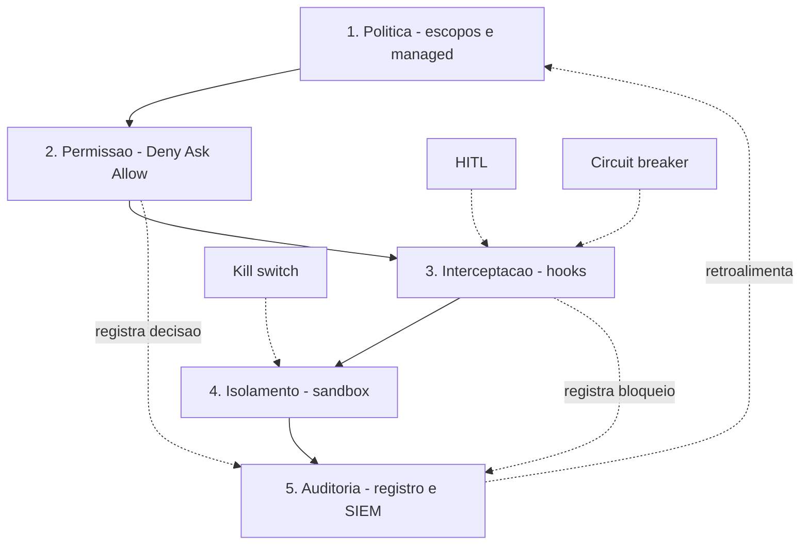

# Capítulo 10: O plano de voo: arquitetando a camada de controle da organização

## 1. Introdução

Você percorreu a camada de controle inteira: o contrato de execução (Capítulo 1), o ciclo de vida (2), a cascata de configuração (3), as três portas de permissão (4), a gramática dos hooks (5), a arte do bloqueio (6), o modelo de ameaças (7), o sandbox (8) e a governança enterprise (9). Este capítulo final amarra tudo: o plano de voo da organização — a arquitetura de governança que integra as peças, o comparativo entre harnesses que orienta a escolha, os padrões de design que sobrevivem à mudança de ferramenta, e o roadmap do Engenheiro de Governança Agêntica.

Você vai aprender o padrão de camadas completo — política, permissão, interceptação, isolamento e auditoria —, como avaliar e comparar harnesses pelo prisma da governança, os padrões de design maduros (kill switches, HITL, circuit breakers) e o caminho de adoção em três estágios [1][5][8][22]. Ao final, você será capaz de desenhar a camada de controle da sua organização e defender cada decisão com o vocabulário desta obra.

## 2. Explica

### A arquitetura de cinco camadas

A camada de controle de uma organização com agentes não é um arquivo — é uma arquitetura. As peças que você dominou nos nove capítulos se organizam em cinco camadas, cada uma com uma responsabilidade e uma pergunta [5][8]:

1. **Política** (Capítulos 3 e 9): quem define as regras. Escopos, precedência, política gerenciada.
2. **Permissão** (Capítulo 4): o que é permitido. Deny/Ask/Allow, modos de permissão.
3. **Interceptação** (Capítulos 5 e 6): o que é verificado no momento da ação. Matchers, handlers, bloqueio e reescrita.
4. **Isolamento** (Capítulo 8): o que é contido se tudo falhar. Sandbox, containers, deny-by-default.
5. **Auditoria** (Capítulos 2 e 9): o que é provado. Registro, cadeia de delegação, Compliance API.

As cinco camadas são complementares — nenhuma substitui a outra, e a falha de qualquer uma é coberta pela seguinte. É o princípio da defesa em profundidade que você viu em ação desde o Capítulo 1, agora em escala arquitetural [10][11].

### Os padrões de design maduros

Três padrões aparecem em toda arquitetura de governança bem-sucedida:

**Kill switch.** A chave que derruba tudo em emergência: desliga agentes, corta rede, congela pipelines — em segundos, sem depender de humanos distribuídos. É o `rm -rf` reverso: destrutivo por design, mas para o atacante.

**Human-in-the-loop (HITL).** O ponto de aprovação humana obrigatório antes de ações de alto impacto — deploys em produção, operações irreversíveis, mudanças de escopo de acesso. O HITL não é opcional em operações maduras: é a materialização da responsabilidade [14][16].

**Circuit breaker.** A interrupção automática ao detectar anomalia — volume anômalo de chamadas, desvio do plano, falha em cascata. Você já construiu um no Capítulo 2 (limite de fan-out); o padrão se generaliza para qualquer métrica [8].

### O comparativo multi-harness

A última peça conceitual: a escolha de harness não é estética — é uma decisão de governança. Os harnesses diferem em onde colocam o controle e como o expõem [1][20][22][29][30]:

- **Claude Code:** a referência de profundidade — cascata de settings, Deny>Ask>Allow, hooks JSON/exit codes, política gerenciada e sandbox nativo.
- **OpenCode:** config.json central, plugins e hooks programáticos — governança via código e configuração.
- **Cursor:** `.cursor/rules/*.mdc` com glob patterns — governança por regras de contexto, delegando hooks ao ecossistema de extensões.
- **Windsurf/Cascade:** `.windsurfrules` e hooks.json com doze eventos e bloqueio por exit code 2 — o mais próximo do modelo do Claude Code entre os concorrentes.
- **GitHub Copilot:** `copilot-instructions.md` e AGENTS.md — governança orientada a política de organização e fluxo de PR, guardrails na nuvem.
- **Cline/Roo Code:** auto-aprovação por categoria de risco, allowedCommands/deniedCommands com longest-prefix — granularidade no fluxo do VS Code.

A lição do comparativo: nenhum harness é "o mais seguro" em abstrato — o mais seguro é o que você consegue operar com as cinco camadas ativas. Um harness com hooks poderosos mas que você não audita é menos seguro que um com hooks modestos e auditoria real [10].

## 3. Ilustra

O plano de voo da organização é o **manual de operações do espaço aéreo nacional**: um documento único que integra a regra do regulador (política), os corredores (permissão), os procedimentos de interceptação (hooks), a zona de quarentena (sandbox) e a caixa-preta (auditoria) — e que vale para todas as companhias, em todos os aeroportos, com a mesma linguagem.

Como Engenheiro de Governança Agêntica, você não é mais o controlador de uma torre — você é o autor do manual. E o teste do manual é a pergunta que este livro inteiro preparou: se uma aeronave nova (um harness novo, um agente novo, uma equipe nova) chegar amanhã, o manual diz exatamente onde ela voa, o que pode tocar, quem intercepta e o que fica registrado? Se sim, o plano de voo está pronto.



O diagrama é o manual: as cinco camadas em cascata, os três padrões de design pendurados onde agem, e a auditoria fechando o loop — o que a auditoria descobre realimenta a política. É a arquitetura viva, não um desenho estático.

## 4. Técnica

### O manifesto de governança: a fonte da verdade

Toda arquitetura precisa de uma fonte da verdade: um manifesto de governança versionado no repositório, que documenta as decisões e aponta para os artefatos concretos. O formato abaixo integra as cinco camadas em um único arquivo — o "manual" da seção Ilustra:

```yaml
# .claude/governanca/manifesto.yaml
# Fonte da verdade da camada de controle. Versao semantica; cada mudanca
# exige revisao da politica e atualizacao da auditoria.

versao: "1.0.0"
dono: "engenharia-de-plataforma"
revisado_em: "2026-08-06"

camadas:
  politica:
    escopo_principal: "managed"          # inegociavel: politica gerenciada
    allowManagedPermissionRulesOnly: true
    disableBypassPermissionsMode: true
  permissao:
    regra_global: "deny-by-default"       # negar por padrao, permitir por excecao
    classes_permitidas:
      - "Bash(npm run *)"
      - "Bash(git status)"
    classes_exigem_humano:
      - "Bash(git push *)"
      - "Bash(npm publish *)"
  interceptacao:
    hooks_ativos:
      - evento: "PreToolUse"
        matcher: "Bash"
        script: ".claude/hooks/guardrail-bash.py"
        acao: "bloquear com stderr"
      - evento: "Stop"
        matcher: ""
        script: ".claude/hooks/gate-testes.py"
        acao: "bloquear turno se testes falharem"
  isolamento:
    sandbox: { enabled: true, network_deny_default: true }
    container: "efemero por tarefa, read-only, cap-drop ALL"
  auditoria:
    coletor: ".claude/hooks/coletor-auditoria.py"
    destino: "SIEM corporativo via Compliance API"
    retencao: "180 dias"

padroes:
  kill_switch: { trigger: "on-call security", efeito: "desliga agentes e corta rede" }
  hitl: { acoes: ["push prod", "publish", "drop database"], aprovador: "lider tecnico" }
  circuit_breaker: { metrica: "subagentes ativos", limite: 4, acao: "bloquear fan-out" }
```

O manifesto não é decoração: é o contrato que a auditoria valida e que o onboarding de novas equipes lê. Sem manifesto, cada equipe reinventa a governança — com ele, a arquitetura é uma decisão organizacional, não individual [13].

### O validador do manifesto

O manifesto vira código: um validador que checa se os artefatos prometidos existem e estão ativos — a auto-validação da arquitetura inteira:

```python
#!/usr/bin/env python3
"""Valida o manifesto de governanca: artefatos existem e estao ativos."""
import os
import sys
import yaml  # type: ignore


def carregar_manifesto(caminho: str) -> dict:
    with open(caminho, encoding="utf-8") as arquivo:
        return yaml.safe_load(arquivo)


def validar_artefatos(manifesto: dict, raiz: str) -> list[str]:
    """Retorna a lista de artefatos faltantes."""
    faltantes = []
    camadas = manifesto.get("camadas", {})

    for hook in camadas.get("interceptacao", {}).get("hooks_ativos", []):
        script = hook.get("script", "")
        if script and not os.path.exists(os.path.join(raiz, script)):
            faltantes.append(f"hook ausente: {script}")

    coletor = camadas.get("auditoria", {}).get("coletor", "")
    if coletor and not os.path.exists(os.path.join(raiz, coletor)):
        faltantes.append(f"coletor ausente: {coletor}")

    return faltantes


def main() -> int:
    manifesto_path = sys.argv[1] if len(sys.argv) > 1 else ".claude/governanca/manifesto.yaml"
    raiz = sys.argv[2] if len(sys.argv) > 2 else "."

    manifesto = carregar_manifesto(manifesto_path)
    print(f"Manifesto v{manifesto.get('versao', '?')} - dono: {manifesto.get('dono', '?')}")

    if not manifesto.get("camadas", {}).get("politica", {}).get("allowManagedPermissionRulesOnly"):
        print("  [AVISO] allowManagedPermissionRulesOnly nao ativo: politica pode ser contornada")

    faltantes = validar_artefatos(manifesto, raiz)
    if faltantes:
        for item in faltantes:
            print(f"  [FALHA] {item}")
        return 1

    print("  [OK] todos os artefatos de governanca presentes e validos")
    return 0


if __name__ == "__main__":
    sys.exit(main())
```

Rode o validador no CI da organização: se o manifesto promete um guardrail e ele some, o pipeline falha. É a mesma disciplina do gate de testes do Capítulo 2 — agora aplicada à própria governança [6].

### O comparativo em código: a matriz de decisão de harness

A escolha de harness vira uma tabela decisória: pontue cada candidato nas cinco camadas e escolha o que soma mais onde você tem mais risco [10]:

```python
#!/usr/bin/env python3
"""Matriz de decisao de harness pelo prisma das cinco camadas."""
import json
import sys

CAMADAS = ["politica", "permissao", "interceptacao", "isolamento", "auditoria"]

HARNESSES = {
    "claude_code": {
        "politica": 5, "permissao": 5, "interceptacao": 5,
        "isolamento": 5, "auditoria": 5,
    },
    "opencode": {
        "politica": 4, "permissao": 4, "interceptacao": 4,
        "isolamento": 3, "auditoria": 3,
    },
    "cursor": {
        "politica": 4, "permissao": 3, "interceptacao": 2,
        "isolamento": 2, "auditoria": 3,
    },
    "windsurf": {
        "politica": 4, "permissao": 4, "interceptacao": 4,
        "isolamento": 3, "auditoria": 3,
    },
    "copilot": {
        "politica": 4, "permissao": 3, "interceptacao": 2,
        "isolamento": 3, "auditoria": 4,
    },
    "cline": {
        "politica": 3, "permissao": 5, "interceptacao": 3,
        "isolamento": 3, "auditoria": 3,
    },
}


def pontuar(harness: str, pesos: dict[str, int]) -> tuple[int, dict[str, int]]:
    """Pontua um harness com pesos por camada conforme o perfil de risco."""
    notas = HARNESSES.get(harness, {})
    total = 0
    detalhe = {}
    for camada in CAMADAS:
        valor = notas.get(camada, 0) * pesos.get(camada, 1)
        detalhe[camada] = valor
        total += valor
    return total, detalhe


def main() -> int:
    # Perfil: organizacao financeira -> peso alto em isolamento e auditoria.
    pesos = {"politica": 3, "permissao": 3, "interceptacao": 3, "isolamento": 4, "auditoria": 4}
    ranking = sorted(
        ((pontuar(h, pesos)[0], h) for h in HARNESSES),
        reverse=True,
    )
    for total, harness in ranking:
        detalhe = pontuar(harness, pesos)[1]
        print(f"{harness:12s} total={total:3d}  {json.dumps(detalhe, ensure_ascii=False)}")
    return 0


if __name__ == "__main__":
    sys.exit(main())
```

O resultado não é "o melhor harness" — é "o melhor harness *para o seu perfil*": numa organização financeira, isolamento e auditoria pesam mais, e o ranking muda. A matriz é o instrumento de decisão honesto, em vez da opinião de mercado [10][11].

### O roadmap em três estágios

A adoção da camada de controle não é um big bang — é um plano de voo em três estágios, cada um com entregável verificável:

**Estágio 1 — Individual (semanas 1-2).** O engenheiro protege a própria máquina: permissões deny-by-default, guardrail de secrets, gate de testes no Stop. Entregável: os guardrails dos Capítulos 4-6 ativos na máquina de dev.

**Estágio 2 — Time (semanas 3-6).** O contrato vira coletivo: cascata de settings no repositório, hooks compartilhados, coletor de auditoria, manifesto v1. Entregável: o settings.json do projeto + manifesto validado no CI.

**Estágio 3 — Organização (semanas 7-12).** A governança vira política: managed com as duas chaves, Compliance API no SIEM, SCIM provisionando identidade, kill switch operacional. Entregável: o tripé do Capítulo 9 ativo e auditado [5][6].

### O treinamento do time: a capacitação do Engenheiro de Governança

A camada de controle não se sustenta sozinha — ela depende de pessoas que a operam. O programa de capacitação do Engenheiro de Governança Agêntica tem três trilhas: a trilha operador (todo dev que usa agente), a trilha guardião (quem escreve guardrails) e a trilha estrategista (quem desenha a política). Cada trilha tem competências verificáveis, e a verificação é prática: o candidato demonstra um bloqueio, escreve um guardrail, desenha uma política [12][13]:

```python
#!/usr/bin/env python3
"""Checklist de competencias por trilha do programa de capacitação."""
import sys

TRILHAS = {
    "operador": [
        "Le e respeita o manifesto de governanca",
        "Entende a diferenca entre deny, ask e allow",
        "Reconhece avisos de bloqueio e corrige a rota",
    ],
    "guardiao": [
        "Escreve guardrail de PreToolUse com matcher e exit code",
        "Testa a matriz de disparo antes de produzir",
        "Registra e inventaria cada hook",
    ],
    "estrategista": [
        "Desenha o modelo de ameacas da operacao",
        "Projeta a cascata de escopos e a politica gerenciada",
        "Compila o pacote de evidencia de compliance",
    ],
}


def main() -> int:
    print("Programa de capacitação — trilhas e competencias:")
    print("=" * 64)
    for trilha, competencias in TRILHAS.items():
        print(f"\n[{trilha.upper()}]")
        for competencia in competencias:
            print(f"  - {competencia}")
    print("=" * 64)
    print("Verificacao: demonstracao pratica, nao prova escrita — cada")
    print("competencia exige um artefato executavel revisado por um par.")
    return 0


if __name__ == "__main__":
    sys.exit(main())
```

A trilha guardião é a ponte entre os Capítulos 1-8 e a operação real: quem escreve guardrails precisa demonstrar o ciclo completo — escrever, testar, inventariar. E a trilha estrategista fecha o arco com o desenho da política — o capítulo 10 inteiro em uma competência verificável [12][13].

### O processo de decisão arquitetural: quando adotar um novo padrão

A última competência do estrategista é o processo de decisão: quando uma nova técnica, um novo padrão ou um novo harness se apresenta, como decidir sem ruído? O processo de decisão arquitetural (ADR) adaptado à governança tem seis etapas: contexto, alternativas, decisão, consequências, revisão e reversão. O registro abaixo mostra o formato — a mesma disciplina do mapa de decisões, agora aplicada no momento da escolha [12][13]:

```python
#!/usr/bin/env python3
"""Registro de decisao arquitetural (ADR) de governanca."""
import json
import sys

ADR = {
    "id": "ADR-007",
    "titulo": "Adotar deny-by-default em vez de allow-by-default",
    "status": "aceita",
    "contexto": "aumento de incidentes de exfiltracao com allow amplo de rede",
    "alternativas": [
        "allow-by-default com deny especifico",
        "deny-by-default com allow especifico",
        "lista hibrida por ferramenta",
    ],
    "decisao": "deny-by-default para rede e filesystem; allows por excecao documentada",
    "consequencias": "fricao inicial no fluxo; reducao de superficie de ataque; excecoes auditaveis",
    "revisao": "2026-08-06",
    "reversao": "reverter exige novo ADR com evidencia de custo operacional excessivo",
}


def main() -> int:
    print(json.dumps(ADR, ensure_ascii=False, indent=2))
    print()
    print("O ADR registra o porquê: contexto, alternativas consideradas e")
    print("consequencias — a memoria arquitetural da camada de controle.")
    return 0


if __name__ == "__main__":
    sys.exit(main())
```

O ADR é a disciplina que impede a decisão por moda: cada escolha arquitetural tem contexto registrado, alternativas comparadas e consequências assumidas. Quando o próximo engenheiro perguntar "por que deny-by-default?", o ADR responde com a data, o contexto e o dono — em vez de "porque sempre foi assim" [12][13].

### A mensagem final: a torre é sua

O arco desta obra termina com a mensagem que a abriu: a torre de controle não limita a aviação — ela a torna possível. Sem a torre, cada voo seria uma aposta de navegação cega; com ela, o tráfego aéreo mais denso do mundo opera com segurança milimétrica. O mesmo vale para os agentes: a camada de controle que você construiu ao longo de dez capítulos — contrato, ciclo de vida, cascata, permissões, hooks, bloqueio, ameaças, sandbox, auditoria e plano de voo — não é um conjunto de amarras. É a condição de dar autonomia real aos agentes sem apostar a operação [1][8].

A mensagem final é de responsabilidade: a camada de controle é poder, e poder exige dono. O Engenheiro de Governança Agêntica que termina este livro não é o leitor que conhece conceitos — é o operador que assume a torre: escreve o manifesto, ativa as camadas, ensaia o incidente e revisa a política em ciclo. O plano de voo está completo, o manual está escrito e a torre está de pé. A decolagem é sua — e a autorização, agora, também é sua para conceder com sabedoria [8][12].

### O plano de voo em uma página: o resumo do estrategista

Para fechar, vale a disciplina do resumo: a camada de controle inteira — dez capítulos de arquitetura — deve caber em uma página que o estrategista usa para comunicar, decidir e revisar. O resumo tem cinco linhas, uma por camada: a política define quem manda (escopos e managed), a permissão define o que pode (deny primeiro, ask depois, allow por fim), a interceptação verifica na hora (hooks com matcher, handler e exit code), o isolamento contém o pior (sandbox, container, deny-by-default) e a auditoria prova o que aconteceu (registro, cadeia de delegação, SIEM). As três linhas seguintes registram os padrões: o kill switch derruba em emergência, o HITL decide o que é caro, o circuit breaker corta a anomalia [1][5][8].

O resumo em uma página é o teste final de coerência da obra: se as oito linhas fazem sentido para você — e você consegue defendê-las com o detalhe dos capítulos —, o plano de voo está assimilado. O resumo também é o instrumento de comunicação com quem não leu o livro: o executivo que aprova o orçamento, o colega que precisa do contexto, o novo membro do time que precisa do mapa antes do detalhe. A página de resumo é o plano de voo em forma de cartão de embarque: pequeno, completo e suficiente para começar a viagem [8][12].

### O teste final do plano de voo: a simulação de incidente

O plano de voo só é digno de confiança se sobreviver ao ensaio — e o ensaio é a simulação de incidente, o exercício que prova a camada de controle antes do incidente real. O padrão do exercício é o mesmo dos testes de fuga do Capítulo 8, aplicado à arquitetura inteira: um cenário de incidente é declarado (exfiltração, rogue agent, cascata), a equipe executa o runbook do Capítulo 9, e a análise mede o tempo de detecção, o tempo de contenção e as lacunas descobertas [6][11].

O valor da simulação é duplo. Primeiro, o treino: a equipe que já executou o kill switch em um cenário simulado executa em segundos no incidente real, enquanto a equipe que nunca ensaiou hesita — e no incidente agêntico, hesitação é propagação. Segundo, o diagnóstico: cada simulação revela uma lacuna — um alerta que não disparou, um passo do runbook que dependia de informação indisponível, uma identidade que o kill switch não revogou. A lacuna descoberta no ensaio é uma lacuna corrigida de graça; descoberta no incidente real, é o preço do aprendizado [6][11][12]. A cadência do ensaio — trimestral para a operação inteira, mensal para a equipe de resposta — mantém o plano de voo afiado, e o resultado de cada ensaio alimenta o modelo de ameaças e a política, fechando o ciclo de melhoria contínua que sustenta a camada de controle [12][13].

### A visão de futuro: o que vem depois da camada de controle

O livro termina, mas a disciplina continua evoluindo — e o Engenheiro de Governança Agêntica de 2026 já deve enxergar as próximas três ondas. A primeira é a governança autônoma: guardrails que se ajustam sozinhos — o painel detecta fricção excessiva e propõe o relaxamento; a auditoria detecta padrão de incidente e propõe o endurecimento; o humano aprova a mudança em vez de escrevê-la. É a aplicação do princípio do Capítulo 7 (least agency) à própria camada de controle: a governança começa com baixa autonomia e ganha agência conforme demonstra confiabilidade [8][12].

A segunda onda é a padronização da indústria: o mercado caminha para uma linguagem comum de governança agêntica — o AGENTS.md como formato aberto, os hooks como conceito universal, as camadas de permissão como vocabulário compartilhado. Quem domina os conceitos deste livro estará pronto para a padronização, porque ela não muda a física da camada — muda apenas a sintaxe. E a terceira onda é a colaboração humano-agente na governança: agentes que escrevem guardrails e humanos que os revisam, com a mesma disciplina de revisão de código que você aplicou aqui — o ciclo do guardião se automatizando sem perder o dono humano [8][12][13].

A visão de futuro não é especulação — é a direção das decisões que você vai tomar nos próximos meses. Cada guardrail que você escreve hoje é um passo na direção da governança autônoma; cada política documentada é um tijolo da padronização; cada revisão com um agente é a colaboração que vem. O capítulo final não encerra o aprendizado — abre a sua prática, e a prática é o que transforma a camada de controle em cultura.

### A operação contínua: o SRE da camada de controle

Depois do roadmap de adoção, vem a operação. A camada de controle é um sistema que precisa de monitoramento, alerta e manutenção — o equivalente ao SRE da governança. As três métricas que definem a saúde da camada são a taxa de bloqueio, a taxa de rejeição de asks e o tempo de resposta dos hooks. O painel abaixo resume as métricas e os alertas que o Engenheiro de Governança Agêntica monitora [6][10]:

```python
#!/usr/bin/env python3
"""Painel de saude da camada de controle: metricas e alertas."""
import json
import sys


def avaliar(metricas: dict) -> dict[str, list[str]]:
    """Avalia metricas e gera alertas por desvio dos limites aceitaveis."""
    alertas: dict[str, list[str]] = {}

    taxa_bloqueio = metricas.get("taxa_bloqueio", 0.0)  # fracao 0-1
    if taxa_bloqueio > 0.30:
        alertas["bloqueio"] = ["taxa de bloqueio acima de 30%: politica repressiva?"]

    taxa_rejeicao_ask = metricas.get("taxa_rejeicao_ask", 0.0)
    if taxa_rejeicao_ask < 0.05:
        alertas["ask"] = ["rejeicao quase zero: aprovador carimba sem avaliar?"]

    p95_hook_ms = metricas.get("p95_hook_ms", 0)
    if p95_hook_ms > 1000:
        alertas["lentidao"] = [f"p95 de hooks em {p95_hook_ms}ms: guardrail virou gargalo?"]

    cobertura_auditoria = metricas.get("cobertura_auditoria", 0.0)
    if cobertura_auditoria < 0.99:
        alertas["auditoria"] = ["cobertura de auditoria abaixo de 99%: ha evento sem registro"]

    return alertas


def main() -> int:
    metricas = {
        "taxa_bloqueio": 0.12,
        "taxa_rejeicao_ask": 0.02,
        "p95_hook_ms": 45,
        "cobertura_auditoria": 1.0,
    }
    alertas = avaliar(metricas)
    print("Metricas da camada de controle:")
    print(f"  taxa de bloqueio    : {metricas['taxa_bloqueio']:.0%}")
    print(f"  rejeicao de asks    : {metricas['taxa_rejeicao_ask']:.0%}")
    print(f"  p95 dos hooks       : {metricas['p95_hook_ms']}ms")
    print(f"  cobertura auditoria : {metricas['cobertura_auditoria']:.0%}")
    print()
    if alertas:
        for _, mensagens in alertas.items():
            for mensagem in mensagens:
                print(f"  [ALERTA] {mensagem}")
    else:
        print("  [OK] camada de controle saudavel")
    return 0 if not alertas else 1


if __name__ == "__main__":
    sys.exit(main())
```

As quatro métricas contam as quatro histórias da camada: bloqueio alto é política repressiva; rejeição zero é aprovação por inércia; hooks lentos são gargalo operacional; auditoria incompleta é evidência ausente. O ritual semanal — ler o painel, agir nos alertas, atualizar o manifesto — é a operação contínua que mantém a arquitetura viva [6][10].

### O comitê de adoção: governança de novos harnesses e agentes

A última peça da operação é o processo de adoção: nenhum harness novo, nenhum agente novo, nenhum MCP novo entra em produção sem passar pelo portão de governança. O checklist de adoção avalia o candidato contra as cinco camadas e contra o modelo de ameaças — a mesma disciplina da matriz de decisão, agora aplicada a cada candidato individual [8][10]:

```python
#!/usr/bin/env python3
"""Portao de adocao: avalia novo harness/agente/MCP contra as cinco camadas."""
import json
import sys

REQUISITOS = [
    ("politica", "suporta politica gerenciada com precedencia estrita?"),
    ("permissao", "suporta deny/ask/allow com precedencia Deny primeiro?"),
    ("interceptacao", "suporta hooks com exit codes e bloqueio real?"),
    ("isolamento", "suporta sandbox ou integra-se a containers?"),
    ("auditoria", "gera registros exportaveis para SIEM?"),
    ("identidade", "integra-se a SSO/SCIM com ciclo de vida?"),
]


def avaliar_candidato(respostas: dict[str, bool]) -> tuple[bool, list[str]]:
    """Retorna (aprovado, falhas) para um candidato."""
    falhas = [nome for nome, _ in REQUISITOS if not respostas.get(nome)]
    return (not falhas, falhas)


def main() -> int:
    candidato = {
        "politica": True, "permissao": True, "interceptacao": True,
        "isolamento": False, "auditoria": True, "identidade": False,
    }
    aprovado, falhas = avaliar_candidato(candidato)
    print(f"Candidato {'APROVADO' if aprovado else 'REPROVADO'} no portao de governanca")
    if falhas:
        print("Falhas:")
        for falha in falhas:
            print(f"  - {falha}")
    print("\nRegra: falha em isolamento ou auditoria e bloqueante; falha em")
    print("politica ou identidade exige plano de mitigacao com dono e prazo.")
    return 0 if aprovado else 1


if __name__ == "__main__":
    sys.exit(main())
```

O portão de adoção é o que impede a erosão silenciosa da camada: cada ferramenta nova é uma oportunidade de furo, e o portão força a decisão explícita — aprovado, reprovado ou aprovado com mitigação documentada. Sem portão, a arquitetura desenhada neste livro se desfaz ferramenta por ferramenta [8][10].

### O legado do engenheiro: a documentação viva

A última entrega do Engenheiro de Governança Agêntica não é código — é a documentação viva que permite a qualquer pessoa (e qualquer agente futuro) operar a camada de controle sem depender de memória. O formato recomendado tem três artefatos: o manifesto (fonte da verdade), o runbook (o que fazer em cada situação) e o mapa de decisão (por que cada escolha foi feita). O manifesto você já construiu; o runbook, no Capítulo 9; o mapa de decisão é a disciplina de registrar as alternativas consideradas e a escolhida [12][13]:

```python
#!/usr/bin/env python3
"""Mapa de decisoes: registro de decisoes arquiteturais e alternativas."""
import json
import sys
from datetime import datetime


DECISOES = [
    {
        "id": "DEC-001",
        "decisao": "deny-by-default em vez de allow-by-default",
        "alternativas": ["allow-by-default", "lista hibrida"],
        "motivo": "permite excecoes controladas sem criar janelas de exposicao",
        "quando": "2026-08-01",
        "dono": "engenharia-de-plataforma",
    },
    {
        "id": "DEC-002",
        "decisao": "handler http para politica central de rede",
        "alternativas": ["scripts locais", "allowlist estatica"],
        "motivo": "atualizacao instantanea de politica sem rollout de maquinas",
        "quando": "2026-08-03",
        "dono": "engenharia-de-plataforma",
    },
]


def main() -> int:
    print(f"Mapa de decisoes de governanca ({len(DECISOES)} registradas):")
    print("=" * 70)
    for decisao in DECISOES:
        print(f"  {decisao['id']} — {decisao['decisao']}")
        print(f"    alternativas: {', '.join(decisao['alternativas'])}")
        print(f"    motivo: {decisao['motivo']}")
        print(f"    quando: {decisao['quando']} | dono: {decisao['dono']}")
    print("=" * 70)
    print("Cada decisao reversa no futuro precisa de uma DEC nova que referencie")
    print("a anterior — o mapa cresce, nunca reescreve o passado.")
    return 0


if __name__ == "__main__":
    sys.exit(main())
```

O mapa de decisões é o que torna a camada de controle **ensinável**: o próximo engenheiro (ou o agente que a sua organização vai treinar) encontra o porquê de cada escolha, não apenas o quê. É o fechamento do arco que começou no Capítulo 1: conhecimento empacotado e documentado — a forma final do controle [12][13].

### Tabela: os entregáveis por estágio

| Estágio | Foco | Entregável verificável |
|---|---|---|
| 1. Individual | Máquina do dev | Guardrails + gate de testes ativos |
| 2. Time | Repositório | Cascata + hooks + manifesto v1 |
| 3. Organização | Política | Managed + SIEM + SCIM + kill switch |

## 5. Aplica

### Cena de contraste: a empresa que comprou o harness "mais seguro"

Sua organização, em um movimento de entusiasmo, adota o harness com a maior pontuação de marketing em segurança e declara "estamos governados". Seis meses depois, o primeiro incidente: um agente exfiltrou dados de um projeto — e a investigação descobre que nenhuma das cinco camadas estava ativa. A política era o arquivo default, o deny não existia, os hooks não tinham sido configurados, o sandbox estava desligado e a auditoria registrava só login. O harness era capaz de tudo — e nada havia sido ativado.

O diagnóstico: governança não se compra, se **opera**. A capacidade do harness é uma hipótese; a camada ativa é o fato. A correção: o plano de voo em três estágios — começar pelo estágio 1 na máquina do engenheiro, subir ao contrato do time, e só então declarar a política organizacional, com cada estágio validado pelo manifesto no CI. A lição final do Engenheiro de Governança Agêntica: o harness mais seguro do mundo com configuração default é menos seguro que o harness mediano com as cinco camadas ativas, testadas e auditadas [5][8].

### O retorno sobre o investimento da governança

A pergunta que todo executivo faz no fechamento do roadmap: quanto a camada de controle custa e quanto ela vale? O retorno da governança se calcula como o custo evitado dos incidentes — o preço médio de um incidente de segurança multiplicado pela probabilidade reduzida. O modelo abaixo torna o cálculo explícito e defensável na reunião de orçamento [10][11]:

```python
#!/usr/bin/env python3
"""Calcula o retorno da camada de controle (custo evitado)."""
import json
import sys


PRECO_MEDIO_INCIDENTE = 250_000  # R$ por incidente significativo


def roi(incidentes_por_ano_sem: int, reducao: float, custo_anual: int) -> dict:
    """Estima o ROI anual da camada de controle."""
    custo_evitado = incidentes_por_ano_sem * PRECO_MEDIO_INCIDENTE * reducao
    return {
        "incidentes_sem": incidentes_por_ano_sem,
        "reducao_esperada": reducao,
        "custo_evitado_anual": custo_evitado,
        "custo_anual": custo_anual,
        "liquido": custo_evitado - custo_anual,
        "roi_pct": round(100 * (custo_evitado - custo_anual) / custo_anual, 1),
    }


def main() -> int:
    resultado = roi(incidentes_por_ano_sem=3, reducao=0.7, custo_anual=120_000)
    print(json.dumps(resultado, ensure_ascii=False, indent=2))
    print()
    print("Leitura: 3 incidentes/ano x 70% de reducao x R$ 250k = R$ 525k")
    print("evitados contra R$ 120k de custo — ROI anual de")
    print(f"{resultado['roi_pct']}% antes de contar produtividade e reputacao.")
    return 0


if __name__ == "__main__":
    sys.exit(main())
```

O cálculo é conservador: ignora a produtividade recuperada (guardrails que evitam retrabalho), a reputação e o custo regulatório — e mesmo assim mostra ROI positivo. A lição executiva: a camada de controle não é despesa, é investimento com retorno mensurável — e o modelo acima é o instrumento para demonstrá-lo [10][11].

### A comunidade de prática: o fórum dos Engenheiros de Governança

O arco desta obra termina onde a sua jornada começa de verdade: na comunidade. O Engenheiro de Governança Agêntica não trabalha sozinho — os padrões evoluem, as ameaças mudam, e a troca entre praticantes é o que mantém a disciplina viva. O fórum de prática tem três formatos: o encontro interno (a revisão mensal da camada de controle da sua organização), o encontro de pares (a troca entre organizações sobre padrões emergentes) e o aprendizado contínuo (os frameworks de segurança que você conheceu no Capítulo 7 atualizando-se em ciclos) [8][12].

A contribuição de cada praticante ao fórum é o artefato que ele já sabe produzir: um guardrail reutilizável, uma política documentada, um caso de incidente analisado. O padrão de compartilhamento é o mesmo da engenharia de software — código revisado, documentação honesta e crédito ao autor — aplicado à camada de controle. Cada artefato compartilhado é uma lição que a indústria inteira não precisa aprender da forma mais cara: pelo incidente [8][12].

E o ciclo se fecha com a reflexão: o Engenheiro de Governança Agêntica que começa este livro perguntando "por que o agente desobedeceu?" termina perguntando "como a minha organização pode voar com segurança?". A resposta, como você construiu ao longo de dez capítulos, é a camada de controle — e a camada de controle, agora, é sua para operar, ensinar e evoluir. A torre de controle está de pé, e o plano de voo é seu.

### Armadilhas comuns

- **Big bang:** implantar tudo de uma vez falha; o roadmap em estágios valida cada passo.
- **Compra sem operação:** capacidade ≠ camada ativa; o manifesto no CI prova o que está vivo.
- **Harness único dogmático:** a matriz de decisão, não a opinião, orienta a escolha por perfil de risco.
- **Arquitetura sem dono:** camada de controle sem responsável é camada de controle que ninguém mantém — o manifesto nomeia o dono.

## 6. Conclusão

Você fechou o plano de voo: as cinco camadas — política, permissão, interceptação, isolamento e auditoria — integradas em uma arquitetura, os três padrões de design maduros, a matriz de decisão de harness e o roadmap em três estágios. Construiu o manifesto de governança, o validador que o mantém honesto no CI, e a matriz que orienta a escolha pelo perfil de risco.

O arco da obra se fecha: você começou no Capítulo 1 perguntando por que instrução não é controle — e termina desenhando o controle da organização inteira. Você não é mais o desenvolvedor que escreve prompts esperando obediência: é o autor do manual de operações do espaço aéreo. Desafio final: escreva o manifesto da sua organização hoje — com dono, versão e os nove instrumentos do tripé — e valide-o no CI. A torre é sua.

## 7. Referências Bibliográficas

[1] ANTHROPIC. *Hooks Guide*. Disponível em: https://code.claude.com/docs/en/hooks-guide. Acesso em: 06 ago. 2026.
[2] ANTHROPIC. *Hooks Reference*. Disponível em: https://code.claude.com/docs/en/hooks. Acesso em: 06 ago. 2026.
[3] ANTHROPIC. *Settings Reference*. Disponível em: https://code.claude.com/docs/en/settings. Acesso em: 06 ago. 2026.
[4] ANTHROPIC. *Configure Permissions*. Disponível em: https://code.claude.com/docs/en/permissions. Acesso em: 06 ago. 2026.
[5] ANTHROPIC. *Enterprise Admin Setup*. Disponível em: https://code.claude.com/docs/en/admin-setup. Acesso em: 06 ago. 2026.
[6] ANTHROPIC. *Access Audit Logs*. Disponível em: https://support.claude.com/en/articles/9970975-access-audit-logs. Acesso em: 06 ago. 2026.
[7] OWASP. *Top 10 for LLM Applications*. Disponível em: https://genai.owasp.org/. Acesso em: 06 ago. 2026.
[8] OWASP. *Top 10 for Agentic Applications*. Disponível em: https://genai.owasp.org/. Acesso em: 06 ago. 2026.
[9] MITRE. *ATLAS — Adversarial Threat Landscape for Artificial-Intelligence Systems*. Disponível em: https://atlas.mitre.org/. Acesso em: 06 ago. 2026.
[10] CLOUD SECURITY ALLIANCE. *MAESTRO & Agentic Threat Research*. Disponível em: https://labs.cloudsecurityalliance.org/agentic/csa-research-note-atlas-agentic-gap-analysis-20260327/. Acesso em: 06 ago. 2026.
[11] CLOUD SECURITY ALLIANCE. *Security Guidance for Critical Areas of Focus in Cloud Computing*. Disponível em: https://cloudsecurityalliance.org/. Acesso em: 06 ago. 2026.
[12] NIST. *AI Risk Management Framework (AI RMF 1.0)*. Disponível em: https://www.nist.gov/itl/ai-risk-management-framework. Acesso em: 06 ago. 2026.
[13] ISO. *ISO/IEC 42001:2023 — Information technology — Artificial intelligence — Management system*. Disponível em: https://www.iso.org/standard/81230.html. Acesso em: 06 ago. 2026.
[14] EUROPEAN UNION. *Regulation (EU) 2024/1689 (EU AI Act)*. Disponível em: https://eur-lex.europa.eu/eli/reg/2024/1689/oj. Acesso em: 06 ago. 2026.
[15] CYCODE. *OWASP Top 10 for Agentic Applications 2026 Explained*. Disponível em: https://cycode.com/blog/owasp-top-10-agentic-applications/. Acesso em: 06 ago. 2026.
[16] AUTH0. *Lessons from OWASP Top 10 for Agentic Applications: Least Privilege to Least Agency*. Disponível em: https://auth0.com/blog/owasp-top-10-agentic-applications-lessons/. Acesso em: 06 ago. 2026.
[17] MODULOS. *OWASP Top 10 for Agentic Applications (2026) Governance Guide*. Disponível em: https://docs.modulos.ai/frameworks/owasp-top-10-agentic/. Acesso em: 06 ago. 2026.
[18] GITHUB. *Adding repository custom instructions for GitHub Copilot*. Disponível em: https://docs.github.com/copilot/customizing-copilot/adding-custom-instructions-for-github-copilot. Acesso em: 06 ago. 2026.
[19] GITHUB. *AGENTS.md file for GitHub Copilot*. Disponível em: https://docs.github.com/copilot/customizing-copilot/adding-custom-instructions-for-github-copilot. Acesso em: 06 ago. 2026.
[20] DEVIAN. *Windsurf Cascade Hooks*. Disponível em: https://docs.devin.ai/desktop/cascade/hooks. Acesso em: 06 ago. 2026.
[21] ROO CODE. *Auto-Approving Actions*. Disponível em: https://roocodeinc.github.io/Roo-Code/features/auto-approving-actions/. Acesso em: 06 ago. 2026.
[22] OPENCODE. *OpenCode Configuration*. Disponível em: https://opencode.ai/docs/config/. Acesso em: 06 ago. 2026.
[23] ANTHROPIC. *Claude Code on GitHub*. Disponível em: https://github.com/anthropics/claude-code. Acesso em: 06 ago. 2026.
[24] ANTHROPIC. *Model Context Protocol Documentation*. Disponível em: https://modelcontextprotocol.io/. Acesso em: 06 ago. 2026.
[25] GOOGLE. *gVisor — Application Kernel for Containers*. Disponível em: https://gvisor.dev/. Acesso em: 06 ago. 2026.
[26] DOCKER. *Docker security best practices*. Disponível em: https://docs.docker.com/engine/security/. Acesso em: 06 ago. 2026.
[27] OWASP. *Prompt Injection — OWASP Cheat Sheet*. Disponível em: https://cheatsheetseries.owasp.org/cheatsheets/Prompt_Injection_Cheat_Sheet.html. Acesso em: 06 ago. 2026.
[28] OWASP. *LLM Tool Poisoning — OWASP Top 10 for LLM Applications*. Disponível em: https://genai.owasp.org/. Acesso em: 06 ago. 2026.
[29] CURSOR. *Rules Documentation*. Disponível em: https://cursor.com/docs/context/rules. Acesso em: 06 ago. 2026.
[30] CLINE. *Cline VS Code Extension*. Disponível em: https://github.com/cline/cline. Acesso em: 06 ago. 2026.
