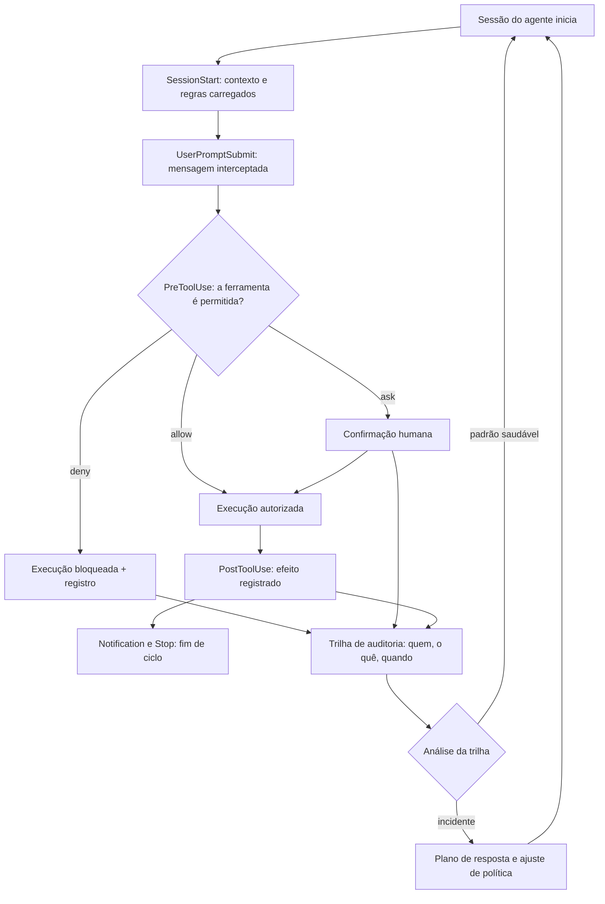

# Capítulo 11: Hooks em produção: do guardrail individual à política de organização

## 1. Introdução

No capítulo anterior, você aprendeu a diferença entre a instrução que o modelo pode ignorar e o hook que sempre executa [1]. Agora é hora de escalar: o hook individual vira política de organização [1]. Quando dezenas de desenvolvedores operam agentes autônomos, o guardrail não pode depender da boa vontade de cada um — ele precisa ser infraestrutura, com registro, revisão e auditoria [5].

Este capítulo tem três objetivos. Primeiro, entender o catálogo completo de hooks e os pontos de interceptação em que cada um age [1]. Segundo, desenhar a política organizacional: quais regras viram hook, quem as revisa e como o efeito é auditado [4]. Terceiro, integrar os hooks à cadeia de segurança — do registro de eventos ao plano de resposta a incidentes [9].

## 2. Explica

### 2.1 O catálogo de hooks e os pontos de interceptação

Os hooks interceptam o ciclo de vida da sessão em pontos definidos: o início da sessão, cada uso de ferramenta, o envio de cada mensagem, as notificações e o fim da sessão [1][1]. Cada ponto tem um propósito: o hook de pré-uso de ferramenta bloqueia antes da ação; o de pós-uso registra o efeito [1]. O desenho do guardrail começa pela escolha do ponto — a pergunta é "onde essa regra precisa agir" [1].

### 2.2 A diferença entre pedir e garantir

A motivação central dos hooks é estrutural: instrução é pedido, hook é garantia [1]. Uma regra de segurança escrita no prompt protege enquanto o modelo cooperar; um hook protege sempre — porque a execução não depende da decisão do modelo [1]. A política organizacional classifica cada regra por essa pergunta: se a violação é inaceitável, a regra precisa de hook [1].

### 2.3 A política de permissões: deny, allow e ask

A política de permissões é a camada complementar dos hooks: ela define o que o agente pode fazer sem perguntar, o que exige confirmação e o que é negado por padrão [3]. A configuração da organização define os padrões — e a revisão periódica ajusta os limites conforme o uso [2][4]. A regra de ouro da política: negar por padrão, liberar por exceção e auditar o que foi liberado [3].

### 2.4 A auditoria: o registro como trilha

Todo guardrail precisa de trilha: o registro de eventos de auditoria documenta quem, o quê, quando e com qual resultado [5]. Os logs de auditoria da organização são a base de toda investigação: o incidente se resolve olhando a trilha, não adivinhando [5]. A disciplina complementar é a retenção: a trilha precisa sobreviver ao incidente [4][5].

### 2.5 O hook como parte da cadeia de segurança

O hook individual é uma peça; a cadeia de segurança é o conjunto [9]. A cadeia completa: instruções (pedem), permissões (limitam), hooks (garantem), logs (registram) e o plano de resposta (reage) [9]. As estruturas de segurança da indústria — da classificação de ameaças às diretrizes de governança — fornecem o vocabulário para desenhar a cadeia e priorizar os elos [8][9].

### 2.6 Hooks em escala: a configuração como código

Em uma organização, a configuração de hooks e permissões é código: versionada, revisada e testada como qualquer infraestrutura [2][4]. A configuração segue o mesmo ciclo do código — pull request, revisão, deploy — e o efeito de cada mudança é observável na trilha [2]. A configuração como código é o que transforma o guardrail individual em política durável [4].

## 3. Ilustra

### 3.1 A analogia da portaria do prédio

Pense na portaria de um prédio corporativo: a placa na parede (a instrução) diz "não entre sem crachá" — mas quem decide se a porta abre é a catraca (o hook) [1]. A catraca tem regras configuradas: certos andares exigem crachá extra (permissões), certos horários pedem confirmação (ask) e certas áreas são bloqueadas (deny) [3]. E cada passagem deixa registro no livro da portaria (auditoria) [5]. O porteiro não convence ninguém — a catraca decide, e o livro conta [1].



### 3.2 A catraca que aprende com o livro

O ciclo mostra a diferença entre proteção e segurança: a proteção bloqueia; a segurança aprende — analisa a trilha e ajusta a política [5][9]. É esse ciclo que transforma hooks avulsos em sistema de governança [4].

## 4. Técnica

### 4.1 Um hook de pré-uso com política deny/allow/ask

O exemplo abaixo implementa a decisão de permissão no ponto de interceptação — o coração do guardrail [1][3]:

```python
def decidir_permisao(ferramenta, argumentos, politica):
    if ferramenta in politica["deny"]:
        return {"decisao": "deny", "motivo": "ferramenta bloqueada pela politica"}
    if ferramenta in politica["ask"]:
        return {"decisao": "ask", "motivo": "exige confirmacao humana"}
    if ferramenta in politica["allow"]:
        return {"decisao": "allow", "motivo": "liberada por excecao"}
    return {"decisao": "deny", "motivo": "negada por padrao: privilégio minimo"}
```

Negar por padrão e liberar por exceção — a linha de base da política [3].

### 4.2 O registro estruturado de auditoria

O trecho abaixo transforma cada evento do hook em uma entrada de trilha — o material de toda investigação [5]:

```python
import json
from datetime import datetime, timezone


def registrar_evento(evento, ferramenta, decisao, motivo, usuario):
    entrada = {
        "evento": evento,
        "ferramenta": ferramenta,
        "decisao": decisao,
        "motivo": motivo,
        "usuario": usuario,
        "timestamp": datetime.now(timezone.utc).isoformat(),
    }
    print(json.dumps(entrada, ensure_ascii=False, sort_keys=True))
```

Com esse padrão, a pergunta "quem liberou isso?" tem resposta — e a resposta é a trilha [5].

### 4.3 A configuração como código versionada

Para fechar, a política em arquivo versionado — o mesmo ciclo de revisão do código [2][4]:

```python
POLITICA = {
    "deny": ["executar_shell_arbitrario", "ler_variaveis_de_ambiente"],
    "ask": ["deletar_arquivos", "enviar_email_externo", "alterar_producao"],
    "allow": ["ler_arquivos", "rodar_testes_locais", "editar_rastreamento"],
}


def validar_politica(politica):
    sem_sobreposicao = not (set(politica["deny"]) & set(politica["allow"]))
    tem_base = "deny" in politica and "ask" in politica
    return sem_sobreposicao and tem_base


assert validar_politica(POLITICA)
```

A política é código: muda por pull request, valida no CI e entra em produção com trilha [4].

## 5. Aplica

### 5.1 Onde isso vive no mundo real

Na prática, a política de hooks em escala aparece nas organizações que operam agentes para equipes inteiras [4]. O padrão convergente: configuração versionada, pontos de interceptação definidos, permissões por padrão mínimo e trilha de auditoria com retenção [3][5]. E o campo está institucionalizando a segurança agêntica: das classificações de ameaça aos marcos de risco e às regulamentações de IA, a cadeia de segurança ganhou vocabulário comum [8][11][12].

### 5.2 O erro comum do iniciante

O erro clássico é confiar em instruções: a regra de segurança escrita no prompt protege até o primeiro caso em que ninguém percebe a violação [1]. O segundo erro é guardrail sem trilha: sem registro, o incidente não tem história e a política não evolui [5]. O caminho profissional: regra inaceitável vira hook, permissão mínima por padrão e trilha completa em cada execução [3][5].

## 6. Conclusão

O guardrail individual protege uma sessão; a política de organização protege a operação inteira [1][4]. Você aprendeu o catálogo de hooks, a política de permissões, a trilha de auditoria e a configuração como código [1][3][5]. No próximo capítulo, essa governança desce ao detalhe: a configuração como disciplina — segredos, ambientes e a revisão contínua de configurações [2].


## 7. Referências

[1] ANTHROPIC. *Hooks Guide*. Disponível em: https://code.claude.com/docs/en/hooks-guide. Acesso em: 06 ago. 2026.
[2] ANTHROPIC. *Hooks Reference*. Disponível em: https://code.claude.com/docs/en/hooks. Acesso em: 06 ago. 2026.
[3] ANTHROPIC. *Settings Reference*. Disponível em: https://code.claude.com/docs/en/settings. Acesso em: 06 ago. 2026.
[4] ANTHROPIC. *Configure Permissions*. Disponível em: https://code.claude.com/docs/en/permissions. Acesso em: 06 ago. 2026.
[5] ANTHROPIC. *Enterprise Admin Setup*. Disponível em: https://code.claude.com/docs/en/admin-setup. Acesso em: 06 ago. 2026.
[6] ANTHROPIC. *Access Audit Logs*. Disponível em: https://support.claude.com/en/articles/9970975-access-audit-logs. Acesso em: 06 ago. 2026.
[7] DEVIAN. *Windsurf Cascade Hooks*. Disponível em: https://docs.devin.ai/desktop/cascade/hooks. Acesso em: 06 ago. 2026.
[8] ROO CODE. *Auto-Approving Actions*. Disponível em: https://roocodeinc.github.io/Roo-Code/features/auto-approving-actions/. Acesso em: 06 ago. 2026.
[9] OPENCODE. *OpenCode Configuration*. Disponível em: https://opencode.ai/docs/config/. Acesso em: 06 ago. 2026.
[10] ANTHROPIC. *Claude Code on GitHub*. Disponível em: https://github.com/anthropics/claude-code. Acesso em: 06 ago. 2026.
[11] ANTHROPIC. *Model Context Protocol Documentation*. Disponível em: https://modelcontextprotocol.io/. Acesso em: 06 ago. 2026.
[12] CURSOR. *Rules Documentation*. Disponível em: https://cursor.com/docs/context/rules. Acesso em: 06 ago. 2026.
[13] CLINE. *Cline VS Code Extension*. Disponível em: https://github.com/cline/cline. Acesso em: 06 ago. 2026.
[14] OWASP. *Top 10 for LLM Applications*. Disponível em: https://genai.owasp.org/. Acesso em: 06 ago. 2026.
[15] MITRE. *ATLAS — Adversarial Threat Landscape for Artificial-Intelligence Systems*. Disponível em: https://atlas.mitre.org/. Acesso em: 06 ago. 2026.
[16] CLOUD SECURITY ALLIANCE. *MAESTRO & Agentic Threat Research*. Disponível em: https://labs.cloudsecurityalliance.org/agentic/csa-research-note-atlas-agentic-gap-analysis-20260327/. Acesso em: 06 ago. 2026.
[17] NIST. *AI Risk Management Framework (AI RMF 1.0)*. Disponível em: https://www.nist.gov/itl/ai-risk-management-framework. Acesso em: 06 ago. 2026.
[18] ISO. *ISO/IEC 42001:2023 — Information technology — Artificial intelligence — Management system*. Disponível em: https://www.iso.org/standard/81230.html. Acesso em: 06 ago. 2026.
[19] EUROPEAN UNION. *Regulation (EU) 2024/1689 (EU AI Act)*. Disponível em: https://eur-lex.europa.eu/eli/reg/2024/1689/oj. Acesso em: 06 ago. 2026.
[20] GITHUB. *Adding repository custom instructions for GitHub Copilot*. Disponível em: https://docs.github.com/copilot/customizing-copilot/adding-custom-instructions-for-github-copilot. Acesso em: 06 ago. 2026.
