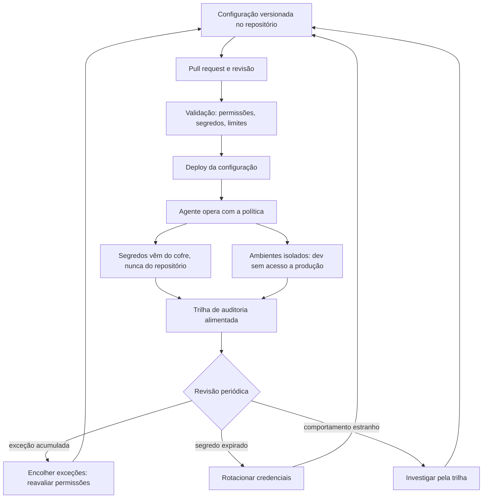

# Capítulo 12: Config como código: segredos, ambientes e revisão contínua

## 1. Introdução

No capítulo anterior, você transformou hooks em política de organização [4]. Este capítulo desce à matéria-prima dessa política: a configuração. Permissões, limites, credenciais e ambientes — tudo o que define o comportamento do agente fora do código [2]. A configuração é onde os erros mais caros acontecem: um segredo commitado, uma permissão ampla demais, um ambiente de produção com configuração de desenvolvimento [2].

Este capítulo tem três objetivos. Primeiro, entender a configuração como código: versionada, revisada e auditada como qualquer artefato [2]. Segundo, dominar a gestão de segredos e ambientes: o que nunca entra no repositório e como isolar ambientes [19]. Terceiro, desenhar a revisão contínua de configurações — o ciclo que impede que a política do capítulo anterior apodreça [4].

## 2. Explica

### 2.1 A configuração como código: o mesmo rigor do código

A configuração do agente — permissões, hooks, limites — é código: vive no repositório, muda por pull request e entra em produção por deploy [2]. A referência de configuração da plataforma documenta cada opção e seu efeito [2]. A disciplina central: nenhuma mudança de configuração acontece fora do ciclo de revisão [4].

### 2.2 As permissões como superfície de risco

As permissões são a superfície de risco mais direta: cada permissão ampla é um vetor de abuso [3]. A prática recomendada é a mesma de infraestrutura: privilégio mínimo, negação por padrão e liberação por exceção com registro [3]. A configuração da organização define os padrões — e a revisão periódica encolhe as exceções [3][4].

### 2.3 Segredos: o que nunca entra no repositório

O erro mais caro da configuração é o segredo commitado: a chave de API que o agente expõe ao mundo [19]. A disciplina tem duas partes: a gestão (segredos em cofre de variáveis, nunca em arquivo) e a prevenção (varredura automática que bloqueia commit de segredos) [19]. A mesma regra vale para o conteúdo gerado: nenhum segredo em logs, em saídas de ferramentas ou em contexto de modelo [2].

### 2.4 Ambientes: o isolamento que protege a produção

A configuração de desenvolvimento não pode alcançar a produção [4]. O isolamento de ambientes é a prática de infraestrutura aplicada aos agentes: credenciais por ambiente, limites por ambiente e trilha por ambiente [4][19]. O padrão de segurança de infraestrutura fornece o vocabulário: o conteúdo gerado por agentes em desenvolvimento nunca tem acesso às credenciais de produção [19].

### 2.5 A revisão contínua de configurações

A configuração apodrece: permissões acumuladas, exceções esquecidas, segredos rotacionados fora do prazo [4]. A revisão contínua tem cadência e critérios: inventário de permissões, verificação de segredos, análise da trilha [5]. As estruturas de segurança — do risco de IA aos controles de nuvem — fornecem o catálogo de verificações [10][11].

### 2.6 A configuração no contexto regulatório

A configuração também é o ponto onde a regulação encontra o operador: os marcos de IA e as normas de gerenciamento exigem documentação, trilha e controle de mudança [12][13]. A configuração como código, com revisão e registro, é o pré-requisito de qualquer conformidade — porque conformidade sem trilha é declaração [12].

## 3. Ilustra

### 3.1 A analogia da chave-mestra e do cofre

Pense no prédio do capítulo anterior: a catraca decidia quem entra, mas alguém precisa administrar as chaves [3]. O cofre central (o gerenciador de segredos) guarda as chaves — e nenhuma chave fica pendurada na recepção (repositório) [19]. As chaves são entregues por ambiente: a chave do escritório não abre o cofre do banheiro (isolamento) [19]. E, uma vez por trimestre, a administração troca todas as chaves e revisa quem tem acesso (revisão contínua) [4].



### 3.2 O prédio que revisa as chaves

O ciclo mostra a governança completa: configuração como código, segredo no cofre, ambiente isolado e revisão com cadência [2][4][19]. É a mesma espiral de melhoria contínua que a série constrói — agora aplicada ao hardware da política [4].

## 4. Técnica

### 4.1 O guardião de segredos

O exemplo abaixo impede que segredos entrem no repositório — a varredura que roda no CI [19]:

```python
import re
from pathlib import Path

PADROES_SEGREDO = [
    re.compile(r"sk-[A-Za-z0-9]{20,}"),
    re.compile(r"(?i)api[_-]?key\s*=\s*['\"][^'\"]+['\"]"),
    re.compile(r"(?i)senha\s*[:=]\s*['\"][^'\"]{8,}['\"]"),
]


def varrer_segredos(raiz: Path) -> list[str]:
    achados = []
    for caminho in raiz.rglob("*"):
        if caminho.suffix not in {".py", ".md", ".json", ".yml"}:
            continue
        texto = caminho.read_text(encoding="utf-8", errors="ignore")
        for padrao in PADROES_SEGREDO:
            if padrao.search(texto):
                achados.append(str(caminho))
    return achados


print(varrer_segredos(Path(".")))
```

O bloqueio no CI transforma o "não commitar segredo" de conselho em garantia [19].

### 4.2 A matriz de permissões por ambiente

O trecho abaixo isola ambientes com limites diferentes — a configuração que a revisão consegue auditar [3][4]:

```python
AMBIENTES = {
    "desenvolvimento": {
        "permitido": ["ler", "rodar_testes"],
        "exigir_confirmacao": ["deletar"],
        "credenciais": "cofre_dev",
    },
    "producao": {
        "permitido": ["ler_com_permissao"],
        "exigir_confirmacao": ["alterar", "deletar"],
        "credenciais": "cofre_prod",
    },
}


def ambiente_de(origem, credencial_atual):
    for nome, cfg in AMBIENTES.items():
        if origem == nome:
            return cfg
    raise ValueError("ambiente desconhecido")
```

A configuração por ambiente é a fronteira que impede o vazamento de privilégio [4].

### 4.3 A revisão periódica de configurações

Para fechar, a rotina que impede o apodrecimento: inventário, rotação e análise da trilha [4][5]:

```python
def revisar_configuracoes(inventario, segredos, excecoes, dias_limite=90):
    acoes = []
    for segredo in segredos:
        if segredo["dias_desde_rotacao"] > dias_limite:
            acoes.append(f"rotacionar: {segredo['nome']}")
    for excecao in excecoes:
        if not excecao["justificativa_recente"]:
            acoes.append(f"remover excecao: {excecao['regra']}")
    return acoes
```

Cada ação da revisão volta ao repositório como mudança de configuração — fechando o ciclo [4].

## 5. Aplica

### 5.1 Onde isso vive no mundo real

Na prática, a configuração como código aparece em toda operação de agentes séria: o repositório de configuração com CI, o cofre de segredos com rotação e os ambientes isolados com trilha própria [2][4][19]. As estruturas de segurança — da classificação de ameaças aos controles de nuvem e aos marcos de IA — consolidaram o vocabulário de governança [10][11][12]. E a tendência de 2026 é a institucionalização: a configuração de agentes entrando no inventário de controles das organizações [13].

### 5.2 O erro comum do iniciante

O erro clássico é a chave no repositório: o segredo que vaza porque a configuração foi tratada como detalhe [19]. O segundo erro é a exceção eterna: a permissão ampla justificada "por enquanto" e nunca revisada [3][4]. O caminho profissional: segredo no cofre, ambiente isolado, privilégio mínimo e revisão com cadência — o mesmo rigor que o código já tem [2][4].

## 6. Conclusão

A configuração é onde a política vira realidade — e onde ela apodrece se ninguém revisar [2][4]. Você aprendeu a tratar a configuração como código, a isolar segredos e ambientes e a manter a revisão contínua [2][19]. Com hooks e configuração dominados, a camada de guardrails da pilha está completa — e o próximo livro usa essa base para outra coisa: a especificação, a disciplina que transforma intenção em código verificável [4].


## 7. Referências

[1] ANTHROPIC. *Settings Reference*. Disponível em: https://code.claude.com/docs/en/settings. Acesso em: 06 ago. 2026.
[2] ANTHROPIC. *Configure Permissions*. Disponível em: https://code.claude.com/docs/en/permissions. Acesso em: 06 ago. 2026.
[3] ANTHROPIC. *Enterprise Admin Setup*. Disponível em: https://code.claude.com/docs/en/admin-setup. Acesso em: 06 ago. 2026.
[4] ANTHROPIC. *Access Audit Logs*. Disponível em: https://support.claude.com/en/articles/9970975-access-audit-logs. Acesso em: 06 ago. 2026.
[5] ANTHROPIC. *Hooks Guide*. Disponível em: https://code.claude.com/docs/en/hooks-guide. Acesso em: 06 ago. 2026.
[6] ANTHROPIC. *Hooks Reference*. Disponível em: https://code.claude.com/docs/en/hooks. Acesso em: 06 ago. 2026.
[7] OWASP. *Top 10 for LLM Applications*. Disponível em: https://genai.owasp.org/. Acesso em: 06 ago. 2026.
[8] OWASP. *Top 10 for Agentic Applications*. Disponível em: https://genai.owasp.org/. Acesso em: 06 ago. 2026.
[9] CLOUD SECURITY ALLIANCE. *Security Guidance for Critical Areas of Focus in Cloud Computing*. Disponível em: https://cloudsecurityalliance.org/. Acesso em: 06 ago. 2026.
[10] NIST. *AI Risk Management Framework (AI RMF 1.0)*. Disponível em: https://www.nist.gov/itl/ai-risk-management-framework. Acesso em: 06 ago. 2026.
[11] ISO. *ISO/IEC 42001:2023 — Information technology — Artificial intelligence — Management system*. Disponível em: https://www.iso.org/standard/81230.html. Acesso em: 06 ago. 2026.
[12] EUROPEAN UNION. *Regulation (EU) 2024/1689 (EU AI Act)*. Disponível em: https://eur-lex.europa.eu/eli/reg/2024/1689/oj. Acesso em: 06 ago. 2026.
[13] CYCODE. *OWASP Top 10 for Agentic Applications 2026 Explained*. Disponível em: https://cycode.com/blog/owasp-top-10-agentic-applications/. Acesso em: 06 ago. 2026.
[14] AUTH0. *Lessons from OWASP Top 10 for Agentic Applications: Least Privilege to Least Agency*. Disponível em: https://auth0.com/blog/owasp-top-10-agentic-applications-lessons/. Acesso em: 06 ago. 2026.
[15] MODULOS. *OWASP Top 10 for Agentic Applications (2026) Governance Guide*. Disponível em: https://docs.modulos.ai/frameworks/owasp-top-10-agentic/. Acesso em: 06 ago. 2026.
[16] GITHUB. *Adding repository custom instructions for GitHub Copilot*. Disponível em: https://docs.github.com/copilot/customizing-copilot/adding-custom-instructions-for-github-copilot. Acesso em: 06 ago. 2026.
[17] GITHUB. *AGENTS.md file for GitHub Copilot*. Disponível em: https://docs.github.com/copilot/customizing-copilot/adding-custom-instructions-for-github-copilot. Acesso em: 06 ago. 2026.
[18] GOOGLE. *gVisor — Application Kernel for Containers*. Disponível em: https://gvisor.dev/. Acesso em: 06 ago. 2026.
[19] DOCKER. *Docker security best practices*. Disponível em: https://docs.docker.com/engine/security/. Acesso em: 06 ago. 2026.
[20] OWASP. *Prompt Injection — OWASP Cheat Sheet*. Disponível em: https://cheatsheetseries.owasp.org/cheatsheets/Prompt_Injection_Cheat_Sheet.html. Acesso em: 06 ago. 2026.
