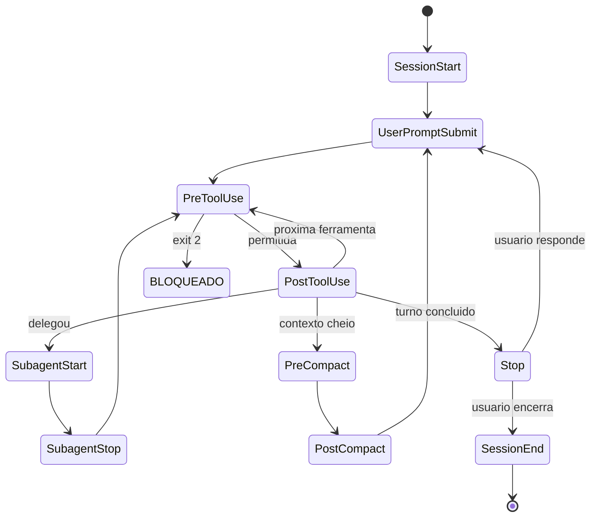

# Capítulo 2: O ciclo de vida do agente: os eventos que governam a sessão

## 1. Introdução

No Capítulo 1, você estabeleceu o contrato de execução: os três canais — autorização, interceptação e registro — que transformam instrução em controle. Mas um contrato só funciona se você souber exatamente onde ele se aplica. Este capítulo responde a pergunta estrutural: em que momentos da existência de um agente o controle pode ser injetado?

Você vai aprender que uma sessão agêntica não é um fluxo contínuo, mas uma sequência de eventos discretos — inicialização, entrada de prompt, chamadas de ferramenta, subagentes, compactação, encerramento — e que o harness expõe cada um desses momentos como um ponto de interceptação [1][2]. Ao final, você terá o mapa completo do ciclo de vida, saberá distinguir os eventos onde o controle é barato dos eventos onde ele é caro, e entenderá por que o posicionamento do guardrail define o seu custo e a sua eficácia.

## 2. Explica

### A sessão como máquina de estados

Pense na sessão de um agente como uma máquina de estados com transições discretas. Cada transição é disparada por um evento: o usuário envia um texto, o modelo responde com uma chamada de ferramenta, a ferramenta retorna, o contexto é compactado, a sessão é encerrada. O harness — a camada que envolve o modelo — observa todas essas transições e, em cada uma, oferece a possibilidade de executar código seu [23].

Essa arquitetura é deliberada. Em vez de "deixar o modelo rodar e torcer", o harness fragmenta a execução em pontos de verificação. Cada ponto de verificação é uma oportunidade de inspecionar, bloquear, modificar ou registrar. A indústria de segurança de aplicações reconhece esse padrão como o caminho para controlar sistemas não confiáveis: você não confia na entidade, você controla o contorno [8][9].

### O catálogo de eventos

O catálogo completo de eventos cobre todas as fases da vida do agente. Vamos agrupá-los por família para que o mapa fique memorável:

**Família de sessão e configuração.** `SessionStart` dispara quando uma sessão inicia ou é retomada — e aceita matchers de origem (`startup`, `resume`, `clear`, `compact`), permitindo comportamentos diferentes conforme o contexto [2]. `SessionEnd` marca o encerramento. `Setup` roda em modo headless durante inicialização automatizada. `ConfigChange` dispara se um arquivo de configuração muda em tempo de execução — essencial para recarregar políticas sem reiniciar. `CwdChanged` acompanha mudanças de diretório de trabalho. `InstructionsLoaded` dispara quando um arquivo de regras é injetado no contexto, permitindo auditar o que o agente "sabe" [1].

**Família de prompt.** `UserPromptSubmit` é o primeiro portão de embarque: dispara logo após o usuário enviar o prompt e antes de o modelo processá-lo. É aqui que você injeta contexto adicional, aplica políticas de conteúdo ou bloqueia comandos impróprios. `UserPromptExpansion` cobre a expansão de slash-commands e prompts de MCP [2].

**Família do loop de ferramentas — onde o perigo mora.** `PreToolUse` executa antes de qualquer ferramenta rodar e pode bloqueá-la — é o ponto de controle mais crítico para segurança, como você viu no Capítulo 1. `PermissionRequest` dispara quando um diálogo de permissão está prestes a aparecer; `PermissionDenied`, quando o classificador automático nega. `PostToolUse` roda após o sucesso de uma ferramenta — ideal para linters e formatação automática. `PostToolUseFailure` cobre o fracasso. `PostToolBatch` fecha lotes de ferramentas paralelas [1].

**Família de subagentes e tarefas.** `SubagentStart` e `SubagentStop` monitoram a criação e o encerramento de subagentes — fundamentais para controlar fan-out descontrolado. `TaskCreated` e `TaskCompleted` acompanham o gerenciamento de tarefas. `TeammateIdle` dispara quando um membro da equipe de agentes fica ocioso [2].

**Família de encerramento de turno e contexto.** `Stop` dispara quando o modelo termina de responder e pode recusar o encerramento — forçando o agente a continuar até passar nos testes. `PreCompact` e `PostCompact` cercam a compactação de contexto, um ponto de alto risco de perda de informação [1].

### Por que a posição importa

Cada evento tem um custo diferente de interceptação. Bloquear em `PreToolUse` é barato: a ferramenta nem roda. Bloquear em `PostToolUse` é caro: o dano já ocorreu, e o que resta é corrigir e registrar. A regra de ouro do Engenheiro de Governança Agêntica é simples: **quanto mais cedo no ciclo de vida, mais barato o guardrail**. Essa é a mesma lógica dos circuit breakers em sistemas distribuídos — você corta antes da cascata, não depois [17].

## 3. Ilustra

Na Torre de Controle, cada voo tem uma sequência fixa de checkpoints: a solicitação de decolagem (UserPromptSubmit), a liberação do corredor (PreToolUse), o monitoramento em rota (PostToolUse), a passagem de bastão entre controladores (SubagentStart/Stop) e o pouso com caixa-preta fechada (SessionEnd). O controlador — você, Engenheiro de Governança Agêntica — não acompanha o voo segundo a segundo; acompanha os checkpoints. É isso que torna o controle de tráfego possível: a fragmentação do contínuo em discreto.

O mesmo vale para o agente. Você não pode observar o modelo "pensando", mas pode observar cada ponto onde ele tenta agir. E como o controle é exercido nos pontos, a qualidade do seu guardrail depende diretamente da precisão do seu mapa de eventos.



O diagrama é o seu mapa de voo: cada nó é um evento, cada aresta uma transição, e em cada nó você pode pendurar um gancho. Memorize o formato — ele será a espinha dorsal de todos os exemplos do livro.

## 4. Técnica

### Observando o ciclo de vida na prática

Antes de controlar, observe. O hook mais simples que existe é um `SessionStart` que registra a inicialização e um `Stop` que registra o encerramento de turno. Este é o seu primeiro "caixa-preta" leve:

```python
#!/usr/bin/env python3
"""Registra eventos de ciclo de vida da sessao em um arquivo de auditoria."""
import json
import os
import sys
from datetime import datetime, timezone

LOG_PATH = os.environ.get("AGENT_AUDIT_LOG", ".claude/audit/ciclo_vida.log")


def registrar(evento: str, detalhes: dict) -> None:
    """Anexa um registro estruturado ao log de auditoria."""
    os.makedirs(os.path.dirname(LOG_PATH) or ".", exist_ok=True)
    entrada = {
        "ts": datetime.now(timezone.utc).isoformat(),
        "evento": evento,
        "detalhes": detalhes,
    }
    with open(LOG_PATH, "a", encoding="utf-8") as arquivo:
        arquivo.write(json.dumps(entrada, ensure_ascii=False) + "\n")


def main() -> int:
    dados = json.load(sys.stdin)
    evento = dados.get("hook_event_name", "desconhecido")
    registrar(evento, {
        "session_id": dados.get("session_id"),
        "cwd": dados.get("cwd"),
        "source": dados.get("source") if evento == "SessionStart" else None,
        "stop_hook_active": dados.get("stop_hook_active") if evento == "Stop" else None,
    })
    return 0  # observacao nunca bloqueia


if __name__ == "__main__":
    sys.exit(main())
```

Declarado no settings.json, esse observador passa a registrar todos os pontos de passagem da sessão — sem bloquear nada, apenas documentando. É o primeiro passo de qualquer programa de governança: você não gerencia o que não mede [6].

```json
{
  "hooks": {
    "SessionStart": [
      {"matcher": "", "hooks": [{"type": "command", "command": "\"$CLAUDE_PROJECT_DIR\"/.claude/hooks/observa-sessao.py"}]}
    ],
    "Stop": [
      {"matcher": "", "hooks": [{"type": "command", "command": "\"$CLAUDE_PROJECT_DIR\"/.claude/hooks/observa-sessao.py"}]}
    ]
  }
}
```

### O guardrail de fan-out: controlando subagentes

Uma das ameaças mais comuns em produção é o fan-out descontrolado: um agente principal que dispara centenas de subagentes paralelos, estourando custo e superfície de ataque. O par `SubagentStart`/`SubagentStop` permite contar subagentes ativos e bloquear acima do limite — um circuit breaker de delegação:

```python
#!/usr/bin/env python3
"""Circuit breaker de subagentes: limite de fan-out por sessao."""
import json
import os
import sys

LIMITE = int(os.environ.get("LIMITE_SUBAGENTES", "4"))
CONTADOR_PATH = os.environ.get("CONTADOR_PATH", "/tmp/subagentes_ativos.txt")


def contar_ativos() -> int:
    try:
        with open(CONTADOR_PATH, "r", encoding="utf-8") as arquivo:
            return int(arquivo.read().strip() or "0")
    except FileNotFoundError:
        return 0


def gravar(valor: int) -> None:
    with open(CONTADOR_PATH, "w", encoding="utf-8") as arquivo:
        arquivo.write(str(valor))


def main() -> int:
    dados = json.load(sys.stdin)
    evento = dados.get("hook_event_name")

    if evento == "SubagentStart":
        ativos = contar_ativos() + 1
        if ativos > LIMITE:
            print(
                f"BLOQUEADO: fan-out excede o limite de {LIMITE} subagentes "
                f"ativos. Refatore para execucao sequencial ou em lotes menores.",
                file=sys.stderr,
            )
            return 2
        gravar(ativos)
        return 0

    if evento == "SubagentStop":
        gravar(max(0, contar_ativos() - 1))
        return 0

    return 0


if __name__ == "__main__":
    sys.exit(main())
```

### O gate de qualidade no encerramento de turno

O evento `Stop` tem um superpoder: a capacidade de **recusar o fim do turno**. Combinado com um script de teste, ele transforma o processo em um loop de qualidade forçada — o agente só "pousa" se os testes passarem. Este é o padrão do controlador que não libera o pouso sem o checklist completo:

```python
#!/usr/bin/env python3
"""Gate de Stop: so permite encerrar o turno se os testes passarem."""
import json
import subprocess
import sys

DIRETORIO = sys.argv[1] if len(sys.argv) > 1 else "."


def rodar_testes() -> tuple[int, str]:
    """Roda a suite de testes; retorna (exit_code, resumo)."""
    try:
        resultado = subprocess.run(
            ["python", "-m", "pytest", "-q", "--tb=no"],
            cwd=DIRETORIO,
            capture_output=True,
            text=True,
            timeout=120,
        )
        return resultado.returncode, resultado.stdout.strip().splitlines()[-1] if resultado.stdout else ""
    except subprocess.TimeoutExpired:
        return 124, "timeout"


def main() -> int:
    json.load(sys.stdin)  # le o payload; o que importa e o resultado dos testes
    codigo, resumo = rodar_testes()
    if codigo != 0:
        print(
            f"TURN0 NAO PODE ENCERRAR: testes falharam ({resumo or 'sem saida'}). "
            f"Corrija as falhas antes de concluir.",
            file=sys.stderr,
        )
        return 2
    return 0


if __name__ == "__main__":
    sys.exit(main())
```

### A compactação de contexto: o evento que esconde o maior risco

Entre todos os eventos do ciclo de vida, a compactação (`PreCompact`/`PostCompact`) é o que a maioria dos times ignora — e é um dos mais perigosos. Quando o contexto estoura, o harness resume o histórico, e o resumo pode perder exatamente o detalhe que um guardrail precisaria: uma instrução de segurança, um aviso de bloqueio, uma decisão registrada. O padrão maduro faz backup do transcript antes da compactação e injeta, no contexto compactado, um resumo da política vigente [1][2]:

```python
#!/usr/bin/env python3
"""Protege a politica atraves da compactacao de contexto."""
import json
import os
import sys
from datetime import datetime

BACKUP_DIR = os.environ.get("BACKUP_DIR", ".claude/audit/backups")

RESUMO_POLITICA = (
    "REGRAS ATIVAS: (1) deny para secrets e comandos de rede; "
    "(2) ask para git push e publishes; (3) sandbox de rede deny-by-default; "
    "(4) qualquer bloqueio do guardrail deve ser tratado como ordem, nao sugestao."
)


def main() -> int:
    dados = json.load(sys.stdin)
    evento = dados.get("hook_event_name")
    sessao = dados.get("session_id", "desconhecida")

    if evento == "PreCompact":
        os.makedirs(BACKUP_DIR, exist_ok=True)
        caminho = os.path.join(BACKUP_DIR, f"pre-compact-{sessao}.jsonl")
        with open(caminho, "a", encoding="utf-8") as arquivo:
            arquivo.write(json.dumps(dados, ensure_ascii=False) + "\n")
        # Injeta o resumo da politica no contexto antes de compactar.
        saida = {
            "hookSpecificOutput": {
                "hookEventName": "PreCompact",
                "additionalContext": RESUMO_POLITICA,
            }
        }
        print(json.dumps(saida, ensure_ascii=False))
        return 0

    if evento == "PostCompact":
        print(
            f"[{datetime.now().isoformat()}] compactacao concluida; "
            f"backup salvo em {BACKUP_DIR}/pre-compact-{sessao}.jsonl",
            file=sys.stderr,
        )
        return 0

    return 0


if __name__ == "__main__":
    sys.exit(main())
```

O padrão ataca o problema duplo da compactação: a perda de evidência (resolvida pelo backup) e a perda de política (resolvida pela reinjeção do resumo). Depois da compactação, o agente continua sabendo o que pode e o que não pode — mesmo que o histórico detalhado tenha sido resumido [1][2].

### O evento CwdChanged e o controle de escopo de diretório

O `CwdChanged` é um evento discreto que carrega um risco silencioso: quando o agente muda de diretório de trabalho, ele pode estar saindo do escopo que a política considera seguro — entrando na pasta de produção, no diretório de secrets ou em um repositório vizinho não autorizado. O guardrail de escopo de diretório bloqueia a mudança quando o novo diretório está fora do mapa aprovado [2]:

```python
#!/usr/bin/env python3
"""Controla mudancas de diretorio de trabalho do agente."""
import json
import os
import sys

RAIZ_APROVADA = os.path.abspath(os.environ.get("RAIZ_APROVADA", "."))
SUBPASTAS_PERMITIDAS = ["src", "test", "docs", "scripts"]


def dentro_do_escopo(novo_cwd: str) -> bool:
    """Verifica se o novo diretorio esta dentro da raiz aprovada."""
    abs_novo = os.path.abspath(novo_cwd)
    if not abs_novo.startswith(RAIZ_APROVADA):
        return False
    resto = os.path.relpath(abs_novo, RAIZ_APROVADA)
    if resto in ("", "."):
        return True
    primeira_pasta = resto.split(os.sep)[0]
    return primeira_pasta in SUBPASTAS_PERMITIDAS


def main() -> int:
    dados = json.load(sys.stdin)
    novo = dados.get("tool_input", {}).get("new_cwd", dados.get("cwd", ""))
    if not novo:
        return 0
    if not dentro_do_escopo(novo):
        print(
            f"BLOQUEADO: mudanca para diretorio fora do escopo aprovado "
            f"({novo}). Permaneça dentro de {RAIZ_APROVADA} e suas "
            f"subpastas {', '.join(SUBPASTAS_PERMITIDAS)}.",
            file=sys.stderr,
        )
        return 2
    return 0


if __name__ == "__main__":
    sys.exit(main())
```

O guardrail de diretório é a materialização do princípio do Capítulo 1 em uma dimensão nova: além de controlar *o que* o agente faz, controlamos *onde* ele faz. Uma sessão que nunca sai do mapa de pastas aprovadas tem metade dos vetores de exfiltração simplesmente desligados — porque os dados sensíveis vivem fora do mapa [2][4].

### O mapa como instrumento de decisão

O mapa de eventos não é só uma figura didática — é um instrumento de decisão diária. Quando a organização enfrenta um problema novo — um incidente, uma exigência de compliance, um caso de uso novo —, a primeira pergunta do Engenheiro de Governança Agêntica é: qual evento do ciclo de vida é o ponto natural de controle para este problema? A resposta localiza o guardrail no mapa antes que ele seja escrito, e a localização define metade da solução: o PreToolUse para bloqueios, o Stop para gates, o SessionStart para políticas, o SubagentStart para fan-out [1][2].

O mapa também é o instrumento de comunicação com o time: desenhar o fluxo de um problema no mapa — "a entrada entra pelo UserPromptSubmit, a ferramenta perigosa passa pelo PreToolUse, o turno termina no Stop" — transforma uma discussão abstrata em uma análise concreta. O mapa transforma o time que fala de governança em conceitos vagos no time que fala em eventos precisos, e é essa precisão que permite projetar, revisar e melhorar a camada de controle como um sistema — não como um amontoado de scripts [2][10].

### O evento como contrato: a API do ciclo de vida

Há uma forma de pensar os eventos que unifica tudo que você construiu neste capítulo: cada evento é um contrato de API — uma entrada documentada, uma resposta esperada e um efeito definido. O harness é o provedor da API, o seu guardrail é o consumidor, e o contrato (o payload e os códigos de resposta) é o que permite que os dois evoluam independentemente. Essa visão explica por que a disciplina de testar os payloads (como você fez na seção Técnica) é tão importante: você não está testando um script — está testando a sua conformidade com um contrato [1][2].

A consequência prática da visão de API: o guardrail que trata o payload como contrato sobrevive à evolução do harness. Quando o harness adiciona um campo novo ao payload do PreToolUse, o guardrail que consome apenas os campos documentados continua funcionando; o guardrail que dependia de um campo não documentado quebra sem aviso. A disciplina de consumir o contrato — não a implementação — é a mesma da integração com qualquer serviço externo, e é ela que dá longevidade à camada de controle que você está construindo capítulo a capítulo [2][10].

### A escolha dos eventos: o mapa mínimo de controle

Nem todo evento precisa de um guardrail — e a escolha dos eventos a controlar é uma decisão de engenharia tanto quanto a construção dos guardrails. O mapa mínimo de controle de uma operação típica tem cinco eventos: SessionStart (injetar política), UserPromptSubmit (triar entrada), PreToolUse (bloquear ferramenta), Stop (gate de qualidade) e SessionEnd (fechar auditoria). Com esses cinco, a operação cobre o ciclo completo — do início da sessão ao encerramento — com um guardrail por família de risco [1][2].

A expansão do mapa mínimo segue o critério da dor: cada evento adicional é adicionado quando um incidente ou uma análise de ameaça (Capítulo 7) mostra que a família dele não está coberta. O evento `SubagentStart` entra quando a operação adota subagentes em escala; o `PreCompact` entra quando a perda de contexto vira um incidente observado; o `ConfigChange` entra quando a política muda em tempo de execução sem ninguém perceber. O mapa cresce por evidência, não por decoração — e o custo de cada evento adicional (um handler para manter, um caso para testar) é a contrapartida que mantém o crescimento disciplinado [2][10].

### A semântica do momento: por que cada evento é um portão de embarque

O mapa de eventos do ciclo de vida tem uma propriedade que merece destaque antes do mergulho técnico: cada evento é um portão de embarque — um momento em que algo muda de estado e, portanto, um momento em que o controle pode entrar. A física do sistema é a chave: o agente não é um fluxo contínuo de consciência, é uma sequência de transições discretas, e a discrição é o que torna o controle possível. Se o agente fosse contínuo, não haveria onde pendurar o gancho; como é discreto, cada transição é um ponto de verificação [1][2].

A consequência prática é que a qualidade da governança é diretamente proporcional ao seu conhecimento do mapa: quem conhece os eventos controla nos pontos certos; quem não conhece controla no escuro ou não controla. O iniciante tende a controlar apenas onde já viu um problema — um hook de PreToolUse para o comando que quebrou o ambiente na semana passada. O profissional controla por mapa: cada família de eventos com seu guardrail, cada guardrail com seu propósito, e nenhuma transição sem dono. Essa diferença de postura é o salto do operador para o Engenheiro de Governança Agêntica [2][10].

### O mapa de eventos completo e os dados de cada payload

Cada evento entrega um payload JSON com campos específicos, e o guardrail certo usa os campos certos. O `SessionStart` traz `source` (startup, resume, clear, compact) e o caminho do transcript; o `UserPromptSubmit` traz o texto do prompt; o `PreToolUse` traz `tool_name` e `tool_input`; o `PostToolUse` acrescenta o resultado; o `Stop` traz `stop_hook_active` — indicando se existe um hook de Stop ativo naquela sessão [1][2]. Conhecer esses campos é o que separa um guardrail que inspeciona dados reais de um que opera com suposições.

```python
#!/usr/bin/env python3
"""Inspeciona os campos disponiveis em cada evento do ciclo de vida."""
import json
import sys

# Exemplos minimos dos payloads que o harness entrega por evento.
PAYLOADS = {
    "SessionStart": {
        "source": "startup",
        "session_id": "sessao-001",
        "cwd": "/projeto",
        "transcript_path": "/projeto/.claude/transcripts/sessao-001.jsonl",
    },
    "UserPromptSubmit": {
        "prompt": "refatore o modulo de pagamentos",
        "session_id": "sessao-001",
    },
    "PreToolUse": {
        "hook_event_name": "PreToolUse",
        "tool_name": "Edit",
        "tool_input": {"file_path": "src/pagamentos.py", "content": "..."},
        "tool_use_id": "call-abc",
    },
    "Stop": {
        "stop_hook_active": True,
        "session_id": "sessao-001",
    },
}


def main() -> int:
    evento = sys.argv[1] if len(sys.argv) > 1 else "PreToolUse"
    payload = PAYLOADS.get(evento)
    if payload is None:
        print(f"Evento {evento} nao catalogado neste exemplo.")
        return 1
    print(json.dumps(payload, ensure_ascii=False, indent=2))
    print(f"\nTotal de campos: {len(payload)}")
    return 0


if __name__ == "__main__":
    sys.exit(main())
```

Rode com cada nome de evento e observe: o guardrail de fan-out usa `SubagentStart`/`SubagentStop` porque precisa contar transições; o gate de qualidade usa `Stop` porque precisa interceptar o encerramento; o protetor de arquivos usa `PreToolUse` com `tool_input.file_path` porque precisa do alvo. O evento certo entrega o dado certo — e o dado certo é metade do guardrail [1].

### Projetando a matriz de cobertura de eventos

Uma operação madura não adota eventos por acaso: ela desenha a matriz de cobertura, cruzando cada evento com a pergunta de governança que ele responde. O exercício abaixo gera a matriz a partir da lista de eventos que você decidiu cobrir e aponta as lacunas — os eventos sem dono são exatamente onde o incidente vai acontecer [10]:

```python
#!/usr/bin/env python3
"""Matriz de cobertura: cruza eventos do ciclo de vida com controles."""
import json
import sys

EVENTOS = [
    "SessionStart", "SessionEnd", "UserPromptSubmit",
    "PreToolUse", "PostToolUse", "SubagentStart", "SubagentStop",
    "PreCompact", "PostCompact", "Stop",
]


CONTROLES = {
    "SessionStart": "injetar politica e contexto",
    "UserPromptSubmit": "triar injecao adversaria",
    "PreToolUse": "bloquear ferramenta perigosa",
    "PostToolUse": "validar saida e formatar",
    "SubagentStart": "limitar fan-out",
    "Stop": "gate de testes",
    "SessionEnd": "compactar auditoria",
}


def matriz(cobertura: dict[str, bool]) -> None:
    print(f"{'Evento':20s} {'Controlado':12s} {'Pergunta de governanca'}")
    print("-" * 78)
    for evento in EVENTOS:
        tem = cobertura.get(evento, False)
        status = "SIM" if tem else "NAO"
        pergunta = CONTROLES.get(evento, "sem controle previsto")
        print(f"{evento:20s} {status:12s} {pergunta}")


def main() -> int:
    # Exemplo: operacao que ainda nao cobre compactacao nem PostToolUse.
    cobertura = {
        "SessionStart": True, "UserPromptSubmit": True, "PreToolUse": True,
        "SubagentStart": True, "SubagentStop": True, "Stop": True,
    }
    matriz(cobertura)
    print("\nLacunas criticas: PreToolUse sem PostToolUse deixa o resultado")
    print("da ferramenta sem validacao; PreCompact/PostCompact sem controle")
    print("deixa a compactacao sem auditoria de perda de contexto.")
    return 0


if __name__ == "__main__":
    sys.exit(main())
```

A matriz é o instrumento de priorização: cada linha "NAO" é um risco explícito, e a ordem de fechamento das lacunas deve seguir o princípio do Capítulo 1 — quanto mais cedo no ciclo, mais barato o guardrail. Cobertura de `SessionStart` e `PreToolUse` vem antes de `PostCompact`; cobertura de `Stop` vem antes de `SessionEnd` [1][2].

### O padrão de observabilidade: logs estruturados por evento

O coletor do início da seção Técnica registrava em texto plano. Em escala, a observabilidade exige logs estruturados: cada linha JSON com campos indexáveis — evento, sessão, ferramenta, decisão, duração. O padrão é o mesmo do mercado de observabilidade: log estruturado na origem, agregação no destino. O exemplo abaixo mostra o formato de linha que o coletor deve produzir e como a agregação por evento vira um painel [6][11]:

```json
{
  "ts": "2026-08-06T10:15:30.123Z",
  "evento": "PreToolUse",
  "session_hash": "a3f2c1e9",
  "ferramenta": "Bash",
  "decisao": "bloqueado",
  "motivo": "padrao_perigoso",
  "duracao_ms": 3
}
```

A decisão é o campo mais importante do log: sem ela, o evento é ruído. O padrão de agregação é o contador que você já construiu no Capítulo 1 — agora aplicado a cada evento do ciclo, com a duração acrescentada para detectar guardrails que estão virando gargalos. Um PreToolUse que leva segundos é um risco operacional tão real quanto um guardrail ausente [2][6].

### Matriz de posicionamento de guardrails

| Evento | Guardrail típico | Custo | Risco se ausente |
|---|---|---|---|
| SessionStart | Injetar contexto/política | Baixo | Sessão sem governança |
| UserPromptSubmit | Filtrar conteúdo, bloquear tema | Baixo | Prompt malicioso entra |
| PreToolUse | Bloquear comando/ferramenta | Baixo | Ferramenta perigosa roda |
| PostToolUse | Lint, formatação, validação | Médio | Erro entra no código |
| SubagentStart | Limitar fan-out | Baixo | Explosão de custo |
| Stop | Gate de testes | Alto | Turno fecha com defeito |
| SessionEnd | Compactar auditoria | Baixo | Perda de evidência |

## 5. Aplica

### Cena de contraste: o turno que encerrou sem testes

Sexta-feira, 17h55. Você configurou um agente para preparar releases, e a equipe decidiu — por confiança no CLAUDE.md — que ele "deveria rodar os testes antes de encerrar". O agente refatorou o módulo de pagamentos, declarou o trabalho concluído e encerrou o turno. Os testes estavam quebrados havia duas horas, mas nada na sessão impedia o encerramento: a instrução era uma recomendação, não um mecanismo. Na segunda-feira, o merge do PR quebrou staging, e o incidente custou o dia inteiro da equipe.

O diagnóstico: o controle estava no lugar errado. A instrução de "rodar testes antes de encerrar" não tem poder — é texto. O evento `Stop` é o checkpoint natural, e é lá que o controle deveria viver. A correção: o gate de qualidade da seção Técnica, declarado no `Stop`, que recusa o encerramento com exit 2 quando o pytest falha. Agora o agente pode "querer" encerrar; o harness decide se ele pode. A diferença entre a sexta-feira quebrada e a segunda-feira tranquila é exatamente essa fechadura [1].

### O evento TeammateIdle e a coordenação de equipes de agentes

Quando a organização opera equipes de agentes — um orquestrador com vários subagentes —, o `TeammateIdle` vira um instrumento de eficiência e de segurança ao mesmo tempo: um membro da equipe ocioso pode indicar trabalho travado, mas também pode indicar um agente que parou de reportar — um rogue agent em formação (Capítulo 7). O monitor de ociosidade abaixo distingue os dois casos e alerta quando o silêncio dura demais [2]:

```python
#!/usr/bin/env python3
"""Monitora ociosidade de membros da equipe de agentes."""
import json
import os
import sys
import time

LIMITE_OCIOSO_S = int(os.environ.get("LIMITE_OCIOSO_S", "300"))
ULTIMO_SINAL: dict[str, float] = {}


def main() -> int:
    dados = json.load(sys.stdin)
    agente = dados.get("agent_name", "desconhecido")
    agora = time.time()

    if dados.get("hook_event_name") == "TeammateIdle":
        ultimo = ULTIMO_SINAL.get(agente, agora)
        ocioso_s = int(agora - ultimo)
        ULTIMO_SINAL[agente] = agora
        if ocioso_s > LIMITE_OCIOSO_S:
            print(
                f"ALERTA: agente {agente} ocioso ha {ocioso_s}s. Verifique se"
                f"a tarefa travou ou se o agente parou de reportar.",
                file=sys.stderr,
            )
            return 2  # bloqueia a continuacao ate verificacao humana
    return 0


if __name__ == "__main__":
    sys.exit(main())
```

O monitor de ociosidade é o guardrail da coordenação: equipes de agentes precisam de supervisão tanto quanto agentes individuais, e o silêncio é o sintoma mais fácil de detectar. A mesma lógica do gate de testes — o evento `Stop` — se estende à equipe inteira via `TeammateIdle` [1][2].

### O ritual do mapa de eventos: da teoria à operação

Dominar o ciclo de vida não é decorar eventos — é operar com o mapa. O ritual prático do Engenheiro de Governança Agêntica começa toda segunda-feira com uma pergunta: o que aconteceu na semana passada em cada ponto do ciclo? Quantos bloqueios no PreToolUse? Quantos turnos encerrados com gate falho? Quantas sessões iniciadas sem política? O mapa de eventos transforma essas perguntas vagas em consultas precisas — e a resposta orienta a semana de trabalho [2][6].

O instrumento do ritual é a consulta ao log estruturado que você construiu na seção Técnica: agrupar por evento, por decisão e por duração. Uma sessão que inicia sem política (SessionStart sem hook ativo) é um voo que decola sem plano; um turno que encerra com gate desativado é um pouso sem checklist; um fan-out que estoura o limite é uma formação de aeronaves que o controlador não autorizou. Cada anomalia do mapa tem uma correção conhecida — e o mapa é o que a torna visível no dia em que acontece, não na retrospectiva do incidente [1][2].

O próximo nível de maturidade é a automação do ritual: o painel que lê os logs e alerta as anomalias antes que o humano as procure. Você verá esse padrão em detalhe no Capítulo 10, na operação contínua da camada — mas a base já está aqui: o mapa de eventos é a linguagem comum entre o harness, o log e o painel, e quem domina a linguagem domina a operação.

### Armadilhas comuns

- **Observar sem agir:** registradores puros são o primeiro passo, mas nunca o único. Se o ciclo de vida só é observado, a política não é aplicada.
- **Guardrail no PostToolUse para risco de segurança:** é o erro clássico — validar depois que a ferramenta rodou. Risco de segurança é PreToolUse; PostToolUse é para qualidade.
- **Esquecer o SessionStart:** políticas injetadas no início da sessão definem todo o comportamento. Sem elas, cada sessão começa "sem política".
- **Gate de Stop sem timeout:** um subprocess que trava segura o turno para sempre. Sempre defina timeout no gate.

## 6. Conclusão

Você agora enxerga o agente como uma máquina de estados, não como uma caixa mágica: sessão, prompt, ferramentas, subagentes, compactação e encerramento — cada transição um ponto de interceptação. Construiu três ferramentas de governança: um observador de ciclo de vida, um circuit breaker de fan-out e um gate de qualidade no encerramento. E aprendeu a regra de ouro do posicionamento: quanto mais cedo o guardrail, mais barato ele é.

Desafio: desenhe o mapa de ciclo de vida do seu harness e marque, para cada evento, se você hoje observa, controla ou ignora. As lacunas são o seu backlog de governança. No Capítulo 3, vamos descer à fundação de tudo: a cascata de configuração — quem manda em cada ambiente, e como a precedência dos escopos define a sua política.

## 7. Referências Bibliográficas

[1] ANTHROPIC. *Hooks Guide*. Disponível em: https://code.claude.com/docs/en/hooks-guide. Acesso em: 06 ago. 2026.
[2] ANTHROPIC. *Hooks Reference*. Disponível em: https://code.claude.com/docs/en/hooks. Acesso em: 06 ago. 2026.
[3] ANTHROPIC. *Settings Reference*. Disponível em: https://code.claude.com/docs/en/settings. Acesso em: 06 ago. 2026.
[4] ANTHROPIC. *Configure Permissions*. Disponível em: https://code.claude.com/docs/en/permissions. Acesso em: 06 ago. 2026.
[5] ANTHROPIC. *Enterprise Admin Setup*. Disponível em: https://code.claude.com/docs/en/admin-setup. Acesso em: 06 ago. 2026.
[6] ANTHROPIC. *Access Audit Logs*. Disponível em: https://support.claude.com/en/articles/9970975-access-audit-logs. Acesso em: 06 ago. 2026.
[7] OWASP. *Top 10 for LLM Applications*. Disponível em: https://genai.owasp.org/. Acesso em: 06 ago. 2026.
[8] OWASP. *Top 10 for Agentic Applications*. Disponível em: https://genai.owasp.org/. Acesso em: 06 ago. 2026.
[9] MITRE. *ATLAS — Adversarial Threat Landscape for Artificial-Intelligence Systems*. Disponível em: https://atlas.mitre.org/. Acesso em: 06 ago. 2026.
[10] CLOUD SECURITY ALLIANCE. *MAESTRO & Agentic Threat Research*. Disponível em: https://labs.cloudsecurityalliance.org/agentic/csa-research-note-atlas-agentic-gap-analysis-20260327/. Acesso em: 06 ago. 2026.
[11] CLOUD SECURITY ALLIANCE. *Security Guidance for Critical Areas of Focus in Cloud Computing*. Disponível em: https://cloudsecurityalliance.org/. Acesso em: 06 ago. 2026.
[12] NIST. *AI Risk Management Framework (AI RMF 1.0)*. Disponível em: https://www.nist.gov/itl/ai-risk-management-framework. Acesso em: 06 ago. 2026.
[13] ISO. *ISO/IEC 42001:2023 — Information technology — Artificial intelligence — Management system*. Disponível em: https://www.iso.org/standard/81230.html. Acesso em: 06 ago. 2026.
[14] EUROPEAN UNION. *Regulation (EU) 2024/1689 (EU AI Act)*. Disponível em: https://eur-lex.europa.eu/eli/reg/2024/1689/oj. Acesso em: 06 ago. 2026.
[15] CYCODE. *OWASP Top 10 for Agentic Applications 2026 Explained*. Disponível em: https://cycode.com/blog/owasp-top-10-agentic-applications/. Acesso em: 06 ago. 2026.
[16] AUTH0. *Lessons from OWASP Top 10 for Agentic Applications: Least Privilege to Least Agency*. Disponível em: https://auth0.com/blog/owasp-top-10-agentic-applications-lessons/. Acesso em: 06 ago. 2026.
[17] MODULOS. *OWASP Top 10 for Agentic Applications (2026) Governance Guide*. Disponível em: https://docs.modulos.ai/frameworks/owasp-top-10-agentic/. Acesso em: 06 ago. 2026.
[18] GITHUB. *Adding repository custom instructions for GitHub Copilot*. Disponível em: https://docs.github.com/copilot/customizing-copilot/adding-custom-instructions-for-github-copilot. Acesso em: 06 ago. 2026.
[19] GITHUB. *AGENTS.md file for GitHub Copilot*. Disponível em: https://docs.github.com/copilot/customizing-copilot/adding-custom-instructions-for-github-copilot. Acesso em: 06 ago. 2026.
[20] DEVIAN. *Windsurf Cascade Hooks*. Disponível em: https://docs.devin.ai/desktop/cascade/hooks. Acesso em: 06 ago. 2026.
[21] ROO CODE. *Auto-Approving Actions*. Disponível em: https://roocodeinc.github.io/Roo-Code/features/auto-approving-actions/. Acesso em: 06 ago. 2026.
[22] OPENCODE. *OpenCode Configuration*. Disponível em: https://opencode.ai/docs/config/. Acesso em: 06 ago. 2026.
[23] ANTHROPIC. *Claude Code on GitHub*. Disponível em: https://github.com/anthropics/claude-code. Acesso em: 06 ago. 2026.
[24] ANTHROPIC. *Model Context Protocol Documentation*. Disponível em: https://modelcontextprotocol.io/. Acesso em: 06 ago. 2026.
[25] GOOGLE. *gVisor — Application Kernel for Containers*. Disponível em: https://gvisor.dev/. Acesso em: 06 ago. 2026.
[26] DOCKER. *Docker security best practices*. Disponível em: https://docs.docker.com/engine/security/. Acesso em: 06 ago. 2026.
[27] OWASP. *Prompt Injection — OWASP Cheat Sheet*. Disponível em: https://cheatsheetseries.owasp.org/cheatsheets/Prompt_Injection_Cheat_Sheet.html. Acesso em: 06 ago. 2026.
[28] OWASP. *LLM Tool Poisoning — OWASP Top 10 for LLM Applications*. Disponível em: https://genai.owasp.org/. Acesso em: 06 ago. 2026.
[29] CURSOR. *Rules Documentation*. Disponível em: https://cursor.com/docs/context/rules. Acesso em: 06 ago. 2026.
[30] CLINE. *Cline VS Code Extension*. Disponível em: https://github.com/cline/cline. Acesso em: 06 ago. 2026.
