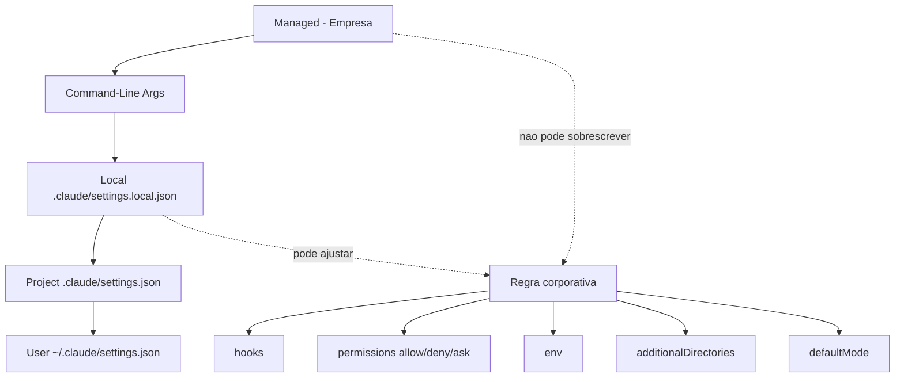

# Capítulo 3: A cascata de configuração: escopos e precedência

## 1. Introdução

No Capítulo 2, você mapeou o ciclo de vida do agente como uma sequência de eventos — e descobriu onde o controle pode ser injetado. Agora surge a pergunta de engenharia: onde essas regras vivem? A resposta é o sistema de configuração em cascata, uma hierarquia de arquivos `settings.json` com precedência estrita, que decide quem manda em cada ambiente.

Você vai aprender os cinco escopos de configuração — managed, linha de comando, local, projeto e usuário —, a ordem exata em que eles são avaliados, e como a precedência vira política: o que a empresa impõe, o que o time compartilha, o que o desenvolvedor ajusta e o que ninguém consegue burlar [3]. Ao final, você saberá exatamente em qual arquivo declarar cada regra do seu plano de voo, e por que o escopo errado transforma um guardrail em um convite para desrespeitá-lo.

## 2. Explica

### A hierarquia de escopos

A configuração do harness não é um único arquivo: é uma cascata de escopos, cada um com um dono e um propósito. Do mais forte ao mais fraco, a avaliação segue esta ordem [3]:

1. **Managed (empresa):** políticas administradas por um servidor corporativo, por MDM ou por arquivos de sistema. É o topo absoluto da hierarquia — nada do desenvolvedor pode sobrescrever.
2. **Command-Line Arguments:** flags temporárias passadas na execução, como `--allowedTools` e `--permission-mode`. Valem apenas para aquela sessão.
3. **Local (`.claude/settings.local.json`):** ajustes pessoais do desenvolvedor no repositório. O harness adiciona automaticamente esse arquivo ao gitignore para evitar vazamento acidental.
4. **Project (`.claude/settings.json`):** configuração compartilhada com o time, versionada no repositório. É o contrato coletivo do projeto.
5. **User (`~/.claude/settings.json`):** preferências globais do usuário em todas as máquinas e projetos.

A intuição por trás da ordem é o controle: quanto mais perto da empresa, mais forte; quanto mais perto do desenvolvedor, mais fraco. Essa hierarquia espelha a cadeia de autoridade que você conhece da governança corporativa — e é o que permite que uma política de segurança corporativa exista mesmo contra a vontade do desenvolvedor individual [5].

### O conflito e a resolução

Quando dois escopos definem a mesma chave, quem vence? O escopo superior, sem negociação. Mas há uma sutileza importante: nem toda chave é "fundível" — algumas são de substituição (o valor do escopo superior substitui o inferior) e outras são de agregação (listas que se somam). No Claude Code, a maioria das listas de permissão é agregada: o deny corporativo soma-se ao deny do projeto. É por isso que você pode ter regras de deny em três escopos simultaneamente, todas ativas [3].

A regra de ouro da gestão de conflito: **coloque no escopo mais baixo possível a regra que é pessoal, e no escopo mais alto a regra que é inegociável**. Regra de segurança no escopo local é um guardrail que o próximo `git clean` apaga junto com a moral do time.

### A estrutura do settings.json

Um settings.json moderno agrupa a configuração em blocos semânticos: `permissions` (allow/deny/ask), `env` (variáveis de ambiente consistentes), `additionalDirectories` (pastas irmãs acessíveis, para monorepos), `hooks` (os ganchos do Capítulo 2) e `defaultMode` (o modo de permissão padrão da sessão) [4]. Cada bloco é um instrumento do seu console de controle; conhecer a estrutura é saber qual instrumento usar em cada situação.

## 3. Ilustra

Voltemos à Torre de Controle. A hierarquia de escopos é a cadeia de comando do aeroporto: o regulador nacional (managed) define o espaço aéreo e as regras de separação — ninguém negocia isso. A torre (projeto) define os procedimentos locais de pouso e decolagem. O controlador individual (local) ajusta suas preferências de monitoramento — mas nunca pode reduzir a separação mínima entre aeronaves definida pelo regulador. E um piloto (usuário) pode ter preferências globais de comunicação, válidas em qualquer aeroporto em que pouse.

Como Engenheiro de Governança Agêntica, você aprende a ler essa cadeia de comando antes de escrever qualquer regra: saber quem detém o poder em cada camada evita o erro de tentar impor no escopo errado — o equivalente a um controlador tentar mudar a regra do regulador pelo interfone.



O diagrama mostra duas coisas: a seta grossa é a ordem de precedência (managed sobre tudo), e o bloco central mostra os cinco instrumentos de configuração que a cascata alimenta. Guarde essa imagem: toda regra deste livro vai cair em algum lugar desse fluxo.

## 4. Técnica

### Montando a cascata completa de um projeto

Vamos construir, do zero, a cascata de configuração de um time de plataforma que adota agentes em produção. O primeiro arquivo é o do **escopo de projeto** — o contrato coletivo versionado no git. Ele define as permissões que todo membro do time recebe ao clonar o repositório [4]:

```json
{
  "$schema": "https://json.schemastore.org/claude-code-settings.json",
  "permissions": {
    "allow": [
      "Bash(npm run lint)",
      "Bash(npm run test *)",
      "Read(./docs/**)"
    ],
    "deny": [
      "Bash(curl *)",
      "Read(./.env)",
      "Read(./secrets/**)",
      "Bash(* --env=prod*)"
    ],
    "ask": [
      "Bash(git push *)",
      "Bash(npm publish *)"
    ]
  },
  "env": {
    "AGENT_POLICY_VERSION": "2026.3",
    "CLAUDE_CODE_ENABLE_TELEMETRY": "1"
  },
  "additionalDirectories": [
    "../shared-types"
  ],
  "hooks": {
    "PreToolUse": [
      {
        "matcher": "Bash",
        "hooks": [
          {"type": "command", "command": "\"$CLAUDE_PROJECT_DIR\"/.claude/hooks/guardrail-bash.py", "timeout": 10}
        ]
      }
    ]
  }
}
```

Note o que esse arquivo faz: ele **compartilha** o contrato do time. Quem clona o repositório herda o deny de produção, o ask de push e o guardrail de Bash — sem nenhuma ação individual. É a diferença entre "todo mundo configurou" e "ninguém precisa configurar".

### O escopo local: o espaço pessoal que nunca vai para o git

O escopo local é onde o desenvolvedor exercita preferências pessoais sem contaminar o contrato do time. O harness o auto-gitignoreia, então é seguro e esperado colocar ali ajustes individuais — como aprovações recorrentes de comandos que o desenvolvedor executa dezenas de vezes por dia [3]:

```json
{
  "permissions": {
    "allow": [
      "Bash(git status)",
      "Bash(git diff)",
      "Bash(ls *)"
    ]
  },
  "defaultMode": "acceptEdits"
}
```

A armadilha clássica do escopo local é usá-lo para **contornar** o contrato do time — por exemplo, re-permitir um comando que o projeto deny. A hierarquia impede isso para o deny? Depende: listas são agregadas, mas a precedência de decisão entre allow e deny dentro de uma mesma sessão é resolvida pela camada de permissões (Capítulo 4), não pela cascata. O ponto de engenharia aqui é: **regra de segurança vive no projeto ou no managed; o local é para conforto, não para política** [4].

### O escopo managed: a política que ninguém burla

O topo da cascata é o que transforma governança em compliance. A política gerenciada é entregue por três canais: servidor remoto (console administrativo), MDM corporativo (plist no macOS, chaves de registro no Windows) ou arquivos de sistema (`/etc/claude-code/` em Linux/WSL) [5]. As duas chaves mais poderosas que a empresa pode ativar:

```json
{
  "allowManagedPermissionRulesOnly": true,
  "permissions": {
    "disableBypassPermissionsMode": true
  },
  "sandbox": {
    "enabled": true,
    "network": {
      "allowedDomains": ["api.minhaempresa.com", "github.com"]
    }
  }
}
```

`allowManagedPermissionRulesOnly` impede que usuários e projetos definam regras de permissão próprias — só valem as corporativas. `disableBypassPermissionsMode` desliga o modo de pulo de permissões, tornando impossível a fuga clássica do desenvolvedor. O sandbox com allowlist de domínios restringe a rede ao que a empresa aprova [5].

### Validando a cascata

Como saber se sua cascata está correta? A validação manual é a inspeção da ordem: para cada regra crítica, pergunte "quem a sobrescreve?" e "quem a contorna?". A resposta deve ser sempre a mesma: ninguém. Um roteiro de inspeção rápido:

```bash
# 1. Quais escopos existem neste projeto?
ls -la ~/.claude/settings.json .claude/settings.json .claude/settings.local.json 2>/dev/null

# 2. O que o harness resolveu como regra final de deny?
grep -rn '"deny"' ~/.claude/settings.json .claude/settings.json 2>/dev/null

# 3. O local foi para o git por acidente?
git check-ignore .claude/settings.local.json && echo "LOCAL_IGNORADO_OK" || echo "ATENCAO: local versionado"
```

O terceiro comando é o mais importante: um `settings.local.json` versionado vaza preferências pessoais — e, pior, vira um veto silencioso ao contrato do time. O harness auto-gitignoreia, mas clones antigos ou cópias manuais podem ter quebrado isso.

### O ambiente de desenvolvimento versus o ambiente de produção

A cascata de configuração ganha uma dimensão nova quando a organização opera agentes em mais de um ambiente: desenvolvimento e produção têm políticas diferentes por construção. O ambiente de dev tolera comandos exploratórios, endpoints locais e erros; o ambiente de produção exige deny-by-default, asks estritos e auditoria completa. O erro clássico é usar a mesma cascata nos dois — ou pior, copiar o settings.json de produção para a máquina de dev e amarrar o time [3][4]:

```python
#!/usr/bin/env python3
"""Seleciona a politica por ambiente: dev vs producao."""
import json
import os
import sys

POLITICAS = {
    "dev": {
        "permissions": {
            "allow": ["Bash(npm run *)", "Bash(git *)", "Read(./**)"],
            "ask": ["Bash(curl *)"],
            "deny": ["Bash(* --env=prod*)"],
        },
        "defaultMode": "acceptEdits",
    },
    "producao": {
        "permissions": {
            "allow": ["Bash(git status)"],
            "ask": ["Bash(git push *)", "Bash(kubectl *)"],
            "deny": ["Bash(curl *)", "Bash(wget *)", "Bash(* rm -rf *)", "Read(./.env*)"],
        },
        "defaultMode": "dontAsk",
    },
}


def politica_do_ambiente() -> dict:
    """Escolhe a politica conforme o ambiente detectado."""
    ambiente = os.environ.get("AGENT_ENV", "dev").lower()
    return POLITICAS.get(ambiente, POLITICAS["dev"])


def main() -> int:
    politica = politica_do_ambiente()
    ambiente = os.environ.get("AGENT_ENV", "dev")
    print(f"Ambiente detectado: {ambiente}")
    print(json.dumps(politica, ensure_ascii=False, indent=2))
    print("\nDiferenca estrutural: producao usa dontAsk + deny de rede;")
    print("dev usa acceptEdits + ask de rede. Nunca inverta.")
    return 0


if __name__ == "__main__":
    sys.exit(main())
```

A separação por ambiente é a aplicação direta da precedência da cascata ao mundo real: a variável `AGENT_ENV` é parte da configuração gerenciada (escopo superior), e a política do ambiente é derivada dela. O agente de produção nunca herda o modo relaxado do dev — não porque o modelo é disciplinado, mas porque a cascata decide [3][5].

### O problema do monorepo: additionalDirectories com controle

O monorepo é o caso onde a cascata encontra seu limite natural: a raiz do repositório contém vários serviços, e a política de um não pode vazar para o outro. O `additionalDirectories` resolve o acesso, mas o controle de escopo precisa ir além — é o mesmo raciocínio do guardrail de diretório do Capítulo 2, agora em escala de configuração [3]:

```python
#!/usr/bin/env python3
"""Controle de escopo em monorepo: cada servico com seu mapa."""
import json
import os
import sys

SERVICOS = {
    "api": {"raiz": "services/api", "permite_escrita": ["services/api/src"]},
    "worker": {"raiz": "services/worker", "permite_escrita": ["services/worker/src"]},
    "shared": {"raiz": "packages/shared", "permite_escrita": ["packages/shared/src"]},
}


def servico_do_caminho(caminho: str) -> str | None:
    """Retorna o servico dono do caminho, ou None se fora do mapa."""
    for nome, config in SERVICOS.items():
        if caminho.startswith(config["raiz"]):
            return nome
    return None


def pode_escrever(caminho: str) -> bool:
    """So permite escrita nas pastas de src do proprio servico."""
    servico = servico_do_caminho(caminho)
    if servico is None:
        return False
    config = SERVICOS[servico]
    return any(caminho.startswith(p) for p in config["permite_escrita"])


def main() -> int:
    dados = json.load(sys.stdin)
    caminho = dados.get("tool_input", {}).get("file_path", "")
    if not caminho:
        return 0
    if not pode_escrever(caminho):
        print(
            f"BLOQUEADO: escrita fora do escopo do servico ({caminho}). "
            f"Cada servico do monorepo so escreve na propria pasta de src.",
            file=sys.stderr,
        )
        return 2
    return 0


if __name__ == "__main__":
    sys.exit(main())
```

O padrão de monorepo leva o controle de escopo ao nível de serviço: o agente que trabalha na API não escreve no worker, e o shared só é editado pelo time dono. É a mesma cascata — agora com uma dimensão de granularidade nova — e é o que impede que a conveniência do monorepo vire um vetor de contaminação cruzada [3][4].

### O panorama: a cascata e o time

A cascata de configuração é também um espelho do time que a opera: o escopo de projeto reflete o que o time decidiu em conjunto, o escopo local reflete as diferenças individuais, e o managed reflete o que a empresa considera inegociável. Ler a cascata de uma organização é ler a sua cultura de governança — centralizada ou distribuída, confiante ou desconfiada, madura ou improvisada. Essa leitura é o ponto de partida de qualquer diagnóstico que o Engenheiro de Governança Agêntica faz ao chegar a um time novo [3][5].

A lição final do capítulo é o equilíbrio: a cascata bem desenhada dá flexibilidade onde a flexibilidade é produtiva (local, projeto) e rigidez onde a rigidez é necessária (managed). O erro simétrico é o excesso em qualquer direção — rigidez total que trava o time, ou flexibilidade total que desfaz a política. O equilíbrio é uma decisão contínua, revisada a cada mudança de contexto, e é ele que mantém a cascata viva em vez de decorativa [3][5].

### O backup e a recuperação da configuração

A configuração é um ativo — e ativo merece backup e recuperação. O cenário que ninguém planeja: o settings.json do projeto é sobrescrito por um merge ruim, ou o managed do servidor é atualizado com uma política quebrada, e a operação de agentes inteira começa a falhar em cascata. O padrão de resiliência da configuração tem três peças: versionamento (toda mudança de configuração passa pelo git, com diff e histórico), cópia de recuperação (o último estado conhecido-bom, exportado em intervalos) e teste de restauração (o ensaio periódico de voltar ao estado bom em minutos, não em horas) [3][5].

A disciplina de backup da configuração espelha a da auditoria: você não gerencia o que não pode restaurar. O ensaio de restauração é o teste que prova a recuperação — sem ele, o backup é uma esperança. E o padrão fecha o ciclo com a lição dos capítulos anteriores: a configuração que não é versionada não tem memória, a que não tem backup não tem futuro, e a que não é testada na restauração não tem confiança. O Engenheiro de Governança Agêntica trata o settings.json com o mesmo cuidado que trata o código de produção — porque, na prática, é código de produção [3][5].

### O env e a injeção de contexto por escopo

Entre as chaves do settings.json, o bloco `env` é o mais silencioso e o mais influente: ele injeta variáveis de ambiente consistentes em todas as sessões e execuções de ferramentas. O env por escopo segue a mesma cascata de precedência — o managed define o default corporativo, o projeto ajusta o padrão do time, o local refina o ambiente pessoal — e é o instrumento preferido para configurar o agente sem tocar em código: endpoints de API, flags de telemetria, caminhos de cache, tudo pode viver no env [3].

A disciplina do env é dupla. Primeiro, nunca colocar secrets no env de configuração versionada: o env do settings.json é lido por quem lê o arquivo, e um token no settings de projeto é um token no repositório — a regra é a mesma dos Capítulos 4 e 6: secrets vivem em cofre, referenciados por nome, nunca por valor. Segundo, documentar cada variável: uma variável de ambiente sem dono nem propósito é uma bomba-relógio de configuração — alguém muda o valor e ninguém sabe o que quebrou. O inventário de env (nome, escopo, propósito, dono) é o complemento natural do inventário de hooks do Capítulo 5 [3][4].

### A precedência como contrato organizacional

A cascata de configuração é mais do que um mecanismo técnico — é a materialização de um contrato organizacional: quem tem autoridade sobre o quê. O escopo managed diz que a empresa é a autoridade máxima; o escopo de projeto diz que o time decide coletivamente; o escopo local diz que o indivíduo ajusta o conforto próprio dentro dos limites. Quando a precedência é respeitada, a autoridade é clara e a responsabilidade é rastreável; quando é violada — um dev que sobrescreve uma regra de segurança no escopo local — a autoridade vira anarquia silenciosa [3][5].

A leitura organizacional da precedência explica também os conflitos mais comuns: o desenvolvedor que quer flexibilidade no escopo local, o time que quer consistência no escopo de projeto e a empresa que quer controle no escopo managed não estão brigando por configuração — estão negociando autoridade. O Engenheiro de Governança Agêntica medeia essa negociação com um princípio claro: segurança e compliance vivem onde ninguém pode sobrescrever; produtividade e conforto vivem onde o impacto é individual. A precedência não é um detalhe de implementação — é a constituição da organização agêntica, e quem a domina desenha políticas que duram [5].

### O diagnóstico da cascata: auditando os escopos ativos

A primeira tarefa prática de qualquer engenheiro de governança ao chegar a um projeto novo é auditar a cascata: quais escopos existem, o que cada um contém e onde mora cada regra crítica. O script abaixo percorre os quatro escopos de arquivo, extrai as chaves de permissão e produz o diagnóstico — o raio-X da configuração antes de qualquer mudança [3][4]:

```python
#!/usr/bin/env python3
"""Audita a cascata de escopos: onde cada regra critica vive."""
import json
import os
import sys
from pathlib import Path

ESCOPOS = [
    ("managed", ["/etc/claude-code/managed.json"]),
    ("projeto", [".claude/settings.json"]),
    ("local", [".claude/settings.local.json"]),
    ("usuario", [os.path.expanduser("~/.claude/settings.json")]),
]

REGRA_CRITICA = "disableBypassPermissionsMode"


def ler_escopo(caminho: str) -> tuple[bool, dict]:
    """Retorna (existe, conteudo_json) para um arquivo de escopo."""
    p = Path(caminho)
    if not p.exists():
        return False, {}
    try:
        return True, json.loads(p.read_text(encoding="utf-8"))
    except (json.JSONDecodeError, OSError):
        return True, {}


def main() -> int:
    print(f"{"Escopo":10s} {"Existe":8s} {"Deny?":6s} {"Ask?":6s} {"Allow?":7s} {"Critica?"}")
    print("-" * 60)
    achou_critica = False
    for nome, caminhos in ESCOPOS:
        conteudo = {}
        existe = False
        for caminho in caminhos:
            existe_arquivo, conteudo = ler_escopo(caminho)
            existe = existe or existe_arquivo
        perms = conteudo.get("permissions", {})
        tem_deny = bool(perms.get("deny"))
        tem_ask = bool(perms.get("ask"))
        tem_allow = bool(perms.get("allow"))
        tem_critica = REGRA_CRITICA in str(conteudo)
        achou_critica = achou_critica or tem_critica
        print(f"{nome:10s} {str(existe):8s} {str(tem_deny):6s} {str(tem_ask):6s} {str(tem_allow):7s} {str(tem_critica)}")
    print()
    if achou_critica:
        print("[OK] politica gerenciada com bloqueio de bypass encontrada")
    else:
        print("[ALERTA] nenhum escopo desliga o modo de bypass de permissoes")
    return 0 if achou_critica else 1


if __name__ == "__main__":
    sys.exit(main())
```

O diagnóstico responde três perguntas de uma vez: a cascata está completa (todos os escopos previstos existem?), as regras críticas estão no escopo certo (a regra de segurança não está no local?) e a política gerenciada está ativa (a chave de bloqueio existe?). Uma cascata sem escopo managed é uma cascata que vive da boa vontade — e boa vontade não é compliance [5].

### O conflito de precedência resolvido: o caso do env corporativo

O cenário mais comum de conflito entre escopos não envolve permissões — envolve variáveis de ambiente. A empresa define `API_BASE_URL` no escopo managed para apontar todos os agentes para o gateway corporativo; o desenvolvedor, no escopo local, define a mesma variável apontando para o servidor local de desenvolvimento. Qual vence? A precedência da cascata responde: o escopo superior, sem negociação — o `env` do managed substitui o do local [3].

O problema é que esse comportamento correto quebra o fluxo de desenvolvimento: o dev precisa do endpoint local para testar. A saída madura não é lutar contra a precedência — é modelar a exceção no próprio escopo managed, com uma variável de ambiente que o dev pode ajustar dentro de uma faixa aprovada:

```json
{
  "env": {
    "API_BASE_URL": "https://gateway.corp.minhaempresa.com",
    "AGENT_ALLOW_DEV_ENDPOINT": "true"
  }
}
```

E no hook de `UserPromptSubmit` ou no próprio harness, o valor de `AGENT_ALLOW_DEV_ENDPOINT` autoriza o desvio apenas em ambientes de desenvolvimento — nunca em produção. O padrão geral é: a precedência decide o default, e o design do guardrail decide a exceção controlada. Brigar com a cascata é perder; modelar a exceção dentro dela é ganhar [4][5].

### Validando a política com teste de mesa por escopo

Assim como o guardrail de Bash tem matriz de teste, a cascata de configuração merece seu teste de mesa: para cada regra crítica, o cenário em que ela é contestada, o escopo que a contesta e o resultado esperado. O exemplo abaixo automatiza essa validação para as regras mais comuns [3]:

```python
#!/usr/bin/env python3
"""Teste de mesa da precedencia da cascata de escopos."""
import json
import sys


CASOS = [
    {
        "nome": "deny corporativo x allow local",
        "managed": {"permissions": {"deny": ["Bash(curl *)"]}},
        "local": {"permissions": {"allow": ["Bash(curl https://api.corp.com)"]}},
        "esperado": "deny",
    },
    {
        "nome": "env corporativo x env local",
        "managed": {"env": {"API_BASE_URL": "https://gateway.corp.com"}},
        "local": {"env": {"API_BASE_URL": "http://localhost:8000"}},
        "esperado": "https://gateway.corp.com",
    },
    {
        "nome": "hook corporativo somado ao local",
        "managed": {"hooks": {"PreToolUse": ["corp-hook"]}},
        "local": {"hooks": {"PreToolUse": ["dev-hook"]}},
        "esperado": "ambos",
    },
]


def resolver(managed: dict, local: dict, chave: str):
    """Simula a precedencia: managed vence, listas somam."""
    valor_managed = managed.get(chave)
    valor_local = local.get(chave)
    if isinstance(valor_managed, list) and isinstance(valor_local, list):
        return valor_managed + valor_local
    return valor_managed if valor_managed is not None else valor_local


def main() -> int:
    falhas = 0
    for caso in CASOS:
        if caso["nome"].startswith("deny"):
            # permissoes: o deny do managed eh avaliado antes do allow local
            resultado = "deny"
        elif caso["nome"].startswith("env"):
            resultado = resolver(caso["managed"], caso["local"], "env")["API_BASE_URL"]
        else:
            hooks = resolver(caso["managed"], caso["local"], "hooks")["PreToolUse"]
            resultado = "ambos" if len(hooks) == 2 else "parcial"
        status = "OK" if resultado == caso["esperado"] else "FALHOU"
        falhas += 0 if status == "OK" else 1
        print(f"{status:6s} {caso['nome']:35s} esperado={caso['esperado']} obtido={resultado}")
    return 1 if falhas else 0


if __name__ == "__main__":
    sys.exit(main())
```

O teste de mesa fixa o contrato da cascata em código: as regras de decisão que o time inteiro precisa entender — deny vence, env de cima vence, listas somam — viram casos executáveis que qualquer mudança de configuração precisa continuar passando [3][4].

### Tabela de decisão de escopo

| Regra | Escopo recomendado | Justificativa |
|---|---|---|
| Deny de segurança (prod, secrets) | Managed ou Project | Inegociável, coletivo |
| Allow de comandos padrão | Project | Contrato do time |
| Aprovações pessoais de conforto | Local | Pessoal, não versionado |
| Preferências de modo de sessão | User | Global do desenvolvedor |
| Política de sandbox de rede | Managed | Compliance corporativo |
| Flags de sessão única (CI) | CLI args | Efêmeras por natureza |

## 5. Aplica

### Cena de contraste: o deny corporativo que o dev "resolveu" contornar

Sua empresa ativa, via política gerenciada, o deny de `curl` para evitar exfiltração de dados por agentes. Um desenvolvedor — vamos chamá-lo de Rafael — acha o bloqueio "exagerado" e adiciona no seu `.claude/settings.local.json` uma regra `allow` para `Bash(curl *)`. Ele testa, funciona, e segue o dia. Nenhum guardrail caiu, nenhum alerta disparou. O que você, como Engenheiro de Governança Agêntica, sabe que aconteceu? A hierarquia de escopos não resolve esse conflito sozinha — e a camada de permissões (Capítulo 4) é quem decide o vencedor entre allow local e deny corporativo. Se a precedência da camada de permissões for "deny vence sempre", Rafael perdeu tempo; se for "allow específico vence deny amplo", há um furo de política.

O diagnóstico: Rafael não quebrou a hierarquia de escopos — ele explorou a ambiguidade da **camada de permissões**. A correção não é mais cascata, é semântica: documentar e testar a precedência allow×deny, e usar as chaves de bloqueio do managed (`disableBypassPermissionsMode`) para eliminar a classe inteira de contornos. A lição operacional: escopo e permissão são duas camadas que se comunicam, e governança boa exige que você domine ambas — a cascata diz *quem define*, a permissão diz *quem vence* [5].

### A cadeia de responsabilidade na configuração

A cascata de escopos não é só técnica — ela é a materialização da cadeia de responsabilidade. Quando uma regra mora no managed, a empresa é a responsável; no projeto, o time; no local, o indivíduo. Essa correspondência é o que permite a accountability: um incidente causado por uma regra relaxada aponta o dono do escopo que a definiu. O modelo de responsabilidade abaixo formaliza o mapeamento e ajuda o comitê a decidir onde cada regra deve viver [3][5]:

```python
#!/usr/bin/env python3
"""Mapeia regra -> escopo -> responsavel pela decisao."""
import json
import sys

REGISTRO = [
    {"regra": "deny rede externa", "escopo": "managed", "responsavel": "ciso", "justificativa": "compliance"},
    {"regra": "deny prod sem aprovacao", "escopo": "projeto", "responsavel": "lider_tecnico", "justificativa": "seguranca do deploy"},
    {"regra": "allow npm run lint", "escopo": "projeto", "responsavel": "time", "justificativa": "fluxo padrao"},
    {"regra": "allow git status", "escopo": "local", "responsavel": "desenvolvedor", "justificativa": "conforto pessoal"},
]


def main() -> int:
    print(f"{"Regra":30s} {"Escopo":10s} {"Responsavel":16s}")
    print("-" * 62)
    for item in REGISTRO:
        print(f"{item['regra']:30s} {item['escopo']:10s} {item['responsavel']:16s}")
    print()
    print("Regra de governanca: quem define a regra responde por ela.")
    print("Regra de seguranca no escopo local = responsabilidade individual")
    print("— o oposto do que a politica corporativa exige.")
    return 0


if __name__ == "__main__":
    sys.exit(main())
```

A cadeia de responsabilidade fecha o círculo do Capítulo 3: a cascata não é apenas um mecanismo de precedência — é um mecanismo de accountability. Quando o incidente acontece, a pergunta "quem definiu essa regra?" tem resposta imediata, e a correção passa pelo dono certo [3][5].

### O padrão de configuração como código

A cascata de configuração alcança maturidade quando vira configuração como código: os arquivos settings.json versionados, revisados em pull request e testados em CI. O padrão transforma a política em artefato de engenharia — com diff, histórico e aprovação — em vez de arquivo editado direto na máquina. A disciplina é a mesma do código de produção: nenhuma mudança de política entra sem revisão, e toda mudança tem rastro [3][5].

A mecânica do padrão: o repositório de governança contém os settings por ambiente (dev, staging, produção), um script de validação que confere a estrutura e a precedência, e um pipeline que testa as regras contra uma matriz de comandos antes do merge. Quando o pipeline falha — uma regra que quebra a precedência, um JSON malformado — a mudança não entra, e o autor corrige antes de reenviar. É o mesmo ciclo do teste de mesa da seção Técnica, agora automatizado e obrigatório [3][4].

A consequência organizacional é silenciosa, mas decisiva: a política deixa de depender da memória de quem editou o arquivo e passa a viver no histórico do repositório. A pergunta "quando essa regra mudou e por quê?" — que no Capítulo 9 se torna central para a auditoria — já tem resposta desde o primeiro dia do padrão. Configuração como código não é uma técnica entre outras: é a condição de possibilidade de toda a governança que você vai construir a partir do próximo capítulo.

### Armadilhas comuns

- **Configuração de segurança no escopo local:** some no próximo clone e é individual demais para ser política.
- **Settings.local versionado:** vaza conforto pessoal e desvia o contrato do time.
- **Achar que managed é opcional:** sem política gerenciada, a cascata inteira depende da boa vontade — e boa vontade não é compliance.
- **Ignorar o gitignore automático:** o harness cuida do ignore, mas só se você não criar o arquivo antes dele; verifique com `git check-ignore`.

## 6. Conclusão

Você domina a cascata de configuração: cinco escopos, uma ordem estrita de precedência, e a regra de ouro de que regra de segurança vive onde ninguém pode sobrescrevê-la. Montou o settings.json de um time real, diferenciou contrato coletivo de conforto pessoal, e ativou as chaves de política gerenciada que transformam recomendação em compliance.

Desafio: audite a cascata do seu projeto hoje — liste os três escopos ativos, identifique qualquer regra de segurança no escopo local e mova-a para o escopo certo. No Capítulo 4, você desce uma camada e entra no coração da decisão: o guardião de três portas, Deny, Ask e Allow, e a semântica exata de quem vence cada conflito.

## 7. Referências Bibliográficas

[1] ANTHROPIC. *Hooks Guide*. Disponível em: https://code.claude.com/docs/en/hooks-guide. Acesso em: 06 ago. 2026.
[2] ANTHROPIC. *Hooks Reference*. Disponível em: https://code.claude.com/docs/en/hooks. Acesso em: 06 ago. 2026.
[3] ANTHROPIC. *Settings Reference*. Disponível em: https://code.claude.com/docs/en/settings. Acesso em: 06 ago. 2026.
[4] ANTHROPIC. *Configure Permissions*. Disponível em: https://code.claude.com/docs/en/permissions. Acesso em: 06 ago. 2026.
[5] ANTHROPIC. *Enterprise Admin Setup*. Disponível em: https://code.claude.com/docs/en/admin-setup. Acesso em: 06 ago. 2026.
[6] ANTHROPIC. *Access Audit Logs*. Disponível em: https://support.claude.com/en/articles/9970975-access-audit-logs. Acesso em: 06 ago. 2026.
[7] OWASP. *Top 10 for LLM Applications*. Disponível em: https://genai.owasp.org/. Acesso em: 06 ago. 2026.
[8] OWASP. *Top 10 for Agentic Applications*. Disponível em: https://genai.owasp.org/. Acesso em: 06 ago. 2026.
[9] MITRE. *ATLAS — Adversarial Threat Landscape for Artificial-Intelligence Systems*. Disponível em: https://atlas.mitre.org/. Acesso em: 06 ago. 2026.
[10] CLOUD SECURITY ALLIANCE. *MAESTRO & Agentic Threat Research*. Disponível em: https://labs.cloudsecurityalliance.org/agentic/csa-research-note-atlas-agentic-gap-analysis-20260327/. Acesso em: 06 ago. 2026.
[11] CLOUD SECURITY ALLIANCE. *Security Guidance for Critical Areas of Focus in Cloud Computing*. Disponível em: https://cloudsecurityalliance.org/. Acesso em: 06 ago. 2026.
[12] NIST. *AI Risk Management Framework (AI RMF 1.0)*. Disponível em: https://www.nist.gov/itl/ai-risk-management-framework. Acesso em: 06 ago. 2026.
[13] ISO. *ISO/IEC 42001:2023 — Information technology — Artificial intelligence — Management system*. Disponível em: https://www.iso.org/standard/81230.html. Acesso em: 06 ago. 2026.
[14] EUROPEAN UNION. *Regulation (EU) 2024/1689 (EU AI Act)*. Disponível em: https://eur-lex.europa.eu/eli/reg/2024/1689/oj. Acesso em: 06 ago. 2026.
[15] CYCODE. *OWASP Top 10 for Agentic Applications 2026 Explained*. Disponível em: https://cycode.com/blog/owasp-top-10-agentic-applications/. Acesso em: 06 ago. 2026.
[16] AUTH0. *Lessons from OWASP Top 10 for Agentic Applications: Least Privilege to Least Agency*. Disponível em: https://auth0.com/blog/owasp-top-10-agentic-applications-lessons/. Acesso em: 06 ago. 2026.
[17] MODULOS. *OWASP Top 10 for Agentic Applications (2026) Governance Guide*. Disponível em: https://docs.modulos.ai/frameworks/owasp-top-10-agentic/. Acesso em: 06 ago. 2026.
[18] GITHUB. *Adding repository custom instructions for GitHub Copilot*. Disponível em: https://docs.github.com/copilot/customizing-copilot/adding-custom-instructions-for-github-copilot. Acesso em: 06 ago. 2026.
[19] GITHUB. *AGENTS.md file for GitHub Copilot*. Disponível em: https://docs.github.com/copilot/customizing-copilot/adding-custom-instructions-for-github-copilot. Acesso em: 06 ago. 2026.
[20] DEVIAN. *Windsurf Cascade Hooks*. Disponível em: https://docs.devin.ai/desktop/cascade/hooks. Acesso em: 06 ago. 2026.
[21] ROO CODE. *Auto-Approving Actions*. Disponível em: https://roocodeinc.github.io/Roo-Code/features/auto-approving-actions/. Acesso em: 06 ago. 2026.
[22] OPENCODE. *OpenCode Configuration*. Disponível em: https://opencode.ai/docs/config/. Acesso em: 06 ago. 2026.
[23] ANTHROPIC. *Claude Code on GitHub*. Disponível em: https://github.com/anthropics/claude-code. Acesso em: 06 ago. 2026.
[24] ANTHROPIC. *Model Context Protocol Documentation*. Disponível em: https://modelcontextprotocol.io/. Acesso em: 06 ago. 2026.
[25] GOOGLE. *gVisor — Application Kernel for Containers*. Disponível em: https://gvisor.dev/. Acesso em: 06 ago. 2026.
[26] DOCKER. *Docker security best practices*. Disponível em: https://docs.docker.com/engine/security/. Acesso em: 06 ago. 2026.
[27] OWASP. *Prompt Injection — OWASP Cheat Sheet*. Disponível em: https://cheatsheetseries.owasp.org/cheatsheets/Prompt_Injection_Cheat_Sheet.html. Acesso em: 06 ago. 2026.
[28] OWASP. *LLM Tool Poisoning — OWASP Top 10 for LLM Applications*. Disponível em: https://genai.owasp.org/. Acesso em: 06 ago. 2026.
[29] CURSOR. *Rules Documentation*. Disponível em: https://cursor.com/docs/context/rules. Acesso em: 06 ago. 2026.
[30] CLINE. *Cline VS Code Extension*. Disponível em: https://github.com/cline/cline. Acesso em: 06 ago. 2026.
