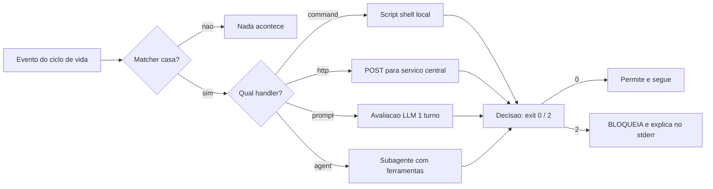

# Capítulo 5: Matchers e handlers: a gramática do disparo

## 1. Introdução

No Capítulo 4, você dominou a camada de autorização — as três portas Deny, Ask e Allow que decidem o destino de cada solicitação. Mas autorizar é só o primeiro canal do contrato de execução. O segundo canal — a interceptação — roda código seu em momentos exatos do ciclo de vida, e a precisão desse disparo depende de duas peças: os matchers, que filtram *quando* o hook roda, e os handlers, que definem *como* ele roda.

Você vai aprender a gramática completa do disparo: os formatos de matcher por nome de ferramenta, por expressão regular e por caminho de arquivo; os quatro tipos de handler — command, http, prompt e agent — e quando cada um é a escolha certa; e o contrato de dados que alimenta cada invocação [1][2]. Ao final, você será capaz de ler qualquer configuração de hooks existente, entender por que ela dispara ou não dispara, e projetar a sua com precisão cirúrgica.

## 2. Explica

### A anatomia de uma declaração de hook

Uma declaração de hook tem duas camadas. A externa associa um **evento** (ex.: `PreToolUse`) a uma lista de **blocos matcher**; cada bloco matcher tem um `matcher` (o filtro) e uma lista de `hooks` (os handlers). A interna define cada handler com um `type` e seus parâmetros [2]:

```json
{
  "hooks": {
    "PreToolUse": [
      {
        "matcher": "Edit|Write",
        "hooks": [
          {"type": "command", "command": "script.sh", "timeout": 30}
        ]
      }
    ]
  }
}
```

A leitura correta: "no evento PreToolUse, quando o filtro `Edit|Write` casar, execute `script.sh`". O matcher é o radar; o handler é a resposta. A mesma arquitetura existe, com variações, nos harnesses concorrentes — o Windsurf/Cascade usa um `hooks.json` com doze eventos e o mesmo padrão de bloqueio por exit code 2 [20], e o OpenCode expõe hooks programáticos em seu `config.json` [22].

### A semântica dos matchers

O matcher é uma linguagem de filtro com três famílias, e a sutileza está em como cada família é interpretada:

- **Nome de ferramenta (PreToolUse, PostToolUse):** nomes literais, case-sensitive, separados por `|` — `"Bash"`, `"Edit|Write"`. Nas versões recentes, também se aceita `"Edit,Write"`. Se o matcher contiver caracteres de regex, ele é avaliado como expressão regular — é assim que se cobre famílias de ferramentas MCP, com padrões como `mcp__github__.*` [2].
- **Escopo de arquivo (FileChanged):** lista de nomes literais separados por `|` — ex.: `".envrc|.env"`. O disparo ocorre quando o arquivo que mudou casa com a lista.
- **Vazio (`""`):** dispara em todas as ocorrências do evento. É o matcher padrão para eventos sem alvo natural, como `Notification` e `SessionStart` [2].

A distinção crítica para o Engenheiro de Governança Agêntica: matcher de ferramenta filtra *pela ferramenta*, não pelo conteúdo. Um matcher `Bash` dispara para todo comando Bash — é o handler, examinando o payload, que decide o que fazer com o comando específico. Confundir essas camadas é fonte clássica de guardrail "que só funciona às vezes".

### Os quatro tipos de handler

Cada tipo de handler é uma ferramenta diferente para o mesmo contrato — receber o payload do evento, executar lógica, devolver uma decisão [1]:

1. **`command`:** executa um script de shell local (bash, python, node). É o trabalho pesado da governança: lógica arbitrária, acesso ao filesystem, integração com ferramentas locais. O mais usado e o mais flexível.
2. **`http`:** envia um POST com o payload JSON do evento para um endpoint. Ideal quando a política vive em um serviço central — o hook vira um cliente da sua API de governança. Suporta `allowedEnvVars` para cabeçalhos seguros.
3. **`prompt`:** executa uma avaliação de um único turno com um LLM. Útil para julgamento semântico — por exemplo, "esta mudança de código é arriscada?" — que regex não alcança.
4. **`agent`:** cria um subagente com acesso a ferramentas para validações profundas. O mais caro e o mais poderoso — uma revisão completa antes de permitir.

A escolha é uma compensação de custo versus capacidade: `command` é barato e determinístico; `prompt` e `agent` são caros e probabilísticos. A regra de ouro: use o determinístico para o que é determinável, e reserve o LLM para o julgamento que não tem regex.

### O contrato de dados

Todo handler recebe o mesmo contrato de entrada: o payload JSON do evento via stdin (para `command`) ou no corpo do POST (para `http`). O payload carrega identidade da sessão, caminho do transcript, diretório de trabalho, nome do evento e os argumentos da ferramenta. E devolve, via stdout + exit code (para `command`) ou corpo da resposta (para `http`), a decisão [2]. Esse contrato é a mesma linguagem em todos os pontos do ciclo de vida — o que você aprendeu no Capítulo 1 sobre exit codes e JSON se aplica aqui, agora com a gramática completa do disparo.

## 3. Ilustra

Na Torre de Controle, os matchers são os **setores do radar**. O controlador não monitora o céu inteiro o tempo todo: configura setores — o setor de aproximação, o setor de taxiamento, o corredor de saída. Um alerta de proximidade no setor de taxiamento não dispara para aeronaves no corredor de saída; cada setor tem seu escopo e sua resposta. O matcher `Bash` é o setor de comandos; o matcher `mcp__github__.*` é o setor das ferramentas GitHub; o matcher vazio é o radar global que cobre tudo.

E os handlers são os **procedimentos de resposta** do setor: o script local é o controlador que conhece o procedimento na ponta da língua (command); o serviço central é o especialista de outra sala consultado via rádio (http); a avaliação por LLM é o julgamento de um supervisor que recebe um resumo (prompt); e o subagente é a equipe de inspeção despachada para verificar a aeronave de perto (agent). Como Engenheiro de Governança Agêntica, você desenha os setores e escolhe o procedimento certo para cada risco.



O diagrama é a máquina do disparo: o matcher decide se o handler acorda; o handler executa; a decisão retorna pelos dois canais que você já domina. Guarde a simetria: matcher = quando, handler = como, decisão = o quê.

## 4. Técnica

### Um guardrail multi-matcher para edições e escrita

Vamos construir um guardrail que protege arquivos sensíveis de edição e escrita. O matcher cobre `Edit|Write`, e o handler examina o caminho do arquivo no payload:

```python
#!/usr/bin/env python3
"""Protege arquivos sensiveis contra Edit/Write (guardrail de matcher)."""
import json
import os
import re
import sys

PROTEGIDOS = [
    re.compile(r"(^|/)\.env(\.|$)"),
    re.compile(r"(^|/)\.git/"),
    re.compile(r"(^|/)id_rsa"),
    re.compile(r"(^|/)package-lock\.json$"),
]


def caminho_sensivel(caminho: str) -> bool:
    """True se o caminho casa algum padrao protegido."""
    normalizado = caminho.replace("\\", "/")
    return any(p.search(normalizado) for p in PROTEGIDOS)


def main() -> int:
    dados = json.load(sys.stdin)
    arquivo = dados.get("tool_input", {}).get("file_path", "")
    if not arquivo:
        return 0
    if caminho_sensivel(arquivo):
        print(
            f"BLOQUEADO: arquivo protegido ({arquivo}). A politica proibe "
            f"alterar secrets, chaves e artefatos de lock.",
            file=sys.stderr,
        )
        return 2
    return 0


if __name__ == "__main__":
    sys.exit(main())
```

E a declaração no settings.json, com o matcher combinando `Edit` e `Write`:

```json
{
  "hooks": {
    "PreToolUse": [
      {
        "matcher": "Edit|Write",
        "hooks": [
          {
            "type": "command",
            "command": "\"$CLAUDE_PROJECT_DIR\"/.claude/hooks/protege-arquivos.py",
            "timeout": 10
          }
        ]
      }
    ]
  }
}
```

Observe a separação de responsabilidades: o matcher de ferramenta filtra *quais ferramentas* acordam o guardrail (só edição e escrita), e o handler filtra *quais arquivos* são perigosos. É a combinação das duas camadas que dá precisão — um guardrail só de matcher seria amplo demais, e um só de handler seria caro demais (rodaria para toda ferramenta).

### O handler HTTP: a política centralizada

Quando a política vive em um serviço central — o que veremos em profundidade no Capítulo 9 — o handler `http` transforma o hook em um cliente da API de governança. Cada tentativa vira uma requisição de autorização em tempo real:

```json
{
  "hooks": {
    "PreToolUse": [
      {
        "matcher": "",
        "hooks": [
          {
            "type": "http",
            "url": "https://governanca.minhaempresa.com/api/v1/authorize",
            "allowedEnvVars": ["GOV_API_KEY"]
          }
        ]
      }
    ]
  }
}
```

A política central tem uma vantagem estrutural: ela é atualizável **sem tocar em nenhuma máquina**. O deny de um novo CVE entra no serviço hoje e vale para todos os agentes amanhã — enquanto uma política de scripts locais exige um rollout de configuração. A contrapartida é a dependência de rede: se o serviço cai, a política não é avaliada. O design maduro trata o timeout do handler como uma decisão de segurança explícita: falhou, bloqueia (fail-closed) ou libera (fail-open), dependendo do seu apetite de risco [10].

### O handler prompt: julgamento semântico onde regex não chega

Algumas decisões não têm regex: "este commit contém informação pessoal?"; "esta mudança de config altera o escopo de acesso?". Para essas, o handler `prompt` delega um julgamento de um turno a um LLM:

```json
{
  "hooks": {
    "UserPromptSubmit": [
      {
        "matcher": "",
        "hooks": [
          {
            "type": "prompt",
            "prompt": "Analise a solicitacao do usuario. Se ela pede acesso a dados pessoais ou segredos, responda apenas BLOQUEAR; caso contrario, PERMITIR.",
            "timeout": 15
          }
        ]
      }
    ]
  }
}
```

A sutileza técnica: o handler `prompt` não é um guardrail determinístico — ele introduz probabilidade no caminho crítico. Use-o com parcimônia e sempre com o `timeout`, e registre a decisão do LLM no canal de auditoria para análise posterior [7][27]. A regra de ouro: determinístico para o que é determinável, LLM apenas para o julgamento residual.

### Testando a gramática: a matriz de disparo

Antes de ir para produção, monte a matriz de disparo do seu guardrail: para cada combinação (evento × matcher × entrada), qual é o resultado esperado? É a auto-validação da gramática:

```bash
# Caso 1: Edit em .env deve BLOQUEAR
echo '{"hook_event_name":"PreToolUse","tool_name":"Edit","tool_input":{"file_path":".env"}}' \
  | python3 .claude/hooks/protege-arquivos.py
echo "exit: $?"

# Caso 2: Write em src/app.py deve PERMITIR
echo '{"hook_event_name":"PreToolUse","tool_name":"Write","tool_input":{"file_path":"src/app.py"}}' \
  | python3 .claude/hooks/protege-arquivos.py
echo "exit: $?"
```

Esperado: caso 1 exit 2, caso 2 exit 0. Se o caso 1 passar, o regex de `.env` não está casando o caminho relativo — ajuste o padrão. Essa matriz é o teste de mesa que separa "configurei" de "funciona".

### O timeout como decisão de segurança

O campo `timeout` de um handler não é um detalhe operacional — é uma decisão de segurança. Um hook que trava indefinidamente segura o ciclo de vida inteiro do agente: a ferramenta não roda, o turno não avança, a sessão congela. E pior: em um handler `http` para a política central, um timeout mal configurado vira um silêncio que o harness interpreta — dependendo da implementação — como aprovação ou bloqueio. A decisão de fail-closed versus fail-open do Capítulo 5 precisa ser explícita e testada [2][10]:

```python
#!/usr/bin/env python3
"""Documenta e valida a politica de timeout dos handlers."""
import json
import sys

TIMEOUTS = {
    "PreToolUse/command/guardrail-bash": {"timeout_s": 10, "falha": "fail_closed"},
    "PreToolUse/command/protege-arquivos": {"timeout_s": 10, "falha": "fail_closed"},
    "PreToolUse/http/politica-central": {"timeout_s": 5, "falha": "fail_closed"},
    "Stop/command/gate-testes": {"timeout_s": 120, "falha": "fail_closed"},
    "UserPromptSubmit/prompt/triagem": {"timeout_s": 15, "falha": "fail_open"},
}


def main() -> int:
    print(f"{"Handler":44s} {"Timeout":8s} {"Postura em falha"}")
    print("-" * 72)
    for nome, config in TIMEOUTS.items():
        print(f"{nome:44s} {config['timeout_s']:>4d}s   {config['falha']}")
    print()
    print("Regras:")
    print("  - Handlers de seguranca (PreToolUse): sempre fail-closed.")
    print("  - Handlers de qualidade (Stop, lint): fail-closed tambem.")
    print("  - Handlers de triagem nao-bloqueante: fail-open documentado.")
    return 0


if __name__ == "__main__":
    sys.exit(main())
```

A postura padrão do Engenheiro de Governança Agêntica é fail-closed para tudo que toca segurança — a indisponibilidade do guardrail bloqueia por padrão, porque o custo de um falso bloqueio (interrupção) é muito menor que o de um falso silêncio (vazamento). A exceção fail-open precisa de justificativa escrita no manifesto, como você verá no Capítulo 10 [10].

### A rastreabilidade dos hooks: quem disparou o quê

Quando um incidente acontece, a primeira pergunta é "qual hook viu o quê?". A rastreabilidade dos hooks exige que cada declaração de hook registre o seu propósito, o seu dono e a versão do script — metadados que não afetam a execução, mas que transformam a configuração em documentação viva. O inventário abaixo é o padrão [2][6]:

```python
#!/usr/bin/env python3
"""Inventario de hooks: metadados de rastreabilidade."""
import json
import sys

HOOKS = [
    {
        "id": "H-001",
        "evento": "PreToolUse",
        "matcher": "Bash",
        "script": ".claude/hooks/guardrail-bash.py",
        "dono": "plataforma",
        "proposito": "bloquear comandos perigosos e reescrever registry",
        "versao_script": "2.1.0",
        "testado": "2026-08-06",
    },
    {
        "id": "H-002",
        "evento": "Stop",
        "matcher": "",
        "script": ".claude/hooks/gate-testes.py",
        "dono": "qa",
        "proposito": "impedir encerramento de turno com testes falhos",
        "versao_script": "1.4.0",
        "testado": "2026-08-05",
    },
]


def main() -> int:
    print(f"{"ID":6s} {"Evento":16s} {"Matcher":12s} {"Dono":12s} {"Versao"}")
    print("-" * 66)
    for hook in HOOKS:
        print(f"{hook['id']:6s} {hook['evento']:16s} {hook['matcher']:12s} {hook['dono']:12s} {hook['versao_script']}")
    print()
    print("O inventario responde: quem é o dono de cada guardrail, o que ele")
    print("faz e quando foi testado — a base da responsabilidade operacional.")
    return 0


if __name__ == "__main__":
    sys.exit(main())
```

O inventário não roda no harness — é um artefato de gestão que a auditoria consulta. Quando um incidente revela um furo num hook, o inventário aponta o dono e a versão em segundos, e a correção vira uma mudança versionada com teste. Sem inventário, a responsabilidade se dissolve no repositório [2][6].

### A gramática como linguagem compartilhada

A gramática do disparo é a linguagem que os guardrails falam — e, como toda linguagem, ela só funciona quando é compartilhada. O time que usa a mesma gramática para descrever, revisar e melhorar os hooks transforma a camada de controle em um bem coletivo: cada guardrail novo nasce com vocabulário conhecido, cada revisão acontece com os mesmos conceitos, cada incidente é descrito com os mesmos termos. A gramática compartilhada é o que permite escalar a governança de um guardião para uma organização sem perder a precisão [2].

A disciplina de compartilhar a gramática tem três práticas: documentar os padrões (o que cada tipo de matcher faz, quando usar cada handler — a referência viva do time), revisar em pares (todo guardrail novo passa pela revisão de quem domina a gramática) e ensinar pelo exemplo (os guardrails existentes são o material didático dos novos membros). O resultado é um círculo virtuoso: a gramática fica mais rica com cada guardrail, e cada guardrail fica mais preciso com a gramática — a camada de controle evolui como um idioma, não como uma coleção de scripts isolados [2][10].

### O ciclo de teste do handler: da mesa à produção

Um handler de hook segue um ciclo de vida de teste em quatro estágios, e o salto entre os estágios é onde a maioria dos guardrails falha. O primeiro estágio é o teste de mesa: o payload de exemplo alimenta o script via stdin, e o resultado é conferido à mão — o que você fez ao longo deste capítulo. O segundo é a matriz automatizada: os casos de exemplo viram um teste executável que roda a cada mudança, garantindo que a correção de um caso não quebra outro. O terceiro é o ensaio em staging: o harness real, o matcher real, um payload real — a prova de que a declaração do settings.json funciona com o script. E o quarto é a produção com observabilidade: o handler ativo, registrando cada execução no painel, com a duração monitorada [2][6].

A regra de ouro do ciclo: nenhum handler vai de mesa direto para produção. O salto direto é a origem dos guardrails que "funcionavam no teste" e falham no mundo real — o matcher que não casa a ferramenta real, o payload que chega diferente do exemplo, o timeout que estoura sob carga. Cada estágio do ciclo elimina uma classe de falha, e o ciclo completo é o que dá ao handler o mesmo nível de confiança que o código de produção exige [2][10].

### A evolução dos matchers: do literal ao regex

A gramática dos matchers evolui com a complexidade da operação: o iniciante começa com matchers literais — o nome exato da ferramenta — e a maturidade traz o regex — a família de ferramentas. A transição é natural: o literal resolve o caso concreto ("quero proteger Edit"), e o regex resolve a categoria ("quero proteger todas as ferramentas MCP"). O padrão `mcp__github__.*` é o exemplo canônico: ele cobre qualquer ferramenta do servidor GitHub do MCP, passada, presente e futura — sem que cada nova ferramenta exija uma linha nova de configuração [2].

A disciplina do regex nos matchers tem três regras. Primeiro, a intenção precisa ser explícita: o matcher `Edit|Write` é interpretado como lista de literais, mas o mesmo texto pode ser lido como regex se contiver metacaracteres — conheça a família exata do seu harness para não depender da ambiguidade. Segundo, teste o matcher contra a matriz real: a matriz de disparo da seção Técnica deve incluir um caso para cada ferramenta nova da família, provando que o regex cobre e que não cobre demais (um regex frouxo casa ferramentas que deveriam escapar). Terceiro, documente o porquê de cada regex: um padrão regex sem comentário é um enigma para o próximo guardião — e um enigma é uma correção errada em potencial [2][10].

### A elegância do matcher vazio

Entre todos os matchers, o vazio é o mais humilde e o mais poderoso ao mesmo tempo. Ele não filtra nada — dispara em toda ocorrência do evento — e é exatamente por isso que ele é o guardião da observabilidade: garante que nada passe despercebido, mesmo quando nenhum matcher específico cobre o caso. O padrão maduro de configuração de hooks sempre inclui pelo menos um matcher vazio por evento crítico, com um handler de registro que documenta tudo [2].

O matcher vazio também é a rede de segurança da evolução: quando uma ferramenta nova chega ao harness, os matchers específicos podem não cobri-la — mas o vazio cobre, e o registro revela a ferramenta nova no painel da semana seguinte. É assim que o guardião descobre o uso não planejado antes que ele vire incidente: não por previsão da lista de ferramentas, mas por observação do que passa pelo vazio. O matcher vazio é a humildade do sistema — a admissão de que não se sabe tudo e a garantia de que, mesmo assim, nada fica invisível [2][6].

### A ordem de avaliação dos matchers e o primeiro-match

Quando um evento tem vários blocos matcher, a ordem da lista importa: o harness avalia os blocos e executa os hooks de cada bloco que casar. Entender essa semântica evita dois erros clássicos: achar que só o primeiro bloco importa (falso — todos os que casam executam) e duplicar hooks acidentalmente (se dois matchers casam o mesmo evento, os dois rodam) [2].

```python
#!/usr/bin/env python3
"""Simula a avaliacao de blocos matcher: quais hooks disparam."""
import json
import re
import sys


def matcher_casa(matcher: str, alvo: str) -> bool:
    """Casa um matcher (literal com | ou regex) contra o alvo."""
    if not matcher:
        return True  # matcher vazio: dispara sempre
    partes = [p for p in matcher.split("|") if p]
    if all(not re.search(r"[.*+()\\[\\]]", p) for p in partes):
        return alvo in partes
    return any(re.search(p, alvo) for p in partes)


def main() -> int:
    config = {
        "blocos": [
            {"matcher": "Edit|Write", "hooks": ["protege-arquivos"]},
            {"matcher": "Bash", "hooks": ["guardrail-bash"]},
            {"matcher": "mcp__github__.*", "hooks": ["audita-mcp"]},
            {"matcher": "", "hooks": ["registra-tudo"]},
        ]
    }
    alvos = ["Edit", "Bash", "mcp__github__list_repos", "Read", "WebFetch"]
    print(f"{"Alvo":26s} {"Hooks disparados"}")
    print("-" * 60)
    for alvo in alvos:
        disparados = []
        for bloco in config["blocos"]:
            if matcher_casa(bloco["matcher"], alvo):
                disparados.extend(bloco["hooks"])
        print(f"{alvo:26s} {', '.join(disparados) if disparados else '(nenhum)'}")
    return 0


if __name__ == "__main__":
    sys.exit(main())
```

Rode e observe as combinações: `Edit` dispara o protetor de arquivos e o registrador universal; `Bash` dispara o guardrail e o registrador; uma ferramenta MCP dispara o auditor de MCP e o registrador; `Read` e `WebFetch` só disparam o registrador. O padrão importante é o matcher vazio: ele é o net de segurança que garante observabilidade total — mesmo o que nenhum matcher específico cobre continua registrado [2].

### O handler http em profundidade: payload, headers e retry

O handler `http` segue o contrato de dados do harness, mas com transporte de rede: o payload do evento vai no corpo do POST, e os cabeçalhos podem carregar autenticação via `allowedEnvVars`. O padrão de produção exige três decisões explícitas: o que fazer em timeout (fail-closed ou fail-open), quantas tentativas e qual o formato da resposta esperada [2].

```python
#!/usr/bin/env python3
"""Cliente da API de governanca: mesmo contrato do handler http."""
import json
import os
import sys
import urllib.error
import urllib.request

API_URL = os.environ.get("GOV_API_URL", "https://governanca.corp/api/v1/authorize")
API_KEY = os.environ.get("GOV_API_KEY", "<sua-chave>")


class PoliticaCentral:
    """Consome a politica central e aplica fail-closed em falhas."""

    def __init__(self, url: str, chave: str, fail_closed: bool = True) -> None:
        self.url = url
        self.chave = chave
        self.fail_closed = fail_closed

    def autorizar(self, payload: dict) -> str:
        """Retorna allow, deny ou ask; falha vira deny se fail_closed."""
        dados = json.dumps(payload).encode("utf-8")
        requisicao = urllib.request.Request(
            self.url,
            data=dados,
            headers={
                "Content-Type": "application/json",
                "Authorization": f"Bearer {self.chave}",
            },
            method="POST",
        )
        try:
            with urllib.request.urlopen(requisicao, timeout=5) as resposta:
                corpo = json.loads(resposta.read().decode("utf-8"))
                return corpo.get("decision", "deny")
        except (urllib.error.URLError, TimeoutError, json.JSONDecodeError):
            return "deny" if self.fail_closed else "allow"


def main() -> int:
    politica = PoliticaCentral(API_URL, API_KEY, fail_closed=True)
    payload = {
        "tool_name": "Bash",
        "tool_input": {"command": "npm publish"},
        "session_id": "sessao-042",
    }
    decisao = politica.autorizar(payload)
    print(f"Decisao da politica central: {decisao}")
    print("Fail-closed ativo: indisponibilidade da API bloqueia por seguranca.")
    return 0 if decisao == "allow" else 1


if __name__ == "__main__":
    sys.exit(main())
```

A decisão de fail-closed versus fail-open é a decisão de apetite de risco do Capítulo 5: em operações com secrets ou produção, fail-closed (indisponibilidade bloqueia); em operações de baixo risco onde o bloqueio total pararia o negócio, fail-open documentado. O ponto inegociável é que a postura seja **explícita e testada** — um timeout que vira silêncio sem decisão documentada é um incidente esperando para acontecer [10].

### O handler agent: a revisão profunda sob demanda

O tipo de handler mais poderoso — e mais caro — é o `agent`: em vez de um script ou uma chamada, o harness cria um subagente com acesso a ferramentas para validar a ação proposta. O caso de uso clássico é a revisão de código antes de permitir uma edição de alto impacto: o subagente roda os testes, analisa a mudança e devolve o veredito [1].

```json
{
  "hooks": {
    "PreToolUse": [
      {
        "matcher": "Edit",
        "hooks": [
          {
            "type": "agent",
            "prompt": "Revise esta edicao: rode os testes afetados, verifique se a mudanca quebra contrato publico e responda APROVAR ou REJEITAR com o motivo.",
            "timeout": 120
          }
        ]
      }
    ]
  }
}
```

O handler `agent` é o mais próximo do julgamento humano disponível no harness: ele não só avalia a intenção (como o `prompt`), como pode *verificar* — rodar testes, inspecionar arquivos, consultar referências. O custo é proporcional: cada invocação consome tempo e tokens, e um `PreToolUse` que espera dois minutos é um gargalo perceptível. A regra de uso: reserve o handler `agent` para as ações onde o erro é caro demais — edição de código crítico, mudança de configuração de segurança — e use `command` para o resto [1][2].

### Tabela: escolhendo o tipo de handler

| Situação | Handler ideal | Por quê |
|---|---|---|
| Bloquear comando/arquivo por padrão fixo | command | Determinístico, barato, local |
| Política central atualizável ao vivo | http | Uma mudança vale para todos |
| Julgamento semântico sem regex | prompt | Entende intenção, custa tokens |
| Validação profunda com ferramentas | agent | Revisão completa, o mais caro |

## 5. Aplica

### Cena de contraste: o guardrail que só protegia o caminho absoluto

Você implementa o guardrail de arquivos protegidos da seção Técnica, testa com caminhos absolutos (`/projetos/app/.env`) e funciona. Dias depois, um incidente: o agente editou `.env` mesmo com o guardrail ativo. Você investiga e descobre que, na sessão real, o payload de `Edit` veio com o caminho **relativo** (`file_path: ".env"`), e seu regex `(^|/)\.env(\.|$)` — testado mentalmente com caminho absoluto — não casa um caminho relativo? Na verdade casa. O problema real: o matcher era `Edit`, mas o agente usou a ferramenta `MultiEdit` para aplicar a alteração, e `MultiEdit` não casa `Edit`.

O diagnóstico: você validou o handler, mas não a **matriz de disparo** — o evento e a ferramenta reais não estavam cobertos pelo matcher. A gramática do disparo tem duas camadas, e a auditoria de segurança precisa testar as duas: o que o matcher deixa passar e o que o handler bloqueia. A correção: ampliar o matcher para cobrir a família de edição (`Edit|Write|MultiEdit`) e adicionar o caso relativo à matriz de teste. A lição do Engenheiro de Governança Agêntica: guardrail sem matriz de disparo é uma hipótese, não uma política [4].

### O padrão de observabilidade dos handlers

Hooks invisíveis são hooks não confiáveis: se o handler roda mas ninguém sabe que rodou, o guardrail existe apenas no papel. O padrão de observabilidade dos handlers adiciona três campos à execução — duração, resultado e decisão — e consolida em um painel. O coletor abaixo é o mesmo padrão do Capítulo 2 aplicado aos handlers, com a métrica de duração que detecta guardrails lentos [2][6]:

```python
#!/usr/bin/env python3
"""Observabilidade dos handlers: duracao, resultado e decisao."""
import json
import os
import sys
import time

LOG = os.environ.get("HANDLER_LOG", ".claude/audit/handlers.jsonl")


def registrar(nome: str, evento: str, matcher: str, decisao: str, duracao_ms: int) -> None:
    """Anexa um registro de execucao do handler."""
    os.makedirs(os.path.dirname(LOG) or ".", exist_ok=True)
    entrada = {
        "ts": time.time(),
        "handler": nome,
        "evento": evento,
        "matcher": matcher,
        "decisao": decisao,
        "duracao_ms": duracao_ms,
    }
    with open(LOG, "a", encoding="utf-8") as arquivo:
        arquivo.write(json.dumps(entrada, ensure_ascii=False) + "\n")


def main() -> int:
    # Simula o registro de um handler apos a execucao.
    registrar("guardrail-bash.py", "PreToolUse", "Bash", "allow", 4)
    registrar("protege-arquivos.py", "PreToolUse", "Edit|Write", "deny", 3)
    registrar("gate-testes.py", "Stop", "", "allow", 1850)
    print(f"Registros de handlers anexados em {LOG}")
    print("A duracao e o sinal de gargalo: p95 acima de 1s merece revisao.")
    return 0


if __name__ == "__main__":
    sys.exit(main())
```

Os três campos contam as três histórias do handler: a duração revela gargalos, o resultado revela falhas silenciosas (um handler que sempre retorna 0 mesmo com erro interno) e a decisão alimenta a telemetria do contrato. Um handler que nunca aparece no log é um guardrail que pode ter morrido sem aviso — e o painel é o que o detecta [2][6].

### O contrato de dados entre harness e handler

A gramática do disparo depende de um contrato de dados estável — e a estabilidade dele é o que permite escrever handlers que sobrevivem a atualizações do harness. O contrato tem três partes: a entrada (payload JSON via stdin), o processamento (a lógica do handler) e a saída (JSON no stdout + exit code). A disciplina do contrato é tratar essas três partes como uma API formal: documentar os campos que você consome, não depender de campos não documentados e testar a entrada com payloads de exemplo [2].

Na prática, o handler robusto começa com uma validação defensiva da entrada: o payload pode vir sem um campo esperado, com tipo diferente ou com valores vazios — e o handler precisa decidir o que fazer em cada caso sem quebrar. O padrão de defesa é o guarda de entrada: extrair cada campo com default seguro, verificar o tipo e tratar a ausência como decisão explícita. Um handler que assume o payload perfeito é um guardrail que falha no pior momento — exatamente quando o payload está malformado porque algo já deu errado [2][10].

A outra metade do contrato é a saída: o JSON de resposta deve ser gerado de forma determinística e validado antes do return. O erro clássico é montar o JSON com f-string e quebrar o escaping — o harness recebe um JSON inválido e interpreta como decisão padrão, anulando o guardrail silenciosamente. A prática segura é construir a saída com uma função dedicada e testá-la com os três casos: decisão, reescrita e contexto. O contrato de dados é a cola da gramática — sem ele, matchers e handlers são peças que não se encaixam.

### Armadilhas comuns

- **Matcher que não cobre a família:** `Edit` não cobre `MultiEdit`; sempre cubra a família real de ferramentas.
- **Falso positivo de regex:** matcher com caracteres de regex sem intenção — `Edit|Write` vira regex e casa outras strings; conheça a família exata.
- **Handler http sem fail-closed explícito:** timeouts podem virar silêncio; decida e documente a postura.
- **Handler prompt no caminho crítico sem timeout:** um LLM lento segura o ciclo; sempre defina timeout.

## 6. Conclusão

Você dominou a gramática do disparo: matchers que filtram por ferramenta, regex e arquivo; handlers que executam como script, serviço, LLM ou subagente; e o contrato de dados que conecta as duas pontas. Construiu um guardrail de arquivos protegidos multi-matcher, centralizou política com http, e aprendeu a montar a matriz de disparo que valida cada combinação antes de produção.

Desafio: escreva a matriz de disparo do seu guardrail mais crítico — quatro combinações reais (ferramenta × entrada), com resultado esperado e resultado observado. No Capítulo 6, você combina toda a gramática no ponto mais tenso do ciclo de vida: o PreToolUse e a arte do bloqueio, com exit codes, reescrita de comandos e o JSON refinado de decisão.

## 7. Referências Bibliográficas

[1] ANTHROPIC. *Hooks Guide*. Disponível em: https://code.claude.com/docs/en/hooks-guide. Acesso em: 06 ago. 2026.
[2] ANTHROPIC. *Hooks Reference*. Disponível em: https://code.claude.com/docs/en/hooks. Acesso em: 06 ago. 2026.
[3] ANTHROPIC. *Settings Reference*. Disponível em: https://code.claude.com/docs/en/settings. Acesso em: 06 ago. 2026.
[4] ANTHROPIC. *Configure Permissions*. Disponível em: https://code.claude.com/docs/en/permissions. Acesso em: 06 ago. 2026.
[5] ANTHROPIC. *Enterprise Admin Setup*. Disponível em: https://code.claude.com/docs/en/admin-setup. Acesso em: 06 ago. 2026.
[6] ANTHROPIC. *Access Audit Logs*. Disponível em: https://support.claude.com/en/articles/9970975-access-audit-logs. Acesso em: 06 ago. 2026.
[7] OWASP. *Top 10 for LLM Applications*. Disponível em: https://genai.owasp.org/. Acesso em: 06 ago. 2026.
[8] OWASP. *Top 10 for Agentic Applications*. Disponível em: https://genai.owasp.org/. Acesso em: 06 ago. 2026.
[9] MITRE. *ATLAS — Adversarial Threat Landscape for Artificial-Intelligence Systems*. Disponível em: https://atlas.mitre.org/. Acesso em: 06 ago. 2026.
[10] CLOUD SECURITY ALLIANCE. *MAESTRO & Agentic Threat Research*. Disponível em: https://labs.cloudsecurityalliance.org/agentic/csa-research-note-atlas-agentic-gap-analysis-20260327/. Acesso em: 06 ago. 2026.
[11] CLOUD SECURITY ALLIANCE. *Security Guidance for Critical Areas of Focus in Cloud Computing*. Disponível em: https://cloudsecurityalliance.org/. Acesso em: 06 ago. 2026.
[12] NIST. *AI Risk Management Framework (AI RMF 1.0)*. Disponível em: https://www.nist.gov/itl/ai-risk-management-framework. Acesso em: 06 ago. 2026.
[13] ISO. *ISO/IEC 42001:2023 — Information technology — Artificial intelligence — Management system*. Disponível em: https://www.iso.org/standard/81230.html. Acesso em: 06 ago. 2026.
[14] EUROPEAN UNION. *Regulation (EU) 2024/1689 (EU AI Act)*. Disponível em: https://eur-lex.europa.eu/eli/reg/2024/1689/oj. Acesso em: 06 ago. 2026.
[15] CYCODE. *OWASP Top 10 for Agentic Applications 2026 Explained*. Disponível em: https://cycode.com/blog/owasp-top-10-agentic-applications/. Acesso em: 06 ago. 2026.
[16] AUTH0. *Lessons from OWASP Top 10 for Agentic Applications: Least Privilege to Least Agency*. Disponível em: https://auth0.com/blog/owasp-top-10-agentic-applications-lessons/. Acesso em: 06 ago. 2026.
[17] MODULOS. *OWASP Top 10 for Agentic Applications (2026) Governance Guide*. Disponível em: https://docs.modulos.ai/frameworks/owasp-top-10-agentic/. Acesso em: 06 ago. 2026.
[18] GITHUB. *Adding repository custom instructions for GitHub Copilot*. Disponível em: https://docs.github.com/copilot/customizing-copilot/adding-custom-instructions-for-github-copilot. Acesso em: 06 ago. 2026.
[19] GITHUB. *AGENTS.md file for GitHub Copilot*. Disponível em: https://docs.github.com/copilot/customizing-copilot/adding-custom-instructions-for-github-copilot. Acesso em: 06 ago. 2026.
[20] DEVIAN. *Windsurf Cascade Hooks*. Disponível em: https://docs.devin.ai/desktop/cascade/hooks. Acesso em: 06 ago. 2026.
[21] ROO CODE. *Auto-Approving Actions*. Disponível em: https://roocodeinc.github.io/Roo-Code/features/auto-approving-actions/. Acesso em: 06 ago. 2026.
[22] OPENCODE. *OpenCode Configuration*. Disponível em: https://opencode.ai/docs/config/. Acesso em: 06 ago. 2026.
[23] ANTHROPIC. *Claude Code on GitHub*. Disponível em: https://github.com/anthropics/claude-code. Acesso em: 06 ago. 2026.
[24] ANTHROPIC. *Model Context Protocol Documentation*. Disponível em: https://modelcontextprotocol.io/. Acesso em: 06 ago. 2026.
[25] GOOGLE. *gVisor — Application Kernel for Containers*. Disponível em: https://gvisor.dev/. Acesso em: 06 ago. 2026.
[26] DOCKER. *Docker security best practices*. Disponível em: https://docs.docker.com/engine/security/. Acesso em: 06 ago. 2026.
[27] OWASP. *Prompt Injection — OWASP Cheat Sheet*. Disponível em: https://cheatsheetseries.owasp.org/cheatsheets/Prompt_Injection_Cheat_Sheet.html. Acesso em: 06 ago. 2026.
[28] OWASP. *LLM Tool Poisoning — OWASP Top 10 for LLM Applications*. Disponível em: https://genai.owasp.org/. Acesso em: 06 ago. 2026.
[29] CURSOR. *Rules Documentation*. Disponível em: https://cursor.com/docs/context/rules. Acesso em: 06 ago. 2026.
[30] CLINE. *Cline VS Code Extension*. Disponível em: https://github.com/cline/cline. Acesso em: 06 ago. 2026.
