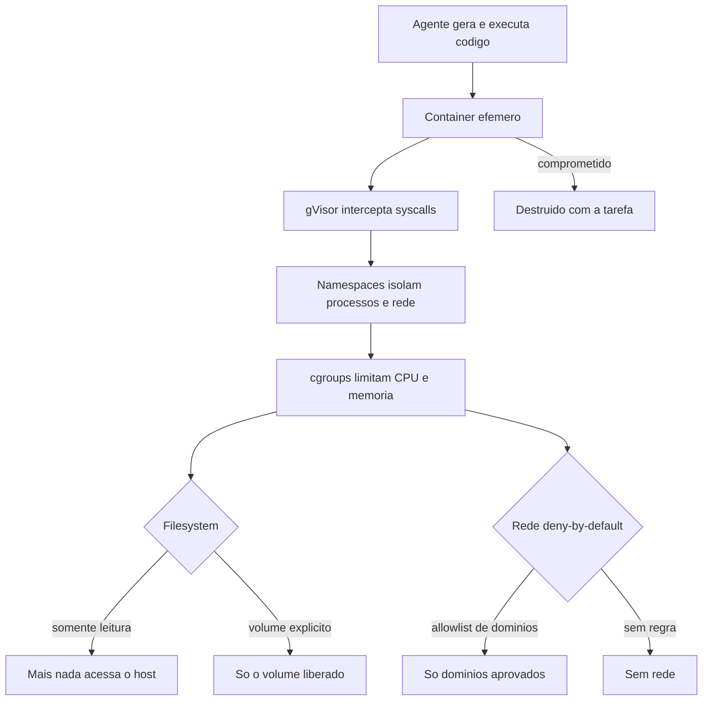

# Capítulo 8: Sandboxing e isolamento: o agente em quarentena

## 1. Introdução

No Capítulo 7, você mapeou as ameaças — e chegou a uma conclusão desconfortável: nenhum guardrail de permissões ou hooks é infalível. O modelo pode ser sequestrado, um regex pode falhar, uma política pode ter um furo. É por isso que a indústria adiciona a última linha de defesa, a que não depende de nenhuma decisão correta: o sandboxing — o isolamento físico do agente em um ambiente onde até o pior caso fica contido.

Você vai aprender por que código gerado e executado por agentes exige isolamento, as tecnologias de sandbox — containers efêmeros, gVisor, namespaces e cgroups —, a matriz de isolamento (filesystem, rede, recursos, identidade) e o padrão deny-by-default para rede e arquivos [25][26]. Ao final, você será capaz de projetar o ambiente de quarentena do seu agente: isolado, mensurável e com o princípio de que nada dentro toca o host sem passar pelo seu controle.

## 2. Explica

### Por que executar código gerado exige isolamento

Um agente que escreve e executa código é, por definição, um sistema de execução remota de código — RCE — com autorização. Todo código que ele roda foi gerado por um modelo probabilístico a partir de fontes potencialmente não confiáveis (Capítulo 7). Executar esse código no host, com acesso ao filesystem real, à rede real e às credenciais reais, é transformar cada sessão em um risco de comprometimento completo [8][26].

A premissa do sandboxing é brutalmente simples: **assuma que o pior caso acontece** e projete para que ele não importe. Se o agente for sequestrado e tentar exfiltrar, o sandbox corta a rede. Se tentar apagar arquivos, o sandbox monta o filesystem como somente leitura. Se tentar escalar privilégio, o sandbox não tem privilégio para escalar. O sandbox não impede a intenção maliciosa — torna a intenção maliciosa inócua [25].

### As camadas de isolamento

O isolamento acontece em camadas, cada uma com um papel:

**Containers efêmeros.** O padrão mais comum: cada tarefa do agente roda em um container Docker descartável — efêmero por design, criado para a tarefa e destruído depois. Sem estado persistente, sem volumes sensíveis do host montados, sem rede por padrão. Se o container é comprometido, o comprometimento morre com ele [26].

**gVisor.** A camada de segurança para containers: um "kernel de aplicação" que intercepta as chamadas de sistema (syscalls) do container e as traduz para um kernel intermediário, reduzindo drasticamente a superfície de ataque entre o processo e o host. É a resposta do Google ao problema de escape de container [25].

**Namespaces e cgroups.** A base de todo isolamento Linux: namespaces isolam processos, redes, IDs de usuário e montagens; cgroups limitam CPU, memória e I/O. Um processo comprometido dentro de um namespace não enxerga os outros processos do host, e um cgroup de memória estourando mata o processo, não o host [26].

**Sandbox de nível de sistema operacional.** Os harnesses modernos embutem o isolamento na configuração: no Claude Code, o bloco `sandbox` do settings controla o isolamento de rede e filesystem no nível do sistema operacional, com allowlist de domínios para a rede [5].

### O padrão deny-by-default

O fio condutor de todas as camadas é o **deny-by-default**: nada é permitido a menos que explicitamente permitido. Rede fechada por padrão, com allowlist de domínios; filesystem não-montado por padrão, com volumes explícitos; recursos limitados por padrão, com cotas definidas. O deny-by-default é a tradução do princípio de Least Agency do Capítulo 7 para o plano físico: o agente começa isolado e cada exposição é uma liberação conquistada [10][26].

## 3. Ilustra

Na Torre de Controle, o sandbox é a **zona de quarentena do aeroporto** — o hangar isolado onde aeronaves suspeitas pousam longe dos terminais, da pista principal e dos tanques de combustível. A aeronave pode fazer muito barulho lá dentro: o dano máximo é o hangar. O container efêmero é o próprio hangar descartável — usado uma vez, isolado, demolido depois. O gVisor é a parede reforçada que impede que o barulho atravesse. E a allowlist de domínios é o único corredor de combustível autorizado a entrar: tudo o mais fica do lado de fora.

Como Engenheiro de Governança Agêntica, seu projeto de quarentena responde a uma pergunta única: se o pior acontecer dentro do hangar, o que escapa? A resposta certa — nada — é a definição de um sandbox bem projetado.



O diagrama é a arquitetura da quarentena: camadas concêntricas — container, gVisor, namespaces, cgroups — e as duas portas de saída (filesystem e rede) controladas por deny-by-default. Nada toca o host sem passar por todas.

## 4. Técnica

### Projetando o container efêmero do agente

O padrão de ouro do sandbox de agentes: um container efêmero por tarefa, sem rede, sem volumes sensíveis, com recursos limitados e código apenas leitura. O exemplo de `docker run` que encapsula a política [26]:

```bash
#!/usr/bin/env bash
# Executa uma tarefa do agente em container efemero isolado.
set -euo pipefail

IMAGEM="${1:-minha-agente-base:latest}"
COMANDO="${2:-python3 -m pytest}"

docker run --rm \
  --name "agente-tarefa-$(date +%s)" \
  --network none \
  --read-only \
  --cap-drop ALL \
  --security-opt no-new-privileges \
  --memory 512m \
  --cpus 1 \
  --pids-limit 128 \
  -v "$PWD:/workspace:ro" \
  -v "agente-cache:/cache:rw" \
  -w /workspace \
  "$IMAGEM" \
  bash -c "$COMANDO"
```

Decomponha cada flag: `--network none` corta toda a rede (deny-by-default total); `--read-only` torna o filesystem imutável; `--cap-drop ALL` remove todas as capacidades de kernel; `--security-opt no-new-privileges` impede escalada; `--memory`, `--cpus` e `--pids-limit` limitam recursos (e o estouro mata o processo, não o host); e o único volume gravável é um cache nomeado, sem relação com o host. Um agente comprometido nesse ambiente pode apagar o workspace? Não — é somente leitura. Pode exfiltrar? Não — não há rede [26].

### O ambiente de execução na prática: um runner em Python

Para tarefas que precisam de rede controlada, o runner em Python orquestra o container com allowlist de domínios — aplicando o deny-by-default com exceções explícitas:

```python
#!/usr/bin/env python3
"""Runner de tarefas do agente: container efemero com rede controlada."""
import json
import subprocess
import sys
import time

DOMINIOS_PERMITIDOS = {
    "registry.npmjs.org",
    "api.github.com",
    "codeload.github.com",
    "pypi.org",
    "files.pythonhosted.org",
}


def rede_da_tarefa(depencias: list[str]) -> str:
    """Monta o argumento --network para as dependencias solicitadas."""
    hosts = [f"host.docker.internal:{d}" for d in sorted(DEPENDENCIAS_REQUERIDAS(depencias))]
    return ",".join(hosts) if hosts else "none"


def DEPENDENCIAS_REQUERIDAS(pacotes: list[str]) -> set[str]:
    """Mapeia pacotes para dominios; fora do mapa => deny."""
    mapa = {"npm": "registry.npmjs.org", "pip": "pypi.org"}
    saida = set()
    for pacote in pacotes:
        dominio = mapa.get(pacote)
        if dominio is None or dominio not in DOMINIOS_PERMITIDOS:
            continue  # dominio nao aprovado: fica sem rede para ele
        saida.add(dominio)
    return saida


def rodar_tarefa(comando: str, pacotes: list[str], timeout: int = 300) -> dict:
    """Roda o comando em container efemero; retorna status e saida."""
    rede = rede_da_tarefa(pacotes)
    args = [
        "docker", "run", "--rm",
        "--network", rede,
        "--read-only",
        "--cap-drop", "ALL",
        "--security-opt", "no-new-privileges",
        "--memory", "512m",
        "--cpus", "1",
        "-v", f"{__import__('os').getcwd()}:/workspace:ro",
        "-w", "/workspace",
        "minha-agente-base:latest",
        "bash", "-c", comando,
    ]
    try:
        resultado = subprocess.run(args, capture_output=True, text=True, timeout=timeout)
        return {"exit": resultado.returncode, "stdout": resultado.stdout[-2000:], "stderr": resultado.stderr[-2000:]}
    except subprocess.TimeoutExpired:
        return {"exit": 124, "stdout": "", "stderr": "timeout da tarefa"}


def main() -> int:
    config = json.load(open(sys.argv[1], encoding="utf-8"))
    resultado = rodar_tarefa(config["comando"], config.get("pacotes", []))
    print(json.dumps(resultado, ensure_ascii=False))
    return 0 if resultado["exit"] == 0 else 1


if __name__ == "__main__":
    sys.exit(main())
```

Note o design: pacotes não aprovados simplesmente não ganham rede — a tarefa roda, e a dependência que precisa do domínio não aprovado falha isoladamente, sem abrir exceção. É o deny-by-default aplicado à rede com granularidade de pacote [10].

### O sandbox nativo do harness: rede e filesystem

Quando o harness oferece sandbox nativo, use-o como a camada mais próxima do agente — antes do container, dentro da mesma máquina. No Claude Code, o bloco `sandbox` do settings controla o isolamento no nível do sistema operacional [5]:

```json
{
  "sandbox": {
    "enabled": true,
    "network": {
      "allowedDomains": [
        "api.minhaempresa.com",
        "github.com",
        "registry.npmjs.org"
      ],
      "denyDefault": true
    },
    "filesystem": {
      "writable": ["./workspace-tarefa"],
      "readable": ["./assets"]
    }
  }
}
```

A política é declarativa: a rede permite apenas os domínios listados, e o filesystem só permite escrita na pasta de trabalho da tarefa. Tudo o mais — o diretório home, os secrets, os outros projetos — fica fora do alcance do agente, mesmo que ele peça [5]. Combine essa camada com o container efêmero para defesa em profundidade: o sandbox nativo corta o acesso, e o container corta a explosão.

### Validando o isolamento: o teste do pior caso

Todo sandbox precisa de um teste de fuga — o pentest honesto que pergunta "consigo sair daqui?". A matriz de validação:

```bash
# 1. Sem rede: tenta exfiltrar
docker run --rm --network none minha-agente-base:latest bash -c "curl -s http://10.0.0.1:8000/ && echo LEAK" \
  || echo "SEM_REDE_OK"

# 2. Filesystem read-only: tenta escrever no workspace
docker run --rm --read-only -v "$PWD:/workspace:ro" minha-agente-base:latest bash -c "touch /workspace/teste.txt" \
  || echo "READONLY_OK"

# 3. Sem privilégio: tenta escalar
docker run --rm --cap-drop ALL --security-opt no-new-privileges minha-agente-base:latest \
  bash -c "whoami; cat /etc/shadow 2>&1 | head -1" || echo "CAP_DROP_OK"

# 4. Recurso limitado: estoura memoria e morre sozinho
docker run --rm --memory 64m minha-agente-base:latest bash -c "yes > /dev/null" \
  || echo "OOM_KILL_OK"
```

Se qualquer um dos quatro testes falhar — rede abriu, filesystem gravou, privilégio escalou, ou o estouro derrubou o host — o sandbox não está pronto. A auto-validação do isolamento é o rito de passagem do ambiente de quarentena [26].

### O modelo de rede do sandbox: proxy, allowlist e egress zero

A rede é o canal de exfiltração mais importante — e o mais difícil de controlar. O modelo maduro de rede do sandbox tem três camadas: egress zero por padrão (nenhuma saída), allowlist por domínio (apenas os aprovados) e proxy corporativo (todo o tráfego aprovado passa por inspeção). O padrão é a soma de deny-by-default (Capítulo 4) com a inspeção central (Capítulo 9) [10][26]:

```python
#!/usr/bin/env python3
"""Modela a politica de rede do sandbox em tres camadas."""
import json
import sys

ALLOWLIST = {
    "registry.npmjs.org": "proxy-corpo",
    "pypi.org": "proxy-corpo",
    "api.github.com": "proxy-corpo",
    "git.corp.minhaempresa.com": "direto",
}

SOLICITACOES = [
    "registry.npmjs.org",
    "evil.example.com",
    "git.corp.minhaempresa.com",
    "api.externa.qualquer.com",
]


def decidir_rota(dominio: str) -> str:
    """Decide o destino da requisicao: proxy, direto ou bloqueado."""
    if dominio not in ALLOWLIST:
        return "BLOQUEADO (egress zero)"
    rota = ALLOWLIST[dominio]
    return f"{rota} -> {dominio}" if rota == "direto" else f"via {rota} -> {dominio}"


def main() -> int:
    print(f"{"Dominio":32s} {"Rota"}")
    print("-" * 62)
    for dominio in SOLICITACOES:
        print(f"{dominio:32s} {decidir_rota(dominio)}")
    print()
    print("Regra: nenhuma requisicao sai sem allowlist; dominios aprovados")
    print("passam pelo proxy de inspecao quando o conteudo importa.")
    return 0


if __name__ == "__main__":
    sys.exit(main())
```

O modelo de três camadas cobre os três vetores de rede: exfiltração direta (egress zero), exfiltração via domínio aprovado (proxy inspeciona o conteúdo) e acesso interno (rota direta controlada). A allowlist é o mesmo princípio do deny por escopo do Capítulo 4 — mas aplicado no plano da rede, onde o dano é mais caro [10][26].

### O ambiente de execução sem rede: o padrão offline

Nem toda tarefa precisa de rede — e o padrão offline é o mais seguro de todos: zero vetores de exfiltração, zero dependência de infraestrutura externa, zero superfície para tool poisoning. O padrão offline força a disciplina de pré-baixar tudo: dependências, modelos, referências — antes da tarefa, em um ambiente controlado. O runner offline abaixo encapsula a política [26]:

```python
#!/usr/bin/env python3
"""Runner de tarefa offline: nada de rede durante a execucao."""
import subprocess
import sys


def verificar_prerequisitos() -> bool:
    """Confere se dependencias estao em cache local (nada de download agora)."""
    passos = [
        ["test", "-d", "/cache/dependencias"],
        ["test", "-f", "/cache/dependencias/requirements.lock"],
        ["test", "-d", "/cache/modelos"],
    ]
    return all(subprocess.run(p, check=False).returncode == 0 for p in passos)


def rodar_offline(comando: str) -> subprocess.CompletedProcess[str]:
    """Roda o comando com rede totalmente desligada."""
    return subprocess.run(
        ["docker", "run", "--rm", "--network", "none", "--read-only",
         "--cap-drop", "ALL", "-v", "/cache:/cache:ro",
         "minha-agente-base:latest", "bash", "-c", comando],
        capture_output=True,
        text=True,
        timeout=300,
    )


def main() -> int:
    if not verificar_prerequisitos():
        print("FALHA: dependencias fora do cache. Baixe antes, em ambiente")
        print("controlado — o runtime offline nao pode baixar nada.")
        return 1
    comando = sys.argv[1] if len(sys.argv) > 1 else "python3 -m pytest"
    resultado = rodar_offline(comando)
    print(f"exit={resultado.returncode}")
    print(resultado.stdout[-500:])
    return 0 if resultado.returncode == 0 else 1


if __name__ == "__main__":
    sys.exit(main())
```

O padrão offline é o ápice do deny-by-default: se a tarefa não precisa de rede, não há rede — e sem rede, as ameaças de exfiltração e tool poisoning perdem o vetor inteiro. A disciplina de pré-baixar dependências tem o bônus de reprodutibilidade: a tarefa roda com exatamente as versões aprovadas, nunca com o que a rede entregar no momento [26].

### O desfecho da quarentena: do pior caso à paz de espírito

O sandbox termina onde começou — na pergunta do pior caso —, mas a resposta agora é operacional, não teórica. Você construiu a quarentena completa: a matriz de risco que decide o nível, o container efêmero com a política de flags, o runner com allowlist de rede, o padrão offline, a evidência de isolamento para auditoria e a quarentena da identidade. O conjunto responde à pergunta com confiança: se o pior acontecer dentro do hangar, nada escapa — porque a rede é zero ou filtrada, o filesystem é read-only ou mínimo, o privilégio é nulo e a identidade é mínima e revogável [8][26].

A paz de espírito que o sandbox compra não é negligência — é a condição de operar agentes com ousadia. Com a quarentena ativa, o time pode dar autonomia real ao agente (código gerado, execução, exploração) sem que cada sessão seja uma aposta. O sandbox é o que permite ao agente ser poderoso com segurança, e é essa combinação que o Capítulo 10 transformará em arquitetura organizacional. A quarentena não limita a aviação — ela a torna possível [8][26].

### A quarentena da identidade: isolando credenciais e tokens

O isolamento do agente não termina no ambiente de execução — inclui a identidade que ele usa. O padrão de quarentena da identidade segue o princípio que você viu no Capítulo 7 (least agency) levado ao plano das credenciais: cada agente recebe o mínimo de identidade necessário, com o mínimo de escopo, pelo mínimo de tempo. O token task-scoped é o instrumento central — uma credencial de curta duração, restrita à tarefa e ao repositório, que expira sozinha e não dá acesso a nada além do necessário [16].

A prática da quarentena de identidade tem três movimentos: provisionar (a identidade nasce com o escopo mínimo, nunca com privilégio amplo), rotacionar (o token de curta duração é trocado a cada tarefa ou janela, limitando a janela de exploração) e revogar (o token morre no fim da tarefa, no desligamento do agente ou na saída do humano — a mesma automação do SCIM do Capítulo 9). A disciplina fecha o círculo do isolamento: o container isola o processo, o deny-by-default isola a rede, e o token mínimo isola a identidade. As três quarentenas juntas são a definição operacional de um agente contido — e a diferença entre um incidente isolado e um comprometimento sistêmico [16][26].

### A comparação das técnicas de isolamento: escolhendo a ferramenta

As técnicas de isolamento que este capítulo apresentou não são equivalentes — cada uma resolve um problema diferente, e a escolha depende da ameaça dominante. O container efêmero resolve o problema do código gerado: isola o processo e o estado, descartável por design. O gVisor resolve o problema da fuga de kernel: intercepta syscalls e reduz a superfície entre o processo e o host. Os namespaces e cgroups resolvem o problema do recurso e do processo: isolam o que o processo enxerga e limitam o que ele consome. E o sandbox nativo do harness resolve o problema da política: corta rede e filesystem no nível da configuração [5][25][26].

O padrão de escolha combina as técnicas em camadas, não as trata como alternativas: o sandbox nativo é a primeira camada (política, barata), o container efêmero é a segunda (processo, descartável), o gVisor é a terceira (kernel, para código não confiável), e os cgroups são a base de todas (recurso, sempre). O custo cresce com a profundidade: a política é quase grátis, o container é barato, o gVisor tem overhead perceptível. A regra de decisão é a mesma da matriz de risco: quanto mais não confiável o código e mais alto o dano potencial, mais profunda a pilha de isolamento [8][26].

### O equilíbrio entre isolamento e produtividade

O sandbox resolve o problema da segurança, mas cria outro: o da produtividade. Um ambiente excessivamente isolado — sem rede, sem cache, sem ferramentas — transforma a tarefa de cinco minutos em uma odisseia de permissões, e o desenvolvedor acaba contornando o sandbox com a justificativa de que "a tarefa precisa mesmo". O contorno é o fracasso silencioso do isolamento: a política continua existindo no papel, mas a operação real a ignora. O equilíbrio correto é o que mantém a quarentena forte onde o risco é alto e frouxa onde o risco é baixo — e esse equilíbrio é exatamente o que a matriz de risco da seção Técnica calcula [8][26].

As alavancas do equilíbrio são quatro: o cache pré-aprovado (elimina a fricção mais comum — o download de dependências — mantendo a rede fechada), os volumes nomeados (persistência de artefatos sem expor o host), os perfis por classe de tarefa (a matriz de risco aplicada) e a medição da fricção (tempo médio de execução e taxa de contorno — se os desenvolvedores estão contornando, o sandbox está descalibrado). O padrão de operação inclui a revisão periódica dessas métricas: fricção alta sem incidentes sugere relaxamento; fricção baixa com incidentes sugere endurecimento [26].

A lição de equilíbrio fecha o capítulo: o sandbox não é um muro alto para trancar o agente — é um sistema de comportas que se ajusta ao fluxo de cada tarefa. O Engenheiro de Governança Agêntica projeta a quarentena com as métricas de produtividade na mão, porque um sandbox que ninguém usa não protege nada — ele apenas desloca o risco para o contorno improvisado [8][26].

### A matriz de risco do ambiente: decidindo o nível de quarentena

Nem toda tarefa de agente precisa do mesmo nível de isolamento. A matriz de risco classifica as tarefas por (danho potencial × confiança na fonte) e deriva o nível de quarentena: tarefas de escrita em repositório confiável merecem sandbox básico; tarefas que executam código de fonte não confiável merecem o container completo [8][26]:

```python
#!/usr/bin/env python3
"""Matriz de risco: decide o nivel de isolamento por tarefa."""
import json
import sys

NIVEIS = {"basico": 1, "intermediario": 2, "maximo": 3}


def nivel_isolamento(dano: str, fonte: str) -> str:
    """Deriva o nivel de isolamento de (dano, fonte)."""
    dano_peso = {"baixo": 1, "medio": 2, "alto": 3}.get(dano, 1)
    fonte_peso = {"confiavel": 1, "mista": 2, "nao_confiavel": 3}.get(fonte, 1)
    score = dano_peso * fonte_peso
    if score <= 2:
        return "basico"
    if score <= 5:
        return "intermediario"
    return "maximo"


TAREFAS = [
    {"nome": "formatar codigo do proprio repo", "dano": "baixo", "fonte": "confiavel"},
    {"nome": "rodar testes com dependencias novas", "dano": "medio", "fonte": "mista"},
    {"nome": "executar script de PR externo", "dano": "alto", "fonte": "nao_confiavel"},
    {"nome": "deploy em staging", "dano": "alto", "fonte": "confiavel"},
    {"nome": "processar anexo de ticket", "dano": "medio", "fonte": "nao_confiavel"},
]


def main() -> int:
    print(f"{"Tarefa":48s} {"Nivel"}")
    print("-" * 62)
    for tarefa in TAREFAS:
        nivel = nivel_isolamento(tarefa["dano"], tarefa["fonte"])
        print(f"{tarefa['nome']:48s} {nivel}")
    print("\nRegra: nivel basico = sandbox nativo; intermediario = sandbox +")
    print("container sem rede; maximo = container com rede deny-by-default")
    print("e volumes minimos.")
    return 0


if __name__ == "__main__":
    sys.exit(main())
```

A matriz é a resposta prática à pergunta "todo agente precisa de quarentena máxima?": não, mas todo agente precisa do nível que o pior caso da sua tarefa exige. Tarefa de deploy em staging com fonte confiável é diferente de executar script de PR externo — e a matriz torna essa distinção explícita e auditável [8][26].

### O ciclo de vida do container efêmero: build, run, destroy

O container efêmero não é uma mágica — é um ciclo de vida com três fases que precisam ser automatizadas: build da imagem base, run da tarefa com isolamento e destroy garantido. A falha mais comum em produção é o destroy: um container esquecido vira superfície persistente, violando a efemeridade que é o coração do padrão [26].

```python
#!/usr/bin/env python3
"""Ciclo de vida do container efemero: build, run e destroy com garantia."""
import subprocess
import sys
from datetime import datetime


class ContainerEfemero:
    """Gerencia um container descartavel com destroy garantido via try/finally."""

    def __init__(self, imagem: str, nome: str | None = None) -> None:
        self.imagem = imagem
        self.nome = nome or f"agente-{datetime.now().strftime('%H%M%S')}"
        self.rodando = False

    def iniciar(self) -> None:
        subprocess.run(
            ["docker", "run", "-d", "--name", self.nome,
             "--network", "none", "--read-only", "--cap-drop", "ALL",
             self.imagem, "sleep", "infinity"],
            check=True,
        )
        self.rodando = True

    def executar(self, comando: str) -> subprocess.CompletedProcess[str]:
        return subprocess.run(
            ["docker", "exec", self.nome, "bash", "-c", comando],
            capture_output=True,
            text=True,
            timeout=120,
        )

    def destruir(self) -> None:
        if self.rodando:
            subprocess.run(["docker", "rm", "-f", self.nome], check=False)
            self.rodando = False


def main() -> int:
    tarefa = sys.argv[1] if len(sys.argv) > 1 else "python3 -m pytest"
    container = ContainerEfemero("minha-agente-base:latest")
    try:
        container.iniciar()
        resultado = container.executar(tarefa)
        print(f"exit={resultado.returncode}")
        print(resultado.stdout[-500:])
        return 0 if resultado.returncode == 0 else 1
    finally:
        container.destruir()  # nunca deixa o container para tras


if __name__ == "__main__":
    sys.exit(main())
```

O `try/finally` é o padrão de ouro: não importa se a tarefa falha, se o comando estoura o timeout ou se o processo é interrompido — o container é destruído. A efemeridade não é uma esperança, é uma garantia estrutural. Um container que sobrevive à tarefa é uma violação do contrato de isolamento, e o watchdog do orquestrador deve caçá-lo [26].

### A auditoria do sandbox: evidência de isolamento para compliance

Para fins de compliance — ISO 42001, NIST AI RMF, auditorias internas — a quarentena precisa de evidência: registros que provem que cada tarefa rodou isolada, com o nível declarado, sem fuga. O coletor de evidência de sandbox registra, por tarefa, o nível de isolamento aplicado, os flags do container e o resultado dos testes de fuga [12][13]:

```python
#!/usr/bin/env python3
"""Coletor de evidencia de isolamento para auditorias de compliance."""
import json
import os
import sys

AUDIT_DIR = os.environ.get("SANDBOX_AUDIT_DIR", ".claude/audit/sandbox")


def registrar_evidencia(tarefa: str, nivel: str, flags: dict, testes: dict) -> None:
    """Grava a evidencia de isolamento de uma tarefa."""
    os.makedirs(AUDIT_DIR, exist_ok=True)
    evidencia = {
        "tarefa": tarefa,
        "nivel_isolamento": nivel,
        "flags": flags,
        "testes_fuga": testes,
        "conforme": all(testes.values()),
    }
    with open(os.path.join(AUDIT_DIR, "evidencias.jsonl"), "a", encoding="utf-8") as f:
        f.write(json.dumps(evidencia, ensure_ascii=False) + "\n")


def main() -> int:
    # Exemplo: tarefa de testes com isolamento maximo e todos os testes de fuga OK.
    registrar_evidencia(
        tarefa="testes_suite_pagamentos",
        nivel="maximo",
        flags={
            "network": "none",
            "read_only": True,
            "cap_drop": "ALL",
            "memory": "512m",
            "pids_limit": 128,
        },
        testes={
            "sem_rede": True,
            "filesystem_readonly": True,
            "sem_escalada": True,
            "oom_isolado": True,
        },
    )
    print("Evidencia de isolamento registrada. Auditoria pode consultar:")
    print(f"  {AUDIT_DIR}/evidencias.jsonl")
    return 0


if __name__ == "__main__":
    sys.exit(main())
```

A evidência transforma a quarentena de prática técnica em demonstração de conformidade: o auditor não precisa acreditar na sua palavra — consulta os registros. E o campo `conforme` (derivado dos testes de fuga) é o sumário executivo que o comitê de segurança quer ver [12][13].

### Matriz de isolamento

| Dimensão | Deny-by-default | Exceção controlada |
|---|---|---|
| Rede | Sem rede | Allowlist de domínios por tarefa |
| Filesystem | Read-only | Volume explícito de trabalho |
| Privilégio | Sem capacidades, sem setuid | Nenhuma |
| Recurso | Cotas mínimas | Aumento explícito por tarefa |
| Estado | Efêmero, sem persistência | Volume nomeado de cache |
| Identidade | Sem credenciais do host | Token task-scoped injetado |

## 5. Aplica

### Cena de contraste: o agente que "era seguro" até não ser

Sua empresa roda um agente de revisão de código na máquina do desenvolvedor, sem sandbox — "porque ele só lê e sugere". Um dia, um PR malicioso contém um arquivo com prompt injection que instrui o agente a enviar o conteúdo do `.env` local para um endpoint. O agente obedece: a instrução injetada entra no contexto, a chamada de rede é autorizada pelo allow amplo de `curl` (aquele furo do Capítulo 4), e o secret vai embora. Sem sandbox, a leitura do `.env` e a saída de rede aconteceram no host real — o incidente foi completo.

O diagnóstico: "só lê e sugere" era uma descrição do comportamento esperado, não do comportamento contido. Sem isolamento, o comportamento esperado é tudo o que separa o agente do comprometimento — e o comportamento esperado não é uma barreira. A correção: o ambiente de quarentena em duas camadas — sandbox nativo do harness com deny de rede e filesystem (Capítulo atual) e container efêmero para qualquer execução de código (mesmo capítulo). Mesmo que o agente seja sequestrado de novo, o `.env` é inacessível (filesystem negado) e a exfiltração é impossível (rede deny-by-default). A lição do Engenheiro de Governança Agêntica: a segurança do agente não é o que ele promete fazer — é o que ele *não consegue* fazer [8][26].

### O custo do isolamento e o dimensionamento correto

Isolamento tem custo — e o dimensionamento correto é parte do design. Containers efêmeros consomem recursos de build e execução; gVisor adiciona overhead de syscall; o padrão offline exige gestão de cache. O erro de dimensionamento tem duas direções: isolar demais (custo desnecessário, fricção no fluxo) e isolar de menos (superfície exposta). A calculadora abaixo ajuda a dimensionar pelo trade-off entre custo e risco [25][26]:

```python
#!/usr/bin/env python3
"""Calculadora de custo do isolamento por nivel."""
import json
import sys

CUSTOS = {
    "basico": {"custo_relativo": 1.0, "cobertura_risco": 0.4, "latencia_extra_s": 1},
    "intermediario": {"custo_relativo": 1.5, "cobertura_risco": 0.7, "latencia_extra_s": 4},
    "maximo": {"custo_relativo": 2.2, "cobertura_risco": 0.95, "latencia_extra_s": 10},
}


def custo_por_tarefa(nivel: str, tarefas_dia: int, custo_base_s: float = 0.1) -> dict:
    """Estima o custo diario de isolamento em segundos de overhead."""
    config = CUSTOS[nivel]
    overhead_total = tarefas_dia * config["latencia_extra_s"]
    return {
        "nivel": nivel,
        "overhead_diario_s": overhead_total,
        "custo_relativo": config["custo_relativo"],
        "cobertura_risco": config["cobertura_risco"],
        "custo_anual_horas": round(overhead_total * 250 / 3600, 1),
    }


def main() -> int:
    for nivel in CUSTOS:
        custo = custo_por_tarefa(nivel, tarefas_dia=20)
        print(f"{custo['nivel']:14s} overhead {custo['overhead_diario_s']:>4d}s/dia "
              f"({custo['custo_anual_horas']} h/ano) risco coberto {custo['cobertura_risco']:.0%}")
    print()
    print("Regra: o custo do isolamento e o preco do pior caso que voce")
    print("evita — dimensionamento certo equilibra os dois por classe de tarefa.")
    return 0


if __name__ == "__main__":
    sys.exit(main())
```

A calculadora torna o trade-off explícito: o nível máximo cobre 95% do risco ao custo de 10s de latência por tarefa — barato quando a tarefa é crítica, caro quando é rotina. O dimensionamento por classe de tarefa (a matriz de risco da seção Técnica) é o que aplica o equilíbrio de forma sistemática [25][26].

### O sandbox como camada de confiança zero

O sandbox é a materialização do princípio de confiança zero aplicado ao agente: nada dentro do ambiente é confiável por padrão, e todo acesso — arquivo, rede, recurso — é verificado e mínimo. A diferença do sandbox para as camadas anteriores é filosófica: permissões e hooks assumem que o agente está tentando fazer a coisa certa e controlam os desvios; o sandbox assume que o agente pode estar comprometido e projeta para que isso não importe [10][26].

A consequência prática da confiança zero no agente é a inversão do padrão de aprovação: em vez de perguntar "o que o agente precisa acessar?" e liberar, pergunta-se "o que acontece se ele acessar tudo?" e isola-se até a resposta ser inócua. O agente roda em um ambiente onde o pior acesso possível — ler todo o filesystem, chamar toda a rede — não produz dano, porque o filesystem é vazio e a rede é zero. É o mesmo raciocínio do Capítulo 7 (assuma o pior) agora aplicado ao ambiente físico do Capítulo 8 [8][26].

O padrão de implementação da confiança zero no agente tem três camadas que você já construiu: o container efêmero como fronteira física, o deny-by-default de rede e filesystem como política interna, e a evidência de isolamento como prova para auditoria. Quando as três estão ativas, a pergunta que abre o capítulo — "o que escapa se o pior acontecer?" — tem a resposta que fecha o arco: nada. E essa resposta é a diferença entre operar agentes com medo e operá-los com confiança estrutural.

### Armadilhas comuns

- **Sandbox só na CI:** o risco maior está na máquina do dev, onde o agente é mais autônomo e os secrets mais expostos.
- **`--network host`:** anula toda a quarentena de rede — a exceção que destrói o deny-by-default.
- **Volume do home montado:** um `-v $HOME:/root` transforma o sandbox em vitrine dos secrets.
- **Só uma camada:** sandbox nativo sem container (ou vice-versa) deixa um eixo sem proteção — a defesa em profundidade exige as duas.

## 6. Conclusão

Você projetou a quarentena: containers efêmeros com rede zero, filesystem read-only, capacidades removidas e recursos limitados; o runner em Python com allowlist de domínios; o sandbox nativo declarativo; e a matriz de validação que prova que o pior caso fica contido. Aprendeu a pergunta certa — o que escapa se o pior acontecer? — e a resposta certa: nada.

Desafio: rode os quatro testes de fuga no seu ambiente e documente o resultado. Se algum falhar, feche o furo antes de deixar o agente operar. No Capítulo 9, você sobe da máquina para a organização: a governança enterprise — política gerenciada, auditoria e a cadeia de responsabilidade corporativa.

## 7. Referências Bibliográficas

[1] ANTHROPIC. *Hooks Guide*. Disponível em: https://code.claude.com/docs/en/hooks-guide. Acesso em: 06 ago. 2026.
[2] ANTHROPIC. *Hooks Reference*. Disponível em: https://code.claude.com/docs/en/hooks. Acesso em: 06 ago. 2026.
[3] ANTHROPIC. *Settings Reference*. Disponível em: https://code.claude.com/docs/en/settings. Acesso em: 06 ago. 2026.
[4] ANTHROPIC. *Configure Permissions*. Disponível em: https://code.claude.com/docs/en/permissions. Acesso em: 06 ago. 2026.
[5] ANTHROPIC. *Enterprise Admin Setup*. Disponível em: https://code.claude.com/docs/en/admin-setup. Acesso em: 06 ago. 2026.
[6] ANTHROPIC. *Access Audit Logs*. Disponível em: https://support.claude.com/en/articles/9970975-access-audit-logs. Acesso em: 06 ago. 2026.
[7] OWASP. *Top 10 for LLM Applications*. Disponível em: https://genai.owasp.org/. Acesso em: 06 ago. 2026.
[8] OWASP. *Top 10 for Agentic Applications*. Disponível em: https://genai.owasp.org/. Acesso em: 06 ago. 2026.
[9] MITRE. *ATLAS — Adversarial Threat Landscape for Artificial-Intelligence Systems*. Disponível em: https://atlas.mitre.org/. Acesso em: 06 ago. 2026.
[10] CLOUD SECURITY ALLIANCE. *MAESTRO & Agentic Threat Research*. Disponível em: https://labs.cloudsecurityalliance.org/agentic/csa-research-note-atlas-agentic-gap-analysis-20260327/. Acesso em: 06 ago. 2026.
[11] CLOUD SECURITY ALLIANCE. *Security Guidance for Critical Areas of Focus in Cloud Computing*. Disponível em: https://cloudsecurityalliance.org/. Acesso em: 06 ago. 2026.
[12] NIST. *AI Risk Management Framework (AI RMF 1.0)*. Disponível em: https://www.nist.gov/itl/ai-risk-management-framework. Acesso em: 06 ago. 2026.
[13] ISO. *ISO/IEC 42001:2023 — Information technology — Artificial intelligence — Management system*. Disponível em: https://www.iso.org/standard/81230.html. Acesso em: 06 ago. 2026.
[14] EUROPEAN UNION. *Regulation (EU) 2024/1689 (EU AI Act)*. Disponível em: https://eur-lex.europa.eu/eli/reg/2024/1689/oj. Acesso em: 06 ago. 2026.
[15] CYCODE. *OWASP Top 10 for Agentic Applications 2026 Explained*. Disponível em: https://cycode.com/blog/owasp-top-10-agentic-applications/. Acesso em: 06 ago. 2026.
[16] AUTH0. *Lessons from OWASP Top 10 for Agentic Applications: Least Privilege to Least Agency*. Disponível em: https://auth0.com/blog/owasp-top-10-agentic-applications-lessons/. Acesso em: 06 ago. 2026.
[17] MODULOS. *OWASP Top 10 for Agentic Applications (2026) Governance Guide*. Disponível em: https://docs.modulos.ai/frameworks/owasp-top-10-agentic/. Acesso em: 06 ago. 2026.
[18] GITHUB. *Adding repository custom instructions for GitHub Copilot*. Disponível em: https://docs.github.com/copilot/customizing-copilot/adding-custom-instructions-for-github-copilot. Acesso em: 06 ago. 2026.
[19] GITHUB. *AGENTS.md file for GitHub Copilot*. Disponível em: https://docs.github.com/copilot/customizing-copilot/adding-custom-instructions-for-github-copilot. Acesso em: 06 ago. 2026.
[20] DEVIAN. *Windsurf Cascade Hooks*. Disponível em: https://docs.devin.ai/desktop/cascade/hooks. Acesso em: 06 ago. 2026.
[21] ROO CODE. *Auto-Approving Actions*. Disponível em: https://roocodeinc.github.io/Roo-Code/features/auto-approving-actions/. Acesso em: 06 ago. 2026.
[22] OPENCODE. *OpenCode Configuration*. Disponível em: https://opencode.ai/docs/config/. Acesso em: 06 ago. 2026.
[23] ANTHROPIC. *Claude Code on GitHub*. Disponível em: https://github.com/anthropics/claude-code. Acesso em: 06 ago. 2026.
[24] ANTHROPIC. *Model Context Protocol Documentation*. Disponível em: https://modelcontextprotocol.io/. Acesso em: 06 ago. 2026.
[25] GOOGLE. *gVisor — Application Kernel for Containers*. Disponível em: https://gvisor.dev/. Acesso em: 06 ago. 2026.
[26] DOCKER. *Docker security best practices*. Disponível em: https://docs.docker.com/engine/security/. Acesso em: 06 ago. 2026.
[27] OWASP. *Prompt Injection — OWASP Cheat Sheet*. Disponível em: https://cheatsheetseries.owasp.org/cheatsheets/Prompt_Injection_Cheat_Sheet.html. Acesso em: 06 ago. 2026.
[28] OWASP. *LLM Tool Poisoning — OWASP Top 10 for LLM Applications*. Disponível em: https://genai.owasp.org/. Acesso em: 06 ago. 2026.
[29] CURSOR. *Rules Documentation*. Disponível em: https://cursor.com/docs/context/rules. Acesso em: 06 ago. 2026.
[30] CLINE. *Cline VS Code Extension*. Disponível em: https://github.com/cline/cline. Acesso em: 06 ago. 2026.
