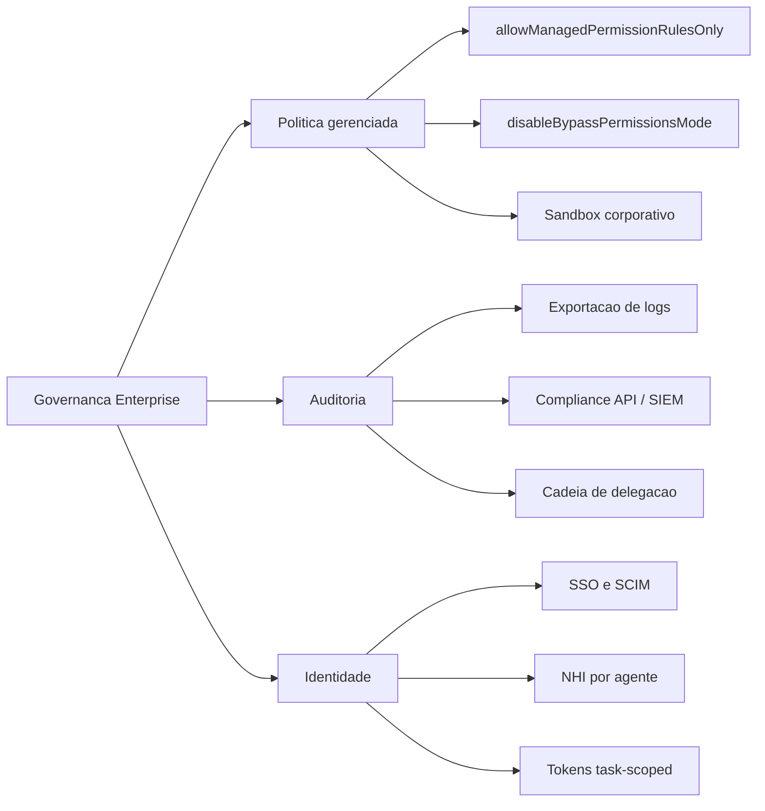

# Capítulo 9: Governança enterprise: política gerenciada e auditoria

## 1. Introdução

Nos Capítulos 1 a 8, você dominou a governança na escala da máquina e do time: permissões, hooks, ameaças e sandbox. Mas a pergunta que fecha a obra começa a doer exatamente quando o número de agentes cresce: como levar isso à escala organizacional? Como garantir que *nenhum* agente de *nenhuma* equipe fuja da política — mesmo quando o desenvolvedor quer fugir?

Este capítulo responde com a governança enterprise: a política gerenciada que a empresa impõe e que o dev não pode burlar, os audit logs que registram quem fez o quê, quando e por quê, e a cadeia de responsabilidade que conecta cada ação do agente a um humano [5][6]. Ao final, você será capaz de desenhar o programa de governança da sua organização — política, auditoria e identidade — com a mesma precisão com que desenhou os guardrails da sua máquina.

## 2. Explica

### A política gerenciada: o teto da cascata

Você conheceu a cascata de escopos no Capítulo 3, com o managed no topo. A governança enterprise é o que transforma esse topo em realidade: a política gerenciada é entregue por três canais — servidor remoto (console administrativo), MDM corporativo (plist no macOS, chaves de registro no Windows) e arquivos de sistema (`/etc/claude-code/` em Linux/WSL) — e não pode ser sobrescrita por nenhum desenvolvedor [5].

O poder da política gerenciada está em duas chaves específicas. `allowManagedPermissionRulesOnly` impede que usuários e projetos definam regras de permissão próprias — só valem as corporativas. E `permissions.disableBypassPermissionsMode` desliga a fuga clássica: o modo de pulo de permissões deixa de existir para todo mundo [5]. São essas duas chaves que convertem uma política documentada em uma política **imposta** — a diferença entre o manual de segurança na intranet e a fechadura na porta.

### A auditoria: a caixa-preta corporativa

A outra metade da governança é a evidência. Os audit logs exportáveis cobrem eventos como autenticação SSO, modificações de projetos, convites e operações de conta — e podem ser consumidos programaticamente pela Compliance API, integrável a ferramentas SIEM como Datadog [6]. A cadeia completa de auditoria agêntica vai além dos eventos de conta: registra a cadeia de delegação — qual usuário disparou a tarefa, qual orquestrador planejou, quais subagentes executaram — com logs imutáveis e contextuais [10][11].

A pergunta que a auditoria responde é a pergunta de qualquer investigação pós-incidente: **quem autorizou?** Num ambiente com agentes, "quem" tem três níveis: o humano que disparou, o harness que aplicou as políticas, e o agente que executou. A auditoria precisa registrar os três, ou a responsabilidade se dissolve [6].

### Identidade: o ciclo de vida do acesso do agente

A terceira perna é a identidade. No mundo enterprise, o acesso ao harness é provisionado por SSO e SCIM — o agente herda a identidade e o ciclo de vida do funcionário: entra quando ele entra, sai quando ele sai [5]. E no plano técnico, cada agente deve ter sua própria identidade não-humana (NHI), com tokens task-scoped de curta duração — o princípio de Least Agency do Capítulo 7 aplicado à identidade: o agente começa com o menor acesso possível e cada liberação é conquistada [16].

## 3. Ilustra

Na Torre de Controle, a governança enterprise é o **regulador nacional de aviação** — o órgão que define o espaço aéreo, as regras de separação e os requisitos de licenciamento, e que tem o poder de suspender uma companhia inteira. Os controladores da torre (os desenvolvedores) podem ajustar procedimentos locais, mas não podem reduzir a separação mínima, e não podem desligar a gravação das comunicações — a caixa-preta é obrigatória, não opcional.

O regulador tem três instrumentos: a **regra imposta** (política gerenciada, inegociável), a **caixa-preta obrigatória** (auditoria, imutável) e o **licenciamento** (identidade, com ciclo de vida). Como Engenheiro de Governança Agêntica, seu trabalho na escala enterprise é desenhar os três — e garantir que nenhum voo decole sem os três em vigor.



O diagrama fixa o tripé: política (o que é imposto), auditoria (o que é provado) e identidade (quem é o agente). Os nove filhos são os instrumentos concretos que você vai ativar nos próximos passos.

## 4. Técnica

### Ativando a política gerenciada via arquivo de sistema

No Linux/WSL, a política gerenciada vive em `/etc/claude-code/`. O arquivo corporativo — que nenhum desenvolvedor pode editar sem privilégio de sistema — ativa o modo de política estrita [5]:

```json
{
  "allowManagedPermissionRulesOnly": true,
  "permissions": {
    "disableBypassPermissionsMode": true
  },
  "sandbox": {
    "enabled": true,
    "network": {
      "allowedDomains": [
        "api.minhaempresa.com",
        "github.com",
        "git.minhaempresa.com",
        "registry.npmjs.org"
      ]
    }
  },
  "env": {
    "AGENT_TELEMETRY_ENDPOINT": "https://telemetria.minhaempresa.com/ingest"
  }
}
```

Com `allowManagedPermissionRulesOnly`, o `.claude/settings.json` do projeto e o `settings.local.json` do desenvolvedor deixam de influenciar permissões — só o que está aqui vale. Com `disableBypassPermissionsMode`, a flag `--dangerously-skip-permissions` morre: nenhum desenvolvedor pode reativar o modo de risco na máquina de trabalho. E o sandbox com allowlist de domínios corta a rede corporativa ao que a empresa aprova [5].

### O portal de auditoria: coletando a cadeia de delegação

A auditoria agêntica não espera o incidente: coleta continuamente. O coletor abaixo registra, para cada ação de ferramenta, a cadeia completa — sessão, ferramenta, comando, decisão do guardrail e o humano dono da sessão:

```python
#!/usr/bin/env python3
"""Coletor de auditoria: registra a cadeia de delegacao de cada acao."""
import hashlib
import json
import os
import sys
import time
from datetime import datetime, timezone

AUDIT_DIR = os.environ.get("AUDIT_DIR", "/var/log/agentes/auditoria")
MODO = os.environ.get("AUDIT_MODO", "registrar")  # registrar | validar | simular


def hash_da_sessao(session_id: str) -> str:
    """Hash deterministico para indexar a sessao sem expor o transcript."""
    return hashlib.sha256(session_id.encode()).hexdigest()[:16]


def registrar(entrada: dict) -> None:
    """Anexa a entrada de auditoria ao arquivo diario, com lacre de tempo."""
    os.makedirs(AUDIT_DIR, exist_ok=True)
    data = datetime.now(timezone.utc).strftime("%Y-%m-%d")
    arquivo = os.path.join(AUDIT_DIR, f"auditoria-{data}.jsonl")
    entrada["ts"] = time.time()
    entrada["registrado_por"] = os.environ.get("AUDIT_ORIGEM", "coletor-v1")
    with open(arquivo, "a", encoding="utf-8") as saida:
        saida.write(json.dumps(entrada, ensure_ascii=False) + "\n")


def main() -> int:
    dados = json.load(sys.stdin)
    evento = dados.get("hook_event_name")
    if evento not in ("PreToolUse", "PostToolUse"):
        return 0

    entrada = {
        "evento": evento,
        "session_hash": hash_da_sessao(dados.get("session_id", "")),
        "ferramenta": dados.get("tool_name"),
        "cwd": dados.get("cwd"),
        "decisao": "permitida" if evento == "PostToolUse" else "avaliada",
    }
    if evento == "PreToolUse" and dados.get("tool_name") == "Bash":
        entrada["comando_hash"] = hash_da_sessao(
            dados.get("tool_input", {}).get("command", "")
        )

    registrar(entrada)
    return 0


if __name__ == "__main__":
    sys.exit(main())
```

O coletor não decide nada — apenas registra, com hashes para o comando (evitando gravar secrets em claro) e lacre temporal. É a base da investigação pós-incidente: com a cadeia de delegação, você responde "qual sessão, qual ferramenta, qual comando, quem autorizou".

### Consultando a auditoria com a Compliance API

Quando a política é central, a consulta de auditoria também é. O padrão SIEM — exportar eventos da Compliance API para o Datadog ou equivalente — permite correlacionar ações de agentes com o resto da telemetria corporativa [6]:

```python
#!/usr/bin/env python3
"""Exemplo: consulta a Compliance API e filtra eventos de permissao."""
import json
import os
import sys
import urllib.request

API_BASE = os.environ.get("COMPLIANCE_API", "https://api.minhaempresa.com/compliance")
API_KEY = os.environ.get("COMPLIANCE_API_KEY", "<sua-chave>")


def buscar_eventos(ultimos_dias: int = 7) -> list[dict]:
    """Busca eventos de auditoria dos ultimos N dias."""
    requisicao = urllib.request.Request(
        f"{API_BASE}/events?window={ultimos_dias}d",
        headers={"Authorization": f"Bearer {API_KEY}"},
    )
    with urllib.request.urlopen(requisicao, timeout=30) as resposta:
        return json.load(resposta).get("events", [])


def resumo_semanal() -> None:
    """Imprime resumo dos eventos de acesso e permissao da semana."""
    eventos = buscar_eventos()
    por_tipo: dict[str, int] = {}
    for evento in eventos:
        tipo = evento.get("type", "desconhecido")
        por_tipo[tipo] = por_tipo.get(tipo, 0) + 1
    print(json.dumps(por_tipo, indent=2, sort_keys=True))


if __name__ == "__main__":
    resumo_semanal() if "--resumo" in sys.argv else None
```

O padrão é o mesmo de qualquer integração SIEM: extrair, filtrar, correlacionar. A diferença é o objeto: aqui, o que se correlaciona é a atividade dos agentes com a identidade e a política — fechando o triângulo da responsabilidade [6][11].

### O provisionamento de identidade via SCIM

Na ponta da identidade, o provisionamento automático via SCIM garante o ciclo de vida: quando o funcionário entra, a identidade do agente é criada; quando sai, é revogada — sem intervenção manual. O fluxo de onboarding do agente:

```bash
#!/usr/bin/env bash
# Onboarding de identidade de agente (exemplo didatico do fluxo SCIM).
set -euo pipefail

USUARIO="${1:?informe o email do usuario}"
AGENTE_ROLE="${2:-desenvolvedor}"

echo "== Provisionando identidade nao-humana (NHI) para: $USUARIO"
echo "  - grupo de escopo:   app-agentes-$AGENTE_ROLE"
echo "  - token:             task-scoped, expira em 24h"
echo "  - politica:          herdada do grupo (least agency)"

# Em producao, este fluxo chama a API de identidade (Okta/Azure AD/SCIM)
# e grava o token no cofre (Vault/Secrets Manager) com TTL de 24h.
echo "  - cofre:             segredo/agentes/$USUARIO (TTL 24h)"
echo "== Identidade pronta. Auditoria registrara o provisionamento."
```

O padrão operacional: identidade por usuário, escopo por grupo, token de curta duração e registro no cofre. A revogação é o espelho — o SCIM remove o grupo, o token expira sozinho, e o acesso do agente morre com o acesso do funcionário [5][16].

### O compliance em escala: a evidência para auditorias externas

Quando a organização passa por auditorias externas — SOC 2, ISO 42001, avaliações de cliente — a camada de controle agêntica precisa falar a língua da evidência. O pacote de compliance para agentes tem quatro artefatos: a política (o que está em vigor), a evidência de enforcement (os logs de bloqueio e aprovação), a evidência de isolamento (os registros de sandbox do Capítulo 8) e a trilha de auditoria (a cadeia de delegação). O gerador abaixo compila o pacote a partir dos registros [12][13]:

```python
#!/usr/bin/env python3
"""Compila o pacote de evidencia de compliance da camada de controle."""
import json
import os
import sys
from collections import Counter
from pathlib import Path

AUDIT_DIR = os.environ.get("AUDIT_DIR", ".claude/audit")


def compilar_pacote() -> dict:
    """Compila metricas e evidencias a partir dos registros existentes."""
    contadores = Counter()
    caminho = Path(AUDIT_DIR) / "caixa_preta.jsonl"
    if caminho.exists():
        for linha in caminho.read_text(encoding="utf-8").splitlines():
            try:
                entrada = json.loads(linha)
                contadores[entrada.get("decisao", "desconhecida")] += 1
            except json.JSONDecodeError:
                continue
    total = sum(contadores.values())
    return {
        "eventos_totais": total,
        "taxa_bloqueio": round(contadores.get("deny", 0) / total, 3) if total else 0.0,
        "taxa_aprovacao_humana": round(contadores.get("allow_apos_ask", 0) / total, 3) if total else 0.0,
        "cobertura_auditoria": 1.0 if total else 0.0,
        "politica_versao": "2.1.0",
        "ultima_revisao": "2026-08-06",
        "dono": "engenharia-de-plataforma",
    }


def main() -> int:
    pacote = compilar_pacote()
    print(json.dumps(pacote, ensure_ascii=False, indent=2))
    print()
    print("Este resumo executivo acompanha os logs brutos na resposta ao")
    print("auditor: politica vigente, evidencia de enforcement e cobertura.")
    return 0 if pacote["cobertura_auditoria"] >= 0.99 else 1


if __name__ == "__main__":
    sys.exit(main())
```

O pacote de compliance responde às perguntas do auditor sem caça aos registros: a política tem versão e dono; o enforcement tem taxas mensuráveis; a cobertura de auditoria é declarada. A disciplina do pacote é a mesma do Capítulo 2 — o que não é medido não pode ser comprovado — agora na língua do compliance [12][13].

### A comunicação de incidente: o informe executivo

Quando o incidente acontece, a comunicação é parte da resposta. O informe executivo de incidente agêntico tem um formato fixo que evita o pânico e o ruído: o que aconteceu, o que foi contido, o que foi exposto, o que mudou na política. O gerador abaixo produz o informe a partir dos dados do runbook — e garante que a organização inteira receba a mesma versão dos fatos [6][11]:

```python
#!/usr/bin/env python3
"""Gera o informe executivo de um incidente com agente."""
import json
import sys
from datetime import datetime


def gerar_informe(incidente: dict) -> dict:
    """Monta o informe executivo com as cinco secoes fixas."""
    return {
        "titulo": f"Incidente {incidente['id']}: {incidente['sintoma']}",
        "data": datetime.now().strftime("%Y-%m-%d %H:%M"),
        "resumo": incidente.get("resumo", "agente executou acao fora da politica"),
        "contido": incidente.get("contido", "kill switch acionado em 40s"),
        "exposto": incidente.get("exposto", "nenhum dado sensivel confirmado"),
        "mudancas_na_politica": incidente.get("mudancas", ["deny amplo para ferramentas de rede"]),
        "proximos_passos": ["revisao da cadeia de delegacao", "atualizacao do modelo de ameacas"],
    }


def main() -> int:
    incidente = {
        "id": "INC-2026-041",
        "sintoma": "tool misuse com tentativa de exfiltracao",
        "resumo": "agente tentou enviar conteudo de arquivo local para dominio externo",
        "contido": "deny de rede bloqueou a saida; kill switch desligou a sessao",
        "exposto": "nenhum dado saiu do ambiente (confirmado por auditoria)",
        "mudancas": ["deny Bash(curl *) e Bash(wget *) adicionados ao managed"],
    }
    informe = gerar_informe(incidente)
    print(json.dumps(informe, ensure_ascii=False, indent=2))
    print()
    print("O informe vai para stakeholders e auditoria na mesma versao;")
    print("detalhes tecnicos completos ficam no relatorio do runbook.")
    return 0


if __name__ == "__main__":
    sys.exit(main())
```

O informe executivo cumpre dois papéis: informa a organização com a mesma versão dos fatos (evitando o rumor) e estabelece o tom de responsabilidade (contido, exposto, mudanças). A seção "mudanças na política" fecha o ciclo: todo incidente vira aprendizado registrado, nunca uma lição esquecida [6][11].

### O desfecho do tripé: a governança que escala

O tripé da governança enterprise — política, auditoria e identidade — fecha o capítulo com a promessa de escala: o que funcionava para um time, com configuração de projeto e auditoria manual, continua funcionando para a organização, com política gerenciada, SIEM e SCIM — porque a lógica é a mesma, apenas o instrumento muda. A política imposta substitui a recomendada, a auditoria automatizada substitui a manual, e a identidade provisionada substitui a criada à mão. A escala não exige um sistema novo — exige os mesmos princípios com instrumentos de nível enterprise [5][6].

O desfecho é também a promessa de continuidade: a governança enterprise não é o fim da jornada, é a condição de ela continuar. Com o tripé de pé, a organização pode adotar agentes novos, casos de uso novos e até harnesses novos (o Capítulo 10) sem recomeçar do zero — a política absorve, a auditoria observa e a identidade controla. O Capítulo 10 fecha o arco transformando o tripé em plano de voo, mas a fundação que o sustenta é a que você construiu aqui: a governança que escala é a governança que sobrevive ao próprio crescimento [5][6][12].

### A auditoria como cultura: do relatório ao hábito

A auditoria deixa de ser um projeto e vira cultura quando a coleta deixa de ser percebida como burocracia e passa a ser percebida como proteção. A transição é organizacional: a equipe que consulta a auditoria antes de decidir — "o que os agentes fizeram na semana passada?" — vira a equipe que opera com evidência, e a operação com evidência é a que aprende mais rápido com os próprios erros [6][12]. O ritual da cultura de auditoria tem três momentos: a consulta semanal (o painel lido pelo time, com as anomalias discutidas), a investigação orientada (todo incidente começa com a consulta à cadeia de delegação, nunca com a opinião) e a retrospectiva (o que a auditoria revelou que ninguém sabia) [6][11].

O sinal de que a cultura se instalou é sutil e decisivo: quando um erro acontece, a primeira pergunta do time deixa de ser "quem errou?" e passa a ser "o que a auditoria mostra?". A pergunta muda porque a auditoria permite — ela documenta o que aconteceu sem julgamento prévio, e a investigação parte dos fatos em vez de partir da culpa. A cultura da auditoria é o que transforma a governança de um conjunto de ferramentas em um modo de operar — e é o legado mais durável que o Engenheiro de Governança Agêntica deixa na organização [6][11][12].

### O custo da auditoria: dimensionando a coleta

Auditoria completa tem custo — armazenamento, processamento, privacidade — e o dimensionamento da coleta é uma decisão de engenharia. O erro de dimensionamento tem duas direções: coletar demais (custo e exposição de privacidade sem valor) e coletar de menos (lacunas na investigação pós-incidente). O padrão maduro de dimensionamento parte do que a investigação precisa responder e volta à coleta: cada registro coletado precisa de uma pergunta que ele responde, e cada pergunta importante precisa de um registro que a responda [6][11].

O dimensionamento em três faixas organiza a coleta: o essencial (sempre: sessão, ferramenta, decisão, timestamp — barato e cobre a maioria das investigações), o detalhado (sob demanda ou para operações sensíveis: comando hasheado, motivo do bloqueio — custo médio) e o completo (por janela curta ou investigação ativa: conteúdo de prompt, diffs — caro, retenção curta). A faixa de cada operação depende do apetite de risco e do valor dos dados que ela toca — a mesma lógica da matriz de risco do Capítulo 8, aplicada à auditoria [6][11][12]. A disciplina do dimensionamento tem o bônus de privacidade: coletar o mínimo necessário é também a postura que os frameworks regulatórios exigem — e a auditoria que coleta demais vira, ela mesma, um risco de exposição [12][14].

### A governança além do harness: o contexto regulatório

A governança enterprise de agentes não acontece no vácuo — ela conversa com o contexto regulatório que a indústria de IA vem construindo. O NIST AI RMF oferece o vocabulário de funções (governar, mapear, medir, gerenciar) que organiza qualquer programa de governança agêntica; a ISO/IEC 42001 fornece o sistema de gestão no qual a política de agentes se encaixa como um processo auditável; e o EU AI Act introduz, para sistemas de alto risco, exigências de gestão de riscos, supervisão humana e robustez — exatamente as três pernas que você construiu nos capítulos anteriores (política, HITL e sandbox) [12][13][14].

A leitura madura do contexto regulatório não é o medo da multa — é o alinhamento de vocabulário: quando a auditoria externa pergunta sobre gestão de riscos de IA, a resposta é o seu modelo de ameaças (Capítulo 7); quando pergunta sobre supervisão humana, a resposta é o seu fluxo de asks e o HITL (Capítulo 4); quando pergunta sobre robustez, a resposta é o seu sandbox e a defesa em profundidade (Capítulo 8). A camada de controle que este livro ensina não é apenas boa prática — é a implementação técnica do que os frameworks regulatórios pedem, e saber traduzir entre as duas linguagens é uma competência executiva do Engenheiro de Governança Agêntica [12][14].

### O plano de resposta a incidentes agêntico

A governança enterprise não termina na prevenção — ela define o que acontece quando a prevenção falha. O plano de resposta a incidentes agêntico adapta o ciclo clássico (detectar, conter, erradicar, recuperar, aprender) para o vocabulário do agente: detectar via auditoria, conter via kill switch, erradicar via revogação de identidade, recuperar via restauração de logs, aprender via atualização do modelo de ameaças [6][11]:

```python
#!/usr/bin/env python3
"""Runbook de resposta a incidente com agente comprometido."""
import json
import sys
from dataclasses import dataclass, field


@dataclass
class Incidente:
    id: str
    sintoma: str
    passos_executados: list[str] = field(default_factory=list)

    def executar(self, acao: str) -> None:
        self.passos_executados.append(acao)

    def relatorio(self) -> str:
        return json.dumps({
            "id": self.id,
            "sintoma": self.sintoma,
            "passos": self.passos_executados,
        }, ensure_ascii=False, indent=2)


RUNBOOK = [
    "DETECTAR: correlacionar alertas do SIEM com a cadeia de delegacao",
    "CONTER: acionar kill switch (desliga agentes e corta rede)",
    "ERRADICAR: revogar tokens e identidades envolvidas via SCIM",
    "RECUPERAR: restaurar a partir de logs imutaveis e diffs auditados",
    "APRENDER: atualizar o modelo de ameacas e o backlog de defesa",
]


def main() -> int:
    print("Runbook de resposta a incidente agêntico:")
    for passo in RUNBOOK:
        print(f"  - {passo}")
    print()
    incidente = Incidente(id="INC-2026-041", sintoma="agente exfiltrou dados via tool misuse")
    for passo in RUNBOOK:
        incidente.executar(passo)
    print(incidente.relatorio())
    return 0


if __name__ == "__main__":
    sys.exit(main())
```

O ponto que diferencia um runbook agêntico de um tradicional é a ordem de contenção: o kill switch vem antes da investigação completa, porque o agente é rápido demais para esperar diagnóstico. A regra de ouro: em dúvida, corte primeiro, pergunte depois — o custo de um falso positivo é uma interrupção; o custo de um falso negativo é o vazamento [10][11].

### A política de retenção de auditoria e a privacidade

Auditoria gera dados — e dados geram obrigações. A política de retenção define quanto tempo cada tipo de registro é mantido, quem pode acessá-lo e como ele é anonimizado. O ponto de tensão é duplo: a auditoria precisa de detalhe (quem fez o quê) e a privacidade exige mínimo (não coletar o que não precisa). O padrão maduro usa hashes para o conteúdo sensível — como você viu no coletor — e retenção escalonada [6][12][14]:

```python
#!/usr/bin/env python3
"""Simula a politica de retencao e anonimizacao dos registros de auditoria."""
import hashlib
import json
import sys
from datetime import datetime, timedelta

RETENCAO = {
    "eventos_de_conta": timedelta(days=180),
    "cadeia_de_delegacao": timedelta(days=90),
    "conteudo_de_prompt": timedelta(days=30),
    "metricas_agregadas": timedelta(days=730),
}


def anonimizar(prompt: str) -> str:
    """Substitui o conteudo por hash: retem a evidencia sem expor o dado."""
    return f"hash:{hashlib.sha256(prompt.encode()).hexdigest()[:16]}"


def main() -> int:
    hoje = datetime.now()
    print("Politica de retencao (em vigor):")
    for categoria, periodo in sorted(RETENCAO.items(), key=lambda x: -x[1].days):
        expira = hoje + periodo
        print(f"  {categoria:24s} {periodo.days:4d} dias  (expira {expira.strftime('%Y-%m-%d')})")
    print()
    print("Exemplo de anonimizacao de prompt:")
    print(f"  original: implemente auth OAuth2 no modulo de pagamentos")
    print(f"  retido  : {anonimizar('implemente auth OAuth2 no modulo de pagamentos')}")
    print()
    print("Regra: quanto mais curto o prazo, menor a janela de exposicao;")
    print("hashes preservam a evidencia sem carregar o dado sensivel.")
    return 0


if __name__ == "__main__":
    sys.exit(main())
```

A retenção escalonada equilibra os três imperativos: investigar incidentes (precisa de detalhe), cumprir privacidade (não reter o que não precisa) e controlar custo (dados custam para armazenar e proteger). O hash é o instrumento central do equilíbrio: a evidência de que algo aconteceu — sem a exposição do que exatamente era [6][12].

### A revisão periódica da política: o comitê de governança

A política gerenciada não é escrita uma vez — é revisada em ciclos. O comitê de governança agêntica (segurança, engenharia, produto e legal) se reúne periodicamente para responder quatro perguntas: a política cobre os novos casos de uso? As exceções acumuladas ainda se justificam? Os incidentes mudaram o modelo de ameaças? As ferramentas de enforcement ainda funcionam? O checklist abaixo estrutura a reunião e deixa rastro das decisões [12][13]:

```python
#!/usr/bin/env python3
"""Checklist da revisao periodica da politica de governanca."""
import json
import sys

PONTOS = [
    ("novos_casos", "A politica cobre os novos casos de uso de agentes?"),
    ("excecoes", "As excecoes acumuladas ainda se justificam?"),
    ("ameacas", "Os incidentes mudaram o modelo de ameacas?", ),
    ("enforcement", "Os instrumentos de imposicao ainda funcionam?"),
    ("identidade", "O ciclo de vida de identidade esta automatico e atualizado?"),
    ("auditoria", "A auditoria cobre a cadeia completa de delegacao?"),
]


def main() -> int:
    print("Comite de governanca agêntico — pauta da revisao:")
    print("=" * 66)
    for chave, pergunta in PONTOS:
        print(f"  [{chave:12s}] {pergunta}")
    print("=" * 66)
    print("Saida: decisoes registradas, acoes com dono e prazo, politica")
    print("atualizada no manifesto com nova versao semantica.")
    return 0


if __name__ == "__main__":
    sys.exit(main())
```

A revisão periódica é o que impede a política de envelhecer: o modelo de ameaças muda, os harnesses evoluem, os casos de uso se multiplicam — e a política que não se atualiza vira, lentamente, uma ficção confortável. O comitê com pauta fixa e decisões rastreadas é o mecanismo que mantém o tripé de pé [12][13].

### Tabela: os três pilares em ação

| Pilar | Instrumento | Pergunta que responde |
|---|---|---|
| Política | allowManagedPermissionRulesOnly | O que é imposto? |
| Política | disableBypassPermissionsMode | Alguém consegue fugir? |
| Auditoria | Exportação de logs + Compliance API | O que aconteceu? |
| Auditoria | Cadeia de delegação | Quem autorizou? |
| Identidade | SSO/SCIM | Quem é o humano? |
| Identidade | NHI + tokens task-scoped | O que o agente pode? |

## 5. Aplica

### Cena de contraste: a auditoria que só existia no papel

Sua empresa adota agentes em escala, e a documentação de governança é exemplar: "toda ação é auditada; toda política é imposta". Um dia, um incidente: um agente de um estagiário — que saiu da empresa há três semanas — executou uma ação com token ainda válido. Quando a investigação pede os logs, descobre-se que a auditoria registrava apenas eventos de conta (SSO), não a cadeia de delegação das ações; e o provisionamento do estagiário foi manual, então a revogação também nunca aconteceu.

O diagnóstico: a documentação descrevia os pilares, mas nenhum estava operacional. Auditoria sem cadeia de delegação é um registro de quem logou, não de quem agiu; identidade provisionada à mão é um ciclo de vida que depende de memória humana. A correção: ativar a coleta contínua (o coletor da seção Técnica), conectar a Compliance API ao SIEM, e automatizar o provisionamento/revogação via SCIM — para que a saída do estagiário revogue o token no mesmo minuto [5][6]. A lição do Engenheiro de Governança Agêntica: governança enterprise não é o que está documentado — é o que está automatizado, coletado e revogável.

### O ciclo de vida da política: do rascunho à imposição

A política gerenciada não nasce pronta — nasce como rascunho, vira proposta, é revisada, e só então é imposta. O ciclo de vida formal da política tem cinco estados, cada um com dono e evidência: rascunho (escrita), proposta (revisão por pares), aprovada (comitê), imposta (managed ativo) e revisada (ciclo periódico). O rastreador abaixo gerencia os estados e impede a armadilha clássica: política imposta sem ter passado pela revisão [5][12]:

```python
#!/usr/bin/env python3
"""Rastreador do ciclo de vida da politica gerenciada."""
import json
import sys

ESTADOS = ["rascunho", "proposta", "aprovada", "imposta", "revisada"]


def proximo_estado(atual: str) -> str | None:
    """Retorna o proximo estado do ciclo, ou None se terminal."""
    try:
        indice = ESTADOS.index(atual)
        return ESTADOS[indice + 1] if indice < len(ESTADOS) - 1 else None
    except ValueError:
        return None


def main() -> int:
    politica = {"nome": "politica-rede-agentes", "estado": "proposta", "versao": "1.0.0"}
    print(f"Politica: {politica['nome']} v{politica['versao']}")
    while politica["estado"]:
        print(f"  estado atual: {politica['estado']}")
        proximo = proximo_estado(politica["estado"])
        if proximo is None:
            break
        politica["estado"] = proximo
    print("  estado final: revisada (ciclo completo)")
    print()
    print("Regra: imposicao so com aprovacao do comite registrada; a reversao")
    print("exige novo ciclo — politica nao se muda por impulso.")
    return 0


if __name__ == "__main__":
    sys.exit(main())
```

O ciclo de vida da política é o guardrail da própria governança: impede que uma regra seja imposta sem passar pela revisão e dá rastro de cada transição de estado. É a mesma disciplina do versionamento do Capítulo 1, aplicada ao artefato mais importante da camada — a política que todos obedecem [5][12].

### O modelo de maturidade da governança enterprise

A governança enterprise não é um estado — é um espectro, e o modelo de maturidade ajuda a organização a saber onde está e para onde vai. O modelo em quatro níveis distingue organizações que documentam, que impõem, que auditam e que aprendem. O nível 1 documenta: a política existe na intranet. O nível 2 impõe: a política gerenciada ativa, com as chaves de bloqueio. O nível 3 audita: a cadeia de delegação é coletada e consultada. O nível 4 aprende: os incidentes realimentam o modelo de ameaças, e a política evolui com evidência [5][12].

A maioria das organizações começa no nível 1 e acredita estar no nível 2 — o salto entre documentar e impor é o mais difícil porque exige decisão técnica (as chaves gerenciadas) e política (aceitar que o dev perde autonomia). O salto para o nível 3 é uma decisão de investimento: a auditoria custa coleta, armazenamento e processamento. E o salto para o nível 4 é uma decisão cultural: admitir incidentes e transformá-los em política, em vez de escondê-los [12][13].

O instrumento prático do modelo de maturidade é a autoavaliação trimestral: cada pilar — política, auditoria, identidade — é pontuado no nível em que opera, e o plano do trimestre fecha a maior lacuna. A autoavaliação tem o bônus de tornar o progresso visível: a organização que passou do nível 1 ao 3 em um ano tem a evidência da jornada, e a evidência sustenta o orçamento da governança na reunião seguinte [12][13].

### Armadilhas comuns

- **Auditoria de conta como auditoria de ação:** SSO loga "quem entrou", não "quem agiu"; a cadeia de delegação é o que investiga o incidente.
- **Provisionamento manual:** identidade manual é ciclo de vida manual — e revogação manual não acontece.
- **Política documentada sem chaves impostas:** sem `allowManagedPermissionRulesOnly`, a política é o que o dev aceita, não o que a empresa impõe.
- **Compliance API sem SIEM:** dados de auditoria sem correlação são um arquivo, não uma investigação.

## 6. Conclusão

Você levou a governança à escala organizacional: a política gerenciada com as duas chaves que a tornam imposta, a auditoria com a cadeia de delegação e a Compliance API, e a identidade com SSO/SCIM e tokens task-scoped. Construiu o coletor de auditoria, o consumidor da Compliance API e o fluxo de provisionamento — e aprendeu que governança é o que é automatizado, não o que é documentado.

Desafio: desenhe o tripé da sua organização — política, auditoria e identidade — e marque, para cada um dos nove instrumentos, se hoje é operacional, documentado ou inexistente. No Capítulo 10, você fecha a obra com o plano de voo completo: a arquitetura multi-harness de governança e o roadmap do Engenheiro de Governança Agêntica.

## 7. Referências Bibliográficas

[1] ANTHROPIC. *Hooks Guide*. Disponível em: https://code.claude.com/docs/en/hooks-guide. Acesso em: 06 ago. 2026.
[2] ANTHROPIC. *Hooks Reference*. Disponível em: https://code.claude.com/docs/en/hooks. Acesso em: 06 ago. 2026.
[3] ANTHROPIC. *Settings Reference*. Disponível em: https://code.claude.com/docs/en/settings. Acesso em: 06 ago. 2026.
[4] ANTHROPIC. *Configure Permissions*. Disponível em: https://code.claude.com/docs/en/permissions. Acesso em: 06 ago. 2026.
[5] ANTHROPIC. *Enterprise Admin Setup*. Disponível em: https://code.claude.com/docs/en/admin-setup. Acesso em: 06 ago. 2026.
[6] ANTHROPIC. *Access Audit Logs*. Disponível em: https://support.claude.com/en/articles/9970975-access-audit-logs. Acesso em: 06 ago. 2026.
[7] OWASP. *Top 10 for LLM Applications*. Disponível em: https://genai.owasp.org/. Acesso em: 06 ago. 2026.
[8] OWASP. *Top 10 for Agentic Applications*. Disponível em: https://genai.owasp.org/. Acesso em: 06 ago. 2026.
[9] MITRE. *ATLAS — Adversarial Threat Landscape for Artificial-Intelligence Systems*. Disponível em: https://atlas.mitre.org/. Acesso em: 06 ago. 2026.
[10] CLOUD SECURITY ALLIANCE. *MAESTRO & Agentic Threat Research*. Disponível em: https://labs.cloudsecurityalliance.org/agentic/csa-research-note-atlas-agentic-gap-analysis-20260327/. Acesso em: 06 ago. 2026.
[11] CLOUD SECURITY ALLIANCE. *Security Guidance for Critical Areas of Focus in Cloud Computing*. Disponível em: https://cloudsecurityalliance.org/. Acesso em: 06 ago. 2026.
[12] NIST. *AI Risk Management Framework (AI RMF 1.0)*. Disponível em: https://www.nist.gov/itl/ai-risk-management-framework. Acesso em: 06 ago. 2026.
[13] ISO. *ISO/IEC 42001:2023 — Information technology — Artificial intelligence — Management system*. Disponível em: https://www.iso.org/standard/81230.html. Acesso em: 06 ago. 2026.
[14] EUROPEAN UNION. *Regulation (EU) 2024/1689 (EU AI Act)*. Disponível em: https://eur-lex.europa.eu/eli/reg/2024/1689/oj. Acesso em: 06 ago. 2026.
[15] CYCODE. *OWASP Top 10 for Agentic Applications 2026 Explained*. Disponível em: https://cycode.com/blog/owasp-top-10-agentic-applications/. Acesso em: 06 ago. 2026.
[16] AUTH0. *Lessons from OWASP Top 10 for Agentic Applications: Least Privilege to Least Agency*. Disponível em: https://auth0.com/blog/owasp-top-10-agentic-applications-lessons/. Acesso em: 06 ago. 2026.
[17] MODULOS. *OWASP Top 10 for Agentic Applications (2026) Governance Guide*. Disponível em: https://docs.modulos.ai/frameworks/owasp-top-10-agentic/. Acesso em: 06 ago. 2026.
[18] GITHUB. *Adding repository custom instructions for GitHub Copilot*. Disponível em: https://docs.github.com/copilot/customizing-copilot/adding-custom-instructions-for-github-copilot. Acesso em: 06 ago. 2026.
[19] GITHUB. *AGENTS.md file for GitHub Copilot*. Disponível em: https://docs.github.com/copilot/customizing-copilot/adding-custom-instructions-for-github-copilot. Acesso em: 06 ago. 2026.
[20] DEVIAN. *Windsurf Cascade Hooks*. Disponível em: https://docs.devin.ai/desktop/cascade/hooks. Acesso em: 06 ago. 2026.
[21] ROO CODE. *Auto-Approving Actions*. Disponível em: https://roocodeinc.github.io/Roo-Code/features/auto-approving-actions/. Acesso em: 06 ago. 2026.
[22] OPENCODE. *OpenCode Configuration*. Disponível em: https://opencode.ai/docs/config/. Acesso em: 06 ago. 2026.
[23] ANTHROPIC. *Claude Code on GitHub*. Disponível em: https://github.com/anthropics/claude-code. Acesso em: 06 ago. 2026.
[24] ANTHROPIC. *Model Context Protocol Documentation*. Disponível em: https://modelcontextprotocol.io/. Acesso em: 06 ago. 2026.
[25] GOOGLE. *gVisor — Application Kernel for Containers*. Disponível em: https://gvisor.dev/. Acesso em: 06 ago. 2026.
[26] DOCKER. *Docker security best practices*. Disponível em: https://docs.docker.com/engine/security/. Acesso em: 06 ago. 2026.
[27] OWASP. *Prompt Injection — OWASP Cheat Sheet*. Disponível em: https://cheatsheetseries.owasp.org/cheatsheets/Prompt_Injection_Cheat_Sheet.html. Acesso em: 06 ago. 2026.
[28] OWASP. *LLM Tool Poisoning — OWASP Top 10 for LLM Applications*. Disponível em: https://genai.owasp.org/. Acesso em: 06 ago. 2026.
[29] CURSOR. *Rules Documentation*. Disponível em: https://cursor.com/docs/context/rules. Acesso em: 06 ago. 2026.
[30] CLINE. *Cline VS Code Extension*. Disponível em: https://github.com/cline/cline. Acesso em: 06 ago. 2026.
