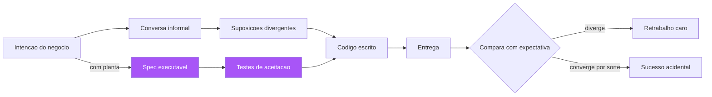

# Capítulo 1: O canteiro sem planta: anatomia da intenção perdida

## 1. Introdução

Todo projeto de software nasce de uma intenção: alguém quer que um sistema faça algo. E, no entanto, a distância entre o que essa pessoa imaginou e o que o código efetivamente faz é a fonte mais cara de erro da indústria — mais cara que bug de lógica, mais cara que falha de infraestrutura, porque ela corrompe a fundação antes de a primeira linha existir [1]. Você vai aprender neste capítulo a reconhecer essa distância, medir o custo que ela impõe ao seu time e entender por que a especificação — tratada como planta de engenharia, e não como papel burocrático — é a única correção estrutural que ataca a causa, em vez de remediar o sintoma. Este é o capítulo de abertura da obra, e ele cumpre uma função específica: convencê-lo, com evidência, de que o problema não é falta de habilidade de programação, e sim falta de disciplina de especificação.

## 2. Explica

### A anatomia da intenção perdida

Quando você pede a uma pessoa "faça um sistema de reservas", ela produzirá um sistema diferente de outra pessoa que recebeu o mesmo pedido. Isso não é defeito das pessoas — é o funcionamento normal da linguagem natural, que é otimizada para comunicação entre humanos que compartilham contexto, não para especificação de máquinas [2]. O problema se agrava quando o "pedido" é feito por escrito: cada leitor preenche as lacunas com as próprias suposições, e essas suposições divergem silenciosamente porque ninguém as verbaliza. Estudos de engenharia de requisitos há décadas documentam que a maioria dos defeitos graves em software tem origem em requisitos incorretos, incompletos ou ambíguos — não em erros de implementação [3]. O dado clássico de Boehm permanece citado até hoje: corrigir um defeito de requisito depois da entrega custa dezenas a centenas de vezes mais do que corrigi-lo na fase de especificação [4]. Note como esse número não é sobre esforço de digitação: é sobre tudo o que já foi construído em cima da fundação errada — documentação, testes, integrações, processos de negócio — que precisa ser reconstruído junto.

Você vai perceber que existe uma hierarquia de perdas. No nível mais raso, o código implementa corretamente o que o programador entendeu — mas o que ele entendeu não era o que o negócio precisava. Esse é o clássico "o software está funcionando conforme o especificado, mas a especificação estava errada". No nível médio, a intenção está correta no geral, mas os detalhes de borda — os casos excepcionais, as combinações de estado, os limites — foram deixados à imaginação de cada implementador, produzindo comportamento inconsistente entre partes do mesmo sistema. E no nível mais profundo, a intenção nem foi expressa: alguém começou a construir a partir de um palpite sobre o que o usuário queria, e o palpite virou arquitetura. Os três níveis compartilham a mesma raiz: não houve uma planta aprovada antes do canteiro [5].

### O custo da ambiguidade

A ambiguidade tem um custo duplo e perverso. Primeiro, o custo direto do retrabalho: código escrito, testado e revisado precisa ser descartado quando a interpretação correta emerge tarde demais. Segundo, o custo indireto e mais silencioso: a perda de confiança. Quando o time descobre que "as especificações nunca estão certas", ele para de lê-las e passa a decidir por si — o que acelera a divergência entre o que o negócio pede e o que é entregue [6]. Esse ciclo de realimentação negativa é a explicação estrutural de por que projetos longos com comunicação falha tendem a terminar entregando o sistema errado com pontualidade. O relatório CHAOS do Standish Group, publicado desde 1994, tem repetidamente apontado que requisitos incompletos e falta de envolvimento do usuário estão entre as principais causas de fracasso de projetos de software [7].

Note como a indústria reagiu a esse diagnóstico ao longo de décadas. A resposta inicial foi a burocracia: documentos enormes, assinaturas, comitês — a especificação como instrumento de controle hierárquico. Essa resposta falhou porque transformava a especificação em um ritual de conformidade, não em uma ferramenta de alinhamento. A resposta ágil, na virada do milênio, jogou fora o bebê junto com a água: o manifesto ágil tem razão em valorizar software funcionando sobre documentação abrangente, mas essa máxima foi frequentemente mal interpretada como "não documente nada" [8]. O SDD que você vai aprender nesta obra é a síntese madura: nem burocracia, nem vácuo — a especificação como artefato executável que participa da verificação, e que portanto não pode desatualizar sem que o sistema acuse [9].

### Por que instrução não é especificação

A distinção mais importante deste capítulo é entre instrução e especificação. Uma instrução diz ao executor o que fazer: "implemente um endpoint de pagamento". Uma especificação diz o que o resultado deve satisfazer: "dado um pedido com saldo suficiente, o pagamento é aprovado; dado um pedido sem saldo, o pagamento é recusado e o pedido permanece no estado 'aguardando fundos'". A instrução delega todas as decisões de interpretação para o executor; a especificação as captura antes, explicitamente [10]. Essa distinção, que parece semântica, tem consequências práticas enormes: com instrução, você só descobre a divergência quando o código existe e é comparado com a expectativa; com especificação, a divergência é descoberta na revisão da própria especificação, em minutos, antes de custar uma linha de código. É exatamente o papel da planta de engenharia civil: o pedreiro não decide o tamanho das fundações — ele consulta a planta, e qualquer discordância entre o que o engenheiro desenhou e o que o cliente imaginou é resolvida no papel, não na estrutura de concreto [11].

## 3. Ilustra

Imagine uma construtora que decide erguer um edifício sem projeto aprovado. O engenheiro-chefe, pressionado pelo prazo, diz aos pedreiros: "construam um prédio de escritórios, confio no bom senso de vocês". Cada andar é erguido segundo a interpretação individual do encarregado daquele andar. No térreo, o bom senso exige pilares a cada 6 metros; no terceiro andar, alguém decide que a cada 9 metros fica mais bonito. A rede elétrica do segundo andar foi dimensionada para um restaurante; o quarto andar virou uma quadra de squash. No dia da vistoria — o habite-se — o engenheiro do município compara o edifício com... nada. Não há planta para comparar. O prédio é entregue, as pessoas se mudam, e os problemas estruturais aparecem ao longo dos anos, cada correção custando uma fortuna porque exige mexer no que já está construído. Você, como Engenheiro de Software, já viveu essa cena dezenas de vezes em versão digital: o sistema foi entregue, e ninguém consegue explicar por que um módulo calcula juros de um jeito e outro módulo calcula de outro jeito, porque nunca existiu um documento único descrevendo a regra de juros.



A especificação é a planta. O habite-se é a verificação automática que compara o construído com a planta, e é isso que transforma a entrega de software em uma disciplina de engenharia em vez de uma loteria. Sem planta, o habite-se é impossível — não há referência para comparar. Com planta, o habite-se é barato e contínuo: cada commit é vistoriado contra a especificação, e o prédio nunca se afasta do projeto sem que alguém perceba na hora [12]. Essa é a imagem que vai nos acompanhar por toda a obra: a planta, o canteiro e o habite-se. Guarde esses três elementos — eles são o esqueleto conceitual de todos os capítulos que virão.

## 4. Técnica

### O custo quantificado: de onde vêm os números

Antes de construir qualquer ferramenta, você precisa de uma forma de medir o fenômeno na sua própria organização. O primeiro instrumento é a classificação da origem dos defeitos. Quando um bug é aberto no seu rastreador, a primeira pergunta que o time deve responder — de forma disciplinada, em um campo obrigatório — é: este defeito é de especificação (o comportamento correto não estava definido ou estava errado), de implementação (o comportamento definido não foi implementado corretamente) ou de integração (componentes corretos que não conversam entre si)? Organizações que fazem essa triagem com disciplina descobrem, com frequência consistente, que 40% a 60% dos defeitos de produção são de origem de especificação [13]. Sem essa triagem, o time assume que todos os bugs são de código e investe em mais testes unitários — tratando o sintoma errado.

```python
"""Triagem de origem de defeitos — medir o fenômeno antes de remediar.

Executa uma planilha de bugs classificados e reporta a distribuição
de origem (especificacao, implementacao, integracao). Use este script
mensalmente para acompanhar a evolucao da distribuicao.
"""
from collections import Counter
from dataclasses import dataclass, field
from datetime import date


@dataclass
class Defeito:
    id: str
    origem: str  # "especificacao" | "implementacao" | "integracao"
    custo_horas: float
    detectado_em: str = field(default="producao")


def distribuir_origem(defeitos: list[Defeito]) -> Counter:
    """Conta defeitos por origem e peso pelo custo em horas."""
    return Counter({d.origem: d.custo_horas for d in defeitos})


def relatorio_mensal(defeitos: list[Defeito], mes: str) -> dict:
    total_horas = sum(d.custo_horas for d in defeitos)
    if total_horas == 0:
        return {"mes": mes, "total_horas": 0.0, "percentuais": {}}
    contagem = distribuir_origem(defeitos)
    percentuais = {
        origem: round(100.0 * horas / total_horas, 1)
        for origem, horas in contagem.items()
    }
    return {"mes": mes, "total_horas": round(total_horas, 1), "percentuais": percentuais}


if __name__ == "__main__":
    bugs = [
        Defeito("B-1001", "especificacao", 32.0),
        Defeito("B-1002", "implementacao", 4.0),
        Defeito("B-1003", "especificacao", 18.0),
        Defeito("B-1004", "integracao", 6.0),
        Defeito("B-1005", "especificacao", 9.0),
    ]
    print(relatorio_mensal(bugs, "2026-08"))
```

### A terminologia que o capítulo estabelece

Antes de avançar, vale consolidar a terminologia que esta obra inteira vai usar, porque a precisão dos termos é parte da disciplina. **Intenção** é o que o negócio quer alcançar — o resultado desejado, muitas vezes não verbalizado por completo. **Instrução** é a expressão imperativa da intenção, que delega as decisões de borda ao executor. **Especificação** é a expressão verificável da intenção, que captura as bordas e os critérios de aceitação antes da implementação. **Planta** é o nome que esta obra dá à especificação, em homenagem à metáfora de engenharia que a conduz. E **habite-se** é a verificação que atesta que o entregue cumpre a planta [10][12].

Essa terminologia não é decoração: ela dá ao time um vocabulário para falar dos erros com precisão. Quando alguém diz "a intenção se perdeu", todos entendem o que aconteceu — a especificação não capturou o que o negócio queria. Quando alguém diz "a instrução não especificava", todos entendem por que o código divergiu — as bordas foram delegadas ao executor. O vocabulário compartilhado é o primeiro instrumento da planta, e é o mesmo princípio que o Capítulo 5 desenvolverá como linguagem ubíqua: a comunicação precisa começa pela precisão dos termos [14][20].

### O teste da legibilidade da intenção

O segundo instrumento é qualitativo e pode ser aplicado em qualquer reunião de refinamento: o teste da legibilidade da intenção. Pegue a descrição de qualquer funcionalidade que seu time pretende construir e faça duas perguntas. Primeira: se eu der esta descrição para duas pessoas diferentes do time, elas produzem a mesma lista de cenários de teste? Segunda: se um recém-contratado ler esta descrição daqui a seis meses, ele consegue dizer o que o sistema deve fazer em um caso de borda que não está escrito? Se a resposta a qualquer uma das duas for não, a intenção está perdida — não importa quão bonita seja a descrição [14].

```markdown
# Teste da legibilidade da intenção — checklist de triagem rápida

1. [ ] Dois leitores independentes produzem a mesma lista de casos de borda?
2. [ ] Um leitor novo consegue prever o comportamento em estados excepcionais?
3. [ ] Existe pelo menos um exemplo concreto (entrada -> saída esperada)?
4. [ ] As regras de negócio estão separadas de detalhes de implementação?
5. [ ] Está explícito o que está FORA de escopo?

Resultado: 5 x [x] = intenção especificável. Qualquer [ ] aberto =
gap a fechar ANTES de escrever código — o custo de fechar aqui é minutos.
```

### O custo do retrabalho: a régua de Boehm

O terceiro instrumento é a régua de custo relativo do retrabalho. Boehm e colaboradores consolidaram a evidência de que o custo de corrigir um defeito cresce de forma aproximadamente exponencial conforme o defeito avança pelas fases do ciclo de vida: custo 1 se corrigido na fase de requisitos, custo de 3 a 6 se corrigido durante o design, de 10 a 20 no desenvolvimento, de 30 a 60 em testes e de 40 a 1000 após a entrega [4]. A aplicação prática dessa régua é o argumento econômico definitivo para a especificação: investir uma hora na especificação para eliminar uma ambiguidade pode economizar cem horas de retrabalho na produção. Nenhum outro investimento em engenharia de software tem esse retorno — nem mais testes, nem mais automação, nem mais revisão de código, porque todos esses atuam depois que a fundação errada já foi construída.

```yaml
# Regua de Boehm aplicada ao custo relativo de correcao de defeitos
# (valores classicos consolidados pela engenharia de software)
fases:
  requisitos: 1
  design: 5
  desenvolvimento: 15
  testes: 40
  producao: 250
uso:
  - "Use o fator de producao para justificar investimento em especificacao"
  - "Multiplique o custo estimado do bug pela regua antes de cortar a fase de spec"
  - "Apresente a regua em revisoes de prioridade quando a spec for tratada como custo"
```

### O artefato mínimo de intenção: a one-pager de especificação

Agora a aplicação prática imediata: o artefato mínimo que você pode adotar na sua organização ainda hoje, sem nenhuma ferramenta nova, é a one-pager de especificação — uma página, escrita antes do código, que força a intenção a sair da cabeça de quem a tem. Não é uma especificação completa (isso vem nos capítulos seguintes), é o primeiro degrau: um documento curto com o problema, o usuário, o comportamento esperado em exemplos concretos, o que está fora de escopo e os critérios mínimos de aceitação. A one-pager funciona porque é pequena o suficiente para ser lida por todos e para ser confrontada com a realidade — e a mera existência dela muda a conversa: em vez de "o que você acha?", a conversa passa a ser "isto está correto?" [15].

```markdown
# ONE-PAGER DE ESPECIFICAÇÃO — <nome da funcionalidade>

## Problema (por que)
<parágrafo curto: qual dor real do usuário este recurso resolve?>

## Usuário (para quem)
<quem usa, em que contexto, com que frequência?>

## Comportamento esperado (o quê)
- Exemplo 1: <entrada> -> <saída esperada>
- Exemplo 2: <entrada> -> <saída esperada>
- Exemplo 3: <entrada> -> <saída esperada>

## Fora de escopo (o que NÃO será feito agora)
- <item 1>
- <item 2>

## Critérios mínimos de aceitação
1. <cenário observável que deve passar>
2. <cenário observável que deve passar>
3. <cenário observável que deve passar>

## Decisões já tomadas
- <stack, arquitetura ou restrição pré-aprovada>
```

A one-pager já produz o efeito central deste capítulo: ela torna a intenção confrontável. Quando a intenção está apenas na cabeça de alguém, não há o que discutir — há apenas o que adivinhar. Quando ela está em uma página, o time inteiro pode apontar para o que está errado, incompleto ou ambíguo, e o custo dessa correção é de minutos. É o mesmo princípio do desenho de planta: antes de a planta existir, o cliente acha que sabe o que quer; depois de vê-la, ele descobre o que realmente queria — e essa descoberta é barata, porque acontece no papel.

### A triagem na prática: o formulário de bug e a auditoria retroativa

A implementação do formulário de triagem tem detalhes que determinam o sucesso. O campo de origem deve ser obrigatório e com valores fechados, mas o formulário precisa de uma pergunta de desempate que combata o viés da preguiça: "se o comportamento esperado estivesse documentado em algum lugar, o bug teria sido evitado?" — se sim, a origem é especificação, mesmo que o código também tenha um defeito. Essa pergunta é o coração da triagem, porque ela separa o sintoma (o código errado) da causa (a regra não documentada), e é exatamente a distinção que o Capítulo 1 existe para estabelecer [16].

A auditoria retroativa, segundo passo da implementação, também tem técnica. Pegue os bugs resolvidos no último mês e classifique cada um com as informações do ticket: a descrição do bug, a conversa do desenvolvedor, o commit que corrigiu. A classificação é imperfeita — você não estará certo em todos os casos — mas a tendência estatística é robusta: se 45% dos bugs antigos mostram sinais de regra indefinida, a direção é clara mesmo com erros de classificação individuais. O importante é o valor de base: sem ele, você não consegue medir se a disciplina está funcionando [17].

O terceiro passo — a revisão mensal — completa o ciclo. No rastreamento, o percentual de bugs de especificação deve cair de forma consistente. Mas cuidado com a leitura do número: na primeira fase de adoção, o percentual de bugs de especificação pode AUMENTAR temporariamente, porque os times começam a classificar corretamente o que antes era chamado de "bug de código" por preguiça. O aumento inicial é sinal de triagem honesta, não de regressão — e o indicador que realmente importa é a tendência de longo prazo, junto com o tempo médio de resolução (que deve cair, porque os bugs de especificação resolvidos na planta são mais baratos de corrigir).

### O custo da ambiguidade: um estudo de caso quantificado

Vamos tornar o custo concreto com um estudo de caso. Uma empresa de médio porte tem uma equipe de dez desenvolvedores e um produto com 200.000 linhas de código. O relatório de bugs do trimestre mostra 120 defeitos em produção; a triagem, aplicada pela primeira vez, classifica 55 deles (46%) como de origem de especificação. O custo médio de cada defeito de produção — investigação, correção, deploy, comunicação com o cliente afetado — é estimado em 12 horas-homem, e o custo dos defeitos de especificação é tipicamente maior porque envolvem rediscussão com o negócio: 18 horas-homem em média. O custo trimestral dos defeitos de especificação é então 55 × 18 = 990 horas-homem — cerca de 125 dias de trabalho de um desenvolvedor, por trimestre, em retrabalho que a planta teria evitado [4][13].

Agora o contra-fato: quantas horas custaria ter evitado esses 55 defeitos? Se cada defeito corresponde a uma ambiguidade que uma oficina de descoberta de 30 minutos teria capturado, o investimento é 55 × 0,5 = 27,5 horas de oficina. O retorno é de 36 vezes — e isso sem contar o custo reputacional dos clientes afetados e o custo da correção de emergência que compete com o backlog planejado. É por isso que a especificação não é um luxo de time maduro: é o investimento de maior retorno disponível na engenharia de software, e o Capítulo 1 existe para que você possa fazer essa conta na sua própria organização, com os seus números [4][19].

### O papel do líder na adoção da disciplina

A adoção da triagem e da one-pager encontra resistência cultural, e o líder técnico tem um papel específico nesse momento. A resistência não vem de má vontade — vem do medo de que "especificar é burocratizar" e de que o time vai gastar tempo demais em papel e de menos em código. O líder responde a esse medo com duas armas: a evidência (os números da triagem, que mostram onde o retrabalho real mora) e a demonstração (a one-pager de uma funcionalidade pequena, escrita em vinte minutos, que evita uma divergência real em uma semana). Nenhum argumento substitui a evidência do próprio time: é por isso que a triagem vem primeiro e a pregação nunca vem [6].

A segunda função do líder é proteger a disciplina dos prazos. O primeiro momento de pressão — a funcionalidade que "não pode esperar a spec" — é o teste decisivo: se o time pula a planta na primeira pressão, a planta morre; se o líder segura a disciplina ("vamos gastar 30 minutos na one-pager, é mais rápido que o retrabalho de sexta-feira"), a planta sobrevive e se fortalece. A regra prática dos times que sustentaram a disciplina: a one-pager é inegociável em qualquer funcionalidade acima de um tamanho mínimo, e a exceção (o hotfix de produção) é declarada como exceção, com dívida registrada para escrever a spec depois. A exceção declarada é aceitável; a exceção silenciosa é a morte da planta [17][20].

### Como implementar a triagem na prática

A adoção da triagem de origem de defeitos em uma organização existente segue três passos. Primeiro, adicione o campo de origem ao formulário de bug, com as três opções fechadas e a instrução de que "implementação" é o padrão preguiçoso que deve ser evitado — se o comportamento esperado não estava escrito em lugar nenhum, a origem é especificação, mesmo que o código tenha um bug [16]. Segundo, faça uma auditoria retroativa de um mês de bugs resolvidos, classificando cada um com a informação disponível nos tickets; isso dá o valor de base antes da mudança. Terceiro, revise o percentual mensalmente no rastreamento e, quando a proporção de defeitos de especificação cair abaixo de um terço, o time pode celebrar: a planta está funcionando [17].

## 5. Aplica

### A cena de contraste: o checkout que cobrava duas vezes

Você está no seu primeiro mês em uma fintech de médio porte. Um incidente grave acaba de acontecer: em uma promoção de fim de semana, clientes receberam cobranças duplicadas no cartão de crédito. O time de suporte está afogado em reclamações, e o CTO pede que você lidere a investigação. Seu instinto de engenheiro, formado em debugging, é mergulhar no código: procurar a função de cobrança, rastrear a fila de processamento, procurar a race condition que processou a transação duas vezes. Você passa seis horas fazendo exatamente isso — e não encontra nada de errado. O código de cobrança está correto: ele processa a transação exatamente uma vez por mensagem recebida. O problema está a montante: a integração com a operadora de cartão, configurada pela equipe de operações, estava enviando cada transação duas vezes em condições de timeout. E por que ninguém percebeu antes? Porque em nenhum lugar da organização existia uma especificação dizendo: "dado um timeout da operadora na primeira tentativa, o sistema deve reenviar a transação com um idempotency key idêntica e descartar respostas duplicadas". O comportamento estava implícito na cabeça do antigo engenheiro de integração — que saiu da empresa seis meses antes [18].

O diagnóstico: você tratou o incidente como um bug de implementação, mas ele era um bug de especificação — a regra de idempotência jamais foi escrita, e cada parte do sistema assumiu que a outra a aplicava. A correção, você já intui: não basta corrigir a integração (o que o time fez em uma noite); é preciso escrever a especificação do comportamento de pagamento — cenários de sucesso, timeout, reenvio, duplicata, cancelamento — e torná-los executáveis, para que a próxima mudança na operadora seja vistoriada contra a planta antes de ir a produção. Na semana seguinte, você aplica a one-pager e a triagem: o incidente entra como "especificação", o retrabalho de horas de investigação é contabilizado, e o custo total — seis horas de você, mais o suporte, mais o chargeback — é apresentado à liderança como o argumento econômico para o SDD. A partir desse mês, o time de pagamentos não escreve código sem uma especificação mínima aprovada [19].

### Armadilhas comuns

As armadilhas que você vai encontrar ao adotar essa disciplina são previsíveis. A primeira é o falso dilema "especificação ou velocidade": times ágeis recém-formados costumam tratar qualquer documento como burocracia e pular direto para o código. A resposta não é escolher entre um extremo e outro — é distinguir especificação executável de documentação decorativa, que é o tema dos próximos capítulos. A segunda é a especificação de fachada: um documento que existe para cumprir o ritual, escrito depois do código, que ninguém lê e que não é usado na verificação. Essa armadilha é pior que não ter especificação, porque ela dá a falsa sensação de segurança. A terceira é especificar em excesso na primeira tentativa: times que tentam capturar todos os cenários do universo em uma reunião de duas horas, produzem documentos que ninguém termina de ler. A especificação, como toda planta, evolui — você começa com o essencial e adiciona detalhes conforme o edifício cresce [20].

### O reflexo da planta: o momento em que a disciplina vira hábito

Há um momento na adoção da disciplina em que ela deixa de ser procedimento e vira reflexo — e vale a pena reconhecê-lo, porque é o sinal de que a planta está enraizada. O reflexo aparece em situações concretas: o desenvolvedor que recebe uma história vaga e devolve "me dá um exemplo antes de eu estimar"; o PO que começa a reunião dizendo "o que está fora de escopo nesta iteração?"; o QA que não aceita "está claro?" como resposta e pede "quais são as bordas?". Cada um desses reflexos é a triagem da intenção acontecendo antes do código, em vez de depois do retrabalho — e é exatamente o comportamento que a one-pager e a triagem treinam [17][20].

O reflexo da planta também aparece na linguagem do time. Times sem disciplina dizem "o sistema deveria fazer X" — uma esperança, não um contrato. Times com disciplina dizem "a spec diz X, e o sistema faz Y — há uma divergência" — uma declaração verificável, que ou aponta um bug de código ou um bug de planta, mas nunca um palpite. A mudança de linguagem é o sintoma mais confiável da adoção: quando a frase "deveria" desaparece das revisões e é substituída por "a planta diz", a intenção deixou de ser uma negociação e virou uma referência [6][14]. Esse é o momento em que a especificação, tratada como planta de engenharia, cumpriu sua função — e é o estado que o restante desta obra ensina a sustentar e aprofundar.

### Métricas de sucesso e fracasso

Como você sabe se a disciplina está funcionando? As métricas de sucesso são três. Primeira: a distribuição de origem de defeitos — a proporção de bugs de especificação deve cair de forma consistente, porque a planta está sendo confrontada antes do canteiro. Segunda: o tempo de triagem de requisitos — o tempo entre "surgiu a ideia" e "a intenção está especificada de forma confrontável" deve cair para menos de um ciclo de sprint. Terceira: a velocidade de integração de novos membros — um recém-contratado deve conseguir prever o comportamento do sistema nos casos de borda apenas lendo as especificações existentes. As métricas de fracasso são igualmente claras: documentos escritos e nunca consultados, reuniões de refinamento que terminam sem um exemplo concreto, e a frase "eu não sabia que era para funcionar assim" dita mais de uma vez por sprint — cada uma delas é o sinal de que a planta ainda não existe.

## 6. Conclusão

Neste capítulo, você aprendeu três coisas que sustentam toda a obra: primeiro, que a maioria dos defeitos graves de software nasce da intenção perdida, não de erros de programação — o problema é de especificação, e medir essa origem é o primeiro passo para curá-la [1][3]. Segundo, que o custo de corrigir um defeito cresce de forma quase exponencial conforme ele avança pelas fases, o que torna a especificação o investimento de maior retorno da engenharia de software [4]. Terceiro, que existe um artefato mínimo — a one-pager de especificação — que você pode adotar hoje para tornar a intenção confrontável antes do código, com o mesmo papel da planta de engenharia antes do canteiro. O desafio para você, agora, é aplicar a triagem de origem de defeitos aos últimos bugs do seu próprio time e trazer o resultado para a próxima reunião de planejamento. No próximo capítulo, vamos recuar no tempo para entender a pré-história da especificação — de VDM e da notação Z ao Design by Contract — e descobrir o que essa tradição centenária de rigor formal tem a nos ensinar sobre o SDD moderno: o que funcionou, o que não escalou, e por que a indústria levou décadas para encontrar o equilíbrio entre rigor e praticidade.

## 7. Referências Bibliográficas

[1] STANDISH GROUP. *CHAOS Report*. Boston: Standish Group International, 1994-2024. Disponível em: https://www.standishgroup.com/chaos-report. Acesso em: 5 ago. 2026.
[2] ADZIC, Gojko. *Specification by Example: How Successful Teams Deliver the Right Software*. Shelter Island: Manning Publications, 2011.
[3] IEEE. *IEEE 29148:2018 — Systems and Software Engineering: Life Cycle Processes — Requirements Engineering*. New York: IEEE, 2018.
[4] BOEHM, Barry W.; BASILI, Victor R. Software Defect Reduction Top 10 List. *IEEE Computer*, v. 34, n. 1, p. 135-137, 2001.
[5] DAVIS, Alan M. *Software Requirements: Objects, Functions, and States*. 2. ed. Upper Saddle River: Prentice Hall, 1993.
[6] WEINBERG, Gerald M. *Quality Software Management: Systems Thinking*. New York: Dorset House, 1992.
[7] STANDISH GROUP. *CHAOS Manifesto*. Boston: Standish Group International, 2020. Disponível em: https://www.standishgroup.com. Acesso em: 5 ago. 2026.
[8] BECK, Kent et al. *Manifesto for Agile Software Development*. 2001. Disponível em: https://agilemanifesto.org. Acesso em: 5 ago. 2026.
[9] ADZIC, Gojko. *Living Documentation: Continuous Knowledge Sharing by Design*. Boston: Addison-Wesley, 2017.
[10] NORTH, Dan. *BDD is like TDD if...* Dan North & Associates, 2006. Disponível em: https://dannorth.net/blog/bdd-is-like-tdd-if/. Acesso em: 5 ago. 2026.
[11] PARNAS, David L.; CLEMENTS, Paul C. A Rational Design Process: How and Why to Fake It. *IEEE Transactions on Software Engineering*, v. 12, n. 2, p. 251-257, 1986.
[12] FOWLER, Martin. *Specification by Example* (bliki). Disponível em: https://martinfowler.com/bliki/SpecificationByExample.html. Acesso em: 5 ago. 2026.
[13] IEEE. *IEEE 830-1998: Recommended Practice for Software Requirements Specifications*. New York: IEEE, 1998.
[14] WIEGERS, Karl E.; BEATTY, Joy. *Software Requirements*. 3. ed. Redmond: Microsoft Press, 2013.
[15] OSMANI, Addy. *How to Write a Good Spec for AI Agents*. 2025. Disponível em: https://addyosmani.com/blog/good-spec/. Acesso em: 5 ago. 2026.
[16] MARTIN, Robert C. *Clean Architecture: A Craftsman's Guide to Software Structure and Design*. Boston: Prentice Hall, 2017.
[17] SCHWABER, Ken; SUTHERLAND, Jeff. *The Scrum Guide: The Definitive Guide to Scrum*. 2020. Disponível em: https://scrumguides.org. Acesso em: 5 ago. 2026.
[18] NEWMAN, Sam. *Building Microservices: Designing Fine-Grained Systems*. 2. ed. Sebastopol: O'Reilly Media, 2021.
[19] BROOKS, Frederick P. *The Mythical Man-Month: Essays on Software Engineering*. Anniversary ed. Boston: Addison-Wesley, 1995.
[20] EVANS, Eric. *Domain-Driven Design: Tackling Complexity in the Heart of Software*. Boston: Addison-Wesley, 2003.
