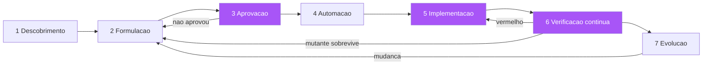

# Capítulo 10: Do plano à obra: o fluxo SDD completo na prática

## 1. Introdução

Você já tem todas as peças da planta: o diagnóstico da intenção perdida (Capítulo 1), a tradição formal (Capítulo 2), o BDD e o Given-When-Then (Capítulo 3), os exemplares (Capítulo 4), a linguagem ubíqua e a descoberta (Capítulo 5), a spec de seis elementos (Capítulo 6), as ferramentas (Capítulo 7), os contratos entre serviços (Capítulo 8) e o rigor da verificação (Capítulo 9). Este capítulo é o momento de juntar tudo: o fluxo completo do SDD, da intenção ao código verificável em produção — um exemplo end-to-end que percorre todas as etapas, do refinamento ao deploy [1][2]. Você vai aprender a triagem entre spec quebrada e código quebrado, o ritmo sustentável da execução, e como o fluxo inteiro se organiza em torno de um princípio único: a planta manda, o canteiro obedece, e o habite-se atesta [3].

## 2. Explica

### O fluxo completo em sete estações

O SDD end-to-end organiza-se em sete estações, cada uma com um artefato de entrada e um de saída. A estação 1 é a Descoberta: a conversa do refinamento, guiada pelo event storming (Capítulo 5), produz o vocabulário e os primeiros exemplares. A estação 2 é a Formulação: os exemplares viram a spec de seis elementos (Capítulo 6) com os cenários Gherkin (Capítulo 3) apontados nos critérios de verificação. A estação 3 é a Aprovação: o PO e o time revisam a spec — e ninguém passa daqui sem a planta aprovada; especificação em rascunho não autoriza canteiro [4]. A estação 4 é a Automação: os cenários são conectados a step definitions (Capítulo 7) e rodam vermelho — a planta executável existe e atesta que o comportamento ainda não existe. A estação 5 é a Implementação: o código é escrito contra a planta, cenário a cenário, até o verde [5]. A estação 6 é a Verificação contínua: a suíte roda no CI a cada merge, com o mutation testing auditando a qualidade da verificação (Capítulo 9) [6]. E a estação 7 é a Evolução: mudanças futuras começam pela planta — a spec muda primeiro, e o código segue [7].

Você vai perceber que as sete estações são a materialização das disciplinas dos capítulos anteriores em um fluxo único. A genialidade do fluxo é que cada estação tem um portão de saída verificável: a Descoberta termina quando os exemplares existem; a Formulação, quando a spec tem os seis elementos e o lint passa (Capítulo 6); a Aprovação, quando o PO assina; a Automação, quando os cenários rodam (vermelho); a Implementação, quando ficam verdes; a Verificação, quando o CI está verde e a taxa de mutação respeita o limiar; e a Evolução, quando a mudança na planta precede a mudança no código [8]. O fluxo não é um processo burocrático — é uma sequência de habite-ses parciais, cada um atestando que a obra pode avançar para a próxima etapa [1].

### A triagem da falha: spec quebrada ou código quebrado?

No coração do fluxo está uma habilidade que separa times maduros de times imaturos: a triagem da falha. Quando um cenário falha — no desenvolvimento ou no CI — existem apenas duas causas possíveis: a planta está errada (a spec descreve um comportamento que o negócio não quer, ou descreve errado) ou o edifício está errado (o código não implementa o que a planta manda) [9]. A triagem é o processo disciplinado de decidir qual das duas — e a regra é: primeiro, pergunte ao dono da planta. O PO é consultado sobre o comportamento esperado; se a spec descreve o comportamento certo e o código diverge, é bug de implementação — corrige o código; se a spec descreve o comportamento errado, é bug de especificação — corrige a planta, e o código que a satisfazia era correto para uma planta incorreta [10]. A triagem disciplinada muda a cultura: o vermelho deixa de ser "alguém errou" e vira "a planta e o edifício divergiram — vamos descobrir qual é a verdade, com o dono da planta" [11].

A triagem também tem um componente técnico: nem toda falha de cenário é uma falha de comportamento. O passo Given pode falhar porque o estado do sistema mudou (a planta não descreve o estado novo); o passo Then pode falhar porque o observável não está disponível (a planta pede uma asserção que o sistema não expõe); e o step definition pode falhar por problema de automação (o passo não está mapeado ou mapeado errado) [12]. A regra de ouro: antes de tocar no código de produção, o time deve confirmar que a falha é de comportamento — e não de teste — porque corrigir o código para "fazer o teste passar" sem validar a planta é exatamente o sintoma do Capítulo 1, o código que nasce da interpretação [13].

### O ritmo sustentável da execução

O SDD falha como ritual e funciona como ritmo. O ritmo sustentável tem três propriedades. Primeira: lotes pequenos — cada funcionalidade é um lote de cenários pequeno o suficiente para ser implementado em um dia ou dois; lotes grandes transformam a suíte em um monólito de dependências e o fluxo em um funeral [14]. Segunda: verde frequente — o time integra com a suíte verde pelo menos uma vez por dia; vermelho persistente é o sinal de que a planta e a obra divergiram demais e a correção está ficando cara [5]. Terceira: a planta evolui com a obra — especificação e código são atualizados no mesmo merge, nunca em merges separados; a regra do "spec e código juntos" é o que mantém a documentação viva viva (Capítulo 4) [7][15]. O ritmo não é velocidade — é cadência: a cadência regular de descoberta, formulação, automação, implementação e verificação, repetida sprint após sprint, que faz do SDD um hábito do time em vez de uma campanha [16].

### O papel do humano no fluxo

Um aviso importante sobre o fluxo completo: o SDD não remove o humano do processo — ele reposiciona o humano no lugar de maior valor [17]. O humano decide os outcomes e as fronteiras (o PO), revisa a planta antes do canteiro (a aprovação), arbitra a triagem da falha (a verdade sobre o comportamento), e responde pelas decisões que a planta não cobre (os casos novos). O que o SDD remove é o trabalho de baixo valor: a interpretação adivinhada, o retrabalho de requisitos, a documentação que apodrece [18]. Em um time com agentes de IA (o tema do Capítulo 12), esse reposicionamento fica ainda mais explícito: a planta é o contrato entre o humano e o agente, e o humano é o dono da planta — nunca o revisor de código gerado sem planta [19].

## 3. Ilustra

Voltemos à construtora para a obra final: o edifício completo, construído com todas as disciplinas da série. O arquiteto (PO) e o engenheiro (dev) e o fiscal (QA) conduzem a obra em sete estações — o mesmo fluxo que você aprendeu. Na estação 1, a oficina de event storming mapeia o fluxo do prédio: entrega de materiais, fundação, estrutura, hidráulica, elétrica, acabamento — com os eventos, comandos e regras na parede (Capítulo 5). Na estação 2, cada etapa vira um contrato de encargos com os seis elementos (Capítulo 6), e cada regra vira um cenário de conferência (Capítulo 3). Na estação 3, o cliente revisa e assina os contratos — nenhum pedreiro começa antes da assinatura (a aprovação). Na estação 4, os fiscais preparam os instrumentos de conferência — as pranchetas com as medições (a automação, que roda vermelha porque a obra ainda não existe). Na estação 5, as equipes constroem andar a andar, conferindo cada medição até o verde (a implementação). Na estação 6, a vistoria contínua — cada entrega parcial é vistoriada, e o engenheiro provoca sabotagens para medir a qualidade da vistoria (o mutation testing, Capítulo 9). Na estação 7, qualquer mudança do cliente começa pelo contrato: o papel muda primeiro, e a obra segue (a evolução) [20].



A lição da metáfora da obra completa: cada estação tem um portão verificável, e o fluxo inteiro é a repetição disciplinada de um ciclo — desenhar, aprovar, construir, verificar, evoluir [1]. A obra não é uma sequência linear que termina; é um ciclo que gira: a evolução realimenta a formulação, e o edifício cresce e muda mantendo a conformidade com a planta — o habite-se contínuo que você verá em detalhe no Capítulo 11 [21]. Você, como Engenheiro de Software, reconhece o padrão: o fluxo completo não é uma metodologia nova — é a organização de todas as práticas que você já domina em uma sequência com portões verificáveis, onde cada etapa sabe exatamente quando termina e o que entrega [22].

## 4. Técnica

### O exemplo end-to-end: a promoção de frete

Vamos executar o fluxo completo em um exemplo real, do refinamento ao deploy — a promoção de frete grátis que você viu em versões anteriores, agora com as sete estações em sequência. Estação 1 — Descoberta: a oficina produz os exemplares:

```markdown
# EXEMPLARES — Promoção de frete grátis (produzidos na oficina de descoberta)

1. pedido de 150, sem cupom -> frete gratuito
2. pedido de 100, sem cupom -> frete gratuito (limiar inclui o valor exato)
3. pedido de 99.99, sem cupom -> frete pago
4. pedido de 101 com cupom de 5 -> frete pago (cupom abate antes do limiar)
5. pedido de 0 (vazio) -> inválido, frete não calculado
6. reenvio do cálculo -> resultado idempotente (mesma entrada, mesma saída)
```

Estação 2 — Formulação: os exemplares viram a spec de seis elementos com os cenários (você já viu o SPEC.md e o frete.feature nos capítulos 4 e 6). Estação 3 — Aprovação: o PO confere os exemplares, decide as bordas (o limiar inclui 100; o cupom abate antes) e assina. Estação 4 — Automação: os cenários são conectados aos steps e rodam vermelho:

```bash
# Estacao 4: a planta executavel atesta que o comportamento ainda nao existe
pytest tests/features -q
#   FAILED tests/features/frete.feature::Frete gratuito acima do limiar
#   FAILED tests/features/frete.feature::Frete pago abaixo do limiar
# 4 falharam, 0 passaram  -> a planta existe e esta vermelha (comportamento ausente)
```

Estação 5 — Implementação: o código é escrito contra a planta, cenário a cenário:

```python
"""frete.py — implementacao guiada pelos cenarios da feature frete.feature."""
from dataclasses import dataclass


@dataclass
class Pedido:
    valor: float
    cupom: float | None = None

    @property
    def valor_final(self) -> float:
        return self.valor - (self.cupom or 0.0)


LIMIAR = 100.0


def calcular_frete(pedido: Pedido) -> str:
    """Decisoes da planta: limiar inclui o valor exato; cupom abate antes."""
    if pedido.valor <= 0:
        return "invalido"
    if pedido.valor_final >= LIMIAR:
        return "gratuito"
    return "pago"
```

```python
"""test_frete.py — os cenarios viram testes de unidade no mesmo merge."""
from frete import Pedido, calcular_frete


def test_frete_acima_do_limiar() -> None:
    assert calcular_frete(Pedido(150.0)) == "gratuito"


def test_frete_no_limiar_exato() -> None:
    assert calcular_frete(Pedido(100.0)) == "gratuito"


def test_frete_abaixo_do_limiar() -> None:
    assert calcular_frete(Pedido(99.99)) == "pago"


def test_cupom_abate_antes_do_limiar() -> None:
    assert calcular_frete(Pedido(101.0, cupom=5.0)) == "pago"


def test_pedido_vazio_invalido() -> None:
    assert calcular_frete(Pedido(0.0)) == "invalido"
```

Estação 6 — Verificação contínua: a suíte roda no CI a cada merge, e o mutation testing audita a qualidade:

```bash
# Estacao 6: CI com suíte + mutation testing no módulo crítico
pytest -q && mutmut run --paths-to-mutate frete.py
# Se o mutation testing revelar um mutante sobrevivente (ex.: trocar >= por >),
# o exemplar do limite exato ja cobre — e o CI bloqueia o merge ate o limiar.
```

Estação 7 — Evolução: quando o marketing muda a promoção (frete grátis a partir de 150), a MUDANÇA começa pela planta: a feature e a spec mudam primeiro, os cenários atualizados rodam vermelho contra o código antigo, e o código segue [7].

### A triagem da falha na prática

O cenário da triagem em ação: a promoção está em produção, e um cenário novo falha no CI — "pedido de 101 com cupom de 5 -> frete pago" está vermelho. O time aplica a triagem em três perguntas. Primeira: a planta está certa? O PO é consultado: "a regra é cupom abate antes do limiar?" — se sim, o código está errado (a implementação aplicou o limiar no valor bruto). Segunda: o código diverge da planta? O teste de unidade correspondente falha? — se o teste de unidade passa e o cenário falha, o problema pode estar no step definition (a automação mapeou o valor errado). Terceira: é problema de automação? O passo "Dado um pedido com valor de 101" está mapeado para o parâmetro correto? — erros de parsing de passo são a causa mais comum de falso vermelho [12]. A triagem disciplina a resposta: o time não "corrige o código" sem responder às três perguntas, e a correção resultante é sempre a correta — planta, código ou automação [10].

### O pipeline CI do fluxo completo

O pipeline de CI que materializa o fluxo completo tem cinco estágios: lint da spec (a spec dos seis elementos e o glossário — o portão da estação 2); automação (os cenários rodam — o portão da estação 4); verificação (a suíte verde — o portão da estação 6); rigor (o mutation testing nos módulos críticos — o portão da estação 6); e contrato (a verificação de contratos entre serviços, se aplicável — o portão do Capítulo 8) [8][23]:

```yaml
# .github/workflows/sdd.yml — o habite-se do fluxo completo
name: Habite-se SDD
on: [push, pull_request]
jobs:
  planta:
    runs-on: ubuntu-latest
    steps:
      - uses: actions/checkout@v4
      - name: Lint da spec (6 elementos + glossario)
        run: python lint_spec.py SPEC.md && python lint_glossario.py glossario.md
      - name: Automacao dos cenarios (vermelho permitido so na estacao 4)
        run: pytest tests/features -q
      - name: Verificacao completa
        run: pytest -q
      - name: Mutation testing nos modulos criticos
        run: mutmut run --paths-to-mutate src/frete.py --threshold 80
```

### A estação da descoberta na prática: o tempo que a planta economiza

Um dos mitos que matam a adoção do SDD é "especificar é mais lento". A verdade, medida por times que percorrem o fluxo completo, é mais sutil: a especificação não é mais lenta — ela concentra o tempo no começo e o recupera com juros no resto do fluxo [1][14]. O tempo da descoberta e da formulação (estações 1 e 2) é de horas a um dia para uma funcionalidade típica; o tempo que economiza está na implementação (sem retrabalho de interpretação), na revisão (a planta é revisada antes, o código é revisado contra a planta — mais rápido), nos testes (os cenários já existem, não precisam ser inventados na hora), e na manutenção (a mudança futura é guiada pela planta, não caçada no código) [10][22].

O cálculo prático que o time deve fazer no piloto: comparar o tempo total (descoberta + formulação + implementação + verificação) de uma funcionalidade com planta contra o tempo total da mesma funcionalidade sem planta — não apenas o tempo de implementação. A maioria dos times descobre que o tempo total é igual ou menor, e que a diferença qualitativa — menos bugs, menos discussões, menos retrabalho — torna a comparação ainda mais favorável [14][28]. O tempo que a planta economiza não é uma abstração: é o tempo que você não gasta rediscutindo o que foi decidido, reescrevendo o que foi interpretado errado, e re-testando o que já foi verificado [24].

### A estação da evolução na prática: mudanças guiadas pela planta

A estação 7 — a evolução — é onde o SDD se paga no longo prazo, e tem uma disciplina específica: toda mudança de comportamento começa pela planta, e o fluxo de mudança é o mesmo fluxo da criação, em versão reduzida [7][15]. A mudança pequena (ajustar um limiar, adicionar uma condição): a feature muda primeiro (o cenário novo ou alterado), o código segue, e o merge inclui os dois — a regra do "spec e código juntos" que mantém a documentação viva viva. A mudança média (novo comportamento em funcionalidade existente): a descoberta rápida (quais são os exemplos novos?), a formulação (os cenários novos), a aprovação do PO (a fronteira nova), e a implementação. A mudança grande (nova funcionalidade): o fluxo completo das sete estações, do mesmo jeito que a criação [8].

O benefício mensurável da evolução guiada pela planta: o custo de mudança cai ao longo do tempo em vez de subir. Em um sistema sem planta, o custo de mudança cresce com o tamanho do código (mexer em uma parte exige entender o todo, e o todo é caótico); com a planta, o custo de mudança é proporcional ao escopo da mudança (os cenários afetados delimitam o impacto, e a suíte verde atesta que nada mais quebrou) [15][27]. A métrica que documenta esse benefício: o tempo médio de entrega de uma mudança de comportamento, medido trimestre a trimestre — e a tendência de queda é o gráfico que convence qualquer liderança de que a planta é investimento, não custo [28].

### O caderno de registro do fluxo

A última ferramenta prática é o caderno de registro: um arquivo que documenta, para cada funcionalidade, o caminho percorrido pelo fluxo — os exemplares, a spec, a data de aprovação, os cenários, a taxa de mutação e as divergências encontradas na triagem [24]. O caderno é a memória do fluxo: quando uma funcionalidade antiga muda, o caderno diz qual planta foi aprovada, quais bordas foram decididas e por quê — eliminando a necessidade de reconstruir a história por conversas [7][15]. O formato: uma seção por funcionalidade, com os artefatos referenciados (não copiados) e as decisões de triagem registradas com data e responsável — o mesmo espírito da caixa-preta da aviação: se algo der errado, o registro permite reconstruir exatamente o que foi aprovado e o que divergiu [21].

## 5. Aplica

### A cena de contraste: o fluxo pulado e a promoção que quebrou de novo

Você é o novo tech lead de um e-commerce que "adotou SDD" há seis meses — mas a adoção é seletiva: a equipe escreve cenários Gherkin e roda o Cucumber, mas pula as estações 1, 2 e 3 (descoberta, formulação e aprovação) quando "o prazo aperta". O marketing lança uma promoção nova: "frete grátis acima de R$ 150 para assinantes premium". O desenvolvedor encarregado, pressionado, escreve o cenário diretamente no código — "Dado um assinante premium com pedido de 200, então frete gratuito" — sem oficina, sem spec, sem aprovação. A implementação "passa". Na sexta-feira, o incidente: clientes não assinantes recebem frete grátis em pedidos acima de 150 — porque ninguém especificou a fronteira "somente assinantes premium", e o desenvolvedor interpretou "assinantes" como "todos" ao generalizar o código de frete existente [25].

O diagnóstico: a equipe pulou as três primeiras estações — sem descoberta (ninguém mapeou os casos de borda: assinante vs não assinante, cupom, limiar), sem formulação (a spec de seis elementos com fronteiras explícitas não existia — o "fora de escopo: clientes não assinantes" teria bloqueado o desvio) e sem aprovação (o PO nunca validou a regra). O cenário escrito pelo desenvolvedor era a planta desenhada por quem constrói, para quem constrói — o erro clássico do Capítulo 3, em versão de prazo apertado [11]. A correção que você conduz é cultural e estrutural: o fluxo completo volta a ser obrigatório, e o portão da aprovação — a estação 3 — vira inegociável: nenhuma implementação começa sem a spec aprovada pelo PO, mesmo em promoções de prazo apertado; o incidente vira o caso de estudo da empresa sobre o custo de pular a planta [26].

### Armadilhas comuns

As armadilhas do fluxo completo são as dos capítulos anteriores, agora em combinação. A primeira é o fluxo seletivo: aplicar as estações de automação e implementação, pulando descoberta e aprovação quando o prazo aperta — a armadilha mais comum, porque a automação dá a ilusão de processo; a disciplina é que o fluxo é um todo, e pular uma estação é escolher o incidente [11]. A segunda é o portão de papel: a aprovação existe, mas ninguém a verifica — o PO assina sem ler, e a planta aprovada é uma planta não revisada; o portão só funciona com revisão real [4]. A terceira é o vermelho eterno: a suíte fica vermelha por dias e o time se acostuma — o vermelho crônico é o sinal de que a planta e a obra divergiram demais e o fluxo parou de funcionar; a regra é que vermelho se resolve no mesmo dia [5]. A quarta é a triagem preguiçosa: toda falha vira "bug de código" sem consultar o PO — o reflexo que mantém os bugs de especificação invisíveis; a triagem disciplinada é o que separa o SDD do "TDD com Gherkin" [9]. E a quinta é o fluxo sem memória: o caderno de registro não existe, e as decisões de borda se perdem — a próxima mudança reabre discussões que já foram decididas [24].

### O fluxo e a equipe: o SDD como prática coletiva

O fluxo completo do SDD não é uma técnica individual — é uma prática coletiva, e a diferença importa na adoção [2][16]. O desenvolvedor individual pode escrever cenários sozinho, mas o fluxo das sete estações exige o trio (PO, dev, QA) na descoberta, o PO na aprovação, o QA na provocação de bordas e o time inteiro na triagem da falha. Quando o fluxo funciona como prática coletiva, cada papel tem uma responsabilidade clara e um portão que depende dos outros — a interdependência é o que impede o SDD de degenerar em mais um ritual solitário [14][16]. A adoção individual — o dev que escreve Gherkin sozinho, sem o trio — produz exatamente a planta escrita por quem constrói que o Capítulo 3 diagnosticou [11].

A prática coletiva tem um mecanismo de sustentação: o caderno de registro (que você verá adiante) e a revisão retrospectiva do fluxo. Na retrospectiva, o time revisa não apenas o que entregou, mas como o fluxo funcionou: onde a descoberta foi pulada, onde a triagem foi preguiçosa, onde o portão foi contornado — e cada desvio vira uma correção do próprio fluxo (a mesma evolução do pipeline do Capítulo 11) [24][27]. A retrospectiva do fluxo é o que impede a degradação lenta: sem ela, o fluxo completo de sete estações encolhe para cinco, depois três, até sobrar só a automação — e o time volta ao ponto de partida com um framework de testes a mais [26][28]. A prática coletiva exige o mesmo tratamento que a planta: é um artefato vivo, que se mantém por revisão e evolução contínua — e é essa manutenção que a transforma em hábito da equipe, e não em campanha de seis meses [22].

### Métricas de sucesso e fracasso

Sucesso: a proporção de funcionalidades que percorrem o fluxo completo (sete estações) passa de 90%; o tempo de vermelho no CI é medido e fica abaixo de horas por semana; as divergências de triagem são registradas no caderno e consultadas em mudanças futuras; e o incidente em produção por interpretação de requisito cai para perto de zero [27]. Fracasso: funcionalidades entregues sem spec aprovada; cenários escritos pelo desenvolvedor sem descoberta; vermelho crônico; e o sintoma mais revelador — quando o PO pergunta "como sabemos que a promoção está correta?" e a resposta é "os testes passam" em vez de "a planta foi aprovada e os cenários estão verdes" [28].

A implantação do fluxo completo em uma organização existente tem três pontos de alavancagem que determinam o sucesso. O primeiro é o ponto de entrada: não converta a organização inteira de uma vez — escolha uma esteira de negócio com dor aguda de retrabalho (a equipe que mais devolve histórias) e a faça funcionar no fluxo completo; o caso de sucesso visível cria a demanda orgânica que nenhum comunicado interno cria. O segundo é a mudança do rito de sprint: a revisão de sprint deixa de ser demonstração de código e passa a ser leitura de cenários — o PO percorre os cenários verdes da iteração e pergunta "é isto?", e a resposta é o atestado de habite-se; essa única mudança de rito reeduca a organização inteira sobre o que significa pronto. O terceiro é o caderno de triagem como memória institucional: cada divergência entre spec e interpretação registrada com a decisão tomada vira precedente — na segunda ocorrência do mesmo caso, a triagem é resolvida em minutos consultando o caderno, não em horas recomeçando a conversa; o caderno é o mecanismo que torna a planta cada vez mais precisa com o tempo, porque cada ambiguidade resolvida vira regra explícita. Os três pontos funcionam juntos como um volante: o caso de sucesso gera adesão, o rito novo gera verificação, e o caderno gera acúmulo de conhecimento — cada volta do volante reduz a distância entre a intenção e o código verificado. A métrica composta para acompanhar o volante é a taxa de divergência por história: quantas vezes, em média, a triagem foi acionada para cada funcionalidade entregue; essa taxa deve cair trimestre a trimestre, e quando ela se aproxima de zero, a organização atingiu o estado em que a planta é a fonte da verdade e o habite-se é automático [28].

## 6. Conclusão

Neste capítulo, você montou o fluxo completo: as sete estações do SDD end-to-end — descoberta, formulação, aprovação, automação, implementação, verificação contínua e evolução — com seus portões verificáveis [1][2][8]; a triagem entre spec quebrada e código quebrado, que separa times maduros de times imaturos [9][10]; o ritmo sustentável da execução — lotes pequenos, verde frequente e a planta evoluindo com a obra [5][14][15]; e as ferramentas práticas — o pipeline CI de cinco estágios e o caderno de registro do fluxo [23][24]. O desafio: aplique as sete estações à próxima funcionalidade do seu backlog — mesmo que em versão mínima — e registre no caderno o caminho percorrido. No próximo capítulo, vamos à fiscalização contínua: o habite-se contínuo do CI/CD — onde a spec vira a fonte da verdade do pipeline, a cobertura orientada por cenários substitui a cobertura de linhas, e a governança da entrega ganha seus instrumentos finais.

## 7. Referências Bibliográficas

[1] ADZIC, Gojko. *Specification by Example: How Successful Teams Deliver the Right Software*. Shelter Island: Manning Publications, 2011.
[2] SMART, John Ferguson. *BDD in Action: Behavior-Driven Development for the Whole Software Lifecycle*. Shelter Island: Manning Publications, 2014.
[3] NORTH, Dan. *BDD is like TDD if...* Dan North & Associates, 2006. Disponível em: https://dannorth.net/blog/bdd-is-like-tdd-if/. Acesso em: 5 ago. 2026.
[4] SCHWABER, Ken; SUTHERLAND, Jeff. *The Scrum Guide: The Definitive Guide to Scrum*. 2020. Disponível em: https://scrumguides.org. Acesso em: 5 ago. 2026.
[5] BECK, Kent. *Test-Driven Development: By Example*. Boston: Addison-Wesley, 2002.
[6] OFFUTT, Jeff. *Mutation Testing for the New Century*. Norwell: Kluwer, 2001.
[7] ADZIC, Gojko. *Living Documentation: Continuous Knowledge Sharing by Design*. Boston: Addison-Wesley, 2017.
[8] FOWLER, Martin. *Continuous Integration* (bliki). Disponível em: https://martinfowler.com/articles/continuousIntegration.html. Acesso em: 5 ago. 2026.
[9] KEOGH, Liz. *ATDD vs. BDD, and a potted history of some related stuff*. 2011. Disponível em: https://lizkeogh.com/2011/06/27/atdd-vs-bdd-and-a-potted-history-of-some-related-stuff/. Acesso em: 5 ago. 2026.
[10] ADZIC, Gojko. *Bridging the Communication Gap: Specification by Example and Agile Acceptance Testing*. London: Neuri Consulting, 2009.
[11] NORTH, Dan. *Introducing BDD*. Dan North & Associates, 2006. Disponível em: https://dannorth.net/introducing-bdd/. Acesso em: 5 ago. 2026.
[12] WYNNE, Matt; HELLESØY, Aslak. *The Cucumber Book: Behaviour-Driven Development for Testers and Developers*. 2. ed. Raleigh: Pragmatic Bookshelf, 2017.
[13] WEINBERG, Gerald M. *Quality Software Management: Systems Thinking*. New York: Dorset House, 1992.
[14] COHN, Mike. *Succeeding with Agile: Software Development Using Scrum*. Boston: Addison-Wesley, 2009.
[15] ADZIC, Gojko. *The Secret of Living Documentation*. 2017. Disponível em: https://gojko.net/2017/10/01/the-secret-of-living-documentation.html. Acesso em: 5 ago. 2026.
[16] BECK, Kent. *Extreme Programming Explained: Embrace Change*. 2. ed. Boston: Addison-Wesley, 2004.
[17] MARTIN, Robert C. *Agile Software Development: Principles, Patterns, and Practices*. Upper Saddle River: Prentice Hall, 2002.
[18] BROOKS, Frederick P. *The Mythical Man-Month: Essays on Software Engineering*. Anniversary ed. Boston: Addison-Wesley, 1995.
[19] FOWLER, Martin. *Understanding Spec-Driven Development* (Exploring Gen AI — SDD tools). 2025. Disponível em: https://martinfowler.com/articles/exploring-gen-ai/sdd-3-tools.html. Acesso em: 5 ago. 2026.
[20] EVANS, Eric. *Domain-Driven Design: Tackling Complexity in the Heart of Software*. Boston: Addison-Wesley, 2003.
[21] FOWLER, Martin. *Deployment Pipeline* (bliki). Disponível em: https://martinfowler.com/bliki/DeploymentPipeline.html. Acesso em: 5 ago. 2026.
[22] RICHARDS, Mark; FORD, Neal. *Fundamentals of Software Architecture: An Engineering Approach*. Sebastopol: O'Reilly Media, 2020.
[23] GITHUB. *GitHub Actions Documentation*. Disponível em: https://docs.github.com/actions. Acesso em: 5 ago. 2026.
[24] COHN, Mike. *User Stories Applied: For Agile Software Development*. Boston: Addison-Wesley, 2004.
[25] NEWMAN, Sam. *Building Microservices: Designing Fine-Grained Systems*. 2. ed. Sebastopol: O'Reilly Media, 2021.
[26] MARTIN, Robert C. *Clean Code: A Handbook of Agile Software Craftsmanship*. Upper Saddle River: Prentice Hall, 2008.
[27] HUMBLE, Jez; FARLEY, David. *Continuous Delivery: Reliable Software Releases through Build, Test, and Deployment Automation*. Boston: Addison-Wesley, 2010.
[28] ADZIC, Gojko. *Specification by Example, 10 years later*. 2020. Disponível em: https://gojko.net/2020/03/17/sbe-10-years.html. Acesso em: 5 ago. 2026.
