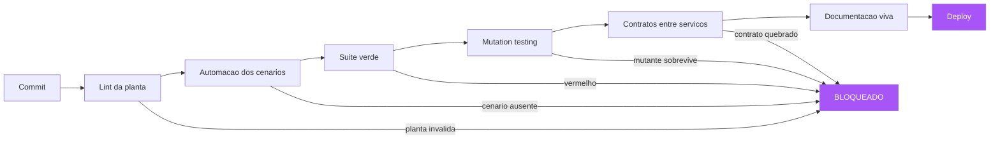

# Capítulo 11: O habite-se contínuo: CI/CD e a spec como fonte da verdade

## 1. Introdução

No Capítulo 10, você viu o fluxo SDD completo com seus portões verificáveis. Este capítulo leva o habite-se ao limite: a verificação contínua — o pipeline de CI/CD onde a especificação é a fonte da verdade, cada commit é vistoriado contra a planta, e a entrega só avança quando o habite-se é concedido [1]. Você vai aprender a arquitetura do pipeline orientado por especificação: os estágios que executam os cenários, medem a cobertura orientada por comportamento (e não por linhas), auditam a qualidade da verificação e bloqueiam merges em divergência [2][3]. Você vai aprender também a governança do trânsito entre etapas — o Definition of Done executado pelo pipeline, não por carimbo — e como o relatório de execução vira a documentação viva que o negócio consulta (Capítulo 4, agora em escala industrial) [4][5].

## 2. Explica

### A especificação como fonte da verdade do pipeline

A inversão central deste capítulo: no pipeline tradicional, o código é a fonte da verdade e os testes são a verificação. No pipeline SDD, a especificação é a fonte da verdade e o código é a implementação que deve satisfazê-la [1]. A consequência prática é a ordem e a autoridade dos estágios: o pipeline começa pela planta — o lint da spec, a validação do glossário, a existência dos cenários — e só então executa a implementação contra ela [6]. Se a planta está incompleta ou inválida, o pipeline falha ANTES de compilar o código: a obra não começa com a planta emendada. Essa inversão de autoridade é o que diferencia o pipeline SDD do pipeline de testes comum: o pipeline não pergunta "o código funciona?", pergunta "o código cumpre a planta?" — e a diferença é mensurável: um pipeline orientado por código pode ficar verde com uma implementação que satisfaz os testes e viola a intenção (o problema do Capítulo 1, automatizado); o pipeline orientado por spec trava exatamente nesse ponto [7].

Você vai perceber que a fonte da verdade tem três manifestações no pipeline: como gate de entrada (a planta deve ser válida antes da implementação), como critério de saída (a planta deve estar verde para o deploy) e como documentação (o relatório de execução da planta é a documentação viva do sistema) [4][8]. As três manifestações funcionam porque a planta é executável — um artefato que pode ser lintado, executado e relatado. Essa é a diferença entre o SPEC.md do Capítulo 6 (um documento) e a fonte da verdade do pipeline (um contrato executável com dono e verificação automatizada) [9].

### A cobertura orientada por cenários

A métrica que o pipeline SDD usa no lugar da cobertura de linhas é a cobertura orientada por cenários — ou, mais precisamente, a rastreabilidade entre cenários e comportamento [3][10]. A pergunta não é "quantas linhas os testes tocaram?" — é "quais comportamentos da planta estão verificados?" A rastreabilidade exige que cada comportamento relevante (cada outcome da spec, cada regra de borda) esteja mapeado para pelo menos um cenário, e que o pipeline reporte os comportamentos sem cenário — as lacunas da planta [10]. Essa métrica tem duas propriedades que a cobertura de linhas não tem: ela é legível pelo negócio (comportamentos são nomes de domínio, não linhas de código) e ela é auditável contra a intenção (um comportamento sem cenário é uma intenção não verificada, independentemente da cobertura de linhas) [3].

A relação com o mutation testing do Capítulo 9 é complementar: a cobertura orientada por cenários responde "o que está especificado e verificado?"; o mutation testing responde "os testes realmente detectariam defeitos no que verificam?". As duas métricas juntas formam a imagem completa da qualidade da verificação: a primeira olha para as lacunas de especificação (comportamentos sem cenário); a segunda olha para as lacunas de detecção (cenários que não pegariam um defeito) [2][11]. Um pipeline maduro reporta as duas, com limiares por módulo — e o relatório consolidado é o habite-se quantificado da obra.

### O Definition of Done executado pelo pipeline

O Definition of Done (DoD), que você viu no Capítulo 5 como lista, vira no pipeline SDD uma sequência de portões executados [5]. O DoD executado tem cinco portões: (1) a spec está aprovada e versionada (o portão da planta); (2) os cenários existem e rodam no CI (o portão da automação); (3) a suíte está verde e a taxa de mutação respeita o limiar (o portão da verificação); (4) os contratos entre serviços foram verificados (o portão da integração — Capítulo 8); e (5) a documentação viva foi gerada e publicada (o portão da comunicação — Capítulo 4) [8][12]. A diferença entre o DoD de papel e o DoD executado é a mesma entre um checklist e um pipeline: o checklist depende de alguém marcar; o pipeline executa e bloqueia — o merge não acontece se um portão falha, não porque alguém decidiu, mas porque a máquina não concede [13].

Note a consequência cultural: o DoD executado remove a negociação do "está pronto?". A pergunta "essa história está pronta?" deixa de ter resposta subjetiva — a resposta é o estado do pipeline: se todos os portões estão verdes, está pronta; se algum está vermelho, não está, e o relatório diz exatamente qual [14]. Isso não elimina o julgamento humano — elimina a disputa: o julgamento fica onde deve estar (a adequação da planta à intenção, que é do PO), e a execução da planta fica com a máquina [15]. O DoD executado é, em essência, a burocracia boa: o procedimento que existe para proteger a obra, não para atrasá-la [16].

### A governança do trânsito entre etapas

O pipeline SDD também institucionaliza a governança do trânsito — as regras que controlam quando um artefato pode passar de uma etapa para a seguinte [8]. Os padrões de governança: branch protection (nenhum merge na main sem o pipeline verde); environments (deploy em staging exige verde; deploy em produção exige verde em staging + aprovação manual quando o risco justifica); e revisão da planta (mudanças na spec exigem revisão do PO, separada da revisão do código) [17]. A governança não é um fim em si — é a materialização das decisões de risco da organização: quanto maior o custo de falha, mais estrito o trânsito [18]. E a governança é documentada e versionada: a política de trânsito vive no repositório, muda por pull request, e é auditável — quem aprovou o trânsito de quê, quando e com base em quais portões [19].

## 3. Ilustra

Voltemos à construtora para a imagem final da obra: a vistoria contínua. Na construção tradicional, a vistoria acontece no fim — o fiscal percorre o prédio pronto e emite o habite-se (ou não). Na construção com vistoria contínua — o modelo que o CI implementa —, cada etapa da obra é vistoriada no momento em que é concluída: a fundação é conferida antes de o térreo ser erguido sobre ela; a estrutura de cada andar é conferida antes de o próximo andar ser construído; a hidráulica é testada com pressão antes de o acabamento cobri-la [20]. O fiscal não espera o fim: ele habita o canteiro, e o habite-se é um estado contínuo — a obra está sempre "verde" até o próximo ato de construção, que precisa ser vistoriado para o verde continuar [1]. E, crucialmente, a vistoria contínua tem registro: cada conferência deixa um laudo assinado, e o laudo de qualquer etapa pode ser consultado anos depois — quando o edifício tem um problema, a pergunta não é "quem construiu?", é "qual laudo falhou?" [4].



A lição da metáfora da vistoria contínua é dupla. Primeiro: o habite-se não é um evento final — é um estado contínuo mantido por vistorias incrementais; o pipeline SDD é exatamente isso: cada commit é um ato de construção, e cada portão do pipeline é a vistoria daquele ato [1]. Segundo: o laudo é o relatório do pipeline — a documentação viva que responde "o que foi vistoriado, quando, e com qual resultado?" para qualquer parte do sistema, a qualquer momento [4][21]. Você, como Engenheiro de Software, conhece a versão digital do prédio sem vistoria contínua: o deploy que "funcionava na minha máquina", a integração que quebra em produção, o hotfix que apaga o trabalho da semana — o pipeline SDD é o antídoto estrutural para todos eles [22].

## 4. Técnica

### O pipeline completo em GitHub Actions

A implementação do pipeline SDD em um CI real — o habite-se contínuo em código:

```yaml
# .github/workflows/habite-se.yml — o pipeline SDD de ponta a ponta
name: Habite-se continuo
on:
  push:
    branches: [main]
  pull_request:

jobs:
  planta:
    runs-on: ubuntu-latest
    steps:
      - uses: actions/checkout@v4
      - uses: actions/setup-python@v5
        with: { python-version: "3.12" }
      - name: Instalar dependencias
        run: pip install -r requirements-dev.txt
      - name: Portao 1 — Lint da planta (spec + glossario)
        run: |
          python lint_spec.py SPEC.md
          python lint_glossario.py docs/glossario.md
      - name: Portao 2 — Automacao (cenarios existem e rodam)
        run: pytest tests/features -q
      - name: Portao 3 — Suite verde
        run: pytest -q
      - name: Portao 4 — Mutation testing nos modulos criticos
        run: mutmut run --paths-to-mutate src/ --threshold 75
      - name: Portao 5 — Verificacao de contratos
        run: pytest tests/contract -q

  documento_vivo:
    needs: planta
    runs-on: ubuntu-latest
    steps:
      - uses: actions/checkout@v4
      - name: Gerar documentacao viva (relatorio de cenarios)
        run: python gerar_documentacao_viva.py --output docs/relatorio.html
      - uses: actions/upload-pages-artifact@v3
        with: { path: docs/relatorio.html }
```

### O lint da planta: validando a rastreabilidade

O primeiro portão do pipeline é o lint da planta — a verificação de que a spec e os cenários formam um conjunto coerente. O lint valida: os seis elementos da spec (Capítulo 6); o glossário (todo termo dos cenários existe no glossário — Capítulo 5); e a rastreabilidade (todo outcome da spec tem pelo menos um cenário — a cobertura orientada por comportamento) [10]:

```python
"""lint_rastreabilidade.py — verifica a cobertura orientada por cenarios.

Cada outcome da SPEC.md deve ter pelo menos um cenario na feature.
Comportamentos sem cenario sao intencoes nao verificadas — o pipeline
bloqueia o merge quando uma nova funcionalidade chega sem cenario.
"""
import re
import sys
from pathlib import Path


def extrair_outcomes(spec: Path) -> list[str]:
    texto = spec.read_text(encoding="utf-8")
    secao = texto.split("## 1. Resultados esperados")[-1].split("## 2.")[0]
    return [linha.strip("- ").strip() for linha in secao.splitlines()
            if linha.strip().startswith("-")]


def extrair_cenarios(features_dir: Path) -> list[str]:
    cenarios: list[str] = []
    for arq in features_dir.glob("*.feature"):
        texto = arq.read_text(encoding="utf-8")
        cenarios += [linha for linha in texto.splitlines()
                     if re.match(r"\s*(Cenário|Esquema do Cenário):", linha)]
    return cenarios


def validar_rastreabilidade(spec: Path, features_dir: Path) -> tuple[list[str], list[str]]:
    outcomes = extrair_outcomes(spec)
    cenarios = extrair_cenarios(features_dir)
    sem_cenario = []
    for outcome in outcomes:
        nucleo = outcome.lower()
        coberto = any(nucleo in c.lower() for c in cenarios)
        if not coberto:
            sem_cenario.append(outcome)
    return outcomes, sem_cenario


if __name__ == "__main__":
    spec = Path("SPEC.md")
    feats = Path("tests/features")
    outcomes, sem_cenario = validar_rastreabilidade(spec, feats)
    print(f"Outcomes: {len(outcomes)} | Sem cenario: {len(sem_cenario)}")
    for lacuna in sem_cenario:
        print(f"  LACUNA: {lacuna}")
    if sem_cenario:
        sys.exit(1)
    print("Rastreabilidade OK: todo outcome tem cenario.")
```

### A documentação viva gerada pelo pipeline

O último estágio do pipeline produz a documentação viva — o relatório que transforma a execução dos cenários em um documento que o negócio consulta [4][21]. O relatório tem três seções: o resumo (a árvore de funcionalidades com o estado dos cenários — verde/vermelho); o detalhe (por funcionalidade, os cenários e seus passos, com o resultado de cada um); e as métricas (a cobertura orientada por comportamento e a taxa de mutação, por módulo) [23]. O gerador é simples — transforma o resultado da suíte em HTML publicável:

```python
"""gerar_documentacao_viva.py — transforma a suite em relatorio consultavel."""
import json
from pathlib import Path


def ler_resultados(pipeline_json: Path) -> dict:
    """Le o relatorio de execucao (formato JUnit/JSON) e organiza por feature."""
    dados = json.loads(pipeline_json.read_text(encoding="utf-8"))
    por_feature: dict[str, dict] = {}
    for caso in dados["casos"]:
        feature = caso["feature"]
        por_feature.setdefault(feature, {"passou": 0, "falhou": 0, "cenarios": []})
        bloco = por_feature[feature]
        bloco["cenarios"].append(caso)
        if caso["status"] == "passou":
            bloco["passou"] += 1
        else:
            bloco["falhou"] += 1
    return por_feature


def gerar_html(por_feature: dict) -> str:
    """Gera a pagina HTML da documentacao viva (o laudo do habite-se)."""
    linhas = ["<html><head><meta charset='utf-8'><title>Documentacao Viva</title></head>",
              "<body><h1>Habite-se do Sistema — Cenarios Executaveis</h1>"]
    for feature, bloco in sorted(por_feature.items()):
        cor = "#2ecc9a" if bloco["falhou"] == 0 else "#e74c3c"
        linhas.append(f"<h2 style='color:{cor}'>{feature} "
                      f"({bloco['passou']}/{bloco['passou'] + bloco['falhou']} verdes)</h2><ul>")
        for caso in bloco["cenarios"]:
            estado = "PASSOU" if caso["status"] == "passou" else "FALHOU"
            linhas.append(f"<li>{estado}: {caso['nome']}</li>")
        linhas.append("</ul>")
    linhas.append("</body></html>")
    return "\n".join(linhas)


if __name__ == "__main__":
    html = gerar_html(ler_resultados(Path("validacao/resultados.json")))
    Path("docs/relatorio.html").write_text(html, encoding="utf-8")
    print("Documentacao viva gerada em docs/relatorio.html")
```

### A política de trânsito versionada

A governança do trânsito é versionada no repositório — a política que define quem pode promover o quê e com quais portões [17][19]:

```markdown
# Política de Trânsito — Governança do Habite-se

## Principios
- A planta (spec) e a fonte da verdade; o codigo e a implementacao.
- Nenhum artefato avanca de etapa sem o portao correspondente verde.
- O julgamento humano fica na adequacao da planta a intencao; a execucao e da maquina.

## Portoes por transicao
| Transicao | Portao exigido | Decisor |
|---|---|---|
| Rascunho -> Aprovada | Revisao do PO (6 elementos + exemplares) | PO |
| Aprovada -> Em implementacao | Spec versionada na branch | Time |
| Em implementacao -> Verificada | CI verde + mutation testing no limiar | Pipeline |
| Verificada -> Deploy staging | Todos os portoes verdes | Pipeline |
| Deploy staging -> Producao | Staging verde + aprovacao manual (risco alto) | PO + SRE |

## Mudanca de politica
- Alteracoes nesta politica exigem pull request revisado e merge na main.
- A politica e auditavel: o historico de mudancas registra quem alterou o quê e quando.
```

### A ordem dos portões e o princípio do bloqueio mais cedo

A arquitetura dos portões do pipeline obedece a um princípio econômico: bloquear o mais cedo possível — o portão que falha mais barato deve rodar primeiro [1][8]. O lint da planta é o mais barato (segundos) e falha primeiro; a automação dos cenários é mais cara e roda depois; o mutation testing é o mais caro e roda por último — porque rodá-lo antes do lint seria desperdiçar minutos caros em uma obra que nem tem planta válida. A ordem correta é também a ordem da responsabilidade: a planta é verificada antes do código, porque o código que cumpre uma planta inválida é trabalho perdido [6]. O princípio do bloqueio mais cedo tem uma consequência prática no design do pipeline: nenhum estágio caro roda sem os estágios baratos verdes — e a otimização do pipeline é, em si, uma aplicação da planta: o pipeline é especificado, e o CI o verifica [23].

O princípio também orienta a relação entre o pipeline e o tempo dos desenvolvedores: um pipeline que falha tarde (depois de minutos de build e teste) é um pipeline que desperdiça o tempo de quem o consulta. A disciplina do feedback rápido — o dev deve saber em menos de dez minutos se o commit é válido — é o que mantém a confiança no habite-se (a armadilha do pipeline lento do Capítulo 5 da Aplica) [28]. A otimização do pipeline tem prioridades claras: lint e cenários rápidos primeiro, stages pesados paralelizados, e o mutation testing limitado aos módulos críticos — a mesma régua de proporcionalidade do Capítulo 9 aplicada ao próprio CI [11][25].

### A evolução do pipeline: o habite-se que aprende com os incidentes

O pipeline SDD não é estático — ele evolui aprendendo com os incidentes, exatamente como a suíte de exemplares do Capítulo 4 [3][25]. O ciclo de evolução: um incidente em produção é investigado; a triagem do Capítulo 1 classifica a origem; se a origem é uma lacuna de verificação (o comportamento não tinha cenário, ou o cenário não detectava o defeito), o incidente vira um portão novo no pipeline — o exemplar entra na feature, o portão que o verifica é adicionado, e o pipeline passa a bloquear o tipo de falha que produziu o incidente [25]. A disciplina é que cada incidente em produção termina em uma pergunta: "qual portão teria impedido isso?" — e se a resposta é "nenhum", o pipeline ganha um portão [27].

O ciclo de evolução do pipeline tem uma segunda fonte de aprendizado: as quebras de contrato entre serviços (Capítulo 8) e as falhas de integração alimentam os portões de contrato; e as divergências de interpretação (Capítulo 1) alimentam o lint da rastreabilidade — o portão que exige cenário para todo outcome novo. O resultado é um habite-se que fica mais rigoroso com o tempo — não por burocracia, mas por evidência: cada portão novo é a cicatriz de um incidente real, e o pipeline documenta a história dos erros que aprendeu a evitar [21][25]. Essa é a forma final da documentação viva: não apenas o relatório do que é verificado hoje, mas o registro de como a verificação aprendeu com o passado [4].

### O relatório consolidado do habite-se

O instrumento final é o relatório consolidado — o laudo único que responde, em uma página, o estado do sistema: a lista de funcionalidades com seus cenários (da documentação viva), as métricas de qualidade (cobertura orientada por comportamento e taxa de mutação, por módulo), e o estado dos contratos entre serviços (Capítulo 8) [24]. O relatório é gerado automaticamente a cada execução do pipeline, publicado em um endereço estável, e consultado por três públicos: o time (o estado da obra), o PO (a conformidade da planta) e a auditoria (a evidência do processo) [4][23]. O relatório consolidado é o habite-se em forma documental: qualquer pessoa pode olhar e dizer, com precisão, o que foi verificado, quando e com qual resultado — sem perguntar a ninguém [25].

## 5. Aplica

### A cena de contraste: o merge direto que pulou o pipeline

Você é o engenheiro de plataforma de uma empresa em crescimento. O pipeline SDD está funcionando há dois meses — a suíte, o mutation testing, os contratos, a documentação viva. Então, em uma sexta-feira à tarde, um desenvolvedor sênior — pressionado por um cliente importante — usa a opção de merge direto na main, contornando o pull request e o pipeline: "é uma mudança de uma linha no cálculo de desconto, confiem em mim". O merge acontece às 17h42. Às 19h, o incidente: o cálculo de desconto — que o pipeline teria travado, porque o cenário de desconto acumulado estava vermelho — foi aplicado com o bug, e uma promoção em andamento distribuiu descontos incorretos para milhares de clientes [26].

O diagnóstico, doloroso e didático: o pipeline não falhou — foi contornado. A tecnologia não protege contra a decisão humana de pular a vistoria; e a organização — que ainda tratava o pipeline como "processo burocrático" e não como "habite-se obrigatório" — não tinha a governança de branch protection configurada para impedir o merge direto [17]. A correção que você conduz tem três frentes. Primeira: o branch protection é ativado — merges na main exigem pull request com o pipeline verde, e o merge direto é tecnicamente impossível (não é mais uma decisão, é uma restrição da plataforma). Segunda: o incidente vira o caso de estudo da política de trânsito — o documento que explicita que "a exceção de prazo não existe: o custo do atalho é o incidente" [18]. Terceira: o cálculo de desconto ganha os cenários que faltavam — o exemplar do desconto acumulado entra na feature (Capítulo 4: bug vira exemplar), e a taxa de mutação do módulo é monitorada. Seis meses depois, zero merges fora do pipeline e zero incidentes de desconto [27].

### Armadilhas comuns

As armadilhas do habite-se contínuo são conhecidas. A primeira é o pipeline de vitrine: o CI existe, mas ninguém confia nele — desenvolvedores que rodam os testes localmente e "sabem que passa" mesmo com o pipeline vermelho; o pipeline que ninguém consulta não é habite-se, é decoração [28]. A segunda é o portão de goma: a branch protection existe, mas o pipeline é tão lento ou tão flaky que os times aprendem a contorná-la — a regra é que o pipeline lento é uma dívida a pagar, não uma permissão para o atalho. A terceira é a métrica de vitrine: cobertura de linhas exibida em dashboards bonitos enquanto a cobertura orientada por comportamento tem lacunas — as métricas que o negócio não entende protegem ninguém [10]. A quarta é o DoD de carimbo: a lista de verificação do DoD continua existindo no papel, e o time a marca sem executar os portões — o DoD duplicado (papel e pipeline) é um risco: qual é o verdadeiro? A regra é que o DoD é o pipeline, e o papel é o resumo dele [13]. E a quinta é a documentação viva que ninguém publica: o relatório é gerado e arquivado em um artefato que ninguém abre — a documentação viva só vive se for publicada em um endereço estável e consultada pelos três públicos [21].

### O habite-se e a confiança organizacional

O habite-se contínuo produz um ativo intangível que é, na prática, o mais valioso de todos: a confiança organizacional no processo de entrega [1][13]. A confiança tem duas dimensões. Primeira, a confiança técnica: quando o pipeline atesta, de forma automática e verificável, que a planta foi cumprida, o time confia que o merge não quebra o que estava verde — e essa confiança reduz o medo, a revisão defensiva e o retrabalho preventivo [8]. Segunda, a confiança na governança: quando os portões são executados e não negociados, o PO confia que "verde" significa o que diz, o SRE confia que o deploy não introduz regressão conhecida, e a auditoria confia que o registro é verdadeiro [17][19]. A confiança é o que permite ao pipeline fazer seu trabalho final: acelerar — porque velocidade sem confiança é risco, e confiança sem velocidade é burocracia [27].

A confiança, no entanto, é um ativo que se perde mais rápido do que se ganha — e a perda tem um mecanismo preciso: o falso verde. Quando o pipeline diz verde mas a produção quebra (o teste que não verificava, o portão contornado, o ambiente divergente), a confiança é ferida, e a ferida se manifesta como o comportamento defensivo da armadilha do Capítulo 5 da Aplica: os times começam a verificar manualmente o que o pipeline já deveria ter verificado, e a velocidade morre [28][29]. A restauração da confiança tem uma disciplina clara: todo falso verde é investigado com o rigor da triagem do Capítulo 10 — qual portão falhou em detectar? — e o portão é corrigido antes de qualquer outra coisa, porque a confiança não se restaura com promessas, se restaura com portões que funcionam [25]. O habite-se contínuo, no fim, é menos uma tecnologia e mais uma relação: o pipeline atesta, o time confia, e a confiança é mantida pelo registro de que, quando o habite-se falhou, a falha virou portão novo — não desculpa [13][27].

### Métricas de sucesso e fracasso

Sucesso: o tempo médio de verde (tempo entre o commit e o pipeline verde) é medido e estável; a proporção de merges que passam pelo pipeline é 100% (tecnicamente garantida pela branch protection); a cobertura orientada por comportamento cobre 100% dos outcomes (sem lacunas de rastreabilidade); e o relatório consolidado é consultado pelo PO nas revisões de sprint — a pergunta "está pronto?" tem resposta objetiva [14]. Fracasso: contornos do pipeline (merge direto, testes pulados); pipeline vermelho crônico normalizado ("está vermelho faz tempo, mas funciona"); métricas que o negócio não entende; e o sintoma mais claro — quando o relatório consolidado existe e ninguém o abre, o habite-se contínuo não existe [29].

Três decisões de arquitetura de pipeline separam o habite-se contínuo real do decorativo. Decisão um — o pipeline é o único caminho para a integração: branch protection com review obrigatório e verificação obrigatória (spec lint + cenários + CI), de modo que o caminho feliz de integrar sem verificação simplesmente não existe; quando o contorno é tecnicamente impossível, a disciplina deixa de depender da memória das pessoas. Decisão dois — o relatório consolidado de conformidade é gerado e arquivado por release: um documento único que lista cada funcionalidade da release, sua spec, seus cenários e o status final — verde com atestado ou exceção registrada com justificativa e prazo; esse relatório é o artefato que o PO assina na revisão, e é ele que transforma o pipeline de ferramenta técnica em instrumento de governança, porque dá ao negócio a mesma visibilidade que o time tem. Decisão três — o pipeline tem alarmes de silêncio: métricas de saúde do próprio processo (tempo médio de verde, taxa de contorno detectada, número de exceções vencidas) monitoradas com o mesmo cuidado que as métricas do produto; um pipeline que fica lento ou com exceções vencidas é dívida de verificação que se acumula em silêncio, e a primeira vez que ela cobra é exatamente no momento em que a confiança é mais necessária — na release crítica. A combinação das três decisões produz o efeito mais valioso do habite-se contínuo: a confiança escalável. A organização deixa de perguntar "podemos liberar?" (que exige julgamento humano caro e inconsistente) e passa a perguntar "o relatório está verde?" — a pergunta que qualquer pessoa pode responder olhando o artefato, com a mesma resposta que o time técnico daria [29]. É essa substituição de julgamento por evidência que torna a verificação contínua um ativo de negócio, não uma cerimônia de engenharia.

## 6. Conclusão

Neste capítulo, você institucionalizou o habite-se: o pipeline SDD onde a especificação é a fonte da verdade — a planta como gate de entrada, critério de saída e documentação [1][8]; a cobertura orientada por cenários, que substitui a cobertura de linhas por rastreabilidade entre comportamento e verificação [3][10]; o Definition of Done executado pelo pipeline, que remove a negociação do "está pronto?" [5][13]; e a governança do trânsito — branch protection, ambientes e política versionada [17][19]. O desafio: audite o seu CI atual — ele verifica a planta ou apenas o código? — e adicione pelo menos um portão orientado por especificação (o lint da rastreabilidade é o mais simples). No próximo e último capítulo, vamos ao futuro: o SDD agêntico — a spec como contrato entre humano e agente de IA, os três níveis de maturidade de Fowler, o padrão Coordinator/Implementor/Verifier, e o plano de voo para adotar o SDD na sua organização.

## 7. Referências Bibliográficas

[1] HUMBLE, Jez; FARLEY, David. *Continuous Delivery: Reliable Software Releases through Build, Test, and Deployment Automation*. Boston: Addison-Wesley, 2010.
[2] OFFUTT, Jeff. *Mutation Testing for the New Century*. Norwell: Kluwer, 2001.
[3] ADZIC, Gojko. *Specification by Example: How Successful Teams Deliver the Right Software*. Shelter Island: Manning Publications, 2011.
[4] ADZIC, Gojko. *Living Documentation: Continuous Knowledge Sharing by Design*. Boston: Addison-Wesley, 2017.
[5] SCHWABER, Ken; SUTHERLAND, Jeff. *The Scrum Guide: The Definitive Guide to Scrum*. 2020. Disponível em: https://scrumguides.org. Acesso em: 5 ago. 2026.
[6] OSMANI, Addy. *How to Write a Good Spec for AI Agents*. 2025. Disponível em: https://addyosmani.com/blog/good-spec/. Acesso em: 5 ago. 2026.
[7] WEINBERG, Gerald M. *Quality Software Management: Systems Thinking*. New York: Dorset House, 1992.
[8] FOWLER, Martin. *Deployment Pipeline* (bliki). Disponível em: https://martinfowler.com/bliki/DeploymentPipeline.html. Acesso em: 5 ago. 2026.
[9] AUGMENT CODE. *What is Spec-Driven Development?* Augment Code Guides. Disponível em: https://www.augmentcode.com/guides/what-is-spec-driven-development. Acesso em: 5 ago. 2026.
[10] COHN, Mike. *Succeeding with Agile: Software Development Using Scrum*. Boston: Addison-Wesley, 2009.
[11] OFFSETT, Jeff. Mutation Analysis. In: *Encyclopedia of Software Engineering*. New York: Wiley, 2002.
[12] NEWMAN, Sam. *Building Microservices: Designing Fine-Grained Systems*. 2. ed. Sebastopol: O'Reilly Media, 2021.
[13] FOWLER, Martin. *Continuous Integration* (bliki). Disponível em: https://martinfowler.com/articles/continuousIntegration.html. Acesso em: 5 ago. 2026.
[14] COHN, Mike. *User Stories Applied: For Agile Software Development*. Boston: Addison-Wesley, 2004.
[15] NORTH, Dan. *BDD is like TDD if...* Dan North & Associates, 2006. Disponível em: https://dannorth.net/blog/bdd-is-like-tdd-if/. Acesso em: 5 ago. 2026.
[16] MEYER, Bertrand. *Agile!: The Good, the Hype and the Ugly*. New York: Springer, 2014.
[17] GITHUB. *About Protected Branches*. GitHub Docs. Disponível em: https://docs.github.com/repositories/configuring-branches-and-merges-in-your-repository/managing-protected-branches. Acesso em: 5 ago. 2026.
[18] BROOKS, Frederick P. *The Mythical Man-Month: Essays on Software Engineering*. Anniversary ed. Boston: Addison-Wesley, 1995.
[19] HUMBLE, Jez; MOLEY, Joanne. *Continuous Delivery: The Book*. Disponível em: https://continuousdelivery.com/. Acesso em: 5 ago. 2026.
[20] FOWLER, Martin. *Specification by Example* (bliki). Disponível em: https://martinfowler.com/bliki/SpecificationByExample.html. Acesso em: 5 ago. 2026.
[21] ADZIC, Gojko. *The Secret of Living Documentation*. 2017. Disponível em: https://gojko.net/2017/10/01/the-secret-of-living-documentation.html. Acesso em: 5 ago. 2026.
[22] KLEPPMANN, Martin. *Designing Data-Intensive Applications*. Sebastopol: O'Reilly Media, 2017.
[23] CUCUMBER. *Cucumber Reports — Living Documentation*. Disponível em: https://cucumber.io/docs/guides/10-minute-tutorial/. Acesso em: 5 ago. 2026.
[24] PACT. *Pact Broker — Contract Verification Reports*. Disponível em: https://docs.pact.io/pact_broker. Acesso em: 5 ago. 2026.
[25] ADZIC, Gojko. *Specification by Example, 10 years later*. 2020. Disponível em: https://gojko.net/2020/03/17/sbe-10-years.html. Acesso em: 5 ago. 2026.
[26] NEWMAN, Sam. *Monolith to Microservices: Evolutionary Patterns to Transform Your Monolith*. Sebastopol: O'Reilly Media, 2019.
[27] MARTIN, Robert C. *Clean Code: A Handbook of Agile Software Craftsmanship*. Upper Saddle River: Prentice Hall, 2008.
[28] HUMBLE, Jez. *Why Don't Developers Trust CI?* Continuous Delivery Blog. Disponível em: https://continuousdelivery.com/2020/08/why-dont-developers-trust-ci/. Acesso em: 5 ago. 2026.
[29] ADZIC, Gojko. *Bridging the Communication Gap: Specification by Example and Agile Acceptance Testing*. London: Neuri Consulting, 2009.
