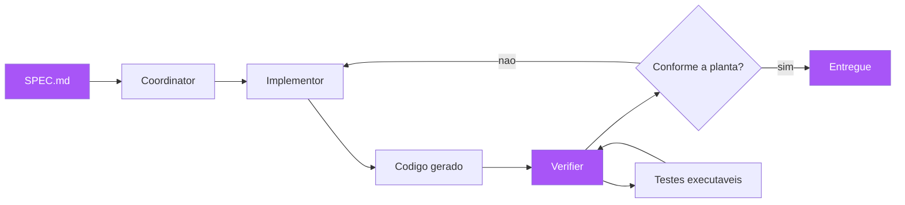

# Capítulo 12: SDD agêntico: a spec como contrato entre humano e agente

## 1. Introdução

Chegamos ao fechamento da obra — e o fechamento olha para o futuro: o desenvolvimento de software assistido por agentes de IA, e o papel que a especificação desempenha nesse novo mundo. Você vai aprender o SDD agêntico, a disciplina que transforma a SPEC.md em um contrato entre humano e agente: os três níveis de maturidade de Martin Fowler — spec-first, spec-anchored e spec-as-source [1]; o padrão adversarial Coordinator/Implementor/Verifier, que usa um agente verificador para auditar o código gerado contra a planta [2]; e as ferramentas do ecossistema — GitHub Spec Kit, Kiro, Tessl — que estão construindo a infraestrutura do desenvolvimento orientado por especificação [3][4]. Ao final, você terá o plano de voo completo para adotar o SDD na sua organização — a síntese de todos os capítulos anteriores aplicada à engenharia de software do presente e do futuro [5].

## 2. Explica

### O problema que o SDD agêntico resolve

O desenvolvimento com agentes de IA popularizou uma prática que os capítulos anteriores já diagnosticaram como o erro do Capítulo 1, agora em velocidade máxima: o prompt solto. "Implemente um endpoint de pagamento" dado a um agente de IA produz exatamente o mesmo comportamento que a instrução dada a um desenvolvedor — preencher as lacunas com suposições — só que em segundos, e com a aparência de confiança [6]. A diferença entre o desenvolvedor e o agente não é qualitativa; é quantitativa: o agente produz mais código baseado em suposições erradas, mais rápido, com mais fluência e menos consciência do que não sabe [7]. O SDD agêntico é a resposta disciplinada: a especificação — a planta de seis elementos do Capítulo 6 — é o contrato que o agente deve cumprir, e a verificação — os cenários, o CI, o mutation testing — é o habite-se que atesta a conformidade, sem depender da introspecção do agente [2][8].

Você vai perceber que o SDD agêntico não é uma técnica nova — é a convergência de tudo o que a obra ensinou: o problema é o mesmo (intenção perdida); a solução é a mesma (especificação executável); o que muda é o executor (o agente, mais rápido e mais literal). E por isso as disciplinas dos capítulos anteriores se tornam ainda mais críticas: as fronteiras explícitas (Capítulo 6) impedem o agente de "melhorar" além do pedido; os exemplares (Capítulo 4) eliminam a ambiguidade que o agente preencheria com suposições; e a verificação (Capítulos 9 e 11) atesta a conformidade sem confiar na autoavaliação do agente [1][2].

### Os três níveis de maturidade de Fowler

Martin Fowler, analisando as ferramentas emergentes de SDD, distinguiu três níveis de maturidade na relação entre especificação e código gerado [1][3]. No nível spec-first, a especificação orienta a tarefa atual do agente: o humano escreve uma spec para a funcionalidade em questão, o agente a implementa, e o resultado é revisado — a spec é um contrato de trabalho, não necessariamente um artefato duradouro. No nível spec-anchored, a especificação vive no repositório como artefato permanente: ela guia a evolução contínua da funcionalidade, é consultada por novos agentes (e humanos) que trabalham naquele módulo, e é atualizada junto com o código — a planta é mantida viva (Capítulo 4) [9]. No nível spec-as-source, a especificação é o artefato primário: os humanos editam a spec, e o código é gerado a partir dela de forma automatizada — os humanos não editam código diretamente; o agente regenera a implementação a partir da planta, e a planta é a única fonte de verdade editável [1][3].

A progressão entre os níveis é a progressão da confiança e da maturidade: spec-first é o primeiro degrau (a spec como contrato pontual); spec-anchored é o degrau de produção (a spec como memória viva do módulo); e spec-as-source é o degrau aspiracional (a spec como código-fonte, e o código como artefato derivado) [1]. A maioria das organizações começa no spec-first e amadurece para o spec-anchored; o spec-as-source é viável em domínios bem delimitados, onde a especificação é expressiva o suficiente para gerar a implementação sem perda — e exige que a verificação seja forte o bastante para atestar a conformidade da geração [10].

### O padrão adversarial: Coordinator, Implementor e Verifier

A arquitetura de agentes que está se consolidando para o SDD agêntico é o padrão de três papéis — um padrão que a Fábrica Agêntica de publicações técnicas utiliza em paralelo, e que você vai reconhecer como a materialização da triagem do Capítulo 10 em agentes [2][11]. O Coordinator analisa a spec, decompõe o trabalho em tarefas e coordena a execução — o papel do orquestrador. O Implementor escreve o código (e os testes) para cada tarefa — o papel do executor. E o Verifier — frequentemente um modelo mais rápido ou barato, ou um pipeline determinístico — audita o código gerado contra a spec original, caçando desvios (drift), falhas lógicas e violações de fronteira — o papel do fiscal [2][11]. O Verifier é o elemento-chave: ele quebra o círculo vicioso de "o agente implementou, o agente testou, o agente se aprovou" — a autoavaliação que repete o erro do Capítulo 1 em velocidade máxima [12].

O padrão adversarial funciona porque separa os papéis e os interesses: o Implementor é incentivado a produzir (e produzir rápido); o Verifier é incentivado a duvidar (e duvidar de tudo); e o Coordinator arbitra entre os dois usando a planta como referência [2]. A separação é análoga à da construção civil — o pedreiro constrói, o fiscal vistoria, e nenhum dos dois pode ser o outro — e à da própria Fábrica Agêntica: o orquestrador despacha subagentes redatores e depois um revisor técnico auditável, com veredito determinístico vindo de script, não da impressão do agente [11][13]. A lição transferível: a verificação é sempre um papel separado, e o verificador nunca é o próprio executor [12].

### As ferramentas do ecossistema agêntico

O ecossistema de ferramentas de SDD agêntico está em formação rápida. O GitHub Spec Kit é um toolkit open source que estrutura o fluxo em comandos — /speckit.specify (transforma intenção em spec), /speckit.plan (decompõe), /speckit.tasks (gera as tarefas) e /speckit.implement (executa) — com uma "constituição" (constitution.md) que define as regras imutáveis que os agentes devem seguir [3]. O Kiro é uma IDE baseada em VS Code que guia o fluxo Requirements (user stories + Gherkin Given-When-Then) → Design → Tasks, tornando o SDD agêntico um caminho guiado, não uma disciplina opcional [14]. E o Tessl é um framework com foco em spec-anchored e spec-as-source: permite engenharia reversa de código existente para spec (a planta reconstruída a partir do prédio), e validação rigorosa de contratos de componentes [4]. A comunidade mantém ainda o cc-sdd (Community Spec-Driven Development), o padrão aberto que formaliza o fluxo de linha de comando de especificação → plano → tarefas → implementação que o Spec Kit popularizou, tornando o ciclo independente de qualquer IDE ou fornecedor — a prova de que a planta antes do canteiro virou disciplina, não moda [3][15]. Essas ferramentas têm em comum a aposta central deste capítulo: o futuro do desenvolvimento é orientado por especificação, e os agentes são os construtores que seguem a planta [15].

## 3. Ilustra

Voltemos à construtora, agora no futuro próximo: a obra é construída por robôs de alvenaria, controlados por IA. O arquiteto não dirige mais cada pedreiro — ele escreve o caderno de encargos (a planta) e programa os robôs para seguirem as instruções do caderno. A descoberta imediata: os robôs são literalistas implacáveis — se o caderno diz "assente os tijolos", eles assentam tijolos para sempre, em qualquer parede, em qualquer direção, sem perguntar; e, pior, são confiantes — a parede que construíram "deve estar certa" segundo eles, mesmo quando está torta [6]. O arquiteto aprende a lição que este capítulo ensina: o caderno precisa ser muito mais preciso para os robôs do que para os humanos — cada instrução exige fronteiras ("não assente tijolos na parede leste"), medidas exatas (as cotas), e a proibição explícita de melhorias ("não decida por conta própria onde colocar a janela") [1]. E, crucialmente, o arquiteto contrata um fiscal ROBÔ separado — programado para duvidar — que mede cada parede contra o caderno e reprova qualquer desvio, sem confiar na palavra do robô construtor [2][12].



A lição da metáfora do robô é dupla e final. Primeiro: a qualidade da saída do agente é limitada pela qualidade da planta — um agente com uma planta ambígua produz um prédio torto com confiança; as disciplinas dos capítulos anteriores (exemplares, fronteiras, critérios) são o que tornam a planta boa o suficiente para os agentes [1][6]. Segundo: a verificação nunca pode ser a autoavaliação do executor — o fiscal robô separado (o Verifier) é o que transforma "o agente diz que está pronto" em "a máquina atesta que está pronto" [2][12]. Você, como Engenheiro de Software, está vivendo essa transição agora: os agentes já estão no seu fluxo — a pergunta é se você os está dirigindo com instruções soltas (o prompt do Capítulo 1) ou com a planta completa que esta obra ensinou [16].

## 4. Técnica

### O contrato agêntico: a spec como prompt estruturado

A aplicação mais imediata do SDD agêntico: transformar a spec em um contrato que o agente deve cumprir — o prompt estruturado que elimina a ambiguidade. A spec de seis elementos do Capítulo 6, entregue ao agente como contrato, com uma seção de restrições de comportamento explícitas:

```markdown
# CONTRATO DE IMPLEMENTAÇÃO PARA AGENTE — frete promocional

Você é o Implementor. Sua única fonte de verdade é a SPEC.md referenciada.
NÃO improvise, NÃO "melhore", NÃO adicione comportamento fora da planta.

## Regras de execução (obrigatórias)
1. Leia SPEC.md e tests/features/frete.feature ANTES de escrever código.
2. Implemente SOMENTE o comportamento descrito nos critérios de verificação.
3. NÃO altere a ordem de precificação nem adicione regras de negócio novas.
4. Se algo na spec estiver ambíguo, PARE e reporte a ambiguidade — não decida.
5. Todo código deve passar nos cenários do arquivo .feature (o habite-se).
6. Não edite SPEC.md nem o glossário — eles são do PO.

## Critérios de saída
- `pytest tests/features -q` verde (todos os cenários).
- `pytest -q` verde (suíte completa).
- Nenhuma alteração fora dos arquivos indicados na divisão de tarefas.
```

```bash
# Execucao do contrato: o agente implementa e o pipeline atesta
# 1) O agente le a planta e implementa
# 2) O pipeline roda os cenarios (o habite-se)
pytest tests/features -q
# 3) O Verifier audita o diff contra a planta (drift detection)
python verifier_drift.py --spec SPEC.md --diff origin/main..HEAD
```

### O Verifier determinístico: detectando drift

O Verifier pode ser um agente — mas o núcleo da verificação deve ser determinístico: scripts que comparam o diff contra a planta e detectam desvios [2][11]. O drift detection verifica: arquivos alterados fora da divisão de tarefas da spec (o agente mexeu onde não devia); comportamentos novos sem cenário (código adicionado sem exemplar correspondente); e fronteiras violadas (uso de termos ou recursos fora de escopo) [17]:

```python
"""verifier_drift.py — o fiscal deterministico do codigo gerado por agentes.

Compara o diff de um pull request contra a SPEC.md e detecta:
1) arquivos alterados fora da divisao de tarefas;
2) codigo novo sem cenario correspondente;
3) uso de termos fora do glossario do dominio.
"""
import re
import subprocess
import sys
from pathlib import Path


def arquivos_do_diff(base: str, head: str) -> list[str]:
    saida = subprocess.run(
        ["git", "diff", "--name-only", base, head],
        capture_output=True, text=True, check=True,
    ).stdout
    return [linha for linha in saida.splitlines() if linha.strip()]


def extrair_arquivos_da_spec(spec: Path) -> set[str]:
    texto = spec.read_text(encoding="utf-8")
    secao = texto.split("## 5. Divisão de tarefas")[-1].split("## 6.")[0]
    return set(re.findall(r"[A-Za-z0-9_./-]+\.py", secao))


def verificar_drift(spec: Path, base: str, head: str) -> list[str]:
    permitidos = extrair_arquivos_da_spec(spec)
    desvios: list[str] = []
    for arquivo in arquivos_do_diff(base, head):
        if arquivo.endswith((".py", ".md")) and arquivo not in permitidos:
            desvios.append(f"arquivo fora da planta: {arquivo}")
    return desvios


if __name__ == "__main__":
    desvios = verificar_drift(Path("SPEC.md"), "origin/main", "HEAD")
    if desvios:
        print("DRIFT DETECTADO — codigo fora da planta:")
        for d in desvios:
            print(f"  - {d}")
        sys.exit(1)
    print("Sem drift: o diff respeita a planta.")
```

### O fluxo com o padrão adversarial na prática

O fluxo de implementação com o padrão de três papéis, executável no seu repositório:

```yaml
# workflow agêntico com verificação adversarial (GitHub Actions)
name: Implementacao agêntica com habite-se
on:
  pull_request:
jobs:
  adversarial:
    runs-on: ubuntu-latest
    steps:
      - uses: actions/checkout@v4
        with:
          ref: main
      - name: Coordinator — valida a planta antes do canteiro
        run: python lint_spec.py SPEC.md && python lint_rastreabilidade.py SPEC.md tests/features
      - name: Implementor — verifica que o codigo foi gerado contra a spec
        run: python verifier_drift.py --spec SPEC.md --base origin/main --head HEAD
      - name: Verifier — o habite-se executavel
        run: |
          pytest tests/features -q
          pytest -q
          mutmut run --paths-to-mutate src/ --threshold 75
```

### Spec-as-source na prática: o ciclo regenerativo

O nível mais alto de maturidade — spec-as-source — funciona como um ciclo regenerativo: o humano edita a spec; a geração produz (ou regenera) o código; o pipeline verifica; e qualquer divergência volta para a spec [1][3]. O ciclo tem um pré-requisito técnico: a especificação deve ser expressiva o suficiente para gerar a implementação — na prática, isso significa um esquema de dados declarado, as regras de negócio em cenários executáveis, e as fronteiras explícitas. O fluxo mínimo:

```markdown
# O ciclo spec-as-source em três passos
1. O humano edita SPEC.md (a única fonte editável).
2. A geração regenera o código a partir da planta (agente ou gerador).
3. O pipeline verifica: se verde, a mudança está pronta; se vermelho,
   a divergência aponta onde a spec ou a geração precisa de correção —
   e a correção é feita NA SPEC, nunca direto no código.
```

A disciplina do ciclo: o humano nunca edita o código gerado diretamente — porque, se edita, a spec deixa de ser a fonte e o ciclo quebra [1]. Essa disciplina é contraintuitiva para engenheiros acostumados a editar código, e é a barreira cultural mais difícil do spec-as-source — mas é exatamente ela que mantém a planta viva e o prédio conforme (o Capítulo 4 em sua forma mais radical) [9][18].

### O agente como aprendiz da planta: a disciplina do prompt estruturado

O detalhe operacional que decide o sucesso do SDD agêntico é a disciplina do prompt: como o contrato é entregue ao agente e como o resultado é recebido de volta. A prática recomendada tem cinco momentos. Primeiro, o contexto mínimo: o agente recebe a spec, os cenários e a indicação de onde está a fonte da verdade — sem contexto, o agente reusa conhecimento genérico (a "tabela padrão do mercado" do incidente da Aplica) em vez de consultar a planta [6][23]. Segundo, a proibição explícita: o contrato declara o que o agente NÃO deve fazer — não melhorar, não alterar fora de escopo, não decidir ambiguidades — porque o agente literalista segue a letra do contrato, e a letra precisa incluir as proibições [1]. Terceiro, a regra do pause: se a spec tem ambiguidade, o agente para e reporta — a ambiguidade reportada é tratada como bug de especificação (Capítulo 10), não como carta branca para decidir [12]. Quarto, o Verifier separado: o resultado do agente passa pelo fiscal determinístico (drift detection, cenários, mutation testing) antes de qualquer revisão humana — a revisão humana audita a planta e o laudo do Verifier, não o código linha a linha [2][11]. Quinto, o retorno de aprendizado: os desvios que o Verifier encontra viram lições no contrato — cada drift detectado é uma cláusula nova no contrato agêntico (a evolução do pipeline do Capítulo 11, aplicada aos agentes) [17][22].

### O custo da confiança: quando o agente pode e quando não pode

O SDD agêntico não responde "agentes sim ou não" — responde "agentes em quais tarefas, com qual contrato e com qual verificação". A régua de delegação tem três critérios. Primeiro: a tarefa tem comportamento verificável? — se os critérios de verificação podem ser automatizados (cenários executáveis), o agente pode atuar; se a verificação exige julgamento humano subjetivo ("isso parece bom"), a delegação é arriscada [2][9]. Segundo: o custo de falha da tarefa é tolerável? — a régua de proporcionalidade do Capítulo 9 aplicada aos agentes: tarefas de baixo custo de falha podem ter agentes com verificação leve; tarefas críticas exigem verificação forte e revisão humana obrigatória [6]. Terceiro: a planta da tarefa está madura? — a spec está aprovada, os cenários existem, as fronteiras estão explícitas? Sem planta madura, o agente é um gerador de suposições rápidas, e a velocidade amplifica o erro [1][21].

A régua de delegação tem uma consequência organizacional: o time deve classificar o backlog por delegabilidade — as tarefas que podem ser entregues por agentes (planta madura + verificação automatizada + custo de falha tolerável) e as que exigem humanos no comando (descoberta, decisões de fronteira, revisão da planta, arbitragem da triagem) [19]. A classificação muda com o tempo: conforme a planta amadurece e a verificação se fortalece, tarefas migram da coluna humana para a coluna agêntica — a progressão do spec-first ao spec-anchored é exatamente essa migração [1][10]. O futuro da engenharia não é a substituição do humano pelo agente — é o humano como dono da planta, o agente como construtor, e o Verifier como fiscal: cada um no papel em que é insubstituível [5][22].

### O plano de voo: adotar o SDD na organização

O plano de voo para adotar o SDD — a síntese de toda a obra — tem cinco etapas, cada uma com um entregável e um portão. Etapa 1 — Diagnóstico (Capítulo 1): implementar a triagem de origem de defeitos e medir a proporção de bugs de especificação — o dado que justifica o investimento. Etapa 2 — Vocabulário (Capítulo 5): conduzir o event storming do domínio principal e consolidar o glossário — a matéria-prima da planta. Etapa 3 — Piloto (Capítulos 3, 4 e 6): escolher uma funcionalidade crítica e percorrer o fluxo completo — descoberta, formulação, aprovação, automação, implementação — produzindo a primeira spec de seis elementos com cenários executáveis. Etapa 4 — Infraestrutura (Capítulos 7, 9 e 11): integrar o pipeline SDD — ferramenta BDD, mutation testing nos módulos críticos, documentação viva publicada e branch protection — o habite-se contínuo. Etapa 5 — Escala (Capítulos 8, 10 e 12): estender o fluxo às integrações (contratos), padronizar o fluxo completo como processo da empresa, e avaliar os agentes com o padrão adversarial — começando pelo spec-first e amadurecendo para spec-anchored [5][19].

## 5. Aplica

### A cena de contraste: o agente que entregou o endpoint errado com confiança

Você é o engenheiro responsável por um módulo financeiro, e a empresa decidiu usar um agente de IA para implementar uma funcionalidade nova: "cálculo de juros para parcelamento". O fluxo adotado — por falta de disciplina — é o prompt solto: o desenvolvedor pede ao agente "implementa o cálculo de juros do parcelamento, pode usar a tabela padrão do mercado". O agente entrega em vinte minutos: uma função `calcular_juros` que aplica juros compostos mensais sobre o valor, com uma tabela interna de taxas "padrão do mercado". O código passa nos testes que o próprio agente escreveu. Quando você revisa, o alarme toca: a tabela "padrão do mercado" do agente não é a tabela da empresa — a empresa usa juros decrescentes (Tabela Price) com taxa contratual específica, e o agente inventou uma tabela própria porque o prompt não a definiu [6][20].

O diagnóstico é o do Capítulo 1 em velocidade máxima: o prompt solto — a instrução, não a planta — delegou ao executor (o agente) todas as decisões de borda: qual tabela, qual regime de juros, qual arredondamento, quais limites. E o agente, literalista e confiante, preencheu tudo com suposições plausíveis — e até escreveu testes que passam para as próprias suposições [7]. A correção que você conduz é a tese da obra: a funcionalidade é reescrita com a planta — a spec de seis elementos com a tabela de juros contratual como decisão já tomada, os exemplares do Capítulo 4 (o parcelamento de 12x com juros decrescentes, o arredondamento de centavos, o limite de parcelas), e os critérios de verificação em cenários — e o agente é reexecutado com o contrato completo, com o Verifier determinístico (drift detection) e o habite-se do pipeline [2][17]. O incidente vira o caso de estudo da empresa: o agente não é o problema — o prompt solto é o problema, e a planta é a solução [5].

### Armadilhas comuns

As armadilhas do SDD agêntico merecem o catálogo final. A primeira é o prompt solto: delegar a agentes sem planta, confiando na fluência — o erro mais caro, porque a velocidade do agente amplifica o custo das suposições erradas [6]. A segunda é a autoavaliação: deixar que o agente que implementou também verifique — o agente aprovando o próprio código repete o círculo vicioso do Capítulo 1; o Verifier é sempre separado [12]. A terceira é a spec como literatura: escrever a spec e entregá-la ao agente sem a verificação executável — sem cenários no CI, a spec é um pedido educado, e o agente não tem por que cumpri-la [9]. A quarta é o spec-as-source prematuro: pular os níveis e tentar o spec-as-source sem a infraestrutura de verificação — a geração automática sem habite-se forte é uma fábrica de código não verificado [10]. E a quinta é o medo do agente: recusar agentes por completo, perdendo a velocidade que a planta permitiria — a posição madura não é "agentes sim ou não", é "agentes com planta, verificação separada e humano como dono da planta" [21].

### O futuro que já chegou: o SDD como habilidade permanente

O fechamento desta obra não é uma conclusão — é uma reorientação: o SDD não é uma metodologia que se adota e se abandona; é uma habilidade permanente, que se torna mais valiosa à medida que as ferramentas mudam [5][15]. A história deste livro é a história de uma ideia estável atravessando gerações de ferramentas: a especificação verificável nasceu com a lógica de Hoare (Capítulo 2), virou BDD com Dan North (Capítulo 3), ganhou exemplares com Adzic (Capítulo 4), foi formalizada como spec com a onda agêntica (Capítulo 6) e agora é o contrato entre humano e agente (Capítulo 12). As ferramentas mudam — VDM, Z, Cucumber, Kiro, Spec Kit — e o princípio permanece: a planta antes do canteiro, e o habite-se antes da entrega [1][3][22]. Quem domina o princípio navega as mudanças de ferramenta como migrações (Capítulo 7); quem domina só a ferramenta fica preso à moda do momento [24].

A habilidade permanente tem três componentes que esta obra treinou e que você deve continuar treinando. Primeiro, o reflexo de especificar: diante de qualquer pedido de software, a pergunta automática "quais os exemplos, quais as fronteiras, como verificamos?" — o reflexo do Capítulo 1, que se fortalece com o uso [5]. Segundo, a capacidade de verificar: a leitura crítica de qualquer afirmação sobre software — "funciona para quais entradas? o que o teste realmente verifica? o que o agente assumiu?" — a cultura do rigor do Capítulo 9 [12][24]. Terceiro, a disciplina de manter a planta viva: especificação e código juntos, verificação contínua, evolução pela planta — o ciclo do Capítulo 10, que é o que impede o apodrecimento do Capítulo 4 [9][21]. O engenheiro que domina os três componentes — especificar, verificar, manter — está equipado para qualquer geração de ferramentas, de agentes e de arquiteturas que a indústria produzir: a planta muda de formato, o canteiro muda de tecnologia, e o habite-se continua sendo a diferença entre construir e adivinhar [16][22].

### Métricas de sucesso e fracasso

Sucesso no SDD agêntico: a proporção de trabalho de agentes precedida por spec aprovada passa de 90%; a taxa de drift (desvios da planta) cai a níveis residuais; o tempo de revisão humana cai — o revisor audita a planta e o resultado do Verifier, não linha a linha do código gerado; e a qualidade se mantém ou melhora — os bugs de especificação não aumentam com a velocidade [22]. Fracasso: agentes produzindo código sem planta e sem verificação; drift normalizado ("o agente melhorou, deixamos"); revisão humana que continua linha a linha (o que anula a velocidade); e o sintoma final — quando a organização não consegue dizer qual spec gerou qual código, o SDD agêntico não existe, é vibe coding com risco [23].

Para navegar essa transição, a organização precisa de três guarda-corpos que valem tanto para o agente quanto para o humano que o supervisiona. O primeiro é o guarda-corpo da planta como fronteira de autoridade: o agente recebe a spec e o escopo — o que está dentro é delegado, o que está fora é negociação; a definição explícita de fronteira transforma o desvio de escopo de surpresa em violação detectável, porque o verificador conhece a planta e pode apontar o desvio na hora. O segundo é o guarda-corpo do Verifier como segunda assinatura: nenhum código gerado por agente entra na base principal sem passar pelo verificador automático (cenários verdes + lint de spec + review humano do resultado, não do processo); o humano deixa de revisar cada linha para revisar a planta, o resultado do verificador e as decisões registradas pelo agente — a revisão sobe de granularidade, e é essa subida que torna o trabalho do agente sustentável e seguro ao mesmo tempo. O terceiro é o guarda-corpo da rastreabilidade: cada artefato gerado registra a spec de origem, a versão do agente e o resultado do verificador, de modo que a pergunta "qual spec gerou este código?" tenha sempre resposta automática; rastreabilidade é o pré-requisito da auditoria e da confiança — sem ela, o drift não é detectável, e sem detecção de drift, a delegação vira aposta. O padrão emergente que o capítulo desenha é o da especialização: a spec deixa de ser apenas o contrato entre o negócio e o desenvolvimento e passa a ser também o contrato entre o humano e a máquina — a mesma planta que orienta a construção orienta a verificação, e o mesmo documento que o PO assina é o documento que o agente executa e que o verificador audita. A consequência profunda é a convergência: no SDD agêntico, especificação, implementação e verificação são três leituras do mesmo texto — e é essa unidade que transforma a intenção em código verificável sem que a máquina adivinhe, nem o humano vigie linha a linha [23].

## 6. Conclusão

Neste capítulo final, você completou o arco da obra: o SDD agêntico — a especificação como contrato entre humano e agente, resolvendo o problema do Capítulo 1 em velocidade máxima [1][6]; os três níveis de maturidade de Fowler — spec-first, spec-anchored e spec-as-source [1][3]; o padrão adversarial Coordinator/Implementor/Verifier, com a verificação sempre separada do executor [2][11][12]; as ferramentas do ecossistema — GitHub Spec Kit, Kiro e Tessl [3][4][14]; e o plano de voo em cinco etapas para adotar o SDD na sua organização [5][19]. O desafio final: escolha uma funcionalidade pequena do seu backlog e percorra o ciclo completo desta obra — da triagem de defeitos à spec de seis elementos, dos exemplares aos cenários verdes — e, quando fizer, experimente o mesmo fluxo com um agente de IA, com o Verifier determinístico atestando a conformidade. O edifício que você aprendeu a construir — a planta, o canteiro e o habite-se — é a disciplina que transforma intenção em código verificável, com ou sem agentes, agora e no futuro [24].

## 7. Referências Bibliográficas

[1] FOWLER, Martin. *Understanding Spec-Driven Development* (Exploring Gen AI — SDD tools). 2025. Disponível em: https://martinfowler.com/articles/exploring-gen-ai/sdd-3-tools.html. Acesso em: 5 ago. 2026.
[2] AUGMENT CODE. *What is Spec-Driven Development?* Augment Code Guides. Disponível em: https://www.augmentcode.com/guides/what-is-spec-driven-development. Acesso em: 5 ago. 2026.
[3] GITHUB. *Spec-Driven Development with AI — get started with a new open source toolkit*. GitHub Blog, 2025. Disponível em: https://github.blog/ai-and-ml/generative-ai/spec-driven-development-with-ai-get-started-with-a-new-open-source-toolkit/. Acesso em: 5 ago. 2026.
[4] TESSL. *Tessl — Spec-driven software development framework*. Disponível em: https://tessl.io/. Acesso em: 5 ago. 2026.
[5] ADZIC, Gojko. *Specification by Example: How Successful Teams Deliver the Right Software*. Shelter Island: Manning Publications, 2011.
[6] OSMANI, Addy. *How to Write a Good Spec for AI Agents*. 2025. Disponível em: https://addyosmani.com/blog/good-spec/. Acesso em: 5 ago. 2026.
[7] BROOKS, Frederick P. *The Mythical Man-Month: Essays on Software Engineering*. Anniversary ed. Boston: Addison-Wesley, 1995.
[8] ADZIC, Gojko. *Living Documentation: Continuous Knowledge Sharing by Design*. Boston: Addison-Wesley, 2017.
[9] ADZIC, Gojko. *The Secret of Living Documentation*. 2017. Disponível em: https://gojko.net/2017/10/01/the-secret-of-living-documentation.html. Acesso em: 5 ago. 2026.
[10] FOWLER, Martin. *Exploring Gen AI — Kiro, Spec Kit e Tessl: analise critica*. 2025. Disponível em: https://martinfowler.com/articles/exploring-gen-ai/. Acesso em: 5 ago. 2026.
[11] FABRICA AGÊNTICA DE PUBLICAÇÕES. *Orquestrador Central — squad, esteira e verificação determinística* (fonte primária interna). 2026.
[12] NORTH, Dan. *BDD is like TDD if...* Dan North & Associates, 2006. Disponível em: https://dannorth.net/blog/bdd-is-like-tdd-if/. Acesso em: 5 ago. 2026.
[13] MARTIN, Robert C. *Clean Architecture: A Craftsman's Guide to Software Structure and Design*. Boston: Prentice Hall, 2017.
[14] KIRO. *Kiro — Spec-driven IDE*. Disponível em: https://www.kiro.dev/. Acesso em: 5 ago. 2026.
[15] RICHARDS, Mark; FORD, Neal. *Fundamentals of Software Architecture: An Engineering Approach*. Sebastopol: O'Reilly Media, 2020.
[16] EVANS, Eric. *Domain-Driven Design: Tackling Complexity in the Heart of Software*. Boston: Addison-Wesley, 2003.
[17] GITHUB. *GitHub Copilot Workspace — spec-to-code workflows*. Disponível em: https://github.com/features/copilot/workspace. Acesso em: 5 ago. 2026.
[18] KEOGH, Liz. *Behaviour Driven Development*. Disponível em: https://lizkeogh.com/behaviour-driven-development/. Acesso em: 5 ago. 2026.
[19] HUMBLE, Jez; FARLEY, David. *Continuous Delivery: Reliable Software Releases through Build, Test, and Deployment Automation*. Boston: Addison-Wesley, 2010.
[20] WEINBERG, Gerald M. *Quality Software Management: Systems Thinking*. New York: Dorset House, 1992.
[21] MARTIN, Robert C. *Agile Software Development: Principles, Patterns, and Practices*. Upper Saddle River: Prentice Hall, 2002.
[22] ADZIC, Gojko. *Specification by Example, 10 years later*. 2020. Disponível em: https://gojko.net/2020/03/17/sbe-10-years.html. Acesso em: 5 ago. 2026.
[23] OSMANI, Addy. *Vibe Coding is not Spec-Driven Development*. 2025. Disponível em: https://addyosmani.com/blog/good-spec/. Acesso em: 5 ago. 2026.
[24] SCHWABER, Ken; SUTHERLAND, Jeff. *The Scrum Guide: The Definitive Guide to Scrum*. 2020. Disponível em: https://scrumguides.org. Acesso em: 5 ago. 2026.
