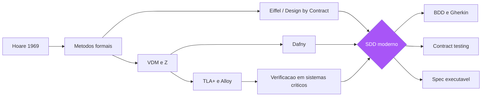

# Capítulo 2: A pré-história: de VDM e Z ao Design by Contract

## 1. Introdução

No Capítulo 1, você viu o diagnóstico: a intenção se perde entre a cabeça de quem a tem e o código de quem a implementa, e o custo dessa perda cresce com o tempo. Agora vamos recuar algumas décadas para entender que a indústria não é ignorante do problema — ela tentou resolvê-lo com uma ferramenta de precisão cirúrgica: a especificação formal. Você vai aprender o que foram os métodos formais (VDM, notação Z), o Design by Contract de Bertrand Meyer, a lógica de Hoare que os fundamenta, e os herdeiros modernos dessa tradição — TLA+, Alloy e Dafny — usados até hoje na AWS e na Microsoft para especificar sistemas onde erro não é opção. Mais importante que a história, você vai entender por que essa tradição não escalou para o desenvolvimento comercial cotidiano, e o que exatamente dela o Spec-Driven Development moderno resgatou: a especificação como algo que pode ser verificado por máquina, sem exigir que todos os programadores sejam matemáticos.

## 2. Explica

### O sonho da corretude axiomática

A busca por provar que software está correto é tão antiga quanto o próprio software. Nos anos 1960, Edsger Dijkstra formulou o problema com a clareza que lhe era característica: se você pudesse demonstrar matematicamente que um programa satisfaz sua especificação — para todas as entradas, em todos os estados —, bugs seriam impossíveis por construção [1]. Essa visão, chamada de corretude formal, atraiu alguns dos melhores cérebros da computação. A lógica de Hoare, publicada por Tony Hoare em 1969, deu a base matemática: um triplo de Hoare {P} C {Q} afirma que, se a pré-condição P vale antes da execução do comando C, então a pós-condição Q vale depois [2]. Com essa notação, era possível raciocinar sobre programas com o mesmo rigor com que se raciocina sobre teoremas geométricos. Dijkstra levou a ideia adiante com a programação disciplinada e o cálculo de predicados transformadores (wp-calculus), mostrando que a especificação poderia guiar a construção do programa passo a passo [3].

Você vai perceber que essa tradição produziu duas linhagens de ferramentas. A primeira é a linhagem das notações de especificação: VDM (Vienna Development Method), criada no laboratório da IBM em Viena nos anos 1970, e a notação Z, desenvolvida por Jean-Raymond Abrial na década seguinte — ambas baseadas em teoria dos conjuntos e lógica de predicados, capazes de descrever estados e operações de sistemas com precisão matemática [4]. A segunda é a linhagem das linguagens verificáveis: linguagens de programação projetadas desde o início para carregar suas especificações embutidas, como o Eiffel de Bertrand Meyer, que implementava o Design by Contract como parte da linguagem [5]. Essas duas linhagens convergem em um ponto: a crença de que especificação e verificação são duas faces da mesma moeda — não há como verificar sem uma especificação contra a qual verificar, e não há especificação útil que não possa ser verificada [6].

### Design by Contract: o contrato como ferramenta de engenharia

O Design by Contract (DbC), conceito central de Bertrand Meyer, merece atenção especial porque é a ponte mais direta entre a tradição formal e o desenvolvimento comercial. A ideia é simples e profunda: uma operação de software é um contrato entre duas partes — o chamador (cliente) e a rotina (fornecedor). O contrato tem três cláusulas: a pré-condição, que define o que o chamador deve garantir antes da chamada (por exemplo, "o valor deve ser não negativo"); a pós-condição, que define o que a rotina garante em troca (por exemplo, "o resultado é a raiz quadrada aritmética do valor"); e a invariante de classe, que define as condições que valem em todos os estados estáveis do objeto [5]. A beleza do DbC está em quem ele responsabiliza: se a pré-condição falha, a culpa é do chamador — a rotina não precisa se defender de chamadas inválidas; se a pós-condição falha, a culpa é da rotina [7].

Note como isso é uma revolução silenciosa em relação ao estilo defensivo de programação. O programador defensivo escreve código que verifica tudo o tempo todo, cobrindo os erros do chamador — o que produz código inflado e comportamentos silenciosos quando algo está errado. O programador contratual escreve asserções explícitas e deixa o sistema falhar alto, indicando exatamente qual parte do contrato foi violada [8]. Em Eiffel, isso é nativo da linguagem com as palavras-chave require, ensure e invariant; em outras linguagens, você implementa o mesmo padrão com asserções ou bibliotecas especializadas. O que o DbC ensina ao SDD é inestimável: a especificação não precisa ser um documento separado do código — ela pode viver dentro do próprio código, como asserções executáveis, e ser verificada a cada execução [9].

### A era dos modelos: TLA+, Alloy e Dafny

A tradição formal não morreu — ela se especializou. Nos anos 1990, Leslie Lamport criou o TLA+ (Temporal Logic of Actions), uma especificação matemática para sistemas concorrentes e distribuídos [10]. O TLA+ não é uma linguagem de programação: é uma linguagem de especificação com um modelo de tempo que permite expressar "eventualmente", "sempre" e "até que" — exatamente o que sistemas distribuídos precisam. A adoção mais famosa é interna: a AWS usa TLA+ para especificar e verificar partes críticas de seus serviços, e publicou resultados mostrando que a técnica encontrou bugs sutis que teriam passado por revisões e testes convencionais [11]. O Alloy, de Daniel Jackson no MIT, é um descendente mais acessível: uma linguagem baseada em lógica relacional com um analisador que explora automaticamente todos os estados possíveis de um modelo pequeno, encontrando contraexemplos para as propriedades que você acredita que seu design tem [12]. E o Dafny, de Rustan Leino na Microsoft, representa a convergência final: uma linguagem de programação imperativa que carrega contratos (precondições, pós-condições) verificados automaticamente por um provador de teoremas (Z3) em tempo de compilação [13].

### Por que não escalou: as três barreiras

Se tudo isso existe e funciona, por que você não escreve especificações formais no seu trabalho diário? As três barreiras são culturais, econômicas e técnicas. A barreira cultural: métodos formais exigem fluência matemática que a maioria dos programadores comerciais não tem nem tem tempo de desenvolver — a curva de aprendizado de Z ou TLA+ é íngreme e o retorno não é imediato [14]. A barreira econômica: a especificação formal é cara de produzir e manter; para a maioria dos sistemas comerciais, o custo de especificar formalmente tudo excede o custo dos bugs que evitaria — o rigor é proporcional ao risco, e a maioria dos sistemas não vive em risco de vida [15]. A barreira técnica: a verificação formal sofre com o problema da explosão combinatória — modelar todos os estados de um sistema grande é computacionalmente inviável, forçando a especificação formal a trabalhar com modelos abstratos pequenos, que não capturam a complexidade completa do sistema real [16].

Você vai perceber que essas três barreiras apontam para o mesmo lugar: a indústria precisava de algo que capturasse o espírito da especificação formal — especificação precisa, verificável por máquina, como fonte da verdade — sem o custo matemático. Essa é exatamente a lacuna que o BDD, o ATDD e a Specification by Example vieram preencher na década de 2000, como você verá nos próximos capítulos. A ponte conceitual é direta: o triplo de Hoare {P} C {Q} vira "dado X (Given), quando Y (When), então Z (Then)"; a pré-condição vira o contexto do cenário; a pós-condição vira a asserção do cenário; e a invariante de classe vira o comportamento transversal que os testes de contrato verificam continuamente [17].

## 3. Ilustra

Pense na evolução da planta de engenharia na construção civil. No século XVIII, as plantas eram desenhadas à mão, com esquadro e compasso, por engenheiros que precisavam dominar geometria descritiva — uma habilidade rara, ensinada em poucas escolas de elite. As plantas eram precisas, e edifícios notáveis nasceram delas. Mas a exigência de que todo construtor dominasse geometria descritiva limitou o uso: a maioria das construções era feita no olho, com regras práticas transmitidas de mestre para aprendiz. Foi o desenho técnico padronizado — com projeções ortogonais, cotas e convenções universais — que democratizou a planta: qualquer técnico treinado em um curso de poucos meses podia ler e executar um projeto. A especificação formal é a geometria descritiva da engenharia de software: rigorosa, poderosa, e restrita a uma elite. O que faltava era o desenho técnico — uma notação simples, padronizada, executável, que qualquer engenheiro de software pudesse aprender em dias e que ainda preservasse a verificabilidade [18].



A metáfora do desenho técnico é precisa em um ponto que importa para toda a obra: o desenho técnico não abandonou o rigor — ele abandonou a exigência de que o rigor fosse matemático. A cota "distância entre pilares: 6 metros" é verificável: o fiscal chega com a trena e confere. Mas ler e conferir uma cota não exige geometria descritiva — exige uma convenção simples e universal. O SDD faz o mesmo com a intenção: transforma a regra de negócio em um cenário executável com entrada, ação e saída esperada — a cota do software — que qualquer pessoa do time pode escrever, ler e verificar, sem precisar ser matemática [19]. E quando o risco justifica, como na AWS com o TLA+, a tradição formal continua disponível como ferramenta de precisão para os problemas onde erro custa vidas ou bilhões — a geometria descritiva continua existindo, apenas não é mais exigida de todos.

## 4. Técnica

### Triplos de Hoare na prática: a ponte para os cenários

Comecemos pelo fundamento: traduzir um triplo de Hoare em um cenário de especificação executável. O triplo {P} C {Q} — "se P vale antes de C, Q vale depois" — é exatamente a estrutura Given-When-Then do BDD: Given corresponde a P (o contexto estabelecido), When corresponde a C (a ação executada) e Then corresponde a Q (o resultado esperado) [17]. Essa tradução é a chave para entender que BDD não é uma moda: é a forma acessível de uma ideia que a ciência da computação persegue há sessenta anos. Vamos ver isso com código real.

```python
"""Do triplo de Hoare ao cenário executável.

Demonstra a correspondencia {P} C {Q} -> Given-When-Then usando
contratos explicitos (pre-condicao, pos-condicao) no estilo
Design by Contract de Meyer.
"""

class Conta:
    """Conta bancaria com contrato explicito de saque."""

    def __init__(self, saldo: float) -> None:
        self._saldo = saldo

    @property
    def saldo(self) -> float:
        return self._saldo

    def sacar(self, valor: float) -> None:
        # PRE-CONDICAO (P): o chamador garante valor valido e saldo suficiente
        assert valor > 0, "valor de saque deve ser positivo"
        assert valor <= self._saldo, "saldo insuficiente para o saque"
        # (P tambem pode virar o Given do cenario de sucesso ou de falha)
        self._saldo -= valor
        # POS-CONDICAO (Q): a rotina garante o efeito prometido
        assert self._saldo >= 0, "saldo nunca deve ficar negativo"


# Traducao para Gherkin (correspondencia 1:1):
#   Given uma conta com saldo de R$ 100     -> P (contexto)
#   When o titular saca R$ 30              -> C (acao)
#   Then o saldo fica em R$ 70             -> Q (resultado)
def cenario_saque_sucesso() -> None:
    conta = Conta(100.0)              # Given
    conta.sacar(30.0)                 # When
    assert conta.saldo == 70.0        # Then
    print("cenario saque com sucesso: OK")


def cenario_saque_saldo_insuficiente() -> None:
    conta = Conta(50.0)               # Given
    try:
        conta.sacar(80.0)             # When (viola pre-condicao)
    except AssertionError:
        print("cenario saldo insuficiente: OK (contrato protegeu o estado)")
    else:
        raise SystemExit("FALHA: saque sem saldo nao deveria ser possivel")


if __name__ == "__main__":
    cenario_saque_sucesso()
    cenario_saque_saldo_insuficiente()
```

Note o que o contrato comprou para você: a pré-condição protege o objeto de estados inválidos sem código defensivo espalhado — o método sacar não precisa verificar "se valor for inválido, retorne erro" para cada combinação; ele declara o contrato e o sistema falha alto quando ele é violado [7]. E, crucialmente, cada cláusula do contrato vira diretamente um cenário de teste: o teste de sucesso exercita P e Q válidos; o teste de falha exercita P inválido e verifica que o contrato bloqueia [20].

### Implementando Design by Contract em linguagens do dia a dia

Eiffel é a única linguagem com DbC nativo, mas o padrão é implementável em qualquer linguagem que tenha asserções ou decoradores. Em Python, a abordagem idiomática usa decoradores que declaram os contratos de forma legível e centralizada:

```python
"""Design by Contract em Python via decoradores — contrato como cota da planta."""
from collections.abc import Callable
from typing import Any, ParamSpec, TypeVar

P = ParamSpec("P")
R = TypeVar("R")


def contrato(pre: Callable[..., bool] | None = None,
             pos: Callable[..., bool] | None = None) -> Callable[[Callable[P, R]], Callable[P, R]]:
    """Decorator que aplica pre e pos-condicoes sobre uma operacao.

    pre recebe os argumentos da chamada; pos recebe (resultado, *args).
    Falha alto em violacao — o contrato nunca e silencioso.
    """

    def decora(funcao: Callable[P, R]) -> Callable[P, R]:
        def com_contrato(*args: P.args, **kwargs: P.kwargs) -> R:
            if pre is not None:
                assert pre(*args, **kwargs), f"PRE-CONDICAO violada em {funcao.__name__}"
            resultado = funcao(*args, **kwargs)
            if pos is not None:
                assert pos(resultado, *args), f"POS-CONDICAO violada em {funcao.__name__}"
            return resultado
        return com_contrato
    return decora


def _pre_nao_negativo(valor: float) -> bool:
    return valor >= 0


def _pos_raiz_correta(raiz: float, valor: float) -> bool:
    return abs(raiz * raiz - valor) < 1e-9


@contrato(pre=_pre_nao_negativo, pos=_pos_raiz_correta)
def raiz_quadrada(valor: float) -> float:
    return valor ** 0.5


if __name__ == "__main__":
    assert raiz_quadrada(9.0) == 3.0      # contrato valido
    try:
        raiz_quadrada(-1.0)               # viola pre-condicao
    except AssertionError as erro:
        print(erro)
```

### TLA+ na prática: um modelo pequeno e verificável

Para sistemas distribuídos, onde o risco justifica o rigor, o TLA+ é a ferramenta da tradição formal que sobreviveu na indústria. Um modelo TLA+ descreve o estado inicial do sistema, as ações possíveis (fórmulas de transição) e as propriedades que devem sempre valer (invariantes) ou eventualmente valer (liveness). O model checker (TLC) explora o espaço de estados e encontra violações. Um exemplo clássico e mínimo é o modelo de um registro distribuído com um líder:

```tla
---- MODULE Lideranca ----
EXTENDS Naturals

VARIABLES lider, contador, vivo

Init == /\ lider \in 1..3
        /\ contador = 0
        /\ vivo = 1

ElegerNovoLider == /\ vivo = 0
                   /\ contador' = contador + 1
                   /\ lider' \in 1..3
                   /\ vivo' = 1

LiderCai == /\ vivo = 1
            /\ vivo' = 0
            /\ UNCHANGED <<lider, contador>>

Next == ElegerNovoLider \/ LiderCai

Invariante == \/ vivo = 0
              \/ contador > 0

Spec == Init /\ [][Next]_<<lider, contador, vivo>>
====
```

Este modelo expressa: existe um líder entre 1 e 3; o líder pode cair; um novo líder pode ser eleito; a invariante diz que, se há líder vivo, então houve pelo menos uma eleição. O TLC verifica automaticamente que a invariante vale em todos os estados alcançáveis — e se você remover a linha do contador, a verificação acusa a violação. É o habite-se formal: a máquina atesta que o modelo cumpre a planta [10][11]. A lição para o SDD é que esse rigor existe e está disponível — mas o seu custo de adoção (aprender TLA+, modelar abstrações) só se paga em sistemas onde a falha é inaceitavelmente cara, como protocolos de consenso, alocação de recursos ou sistemas financeiros de alto volume.

### A régua de proporcionalidade: quando cada nível de rigor se paga

A lição prática da tradição formal é a régua de proporcionalidade — o rigor deve ser proporcional ao risco, e o risco é função do custo de falha. Existe uma hierarquia de custo que orienta a escolha: para uma função utilitária sem estado, a asserção e o teste de exemplo bastam; para um fluxo de negócio com múltiplos estados, os cenários executáveis (Capítulos 3 e 4) são o nível adequado; para uma função crítica isolada, o contrato formal (DbC ou Dafny) agrega valor; e para um protocolo concorrente ou distribuído, o model checking (TLA+ ou Alloy) é a única ferramenta que cobre a classe de bugs que a interação temporal produz [14][15].

A régua de proporcionalidade tem uma consequência organizacional: o time precisa ser capaz de classificar seus módulos por criticidade e declarar, de forma explícita, qual nível de rigor cada módulo recebeu. A declaração explícita é o que impede dois fracassos simétricos: o rigor desnecessário (o CRUD modelado em TLA+, o custo que ninguém se beneficia) e o rigor insuficiente (o protocolo de pagamento implementado sem modelo, o incidente que a planta teria evitado). Quando a organização sabe, módulo por módulo, o que foi provado, o que foi verificado por cenários e o que foi apenas testado por exemplo, a tomada de decisão de risco fica honesta — e é essa honestidade que a tradição formal ensina ao SDD moderno [16].

### Da pré-história ao presente: o que o SDD resgatou e o que abandonou

A síntese que este capítulo prepara para o resto da obra: o SDD moderno resgatou da tradição formal três princípios e abandonou três práticas. Resgatou: (1) a especificação como artefato distinto do código, com autoridade própria — a planta existe antes do edifício; (2) a verificação como ato mecânico, não impressionista — o habite-se é executado, não declarado; e (3) o contrato como instrumento de responsabilização — pré-condição violada é culpa do chamador, e o sistema deve falhar alto, nunca silenciar [5][7]. Abandonou: (1) a exigência de formalismo matemático como pré-requisito para especificar — a Gherkin é a cota legível do desenho técnico; (2) a pretensão de especificar tudo a priori — o SDD especifica o essencial primeiro e evolui a planta com a obra; e (3) a separação entre especificação e execução — o SDD automatiza a verificação da planta, tornando-a viva (Capítulo 4) [25].

Essa síntese é o elo entre o Capítulo 2 e o resto da obra: a tradição formal não foi superada — foi democratizada. O triplo de Hoare virou o Given-When-Then; o Design by Contract virou as asserções dos cenários e os testes de contrato; e o model checking virou a exploração de contraexemplos que os exemplares do Capítulo 4 realizam de forma mais simples. A geometria descritiva da engenharia de software continua existindo para os problemas que exigem precisão total — e o desenho técnico, que você vai dominar nos próximos capítulos, tornou o rigor acessível a todos os engenheiros [17][18].

### Alloy: a verificação acessível de modelos estruturais

Entre o TLA+ (concorrência e tempo) e a análise informal, está o Alloy, que brilha na verificação de modelos estruturais — configurações, permissões, grafos de dependência. O Alloy Analyzer traduz o modelo em uma instância SAT e explora exaustivamente todos os cenários dentro de um escopo, exibindo contraexemplos para os fatos que você afirma serem verdadeiros [12]. A experiência de usar Alloy é quase terapêutica: você escreve o modelo do seu design, afirma uma propriedade que acredita, e o analisador responde "aqui está um cenário em que sua afirmação falha" — geralmente nos primeiros minutos. Essa capacidade de gerar contraexemplos é o que o SDD moderno resgatou de forma muito mais simples: um bom exemplo de teste é um contraexemplo potencial; escrever o exemplo antes do código é pedir o contraexemplo antes de construir [21].

## 5. Aplica

### A cena de contraste: o protocolo de consenso que nunca foi modelado

Você está em uma plataforma de mensageria que processa milhões de eventos por dia. A equipe de plataforma decidiu implementar um mecanismo de liderança para um serviço de filas — sem biblioteca externa, porque "o requisito é simples: um nó lidera, os outros seguem, e se o líder cair, alguém assume". O engenheiro sênior, com dez anos de experiência, desenha a solução de cabeça: cada nó tenta adquirir um lock no banco, o primeiro que consegue é o líder, e um heartbeat renovado a cada cinco segundos. Você, recém-chegado ao time e tendo acabado de ler sobre TLA+, pergunta: "modelamos isso antes de implementar?" A resposta é uma risada educada: "isso é simples, não precisa de matemática". Seis semanas depois, em produção, o incidente acontece: em uma partição de rede de trinta segundos, dois nós acreditam ser líderes simultaneamente — o famoso split-brain — e mensagens são processadas duas vezes, duplicando pagamentos de clientes [22].

O diagnóstico, doloroso, é o clássico das três barreiras: o time pulou a especificação porque o problema parecia simples, mas simplicidade percebida não é simplicidade real — o diabo estava na interação entre heartbeat, expiração de lock e particionamento, exatamente o tipo de bug de concorrência que revisão de código e testes unitários não pegam [23]. A correção naquele momento é emergencial: a equipe pára o serviço, reescreve a lógica com fencing tokens e espera de quarentena, e o incidente vira post-mortem. A correção estrutural, que você propõe e que a liderança aceita para o novo módulo, é a da planta: o protocolo de liderança é modelado em TLA+ antes da implementação, a invariante "nunca existe mais de um líder" é verificada formalmente, e o modelo vira a especificação de referência do código — qualquer mudança no protocolo passa a exigir a re-verificação do modelo [11]. O time descobre, surpreso, que modelar levou dois dias e encontrou dois bugs de design que teriam custado semanas em produção. O rigor formal não é para tudo — mas para o que é crítico, ele paga em horas o que custa em dias.

### Armadilhas comuns

As armadilhas desta tradição são conhecidas e evitáveis. A primeira é o rigor no lugar errado: especificar formalmente o CRUD de usuários enquanto o protocolo de pagamento é decidido no olho — a régua é proporcionalidade ao risco, e a maioria dos times a inverte. A segunda é o modelo que não acompanha o código: um TLA+ ou Alloy escrito uma vez e abandonado, que descreve um sistema que não existe mais — o modelo vira literatura, não planta; a disciplina de manter o modelo sincronizado com o código é parte do trabalho, não opcional [24]. A terceira é o desprezo pela tradição: times que tratam "métodos formais" como palavra de ordem de acadêmicos e perdem a lição central — que a especificação verificável é o único caminho para a confiança —, reinventando mal o que já foi resolvido. E a quarta é o extremo oposto: times que transformam a especificação formal em fetiche, escrevendo modelos para tudo e entregando nada, ignorando que a indústria comercial precisa de uma versão acessível do rigor — a qual o próximo capítulo começa a construir [25].

### A cultura do rigor: o que a tradição formal ensina sobre equipes

A tradição formal deixou um legado cultural tão importante quanto suas ferramentas: a cultura do rigor — o hábito de perguntar "o que exatamente você quer dizer?" e "como saberemos que está certo?" antes de aceitar qualquer afirmação sobre software [14][24]. Essa cultura é o que diferencia a especificação da opinião: o time com cultura do rigor não aceita "o sistema funciona" como resposta — pergunta "funciona para quais entradas, em quais estados, sob quais condições?". É a mesma disciplina da triagem do Capítulo 1 aplicada a todas as afirmações: nenhuma verdade sobre o sistema é aceita sem uma forma de verificá-la, e nenhuma regra de negócio é implementada sem uma forma de atestá-la [6].

A cultura do rigor se manifesta em três hábitos observáveis. Primeiro, o hábito do contraexemplo: diante de qualquer proposta de design ou regra, alguém pergunta "qual cenário quebraria isso?" — o mesmo instinto do Alloy, exercitado na conversa [12]. Segundo, o hábito da fronteira: toda regra é acompanhada da pergunta "qual o limite?" — o valor exato, o caso extremo, a combinação de condições, as bordas que a planta precisa capturar [17]. Terceiro, o hábito da evidência: toda correção é acompanhada de "como sabemos que está corrigido?" — o teste, o cenário ou a prova que atesta, em vez da confiança de quem corrigiu [16]. Os três hábitos são a herança mais valiosa que a pré-história da especificação deixou para o SDD moderno — e eles são treináveis, como qualquer hábito de engenharia, pelo exercício repetido em revisões e refinamentos [24].

### Métricas de sucesso e fracasso

Como saber se você está usando a tradição formal com sabedoria? Sucesso: os modelos existem exatamente onde o custo de falha é maior (pagamentos, concorrência, alocação de recursos); cada mudança crítica re-verifica o modelo antes de ir a produção; e o time tem pelo menos duas pessoas capazes de ler e editar os modelos. Fracasso: modelos bonitos que ninguém consegue alterar quando o sistema muda; verificação formal celebrada em um projeto-piloto e nunca aplicada ao que realmente importa; e o sintoma mais comum — a crença de que "testes são suficientes" para sistemas onde uma corrida fatal acontece uma vez a cada bilhão de execuções, justamente a classe de bugs que só a exploração exaustiva de modelos encontra [26].

A adoção pragmática dessa tradição segue um roteiro que o time pode executar em semanas, não anos. Primeiro, escolha um único módulo onde o custo de falha justifica o rigor — o exemplo canônico é a máquina de estados de um protocolo de pagamento, não o CRUD de cadastro. Segundo, escreva as pré-condições e pós-condições como asserções executáveis (assert no Python, contracts no Go, invariantes de classe no estilo Eiffel) antes de qualquer teste de unidade; o contrato passa a ser o primeiro consumidor do código, e cada chamada que viola o contrato falha rápido, no ponto da violação, em vez de produzir estado corrompido que explode três camadas adiante. Terceiro, registre no próprio SPEC do módulo os casos de borda que a exploração formal revelou, para que o conhecimento não morra com o modelo abandonado. Quarto, estabeleça o rito do relógio de parada: se o time não consegue provar uma propriedade em uma sessão de modelagem, registra a dúvida como dívida explícita e segue com o teste tradicional, documentando o risco residual no mesmo documento. O diagnóstico que separa a disciplina da ornamentação é simples: pergunte ao time qual invariante do sistema sobreviveu à última refatoração de produção — se ninguém sabe responder, os contratos existem no papel, não no código [26]. A experiência de campo mostra que times que adotam contratos executáveis com escopo cirúrgico reduzem a classe de defeitos de estado inconsistente e de integração na mesma proporção em que aumentam a confiança para refatorar: o contrato é a rede de segurança que torna a mudança estrutural barata. O próximo capítulo mostra como essa mesma disciplina de contrato desce do nível do módulo para o nível do comportamento de negócio, no formato Given-When-Then do BDD — a ponte entre a verificação matemática e a conversa com o dono do produto.

## 6. Conclusão

Neste capítulo, você percorreu a pré-história da especificação: a lógica de Hoare e os métodos formais (VDM, Z) que sonharam com a corretude axiomática [1][2][4]; o Design by Contract de Meyer, que transformou o contrato em ferramenta de engenharia embutida no código, com pré-condições, pós-condições e invariantes [5][7]; e os herdeiros modernos — TLA+ na AWS, Alloy e Dafny — que provaram que a verificação formal é viável onde o risco justifica [10][11][12][13]. Você também entendeu por que essa tradição não escalou: barreiras cultural, econômica e técnica que exigiam uma versão acessível do rigor. O desafio: identifique no seu sistema o componente mais crítico e escreva uma especificação formal mínima dele — mesmo que só para ver os contraexemplos que o Alloy encontra. No próximo capítulo, vamos ver como a indústria finalmente democratizou a planta: o BDD de Dan North, o formato Given-When-Then e o ATDD — o teste de aceitação como especificação executável que qualquer pessoa do time consegue escrever e verificar.

## 7. Referências Bibliográficas

[1] DIJKSTRA, Edsger W. *A Discipline of Programming*. Englewood Cliffs: Prentice Hall, 1976.
[2] HOARE, C. A. R. An Axiomatic Basis for Computer Programming. *Communications of the ACM*, v. 12, n. 10, p. 576-580, 1969.
[3] DIJKSTRA, Edsger W.; SCHOLTEN, Carel S. *Predicate Calculus and Program Semantics*. New York: Springer-Verlag, 1990.
[4] JONES, Cliff B. *Systematic Software Development Using VDM*. 2. ed. Englewood Cliffs: Prentice Hall, 1990.
[5] MEYER, Bertrand. *Object-Oriented Software Construction*. 2. ed. Upper Saddle River: Prentice Hall, 1997.
[6] SPIVEY, J. Michael. *The Z Notation: A Reference Manual*. 2. ed. Hemel Hempstead: Prentice Hall, 1992.
[7] MEYER, Bertrand. Applying Design by Contract. *IEEE Computer*, v. 25, n. 10, p. 40-51, 1992.
[8] HUNT, Andrew; THOMAS, David. *The Pragmatic Programmer: From Journeyman to Master*. Boston: Addison-Wesley, 1999.
[9] KEOGH, Liz. *ATDD vs. BDD, and a potted history of some related stuff*. 2011. Disponível em: https://lizkeogh.com/2011/06/27/atdd-vs-bdd-and-a-potted-history-of-some-related-stuff/. Acesso em: 5 ago. 2026.
[10] LAMPORT, Leslie. *Specifying Systems: The TLA+ Language and Tools for Hardware and Software Engineers*. Boston: Addison-Wesley, 2002.
[11] NEWCOMBE, Chris et al. How Amazon Web Services Uses Formal Methods. *Communications of the ACM*, v. 58, n. 4, p. 66-73, 2015.
[12] JACKSON, Daniel. *Software Abstractions: Logic, Language, and Analysis*. Cambridge: MIT Press, 2006.
[13] LEINO, K. Rustan M. Dafny: An Automatic Program Verifier for Functional Correctness. In: *LPAR-16 — Logic for Programming, Artificial Intelligence, and Reasoning*. Berlin: Springer, 2010. p. 348-370.
[14] HALL, Anthony. Seven Myths of Formal Methods. *IEEE Software*, v. 7, n. 5, p. 11-19, 1990.
[15] BOWEN, Jonathan; HINCHEY, Michael. Ten Commandments of Formal Methods. *IEEE Computer*, v. 28, n. 4, p. 56-63, 1995.
[16] CLARKE, Edmund M.; EMERSON, E. Allen; SISTLA, A. Prasad. Automatic Verification of Finite-State Concurrent Systems Using Temporal Logic Specifications. *ACM Transactions on Programming Languages and Systems*, v. 8, n. 2, p. 244-263, 1986.
[17] NORTH, Dan. *Introducing BDD*. Dan North & Associates, 2006. Disponível em: https://dannorth.net/introducing-bdd/. Acesso em: 5 ago. 2026.
[18] ADZIC, Gojko. *Specification by Example: How Successful Teams Deliver the Right Software*. Shelter Island: Manning Publications, 2011.
[19] FOWLER, Martin. *Specification by Example* (bliki). Disponível em: https://martinfowler.com/bliki/SpecificationByExample.html. Acesso em: 5 ago. 2026.
[20] BECK, Kent. *Test-Driven Development: By Example*. Boston: Addison-Wesley, 2002.
[21] ADZIC, Gojko. *Specification by Example, 10 years later*. 2020. Disponível em: https://gojko.net/2020/03/17/sbe-10-years.html. Acesso em: 5 ago. 2026.
[22] KLEPPMANN, Martin. *Designing Data-Intensive Applications: The Big Ideas Behind Reliable, Scalable, and Maintainable Systems*. Sebastopol: O'Reilly Media, 2017.
[23] LAMPORT, Leslie. *The Part-Time Parliament*. ACM Transactions on Computer Systems, v. 16, n. 2, p. 133-169, 1998.
[24] PARNAS, David L. Software Aging. In: *Proceedings of the 16th International Conference on Software Engineering (ICSE)*. New York: IEEE, 1994. p. 279-287.
[25] ADZIC, Gojko. *Living Documentation: Continuous Knowledge Sharing by Design*. Boston: Addison-Wesley, 2017.
[26] OFFUTT, Jeff. Mutation Testing for the New Century. In: *Mutation Testing for the New Century*. Norwell: Kluwer, 2001. p. 1-10.
