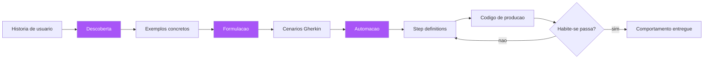

# Capítulo 3: BDD e ATDD: o teste de aceitação como planta

## 1. Introdução

No Capítulo 2, você viu a tradição formal de especificação — rigorosa, poderosa e inacessível para o cotidiano comercial. Agora vamos ver como a indústria democratizou a planta: no início dos anos 2000, Dan North criou o Behavior-Driven Development (BDD), uma reformulação do TDD que trocou a linguagem dos testes pela linguagem do comportamento, e que deu origem ao formato Given-When-Then hoje usado por mais de 70% das equipes que adotam especificação por exemplos [1]. Neste capítulo, você vai aprender o que é o BDD de verdade (e o que ele não é), como o ATDD (desenvolvimento orientado por testes de aceitação) se relaciona com ele, e como o ciclo red-green-refactor se aplica a cenários de negócio em vez de funções isoladas. Ao final, você será capaz de transformar uma conversa de refinamento em um arquivo de especificação executável que seu time inteiro consegue ler — e que sua máquina consegue verificar.

## 2. Explica

### O insight fundador: a linguagem é o problema

Dan North chegou ao BDD por um caminho prático: tentando ensinar TDD a uma equipe, ele percebeu que a palavra "teste" era o obstáculo. Quando você diz "escreva os testes primeiro", o programador ouve "escreva a validação técnica primeiro" — e se pergunta "validar o quê? o sistema ainda não existe". Quando você diz "descreva o comportamento que o sistema deve ter", a conversa muda: agora o foco é o que o sistema faz, não como verificar o que ele faz [2]. Esse deslocamento semântico, aparentemente sutil, é a fundação do BDD: escrever cenários em linguagem de domínio, legível por não-programadores, que ao mesmo tempo servem como especificação, como testes e como documentação. O ensaio clássico de North, "BDD is like TDD if...", argumenta que o TDD funciona perfeitamente quando o time é composto só por programadores e um especialista de domínio; quando entram analistas, testadores e múltiplos stakeholders, a comunicação quebra — e o BDD é a resposta para essa quebra [3].

Você vai perceber que o BDD formalizou essa ideia em três perguntas que guiam toda conversa de especificação: "o que acontece quando?" (comportamento), "quando?" (contexto e gatilho) e "o que deveria acontecer?" (resultado esperado). Dessas três perguntas nasceu o formato Given-When-Then: Given estabelece o contexto (o estado do mundo antes da ação), When descreve a ação ou evento, Then declara o resultado observável [4]. A escolha das palavras não é arbitrária: "Given" e "When" estão no tempo verbal do passado e do presente, ancorando a descrição em eventos concretos em vez de abstrações; "Then" abre o futuro imediato da asserção. Essa gramática — a Gherkin — é deliberadamente restrita, e é essa restrição que a torna executável [5].

### BDD não é só testes: é conversa, especificação e documentação

A compreensão mais comum e mais errada do BDD é reduzi-lo a "testes com a palavra dado/quando/então". O BDD, na prática estabelecida pela comunidade, é um processo de três momentos — Descoberta, Formulação e Automação — conhecido como o "loop de três amigos" (product owner, desenvolvedor e testador sentados juntos) [6]. Na Descoberta, o time explora o comportamento desejado com exemplos concretos, antes de qualquer código; na Formulação, os exemplos são capturados em cenários legíveis (Gherkin); na Automação, os cenários são conectados a código de passo (step definitions) que os tornam executáveis. O erro de reduzir BDD a automação é grave porque descarta os dois primeiros momentos — que são exatamente os que resolvem o problema da intenção perdida do Capítulo 1 [7].

O ATDD (Acceptance Test-Driven Development) é primo próximo, com uma ênfase ligeiramente diferente: enquanto o BDD foca no comportamento e na linguagem compartilhada, o ATDD foca em escrever os testes de aceitação — os critérios que definem quando uma história está pronta — antes da implementação, e em usar esses testes como o contrato de entrega [8]. Na prática, as duas disciplinas convergem: o ATDD usa frequentemente a Gherkin para expressar seus testes de aceitação, e o BDD usa testes de aceitação automatizados para verificar seus cenários. A distinção útil para você, engenheiro, é de ênfase: BDD pergunta "que comportamento o sistema deve ter?", ATDD pergunta "como sabemos que a história está pronta?" — ambas respondem com especificações executáveis escritas antes do código [9].

### O ciclo red-green-refactor, agora em cenários

O TDD de Kent Beck ensinou o ciclo: escreva um teste que falha (red), escreva o código mínimo que o faz passar (green), refatore mantendo o verde [10]. O BDD aplica o mesmo ciclo, mas o "teste" agora é um cenário de comportamento — e o ciclo ganha uma dimensão extra: o cenário deve falhar primeiro não apenas porque o código não existe, mas porque o comportamento não existe. A diferença prática é onde você olha quando o vermelho aparece: no TDD, o vermelho indica que a função não implementa a lógica; no BDD, o vermelho indica que o sistema não entrega o comportamento que o negócio pediu — e pode indicar também que a própria especificação está errada, o que é uma informação ainda mais valiosa [11].

Note a consequência sutil desse ciclo: quando os cenários são a planta, o código deixa de ser a fonte da verdade e passa a ser uma implementação da planta. Isso inverte o fluxo de autoridade que a maioria dos times internalizou: não é mais o código que "define o comportamento" com a documentação correndo atrás; é a especificação executável que define o comportamento, e o código que é corrigido quando diverge [12]. Esse é o coração do SDD: a planta manda, o canteiro obedece, e o habite-se (a suíte de cenários) atesta a conformidade. Nos próximos capítulos você verá como essa inversão de autoridade se materializa em artefatos, ferramentas e pipelines; aqui, o essencial é internalizar o princípio.

### A Gherkin como linguagem de especificação

A Gherkin é a linguagem da planta. Suas palavras-chave estruturais são: Feature (a funcionalidade), Scenario (um comportamento específico), Given/When/Then/And/But (os passos), Background (passos comuns a todos os cenários da feature), Scenario Outline (cenário parametrizado) e Examples (a tabela de dados do outline) [5]. A gramática é propositalmente limitada: ela não pretende descrever "como", apenas "o quê" — e é essa limitação que a torna legível por humanos e interpretável por máquinas. Uma feature bem escrita é uma planta de engenharia: qualquer pessoa do time a lê e entende o que será construído; a suíte de automação a executa e atesta o que foi construído; e, se o sistema mudar sem a feature mudar, o habite-se falha — acusando a divergência [13].

```gherkin
# linguagem: pt
Funcionalidade: Saque em conta corrente
  Como um correntista
  Eu quero sacar dinheiro da minha conta
  Para pagar minhas despesas em dinheiro

  Cenário: Saque com saldo suficiente
    Dado uma conta corrente com saldo de R$ 100
    Quando o correntista saca R$ 30
    Então o saldo da conta deve ser R$ 70
    E um comprovante de saque deve ser emitido

  Cenário: Saque sem saldo suficiente
    Dado uma conta corrente com saldo de R$ 50
    Quando o correntista tenta sacar R$ 80
    Então o saque deve ser recusado
    E uma mensagem de saldo insuficiente deve ser exibida

  Cenário: Saque de valor inválido
    Dado uma conta corrente com saldo de R$ 100
    Quando o correntista tenta sacar R$ 0
    Então o saque deve ser recusado
    E uma mensagem de valor inválido deve ser exibida
```

Note o que essa feature faz, além de descrever três cenários: ela captura a regra de negócio do saque de forma completa e confrontável — sucesso, falha por saldo, falha por valor. Qualquer ambiguidade que existisse na conversa original ("e se o valor for zero?" "e se não tiver saldo?") foi resolvida aqui, no papel, antes do canteiro. É exatamente isso que a planta faz pela construção civil: força as perguntas certas antes de a fundação ser cavada [14].

## 3. Ilustra

Voltemos à construtora da nossa obra. No Capítulo 1, vimos o caos do prédio sem planta. Agora, o engenheiro-chefe contratou um arquiteto (o Product Owner) que passou a escrever, com cada encarregado de andar, um "contrato de andar": um documento curto descrevendo, para cada cômodo, o que deve existir e como se comporta — "o banheiro do segundo andar deve ter box de vidro de 1,20m, piso antiderrapante e ducha"; "a cozinha do térreo deve ter exaustão, ponto de gás a 0,40m do chão e bancada de 0,90m de altura". Cada contrato é curto, concreto, verificável. E — este é o ponto — o engenheiro-chefe pede a cada encarregado que, antes de começar a obra, confira o contrato com uma trena no papel: "dado o cômodo de 3x4m, quando posiciono a bancada a 0,90m, então sobra 0,60m de circulação". As discrepâncias entre o que o cliente imaginou e o que o contrato diz aparecem na conferência, não na obra pronta.



O contrato de andar é a feature Gherkin: curta, concreta, em linguagem de domínio, verificável. A conferência com a trena é o ciclo red-green-refactor: os cenários rodam antes do código e falham; o código os faz passar; e qualquer mudança futura no andar é vistoriada contra o contrato. O papel dos três amigos — arquiteto, encarregado e fiscal (PO, dev e QA) — é o que garante que a planta nasça da conversa, não da imaginação solitária de um deles [6]. Você, como Engenheiro de Software, vai reconhecer o padrão: as reuniões de refinamento do seu time já são a Descoberta — o que falta é transformá-las em Formulação (cenários escritos) e Automação (cenários executáveis), em vez de terminar a reunião com "está claro, pode começar a desenvolver" [15].

## 4. Técnica

### Do refinamento à feature: o passo a passo dos três momentos

O processo prático começa na reunião de refinamento. No momento da Descoberta, o time deve sair da conversa com exemplos — não com um entendimento implícito. A técnica mais eficaz: para cada história, peça "um exemplo de quando isso acontece" e "um exemplo de quando isso dá errado". Cada par de exemplos é um candidato a cenário. Na Formulação, esses exemplos viram Gherkin — e aqui está a disciplina: ninguém escreve Gherkin sozinho; o trio (PO, dev, QA) escreve junto, porque cada um enxerga uma ambiguidade diferente [16]. Na Automação, os cenários são conectados a step definitions — e é nesse momento que a especificação vira código verificável, como veremos abaixo.

```python
"""Automacao BDD com pytest-bdd: cenarios Gherkin viram testes executaveis.

Instale: pip install pytest-bdd
Estrutura:
  tests/features/saque.feature  (a planta, escrita pelo trio)
  tests/features/steps/saque_steps.py  (a automacao)
"""
from pytest_bdd import given, when, then, scenarios, parsers

from conta import Conta

# Carrega todos os cenarios da feature
scenarios("../features/saque.feature")


@given(parsers.parse("uma conta corrente com saldo de R$ {saldo:d}"))
def conta_com_saldo(saldo: int) -> None:
    """Pre-condicao (Given): estabelece o contexto do cenario."""
    # pylint: disable=unused-import
    import conta as _conta
    _conta._ATUAL = Conta(float(saldo))


@when(parsers.parse("o correntista saca R$ {valor:d}"))
def correntista_saca(valor: int) -> None:
    """Acao (When): dispara o comportamento sob teste."""
    import conta as _conta
    _conta._ATUAL.sacar(float(valor))


@then(parsers.parse("o saldo da conta deve ser R$ {saldo:d}"))
def saldo_deve_ser(saldo: int) -> None:
    """Resultado (Then): verifica a pos-condicao observavel."""
    import conta as _conta
    assert _conta._ATUAL.saldo == float(saldo)


@then("o saque deve ser recusado")
def saque_recusado() -> None:
    import conta as _conta
    assert _conta._ULTIMO_ERRO is not None


@then(parsers.parse("uma mensagem de {mensagem} deve ser exibida"))
def mensagem_exibida(mensagem: str) -> None:
    import conta as _conta
    assert _conta._ULTIMA_MENSAGEM == mensagem
```

### A implementação que satisfaz a planta

Agora o código de produção que faz os cenários passarem — escrito depois da feature, e guiado por ela. Note como a implementação é mínima: não há lógica extra, não há "vamos aproveitar e fazer também X" — a planta manda, o canteiro obedece [12].

```python
"""conta.py — implementacao minima que satisfaz a feature saque.feature."""

class SaldoInsuficienteError(Exception):
    """Lancada quando o saque excede o saldo disponivel."""


class ValorInvalidoError(Exception):
    """Lancada quando o valor de saque e invalido (zero ou negativo)."""


class Conta:
    def __init__(self, saldo: float) -> None:
        self.saldo = saldo

    def sacar(self, valor: float) -> None:
        if valor <= 0:
            raise ValorInvalidoError("valor invalido")
        if valor > self.saldo:
            raise SaldoInsuficienteError("saldo insuficiente")
        self.saldo -= valor
```

E o harness que conecta as exceções às mensagens do cenário:

```python
"""harness.py — traduz as excecoes de dominio para as mensagens da planta."""
import conta as _conta


def inicializar() -> None:
    _conta._ATUAL = None
    _conta._ULTIMO_ERRO = None
    _conta._ULTIMA_MENSAGEM = ""


def processar_saque(valor: float) -> tuple[bool, str]:
    """Executa o saque e devolve (sucesso, mensagem) no vocabulario da feature."""
    try:
        _conta._ATUAL.sacar(valor)
        return True, ""
    except _conta.ValorInvalidoError:
        return False, "valor invalido"
    except _conta.SaldoInsuficienteError:
        return False, "saldo insuficiente"
```

### A descoberta na prática: transformando conversa em exemplos

O momento da Descoberta é onde o BDD ganha ou perde. Na prática, a reunião de refinamento tem uma estrutura que maximiza a produção de exemplos. Comece com a história e uma única pergunta ao PO: "qual o exemplo mais comum de uso desta funcionalidade?" — a resposta vira o primeiro cenário feliz. Em seguida, a pergunta que vale ouro: "qual o exemplo de uso que daria errado?" — a resposta vira o primeiro cenário de borda. E então a terceira pergunta, que a maioria dos times nunca faz: "o que acontece se o usuário fizer isso fora de ordem, duas vezes, ou pela metade?" — as respostas são as bordas que a planta precisa capturar e que a implementação nunca decidiria sozinha [16].

A disciplina da descoberta tem um anti-padrão clássico: transformar a reunião em apresentação. O PO apresenta a funcionalidade em slides, o time ouve, ninguém pergunta, e a reunião termina com "está claro?" — o simulacro de descoberta que produz zero exemplos. A técnica que quebra esse padrão é a regra do quadro: nenhuma reunião de descoberta termina sem que o quadro tenha pelo menos três exemplos escritos, cada um no formato "entrada → saída esperada". Se o quadro está vazio, a reunião não terminou — por mais que o relógio diga que sim [14][21].

E há um detalhe sutil sobre quem escreve os exemplos: o PO descreve o comportamento, mas o time técnico escreve os exemplos no quadro, em voz alta, devolvendo ao PO "então você está dizendo que...?". Esse eco — a paráfrase em formato de exemplo — é o mecanismo que expõe a divergência de interpretação antes do código. Quando o PO corrige o exemplo, a planta é desenhada; quando o PO aceita, a planta é aprovada na hora. É o mesmo mecanismo do eco na construção civil: o engenheiro repete o pedido do cliente em cota, e o cliente corrige o que ouviu errado — no papel, não no concreto [20].

### A formulação e a automação: o detalhe dos passos

A Formulação — transformar os exemplos do quadro em Gherkin — tem regras de qualidade que separam a planta da decoração. Primeira: um cenário descreve UM comportamento — se o cenário tem dois Then contraditórios ou três ações independentes, ele deve ser dividido. Segunda: os passos devem ser declarativos, não imperativos de UI — "o correntista saca R$ 30" e não "o usuário clica no botão de saque e digita 30 no campo" — porque o passo declarativo sobrevive à mudança de interface, e o imperativo quebra a cada redesign (a mesma razão pela qual a planta não especifica a marca do parafuso: especifica a resistência). Terceira: o vocabulário dos passos é a linguagem ubíqua — o termo do cenário é o termo do domínio, o mesmo usado no código e no glossário (Capítulo 5) [19][22].

A Automação — conectar os passos ao código — tem uma regra de ouro sobre a granularidade dos steps: os step definitions devem ser finos, reutilizáveis e parametrizados. Um step definition genérico demais esconde a lógica na automação (a planta deixa de ser a fonte da verdade); um específico demais gera uma floresta de mapeamentos duplicados (o custo de manutenção explode). A régua: se o mesmo passo aparece em duas features com o mesmo significado, ele é reutilizável e deve ser compartilhado; se dois passos têm o mesmo texto e significados diferentes, a linguagem ubíqua falhou — e a correção é no vocabulário, não no código de automação [23].

### Triagem do vermelho: spec quebrada vs código quebrado

Um dos superpoderes do BDD bem executado é a triagem do vermelho. Quando um cenário falha em CI, a primeira pergunta não é "qual linha de código está errada?" — é "qual dos dois divergiu: a planta ou o edifício?" A disciplina de triagem funciona assim: se o cenário descreve um comportamento que o negócio de fato pediu e o código não entrega, é bug de implementação — o código deve ser corrigido. Se o cenário descreve um comportamento que o negócio não pediu, ou pediu diferente, é bug de especificação — a feature deve ser corrigida, e o time precisa conversar com o PO antes de mudar o código [17]. Essa distinção, aplicada de forma consistente, muda a cultura do time: o vermelho deixa de ser "alguém errou" e passa a ser "a planta e o edifício divergiram — vamos descobrir qual é a verdade".

```bash
# Pipeline minimo de habite-se BDD (CI)
# 1) Instala dependencias
pip install -r requirements-dev.txt
# 2) Roda os cenarios (a planta executavel)
pytest tests/features --strict-markers -q
# 3) Se qualquer cenario falhar, o habite-se NAO e concedido:
#    exit code != 0 bloqueia o merge na branch principal
```

### Quando o BDD não é a ferramenta certa

É importante marcar as fronteiras: BDD não é para tudo. A especificação em cenários é ótima para comportamento de negócio observável — regras de cálculo, fluxos, políticas — e é fraca para requisitos que são intrínsecamente técnicos, como "a resposta deve vir em menos de 50ms no p99" ou "o algoritmo deve escalar para 10 milhões de itens" — esses são requisitos de performance ou capacidade, melhor expressos como contratos de infraestrutura ou benchmarks, não como cenários Gherkin [18]. Também é contraproducente usar BDD para descrever detalhes internos de implementação — cenários que falam de classes, métodos ou variáveis violam o propósito da linguagem de domínio e criam especificações frágeis que quebram a cada refatoração interna [19]. A régua: se a frase do cenário não puder ser entendida por uma pessoa de negócio, ela não pertence à planta — pertence ao código.

## 5. Aplica

### A cena de contraste: o refinamento que virou especificação

Você é tech lead de um time de seis pessoas em um marketplace. Nas últimas três sprints, a história de "cancelamento de pedido" foi estimada, planejada e entregue — mas, na revisão, o PO diz a frase fatal: "não era isso que eu queria". O cancelamento deveria reembolsar o cliente, devolver o estoque e notificar o vendedor — o sistema faz tudo isso, mas somente até o pedido ser despachado; o PO queria que o cliente pudesse cancelar até 24h após o despacho, com taxa de reembolso parcial. O time implementou a interpretação literal ("cancelamento só antes do despacho") porque era o que estava escrito na história — "permitir cancelamento de pedido" — e ninguém perguntou o que acontecia depois do despacho. Seu instinto, como o de qualquer engenheiro, é "vamos ajustar o sistema e adicionar o caso do despacho". E é exatamente aqui que você deve parar [20].

O diagnóstico: o problema não foi a implementação — foi a ausência de planta. A história "permitir cancelamento de pedido" é uma instrução, não uma especificação: ela delega ao implementador todas as decisões de borda (e se despachou? e se já pagou? e se foi entregue?). Na próxima sprint, você reúne o trio — PO, dev, QA — e, no refinamento, força a conversa com exemplos: "dê-me um exemplo de cancelamento que deve funcionar"; "dê-me um exemplo de cancelamento que deve ser recusado". Das respostas nascem quatro cenários Gherkin, incluindo o caso do despacho com 24h e o caso do pedido já entregue. A história é reestimada com a planta; a implementação passa a ser guiada pelos cenários; e a revisão de sprint deixa de ser "o sistema faz o que você pediu?" para ser "os cenários que você aprovou estão todos verdes?" — o habite-se da sprint [21].

### Armadilhas comuns

As armadilhas do BDD são conhecidas e merecem uma lista. A primeira é o Gherkin decorativo: escrever cenários em formato Gherkin, mas tão vagos que não são executáveis de verdade — "Dado um usuário qualquer", "Quando ele usa o sistema", "Então tudo funciona" — isso é especificação de fachada, e é pior que nada porque dá segurança falsa [22]. A segunda é a automação sem descoberta: pular os dois primeiros momentos do loop e pedir ao desenvolvedor que "escreva testes BDD" sozinho — o resultado é uma planta escrita por quem constrói, sem a conversa que elimina a ambiguidade. A terceira é o excesso de granularidade: centenas de cenários que reescrevem o mesmo comportamento com variações mínimas, criando uma suíte frágil e cara de manter — a planta certa tem poucos cenários, cada um com significado distinto [23]. A quarta é o step definition golias: passo genérico demais ("o usuário executa a ação") que esconde a lógica no código de automação — se a lógica de negócio vaza para os steps, a planta deixou de ser a fonte da verdade. E a quinta é esquecer que cenário que não roda em CI não é especificação — é literatura.

### O BDD e a conversa que nunca termina

Um dos equívocos sobre o BDD é tratá-lo como um evento — a reunião de descoberta aconteceu, a feature foi escrita, e pronto. A prática madura trata o BDD como uma conversa contínua: os cenários são o ponto de apoio permanente da conversa entre negócio e tecnologia, e cada revisão de sprint, cada incidente, cada mudança de regra reabre a conversa sobre os cenários existentes [6][16]. O PO que propõe uma regra nova não "informa" o time — ele propõe uma mudança na planta, e a conversa gira em torno dos cenários afetados: quais mudam, quais ficam, quais são novos. Essa conversa contínua é o que mantém a planta viva (Capítulo 4) e o que impede o BDD de virar um ritual de formulação sem descoberta [7][15].

A conversa contínua tem um formato prático: a revisão da feature como parte da definição de pronto. Antes de uma história ser considerada concluída, o PO revisa os cenários da feature — não o código — e confirma que os cenários descrevem o comportamento que ele pediu, e que todos estão verdes [21][24]. Essa revisão substitui a demonstração manual (o "deixa eu te mostrar como funciona") pela verificação da planta (o "estes são os comportamentos que você aprovou, e estes são os resultados da execução"). A mudança de formato é profunda: a demonstração mostra o que alguém lembrou de mostrar; a revisão de cenários mostra tudo o que foi especificado, incluindo as bordas — e a diferença é exatamente o que separa a confiança anedótica da confiança verificável [12][22].

### Métricas de sucesso e fracasso

Como medir a adoção do BDD? Sucesso: a proporção de histórias que chegam ao desenvolvimento com pelo menos um cenário executável aprovado pelo PO cresce mês a mês; a taxa de rejeição na revisão de sprint ("não era isso") cai; e o tempo médio entre "pedi o comportamento" e "o comportamento está especificado e verde" se estabiliza em poucos dias. Fracasso: cenários que ninguém lê, features que só o dev entende, vermelho que não gera conversa (o time corrige o código sem questionar a planta), e a métrica mais reveladora — quando perguntam ao PO "como sabemos que o sistema está pronto?", ele responde "pergunte ao time", em vez de apontar para a suíte verde [24]. Se o PO não usa a planta para atestar o habite-se, a planta não está funcionando.

Para chegar a esse ponto, o time precisa vencer três batalhas de adoção, na ordem. A primeira é a batalha do exemplo inicial: escolha uma história pequena mas real — nada de tutorial sintético — e escreva os cenários com o PO na mesma sala, em uma hora, sem escrever uma linha de código; o objetivo é provar que a conversa muda, não produzir artefato perfeito. A segunda é a batalha da linguagem: proíba jargão técnico dentro dos cenários e estabeleça a regra de ouro de que cada passo Given/When/Then precisa ser legível por um não-técnico; se um cenário precisa de um comentário explicando o que significa, ele está errado — reescreva o cenário, não o comentário. A terceira é a batalha do vermelho: combine com o time que um cenário vermelho dispara conversa (o fluxo de descoberta recomeça) e não correção cega de código; o vermelho é o termômetro da divergência entre a planta e o edifício, e apagá-lo sem conversar é como calar o alarme de incêndio em vez de apagar o fogo. O indicador operacional de maturidade é a taxa de reescrita: quando a proporção de cenários que mudam durante o desenvolvimento cai, a descoberta está acontecendo antes da construção, e o BDD deixou de ser uma cerimônia para ser o mecanismo de contrato da obra. Times maduros relatam um efeito colateral inesperado e valioso: o backlog fica mais enxuto, porque histórias cujos cenários não conseguem ser escritos em trinta minutos revelam requisitos fantasma que antes só apareciam na revisão de sprint — e a cada cenário descartado cedo, a obra economiza uma rodada inteira de retrabalho [24].

## 6. Conclusão

Neste capítulo, você aprendeu o núcleo do BDD: o insight de Dan North de que a linguagem é o problema — trocar "teste" por "comportamento" e escrever cenários em linguagem de domínio [2][3]; a gramática Gherkin (Given-When-Then) que tornou a especificação legível e executável [5]; o loop de três momentos — Descoberta, Formulação e Automação — que faz do BDD um processo de conversa, não uma técnica de teste [6]; a relação entre BDD e ATDD [8]; e o ciclo red-green-refactor aplicado a cenários, com a triagem entre spec quebrada e código quebrado [11][17]. O desafio: na próxima reunião de refinamento do seu time, saia dela com pelo menos um cenário Gherkin escrito pelo trio, mesmo que seja curto. No próximo capítulo, vamos aprofundar a Descoberta com a Specification by Example de Gojko Adzic — a arte de transformar exemplos concretos em especificações que valem mil reuniões, e a documentação viva que nunca apodrece.

## 7. Referências Bibliográficas

[1] ADZIC, Gojko. *Specification by Example: How Successful Teams Deliver the Right Software*. Shelter Island: Manning Publications, 2011.
[2] NORTH, Dan. *Introducing BDD*. Dan North & Associates, 2006. Disponível em: https://dannorth.net/introducing-bdd/. Acesso em: 5 ago. 2026.
[3] NORTH, Dan. *BDD is like TDD if...* Dan North & Associates, 2006. Disponível em: https://dannorth.net/blog/bdd-is-like-tdd-if/. Acesso em: 5 ago. 2026.
[4] NORTH, Dan. *What's in a Story?* Dan North & Associates, 2007. Disponível em: https://dannorth.net/whats-in-a-story/. Acesso em: 5 ago. 2026.
[5] CUCUMBER. *Gherkin Reference*. Cucumber Documentation. Disponível em: https://cucumber.io/docs/gherkin/reference/. Acesso em: 5 ago. 2026.
[6] SMART, John Ferguson. *BDD in Action: Behavior-Driven Development for the Whole Software Lifecycle*. Shelter Island: Manning Publications, 2014.
[7] ADZIC, Gojko. *Living Documentation: Continuous Knowledge Sharing by Design*. Boston: Addison-Wesley, 2017.
[8] KEOGH, Liz. *ATDD vs. BDD, and a potted history of some related stuff*. 2011. Disponível em: https://lizkeogh.com/2011/06/27/atdd-vs-bdd-and-a-potted-history-of-some-related-stuff/. Acesso em: 5 ago. 2026.
[9] KEOGH, Liz. *Behaviour Driven Development*. Disponível em: https://lizkeogh.com/behaviour-driven-development/. Acesso em: 5 ago. 2026.
[10] BECK, Kent. *Test-Driven Development: By Example*. Boston: Addison-Wesley, 2002.
[11] NORTH, Dan. *Dan North & Associates — blog*. Disponível em: https://dannorth.net. Acesso em: 5 ago. 2026.
[12] FOWLER, Martin. *Specification by Example* (bliki). Disponível em: https://martinfowler.com/bliki/SpecificationByExample.html. Acesso em: 5 ago. 2026.
[13] WYNNE, Matt; HELLESØY, Aslak. *The Cucumber Book: Behaviour-Driven Development for Testers and Developers*. 2. ed. Raleigh: Pragmatic Bookshelf, 2017.
[14] COHN, Mike. *User Stories Applied: For Agile Software Development*. Boston: Addison-Wesley, 2004.
[15] ADZIC, Gojko. *Specification by Example, 10 years later*. 2020. Disponível em: https://gojko.net/2020/03/17/sbe-10-years.html. Acesso em: 5 ago. 2026.
[16] CHEEK, Gaspar Nagay; HALES, Matt. *The BDD Books: Discovery*. Leanpub, 2019.
[17] SMART, John Ferguson. *The BDD Books: Formulation*. Leanpub, 2018.
[18] MARTIN, Robert C. *Agile Software Development: Principles, Patterns, and Practices*. Upper Saddle River: Prentice Hall, 2002.
[19] EVANS, Eric. *Domain-Driven Design: Tackling Complexity in the Heart of Software*. Boston: Addison-Wesley, 2003.
[20] WEINBERG, Gerald M. *Quality Software Management: Systems Thinking*. New York: Dorset House, 1992.
[21] SCHWABER, Ken; SUTHERLAND, Jeff. *The Scrum Guide: The Definitive Guide to Scrum*. 2020. Disponível em: https://scrumguides.org. Acesso em: 5 ago. 2026.
[22] ADZIC, Gojko. *Bridging the Communication Gap: Specification by Example and Agile Acceptance Testing*. London: Neuri Consulting, 2009.
[23] KEOGH, Liz. *The M-C-M'. 2011. Disponível em: https://lizkeogh.com/2011/06/13/the-m-c-m/. Acesso em: 5 ago. 2026.
[24] HUMMEL, Richard; HELTBERG, Rose. *The BDD Books: Automation*. Leanpub, 2020.
