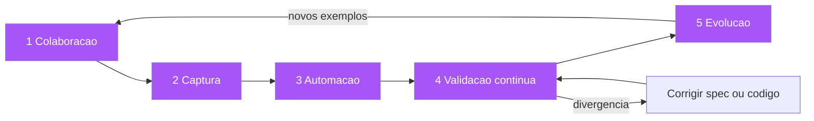

# Capítulo 4: Specification by Example: exemplares que valem mil reuniões

## 1. Introdução

No Capítulo 3, você aprendeu o BDD como processo de conversa: Descoberta, Formulação e Automação, com a Gherkin como linguagem da planta. Agora vamos mergulhar no coração da Descoberta — a arte de transformar exemplos concretos em especificações. Esta é a contribuição central de Gojko Adzic, que estudou dezenas de equipes de alta performance e destilou as práticas comuns no livro Specification by Example (2011) e, mais tarde, em Living Documentation (2017) [1][2]. Você vai aprender por que um exemplo concreto vale mais que mil regras abstratas, como funciona o pipeline de descoberta colaborativa em cinco passos, e por que a documentação viva — aquela que nunca desatualiza porque é executada a cada entrega — resolve o problema secular da documentação que apodrece. Ao final, você será capaz de conduzir uma oficina de descoberta que produz exemplares em vez de ata de reunião.

## 2. Explica

### O exemplo como unidade fundamental de especificação

A premissa da Specification by Example (SBE) é desconcertantemente simples: regras abstratas são ambíguas; exemplos concretos não são. A frase "o frete é grátis para pedidos acima de R$ 100" parece clara — até que alguém pergunta: "e se o pedido tiver exatamente R$ 100?"; "e se o cupom de desconto fizer o total cair para R$ 95?"; "e se metade do pedido for cancelada?" Cada pergunta expõe uma borda que a regra abstrata não cobre. Agora compare com o exemplar: "pedido de R$ 150, sem cupom, CEP da capital → frete grátis"; "pedido de R$ 95, após cupom de R$ 10 sobre R$ 105 → frete pago". O exemplar não deixa espaço para interpretação: ele é um caso concreto com entrada e saída esperada [1]. A pesquisa de Adzic em equipes de alta performance encontrou um padrão consistente: as equipes que entregavam o software certo na primeira vez não dependiam de requisitos mais completos, mas de exemplos mais numerosos e mais precisos — e a prática de escrever exemplos antes do código era o diferencial comum [3].

Você vai perceber que o exemplo funciona porque ele força a concretude. Uma regra abstrata pode ser aprovada por inércia — "parece razoável"; um exemplo tem que ser verificado — "isso está certo?" — e é nessa verificação que a ambiguidade morre [4]. O exemplo também tem a propriedade de ser falsificável: se o sistema processar o exemplo de forma diferente da esperada, alguém está errado — o sistema ou a expectativa — e a divergência é visível imediatamente. Uma regra abstrata, em contraste, pode ser "interpretada" de forma diferente por cada leitor sem que ninguém perceba. Essa propriedade de falsificabilidade é o que torna o exemplo uma especificação executável: ele pode ser transformado em um teste que passa ou falha, sem julgamento humano [5].

### Os cinco passos do pipeline SBE

Adzic consolidou o processo de SBE em cinco atividades, que ele chama de pipeline: (1) colaboração para obter exemplos, (2) captura e cristalização dos exemplos em uma linguagem única, (3) automação dos exemplos em testes executáveis, (4) validação contínua da automação — fazer os testes falharem quando o comportamento divergir, e (5) evolução da suíte de exemplos — revisar, podar e expandir os exemplos conforme o sistema evolui [1][6]. Cada atividade tem sua disciplina: a colaboração exige a conversa dos três amigos (PO, dev, QA) com foco em casos de borda; a captura exige a linguagem ubíqua — um vocabulário único para o domínio (ver Capítulo 5); a automação exige que os exemplos sejam conectados a código que os execute; a validação exige que a suíte rode continuamente em CI; e a evolução exige que os exemplos sejam tratados como ativos vivos, não como documentos congelados [7].

Note como esse pipeline inverte a lógica do desenvolvimento tradicional. No fluxo tradicional, a conversa produz um documento de requisitos, o documento é "traduzido" para código, e o código é testado — a verificação acontece no fim, e a distância entre conversa e código é preenchida por interpretação. No pipeline SBE, a conversa produz exemplos, os exemplos são cristalizados em uma linguagem única (a planta), a planta é automatizada em testes, e o código é escrito para satisfazer os testes — a verificação acontece ao longo de todo o caminho, e a distância entre conversa e código é preenchida por execução [8]. É a diferença entre construir um prédio e depois verificar se ele está de pé, e verificar cada andar à medida que ele é construído.

### O custo de não ter exemplos: o software certo entregue errado

O fracasso mais caro da engenharia de software é entregar, com perfeição técnica, o sistema errado. Adzic documenta o mecanismo desse fracasso: sem exemplos, cada membro do time constrói sua própria interpretação do requisito, e o sistema final é um mosaico de interpretações divergentes — cada peça implementada corretamente segundo quem a escreveu, e o conjunto incoerente do ponto de vista do negócio [1][9]. Os testes unitários não detectam esse problema porque cada teste verifica a interpretação local de quem o escreveu; a integração não detecta porque cada módulo "funciona" isoladamente; e o usuário só descobre na entrega, quando é tarde demais. Os exemplos mudam isso porque eles capturam o comportamento esperado ANTES de existir qualquer interpretação local — a planta é desenhada por todos juntos, antes de cada um construir seu andar [10].

### Documentação viva: o antídoto para o apodrecimento

Todo time conhece o cemitério de documentos: wikis com seções obsoletas, especificações de três anos atrás que ninguém atualizou, manuais que descrevem um sistema que não existe mais. Adzic chama esse fenômeno de documentação morta — e diagnostica sua causa raiz: documentação escrita separada do código e nunca verificada contra ele inevitavelmente apodrece, porque manter dois artefatos sincronizados é trabalho manual, e trabalho manual é esquecido [2]. A solução é a documentação viva: documentação que é executada como parte do processo de entrega — se o comportamento do sistema diverge do que a documentação afirma, a documentação "falha" e bloqueia a entrega. A feature Gherkin do Capítulo 3 é o exemplo perfeito: ela é ao mesmo tempo especificação, teste e documentação — e, como é executada em CI, ela não pode mentir sobre o comportamento do sistema [11].

A documentação viva resolve o problema de sincronização por construção: em vez de dois artefatos que precisam ser mantidos iguais (código e docs), existe um único artefato com duas funções (spec executável que documenta e verifica). Isso não significa que toda documentação deve ser executável — diagramas de arquitetura, decisões e guias de operação continuam tendo seu lugar — mas significa que a documentação do comportamento do sistema deve ser executável [2][12]. Quando alguém pergunta "como funciona o cálculo de frete?", a resposta não é um documento separado, é a feature executável que descreve e verifica o cálculo — e qualquer pessoa pode confiar nela porque ela roda a cada merge.

## 3. Ilustra

Voltemos à construtora. O arquiteto (PO) aprendeu que contratos de andar descritos em regras abstratas geram disputas: "piso antiderrapante" significa uma coisa para o encarregado que compra porcelanato e outra para o que compra cerâmica. Ele adota uma nova disciplina: toda regra abstrata no contrato deve vir acompanhada de um exemplar — um cômodo de referência com medidas exatas. "Piso antiderrapante" vira "o banheiro 1, de 2x3m com box de 1,20m, deve usar o piso A3 do catálogo, assentado com juntas de 2mm". Quando o fornecedor entrega um piso com coeficiente de atrito diferente do A3, a conferência — o habite-se — reprova na hora, não depois de o banheiro estar pronto e escorregadio. Os exemplares funcionam porque são verificáveis contra o mundo real: você consegue conferir se o piso entregue é o A3, mas não consegue conferir se "antiderrapante" foi interpretado como o arquiteto imaginou.



O exemplar do piso A3 é exatamente o que um exemplo de teste faz pelo software: ele ancora a regra abstrata em um caso concreto verificável. E a lição mais importante da metáfora é sobre o catálogo de pisos — a biblioteca de exemplares. Na construtora, os exemplares bem-sucedidos de um prédio são reaproveitados no próximo: o banheiro padrão que funcionou vira referência. No software, os exemplos de teste de um módulo são a documentação viva do módulo: o próximo desenvolvedor não precisa perguntar "como funciona?" — ele lê os exemplares, que são executáveis e portanto verdadeiros [13]. Você, como Engenheiro de Software, conhece a experiência de herdar um código sem documentação: o valor de um exemplar bem escrito nessa hora é incalculável — é a diferença entre entender o comportamento pelo código (lento, ambíguo) e entendê-lo pela especificação executável (rápido, confiável).

## 4. Técnica

### Conduzindo uma oficina de descoberta com exemplos

A oficina de descoberta (o momento 1 do pipeline) é uma reunião estruturada com um objetivo único: produzir uma lista de exemplos concretos. A estrutura recomendada tem quatro fases. Na fase de contexto, o PO apresenta a funcionalidade em duas frases e o time identifica as regras de negócio envolvidas — sem discutir soluções. Na fase de exemplos, o facilitador pergunta "me dê um exemplo de um caso que deve funcionar" e "um exemplo de um caso que deve ser recusado", registrando cada exemplo em um quadro com o formato "entrada → saída esperada"; é aqui que as bordas aparecem — os "e se...?" que a regra abstrata esconde [14]. Na fase de triagem, o time classifica os exemplos em três grupos: essenciais (cobrem o comportamento central), borda (cobrem limites e exceções) e ruído (casos que não agregam informação — cortados sem dó). Na fase de fechamento, a lista de exemplos essenciais e de borda é revisada em voz alta, com o PO confirmando cada um, e vira a matéria-prima da formulação Gherkin.

```python
"""Oficina de descoberta: quadro de exemplos com triagem automatica.

Roda a triagem dos exemplos coletados na oficina e gera o rascunho
da feature Gherkin. Use ao final de cada sessao de descoberta.
"""
from dataclasses import dataclass


@dataclass
class Exemplo:
    descricao: str
    entrada: str
    saida_esperada: str
    tipo: str = "essencial"  # "essencial" | "borda" | "ruido"


EXEMPLOS = [
    Exemplo("pedido de 150 sem cupom", "R$ 150", "frete gratis"),
    Exemplo("pedido de 95 apos cupom", "R$ 95", "frete pago"),
    Exemplo("pedido de exatamente 100", "R$ 100", "frete gratis (limite inclui)"),
    Exemplo("pedido cancelado apos frete", "R$ 0", "regra indefinida — perguntar ao PO"),
]


def triar(exemplos: list[Exemplo]) -> dict[str, list[Exemplo]]:
    grupos: dict[str, list[Exemplo]] = {"essencial": [], "borda": [], "ruido": []}
    for ex in exemplos:
        grupos[ex.tipo].append(ex)
    return grupos


def gerar_feature(exemplos: list[Exemplo]) -> str:
    linhas = ["Funcionalidade: Frete", "  Como um comprador online",
              "  Eu quero saber o custo do frete", "  Para decidir minha compra"]
    for i, ex in enumerate(exemplos, start=1):
        if ex.tipo == "ruido":
            continue
        linhas += [f"  Cenário: {ex.descricao}",
                   f"    Dado um pedido de {ex.entrada}",
                   f"    Quando calculo o frete",
                   f"    Então o frete deve ser {ex.saida_esperada}"]
    return "\n".join(linhas)


if __name__ == "__main__":
    grupos = triar(EXEMPLOS)
    for tipo, itens in grupos.items():
        print(f"{tipo}: {len(itens)} exemplo(s)")
    print(gerar_feature(EXEMPLOS))
```

### Da tabela de exemplos ao Scenario Outline

O padrão mais poderoso da formulação Gherkin é o Scenario Outline com tabela de Examples: um único cenário parametrizado que executa N exemplares. É a representação natural dos exemplos da oficina — a tabela é o quadro da oficina, transformado em artefato executável [15].

```gherkin
# linguagem: pt
Funcionalidade: Regra de frete com limiar
  Como um comprador online
  Eu quero que o frete seja gratuito acima de um valor
  Para aumentar meu ticket médio

  Esquema do Cenário: Frete pelo valor do pedido
    Dado um pedido com valor de <valor>
    Quando calculo o frete
    Então o frete deve ser <frete>

    Exemplos:
      | valor | frete         |
      | 150   | gratuito      |
      | 100   | gratuito      |
      | 99.99 | pago          |
      | 95    | pago (após cupom) |
      | 0     | pago (pedido vazio inválido) |
```

A tabela de Examples é onde o exemplar brilha: cada linha é um caso concreto, cada célula é verificável, e a suíte executa todos eles. Repare como a tabela força a decisão das bordas — o valor exatamente 100 (limite incluído) aparece explicitamente, resolvendo a ambiguidade que a regra "acima de R$ 100" deixaria aberta [16]. Essa é a diferença entre regra e exemplar: a regra deixa a borda para a imaginação; a tabela de exemplos a torna visível e decidida.

### Automação dos exemplos: do quadro ao teste verde

A terceira etapa do pipeline conecta os exemplos à automação. Com o pytest-bdd (ou Cucumber, SpecFlow — ver Capítulo 7), os exemplos da tabela viram casos executáveis:

```python
"""Automacao da feature de frete: exemplos da tabela viram testes."""
from pytest_bdd import given, when, then, scenarios, parsers

from frete import calcular_frete

scenarios("../features/frete.feature")


@given(parsers.parse("um pedido com valor de {valor:g}"))
def pedido_com_valor(valor: float) -> None:
    # pylint: disable=unused-import
    import frete as _frete
    _frete._PEDIDO = {"valor": valor, "cupom": None}


@when("calculo o frete")
def calcula_frete() -> None:
    import frete as _frete
    pedido = _frete._PEDIDO
    _frete._RESULTADO = calcular_frete(pedido["valor"], pedido["cupom"])


@then(parsers.parse("o frete deve ser {frete}"))
def frete_deve_ser(frete: str) -> None:
    import frete as _frete
    assert _frete._RESULTADO == frete
```

E o código de produção mínimo que satisfaz a tabela:

```python
"""frete.py — regra de frete com limiar, satisfazendo a feature frete.feature."""

LIMIAR_FRETE_GRATIS = 100.0


def calcular_frete(valor_pedido: float, cupom: float | None = None) -> str:
    """Frete gratuito para valor >= 100; caso contrario, 'pago'.

    A borda do limiar (>= 100) esta decidida na tabela Examples da feature.
    """
    valor_final = valor_pedido - (cupom or 0.0)
    if valor_final <= 0:
        return "pago (pedido vazio inválido)"
    return "gratuito" if valor_final >= LIMIAR_FRETE_GRATIS else "pago"
```

### A colaboração que produz bons exemplos: o papel de cada um

A qualidade dos exemplares depende da colaboração, e cada papel do trio tem uma contribuição específica e um erro específico. O PO contribui com o conhecimento do domínio — as regras reais, os casos de negócio, as bordas que o produto enfrenta; o erro do PO é responder no abstrato ("o frete é grátis acima de 100") em vez de dar exemplos ("na semana passada, um cliente com cupom de 5 no pedido de 101 reclamou do frete"). O desenvolvedor contribui com o conhecimento do sistema — o que é tecnicamente possível, os estados existentes, os efeitos colaterais; o erro do desenvolvedor é responder com solução ("a gente pode adicionar um campo flag") em vez de com exemplo ("e se o pedido tiver cupom? o frete é sobre o quê?"). E o QA contribui com o pensamento de borda — os casos excepcionais, as combinações, as sequências; o erro do QA é antecipar demais ("e se o servidor cair? e se o banco estiver fora?") e desviar a oficina do domínio para a infraestrutura [14][16].

O facilitador tem o papel mais difícil: manter a oficina produzindo exemplos e não argumentos. A técnica do facilitador é a repetição da pergunta: sempre que alguém propõe uma regra abstrata, o facilitador devolve "me dá um exemplo"; sempre que alguém propõe uma solução técnica, devolve "qual comportamento isso produz?"; sempre que alguém discute duas interpretações, devolve "qual exemplo as distingue?". A oficina termina quando o quadro tem exemplos suficientes para que duas pessoas do time, lendo-os, concordem sobre o comportamento — e a métrica da oficina é essa concordância, não o número de post-its [1][6].

### Do exemplo ao artefato: o formato dos exemplares no repositório

Os exemplares produzidos na oficina merecem um formato no repositório que os preserve e os conecte aos artefatos derivados. A prática recomendada: um arquivo de exemplares por funcionalidade, versionado ao lado da feature, no formato "entrada → saída esperada → razão" — a razão documenta POR QUE aquele exemplo é uma decisão de borda (o que ele distingue), e é essa razão que evita que a tabela vire ruído na revisão futura [22]. O arquivo de exemplares é o elo entre a oficina (Capítulo 5) e a formulação Gherkin: a tabela de Examples da feature é gerada (ou conferida) contra ele, e qualquer divergência entre exemplares e cenários é um sinal de que alguém mudou o comportamento sem mudar a planta.

O formato prático do arquivo de exemplares: um cabeçalho com a funcionalidade e a data da oficina; uma tabela com as colunas exemplo, entrada, saída esperada, borda (sim/não) e razão; e uma seção de decisões pendentes — os exemplos que a oficina não conseguiu decidir e que foram levados ao PO (a regra de ouro: exemplo sem decisão não entra na feature; entra na lista de pendências e trava a aprovação da spec). Essa disciplina — exemplar sem decisão bloqueia a planta — é o que impede a oficina de produzir exemplos bonitos com bordas indefinidas, que é exatamente o problema que o Capítulo 1 diagnosticou [21].

### Evolução da suíte: podar, expandir, revisar

O quinto passo do pipeline é o mais negligenciado e o mais importante para a longevidade: a evolução da suíte de exemplos. As regras práticas: quando um bug é encontrado em produção, o exemplo que o reproduz deve ser adicionado à suíte — o bug vira um exemplar que impede a regressão [17]; quando um exemplo nunca falha e nunca é citado em discussões, ele é candidato a ruído — podar mantém a suíte enxuta e legível; quando a regra de negócio muda, os exemplos afetados são revisados com o PO — a mudança de comportamento começa pela mudança da planta, nunca do código [18]. A suíte de exemplos é um organismo vivo: cresce com os bugs encontrados, encolhe com os exemplos obsoletos, e muda com as regras — e é exatamente isso que a impede de apodrecer.

## 5. Aplica

### A cena de contraste: a promoção que quebrou o caixa

Você é engenheiro em um e-commerce que está lançando uma promoção: "frete grátis para pedidos acima de R$ 100". A regra é comunicada por e-mail, estimada em uma linha ("muda um limiar no cálculo de frete") e implementada em vinte minutos. Na primeira hora da promoção, o time de fraudes te chama: há um padrão estranho de pedidos — clientes comprando um item de R$ 101, usando um cupom de R$ 5, e o sistema calculando... frete grátis. "Mas o pedido final é R$ 96!", diz a analista. "O e-mail diz acima de R$ 100 — R$ 96 não está acima". Você olha o código e vê: o limiar é aplicado ao valor bruto do pedido, antes do cupom. Metade do time acha que o certo é aplicar sobre o valor final; a outra metade, sobre o bruto. Ninguém sabe — porque a regra, na forma de e-mail, não definiu nem o que é "valor do pedido", nem o caso do cupom, nem o caso do limiar exato. A promoção é suspensa, o prejuízo é contabilizado, e o time se pergunta como algo tão "simples" virou um incidente [19].

O diagnóstico: a regra abstrata ("acima de R$ 100") era uma instrução, não uma especificação — ela não definia as bordas (limiar exato), as interações (cupom) nem o vocabulário ("valor do pedido" = bruto ou final?). A correção estrutural é o pipeline SBE: a promoção é reescrita como uma feature com tabela de Examples — o valor 100 exato, o caso do cupom que derruba para 96, o caso do pedido vazio, o caso de desconto percentual — e o PO confirma cada linha da tabela antes de o código ser tocado [20]. A tabela vira o contrato da promoção: a implementação é ajustada para satisfazê-la, a suíte roda em CI, e quando o marketing lançar a próxima promoção, ela começará pela planta — não pelo e-mail. O incidente vira o primeiro exemplar da suíte: "pedido de 101 com cupom de 5 → frete pago", impedindo a regressão para sempre.

### Armadilhas comuns

As armadilhas do SBE são sutis. A primeira é o exemplar falso: exemplos que parecem concretos mas não são verificáveis — "Dado um cliente premium" sem definir o que é premium; se a definição não está no exemplo, o exemplo não é uma especificação, é uma regra com fantasia [21]. A segunda é a oficina sem o PO: a descoberta que acontece só entre desenvolvedores produz exemplos da interpretação do time — a planta desenhada por quem constrói, sem o dono do domínio para atestar. A terceira é a tabela inflada: dezenas de linhas que variam apenas um número irrelevante, transformando a suíte em ruído; a régua é que cada linha deve representar uma decisão de borda distinta — se duas linhas não podem falhar uma sem a outra, uma delas é redundante [22]. A quarta é confundir exemplos de teste unitário com exemplares de negócio: os exemplares falam o vocabulário do domínio (pedido, frete, cupom), não o vocabulário do código (método, objeto, exceção) — a planta é para o negócio ler, não para o framework. E a quinta é o pipeline incompleto: times que fazem a descoberta e a formulação mas não automatizam — a planta existe, mas ninguém a executa; sem execução, ela apodrece como qualquer documento.

### A economia dos exemplos: por que menos reuniões produzem mais entendimento

A Specification by Example produz um efeito econômico que merece ser nomeado: ela comprime o tempo de entendimento. Uma reunião tradicional de refinamento termina com um entendimento implícito, que cada participante guarda na própria cabeça — e o entendimento é decomposto e divergente. Uma oficina de descoberta bem conduzida termina com exemplos no quadro, que são públicos, concretos e compartilhados — o entendimento é um só artefato, visível a todos [1][6]. A diferença é a mesma entre dizer a um grupo "vamos construir uma ponte" e mostrar a planta da ponte: o grupo que viu a planta discute a ponte; o grupo que só ouviu a frase discute interpretações diferentes da mesma frase [18].

O efeito de compressão tem três manifestações mensuráveis. Primeira: o tempo de refinamento cai — as reuniões seguintes partem dos exemplos existentes, em vez de re-discutir o que os exemplos já decidiram [1]. Segunda: o tempo de implementação cai — o desenvolvedor não precisa inferir as bordas, porque as bordas estão na tabela de exemplos [5]. Terceira: o tempo de revisão cai — a revisão compara a implementação com os exemplos, e a divergência é visível imediatamente [8]. A economia dos exemplos é a explicação de por que as equipes estudadas por Adzic entregavam o software certo mais rápido: não por trabalharem mais, mas por gastarem o entendimento uma vez, no lugar certo — no exemplo, em vez de na interpretação repetida [3][9].

### Métricas de sucesso e fracasso

Sucesso no SBE: a suíte de exemplos cresce organicamente a partir de bugs reais (cada incidente vira um exemplar); o PO consegue ler e corrigir a tabela de exemplos sem ajuda técnica; e o tempo de entender uma funcionalidade legada cai — um novo desenvolvedor lê os exemplares e sabe o comportamento esperado em minutos. Fracasso: exemplares que só o time técnico entende; tabelas que ninguém revisa quando a regra muda (a planta fica congelada enquanto o prédio muda); e a métrica mais triste — quando um bug de produção é aberto e alguém diz "mas não estava na especificação", e a resposta do time é "ninguém atualizou a especificação" em vez de "vamos adicionar o exemplar e corrigir a planta" [23].

Construir essa cultura exige disciplina de curadoria, e a curadoria tem regras práticas. A primeira: todo exemplar precisa carregar seu contexto — a regra de negócio que ele ilustra, o caso nominal e o caso de borda, e o nome da pessoa que o validou; um exemplar sem contexto é uma citação sem fonte, vira ruído na próxima revisão. A segunda: a suíte de exemplos tem dono e ritmo de revisão — o PO revê a tabela de exemplos a cada iteração de negócio, não quando o time lembra; exemplares que descrevem regras mortas são removidos com o mesmo cuidado com que são adicionados, senão a planta acumula cômodos que o prédio nunca teve. A terceira: exemplares e código evoluem na mesma revisão — a regra prática é que nenhum pull request de mudança de comportamento pode existir sem o exemplar correspondente atualizado no mesmo diff; quando essa regra vale, a rastreabilidade planta→prédio é automática e o custo de manutenção do conhecimento despenca. A quarta: o incidente é a matéria-prima — cada bug de produção vira um exemplar na próxima segunda-feira, e a métrica de saúde da suíte é a razão entre exemplares nascidos de incidente e exemplares nascidos de planejamento; suítes alimentadas só por planejamento tendem a descrever o mundo imaginado, não o mundo real [23]. O efeito composto dessa disciplina é o que Adzic chama de especificação viva: a planta que se mantém verdadeira porque é executada e corrigida continuamente, em vez de ser um documento que se desatualiza no instante em que é assinado.

## 6. Conclusão

Neste capítulo, você aprendeu a Specification by Example de Gojko Adzic: que o exemplo concreto é a unidade fundamental de especificação, porque é verificável e falsificável, enquanto a regra abstrata é ambígua por natureza [1][3]; o pipeline em cinco passos — colaboração, captura, automação, validação contínua e evolução — que transforma conversas em especificações executáveis [1][6]; e a documentação viva, que resolve o apodrecimento da documentação ao torná-la executada e portanto verdadeira [2][11]. Você também viu as ferramentas: a tabela de Examples do Scenario Outline, a automação com pytest-bdd e a evolução da suíte a partir de bugs reais. O desafio: pegue a próxima funcionalidade do seu backlog e conduza uma oficina de descoberta de 30 minutos, saindo dela com pelo menos uma tabela de exemplos confirmada pelo PO. No próximo capítulo, vamos completar a matéria-prima da planta: a linguagem ubíqua do Domain-Driven Design, o event storming como oficina de descoberta, e como user stories com critérios de aceitação viram especificação — o vocabulário que torna os exemplares possíveis.

## 7. Referências Bibliográficas

[1] ADZIC, Gojko. *Specification by Example: How Successful Teams Deliver the Right Software*. Shelter Island: Manning Publications, 2011.
[2] ADZIC, Gojko. *Living Documentation: Continuous Knowledge Sharing by Design*. Boston: Addison-Wesley, 2017.
[3] ADZIC, Gojko. *Specification by Example, 10 years later*. 2020. Disponível em: https://gojko.net/2020/03/17/sbe-10-years.html. Acesso em: 5 ago. 2026.
[4] ADZIC, Gojko. *Bridging the Communication Gap: Specification by Example and Agile Acceptance Testing*. London: Neuri Consulting, 2009.
[5] FOWLER, Martin. *Specification by Example* (bliki). Disponível em: https://martinfowler.com/bliki/SpecificationByExample.html. Acesso em: 5 ago. 2026.
[6] ADZIC, Gojko. *Impact Mapping: Making a Big Impact with Software Products and Projects*. Woking: Provoking Thoughts, 2012.
[7] SMART, John Ferguson. *BDD in Action: Behavior-Driven Development for the Whole Software Lifecycle*. Shelter Island: Manning Publications, 2014.
[8] ADZIC, Gojko. *The Secret of Living Documentation*. Gojko.net, 2017. Disponível em: https://gojko.net/2017/10/01/the-secret-of-living-documentation.html. Acesso em: 5 ago. 2026.
[9] ADZIC, Gojko. *Fifty Quick Ideas to Improve Your Tests*. Woking: Provoking Thoughts, 2015.
[10] COHN, Mike. *Succeeding with Agile: Software Development Using Scrum*. Boston: Addison-Wesley, 2009.
[11] WYNNE, Matt; HELLESØY, Aslak. *The Cucumber Book: Behaviour-Driven Development for Testers and Developers*. 2. ed. Raleigh: Pragmatic Bookshelf, 2017.
[12] KEOGH, Liz. *Behaviour Driven Development*. Disponível em: https://lizkeogh.com/behaviour-driven-development/. Acesso em: 5 ago. 2026.
[13] EVANS, Eric. *Domain-Driven Design: Tackling Complexity in the Heart of Software*. Boston: Addison-Wesley, 2003.
[14] BRANDOLINI, Alberto. *Introducing EventStorming*. Leanpub, 2014.
[15] CUCUMBER. *Gherkin Reference*. Cucumber Documentation. Disponível em: https://cucumber.io/docs/gherkin/reference/. Acesso em: 5 ago. 2026.
[16] NORTH, Dan. *What's in a Story?* Dan North & Associates, 2007. Disponível em: https://dannorth.net/whats-in-a-story/. Acesso em: 5 ago. 2026.
[17] OFFUTT, Jeff. *Mutation Testing for the New Century*. Norwell: Kluwer, 2001.
[18] ADZIC, Gojko. *Specification by Example at Scale*. Gojko.net, 2012. Disponível em: https://gojko.net/2012/09/04/specification-by-example-at-scale.html. Acesso em: 5 ago. 2026.
[19] WEINBERG, Gerald M. *Quality Software Management: Systems Thinking*. New York: Dorset House, 1992.
[20] SCHWABER, Ken; SUTHERLAND, Jeff. *The Scrum Guide: The Definitive Guide to Scrum*. 2020. Disponível em: https://scrumguides.org. Acesso em: 5 ago. 2026.
[21] KEOGH, Liz. *The M-C-M'. 2011. Disponível em: https://lizkeogh.com/2011/06/13/the-m-c-m/. Acesso em: 5 ago. 2026.
[22] MARTIN, Robert C. *Clean Code: A Handbook of Agile Software Craftsmanship*. Upper Saddle River: Prentice Hall, 2008.
[23] ADZIC, Gojko. *The Gift of Time*. Gojko.net, 2011. Disponível em: https://gojko.net/2011/10/01/the-gift-of-time.html. Acesso em: 5 ago. 2026.
