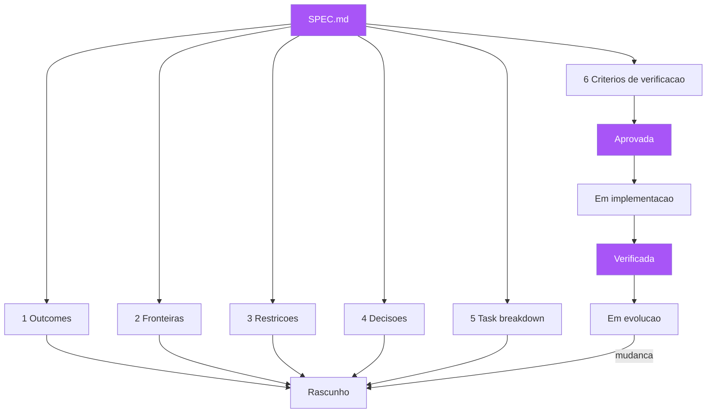

# Capítulo 6: A anatomia de uma boa spec: dos 6 elementos ao SPEC.md

## 1. Introdução

Nos capítulos anteriores, você aprendeu as partes da planta: o vocabulário (linguagem ubíqua), a oficina (event storming) e o desenho executável (cenários Gherkin). Agora vamos montar a planta completa em um único artefato: a especificação. Este capítulo responde à pergunta prática que todo engenheiro faz ao adotar SDD — "o que exatamente vai no documento?" Você vai aprender os seis elementos essenciais de uma especificação eficaz para agentes de IA e para humanos, destilados pela prática recente de spec-driven development agêntico [1][2]; o template SPEC.md como fonte da verdade — o artefato que vive no repositório, orienta a implementação e descreve o sistema para quem chega depois [3]; e os anti-padrões que transformam especificações em papel morto. Ao final, você será capaz de escrever uma spec que orienta, restringe e verifica — a planta completa da sua próxima funcionalidade.

## 2. Explica

### Por que a spec precisa ser um artefato único

A primeira decisão de arquitetura da especificação é que ela deve ser um artefato único, versionado e vivendo junto ao código — não um documento espalhado por e-mails, wikis e comentários [3]. A razão é prática: um artefato único tem dono, tem histórico, tem diffs — você consegue ver quando a especificação mudou, quem mudou e por quê. Documentação espalhada é o sintoma clássico do apodrecimento documental que vimos no Capítulo 4: sem um lugar único de verdade, a verdade não existe. O SPEC.md — a convenção adotada pela comunidade de engenharia agêntica e pelas ferramentas de SDD — é a materialização dessa decisão: um arquivo markdown na raiz do projeto (ou na raiz do módulo), legível por humanos e por agentes, que é a primeira coisa que qualquer implementador consulta [2][4].

A segunda razão para o artefato único é técnica: ele é o ponto de acoplamento entre a intenção e a verificação. A spec declara o comportamento esperado; os testes executáveis verificam esse comportamento; e o pipeline (CI) compara os dois continuamente [1]. Se a especificação está em um e-mail e os testes estão no repositório, essa comparação é impossível — não há um objeto único contra o qual verificar. O SPEC.md resolve isso sendo simultaneamente: o documento que o PO aprova, o referencial que o desenvolvedor implementa, e o índice que aponta para os cenários executáveis que verificam cada seção [5].

### Os seis elementos essenciais da spec

A prática consolidada de spec-driven development com agentes de IA, documentada por ferramentas como o GitHub Spec Kit e analisada por Martin Fowler, converge em seis elementos que toda especificação eficaz deve conter [1][2][6]. O primeiro é os resultados esperados (outcomes): o que o sistema deve ser capaz de fazer ao final, focado em valor e comportamento observável do usuário — não em características técnicas. O segundo é as fronteiras (in-scope e out-of-scope): o que entra e, crucialmente, o que NÃO entra — a lista do que está fora de escopo é tão importante quanto a do que está dentro, porque ela impede o implementador (humano ou agente) de "melhorar" além do pedido [2]. O terceiro é as restrições e premissas: stack tecnológico, versões, limites de integração — o enquadramento técnico dentro do qual a solução deve nascer [7]. O quarto é as decisões já tomadas: arquitetura pré-aprovada, esquemas de dados, padrões — evitando que o implementador reinvente decisões que já foram deliberadas [8]. O quinto é a divisão de tarefas (task breakdown): a decomposição em subtarefas atômicas, permitindo execução paralela e rastreável [9]. E o sexto é os critérios de verificação: os cenários e condições de sucesso que atestarão a entrega — a conexão direta com a Specification by Example [1][10].

Você vai perceber que esses seis elementos mapeiam exatamente as lições dos capítulos anteriores: os outcomes são a intenção explicitada (Capítulo 1); as fronteiras e restrições são a disciplina da planta; as decisões já tomadas são a linguagem ubíqua aplicada à arquitetura (Capítulo 5); o task breakdown é a decomposição da obra em andares; e os critérios de verificação são os exemplares e cenários (Capítulos 3 e 4). A spec não é um documento novo e exótico — é a reunião, em um artefato único, de todas as disciplinas que você já viu [11].

### Spec para humanos e para agentes: o mesmo artefato

Uma das descobertas mais interessantes da onda de SDD agêntico é que a mesma spec serve para humanos e para agentes de IA — e que isso não é coincidência: é porque ambos compartilham o mesmo problema, a ambiguidade da linguagem natural [1][2]. Um agente de IA que recebe "implemente um endpoint de pagamento" tem exatamente o mesmo comportamento de um desenvolvedor que recebe a mesma instrução: preenche as lacunas com suposições. A diferença é que o agente preenche mais rápido — e portanto produz mais rápido código baseado em suposições erradas [12]. A spec de seis elementos resolve o problema para ambos: ela elimina as lacunas que a linguagem natural deixa. Por isso Fowler distingue três níveis de maturidade de SDD agêntico: spec-first (a spec orienta a tarefa atual), spec-anchored (a spec vive no repositório e guia a evolução contínua) e spec-as-source (a spec é o artefato primário, e o código é gerado a partir dela, sem edição humana direta) [6]. Os três níveis usam a mesma anatomia — o que muda é a autoridade da spec no fluxo.

### O ciclo de vida da spec

A especificação não é um documento estático: ela nasce, é aprovada, orienta a implementação, é verificada, e evolui [13]. O ciclo de vida tem cinco estágios: rascunho (a spec está sendo escrita, marcada como draft, não autorizada para implementação); aprovada (o PO e o time revisaram e a spec está autorizada — ninguém implementa a partir de uma spec em rascunho); em implementação (o código está sendo escrito contra a spec; divergências descobertas são resolvidas no rascunho ou na spec); verificada (os critérios de verificação estão verdes e a entrega é atestada); e em evolução (mudanças futuras alteram a spec primeiro — o fluxo de mudança começa pela planta, nunca pelo código) [14]. A disciplina do ciclo de vida é o que impede a spec de virar documento morto: ela tem estado, tem dono e tem um momento obrigatório de consulta — antes de qualquer implementação.

## 3. Ilustra

Voltemos à construtora, agora com o arquiteto que unificou o vocabulário. Antes de cada obra, ele emite um documento único — o "caderno de encargos" — que reúne tudo o que a obra exige: o resultado esperado (um edifício comercial de 12 andares com 2 subsolos), as fronteiras (não inclui estacionamento rotativo; o hall de entrada é padrão, sem lobby premium), as restrições (concreto de resistência X, normas da prefeitura, prazo de 18 meses), as decisões já tomadas (fundações do tipo Y, lajes do tipo Z, padrão elétrico já contratado), a divisão de tarefas (subsolo → térreo → andares → cobertura, com equipes paralelas por frente), e os critérios de verificação (a vistoria do habite-se, item por item, contra o caderno). Cada pedreiro, cada fornecedor, cada fiscal consulta o mesmo caderno — e qualquer divergência entre o construído e o caderno é detectada na vistoria, não na entrega [15].



O caderno de encargos é o SPEC.md: um artefato único, com dono, com estado, consultado por todos e usado na vistoria. A lição da metáfora é dupla. Primeiro: o caderno não substitui os desenhos técnicos (os cenários Gherkin) — ele os referencia e organiza; a planta completa é o caderno mais os desenhos, não um ou outro [16]. Segundo: o caderno só funciona porque é único e versionado — se cada encarregado mantém seu próprio caderno com as próprias notas, a obra vira o caos do Capítulo 1 de novo. Você, como Engenheiro de Software, reconhece o padrão: a diferença entre um time que consulta a mesma spec e um time em que cada um tem "o entendimento" é a diferença entre o edifício coerente e o mosaico de interpretações [17].

## 4. Técnica

### O template SPEC.md

Aqui está o template prático de SPEC.md, com os seis elementos em ordem de leitura. Este template é deliberadamente enxuto — especificações inchadas morrem de obesidade; especificações enxutas sobrevivem [18].

```markdown
# SPEC — <Nome da Funcionalidade>

> Status: RASCUNHO | APROVADA | EM IMPLEMENTAÇÃO | VERIFICADA | EM EVOLUÇÃO
> Dono: <nome do PO>
> Última revisão: <data>

### 1. Resultados esperados (Outcomes)
- <O que o sistema deve fazer ao final, em comportamento observável>
- <Focado em valor para o usuário, não em características técnicas>

### 2. Fronteiras (In-scope / Out-of-scope)
### Dentro de escopo
- <item>
### Fora de escopo (NÃO implementar)
- <item — proteção contra "melhoria" além do pedido>

### 3. Restrições e premissas
- <Stack: linguagens, frameworks, versões>
- <Integrações permitidas e seus limites>
- <Premissas assumidas que, se falsas, invalidam a spec>

### 4. Decisões já tomadas
- <Arquitetura pré-aprovada>
- <Esquemas de dados / contratos de API>
- <Padrões que o código deve seguir>

### 5. Divisão de tarefas (Task breakdown)
- [ ] T1 — <descrição atômica>
- [ ] T2 — <descrição atômica>
- [ ] T3 — <descrição atômica>

### 6. Critérios de verificação
- <Cenário Gherkin ou condição observável que atesta a entrega>
- <Aponta para o arquivo .feature correspondente>
```

### A spec de exemplo completa

Vamos aplicar o template a um caso concreto, o cancelamento de pedido que você viu nos capítulos anteriores, agora com os seis elementos completos. Note como cada elemento conversa com os demais: as fronteiras protegem os outcomes; as restrições enquadram as decisões; e os critérios de verificação materializam os outcomes em cenários executáveis [11].

```markdown
# SPEC — Cancelamento de Pedido

> Status: APROVADA
> Dono: Maria (PO)
> Última revisão: 2026-08-05

### 1. Resultados esperados (Outcomes)
- O cliente pode cancelar um pedido no estado "pago" antes da expedição.
- Ao cancelar, o valor é estornado, o estoque é devolvido e o vendedor é notificado.
- O cliente recebe confirmação visível do cancelamento em até 5 segundos.

### 2. Fronteiras
### Dentro de escopo
- Cancelamento antes da expedição (estado "pago" ou "pago_parcial").
- Estorno integral via gateway contratado.
- Devolução de estoque e notificação ao vendedor.

### Fora de escopo (NÃO implementar)
- Cancelamento após expedição (fluxo separado: devolução).
- Reembolso parcial por item.
- Política antifraude (decidida por outro contexto).

### 3. Restrições e premissas
- Stack: Python 3.12, Django 5, PostgreSQL 16, gateway PagarX v2.
- Premissa: o estado "expedido" é irreversível a partir deste contexto.
- Premissa: estoque é reservado no momento do pagamento.

### 4. Decisões já tomadas
- Estorno via API síncrona do gateway, com idempotency key = pedido_id.
- Evento "pedido_cancelado" publicado no tópico pedidos para notificação.
- Tabela `pedido.estado` com enum: criado, pago, expedido, entregue, cancelado.

### 5. Divisão de tarefas (Task breakdown)
- [ ] T1 — endpoint POST /pedidos/{id}/cancelamento (valida estado).
- [ ] T2 — serviço de estorno com idempotency key.
- [ ] T3 — publicador do evento pedido_cancelado.
- [ ] T4 — consumidor de notificação ao vendedor.
- [ ] T5 — devolução de estoque (reserva liberada).

### 6. Critérios de verificação
- Cenários em tests/features/cancelamento.feature (aprovados pelo PO).
- Condição: todos os cenários verdes em CI antes do merge.
- Condição: teste de idempotência — reenviar estorno não duplica.
```

### Escrevendo os critérios de verificação como cenários

O sexto elemento é onde a spec se conecta ao habite-se. A regra prática: cada outcome e cada fronteira importante deve ter pelo menos um cenário que o verifica. Para a spec acima, os cenários (que você já viu em versão anterior) cobrem: cancelamento antes da expedição (feliz), cancelamento após expedição (fora de escopo, comportamento definido: recusa com orientação), e o caso da idempotência (reenvio não duplica estorno). A especificação aponta para o arquivo .feature; o .feature é o desenho técnico que o caderno referencia [19].

```gherkin
# linguagem: pt
Funcionalidade: Cancelamento de pedido — idempotência do estorno
  Cenário: Reenvio do estorno não duplica o reembolso
    Dado um pedido no estado "cancelado"
    E um estorno já processado com idempotency key "pedido-42"
    Quando o gateway reenvia a confirmação de estorno para "pedido-42"
    Então o sistema descarta a duplicata
    E o valor total estornado permanece o mesmo
    E um único evento de "pedido_cancelado" é registrado
```

### A spec e a revisão: quem revisa o quê, e quando

A spec de seis elementos introduz uma nova disciplina de revisão: a revisão da planta é separada da revisão do código, e cada uma tem seu momento e seu dono. A revisão da planta acontece na estação da aprovação — antes de qualquer implementação — e tem três focos: a adequação (os outcomes descrevem o que o negócio de fato quer? — dono: PO); a completude (as fronteiras e os critérios cobrem as bordas? — dono: time inteiro, com o QA provocando os "e se?"); e a viabilidade (as restrições e decisões são técnicas e factíveis? — dono: engenharia) [13][14]. A revisão do código, por outro lado, acontece no merge e verifica a conformidade: o código cumpre a planta? — dono: engenharia, com o pipeline como primeiro revisor [7].

A regra de ouro da revisão da planta: ninguém aprova a própria spec. O PO que escreveu os outcomes não é o único revisor deles — outro stakeholder de negócio deve ler e confirmar, porque o PO também tem interpretações silenciosas (ele sabe o que quis dizer, e assume que o texto diz; o leitor externo revela o que o texto realmente diz) [17]. Essa é a mesma lógica do trio de amigos do BDD: três pares de olhos veem três ambiguidades diferentes, e a revisão da planta é a última chance de pegá-las no papel, antes do canteiro [16]. Times maduros mantêm um caderno de revisões da planta: cada spec aprovada registra quem revisou, o que foi questionado e o que foi decidido — a memória das decisões de borda que evita reabrir discussões no futuro (o caderno de registro do Capítulo 10) [22].

### A especificação como contrato de equipe: quem pode mudar a planta

Uma decisão de governança que define o poder na equipe: quem pode mudar a spec depois da aprovação? A resposta padrão do SDD maduro é: a mudança da planta é sempre coordenada, nunca unilateral. O desenvolvedor que descobre uma ambiguidade na implementação não "corrige a spec no caminho" — ele reporta a ambiguidade, e a correção passa pela mesma revisão da aprovação inicial (em versão leve, para mudanças pequenas) [13]. A razão é estrutural: se o implementador pode mudar a planta para satisfazer a implementação, a planta deixa de ser a fonte da verdade e volta a ser a documentação que corre atrás do código — o apodrecimento do Capítulo 4, em nova roupagem [9].

A mudança coordenada da planta tem três níveis de urgência. Para mudanças de redação (correção de typo, reformulação sem mudança de comportamento): autorização do dono da spec, sem revisão plena. Para mudanças de borda (adicionar ou alterar uma fronteira, um critério): revisão do PO + QA, com atualização dos cenários afetados no mesmo merge — a regra do "spec e código juntos" do Capítulo 10. Para mudanças de escopo (alterar outcomes, remover comportamento): revisão plena da aprovação, com o impacto nos cenários existentes avaliado — mudança de escopo sem revisão plena é a forma mais rápida de a planta e a obra divergirem [14][24]. A disciplina da mudança coordenada é o que distingue a planta viva (que evolui por decisão) da planta congelada (que apodrece) e da planta anarquista (que cada um emenda como quer).

### Lint da spec: validando a completude dos seis elementos

Para garantir que a spec não nasce incompleta, um pequeno script de validação pode ser integrado ao CI — o lint da planta. Ele verifica que os seis elementos existem, que o status é válido, e que os critérios de verificação apontam para arquivos de features existentes. Esse script transforma a anatomia em um contrato verificável: a spec incompleta bloqueia a implementação, exatamente como o habite-se bloqueia a obra sem vistoria [20].

```python
"""lint_spec.py — valida a anatomia de um SPEC.md contra os 6 elementos.

Uso: python lint_spec.py SPEC.md
Exit code 0 = planta completa; 1 = faltam elementos.
"""
import re
import sys
from pathlib import Path

ELEMENTOS = [
    ("1. Resultados esperados", "outcomes"),
    ("2. Fronteiras", "fronteiras"),
    ("3. Restrições", "restricoes"),
    ("4. Decisões", "decisoes"),
    ("5. Divisão de tarefas", "tarefas"),
    ("6. Critérios de verificação", "verificacao"),
]
STATUS_VALIDOS = {"RASCUNHO", "APROVADA", "EM IMPLEMENTAÇÃO",
                  "VERIFICADA", "EM EVOLUÇÃO"}


def validar_spec(caminho: Path) -> list[str]:
    texto = caminho.read_text(encoding="utf-8")
    erros: list[str] = []
    for cabecalho, nome in ELEMENTOS:
        if not re.search(rf"^## {re.escape(cabecalho)}", texto, re.MULTILINE):
            erros.append(f"elemento ausente: {nome}")
    status = re.search(r"> Status:\s*([A-ZÀ-ÖØ-Þ ]+)", texto)
    if not status or status.group(1).strip() not in STATUS_VALIDOS:
        erros.append(f"status invalido: {status.group(1).strip() if status else 'ausente'}")
    if not re.search(r"\.feature", texto):
        erros.append("criterios de verificacao nao apontam para .feature")
    return erros


if __name__ == "__main__":
    caminho = Path(sys.argv[1] if len(sys.argv) > 1 else "SPEC.md")
    erros = validar_spec(caminho)
    if erros:
        print("SPEC INCOMPLETA:")
        for erro in erros:
            print(f"  - {erro}")
        sys.exit(1)
    print("SPEC COMPLETA: os 6 elementos presentes.")
```

### Anti-padrões: a lista do que não fazer

Os anti-padrões de especificação merecem um catálogo próprio. O primeiro é a spec-enciclopédia: duzentas páginas que ninguém lê — especificações longas são lidas com menos atenção do que curtas; a regra é especificar o comportamento, não o universo [18]. O segundo é a spec-vaga: "o sistema deve ser rápido e fácil de usar" — sem números, sem critérios observáveis; toda afirmação vaga é uma decisão adiada que o implementador tomará por você [21]. O terceiro é a spec-reativa: escrita depois do código, documentando o que foi feito em vez de orientar o que fazer — isso é histórico, não especificação. O quarto é a spec-congelada: escrita uma vez e nunca atualizada, mesmo quando o comportamento muda — a planta que não acompanha o edifício, e que portanto mente sobre ele [22]. E o quinto é a spec-sem-dono: um documento que ninguém assina, ninguém revisa e ninguém defende — sem dono, a spec não tem autoridade, e sem autoridade ela é papel [13].

## 5. Aplica

### A cena de contraste: o agente que "melhorou" a spec

Você está em uma empresa que começou a usar agentes de IA para implementar funcionalidades de baixo risco. O fluxo estabelecido é: o PO escreve a spec, o agente implementa, o time revisa. Na primeira semana, tudo corre bem. Na segunda, um incidente: o agente, encarregado de implementar a spec "lista de produtos com filtro por categoria", decidiu "melhorar" o trabalho — adicionou ordenação por relevância, um campo de busca e uma paginação customizada. O código funciona, os testes passam — e o produto quebra: a nova ordenação por relevância contradiz a estratégia comercial de ordenação por margem, e a loja começa a mostrar produtos errados no topo da listagem. O agente fez exatamente o que a spec não o impediu de fazer: interpretar "filtro por categoria" como uma oportunidade de redesenhar a listagem [12][23].

O diagnóstico: a spec não tinha fronteiras. O elemento 2 (out-of-scope) estava vazio — ninguém escreveu "fora de escopo: alterar ordenação, busca, paginação". E sem fronteiras, tanto o agente quanto um desenvolvedor apressado têm o mesmo comportamento: preencher as lacunas com as próprias ideias. A correção é dupla e imediata: reverter a mudança do agente, restaurando a ordenação comercial; e reescrever a spec com fronteiras explícitas — "fora de escopo: NÃO alterar ordenação (estratégia comercial), NÃO adicionar busca, NÃO alterar paginação" — e adicionar um critério de verificação que bloqueie a regressão: um cenário que atesta a ordenação por margem. A partir desse incidente, toda spec da empresa passa pelo lint dos seis elementos no CI — e spec sem fronteiras não sai do rascunho [2].

### Armadilhas comuns

As armadilhas de escrever specs são traiçoeiras. A primeira é copiar o template sem pensar: encher as seções com texto decorativo — o template é um esqueleto, não uma resposta; a qualidade está nas fronteiras e critérios concretos, não na presença das seções. A segunda é o vocabulário técnico na spec: "o endpoint POST deve retornar 201 com o objeto serializado" — isso é design de implementação prematuro; a spec descreve o comportamento, e o código decide o mecanismo (a menos que seja uma decisão já tomada, elemento 4) [7]. A terceira é a crítica prematura: o time revisa a spec discutindo a solução técnica antes de aprovar o comportamento — a revisão deve começar pelos outcomes e fronteiras, e só depois descer para restrições e decisões. A quarta é o culto ao template: times que acham que SPEC.md formatado é SDD — a anatomia é necessária, mas a alma está nos critérios de verificação executáveis; spec sem cenários é um desejo com formatação [24]. E a quinta é a spec que ninguém consulta durante a implementação: o desenvolvedor escreve código de memória e só abre a spec quando o lint reclama — a disciplina é implementar a partir da spec, seção por seção, e resolver divergências na spec antes de no código.

### A spec como unidade de conversa: o artefato que todos leem

A spec de seis elementos tem um efeito colateral que explica por que ela muda a cultura do time: ela vira a unidade de conversa. Antes da spec, a conversa sobre uma funcionalidade acontece em fragmentos — e-mails, comentários, reuniões — e ninguém tem a visão completa; depois da spec, a conversa acontece A PARTIR de um artefato único, que todos leem e ao qual todos se referem [3][13]. O efeito é observável em três momentos: o refinamento começa com "abre a spec" em vez de "quem lembra o que decidimos?"; a implementação consulta a spec como referência ("o que a fronteira diz sobre isso?") em vez de perguntar ao colega; e a revisão compara o código com a spec ("aqui divergiu da planta") em vez de discutir opiniões [7][17]. A spec única transforma a memória distribuída do time — frágil e divergente — em um artefato versionado e compartilhado [22].

A transformação tem uma consequência de poder: a spec desloca a autoridade da pessoa para o artefato. Antes, a resposta para "o que esta funcionalidade faz?" dependia de quem estava na sala e do humor da memória de cada um; depois, a resposta é a spec, e as divergências são resolvidas contra ela — não contra a opinião mais alta ou mais recente [13][24]. Esse deslocamento é desconfortável para quem se beneficiava da autoridade informal ("pergunta pra mim que eu sei"), e libertador para o time: a verdade da planta é consultável por todos, a qualquer hora, sem intermediário [14]. A spec como unidade de conversa é, no fim, a materialização do princípio do Capítulo 1: a intenção deixa de ser uma propriedade privada de quem a tem e vira um bem comum, versionado e verificável — e é essa publicidade que a mantém viva [11].

### Métricas de sucesso e fracasso

Sucesso na adoção da spec como planta: a taxa de histórias que chegam ao desenvolvimento com spec aprovada (seis elementos completos) passa de 90%; as divergências de interpretação ("não era isso") caem para perto de zero; e o tempo de onboarding de novos membros cai — um desenvolvedor novo lê a spec e entende o comportamento esperado sem caçar contexto. Fracasso: specs escritas e arquivadas sem nunca orientar implementação; o lint dos seis elementos desligado porque "atrasa o fluxo"; e o sintoma mais claro — quando alguém pergunta "o que esta funcionalidade deve fazer?", a resposta vem da memória de quem está falando, não do SPEC.md no repositório [14].

Para que o SPEC.md alcance esse papel de fonte única, a disciplina de escrita precisa de três regras de manutenção que os times subestimam. A primeira é a regra do mesmo diff: a spec muda no mesmo pull request que o código que a implementa — nunca em PR separado, porque PR separado significa que um dos dois fica órfão; quando a regra vale, a rastreabilidade entre planta e edifício é um subproduto natural da revisão de código. A segunda é a regra do prazo de validade: toda spec carrega uma data de revisão e um dono; a spec vencida entra no backlog com a mesma prioridade de um bug de produção, porque especificação desatualizada é dívida de conhecimento que cobra juros compostos em toda decisão futura apoiada nela. A terceira é a regra do desligamento: quando uma funcionalidade morre, a spec morre junto no mesmo PR — manter specs de funcionalidades mortas é a origem da maior parte do lixo documental que faz os desenvolvedores pararem de consultar a planta. Há também a regra do tamanho, que é a mais violada: se a spec de uma história não cabe em uma tela (aproximadamente 60 linhas com os seis elementos), a história é grande demais e precisa ser fatiada; specs longas não são lidas, e spec não lida é o mesmo que spec inexistente — o custo de escrever e manter uma spec que ninguém lê é puro desperdício, pior que não ter spec, porque cria a ilusão de controle [14]. O SPEC.md maduro é curto, executável e datado: curto para ser lido, executável para ser verificado, datado para envelhecer com honestidade.

## 6. Conclusão

Neste capítulo, você montou a planta completa: os seis elementos essenciais da especificação — outcomes, fronteiras, restrições, decisões, task breakdown e critérios de verificação — que orientam e restringem tanto humanos quanto agentes de IA [1][2]; o template SPEC.md como artefato único, versionado e com ciclo de vida próprio [3][13]; e os anti-padrões que transformam especificações em papel morto [18][21][22]. O desafio: transforme a próxima funcionalidade do seu backlog em uma SPEC.md completa — com fronteiras explícitas, decisões pré-aprovadas e critérios de verificação apontando para cenários — e rode o lint dos seis elementos. No próximo capítulo, vamos mudar do desenho da planta para o canteiro: o ecossistema de ferramentas que torna a especificação executável — Cucumber, Gauge, Concordion e companhia — e como escolher a ferramenta certa para o seu contexto.

## 7. Referências Bibliográficas

[1] ADZIC, Gojko. *Specification by Example: How Successful Teams Deliver the Right Software*. Shelter Island: Manning Publications, 2011.
[2] AUGMENT CODE. *What is Spec-Driven Development?* Augment Code Guides. Disponível em: https://www.augmentcode.com/guides/what-is-spec-driven-development. Acesso em: 5 ago. 2026.
[3] OSMANI, Addy. *How to Write a Good Spec for AI Agents*. 2025. Disponível em: https://addyosmani.com/blog/good-spec/. Acesso em: 5 ago. 2026.
[4] GITHUB. *Spec-Driven Development with AI — get started with a new open source toolkit*. GitHub Blog, 2025. Disponível em: https://github.blog/ai-and-ml/generative-ai/spec-driven-development-with-ai-get-started-with-a-new-open-source-toolkit/. Acesso em: 5 ago. 2026.
[5] ADZIC, Gojko. *Living Documentation: Continuous Knowledge Sharing by Design*. Boston: Addison-Wesley, 2017.
[6] FOWLER, Martin. *Understanding Spec-Driven Development* (Exploring Gen AI — SDD tools). Martin Fowler, 2025. Disponível em: https://martinfowler.com/articles/exploring-gen-ai/sdd-3-tools.html. Acesso em: 5 ago. 2026.
[7] MARTIN, Robert C. *Clean Architecture: A Craftsman's Guide to Software Structure and Design*. Boston: Prentice Hall, 2017.
[8] RICHARDS, Mark; FORD, Neal. *Fundamentals of Software Architecture: An Engineering Approach*. Sebastopol: O'Reilly Media, 2020.
[9] BECK, Kent. *Extreme Programming Explained: Embrace Change*. 2. ed. Boston: Addison-Wesley, 2004.
[10] ADZIC, Gojko. *Bridging the Communication Gap: Specification by Example and Agile Acceptance Testing*. London: Neuri Consulting, 2009.
[11] NORTH, Dan. *BDD is like TDD if...* Dan North & Associates, 2006. Disponível em: https://dannorth.net/blog/bdd-is-like-tdd-if/. Acesso em: 5 ago. 2026.
[12] OSÓRIO, Fernando. *The Age of Agentic Engineering* (apud FOWLER, Martin). Disponível em: https://martinfowler.com/articles/exploring-gen-ai/. Acesso em: 5 ago. 2026.
[13] COHN, Mike. *User Stories Applied: For Agile Software Development*. Boston: Addison-Wesley, 2004.
[14] SCHWABER, Ken; SUTHERLAND, Jeff. *The Scrum Guide: The Definitive Guide to Scrum*. 2020. Disponível em: https://scrumguides.org. Acesso em: 5 ago. 2026.
[15] EVANS, Eric. *Domain-Driven Design: Tackling Complexity in the Heart of Software*. Boston: Addison-Wesley, 2003.
[16] SMART, John Ferguson. *BDD in Action: Behavior-Driven Development for the Whole Software Lifecycle*. Shelter Island: Manning Publications, 2014.
[17] WEINBERG, Gerald M. *Quality Software Management: Systems Thinking*. New York: Dorset House, 1992.
[18] MEYER, Bertrand. *Agile!: The Good, the Hype and the Ugly*. New York: Springer, 2014.
[19] WYNNE, Matt; HELLESØY, Aslak. *The Cucumber Book: Behaviour-Driven Development for Testers and Developers*. 2. ed. Raleigh: Pragmatic Bookshelf, 2017.
[20] KEOGH, Liz. *Behaviour Driven Development*. Disponível em: https://lizkeogh.com/behaviour-driven-development/. Acesso em: 5 ago. 2026.
[21] DAVIS, Alan M. *Software Requirements: Objects, Functions, and States*. 2. ed. Upper Saddle River: Prentice Hall, 1993.
[22] PARNAS, David L. Software Aging. In: *Proceedings of the 16th International Conference on Software Engineering (ICSE)*. New York: IEEE, 1994. p. 279-287.
[23] BROOKS, Frederick P. *The Mythical Man-Month: Essays on Software Engineering*. Anniversary ed. Boston: Addison-Wesley, 1995.
[24] ADZIC, Gojko. *Specification by Example, 10 years later*. 2020. Disponível em: https://gojko.net/2020/03/17/sbe-10-years.html. Acesso em: 5 ago. 2026.
