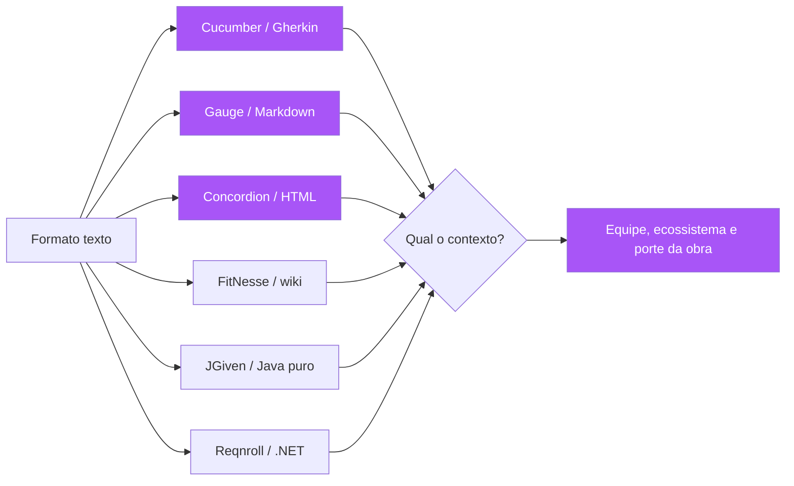

# Capítulo 7: O ecossistema de ferramentas: Cucumber, Gauge, Concordion e cia.

## 1. Introdução

Nos capítulos anteriores, você desenhou a planta: vocabulário, exemplares, a spec de seis elementos. Agora vamos ao canteiro — as ferramentas que transformam a especificação em código verificável. Você vai aprender o mapa do ecossistema de ferramentas de especificação executável: o Cucumber, o padrão da indústria com sua gramática Gherkin; o Reqnroll (sucessor open source do SpecFlow) para o mundo .NET; o Gauge da ThoughtWorks, que escreve specs em Markdown com paralelismo nativo; o Concordion, que transforma HTML em documentação viva rica; o FitNesse, o veterano da wiki de teste de aceitação; e o JGiven, que escreve cenários em Java puro [1][2][3][4]. Você vai aprender os critérios para escolher a ferramenta certa para o seu contexto — porque a ferramenta é o veículo da planta, e o veículo errado sabota até a melhor planta [5].

## 2. Explica

### O que uma ferramenta de especificação executável precisa fazer

Antes de comparar ferramentas, é preciso definir o que a ferramenta DEVE fazer. Uma ferramenta de especificação executável tem quatro responsabilidades: primeiro, armazenar a especificação em um formato legível por humanos (arquivo texto, não banco de dados ou interface gráfica proprietária — porque a planta precisa ser versionada e difável); segundo, interpretar a gramática da especificação (Gherkin, Markdown, HTML ou código), separando os passos da automação; terceiro, conectar cada passo a código de automação (step definitions) que executa a ação real no sistema; e quarto, reportar a execução — quais cenários passaram, quais falharam e por quê, em um formato que o negócio consiga ler [1][6]. Qualquer ferramenta que não faça essas quatro coisas não é uma ferramenta de SDD — é um framework de testes com roupagem.

Você vai perceber que a decisão mais importante não é a ferramenta, mas o formato da especificação — porque o formato determina quem consegue escrever e ler a planta. O Gherkin (texto com Given/When/Then) é legível por todos, mas é uma linguagem nova para o negócio aprender; o Markdown (Gauge) é familiar a todos, mas tem menos estrutura; o HTML (Concordion) é o mais rico em apresentação, mas o mais trabalhoso de escrever; e o código (JGiven) é o mais familiar para desenvolvedores, mas o menos legível para o negócio [7]. A escolha do formato é uma decisão de equipe, e as ferramentas são, no fundo, escolhas de formato com automação acoplada.

### O Cucumber e a gramática Gherkin

O Cucumber é o framework BDD mais popular do mundo, e sua contribuição central é a gramática Gherkin — a mesma que você já viu nos Capítulos 3 e 4, agora em sua forma canônica [1]. O Cucumber existe para múltiplas linguagens (Java, JavaScript/TypeScript, Ruby, Python, Go, .NET), e seu modelo é: arquivos `.feature` com a especificação; arquivos de step definitions conectando cada passo a código; e um runner que executa a suíte e reporta [8]. O Cucumber também popularizou os relatórios legíveis por humanos — o formato de output que mostra a feature como árvore de cenários com status verde/vermelho/amarelo, que se tornou o padrão de facto de "documentação viva" automatizada [9]. Sua força é o ecossistema: Gherkin é o esperanto da especificação executável, e um time que aprende Gherkin pode mudar de linguagem de programação sem reaprender a planta.

### As alternativas: quando cada uma brilha

O Gauge, mantido pela ThoughtWorks, escreve especificações em Markdown — sem gramática própria — e se destaca pela execução paralela nativa e pelo suporte multiplataforma [2]. Sua filosofia: a especificação é um documento Markdown com código de automação embutido em blocos, o que reduz a barreira de entrada (Markdown todo mundo sabe) e facilita a geração de relatórios HTML [10]. O Concordion, por sua vez, é a expressão máxima da Specification by Example: a especificação é um documento HTML, formatado e publicado, com instrumentos embutidos que transformam tabelas e frases em asserções executáveis — o resultado é uma documentação viva de qualidade editorial, ideal quando a especificação é também um artefato de comunicação com o negócio [3]. O FitNesse, criado por Ward Cunningham (o inventor da wiki), é o ancestral: uma wiki onde as tabelas de teste são executadas diretamente — pioneiro, mas datado, ainda vivo em nichos [4]. O JGiven escreve cenários em Java puro com uma API fluente — sem arquivos separados — o que atrai equipes que preferem a especificação colada ao código, com refatoração segura do IDE [11]. E o Reqnroll é o herdeiro do SpecFlow para .NET: a comunidade migrou em massa quando o SpecFlow mudou sua licença, e hoje Reqnroll é o padrão Gherkin no ecossistema C# [12].

### A régua de escolha: cinco perguntas

A escolha entre ferramentas não é sobre "qual é a melhor" — é sobre "qual se encaixa no seu contexto". A régua de decisão tem cinco perguntas. Primeira: quem escreve a especificação? Se o negócio escreve diretamente, prefira formatos familiares (Markdown/Gauge) ou visualmente ricos (HTML/Concordion); se o time técnico formula e o negócio valida, o Gherkin é suficiente. Segunda: qual o ecossistema do seu time? Em .NET, Reqnroll é a escolha natural; em JVM, Cucumber-JVM ou JGiven; em equipes poliglotas, Cucumber ou Gauge. Terceira: como a suíte roda no CI? Ferramentas com execução paralela nativa (Gauge) importam para suítes grandes. Quarta: qual o nível de documentação desejado? Se a spec é também o relatório para o negócio, Concordion ou Gauge com relatórios HTML brilham; se a spec é interna, o Cucumber basta. Quinta: qual a maturidade da equipe? Times iniciantes em BDD tendem a se beneficiar do Gherkin canônico do Cucumber, pela abundância de documentação e exemplos [5][13].

### O princípio que nenhuma ferramenta substitui

O aviso que antecede qualquer comparação: nenhuma ferramenta substitui a disciplina dos capítulos anteriores. O Cucumber não faz descoberta colaborativa; o Gauge não escreve exemplares por você; o Concordion não define a linguagem ubíqua [14]. A ferramenta automatiza a Formulação e a Automação do loop BDD — os momentos em que a planta já existe e precisa ser executada. Times que trocam a descoberta por "vamos usar Cucumber" repetem o erro do Capítulo 3: a automação sem conversa produz uma planta escrita por quem constrói, para quem constrói [15]. A ferramenta é o habite-se — o instrumento de medição — não o arquiteto.

## 3. Ilustra

Voltemos à construtora. O caderno de encargos (a spec) está pronto, e agora o engenheiro-chefe precisa escolher o instrumento de medição para o habite-se — a vistoria. O escritório testa três opções. A primeira é a trena digital: barata, universal, todo fiscal sabe usar — mas cada medição precisa ser anotada à mão e comparada manualmente com o caderno (é o Cucumber: universal, conhecido, mas a comparação é trabalho seu). A segunda é o scanner 3D: caro, exige treinamento, mas gera a nuvem de pontos completa do edifício — a comparação com o modelo digital é automática, e o relatório sai com renderização que até o cliente entende (é o Concordion/Gauge: mais investimento, documentação viva de alta qualidade) [3]. A terceira é a prancheta com o caderno aberto: o fiscal marca cada item conforme confere (é o FitNesse: simples, direto, e com quase meio século de história) [4]. O engenheiro descobre que não há "melhor instrumento" — há o instrumento certo para o porte da obra, o orçamento e a equipe: uma casa popular não justifica scanner 3D, e um hospital não se contenta com trena manual.



A lição da metáfora do instrumento de medição é dupla. Primeiro: o instrumento não substitui o caderno — sem caderno, medir é inútil (sem spec, a ferramenta é um framework de testes a mais). Segundo: o instrumento é escolhido pela obra — e a escolha é uma decisão explícita, documentada, revisada quando o contexto muda [5]. Você, como Engenheiro de Software, vai enfrentar essa escolha cedo na adoção do SDD — e a tentação de "usar o que a maioria usa" (Cucumber) sem pensar no contexto é exatamente o tipo de decisão por inércia que a planta, bem feita, evita [16].

## 4. Técnica

### Cucumber na prática: a suíte canônica

O caminho mais comum é o Cucumber com Gherkin. A estrutura de um projeto: `features/` para os arquivos `.feature`, `features/steps/` para as definições de passo, e um runner configurado no CI. O exemplo completo com Python e pytest-bdd (que você já viu em versões anteriores) agora com os detalhes de projeto:

```bash
# Estrutura de um projeto Cucumber (Python/pytest-bdd)
projeto/
├── features/
│   ├── saque.feature          # a planta (Gherkin)
│   └── steps/
│       └── saque_steps.py     # a automacao (step definitions)
├── src/
│   └── conta.py               # o codigo de producao
├── conftest.py
└── requirements-dev.txt
```

```python
# features/steps/saque_steps.py — automacao dos passos da feature
"""Step definitions do cenário de saque — cada passo Gherkin tem um mapeamento.

O mapeamento usa parsers de expressao para extrair os parametros
("R$ {saldo:d}" -> saldo inteiro) e injeta o estado do cenario.
"""
from pytest_bdd import given, when, then, parsers
from pytest_bdd import scenario

from conta import Conta, SaldoInsuficienteError, ValorInvalidoError


@given(parsers.parse("uma conta corrente com saldo de R$ {saldo:d}"))
def conta_com_saldo(saldo: int) -> dict:
    return {"conta": Conta(float(saldo))}


@when(parsers.parse("o correntista saca R$ {valor:d}"))
def correntista_saca(valor: int, conta_com_saldo: dict) -> None:
    conta = conta_com_saldo["conta"]
    try:
        conta.sacar(float(valor))
        conta_com_saldo["erro"] = None
    except (SaldoInsuficienteError, ValorInvalidoError) as exc:
        conta_com_saldo["erro"] = exc


@then(parsers.parse("o saldo da conta deve ser R$ {saldo:d}"))
def saldo_deve_ser(saldo: int, conta_com_saldo: dict) -> None:
    assert conta_com_saldo["conta"].saldo == float(saldo)


@then("o saque deve ser recusado")
def saque_recusado(conta_com_saldo: dict) -> None:
    assert conta_com_saldo["erro"] is not None
```

```python
# conftest.py — registra os cenarios automaticamente
"""Hook do pytest-bdd: carrega todos os cenarios de features/*.feature."""
import pytest

from pytest_bdd import scenarios

scenarios("features")
```

### Gauge na prática: a spec em Markdown

O Gauge muda o formato da planta: em vez de Gherkin, Markdown com blocos de passo. A vantagem para times que já vivem em Markdown é a familiaridade; a vantagem técnica é o paralelismo nativo — suítes grandes rodam em frações do tempo do Cucumber [2][10].

```markdown
# Funcionalidade: Cálculo de frete

## Cenário: Frete gratuito acima do limiar

* Dado um pedido com valor de "150"
* Quando calculo o frete
* Então o frete deve ser "gratuito"

## Cenário: Frete pago abaixo do limiar

* Dado um pedido com valor de "95"
* Quando calculo o frete
* Então o frete deve ser "pago"
```

```python
# test_frete.py — steps do Gauge em Python
"""Steps da feature Markdown do Gauge — mesmo vocabulario, outro formato."""
from getgauge.python import step
from frete import calcular_frete

_estado: dict = {}


@step("Dado um pedido com valor de <valor>")
def dado_pedido(valor: str) -> None:
    _estado["valor"] = float(valor)


@step("Quando calculo o frete")
def quando_calculo() -> None:
    _estado["frete"] = calcular_frete(_estado["valor"])


@step("Então o frete deve ser <esperado>")
def entao_frete(esperado: str) -> None:
    assert _estado["frete"] == esperado
```

### Concordion: a documentação viva de qualidade editorial

O Concordion leva a Specification by Example ao extremo: a especificação é um documento HTML que é ao mesmo tempo a documentação publicada e o teste executável [3]. O mecanismo: instrumentos como `<span c:assertEquals="...">` e tabelas `<table c:execute="#result = ...">` marcam onde a automação deve verificar valores. O resultado é uma documentação viva com qualidade de publicação — o relatório gerado mostra a spec renderizada com os resultados coloridos — que serve tanto para o negócio quanto para a auditoria. A contrapartida é o custo: escrever e manter HTML instrumentado exige mais esforço que Gherkin, e a curva de aprendizado é maior [17].

```html
<html xmlns:c="http://www.concordion.org/2007/concordion">
<body>
  <h1>Cálculo de Frete</h1>
  <p>
    Para pedidos com valor
    <span c:set="#valor">150</span>,
    o frete é
    <span c:assertEquals="fretePara(#valor)">gratuito</span>.
  </p>
  <table c:execute="#frete = fretePara(#valor)">
    <tr>
      <th c:set="#valor">Valor do pedido</th>
      <th c:assertEquals="#frete">Frete esperado</th>
    </tr>
    <tr><td>100</td><td>gratuito</td></tr>
    <tr><td>99.99</td><td>pago</td></tr>
    <tr><td>0</td><td>pago (pedido vazio inválido)</td></tr>
  </table>
</body>
</html>
```

### O custo real: manutenção de step definitions

A métrica que nenhum vendedor de framework destaca: o custo dominante de uma suíte BDD não é a compra da ferramenta — é a manutenção dos step definitions. Cada passo Gherkin ("Dado uma conta com saldo de R$ 100") precisa de um mapeamento; quando o domínio muda, os steps mudam; e quando os steps se tornam específicos demais, a suíte vira uma floresta de mapeamentos duplicados [18]. As práticas que controlam esse custo: usar parsers parametrizados em vez de passos literais ("Dado uma conta com saldo de R$ {saldo:d}" em vez de "Dado uma conta com saldo de R$ 100"); reutilizar steps entre features por vocabulário comum (a linguagem ubíqua do Capítulo 5 aplicada à automação); e revisar periodicamente a suíte, podando steps órfãos — exatamente a disciplina de evolução da suíte do Capítulo 4 [19]. Uma régua prática: se dois steps fazem a mesma coisa com nomes diferentes, a linguagem ubíqua falhou — e o glossário, não o step, é o lugar de corrigir.

### O relatório executável: configurando o output para o público certo

Uma decisão de ferramenta que parece cosmética e é estratégica: o formato do relatório de execução. A documentação viva (Capítulo 4) só funciona se o relatório for legível pelo público que deve consultá-la — e cada ferramenta tem uma família de formatos de output com qualidades diferentes [9]. O relatório técnico (stack traces, nomes de métodos, linhas de código) serve ao time; o relatório funcional (features, cenários, passos, em linguagem de domínio) serve ao PO e ao negócio; e o relatório de auditoria (com data, versão, assinatura de execução) serve à governança [5][23]. A configuração do pipeline deve gerar — e publicar — os três, ou pelo menos o funcional e o técnico, cada um no endereço certo.

O detalhe prático que separa relatórios bons de ruins: os passos devem exibir o texto Gherkin ("Dado um pedido com valor de 150"), não a assinatura do método de automação ("test_frete_gratuito()"). A diferença parece pequena e é decisiva — o PO que abre o relatório precisa reconhecer o comportamento descrito, e o reconhecimento exige a linguagem da planta, não a do framework [9][24]. A mesma regra vale para o erro: o passo que falhou deve exibir o dado real ("esperado gratuito, recebido pago"), não apenas a exceção técnica. O relatório executável é a materialização da documentação viva — e a qualidade do relatório determina se o negócio usa a planta como fonte da verdade ou continua perguntando ao dev [14].

### O custo de adoção e o retorno mensurável

A adoção de uma ferramenta de especificação executável tem custos mensuráveis que merecem planejamento. O custo inicial: a curva de aprendizado da ferramenta e da gramática (dias a semanas, dependendo da familiaridade do time); a instalação no pipeline (horas a dias); e a automação da suíte legada (semanas, se existem testes que precisam ser convertidos em cenários). O custo recorrente: a manutenção de steps (o custo dominante, como você viu); a atualização da ferramenta; e o tempo de execução no CI (que cresce com a suíte e exige poda disciplinada — Capítulo 4) [18][20].

O retorno mensurável, por outro lado, aparece em três métricas: a redução de bugs de especificação em produção (a triagem do Capítulo 1, agora com a planta em operação); a redução do tempo de onboarding (o novo dev lê as features e entende o comportamento em minutos, não em semanas); e a redução do tempo de mudança (alterar um comportamento exige alterar a feature e o código juntos — e a suíte verde atesta a coerência da mudança, eliminando a fase de "será que quebrou alguma coisa?"). O cálculo de retorno que convence a liderança é simples: o custo mensal de manutenção da suíte vs. o custo mensal de bugs de especificação evitados — e a evidência do Capítulo 1 (o custo multiplicador do retrabalho) fecha o argumento [5][24].

### Migrando entre ferramentas sem reescrever a planta

Uma vantagem estratégica de manter a especificação em formato texto versionado é a portabilidade: a planta pode migrar entre ferramentas. A migração mais comum é de Cucumber para Gauge (ou vice-versa) quando o time muda de ecossistema ou descobre que o paralelismo do Gauge atende melhor. O processo de migração: primeiro, a planta (os cenários) é congelada e documentada — os cenários são a fonte da verdade, não a ferramenta; segundo, cada cenário é recodificado no novo formato; terceiro, os step definitions são reescritos; quarto, a suíte nova é comparada com a antiga — todo cenário antigo deve existir e passar no novo formato [20]. A migração de ferramenta que exige reescrever os cenários é um sinal de que a planta estava acoplada à ferramenta — o que a disciplina de formato texto, versionado e legível, previne desde o início [5].

## 5. Aplica

### A cena de contraste: a ferramenta escolhida pela moda

Você entra em uma equipe nova como consultor de qualidade. O time, entusiasmado com SDD, adotou o Cucumber há seis meses — depois de um workshop que todos adoraram. Mas a adoção não está produzindo os resultados esperados: a suíte tem 400 cenários, mas metade está "pendente" (steps sem implementação), o PO nunca leu um único arquivo `.feature`, e o relatório de execução é ignorado porque "é muito técnico". Você investiga e encontra o padrão clássico: a ferramenta foi escolhida pela moda — o workshop vendeu o Cucumber — sem as cinco perguntas da régua de escolha. Ninguém perguntou quem escreve a planta (o PO não lê Gherkin); ninguém perguntou do ecossistema (o time é .NET, e o Cucumber não é a escolha natural ali); e ninguém definiu o objetivo (documentação viva para o negócio? testes de aceitação para o time?) [13][21].

O diagnóstico: não foi a ferramenta que falhou — foi a escolha sem contexto. O time precisava decidir com base nas cinco perguntas, não no entusiasmo do workshop. A correção, que você conduz: a régua de escolha é aplicada retrospectivamente — e o time descobre que a resposta muda o instrumento: o PO quer ler a documentação viva, e o ecossistema é .NET — a escolha aponta para Reqnroll (Gherkin no mundo C#) com relatórios legíveis, ou para o Gauge se o paralelismo for crítico. A migração é feita com a planta congelada primeiro: os 400 cenários são auditados — os 200 pendentes são ou implementados ou podados (ruído), e a suíte resultante de 180 cenários vivos migra para o novo formato. O PO passa a abrir o relatório, e a suíte volta a ser usada como habite-se — em vez de vitrine [12][22].

### Armadilhas comuns

As armadilhas do ecossistema são numerosas. A primeira é o frameworkismo: acreditar que a ferramenta é o SDD — comprar Cucumber e achar que a planta está feita; a ferramenta é o instrumento, não o arquiteto [15]. A segunda é a suíte de vitrine: cenários que passam em um ambiente controlado e falham em CI — a suíte só vale quando roda no pipeline real, com a infraestrutura real. A terceira é o pendente crônico: cenários escritos e steps nunca implementados — a planta desenhada e nunca executada, que vira dívida em vez de especificação; a regra é que cenário sem automação não entra no merge. A quarta é o relatório técnico demais: relatórios que mostram stack traces e nomes de métodos, inúteis para o negócio — a configuração de output é parte da ferramenta, e deve ser ajustada para o público da documentação viva [9]. E a quinta é o medo de trocar: times que continuam na ferramenta errada por "custo de migração" — a régua é a mesma da dívida técnica: se a ferramenta trava a entrega de valor, a migração com planta congelada é investimento, não custo [23].

### A ferramenta como decisão de equipe, não de moda

A escolha da ferramenta de especificação executável é uma decisão de equipe com consequências de longo prazo — e a história da adoção de ferramentas em software é a história de decisões tomadas por moda, com custos descobertos tarde demais [5][21]. A decisão madura tem um processo: a régua de cinco perguntas é aplicada com os dados do contexto real (quem escreve a planta, qual ecossistema, qual objetivo), e a escolha é documentada em uma página — os critérios, as alternativas consideradas e a decisão, com a data da revisão [13]. A documentação da decisão é o que permite revisitá-la: quando o contexto muda (o time vira .NET, o PO passa a escrever a planta, a suíte cresce), a página diz por que a escolha anterior foi feita, e a revisão compara o contexto atual com o registrado [22].

A decisão de equipe também é uma decisão de propriedade: a ferramenta escolhida tem um dono — o engenheiro que responde por sua configuração, sua atualização e seu custo de manutenção [20]. O dono da ferramenta é o guardião do instrumento: ele monitora o tempo de execução da suíte, a saúde dos steps (órfãos, duplicados), e propõe a migração quando a régua de escolha muda de resposta [18][24]. A ausência de dono é o caminho mais curto para a ferramenta degradar: sem dono, ninguém poda a suíte, ninguém atualiza o relatório, e a ferramenta vira o framework de testes esquecido que você viu na cena de contraste da Aplica [21]. A lição final do ecossistema é a mesma da obra: a ferramenta é o instrumento, o time é o usuário, e a planta é a fonte da verdade — a ferramenta serve ao time, nunca o contrário [5][14].

### Métricas de sucesso e fracasso

Sucesso: a suíte executa no CI com zero cenários pendentes; o relatório de execução é lido por não-técnicos (o PO consegue dizer quais funcionalidades estão verdes); o tempo de manutenção de steps é proporcional à mudança de domínio, não ao acúmulo de dívida; e a escolha da ferramenta é documentada e revisitada quando o contexto muda. Fracasso: suíte de centenas de cenários que ninguém lê; steps duplicados e órfãos crescendo a cada sprint; relatórios que só o dev entende; e a pergunta "qual ferramenta usamos?" respondida com "sempre usamos essa" — sem que ninguém consiga dizer por que ela é a certa para a obra atual [24].

A seleção da ferramenta merece um método de decisão em quatro critérios, e não gosto pessoal. Critério um — legibilidade dos cenários: escreva o mesmo cenário (um fluxo de negócio real, com uma regra de borda) nas ferramentas finalistas e leve as três versões para o PO ler; a ferramenta que o PO entende sem explicação ganha, porque a legibilidade é o requisito funcional da ferramenta, não uma conveniência — cenário ilegível é planta que ninguém lê. Critério dois — custo de manutenção dos steps: estime quanto código de ligação (glue) cada cenário médio exige; ferramentas que forçam reescrita de steps para cada cenário cobram juros a cada sprint, enquanto as que promovem reuso de steps transformam a suíte em um vocabulário que se estabiliza com o tempo. Critério três — integração com o pipeline existente: a ferramenta precisa rodar no CI com a infraestrutura atual, gerar relatórios que o negócio consome (não só HTML para o time), e falhar com mensagens que apontam o passo exato — o tempo de diagnóstico de um cenário vermelho é o imposto invisível da ferramenta. Critério quatro — morte anunciada: verifique a saúde do ecossistema (frequência de releases, resposta a issues, adoção), porque adotar uma ferramenta órfã é criar dívida de migração; a pergunta não é "qual é a melhor ferramenta?", e sim "qual ferramenta sobreviverá à obra inteira?" [24]. O erro de estratégia mais comum é padronizar ferramenta antes de padronizar a linguagem dos cenários: a ferramenta multiplica a clareza da conversa, não a substitui — trocar de ferramenta sem trocar a qualidade da descoberta é mudar a caneta e manter a letra ilegível.

## 6. Conclusão

Neste capítulo, você percorreu o canteiro: o mapa das ferramentas de especificação executável — Cucumber e a gramática Gherkin [1][8], Gauge e o Markdown paralelo [2][10], Concordion e a documentação viva editorial [3][17], FitNesse e a tradição da wiki [4], JGiven e o Java puro [11], Reqnroll e o mundo .NET [12]; a régua de cinco perguntas para escolher o instrumento certo [5][13]; e o custo real — a manutenção de step definitions e a disciplina de poda [18][19]. O desafio: aplique a régua de cinco perguntas ao seu contexto atual — documente a escolha da ferramenta (ou a confirmação da escolha existente) em uma página, com os critérios explícitos. No próximo capítulo, vamos ampliar o canteiro para além de uma aplicação: os contratos entre serviços — Pact, OpenAPI e o schema-first — onde a especificação vira o contrato de comunicação entre sistemas independentes.

## 7. Referências Bibliográficas

[1] WYNNE, Matt; HELLESØY, Aslak. *The Cucumber Book: Behaviour-Driven Development for Testers and Developers*. 2. ed. Raleigh: Pragmatic Bookshelf, 2017.
[2] GAUGE. *Gauge — Lightweight cross-platform test automation*. ThoughtWorks. Disponível em: https://www.gauge.org/. Acesso em: 5 ago. 2026.
[3] CONCORDION. *Concordion — Executable Specifications*. Disponível em: https://concordion.org/. Acesso em: 5 ago. 2026.
[4] FITNESS E. *FitNesse — Acceptance testing wiki*. Disponível em: https://fitnesse.org/. Acesso em: 5 ago. 2026.
[5] SMART, John Ferguson. *BDD in Action: Behavior-Driven Development for the Whole Software Lifecycle*. Shelter Island: Manning Publications, 2014.
[6] CUCUMBER. *Cucumber — BDD Tool*. Disponível em: https://cucumber.io/. Acesso em: 5 ago. 2026.
[7] CUCUMBER. *Gherkin Reference*. Cucumber Documentation. Disponível em: https://cucumber.io/docs/gherkin/reference/. Acesso em: 5 ago. 2026.
[8] HELLESØY, Aslak; WYNNE, Matt. *The Cucumber Book*. 2. ed. Raleigh: Pragmatic Bookshelf, 2017.
[9] ADZIC, Gojko. *Living Documentation: Continuous Knowledge Sharing by Design*. Boston: Addison-Wesley, 2017.
[10] GAUGE. *Gauge Documentation*. ThoughtWorks. Disponível em: https://docs.gauge.org/. Acesso em: 5 ago. 2026.
[11] JGVEN. *JGiven — BDD in plain Java*. Disponível em: https://jgiven.org/. Acesso em: 5 ago. 2026.
[12] REQNROLL. *Reqnroll — SpecFlow-compatible BDD for .NET*. Disponível em: https://reqnroll.net/. Acesso em: 5 ago. 2026.
[13] KEOGH, Liz. *Behaviour Driven Development*. Disponível em: https://lizkeogh.com/behaviour-driven-development/. Acesso em: 5 ago. 2026.
[14] ADZIC, Gojko. *Specification by Example: How Successful Teams Deliver the Right Software*. Shelter Island: Manning Publications, 2011.
[15] NORTH, Dan. *BDD is like TDD if...* Dan North & Associates, 2006. Disponível em: https://dannorth.net/blog/bdd-is-like-tdd-if/. Acesso em: 5 ago. 2026.
[16] FOWLER, Martin. *Specification by Example* (bliki). Disponível em: https://martinfowler.com/bliki/SpecificationByExample.html. Acesso em: 5 ago. 2026.
[17] CONCORDION. *Concordion Tutorials*. Disponível em: https://concordion.org/tutorial/. Acesso em: 5 ago. 2026.
[18] ADZIC, Gojko. *Bridging the Communication Gap: Specification by Example and Agile Acceptance Testing*. London: Neuri Consulting, 2009.
[19] KEOGH, Liz. *The M-C-M'. 2011. Disponível em: https://lizkeogh.com/2011/06/13/the-m-c-m/. Acesso em: 5 ago. 2026.
[20] COHN, Mike. *Succeeding with Agile: Software Development Using Scrum*. Boston: Addison-Wesley, 2009.
[21] BROOKS, Frederick P. *The Mythical Man-Month: Essays on Software Engineering*. Anniversary ed. Boston: Addison-Wesley, 1995.
[22] SPECFLOW. *SpecFlow — BDD for .NET*. Disponível em: https://specflow.org/. Acesso em: 5 ago. 2026.
[23] MARTIN, Robert C. *Clean Code: A Handbook of Agile Software Craftsmanship*. Upper Saddle River: Prentice Hall, 2008.
[24] ADZIC, Gojko. *Specification by Example, 10 years later*. 2020. Disponível em: https://gojko.net/2020/03/17/sbe-10-years.html. Acesso em: 5 ago. 2026.
