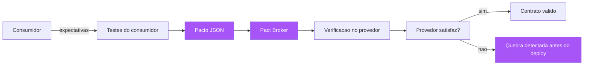

# Capítulo 8: Contratos entre serviços: Pact, OpenAPI e schema-first

## 1. Introdução

Até aqui, a planta especificou o comportamento de uma aplicação isolada. Mas o software real é um canteiro de edifícios interconectados: microsserviços, APIs, filas, contratos de dados. Neste capítulo, você vai aprender a estender o SDD para a comunicação entre serviços — onde a especificação vira um contrato entre sistemas independentes, e onde o custo de uma ambiguidade é dobrado: duas equipes, dois cronogramas, dois pipelines [1]. Você vai aprender o contract testing com o Pact e sua filosofia consumer-driven (o contrato definido pelo lado consumidor); o design schema-first com OpenAPI, JSON Schema, Avro e Protocol Buffers; e a arte de evoluir contratos sem quebrar consumidores — o problema que mais derruba arquiteturas de microsserviços [2][3][4]. Ao final, você será capaz de tratar cada API do seu sistema como uma planta com dono, versão e habite-se próprios.

## 2. Explica

### O contrato como especificação entre serviços

Quando dois serviços se comunicam por HTTP, mensageria ou RPC, existe um contrato implícito: o conjunto de mensagens que um envia, o conjunto que o outro aceita, e o formato esperado de cada uma [1]. No desenvolvimento tradicional, esse contrato é uma intenção — documentada em um wiki que ninguém atualiza, ou pior, apenas na cabeça de quem escreveu o serviço. O resultado é o clássico desastre de integração: o serviço A evolui seu payload, o serviço B quebra em produção, e ninguém sabe por quê — até descobrir que o contrato nunca foi especificado nem verificado [5]. O SDD aplicado a serviços trata o contrato como a planta da integração: uma especificação explícita, versionada, verificada em ambos os lados, que existe ANTES de qualquer implementação e que impede as duas equipes de divergirem silenciosamente [6].

Você vai perceber que existem duas grandes famílias de contrato: os contratos de API (descritos em OpenAPI, verificado com contract testing) e os contratos de dados (descritos em JSON Schema, Avro ou Protocol Buffers, verificados em serialização e evolução) [7]. A primeira família especifica a forma e o comportamento das chamadas HTTP/RPC; a segunda especifica o formato e a evolução das mensagens que trafegam por filas e streams. Arquiteturas maduras usam as duas: a API REST do serviço é descrita em OpenAPI, e os eventos que o serviço publica são descritos em Avro ou protobuf [8]. A disciplina é a mesma em ambos: a especificação vem antes, é versionada, tem dono, e é verificada de forma automatizada — o habite-se da comunicação.

### Consumer-driven contracts: o Pact e a filosofia do consumidor

O Pact introduziu uma inversão poderosa na definição de contratos: em vez do provedor publicar o contrato e o consumidor se adaptar, o consumidor define o contrato — as expectativas que ele tem do provedor — e o provedor é verificado contra essas expectativas [2][9]. A lógica é econômica: quem sofre com a quebra do contrato é o consumidor; portanto, é o consumidor quem deve ter voz na definição do contrato. O fluxo do Pact tem dois lados. No lado do consumidor, os testes de integração do consumidor definem as expectativas ("quando chamo GET /pedidos/42, espero 200 com body {id, total}") e geram um pacto — um arquivo JSON com o contrato completo. No lado do provedor, a suíte do provedor executa o pacto (via um broker que centraliza os pactos) e verifica que o provedor satisfaz as expectativas de todos os seus consumidores [10]. O resultado é uma rede de contratos verificada continuamente: quando um provedor muda, a suíte de verificação de contratos diz imediatamente se algum consumidor quebraria [11].

O valor prático do consumer-driven contract é a independência dos pipelines: o provedor não precisa executar a suíte de integração de cada consumidor — o pacto é a representação compacta e verificável das expectativas [2]. É a mesma economia da planta: o fiscal não precisa ir a cada andar com o pedreiro — o contrato de andar (o pacto) é verificado contra a obra (o provedor) de forma automática. E, como em toda planta, o pacto precisa ser versionado e rastreável: o Pact Broker guarda o histórico de pactos e verificações, permitindo responder "quando o provedor X quebrou o contrato com o consumidor Y?" — a caixa-preta da integração [12].

### Schema-first: a especificação como fonte da API

O schema-first design é a aplicação direta do SDD a APIs: a especificação (o schema) é escrita primeiro, e o código — tanto o servidor quanto os clientes — é gerado ou implementado a partir dela [3][13]. O OpenAPI (ex-Swagger) é o padrão da indústria para APIs REST: um documento YAML/JSON que descreve todos os endpoints, parâmetros, payloads e códigos de resposta — a planta completa da API [3]. O fluxo schema-first: o time escreve o OpenAPI; ferramentas geram o esqueleto do servidor e os clientes em várias linguagens; e o documento serve como fonte da verdade para documentação, testes e mocks [14]. A vantagem é estrutural: o contrato existe antes do código, é revisável por humanos, e é o mesmo artefato consumido por todas as ferramentas — não há tradução entre a "documentação da API" e a "implementação da API" porque ambas derivam da mesma planta [15].

Para dados em mensageria e streams, o schema-first usa JSON Schema (validação de payloads JSON), Avro (evolução de schema nativa, o padrão do ecossistema Kafka) e Protocol Buffers (contratos binários eficientes com geração de código em qualquer linguagem, a base do gRPC) [4][16][17]. Cada um tem seu contexto: JSON Schema é o mais legível e o mais flexível, ideal para APIs e configurações; Avro brilha na evolução de schemas — campos novos são adicionados sem quebrar consumidores antigos, uma propriedade crucial para eventos de longa duração; e protobuf oferece o melhor desempenho com contratos fortemente tipados, ideal para RPC de alta frequência [7][18]. A escolha entre eles é outra aplicação da régua de contexto que você aprendeu no Capítulo 7: a ferramenta serve à planta, não o contrário.

### A evolução de contratos: a arte de não quebrar consumidores

O problema mais caro dos contratos não é defini-los — é evoluí-los. Em qualquer sistema vivo, a API muda: campos são adicionados, endpoints evoluem, regras mudam [19]. A diferença entre uma mudança segura e uma quebra de produção é a disciplina de evolução de contratos, e as regras são conhecidas: adições são geralmente seguras (adicionar um campo opcional a um payload não quebra quem o ignora); remoções e renomeações são perigosas (remover um campo quebra quem o consome); e mudanças de semântica são as mais traiçoeiras (o campo continua lá, mas o significado mudou — e ninguém percebe até a produção quebrar) [20]. As ferramentas de evolução de schema (Avro e protobuf) implementam verificações automáticas de compatibilidade: o novo schema é validado contra o antigo, e a migração é bloqueada se violar as regras de evolução [4][16]. Para APIs REST, a disciplina é de versionamento e deprecation: mudanças incompatíveis exigem versão nova, período de coexistência e deprecation comunicada — a planta é emendada, não rasgada [21].

## 3. Ilustra

Voltemos à construtora — agora são dois prédios vizinhos que precisam se comunicar: o prédio A (o serviço de pedidos) e o prédio B (o serviço de logística). Entre eles, existe uma ponte: o corredor por onde passam as encomendas — e essa ponte tem dimensões, capacidade e regras de tráfego. Na construção tradicional, cada prédio é projetado isoladamente, e a ponte é resolvida na última hora: o prédio A construiu uma passagem de 1,80m de altura, o prédio B construiu uma de 1,50m, e ninguém percebeu — até a primeira caixa não passar. No SDD de contratos, a ponte é especificada ANTES: o documento da ponte (o contrato) define a altura, a largura, o peso máximo e o horário de trânsito, e cada prédio é verificado contra o documento durante a construção — o habite-se da ponte acontece antes de a primeira caixa ser transportada [22].



A ponte é o contrato: o documento da ponte é o OpenAPI ou o pacto; a conferência de dimensões é o schema-first (a planta da ponte existe antes dos prédios) e o contract testing (a ponte construída é verificada contra o documento) [2][3]. A lição da metáfora: a ponte não pode ser um detalhe resolvido depois — ela é a parte mais importante do projeto, porque é onde dois prédios, construídos por duas equipes com dois cronogramas, precisam concordar perfeitamente [23]. Você, como Engenheiro de Software, conhece o equivalente digital: a integração entre serviços é sempre a parte que quebra em produção, porque cada equipe tratou o contrato como detalhe da outra. O SDD de contratos inverte essa lógica: o contrato é a planta mais importante do projeto — e é tratado como tal [24].

## 4. Técnica

### Pact na prática: o lado do consumidor

O lado do consumidor define as expectativas e gera o pacto. Em Python, o Pact é usado com o framework `pact-python`:

```python
"""consumer_tests.py — lado do consumidor: define expectativas e gera o pacto."""
from pact import Consumer, Provider
import pytest

pact = Consumer("servico-pedidos").has_pact_with(Provider("servico-pagamentos"))


@pact.given("existe um pedido pago")
@pact.upon_receiving("uma solicitacao de estorno")
@pact.with_request("POST", "/pagamentos/estorno", body={
    "pedido_id": "42", "motivo": "cancelamento"
})
@pact.will_respond_with(200, body={"status": "estornado", "valor": 99.9})
def test_estorno() -> None:
    """O contrato esperado do provedor — vira o pacto JSON."""
    with pact:
        # Aqui o cliente real faz a chamada que o mock deve atender
        import requests
        resp = requests.post(
            "http://localhost:1234/pagamentos/estorno",
            json={"pedido_id": "42", "motivo": "cancelamento"},
        )
        assert resp.status_code == 200
        assert resp.json()["status"] == "estornado"
```

O pacto gerado é o artefato que o provedor vai verificar:

```json
{
  "consumer": { "name": "servico-pedidos" },
  "provider": { "name": "servico-pagamentos" },
  "interactions": [
    {
      "description": "uma solicitacao de estorno",
      "providerStates": [{ "name": "existe um pedido pago" }],
      "request": {
        "method": "POST",
        "path": "/pagamentos/estorno",
        "body": { "pedido_id": "42", "motivo": "cancelamento" }
      },
      "response": {
        "status": 200,
        "body": { "status": "estornado", "valor": 99.9 }
      }
    }
  ]
}
```

### Pact na prática: o lado do provedor

O lado do provedor publica os pactos no broker e executa a verificação:

```python
"""provider_tests.py — lado do provedor: verifica os pactos dos consumidores."""
from pact import Verifier
import os

BROKER_URL = os.environ.get("PACT_BROKER_URL", "http://localhost:9292")


def verificar_pactos() -> None:
    """Executa os pactos publicados no broker contra o provedor real (ou mock)."""
    verifier = Verifier(provider="servico-pagamentos", provider_base_url="http://localhost:8080")
    resultado = verifier.verify_pacts_from_broker(
        broker_url=BROKER_URL,
        publish=True,
        provider_version="1.4.2",
    )
    if resultado != 0:
        raise SystemExit(f"Contrato quebrado: {resultado} verificacao(oes) falharam")


if __name__ == "__main__":
    verificar_pactos()
```

```yaml
# docker-compose.yaml — o Pact Broker local (a central de contratos)
services:
  pact-broker:
    image: pactfoundation/pact-broker:latest
    ports:
      - "9292:9292"
    environment:
      PACT_BROKER_DATABASE_URL: "sqlite:////tmp/pact_broker.db"
    volumes:
      - pact-data:/tmp

volumes:
  pact-data:
```

### OpenAPI schema-first: a planta da API

O schema-first com OpenAPI começa pelo documento — antes de qualquer código:

```yaml
# openapi.yaml — a planta da API de pedidos (schema-first)
openapi: 3.0.3
info:
  title: API de Pedidos
  version: 1.0.0
paths:
  /pedidos/{id}:
    get:
      summary: Consulta um pedido
      parameters:
        - name: id
          in: path
          required: true
          schema:
            type: integer
      responses:
        "200":
          description: Pedido encontrado
          content:
            application/json:
              schema:
                $ref: "#/components/schemas/Pedido"
        "404":
          description: Pedido não encontrado
components:
  schemas:
    Pedido:
      type: object
      required: [id, total, estado]
      properties:
        id:
          type: integer
        total:
          type: number
        estado:
          type: string
          enum: [criado, pago, expedido, entregue, cancelado]
        itens:
          type: array
          items:
            $ref: "#/components/schemas/ItemPedido"
    ItemPedido:
      type: object
      required: [produto_id, quantidade, preco]
      properties:
        produto_id:
          type: integer
        quantidade:
          type: integer
        preco:
          type: number
```

A partir desse documento, o workflow schema-first: validação do schema (ferramentas como o validator do OpenAPI); geração de mocks para o desenvolvimento do consumidor; geração do esqueleto do servidor (OpenAPI Generator ou ferramentas similares); e a documentação interativa (Swagger UI) que é sempre verdadeira porque deriva da mesma planta [13][14][15].

### Avro e a evolução de schemas em streams

Para eventos em mensageria, o Avro é o padrão do ecossistema Kafka, e sua força é a evolução de schema explícita:

```json
{
  "type": "record",
  "name": "PedidoEvento",
  "namespace": "br.com.fabrica.pedidos",
  "fields": [
    { "name": "pedido_id", "type": "long" },
    { "name": "valor", "type": "double" },
    { "name": "estado", "type": { "type": "enum", "name": "EstadoPedido",
        "symbols": ["CRIADO", "PAGO", "EXPEDIDO", "ENTREGUE", "CANCELADO"] } },
    { "name": "itens", "type": { "type": "array", "items": "long" }, "default": [] }
  ]
}
```

A regra de evolução do Avro: campos novos DEVEM ter `default` (para não quebrar consumidores antigos que não os conhecem); campos removidos DEVEM ter sido deprecados antes; e mudanças de tipo são bloqueadas pela validação de compatibilidade [16]. Quando um evento é publicado com um schema novo, o schema registry do Kafka valida a compatibilidade com o schema anterior — o habite-se do evento [25]. Um exemplo de evolução segura: adicionar o campo `cupom` com `default: null` — consumidores antigos continuam lendo o evento, ignorando o campo novo; e o mesmo evento, lido por um consumidor novo, tem o cupom disponível. Um exemplo de quebra: renomear `estado` para `situacao` — consumidores antigos param de encontrar o campo, e a mensagem "quebra" em produção [26].

### O contrato como especificação de duas camadas: forma e semântica

Um erro conceitual comum no design de contratos é especificar apenas a FORMA dos dados — o que é necessário, mas insuficiente. O contrato de duas camadas declara também a SEMÂNTICA: o que cada campo significa, quais são as invariantes e o que os códigos de resposta significam de fato [22][24]. O OpenAPI descreve a forma (o schema do payload); a semântica vive nos cenários e nos testes de contrato — "um estorno com motivo 'cancelamento' altera o estado do pedido para 'cancelado' e libera o estoque". O time que especifica só a forma produz a integração que funciona estruturalmente e diverge semanticamente — o campo existe, mas o significado interpretado é outro, e a produção descobre a divergência da pior forma possível [24].

A especificação de duas camadas tem uma consequência organizacional: o contrato de forma é de responsabilidade da engenharia (o schema, a tipagem, a serialização), mas o contrato de semântica é de responsabilidade compartilhada com o negócio (o que cada comportamento significa e qual a regra de borda) [6]. O PO deve ser capaz de revisar os cenários de contrato — não o YAML do OpenAPI, mas os comportamentos descritos em Gherkin que verificam a API — e a aprovação da integração inclui a aprovação semântica, não só a estrutural. Essa separação explica por que o contrato de duas camadas é o ponto onde o Capítulo 8 encontra a obra inteira: a forma é o schema-first (Capítulo 8), a semântica é a Specification by Example (Capítulo 4), e a verificação é o habite-se (Capítulo 11) [5][29].

### A governança do contrato: quem muda o quê, e com qual portão

Os contratos entre serviços são os pontos mais sensíveis da arquitetura — e merecem governança explícita, análoga à da spec (Capítulo 6): quem pode mudar o contrato, e com qual portão? A política recomendada tem três regras. Primeira: toda mudança de contrato tem um dono declarado — o time do provedor para o schema, e a mudança que afeta semântica exige revisão dos consumidores afetados (o broker do Pact sabe quem são, e o pipeline bloqueia a mudança até os consumidores confirmarem) [2][9]. Segunda: mudanças aditivas (campos novos opcionais, endpoints novos) seguem o fluxo normal; mudanças incompatíveis (remover campo, mudar tipo, mudar semântica) exigem versão nova e período de coexistência — a política de deprecation documentada e auditável [20][21]. Terceira: o contrato nunca é mudado "no caminho" por um time apressado — a mudança de contrato passa pela mesma revisão da planta, porque o contrato É a planta da integração [6][24].

A governança do contrato tem um instrumento técnico que a viabiliza: o schema registry e o broker guardam o histórico — versões, datas, verificações — e o pipeline de cada provedor consulta "quais consumidores seriam afetados por esta mudança?" antes de conceder o trânsito [12][25]. O resultado é que a pergunta "posso mudar o campo X?" deixa de ser uma reunião e passa a ser uma consulta ao registro: o sistema responde quem consome X, qual o impacto e qual o período de coexistência necessário. A governança do contrato é, em essência, a burocracia boa do Capítulo 11 aplicada à integração: o procedimento que protege a obra sem atrasá-la, porque a consulta ao registro é mais rápida que o incidente que ela evita [18][27].

### O workflow completo de contrato: do schema ao deploy

O fluxo integrado de contrato em um sistema de microsserviços: (1) o contrato é definido (OpenAPI para REST, Avro/protobuf para eventos) ANTES do código; (2) o servidor e os clientes são gerados ou implementados a partir do contrato; (3) o consumidor escreve testes com Pact gerando o pacto; (4) o pacto é publicado no broker; (5) o pipeline do provedor verifica todos os pactos antes do deploy; (6) o schema registry valida a compatibilidade de cada novo schema de evento; e (7) qualquer mudança incompatível exige versão nova e período de coexistência [2][10][25]. Cada passo é um habite-se parcial, e o conjunto é o habite-se da integração: nenhum deploy quebra um consumidor sem ser detectado — porque a planta (contrato) é verificada contra a obra (serviço) continuamente [6][11].

## 5. Aplica

### A cena de contraste: o campo renomeado que derrubou o checkout

Você está em uma plataforma de e-commerce com 12 microsserviços. Na quarta-feira, o time de catálogo — sem comunicação com os outros times — renomeia o campo `preco` para `preco_final` no payload da API de produtos, "para refletir que agora inclui descontos". Na sexta-feira, o checkout quebra em produção: o serviço de pedidos, que consumia `preco`, recebe `undefined` e calcula o total como NaN — e a loja inteira deixa de vender por 40 minutos [27]. O post-mortem revela o padrão clássico: nenhum contrato existia — a API de catálogo era "documentada" em um wiki que ninguém lia, o consumidor descobria o formato por inspeção, e o time de catálogo nem sabia quem consumia o campo renomeado. Você, como engenheiro de confiabilidade, investiga e descobre que o wiki dizia `preco`, mas três serviços diferentes haviam feito suas próprias descobertas — um esperava `preco_final`, outro `valor`, outro `preco` — e a produção funcionava por coincidência, com cada serviço compensando a divergência em um adapter local [28].

O diagnóstico: a ausência de contrato não era um vazio — era um emaranhado de interpretações locais, exatamente o mosaico de interpretações do Capítulo 1, agora multiplicado por 12 serviços. A correção estrutural que você lidera tem três frentes. Primeira: o OpenAPI da API de catálogo é escrito — com `preco` e `preco_final` documentados, e o contrato aprovado pelos consumidores antes de qualquer mudança futura. Segunda: o Pact é adotado — o serviço de pedidos escreve os testes de consumidor definindo suas expectativas, o pacto é publicado no broker, e o pipeline do catálogo passa a verificar os pactos antes de cada deploy. Terceira: a política de evolução — qualquer renomeação de campo exige versão nova, deprecation de 90 dias e coexistência, verificada pelo schema registry para eventos e pelo broker para APIs [21][25]. Seis meses depois, a pergunta "quem consome o campo X?" tem resposta automática no broker — e a integração nunca mais derrubou o checkout.

### Armadilhas comuns

As armadilhas de contratos entre serviços são caras e evitáveis. A primeira é o contrato de fachada: OpenAPI escrito para cumprir ritual e nunca usado — sem verificação automatizada, o contrato é literatura, e a produção continua funcionando por coincidência. A segunda é o schema-drift: o contrato no repositório e o código real divergem, porque ninguém valida o contrato contra a implementação — a disciplina do schema-first inclui a verificação contínua de que o servidor satisfaz o contrato (contract testing, não apenas documentação) [13]. A terceira é o consumidor silencioso: serviços que consomem a API sem registrar expectativas (sem pacto, sem teste de contrato) — esses consumidores são os que quebram em produção sem aviso; a regra é que todo consumo de API externa registra contrato [10]. A quarta é a evolução por quebra: mudanças incompatíveis sem versão nova, sem deprecation — o atalho que parece economizar tempo e custa o checkout [20]. E a quinta é o contrato de um lado só: especificar a API mas ignorar os eventos — mensageria sem schema registry evolui por acidente, e cada produtor novo é um risco [25].

### A rede de contratos: o mapa de dependências como ativo de governança

Quando os contratos entre serviços são tratados como plantas, eles produzem um ativo novo: o mapa de dependências — a visão explícita de quem consome quem, com quais contratos e com quais versões [2][12]. O mapa nasce dos artefatos que o SDD de contratos já produz: os pactos no broker (cada pacto é uma aresta do grafo), os schemas no registry (cada schema é um nó com versão) e as verificações no CI (cada verificação é uma confirmação da aresta) [9][25]. O que era um conhecimento informal — espalhado na cabeça dos engenheiros, desatualizado — vira um grafo consultável: "quem consome o campo X?", "quem seria afetado pela remoção do endpoint Y?", "qual a versão mínima do contrato Z?" — cada pergunta tem resposta automática, em minutos, sem reunião [12][24].

O mapa de dependências é um ativo de governança porque ele transforma a decisão de mudança em uma decisão informada: antes de qualquer alteração de contrato, o mapa mostra o raio de impacto — e o raio de impacto decide o porte da mudança (aditiva e leve, ou incompatível e coordenada) [20][22]. Ele também é um ativo de auditoria: o histórico de pactos e verificações registra quando cada aresta foi confirmada e quando mudou — a caixa-preta da integração que responde "quem quebrou o quê, e quando?" [12][29]. E, finalmente, o mapa é o instrumento da evolução arquitetural: a decisão de dividir um serviço, consolidar dois, ou mudar o formato de mensageria (REST para gRPC, JSON para Avro) passa a ser tomada com o custo real da migração visível no mapa — cada aresta é uma integração a migrar, e o número de arestas é o tamanho do problema [1][27]. O mapa de dependências é a forma final da planta aplicada à arquitetura: a visão do todo, verificada continuamente, consultável por qualquer um.

### Métricas de sucesso e fracasso

Sucesso: zero quebras de integração em produção por mudança de contrato em um trimestre; todos os serviços que consomem APIs externas têm pactos verificados no pipeline; a evolução de contrato segue o fluxo documentado (versão → deprecation → coexistência); e a pergunta "quem consome isso?" tem resposta em minutos pelo broker. Fracasso: quebras de contrato em produção recorrentes; adapters locais de compensação crescendo a cada sprint (o sinal de que o contrato implícito diverge do real); OpenAPI e código divergindo sem verificação; e o sintoma mais caro — equipes que "melhoram" payloads sem saber quem consome [29].

A disciplina de contratos entre serviços se constrói com cinco práticas verificáveis. Prática um — contrato no mesmo repositório do consumidor: o pacto vive onde o consumidor vive, e a verificação roda no pipeline do consumidor; isso inverte o incentivo natural — quem quebra o contrato sente a dor primeiro, no próprio CI, e não em produção. Prática dois — versionamento explícito com janela de coexistência: toda mudança breaking passa por versão nova, depreciação com aviso mensurável (telemetria de chamadas à versão antiga), e só então remoção; o fluxo completo é documentado no contrato e o prazo de coexistência é definido em dias, não em eternidade — coexistência infinita é dívida de integração disfarçada de cortesia. Prática três — OpenAPI como fonte geradora: o schema é a fonte da verdade e o código de cliente e de servidor é gerado a partir dele, em vez de escrito à mão e depois sincronizado; quando a geração é o padrão, a divergência entre contrato e código perde o habitat natural. Prática quatro — contrato de eventos nos mesmos termos: para mensageria, o schema do evento (Avro ou JSON Schema, com evolution rules testadas) ocupa o papel do pacto, e o teste de compatibilidade roda contra a versão anterior publicada — a quebra de consumidor de evento é mais silenciosa e mais cara que a de REST, exatamente por isso exige guarda mais rígida. Prática cinco — cadastro de consumidores: um diretório mínimo (quem consome o quê, em qual versão, com qual contrato) alimenta a triagem de mudanças; sem cadastro, a resposta à pergunta "posso mudar isso?" é sempre um palpite [29]. A soma das cinco práticas transforma a quebra de contrato de incidente em exceção: o contrato deixa de ser uma promessa entre humanos e passa a ser um mecanismo verificado pela máquina, a cada commit, dos dois lados da fronteira.

## 6. Conclusão

Neste capítulo, você estendeu a planta à comunicação entre serviços: o contrato como especificação entre sistemas independentes [1][6]; o contract testing consumer-driven do Pact, onde o consumidor define as expectativas e o provedor é verificado contra elas [2][9][10]; o schema-first com OpenAPI, JSON Schema, Avro e Protocol Buffers, onde a especificação vem antes do código e gera servidores, clientes e documentação [3][4][13]; e a arte da evolução de contratos — adições seguras, remoções perigosas, versão, deprecation e coexistência [19][20][21]. O desafio: escolha uma API do seu sistema que já quebrou (ou quase) e escreva o contrato dela — OpenAPI ou pacto — com os consumidores reais listados. No próximo capítulo, vamos subir ao topo do rigor: a verificação formal e assistida — TLA+ e Dafny para sistemas onde erro não é opção, e o mutation testing como o auditor dos próprios testes — provando que a planta não só existe, mas que os testes realmente verificam a planta.

## 7. Referências Bibliográficas

[1] NEWMAN, Sam. *Building Microservices: Designing Fine-Grained Systems*. 2. ed. Sebastopol: O'Reilly Media, 2021.
[2] PACT. *Pact — Consumer-Driven Contract Testing*. Disponível em: https://docs.pact.io/. Acesso em: 5 ago. 2026.
[3] OPENAPI INITIATIVE. *OpenAPI Specification*. Disponível em: https://www.openapis.org/. Acesso em: 5 ago. 2026.
[4] GOOGLE. *Protocol Buffers Documentation*. Disponível em: https://protobuf.dev/. Acesso em: 5 ago. 2026.
[5] KLEPPMANN, Martin. *Designing Data-Intensive Applications: The Big Ideas Behind Reliable, Scalable, and Maintainable Systems*. Sebastopol: O'Reilly Media, 2017.
[6] FOWLER, Martin. *Consumer Driven Contracts* (bliki). Disponível em: https://martinfowler.com/articles/consumerDrivenContracts.html. Acesso em: 5 ago. 2026.
[7] JSON SCHEMA. *JSON Schema — A Media Type for Describing JSON Documents*. Disponível em: https://json-schema.org/. Acesso em: 5 ago. 2026.
[8] RICHARDS, Mark; FORD, Neal. *Fundamentals of Software Architecture: An Engineering Approach*. Sebastopol: O'Reilly Media, 2020.
[9] PACT. *Pact Broker Documentation*. Disponível em: https://docs.pact.io/pact_broker. Acesso em: 5 ago. 2026.
[10] PACT. *Consumer-Driven Contract Testing — Getting Started*. Disponível em: https://docs.pact.io/getting_started. Acesso em: 5 ago. 2026.
[11] FOWLER, Martin. *Contract Test* (bliki). Disponível em: https://martinfowler.com/bliki/ContractTest.html. Acesso em: 5 ago. 2026.
[12] PACT. *Pact Broker — Versioning and Webhooks*. Disponível em: https://docs.pact.io/pact_broker/webhooks. Acesso em: 5 ago. 2026.
[13] SWAGGER. *Swagger — API Development Tools*. Disponível em: https://swagger.io/. Acesso em: 5 ago. 2026.
[14] OPENAPI GENERATOR. *OpenAPI Generator — Generate clients and servers from OpenAPI*. Disponível em: https://openapi-generator.tech/. Acesso em: 5 ago. 2026.
[15] SMARTBEAR. *Swagger UI — Interactive API Documentation*. Disponível em: https://swagger.io/tools/swagger-ui/. Acesso em: 5 ago. 2026.
[16] APACHE AVRO. *Apache Avro*. Disponível em: https://avro.apache.org/. Acesso em: 5 ago. 2026.
[17] GRPC. *gRPC — A High Performance, Open Source Universal RPC Framework*. Disponível em: https://grpc.io/. Acesso em: 5 ago. 2026.
[18] CONFLUENT. *Schema Registry — Manage Avro schemas for Kafka*. Disponível em: https://docs.confluent.io/platform/current/schema-registry/index.html. Acesso em: 5 ago. 2026.
[19] SPRING. *Spring Cloud Contract*. Disponível em: https://spring.io/projects/spring-cloud-contract. Acesso em: 5 ago. 2026.
[20] FOWLER, Martin. *Semantic Versioning* (bliki). Disponível em: https://martinfowler.com/bliki/SemanticVersioning.html. Acesso em: 5 ago. 2026.
[21] PRESTWICH, Tom. *API Versioning: A Field Guide*. Disponível em: https://www.tom.preston-werner.com/2014/05/22/versioning.html. Acesso em: 5 ago. 2026.
[22] ADZIC, Gojko. *Specification by Example: How Successful Teams Deliver the Right Software*. Shelter Island: Manning Publications, 2011.
[23] BROOKS, Frederick P. *The Mythical Man-Month: Essays on Software Engineering*. Anniversary ed. Boston: Addison-Wesley, 1995.
[24] EVANS, Eric. *Domain-Driven Design: Tackling Complexity in the Heart of Software*. Boston: Addison-Wesley, 2003.
[25] CONFLUENT. *Schema Evolution and Compatibility*. Disponível em: https://docs.confluent.io/platform/current/schema-registry/fundamentals/schema-evolution.html. Acesso em: 5 ago. 2026.
[26] KLEPPMANN, Martin. *Turning the database inside-out* (apud MARTIN KLEPPMANN, 2017). Disponível em: https://martin.kleppmann.com/2015/11/05/database-inside-out-at-oredev.html. Acesso em: 5 ago. 2026.
[27] NEWMAN, Sam. *Monolith to Microservices: Evolutionary Patterns to Transform Your Monolith*. Sebastopol: O'Reilly Media, 2019.
[28] LEWIS, James; FOWLER, Martin. *Microservices* (apud MARTIN FOWLER, 2014). Disponível em: https://martinfowler.com/articles/microservices.html. Acesso em: 5 ago. 2026.
[29] ADZIC, Gojko. *Living Documentation: Continuous Knowledge Sharing by Design*. Boston: Addison-Wesley, 2017.
