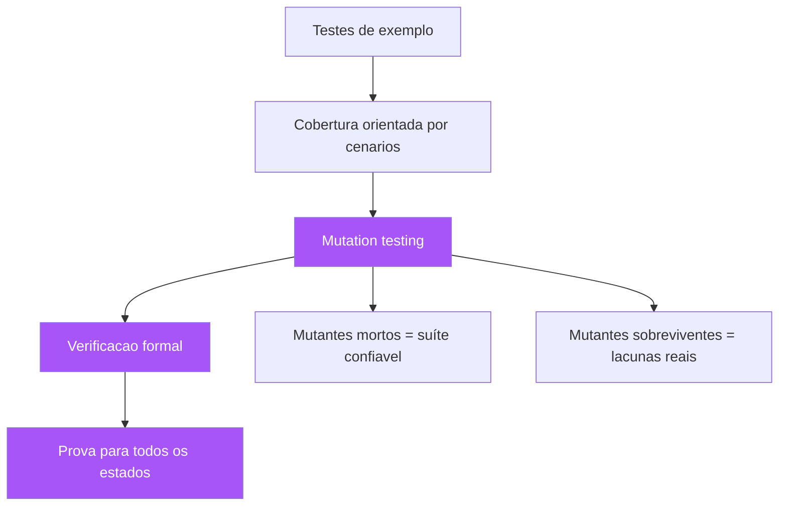

# Capítulo 9: Verificação formal e assistida: de TLA+ e Dafny ao mutation testing

## 1. Introdução

Você já sabe que a planta é a especificação e o habite-se é a verificação. Mas há uma pergunta incômoda que este capítulo enfrenta de frente: como saber se a verificação em si é confiável? Um teste que passa pode estar verificando o comportamento errado — ou verificando nada. Neste capítulo, você vai subir ao topo do rigor: a verificação formal e assistida — TLA+ e o model checking, Dafny e os contratos provados por máquina, Alloy e os contraexemplos automáticos [1][2][3] — e, no chão do dia a dia, o mutation testing, a técnica que audita os próprios testes perguntando "se eu plantar um defeito na planta, seus testes o pegam?" [4]. Você vai aprender quando cada nível de rigor é justificável, como integrá-los à sua especificação, e por que o objetivo não é provar tudo — é saber, com precisão, o que foi provado e o que não foi.

## 2. Explica

### A hierarquia da confiança

A confiança que você pode depositar numa especificação executável existe em uma hierarquia de rigor. No nível mais baixo, os testes de exemplo: a suíte verifica os comportamentos que alguém escreveu — e só eles; tudo o que não foi escrito como exemplo permanece não verificado [5]. Acima, a cobertura orientada por cenários: mede-se quais partes do comportamento foram exercitadas, mas cobertura não é corretude — uma linha coberta por um teste pode ainda conter um bug que o teste não observa. No nível seguinte, o mutation testing: plantam-se defeitos deliberadamente e mede-se quantos a suíte detecta — uma métrica real de qualidade da verificação [4]. E no topo, a verificação formal: a prova matemática de que o modelo satisfaz a especificação, para todos os estados possíveis — sem amostragem, sem aproximação, sem "quase" [1][2]. Cada nível custa mais e confere mais; a arte é escolher o nível proporcional ao risco, como você já viu no Capítulo 2 [6].

Você vai perceber que essa hierarquia responde à pergunta do Capítulo 4 com mais precisão: a documentação viva prova que o sistema se comporta como os exemplos dizem — mas não prova que os exemplos cobrem tudo o que importa. O mutation testing ataca exatamente essa lacuna: ele não verifica o sistema, verifica a especificação — mede quantos "erros plausíveis" a suíte detectaria. Se a suíte passa com 95% dos mutantes mortos, há confiança razoável; se passa com 40%, a suíte é decorativa [7]. E a verificação formal vai além: para sistemas onde a falha é inaceitável, ela substitui a amostragem de testes pela exaustão matemática — não "o teste passou nestas entradas", mas "a propriedade vale para todas as entradas e todos os estados" [8].

### TLA+: o model checking do tempo e da concorrência

O TLA+, criado por Leslie Lamport, é a linguagem de especificação para sistemas concorrentes e distribuídos [1]. Sua ideia central é a lógica temporal de ações: o sistema é descrito por um estado inicial e um conjunto de ações que transformam o estado; propriedades de segurança ("nunca acontece X") e de vivacidade ("eventualmente acontece Y") são declaradas como fórmulas; e o model checker TLC explora exaustivamente o espaço de estados, procurando violações [9]. A AWS adotou o TLA+ para serviços críticos e publicou a evidência: a técnica encontrou bugs reais e sutis que revisões e testes não pegaram, especialmente em protocolos de consenso, gerenciamento de falhas e alocação de recursos [10]. A experiência relatada: o modelo é pequeno (centenas de linhas), a modelagem é rápida (dias), e os bugs encontrados seriam caríssimos em produção [11].

O que o TLA+ ensina ao SDD cotidiano não é que todos devem escrever TLA+ — é que existe uma classe de comportamento que testes de exemplo nunca cobrem: o comportamento interativo entre estados ao longo do tempo [1]. Um teste unitário verifica uma transição; o model checking verifica todas as sequências de transições possíveis dentro de um escopo. Quando o seu sistema tem concorrência, timeouts, retries, partições de rede — a classe de bugs que você mais teme em produção — os testes de exemplo são intrinsecamente insuficientes, e a especificação formal é a ferramenta que a tradição (Capítulo 2) deixou para exatamente esse caso [12].

### Dafny e os contratos provados por máquina

O Dafny, da Microsoft, representa a convergência entre Design by Contract e verificação formal: uma linguagem de programação imperativa com contratos (precondições, pós-condições, invariantes) que são verificados automaticamente por um provador de teoremas (Z3) em tempo de compilação [2][13]. Diferente do TLA+ (que modela sistemas, não implementa), o Dafny é uma linguagem real: você escreve o código e os contratos juntos, e o compilador prova — ou rejeita — que o código satisfaz os contratos [14]. O uso prático: para funções críticas (cálculo financeiro, criptografia, parsing de formatos), o Dafny substitui a confiança amostral por prova: se compila, o contrato vale para todas as entradas — não para as entradas que alguém testou [2].

A relação do Dafny com o SDD é elegante: as pré-condições e pós-condições do Dafny são a mesma planta do Design by Contract do Capítulo 2 — mas verificada por máquina em vez de asserção em tempo de execução [15]. A asserção em runtime (Eiffel, Python com assert) verifica em cada execução; a prova do Dafny verifica em todas as execuções possíveis, antes de o código existir. O custo é a expressividade: provar propriedades complexas exige escrever o código de uma forma que o provador consiga raciocinar — uma disciplina que nem todo código aceita. A régua prática: o Dafny é para as poucas funções onde o erro é inaceitável e a prova é viável — o restante continua com testes de exemplo e mutation testing [16].

### Mutation testing: o auditor dos testes

O mutation testing é a técnica que faz pelos seus testes o que o fiscal faz pela obra: planta defeitos deliberados (mutantes) e verifica se a suíte os detecta [4][17]. O processo: o sistema é copiado; cada cópia recebe um defeito sintático mínimo — inverter um operador (`<` vira `>=`), remover uma condição, trocar uma constante, apagar uma chamada; e a suíte roda contra cada mutante. Um mutante "morto" é detectado por pelo menos um teste (a suíte falhou nele — bom); um mutante "sobrevivente" passa despercebido (a suíte não notou a mudança — mau: o teste não cobre aquele comportamento de fato) [18]. A métrica de qualidade é a taxa de mutação: a porcentagem de mutantes mortos. Uma taxa abaixo de 70-80% indica que a suíte verifica pouco do comportamento real — independentemente da cobertura de linhas reportada [7].

O mutation testing é a ponte entre a Specification by Example e a verificação formal: ele responde "os exemplares que você escreveu realmente verificam a planta, ou apenas tocam nela?" [19]. É comum descobrir que cenários Gherkin "passando" não detectam mutantes — porque a asserção do passo Then não observa o efeito que o mutante altera. O mutante sobrevivente é um diagnóstico preciso: este comportamento não está verificado, e o exemplar precisa ser reforçado [20]. O custo é computacional (rodar a suíte N vezes para N mutantes), mas ferramentas modernas otimizam com execução incremental e paralela, tornando a técnica viável no CI para módulos críticos [21].

## 3. Ilustra

Voltemos à construtora, agora na fase de vistoria. O engenheiro-chefe tem três instrumentos de confiança na obra. O primeiro é a inspeção amostral: o fiscal confere 10% das soldas da estrutura — barato, rápido, e deixa 90% sem conferência (são os testes de exemplo). O segundo é a inspeção com provocação: o engenheiro ordena que um técnico sabote uma viga de cada lote — remover um parafuso, afrouxar uma emenda — e verifica se a vistoria padrão detecta a sabotagem; a taxa de detecção revela a qualidade real da vistoria (é o mutation testing: você planta defeitos para medir a capacidade de detectá-los) [4]. O terceiro é o cálculo estrutural completo: um software de engenharia que simula a estrutura sob todas as combinações de carga, vento, sismo e degradação — não uma amostra, mas a exaustão matemática dos cenários possíveis (é a verificação formal) [8].



A lição da metáfora do sabotador é a mais valiosa do capítulo: a inspeção com provocação é a única que mede a capacidade de detecção da vistoria — e é exatamente o que a cobertura de linhas não faz. Cobertura mede "quantas linhas o teste tocou"; mutation testing mede "se o teste pegaria um defeito". A diferença é a mesma entre "o fiscal passou por todas as vigas" e "o fiscal perceberia se um parafuso faltasse" [19]. Você, como Engenheiro de Software, já teve a experiência de ver cobertura de 90% e ainda assim bugs escaparem — o mutation testing explica por quê: as linhas estavam cobertas, mas o comportamento não estava verificado [7].

## 4. Técnica

### Um modelo TLA+ verificável na prática

O exemplo clássico de TLA+ é o registro distribuído com eleição — vamos ver um modelo completo, com a propriedade de segurança que o TLC verifica:

```tla
---- MODULE Eleicao ----
EXTENDS Naturals, FiniteSets

CONSTANT NumeroDeNos
VARIABLES lider, vivo, mandato

Nos == 1..NumeroDeNos

Init == /\ lider \in Nos
        /\ vivo = 1
        /\ mandato = 0

Cai == /\ vivo = 1
       /\ vivo' = 0
       /\ UNCHANGED <<lider, mandato>>

Elege == /\ vivo = 0
         /\ lider' \in Nos
         /\ mandato' = mandato + 1
         /\ vivo' = 1

Next == Cai \/ Elege

Seguranca == /\ vivo = 1 => mandato > 0
             \/ vivo = 0

Spec == Init /\ [][Next]_<<lider, vivo, mandato>>
====
```

```bash
# Verificacao do modelo com TLC (o habite-se formal)
# 1) Compila o modelo (tlc executa a exploracao exaustiva)
java -jar tla2tools.jar Eleicao.tla -config Eleicao.cfg -workers 4
# 2) Saida esperada: "Model checking completed. No error has been found."
# 3) Se voce REMOVER a linha do mandato, o TLC acusa violacao de Seguranca:
#    o invariante falha no estado onde vivo=1 e mandato=0.
```

```tla
---- MODULE Eleicao (config) ----
CONSTANT NumeroDeNos = 3

INVARIANT Seguranca

PROPERTY NaoDuasEleicoesSemQueda
====
```

O que o TLC faz por você: explora todos os estados alcançáveis (3 nós, algumas dezenas de estados) e verifica a invariante em cada um — a exaustão que os testes de exemplo não fazem [1][9]. A lição prática: modelos pequenos já valem a pena — o protocolo de eleição acima, em poucas horas de modelagem, verifica matematicamente uma propriedade que testes unitários não conseguem provar para todas as sequências de eventos [10].

### Dafny: provando um contrato na prática

O Dafny prova que o código satisfaz o contrato — vamos ver uma função de domínio clássica:

```dafny
// A raiz quadrada inteira: pre-condicao, pos-condicao e loop com invariante.
// O provador Z3 verifica que a pos-condicao vale para TODAS as entradas validas.
function RaizInteira(n: nat): nat
    requires n >= 0
    ensures RaizInteira(n) * RaizInteira(n) <= n
    ensures (RaizInteira(n) + 1) * (RaizInteira(n) + 1) > n
{
    var r := 0;
    while (r + 1) * (r + 1) <= n
        invariant r * r <= n
        decreases n - r
    {
        r := r + 1;
    }
    r
}

method Main() {
    var r := RaizInteira(50);
    assert r * r <= 50 && (r + 1) * (r + 1) > 50;  // verificado pelo provador
    print r;
}
```

O que o Dafny prova: para qualquer `n` não negativo, o resultado satisfaz as duas cláusulas da pós-condição — não para os casos testados, para todos [2][14]. O compilador rejeita o código se a prova falha, e o loop precisa de invariante explícita para o provador raciocinar. A experiência de usar Dafny ensina uma disciplina valiosa para qualquer código: escrever o contrato primeiro (a planta), e depois o corpo que o satisfaz (a obra) — exatamente o fluxo do SDD [15].

### Mutation testing na prática: auditando a suíte

A aplicação prática do mutation testing na sua suíte:

```bash
# Mutation testing em Python com mutmut (exemplo)
pip install mutmut
# 1) Executa a suíte base e computa a cobertura de mutação
mutmut run --paths-to-mutate src/
# 2) Relatório da taxa de mutação
mutmut results
# 3) Ver os mutantes sobreviventes (os diagnósticos valiosos)
mutmut show-surviving
```

```python
"""Exemplo de lacuna que o mutation testing revela.

A funcao abaixo tem um teste que "passa" mas nao detecta o mutante
trocar '<' por '<=' — o mutante sobrevive, revelando que o comportamento
do limite nao esta verificado.
"""
from dataclasses import dataclass


@dataclass
class Pedido:
    valor: float


def frete_gratuito(pedido: Pedido) -> bool:
    return pedido.valor >= 100.0


# Teste atual: so cobre o caso "acima do limiar"
def test_frete_acima_do_limiar() -> None:
    assert frete_gratuito(Pedido(150.0)) is True


# O mutante '>= vira >' sobrevive com o teste acima:
#   frete_gratuito(Pedido(100.0)) -> False (mutante) vs True (original)
# A suíte nao distingue — o limite exato NAO esta verificado.
# Correcao: adicionar o caso do limite exato.
def test_frete_no_limiar_exato() -> None:
    assert frete_gratuito(Pedido(100.0)) is True
```

A lição do exemplo é concreta: o teste do caso feliz (150) não detecta a inversão do operador no limite (100) — o mutante sobrevive, e o relatório aponta exatamente a lacuna: o comportamento do limiar exato não está verificado [18][20]. Adicionar o caso do limite resolve — e o exemplar novo é exatamente o tipo de borda que a Specification by Example do Capítulo 4 manda capturar na descoberta. O mutation testing não substitui a descoberta — ele audita se a descoberta deixou lacunas [19].

### A estratégia de verificação por módulo: o mapa de rigor

A aplicação prática da hierarquia começa com um mapa: a classificação explícita de cada módulo do sistema pelo nível de rigor necessário. O mapa é uma tabela simples — módulo, criticidade (baixa/média/alta/extrema), custo de falha (em reais ou em vidas), e nível de rigor aplicado (exemplos, exemplos + mutation, modelos formais, prova formal) — e é o artefato que torna a régua de proporcionalidade operacional [6][16]. Sem o mapa, o rigor é distribuído por inércia: o módulo que alguém gostava recebe TLA+, o módulo crítico fica só com testes felizes; com o mapa, a distribuição é deliberada e revisável — e a auditoria consegue perguntar "por que o módulo X tem só exemplos se a criticidade é extrema?" e receber uma resposta, não um silêncio [8].

O mapa de rigor tem uma segunda função: ele é o termômetro da dívida de verificação. Módulos críticos com rigor insuficiente são dívida — e, como toda dívida técnica, ela acumula juros (o incidente que o rigor teria evitado, com multiplicador do Capítulo 1) [23]. A revisão periódica do mapa — a cada trimestre, ou a cada mudança de arquitetura — é o momento de migrar módulos: o que era baixa criticidade e cresceu em importância sobe de nível; o que era crítico e foi simplificado pode descer. A disciplina do mapa é a mesma da planta: a verificação não é um estado fixo, é uma decisão contínua, e a decisão deve ser explícita, documentada e revisada [24].

### O custo do rigor e a economia da verificação

O rigor tem custo, e a economia da verificação é a disciplina de comparar o custo do rigor com o custo do risco evitado. O custo do rigor tem três componentes: o custo de produção (escrever o modelo, a prova ou os mutantes — horas a dias); o custo de manutenção (cada mudança no módulo exige re-verificar — o modelo acompanha o código); e o custo de aprendizado (a curva de TLA+, Dafny ou da disciplina de mutation testing). O risco evitado tem dois componentes: a probabilidade de falha e o custo da falha — e é o produto dos dois que decide [6][8]. Um bug de protocolo em um serviço de pagamentos pode ter probabilidade baixa e custo altíssimo (o incidente da seção Aplica do Capítulo 2); um bug de validação em um formulário interno tem probabilidade média e custo baixo. A régua: o rigor sobe quando o produto (probabilidade × custo) sobe — e a régua é aplicada módulo por módulo, não globalmente [16].

A economia da verificação também tem um teorema contra-intuitivo: o rigor formal frequentemente REDUZ o custo total, mesmo quando o custo de produção é alto — porque ele desloca a detecção de bugs para a fase mais barata (o design, custo 1 na régua de Boehm do Capítulo 1) [4][10]. O TLA+ na AWS não economizou por evitar bugs baratos — economizou por encontrar, no design, bugs que teriam sido encontrados em produção com o multiplicador máximo [10][11]. A apresentação desse argumento à liderança — o rigor como investimento com retorno, não como custo — é a habilidade que separa o engenheiro que adota a verificação formal do que apenas a admira [25].

### Integrando os níveis de rigor ao fluxo SDD

A integração prática dos níveis de rigor ao seu fluxo: para a grande maioria do sistema, testes de exemplo + mutation testing no CI (taxa de mutação monitorada, com limiar por módulo crítico); para módulos com concorrência e protocolos, TLA+ na fase de design (o modelo acompanha o código e é re-verificado a cada mudança); e para funções críticas isoladas (cálculos, parsing), Dafny ou contratos verificados [6][16]. A régua de decisão é a mesma da planta: o nível de rigor é proporcional ao custo de falha — e o custo de falha é uma decisão de negócio, não técnica [8]. O relatório de qualidade do projeto deve declarar, de forma explícita, qual nível de rigor cada módulo recebeu — para que ninguém confunda "testado" com "provado" [11].

## 5. Aplica

### A cena de contraste: a suíte 90% verde que deixou o bug passar

Você é o engenheiro de qualidade de uma fintech. O time comemora: a suíte de testes do módulo de juros compostos tem 92% de cobertura de linhas — um orgulho. Então o incidente: um cliente recebeu juros incorretos em uma operação de 30 dias, e o erro — a capitalização aplicada em dias corridos em vez de dias úteis — estava no código havia quatro meses, com a suíte toda verde o tempo todo [22]. Você investiga e encontra o padrão: os testes do módulo cobrem os caminhos felizes com valores "redondos" (1 mês, taxa de 1%), mas nenhum teste cobre a diferença entre dias corridos e úteis — e, mais revelador, quando você roda o mutation testing no módulo, 58% dos mutantes sobrevivem: a suíte toca 92% das linhas, mas não verifica 42% dos comportamentos plausíveis [7].

O diagnóstico, doloroso: cobertura de linhas é uma métrica de vaidade — mede quantas linhas os testes tocaram, não o que eles verificam. A correção que você conduz tem duas frentes. Primeira: o mutation testing é integrado ao CI do módulo com limiar de 80% de mutantes mortos — e a primeira execução revela as lacunas reais: o cálculo de dias úteis, o ano bissexto, o arredondamento de centavos — cada mutante sobrevivente vira um exemplar novo na feature Gherkin (o fluxo do Capítulo 4: bug e lacuna viram exemplares) [20]. Segunda: para o cálculo de juros — a função mais crítica da empresa — a equipe escreve a spec com os casos de borda explícitos (dias corridos vs úteis, fim de mês, bissexto) e, no módulo mais sensível, avalia o Dafny para provar a fórmula de capitalização [15]. Três meses depois, a taxa de mutação do módulo está em 87%, e o incidente de juros virou o exemplo da empresa de por que "verde" não é suficiente.

### Armadilhas comuns

As armadilhas do rigor são reais. A primeira é o rigor por vaidade: TLA+ e Dafny usados em módulos triviais para "parecer sério" — o rigor tem custo e deve ser proporcional ao risco; ninguém modela o CRUD de usuários em TLA+ [6]. A segunda é o modelo órfão: TLA+ escrito no design e abandonado — o modelo que descreve um sistema que não existe mais, que dá confiança falsa (a mesma armadilha do Capítulo 2, agora com carimbo formal) [23]. A terceira é o mutation testing sem triagem: tratar a taxa de mutação como número sagrado e perseguir 100% — mutantes equivalentes (que não mudam o comportamento) e mutantes triviais inflam o número; a régua é a tendência, não o pico [7]. A quarta é confundir prova com teste: acreditar que código Dafny não precisa de testes — a prova cobre contratos, não integração, UX ou regressão de domínio; os níveis se complementam, não se substituem [16]. E a quinta é o silêncio do rigor: não declarar o nível de rigor de cada módulo — se o relatório não diz o que foi provado e o que foi apenas testado, a organização assume o nível errado [24].

### O rigor como linguagem comum entre engenheiros e auditoria

O rigor da verificação tem uma função organizacional que vai além da qualidade técnica: ele cria uma linguagem comum entre a engenharia e a auditoria — a capacidade de falar, com precisão, sobre o que foi verificado e o que não foi [8][24]. O engenheiro que diz "testado" sem qualificar e o auditor que ouve "provado" estão falando línguas diferentes, e a diferença é exatamente onde nascem as decisões erradas de risco: a organização que acredita que algo foi provado quando foi apenas amostrado assume riscos que não sabe que está assumindo [25]. A hierarquia da confiança deste capítulo é o vocabulário dessa linguagem comum: exemplo, cobertura, mutação, prova — quatro palavras com significados precisos, que engenharia e auditoria passam a compartilhar [6].

A linguagem comum tem efeitos práticos mensuráveis. Primeiro: as decisões de risco ficam honestas — o comitê que decide liberar um sistema crítico pergunta "qual o nível de rigor do módulo de pagamento?" e recebe uma resposta com significado preciso, não um "está bem testado" vago [8]. Segundo: os relatórios de qualidade passam a usar os termos da hierarquia — o relatório declara, módulo por módulo, o nível de rigor, e a lacuna entre o nível atual e o necessário fica visível [24]. Terceiro: a negociação de recursos muda de caráter — o pedido de tempo para modelar um protocolo em TLA+ deixa de ser "quero fazer algo teórico" e vira "quero mover o módulo X do nível exemplo para o nível prova, porque o custo de falha é Y" — um pedido que a auditoria entende e a liderança consegue avaliar [16][25]. A hierarquia da confiança, assim, não é apenas uma ferramenta técnica: é o instrumento que torna a verificação parte da conversa de governança, e não uma especialidade que a engenharia pratica em silêncio [11].

### Métricas de sucesso e fracasso

Sucesso: a taxa de mutação é monitorada no CI para módulos críticos e melhora trimestre a trimestre; os modelos TLA+ existem para os protocolos de concorrência e são re-verificados nas mudanças; as funções críticas com prova formal estão documentadas como "provadas"; e o relatório de qualidade declara o nível de rigor por módulo. Fracasso: cobertura de linhas alta com taxa de mutação baixa (o sinal de suíte decorativa); modelos formais abandonados e divergentes do código; e o sintoma mais caro — a descoberta em produção de um bug que o mutation testing teria revelado, porque ninguém rodou a técnica [25].

A implementação econômica dessas técnicas segue uma escada de rigor que o time sobe módulo a módulo. Degrau um — mutation testing no CI para os módulos críticos apenas (não a base inteira, que explode o custo): a configuração define a lista de mutantes ativos e o limiar de sobrevivência; o relatório aponta os pontos cegos da suíte, e o orçamento de tempo define quantos pontos cegos são fechados por iteração — a regra prática é fechar os três piores pontos cegos por sprint até o limiar estabilizar. Degrau dois — model checking para os protocolos de concorrência e de estados: TLA+ ou Alloy para a máquina de estados que orquestra recursos (sagas, retries, locks), com a propriedade a verificar escrita como invariante; a verificação roda em toda mudança do módulo, e o modelo mora ao lado do código, com um README dizendo o que foi provado e o que ficou fora. Degrau três — prova assistida para o punhado de funções onde o custo de falha é catastrófico: Dafny ou Frama-C para a lógica de validação de segurança e de fronteira financeira; aqui o critério de parada é o inverso do resto do livro — para essas funções, o código só é aceito com a prova, e a revisão de código inclui a revisão da prova, não só do código. A escada inteira é governada por uma pergunta de triagem: qual é o custo de falha deste módulo? Abaixo de um limiar, testes tradicionais bastam; acima dele, a técnica de rigor sobe um degrau. O erro mais caro que a escada evita é o investimento de rigor no lugar errado: provar formalmente o módulo trivial enquanto o módulo crítico vive de testes felizes — rigor mal distribuído é pior que ausência de rigor, porque consome o crédito de confiança da organização [25]. O objetivo final não é provar tudo, é provar exatamente o que importa, e saber dizer o que foi provado e o que ficou confiado a testes.

## 6. Conclusão

Neste capítulo, você subiu ao topo do rigor: a hierarquia da confiança — de testes de exemplo a cobertura, mutation testing e verificação formal [5][6]; o TLA+ e o model checking exaustivo para concorrência e distribuídos, com a evidência da AWS [1][9][10]; o Dafny e os contratos provados por máquina [2][13][14]; e o mutation testing como o auditor dos testes — a técnica que planta defeitos para medir a capacidade de detecção da suíte [4][17][18]. O desafio: rode o mutation testing no módulo mais crítico do seu sistema e traga os cinco mutantes sobreviventes mais reveladores para a próxima reunião — cada um deles é uma lacuna real da sua especificação. No próximo capítulo, vamos juntar tudo o que você aprendeu em um fluxo único e completo: do plano à obra — o SDD end-to-end, da spec aprovada ao código em produção, com a triagem entre spec quebrada e código quebrado e o ritmo sustentável da execução.

## 7. Referências Bibliográficas

[1] LAMPORT, Leslie. *Specifying Systems: The TLA+ Language and Tools for Hardware and Software Engineers*. Boston: Addison-Wesley, 2002.
[2] LEINO, K. Rustan M. Dafny: An Automatic Program Verifier for Functional Correctness. In: *LPAR-16 — Logic for Programming, Artificial Intelligence, and Reasoning*. Berlin: Springer, 2010. p. 348-370.
[3] JACKSON, Daniel. *Software Abstractions: Logic, Language, and Analysis*. Cambridge: MIT Press, 2006.
[4] OFFUTT, Jeff. *Mutation Testing for the New Century*. Norwell: Kluwer, 2001.
[5] BECK, Kent. *Test-Driven Development: By Example*. Boston: Addison-Wesley, 2002.
[6] BOWEN, Jonathan; HINCHEY, Michael. Ten Commandments of Formal Methods. *IEEE Computer*, v. 28, n. 4, p. 56-63, 1995.
[7] OFFUTT, Jeff; UNTCH, Roland H. Mutation 2000: Uniting the Orthogonal. In: *Mutation Testing for the New Century*. Norwell: Kluwer, 2001. p. 34-44.
[8] HALL, Anthony. Seven Myths of Formal Methods. *IEEE Software*, v. 7, n. 5, p. 11-19, 1990.
[9] LAMPORT, Leslie. *The Temporal Logic of Actions*. ACM Transactions on Programming Languages and Systems, v. 16, n. 3, p. 872-923, 1994.
[10] NEWCOMBE, Chris et al. How Amazon Web Services Uses Formal Methods. *Communications of the ACM*, v. 58, n. 4, p. 66-73, 2015.
[11] NEWCOMBE, Chris. *Why Amazon Chose TLA+*. 2014. Disponível em: https://brooker.co.za/blog/2014/03/16/amazon-and-tla.html. Acesso em: 5 ago. 2026.
[12] KLEPPMANN, Martin. *Designing Data-Intensive Applications*. Sebastopol: O'Reilly Media, 2017.
[13] LEINO, K. Rustan M. *Dafny Documentation*. Disponível em: https://dafny.org/. Acesso em: 5 ago. 2026.
[14] LEINO, K. Rustan M.; WÜSTRICH, Michał. The Dafny Integrated Development Environment. In: *Proceedings of F-IDE 2014*. 2014.
[15] MEYER, Bertrand. *Object-Oriented Software Construction*. 2. ed. Upper Saddle River: Prentice Hall, 1997.
[16] LEINO, K. Rustan M. *Developing Verified Programs with Dafny*. Disponível em: https://dafny.org/dafny/OnlineTutorial/. Acesso em: 5 ago. 2026.
[17] BUDD, Timothy A. et al. The Design of a Prototype Mutation System for Program Testing. In: *Proceedings of the National Computer Conference (AFIPS)*. 1978. p. 623-627.
[18] OFFSETT, Jeff. Mutation Analysis. In: *Encyclopedia of Software Engineering*. New York: Wiley, 2002.
[19] ADZIC, Gojko. *Specification by Example: How Successful Teams Deliver the Right Software*. Shelter Island: Manning Publications, 2011.
[20] OFFSETT, Jeff. *Mutation Analysis in Practice*. Disponível em: https://cs.gmu.edu/~offutt/papers/. Acesso em: 5 ago. 2026.
[21] JUST, René. *The Major Mutation Framework*. Disponível em: https://mutation-testing.org/. Acesso em: 5 ago. 2026.
[22] WEINBERG, Gerald M. *Quality Software Management: Systems Thinking*. New York: Dorset House, 1992.
[23] PARNAS, David L. Software Aging. In: *Proceedings of the 16th International Conference on Software Engineering (ICSE)*. New York: IEEE, 1994. p. 279-287.
[24] ADZIC, Gojko. *Living Documentation: Continuous Knowledge Sharing by Design*. Boston: Addison-Wesley, 2017.
[25] OFFSETT, Jeff; HAYES, Jeff. *Semantic Mutation Analysis*. In: *Proceedings of the IEEE International Conference on Software Testing (ICST)*. 2010.
