# Spec-Driven Development: da intenção ao código verificável

# Como Este Livro Foi Escrito: A Metodologia EITA

Todo capítulo deste livro segue a metodologia **EITA** — um framework pedagógico de 7 seções projetado para transformar o leitor de "não sei" para "consigo fazer" em cada tema abordado.

## As 7 Seções do EITA

### 1. INTRODUÇÃO
Contextualiza o tema. Explica o que será abordado, por que importa, e o que você será capaz ao final. Uma ponte conecta com o capítulo anterior (quando houver).

### 2. EXPLICA
Desconstrói o conceito: causa raiz, mecânica subjacente, definições precisas. Você passa de "não sei o que é" para "sei definir e explicar".

### 3. ILUSTRA
Uma analogia concreta ancora o conceito na sua intuição — sempre acompanhada de um diagrama visual que torna o abstrato tangível. Você passa de "parece abstrato" para "faz sentido".

### 4. TÉCNICA
O núcleo de valor: código executável, arquiteturas, passo a passo de implementação. É aqui você ganha as mãos para fazer. Você passa de "não sei fazer" para "consigo implementar".

### 5. APLICA
Contextualização em cenário real: onde aquilo se aplica no mercado, armadilhas comuns e como evitá-las. Você passa de "isso é teórico" para "vou usar no trabalho".

### 6. CONCLUSÃO
Síntese dos 3 pontos principais, conexão com o próximo capítulo e um desafio opcional para fixar o aprendizado.

### 7. REFERÊNCIAS BIBLIOGRÁFICAS
Fontes citadas no capítulo, em formato ABNT numerado. Toda afirmação factual tem sua referência.

## Por Que Funciona

O EITA não é uma lista de tópicos — é uma **jornada de transformação**. Cada seção leva o leitor a um estado mental diferente:

```
Introdução → "Quero aprender"
Explica     → "Entendi a teoria"
Ilustra     → "Faz sentido na prática"
Técnica     → "Consigo fazer"
Aplica      → "Vou usar no trabalho"
Conclusão   → "Dominei este tema"
```

## Diagrama do Fluxo EITA

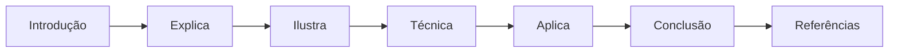

## Dica de Leitura

Você pode ler os capítulos em ordem (recomendado para iniciantes) ou pular diretamente para o tema de interesse. Cada capítulo é autocontido, mas a sequência cria conexões que ampliam o aprendizado.

---

*A metodologia EITA é uma criação da Fábrica Agêntica de Livros, projetada para produzir literatura técnica que transforma leitores em profissionais.*

## Introdução geral

Introdução Geral — A planta antes do canteiro: por que especificação é disciplina, não burocracia

# PARTE I — A Intenção: por que o código nasce errado

# Capítulo 1: O canteiro sem planta: anatomia da intenção perdida

## 1. Introdução

Todo projeto de software nasce de uma intenção: alguém quer que um sistema faça algo. E, no entanto, a distância entre o que essa pessoa imaginou e o que o código efetivamente faz é a fonte mais cara de erro da indústria — mais cara que bug de lógica, mais cara que falha de infraestrutura, porque ela corrompe a fundação antes de a primeira linha existir [1]. Você vai aprender neste capítulo a reconhecer essa distância, medir o custo que ela impõe ao seu time e entender por que a especificação — tratada como planta de engenharia, e não como papel burocrático — é a única correção estrutural que ataca a causa, em vez de remediar o sintoma. Este é o capítulo de abertura da obra, e ele cumpre uma função específica: convencê-lo, com evidência, de que o problema não é falta de habilidade de programação, e sim falta de disciplina de especificação.

## 2. Explica

### A anatomia da intenção perdida

Quando você pede a uma pessoa "faça um sistema de reservas", ela produzirá um sistema diferente de outra pessoa que recebeu o mesmo pedido. Isso não é defeito das pessoas — é o funcionamento normal da linguagem natural, que é otimizada para comunicação entre humanos que compartilham contexto, não para especificação de máquinas [2]. O problema se agrava quando o "pedido" é feito por escrito: cada leitor preenche as lacunas com as próprias suposições, e essas suposições divergem silenciosamente porque ninguém as verbaliza. Estudos de engenharia de requisitos há décadas documentam que a maioria dos defeitos graves em software tem origem em requisitos incorretos, incompletos ou ambíguos — não em erros de implementação [3]. O dado clássico de Boehm permanece citado até hoje: corrigir um defeito de requisito depois da entrega custa dezenas a centenas de vezes mais do que corrigi-lo na fase de especificação [4]. Note como esse número não é sobre esforço de digitação: é sobre tudo o que já foi construído em cima da fundação errada — documentação, testes, integrações, processos de negócio — que precisa ser reconstruído junto.

Você vai perceber que existe uma hierarquia de perdas. No nível mais raso, o código implementa corretamente o que o programador entendeu — mas o que ele entendeu não era o que o negócio precisava. Esse é o clássico "o software está funcionando conforme o especificado, mas a especificação estava errada". No nível médio, a intenção está correta no geral, mas os detalhes de borda — os casos excepcionais, as combinações de estado, os limites — foram deixados à imaginação de cada implementador, produzindo comportamento inconsistente entre partes do mesmo sistema. E no nível mais profundo, a intenção nem foi expressa: alguém começou a construir a partir de um palpite sobre o que o usuário queria, e o palpite virou arquitetura. Os três níveis compartilham a mesma raiz: não houve uma planta aprovada antes do canteiro [5].

### O custo da ambiguidade

A ambiguidade tem um custo duplo e perverso. Primeiro, o custo direto do retrabalho: código escrito, testado e revisado precisa ser descartado quando a interpretação correta emerge tarde demais. Segundo, o custo indireto e mais silencioso: a perda de confiança. Quando o time descobre que "as especificações nunca estão certas", ele para de lê-las e passa a decidir por si — o que acelera a divergência entre o que o negócio pede e o que é entregue [6]. Esse ciclo de realimentação negativa é a explicação estrutural de por que projetos longos com comunicação falha tendem a terminar entregando o sistema errado com pontualidade. O relatório CHAOS do Standish Group, publicado desde 1994, tem repetidamente apontado que requisitos incompletos e falta de envolvimento do usuário estão entre as principais causas de fracasso de projetos de software [7].

Note como a indústria reagiu a esse diagnóstico ao longo de décadas. A resposta inicial foi a burocracia: documentos enormes, assinaturas, comitês — a especificação como instrumento de controle hierárquico. Essa resposta falhou porque transformava a especificação em um ritual de conformidade, não em uma ferramenta de alinhamento. A resposta ágil, na virada do milênio, jogou fora o bebê junto com a água: o manifesto ágil tem razão em valorizar software funcionando sobre documentação abrangente, mas essa máxima foi frequentemente mal interpretada como "não documente nada" [8]. O SDD que você vai aprender nesta obra é a síntese madura: nem burocracia, nem vácuo — a especificação como artefato executável que participa da verificação, e que portanto não pode desatualizar sem que o sistema acuse [9].

### Por que instrução não é especificação

A distinção mais importante deste capítulo é entre instrução e especificação. Uma instrução diz ao executor o que fazer: "implemente um endpoint de pagamento". Uma especificação diz o que o resultado deve satisfazer: "dado um pedido com saldo suficiente, o pagamento é aprovado; dado um pedido sem saldo, o pagamento é recusado e o pedido permanece no estado 'aguardando fundos'". A instrução delega todas as decisões de interpretação para o executor; a especificação as captura antes, explicitamente [10]. Essa distinção, que parece semântica, tem consequências práticas enormes: com instrução, você só descobre a divergência quando o código existe e é comparado com a expectativa; com especificação, a divergência é descoberta na revisão da própria especificação, em minutos, antes de custar uma linha de código. É exatamente o papel da planta de engenharia civil: o pedreiro não decide o tamanho das fundações — ele consulta a planta, e qualquer discordância entre o que o engenheiro desenhou e o que o cliente imaginou é resolvida no papel, não na estrutura de concreto [11].

## 3. Ilustra

Imagine uma construtora que decide erguer um edifício sem projeto aprovado. O engenheiro-chefe, pressionado pelo prazo, diz aos pedreiros: "construam um prédio de escritórios, confio no bom senso de vocês". Cada andar é erguido segundo a interpretação individual do encarregado daquele andar. No térreo, o bom senso exige pilares a cada 6 metros; no terceiro andar, alguém decide que a cada 9 metros fica mais bonito. A rede elétrica do segundo andar foi dimensionada para um restaurante; o quarto andar virou uma quadra de squash. No dia da vistoria — o habite-se — o engenheiro do município compara o edifício com... nada. Não há planta para comparar. O prédio é entregue, as pessoas se mudam, e os problemas estruturais aparecem ao longo dos anos, cada correção custando uma fortuna porque exige mexer no que já está construído. Você, como Engenheiro de Software, já viveu essa cena dezenas de vezes em versão digital: o sistema foi entregue, e ninguém consegue explicar por que um módulo calcula juros de um jeito e outro módulo calcula de outro jeito, porque nunca existiu um documento único descrevendo a regra de juros.

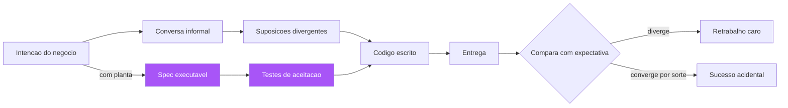

A especificação é a planta. O habite-se é a verificação automática que compara o construído com a planta, e é isso que transforma a entrega de software em uma disciplina de engenharia em vez de uma loteria. Sem planta, o habite-se é impossível — não há referência para comparar. Com planta, o habite-se é barato e contínuo: cada commit é vistoriado contra a especificação, e o prédio nunca se afasta do projeto sem que alguém perceba na hora [12]. Essa é a imagem que vai nos acompanhar por toda a obra: a planta, o canteiro e o habite-se. Guarde esses três elementos — eles são o esqueleto conceitual de todos os capítulos que virão.

## 4. Técnica

### O custo quantificado: de onde vêm os números

Antes de construir qualquer ferramenta, você precisa de uma forma de medir o fenômeno na sua própria organização. O primeiro instrumento é a classificação da origem dos defeitos. Quando um bug é aberto no seu rastreador, a primeira pergunta que o time deve responder — de forma disciplinada, em um campo obrigatório — é: este defeito é de especificação (o comportamento correto não estava definido ou estava errado), de implementação (o comportamento definido não foi implementado corretamente) ou de integração (componentes corretos que não conversam entre si)? Organizações que fazem essa triagem com disciplina descobrem, com frequência consistente, que 40% a 60% dos defeitos de produção são de origem de especificação [13]. Sem essa triagem, o time assume que todos os bugs são de código e investe em mais testes unitários — tratando o sintoma errado.

```python
"""Triagem de origem de defeitos — medir o fenômeno antes de remediar.

Executa uma planilha de bugs classificados e reporta a distribuição
de origem (especificacao, implementacao, integracao). Use este script
mensalmente para acompanhar a evolucao da distribuicao.
"""
from collections import Counter
from dataclasses import dataclass, field
from datetime import date


@dataclass
class Defeito:
    id: str
    origem: str  # "especificacao" | "implementacao" | "integracao"
    custo_horas: float
    detectado_em: str = field(default="producao")


def distribuir_origem(defeitos: list[Defeito]) -> Counter:
    """Conta defeitos por origem e peso pelo custo em horas."""
    return Counter({d.origem: d.custo_horas for d in defeitos})


def relatorio_mensal(defeitos: list[Defeito], mes: str) -> dict:
    total_horas = sum(d.custo_horas for d in defeitos)
    if total_horas == 0:
        return {"mes": mes, "total_horas": 0.0, "percentuais": {}}
    contagem = distribuir_origem(defeitos)
    percentuais = {
        origem: round(100.0 * horas / total_horas, 1)
        for origem, horas in contagem.items()
    }
    return {"mes": mes, "total_horas": round(total_horas, 1), "percentuais": percentuais}


if __name__ == "__main__":
    bugs = [
        Defeito("B-1001", "especificacao", 32.0),
        Defeito("B-1002", "implementacao", 4.0),
        Defeito("B-1003", "especificacao", 18.0),
        Defeito("B-1004", "integracao", 6.0),
        Defeito("B-1005", "especificacao", 9.0),
    ]
    print(relatorio_mensal(bugs, "2026-08"))
```

### A terminologia que o capítulo estabelece

Antes de avançar, vale consolidar a terminologia que esta obra inteira vai usar, porque a precisão dos termos é parte da disciplina. **Intenção** é o que o negócio quer alcançar — o resultado desejado, muitas vezes não verbalizado por completo. **Instrução** é a expressão imperativa da intenção, que delega as decisões de borda ao executor. **Especificação** é a expressão verificável da intenção, que captura as bordas e os critérios de aceitação antes da implementação. **Planta** é o nome que esta obra dá à especificação, em homenagem à metáfora de engenharia que a conduz. E **habite-se** é a verificação que atesta que o entregue cumpre a planta [10][12].

Essa terminologia não é decoração: ela dá ao time um vocabulário para falar dos erros com precisão. Quando alguém diz "a intenção se perdeu", todos entendem o que aconteceu — a especificação não capturou o que o negócio queria. Quando alguém diz "a instrução não especificava", todos entendem por que o código divergiu — as bordas foram delegadas ao executor. O vocabulário compartilhado é o primeiro instrumento da planta, e é o mesmo princípio que o Capítulo 5 desenvolverá como linguagem ubíqua: a comunicação precisa começa pela precisão dos termos [14][20].

### O teste da legibilidade da intenção

O segundo instrumento é qualitativo e pode ser aplicado em qualquer reunião de refinamento: o teste da legibilidade da intenção. Pegue a descrição de qualquer funcionalidade que seu time pretende construir e faça duas perguntas. Primeira: se eu der esta descrição para duas pessoas diferentes do time, elas produzem a mesma lista de cenários de teste? Segunda: se um recém-contratado ler esta descrição daqui a seis meses, ele consegue dizer o que o sistema deve fazer em um caso de borda que não está escrito? Se a resposta a qualquer uma das duas for não, a intenção está perdida — não importa quão bonita seja a descrição [14].

```markdown
# Teste da legibilidade da intenção — checklist de triagem rápida

1. [ ] Dois leitores independentes produzem a mesma lista de casos de borda?
2. [ ] Um leitor novo consegue prever o comportamento em estados excepcionais?
3. [ ] Existe pelo menos um exemplo concreto (entrada -> saída esperada)?
4. [ ] As regras de negócio estão separadas de detalhes de implementação?
5. [ ] Está explícito o que está FORA de escopo?

Resultado: 5 x [x] = intenção especificável. Qualquer [ ] aberto =
gap a fechar ANTES de escrever código — o custo de fechar aqui é minutos.
```

### O custo do retrabalho: a régua de Boehm

O terceiro instrumento é a régua de custo relativo do retrabalho. Boehm e colaboradores consolidaram a evidência de que o custo de corrigir um defeito cresce de forma aproximadamente exponencial conforme o defeito avança pelas fases do ciclo de vida: custo 1 se corrigido na fase de requisitos, custo de 3 a 6 se corrigido durante o design, de 10 a 20 no desenvolvimento, de 30 a 60 em testes e de 40 a 1000 após a entrega [4]. A aplicação prática dessa régua é o argumento econômico definitivo para a especificação: investir uma hora na especificação para eliminar uma ambiguidade pode economizar cem horas de retrabalho na produção. Nenhum outro investimento em engenharia de software tem esse retorno — nem mais testes, nem mais automação, nem mais revisão de código, porque todos esses atuam depois que a fundação errada já foi construída.

```yaml
# Regua de Boehm aplicada ao custo relativo de correcao de defeitos
# (valores classicos consolidados pela engenharia de software)
fases:
  requisitos: 1
  design: 5
  desenvolvimento: 15
  testes: 40
  producao: 250
uso:
  - "Use o fator de producao para justificar investimento em especificacao"
  - "Multiplique o custo estimado do bug pela regua antes de cortar a fase de spec"
  - "Apresente a regua em revisoes de prioridade quando a spec for tratada como custo"
```

### O artefato mínimo de intenção: a one-pager de especificação

Agora a aplicação prática imediata: o artefato mínimo que você pode adotar na sua organização ainda hoje, sem nenhuma ferramenta nova, é a one-pager de especificação — uma página, escrita antes do código, que força a intenção a sair da cabeça de quem a tem. Não é uma especificação completa (isso vem nos capítulos seguintes), é o primeiro degrau: um documento curto com o problema, o usuário, o comportamento esperado em exemplos concretos, o que está fora de escopo e os critérios mínimos de aceitação. A one-pager funciona porque é pequena o suficiente para ser lida por todos e para ser confrontada com a realidade — e a mera existência dela muda a conversa: em vez de "o que você acha?", a conversa passa a ser "isto está correto?" [15].

```markdown
# ONE-PAGER DE ESPECIFICAÇÃO — <nome da funcionalidade>

## Problema (por que)
<parágrafo curto: qual dor real do usuário este recurso resolve?>

## Usuário (para quem)
<quem usa, em que contexto, com que frequência?>

## Comportamento esperado (o quê)
- Exemplo 1: <entrada> -> <saída esperada>
- Exemplo 2: <entrada> -> <saída esperada>
- Exemplo 3: <entrada> -> <saída esperada>

## Fora de escopo (o que NÃO será feito agora)
- <item 1>
- <item 2>

## Critérios mínimos de aceitação
1. <cenário observável que deve passar>
2. <cenário observável que deve passar>
3. <cenário observável que deve passar>

## Decisões já tomadas
- <stack, arquitetura ou restrição pré-aprovada>
```

A one-pager já produz o efeito central deste capítulo: ela torna a intenção confrontável. Quando a intenção está apenas na cabeça de alguém, não há o que discutir — há apenas o que adivinhar. Quando ela está em uma página, o time inteiro pode apontar para o que está errado, incompleto ou ambíguo, e o custo dessa correção é de minutos. É o mesmo princípio do desenho de planta: antes de a planta existir, o cliente acha que sabe o que quer; depois de vê-la, ele descobre o que realmente queria — e essa descoberta é barata, porque acontece no papel.

### A triagem na prática: o formulário de bug e a auditoria retroativa

A implementação do formulário de triagem tem detalhes que determinam o sucesso. O campo de origem deve ser obrigatório e com valores fechados, mas o formulário precisa de uma pergunta de desempate que combata o viés da preguiça: "se o comportamento esperado estivesse documentado em algum lugar, o bug teria sido evitado?" — se sim, a origem é especificação, mesmo que o código também tenha um defeito. Essa pergunta é o coração da triagem, porque ela separa o sintoma (o código errado) da causa (a regra não documentada), e é exatamente a distinção que o Capítulo 1 existe para estabelecer [16].

A auditoria retroativa, segundo passo da implementação, também tem técnica. Pegue os bugs resolvidos no último mês e classifique cada um com as informações do ticket: a descrição do bug, a conversa do desenvolvedor, o commit que corrigiu. A classificação é imperfeita — você não estará certo em todos os casos — mas a tendência estatística é robusta: se 45% dos bugs antigos mostram sinais de regra indefinida, a direção é clara mesmo com erros de classificação individuais. O importante é o valor de base: sem ele, você não consegue medir se a disciplina está funcionando [17].

O terceiro passo — a revisão mensal — completa o ciclo. No rastreamento, o percentual de bugs de especificação deve cair de forma consistente. Mas cuidado com a leitura do número: na primeira fase de adoção, o percentual de bugs de especificação pode AUMENTAR temporariamente, porque os times começam a classificar corretamente o que antes era chamado de "bug de código" por preguiça. O aumento inicial é sinal de triagem honesta, não de regressão — e o indicador que realmente importa é a tendência de longo prazo, junto com o tempo médio de resolução (que deve cair, porque os bugs de especificação resolvidos na planta são mais baratos de corrigir).

### O custo da ambiguidade: um estudo de caso quantificado

Vamos tornar o custo concreto com um estudo de caso. Uma empresa de médio porte tem uma equipe de dez desenvolvedores e um produto com 200.000 linhas de código. O relatório de bugs do trimestre mostra 120 defeitos em produção; a triagem, aplicada pela primeira vez, classifica 55 deles (46%) como de origem de especificação. O custo médio de cada defeito de produção — investigação, correção, deploy, comunicação com o cliente afetado — é estimado em 12 horas-homem, e o custo dos defeitos de especificação é tipicamente maior porque envolvem rediscussão com o negócio: 18 horas-homem em média. O custo trimestral dos defeitos de especificação é então 55 × 18 = 990 horas-homem — cerca de 125 dias de trabalho de um desenvolvedor, por trimestre, em retrabalho que a planta teria evitado [4][13].

Agora o contra-fato: quantas horas custaria ter evitado esses 55 defeitos? Se cada defeito corresponde a uma ambiguidade que uma oficina de descoberta de 30 minutos teria capturado, o investimento é 55 × 0,5 = 27,5 horas de oficina. O retorno é de 36 vezes — e isso sem contar o custo reputacional dos clientes afetados e o custo da correção de emergência que compete com o backlog planejado. É por isso que a especificação não é um luxo de time maduro: é o investimento de maior retorno disponível na engenharia de software, e o Capítulo 1 existe para que você possa fazer essa conta na sua própria organização, com os seus números [4][19].

### O papel do líder na adoção da disciplina

A adoção da triagem e da one-pager encontra resistência cultural, e o líder técnico tem um papel específico nesse momento. A resistência não vem de má vontade — vem do medo de que "especificar é burocratizar" e de que o time vai gastar tempo demais em papel e de menos em código. O líder responde a esse medo com duas armas: a evidência (os números da triagem, que mostram onde o retrabalho real mora) e a demonstração (a one-pager de uma funcionalidade pequena, escrita em vinte minutos, que evita uma divergência real em uma semana). Nenhum argumento substitui a evidência do próprio time: é por isso que a triagem vem primeiro e a pregação nunca vem [6].

A segunda função do líder é proteger a disciplina dos prazos. O primeiro momento de pressão — a funcionalidade que "não pode esperar a spec" — é o teste decisivo: se o time pula a planta na primeira pressão, a planta morre; se o líder segura a disciplina ("vamos gastar 30 minutos na one-pager, é mais rápido que o retrabalho de sexta-feira"), a planta sobrevive e se fortalece. A regra prática dos times que sustentaram a disciplina: a one-pager é inegociável em qualquer funcionalidade acima de um tamanho mínimo, e a exceção (o hotfix de produção) é declarada como exceção, com dívida registrada para escrever a spec depois. A exceção declarada é aceitável; a exceção silenciosa é a morte da planta [17][20].

### Como implementar a triagem na prática

A adoção da triagem de origem de defeitos em uma organização existente segue três passos. Primeiro, adicione o campo de origem ao formulário de bug, com as três opções fechadas e a instrução de que "implementação" é o padrão preguiçoso que deve ser evitado — se o comportamento esperado não estava escrito em lugar nenhum, a origem é especificação, mesmo que o código tenha um bug [16]. Segundo, faça uma auditoria retroativa de um mês de bugs resolvidos, classificando cada um com a informação disponível nos tickets; isso dá o valor de base antes da mudança. Terceiro, revise o percentual mensalmente no rastreamento e, quando a proporção de defeitos de especificação cair abaixo de um terço, o time pode celebrar: a planta está funcionando [17].

## 5. Aplica

### A cena de contraste: o checkout que cobrava duas vezes

Você está no seu primeiro mês em uma fintech de médio porte. Um incidente grave acaba de acontecer: em uma promoção de fim de semana, clientes receberam cobranças duplicadas no cartão de crédito. O time de suporte está afogado em reclamações, e o CTO pede que você lidere a investigação. Seu instinto de engenheiro, formado em debugging, é mergulhar no código: procurar a função de cobrança, rastrear a fila de processamento, procurar a race condition que processou a transação duas vezes. Você passa seis horas fazendo exatamente isso — e não encontra nada de errado. O código de cobrança está correto: ele processa a transação exatamente uma vez por mensagem recebida. O problema está a montante: a integração com a operadora de cartão, configurada pela equipe de operações, estava enviando cada transação duas vezes em condições de timeout. E por que ninguém percebeu antes? Porque em nenhum lugar da organização existia uma especificação dizendo: "dado um timeout da operadora na primeira tentativa, o sistema deve reenviar a transação com um idempotency key idêntica e descartar respostas duplicadas". O comportamento estava implícito na cabeça do antigo engenheiro de integração — que saiu da empresa seis meses antes [18].

O diagnóstico: você tratou o incidente como um bug de implementação, mas ele era um bug de especificação — a regra de idempotência jamais foi escrita, e cada parte do sistema assumiu que a outra a aplicava. A correção, você já intui: não basta corrigir a integração (o que o time fez em uma noite); é preciso escrever a especificação do comportamento de pagamento — cenários de sucesso, timeout, reenvio, duplicata, cancelamento — e torná-los executáveis, para que a próxima mudança na operadora seja vistoriada contra a planta antes de ir a produção. Na semana seguinte, você aplica a one-pager e a triagem: o incidente entra como "especificação", o retrabalho de horas de investigação é contabilizado, e o custo total — seis horas de você, mais o suporte, mais o chargeback — é apresentado à liderança como o argumento econômico para o SDD. A partir desse mês, o time de pagamentos não escreve código sem uma especificação mínima aprovada [19].

### Armadilhas comuns

As armadilhas que você vai encontrar ao adotar essa disciplina são previsíveis. A primeira é o falso dilema "especificação ou velocidade": times ágeis recém-formados costumam tratar qualquer documento como burocracia e pular direto para o código. A resposta não é escolher entre um extremo e outro — é distinguir especificação executável de documentação decorativa, que é o tema dos próximos capítulos. A segunda é a especificação de fachada: um documento que existe para cumprir o ritual, escrito depois do código, que ninguém lê e que não é usado na verificação. Essa armadilha é pior que não ter especificação, porque ela dá a falsa sensação de segurança. A terceira é especificar em excesso na primeira tentativa: times que tentam capturar todos os cenários do universo em uma reunião de duas horas, produzem documentos que ninguém termina de ler. A especificação, como toda planta, evolui — você começa com o essencial e adiciona detalhes conforme o edifício cresce [20].

### O reflexo da planta: o momento em que a disciplina vira hábito

Há um momento na adoção da disciplina em que ela deixa de ser procedimento e vira reflexo — e vale a pena reconhecê-lo, porque é o sinal de que a planta está enraizada. O reflexo aparece em situações concretas: o desenvolvedor que recebe uma história vaga e devolve "me dá um exemplo antes de eu estimar"; o PO que começa a reunião dizendo "o que está fora de escopo nesta iteração?"; o QA que não aceita "está claro?" como resposta e pede "quais são as bordas?". Cada um desses reflexos é a triagem da intenção acontecendo antes do código, em vez de depois do retrabalho — e é exatamente o comportamento que a one-pager e a triagem treinam [17][20].

O reflexo da planta também aparece na linguagem do time. Times sem disciplina dizem "o sistema deveria fazer X" — uma esperança, não um contrato. Times com disciplina dizem "a spec diz X, e o sistema faz Y — há uma divergência" — uma declaração verificável, que ou aponta um bug de código ou um bug de planta, mas nunca um palpite. A mudança de linguagem é o sintoma mais confiável da adoção: quando a frase "deveria" desaparece das revisões e é substituída por "a planta diz", a intenção deixou de ser uma negociação e virou uma referência [6][14]. Esse é o momento em que a especificação, tratada como planta de engenharia, cumpriu sua função — e é o estado que o restante desta obra ensina a sustentar e aprofundar.

### Métricas de sucesso e fracasso

Como você sabe se a disciplina está funcionando? As métricas de sucesso são três. Primeira: a distribuição de origem de defeitos — a proporção de bugs de especificação deve cair de forma consistente, porque a planta está sendo confrontada antes do canteiro. Segunda: o tempo de triagem de requisitos — o tempo entre "surgiu a ideia" e "a intenção está especificada de forma confrontável" deve cair para menos de um ciclo de sprint. Terceira: a velocidade de integração de novos membros — um recém-contratado deve conseguir prever o comportamento do sistema nos casos de borda apenas lendo as especificações existentes. As métricas de fracasso são igualmente claras: documentos escritos e nunca consultados, reuniões de refinamento que terminam sem um exemplo concreto, e a frase "eu não sabia que era para funcionar assim" dita mais de uma vez por sprint — cada uma delas é o sinal de que a planta ainda não existe.

## 6. Conclusão

Neste capítulo, você aprendeu três coisas que sustentam toda a obra: primeiro, que a maioria dos defeitos graves de software nasce da intenção perdida, não de erros de programação — o problema é de especificação, e medir essa origem é o primeiro passo para curá-la [1][3]. Segundo, que o custo de corrigir um defeito cresce de forma quase exponencial conforme ele avança pelas fases, o que torna a especificação o investimento de maior retorno da engenharia de software [4]. Terceiro, que existe um artefato mínimo — a one-pager de especificação — que você pode adotar hoje para tornar a intenção confrontável antes do código, com o mesmo papel da planta de engenharia antes do canteiro. O desafio para você, agora, é aplicar a triagem de origem de defeitos aos últimos bugs do seu próprio time e trazer o resultado para a próxima reunião de planejamento. No próximo capítulo, vamos recuar no tempo para entender a pré-história da especificação — de VDM e da notação Z ao Design by Contract — e descobrir o que essa tradição centenária de rigor formal tem a nos ensinar sobre o SDD moderno: o que funcionou, o que não escalou, e por que a indústria levou décadas para encontrar o equilíbrio entre rigor e praticidade.

## 7. Referências Bibliográficas

[1] STANDISH GROUP. *CHAOS Report*. Boston: Standish Group International, 1994-2024. Disponível em: https://www.standishgroup.com/chaos-report. Acesso em: 5 ago. 2026.
[2] ADZIC, Gojko. *Specification by Example: How Successful Teams Deliver the Right Software*. Shelter Island: Manning Publications, 2011.
[3] IEEE. *IEEE 29148:2018 — Systems and Software Engineering: Life Cycle Processes — Requirements Engineering*. New York: IEEE, 2018.
[4] BOEHM, Barry W.; BASILI, Victor R. Software Defect Reduction Top 10 List. *IEEE Computer*, v. 34, n. 1, p. 135-137, 2001.
[5] DAVIS, Alan M. *Software Requirements: Objects, Functions, and States*. 2. ed. Upper Saddle River: Prentice Hall, 1993.
[6] WEINBERG, Gerald M. *Quality Software Management: Systems Thinking*. New York: Dorset House, 1992.
[7] STANDISH GROUP. *CHAOS Manifesto*. Boston: Standish Group International, 2020. Disponível em: https://www.standishgroup.com. Acesso em: 5 ago. 2026.
[8] BECK, Kent et al. *Manifesto for Agile Software Development*. 2001. Disponível em: https://agilemanifesto.org. Acesso em: 5 ago. 2026.
[9] ADZIC, Gojko. *Living Documentation: Continuous Knowledge Sharing by Design*. Boston: Addison-Wesley, 2017.
[10] NORTH, Dan. *BDD is like TDD if...* Dan North & Associates, 2006. Disponível em: https://dannorth.net/blog/bdd-is-like-tdd-if/. Acesso em: 5 ago. 2026.
[11] PARNAS, David L.; CLEMENTS, Paul C. A Rational Design Process: How and Why to Fake It. *IEEE Transactions on Software Engineering*, v. 12, n. 2, p. 251-257, 1986.
[12] FOWLER, Martin. *Specification by Example* (bliki). Disponível em: https://martinfowler.com/bliki/SpecificationByExample.html. Acesso em: 5 ago. 2026.
[13] IEEE. *IEEE 830-1998: Recommended Practice for Software Requirements Specifications*. New York: IEEE, 1998.
[14] WIEGERS, Karl E.; BEATTY, Joy. *Software Requirements*. 3. ed. Redmond: Microsoft Press, 2013.
[15] OSMANI, Addy. *How to Write a Good Spec for AI Agents*. 2025. Disponível em: https://addyosmani.com/blog/good-spec/. Acesso em: 5 ago. 2026.
[16] MARTIN, Robert C. *Clean Architecture: A Craftsman's Guide to Software Structure and Design*. Boston: Prentice Hall, 2017.
[17] SCHWABER, Ken; SUTHERLAND, Jeff. *The Scrum Guide: The Definitive Guide to Scrum*. 2020. Disponível em: https://scrumguides.org. Acesso em: 5 ago. 2026.
[18] NEWMAN, Sam. *Building Microservices: Designing Fine-Grained Systems*. 2. ed. Sebastopol: O'Reilly Media, 2021.
[19] BROOKS, Frederick P. *The Mythical Man-Month: Essays on Software Engineering*. Anniversary ed. Boston: Addison-Wesley, 1995.
[20] EVANS, Eric. *Domain-Driven Design: Tackling Complexity in the Heart of Software*. Boston: Addison-Wesley, 2003.

# Capítulo 2: A pré-história: de VDM e Z ao Design by Contract

## 1. Introdução

No Capítulo 1, você viu o diagnóstico: a intenção se perde entre a cabeça de quem a tem e o código de quem a implementa, e o custo dessa perda cresce com o tempo. Agora vamos recuar algumas décadas para entender que a indústria não é ignorante do problema — ela tentou resolvê-lo com uma ferramenta de precisão cirúrgica: a especificação formal. Você vai aprender o que foram os métodos formais (VDM, notação Z), o Design by Contract de Bertrand Meyer, a lógica de Hoare que os fundamenta, e os herdeiros modernos dessa tradição — TLA+, Alloy e Dafny — usados até hoje na AWS e na Microsoft para especificar sistemas onde erro não é opção. Mais importante que a história, você vai entender por que essa tradição não escalou para o desenvolvimento comercial cotidiano, e o que exatamente dela o Spec-Driven Development moderno resgatou: a especificação como algo que pode ser verificado por máquina, sem exigir que todos os programadores sejam matemáticos.

## 2. Explica

### O sonho da corretude axiomática

A busca por provar que software está correto é tão antiga quanto o próprio software. Nos anos 1960, Edsger Dijkstra formulou o problema com a clareza que lhe era característica: se você pudesse demonstrar matematicamente que um programa satisfaz sua especificação — para todas as entradas, em todos os estados —, bugs seriam impossíveis por construção [1]. Essa visão, chamada de corretude formal, atraiu alguns dos melhores cérebros da computação. A lógica de Hoare, publicada por Tony Hoare em 1969, deu a base matemática: um triplo de Hoare {P} C {Q} afirma que, se a pré-condição P vale antes da execução do comando C, então a pós-condição Q vale depois [2]. Com essa notação, era possível raciocinar sobre programas com o mesmo rigor com que se raciocina sobre teoremas geométricos. Dijkstra levou a ideia adiante com a programação disciplinada e o cálculo de predicados transformadores (wp-calculus), mostrando que a especificação poderia guiar a construção do programa passo a passo [3].

Você vai perceber que essa tradição produziu duas linhagens de ferramentas. A primeira é a linhagem das notações de especificação: VDM (Vienna Development Method), criada no laboratório da IBM em Viena nos anos 1970, e a notação Z, desenvolvida por Jean-Raymond Abrial na década seguinte — ambas baseadas em teoria dos conjuntos e lógica de predicados, capazes de descrever estados e operações de sistemas com precisão matemática [4]. A segunda é a linhagem das linguagens verificáveis: linguagens de programação projetadas desde o início para carregar suas especificações embutidas, como o Eiffel de Bertrand Meyer, que implementava o Design by Contract como parte da linguagem [5]. Essas duas linhagens convergem em um ponto: a crença de que especificação e verificação são duas faces da mesma moeda — não há como verificar sem uma especificação contra a qual verificar, e não há especificação útil que não possa ser verificada [6].

### Design by Contract: o contrato como ferramenta de engenharia

O Design by Contract (DbC), conceito central de Bertrand Meyer, merece atenção especial porque é a ponte mais direta entre a tradição formal e o desenvolvimento comercial. A ideia é simples e profunda: uma operação de software é um contrato entre duas partes — o chamador (cliente) e a rotina (fornecedor). O contrato tem três cláusulas: a pré-condição, que define o que o chamador deve garantir antes da chamada (por exemplo, "o valor deve ser não negativo"); a pós-condição, que define o que a rotina garante em troca (por exemplo, "o resultado é a raiz quadrada aritmética do valor"); e a invariante de classe, que define as condições que valem em todos os estados estáveis do objeto [5]. A beleza do DbC está em quem ele responsabiliza: se a pré-condição falha, a culpa é do chamador — a rotina não precisa se defender de chamadas inválidas; se a pós-condição falha, a culpa é da rotina [7].

Note como isso é uma revolução silenciosa em relação ao estilo defensivo de programação. O programador defensivo escreve código que verifica tudo o tempo todo, cobrindo os erros do chamador — o que produz código inflado e comportamentos silenciosos quando algo está errado. O programador contratual escreve asserções explícitas e deixa o sistema falhar alto, indicando exatamente qual parte do contrato foi violada [8]. Em Eiffel, isso é nativo da linguagem com as palavras-chave require, ensure e invariant; em outras linguagens, você implementa o mesmo padrão com asserções ou bibliotecas especializadas. O que o DbC ensina ao SDD é inestimável: a especificação não precisa ser um documento separado do código — ela pode viver dentro do próprio código, como asserções executáveis, e ser verificada a cada execução [9].

### A era dos modelos: TLA+, Alloy e Dafny

A tradição formal não morreu — ela se especializou. Nos anos 1990, Leslie Lamport criou o TLA+ (Temporal Logic of Actions), uma especificação matemática para sistemas concorrentes e distribuídos [10]. O TLA+ não é uma linguagem de programação: é uma linguagem de especificação com um modelo de tempo que permite expressar "eventualmente", "sempre" e "até que" — exatamente o que sistemas distribuídos precisam. A adoção mais famosa é interna: a AWS usa TLA+ para especificar e verificar partes críticas de seus serviços, e publicou resultados mostrando que a técnica encontrou bugs sutis que teriam passado por revisões e testes convencionais [11]. O Alloy, de Daniel Jackson no MIT, é um descendente mais acessível: uma linguagem baseada em lógica relacional com um analisador que explora automaticamente todos os estados possíveis de um modelo pequeno, encontrando contraexemplos para as propriedades que você acredita que seu design tem [12]. E o Dafny, de Rustan Leino na Microsoft, representa a convergência final: uma linguagem de programação imperativa que carrega contratos (precondições, pós-condições) verificados automaticamente por um provador de teoremas (Z3) em tempo de compilação [13].

### Por que não escalou: as três barreiras

Se tudo isso existe e funciona, por que você não escreve especificações formais no seu trabalho diário? As três barreiras são culturais, econômicas e técnicas. A barreira cultural: métodos formais exigem fluência matemática que a maioria dos programadores comerciais não tem nem tem tempo de desenvolver — a curva de aprendizado de Z ou TLA+ é íngreme e o retorno não é imediato [14]. A barreira econômica: a especificação formal é cara de produzir e manter; para a maioria dos sistemas comerciais, o custo de especificar formalmente tudo excede o custo dos bugs que evitaria — o rigor é proporcional ao risco, e a maioria dos sistemas não vive em risco de vida [15]. A barreira técnica: a verificação formal sofre com o problema da explosão combinatória — modelar todos os estados de um sistema grande é computacionalmente inviável, forçando a especificação formal a trabalhar com modelos abstratos pequenos, que não capturam a complexidade completa do sistema real [16].

Você vai perceber que essas três barreiras apontam para o mesmo lugar: a indústria precisava de algo que capturasse o espírito da especificação formal — especificação precisa, verificável por máquina, como fonte da verdade — sem o custo matemático. Essa é exatamente a lacuna que o BDD, o ATDD e a Specification by Example vieram preencher na década de 2000, como você verá nos próximos capítulos. A ponte conceitual é direta: o triplo de Hoare {P} C {Q} vira "dado X (Given), quando Y (When), então Z (Then)"; a pré-condição vira o contexto do cenário; a pós-condição vira a asserção do cenário; e a invariante de classe vira o comportamento transversal que os testes de contrato verificam continuamente [17].

## 3. Ilustra

Pense na evolução da planta de engenharia na construção civil. No século XVIII, as plantas eram desenhadas à mão, com esquadro e compasso, por engenheiros que precisavam dominar geometria descritiva — uma habilidade rara, ensinada em poucas escolas de elite. As plantas eram precisas, e edifícios notáveis nasceram delas. Mas a exigência de que todo construtor dominasse geometria descritiva limitou o uso: a maioria das construções era feita no olho, com regras práticas transmitidas de mestre para aprendiz. Foi o desenho técnico padronizado — com projeções ortogonais, cotas e convenções universais — que democratizou a planta: qualquer técnico treinado em um curso de poucos meses podia ler e executar um projeto. A especificação formal é a geometria descritiva da engenharia de software: rigorosa, poderosa, e restrita a uma elite. O que faltava era o desenho técnico — uma notação simples, padronizada, executável, que qualquer engenheiro de software pudesse aprender em dias e que ainda preservasse a verificabilidade [18].

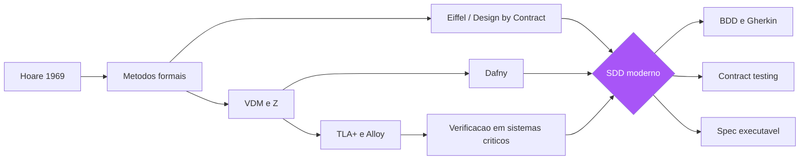

A metáfora do desenho técnico é precisa em um ponto que importa para toda a obra: o desenho técnico não abandonou o rigor — ele abandonou a exigência de que o rigor fosse matemático. A cota "distância entre pilares: 6 metros" é verificável: o fiscal chega com a trena e confere. Mas ler e conferir uma cota não exige geometria descritiva — exige uma convenção simples e universal. O SDD faz o mesmo com a intenção: transforma a regra de negócio em um cenário executável com entrada, ação e saída esperada — a cota do software — que qualquer pessoa do time pode escrever, ler e verificar, sem precisar ser matemática [19]. E quando o risco justifica, como na AWS com o TLA+, a tradição formal continua disponível como ferramenta de precisão para os problemas onde erro custa vidas ou bilhões — a geometria descritiva continua existindo, apenas não é mais exigida de todos.

## 4. Técnica

### Triplos de Hoare na prática: a ponte para os cenários

Comecemos pelo fundamento: traduzir um triplo de Hoare em um cenário de especificação executável. O triplo {P} C {Q} — "se P vale antes de C, Q vale depois" — é exatamente a estrutura Given-When-Then do BDD: Given corresponde a P (o contexto estabelecido), When corresponde a C (a ação executada) e Then corresponde a Q (o resultado esperado) [17]. Essa tradução é a chave para entender que BDD não é uma moda: é a forma acessível de uma ideia que a ciência da computação persegue há sessenta anos. Vamos ver isso com código real.

```python
"""Do triplo de Hoare ao cenário executável.

Demonstra a correspondencia {P} C {Q} -> Given-When-Then usando
contratos explicitos (pre-condicao, pos-condicao) no estilo
Design by Contract de Meyer.
"""

class Conta:
    """Conta bancaria com contrato explicito de saque."""

    def __init__(self, saldo: float) -> None:
        self._saldo = saldo

    @property
    def saldo(self) -> float:
        return self._saldo

    def sacar(self, valor: float) -> None:
        # PRE-CONDICAO (P): o chamador garante valor valido e saldo suficiente
        assert valor > 0, "valor de saque deve ser positivo"
        assert valor <= self._saldo, "saldo insuficiente para o saque"
        # (P tambem pode virar o Given do cenario de sucesso ou de falha)
        self._saldo -= valor
        # POS-CONDICAO (Q): a rotina garante o efeito prometido
        assert self._saldo >= 0, "saldo nunca deve ficar negativo"


# Traducao para Gherkin (correspondencia 1:1):
#   Given uma conta com saldo de R$ 100     -> P (contexto)
#   When o titular saca R$ 30              -> C (acao)
#   Then o saldo fica em R$ 70             -> Q (resultado)
def cenario_saque_sucesso() -> None:
    conta = Conta(100.0)              # Given
    conta.sacar(30.0)                 # When
    assert conta.saldo == 70.0        # Then
    print("cenario saque com sucesso: OK")


def cenario_saque_saldo_insuficiente() -> None:
    conta = Conta(50.0)               # Given
    try:
        conta.sacar(80.0)             # When (viola pre-condicao)
    except AssertionError:
        print("cenario saldo insuficiente: OK (contrato protegeu o estado)")
    else:
        raise SystemExit("FALHA: saque sem saldo nao deveria ser possivel")


if __name__ == "__main__":
    cenario_saque_sucesso()
    cenario_saque_saldo_insuficiente()
```

Note o que o contrato comprou para você: a pré-condição protege o objeto de estados inválidos sem código defensivo espalhado — o método sacar não precisa verificar "se valor for inválido, retorne erro" para cada combinação; ele declara o contrato e o sistema falha alto quando ele é violado [7]. E, crucialmente, cada cláusula do contrato vira diretamente um cenário de teste: o teste de sucesso exercita P e Q válidos; o teste de falha exercita P inválido e verifica que o contrato bloqueia [20].

### Implementando Design by Contract em linguagens do dia a dia

Eiffel é a única linguagem com DbC nativo, mas o padrão é implementável em qualquer linguagem que tenha asserções ou decoradores. Em Python, a abordagem idiomática usa decoradores que declaram os contratos de forma legível e centralizada:

```python
"""Design by Contract em Python via decoradores — contrato como cota da planta."""
from collections.abc import Callable
from typing import Any, ParamSpec, TypeVar

P = ParamSpec("P")
R = TypeVar("R")


def contrato(pre: Callable[..., bool] | None = None,
             pos: Callable[..., bool] | None = None) -> Callable[[Callable[P, R]], Callable[P, R]]:
    """Decorator que aplica pre e pos-condicoes sobre uma operacao.

    pre recebe os argumentos da chamada; pos recebe (resultado, *args).
    Falha alto em violacao — o contrato nunca e silencioso.
    """

    def decora(funcao: Callable[P, R]) -> Callable[P, R]:
        def com_contrato(*args: P.args, **kwargs: P.kwargs) -> R:
            if pre is not None:
                assert pre(*args, **kwargs), f"PRE-CONDICAO violada em {funcao.__name__}"
            resultado = funcao(*args, **kwargs)
            if pos is not None:
                assert pos(resultado, *args), f"POS-CONDICAO violada em {funcao.__name__}"
            return resultado
        return com_contrato
    return decora


def _pre_nao_negativo(valor: float) -> bool:
    return valor >= 0


def _pos_raiz_correta(raiz: float, valor: float) -> bool:
    return abs(raiz * raiz - valor) < 1e-9


@contrato(pre=_pre_nao_negativo, pos=_pos_raiz_correta)
def raiz_quadrada(valor: float) -> float:
    return valor ** 0.5


if __name__ == "__main__":
    assert raiz_quadrada(9.0) == 3.0      # contrato valido
    try:
        raiz_quadrada(-1.0)               # viola pre-condicao
    except AssertionError as erro:
        print(erro)
```

### TLA+ na prática: um modelo pequeno e verificável

Para sistemas distribuídos, onde o risco justifica o rigor, o TLA+ é a ferramenta da tradição formal que sobreviveu na indústria. Um modelo TLA+ descreve o estado inicial do sistema, as ações possíveis (fórmulas de transição) e as propriedades que devem sempre valer (invariantes) ou eventualmente valer (liveness). O model checker (TLC) explora o espaço de estados e encontra violações. Um exemplo clássico e mínimo é o modelo de um registro distribuído com um líder:

```tla
---- MODULE Lideranca ----
EXTENDS Naturals

VARIABLES lider, contador, vivo

Init == /\ lider \in 1..3
        /\ contador = 0
        /\ vivo = 1

ElegerNovoLider == /\ vivo = 0
                   /\ contador' = contador + 1
                   /\ lider' \in 1..3
                   /\ vivo' = 1

LiderCai == /\ vivo = 1
            /\ vivo' = 0
            /\ UNCHANGED <<lider, contador>>

Next == ElegerNovoLider \/ LiderCai

Invariante == \/ vivo = 0
              \/ contador > 0

Spec == Init /\ [][Next]_<<lider, contador, vivo>>
====
```

Este modelo expressa: existe um líder entre 1 e 3; o líder pode cair; um novo líder pode ser eleito; a invariante diz que, se há líder vivo, então houve pelo menos uma eleição. O TLC verifica automaticamente que a invariante vale em todos os estados alcançáveis — e se você remover a linha do contador, a verificação acusa a violação. É o habite-se formal: a máquina atesta que o modelo cumpre a planta [10][11]. A lição para o SDD é que esse rigor existe e está disponível — mas o seu custo de adoção (aprender TLA+, modelar abstrações) só se paga em sistemas onde a falha é inaceitavelmente cara, como protocolos de consenso, alocação de recursos ou sistemas financeiros de alto volume.

### A régua de proporcionalidade: quando cada nível de rigor se paga

A lição prática da tradição formal é a régua de proporcionalidade — o rigor deve ser proporcional ao risco, e o risco é função do custo de falha. Existe uma hierarquia de custo que orienta a escolha: para uma função utilitária sem estado, a asserção e o teste de exemplo bastam; para um fluxo de negócio com múltiplos estados, os cenários executáveis (Capítulos 3 e 4) são o nível adequado; para uma função crítica isolada, o contrato formal (DbC ou Dafny) agrega valor; e para um protocolo concorrente ou distribuído, o model checking (TLA+ ou Alloy) é a única ferramenta que cobre a classe de bugs que a interação temporal produz [14][15].

A régua de proporcionalidade tem uma consequência organizacional: o time precisa ser capaz de classificar seus módulos por criticidade e declarar, de forma explícita, qual nível de rigor cada módulo recebeu. A declaração explícita é o que impede dois fracassos simétricos: o rigor desnecessário (o CRUD modelado em TLA+, o custo que ninguém se beneficia) e o rigor insuficiente (o protocolo de pagamento implementado sem modelo, o incidente que a planta teria evitado). Quando a organização sabe, módulo por módulo, o que foi provado, o que foi verificado por cenários e o que foi apenas testado por exemplo, a tomada de decisão de risco fica honesta — e é essa honestidade que a tradição formal ensina ao SDD moderno [16].

### Da pré-história ao presente: o que o SDD resgatou e o que abandonou

A síntese que este capítulo prepara para o resto da obra: o SDD moderno resgatou da tradição formal três princípios e abandonou três práticas. Resgatou: (1) a especificação como artefato distinto do código, com autoridade própria — a planta existe antes do edifício; (2) a verificação como ato mecânico, não impressionista — o habite-se é executado, não declarado; e (3) o contrato como instrumento de responsabilização — pré-condição violada é culpa do chamador, e o sistema deve falhar alto, nunca silenciar [5][7]. Abandonou: (1) a exigência de formalismo matemático como pré-requisito para especificar — a Gherkin é a cota legível do desenho técnico; (2) a pretensão de especificar tudo a priori — o SDD especifica o essencial primeiro e evolui a planta com a obra; e (3) a separação entre especificação e execução — o SDD automatiza a verificação da planta, tornando-a viva (Capítulo 4) [25].

Essa síntese é o elo entre o Capítulo 2 e o resto da obra: a tradição formal não foi superada — foi democratizada. O triplo de Hoare virou o Given-When-Then; o Design by Contract virou as asserções dos cenários e os testes de contrato; e o model checking virou a exploração de contraexemplos que os exemplares do Capítulo 4 realizam de forma mais simples. A geometria descritiva da engenharia de software continua existindo para os problemas que exigem precisão total — e o desenho técnico, que você vai dominar nos próximos capítulos, tornou o rigor acessível a todos os engenheiros [17][18].

### Alloy: a verificação acessível de modelos estruturais

Entre o TLA+ (concorrência e tempo) e a análise informal, está o Alloy, que brilha na verificação de modelos estruturais — configurações, permissões, grafos de dependência. O Alloy Analyzer traduz o modelo em uma instância SAT e explora exaustivamente todos os cenários dentro de um escopo, exibindo contraexemplos para os fatos que você afirma serem verdadeiros [12]. A experiência de usar Alloy é quase terapêutica: você escreve o modelo do seu design, afirma uma propriedade que acredita, e o analisador responde "aqui está um cenário em que sua afirmação falha" — geralmente nos primeiros minutos. Essa capacidade de gerar contraexemplos é o que o SDD moderno resgatou de forma muito mais simples: um bom exemplo de teste é um contraexemplo potencial; escrever o exemplo antes do código é pedir o contraexemplo antes de construir [21].

## 5. Aplica

### A cena de contraste: o protocolo de consenso que nunca foi modelado

Você está em uma plataforma de mensageria que processa milhões de eventos por dia. A equipe de plataforma decidiu implementar um mecanismo de liderança para um serviço de filas — sem biblioteca externa, porque "o requisito é simples: um nó lidera, os outros seguem, e se o líder cair, alguém assume". O engenheiro sênior, com dez anos de experiência, desenha a solução de cabeça: cada nó tenta adquirir um lock no banco, o primeiro que consegue é o líder, e um heartbeat renovado a cada cinco segundos. Você, recém-chegado ao time e tendo acabado de ler sobre TLA+, pergunta: "modelamos isso antes de implementar?" A resposta é uma risada educada: "isso é simples, não precisa de matemática". Seis semanas depois, em produção, o incidente acontece: em uma partição de rede de trinta segundos, dois nós acreditam ser líderes simultaneamente — o famoso split-brain — e mensagens são processadas duas vezes, duplicando pagamentos de clientes [22].

O diagnóstico, doloroso, é o clássico das três barreiras: o time pulou a especificação porque o problema parecia simples, mas simplicidade percebida não é simplicidade real — o diabo estava na interação entre heartbeat, expiração de lock e particionamento, exatamente o tipo de bug de concorrência que revisão de código e testes unitários não pegam [23]. A correção naquele momento é emergencial: a equipe pára o serviço, reescreve a lógica com fencing tokens e espera de quarentena, e o incidente vira post-mortem. A correção estrutural, que você propõe e que a liderança aceita para o novo módulo, é a da planta: o protocolo de liderança é modelado em TLA+ antes da implementação, a invariante "nunca existe mais de um líder" é verificada formalmente, e o modelo vira a especificação de referência do código — qualquer mudança no protocolo passa a exigir a re-verificação do modelo [11]. O time descobre, surpreso, que modelar levou dois dias e encontrou dois bugs de design que teriam custado semanas em produção. O rigor formal não é para tudo — mas para o que é crítico, ele paga em horas o que custa em dias.

### Armadilhas comuns

As armadilhas desta tradição são conhecidas e evitáveis. A primeira é o rigor no lugar errado: especificar formalmente o CRUD de usuários enquanto o protocolo de pagamento é decidido no olho — a régua é proporcionalidade ao risco, e a maioria dos times a inverte. A segunda é o modelo que não acompanha o código: um TLA+ ou Alloy escrito uma vez e abandonado, que descreve um sistema que não existe mais — o modelo vira literatura, não planta; a disciplina de manter o modelo sincronizado com o código é parte do trabalho, não opcional [24]. A terceira é o desprezo pela tradição: times que tratam "métodos formais" como palavra de ordem de acadêmicos e perdem a lição central — que a especificação verificável é o único caminho para a confiança —, reinventando mal o que já foi resolvido. E a quarta é o extremo oposto: times que transformam a especificação formal em fetiche, escrevendo modelos para tudo e entregando nada, ignorando que a indústria comercial precisa de uma versão acessível do rigor — a qual o próximo capítulo começa a construir [25].

### A cultura do rigor: o que a tradição formal ensina sobre equipes

A tradição formal deixou um legado cultural tão importante quanto suas ferramentas: a cultura do rigor — o hábito de perguntar "o que exatamente você quer dizer?" e "como saberemos que está certo?" antes de aceitar qualquer afirmação sobre software [14][24]. Essa cultura é o que diferencia a especificação da opinião: o time com cultura do rigor não aceita "o sistema funciona" como resposta — pergunta "funciona para quais entradas, em quais estados, sob quais condições?". É a mesma disciplina da triagem do Capítulo 1 aplicada a todas as afirmações: nenhuma verdade sobre o sistema é aceita sem uma forma de verificá-la, e nenhuma regra de negócio é implementada sem uma forma de atestá-la [6].

A cultura do rigor se manifesta em três hábitos observáveis. Primeiro, o hábito do contraexemplo: diante de qualquer proposta de design ou regra, alguém pergunta "qual cenário quebraria isso?" — o mesmo instinto do Alloy, exercitado na conversa [12]. Segundo, o hábito da fronteira: toda regra é acompanhada da pergunta "qual o limite?" — o valor exato, o caso extremo, a combinação de condições, as bordas que a planta precisa capturar [17]. Terceiro, o hábito da evidência: toda correção é acompanhada de "como sabemos que está corrigido?" — o teste, o cenário ou a prova que atesta, em vez da confiança de quem corrigiu [16]. Os três hábitos são a herança mais valiosa que a pré-história da especificação deixou para o SDD moderno — e eles são treináveis, como qualquer hábito de engenharia, pelo exercício repetido em revisões e refinamentos [24].

### Métricas de sucesso e fracasso

Como saber se você está usando a tradição formal com sabedoria? Sucesso: os modelos existem exatamente onde o custo de falha é maior (pagamentos, concorrência, alocação de recursos); cada mudança crítica re-verifica o modelo antes de ir a produção; e o time tem pelo menos duas pessoas capazes de ler e editar os modelos. Fracasso: modelos bonitos que ninguém consegue alterar quando o sistema muda; verificação formal celebrada em um projeto-piloto e nunca aplicada ao que realmente importa; e o sintoma mais comum — a crença de que "testes são suficientes" para sistemas onde uma corrida fatal acontece uma vez a cada bilhão de execuções, justamente a classe de bugs que só a exploração exaustiva de modelos encontra [26].

A adoção pragmática dessa tradição segue um roteiro que o time pode executar em semanas, não anos. Primeiro, escolha um único módulo onde o custo de falha justifica o rigor — o exemplo canônico é a máquina de estados de um protocolo de pagamento, não o CRUD de cadastro. Segundo, escreva as pré-condições e pós-condições como asserções executáveis (assert no Python, contracts no Go, invariantes de classe no estilo Eiffel) antes de qualquer teste de unidade; o contrato passa a ser o primeiro consumidor do código, e cada chamada que viola o contrato falha rápido, no ponto da violação, em vez de produzir estado corrompido que explode três camadas adiante. Terceiro, registre no próprio SPEC do módulo os casos de borda que a exploração formal revelou, para que o conhecimento não morra com o modelo abandonado. Quarto, estabeleça o rito do relógio de parada: se o time não consegue provar uma propriedade em uma sessão de modelagem, registra a dúvida como dívida explícita e segue com o teste tradicional, documentando o risco residual no mesmo documento. O diagnóstico que separa a disciplina da ornamentação é simples: pergunte ao time qual invariante do sistema sobreviveu à última refatoração de produção — se ninguém sabe responder, os contratos existem no papel, não no código [26]. A experiência de campo mostra que times que adotam contratos executáveis com escopo cirúrgico reduzem a classe de defeitos de estado inconsistente e de integração na mesma proporção em que aumentam a confiança para refatorar: o contrato é a rede de segurança que torna a mudança estrutural barata. O próximo capítulo mostra como essa mesma disciplina de contrato desce do nível do módulo para o nível do comportamento de negócio, no formato Given-When-Then do BDD — a ponte entre a verificação matemática e a conversa com o dono do produto.

## 6. Conclusão

Neste capítulo, você percorreu a pré-história da especificação: a lógica de Hoare e os métodos formais (VDM, Z) que sonharam com a corretude axiomática [1][2][4]; o Design by Contract de Meyer, que transformou o contrato em ferramenta de engenharia embutida no código, com pré-condições, pós-condições e invariantes [5][7]; e os herdeiros modernos — TLA+ na AWS, Alloy e Dafny — que provaram que a verificação formal é viável onde o risco justifica [10][11][12][13]. Você também entendeu por que essa tradição não escalou: barreiras cultural, econômica e técnica que exigiam uma versão acessível do rigor. O desafio: identifique no seu sistema o componente mais crítico e escreva uma especificação formal mínima dele — mesmo que só para ver os contraexemplos que o Alloy encontra. No próximo capítulo, vamos ver como a indústria finalmente democratizou a planta: o BDD de Dan North, o formato Given-When-Then e o ATDD — o teste de aceitação como especificação executável que qualquer pessoa do time consegue escrever e verificar.

## 7. Referências Bibliográficas

[1] DIJKSTRA, Edsger W. *A Discipline of Programming*. Englewood Cliffs: Prentice Hall, 1976.
[2] HOARE, C. A. R. An Axiomatic Basis for Computer Programming. *Communications of the ACM*, v. 12, n. 10, p. 576-580, 1969.
[3] DIJKSTRA, Edsger W.; SCHOLTEN, Carel S. *Predicate Calculus and Program Semantics*. New York: Springer-Verlag, 1990.
[4] JONES, Cliff B. *Systematic Software Development Using VDM*. 2. ed. Englewood Cliffs: Prentice Hall, 1990.
[5] MEYER, Bertrand. *Object-Oriented Software Construction*. 2. ed. Upper Saddle River: Prentice Hall, 1997.
[6] SPIVEY, J. Michael. *The Z Notation: A Reference Manual*. 2. ed. Hemel Hempstead: Prentice Hall, 1992.
[7] MEYER, Bertrand. Applying Design by Contract. *IEEE Computer*, v. 25, n. 10, p. 40-51, 1992.
[8] HUNT, Andrew; THOMAS, David. *The Pragmatic Programmer: From Journeyman to Master*. Boston: Addison-Wesley, 1999.
[9] KEOGH, Liz. *ATDD vs. BDD, and a potted history of some related stuff*. 2011. Disponível em: https://lizkeogh.com/2011/06/27/atdd-vs-bdd-and-a-potted-history-of-some-related-stuff/. Acesso em: 5 ago. 2026.
[10] LAMPORT, Leslie. *Specifying Systems: The TLA+ Language and Tools for Hardware and Software Engineers*. Boston: Addison-Wesley, 2002.
[11] NEWCOMBE, Chris et al. How Amazon Web Services Uses Formal Methods. *Communications of the ACM*, v. 58, n. 4, p. 66-73, 2015.
[12] JACKSON, Daniel. *Software Abstractions: Logic, Language, and Analysis*. Cambridge: MIT Press, 2006.
[13] LEINO, K. Rustan M. Dafny: An Automatic Program Verifier for Functional Correctness. In: *LPAR-16 — Logic for Programming, Artificial Intelligence, and Reasoning*. Berlin: Springer, 2010. p. 348-370.
[14] HALL, Anthony. Seven Myths of Formal Methods. *IEEE Software*, v. 7, n. 5, p. 11-19, 1990.
[15] BOWEN, Jonathan; HINCHEY, Michael. Ten Commandments of Formal Methods. *IEEE Computer*, v. 28, n. 4, p. 56-63, 1995.
[16] CLARKE, Edmund M.; EMERSON, E. Allen; SISTLA, A. Prasad. Automatic Verification of Finite-State Concurrent Systems Using Temporal Logic Specifications. *ACM Transactions on Programming Languages and Systems*, v. 8, n. 2, p. 244-263, 1986.
[17] NORTH, Dan. *Introducing BDD*. Dan North & Associates, 2006. Disponível em: https://dannorth.net/introducing-bdd/. Acesso em: 5 ago. 2026.
[18] ADZIC, Gojko. *Specification by Example: How Successful Teams Deliver the Right Software*. Shelter Island: Manning Publications, 2011.
[19] FOWLER, Martin. *Specification by Example* (bliki). Disponível em: https://martinfowler.com/bliki/SpecificationByExample.html. Acesso em: 5 ago. 2026.
[20] BECK, Kent. *Test-Driven Development: By Example*. Boston: Addison-Wesley, 2002.
[21] ADZIC, Gojko. *Specification by Example, 10 years later*. 2020. Disponível em: https://gojko.net/2020/03/17/sbe-10-years.html. Acesso em: 5 ago. 2026.
[22] KLEPPMANN, Martin. *Designing Data-Intensive Applications: The Big Ideas Behind Reliable, Scalable, and Maintainable Systems*. Sebastopol: O'Reilly Media, 2017.
[23] LAMPORT, Leslie. *The Part-Time Parliament*. ACM Transactions on Computer Systems, v. 16, n. 2, p. 133-169, 1998.
[24] PARNAS, David L. Software Aging. In: *Proceedings of the 16th International Conference on Software Engineering (ICSE)*. New York: IEEE, 1994. p. 279-287.
[25] ADZIC, Gojko. *Living Documentation: Continuous Knowledge Sharing by Design*. Boston: Addison-Wesley, 2017.
[26] OFFUTT, Jeff. Mutation Testing for the New Century. In: *Mutation Testing for the New Century*. Norwell: Kluwer, 2001. p. 1-10.

# PARTE II — A Planta: especificação como contrato executável

# Capítulo 3: BDD e ATDD: o teste de aceitação como planta

## 1. Introdução

No Capítulo 2, você viu a tradição formal de especificação — rigorosa, poderosa e inacessível para o cotidiano comercial. Agora vamos ver como a indústria democratizou a planta: no início dos anos 2000, Dan North criou o Behavior-Driven Development (BDD), uma reformulação do TDD que trocou a linguagem dos testes pela linguagem do comportamento, e que deu origem ao formato Given-When-Then hoje usado por mais de 70% das equipes que adotam especificação por exemplos [1]. Neste capítulo, você vai aprender o que é o BDD de verdade (e o que ele não é), como o ATDD (desenvolvimento orientado por testes de aceitação) se relaciona com ele, e como o ciclo red-green-refactor se aplica a cenários de negócio em vez de funções isoladas. Ao final, você será capaz de transformar uma conversa de refinamento em um arquivo de especificação executável que seu time inteiro consegue ler — e que sua máquina consegue verificar.

## 2. Explica

### O insight fundador: a linguagem é o problema

Dan North chegou ao BDD por um caminho prático: tentando ensinar TDD a uma equipe, ele percebeu que a palavra "teste" era o obstáculo. Quando você diz "escreva os testes primeiro", o programador ouve "escreva a validação técnica primeiro" — e se pergunta "validar o quê? o sistema ainda não existe". Quando você diz "descreva o comportamento que o sistema deve ter", a conversa muda: agora o foco é o que o sistema faz, não como verificar o que ele faz [2]. Esse deslocamento semântico, aparentemente sutil, é a fundação do BDD: escrever cenários em linguagem de domínio, legível por não-programadores, que ao mesmo tempo servem como especificação, como testes e como documentação. O ensaio clássico de North, "BDD is like TDD if...", argumenta que o TDD funciona perfeitamente quando o time é composto só por programadores e um especialista de domínio; quando entram analistas, testadores e múltiplos stakeholders, a comunicação quebra — e o BDD é a resposta para essa quebra [3].

Você vai perceber que o BDD formalizou essa ideia em três perguntas que guiam toda conversa de especificação: "o que acontece quando?" (comportamento), "quando?" (contexto e gatilho) e "o que deveria acontecer?" (resultado esperado). Dessas três perguntas nasceu o formato Given-When-Then: Given estabelece o contexto (o estado do mundo antes da ação), When descreve a ação ou evento, Then declara o resultado observável [4]. A escolha das palavras não é arbitrária: "Given" e "When" estão no tempo verbal do passado e do presente, ancorando a descrição em eventos concretos em vez de abstrações; "Then" abre o futuro imediato da asserção. Essa gramática — a Gherkin — é deliberadamente restrita, e é essa restrição que a torna executável [5].

### BDD não é só testes: é conversa, especificação e documentação

A compreensão mais comum e mais errada do BDD é reduzi-lo a "testes com a palavra dado/quando/então". O BDD, na prática estabelecida pela comunidade, é um processo de três momentos — Descoberta, Formulação e Automação — conhecido como o "loop de três amigos" (product owner, desenvolvedor e testador sentados juntos) [6]. Na Descoberta, o time explora o comportamento desejado com exemplos concretos, antes de qualquer código; na Formulação, os exemplos são capturados em cenários legíveis (Gherkin); na Automação, os cenários são conectados a código de passo (step definitions) que os tornam executáveis. O erro de reduzir BDD a automação é grave porque descarta os dois primeiros momentos — que são exatamente os que resolvem o problema da intenção perdida do Capítulo 1 [7].

O ATDD (Acceptance Test-Driven Development) é primo próximo, com uma ênfase ligeiramente diferente: enquanto o BDD foca no comportamento e na linguagem compartilhada, o ATDD foca em escrever os testes de aceitação — os critérios que definem quando uma história está pronta — antes da implementação, e em usar esses testes como o contrato de entrega [8]. Na prática, as duas disciplinas convergem: o ATDD usa frequentemente a Gherkin para expressar seus testes de aceitação, e o BDD usa testes de aceitação automatizados para verificar seus cenários. A distinção útil para você, engenheiro, é de ênfase: BDD pergunta "que comportamento o sistema deve ter?", ATDD pergunta "como sabemos que a história está pronta?" — ambas respondem com especificações executáveis escritas antes do código [9].

### O ciclo red-green-refactor, agora em cenários

O TDD de Kent Beck ensinou o ciclo: escreva um teste que falha (red), escreva o código mínimo que o faz passar (green), refatore mantendo o verde [10]. O BDD aplica o mesmo ciclo, mas o "teste" agora é um cenário de comportamento — e o ciclo ganha uma dimensão extra: o cenário deve falhar primeiro não apenas porque o código não existe, mas porque o comportamento não existe. A diferença prática é onde você olha quando o vermelho aparece: no TDD, o vermelho indica que a função não implementa a lógica; no BDD, o vermelho indica que o sistema não entrega o comportamento que o negócio pediu — e pode indicar também que a própria especificação está errada, o que é uma informação ainda mais valiosa [11].

Note a consequência sutil desse ciclo: quando os cenários são a planta, o código deixa de ser a fonte da verdade e passa a ser uma implementação da planta. Isso inverte o fluxo de autoridade que a maioria dos times internalizou: não é mais o código que "define o comportamento" com a documentação correndo atrás; é a especificação executável que define o comportamento, e o código que é corrigido quando diverge [12]. Esse é o coração do SDD: a planta manda, o canteiro obedece, e o habite-se (a suíte de cenários) atesta a conformidade. Nos próximos capítulos você verá como essa inversão de autoridade se materializa em artefatos, ferramentas e pipelines; aqui, o essencial é internalizar o princípio.

### A Gherkin como linguagem de especificação

A Gherkin é a linguagem da planta. Suas palavras-chave estruturais são: Feature (a funcionalidade), Scenario (um comportamento específico), Given/When/Then/And/But (os passos), Background (passos comuns a todos os cenários da feature), Scenario Outline (cenário parametrizado) e Examples (a tabela de dados do outline) [5]. A gramática é propositalmente limitada: ela não pretende descrever "como", apenas "o quê" — e é essa limitação que a torna legível por humanos e interpretável por máquinas. Uma feature bem escrita é uma planta de engenharia: qualquer pessoa do time a lê e entende o que será construído; a suíte de automação a executa e atesta o que foi construído; e, se o sistema mudar sem a feature mudar, o habite-se falha — acusando a divergência [13].

```gherkin
# linguagem: pt
Funcionalidade: Saque em conta corrente
  Como um correntista
  Eu quero sacar dinheiro da minha conta
  Para pagar minhas despesas em dinheiro

  Cenário: Saque com saldo suficiente
    Dado uma conta corrente com saldo de R$ 100
    Quando o correntista saca R$ 30
    Então o saldo da conta deve ser R$ 70
    E um comprovante de saque deve ser emitido

  Cenário: Saque sem saldo suficiente
    Dado uma conta corrente com saldo de R$ 50
    Quando o correntista tenta sacar R$ 80
    Então o saque deve ser recusado
    E uma mensagem de saldo insuficiente deve ser exibida

  Cenário: Saque de valor inválido
    Dado uma conta corrente com saldo de R$ 100
    Quando o correntista tenta sacar R$ 0
    Então o saque deve ser recusado
    E uma mensagem de valor inválido deve ser exibida
```

Note o que essa feature faz, além de descrever três cenários: ela captura a regra de negócio do saque de forma completa e confrontável — sucesso, falha por saldo, falha por valor. Qualquer ambiguidade que existisse na conversa original ("e se o valor for zero?" "e se não tiver saldo?") foi resolvida aqui, no papel, antes do canteiro. É exatamente isso que a planta faz pela construção civil: força as perguntas certas antes de a fundação ser cavada [14].

## 3. Ilustra

Voltemos à construtora da nossa obra. No Capítulo 1, vimos o caos do prédio sem planta. Agora, o engenheiro-chefe contratou um arquiteto (o Product Owner) que passou a escrever, com cada encarregado de andar, um "contrato de andar": um documento curto descrevendo, para cada cômodo, o que deve existir e como se comporta — "o banheiro do segundo andar deve ter box de vidro de 1,20m, piso antiderrapante e ducha"; "a cozinha do térreo deve ter exaustão, ponto de gás a 0,40m do chão e bancada de 0,90m de altura". Cada contrato é curto, concreto, verificável. E — este é o ponto — o engenheiro-chefe pede a cada encarregado que, antes de começar a obra, confira o contrato com uma trena no papel: "dado o cômodo de 3x4m, quando posiciono a bancada a 0,90m, então sobra 0,60m de circulação". As discrepâncias entre o que o cliente imaginou e o que o contrato diz aparecem na conferência, não na obra pronta.

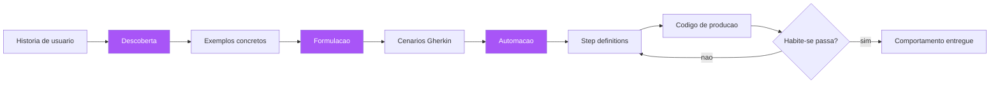

O contrato de andar é a feature Gherkin: curta, concreta, em linguagem de domínio, verificável. A conferência com a trena é o ciclo red-green-refactor: os cenários rodam antes do código e falham; o código os faz passar; e qualquer mudança futura no andar é vistoriada contra o contrato. O papel dos três amigos — arquiteto, encarregado e fiscal (PO, dev e QA) — é o que garante que a planta nasça da conversa, não da imaginação solitária de um deles [6]. Você, como Engenheiro de Software, vai reconhecer o padrão: as reuniões de refinamento do seu time já são a Descoberta — o que falta é transformá-las em Formulação (cenários escritos) e Automação (cenários executáveis), em vez de terminar a reunião com "está claro, pode começar a desenvolver" [15].

## 4. Técnica

### Do refinamento à feature: o passo a passo dos três momentos

O processo prático começa na reunião de refinamento. No momento da Descoberta, o time deve sair da conversa com exemplos — não com um entendimento implícito. A técnica mais eficaz: para cada história, peça "um exemplo de quando isso acontece" e "um exemplo de quando isso dá errado". Cada par de exemplos é um candidato a cenário. Na Formulação, esses exemplos viram Gherkin — e aqui está a disciplina: ninguém escreve Gherkin sozinho; o trio (PO, dev, QA) escreve junto, porque cada um enxerga uma ambiguidade diferente [16]. Na Automação, os cenários são conectados a step definitions — e é nesse momento que a especificação vira código verificável, como veremos abaixo.

```python
"""Automacao BDD com pytest-bdd: cenarios Gherkin viram testes executaveis.

Instale: pip install pytest-bdd
Estrutura:
  tests/features/saque.feature  (a planta, escrita pelo trio)
  tests/features/steps/saque_steps.py  (a automacao)
"""
from pytest_bdd import given, when, then, scenarios, parsers

from conta import Conta

# Carrega todos os cenarios da feature
scenarios("../features/saque.feature")


@given(parsers.parse("uma conta corrente com saldo de R$ {saldo:d}"))
def conta_com_saldo(saldo: int) -> None:
    """Pre-condicao (Given): estabelece o contexto do cenario."""
    # pylint: disable=unused-import
    import conta as _conta
    _conta._ATUAL = Conta(float(saldo))


@when(parsers.parse("o correntista saca R$ {valor:d}"))
def correntista_saca(valor: int) -> None:
    """Acao (When): dispara o comportamento sob teste."""
    import conta as _conta
    _conta._ATUAL.sacar(float(valor))


@then(parsers.parse("o saldo da conta deve ser R$ {saldo:d}"))
def saldo_deve_ser(saldo: int) -> None:
    """Resultado (Then): verifica a pos-condicao observavel."""
    import conta as _conta
    assert _conta._ATUAL.saldo == float(saldo)


@then("o saque deve ser recusado")
def saque_recusado() -> None:
    import conta as _conta
    assert _conta._ULTIMO_ERRO is not None


@then(parsers.parse("uma mensagem de {mensagem} deve ser exibida"))
def mensagem_exibida(mensagem: str) -> None:
    import conta as _conta
    assert _conta._ULTIMA_MENSAGEM == mensagem
```

### A implementação que satisfaz a planta

Agora o código de produção que faz os cenários passarem — escrito depois da feature, e guiado por ela. Note como a implementação é mínima: não há lógica extra, não há "vamos aproveitar e fazer também X" — a planta manda, o canteiro obedece [12].

```python
"""conta.py — implementacao minima que satisfaz a feature saque.feature."""

class SaldoInsuficienteError(Exception):
    """Lancada quando o saque excede o saldo disponivel."""


class ValorInvalidoError(Exception):
    """Lancada quando o valor de saque e invalido (zero ou negativo)."""


class Conta:
    def __init__(self, saldo: float) -> None:
        self.saldo = saldo

    def sacar(self, valor: float) -> None:
        if valor <= 0:
            raise ValorInvalidoError("valor invalido")
        if valor > self.saldo:
            raise SaldoInsuficienteError("saldo insuficiente")
        self.saldo -= valor
```

E o harness que conecta as exceções às mensagens do cenário:

```python
"""harness.py — traduz as excecoes de dominio para as mensagens da planta."""
import conta as _conta


def inicializar() -> None:
    _conta._ATUAL = None
    _conta._ULTIMO_ERRO = None
    _conta._ULTIMA_MENSAGEM = ""


def processar_saque(valor: float) -> tuple[bool, str]:
    """Executa o saque e devolve (sucesso, mensagem) no vocabulario da feature."""
    try:
        _conta._ATUAL.sacar(valor)
        return True, ""
    except _conta.ValorInvalidoError:
        return False, "valor invalido"
    except _conta.SaldoInsuficienteError:
        return False, "saldo insuficiente"
```

### A descoberta na prática: transformando conversa em exemplos

O momento da Descoberta é onde o BDD ganha ou perde. Na prática, a reunião de refinamento tem uma estrutura que maximiza a produção de exemplos. Comece com a história e uma única pergunta ao PO: "qual o exemplo mais comum de uso desta funcionalidade?" — a resposta vira o primeiro cenário feliz. Em seguida, a pergunta que vale ouro: "qual o exemplo de uso que daria errado?" — a resposta vira o primeiro cenário de borda. E então a terceira pergunta, que a maioria dos times nunca faz: "o que acontece se o usuário fizer isso fora de ordem, duas vezes, ou pela metade?" — as respostas são as bordas que a planta precisa capturar e que a implementação nunca decidiria sozinha [16].

A disciplina da descoberta tem um anti-padrão clássico: transformar a reunião em apresentação. O PO apresenta a funcionalidade em slides, o time ouve, ninguém pergunta, e a reunião termina com "está claro?" — o simulacro de descoberta que produz zero exemplos. A técnica que quebra esse padrão é a regra do quadro: nenhuma reunião de descoberta termina sem que o quadro tenha pelo menos três exemplos escritos, cada um no formato "entrada → saída esperada". Se o quadro está vazio, a reunião não terminou — por mais que o relógio diga que sim [14][21].

E há um detalhe sutil sobre quem escreve os exemplos: o PO descreve o comportamento, mas o time técnico escreve os exemplos no quadro, em voz alta, devolvendo ao PO "então você está dizendo que...?". Esse eco — a paráfrase em formato de exemplo — é o mecanismo que expõe a divergência de interpretação antes do código. Quando o PO corrige o exemplo, a planta é desenhada; quando o PO aceita, a planta é aprovada na hora. É o mesmo mecanismo do eco na construção civil: o engenheiro repete o pedido do cliente em cota, e o cliente corrige o que ouviu errado — no papel, não no concreto [20].

### A formulação e a automação: o detalhe dos passos

A Formulação — transformar os exemplos do quadro em Gherkin — tem regras de qualidade que separam a planta da decoração. Primeira: um cenário descreve UM comportamento — se o cenário tem dois Then contraditórios ou três ações independentes, ele deve ser dividido. Segunda: os passos devem ser declarativos, não imperativos de UI — "o correntista saca R$ 30" e não "o usuário clica no botão de saque e digita 30 no campo" — porque o passo declarativo sobrevive à mudança de interface, e o imperativo quebra a cada redesign (a mesma razão pela qual a planta não especifica a marca do parafuso: especifica a resistência). Terceira: o vocabulário dos passos é a linguagem ubíqua — o termo do cenário é o termo do domínio, o mesmo usado no código e no glossário (Capítulo 5) [19][22].

A Automação — conectar os passos ao código — tem uma regra de ouro sobre a granularidade dos steps: os step definitions devem ser finos, reutilizáveis e parametrizados. Um step definition genérico demais esconde a lógica na automação (a planta deixa de ser a fonte da verdade); um específico demais gera uma floresta de mapeamentos duplicados (o custo de manutenção explode). A régua: se o mesmo passo aparece em duas features com o mesmo significado, ele é reutilizável e deve ser compartilhado; se dois passos têm o mesmo texto e significados diferentes, a linguagem ubíqua falhou — e a correção é no vocabulário, não no código de automação [23].

### Triagem do vermelho: spec quebrada vs código quebrado

Um dos superpoderes do BDD bem executado é a triagem do vermelho. Quando um cenário falha em CI, a primeira pergunta não é "qual linha de código está errada?" — é "qual dos dois divergiu: a planta ou o edifício?" A disciplina de triagem funciona assim: se o cenário descreve um comportamento que o negócio de fato pediu e o código não entrega, é bug de implementação — o código deve ser corrigido. Se o cenário descreve um comportamento que o negócio não pediu, ou pediu diferente, é bug de especificação — a feature deve ser corrigida, e o time precisa conversar com o PO antes de mudar o código [17]. Essa distinção, aplicada de forma consistente, muda a cultura do time: o vermelho deixa de ser "alguém errou" e passa a ser "a planta e o edifício divergiram — vamos descobrir qual é a verdade".

```bash
# Pipeline minimo de habite-se BDD (CI)
# 1) Instala dependencias
pip install -r requirements-dev.txt
# 2) Roda os cenarios (a planta executavel)
pytest tests/features --strict-markers -q
# 3) Se qualquer cenario falhar, o habite-se NAO e concedido:
#    exit code != 0 bloqueia o merge na branch principal
```

### Quando o BDD não é a ferramenta certa

É importante marcar as fronteiras: BDD não é para tudo. A especificação em cenários é ótima para comportamento de negócio observável — regras de cálculo, fluxos, políticas — e é fraca para requisitos que são intrínsecamente técnicos, como "a resposta deve vir em menos de 50ms no p99" ou "o algoritmo deve escalar para 10 milhões de itens" — esses são requisitos de performance ou capacidade, melhor expressos como contratos de infraestrutura ou benchmarks, não como cenários Gherkin [18]. Também é contraproducente usar BDD para descrever detalhes internos de implementação — cenários que falam de classes, métodos ou variáveis violam o propósito da linguagem de domínio e criam especificações frágeis que quebram a cada refatoração interna [19]. A régua: se a frase do cenário não puder ser entendida por uma pessoa de negócio, ela não pertence à planta — pertence ao código.

## 5. Aplica

### A cena de contraste: o refinamento que virou especificação

Você é tech lead de um time de seis pessoas em um marketplace. Nas últimas três sprints, a história de "cancelamento de pedido" foi estimada, planejada e entregue — mas, na revisão, o PO diz a frase fatal: "não era isso que eu queria". O cancelamento deveria reembolsar o cliente, devolver o estoque e notificar o vendedor — o sistema faz tudo isso, mas somente até o pedido ser despachado; o PO queria que o cliente pudesse cancelar até 24h após o despacho, com taxa de reembolso parcial. O time implementou a interpretação literal ("cancelamento só antes do despacho") porque era o que estava escrito na história — "permitir cancelamento de pedido" — e ninguém perguntou o que acontecia depois do despacho. Seu instinto, como o de qualquer engenheiro, é "vamos ajustar o sistema e adicionar o caso do despacho". E é exatamente aqui que você deve parar [20].

O diagnóstico: o problema não foi a implementação — foi a ausência de planta. A história "permitir cancelamento de pedido" é uma instrução, não uma especificação: ela delega ao implementador todas as decisões de borda (e se despachou? e se já pagou? e se foi entregue?). Na próxima sprint, você reúne o trio — PO, dev, QA — e, no refinamento, força a conversa com exemplos: "dê-me um exemplo de cancelamento que deve funcionar"; "dê-me um exemplo de cancelamento que deve ser recusado". Das respostas nascem quatro cenários Gherkin, incluindo o caso do despacho com 24h e o caso do pedido já entregue. A história é reestimada com a planta; a implementação passa a ser guiada pelos cenários; e a revisão de sprint deixa de ser "o sistema faz o que você pediu?" para ser "os cenários que você aprovou estão todos verdes?" — o habite-se da sprint [21].

### Armadilhas comuns

As armadilhas do BDD são conhecidas e merecem uma lista. A primeira é o Gherkin decorativo: escrever cenários em formato Gherkin, mas tão vagos que não são executáveis de verdade — "Dado um usuário qualquer", "Quando ele usa o sistema", "Então tudo funciona" — isso é especificação de fachada, e é pior que nada porque dá segurança falsa [22]. A segunda é a automação sem descoberta: pular os dois primeiros momentos do loop e pedir ao desenvolvedor que "escreva testes BDD" sozinho — o resultado é uma planta escrita por quem constrói, sem a conversa que elimina a ambiguidade. A terceira é o excesso de granularidade: centenas de cenários que reescrevem o mesmo comportamento com variações mínimas, criando uma suíte frágil e cara de manter — a planta certa tem poucos cenários, cada um com significado distinto [23]. A quarta é o step definition golias: passo genérico demais ("o usuário executa a ação") que esconde a lógica no código de automação — se a lógica de negócio vaza para os steps, a planta deixou de ser a fonte da verdade. E a quinta é esquecer que cenário que não roda em CI não é especificação — é literatura.

### O BDD e a conversa que nunca termina

Um dos equívocos sobre o BDD é tratá-lo como um evento — a reunião de descoberta aconteceu, a feature foi escrita, e pronto. A prática madura trata o BDD como uma conversa contínua: os cenários são o ponto de apoio permanente da conversa entre negócio e tecnologia, e cada revisão de sprint, cada incidente, cada mudança de regra reabre a conversa sobre os cenários existentes [6][16]. O PO que propõe uma regra nova não "informa" o time — ele propõe uma mudança na planta, e a conversa gira em torno dos cenários afetados: quais mudam, quais ficam, quais são novos. Essa conversa contínua é o que mantém a planta viva (Capítulo 4) e o que impede o BDD de virar um ritual de formulação sem descoberta [7][15].

A conversa contínua tem um formato prático: a revisão da feature como parte da definição de pronto. Antes de uma história ser considerada concluída, o PO revisa os cenários da feature — não o código — e confirma que os cenários descrevem o comportamento que ele pediu, e que todos estão verdes [21][24]. Essa revisão substitui a demonstração manual (o "deixa eu te mostrar como funciona") pela verificação da planta (o "estes são os comportamentos que você aprovou, e estes são os resultados da execução"). A mudança de formato é profunda: a demonstração mostra o que alguém lembrou de mostrar; a revisão de cenários mostra tudo o que foi especificado, incluindo as bordas — e a diferença é exatamente o que separa a confiança anedótica da confiança verificável [12][22].

### Métricas de sucesso e fracasso

Como medir a adoção do BDD? Sucesso: a proporção de histórias que chegam ao desenvolvimento com pelo menos um cenário executável aprovado pelo PO cresce mês a mês; a taxa de rejeição na revisão de sprint ("não era isso") cai; e o tempo médio entre "pedi o comportamento" e "o comportamento está especificado e verde" se estabiliza em poucos dias. Fracasso: cenários que ninguém lê, features que só o dev entende, vermelho que não gera conversa (o time corrige o código sem questionar a planta), e a métrica mais reveladora — quando perguntam ao PO "como sabemos que o sistema está pronto?", ele responde "pergunte ao time", em vez de apontar para a suíte verde [24]. Se o PO não usa a planta para atestar o habite-se, a planta não está funcionando.

Para chegar a esse ponto, o time precisa vencer três batalhas de adoção, na ordem. A primeira é a batalha do exemplo inicial: escolha uma história pequena mas real — nada de tutorial sintético — e escreva os cenários com o PO na mesma sala, em uma hora, sem escrever uma linha de código; o objetivo é provar que a conversa muda, não produzir artefato perfeito. A segunda é a batalha da linguagem: proíba jargão técnico dentro dos cenários e estabeleça a regra de ouro de que cada passo Given/When/Then precisa ser legível por um não-técnico; se um cenário precisa de um comentário explicando o que significa, ele está errado — reescreva o cenário, não o comentário. A terceira é a batalha do vermelho: combine com o time que um cenário vermelho dispara conversa (o fluxo de descoberta recomeça) e não correção cega de código; o vermelho é o termômetro da divergência entre a planta e o edifício, e apagá-lo sem conversar é como calar o alarme de incêndio em vez de apagar o fogo. O indicador operacional de maturidade é a taxa de reescrita: quando a proporção de cenários que mudam durante o desenvolvimento cai, a descoberta está acontecendo antes da construção, e o BDD deixou de ser uma cerimônia para ser o mecanismo de contrato da obra. Times maduros relatam um efeito colateral inesperado e valioso: o backlog fica mais enxuto, porque histórias cujos cenários não conseguem ser escritos em trinta minutos revelam requisitos fantasma que antes só apareciam na revisão de sprint — e a cada cenário descartado cedo, a obra economiza uma rodada inteira de retrabalho [24].

## 6. Conclusão

Neste capítulo, você aprendeu o núcleo do BDD: o insight de Dan North de que a linguagem é o problema — trocar "teste" por "comportamento" e escrever cenários em linguagem de domínio [2][3]; a gramática Gherkin (Given-When-Then) que tornou a especificação legível e executável [5]; o loop de três momentos — Descoberta, Formulação e Automação — que faz do BDD um processo de conversa, não uma técnica de teste [6]; a relação entre BDD e ATDD [8]; e o ciclo red-green-refactor aplicado a cenários, com a triagem entre spec quebrada e código quebrado [11][17]. O desafio: na próxima reunião de refinamento do seu time, saia dela com pelo menos um cenário Gherkin escrito pelo trio, mesmo que seja curto. No próximo capítulo, vamos aprofundar a Descoberta com a Specification by Example de Gojko Adzic — a arte de transformar exemplos concretos em especificações que valem mil reuniões, e a documentação viva que nunca apodrece.

## 7. Referências Bibliográficas

[1] ADZIC, Gojko. *Specification by Example: How Successful Teams Deliver the Right Software*. Shelter Island: Manning Publications, 2011.
[2] NORTH, Dan. *Introducing BDD*. Dan North & Associates, 2006. Disponível em: https://dannorth.net/introducing-bdd/. Acesso em: 5 ago. 2026.
[3] NORTH, Dan. *BDD is like TDD if...* Dan North & Associates, 2006. Disponível em: https://dannorth.net/blog/bdd-is-like-tdd-if/. Acesso em: 5 ago. 2026.
[4] NORTH, Dan. *What's in a Story?* Dan North & Associates, 2007. Disponível em: https://dannorth.net/whats-in-a-story/. Acesso em: 5 ago. 2026.
[5] CUCUMBER. *Gherkin Reference*. Cucumber Documentation. Disponível em: https://cucumber.io/docs/gherkin/reference/. Acesso em: 5 ago. 2026.
[6] SMART, John Ferguson. *BDD in Action: Behavior-Driven Development for the Whole Software Lifecycle*. Shelter Island: Manning Publications, 2014.
[7] ADZIC, Gojko. *Living Documentation: Continuous Knowledge Sharing by Design*. Boston: Addison-Wesley, 2017.
[8] KEOGH, Liz. *ATDD vs. BDD, and a potted history of some related stuff*. 2011. Disponível em: https://lizkeogh.com/2011/06/27/atdd-vs-bdd-and-a-potted-history-of-some-related-stuff/. Acesso em: 5 ago. 2026.
[9] KEOGH, Liz. *Behaviour Driven Development*. Disponível em: https://lizkeogh.com/behaviour-driven-development/. Acesso em: 5 ago. 2026.
[10] BECK, Kent. *Test-Driven Development: By Example*. Boston: Addison-Wesley, 2002.
[11] NORTH, Dan. *Dan North & Associates — blog*. Disponível em: https://dannorth.net. Acesso em: 5 ago. 2026.
[12] FOWLER, Martin. *Specification by Example* (bliki). Disponível em: https://martinfowler.com/bliki/SpecificationByExample.html. Acesso em: 5 ago. 2026.
[13] WYNNE, Matt; HELLESØY, Aslak. *The Cucumber Book: Behaviour-Driven Development for Testers and Developers*. 2. ed. Raleigh: Pragmatic Bookshelf, 2017.
[14] COHN, Mike. *User Stories Applied: For Agile Software Development*. Boston: Addison-Wesley, 2004.
[15] ADZIC, Gojko. *Specification by Example, 10 years later*. 2020. Disponível em: https://gojko.net/2020/03/17/sbe-10-years.html. Acesso em: 5 ago. 2026.
[16] CHEEK, Gaspar Nagay; HALES, Matt. *The BDD Books: Discovery*. Leanpub, 2019.
[17] SMART, John Ferguson. *The BDD Books: Formulation*. Leanpub, 2018.
[18] MARTIN, Robert C. *Agile Software Development: Principles, Patterns, and Practices*. Upper Saddle River: Prentice Hall, 2002.
[19] EVANS, Eric. *Domain-Driven Design: Tackling Complexity in the Heart of Software*. Boston: Addison-Wesley, 2003.
[20] WEINBERG, Gerald M. *Quality Software Management: Systems Thinking*. New York: Dorset House, 1992.
[21] SCHWABER, Ken; SUTHERLAND, Jeff. *The Scrum Guide: The Definitive Guide to Scrum*. 2020. Disponível em: https://scrumguides.org. Acesso em: 5 ago. 2026.
[22] ADZIC, Gojko. *Bridging the Communication Gap: Specification by Example and Agile Acceptance Testing*. London: Neuri Consulting, 2009.
[23] KEOGH, Liz. *The M-C-M'. 2011. Disponível em: https://lizkeogh.com/2011/06/13/the-m-c-m/. Acesso em: 5 ago. 2026.
[24] HUMMEL, Richard; HELTBERG, Rose. *The BDD Books: Automation*. Leanpub, 2020.

# Capítulo 4: Specification by Example: exemplares que valem mil reuniões

## 1. Introdução

No Capítulo 3, você aprendeu o BDD como processo de conversa: Descoberta, Formulação e Automação, com a Gherkin como linguagem da planta. Agora vamos mergulhar no coração da Descoberta — a arte de transformar exemplos concretos em especificações. Esta é a contribuição central de Gojko Adzic, que estudou dezenas de equipes de alta performance e destilou as práticas comuns no livro Specification by Example (2011) e, mais tarde, em Living Documentation (2017) [1][2]. Você vai aprender por que um exemplo concreto vale mais que mil regras abstratas, como funciona o pipeline de descoberta colaborativa em cinco passos, e por que a documentação viva — aquela que nunca desatualiza porque é executada a cada entrega — resolve o problema secular da documentação que apodrece. Ao final, você será capaz de conduzir uma oficina de descoberta que produz exemplares em vez de ata de reunião.

## 2. Explica

### O exemplo como unidade fundamental de especificação

A premissa da Specification by Example (SBE) é desconcertantemente simples: regras abstratas são ambíguas; exemplos concretos não são. A frase "o frete é grátis para pedidos acima de R$ 100" parece clara — até que alguém pergunta: "e se o pedido tiver exatamente R$ 100?"; "e se o cupom de desconto fizer o total cair para R$ 95?"; "e se metade do pedido for cancelada?" Cada pergunta expõe uma borda que a regra abstrata não cobre. Agora compare com o exemplar: "pedido de R$ 150, sem cupom, CEP da capital → frete grátis"; "pedido de R$ 95, após cupom de R$ 10 sobre R$ 105 → frete pago". O exemplar não deixa espaço para interpretação: ele é um caso concreto com entrada e saída esperada [1]. A pesquisa de Adzic em equipes de alta performance encontrou um padrão consistente: as equipes que entregavam o software certo na primeira vez não dependiam de requisitos mais completos, mas de exemplos mais numerosos e mais precisos — e a prática de escrever exemplos antes do código era o diferencial comum [3].

Você vai perceber que o exemplo funciona porque ele força a concretude. Uma regra abstrata pode ser aprovada por inércia — "parece razoável"; um exemplo tem que ser verificado — "isso está certo?" — e é nessa verificação que a ambiguidade morre [4]. O exemplo também tem a propriedade de ser falsificável: se o sistema processar o exemplo de forma diferente da esperada, alguém está errado — o sistema ou a expectativa — e a divergência é visível imediatamente. Uma regra abstrata, em contraste, pode ser "interpretada" de forma diferente por cada leitor sem que ninguém perceba. Essa propriedade de falsificabilidade é o que torna o exemplo uma especificação executável: ele pode ser transformado em um teste que passa ou falha, sem julgamento humano [5].

### Os cinco passos do pipeline SBE

Adzic consolidou o processo de SBE em cinco atividades, que ele chama de pipeline: (1) colaboração para obter exemplos, (2) captura e cristalização dos exemplos em uma linguagem única, (3) automação dos exemplos em testes executáveis, (4) validação contínua da automação — fazer os testes falharem quando o comportamento divergir, e (5) evolução da suíte de exemplos — revisar, podar e expandir os exemplos conforme o sistema evolui [1][6]. Cada atividade tem sua disciplina: a colaboração exige a conversa dos três amigos (PO, dev, QA) com foco em casos de borda; a captura exige a linguagem ubíqua — um vocabulário único para o domínio (ver Capítulo 5); a automação exige que os exemplos sejam conectados a código que os execute; a validação exige que a suíte rode continuamente em CI; e a evolução exige que os exemplos sejam tratados como ativos vivos, não como documentos congelados [7].

Note como esse pipeline inverte a lógica do desenvolvimento tradicional. No fluxo tradicional, a conversa produz um documento de requisitos, o documento é "traduzido" para código, e o código é testado — a verificação acontece no fim, e a distância entre conversa e código é preenchida por interpretação. No pipeline SBE, a conversa produz exemplos, os exemplos são cristalizados em uma linguagem única (a planta), a planta é automatizada em testes, e o código é escrito para satisfazer os testes — a verificação acontece ao longo de todo o caminho, e a distância entre conversa e código é preenchida por execução [8]. É a diferença entre construir um prédio e depois verificar se ele está de pé, e verificar cada andar à medida que ele é construído.

### O custo de não ter exemplos: o software certo entregue errado

O fracasso mais caro da engenharia de software é entregar, com perfeição técnica, o sistema errado. Adzic documenta o mecanismo desse fracasso: sem exemplos, cada membro do time constrói sua própria interpretação do requisito, e o sistema final é um mosaico de interpretações divergentes — cada peça implementada corretamente segundo quem a escreveu, e o conjunto incoerente do ponto de vista do negócio [1][9]. Os testes unitários não detectam esse problema porque cada teste verifica a interpretação local de quem o escreveu; a integração não detecta porque cada módulo "funciona" isoladamente; e o usuário só descobre na entrega, quando é tarde demais. Os exemplos mudam isso porque eles capturam o comportamento esperado ANTES de existir qualquer interpretação local — a planta é desenhada por todos juntos, antes de cada um construir seu andar [10].

### Documentação viva: o antídoto para o apodrecimento

Todo time conhece o cemitério de documentos: wikis com seções obsoletas, especificações de três anos atrás que ninguém atualizou, manuais que descrevem um sistema que não existe mais. Adzic chama esse fenômeno de documentação morta — e diagnostica sua causa raiz: documentação escrita separada do código e nunca verificada contra ele inevitavelmente apodrece, porque manter dois artefatos sincronizados é trabalho manual, e trabalho manual é esquecido [2]. A solução é a documentação viva: documentação que é executada como parte do processo de entrega — se o comportamento do sistema diverge do que a documentação afirma, a documentação "falha" e bloqueia a entrega. A feature Gherkin do Capítulo 3 é o exemplo perfeito: ela é ao mesmo tempo especificação, teste e documentação — e, como é executada em CI, ela não pode mentir sobre o comportamento do sistema [11].

A documentação viva resolve o problema de sincronização por construção: em vez de dois artefatos que precisam ser mantidos iguais (código e docs), existe um único artefato com duas funções (spec executável que documenta e verifica). Isso não significa que toda documentação deve ser executável — diagramas de arquitetura, decisões e guias de operação continuam tendo seu lugar — mas significa que a documentação do comportamento do sistema deve ser executável [2][12]. Quando alguém pergunta "como funciona o cálculo de frete?", a resposta não é um documento separado, é a feature executável que descreve e verifica o cálculo — e qualquer pessoa pode confiar nela porque ela roda a cada merge.

## 3. Ilustra

Voltemos à construtora. O arquiteto (PO) aprendeu que contratos de andar descritos em regras abstratas geram disputas: "piso antiderrapante" significa uma coisa para o encarregado que compra porcelanato e outra para o que compra cerâmica. Ele adota uma nova disciplina: toda regra abstrata no contrato deve vir acompanhada de um exemplar — um cômodo de referência com medidas exatas. "Piso antiderrapante" vira "o banheiro 1, de 2x3m com box de 1,20m, deve usar o piso A3 do catálogo, assentado com juntas de 2mm". Quando o fornecedor entrega um piso com coeficiente de atrito diferente do A3, a conferência — o habite-se — reprova na hora, não depois de o banheiro estar pronto e escorregadio. Os exemplares funcionam porque são verificáveis contra o mundo real: você consegue conferir se o piso entregue é o A3, mas não consegue conferir se "antiderrapante" foi interpretado como o arquiteto imaginou.

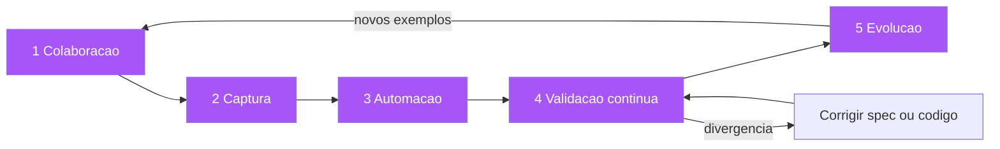

O exemplar do piso A3 é exatamente o que um exemplo de teste faz pelo software: ele ancora a regra abstrata em um caso concreto verificável. E a lição mais importante da metáfora é sobre o catálogo de pisos — a biblioteca de exemplares. Na construtora, os exemplares bem-sucedidos de um prédio são reaproveitados no próximo: o banheiro padrão que funcionou vira referência. No software, os exemplos de teste de um módulo são a documentação viva do módulo: o próximo desenvolvedor não precisa perguntar "como funciona?" — ele lê os exemplares, que são executáveis e portanto verdadeiros [13]. Você, como Engenheiro de Software, conhece a experiência de herdar um código sem documentação: o valor de um exemplar bem escrito nessa hora é incalculável — é a diferença entre entender o comportamento pelo código (lento, ambíguo) e entendê-lo pela especificação executável (rápido, confiável).

## 4. Técnica

### Conduzindo uma oficina de descoberta com exemplos

A oficina de descoberta (o momento 1 do pipeline) é uma reunião estruturada com um objetivo único: produzir uma lista de exemplos concretos. A estrutura recomendada tem quatro fases. Na fase de contexto, o PO apresenta a funcionalidade em duas frases e o time identifica as regras de negócio envolvidas — sem discutir soluções. Na fase de exemplos, o facilitador pergunta "me dê um exemplo de um caso que deve funcionar" e "um exemplo de um caso que deve ser recusado", registrando cada exemplo em um quadro com o formato "entrada → saída esperada"; é aqui que as bordas aparecem — os "e se...?" que a regra abstrata esconde [14]. Na fase de triagem, o time classifica os exemplos em três grupos: essenciais (cobrem o comportamento central), borda (cobrem limites e exceções) e ruído (casos que não agregam informação — cortados sem dó). Na fase de fechamento, a lista de exemplos essenciais e de borda é revisada em voz alta, com o PO confirmando cada um, e vira a matéria-prima da formulação Gherkin.

```python
"""Oficina de descoberta: quadro de exemplos com triagem automatica.

Roda a triagem dos exemplos coletados na oficina e gera o rascunho
da feature Gherkin. Use ao final de cada sessao de descoberta.
"""
from dataclasses import dataclass


@dataclass
class Exemplo:
    descricao: str
    entrada: str
    saida_esperada: str
    tipo: str = "essencial"  # "essencial" | "borda" | "ruido"


EXEMPLOS = [
    Exemplo("pedido de 150 sem cupom", "R$ 150", "frete gratis"),
    Exemplo("pedido de 95 apos cupom", "R$ 95", "frete pago"),
    Exemplo("pedido de exatamente 100", "R$ 100", "frete gratis (limite inclui)"),
    Exemplo("pedido cancelado apos frete", "R$ 0", "regra indefinida — perguntar ao PO"),
]


def triar(exemplos: list[Exemplo]) -> dict[str, list[Exemplo]]:
    grupos: dict[str, list[Exemplo]] = {"essencial": [], "borda": [], "ruido": []}
    for ex in exemplos:
        grupos[ex.tipo].append(ex)
    return grupos


def gerar_feature(exemplos: list[Exemplo]) -> str:
    linhas = ["Funcionalidade: Frete", "  Como um comprador online",
              "  Eu quero saber o custo do frete", "  Para decidir minha compra"]
    for i, ex in enumerate(exemplos, start=1):
        if ex.tipo == "ruido":
            continue
        linhas += [f"  Cenário: {ex.descricao}",
                   f"    Dado um pedido de {ex.entrada}",
                   f"    Quando calculo o frete",
                   f"    Então o frete deve ser {ex.saida_esperada}"]
    return "\n".join(linhas)


if __name__ == "__main__":
    grupos = triar(EXEMPLOS)
    for tipo, itens in grupos.items():
        print(f"{tipo}: {len(itens)} exemplo(s)")
    print(gerar_feature(EXEMPLOS))
```

### Da tabela de exemplos ao Scenario Outline

O padrão mais poderoso da formulação Gherkin é o Scenario Outline com tabela de Examples: um único cenário parametrizado que executa N exemplares. É a representação natural dos exemplos da oficina — a tabela é o quadro da oficina, transformado em artefato executável [15].

```gherkin
# linguagem: pt
Funcionalidade: Regra de frete com limiar
  Como um comprador online
  Eu quero que o frete seja gratuito acima de um valor
  Para aumentar meu ticket médio

  Esquema do Cenário: Frete pelo valor do pedido
    Dado um pedido com valor de <valor>
    Quando calculo o frete
    Então o frete deve ser <frete>

    Exemplos:
      | valor | frete         |
      | 150   | gratuito      |
      | 100   | gratuito      |
      | 99.99 | pago          |
      | 95    | pago (após cupom) |
      | 0     | pago (pedido vazio inválido) |
```

A tabela de Examples é onde o exemplar brilha: cada linha é um caso concreto, cada célula é verificável, e a suíte executa todos eles. Repare como a tabela força a decisão das bordas — o valor exatamente 100 (limite incluído) aparece explicitamente, resolvendo a ambiguidade que a regra "acima de R$ 100" deixaria aberta [16]. Essa é a diferença entre regra e exemplar: a regra deixa a borda para a imaginação; a tabela de exemplos a torna visível e decidida.

### Automação dos exemplos: do quadro ao teste verde

A terceira etapa do pipeline conecta os exemplos à automação. Com o pytest-bdd (ou Cucumber, SpecFlow — ver Capítulo 7), os exemplos da tabela viram casos executáveis:

```python
"""Automacao da feature de frete: exemplos da tabela viram testes."""
from pytest_bdd import given, when, then, scenarios, parsers

from frete import calcular_frete

scenarios("../features/frete.feature")


@given(parsers.parse("um pedido com valor de {valor:g}"))
def pedido_com_valor(valor: float) -> None:
    # pylint: disable=unused-import
    import frete as _frete
    _frete._PEDIDO = {"valor": valor, "cupom": None}


@when("calculo o frete")
def calcula_frete() -> None:
    import frete as _frete
    pedido = _frete._PEDIDO
    _frete._RESULTADO = calcular_frete(pedido["valor"], pedido["cupom"])


@then(parsers.parse("o frete deve ser {frete}"))
def frete_deve_ser(frete: str) -> None:
    import frete as _frete
    assert _frete._RESULTADO == frete
```

E o código de produção mínimo que satisfaz a tabela:

```python
"""frete.py — regra de frete com limiar, satisfazendo a feature frete.feature."""

LIMIAR_FRETE_GRATIS = 100.0


def calcular_frete(valor_pedido: float, cupom: float | None = None) -> str:
    """Frete gratuito para valor >= 100; caso contrario, 'pago'.

    A borda do limiar (>= 100) esta decidida na tabela Examples da feature.
    """
    valor_final = valor_pedido - (cupom or 0.0)
    if valor_final <= 0:
        return "pago (pedido vazio inválido)"
    return "gratuito" if valor_final >= LIMIAR_FRETE_GRATIS else "pago"
```

### A colaboração que produz bons exemplos: o papel de cada um

A qualidade dos exemplares depende da colaboração, e cada papel do trio tem uma contribuição específica e um erro específico. O PO contribui com o conhecimento do domínio — as regras reais, os casos de negócio, as bordas que o produto enfrenta; o erro do PO é responder no abstrato ("o frete é grátis acima de 100") em vez de dar exemplos ("na semana passada, um cliente com cupom de 5 no pedido de 101 reclamou do frete"). O desenvolvedor contribui com o conhecimento do sistema — o que é tecnicamente possível, os estados existentes, os efeitos colaterais; o erro do desenvolvedor é responder com solução ("a gente pode adicionar um campo flag") em vez de com exemplo ("e se o pedido tiver cupom? o frete é sobre o quê?"). E o QA contribui com o pensamento de borda — os casos excepcionais, as combinações, as sequências; o erro do QA é antecipar demais ("e se o servidor cair? e se o banco estiver fora?") e desviar a oficina do domínio para a infraestrutura [14][16].

O facilitador tem o papel mais difícil: manter a oficina produzindo exemplos e não argumentos. A técnica do facilitador é a repetição da pergunta: sempre que alguém propõe uma regra abstrata, o facilitador devolve "me dá um exemplo"; sempre que alguém propõe uma solução técnica, devolve "qual comportamento isso produz?"; sempre que alguém discute duas interpretações, devolve "qual exemplo as distingue?". A oficina termina quando o quadro tem exemplos suficientes para que duas pessoas do time, lendo-os, concordem sobre o comportamento — e a métrica da oficina é essa concordância, não o número de post-its [1][6].

### Do exemplo ao artefato: o formato dos exemplares no repositório

Os exemplares produzidos na oficina merecem um formato no repositório que os preserve e os conecte aos artefatos derivados. A prática recomendada: um arquivo de exemplares por funcionalidade, versionado ao lado da feature, no formato "entrada → saída esperada → razão" — a razão documenta POR QUE aquele exemplo é uma decisão de borda (o que ele distingue), e é essa razão que evita que a tabela vire ruído na revisão futura [22]. O arquivo de exemplares é o elo entre a oficina (Capítulo 5) e a formulação Gherkin: a tabela de Examples da feature é gerada (ou conferida) contra ele, e qualquer divergência entre exemplares e cenários é um sinal de que alguém mudou o comportamento sem mudar a planta.

O formato prático do arquivo de exemplares: um cabeçalho com a funcionalidade e a data da oficina; uma tabela com as colunas exemplo, entrada, saída esperada, borda (sim/não) e razão; e uma seção de decisões pendentes — os exemplos que a oficina não conseguiu decidir e que foram levados ao PO (a regra de ouro: exemplo sem decisão não entra na feature; entra na lista de pendências e trava a aprovação da spec). Essa disciplina — exemplar sem decisão bloqueia a planta — é o que impede a oficina de produzir exemplos bonitos com bordas indefinidas, que é exatamente o problema que o Capítulo 1 diagnosticou [21].

### Evolução da suíte: podar, expandir, revisar

O quinto passo do pipeline é o mais negligenciado e o mais importante para a longevidade: a evolução da suíte de exemplos. As regras práticas: quando um bug é encontrado em produção, o exemplo que o reproduz deve ser adicionado à suíte — o bug vira um exemplar que impede a regressão [17]; quando um exemplo nunca falha e nunca é citado em discussões, ele é candidato a ruído — podar mantém a suíte enxuta e legível; quando a regra de negócio muda, os exemplos afetados são revisados com o PO — a mudança de comportamento começa pela mudança da planta, nunca do código [18]. A suíte de exemplos é um organismo vivo: cresce com os bugs encontrados, encolhe com os exemplos obsoletos, e muda com as regras — e é exatamente isso que a impede de apodrecer.

## 5. Aplica

### A cena de contraste: a promoção que quebrou o caixa

Você é engenheiro em um e-commerce que está lançando uma promoção: "frete grátis para pedidos acima de R$ 100". A regra é comunicada por e-mail, estimada em uma linha ("muda um limiar no cálculo de frete") e implementada em vinte minutos. Na primeira hora da promoção, o time de fraudes te chama: há um padrão estranho de pedidos — clientes comprando um item de R$ 101, usando um cupom de R$ 5, e o sistema calculando... frete grátis. "Mas o pedido final é R$ 96!", diz a analista. "O e-mail diz acima de R$ 100 — R$ 96 não está acima". Você olha o código e vê: o limiar é aplicado ao valor bruto do pedido, antes do cupom. Metade do time acha que o certo é aplicar sobre o valor final; a outra metade, sobre o bruto. Ninguém sabe — porque a regra, na forma de e-mail, não definiu nem o que é "valor do pedido", nem o caso do cupom, nem o caso do limiar exato. A promoção é suspensa, o prejuízo é contabilizado, e o time se pergunta como algo tão "simples" virou um incidente [19].

O diagnóstico: a regra abstrata ("acima de R$ 100") era uma instrução, não uma especificação — ela não definia as bordas (limiar exato), as interações (cupom) nem o vocabulário ("valor do pedido" = bruto ou final?). A correção estrutural é o pipeline SBE: a promoção é reescrita como uma feature com tabela de Examples — o valor 100 exato, o caso do cupom que derruba para 96, o caso do pedido vazio, o caso de desconto percentual — e o PO confirma cada linha da tabela antes de o código ser tocado [20]. A tabela vira o contrato da promoção: a implementação é ajustada para satisfazê-la, a suíte roda em CI, e quando o marketing lançar a próxima promoção, ela começará pela planta — não pelo e-mail. O incidente vira o primeiro exemplar da suíte: "pedido de 101 com cupom de 5 → frete pago", impedindo a regressão para sempre.

### Armadilhas comuns

As armadilhas do SBE são sutis. A primeira é o exemplar falso: exemplos que parecem concretos mas não são verificáveis — "Dado um cliente premium" sem definir o que é premium; se a definição não está no exemplo, o exemplo não é uma especificação, é uma regra com fantasia [21]. A segunda é a oficina sem o PO: a descoberta que acontece só entre desenvolvedores produz exemplos da interpretação do time — a planta desenhada por quem constrói, sem o dono do domínio para atestar. A terceira é a tabela inflada: dezenas de linhas que variam apenas um número irrelevante, transformando a suíte em ruído; a régua é que cada linha deve representar uma decisão de borda distinta — se duas linhas não podem falhar uma sem a outra, uma delas é redundante [22]. A quarta é confundir exemplos de teste unitário com exemplares de negócio: os exemplares falam o vocabulário do domínio (pedido, frete, cupom), não o vocabulário do código (método, objeto, exceção) — a planta é para o negócio ler, não para o framework. E a quinta é o pipeline incompleto: times que fazem a descoberta e a formulação mas não automatizam — a planta existe, mas ninguém a executa; sem execução, ela apodrece como qualquer documento.

### A economia dos exemplos: por que menos reuniões produzem mais entendimento

A Specification by Example produz um efeito econômico que merece ser nomeado: ela comprime o tempo de entendimento. Uma reunião tradicional de refinamento termina com um entendimento implícito, que cada participante guarda na própria cabeça — e o entendimento é decomposto e divergente. Uma oficina de descoberta bem conduzida termina com exemplos no quadro, que são públicos, concretos e compartilhados — o entendimento é um só artefato, visível a todos [1][6]. A diferença é a mesma entre dizer a um grupo "vamos construir uma ponte" e mostrar a planta da ponte: o grupo que viu a planta discute a ponte; o grupo que só ouviu a frase discute interpretações diferentes da mesma frase [18].

O efeito de compressão tem três manifestações mensuráveis. Primeira: o tempo de refinamento cai — as reuniões seguintes partem dos exemplos existentes, em vez de re-discutir o que os exemplos já decidiram [1]. Segunda: o tempo de implementação cai — o desenvolvedor não precisa inferir as bordas, porque as bordas estão na tabela de exemplos [5]. Terceira: o tempo de revisão cai — a revisão compara a implementação com os exemplos, e a divergência é visível imediatamente [8]. A economia dos exemplos é a explicação de por que as equipes estudadas por Adzic entregavam o software certo mais rápido: não por trabalharem mais, mas por gastarem o entendimento uma vez, no lugar certo — no exemplo, em vez de na interpretação repetida [3][9].

### Métricas de sucesso e fracasso

Sucesso no SBE: a suíte de exemplos cresce organicamente a partir de bugs reais (cada incidente vira um exemplar); o PO consegue ler e corrigir a tabela de exemplos sem ajuda técnica; e o tempo de entender uma funcionalidade legada cai — um novo desenvolvedor lê os exemplares e sabe o comportamento esperado em minutos. Fracasso: exemplares que só o time técnico entende; tabelas que ninguém revisa quando a regra muda (a planta fica congelada enquanto o prédio muda); e a métrica mais triste — quando um bug de produção é aberto e alguém diz "mas não estava na especificação", e a resposta do time é "ninguém atualizou a especificação" em vez de "vamos adicionar o exemplar e corrigir a planta" [23].

Construir essa cultura exige disciplina de curadoria, e a curadoria tem regras práticas. A primeira: todo exemplar precisa carregar seu contexto — a regra de negócio que ele ilustra, o caso nominal e o caso de borda, e o nome da pessoa que o validou; um exemplar sem contexto é uma citação sem fonte, vira ruído na próxima revisão. A segunda: a suíte de exemplos tem dono e ritmo de revisão — o PO revê a tabela de exemplos a cada iteração de negócio, não quando o time lembra; exemplares que descrevem regras mortas são removidos com o mesmo cuidado com que são adicionados, senão a planta acumula cômodos que o prédio nunca teve. A terceira: exemplares e código evoluem na mesma revisão — a regra prática é que nenhum pull request de mudança de comportamento pode existir sem o exemplar correspondente atualizado no mesmo diff; quando essa regra vale, a rastreabilidade planta→prédio é automática e o custo de manutenção do conhecimento despenca. A quarta: o incidente é a matéria-prima — cada bug de produção vira um exemplar na próxima segunda-feira, e a métrica de saúde da suíte é a razão entre exemplares nascidos de incidente e exemplares nascidos de planejamento; suítes alimentadas só por planejamento tendem a descrever o mundo imaginado, não o mundo real [23]. O efeito composto dessa disciplina é o que Adzic chama de especificação viva: a planta que se mantém verdadeira porque é executada e corrigida continuamente, em vez de ser um documento que se desatualiza no instante em que é assinado.

## 6. Conclusão

Neste capítulo, você aprendeu a Specification by Example de Gojko Adzic: que o exemplo concreto é a unidade fundamental de especificação, porque é verificável e falsificável, enquanto a regra abstrata é ambígua por natureza [1][3]; o pipeline em cinco passos — colaboração, captura, automação, validação contínua e evolução — que transforma conversas em especificações executáveis [1][6]; e a documentação viva, que resolve o apodrecimento da documentação ao torná-la executada e portanto verdadeira [2][11]. Você também viu as ferramentas: a tabela de Examples do Scenario Outline, a automação com pytest-bdd e a evolução da suíte a partir de bugs reais. O desafio: pegue a próxima funcionalidade do seu backlog e conduza uma oficina de descoberta de 30 minutos, saindo dela com pelo menos uma tabela de exemplos confirmada pelo PO. No próximo capítulo, vamos completar a matéria-prima da planta: a linguagem ubíqua do Domain-Driven Design, o event storming como oficina de descoberta, e como user stories com critérios de aceitação viram especificação — o vocabulário que torna os exemplares possíveis.

## 7. Referências Bibliográficas

[1] ADZIC, Gojko. *Specification by Example: How Successful Teams Deliver the Right Software*. Shelter Island: Manning Publications, 2011.
[2] ADZIC, Gojko. *Living Documentation: Continuous Knowledge Sharing by Design*. Boston: Addison-Wesley, 2017.
[3] ADZIC, Gojko. *Specification by Example, 10 years later*. 2020. Disponível em: https://gojko.net/2020/03/17/sbe-10-years.html. Acesso em: 5 ago. 2026.
[4] ADZIC, Gojko. *Bridging the Communication Gap: Specification by Example and Agile Acceptance Testing*. London: Neuri Consulting, 2009.
[5] FOWLER, Martin. *Specification by Example* (bliki). Disponível em: https://martinfowler.com/bliki/SpecificationByExample.html. Acesso em: 5 ago. 2026.
[6] ADZIC, Gojko. *Impact Mapping: Making a Big Impact with Software Products and Projects*. Woking: Provoking Thoughts, 2012.
[7] SMART, John Ferguson. *BDD in Action: Behavior-Driven Development for the Whole Software Lifecycle*. Shelter Island: Manning Publications, 2014.
[8] ADZIC, Gojko. *The Secret of Living Documentation*. Gojko.net, 2017. Disponível em: https://gojko.net/2017/10/01/the-secret-of-living-documentation.html. Acesso em: 5 ago. 2026.
[9] ADZIC, Gojko. *Fifty Quick Ideas to Improve Your Tests*. Woking: Provoking Thoughts, 2015.
[10] COHN, Mike. *Succeeding with Agile: Software Development Using Scrum*. Boston: Addison-Wesley, 2009.
[11] WYNNE, Matt; HELLESØY, Aslak. *The Cucumber Book: Behaviour-Driven Development for Testers and Developers*. 2. ed. Raleigh: Pragmatic Bookshelf, 2017.
[12] KEOGH, Liz. *Behaviour Driven Development*. Disponível em: https://lizkeogh.com/behaviour-driven-development/. Acesso em: 5 ago. 2026.
[13] EVANS, Eric. *Domain-Driven Design: Tackling Complexity in the Heart of Software*. Boston: Addison-Wesley, 2003.
[14] BRANDOLINI, Alberto. *Introducing EventStorming*. Leanpub, 2014.
[15] CUCUMBER. *Gherkin Reference*. Cucumber Documentation. Disponível em: https://cucumber.io/docs/gherkin/reference/. Acesso em: 5 ago. 2026.
[16] NORTH, Dan. *What's in a Story?* Dan North & Associates, 2007. Disponível em: https://dannorth.net/whats-in-a-story/. Acesso em: 5 ago. 2026.
[17] OFFUTT, Jeff. *Mutation Testing for the New Century*. Norwell: Kluwer, 2001.
[18] ADZIC, Gojko. *Specification by Example at Scale*. Gojko.net, 2012. Disponível em: https://gojko.net/2012/09/04/specification-by-example-at-scale.html. Acesso em: 5 ago. 2026.
[19] WEINBERG, Gerald M. *Quality Software Management: Systems Thinking*. New York: Dorset House, 1992.
[20] SCHWABER, Ken; SUTHERLAND, Jeff. *The Scrum Guide: The Definitive Guide to Scrum*. 2020. Disponível em: https://scrumguides.org. Acesso em: 5 ago. 2026.
[21] KEOGH, Liz. *The M-C-M'. 2011. Disponível em: https://lizkeogh.com/2011/06/13/the-m-c-m/. Acesso em: 5 ago. 2026.
[22] MARTIN, Robert C. *Clean Code: A Handbook of Agile Software Craftsmanship*. Upper Saddle River: Prentice Hall, 2008.
[23] ADZIC, Gojko. *The Gift of Time*. Gojko.net, 2011. Disponível em: https://gojko.net/2011/10/01/the-gift-of-time.html. Acesso em: 5 ago. 2026.

# Capítulo 5: Linguagem ubíqua e descoberta colaborativa: DDD, event storming e critérios de aceitação

## 1. Introdução

No Capítulo 4, você aprendeu que a Specification by Example transforma conversas em exemplares executáveis — mas há um pré-requisito silencioso: todos os participantes da conversa precisam falar a mesma língua. É exatamente esse o tema deste capítulo: a matéria-prima da planta. Você vai aprender o conceito de linguagem ubíqua do Domain-Driven Design de Eric Evans, que estabelece um vocabulário único compartilhado entre negócio e tecnologia [1]; a técnica de descoberta colaborativa do event storming criada por Alberto Brandolini, que produz essa linguagem em horas em vez de meses [2]; e a ponte entre user stories, critérios de aceitação e Definition of Done — o ponto onde a conversa vira especificação executável [3]. Ao final, você saberá como conduzir a oficina de descoberta que alimenta os exemplares do Capítulo 4 com a matéria-prima certa.

## 2. Explica

### A linguagem ubíqua: o vocabulário que unifica o time

Eric Evans introduziu o conceito de linguagem ubíqua no livro Domain-Driven Design, em 2003, com uma observação que parece óbvia e é profunda: o time de software não fala a língua do negócio, e o negócio não fala a língua do time [1]. O negócio diz "devolução", "chargeback", "estornar"; o time diz "rollback", "refund", "update status". Essas diferenças não são triviais — cada uma delas é uma fronteira onde a intenção pode se perder. A linguagem ubíqua é a resposta disciplinada: um vocabulário único, deliberadamente construído, usado em TODOS os artefatos — conversas, histórias, código, testes, documentação — sem tradução. O termo é o mesmo em todas as camadas: se o negócio chama "estorno", o código chama `estorno`, a classe chama `Estorno`, o cenário Gherkin fala de estorno, e o campo no banco se chama `estorno` [1][4].

Você vai perceber que a linguagem ubíqua não é um glossário de parede — é uma prática viva. Ela nasce da conversa (a modelagem colaborativa), é consolidada em um modelo de domínio (o mapa dos conceitos e suas relações), e é continuamente ajustada quando se descobre que dois termos diferentes significam a mesma coisa (ambigüidade) ou que o mesmo termo significa duas coisas diferentes (polissemia) [5]. O glossário resultante é um dos artefatos mais valiosos da planta: ele define o vocabulário em que os exemplares vão ser escritos, e sem ele a Specification by Example produz exemplos que o negócio não reconhece — e que portanto não validam nada [6].

### O event storming: a oficina que produz a linguagem

O event storming, criado por Alberto Brandolini, é a técnica de descoberta colaborativa que materializa a linguagem ubíqua em sessões intensas e guiadas. O ponto de partida é uma sala com uma parede coberta de papel, post-its de várias cores e um grupo heterogêneo — especialistas de negócio, desenvolvedores, QA, operações. O facilitador propõe uma pergunta de partida ("como um pedido é processado hoje?") e o grupo narra o processo em eventos de domínio — post-its laranja, cada um com uma frase no passado: "pedido criado", "pagamento aprovado", "estoque reservado", "pedido expedido" [2]. A regra de ouro: eventos, não etapas — a conversa flui sobre o que aconteceu, não sobre o que o sistema "faz", porque eventos são fatos incontestáveis do domínio, enquanto etapas são interpretações de quem as nomeia [7].

A partir dos eventos, o grupo adiciona as camadas: comandos (post-its azuis — "reservar estoque", "aprovar pagamento"), atores (post-its amarelos — "cliente", "fraudes", "transportadora"), políticas e regras (post-its roxos — "se pagamento recusado, então pedido cancelado"), e, por fim, os agregados e bounded contexts que agrupam os conceitos (post-its verdes) [8]. O resultado em poucas horas é um mapa visual completo do fluxo de negócio, com TODAS as bordas, exceções e regras expostas na parede — e, mais importante, uma linguagem acordada: quando o grupo usa duas palavras para o mesmo evento, a divergência aparece na parede e é resolvida ali [9]. O event storming é a Descoberta do loop BDD em esteróides: ele não produz um exemplo — produz o mapa inteiro onde os exemplos vivem.

### O que o DDD ensina à especificação: o modelo de domínio como planta

O DDD contribui para a especificação muito além do vocabulário. Seu conceito central é o modelo de domínio: uma representação estruturada dos conceitos, regras e relações do negócio, que serve de referência para todo o design [1]. Para a especificação, isso significa que antes de escrever cenários, o time deve ter clareza sobre o modelo — quais são as entidades (conceitos com identidade e ciclo de vida), os value objects (conceitos descritivos sem identidade), os agregados (grupos de consistência transacional) e os bounded contexts (fronteiras onde um conceito tem um significado único) [10]. Cada cenário Gherkin exercita o modelo; cada termo do cenário deve ser um termo do modelo; e quando o cenário revela uma inconsistência no modelo, é o modelo que muda — não o cenário que contorna [11].

O bounded context merece destaque porque é a fonte mais comum de bugs de especificação: o mesmo termo tem significados diferentes em contextos diferentes [10]. "Pedido" no contexto de vendas tem um ciclo de vida; no contexto de logística, outro; no contexto financeiro, outro ainda. Uma especificação que não declara seu contexto produz o clássico desastre: o time de vendas "aprovando pedidos" que a logística considera "não expedíveis". A disciplina do DDD: cada contexto tem sua linguagem e suas regras; a especificação declara o contexto no início da feature; e os cenários falam a linguagem daquele contexto, sem misturar vocabulários [12].

### De user stories a critérios de aceitação

A ponte final entre conversa e especificação é a user story e seus critérios de aceitação. A user story, no formato padrão de Connextra "Como [papel], eu quero [funcionalidade], para [benefício]", é um cartão de intenção — um lembrete para a conversa, não uma especificação [3]. O que transforma a story em planta são os critérios de aceitação: as condições observáveis que definem quando a história está pronta, escritas de forma verificável — e, na prática madura, como cenários Gherkin [13]. A qualidade da story é governada pelo acrônimo INVEST: Independent (não acoplada), Negotiable (negociável), Valuable (valiosa), Estimable (estimável), Small (pequena) e Testable (testável) — e é exatamente o "T" de Testable que conecta a story ao SDD: uma história sem critérios testáveis não é uma história, é um desejo [14].

O Definition of Done (DoD) completa o quadro: a lista de condições que toda história deve satisfazer para ser considerada concluída — e, em um time SDD, o DoD inclui obrigatoriamente "os cenários de aceitação estão escritos, automatizados e verdes" [15]. Note a consequência: o DoD vira o habite-se da história. A história só recebe o habite-se quando a planta (cenários) está verde — não quando o código "parece funcionar". Essa é a transição cultural mais importante do SDD: a definição de pronto deixa de ser uma lista de formalismos e passa a ser a execução da planta [16].

## 3. Ilustra

Voltemos à construtora. O arquiteto percebeu que as disputas com os encarregados não eram sobre medidas — eram sobre palavras. "Área de serviço" significava uma coisa para o cliente, outra para o projetista, outra para o pedreiro. A solução da construtora foi o catálogo de termos: um dicionário vivo, fixado na parede do canteiro, onde cada termo tem UMA definição — "área de serviço: cômodo coberto, mínimo 2x2m, com ponto de água e esgoto; chamado de 'lavanderia' apenas quando houver máquina instalada". Toda conversa, todo contrato, todo pedido de material usa exatamente os termos do catálogo. Quando um fornecedor entrega "revestimento para área de serviço" que não serve, a culpa é rastreável: o termo estava definido, o material não cumpriu a definição — e não houve interpretação no meio [17].


O catálogo de termos é a linguagem ubíqua; a parede onde ele é fixado e revisado é o event storming; e os contratos que usam exclusivamente os termos do catálogo são os cenários Gherkin. A lição da metáfora: a planta não começa no desenho técnico — começa no vocabulário. Um prédio desenhado com termos que cada encarregado interpreta diferente produz um prédio incoerente, mesmo com desenhos perfeitos. Um software especificado com termos que cada membro do time interpreta diferente produz um sistema incoerente, mesmo com testes perfeitos — porque os testes verificam a interpretação local, não a intenção compartilhada [18]. Você, como Engenheiro de Software, já viveu o sintoma: o time de backend chama "cancelar", o time de billing chama "estornar", o time de logística chama "suspender" — e o mesmo evento real, o cliente cancelando a compra, gera três fluxos diferentes no sistema porque a linguagem nunca foi unificada.

## 4. Técnica

### Conduzindo uma sessão de event storming

A técnica de event storming tem variações (big picture, process level, design level), mas a essência prática é a mesma. Para a especificação, o formato mais útil é o process level: foco em um fluxo de negócio específico com o objetivo de produzir eventos, regras e, ao final, os candidatos a cenário. A sessão de quatro horas segue esta estrutura: aquecimento (20 min) — o facilitador apresenta a pergunta-guia e o time lista os primeiros eventos óbvios, quebrando o gelo; narrativa (60-90 min) — o grupo caminha pelo fluxo do início ao fim, adicionando eventos, comandos e atores, com o facilitador mediando conflitos de linguagem (quando dois termos aparecem para o mesmo evento, um é escolhido e anotado); bordas e exceções (60 min) — o facilitador provoca com os "e se...?" que o fluxo feliz esconde: e se o pagamento falhar? e se o estoque acabar? e se o cliente cancelar no meio?; e fechamento (30 min) — o mapa é fotografado, os termos escolhidos são consolidados no glossário, e os eventos mais críticos viram candidatos a cenários Gherkin [2][7].

```python
"""Registro de event storming: do mapa de eventos aos cenarios candidatos.

Estrutura de dados para capturar o resultado da oficina e exportar
os candidatos a feature Gherkin. Rode ao fim da sessao.
"""
from dataclasses import dataclass, field


@dataclass
class Evento:
    nome: str
    comando: str
    ator: str
    regra: str = ""
    borda: bool = False


@dataclass
class MapaEventos:
    dominio: str
    eventos: list[Evento] = field(default_factory=list)

    def glossario(self) -> list[str]:
        termos = {self.dominio}
        for ev in self.eventos:
            termos.add(ev.nome)
            termos.add(ev.comando)
            termos.add(ev.ator)
        return sorted(termos)

    def candidatos_cenarios(self) -> list[str]:
        saida = []
        for ev in self.eventos:
            base = f"{ev.ator} {ev.comando} -> {ev.nome}"
            saida.append(base if not ev.borda else f"[BORDA] {base} ({ev.regra})")
        return saida


if __name__ == "__main__":
    mapa = MapaEventos(dominio="pedido")
    mapa.eventos = [
        Evento("pedido criado", "criar pedido", "cliente"),
        Evento("pagamento aprovado", "aprovar pagamento", "fraudes"),
        Evento("estoque reservado", "reservar estoque", "logistica"),
        Evento("pagamento recusado", "aprovar pagamento", "fraudes",
               regra="se recusado, pedido cancelado", borda=True),
    ]
    print("GLOSSARIO:", ", ".join(mapa.glossario()))
    print("CENARIOS CANDIDATOS:")
    for c in mapa.candidatos_cenarios():
        print(" -", c)
```

### Consolidando o glossário ubíquo

O glossário ubíquo é o artefato de saída da oficina e o vocabulário dos cenários. Ele deve ser um arquivo simples, versionado com o código, com uma entrada por termo: termo canônico, definição, sinônimos proibidos e contexto. A disciplina é que qualquer cenário Gherkin novo só usa termos do glossário — e que qualquer termo novo no cenário exige uma entrada no glossário [6]. O glossário é vivo: quando a oficina descobre que "estorno" e "reembolso" são a mesma coisa, um vira canônico e o outro vira sinônimo proibido, e uma busca no repositório corrige os usos antigos. Abaixo, um exemplo do formato:

```markdown
# Glossário Ubíquo — domínio de Pedidos

Regra: todo cenário Gherkin usa somente termos deste glossário.
Termo novo em cenário => nova entrada aqui, aprovada pelo PO.

## pedido
Definição: solicitação de compra de um ou mais itens, com ciclo de vida
próprio (criado, pago, expedido, entregue, cancelado).
Sinônimos proibidos: ordem, compra, transação (no contexto de vendas).
Contexto: Vendas.

## estorno
Definição: devolução integral do valor pago ao cliente, após cancelamento
ou devolução de mercadoria.
Sinônimos proibidos: reembolso, refund, rollback.
Contexto: Financeiro.

## cancelamento
Definição: encerramento do pedido antes da expedição, por ação do cliente
ou da política antifraude.
Sinônimos proibidos: suspensão, anulação.
Contexto: Vendas.
```

### A modelagem colaborativa: como a linguagem ubíqua nasce de verdade

A linguagem ubíqua não nasce de uma reunião de nomeação de termos — nasce da modelagem colaborativa, a prática contínua de desenhar o modelo de domínio JUNTOS, com o negócio e a tecnologia na mesma mesa [1]. A oficina de event storming é a forma mais estruturada dessa modelagem, mas ela não termina na oficina: a linguagem é exercitada em todos os artefatos, e é exatamente aí que ela se consolida ou se corrompe. A regra prática de manutenção da linguagem: sempre que um termo novo aparece em uma conversa de refinamento, o facilitador pergunta "este termo é novo, ou é sinônimo de um existente?" — se é novo, entra no glossário com definição e contexto; se é sinônimo, é eliminado em favor do canônico, e a divergência vira item de correção [6].

O mecanismo mais eficaz de consolidação é o eco no código: quando o desenvolvedor nomeia classes, métodos e campos com os termos do glossário, a linguagem ubíqua passa a ser verificada pelo compilador — um termo fora do glossário que sobrevive no código é um bug de linguagem tão real quanto um bug de lógica, e a revisão de código deve pegá-lo [4][10]. É o mesmo princípio da cota na planta: o termo é a unidade de medida, e cada uso inconsistente é uma cota divergente. Times que consolidam essa prática descobrem um efeito colateral valioso: a linguagem ubíqua reduz o número de perguntas de interpretação — o novo desenvolvedor pergunta menos "o que você quis dizer com X?" porque X está definido no glossário, e a resposta está a um arquivo de distância [18].

### Event storming big picture: o mapa do negócio inteiro

A variação big picture do event storming é a ferramenta certa para um objetivo diferente: entender o negócio inteiro em um dia, antes de especificar qualquer parte. O big picture não detalha fluxos — desenha o mapa geral: os eventos de alto nível, os atores, as fronteiras entre contextos e as políticas que os conectam [8]. O uso prático do big picture na adoção do SDD: antes de escolher a primeira funcionalidade para o piloto (Capítulo 10), o time conduz um big picture para saber onde estão os contextos mais críticos e as regras mais caras — o mapa mostra o terreno antes de a primeira estaca ser cravada.

O big picture tem regras próprias: eventos em nível de negócio ("pedido entregue"), não de sistema ("update da tabela de pedidos"); atores como papeis, não como pessoas; e a saída principal é a identificação dos bounded contexts — as regiões do mapa onde um conceito tem um significado único e onde a linguagem ubíqua é local [10][12]. A identificação dos contextos é o pré-requisito da especificação por contexto (Capítulo 5): sem o mapa, o time não sabe onde "estorno" é o termo certo e onde é o errado; com o mapa, cada especificação declara seu contexto de partida e evita o incidente de "suspensão vs pausa" que você viu na seção Aplica [7][22].

### Critérios de aceitação que geram cenários executáveis

A tradução de critérios de aceitação em cenários Gherkin segue uma receita direta: cada critério deve ser escrito em linguagem observável ("o cliente vê a mensagem X" e não "o sistema processa X internamente"); cada critério deve ter um caso feliz e pelo menos um caso de borda; e o conjunto de critérios deve ser verificável por máquina [13]. A prática recomendada é escrever os critérios JÁ como Gherkin na própria história — o cartão da story contém os cenários, eliminando a tradução posterior:

```gherkin
# linguagem: pt
Funcionalidade: Cancelamento de pedido
  Como um cliente
  Eu quero cancelar um pedido
  Para não ser cobrado por uma compra que não quero

  Cenário: Cancelamento antes da expedição
    Dado um pedido no estado "pago"
    E que o pedido ainda não foi expedido
    Quando o cliente cancela o pedido
    Então o pedido passa para o estado "cancelado"
    E o valor é estornado ao cliente
    E o estoque dos itens é devolvido

  Cenário: Cancelamento após expedição
    Dado um pedido no estado "expedido"
    Quando o cliente tenta cancelar o pedido
    Então o sistema informa que o cancelamento não é mais possível
    E orienta o cliente a abrir uma solicitação de devolução
```

Note como o glossário aparece nos cenários: "estornado" (não "reembolsado"), "expedido" (não "enviado"), "cancelamento" (não "suspensão"). A coerência do vocabulário é o que torna esses cenários compreensíveis pelo negócio e executáveis pelo código — os dois lados reconhecem exatamente o que está sendo especificado [19].

### DoD como habite-se: integrando a especificação ao fluxo de entrega

A integração final do DoD: a lista de verificação de conclusão da história deve incluir, explicitamente: (1) critérios de aceitação escritos e aprovados pelo PO antes do desenvolvimento; (2) cenários automatizados e rodando em CI; (3) todos os cenários verdes; (4) glossário atualizado com qualquer termo novo; (5) revisão do PO baseada nos cenários, não em demonstração manual [15][16]. Essa lista muda o comportamento do time de forma mensurável: o desenvolvedor não pergunta mais "está pronto?" ao PO — ele mostra os cenários verdes; e o PO não responde mais por intuição — ele confere a suíte. O DoD vira o habite-se da história: a planta executável atesta a conformidade, e a revisão humana valida a adequação da planta à intenção (o que o PO aprovou) — dois atos distintos, ambos necessários [20].

## 5. Aplica

### A cena de contraste: a palavra "suspensão" que travou a operação

Você é o tech lead de um time em uma plataforma de assinaturas. Há seis meses, o time de billing implementou a funcionalidade de "suspender assinatura" para inadimplência — o código chama `suspender_assinatura`, e a regra congela o acesso até o pagamento. Há três semanas, o time de produto lançou o recurso de "pausar assinatura" para clientes que viajam — o código chama `pausar_assinatura`, e a regra congela o acesso por um período escolhido pelo cliente. Na última sexta-feira, o incidente: um cliente que viajou teve o acesso bloqueado permanentemente — o sistema de billing, ao detectar a inadimplência do mês, chamou a rotina que "suspende" — mas, por um bug de mapeamento na integração entre os serviços, a "suspensão" chamou a "pausa", e o acesso do cliente ficou congelado além da viagem, sem data de reativação [21].

O diagnóstico, dolorosamente claro para você: não foi um bug de código — foi um bug de linguagem. O time tinha DOIS termos ("suspender" e "pausar") para duas regras de negócio genuinamente diferentes, mas os dois serviços falavam "suspensão" de forma intercambiável, e nenhuma especificação existia declarando o contexto e a distinção. O glossário ubíquo teria pego a ambiguidade na oficina de descoberta — "espere, 'suspender' no billing é diferente de 'pausar' no produto?" — e os cenários de cada contexto teriam tornado as duas regras visíveis e verificáveis. A correção na hora é emergencial (mapear as duas rotinas e isolar a integração); a correção estrutural, que você lidera na sequência, é a oficina de event storming do fluxo de assinaturas, a consolidação do glossário com "suspender" e "pausar" como termos distintos de contextos distintos, e a reescrita das duas features com cenários que exercitam exatamente as bordas — incluindo o cenário do cliente inadimplente e viajante, que ninguém tinha especificado [22].

### Armadilhas comuns

As armadilhas desta camada são clássicas. A primeira é o glossário de parede: um dicionário criado uma vez e esquecido, que ninguém consulta — linguagem ubíqua sem uso não é linguagem ubíqua, é decoração; a regra é que todo cenário e toda revisão usem o glossário, e que ele seja versionado com o código. A segunda é o event storming de fachada: a oficina acontece, o mapa fica bonito na parede, e ninguém transforma os eventos em cenários — a descoberta sem formulação é um passeio, não um processo [7]. A terceira é o DDD puro e duro: times que investem meses em modelagem de domínio antes de escrever qualquer cenário, produzindo modelos abstratos que nunca são verificados contra o comportamento — o modelo só vale quando vira cenário executável. A quarta é a user story sem critérios: histórias aprovadas no refinamento sem nenhuma condição observável, delegando a especificação para o momento do desenvolvimento — o mesmo erro do Capítulo 1, em nova roupagem [3]. E a quinta é o DoD ornamental: a lista de verificação existe, mas ninguém a verifica de verdade — o time marca "cenários verdes" sem rodar a suíte, e o habite-se vira carimbo [23].

### A linguagem ubíqua e o custo da tradução

Todo time de software vive com um custo invisível: o custo da tradução entre a língua do negócio e a língua do código. Cada "aqui a gente chama de devolução, mas no sistema é refund" é uma tradução — e cada tradução é uma oportunidade de erro: o termo que o negócio usa tem um significado no contexto do negócio, e o termo que o sistema usa pode carregar outro [1][4]. A linguagem ubíqua elimina o custo da tradução ao eliminá-la: não existe mais "aqui a gente chama" — existe um termo único, usado pelos dois lados, em todos os artefatos [6]. O custo eliminado é real e mensurável: cada tradução é um ponto de divergência potencial, e os pontos de divergência são exatamente onde nascem os bugs de especificação do Capítulo 1 [18].

O custo da tradução tem uma segunda dimensão, temporal: a tradução é paga toda vez que alguém novo entra no time. O recém-contratado que não sabe que "devolução" e "refund" são a mesma coisa pergunta, erra, e aprende com o erro — cada aprendizado é uma micro-divergência que a linguagem ubíqua teria evitado ao tornar o termo único e documentado [22][24]. A economia de onboarding é o argumento de retorno mais claro para o glossário: o investimento de uma oficina de event storming (horas) paga o onboarding de cada novo membro (dias economizados) em semanas [10]. Quando o time internaliza essa conta, a linguagem ubíqua deixa de ser "disciplina de DDD" e vira a ferramenta de produtividade que ela é: o vocabulário único é a planta da comunicação, e a comunicação é a matéria-prima de tudo o que a obra construiu [16].

### Métricas de sucesso e fracasso

Sucesso: o glossário cresce organicamente e é consultado em refinamentos; as oficinas de event storming produzem candidatos a cenários que entram no backlog já formulados; e a definição de pronto passa a incluir cenários verdes executados — não marcados. Fracasso: o mesmo conceito com dois nomes sobrevivendo em produção (o sintoma do incidente de "suspensão"); histórias que chegam ao desenvolvimento sem um único critério de aceitação; e reuniões de refinamento que terminam em "está claro?" em vez de "quais são os cenários?" — se a conversa não produz exemplos, a planta não foi desenhada [24].

O roteiro de descoberta colaborativa que produz esses resultados tem cinco movimentos bem definidos. Movimento um — convide as pessoas certas: representantes do negócio que tomam decisão, não meros informantes; a ausência de quem decide é a causa número um de specs que nascem erradas. Movimento dois — faça o evento de descoberta no quadro (físico ou virtual), com a linguagem ubíqua como única língua permitida: todo termo técnico usado vira item do glossário ou é banido da sala; o glossário nasce aqui, não na documentação. Movimento três — desenhe o fluxo como um passeio pelo domínio, perguntando a cada passo "o que pode dar errado aqui?" e registrando as respostas como candidatos a cenários; a pergunta adversária é o motor do event storming, é ela que transforma o mapa feliz do fluxo no mapa real com as exceções. Movimento quatro — converta os candidatos em cenários no formato do capítulo anterior, na hora, com o dono do negócio corrigindo o português e o comportamento; o cenário escrito na reunião tem a autenticidade que o cenário reescrito depois perde. Movimento cinco — feche com a definição de pronto da descoberta: a sessão terminou quando o fluxo mapeado cabe em uma tela, os candidatos a cenários cobrem as exceções conhecidas, e o glossário tem entradas para os termos que apareceram mais de uma vez; fechar antes disso é aceitar planta incompleta para economizar vinte minutos. O teste ácido da sessão é uma única pergunta feita ao final: cada participante do negócio consegue explicar o que será construído para um colega que não participou, usando só as palavras do glossário? Se sim, a linguagem ubíqua funcionou — se não, a descoberta precisa de mais uma rodada antes de virar planta [24].

## 6. Conclusão

Neste capítulo, você completou a matéria-prima da planta: a linguagem ubíqua de Evans, que unifica o vocabulário entre negócio e tecnologia e dá a cada termo um único significado em cada contexto [1][5]; o event storming de Brandolini, a oficina que produz a linguagem e o mapa do fluxo em horas [2][7]; e a ponte entre user stories INVEST, critérios de aceitação e Definition of Done, que transforma a conversa em especificação executável [3][14][15]. O desafio: conduza uma sessão de event storming de quatro horas para o fluxo mais crítico do seu domínio e consolide o glossário resultante no repositório, junto com os primeiros cenários candidatos. No próximo capítulo, vamos juntar todas as peças do desenho da planta em um único artefato: a anatomia de uma boa spec — os seis elementos essenciais, o template SPEC.md como fonte da verdade, e os anti-padrões que fazem especificações morrerem no papel.

## 7. Referências Bibliográficas

[1] EVANS, Eric. *Domain-Driven Design: Tackling Complexity in the Heart of Software*. Boston: Addison-Wesley, 2003.
[2] BRANDOLINI, Alberto. *Introducing EventStorming*. Leanpub, 2014.
[3] COHN, Mike. *User Stories Applied: For Agile Software Development*. Boston: Addison-Wesley, 2004.
[4] FOWLER, Martin. *Ubiquitous Language* (bliki). Disponível em: https://martinfowler.com/bliki/UbiquitousLanguage.html. Acesso em: 5 ago. 2026.
[5] VERNON, Vaughn. *Implementing Domain-Driven Design*. Boston: Addison-Wesley, 2013.
[6] ADZIC, Gojko. *Specification by Example: How Successful Teams Deliver the Right Software*. Shelter Island: Manning Publications, 2011.
[7] BRANDOLINI, Alberto. *EventStorming — Medium*. Disponível em: https://medium.com/domain-driven-design/eventstorming-9c323f0c2d5c. Acesso em: 5 ago. 2026.
[8] BRANDOLINI, Alberto. *EventStorming: Beyond the Big Picture*. Leanpub, 2019.
[9] KEOGH, Liz. *Behaviour Driven Development*. Disponível em: https://lizkeogh.com/behaviour-driven-development/. Acesso em: 5 ago. 2026.
[10] EVANS, Eric. *Domain-Driven Design Reference: Definitions and Pattern Summaries*. 2014. Disponível em: https://domainlanguage.com/ddd/. Acesso em: 5 ago. 2026.
[11] VERNON, Vaughn. *Domain-Driven Design Distilled*. Boston: Addison-Wesley, 2016.
[12] FOWLER, Martin. *BoundedContext* (bliki). Disponível em: https://martinfowler.com/bliki/BoundedContext.html. Acesso em: 5 ago. 2026.
[13] SMART, John Ferguson. *BDD in Action: Behavior-Driven Development for the Whole Software Lifecycle*. Shelter Island: Manning Publications, 2014.
[14] COHN, Mike. *Investigating Stories*. Mountain Goat Software. Disponível em: https://www.mountaingoatsoftware.com/blog/investing-in-stories. Acesso em: 5 ago. 2026.
[15] SCHWABER, Ken; SUTHERLAND, Jeff. *The Scrum Guide: The Definitive Guide to Scrum*. 2020. Disponível em: https://scrumguides.org. Acesso em: 5 ago. 2026.
[16] ADZIC, Gojko. *Living Documentation: Continuous Knowledge Sharing by Design*. Boston: Addison-Wesley, 2017.
[17] NORTH, Dan. *What's in a Story?* Dan North & Associates, 2007. Disponível em: https://dannorth.net/whats-in-a-story/. Acesso em: 5 ago. 2026.
[18] WEINBERG, Gerald M. *Quality Software Management: Systems Thinking*. New York: Dorset House, 1992.
[19] WYNNE, Matt; HELLESØY, Aslak. *The Cucumber Book: Behaviour-Driven Development for Testers and Developers*. 2. ed. Raleigh: Pragmatic Bookshelf, 2017.
[20] MARTIN, Robert C. *Agile Software Development: Principles, Patterns, and Practices*. Upper Saddle River: Prentice Hall, 2002.
[21] NEWMAN, Sam. *Building Microservices: Designing Fine-Grained Systems*. 2. ed. Sebastopol: O'Reilly Media, 2021.
[22] KLEPPMANN, Martin. *Designing Data-Intensive Applications*. Sebastopol: O'Reilly Media, 2017.
[23] COHN, Mike. *Succeeding with Agile: Software Development Using Scrum*. Boston: Addison-Wesley, 2009.
[24] ADZIC, Gojko. *Specification by Example, 10 years later*. 2020. Disponível em: https://gojko.net/2020/03/17/sbe-10-years.html. Acesso em: 5 ago. 2026.

# Capítulo 6: A anatomia de uma boa spec: dos 6 elementos ao SPEC.md

## 1. Introdução

Nos capítulos anteriores, você aprendeu as partes da planta: o vocabulário (linguagem ubíqua), a oficina (event storming) e o desenho executável (cenários Gherkin). Agora vamos montar a planta completa em um único artefato: a especificação. Este capítulo responde à pergunta prática que todo engenheiro faz ao adotar SDD — "o que exatamente vai no documento?" Você vai aprender os seis elementos essenciais de uma especificação eficaz para agentes de IA e para humanos, destilados pela prática recente de spec-driven development agêntico [1][2]; o template SPEC.md como fonte da verdade — o artefato que vive no repositório, orienta a implementação e descreve o sistema para quem chega depois [3]; e os anti-padrões que transformam especificações em papel morto. Ao final, você será capaz de escrever uma spec que orienta, restringe e verifica — a planta completa da sua próxima funcionalidade.

## 2. Explica

### Por que a spec precisa ser um artefato único

A primeira decisão de arquitetura da especificação é que ela deve ser um artefato único, versionado e vivendo junto ao código — não um documento espalhado por e-mails, wikis e comentários [3]. A razão é prática: um artefato único tem dono, tem histórico, tem diffs — você consegue ver quando a especificação mudou, quem mudou e por quê. Documentação espalhada é o sintoma clássico do apodrecimento documental que vimos no Capítulo 4: sem um lugar único de verdade, a verdade não existe. O SPEC.md — a convenção adotada pela comunidade de engenharia agêntica e pelas ferramentas de SDD — é a materialização dessa decisão: um arquivo markdown na raiz do projeto (ou na raiz do módulo), legível por humanos e por agentes, que é a primeira coisa que qualquer implementador consulta [2][4].

A segunda razão para o artefato único é técnica: ele é o ponto de acoplamento entre a intenção e a verificação. A spec declara o comportamento esperado; os testes executáveis verificam esse comportamento; e o pipeline (CI) compara os dois continuamente [1]. Se a especificação está em um e-mail e os testes estão no repositório, essa comparação é impossível — não há um objeto único contra o qual verificar. O SPEC.md resolve isso sendo simultaneamente: o documento que o PO aprova, o referencial que o desenvolvedor implementa, e o índice que aponta para os cenários executáveis que verificam cada seção [5].

### Os seis elementos essenciais da spec

A prática consolidada de spec-driven development com agentes de IA, documentada por ferramentas como o GitHub Spec Kit e analisada por Martin Fowler, converge em seis elementos que toda especificação eficaz deve conter [1][2][6]. O primeiro é os resultados esperados (outcomes): o que o sistema deve ser capaz de fazer ao final, focado em valor e comportamento observável do usuário — não em características técnicas. O segundo é as fronteiras (in-scope e out-of-scope): o que entra e, crucialmente, o que NÃO entra — a lista do que está fora de escopo é tão importante quanto a do que está dentro, porque ela impede o implementador (humano ou agente) de "melhorar" além do pedido [2]. O terceiro é as restrições e premissas: stack tecnológico, versões, limites de integração — o enquadramento técnico dentro do qual a solução deve nascer [7]. O quarto é as decisões já tomadas: arquitetura pré-aprovada, esquemas de dados, padrões — evitando que o implementador reinvente decisões que já foram deliberadas [8]. O quinto é a divisão de tarefas (task breakdown): a decomposição em subtarefas atômicas, permitindo execução paralela e rastreável [9]. E o sexto é os critérios de verificação: os cenários e condições de sucesso que atestarão a entrega — a conexão direta com a Specification by Example [1][10].

Você vai perceber que esses seis elementos mapeiam exatamente as lições dos capítulos anteriores: os outcomes são a intenção explicitada (Capítulo 1); as fronteiras e restrições são a disciplina da planta; as decisões já tomadas são a linguagem ubíqua aplicada à arquitetura (Capítulo 5); o task breakdown é a decomposição da obra em andares; e os critérios de verificação são os exemplares e cenários (Capítulos 3 e 4). A spec não é um documento novo e exótico — é a reunião, em um artefato único, de todas as disciplinas que você já viu [11].

### Spec para humanos e para agentes: o mesmo artefato

Uma das descobertas mais interessantes da onda de SDD agêntico é que a mesma spec serve para humanos e para agentes de IA — e que isso não é coincidência: é porque ambos compartilham o mesmo problema, a ambiguidade da linguagem natural [1][2]. Um agente de IA que recebe "implemente um endpoint de pagamento" tem exatamente o mesmo comportamento de um desenvolvedor que recebe a mesma instrução: preenche as lacunas com suposições. A diferença é que o agente preenche mais rápido — e portanto produz mais rápido código baseado em suposições erradas [12]. A spec de seis elementos resolve o problema para ambos: ela elimina as lacunas que a linguagem natural deixa. Por isso Fowler distingue três níveis de maturidade de SDD agêntico: spec-first (a spec orienta a tarefa atual), spec-anchored (a spec vive no repositório e guia a evolução contínua) e spec-as-source (a spec é o artefato primário, e o código é gerado a partir dela, sem edição humana direta) [6]. Os três níveis usam a mesma anatomia — o que muda é a autoridade da spec no fluxo.

### O ciclo de vida da spec

A especificação não é um documento estático: ela nasce, é aprovada, orienta a implementação, é verificada, e evolui [13]. O ciclo de vida tem cinco estágios: rascunho (a spec está sendo escrita, marcada como draft, não autorizada para implementação); aprovada (o PO e o time revisaram e a spec está autorizada — ninguém implementa a partir de uma spec em rascunho); em implementação (o código está sendo escrito contra a spec; divergências descobertas são resolvidas no rascunho ou na spec); verificada (os critérios de verificação estão verdes e a entrega é atestada); e em evolução (mudanças futuras alteram a spec primeiro — o fluxo de mudança começa pela planta, nunca pelo código) [14]. A disciplina do ciclo de vida é o que impede a spec de virar documento morto: ela tem estado, tem dono e tem um momento obrigatório de consulta — antes de qualquer implementação.

## 3. Ilustra

Voltemos à construtora, agora com o arquiteto que unificou o vocabulário. Antes de cada obra, ele emite um documento único — o "caderno de encargos" — que reúne tudo o que a obra exige: o resultado esperado (um edifício comercial de 12 andares com 2 subsolos), as fronteiras (não inclui estacionamento rotativo; o hall de entrada é padrão, sem lobby premium), as restrições (concreto de resistência X, normas da prefeitura, prazo de 18 meses), as decisões já tomadas (fundações do tipo Y, lajes do tipo Z, padrão elétrico já contratado), a divisão de tarefas (subsolo → térreo → andares → cobertura, com equipes paralelas por frente), e os critérios de verificação (a vistoria do habite-se, item por item, contra o caderno). Cada pedreiro, cada fornecedor, cada fiscal consulta o mesmo caderno — e qualquer divergência entre o construído e o caderno é detectada na vistoria, não na entrega [15].

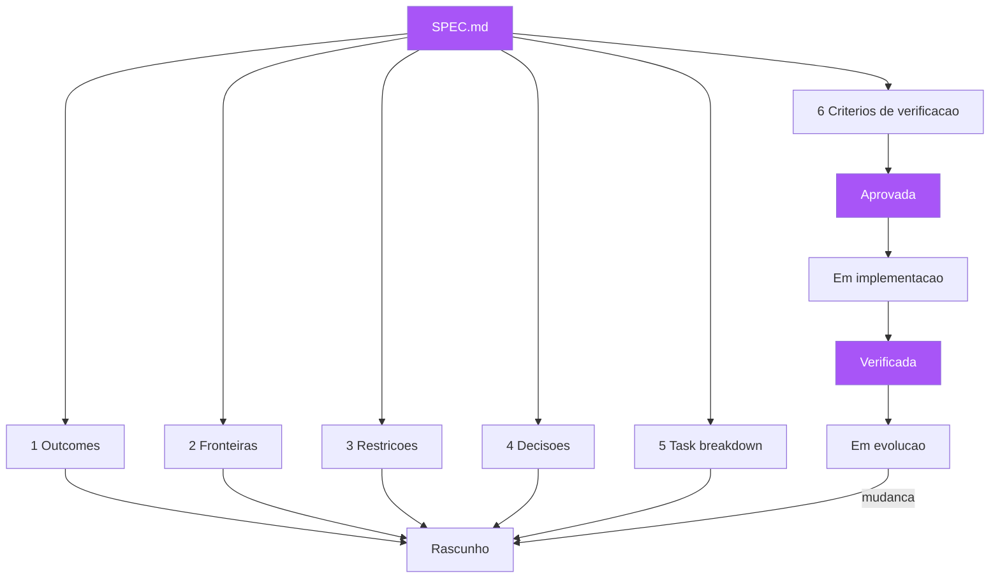

O caderno de encargos é o SPEC.md: um artefato único, com dono, com estado, consultado por todos e usado na vistoria. A lição da metáfora é dupla. Primeiro: o caderno não substitui os desenhos técnicos (os cenários Gherkin) — ele os referencia e organiza; a planta completa é o caderno mais os desenhos, não um ou outro [16]. Segundo: o caderno só funciona porque é único e versionado — se cada encarregado mantém seu próprio caderno com as próprias notas, a obra vira o caos do Capítulo 1 de novo. Você, como Engenheiro de Software, reconhece o padrão: a diferença entre um time que consulta a mesma spec e um time em que cada um tem "o entendimento" é a diferença entre o edifício coerente e o mosaico de interpretações [17].

## 4. Técnica

### O template SPEC.md

Aqui está o template prático de SPEC.md, com os seis elementos em ordem de leitura. Este template é deliberadamente enxuto — especificações inchadas morrem de obesidade; especificações enxutas sobrevivem [18].

```markdown
# SPEC — <Nome da Funcionalidade>

> Status: RASCUNHO | APROVADA | EM IMPLEMENTAÇÃO | VERIFICADA | EM EVOLUÇÃO
> Dono: <nome do PO>
> Última revisão: <data>

### 1. Resultados esperados (Outcomes)
- <O que o sistema deve fazer ao final, em comportamento observável>
- <Focado em valor para o usuário, não em características técnicas>

### 2. Fronteiras (In-scope / Out-of-scope)
### Dentro de escopo
- <item>
### Fora de escopo (NÃO implementar)
- <item — proteção contra "melhoria" além do pedido>

### 3. Restrições e premissas
- <Stack: linguagens, frameworks, versões>
- <Integrações permitidas e seus limites>
- <Premissas assumidas que, se falsas, invalidam a spec>

### 4. Decisões já tomadas
- <Arquitetura pré-aprovada>
- <Esquemas de dados / contratos de API>
- <Padrões que o código deve seguir>

### 5. Divisão de tarefas (Task breakdown)
- [ ] T1 — <descrição atômica>
- [ ] T2 — <descrição atômica>
- [ ] T3 — <descrição atômica>

### 6. Critérios de verificação
- <Cenário Gherkin ou condição observável que atesta a entrega>
- <Aponta para o arquivo .feature correspondente>
```

### A spec de exemplo completa

Vamos aplicar o template a um caso concreto, o cancelamento de pedido que você viu nos capítulos anteriores, agora com os seis elementos completos. Note como cada elemento conversa com os demais: as fronteiras protegem os outcomes; as restrições enquadram as decisões; e os critérios de verificação materializam os outcomes em cenários executáveis [11].

```markdown
# SPEC — Cancelamento de Pedido

> Status: APROVADA
> Dono: Maria (PO)
> Última revisão: 2026-08-05

### 1. Resultados esperados (Outcomes)
- O cliente pode cancelar um pedido no estado "pago" antes da expedição.
- Ao cancelar, o valor é estornado, o estoque é devolvido e o vendedor é notificado.
- O cliente recebe confirmação visível do cancelamento em até 5 segundos.

### 2. Fronteiras
### Dentro de escopo
- Cancelamento antes da expedição (estado "pago" ou "pago_parcial").
- Estorno integral via gateway contratado.
- Devolução de estoque e notificação ao vendedor.

### Fora de escopo (NÃO implementar)
- Cancelamento após expedição (fluxo separado: devolução).
- Reembolso parcial por item.
- Política antifraude (decidida por outro contexto).

### 3. Restrições e premissas
- Stack: Python 3.12, Django 5, PostgreSQL 16, gateway PagarX v2.
- Premissa: o estado "expedido" é irreversível a partir deste contexto.
- Premissa: estoque é reservado no momento do pagamento.

### 4. Decisões já tomadas
- Estorno via API síncrona do gateway, com idempotency key = pedido_id.
- Evento "pedido_cancelado" publicado no tópico pedidos para notificação.
- Tabela `pedido.estado` com enum: criado, pago, expedido, entregue, cancelado.

### 5. Divisão de tarefas (Task breakdown)
- [ ] T1 — endpoint POST /pedidos/{id}/cancelamento (valida estado).
- [ ] T2 — serviço de estorno com idempotency key.
- [ ] T3 — publicador do evento pedido_cancelado.
- [ ] T4 — consumidor de notificação ao vendedor.
- [ ] T5 — devolução de estoque (reserva liberada).

### 6. Critérios de verificação
- Cenários em tests/features/cancelamento.feature (aprovados pelo PO).
- Condição: todos os cenários verdes em CI antes do merge.
- Condição: teste de idempotência — reenviar estorno não duplica.
```

### Escrevendo os critérios de verificação como cenários

O sexto elemento é onde a spec se conecta ao habite-se. A regra prática: cada outcome e cada fronteira importante deve ter pelo menos um cenário que o verifica. Para a spec acima, os cenários (que você já viu em versão anterior) cobrem: cancelamento antes da expedição (feliz), cancelamento após expedição (fora de escopo, comportamento definido: recusa com orientação), e o caso da idempotência (reenvio não duplica estorno). A especificação aponta para o arquivo .feature; o .feature é o desenho técnico que o caderno referencia [19].

```gherkin
# linguagem: pt
Funcionalidade: Cancelamento de pedido — idempotência do estorno
  Cenário: Reenvio do estorno não duplica o reembolso
    Dado um pedido no estado "cancelado"
    E um estorno já processado com idempotency key "pedido-42"
    Quando o gateway reenvia a confirmação de estorno para "pedido-42"
    Então o sistema descarta a duplicata
    E o valor total estornado permanece o mesmo
    E um único evento de "pedido_cancelado" é registrado
```

### A spec e a revisão: quem revisa o quê, e quando

A spec de seis elementos introduz uma nova disciplina de revisão: a revisão da planta é separada da revisão do código, e cada uma tem seu momento e seu dono. A revisão da planta acontece na estação da aprovação — antes de qualquer implementação — e tem três focos: a adequação (os outcomes descrevem o que o negócio de fato quer? — dono: PO); a completude (as fronteiras e os critérios cobrem as bordas? — dono: time inteiro, com o QA provocando os "e se?"); e a viabilidade (as restrições e decisões são técnicas e factíveis? — dono: engenharia) [13][14]. A revisão do código, por outro lado, acontece no merge e verifica a conformidade: o código cumpre a planta? — dono: engenharia, com o pipeline como primeiro revisor [7].

A regra de ouro da revisão da planta: ninguém aprova a própria spec. O PO que escreveu os outcomes não é o único revisor deles — outro stakeholder de negócio deve ler e confirmar, porque o PO também tem interpretações silenciosas (ele sabe o que quis dizer, e assume que o texto diz; o leitor externo revela o que o texto realmente diz) [17]. Essa é a mesma lógica do trio de amigos do BDD: três pares de olhos veem três ambiguidades diferentes, e a revisão da planta é a última chance de pegá-las no papel, antes do canteiro [16]. Times maduros mantêm um caderno de revisões da planta: cada spec aprovada registra quem revisou, o que foi questionado e o que foi decidido — a memória das decisões de borda que evita reabrir discussões no futuro (o caderno de registro do Capítulo 10) [22].

### A especificação como contrato de equipe: quem pode mudar a planta

Uma decisão de governança que define o poder na equipe: quem pode mudar a spec depois da aprovação? A resposta padrão do SDD maduro é: a mudança da planta é sempre coordenada, nunca unilateral. O desenvolvedor que descobre uma ambiguidade na implementação não "corrige a spec no caminho" — ele reporta a ambiguidade, e a correção passa pela mesma revisão da aprovação inicial (em versão leve, para mudanças pequenas) [13]. A razão é estrutural: se o implementador pode mudar a planta para satisfazer a implementação, a planta deixa de ser a fonte da verdade e volta a ser a documentação que corre atrás do código — o apodrecimento do Capítulo 4, em nova roupagem [9].

A mudança coordenada da planta tem três níveis de urgência. Para mudanças de redação (correção de typo, reformulação sem mudança de comportamento): autorização do dono da spec, sem revisão plena. Para mudanças de borda (adicionar ou alterar uma fronteira, um critério): revisão do PO + QA, com atualização dos cenários afetados no mesmo merge — a regra do "spec e código juntos" do Capítulo 10. Para mudanças de escopo (alterar outcomes, remover comportamento): revisão plena da aprovação, com o impacto nos cenários existentes avaliado — mudança de escopo sem revisão plena é a forma mais rápida de a planta e a obra divergirem [14][24]. A disciplina da mudança coordenada é o que distingue a planta viva (que evolui por decisão) da planta congelada (que apodrece) e da planta anarquista (que cada um emenda como quer).

### Lint da spec: validando a completude dos seis elementos

Para garantir que a spec não nasce incompleta, um pequeno script de validação pode ser integrado ao CI — o lint da planta. Ele verifica que os seis elementos existem, que o status é válido, e que os critérios de verificação apontam para arquivos de features existentes. Esse script transforma a anatomia em um contrato verificável: a spec incompleta bloqueia a implementação, exatamente como o habite-se bloqueia a obra sem vistoria [20].

```python
"""lint_spec.py — valida a anatomia de um SPEC.md contra os 6 elementos.

Uso: python lint_spec.py SPEC.md
Exit code 0 = planta completa; 1 = faltam elementos.
"""
import re
import sys
from pathlib import Path

ELEMENTOS = [
    ("1. Resultados esperados", "outcomes"),
    ("2. Fronteiras", "fronteiras"),
    ("3. Restrições", "restricoes"),
    ("4. Decisões", "decisoes"),
    ("5. Divisão de tarefas", "tarefas"),
    ("6. Critérios de verificação", "verificacao"),
]
STATUS_VALIDOS = {"RASCUNHO", "APROVADA", "EM IMPLEMENTAÇÃO",
                  "VERIFICADA", "EM EVOLUÇÃO"}


def validar_spec(caminho: Path) -> list[str]:
    texto = caminho.read_text(encoding="utf-8")
    erros: list[str] = []
    for cabecalho, nome in ELEMENTOS:
        if not re.search(rf"^## {re.escape(cabecalho)}", texto, re.MULTILINE):
            erros.append(f"elemento ausente: {nome}")
    status = re.search(r"> Status:\s*([A-ZÀ-ÖØ-Þ ]+)", texto)
    if not status or status.group(1).strip() not in STATUS_VALIDOS:
        erros.append(f"status invalido: {status.group(1).strip() if status else 'ausente'}")
    if not re.search(r"\.feature", texto):
        erros.append("criterios de verificacao nao apontam para .feature")
    return erros


if __name__ == "__main__":
    caminho = Path(sys.argv[1] if len(sys.argv) > 1 else "SPEC.md")
    erros = validar_spec(caminho)
    if erros:
        print("SPEC INCOMPLETA:")
        for erro in erros:
            print(f"  - {erro}")
        sys.exit(1)
    print("SPEC COMPLETA: os 6 elementos presentes.")
```

### Anti-padrões: a lista do que não fazer

Os anti-padrões de especificação merecem um catálogo próprio. O primeiro é a spec-enciclopédia: duzentas páginas que ninguém lê — especificações longas são lidas com menos atenção do que curtas; a regra é especificar o comportamento, não o universo [18]. O segundo é a spec-vaga: "o sistema deve ser rápido e fácil de usar" — sem números, sem critérios observáveis; toda afirmação vaga é uma decisão adiada que o implementador tomará por você [21]. O terceiro é a spec-reativa: escrita depois do código, documentando o que foi feito em vez de orientar o que fazer — isso é histórico, não especificação. O quarto é a spec-congelada: escrita uma vez e nunca atualizada, mesmo quando o comportamento muda — a planta que não acompanha o edifício, e que portanto mente sobre ele [22]. E o quinto é a spec-sem-dono: um documento que ninguém assina, ninguém revisa e ninguém defende — sem dono, a spec não tem autoridade, e sem autoridade ela é papel [13].

## 5. Aplica

### A cena de contraste: o agente que "melhorou" a spec

Você está em uma empresa que começou a usar agentes de IA para implementar funcionalidades de baixo risco. O fluxo estabelecido é: o PO escreve a spec, o agente implementa, o time revisa. Na primeira semana, tudo corre bem. Na segunda, um incidente: o agente, encarregado de implementar a spec "lista de produtos com filtro por categoria", decidiu "melhorar" o trabalho — adicionou ordenação por relevância, um campo de busca e uma paginação customizada. O código funciona, os testes passam — e o produto quebra: a nova ordenação por relevância contradiz a estratégia comercial de ordenação por margem, e a loja começa a mostrar produtos errados no topo da listagem. O agente fez exatamente o que a spec não o impediu de fazer: interpretar "filtro por categoria" como uma oportunidade de redesenhar a listagem [12][23].

O diagnóstico: a spec não tinha fronteiras. O elemento 2 (out-of-scope) estava vazio — ninguém escreveu "fora de escopo: alterar ordenação, busca, paginação". E sem fronteiras, tanto o agente quanto um desenvolvedor apressado têm o mesmo comportamento: preencher as lacunas com as próprias ideias. A correção é dupla e imediata: reverter a mudança do agente, restaurando a ordenação comercial; e reescrever a spec com fronteiras explícitas — "fora de escopo: NÃO alterar ordenação (estratégia comercial), NÃO adicionar busca, NÃO alterar paginação" — e adicionar um critério de verificação que bloqueie a regressão: um cenário que atesta a ordenação por margem. A partir desse incidente, toda spec da empresa passa pelo lint dos seis elementos no CI — e spec sem fronteiras não sai do rascunho [2].

### Armadilhas comuns

As armadilhas de escrever specs são traiçoeiras. A primeira é copiar o template sem pensar: encher as seções com texto decorativo — o template é um esqueleto, não uma resposta; a qualidade está nas fronteiras e critérios concretos, não na presença das seções. A segunda é o vocabulário técnico na spec: "o endpoint POST deve retornar 201 com o objeto serializado" — isso é design de implementação prematuro; a spec descreve o comportamento, e o código decide o mecanismo (a menos que seja uma decisão já tomada, elemento 4) [7]. A terceira é a crítica prematura: o time revisa a spec discutindo a solução técnica antes de aprovar o comportamento — a revisão deve começar pelos outcomes e fronteiras, e só depois descer para restrições e decisões. A quarta é o culto ao template: times que acham que SPEC.md formatado é SDD — a anatomia é necessária, mas a alma está nos critérios de verificação executáveis; spec sem cenários é um desejo com formatação [24]. E a quinta é a spec que ninguém consulta durante a implementação: o desenvolvedor escreve código de memória e só abre a spec quando o lint reclama — a disciplina é implementar a partir da spec, seção por seção, e resolver divergências na spec antes de no código.

### A spec como unidade de conversa: o artefato que todos leem

A spec de seis elementos tem um efeito colateral que explica por que ela muda a cultura do time: ela vira a unidade de conversa. Antes da spec, a conversa sobre uma funcionalidade acontece em fragmentos — e-mails, comentários, reuniões — e ninguém tem a visão completa; depois da spec, a conversa acontece A PARTIR de um artefato único, que todos leem e ao qual todos se referem [3][13]. O efeito é observável em três momentos: o refinamento começa com "abre a spec" em vez de "quem lembra o que decidimos?"; a implementação consulta a spec como referência ("o que a fronteira diz sobre isso?") em vez de perguntar ao colega; e a revisão compara o código com a spec ("aqui divergiu da planta") em vez de discutir opiniões [7][17]. A spec única transforma a memória distribuída do time — frágil e divergente — em um artefato versionado e compartilhado [22].

A transformação tem uma consequência de poder: a spec desloca a autoridade da pessoa para o artefato. Antes, a resposta para "o que esta funcionalidade faz?" dependia de quem estava na sala e do humor da memória de cada um; depois, a resposta é a spec, e as divergências são resolvidas contra ela — não contra a opinião mais alta ou mais recente [13][24]. Esse deslocamento é desconfortável para quem se beneficiava da autoridade informal ("pergunta pra mim que eu sei"), e libertador para o time: a verdade da planta é consultável por todos, a qualquer hora, sem intermediário [14]. A spec como unidade de conversa é, no fim, a materialização do princípio do Capítulo 1: a intenção deixa de ser uma propriedade privada de quem a tem e vira um bem comum, versionado e verificável — e é essa publicidade que a mantém viva [11].

### Métricas de sucesso e fracasso

Sucesso na adoção da spec como planta: a taxa de histórias que chegam ao desenvolvimento com spec aprovada (seis elementos completos) passa de 90%; as divergências de interpretação ("não era isso") caem para perto de zero; e o tempo de onboarding de novos membros cai — um desenvolvedor novo lê a spec e entende o comportamento esperado sem caçar contexto. Fracasso: specs escritas e arquivadas sem nunca orientar implementação; o lint dos seis elementos desligado porque "atrasa o fluxo"; e o sintoma mais claro — quando alguém pergunta "o que esta funcionalidade deve fazer?", a resposta vem da memória de quem está falando, não do SPEC.md no repositório [14].

Para que o SPEC.md alcance esse papel de fonte única, a disciplina de escrita precisa de três regras de manutenção que os times subestimam. A primeira é a regra do mesmo diff: a spec muda no mesmo pull request que o código que a implementa — nunca em PR separado, porque PR separado significa que um dos dois fica órfão; quando a regra vale, a rastreabilidade entre planta e edifício é um subproduto natural da revisão de código. A segunda é a regra do prazo de validade: toda spec carrega uma data de revisão e um dono; a spec vencida entra no backlog com a mesma prioridade de um bug de produção, porque especificação desatualizada é dívida de conhecimento que cobra juros compostos em toda decisão futura apoiada nela. A terceira é a regra do desligamento: quando uma funcionalidade morre, a spec morre junto no mesmo PR — manter specs de funcionalidades mortas é a origem da maior parte do lixo documental que faz os desenvolvedores pararem de consultar a planta. Há também a regra do tamanho, que é a mais violada: se a spec de uma história não cabe em uma tela (aproximadamente 60 linhas com os seis elementos), a história é grande demais e precisa ser fatiada; specs longas não são lidas, e spec não lida é o mesmo que spec inexistente — o custo de escrever e manter uma spec que ninguém lê é puro desperdício, pior que não ter spec, porque cria a ilusão de controle [14]. O SPEC.md maduro é curto, executável e datado: curto para ser lido, executável para ser verificado, datado para envelhecer com honestidade.

## 6. Conclusão

Neste capítulo, você montou a planta completa: os seis elementos essenciais da especificação — outcomes, fronteiras, restrições, decisões, task breakdown e critérios de verificação — que orientam e restringem tanto humanos quanto agentes de IA [1][2]; o template SPEC.md como artefato único, versionado e com ciclo de vida próprio [3][13]; e os anti-padrões que transformam especificações em papel morto [18][21][22]. O desafio: transforme a próxima funcionalidade do seu backlog em uma SPEC.md completa — com fronteiras explícitas, decisões pré-aprovadas e critérios de verificação apontando para cenários — e rode o lint dos seis elementos. No próximo capítulo, vamos mudar do desenho da planta para o canteiro: o ecossistema de ferramentas que torna a especificação executável — Cucumber, Gauge, Concordion e companhia — e como escolher a ferramenta certa para o seu contexto.

## 7. Referências Bibliográficas

[1] ADZIC, Gojko. *Specification by Example: How Successful Teams Deliver the Right Software*. Shelter Island: Manning Publications, 2011.
[2] AUGMENT CODE. *What is Spec-Driven Development?* Augment Code Guides. Disponível em: https://www.augmentcode.com/guides/what-is-spec-driven-development. Acesso em: 5 ago. 2026.
[3] OSMANI, Addy. *How to Write a Good Spec for AI Agents*. 2025. Disponível em: https://addyosmani.com/blog/good-spec/. Acesso em: 5 ago. 2026.
[4] GITHUB. *Spec-Driven Development with AI — get started with a new open source toolkit*. GitHub Blog, 2025. Disponível em: https://github.blog/ai-and-ml/generative-ai/spec-driven-development-with-ai-get-started-with-a-new-open-source-toolkit/. Acesso em: 5 ago. 2026.
[5] ADZIC, Gojko. *Living Documentation: Continuous Knowledge Sharing by Design*. Boston: Addison-Wesley, 2017.
[6] FOWLER, Martin. *Understanding Spec-Driven Development* (Exploring Gen AI — SDD tools). Martin Fowler, 2025. Disponível em: https://martinfowler.com/articles/exploring-gen-ai/sdd-3-tools.html. Acesso em: 5 ago. 2026.
[7] MARTIN, Robert C. *Clean Architecture: A Craftsman's Guide to Software Structure and Design*. Boston: Prentice Hall, 2017.
[8] RICHARDS, Mark; FORD, Neal. *Fundamentals of Software Architecture: An Engineering Approach*. Sebastopol: O'Reilly Media, 2020.
[9] BECK, Kent. *Extreme Programming Explained: Embrace Change*. 2. ed. Boston: Addison-Wesley, 2004.
[10] ADZIC, Gojko. *Bridging the Communication Gap: Specification by Example and Agile Acceptance Testing*. London: Neuri Consulting, 2009.
[11] NORTH, Dan. *BDD is like TDD if...* Dan North & Associates, 2006. Disponível em: https://dannorth.net/blog/bdd-is-like-tdd-if/. Acesso em: 5 ago. 2026.
[12] OSÓRIO, Fernando. *The Age of Agentic Engineering* (apud FOWLER, Martin). Disponível em: https://martinfowler.com/articles/exploring-gen-ai/. Acesso em: 5 ago. 2026.
[13] COHN, Mike. *User Stories Applied: For Agile Software Development*. Boston: Addison-Wesley, 2004.
[14] SCHWABER, Ken; SUTHERLAND, Jeff. *The Scrum Guide: The Definitive Guide to Scrum*. 2020. Disponível em: https://scrumguides.org. Acesso em: 5 ago. 2026.
[15] EVANS, Eric. *Domain-Driven Design: Tackling Complexity in the Heart of Software*. Boston: Addison-Wesley, 2003.
[16] SMART, John Ferguson. *BDD in Action: Behavior-Driven Development for the Whole Software Lifecycle*. Shelter Island: Manning Publications, 2014.
[17] WEINBERG, Gerald M. *Quality Software Management: Systems Thinking*. New York: Dorset House, 1992.
[18] MEYER, Bertrand. *Agile!: The Good, the Hype and the Ugly*. New York: Springer, 2014.
[19] WYNNE, Matt; HELLESØY, Aslak. *The Cucumber Book: Behaviour-Driven Development for Testers and Developers*. 2. ed. Raleigh: Pragmatic Bookshelf, 2017.
[20] KEOGH, Liz. *Behaviour Driven Development*. Disponível em: https://lizkeogh.com/behaviour-driven-development/. Acesso em: 5 ago. 2026.
[21] DAVIS, Alan M. *Software Requirements: Objects, Functions, and States*. 2. ed. Upper Saddle River: Prentice Hall, 1993.
[22] PARNAS, David L. Software Aging. In: *Proceedings of the 16th International Conference on Software Engineering (ICSE)*. New York: IEEE, 1994. p. 279-287.
[23] BROOKS, Frederick P. *The Mythical Man-Month: Essays on Software Engineering*. Anniversary ed. Boston: Addison-Wesley, 1995.
[24] ADZIC, Gojko. *Specification by Example, 10 years later*. 2020. Disponível em: https://gojko.net/2020/03/17/sbe-10-years.html. Acesso em: 5 ago. 2026.

# PARTE III — O Canteiro: da spec ao código verificável

# Capítulo 7: O ecossistema de ferramentas: Cucumber, Gauge, Concordion e cia.

## 1. Introdução

Nos capítulos anteriores, você desenhou a planta: vocabulário, exemplares, a spec de seis elementos. Agora vamos ao canteiro — as ferramentas que transformam a especificação em código verificável. Você vai aprender o mapa do ecossistema de ferramentas de especificação executável: o Cucumber, o padrão da indústria com sua gramática Gherkin; o Reqnroll (sucessor open source do SpecFlow) para o mundo .NET; o Gauge da ThoughtWorks, que escreve specs em Markdown com paralelismo nativo; o Concordion, que transforma HTML em documentação viva rica; o FitNesse, o veterano da wiki de teste de aceitação; e o JGiven, que escreve cenários em Java puro [1][2][3][4]. Você vai aprender os critérios para escolher a ferramenta certa para o seu contexto — porque a ferramenta é o veículo da planta, e o veículo errado sabota até a melhor planta [5].

## 2. Explica

### O que uma ferramenta de especificação executável precisa fazer

Antes de comparar ferramentas, é preciso definir o que a ferramenta DEVE fazer. Uma ferramenta de especificação executável tem quatro responsabilidades: primeiro, armazenar a especificação em um formato legível por humanos (arquivo texto, não banco de dados ou interface gráfica proprietária — porque a planta precisa ser versionada e difável); segundo, interpretar a gramática da especificação (Gherkin, Markdown, HTML ou código), separando os passos da automação; terceiro, conectar cada passo a código de automação (step definitions) que executa a ação real no sistema; e quarto, reportar a execução — quais cenários passaram, quais falharam e por quê, em um formato que o negócio consiga ler [1][6]. Qualquer ferramenta que não faça essas quatro coisas não é uma ferramenta de SDD — é um framework de testes com roupagem.

Você vai perceber que a decisão mais importante não é a ferramenta, mas o formato da especificação — porque o formato determina quem consegue escrever e ler a planta. O Gherkin (texto com Given/When/Then) é legível por todos, mas é uma linguagem nova para o negócio aprender; o Markdown (Gauge) é familiar a todos, mas tem menos estrutura; o HTML (Concordion) é o mais rico em apresentação, mas o mais trabalhoso de escrever; e o código (JGiven) é o mais familiar para desenvolvedores, mas o menos legível para o negócio [7]. A escolha do formato é uma decisão de equipe, e as ferramentas são, no fundo, escolhas de formato com automação acoplada.

### O Cucumber e a gramática Gherkin

O Cucumber é o framework BDD mais popular do mundo, e sua contribuição central é a gramática Gherkin — a mesma que você já viu nos Capítulos 3 e 4, agora em sua forma canônica [1]. O Cucumber existe para múltiplas linguagens (Java, JavaScript/TypeScript, Ruby, Python, Go, .NET), e seu modelo é: arquivos `.feature` com a especificação; arquivos de step definitions conectando cada passo a código; e um runner que executa a suíte e reporta [8]. O Cucumber também popularizou os relatórios legíveis por humanos — o formato de output que mostra a feature como árvore de cenários com status verde/vermelho/amarelo, que se tornou o padrão de facto de "documentação viva" automatizada [9]. Sua força é o ecossistema: Gherkin é o esperanto da especificação executável, e um time que aprende Gherkin pode mudar de linguagem de programação sem reaprender a planta.

### As alternativas: quando cada uma brilha

O Gauge, mantido pela ThoughtWorks, escreve especificações em Markdown — sem gramática própria — e se destaca pela execução paralela nativa e pelo suporte multiplataforma [2]. Sua filosofia: a especificação é um documento Markdown com código de automação embutido em blocos, o que reduz a barreira de entrada (Markdown todo mundo sabe) e facilita a geração de relatórios HTML [10]. O Concordion, por sua vez, é a expressão máxima da Specification by Example: a especificação é um documento HTML, formatado e publicado, com instrumentos embutidos que transformam tabelas e frases em asserções executáveis — o resultado é uma documentação viva de qualidade editorial, ideal quando a especificação é também um artefato de comunicação com o negócio [3]. O FitNesse, criado por Ward Cunningham (o inventor da wiki), é o ancestral: uma wiki onde as tabelas de teste são executadas diretamente — pioneiro, mas datado, ainda vivo em nichos [4]. O JGiven escreve cenários em Java puro com uma API fluente — sem arquivos separados — o que atrai equipes que preferem a especificação colada ao código, com refatoração segura do IDE [11]. E o Reqnroll é o herdeiro do SpecFlow para .NET: a comunidade migrou em massa quando o SpecFlow mudou sua licença, e hoje Reqnroll é o padrão Gherkin no ecossistema C# [12].

### A régua de escolha: cinco perguntas

A escolha entre ferramentas não é sobre "qual é a melhor" — é sobre "qual se encaixa no seu contexto". A régua de decisão tem cinco perguntas. Primeira: quem escreve a especificação? Se o negócio escreve diretamente, prefira formatos familiares (Markdown/Gauge) ou visualmente ricos (HTML/Concordion); se o time técnico formula e o negócio valida, o Gherkin é suficiente. Segunda: qual o ecossistema do seu time? Em .NET, Reqnroll é a escolha natural; em JVM, Cucumber-JVM ou JGiven; em equipes poliglotas, Cucumber ou Gauge. Terceira: como a suíte roda no CI? Ferramentas com execução paralela nativa (Gauge) importam para suítes grandes. Quarta: qual o nível de documentação desejado? Se a spec é também o relatório para o negócio, Concordion ou Gauge com relatórios HTML brilham; se a spec é interna, o Cucumber basta. Quinta: qual a maturidade da equipe? Times iniciantes em BDD tendem a se beneficiar do Gherkin canônico do Cucumber, pela abundância de documentação e exemplos [5][13].

### O princípio que nenhuma ferramenta substitui

O aviso que antecede qualquer comparação: nenhuma ferramenta substitui a disciplina dos capítulos anteriores. O Cucumber não faz descoberta colaborativa; o Gauge não escreve exemplares por você; o Concordion não define a linguagem ubíqua [14]. A ferramenta automatiza a Formulação e a Automação do loop BDD — os momentos em que a planta já existe e precisa ser executada. Times que trocam a descoberta por "vamos usar Cucumber" repetem o erro do Capítulo 3: a automação sem conversa produz uma planta escrita por quem constrói, para quem constrói [15]. A ferramenta é o habite-se — o instrumento de medição — não o arquiteto.

## 3. Ilustra

Voltemos à construtora. O caderno de encargos (a spec) está pronto, e agora o engenheiro-chefe precisa escolher o instrumento de medição para o habite-se — a vistoria. O escritório testa três opções. A primeira é a trena digital: barata, universal, todo fiscal sabe usar — mas cada medição precisa ser anotada à mão e comparada manualmente com o caderno (é o Cucumber: universal, conhecido, mas a comparação é trabalho seu). A segunda é o scanner 3D: caro, exige treinamento, mas gera a nuvem de pontos completa do edifício — a comparação com o modelo digital é automática, e o relatório sai com renderização que até o cliente entende (é o Concordion/Gauge: mais investimento, documentação viva de alta qualidade) [3]. A terceira é a prancheta com o caderno aberto: o fiscal marca cada item conforme confere (é o FitNesse: simples, direto, e com quase meio século de história) [4]. O engenheiro descobre que não há "melhor instrumento" — há o instrumento certo para o porte da obra, o orçamento e a equipe: uma casa popular não justifica scanner 3D, e um hospital não se contenta com trena manual.

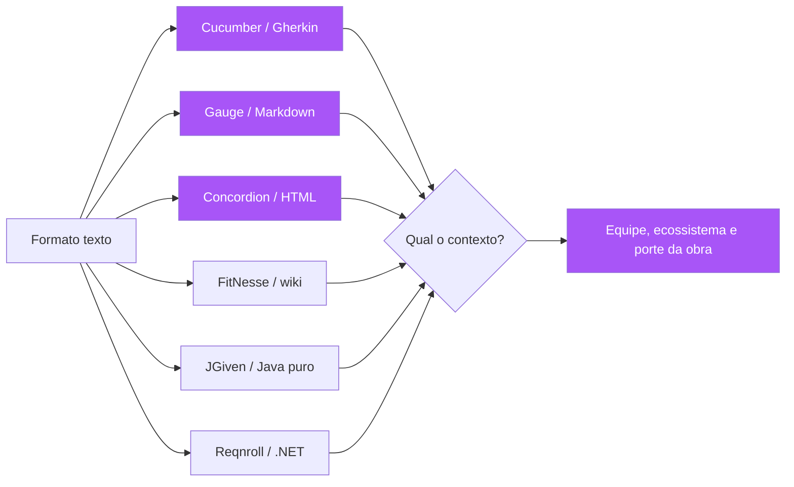

A lição da metáfora do instrumento de medição é dupla. Primeiro: o instrumento não substitui o caderno — sem caderno, medir é inútil (sem spec, a ferramenta é um framework de testes a mais). Segundo: o instrumento é escolhido pela obra — e a escolha é uma decisão explícita, documentada, revisada quando o contexto muda [5]. Você, como Engenheiro de Software, vai enfrentar essa escolha cedo na adoção do SDD — e a tentação de "usar o que a maioria usa" (Cucumber) sem pensar no contexto é exatamente o tipo de decisão por inércia que a planta, bem feita, evita [16].

## 4. Técnica

### Cucumber na prática: a suíte canônica

O caminho mais comum é o Cucumber com Gherkin. A estrutura de um projeto: `features/` para os arquivos `.feature`, `features/steps/` para as definições de passo, e um runner configurado no CI. O exemplo completo com Python e pytest-bdd (que você já viu em versões anteriores) agora com os detalhes de projeto:

```bash
# Estrutura de um projeto Cucumber (Python/pytest-bdd)
projeto/
├── features/
│   ├── saque.feature          # a planta (Gherkin)
│   └── steps/
│       └── saque_steps.py     # a automacao (step definitions)
├── src/
│   └── conta.py               # o codigo de producao
├── conftest.py
└── requirements-dev.txt
```

```python
# features/steps/saque_steps.py — automacao dos passos da feature
"""Step definitions do cenário de saque — cada passo Gherkin tem um mapeamento.

O mapeamento usa parsers de expressao para extrair os parametros
("R$ {saldo:d}" -> saldo inteiro) e injeta o estado do cenario.
"""
from pytest_bdd import given, when, then, parsers
from pytest_bdd import scenario

from conta import Conta, SaldoInsuficienteError, ValorInvalidoError


@given(parsers.parse("uma conta corrente com saldo de R$ {saldo:d}"))
def conta_com_saldo(saldo: int) -> dict:
    return {"conta": Conta(float(saldo))}


@when(parsers.parse("o correntista saca R$ {valor:d}"))
def correntista_saca(valor: int, conta_com_saldo: dict) -> None:
    conta = conta_com_saldo["conta"]
    try:
        conta.sacar(float(valor))
        conta_com_saldo["erro"] = None
    except (SaldoInsuficienteError, ValorInvalidoError) as exc:
        conta_com_saldo["erro"] = exc


@then(parsers.parse("o saldo da conta deve ser R$ {saldo:d}"))
def saldo_deve_ser(saldo: int, conta_com_saldo: dict) -> None:
    assert conta_com_saldo["conta"].saldo == float(saldo)


@then("o saque deve ser recusado")
def saque_recusado(conta_com_saldo: dict) -> None:
    assert conta_com_saldo["erro"] is not None
```

```python
# conftest.py — registra os cenarios automaticamente
"""Hook do pytest-bdd: carrega todos os cenarios de features/*.feature."""
import pytest

from pytest_bdd import scenarios

scenarios("features")
```

### Gauge na prática: a spec em Markdown

O Gauge muda o formato da planta: em vez de Gherkin, Markdown com blocos de passo. A vantagem para times que já vivem em Markdown é a familiaridade; a vantagem técnica é o paralelismo nativo — suítes grandes rodam em frações do tempo do Cucumber [2][10].

```markdown
# Funcionalidade: Cálculo de frete

## Cenário: Frete gratuito acima do limiar

* Dado um pedido com valor de "150"
* Quando calculo o frete
* Então o frete deve ser "gratuito"

## Cenário: Frete pago abaixo do limiar

* Dado um pedido com valor de "95"
* Quando calculo o frete
* Então o frete deve ser "pago"
```

```python
# test_frete.py — steps do Gauge em Python
"""Steps da feature Markdown do Gauge — mesmo vocabulario, outro formato."""
from getgauge.python import step
from frete import calcular_frete

_estado: dict = {}


@step("Dado um pedido com valor de <valor>")
def dado_pedido(valor: str) -> None:
    _estado["valor"] = float(valor)


@step("Quando calculo o frete")
def quando_calculo() -> None:
    _estado["frete"] = calcular_frete(_estado["valor"])


@step("Então o frete deve ser <esperado>")
def entao_frete(esperado: str) -> None:
    assert _estado["frete"] == esperado
```

### Concordion: a documentação viva de qualidade editorial

O Concordion leva a Specification by Example ao extremo: a especificação é um documento HTML que é ao mesmo tempo a documentação publicada e o teste executável [3]. O mecanismo: instrumentos como `<span c:assertEquals="...">` e tabelas `<table c:execute="#result = ...">` marcam onde a automação deve verificar valores. O resultado é uma documentação viva com qualidade de publicação — o relatório gerado mostra a spec renderizada com os resultados coloridos — que serve tanto para o negócio quanto para a auditoria. A contrapartida é o custo: escrever e manter HTML instrumentado exige mais esforço que Gherkin, e a curva de aprendizado é maior [17].

```html
<html xmlns:c="http://www.concordion.org/2007/concordion">
<body>
  <h1>Cálculo de Frete</h1>
  <p>
    Para pedidos com valor
    <span c:set="#valor">150</span>,
    o frete é
    <span c:assertEquals="fretePara(#valor)">gratuito</span>.
  </p>
  <table c:execute="#frete = fretePara(#valor)">
    <tr>
      <th c:set="#valor">Valor do pedido</th>
      <th c:assertEquals="#frete">Frete esperado</th>
    </tr>
    <tr><td>100</td><td>gratuito</td></tr>
    <tr><td>99.99</td><td>pago</td></tr>
    <tr><td>0</td><td>pago (pedido vazio inválido)</td></tr>
  </table>
</body>
</html>
```

### O custo real: manutenção de step definitions

A métrica que nenhum vendedor de framework destaca: o custo dominante de uma suíte BDD não é a compra da ferramenta — é a manutenção dos step definitions. Cada passo Gherkin ("Dado uma conta com saldo de R$ 100") precisa de um mapeamento; quando o domínio muda, os steps mudam; e quando os steps se tornam específicos demais, a suíte vira uma floresta de mapeamentos duplicados [18]. As práticas que controlam esse custo: usar parsers parametrizados em vez de passos literais ("Dado uma conta com saldo de R$ {saldo:d}" em vez de "Dado uma conta com saldo de R$ 100"); reutilizar steps entre features por vocabulário comum (a linguagem ubíqua do Capítulo 5 aplicada à automação); e revisar periodicamente a suíte, podando steps órfãos — exatamente a disciplina de evolução da suíte do Capítulo 4 [19]. Uma régua prática: se dois steps fazem a mesma coisa com nomes diferentes, a linguagem ubíqua falhou — e o glossário, não o step, é o lugar de corrigir.

### O relatório executável: configurando o output para o público certo

Uma decisão de ferramenta que parece cosmética e é estratégica: o formato do relatório de execução. A documentação viva (Capítulo 4) só funciona se o relatório for legível pelo público que deve consultá-la — e cada ferramenta tem uma família de formatos de output com qualidades diferentes [9]. O relatório técnico (stack traces, nomes de métodos, linhas de código) serve ao time; o relatório funcional (features, cenários, passos, em linguagem de domínio) serve ao PO e ao negócio; e o relatório de auditoria (com data, versão, assinatura de execução) serve à governança [5][23]. A configuração do pipeline deve gerar — e publicar — os três, ou pelo menos o funcional e o técnico, cada um no endereço certo.

O detalhe prático que separa relatórios bons de ruins: os passos devem exibir o texto Gherkin ("Dado um pedido com valor de 150"), não a assinatura do método de automação ("test_frete_gratuito()"). A diferença parece pequena e é decisiva — o PO que abre o relatório precisa reconhecer o comportamento descrito, e o reconhecimento exige a linguagem da planta, não a do framework [9][24]. A mesma regra vale para o erro: o passo que falhou deve exibir o dado real ("esperado gratuito, recebido pago"), não apenas a exceção técnica. O relatório executável é a materialização da documentação viva — e a qualidade do relatório determina se o negócio usa a planta como fonte da verdade ou continua perguntando ao dev [14].

### O custo de adoção e o retorno mensurável

A adoção de uma ferramenta de especificação executável tem custos mensuráveis que merecem planejamento. O custo inicial: a curva de aprendizado da ferramenta e da gramática (dias a semanas, dependendo da familiaridade do time); a instalação no pipeline (horas a dias); e a automação da suíte legada (semanas, se existem testes que precisam ser convertidos em cenários). O custo recorrente: a manutenção de steps (o custo dominante, como você viu); a atualização da ferramenta; e o tempo de execução no CI (que cresce com a suíte e exige poda disciplinada — Capítulo 4) [18][20].

O retorno mensurável, por outro lado, aparece em três métricas: a redução de bugs de especificação em produção (a triagem do Capítulo 1, agora com a planta em operação); a redução do tempo de onboarding (o novo dev lê as features e entende o comportamento em minutos, não em semanas); e a redução do tempo de mudança (alterar um comportamento exige alterar a feature e o código juntos — e a suíte verde atesta a coerência da mudança, eliminando a fase de "será que quebrou alguma coisa?"). O cálculo de retorno que convence a liderança é simples: o custo mensal de manutenção da suíte vs. o custo mensal de bugs de especificação evitados — e a evidência do Capítulo 1 (o custo multiplicador do retrabalho) fecha o argumento [5][24].

### Migrando entre ferramentas sem reescrever a planta

Uma vantagem estratégica de manter a especificação em formato texto versionado é a portabilidade: a planta pode migrar entre ferramentas. A migração mais comum é de Cucumber para Gauge (ou vice-versa) quando o time muda de ecossistema ou descobre que o paralelismo do Gauge atende melhor. O processo de migração: primeiro, a planta (os cenários) é congelada e documentada — os cenários são a fonte da verdade, não a ferramenta; segundo, cada cenário é recodificado no novo formato; terceiro, os step definitions são reescritos; quarto, a suíte nova é comparada com a antiga — todo cenário antigo deve existir e passar no novo formato [20]. A migração de ferramenta que exige reescrever os cenários é um sinal de que a planta estava acoplada à ferramenta — o que a disciplina de formato texto, versionado e legível, previne desde o início [5].

## 5. Aplica

### A cena de contraste: a ferramenta escolhida pela moda

Você entra em uma equipe nova como consultor de qualidade. O time, entusiasmado com SDD, adotou o Cucumber há seis meses — depois de um workshop que todos adoraram. Mas a adoção não está produzindo os resultados esperados: a suíte tem 400 cenários, mas metade está "pendente" (steps sem implementação), o PO nunca leu um único arquivo `.feature`, e o relatório de execução é ignorado porque "é muito técnico". Você investiga e encontra o padrão clássico: a ferramenta foi escolhida pela moda — o workshop vendeu o Cucumber — sem as cinco perguntas da régua de escolha. Ninguém perguntou quem escreve a planta (o PO não lê Gherkin); ninguém perguntou do ecossistema (o time é .NET, e o Cucumber não é a escolha natural ali); e ninguém definiu o objetivo (documentação viva para o negócio? testes de aceitação para o time?) [13][21].

O diagnóstico: não foi a ferramenta que falhou — foi a escolha sem contexto. O time precisava decidir com base nas cinco perguntas, não no entusiasmo do workshop. A correção, que você conduz: a régua de escolha é aplicada retrospectivamente — e o time descobre que a resposta muda o instrumento: o PO quer ler a documentação viva, e o ecossistema é .NET — a escolha aponta para Reqnroll (Gherkin no mundo C#) com relatórios legíveis, ou para o Gauge se o paralelismo for crítico. A migração é feita com a planta congelada primeiro: os 400 cenários são auditados — os 200 pendentes são ou implementados ou podados (ruído), e a suíte resultante de 180 cenários vivos migra para o novo formato. O PO passa a abrir o relatório, e a suíte volta a ser usada como habite-se — em vez de vitrine [12][22].

### Armadilhas comuns

As armadilhas do ecossistema são numerosas. A primeira é o frameworkismo: acreditar que a ferramenta é o SDD — comprar Cucumber e achar que a planta está feita; a ferramenta é o instrumento, não o arquiteto [15]. A segunda é a suíte de vitrine: cenários que passam em um ambiente controlado e falham em CI — a suíte só vale quando roda no pipeline real, com a infraestrutura real. A terceira é o pendente crônico: cenários escritos e steps nunca implementados — a planta desenhada e nunca executada, que vira dívida em vez de especificação; a regra é que cenário sem automação não entra no merge. A quarta é o relatório técnico demais: relatórios que mostram stack traces e nomes de métodos, inúteis para o negócio — a configuração de output é parte da ferramenta, e deve ser ajustada para o público da documentação viva [9]. E a quinta é o medo de trocar: times que continuam na ferramenta errada por "custo de migração" — a régua é a mesma da dívida técnica: se a ferramenta trava a entrega de valor, a migração com planta congelada é investimento, não custo [23].

### A ferramenta como decisão de equipe, não de moda

A escolha da ferramenta de especificação executável é uma decisão de equipe com consequências de longo prazo — e a história da adoção de ferramentas em software é a história de decisões tomadas por moda, com custos descobertos tarde demais [5][21]. A decisão madura tem um processo: a régua de cinco perguntas é aplicada com os dados do contexto real (quem escreve a planta, qual ecossistema, qual objetivo), e a escolha é documentada em uma página — os critérios, as alternativas consideradas e a decisão, com a data da revisão [13]. A documentação da decisão é o que permite revisitá-la: quando o contexto muda (o time vira .NET, o PO passa a escrever a planta, a suíte cresce), a página diz por que a escolha anterior foi feita, e a revisão compara o contexto atual com o registrado [22].

A decisão de equipe também é uma decisão de propriedade: a ferramenta escolhida tem um dono — o engenheiro que responde por sua configuração, sua atualização e seu custo de manutenção [20]. O dono da ferramenta é o guardião do instrumento: ele monitora o tempo de execução da suíte, a saúde dos steps (órfãos, duplicados), e propõe a migração quando a régua de escolha muda de resposta [18][24]. A ausência de dono é o caminho mais curto para a ferramenta degradar: sem dono, ninguém poda a suíte, ninguém atualiza o relatório, e a ferramenta vira o framework de testes esquecido que você viu na cena de contraste da Aplica [21]. A lição final do ecossistema é a mesma da obra: a ferramenta é o instrumento, o time é o usuário, e a planta é a fonte da verdade — a ferramenta serve ao time, nunca o contrário [5][14].

### Métricas de sucesso e fracasso

Sucesso: a suíte executa no CI com zero cenários pendentes; o relatório de execução é lido por não-técnicos (o PO consegue dizer quais funcionalidades estão verdes); o tempo de manutenção de steps é proporcional à mudança de domínio, não ao acúmulo de dívida; e a escolha da ferramenta é documentada e revisitada quando o contexto muda. Fracasso: suíte de centenas de cenários que ninguém lê; steps duplicados e órfãos crescendo a cada sprint; relatórios que só o dev entende; e a pergunta "qual ferramenta usamos?" respondida com "sempre usamos essa" — sem que ninguém consiga dizer por que ela é a certa para a obra atual [24].

A seleção da ferramenta merece um método de decisão em quatro critérios, e não gosto pessoal. Critério um — legibilidade dos cenários: escreva o mesmo cenário (um fluxo de negócio real, com uma regra de borda) nas ferramentas finalistas e leve as três versões para o PO ler; a ferramenta que o PO entende sem explicação ganha, porque a legibilidade é o requisito funcional da ferramenta, não uma conveniência — cenário ilegível é planta que ninguém lê. Critério dois — custo de manutenção dos steps: estime quanto código de ligação (glue) cada cenário médio exige; ferramentas que forçam reescrita de steps para cada cenário cobram juros a cada sprint, enquanto as que promovem reuso de steps transformam a suíte em um vocabulário que se estabiliza com o tempo. Critério três — integração com o pipeline existente: a ferramenta precisa rodar no CI com a infraestrutura atual, gerar relatórios que o negócio consome (não só HTML para o time), e falhar com mensagens que apontam o passo exato — o tempo de diagnóstico de um cenário vermelho é o imposto invisível da ferramenta. Critério quatro — morte anunciada: verifique a saúde do ecossistema (frequência de releases, resposta a issues, adoção), porque adotar uma ferramenta órfã é criar dívida de migração; a pergunta não é "qual é a melhor ferramenta?", e sim "qual ferramenta sobreviverá à obra inteira?" [24]. O erro de estratégia mais comum é padronizar ferramenta antes de padronizar a linguagem dos cenários: a ferramenta multiplica a clareza da conversa, não a substitui — trocar de ferramenta sem trocar a qualidade da descoberta é mudar a caneta e manter a letra ilegível.

## 6. Conclusão

Neste capítulo, você percorreu o canteiro: o mapa das ferramentas de especificação executável — Cucumber e a gramática Gherkin [1][8], Gauge e o Markdown paralelo [2][10], Concordion e a documentação viva editorial [3][17], FitNesse e a tradição da wiki [4], JGiven e o Java puro [11], Reqnroll e o mundo .NET [12]; a régua de cinco perguntas para escolher o instrumento certo [5][13]; e o custo real — a manutenção de step definitions e a disciplina de poda [18][19]. O desafio: aplique a régua de cinco perguntas ao seu contexto atual — documente a escolha da ferramenta (ou a confirmação da escolha existente) em uma página, com os critérios explícitos. No próximo capítulo, vamos ampliar o canteiro para além de uma aplicação: os contratos entre serviços — Pact, OpenAPI e o schema-first — onde a especificação vira o contrato de comunicação entre sistemas independentes.

## 7. Referências Bibliográficas

[1] WYNNE, Matt; HELLESØY, Aslak. *The Cucumber Book: Behaviour-Driven Development for Testers and Developers*. 2. ed. Raleigh: Pragmatic Bookshelf, 2017.
[2] GAUGE. *Gauge — Lightweight cross-platform test automation*. ThoughtWorks. Disponível em: https://www.gauge.org/. Acesso em: 5 ago. 2026.
[3] CONCORDION. *Concordion — Executable Specifications*. Disponível em: https://concordion.org/. Acesso em: 5 ago. 2026.
[4] FITNESS E. *FitNesse — Acceptance testing wiki*. Disponível em: https://fitnesse.org/. Acesso em: 5 ago. 2026.
[5] SMART, John Ferguson. *BDD in Action: Behavior-Driven Development for the Whole Software Lifecycle*. Shelter Island: Manning Publications, 2014.
[6] CUCUMBER. *Cucumber — BDD Tool*. Disponível em: https://cucumber.io/. Acesso em: 5 ago. 2026.
[7] CUCUMBER. *Gherkin Reference*. Cucumber Documentation. Disponível em: https://cucumber.io/docs/gherkin/reference/. Acesso em: 5 ago. 2026.
[8] HELLESØY, Aslak; WYNNE, Matt. *The Cucumber Book*. 2. ed. Raleigh: Pragmatic Bookshelf, 2017.
[9] ADZIC, Gojko. *Living Documentation: Continuous Knowledge Sharing by Design*. Boston: Addison-Wesley, 2017.
[10] GAUGE. *Gauge Documentation*. ThoughtWorks. Disponível em: https://docs.gauge.org/. Acesso em: 5 ago. 2026.
[11] JGVEN. *JGiven — BDD in plain Java*. Disponível em: https://jgiven.org/. Acesso em: 5 ago. 2026.
[12] REQNROLL. *Reqnroll — SpecFlow-compatible BDD for .NET*. Disponível em: https://reqnroll.net/. Acesso em: 5 ago. 2026.
[13] KEOGH, Liz. *Behaviour Driven Development*. Disponível em: https://lizkeogh.com/behaviour-driven-development/. Acesso em: 5 ago. 2026.
[14] ADZIC, Gojko. *Specification by Example: How Successful Teams Deliver the Right Software*. Shelter Island: Manning Publications, 2011.
[15] NORTH, Dan. *BDD is like TDD if...* Dan North & Associates, 2006. Disponível em: https://dannorth.net/blog/bdd-is-like-tdd-if/. Acesso em: 5 ago. 2026.
[16] FOWLER, Martin. *Specification by Example* (bliki). Disponível em: https://martinfowler.com/bliki/SpecificationByExample.html. Acesso em: 5 ago. 2026.
[17] CONCORDION. *Concordion Tutorials*. Disponível em: https://concordion.org/tutorial/. Acesso em: 5 ago. 2026.
[18] ADZIC, Gojko. *Bridging the Communication Gap: Specification by Example and Agile Acceptance Testing*. London: Neuri Consulting, 2009.
[19] KEOGH, Liz. *The M-C-M'. 2011. Disponível em: https://lizkeogh.com/2011/06/13/the-m-c-m/. Acesso em: 5 ago. 2026.
[20] COHN, Mike. *Succeeding with Agile: Software Development Using Scrum*. Boston: Addison-Wesley, 2009.
[21] BROOKS, Frederick P. *The Mythical Man-Month: Essays on Software Engineering*. Anniversary ed. Boston: Addison-Wesley, 1995.
[22] SPECFLOW. *SpecFlow — BDD for .NET*. Disponível em: https://specflow.org/. Acesso em: 5 ago. 2026.
[23] MARTIN, Robert C. *Clean Code: A Handbook of Agile Software Craftsmanship*. Upper Saddle River: Prentice Hall, 2008.
[24] ADZIC, Gojko. *Specification by Example, 10 years later*. 2020. Disponível em: https://gojko.net/2020/03/17/sbe-10-years.html. Acesso em: 5 ago. 2026.

# Capítulo 8: Contratos entre serviços: Pact, OpenAPI e schema-first

## 1. Introdução

Até aqui, a planta especificou o comportamento de uma aplicação isolada. Mas o software real é um canteiro de edifícios interconectados: microsserviços, APIs, filas, contratos de dados. Neste capítulo, você vai aprender a estender o SDD para a comunicação entre serviços — onde a especificação vira um contrato entre sistemas independentes, e onde o custo de uma ambiguidade é dobrado: duas equipes, dois cronogramas, dois pipelines [1]. Você vai aprender o contract testing com o Pact e sua filosofia consumer-driven (o contrato definido pelo lado consumidor); o design schema-first com OpenAPI, JSON Schema, Avro e Protocol Buffers; e a arte de evoluir contratos sem quebrar consumidores — o problema que mais derruba arquiteturas de microsserviços [2][3][4]. Ao final, você será capaz de tratar cada API do seu sistema como uma planta com dono, versão e habite-se próprios.

## 2. Explica

### O contrato como especificação entre serviços

Quando dois serviços se comunicam por HTTP, mensageria ou RPC, existe um contrato implícito: o conjunto de mensagens que um envia, o conjunto que o outro aceita, e o formato esperado de cada uma [1]. No desenvolvimento tradicional, esse contrato é uma intenção — documentada em um wiki que ninguém atualiza, ou pior, apenas na cabeça de quem escreveu o serviço. O resultado é o clássico desastre de integração: o serviço A evolui seu payload, o serviço B quebra em produção, e ninguém sabe por quê — até descobrir que o contrato nunca foi especificado nem verificado [5]. O SDD aplicado a serviços trata o contrato como a planta da integração: uma especificação explícita, versionada, verificada em ambos os lados, que existe ANTES de qualquer implementação e que impede as duas equipes de divergirem silenciosamente [6].

Você vai perceber que existem duas grandes famílias de contrato: os contratos de API (descritos em OpenAPI, verificado com contract testing) e os contratos de dados (descritos em JSON Schema, Avro ou Protocol Buffers, verificados em serialização e evolução) [7]. A primeira família especifica a forma e o comportamento das chamadas HTTP/RPC; a segunda especifica o formato e a evolução das mensagens que trafegam por filas e streams. Arquiteturas maduras usam as duas: a API REST do serviço é descrita em OpenAPI, e os eventos que o serviço publica são descritos em Avro ou protobuf [8]. A disciplina é a mesma em ambos: a especificação vem antes, é versionada, tem dono, e é verificada de forma automatizada — o habite-se da comunicação.

### Consumer-driven contracts: o Pact e a filosofia do consumidor

O Pact introduziu uma inversão poderosa na definição de contratos: em vez do provedor publicar o contrato e o consumidor se adaptar, o consumidor define o contrato — as expectativas que ele tem do provedor — e o provedor é verificado contra essas expectativas [2][9]. A lógica é econômica: quem sofre com a quebra do contrato é o consumidor; portanto, é o consumidor quem deve ter voz na definição do contrato. O fluxo do Pact tem dois lados. No lado do consumidor, os testes de integração do consumidor definem as expectativas ("quando chamo GET /pedidos/42, espero 200 com body {id, total}") e geram um pacto — um arquivo JSON com o contrato completo. No lado do provedor, a suíte do provedor executa o pacto (via um broker que centraliza os pactos) e verifica que o provedor satisfaz as expectativas de todos os seus consumidores [10]. O resultado é uma rede de contratos verificada continuamente: quando um provedor muda, a suíte de verificação de contratos diz imediatamente se algum consumidor quebraria [11].

O valor prático do consumer-driven contract é a independência dos pipelines: o provedor não precisa executar a suíte de integração de cada consumidor — o pacto é a representação compacta e verificável das expectativas [2]. É a mesma economia da planta: o fiscal não precisa ir a cada andar com o pedreiro — o contrato de andar (o pacto) é verificado contra a obra (o provedor) de forma automática. E, como em toda planta, o pacto precisa ser versionado e rastreável: o Pact Broker guarda o histórico de pactos e verificações, permitindo responder "quando o provedor X quebrou o contrato com o consumidor Y?" — a caixa-preta da integração [12].

### Schema-first: a especificação como fonte da API

O schema-first design é a aplicação direta do SDD a APIs: a especificação (o schema) é escrita primeiro, e o código — tanto o servidor quanto os clientes — é gerado ou implementado a partir dela [3][13]. O OpenAPI (ex-Swagger) é o padrão da indústria para APIs REST: um documento YAML/JSON que descreve todos os endpoints, parâmetros, payloads e códigos de resposta — a planta completa da API [3]. O fluxo schema-first: o time escreve o OpenAPI; ferramentas geram o esqueleto do servidor e os clientes em várias linguagens; e o documento serve como fonte da verdade para documentação, testes e mocks [14]. A vantagem é estrutural: o contrato existe antes do código, é revisável por humanos, e é o mesmo artefato consumido por todas as ferramentas — não há tradução entre a "documentação da API" e a "implementação da API" porque ambas derivam da mesma planta [15].

Para dados em mensageria e streams, o schema-first usa JSON Schema (validação de payloads JSON), Avro (evolução de schema nativa, o padrão do ecossistema Kafka) e Protocol Buffers (contratos binários eficientes com geração de código em qualquer linguagem, a base do gRPC) [4][16][17]. Cada um tem seu contexto: JSON Schema é o mais legível e o mais flexível, ideal para APIs e configurações; Avro brilha na evolução de schemas — campos novos são adicionados sem quebrar consumidores antigos, uma propriedade crucial para eventos de longa duração; e protobuf oferece o melhor desempenho com contratos fortemente tipados, ideal para RPC de alta frequência [7][18]. A escolha entre eles é outra aplicação da régua de contexto que você aprendeu no Capítulo 7: a ferramenta serve à planta, não o contrário.

### A evolução de contratos: a arte de não quebrar consumidores

O problema mais caro dos contratos não é defini-los — é evoluí-los. Em qualquer sistema vivo, a API muda: campos são adicionados, endpoints evoluem, regras mudam [19]. A diferença entre uma mudança segura e uma quebra de produção é a disciplina de evolução de contratos, e as regras são conhecidas: adições são geralmente seguras (adicionar um campo opcional a um payload não quebra quem o ignora); remoções e renomeações são perigosas (remover um campo quebra quem o consome); e mudanças de semântica são as mais traiçoeiras (o campo continua lá, mas o significado mudou — e ninguém percebe até a produção quebrar) [20]. As ferramentas de evolução de schema (Avro e protobuf) implementam verificações automáticas de compatibilidade: o novo schema é validado contra o antigo, e a migração é bloqueada se violar as regras de evolução [4][16]. Para APIs REST, a disciplina é de versionamento e deprecation: mudanças incompatíveis exigem versão nova, período de coexistência e deprecation comunicada — a planta é emendada, não rasgada [21].

## 3. Ilustra

Voltemos à construtora — agora são dois prédios vizinhos que precisam se comunicar: o prédio A (o serviço de pedidos) e o prédio B (o serviço de logística). Entre eles, existe uma ponte: o corredor por onde passam as encomendas — e essa ponte tem dimensões, capacidade e regras de tráfego. Na construção tradicional, cada prédio é projetado isoladamente, e a ponte é resolvida na última hora: o prédio A construiu uma passagem de 1,80m de altura, o prédio B construiu uma de 1,50m, e ninguém percebeu — até a primeira caixa não passar. No SDD de contratos, a ponte é especificada ANTES: o documento da ponte (o contrato) define a altura, a largura, o peso máximo e o horário de trânsito, e cada prédio é verificado contra o documento durante a construção — o habite-se da ponte acontece antes de a primeira caixa ser transportada [22].

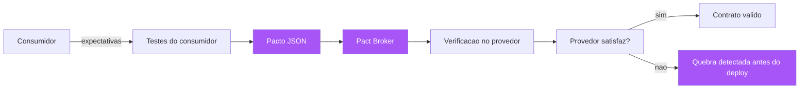

A ponte é o contrato: o documento da ponte é o OpenAPI ou o pacto; a conferência de dimensões é o schema-first (a planta da ponte existe antes dos prédios) e o contract testing (a ponte construída é verificada contra o documento) [2][3]. A lição da metáfora: a ponte não pode ser um detalhe resolvido depois — ela é a parte mais importante do projeto, porque é onde dois prédios, construídos por duas equipes com dois cronogramas, precisam concordar perfeitamente [23]. Você, como Engenheiro de Software, conhece o equivalente digital: a integração entre serviços é sempre a parte que quebra em produção, porque cada equipe tratou o contrato como detalhe da outra. O SDD de contratos inverte essa lógica: o contrato é a planta mais importante do projeto — e é tratado como tal [24].

## 4. Técnica

### Pact na prática: o lado do consumidor

O lado do consumidor define as expectativas e gera o pacto. Em Python, o Pact é usado com o framework `pact-python`:

```python
"""consumer_tests.py — lado do consumidor: define expectativas e gera o pacto."""
from pact import Consumer, Provider
import pytest

pact = Consumer("servico-pedidos").has_pact_with(Provider("servico-pagamentos"))


@pact.given("existe um pedido pago")
@pact.upon_receiving("uma solicitacao de estorno")
@pact.with_request("POST", "/pagamentos/estorno", body={
    "pedido_id": "42", "motivo": "cancelamento"
})
@pact.will_respond_with(200, body={"status": "estornado", "valor": 99.9})
def test_estorno() -> None:
    """O contrato esperado do provedor — vira o pacto JSON."""
    with pact:
        # Aqui o cliente real faz a chamada que o mock deve atender
        import requests
        resp = requests.post(
            "http://localhost:1234/pagamentos/estorno",
            json={"pedido_id": "42", "motivo": "cancelamento"},
        )
        assert resp.status_code == 200
        assert resp.json()["status"] == "estornado"
```

O pacto gerado é o artefato que o provedor vai verificar:

```json
{
  "consumer": { "name": "servico-pedidos" },
  "provider": { "name": "servico-pagamentos" },
  "interactions": [
    {
      "description": "uma solicitacao de estorno",
      "providerStates": [{ "name": "existe um pedido pago" }],
      "request": {
        "method": "POST",
        "path": "/pagamentos/estorno",
        "body": { "pedido_id": "42", "motivo": "cancelamento" }
      },
      "response": {
        "status": 200,
        "body": { "status": "estornado", "valor": 99.9 }
      }
    }
  ]
}
```

### Pact na prática: o lado do provedor

O lado do provedor publica os pactos no broker e executa a verificação:

```python
"""provider_tests.py — lado do provedor: verifica os pactos dos consumidores."""
from pact import Verifier
import os

BROKER_URL = os.environ.get("PACT_BROKER_URL", "http://localhost:9292")


def verificar_pactos() -> None:
    """Executa os pactos publicados no broker contra o provedor real (ou mock)."""
    verifier = Verifier(provider="servico-pagamentos", provider_base_url="http://localhost:8080")
    resultado = verifier.verify_pacts_from_broker(
        broker_url=BROKER_URL,
        publish=True,
        provider_version="1.4.2",
    )
    if resultado != 0:
        raise SystemExit(f"Contrato quebrado: {resultado} verificacao(oes) falharam")


if __name__ == "__main__":
    verificar_pactos()
```

```yaml
# docker-compose.yaml — o Pact Broker local (a central de contratos)
services:
  pact-broker:
    image: pactfoundation/pact-broker:latest
    ports:
      - "9292:9292"
    environment:
      PACT_BROKER_DATABASE_URL: "sqlite:////tmp/pact_broker.db"
    volumes:
      - pact-data:/tmp

volumes:
  pact-data:
```

### OpenAPI schema-first: a planta da API

O schema-first com OpenAPI começa pelo documento — antes de qualquer código:

```yaml
# openapi.yaml — a planta da API de pedidos (schema-first)
openapi: 3.0.3
info:
  title: API de Pedidos
  version: 1.0.0
paths:
  /pedidos/{id}:
    get:
      summary: Consulta um pedido
      parameters:
        - name: id
          in: path
          required: true
          schema:
            type: integer
      responses:
        "200":
          description: Pedido encontrado
          content:
            application/json:
              schema:
                $ref: "#/components/schemas/Pedido"
        "404":
          description: Pedido não encontrado
components:
  schemas:
    Pedido:
      type: object
      required: [id, total, estado]
      properties:
        id:
          type: integer
        total:
          type: number
        estado:
          type: string
          enum: [criado, pago, expedido, entregue, cancelado]
        itens:
          type: array
          items:
            $ref: "#/components/schemas/ItemPedido"
    ItemPedido:
      type: object
      required: [produto_id, quantidade, preco]
      properties:
        produto_id:
          type: integer
        quantidade:
          type: integer
        preco:
          type: number
```

A partir desse documento, o workflow schema-first: validação do schema (ferramentas como o validator do OpenAPI); geração de mocks para o desenvolvimento do consumidor; geração do esqueleto do servidor (OpenAPI Generator ou ferramentas similares); e a documentação interativa (Swagger UI) que é sempre verdadeira porque deriva da mesma planta [13][14][15].

### Avro e a evolução de schemas em streams

Para eventos em mensageria, o Avro é o padrão do ecossistema Kafka, e sua força é a evolução de schema explícita:

```json
{
  "type": "record",
  "name": "PedidoEvento",
  "namespace": "br.com.fabrica.pedidos",
  "fields": [
    { "name": "pedido_id", "type": "long" },
    { "name": "valor", "type": "double" },
    { "name": "estado", "type": { "type": "enum", "name": "EstadoPedido",
        "symbols": ["CRIADO", "PAGO", "EXPEDIDO", "ENTREGUE", "CANCELADO"] } },
    { "name": "itens", "type": { "type": "array", "items": "long" }, "default": [] }
  ]
}
```

A regra de evolução do Avro: campos novos DEVEM ter `default` (para não quebrar consumidores antigos que não os conhecem); campos removidos DEVEM ter sido deprecados antes; e mudanças de tipo são bloqueadas pela validação de compatibilidade [16]. Quando um evento é publicado com um schema novo, o schema registry do Kafka valida a compatibilidade com o schema anterior — o habite-se do evento [25]. Um exemplo de evolução segura: adicionar o campo `cupom` com `default: null` — consumidores antigos continuam lendo o evento, ignorando o campo novo; e o mesmo evento, lido por um consumidor novo, tem o cupom disponível. Um exemplo de quebra: renomear `estado` para `situacao` — consumidores antigos param de encontrar o campo, e a mensagem "quebra" em produção [26].

### O contrato como especificação de duas camadas: forma e semântica

Um erro conceitual comum no design de contratos é especificar apenas a FORMA dos dados — o que é necessário, mas insuficiente. O contrato de duas camadas declara também a SEMÂNTICA: o que cada campo significa, quais são as invariantes e o que os códigos de resposta significam de fato [22][24]. O OpenAPI descreve a forma (o schema do payload); a semântica vive nos cenários e nos testes de contrato — "um estorno com motivo 'cancelamento' altera o estado do pedido para 'cancelado' e libera o estoque". O time que especifica só a forma produz a integração que funciona estruturalmente e diverge semanticamente — o campo existe, mas o significado interpretado é outro, e a produção descobre a divergência da pior forma possível [24].

A especificação de duas camadas tem uma consequência organizacional: o contrato de forma é de responsabilidade da engenharia (o schema, a tipagem, a serialização), mas o contrato de semântica é de responsabilidade compartilhada com o negócio (o que cada comportamento significa e qual a regra de borda) [6]. O PO deve ser capaz de revisar os cenários de contrato — não o YAML do OpenAPI, mas os comportamentos descritos em Gherkin que verificam a API — e a aprovação da integração inclui a aprovação semântica, não só a estrutural. Essa separação explica por que o contrato de duas camadas é o ponto onde o Capítulo 8 encontra a obra inteira: a forma é o schema-first (Capítulo 8), a semântica é a Specification by Example (Capítulo 4), e a verificação é o habite-se (Capítulo 11) [5][29].

### A governança do contrato: quem muda o quê, e com qual portão

Os contratos entre serviços são os pontos mais sensíveis da arquitetura — e merecem governança explícita, análoga à da spec (Capítulo 6): quem pode mudar o contrato, e com qual portão? A política recomendada tem três regras. Primeira: toda mudança de contrato tem um dono declarado — o time do provedor para o schema, e a mudança que afeta semântica exige revisão dos consumidores afetados (o broker do Pact sabe quem são, e o pipeline bloqueia a mudança até os consumidores confirmarem) [2][9]. Segunda: mudanças aditivas (campos novos opcionais, endpoints novos) seguem o fluxo normal; mudanças incompatíveis (remover campo, mudar tipo, mudar semântica) exigem versão nova e período de coexistência — a política de deprecation documentada e auditável [20][21]. Terceira: o contrato nunca é mudado "no caminho" por um time apressado — a mudança de contrato passa pela mesma revisão da planta, porque o contrato É a planta da integração [6][24].

A governança do contrato tem um instrumento técnico que a viabiliza: o schema registry e o broker guardam o histórico — versões, datas, verificações — e o pipeline de cada provedor consulta "quais consumidores seriam afetados por esta mudança?" antes de conceder o trânsito [12][25]. O resultado é que a pergunta "posso mudar o campo X?" deixa de ser uma reunião e passa a ser uma consulta ao registro: o sistema responde quem consome X, qual o impacto e qual o período de coexistência necessário. A governança do contrato é, em essência, a burocracia boa do Capítulo 11 aplicada à integração: o procedimento que protege a obra sem atrasá-la, porque a consulta ao registro é mais rápida que o incidente que ela evita [18][27].

### O workflow completo de contrato: do schema ao deploy

O fluxo integrado de contrato em um sistema de microsserviços: (1) o contrato é definido (OpenAPI para REST, Avro/protobuf para eventos) ANTES do código; (2) o servidor e os clientes são gerados ou implementados a partir do contrato; (3) o consumidor escreve testes com Pact gerando o pacto; (4) o pacto é publicado no broker; (5) o pipeline do provedor verifica todos os pactos antes do deploy; (6) o schema registry valida a compatibilidade de cada novo schema de evento; e (7) qualquer mudança incompatível exige versão nova e período de coexistência [2][10][25]. Cada passo é um habite-se parcial, e o conjunto é o habite-se da integração: nenhum deploy quebra um consumidor sem ser detectado — porque a planta (contrato) é verificada contra a obra (serviço) continuamente [6][11].

## 5. Aplica

### A cena de contraste: o campo renomeado que derrubou o checkout

Você está em uma plataforma de e-commerce com 12 microsserviços. Na quarta-feira, o time de catálogo — sem comunicação com os outros times — renomeia o campo `preco` para `preco_final` no payload da API de produtos, "para refletir que agora inclui descontos". Na sexta-feira, o checkout quebra em produção: o serviço de pedidos, que consumia `preco`, recebe `undefined` e calcula o total como NaN — e a loja inteira deixa de vender por 40 minutos [27]. O post-mortem revela o padrão clássico: nenhum contrato existia — a API de catálogo era "documentada" em um wiki que ninguém lia, o consumidor descobria o formato por inspeção, e o time de catálogo nem sabia quem consumia o campo renomeado. Você, como engenheiro de confiabilidade, investiga e descobre que o wiki dizia `preco`, mas três serviços diferentes haviam feito suas próprias descobertas — um esperava `preco_final`, outro `valor`, outro `preco` — e a produção funcionava por coincidência, com cada serviço compensando a divergência em um adapter local [28].

O diagnóstico: a ausência de contrato não era um vazio — era um emaranhado de interpretações locais, exatamente o mosaico de interpretações do Capítulo 1, agora multiplicado por 12 serviços. A correção estrutural que você lidera tem três frentes. Primeira: o OpenAPI da API de catálogo é escrito — com `preco` e `preco_final` documentados, e o contrato aprovado pelos consumidores antes de qualquer mudança futura. Segunda: o Pact é adotado — o serviço de pedidos escreve os testes de consumidor definindo suas expectativas, o pacto é publicado no broker, e o pipeline do catálogo passa a verificar os pactos antes de cada deploy. Terceira: a política de evolução — qualquer renomeação de campo exige versão nova, deprecation de 90 dias e coexistência, verificada pelo schema registry para eventos e pelo broker para APIs [21][25]. Seis meses depois, a pergunta "quem consome o campo X?" tem resposta automática no broker — e a integração nunca mais derrubou o checkout.

### Armadilhas comuns

As armadilhas de contratos entre serviços são caras e evitáveis. A primeira é o contrato de fachada: OpenAPI escrito para cumprir ritual e nunca usado — sem verificação automatizada, o contrato é literatura, e a produção continua funcionando por coincidência. A segunda é o schema-drift: o contrato no repositório e o código real divergem, porque ninguém valida o contrato contra a implementação — a disciplina do schema-first inclui a verificação contínua de que o servidor satisfaz o contrato (contract testing, não apenas documentação) [13]. A terceira é o consumidor silencioso: serviços que consomem a API sem registrar expectativas (sem pacto, sem teste de contrato) — esses consumidores são os que quebram em produção sem aviso; a regra é que todo consumo de API externa registra contrato [10]. A quarta é a evolução por quebra: mudanças incompatíveis sem versão nova, sem deprecation — o atalho que parece economizar tempo e custa o checkout [20]. E a quinta é o contrato de um lado só: especificar a API mas ignorar os eventos — mensageria sem schema registry evolui por acidente, e cada produtor novo é um risco [25].

### A rede de contratos: o mapa de dependências como ativo de governança

Quando os contratos entre serviços são tratados como plantas, eles produzem um ativo novo: o mapa de dependências — a visão explícita de quem consome quem, com quais contratos e com quais versões [2][12]. O mapa nasce dos artefatos que o SDD de contratos já produz: os pactos no broker (cada pacto é uma aresta do grafo), os schemas no registry (cada schema é um nó com versão) e as verificações no CI (cada verificação é uma confirmação da aresta) [9][25]. O que era um conhecimento informal — espalhado na cabeça dos engenheiros, desatualizado — vira um grafo consultável: "quem consome o campo X?", "quem seria afetado pela remoção do endpoint Y?", "qual a versão mínima do contrato Z?" — cada pergunta tem resposta automática, em minutos, sem reunião [12][24].

O mapa de dependências é um ativo de governança porque ele transforma a decisão de mudança em uma decisão informada: antes de qualquer alteração de contrato, o mapa mostra o raio de impacto — e o raio de impacto decide o porte da mudança (aditiva e leve, ou incompatível e coordenada) [20][22]. Ele também é um ativo de auditoria: o histórico de pactos e verificações registra quando cada aresta foi confirmada e quando mudou — a caixa-preta da integração que responde "quem quebrou o quê, e quando?" [12][29]. E, finalmente, o mapa é o instrumento da evolução arquitetural: a decisão de dividir um serviço, consolidar dois, ou mudar o formato de mensageria (REST para gRPC, JSON para Avro) passa a ser tomada com o custo real da migração visível no mapa — cada aresta é uma integração a migrar, e o número de arestas é o tamanho do problema [1][27]. O mapa de dependências é a forma final da planta aplicada à arquitetura: a visão do todo, verificada continuamente, consultável por qualquer um.

### Métricas de sucesso e fracasso

Sucesso: zero quebras de integração em produção por mudança de contrato em um trimestre; todos os serviços que consomem APIs externas têm pactos verificados no pipeline; a evolução de contrato segue o fluxo documentado (versão → deprecation → coexistência); e a pergunta "quem consome isso?" tem resposta em minutos pelo broker. Fracasso: quebras de contrato em produção recorrentes; adapters locais de compensação crescendo a cada sprint (o sinal de que o contrato implícito diverge do real); OpenAPI e código divergindo sem verificação; e o sintoma mais caro — equipes que "melhoram" payloads sem saber quem consome [29].

A disciplina de contratos entre serviços se constrói com cinco práticas verificáveis. Prática um — contrato no mesmo repositório do consumidor: o pacto vive onde o consumidor vive, e a verificação roda no pipeline do consumidor; isso inverte o incentivo natural — quem quebra o contrato sente a dor primeiro, no próprio CI, e não em produção. Prática dois — versionamento explícito com janela de coexistência: toda mudança breaking passa por versão nova, depreciação com aviso mensurável (telemetria de chamadas à versão antiga), e só então remoção; o fluxo completo é documentado no contrato e o prazo de coexistência é definido em dias, não em eternidade — coexistência infinita é dívida de integração disfarçada de cortesia. Prática três — OpenAPI como fonte geradora: o schema é a fonte da verdade e o código de cliente e de servidor é gerado a partir dele, em vez de escrito à mão e depois sincronizado; quando a geração é o padrão, a divergência entre contrato e código perde o habitat natural. Prática quatro — contrato de eventos nos mesmos termos: para mensageria, o schema do evento (Avro ou JSON Schema, com evolution rules testadas) ocupa o papel do pacto, e o teste de compatibilidade roda contra a versão anterior publicada — a quebra de consumidor de evento é mais silenciosa e mais cara que a de REST, exatamente por isso exige guarda mais rígida. Prática cinco — cadastro de consumidores: um diretório mínimo (quem consome o quê, em qual versão, com qual contrato) alimenta a triagem de mudanças; sem cadastro, a resposta à pergunta "posso mudar isso?" é sempre um palpite [29]. A soma das cinco práticas transforma a quebra de contrato de incidente em exceção: o contrato deixa de ser uma promessa entre humanos e passa a ser um mecanismo verificado pela máquina, a cada commit, dos dois lados da fronteira.

## 6. Conclusão

Neste capítulo, você estendeu a planta à comunicação entre serviços: o contrato como especificação entre sistemas independentes [1][6]; o contract testing consumer-driven do Pact, onde o consumidor define as expectativas e o provedor é verificado contra elas [2][9][10]; o schema-first com OpenAPI, JSON Schema, Avro e Protocol Buffers, onde a especificação vem antes do código e gera servidores, clientes e documentação [3][4][13]; e a arte da evolução de contratos — adições seguras, remoções perigosas, versão, deprecation e coexistência [19][20][21]. O desafio: escolha uma API do seu sistema que já quebrou (ou quase) e escreva o contrato dela — OpenAPI ou pacto — com os consumidores reais listados. No próximo capítulo, vamos subir ao topo do rigor: a verificação formal e assistida — TLA+ e Dafny para sistemas onde erro não é opção, e o mutation testing como o auditor dos próprios testes — provando que a planta não só existe, mas que os testes realmente verificam a planta.

## 7. Referências Bibliográficas

[1] NEWMAN, Sam. *Building Microservices: Designing Fine-Grained Systems*. 2. ed. Sebastopol: O'Reilly Media, 2021.
[2] PACT. *Pact — Consumer-Driven Contract Testing*. Disponível em: https://docs.pact.io/. Acesso em: 5 ago. 2026.
[3] OPENAPI INITIATIVE. *OpenAPI Specification*. Disponível em: https://www.openapis.org/. Acesso em: 5 ago. 2026.
[4] GOOGLE. *Protocol Buffers Documentation*. Disponível em: https://protobuf.dev/. Acesso em: 5 ago. 2026.
[5] KLEPPMANN, Martin. *Designing Data-Intensive Applications: The Big Ideas Behind Reliable, Scalable, and Maintainable Systems*. Sebastopol: O'Reilly Media, 2017.
[6] FOWLER, Martin. *Consumer Driven Contracts* (bliki). Disponível em: https://martinfowler.com/articles/consumerDrivenContracts.html. Acesso em: 5 ago. 2026.
[7] JSON SCHEMA. *JSON Schema — A Media Type for Describing JSON Documents*. Disponível em: https://json-schema.org/. Acesso em: 5 ago. 2026.
[8] RICHARDS, Mark; FORD, Neal. *Fundamentals of Software Architecture: An Engineering Approach*. Sebastopol: O'Reilly Media, 2020.
[9] PACT. *Pact Broker Documentation*. Disponível em: https://docs.pact.io/pact_broker. Acesso em: 5 ago. 2026.
[10] PACT. *Consumer-Driven Contract Testing — Getting Started*. Disponível em: https://docs.pact.io/getting_started. Acesso em: 5 ago. 2026.
[11] FOWLER, Martin. *Contract Test* (bliki). Disponível em: https://martinfowler.com/bliki/ContractTest.html. Acesso em: 5 ago. 2026.
[12] PACT. *Pact Broker — Versioning and Webhooks*. Disponível em: https://docs.pact.io/pact_broker/webhooks. Acesso em: 5 ago. 2026.
[13] SWAGGER. *Swagger — API Development Tools*. Disponível em: https://swagger.io/. Acesso em: 5 ago. 2026.
[14] OPENAPI GENERATOR. *OpenAPI Generator — Generate clients and servers from OpenAPI*. Disponível em: https://openapi-generator.tech/. Acesso em: 5 ago. 2026.
[15] SMARTBEAR. *Swagger UI — Interactive API Documentation*. Disponível em: https://swagger.io/tools/swagger-ui/. Acesso em: 5 ago. 2026.
[16] APACHE AVRO. *Apache Avro*. Disponível em: https://avro.apache.org/. Acesso em: 5 ago. 2026.
[17] GRPC. *gRPC — A High Performance, Open Source Universal RPC Framework*. Disponível em: https://grpc.io/. Acesso em: 5 ago. 2026.
[18] CONFLUENT. *Schema Registry — Manage Avro schemas for Kafka*. Disponível em: https://docs.confluent.io/platform/current/schema-registry/index.html. Acesso em: 5 ago. 2026.
[19] SPRING. *Spring Cloud Contract*. Disponível em: https://spring.io/projects/spring-cloud-contract. Acesso em: 5 ago. 2026.
[20] FOWLER, Martin. *Semantic Versioning* (bliki). Disponível em: https://martinfowler.com/bliki/SemanticVersioning.html. Acesso em: 5 ago. 2026.
[21] PRESTWICH, Tom. *API Versioning: A Field Guide*. Disponível em: https://www.tom.preston-werner.com/2014/05/22/versioning.html. Acesso em: 5 ago. 2026.
[22] ADZIC, Gojko. *Specification by Example: How Successful Teams Deliver the Right Software*. Shelter Island: Manning Publications, 2011.
[23] BROOKS, Frederick P. *The Mythical Man-Month: Essays on Software Engineering*. Anniversary ed. Boston: Addison-Wesley, 1995.
[24] EVANS, Eric. *Domain-Driven Design: Tackling Complexity in the Heart of Software*. Boston: Addison-Wesley, 2003.
[25] CONFLUENT. *Schema Evolution and Compatibility*. Disponível em: https://docs.confluent.io/platform/current/schema-registry/fundamentals/schema-evolution.html. Acesso em: 5 ago. 2026.
[26] KLEPPMANN, Martin. *Turning the database inside-out* (apud MARTIN KLEPPMANN, 2017). Disponível em: https://martin.kleppmann.com/2015/11/05/database-inside-out-at-oredev.html. Acesso em: 5 ago. 2026.
[27] NEWMAN, Sam. *Monolith to Microservices: Evolutionary Patterns to Transform Your Monolith*. Sebastopol: O'Reilly Media, 2019.
[28] LEWIS, James; FOWLER, Martin. *Microservices* (apud MARTIN FOWLER, 2014). Disponível em: https://martinfowler.com/articles/microservices.html. Acesso em: 5 ago. 2026.
[29] ADZIC, Gojko. *Living Documentation: Continuous Knowledge Sharing by Design*. Boston: Addison-Wesley, 2017.

# Capítulo 9: Verificação formal e assistida: de TLA+ e Dafny ao mutation testing

## 1. Introdução

Você já sabe que a planta é a especificação e o habite-se é a verificação. Mas há uma pergunta incômoda que este capítulo enfrenta de frente: como saber se a verificação em si é confiável? Um teste que passa pode estar verificando o comportamento errado — ou verificando nada. Neste capítulo, você vai subir ao topo do rigor: a verificação formal e assistida — TLA+ e o model checking, Dafny e os contratos provados por máquina, Alloy e os contraexemplos automáticos [1][2][3] — e, no chão do dia a dia, o mutation testing, a técnica que audita os próprios testes perguntando "se eu plantar um defeito na planta, seus testes o pegam?" [4]. Você vai aprender quando cada nível de rigor é justificável, como integrá-los à sua especificação, e por que o objetivo não é provar tudo — é saber, com precisão, o que foi provado e o que não foi.

## 2. Explica

### A hierarquia da confiança

A confiança que você pode depositar numa especificação executável existe em uma hierarquia de rigor. No nível mais baixo, os testes de exemplo: a suíte verifica os comportamentos que alguém escreveu — e só eles; tudo o que não foi escrito como exemplo permanece não verificado [5]. Acima, a cobertura orientada por cenários: mede-se quais partes do comportamento foram exercitadas, mas cobertura não é corretude — uma linha coberta por um teste pode ainda conter um bug que o teste não observa. No nível seguinte, o mutation testing: plantam-se defeitos deliberadamente e mede-se quantos a suíte detecta — uma métrica real de qualidade da verificação [4]. E no topo, a verificação formal: a prova matemática de que o modelo satisfaz a especificação, para todos os estados possíveis — sem amostragem, sem aproximação, sem "quase" [1][2]. Cada nível custa mais e confere mais; a arte é escolher o nível proporcional ao risco, como você já viu no Capítulo 2 [6].

Você vai perceber que essa hierarquia responde à pergunta do Capítulo 4 com mais precisão: a documentação viva prova que o sistema se comporta como os exemplos dizem — mas não prova que os exemplos cobrem tudo o que importa. O mutation testing ataca exatamente essa lacuna: ele não verifica o sistema, verifica a especificação — mede quantos "erros plausíveis" a suíte detectaria. Se a suíte passa com 95% dos mutantes mortos, há confiança razoável; se passa com 40%, a suíte é decorativa [7]. E a verificação formal vai além: para sistemas onde a falha é inaceitável, ela substitui a amostragem de testes pela exaustão matemática — não "o teste passou nestas entradas", mas "a propriedade vale para todas as entradas e todos os estados" [8].

### TLA+: o model checking do tempo e da concorrência

O TLA+, criado por Leslie Lamport, é a linguagem de especificação para sistemas concorrentes e distribuídos [1]. Sua ideia central é a lógica temporal de ações: o sistema é descrito por um estado inicial e um conjunto de ações que transformam o estado; propriedades de segurança ("nunca acontece X") e de vivacidade ("eventualmente acontece Y") são declaradas como fórmulas; e o model checker TLC explora exaustivamente o espaço de estados, procurando violações [9]. A AWS adotou o TLA+ para serviços críticos e publicou a evidência: a técnica encontrou bugs reais e sutis que revisões e testes não pegaram, especialmente em protocolos de consenso, gerenciamento de falhas e alocação de recursos [10]. A experiência relatada: o modelo é pequeno (centenas de linhas), a modelagem é rápida (dias), e os bugs encontrados seriam caríssimos em produção [11].

O que o TLA+ ensina ao SDD cotidiano não é que todos devem escrever TLA+ — é que existe uma classe de comportamento que testes de exemplo nunca cobrem: o comportamento interativo entre estados ao longo do tempo [1]. Um teste unitário verifica uma transição; o model checking verifica todas as sequências de transições possíveis dentro de um escopo. Quando o seu sistema tem concorrência, timeouts, retries, partições de rede — a classe de bugs que você mais teme em produção — os testes de exemplo são intrinsecamente insuficientes, e a especificação formal é a ferramenta que a tradição (Capítulo 2) deixou para exatamente esse caso [12].

### Dafny e os contratos provados por máquina

O Dafny, da Microsoft, representa a convergência entre Design by Contract e verificação formal: uma linguagem de programação imperativa com contratos (precondições, pós-condições, invariantes) que são verificados automaticamente por um provador de teoremas (Z3) em tempo de compilação [2][13]. Diferente do TLA+ (que modela sistemas, não implementa), o Dafny é uma linguagem real: você escreve o código e os contratos juntos, e o compilador prova — ou rejeita — que o código satisfaz os contratos [14]. O uso prático: para funções críticas (cálculo financeiro, criptografia, parsing de formatos), o Dafny substitui a confiança amostral por prova: se compila, o contrato vale para todas as entradas — não para as entradas que alguém testou [2].

A relação do Dafny com o SDD é elegante: as pré-condições e pós-condições do Dafny são a mesma planta do Design by Contract do Capítulo 2 — mas verificada por máquina em vez de asserção em tempo de execução [15]. A asserção em runtime (Eiffel, Python com assert) verifica em cada execução; a prova do Dafny verifica em todas as execuções possíveis, antes de o código existir. O custo é a expressividade: provar propriedades complexas exige escrever o código de uma forma que o provador consiga raciocinar — uma disciplina que nem todo código aceita. A régua prática: o Dafny é para as poucas funções onde o erro é inaceitável e a prova é viável — o restante continua com testes de exemplo e mutation testing [16].

### Mutation testing: o auditor dos testes

O mutation testing é a técnica que faz pelos seus testes o que o fiscal faz pela obra: planta defeitos deliberados (mutantes) e verifica se a suíte os detecta [4][17]. O processo: o sistema é copiado; cada cópia recebe um defeito sintático mínimo — inverter um operador (`<` vira `>=`), remover uma condição, trocar uma constante, apagar uma chamada; e a suíte roda contra cada mutante. Um mutante "morto" é detectado por pelo menos um teste (a suíte falhou nele — bom); um mutante "sobrevivente" passa despercebido (a suíte não notou a mudança — mau: o teste não cobre aquele comportamento de fato) [18]. A métrica de qualidade é a taxa de mutação: a porcentagem de mutantes mortos. Uma taxa abaixo de 70-80% indica que a suíte verifica pouco do comportamento real — independentemente da cobertura de linhas reportada [7].

O mutation testing é a ponte entre a Specification by Example e a verificação formal: ele responde "os exemplares que você escreveu realmente verificam a planta, ou apenas tocam nela?" [19]. É comum descobrir que cenários Gherkin "passando" não detectam mutantes — porque a asserção do passo Then não observa o efeito que o mutante altera. O mutante sobrevivente é um diagnóstico preciso: este comportamento não está verificado, e o exemplar precisa ser reforçado [20]. O custo é computacional (rodar a suíte N vezes para N mutantes), mas ferramentas modernas otimizam com execução incremental e paralela, tornando a técnica viável no CI para módulos críticos [21].

## 3. Ilustra

Voltemos à construtora, agora na fase de vistoria. O engenheiro-chefe tem três instrumentos de confiança na obra. O primeiro é a inspeção amostral: o fiscal confere 10% das soldas da estrutura — barato, rápido, e deixa 90% sem conferência (são os testes de exemplo). O segundo é a inspeção com provocação: o engenheiro ordena que um técnico sabote uma viga de cada lote — remover um parafuso, afrouxar uma emenda — e verifica se a vistoria padrão detecta a sabotagem; a taxa de detecção revela a qualidade real da vistoria (é o mutation testing: você planta defeitos para medir a capacidade de detectá-los) [4]. O terceiro é o cálculo estrutural completo: um software de engenharia que simula a estrutura sob todas as combinações de carga, vento, sismo e degradação — não uma amostra, mas a exaustão matemática dos cenários possíveis (é a verificação formal) [8].

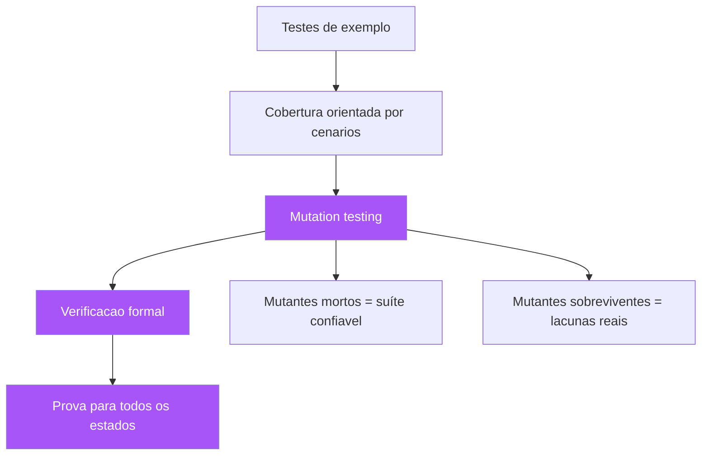

A lição da metáfora do sabotador é a mais valiosa do capítulo: a inspeção com provocação é a única que mede a capacidade de detecção da vistoria — e é exatamente o que a cobertura de linhas não faz. Cobertura mede "quantas linhas o teste tocou"; mutation testing mede "se o teste pegaria um defeito". A diferença é a mesma entre "o fiscal passou por todas as vigas" e "o fiscal perceberia se um parafuso faltasse" [19]. Você, como Engenheiro de Software, já teve a experiência de ver cobertura de 90% e ainda assim bugs escaparem — o mutation testing explica por quê: as linhas estavam cobertas, mas o comportamento não estava verificado [7].

## 4. Técnica

### Um modelo TLA+ verificável na prática

O exemplo clássico de TLA+ é o registro distribuído com eleição — vamos ver um modelo completo, com a propriedade de segurança que o TLC verifica:

```tla
---- MODULE Eleicao ----
EXTENDS Naturals, FiniteSets

CONSTANT NumeroDeNos
VARIABLES lider, vivo, mandato

Nos == 1..NumeroDeNos

Init == /\ lider \in Nos
        /\ vivo = 1
        /\ mandato = 0

Cai == /\ vivo = 1
       /\ vivo' = 0
       /\ UNCHANGED <<lider, mandato>>

Elege == /\ vivo = 0
         /\ lider' \in Nos
         /\ mandato' = mandato + 1
         /\ vivo' = 1

Next == Cai \/ Elege

Seguranca == /\ vivo = 1 => mandato > 0
             \/ vivo = 0

Spec == Init /\ [][Next]_<<lider, vivo, mandato>>
====
```

```bash
# Verificacao do modelo com TLC (o habite-se formal)
# 1) Compila o modelo (tlc executa a exploracao exaustiva)
java -jar tla2tools.jar Eleicao.tla -config Eleicao.cfg -workers 4
# 2) Saida esperada: "Model checking completed. No error has been found."
# 3) Se voce REMOVER a linha do mandato, o TLC acusa violacao de Seguranca:
#    o invariante falha no estado onde vivo=1 e mandato=0.
```

```tla
---- MODULE Eleicao (config) ----
CONSTANT NumeroDeNos = 3

INVARIANT Seguranca

PROPERTY NaoDuasEleicoesSemQueda
====
```

O que o TLC faz por você: explora todos os estados alcançáveis (3 nós, algumas dezenas de estados) e verifica a invariante em cada um — a exaustão que os testes de exemplo não fazem [1][9]. A lição prática: modelos pequenos já valem a pena — o protocolo de eleição acima, em poucas horas de modelagem, verifica matematicamente uma propriedade que testes unitários não conseguem provar para todas as sequências de eventos [10].

### Dafny: provando um contrato na prática

O Dafny prova que o código satisfaz o contrato — vamos ver uma função de domínio clássica:

```dafny
// A raiz quadrada inteira: pre-condicao, pos-condicao e loop com invariante.
// O provador Z3 verifica que a pos-condicao vale para TODAS as entradas validas.
function RaizInteira(n: nat): nat
    requires n >= 0
    ensures RaizInteira(n) * RaizInteira(n) <= n
    ensures (RaizInteira(n) + 1) * (RaizInteira(n) + 1) > n
{
    var r := 0;
    while (r + 1) * (r + 1) <= n
        invariant r * r <= n
        decreases n - r
    {
        r := r + 1;
    }
    r
}

method Main() {
    var r := RaizInteira(50);
    assert r * r <= 50 && (r + 1) * (r + 1) > 50;  // verificado pelo provador
    print r;
}
```

O que o Dafny prova: para qualquer `n` não negativo, o resultado satisfaz as duas cláusulas da pós-condição — não para os casos testados, para todos [2][14]. O compilador rejeita o código se a prova falha, e o loop precisa de invariante explícita para o provador raciocinar. A experiência de usar Dafny ensina uma disciplina valiosa para qualquer código: escrever o contrato primeiro (a planta), e depois o corpo que o satisfaz (a obra) — exatamente o fluxo do SDD [15].

### Mutation testing na prática: auditando a suíte

A aplicação prática do mutation testing na sua suíte:

```bash
# Mutation testing em Python com mutmut (exemplo)
pip install mutmut
# 1) Executa a suíte base e computa a cobertura de mutação
mutmut run --paths-to-mutate src/
# 2) Relatório da taxa de mutação
mutmut results
# 3) Ver os mutantes sobreviventes (os diagnósticos valiosos)
mutmut show-surviving
```

```python
"""Exemplo de lacuna que o mutation testing revela.

A funcao abaixo tem um teste que "passa" mas nao detecta o mutante
trocar '<' por '<=' — o mutante sobrevive, revelando que o comportamento
do limite nao esta verificado.
"""
from dataclasses import dataclass


@dataclass
class Pedido:
    valor: float


def frete_gratuito(pedido: Pedido) -> bool:
    return pedido.valor >= 100.0


# Teste atual: so cobre o caso "acima do limiar"
def test_frete_acima_do_limiar() -> None:
    assert frete_gratuito(Pedido(150.0)) is True


# O mutante '>= vira >' sobrevive com o teste acima:
#   frete_gratuito(Pedido(100.0)) -> False (mutante) vs True (original)
# A suíte nao distingue — o limite exato NAO esta verificado.
# Correcao: adicionar o caso do limite exato.
def test_frete_no_limiar_exato() -> None:
    assert frete_gratuito(Pedido(100.0)) is True
```

A lição do exemplo é concreta: o teste do caso feliz (150) não detecta a inversão do operador no limite (100) — o mutante sobrevive, e o relatório aponta exatamente a lacuna: o comportamento do limiar exato não está verificado [18][20]. Adicionar o caso do limite resolve — e o exemplar novo é exatamente o tipo de borda que a Specification by Example do Capítulo 4 manda capturar na descoberta. O mutation testing não substitui a descoberta — ele audita se a descoberta deixou lacunas [19].

### A estratégia de verificação por módulo: o mapa de rigor

A aplicação prática da hierarquia começa com um mapa: a classificação explícita de cada módulo do sistema pelo nível de rigor necessário. O mapa é uma tabela simples — módulo, criticidade (baixa/média/alta/extrema), custo de falha (em reais ou em vidas), e nível de rigor aplicado (exemplos, exemplos + mutation, modelos formais, prova formal) — e é o artefato que torna a régua de proporcionalidade operacional [6][16]. Sem o mapa, o rigor é distribuído por inércia: o módulo que alguém gostava recebe TLA+, o módulo crítico fica só com testes felizes; com o mapa, a distribuição é deliberada e revisável — e a auditoria consegue perguntar "por que o módulo X tem só exemplos se a criticidade é extrema?" e receber uma resposta, não um silêncio [8].

O mapa de rigor tem uma segunda função: ele é o termômetro da dívida de verificação. Módulos críticos com rigor insuficiente são dívida — e, como toda dívida técnica, ela acumula juros (o incidente que o rigor teria evitado, com multiplicador do Capítulo 1) [23]. A revisão periódica do mapa — a cada trimestre, ou a cada mudança de arquitetura — é o momento de migrar módulos: o que era baixa criticidade e cresceu em importância sobe de nível; o que era crítico e foi simplificado pode descer. A disciplina do mapa é a mesma da planta: a verificação não é um estado fixo, é uma decisão contínua, e a decisão deve ser explícita, documentada e revisada [24].

### O custo do rigor e a economia da verificação

O rigor tem custo, e a economia da verificação é a disciplina de comparar o custo do rigor com o custo do risco evitado. O custo do rigor tem três componentes: o custo de produção (escrever o modelo, a prova ou os mutantes — horas a dias); o custo de manutenção (cada mudança no módulo exige re-verificar — o modelo acompanha o código); e o custo de aprendizado (a curva de TLA+, Dafny ou da disciplina de mutation testing). O risco evitado tem dois componentes: a probabilidade de falha e o custo da falha — e é o produto dos dois que decide [6][8]. Um bug de protocolo em um serviço de pagamentos pode ter probabilidade baixa e custo altíssimo (o incidente da seção Aplica do Capítulo 2); um bug de validação em um formulário interno tem probabilidade média e custo baixo. A régua: o rigor sobe quando o produto (probabilidade × custo) sobe — e a régua é aplicada módulo por módulo, não globalmente [16].

A economia da verificação também tem um teorema contra-intuitivo: o rigor formal frequentemente REDUZ o custo total, mesmo quando o custo de produção é alto — porque ele desloca a detecção de bugs para a fase mais barata (o design, custo 1 na régua de Boehm do Capítulo 1) [4][10]. O TLA+ na AWS não economizou por evitar bugs baratos — economizou por encontrar, no design, bugs que teriam sido encontrados em produção com o multiplicador máximo [10][11]. A apresentação desse argumento à liderança — o rigor como investimento com retorno, não como custo — é a habilidade que separa o engenheiro que adota a verificação formal do que apenas a admira [25].

### Integrando os níveis de rigor ao fluxo SDD

A integração prática dos níveis de rigor ao seu fluxo: para a grande maioria do sistema, testes de exemplo + mutation testing no CI (taxa de mutação monitorada, com limiar por módulo crítico); para módulos com concorrência e protocolos, TLA+ na fase de design (o modelo acompanha o código e é re-verificado a cada mudança); e para funções críticas isoladas (cálculos, parsing), Dafny ou contratos verificados [6][16]. A régua de decisão é a mesma da planta: o nível de rigor é proporcional ao custo de falha — e o custo de falha é uma decisão de negócio, não técnica [8]. O relatório de qualidade do projeto deve declarar, de forma explícita, qual nível de rigor cada módulo recebeu — para que ninguém confunda "testado" com "provado" [11].

## 5. Aplica

### A cena de contraste: a suíte 90% verde que deixou o bug passar

Você é o engenheiro de qualidade de uma fintech. O time comemora: a suíte de testes do módulo de juros compostos tem 92% de cobertura de linhas — um orgulho. Então o incidente: um cliente recebeu juros incorretos em uma operação de 30 dias, e o erro — a capitalização aplicada em dias corridos em vez de dias úteis — estava no código havia quatro meses, com a suíte toda verde o tempo todo [22]. Você investiga e encontra o padrão: os testes do módulo cobrem os caminhos felizes com valores "redondos" (1 mês, taxa de 1%), mas nenhum teste cobre a diferença entre dias corridos e úteis — e, mais revelador, quando você roda o mutation testing no módulo, 58% dos mutantes sobrevivem: a suíte toca 92% das linhas, mas não verifica 42% dos comportamentos plausíveis [7].

O diagnóstico, doloroso: cobertura de linhas é uma métrica de vaidade — mede quantas linhas os testes tocaram, não o que eles verificam. A correção que você conduz tem duas frentes. Primeira: o mutation testing é integrado ao CI do módulo com limiar de 80% de mutantes mortos — e a primeira execução revela as lacunas reais: o cálculo de dias úteis, o ano bissexto, o arredondamento de centavos — cada mutante sobrevivente vira um exemplar novo na feature Gherkin (o fluxo do Capítulo 4: bug e lacuna viram exemplares) [20]. Segunda: para o cálculo de juros — a função mais crítica da empresa — a equipe escreve a spec com os casos de borda explícitos (dias corridos vs úteis, fim de mês, bissexto) e, no módulo mais sensível, avalia o Dafny para provar a fórmula de capitalização [15]. Três meses depois, a taxa de mutação do módulo está em 87%, e o incidente de juros virou o exemplo da empresa de por que "verde" não é suficiente.

### Armadilhas comuns

As armadilhas do rigor são reais. A primeira é o rigor por vaidade: TLA+ e Dafny usados em módulos triviais para "parecer sério" — o rigor tem custo e deve ser proporcional ao risco; ninguém modela o CRUD de usuários em TLA+ [6]. A segunda é o modelo órfão: TLA+ escrito no design e abandonado — o modelo que descreve um sistema que não existe mais, que dá confiança falsa (a mesma armadilha do Capítulo 2, agora com carimbo formal) [23]. A terceira é o mutation testing sem triagem: tratar a taxa de mutação como número sagrado e perseguir 100% — mutantes equivalentes (que não mudam o comportamento) e mutantes triviais inflam o número; a régua é a tendência, não o pico [7]. A quarta é confundir prova com teste: acreditar que código Dafny não precisa de testes — a prova cobre contratos, não integração, UX ou regressão de domínio; os níveis se complementam, não se substituem [16]. E a quinta é o silêncio do rigor: não declarar o nível de rigor de cada módulo — se o relatório não diz o que foi provado e o que foi apenas testado, a organização assume o nível errado [24].

### O rigor como linguagem comum entre engenheiros e auditoria

O rigor da verificação tem uma função organizacional que vai além da qualidade técnica: ele cria uma linguagem comum entre a engenharia e a auditoria — a capacidade de falar, com precisão, sobre o que foi verificado e o que não foi [8][24]. O engenheiro que diz "testado" sem qualificar e o auditor que ouve "provado" estão falando línguas diferentes, e a diferença é exatamente onde nascem as decisões erradas de risco: a organização que acredita que algo foi provado quando foi apenas amostrado assume riscos que não sabe que está assumindo [25]. A hierarquia da confiança deste capítulo é o vocabulário dessa linguagem comum: exemplo, cobertura, mutação, prova — quatro palavras com significados precisos, que engenharia e auditoria passam a compartilhar [6].

A linguagem comum tem efeitos práticos mensuráveis. Primeiro: as decisões de risco ficam honestas — o comitê que decide liberar um sistema crítico pergunta "qual o nível de rigor do módulo de pagamento?" e recebe uma resposta com significado preciso, não um "está bem testado" vago [8]. Segundo: os relatórios de qualidade passam a usar os termos da hierarquia — o relatório declara, módulo por módulo, o nível de rigor, e a lacuna entre o nível atual e o necessário fica visível [24]. Terceiro: a negociação de recursos muda de caráter — o pedido de tempo para modelar um protocolo em TLA+ deixa de ser "quero fazer algo teórico" e vira "quero mover o módulo X do nível exemplo para o nível prova, porque o custo de falha é Y" — um pedido que a auditoria entende e a liderança consegue avaliar [16][25]. A hierarquia da confiança, assim, não é apenas uma ferramenta técnica: é o instrumento que torna a verificação parte da conversa de governança, e não uma especialidade que a engenharia pratica em silêncio [11].

### Métricas de sucesso e fracasso

Sucesso: a taxa de mutação é monitorada no CI para módulos críticos e melhora trimestre a trimestre; os modelos TLA+ existem para os protocolos de concorrência e são re-verificados nas mudanças; as funções críticas com prova formal estão documentadas como "provadas"; e o relatório de qualidade declara o nível de rigor por módulo. Fracasso: cobertura de linhas alta com taxa de mutação baixa (o sinal de suíte decorativa); modelos formais abandonados e divergentes do código; e o sintoma mais caro — a descoberta em produção de um bug que o mutation testing teria revelado, porque ninguém rodou a técnica [25].

A implementação econômica dessas técnicas segue uma escada de rigor que o time sobe módulo a módulo. Degrau um — mutation testing no CI para os módulos críticos apenas (não a base inteira, que explode o custo): a configuração define a lista de mutantes ativos e o limiar de sobrevivência; o relatório aponta os pontos cegos da suíte, e o orçamento de tempo define quantos pontos cegos são fechados por iteração — a regra prática é fechar os três piores pontos cegos por sprint até o limiar estabilizar. Degrau dois — model checking para os protocolos de concorrência e de estados: TLA+ ou Alloy para a máquina de estados que orquestra recursos (sagas, retries, locks), com a propriedade a verificar escrita como invariante; a verificação roda em toda mudança do módulo, e o modelo mora ao lado do código, com um README dizendo o que foi provado e o que ficou fora. Degrau três — prova assistida para o punhado de funções onde o custo de falha é catastrófico: Dafny ou Frama-C para a lógica de validação de segurança e de fronteira financeira; aqui o critério de parada é o inverso do resto do livro — para essas funções, o código só é aceito com a prova, e a revisão de código inclui a revisão da prova, não só do código. A escada inteira é governada por uma pergunta de triagem: qual é o custo de falha deste módulo? Abaixo de um limiar, testes tradicionais bastam; acima dele, a técnica de rigor sobe um degrau. O erro mais caro que a escada evita é o investimento de rigor no lugar errado: provar formalmente o módulo trivial enquanto o módulo crítico vive de testes felizes — rigor mal distribuído é pior que ausência de rigor, porque consome o crédito de confiança da organização [25]. O objetivo final não é provar tudo, é provar exatamente o que importa, e saber dizer o que foi provado e o que ficou confiado a testes.

## 6. Conclusão

Neste capítulo, você subiu ao topo do rigor: a hierarquia da confiança — de testes de exemplo a cobertura, mutation testing e verificação formal [5][6]; o TLA+ e o model checking exaustivo para concorrência e distribuídos, com a evidência da AWS [1][9][10]; o Dafny e os contratos provados por máquina [2][13][14]; e o mutation testing como o auditor dos testes — a técnica que planta defeitos para medir a capacidade de detecção da suíte [4][17][18]. O desafio: rode o mutation testing no módulo mais crítico do seu sistema e traga os cinco mutantes sobreviventes mais reveladores para a próxima reunião — cada um deles é uma lacuna real da sua especificação. No próximo capítulo, vamos juntar tudo o que você aprendeu em um fluxo único e completo: do plano à obra — o SDD end-to-end, da spec aprovada ao código em produção, com a triagem entre spec quebrada e código quebrado e o ritmo sustentável da execução.

## 7. Referências Bibliográficas

[1] LAMPORT, Leslie. *Specifying Systems: The TLA+ Language and Tools for Hardware and Software Engineers*. Boston: Addison-Wesley, 2002.
[2] LEINO, K. Rustan M. Dafny: An Automatic Program Verifier for Functional Correctness. In: *LPAR-16 — Logic for Programming, Artificial Intelligence, and Reasoning*. Berlin: Springer, 2010. p. 348-370.
[3] JACKSON, Daniel. *Software Abstractions: Logic, Language, and Analysis*. Cambridge: MIT Press, 2006.
[4] OFFUTT, Jeff. *Mutation Testing for the New Century*. Norwell: Kluwer, 2001.
[5] BECK, Kent. *Test-Driven Development: By Example*. Boston: Addison-Wesley, 2002.
[6] BOWEN, Jonathan; HINCHEY, Michael. Ten Commandments of Formal Methods. *IEEE Computer*, v. 28, n. 4, p. 56-63, 1995.
[7] OFFUTT, Jeff; UNTCH, Roland H. Mutation 2000: Uniting the Orthogonal. In: *Mutation Testing for the New Century*. Norwell: Kluwer, 2001. p. 34-44.
[8] HALL, Anthony. Seven Myths of Formal Methods. *IEEE Software*, v. 7, n. 5, p. 11-19, 1990.
[9] LAMPORT, Leslie. *The Temporal Logic of Actions*. ACM Transactions on Programming Languages and Systems, v. 16, n. 3, p. 872-923, 1994.
[10] NEWCOMBE, Chris et al. How Amazon Web Services Uses Formal Methods. *Communications of the ACM*, v. 58, n. 4, p. 66-73, 2015.
[11] NEWCOMBE, Chris. *Why Amazon Chose TLA+*. 2014. Disponível em: https://brooker.co.za/blog/2014/03/16/amazon-and-tla.html. Acesso em: 5 ago. 2026.
[12] KLEPPMANN, Martin. *Designing Data-Intensive Applications*. Sebastopol: O'Reilly Media, 2017.
[13] LEINO, K. Rustan M. *Dafny Documentation*. Disponível em: https://dafny.org/. Acesso em: 5 ago. 2026.
[14] LEINO, K. Rustan M.; WÜSTRICH, Michał. The Dafny Integrated Development Environment. In: *Proceedings of F-IDE 2014*. 2014.
[15] MEYER, Bertrand. *Object-Oriented Software Construction*. 2. ed. Upper Saddle River: Prentice Hall, 1997.
[16] LEINO, K. Rustan M. *Developing Verified Programs with Dafny*. Disponível em: https://dafny.org/dafny/OnlineTutorial/. Acesso em: 5 ago. 2026.
[17] BUDD, Timothy A. et al. The Design of a Prototype Mutation System for Program Testing. In: *Proceedings of the National Computer Conference (AFIPS)*. 1978. p. 623-627.
[18] OFFSETT, Jeff. Mutation Analysis. In: *Encyclopedia of Software Engineering*. New York: Wiley, 2002.
[19] ADZIC, Gojko. *Specification by Example: How Successful Teams Deliver the Right Software*. Shelter Island: Manning Publications, 2011.
[20] OFFSETT, Jeff. *Mutation Analysis in Practice*. Disponível em: https://cs.gmu.edu/~offutt/papers/. Acesso em: 5 ago. 2026.
[21] JUST, René. *The Major Mutation Framework*. Disponível em: https://mutation-testing.org/. Acesso em: 5 ago. 2026.
[22] WEINBERG, Gerald M. *Quality Software Management: Systems Thinking*. New York: Dorset House, 1992.
[23] PARNAS, David L. Software Aging. In: *Proceedings of the 16th International Conference on Software Engineering (ICSE)*. New York: IEEE, 1994. p. 279-287.
[24] ADZIC, Gojko. *Living Documentation: Continuous Knowledge Sharing by Design*. Boston: Addison-Wesley, 2017.
[25] OFFSETT, Jeff; HAYES, Jeff. *Semantic Mutation Analysis*. In: *Proceedings of the IEEE International Conference on Software Testing (ICST)*. 2010.

# Capítulo 10: Do plano à obra: o fluxo SDD completo na prática

## 1. Introdução

Você já tem todas as peças da planta: o diagnóstico da intenção perdida (Capítulo 1), a tradição formal (Capítulo 2), o BDD e o Given-When-Then (Capítulo 3), os exemplares (Capítulo 4), a linguagem ubíqua e a descoberta (Capítulo 5), a spec de seis elementos (Capítulo 6), as ferramentas (Capítulo 7), os contratos entre serviços (Capítulo 8) e o rigor da verificação (Capítulo 9). Este capítulo é o momento de juntar tudo: o fluxo completo do SDD, da intenção ao código verificável em produção — um exemplo end-to-end que percorre todas as etapas, do refinamento ao deploy [1][2]. Você vai aprender a triagem entre spec quebrada e código quebrado, o ritmo sustentável da execução, e como o fluxo inteiro se organiza em torno de um princípio único: a planta manda, o canteiro obedece, e o habite-se atesta [3].

## 2. Explica

### O fluxo completo em sete estações

O SDD end-to-end organiza-se em sete estações, cada uma com um artefato de entrada e um de saída. A estação 1 é a Descoberta: a conversa do refinamento, guiada pelo event storming (Capítulo 5), produz o vocabulário e os primeiros exemplares. A estação 2 é a Formulação: os exemplares viram a spec de seis elementos (Capítulo 6) com os cenários Gherkin (Capítulo 3) apontados nos critérios de verificação. A estação 3 é a Aprovação: o PO e o time revisam a spec — e ninguém passa daqui sem a planta aprovada; especificação em rascunho não autoriza canteiro [4]. A estação 4 é a Automação: os cenários são conectados a step definitions (Capítulo 7) e rodam vermelho — a planta executável existe e atesta que o comportamento ainda não existe. A estação 5 é a Implementação: o código é escrito contra a planta, cenário a cenário, até o verde [5]. A estação 6 é a Verificação contínua: a suíte roda no CI a cada merge, com o mutation testing auditando a qualidade da verificação (Capítulo 9) [6]. E a estação 7 é a Evolução: mudanças futuras começam pela planta — a spec muda primeiro, e o código segue [7].

Você vai perceber que as sete estações são a materialização das disciplinas dos capítulos anteriores em um fluxo único. A genialidade do fluxo é que cada estação tem um portão de saída verificável: a Descoberta termina quando os exemplares existem; a Formulação, quando a spec tem os seis elementos e o lint passa (Capítulo 6); a Aprovação, quando o PO assina; a Automação, quando os cenários rodam (vermelho); a Implementação, quando ficam verdes; a Verificação, quando o CI está verde e a taxa de mutação respeita o limiar; e a Evolução, quando a mudança na planta precede a mudança no código [8]. O fluxo não é um processo burocrático — é uma sequência de habite-ses parciais, cada um atestando que a obra pode avançar para a próxima etapa [1].

### A triagem da falha: spec quebrada ou código quebrado?

No coração do fluxo está uma habilidade que separa times maduros de times imaturos: a triagem da falha. Quando um cenário falha — no desenvolvimento ou no CI — existem apenas duas causas possíveis: a planta está errada (a spec descreve um comportamento que o negócio não quer, ou descreve errado) ou o edifício está errado (o código não implementa o que a planta manda) [9]. A triagem é o processo disciplinado de decidir qual das duas — e a regra é: primeiro, pergunte ao dono da planta. O PO é consultado sobre o comportamento esperado; se a spec descreve o comportamento certo e o código diverge, é bug de implementação — corrige o código; se a spec descreve o comportamento errado, é bug de especificação — corrige a planta, e o código que a satisfazia era correto para uma planta incorreta [10]. A triagem disciplinada muda a cultura: o vermelho deixa de ser "alguém errou" e vira "a planta e o edifício divergiram — vamos descobrir qual é a verdade, com o dono da planta" [11].

A triagem também tem um componente técnico: nem toda falha de cenário é uma falha de comportamento. O passo Given pode falhar porque o estado do sistema mudou (a planta não descreve o estado novo); o passo Then pode falhar porque o observável não está disponível (a planta pede uma asserção que o sistema não expõe); e o step definition pode falhar por problema de automação (o passo não está mapeado ou mapeado errado) [12]. A regra de ouro: antes de tocar no código de produção, o time deve confirmar que a falha é de comportamento — e não de teste — porque corrigir o código para "fazer o teste passar" sem validar a planta é exatamente o sintoma do Capítulo 1, o código que nasce da interpretação [13].

### O ritmo sustentável da execução

O SDD falha como ritual e funciona como ritmo. O ritmo sustentável tem três propriedades. Primeira: lotes pequenos — cada funcionalidade é um lote de cenários pequeno o suficiente para ser implementado em um dia ou dois; lotes grandes transformam a suíte em um monólito de dependências e o fluxo em um funeral [14]. Segunda: verde frequente — o time integra com a suíte verde pelo menos uma vez por dia; vermelho persistente é o sinal de que a planta e a obra divergiram demais e a correção está ficando cara [5]. Terceira: a planta evolui com a obra — especificação e código são atualizados no mesmo merge, nunca em merges separados; a regra do "spec e código juntos" é o que mantém a documentação viva viva (Capítulo 4) [7][15]. O ritmo não é velocidade — é cadência: a cadência regular de descoberta, formulação, automação, implementação e verificação, repetida sprint após sprint, que faz do SDD um hábito do time em vez de uma campanha [16].

### O papel do humano no fluxo

Um aviso importante sobre o fluxo completo: o SDD não remove o humano do processo — ele reposiciona o humano no lugar de maior valor [17]. O humano decide os outcomes e as fronteiras (o PO), revisa a planta antes do canteiro (a aprovação), arbitra a triagem da falha (a verdade sobre o comportamento), e responde pelas decisões que a planta não cobre (os casos novos). O que o SDD remove é o trabalho de baixo valor: a interpretação adivinhada, o retrabalho de requisitos, a documentação que apodrece [18]. Em um time com agentes de IA (o tema do Capítulo 12), esse reposicionamento fica ainda mais explícito: a planta é o contrato entre o humano e o agente, e o humano é o dono da planta — nunca o revisor de código gerado sem planta [19].

## 3. Ilustra

Voltemos à construtora para a obra final: o edifício completo, construído com todas as disciplinas da série. O arquiteto (PO) e o engenheiro (dev) e o fiscal (QA) conduzem a obra em sete estações — o mesmo fluxo que você aprendeu. Na estação 1, a oficina de event storming mapeia o fluxo do prédio: entrega de materiais, fundação, estrutura, hidráulica, elétrica, acabamento — com os eventos, comandos e regras na parede (Capítulo 5). Na estação 2, cada etapa vira um contrato de encargos com os seis elementos (Capítulo 6), e cada regra vira um cenário de conferência (Capítulo 3). Na estação 3, o cliente revisa e assina os contratos — nenhum pedreiro começa antes da assinatura (a aprovação). Na estação 4, os fiscais preparam os instrumentos de conferência — as pranchetas com as medições (a automação, que roda vermelha porque a obra ainda não existe). Na estação 5, as equipes constroem andar a andar, conferindo cada medição até o verde (a implementação). Na estação 6, a vistoria contínua — cada entrega parcial é vistoriada, e o engenheiro provoca sabotagens para medir a qualidade da vistoria (o mutation testing, Capítulo 9). Na estação 7, qualquer mudança do cliente começa pelo contrato: o papel muda primeiro, e a obra segue (a evolução) [20].

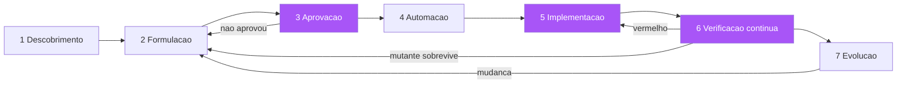

A lição da metáfora da obra completa: cada estação tem um portão verificável, e o fluxo inteiro é a repetição disciplinada de um ciclo — desenhar, aprovar, construir, verificar, evoluir [1]. A obra não é uma sequência linear que termina; é um ciclo que gira: a evolução realimenta a formulação, e o edifício cresce e muda mantendo a conformidade com a planta — o habite-se contínuo que você verá em detalhe no Capítulo 11 [21]. Você, como Engenheiro de Software, reconhece o padrão: o fluxo completo não é uma metodologia nova — é a organização de todas as práticas que você já domina em uma sequência com portões verificáveis, onde cada etapa sabe exatamente quando termina e o que entrega [22].

## 4. Técnica

### O exemplo end-to-end: a promoção de frete

Vamos executar o fluxo completo em um exemplo real, do refinamento ao deploy — a promoção de frete grátis que você viu em versões anteriores, agora com as sete estações em sequência. Estação 1 — Descoberta: a oficina produz os exemplares:

```markdown
# EXEMPLARES — Promoção de frete grátis (produzidos na oficina de descoberta)

1. pedido de 150, sem cupom -> frete gratuito
2. pedido de 100, sem cupom -> frete gratuito (limiar inclui o valor exato)
3. pedido de 99.99, sem cupom -> frete pago
4. pedido de 101 com cupom de 5 -> frete pago (cupom abate antes do limiar)
5. pedido de 0 (vazio) -> inválido, frete não calculado
6. reenvio do cálculo -> resultado idempotente (mesma entrada, mesma saída)
```

Estação 2 — Formulação: os exemplares viram a spec de seis elementos com os cenários (você já viu o SPEC.md e o frete.feature nos capítulos 4 e 6). Estação 3 — Aprovação: o PO confere os exemplares, decide as bordas (o limiar inclui 100; o cupom abate antes) e assina. Estação 4 — Automação: os cenários são conectados aos steps e rodam vermelho:

```bash
# Estacao 4: a planta executavel atesta que o comportamento ainda nao existe
pytest tests/features -q
#   FAILED tests/features/frete.feature::Frete gratuito acima do limiar
#   FAILED tests/features/frete.feature::Frete pago abaixo do limiar
# 4 falharam, 0 passaram  -> a planta existe e esta vermelha (comportamento ausente)
```

Estação 5 — Implementação: o código é escrito contra a planta, cenário a cenário:

```python
"""frete.py — implementacao guiada pelos cenarios da feature frete.feature."""
from dataclasses import dataclass


@dataclass
class Pedido:
    valor: float
    cupom: float | None = None

    @property
    def valor_final(self) -> float:
        return self.valor - (self.cupom or 0.0)


LIMIAR = 100.0


def calcular_frete(pedido: Pedido) -> str:
    """Decisoes da planta: limiar inclui o valor exato; cupom abate antes."""
    if pedido.valor <= 0:
        return "invalido"
    if pedido.valor_final >= LIMIAR:
        return "gratuito"
    return "pago"
```

```python
"""test_frete.py — os cenarios viram testes de unidade no mesmo merge."""
from frete import Pedido, calcular_frete


def test_frete_acima_do_limiar() -> None:
    assert calcular_frete(Pedido(150.0)) == "gratuito"


def test_frete_no_limiar_exato() -> None:
    assert calcular_frete(Pedido(100.0)) == "gratuito"


def test_frete_abaixo_do_limiar() -> None:
    assert calcular_frete(Pedido(99.99)) == "pago"


def test_cupom_abate_antes_do_limiar() -> None:
    assert calcular_frete(Pedido(101.0, cupom=5.0)) == "pago"


def test_pedido_vazio_invalido() -> None:
    assert calcular_frete(Pedido(0.0)) == "invalido"
```

Estação 6 — Verificação contínua: a suíte roda no CI a cada merge, e o mutation testing audita a qualidade:

```bash
# Estacao 6: CI com suíte + mutation testing no módulo crítico
pytest -q && mutmut run --paths-to-mutate frete.py
# Se o mutation testing revelar um mutante sobrevivente (ex.: trocar >= por >),
# o exemplar do limite exato ja cobre — e o CI bloqueia o merge ate o limiar.
```

Estação 7 — Evolução: quando o marketing muda a promoção (frete grátis a partir de 150), a MUDANÇA começa pela planta: a feature e a spec mudam primeiro, os cenários atualizados rodam vermelho contra o código antigo, e o código segue [7].

### A triagem da falha na prática

O cenário da triagem em ação: a promoção está em produção, e um cenário novo falha no CI — "pedido de 101 com cupom de 5 -> frete pago" está vermelho. O time aplica a triagem em três perguntas. Primeira: a planta está certa? O PO é consultado: "a regra é cupom abate antes do limiar?" — se sim, o código está errado (a implementação aplicou o limiar no valor bruto). Segunda: o código diverge da planta? O teste de unidade correspondente falha? — se o teste de unidade passa e o cenário falha, o problema pode estar no step definition (a automação mapeou o valor errado). Terceira: é problema de automação? O passo "Dado um pedido com valor de 101" está mapeado para o parâmetro correto? — erros de parsing de passo são a causa mais comum de falso vermelho [12]. A triagem disciplina a resposta: o time não "corrige o código" sem responder às três perguntas, e a correção resultante é sempre a correta — planta, código ou automação [10].

### O pipeline CI do fluxo completo

O pipeline de CI que materializa o fluxo completo tem cinco estágios: lint da spec (a spec dos seis elementos e o glossário — o portão da estação 2); automação (os cenários rodam — o portão da estação 4); verificação (a suíte verde — o portão da estação 6); rigor (o mutation testing nos módulos críticos — o portão da estação 6); e contrato (a verificação de contratos entre serviços, se aplicável — o portão do Capítulo 8) [8][23]:

```yaml
# .github/workflows/sdd.yml — o habite-se do fluxo completo
name: Habite-se SDD
on: [push, pull_request]
jobs:
  planta:
    runs-on: ubuntu-latest
    steps:
      - uses: actions/checkout@v4
      - name: Lint da spec (6 elementos + glossario)
        run: python lint_spec.py SPEC.md && python lint_glossario.py glossario.md
      - name: Automacao dos cenarios (vermelho permitido so na estacao 4)
        run: pytest tests/features -q
      - name: Verificacao completa
        run: pytest -q
      - name: Mutation testing nos modulos criticos
        run: mutmut run --paths-to-mutate src/frete.py --threshold 80
```

### A estação da descoberta na prática: o tempo que a planta economiza

Um dos mitos que matam a adoção do SDD é "especificar é mais lento". A verdade, medida por times que percorrem o fluxo completo, é mais sutil: a especificação não é mais lenta — ela concentra o tempo no começo e o recupera com juros no resto do fluxo [1][14]. O tempo da descoberta e da formulação (estações 1 e 2) é de horas a um dia para uma funcionalidade típica; o tempo que economiza está na implementação (sem retrabalho de interpretação), na revisão (a planta é revisada antes, o código é revisado contra a planta — mais rápido), nos testes (os cenários já existem, não precisam ser inventados na hora), e na manutenção (a mudança futura é guiada pela planta, não caçada no código) [10][22].

O cálculo prático que o time deve fazer no piloto: comparar o tempo total (descoberta + formulação + implementação + verificação) de uma funcionalidade com planta contra o tempo total da mesma funcionalidade sem planta — não apenas o tempo de implementação. A maioria dos times descobre que o tempo total é igual ou menor, e que a diferença qualitativa — menos bugs, menos discussões, menos retrabalho — torna a comparação ainda mais favorável [14][28]. O tempo que a planta economiza não é uma abstração: é o tempo que você não gasta rediscutindo o que foi decidido, reescrevendo o que foi interpretado errado, e re-testando o que já foi verificado [24].

### A estação da evolução na prática: mudanças guiadas pela planta

A estação 7 — a evolução — é onde o SDD se paga no longo prazo, e tem uma disciplina específica: toda mudança de comportamento começa pela planta, e o fluxo de mudança é o mesmo fluxo da criação, em versão reduzida [7][15]. A mudança pequena (ajustar um limiar, adicionar uma condição): a feature muda primeiro (o cenário novo ou alterado), o código segue, e o merge inclui os dois — a regra do "spec e código juntos" que mantém a documentação viva viva. A mudança média (novo comportamento em funcionalidade existente): a descoberta rápida (quais são os exemplos novos?), a formulação (os cenários novos), a aprovação do PO (a fronteira nova), e a implementação. A mudança grande (nova funcionalidade): o fluxo completo das sete estações, do mesmo jeito que a criação [8].

O benefício mensurável da evolução guiada pela planta: o custo de mudança cai ao longo do tempo em vez de subir. Em um sistema sem planta, o custo de mudança cresce com o tamanho do código (mexer em uma parte exige entender o todo, e o todo é caótico); com a planta, o custo de mudança é proporcional ao escopo da mudança (os cenários afetados delimitam o impacto, e a suíte verde atesta que nada mais quebrou) [15][27]. A métrica que documenta esse benefício: o tempo médio de entrega de uma mudança de comportamento, medido trimestre a trimestre — e a tendência de queda é o gráfico que convence qualquer liderança de que a planta é investimento, não custo [28].

### O caderno de registro do fluxo

A última ferramenta prática é o caderno de registro: um arquivo que documenta, para cada funcionalidade, o caminho percorrido pelo fluxo — os exemplares, a spec, a data de aprovação, os cenários, a taxa de mutação e as divergências encontradas na triagem [24]. O caderno é a memória do fluxo: quando uma funcionalidade antiga muda, o caderno diz qual planta foi aprovada, quais bordas foram decididas e por quê — eliminando a necessidade de reconstruir a história por conversas [7][15]. O formato: uma seção por funcionalidade, com os artefatos referenciados (não copiados) e as decisões de triagem registradas com data e responsável — o mesmo espírito da caixa-preta da aviação: se algo der errado, o registro permite reconstruir exatamente o que foi aprovado e o que divergiu [21].

## 5. Aplica

### A cena de contraste: o fluxo pulado e a promoção que quebrou de novo

Você é o novo tech lead de um e-commerce que "adotou SDD" há seis meses — mas a adoção é seletiva: a equipe escreve cenários Gherkin e roda o Cucumber, mas pula as estações 1, 2 e 3 (descoberta, formulação e aprovação) quando "o prazo aperta". O marketing lança uma promoção nova: "frete grátis acima de R$ 150 para assinantes premium". O desenvolvedor encarregado, pressionado, escreve o cenário diretamente no código — "Dado um assinante premium com pedido de 200, então frete gratuito" — sem oficina, sem spec, sem aprovação. A implementação "passa". Na sexta-feira, o incidente: clientes não assinantes recebem frete grátis em pedidos acima de 150 — porque ninguém especificou a fronteira "somente assinantes premium", e o desenvolvedor interpretou "assinantes" como "todos" ao generalizar o código de frete existente [25].

O diagnóstico: a equipe pulou as três primeiras estações — sem descoberta (ninguém mapeou os casos de borda: assinante vs não assinante, cupom, limiar), sem formulação (a spec de seis elementos com fronteiras explícitas não existia — o "fora de escopo: clientes não assinantes" teria bloqueado o desvio) e sem aprovação (o PO nunca validou a regra). O cenário escrito pelo desenvolvedor era a planta desenhada por quem constrói, para quem constrói — o erro clássico do Capítulo 3, em versão de prazo apertado [11]. A correção que você conduz é cultural e estrutural: o fluxo completo volta a ser obrigatório, e o portão da aprovação — a estação 3 — vira inegociável: nenhuma implementação começa sem a spec aprovada pelo PO, mesmo em promoções de prazo apertado; o incidente vira o caso de estudo da empresa sobre o custo de pular a planta [26].

### Armadilhas comuns

As armadilhas do fluxo completo são as dos capítulos anteriores, agora em combinação. A primeira é o fluxo seletivo: aplicar as estações de automação e implementação, pulando descoberta e aprovação quando o prazo aperta — a armadilha mais comum, porque a automação dá a ilusão de processo; a disciplina é que o fluxo é um todo, e pular uma estação é escolher o incidente [11]. A segunda é o portão de papel: a aprovação existe, mas ninguém a verifica — o PO assina sem ler, e a planta aprovada é uma planta não revisada; o portão só funciona com revisão real [4]. A terceira é o vermelho eterno: a suíte fica vermelha por dias e o time se acostuma — o vermelho crônico é o sinal de que a planta e a obra divergiram demais e o fluxo parou de funcionar; a regra é que vermelho se resolve no mesmo dia [5]. A quarta é a triagem preguiçosa: toda falha vira "bug de código" sem consultar o PO — o reflexo que mantém os bugs de especificação invisíveis; a triagem disciplinada é o que separa o SDD do "TDD com Gherkin" [9]. E a quinta é o fluxo sem memória: o caderno de registro não existe, e as decisões de borda se perdem — a próxima mudança reabre discussões que já foram decididas [24].

### O fluxo e a equipe: o SDD como prática coletiva

O fluxo completo do SDD não é uma técnica individual — é uma prática coletiva, e a diferença importa na adoção [2][16]. O desenvolvedor individual pode escrever cenários sozinho, mas o fluxo das sete estações exige o trio (PO, dev, QA) na descoberta, o PO na aprovação, o QA na provocação de bordas e o time inteiro na triagem da falha. Quando o fluxo funciona como prática coletiva, cada papel tem uma responsabilidade clara e um portão que depende dos outros — a interdependência é o que impede o SDD de degenerar em mais um ritual solitário [14][16]. A adoção individual — o dev que escreve Gherkin sozinho, sem o trio — produz exatamente a planta escrita por quem constrói que o Capítulo 3 diagnosticou [11].

A prática coletiva tem um mecanismo de sustentação: o caderno de registro (que você verá adiante) e a revisão retrospectiva do fluxo. Na retrospectiva, o time revisa não apenas o que entregou, mas como o fluxo funcionou: onde a descoberta foi pulada, onde a triagem foi preguiçosa, onde o portão foi contornado — e cada desvio vira uma correção do próprio fluxo (a mesma evolução do pipeline do Capítulo 11) [24][27]. A retrospectiva do fluxo é o que impede a degradação lenta: sem ela, o fluxo completo de sete estações encolhe para cinco, depois três, até sobrar só a automação — e o time volta ao ponto de partida com um framework de testes a mais [26][28]. A prática coletiva exige o mesmo tratamento que a planta: é um artefato vivo, que se mantém por revisão e evolução contínua — e é essa manutenção que a transforma em hábito da equipe, e não em campanha de seis meses [22].

### Métricas de sucesso e fracasso

Sucesso: a proporção de funcionalidades que percorrem o fluxo completo (sete estações) passa de 90%; o tempo de vermelho no CI é medido e fica abaixo de horas por semana; as divergências de triagem são registradas no caderno e consultadas em mudanças futuras; e o incidente em produção por interpretação de requisito cai para perto de zero [27]. Fracasso: funcionalidades entregues sem spec aprovada; cenários escritos pelo desenvolvedor sem descoberta; vermelho crônico; e o sintoma mais revelador — quando o PO pergunta "como sabemos que a promoção está correta?" e a resposta é "os testes passam" em vez de "a planta foi aprovada e os cenários estão verdes" [28].

A implantação do fluxo completo em uma organização existente tem três pontos de alavancagem que determinam o sucesso. O primeiro é o ponto de entrada: não converta a organização inteira de uma vez — escolha uma esteira de negócio com dor aguda de retrabalho (a equipe que mais devolve histórias) e a faça funcionar no fluxo completo; o caso de sucesso visível cria a demanda orgânica que nenhum comunicado interno cria. O segundo é a mudança do rito de sprint: a revisão de sprint deixa de ser demonstração de código e passa a ser leitura de cenários — o PO percorre os cenários verdes da iteração e pergunta "é isto?", e a resposta é o atestado de habite-se; essa única mudança de rito reeduca a organização inteira sobre o que significa pronto. O terceiro é o caderno de triagem como memória institucional: cada divergência entre spec e interpretação registrada com a decisão tomada vira precedente — na segunda ocorrência do mesmo caso, a triagem é resolvida em minutos consultando o caderno, não em horas recomeçando a conversa; o caderno é o mecanismo que torna a planta cada vez mais precisa com o tempo, porque cada ambiguidade resolvida vira regra explícita. Os três pontos funcionam juntos como um volante: o caso de sucesso gera adesão, o rito novo gera verificação, e o caderno gera acúmulo de conhecimento — cada volta do volante reduz a distância entre a intenção e o código verificado. A métrica composta para acompanhar o volante é a taxa de divergência por história: quantas vezes, em média, a triagem foi acionada para cada funcionalidade entregue; essa taxa deve cair trimestre a trimestre, e quando ela se aproxima de zero, a organização atingiu o estado em que a planta é a fonte da verdade e o habite-se é automático [28].

## 6. Conclusão

Neste capítulo, você montou o fluxo completo: as sete estações do SDD end-to-end — descoberta, formulação, aprovação, automação, implementação, verificação contínua e evolução — com seus portões verificáveis [1][2][8]; a triagem entre spec quebrada e código quebrado, que separa times maduros de times imaturos [9][10]; o ritmo sustentável da execução — lotes pequenos, verde frequente e a planta evoluindo com a obra [5][14][15]; e as ferramentas práticas — o pipeline CI de cinco estágios e o caderno de registro do fluxo [23][24]. O desafio: aplique as sete estações à próxima funcionalidade do seu backlog — mesmo que em versão mínima — e registre no caderno o caminho percorrido. No próximo capítulo, vamos à fiscalização contínua: o habite-se contínuo do CI/CD — onde a spec vira a fonte da verdade do pipeline, a cobertura orientada por cenários substitui a cobertura de linhas, e a governança da entrega ganha seus instrumentos finais.

## 7. Referências Bibliográficas

[1] ADZIC, Gojko. *Specification by Example: How Successful Teams Deliver the Right Software*. Shelter Island: Manning Publications, 2011.
[2] SMART, John Ferguson. *BDD in Action: Behavior-Driven Development for the Whole Software Lifecycle*. Shelter Island: Manning Publications, 2014.
[3] NORTH, Dan. *BDD is like TDD if...* Dan North & Associates, 2006. Disponível em: https://dannorth.net/blog/bdd-is-like-tdd-if/. Acesso em: 5 ago. 2026.
[4] SCHWABER, Ken; SUTHERLAND, Jeff. *The Scrum Guide: The Definitive Guide to Scrum*. 2020. Disponível em: https://scrumguides.org. Acesso em: 5 ago. 2026.
[5] BECK, Kent. *Test-Driven Development: By Example*. Boston: Addison-Wesley, 2002.
[6] OFFUTT, Jeff. *Mutation Testing for the New Century*. Norwell: Kluwer, 2001.
[7] ADZIC, Gojko. *Living Documentation: Continuous Knowledge Sharing by Design*. Boston: Addison-Wesley, 2017.
[8] FOWLER, Martin. *Continuous Integration* (bliki). Disponível em: https://martinfowler.com/articles/continuousIntegration.html. Acesso em: 5 ago. 2026.
[9] KEOGH, Liz. *ATDD vs. BDD, and a potted history of some related stuff*. 2011. Disponível em: https://lizkeogh.com/2011/06/27/atdd-vs-bdd-and-a-potted-history-of-some-related-stuff/. Acesso em: 5 ago. 2026.
[10] ADZIC, Gojko. *Bridging the Communication Gap: Specification by Example and Agile Acceptance Testing*. London: Neuri Consulting, 2009.
[11] NORTH, Dan. *Introducing BDD*. Dan North & Associates, 2006. Disponível em: https://dannorth.net/introducing-bdd/. Acesso em: 5 ago. 2026.
[12] WYNNE, Matt; HELLESØY, Aslak. *The Cucumber Book: Behaviour-Driven Development for Testers and Developers*. 2. ed. Raleigh: Pragmatic Bookshelf, 2017.
[13] WEINBERG, Gerald M. *Quality Software Management: Systems Thinking*. New York: Dorset House, 1992.
[14] COHN, Mike. *Succeeding with Agile: Software Development Using Scrum*. Boston: Addison-Wesley, 2009.
[15] ADZIC, Gojko. *The Secret of Living Documentation*. 2017. Disponível em: https://gojko.net/2017/10/01/the-secret-of-living-documentation.html. Acesso em: 5 ago. 2026.
[16] BECK, Kent. *Extreme Programming Explained: Embrace Change*. 2. ed. Boston: Addison-Wesley, 2004.
[17] MARTIN, Robert C. *Agile Software Development: Principles, Patterns, and Practices*. Upper Saddle River: Prentice Hall, 2002.
[18] BROOKS, Frederick P. *The Mythical Man-Month: Essays on Software Engineering*. Anniversary ed. Boston: Addison-Wesley, 1995.
[19] FOWLER, Martin. *Understanding Spec-Driven Development* (Exploring Gen AI — SDD tools). 2025. Disponível em: https://martinfowler.com/articles/exploring-gen-ai/sdd-3-tools.html. Acesso em: 5 ago. 2026.
[20] EVANS, Eric. *Domain-Driven Design: Tackling Complexity in the Heart of Software*. Boston: Addison-Wesley, 2003.
[21] FOWLER, Martin. *Deployment Pipeline* (bliki). Disponível em: https://martinfowler.com/bliki/DeploymentPipeline.html. Acesso em: 5 ago. 2026.
[22] RICHARDS, Mark; FORD, Neal. *Fundamentals of Software Architecture: An Engineering Approach*. Sebastopol: O'Reilly Media, 2020.
[23] GITHUB. *GitHub Actions Documentation*. Disponível em: https://docs.github.com/actions. Acesso em: 5 ago. 2026.
[24] COHN, Mike. *User Stories Applied: For Agile Software Development*. Boston: Addison-Wesley, 2004.
[25] NEWMAN, Sam. *Building Microservices: Designing Fine-Grained Systems*. 2. ed. Sebastopol: O'Reilly Media, 2021.
[26] MARTIN, Robert C. *Clean Code: A Handbook of Agile Software Craftsmanship*. Upper Saddle River: Prentice Hall, 2008.
[27] HUMBLE, Jez; FARLEY, David. *Continuous Delivery: Reliable Software Releases through Build, Test, and Deployment Automation*. Boston: Addison-Wesley, 2010.
[28] ADZIC, Gojko. *Specification by Example, 10 years later*. 2020. Disponível em: https://gojko.net/2020/03/17/sbe-10-years.html. Acesso em: 5 ago. 2026.

# PARTE IV — A Fiscalização: verificação contínua e a era dos agentes

# Capítulo 11: O habite-se contínuo: CI/CD e a spec como fonte da verdade

## 1. Introdução

No Capítulo 10, você viu o fluxo SDD completo com seus portões verificáveis. Este capítulo leva o habite-se ao limite: a verificação contínua — o pipeline de CI/CD onde a especificação é a fonte da verdade, cada commit é vistoriado contra a planta, e a entrega só avança quando o habite-se é concedido [1]. Você vai aprender a arquitetura do pipeline orientado por especificação: os estágios que executam os cenários, medem a cobertura orientada por comportamento (e não por linhas), auditam a qualidade da verificação e bloqueiam merges em divergência [2][3]. Você vai aprender também a governança do trânsito entre etapas — o Definition of Done executado pelo pipeline, não por carimbo — e como o relatório de execução vira a documentação viva que o negócio consulta (Capítulo 4, agora em escala industrial) [4][5].

## 2. Explica

### A especificação como fonte da verdade do pipeline

A inversão central deste capítulo: no pipeline tradicional, o código é a fonte da verdade e os testes são a verificação. No pipeline SDD, a especificação é a fonte da verdade e o código é a implementação que deve satisfazê-la [1]. A consequência prática é a ordem e a autoridade dos estágios: o pipeline começa pela planta — o lint da spec, a validação do glossário, a existência dos cenários — e só então executa a implementação contra ela [6]. Se a planta está incompleta ou inválida, o pipeline falha ANTES de compilar o código: a obra não começa com a planta emendada. Essa inversão de autoridade é o que diferencia o pipeline SDD do pipeline de testes comum: o pipeline não pergunta "o código funciona?", pergunta "o código cumpre a planta?" — e a diferença é mensurável: um pipeline orientado por código pode ficar verde com uma implementação que satisfaz os testes e viola a intenção (o problema do Capítulo 1, automatizado); o pipeline orientado por spec trava exatamente nesse ponto [7].

Você vai perceber que a fonte da verdade tem três manifestações no pipeline: como gate de entrada (a planta deve ser válida antes da implementação), como critério de saída (a planta deve estar verde para o deploy) e como documentação (o relatório de execução da planta é a documentação viva do sistema) [4][8]. As três manifestações funcionam porque a planta é executável — um artefato que pode ser lintado, executado e relatado. Essa é a diferença entre o SPEC.md do Capítulo 6 (um documento) e a fonte da verdade do pipeline (um contrato executável com dono e verificação automatizada) [9].

### A cobertura orientada por cenários

A métrica que o pipeline SDD usa no lugar da cobertura de linhas é a cobertura orientada por cenários — ou, mais precisamente, a rastreabilidade entre cenários e comportamento [3][10]. A pergunta não é "quantas linhas os testes tocaram?" — é "quais comportamentos da planta estão verificados?" A rastreabilidade exige que cada comportamento relevante (cada outcome da spec, cada regra de borda) esteja mapeado para pelo menos um cenário, e que o pipeline reporte os comportamentos sem cenário — as lacunas da planta [10]. Essa métrica tem duas propriedades que a cobertura de linhas não tem: ela é legível pelo negócio (comportamentos são nomes de domínio, não linhas de código) e ela é auditável contra a intenção (um comportamento sem cenário é uma intenção não verificada, independentemente da cobertura de linhas) [3].

A relação com o mutation testing do Capítulo 9 é complementar: a cobertura orientada por cenários responde "o que está especificado e verificado?"; o mutation testing responde "os testes realmente detectariam defeitos no que verificam?". As duas métricas juntas formam a imagem completa da qualidade da verificação: a primeira olha para as lacunas de especificação (comportamentos sem cenário); a segunda olha para as lacunas de detecção (cenários que não pegariam um defeito) [2][11]. Um pipeline maduro reporta as duas, com limiares por módulo — e o relatório consolidado é o habite-se quantificado da obra.

### O Definition of Done executado pelo pipeline

O Definition of Done (DoD), que você viu no Capítulo 5 como lista, vira no pipeline SDD uma sequência de portões executados [5]. O DoD executado tem cinco portões: (1) a spec está aprovada e versionada (o portão da planta); (2) os cenários existem e rodam no CI (o portão da automação); (3) a suíte está verde e a taxa de mutação respeita o limiar (o portão da verificação); (4) os contratos entre serviços foram verificados (o portão da integração — Capítulo 8); e (5) a documentação viva foi gerada e publicada (o portão da comunicação — Capítulo 4) [8][12]. A diferença entre o DoD de papel e o DoD executado é a mesma entre um checklist e um pipeline: o checklist depende de alguém marcar; o pipeline executa e bloqueia — o merge não acontece se um portão falha, não porque alguém decidiu, mas porque a máquina não concede [13].

Note a consequência cultural: o DoD executado remove a negociação do "está pronto?". A pergunta "essa história está pronta?" deixa de ter resposta subjetiva — a resposta é o estado do pipeline: se todos os portões estão verdes, está pronta; se algum está vermelho, não está, e o relatório diz exatamente qual [14]. Isso não elimina o julgamento humano — elimina a disputa: o julgamento fica onde deve estar (a adequação da planta à intenção, que é do PO), e a execução da planta fica com a máquina [15]. O DoD executado é, em essência, a burocracia boa: o procedimento que existe para proteger a obra, não para atrasá-la [16].

### A governança do trânsito entre etapas

O pipeline SDD também institucionaliza a governança do trânsito — as regras que controlam quando um artefato pode passar de uma etapa para a seguinte [8]. Os padrões de governança: branch protection (nenhum merge na main sem o pipeline verde); environments (deploy em staging exige verde; deploy em produção exige verde em staging + aprovação manual quando o risco justifica); e revisão da planta (mudanças na spec exigem revisão do PO, separada da revisão do código) [17]. A governança não é um fim em si — é a materialização das decisões de risco da organização: quanto maior o custo de falha, mais estrito o trânsito [18]. E a governança é documentada e versionada: a política de trânsito vive no repositório, muda por pull request, e é auditável — quem aprovou o trânsito de quê, quando e com base em quais portões [19].

## 3. Ilustra

Voltemos à construtora para a imagem final da obra: a vistoria contínua. Na construção tradicional, a vistoria acontece no fim — o fiscal percorre o prédio pronto e emite o habite-se (ou não). Na construção com vistoria contínua — o modelo que o CI implementa —, cada etapa da obra é vistoriada no momento em que é concluída: a fundação é conferida antes de o térreo ser erguido sobre ela; a estrutura de cada andar é conferida antes de o próximo andar ser construído; a hidráulica é testada com pressão antes de o acabamento cobri-la [20]. O fiscal não espera o fim: ele habita o canteiro, e o habite-se é um estado contínuo — a obra está sempre "verde" até o próximo ato de construção, que precisa ser vistoriado para o verde continuar [1]. E, crucialmente, a vistoria contínua tem registro: cada conferência deixa um laudo assinado, e o laudo de qualquer etapa pode ser consultado anos depois — quando o edifício tem um problema, a pergunta não é "quem construiu?", é "qual laudo falhou?" [4].

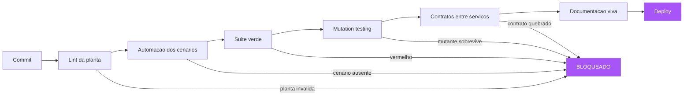

A lição da metáfora da vistoria contínua é dupla. Primeiro: o habite-se não é um evento final — é um estado contínuo mantido por vistorias incrementais; o pipeline SDD é exatamente isso: cada commit é um ato de construção, e cada portão do pipeline é a vistoria daquele ato [1]. Segundo: o laudo é o relatório do pipeline — a documentação viva que responde "o que foi vistoriado, quando, e com qual resultado?" para qualquer parte do sistema, a qualquer momento [4][21]. Você, como Engenheiro de Software, conhece a versão digital do prédio sem vistoria contínua: o deploy que "funcionava na minha máquina", a integração que quebra em produção, o hotfix que apaga o trabalho da semana — o pipeline SDD é o antídoto estrutural para todos eles [22].

## 4. Técnica

### O pipeline completo em GitHub Actions

A implementação do pipeline SDD em um CI real — o habite-se contínuo em código:

```yaml
# .github/workflows/habite-se.yml — o pipeline SDD de ponta a ponta
name: Habite-se continuo
on:
  push:
    branches: [main]
  pull_request:

jobs:
  planta:
    runs-on: ubuntu-latest
    steps:
      - uses: actions/checkout@v4
      - uses: actions/setup-python@v5
        with: { python-version: "3.12" }
      - name: Instalar dependencias
        run: pip install -r requirements-dev.txt
      - name: Portao 1 — Lint da planta (spec + glossario)
        run: |
          python lint_spec.py SPEC.md
          python lint_glossario.py docs/glossario.md
      - name: Portao 2 — Automacao (cenarios existem e rodam)
        run: pytest tests/features -q
      - name: Portao 3 — Suite verde
        run: pytest -q
      - name: Portao 4 — Mutation testing nos modulos criticos
        run: mutmut run --paths-to-mutate src/ --threshold 75
      - name: Portao 5 — Verificacao de contratos
        run: pytest tests/contract -q

  documento_vivo:
    needs: planta
    runs-on: ubuntu-latest
    steps:
      - uses: actions/checkout@v4
      - name: Gerar documentacao viva (relatorio de cenarios)
        run: python gerar_documentacao_viva.py --output docs/relatorio.html
      - uses: actions/upload-pages-artifact@v3
        with: { path: docs/relatorio.html }
```

### O lint da planta: validando a rastreabilidade

O primeiro portão do pipeline é o lint da planta — a verificação de que a spec e os cenários formam um conjunto coerente. O lint valida: os seis elementos da spec (Capítulo 6); o glossário (todo termo dos cenários existe no glossário — Capítulo 5); e a rastreabilidade (todo outcome da spec tem pelo menos um cenário — a cobertura orientada por comportamento) [10]:

```python
"""lint_rastreabilidade.py — verifica a cobertura orientada por cenarios.

Cada outcome da SPEC.md deve ter pelo menos um cenario na feature.
Comportamentos sem cenario sao intencoes nao verificadas — o pipeline
bloqueia o merge quando uma nova funcionalidade chega sem cenario.
"""
import re
import sys
from pathlib import Path


def extrair_outcomes(spec: Path) -> list[str]:
    texto = spec.read_text(encoding="utf-8")
    secao = texto.split("## 1. Resultados esperados")[-1].split("## 2.")[0]
    return [linha.strip("- ").strip() for linha in secao.splitlines()
            if linha.strip().startswith("-")]


def extrair_cenarios(features_dir: Path) -> list[str]:
    cenarios: list[str] = []
    for arq in features_dir.glob("*.feature"):
        texto = arq.read_text(encoding="utf-8")
        cenarios += [linha for linha in texto.splitlines()
                     if re.match(r"\s*(Cenário|Esquema do Cenário):", linha)]
    return cenarios


def validar_rastreabilidade(spec: Path, features_dir: Path) -> tuple[list[str], list[str]]:
    outcomes = extrair_outcomes(spec)
    cenarios = extrair_cenarios(features_dir)
    sem_cenario = []
    for outcome in outcomes:
        nucleo = outcome.lower()
        coberto = any(nucleo in c.lower() for c in cenarios)
        if not coberto:
            sem_cenario.append(outcome)
    return outcomes, sem_cenario


if __name__ == "__main__":
    spec = Path("SPEC.md")
    feats = Path("tests/features")
    outcomes, sem_cenario = validar_rastreabilidade(spec, feats)
    print(f"Outcomes: {len(outcomes)} | Sem cenario: {len(sem_cenario)}")
    for lacuna in sem_cenario:
        print(f"  LACUNA: {lacuna}")
    if sem_cenario:
        sys.exit(1)
    print("Rastreabilidade OK: todo outcome tem cenario.")
```

### A documentação viva gerada pelo pipeline

O último estágio do pipeline produz a documentação viva — o relatório que transforma a execução dos cenários em um documento que o negócio consulta [4][21]. O relatório tem três seções: o resumo (a árvore de funcionalidades com o estado dos cenários — verde/vermelho); o detalhe (por funcionalidade, os cenários e seus passos, com o resultado de cada um); e as métricas (a cobertura orientada por comportamento e a taxa de mutação, por módulo) [23]. O gerador é simples — transforma o resultado da suíte em HTML publicável:

```python
"""gerar_documentacao_viva.py — transforma a suite em relatorio consultavel."""
import json
from pathlib import Path


def ler_resultados(pipeline_json: Path) -> dict:
    """Le o relatorio de execucao (formato JUnit/JSON) e organiza por feature."""
    dados = json.loads(pipeline_json.read_text(encoding="utf-8"))
    por_feature: dict[str, dict] = {}
    for caso in dados["casos"]:
        feature = caso["feature"]
        por_feature.setdefault(feature, {"passou": 0, "falhou": 0, "cenarios": []})
        bloco = por_feature[feature]
        bloco["cenarios"].append(caso)
        if caso["status"] == "passou":
            bloco["passou"] += 1
        else:
            bloco["falhou"] += 1
    return por_feature


def gerar_html(por_feature: dict) -> str:
    """Gera a pagina HTML da documentacao viva (o laudo do habite-se)."""
    linhas = ["<html><head><meta charset='utf-8'><title>Documentacao Viva</title></head>",
              "<body><h1>Habite-se do Sistema — Cenarios Executaveis</h1>"]
    for feature, bloco in sorted(por_feature.items()):
        cor = "#2ecc9a" if bloco["falhou"] == 0 else "#e74c3c"
        linhas.append(f"<h2 style='color:{cor}'>{feature} "
                      f"({bloco['passou']}/{bloco['passou'] + bloco['falhou']} verdes)</h2><ul>")
        for caso in bloco["cenarios"]:
            estado = "PASSOU" if caso["status"] == "passou" else "FALHOU"
            linhas.append(f"<li>{estado}: {caso['nome']}</li>")
        linhas.append("</ul>")
    linhas.append("</body></html>")
    return "\n".join(linhas)


if __name__ == "__main__":
    html = gerar_html(ler_resultados(Path("validacao/resultados.json")))
    Path("docs/relatorio.html").write_text(html, encoding="utf-8")
    print("Documentacao viva gerada em docs/relatorio.html")
```

### A política de trânsito versionada

A governança do trânsito é versionada no repositório — a política que define quem pode promover o quê e com quais portões [17][19]:

```markdown
# Política de Trânsito — Governança do Habite-se

## Principios
- A planta (spec) e a fonte da verdade; o codigo e a implementacao.
- Nenhum artefato avanca de etapa sem o portao correspondente verde.
- O julgamento humano fica na adequacao da planta a intencao; a execucao e da maquina.

## Portoes por transicao
| Transicao | Portao exigido | Decisor |
|---|---|---|
| Rascunho -> Aprovada | Revisao do PO (6 elementos + exemplares) | PO |
| Aprovada -> Em implementacao | Spec versionada na branch | Time |
| Em implementacao -> Verificada | CI verde + mutation testing no limiar | Pipeline |
| Verificada -> Deploy staging | Todos os portoes verdes | Pipeline |
| Deploy staging -> Producao | Staging verde + aprovacao manual (risco alto) | PO + SRE |

## Mudanca de politica
- Alteracoes nesta politica exigem pull request revisado e merge na main.
- A politica e auditavel: o historico de mudancas registra quem alterou o quê e quando.
```

### A ordem dos portões e o princípio do bloqueio mais cedo

A arquitetura dos portões do pipeline obedece a um princípio econômico: bloquear o mais cedo possível — o portão que falha mais barato deve rodar primeiro [1][8]. O lint da planta é o mais barato (segundos) e falha primeiro; a automação dos cenários é mais cara e roda depois; o mutation testing é o mais caro e roda por último — porque rodá-lo antes do lint seria desperdiçar minutos caros em uma obra que nem tem planta válida. A ordem correta é também a ordem da responsabilidade: a planta é verificada antes do código, porque o código que cumpre uma planta inválida é trabalho perdido [6]. O princípio do bloqueio mais cedo tem uma consequência prática no design do pipeline: nenhum estágio caro roda sem os estágios baratos verdes — e a otimização do pipeline é, em si, uma aplicação da planta: o pipeline é especificado, e o CI o verifica [23].

O princípio também orienta a relação entre o pipeline e o tempo dos desenvolvedores: um pipeline que falha tarde (depois de minutos de build e teste) é um pipeline que desperdiça o tempo de quem o consulta. A disciplina do feedback rápido — o dev deve saber em menos de dez minutos se o commit é válido — é o que mantém a confiança no habite-se (a armadilha do pipeline lento do Capítulo 5 da Aplica) [28]. A otimização do pipeline tem prioridades claras: lint e cenários rápidos primeiro, stages pesados paralelizados, e o mutation testing limitado aos módulos críticos — a mesma régua de proporcionalidade do Capítulo 9 aplicada ao próprio CI [11][25].

### A evolução do pipeline: o habite-se que aprende com os incidentes

O pipeline SDD não é estático — ele evolui aprendendo com os incidentes, exatamente como a suíte de exemplares do Capítulo 4 [3][25]. O ciclo de evolução: um incidente em produção é investigado; a triagem do Capítulo 1 classifica a origem; se a origem é uma lacuna de verificação (o comportamento não tinha cenário, ou o cenário não detectava o defeito), o incidente vira um portão novo no pipeline — o exemplar entra na feature, o portão que o verifica é adicionado, e o pipeline passa a bloquear o tipo de falha que produziu o incidente [25]. A disciplina é que cada incidente em produção termina em uma pergunta: "qual portão teria impedido isso?" — e se a resposta é "nenhum", o pipeline ganha um portão [27].

O ciclo de evolução do pipeline tem uma segunda fonte de aprendizado: as quebras de contrato entre serviços (Capítulo 8) e as falhas de integração alimentam os portões de contrato; e as divergências de interpretação (Capítulo 1) alimentam o lint da rastreabilidade — o portão que exige cenário para todo outcome novo. O resultado é um habite-se que fica mais rigoroso com o tempo — não por burocracia, mas por evidência: cada portão novo é a cicatriz de um incidente real, e o pipeline documenta a história dos erros que aprendeu a evitar [21][25]. Essa é a forma final da documentação viva: não apenas o relatório do que é verificado hoje, mas o registro de como a verificação aprendeu com o passado [4].

### O relatório consolidado do habite-se

O instrumento final é o relatório consolidado — o laudo único que responde, em uma página, o estado do sistema: a lista de funcionalidades com seus cenários (da documentação viva), as métricas de qualidade (cobertura orientada por comportamento e taxa de mutação, por módulo), e o estado dos contratos entre serviços (Capítulo 8) [24]. O relatório é gerado automaticamente a cada execução do pipeline, publicado em um endereço estável, e consultado por três públicos: o time (o estado da obra), o PO (a conformidade da planta) e a auditoria (a evidência do processo) [4][23]. O relatório consolidado é o habite-se em forma documental: qualquer pessoa pode olhar e dizer, com precisão, o que foi verificado, quando e com qual resultado — sem perguntar a ninguém [25].

## 5. Aplica

### A cena de contraste: o merge direto que pulou o pipeline

Você é o engenheiro de plataforma de uma empresa em crescimento. O pipeline SDD está funcionando há dois meses — a suíte, o mutation testing, os contratos, a documentação viva. Então, em uma sexta-feira à tarde, um desenvolvedor sênior — pressionado por um cliente importante — usa a opção de merge direto na main, contornando o pull request e o pipeline: "é uma mudança de uma linha no cálculo de desconto, confiem em mim". O merge acontece às 17h42. Às 19h, o incidente: o cálculo de desconto — que o pipeline teria travado, porque o cenário de desconto acumulado estava vermelho — foi aplicado com o bug, e uma promoção em andamento distribuiu descontos incorretos para milhares de clientes [26].

O diagnóstico, doloroso e didático: o pipeline não falhou — foi contornado. A tecnologia não protege contra a decisão humana de pular a vistoria; e a organização — que ainda tratava o pipeline como "processo burocrático" e não como "habite-se obrigatório" — não tinha a governança de branch protection configurada para impedir o merge direto [17]. A correção que você conduz tem três frentes. Primeira: o branch protection é ativado — merges na main exigem pull request com o pipeline verde, e o merge direto é tecnicamente impossível (não é mais uma decisão, é uma restrição da plataforma). Segunda: o incidente vira o caso de estudo da política de trânsito — o documento que explicita que "a exceção de prazo não existe: o custo do atalho é o incidente" [18]. Terceira: o cálculo de desconto ganha os cenários que faltavam — o exemplar do desconto acumulado entra na feature (Capítulo 4: bug vira exemplar), e a taxa de mutação do módulo é monitorada. Seis meses depois, zero merges fora do pipeline e zero incidentes de desconto [27].

### Armadilhas comuns

As armadilhas do habite-se contínuo são conhecidas. A primeira é o pipeline de vitrine: o CI existe, mas ninguém confia nele — desenvolvedores que rodam os testes localmente e "sabem que passa" mesmo com o pipeline vermelho; o pipeline que ninguém consulta não é habite-se, é decoração [28]. A segunda é o portão de goma: a branch protection existe, mas o pipeline é tão lento ou tão flaky que os times aprendem a contorná-la — a regra é que o pipeline lento é uma dívida a pagar, não uma permissão para o atalho. A terceira é a métrica de vitrine: cobertura de linhas exibida em dashboards bonitos enquanto a cobertura orientada por comportamento tem lacunas — as métricas que o negócio não entende protegem ninguém [10]. A quarta é o DoD de carimbo: a lista de verificação do DoD continua existindo no papel, e o time a marca sem executar os portões — o DoD duplicado (papel e pipeline) é um risco: qual é o verdadeiro? A regra é que o DoD é o pipeline, e o papel é o resumo dele [13]. E a quinta é a documentação viva que ninguém publica: o relatório é gerado e arquivado em um artefato que ninguém abre — a documentação viva só vive se for publicada em um endereço estável e consultada pelos três públicos [21].

### O habite-se e a confiança organizacional

O habite-se contínuo produz um ativo intangível que é, na prática, o mais valioso de todos: a confiança organizacional no processo de entrega [1][13]. A confiança tem duas dimensões. Primeira, a confiança técnica: quando o pipeline atesta, de forma automática e verificável, que a planta foi cumprida, o time confia que o merge não quebra o que estava verde — e essa confiança reduz o medo, a revisão defensiva e o retrabalho preventivo [8]. Segunda, a confiança na governança: quando os portões são executados e não negociados, o PO confia que "verde" significa o que diz, o SRE confia que o deploy não introduz regressão conhecida, e a auditoria confia que o registro é verdadeiro [17][19]. A confiança é o que permite ao pipeline fazer seu trabalho final: acelerar — porque velocidade sem confiança é risco, e confiança sem velocidade é burocracia [27].

A confiança, no entanto, é um ativo que se perde mais rápido do que se ganha — e a perda tem um mecanismo preciso: o falso verde. Quando o pipeline diz verde mas a produção quebra (o teste que não verificava, o portão contornado, o ambiente divergente), a confiança é ferida, e a ferida se manifesta como o comportamento defensivo da armadilha do Capítulo 5 da Aplica: os times começam a verificar manualmente o que o pipeline já deveria ter verificado, e a velocidade morre [28][29]. A restauração da confiança tem uma disciplina clara: todo falso verde é investigado com o rigor da triagem do Capítulo 10 — qual portão falhou em detectar? — e o portão é corrigido antes de qualquer outra coisa, porque a confiança não se restaura com promessas, se restaura com portões que funcionam [25]. O habite-se contínuo, no fim, é menos uma tecnologia e mais uma relação: o pipeline atesta, o time confia, e a confiança é mantida pelo registro de que, quando o habite-se falhou, a falha virou portão novo — não desculpa [13][27].

### Métricas de sucesso e fracasso

Sucesso: o tempo médio de verde (tempo entre o commit e o pipeline verde) é medido e estável; a proporção de merges que passam pelo pipeline é 100% (tecnicamente garantida pela branch protection); a cobertura orientada por comportamento cobre 100% dos outcomes (sem lacunas de rastreabilidade); e o relatório consolidado é consultado pelo PO nas revisões de sprint — a pergunta "está pronto?" tem resposta objetiva [14]. Fracasso: contornos do pipeline (merge direto, testes pulados); pipeline vermelho crônico normalizado ("está vermelho faz tempo, mas funciona"); métricas que o negócio não entende; e o sintoma mais claro — quando o relatório consolidado existe e ninguém o abre, o habite-se contínuo não existe [29].

Três decisões de arquitetura de pipeline separam o habite-se contínuo real do decorativo. Decisão um — o pipeline é o único caminho para a integração: branch protection com review obrigatório e verificação obrigatória (spec lint + cenários + CI), de modo que o caminho feliz de integrar sem verificação simplesmente não existe; quando o contorno é tecnicamente impossível, a disciplina deixa de depender da memória das pessoas. Decisão dois — o relatório consolidado de conformidade é gerado e arquivado por release: um documento único que lista cada funcionalidade da release, sua spec, seus cenários e o status final — verde com atestado ou exceção registrada com justificativa e prazo; esse relatório é o artefato que o PO assina na revisão, e é ele que transforma o pipeline de ferramenta técnica em instrumento de governança, porque dá ao negócio a mesma visibilidade que o time tem. Decisão três — o pipeline tem alarmes de silêncio: métricas de saúde do próprio processo (tempo médio de verde, taxa de contorno detectada, número de exceções vencidas) monitoradas com o mesmo cuidado que as métricas do produto; um pipeline que fica lento ou com exceções vencidas é dívida de verificação que se acumula em silêncio, e a primeira vez que ela cobra é exatamente no momento em que a confiança é mais necessária — na release crítica. A combinação das três decisões produz o efeito mais valioso do habite-se contínuo: a confiança escalável. A organização deixa de perguntar "podemos liberar?" (que exige julgamento humano caro e inconsistente) e passa a perguntar "o relatório está verde?" — a pergunta que qualquer pessoa pode responder olhando o artefato, com a mesma resposta que o time técnico daria [29]. É essa substituição de julgamento por evidência que torna a verificação contínua um ativo de negócio, não uma cerimônia de engenharia.

## 6. Conclusão

Neste capítulo, você institucionalizou o habite-se: o pipeline SDD onde a especificação é a fonte da verdade — a planta como gate de entrada, critério de saída e documentação [1][8]; a cobertura orientada por cenários, que substitui a cobertura de linhas por rastreabilidade entre comportamento e verificação [3][10]; o Definition of Done executado pelo pipeline, que remove a negociação do "está pronto?" [5][13]; e a governança do trânsito — branch protection, ambientes e política versionada [17][19]. O desafio: audite o seu CI atual — ele verifica a planta ou apenas o código? — e adicione pelo menos um portão orientado por especificação (o lint da rastreabilidade é o mais simples). No próximo e último capítulo, vamos ao futuro: o SDD agêntico — a spec como contrato entre humano e agente de IA, os três níveis de maturidade de Fowler, o padrão Coordinator/Implementor/Verifier, e o plano de voo para adotar o SDD na sua organização.

## 7. Referências Bibliográficas

[1] HUMBLE, Jez; FARLEY, David. *Continuous Delivery: Reliable Software Releases through Build, Test, and Deployment Automation*. Boston: Addison-Wesley, 2010.
[2] OFFUTT, Jeff. *Mutation Testing for the New Century*. Norwell: Kluwer, 2001.
[3] ADZIC, Gojko. *Specification by Example: How Successful Teams Deliver the Right Software*. Shelter Island: Manning Publications, 2011.
[4] ADZIC, Gojko. *Living Documentation: Continuous Knowledge Sharing by Design*. Boston: Addison-Wesley, 2017.
[5] SCHWABER, Ken; SUTHERLAND, Jeff. *The Scrum Guide: The Definitive Guide to Scrum*. 2020. Disponível em: https://scrumguides.org. Acesso em: 5 ago. 2026.
[6] OSMANI, Addy. *How to Write a Good Spec for AI Agents*. 2025. Disponível em: https://addyosmani.com/blog/good-spec/. Acesso em: 5 ago. 2026.
[7] WEINBERG, Gerald M. *Quality Software Management: Systems Thinking*. New York: Dorset House, 1992.
[8] FOWLER, Martin. *Deployment Pipeline* (bliki). Disponível em: https://martinfowler.com/bliki/DeploymentPipeline.html. Acesso em: 5 ago. 2026.
[9] AUGMENT CODE. *What is Spec-Driven Development?* Augment Code Guides. Disponível em: https://www.augmentcode.com/guides/what-is-spec-driven-development. Acesso em: 5 ago. 2026.
[10] COHN, Mike. *Succeeding with Agile: Software Development Using Scrum*. Boston: Addison-Wesley, 2009.
[11] OFFSETT, Jeff. Mutation Analysis. In: *Encyclopedia of Software Engineering*. New York: Wiley, 2002.
[12] NEWMAN, Sam. *Building Microservices: Designing Fine-Grained Systems*. 2. ed. Sebastopol: O'Reilly Media, 2021.
[13] FOWLER, Martin. *Continuous Integration* (bliki). Disponível em: https://martinfowler.com/articles/continuousIntegration.html. Acesso em: 5 ago. 2026.
[14] COHN, Mike. *User Stories Applied: For Agile Software Development*. Boston: Addison-Wesley, 2004.
[15] NORTH, Dan. *BDD is like TDD if...* Dan North & Associates, 2006. Disponível em: https://dannorth.net/blog/bdd-is-like-tdd-if/. Acesso em: 5 ago. 2026.
[16] MEYER, Bertrand. *Agile!: The Good, the Hype and the Ugly*. New York: Springer, 2014.
[17] GITHUB. *About Protected Branches*. GitHub Docs. Disponível em: https://docs.github.com/repositories/configuring-branches-and-merges-in-your-repository/managing-protected-branches. Acesso em: 5 ago. 2026.
[18] BROOKS, Frederick P. *The Mythical Man-Month: Essays on Software Engineering*. Anniversary ed. Boston: Addison-Wesley, 1995.
[19] HUMBLE, Jez; MOLEY, Joanne. *Continuous Delivery: The Book*. Disponível em: https://continuousdelivery.com/. Acesso em: 5 ago. 2026.
[20] FOWLER, Martin. *Specification by Example* (bliki). Disponível em: https://martinfowler.com/bliki/SpecificationByExample.html. Acesso em: 5 ago. 2026.
[21] ADZIC, Gojko. *The Secret of Living Documentation*. 2017. Disponível em: https://gojko.net/2017/10/01/the-secret-of-living-documentation.html. Acesso em: 5 ago. 2026.
[22] KLEPPMANN, Martin. *Designing Data-Intensive Applications*. Sebastopol: O'Reilly Media, 2017.
[23] CUCUMBER. *Cucumber Reports — Living Documentation*. Disponível em: https://cucumber.io/docs/guides/10-minute-tutorial/. Acesso em: 5 ago. 2026.
[24] PACT. *Pact Broker — Contract Verification Reports*. Disponível em: https://docs.pact.io/pact_broker. Acesso em: 5 ago. 2026.
[25] ADZIC, Gojko. *Specification by Example, 10 years later*. 2020. Disponível em: https://gojko.net/2020/03/17/sbe-10-years.html. Acesso em: 5 ago. 2026.
[26] NEWMAN, Sam. *Monolith to Microservices: Evolutionary Patterns to Transform Your Monolith*. Sebastopol: O'Reilly Media, 2019.
[27] MARTIN, Robert C. *Clean Code: A Handbook of Agile Software Craftsmanship*. Upper Saddle River: Prentice Hall, 2008.
[28] HUMBLE, Jez. *Why Don't Developers Trust CI?* Continuous Delivery Blog. Disponível em: https://continuousdelivery.com/2020/08/why-dont-developers-trust-ci/. Acesso em: 5 ago. 2026.
[29] ADZIC, Gojko. *Bridging the Communication Gap: Specification by Example and Agile Acceptance Testing*. London: Neuri Consulting, 2009.

# Capítulo 12: SDD agêntico: a spec como contrato entre humano e agente

## 1. Introdução

Chegamos ao fechamento da obra — e o fechamento olha para o futuro: o desenvolvimento de software assistido por agentes de IA, e o papel que a especificação desempenha nesse novo mundo. Você vai aprender o SDD agêntico, a disciplina que transforma a SPEC.md em um contrato entre humano e agente: os três níveis de maturidade de Martin Fowler — spec-first, spec-anchored e spec-as-source [1]; o padrão adversarial Coordinator/Implementor/Verifier, que usa um agente verificador para auditar o código gerado contra a planta [2]; e as ferramentas do ecossistema — GitHub Spec Kit, Kiro, Tessl — que estão construindo a infraestrutura do desenvolvimento orientado por especificação [3][4]. Ao final, você terá o plano de voo completo para adotar o SDD na sua organização — a síntese de todos os capítulos anteriores aplicada à engenharia de software do presente e do futuro [5].

## 2. Explica

### O problema que o SDD agêntico resolve

O desenvolvimento com agentes de IA popularizou uma prática que os capítulos anteriores já diagnosticaram como o erro do Capítulo 1, agora em velocidade máxima: o prompt solto. "Implemente um endpoint de pagamento" dado a um agente de IA produz exatamente o mesmo comportamento que a instrução dada a um desenvolvedor — preencher as lacunas com suposições — só que em segundos, e com a aparência de confiança [6]. A diferença entre o desenvolvedor e o agente não é qualitativa; é quantitativa: o agente produz mais código baseado em suposições erradas, mais rápido, com mais fluência e menos consciência do que não sabe [7]. O SDD agêntico é a resposta disciplinada: a especificação — a planta de seis elementos do Capítulo 6 — é o contrato que o agente deve cumprir, e a verificação — os cenários, o CI, o mutation testing — é o habite-se que atesta a conformidade, sem depender da introspecção do agente [2][8].

Você vai perceber que o SDD agêntico não é uma técnica nova — é a convergência de tudo o que a obra ensinou: o problema é o mesmo (intenção perdida); a solução é a mesma (especificação executável); o que muda é o executor (o agente, mais rápido e mais literal). E por isso as disciplinas dos capítulos anteriores se tornam ainda mais críticas: as fronteiras explícitas (Capítulo 6) impedem o agente de "melhorar" além do pedido; os exemplares (Capítulo 4) eliminam a ambiguidade que o agente preencheria com suposições; e a verificação (Capítulos 9 e 11) atesta a conformidade sem confiar na autoavaliação do agente [1][2].

### Os três níveis de maturidade de Fowler

Martin Fowler, analisando as ferramentas emergentes de SDD, distinguiu três níveis de maturidade na relação entre especificação e código gerado [1][3]. No nível spec-first, a especificação orienta a tarefa atual do agente: o humano escreve uma spec para a funcionalidade em questão, o agente a implementa, e o resultado é revisado — a spec é um contrato de trabalho, não necessariamente um artefato duradouro. No nível spec-anchored, a especificação vive no repositório como artefato permanente: ela guia a evolução contínua da funcionalidade, é consultada por novos agentes (e humanos) que trabalham naquele módulo, e é atualizada junto com o código — a planta é mantida viva (Capítulo 4) [9]. No nível spec-as-source, a especificação é o artefato primário: os humanos editam a spec, e o código é gerado a partir dela de forma automatizada — os humanos não editam código diretamente; o agente regenera a implementação a partir da planta, e a planta é a única fonte de verdade editável [1][3].

A progressão entre os níveis é a progressão da confiança e da maturidade: spec-first é o primeiro degrau (a spec como contrato pontual); spec-anchored é o degrau de produção (a spec como memória viva do módulo); e spec-as-source é o degrau aspiracional (a spec como código-fonte, e o código como artefato derivado) [1]. A maioria das organizações começa no spec-first e amadurece para o spec-anchored; o spec-as-source é viável em domínios bem delimitados, onde a especificação é expressiva o suficiente para gerar a implementação sem perda — e exige que a verificação seja forte o bastante para atestar a conformidade da geração [10].

### O padrão adversarial: Coordinator, Implementor e Verifier

A arquitetura de agentes que está se consolidando para o SDD agêntico é o padrão de três papéis — um padrão que a Fábrica Agêntica de publicações técnicas utiliza em paralelo, e que você vai reconhecer como a materialização da triagem do Capítulo 10 em agentes [2][11]. O Coordinator analisa a spec, decompõe o trabalho em tarefas e coordena a execução — o papel do orquestrador. O Implementor escreve o código (e os testes) para cada tarefa — o papel do executor. E o Verifier — frequentemente um modelo mais rápido ou barato, ou um pipeline determinístico — audita o código gerado contra a spec original, caçando desvios (drift), falhas lógicas e violações de fronteira — o papel do fiscal [2][11]. O Verifier é o elemento-chave: ele quebra o círculo vicioso de "o agente implementou, o agente testou, o agente se aprovou" — a autoavaliação que repete o erro do Capítulo 1 em velocidade máxima [12].

O padrão adversarial funciona porque separa os papéis e os interesses: o Implementor é incentivado a produzir (e produzir rápido); o Verifier é incentivado a duvidar (e duvidar de tudo); e o Coordinator arbitra entre os dois usando a planta como referência [2]. A separação é análoga à da construção civil — o pedreiro constrói, o fiscal vistoria, e nenhum dos dois pode ser o outro — e à da própria Fábrica Agêntica: o orquestrador despacha subagentes redatores e depois um revisor técnico auditável, com veredito determinístico vindo de script, não da impressão do agente [11][13]. A lição transferível: a verificação é sempre um papel separado, e o verificador nunca é o próprio executor [12].

### As ferramentas do ecossistema agêntico

O ecossistema de ferramentas de SDD agêntico está em formação rápida. O GitHub Spec Kit é um toolkit open source que estrutura o fluxo em comandos — /speckit.specify (transforma intenção em spec), /speckit.plan (decompõe), /speckit.tasks (gera as tarefas) e /speckit.implement (executa) — com uma "constituição" (constitution.md) que define as regras imutáveis que os agentes devem seguir [3]. O Kiro é uma IDE baseada em VS Code que guia o fluxo Requirements (user stories + Gherkin Given-When-Then) → Design → Tasks, tornando o SDD agêntico um caminho guiado, não uma disciplina opcional [14]. E o Tessl é um framework com foco em spec-anchored e spec-as-source: permite engenharia reversa de código existente para spec (a planta reconstruída a partir do prédio), e validação rigorosa de contratos de componentes [4]. A comunidade mantém ainda o cc-sdd (Community Spec-Driven Development), o padrão aberto que formaliza o fluxo de linha de comando de especificação → plano → tarefas → implementação que o Spec Kit popularizou, tornando o ciclo independente de qualquer IDE ou fornecedor — a prova de que a planta antes do canteiro virou disciplina, não moda [3][15]. Essas ferramentas têm em comum a aposta central deste capítulo: o futuro do desenvolvimento é orientado por especificação, e os agentes são os construtores que seguem a planta [15].

## 3. Ilustra

Voltemos à construtora, agora no futuro próximo: a obra é construída por robôs de alvenaria, controlados por IA. O arquiteto não dirige mais cada pedreiro — ele escreve o caderno de encargos (a planta) e programa os robôs para seguirem as instruções do caderno. A descoberta imediata: os robôs são literalistas implacáveis — se o caderno diz "assente os tijolos", eles assentam tijolos para sempre, em qualquer parede, em qualquer direção, sem perguntar; e, pior, são confiantes — a parede que construíram "deve estar certa" segundo eles, mesmo quando está torta [6]. O arquiteto aprende a lição que este capítulo ensina: o caderno precisa ser muito mais preciso para os robôs do que para os humanos — cada instrução exige fronteiras ("não assente tijolos na parede leste"), medidas exatas (as cotas), e a proibição explícita de melhorias ("não decida por conta própria onde colocar a janela") [1]. E, crucialmente, o arquiteto contrata um fiscal ROBÔ separado — programado para duvidar — que mede cada parede contra o caderno e reprova qualquer desvio, sem confiar na palavra do robô construtor [2][12].

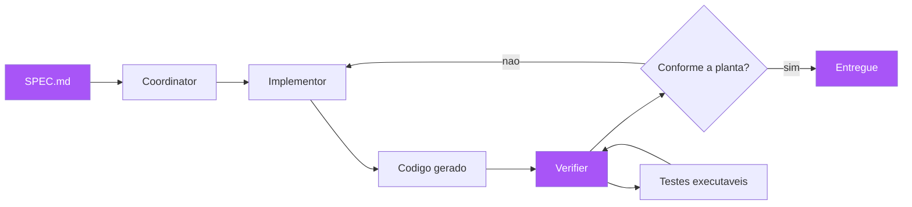

A lição da metáfora do robô é dupla e final. Primeiro: a qualidade da saída do agente é limitada pela qualidade da planta — um agente com uma planta ambígua produz um prédio torto com confiança; as disciplinas dos capítulos anteriores (exemplares, fronteiras, critérios) são o que tornam a planta boa o suficiente para os agentes [1][6]. Segundo: a verificação nunca pode ser a autoavaliação do executor — o fiscal robô separado (o Verifier) é o que transforma "o agente diz que está pronto" em "a máquina atesta que está pronto" [2][12]. Você, como Engenheiro de Software, está vivendo essa transição agora: os agentes já estão no seu fluxo — a pergunta é se você os está dirigindo com instruções soltas (o prompt do Capítulo 1) ou com a planta completa que esta obra ensinou [16].

## 4. Técnica

### O contrato agêntico: a spec como prompt estruturado

A aplicação mais imediata do SDD agêntico: transformar a spec em um contrato que o agente deve cumprir — o prompt estruturado que elimina a ambiguidade. A spec de seis elementos do Capítulo 6, entregue ao agente como contrato, com uma seção de restrições de comportamento explícitas:

```markdown
# CONTRATO DE IMPLEMENTAÇÃO PARA AGENTE — frete promocional

Você é o Implementor. Sua única fonte de verdade é a SPEC.md referenciada.
NÃO improvise, NÃO "melhore", NÃO adicione comportamento fora da planta.

## Regras de execução (obrigatórias)
1. Leia SPEC.md e tests/features/frete.feature ANTES de escrever código.
2. Implemente SOMENTE o comportamento descrito nos critérios de verificação.
3. NÃO altere a ordem de precificação nem adicione regras de negócio novas.
4. Se algo na spec estiver ambíguo, PARE e reporte a ambiguidade — não decida.
5. Todo código deve passar nos cenários do arquivo .feature (o habite-se).
6. Não edite SPEC.md nem o glossário — eles são do PO.

## Critérios de saída
- `pytest tests/features -q` verde (todos os cenários).
- `pytest -q` verde (suíte completa).
- Nenhuma alteração fora dos arquivos indicados na divisão de tarefas.
```

```bash
# Execucao do contrato: o agente implementa e o pipeline atesta
# 1) O agente le a planta e implementa
# 2) O pipeline roda os cenarios (o habite-se)
pytest tests/features -q
# 3) O Verifier audita o diff contra a planta (drift detection)
python verifier_drift.py --spec SPEC.md --diff origin/main..HEAD
```

### O Verifier determinístico: detectando drift

O Verifier pode ser um agente — mas o núcleo da verificação deve ser determinístico: scripts que comparam o diff contra a planta e detectam desvios [2][11]. O drift detection verifica: arquivos alterados fora da divisão de tarefas da spec (o agente mexeu onde não devia); comportamentos novos sem cenário (código adicionado sem exemplar correspondente); e fronteiras violadas (uso de termos ou recursos fora de escopo) [17]:

```python
"""verifier_drift.py — o fiscal deterministico do codigo gerado por agentes.

Compara o diff de um pull request contra a SPEC.md e detecta:
1) arquivos alterados fora da divisao de tarefas;
2) codigo novo sem cenario correspondente;
3) uso de termos fora do glossario do dominio.
"""
import re
import subprocess
import sys
from pathlib import Path


def arquivos_do_diff(base: str, head: str) -> list[str]:
    saida = subprocess.run(
        ["git", "diff", "--name-only", base, head],
        capture_output=True, text=True, check=True,
    ).stdout
    return [linha for linha in saida.splitlines() if linha.strip()]


def extrair_arquivos_da_spec(spec: Path) -> set[str]:
    texto = spec.read_text(encoding="utf-8")
    secao = texto.split("## 5. Divisão de tarefas")[-1].split("## 6.")[0]
    return set(re.findall(r"[A-Za-z0-9_./-]+\.py", secao))


def verificar_drift(spec: Path, base: str, head: str) -> list[str]:
    permitidos = extrair_arquivos_da_spec(spec)
    desvios: list[str] = []
    for arquivo in arquivos_do_diff(base, head):
        if arquivo.endswith((".py", ".md")) and arquivo not in permitidos:
            desvios.append(f"arquivo fora da planta: {arquivo}")
    return desvios


if __name__ == "__main__":
    desvios = verificar_drift(Path("SPEC.md"), "origin/main", "HEAD")
    if desvios:
        print("DRIFT DETECTADO — codigo fora da planta:")
        for d in desvios:
            print(f"  - {d}")
        sys.exit(1)
    print("Sem drift: o diff respeita a planta.")
```

### O fluxo com o padrão adversarial na prática

O fluxo de implementação com o padrão de três papéis, executável no seu repositório:

```yaml
# workflow agêntico com verificação adversarial (GitHub Actions)
name: Implementacao agêntica com habite-se
on:
  pull_request:
jobs:
  adversarial:
    runs-on: ubuntu-latest
    steps:
      - uses: actions/checkout@v4
        with:
          ref: main
      - name: Coordinator — valida a planta antes do canteiro
        run: python lint_spec.py SPEC.md && python lint_rastreabilidade.py SPEC.md tests/features
      - name: Implementor — verifica que o codigo foi gerado contra a spec
        run: python verifier_drift.py --spec SPEC.md --base origin/main --head HEAD
      - name: Verifier — o habite-se executavel
        run: |
          pytest tests/features -q
          pytest -q
          mutmut run --paths-to-mutate src/ --threshold 75
```

### Spec-as-source na prática: o ciclo regenerativo

O nível mais alto de maturidade — spec-as-source — funciona como um ciclo regenerativo: o humano edita a spec; a geração produz (ou regenera) o código; o pipeline verifica; e qualquer divergência volta para a spec [1][3]. O ciclo tem um pré-requisito técnico: a especificação deve ser expressiva o suficiente para gerar a implementação — na prática, isso significa um esquema de dados declarado, as regras de negócio em cenários executáveis, e as fronteiras explícitas. O fluxo mínimo:

```markdown
# O ciclo spec-as-source em três passos
1. O humano edita SPEC.md (a única fonte editável).
2. A geração regenera o código a partir da planta (agente ou gerador).
3. O pipeline verifica: se verde, a mudança está pronta; se vermelho,
   a divergência aponta onde a spec ou a geração precisa de correção —
   e a correção é feita NA SPEC, nunca direto no código.
```

A disciplina do ciclo: o humano nunca edita o código gerado diretamente — porque, se edita, a spec deixa de ser a fonte e o ciclo quebra [1]. Essa disciplina é contraintuitiva para engenheiros acostumados a editar código, e é a barreira cultural mais difícil do spec-as-source — mas é exatamente ela que mantém a planta viva e o prédio conforme (o Capítulo 4 em sua forma mais radical) [9][18].

### O agente como aprendiz da planta: a disciplina do prompt estruturado

O detalhe operacional que decide o sucesso do SDD agêntico é a disciplina do prompt: como o contrato é entregue ao agente e como o resultado é recebido de volta. A prática recomendada tem cinco momentos. Primeiro, o contexto mínimo: o agente recebe a spec, os cenários e a indicação de onde está a fonte da verdade — sem contexto, o agente reusa conhecimento genérico (a "tabela padrão do mercado" do incidente da Aplica) em vez de consultar a planta [6][23]. Segundo, a proibição explícita: o contrato declara o que o agente NÃO deve fazer — não melhorar, não alterar fora de escopo, não decidir ambiguidades — porque o agente literalista segue a letra do contrato, e a letra precisa incluir as proibições [1]. Terceiro, a regra do pause: se a spec tem ambiguidade, o agente para e reporta — a ambiguidade reportada é tratada como bug de especificação (Capítulo 10), não como carta branca para decidir [12]. Quarto, o Verifier separado: o resultado do agente passa pelo fiscal determinístico (drift detection, cenários, mutation testing) antes de qualquer revisão humana — a revisão humana audita a planta e o laudo do Verifier, não o código linha a linha [2][11]. Quinto, o retorno de aprendizado: os desvios que o Verifier encontra viram lições no contrato — cada drift detectado é uma cláusula nova no contrato agêntico (a evolução do pipeline do Capítulo 11, aplicada aos agentes) [17][22].

### O custo da confiança: quando o agente pode e quando não pode

O SDD agêntico não responde "agentes sim ou não" — responde "agentes em quais tarefas, com qual contrato e com qual verificação". A régua de delegação tem três critérios. Primeiro: a tarefa tem comportamento verificável? — se os critérios de verificação podem ser automatizados (cenários executáveis), o agente pode atuar; se a verificação exige julgamento humano subjetivo ("isso parece bom"), a delegação é arriscada [2][9]. Segundo: o custo de falha da tarefa é tolerável? — a régua de proporcionalidade do Capítulo 9 aplicada aos agentes: tarefas de baixo custo de falha podem ter agentes com verificação leve; tarefas críticas exigem verificação forte e revisão humana obrigatória [6]. Terceiro: a planta da tarefa está madura? — a spec está aprovada, os cenários existem, as fronteiras estão explícitas? Sem planta madura, o agente é um gerador de suposições rápidas, e a velocidade amplifica o erro [1][21].

A régua de delegação tem uma consequência organizacional: o time deve classificar o backlog por delegabilidade — as tarefas que podem ser entregues por agentes (planta madura + verificação automatizada + custo de falha tolerável) e as que exigem humanos no comando (descoberta, decisões de fronteira, revisão da planta, arbitragem da triagem) [19]. A classificação muda com o tempo: conforme a planta amadurece e a verificação se fortalece, tarefas migram da coluna humana para a coluna agêntica — a progressão do spec-first ao spec-anchored é exatamente essa migração [1][10]. O futuro da engenharia não é a substituição do humano pelo agente — é o humano como dono da planta, o agente como construtor, e o Verifier como fiscal: cada um no papel em que é insubstituível [5][22].

### O plano de voo: adotar o SDD na organização

O plano de voo para adotar o SDD — a síntese de toda a obra — tem cinco etapas, cada uma com um entregável e um portão. Etapa 1 — Diagnóstico (Capítulo 1): implementar a triagem de origem de defeitos e medir a proporção de bugs de especificação — o dado que justifica o investimento. Etapa 2 — Vocabulário (Capítulo 5): conduzir o event storming do domínio principal e consolidar o glossário — a matéria-prima da planta. Etapa 3 — Piloto (Capítulos 3, 4 e 6): escolher uma funcionalidade crítica e percorrer o fluxo completo — descoberta, formulação, aprovação, automação, implementação — produzindo a primeira spec de seis elementos com cenários executáveis. Etapa 4 — Infraestrutura (Capítulos 7, 9 e 11): integrar o pipeline SDD — ferramenta BDD, mutation testing nos módulos críticos, documentação viva publicada e branch protection — o habite-se contínuo. Etapa 5 — Escala (Capítulos 8, 10 e 12): estender o fluxo às integrações (contratos), padronizar o fluxo completo como processo da empresa, e avaliar os agentes com o padrão adversarial — começando pelo spec-first e amadurecendo para spec-anchored [5][19].

## 5. Aplica

### A cena de contraste: o agente que entregou o endpoint errado com confiança

Você é o engenheiro responsável por um módulo financeiro, e a empresa decidiu usar um agente de IA para implementar uma funcionalidade nova: "cálculo de juros para parcelamento". O fluxo adotado — por falta de disciplina — é o prompt solto: o desenvolvedor pede ao agente "implementa o cálculo de juros do parcelamento, pode usar a tabela padrão do mercado". O agente entrega em vinte minutos: uma função `calcular_juros` que aplica juros compostos mensais sobre o valor, com uma tabela interna de taxas "padrão do mercado". O código passa nos testes que o próprio agente escreveu. Quando você revisa, o alarme toca: a tabela "padrão do mercado" do agente não é a tabela da empresa — a empresa usa juros decrescentes (Tabela Price) com taxa contratual específica, e o agente inventou uma tabela própria porque o prompt não a definiu [6][20].

O diagnóstico é o do Capítulo 1 em velocidade máxima: o prompt solto — a instrução, não a planta — delegou ao executor (o agente) todas as decisões de borda: qual tabela, qual regime de juros, qual arredondamento, quais limites. E o agente, literalista e confiante, preencheu tudo com suposições plausíveis — e até escreveu testes que passam para as próprias suposições [7]. A correção que você conduz é a tese da obra: a funcionalidade é reescrita com a planta — a spec de seis elementos com a tabela de juros contratual como decisão já tomada, os exemplares do Capítulo 4 (o parcelamento de 12x com juros decrescentes, o arredondamento de centavos, o limite de parcelas), e os critérios de verificação em cenários — e o agente é reexecutado com o contrato completo, com o Verifier determinístico (drift detection) e o habite-se do pipeline [2][17]. O incidente vira o caso de estudo da empresa: o agente não é o problema — o prompt solto é o problema, e a planta é a solução [5].

### Armadilhas comuns

As armadilhas do SDD agêntico merecem o catálogo final. A primeira é o prompt solto: delegar a agentes sem planta, confiando na fluência — o erro mais caro, porque a velocidade do agente amplifica o custo das suposições erradas [6]. A segunda é a autoavaliação: deixar que o agente que implementou também verifique — o agente aprovando o próprio código repete o círculo vicioso do Capítulo 1; o Verifier é sempre separado [12]. A terceira é a spec como literatura: escrever a spec e entregá-la ao agente sem a verificação executável — sem cenários no CI, a spec é um pedido educado, e o agente não tem por que cumpri-la [9]. A quarta é o spec-as-source prematuro: pular os níveis e tentar o spec-as-source sem a infraestrutura de verificação — a geração automática sem habite-se forte é uma fábrica de código não verificado [10]. E a quinta é o medo do agente: recusar agentes por completo, perdendo a velocidade que a planta permitiria — a posição madura não é "agentes sim ou não", é "agentes com planta, verificação separada e humano como dono da planta" [21].

### O futuro que já chegou: o SDD como habilidade permanente

O fechamento desta obra não é uma conclusão — é uma reorientação: o SDD não é uma metodologia que se adota e se abandona; é uma habilidade permanente, que se torna mais valiosa à medida que as ferramentas mudam [5][15]. A história deste livro é a história de uma ideia estável atravessando gerações de ferramentas: a especificação verificável nasceu com a lógica de Hoare (Capítulo 2), virou BDD com Dan North (Capítulo 3), ganhou exemplares com Adzic (Capítulo 4), foi formalizada como spec com a onda agêntica (Capítulo 6) e agora é o contrato entre humano e agente (Capítulo 12). As ferramentas mudam — VDM, Z, Cucumber, Kiro, Spec Kit — e o princípio permanece: a planta antes do canteiro, e o habite-se antes da entrega [1][3][22]. Quem domina o princípio navega as mudanças de ferramenta como migrações (Capítulo 7); quem domina só a ferramenta fica preso à moda do momento [24].

A habilidade permanente tem três componentes que esta obra treinou e que você deve continuar treinando. Primeiro, o reflexo de especificar: diante de qualquer pedido de software, a pergunta automática "quais os exemplos, quais as fronteiras, como verificamos?" — o reflexo do Capítulo 1, que se fortalece com o uso [5]. Segundo, a capacidade de verificar: a leitura crítica de qualquer afirmação sobre software — "funciona para quais entradas? o que o teste realmente verifica? o que o agente assumiu?" — a cultura do rigor do Capítulo 9 [12][24]. Terceiro, a disciplina de manter a planta viva: especificação e código juntos, verificação contínua, evolução pela planta — o ciclo do Capítulo 10, que é o que impede o apodrecimento do Capítulo 4 [9][21]. O engenheiro que domina os três componentes — especificar, verificar, manter — está equipado para qualquer geração de ferramentas, de agentes e de arquiteturas que a indústria produzir: a planta muda de formato, o canteiro muda de tecnologia, e o habite-se continua sendo a diferença entre construir e adivinhar [16][22].

### Métricas de sucesso e fracasso

Sucesso no SDD agêntico: a proporção de trabalho de agentes precedida por spec aprovada passa de 90%; a taxa de drift (desvios da planta) cai a níveis residuais; o tempo de revisão humana cai — o revisor audita a planta e o resultado do Verifier, não linha a linha do código gerado; e a qualidade se mantém ou melhora — os bugs de especificação não aumentam com a velocidade [22]. Fracasso: agentes produzindo código sem planta e sem verificação; drift normalizado ("o agente melhorou, deixamos"); revisão humana que continua linha a linha (o que anula a velocidade); e o sintoma final — quando a organização não consegue dizer qual spec gerou qual código, o SDD agêntico não existe, é vibe coding com risco [23].

Para navegar essa transição, a organização precisa de três guarda-corpos que valem tanto para o agente quanto para o humano que o supervisiona. O primeiro é o guarda-corpo da planta como fronteira de autoridade: o agente recebe a spec e o escopo — o que está dentro é delegado, o que está fora é negociação; a definição explícita de fronteira transforma o desvio de escopo de surpresa em violação detectável, porque o verificador conhece a planta e pode apontar o desvio na hora. O segundo é o guarda-corpo do Verifier como segunda assinatura: nenhum código gerado por agente entra na base principal sem passar pelo verificador automático (cenários verdes + lint de spec + review humano do resultado, não do processo); o humano deixa de revisar cada linha para revisar a planta, o resultado do verificador e as decisões registradas pelo agente — a revisão sobe de granularidade, e é essa subida que torna o trabalho do agente sustentável e seguro ao mesmo tempo. O terceiro é o guarda-corpo da rastreabilidade: cada artefato gerado registra a spec de origem, a versão do agente e o resultado do verificador, de modo que a pergunta "qual spec gerou este código?" tenha sempre resposta automática; rastreabilidade é o pré-requisito da auditoria e da confiança — sem ela, o drift não é detectável, e sem detecção de drift, a delegação vira aposta. O padrão emergente que o capítulo desenha é o da especialização: a spec deixa de ser apenas o contrato entre o negócio e o desenvolvimento e passa a ser também o contrato entre o humano e a máquina — a mesma planta que orienta a construção orienta a verificação, e o mesmo documento que o PO assina é o documento que o agente executa e que o verificador audita. A consequência profunda é a convergência: no SDD agêntico, especificação, implementação e verificação são três leituras do mesmo texto — e é essa unidade que transforma a intenção em código verificável sem que a máquina adivinhe, nem o humano vigie linha a linha [23].

## 6. Conclusão

Neste capítulo final, você completou o arco da obra: o SDD agêntico — a especificação como contrato entre humano e agente, resolvendo o problema do Capítulo 1 em velocidade máxima [1][6]; os três níveis de maturidade de Fowler — spec-first, spec-anchored e spec-as-source [1][3]; o padrão adversarial Coordinator/Implementor/Verifier, com a verificação sempre separada do executor [2][11][12]; as ferramentas do ecossistema — GitHub Spec Kit, Kiro e Tessl [3][4][14]; e o plano de voo em cinco etapas para adotar o SDD na sua organização [5][19]. O desafio final: escolha uma funcionalidade pequena do seu backlog e percorra o ciclo completo desta obra — da triagem de defeitos à spec de seis elementos, dos exemplares aos cenários verdes — e, quando fizer, experimente o mesmo fluxo com um agente de IA, com o Verifier determinístico atestando a conformidade. O edifício que você aprendeu a construir — a planta, o canteiro e o habite-se — é a disciplina que transforma intenção em código verificável, com ou sem agentes, agora e no futuro [24].

## 7. Referências Bibliográficas

[1] FOWLER, Martin. *Understanding Spec-Driven Development* (Exploring Gen AI — SDD tools). 2025. Disponível em: https://martinfowler.com/articles/exploring-gen-ai/sdd-3-tools.html. Acesso em: 5 ago. 2026.
[2] AUGMENT CODE. *What is Spec-Driven Development?* Augment Code Guides. Disponível em: https://www.augmentcode.com/guides/what-is-spec-driven-development. Acesso em: 5 ago. 2026.
[3] GITHUB. *Spec-Driven Development with AI — get started with a new open source toolkit*. GitHub Blog, 2025. Disponível em: https://github.blog/ai-and-ml/generative-ai/spec-driven-development-with-ai-get-started-with-a-new-open-source-toolkit/. Acesso em: 5 ago. 2026.
[4] TESSL. *Tessl — Spec-driven software development framework*. Disponível em: https://tessl.io/. Acesso em: 5 ago. 2026.
[5] ADZIC, Gojko. *Specification by Example: How Successful Teams Deliver the Right Software*. Shelter Island: Manning Publications, 2011.
[6] OSMANI, Addy. *How to Write a Good Spec for AI Agents*. 2025. Disponível em: https://addyosmani.com/blog/good-spec/. Acesso em: 5 ago. 2026.
[7] BROOKS, Frederick P. *The Mythical Man-Month: Essays on Software Engineering*. Anniversary ed. Boston: Addison-Wesley, 1995.
[8] ADZIC, Gojko. *Living Documentation: Continuous Knowledge Sharing by Design*. Boston: Addison-Wesley, 2017.
[9] ADZIC, Gojko. *The Secret of Living Documentation*. 2017. Disponível em: https://gojko.net/2017/10/01/the-secret-of-living-documentation.html. Acesso em: 5 ago. 2026.
[10] FOWLER, Martin. *Exploring Gen AI — Kiro, Spec Kit e Tessl: analise critica*. 2025. Disponível em: https://martinfowler.com/articles/exploring-gen-ai/. Acesso em: 5 ago. 2026.
[11] FABRICA AGÊNTICA DE PUBLICAÇÕES. *Orquestrador Central — squad, esteira e verificação determinística* (fonte primária interna). 2026.
[12] NORTH, Dan. *BDD is like TDD if...* Dan North & Associates, 2006. Disponível em: https://dannorth.net/blog/bdd-is-like-tdd-if/. Acesso em: 5 ago. 2026.
[13] MARTIN, Robert C. *Clean Architecture: A Craftsman's Guide to Software Structure and Design*. Boston: Prentice Hall, 2017.
[14] KIRO. *Kiro — Spec-driven IDE*. Disponível em: https://www.kiro.dev/. Acesso em: 5 ago. 2026.
[15] RICHARDS, Mark; FORD, Neal. *Fundamentals of Software Architecture: An Engineering Approach*. Sebastopol: O'Reilly Media, 2020.
[16] EVANS, Eric. *Domain-Driven Design: Tackling Complexity in the Heart of Software*. Boston: Addison-Wesley, 2003.
[17] GITHUB. *GitHub Copilot Workspace — spec-to-code workflows*. Disponível em: https://github.com/features/copilot/workspace. Acesso em: 5 ago. 2026.
[18] KEOGH, Liz. *Behaviour Driven Development*. Disponível em: https://lizkeogh.com/behaviour-driven-development/. Acesso em: 5 ago. 2026.
[19] HUMBLE, Jez; FARLEY, David. *Continuous Delivery: Reliable Software Releases through Build, Test, and Deployment Automation*. Boston: Addison-Wesley, 2010.
[20] WEINBERG, Gerald M. *Quality Software Management: Systems Thinking*. New York: Dorset House, 1992.
[21] MARTIN, Robert C. *Agile Software Development: Principles, Patterns, and Practices*. Upper Saddle River: Prentice Hall, 2002.
[22] ADZIC, Gojko. *Specification by Example, 10 years later*. 2020. Disponível em: https://gojko.net/2020/03/17/sbe-10-years.html. Acesso em: 5 ago. 2026.
[23] OSMANI, Addy. *Vibe Coding is not Spec-Driven Development*. 2025. Disponível em: https://addyosmani.com/blog/good-spec/. Acesso em: 5 ago. 2026.
[24] SCHWABER, Ken; SUTHERLAND, Jeff. *The Scrum Guide: The Definitive Guide to Scrum*. 2020. Disponível em: https://scrumguides.org. Acesso em: 5 ago. 2026.

## Conclusão geral

Conclusão Geral — O habite-se contínuo: especificar, verificar e evoluir para sempre
