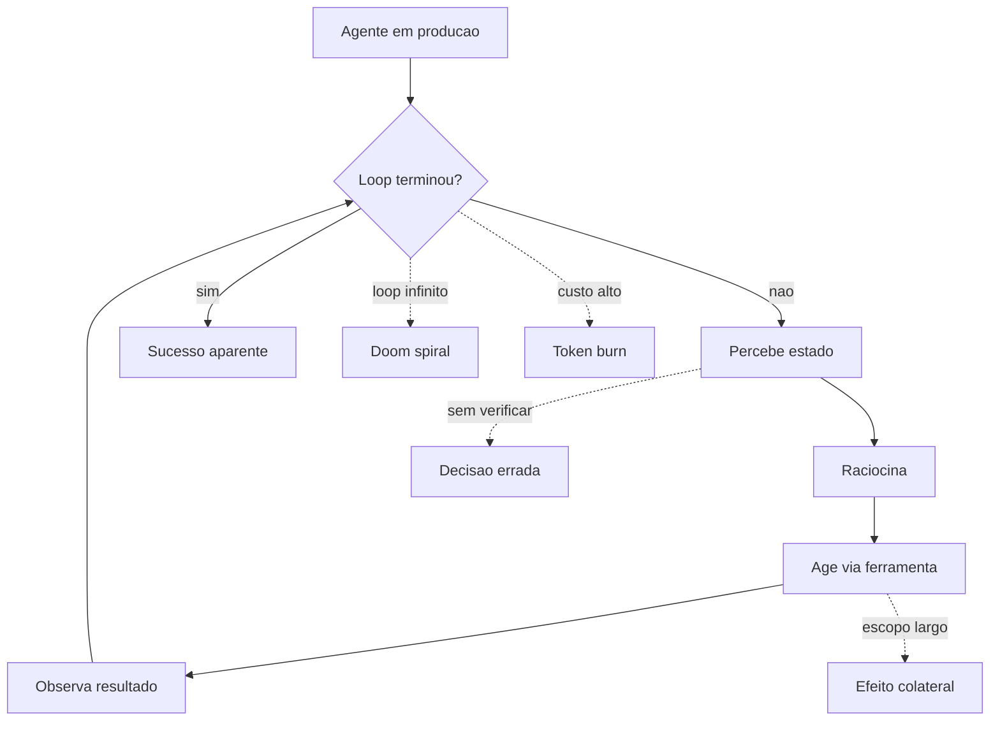

# Capítulo 1: O loop autônomo: a promessa e o caos

## 1. Introdução

Este é o capítulo de abertura da obra que transforma você, Engenheiro de Plataforma, no maquinista de uma locomotiva potente demais para rodar sem trilhos. Você vai aprender por que agentes de IA que funcionam maravilhosamente em demos descarrilam em produção, quais são os quatro modos clássicos de descarrilamento — o loop infinito, o custo descontrolado, a decisão errada que parece certa e o efeito colateral imprevisto — e por que a resposta a tudo isso não é abandonar a autonomia, e sim construir a camada que a contém: o harness.

Ao final deste capítulo, você será capaz de diagnosticar, em qualquer sistema agêntico, se o problema é do agente ou do trilho — e, mais importante, saberá por que essa distinção define a arquitetura de tudo o que vem nos capítulos seguintes.

## 2. Explica

### A promessa da autonomia

A promessa é sedutora: um sistema que recebe um objetivo de alto nível e o executa sem supervisão humana passo a passo — escreve o código, roda os testes, corrige o erro, pesquisa a documentação, integra os serviços. A diferença entre uma chamada de API tradicional e um agente é exatamente essa: o caminho até o resultado não é programado por um humano, e sim decidido em tempo de execução por um modelo de linguagem dirigindo um loop de perceber, raciocinar, agir e observar [1]. A Anthropic define essa distinção com precisão: *workflows* são caminhos de código predefinidos em que o LLM é orquestrado, enquanto *agents* são sistemas em que o próprio LLM dirige dinamicamente seus processos e decide quais ferramentas usar — e a recomendação explícita é começar com a solução mais simples possível, adicionando complexidade apenas quando o problema a justifica [2].

O ponto de partida conceitual é o que você vai encontrar em qualquer taxonomia de agentes: um agente é, em última instância, um **loop** — um laço de execução que repete um ciclo até que um critério de término seja satisfeito. A literatura de engenharia de agentes descreve esse ciclo com variações de nomes, mas a mecânica é estável: o sistema percebe o estado do mundo, raciocina sobre o que fazer, executa uma ação por meio de uma ferramenta e observa o resultado, voltando ao início do ciclo [3]. O framework ReAct formalizou essa combinação de raciocínio intercalado com ação como um padrão reprodutível: em vez de gerar uma cadeia de pensamento solta, o modelo alterna *Thought*, *Action* e *Observation*, e é essa alternância que permite ao agente reagir ao ambiente em vez de apenas planejar contra ele [4].

Quando esse loop roda em um ambiente controlado, com uma única tarefa bem definida e um número pequeno de passos, ele é confiável o suficiente para impressionar. O problema é que produção não é demo: produção tem ferramentas reais com efeitos colaterais reais, entradas adversariais, limites de custo, rate limits e janelas de contexto finitas [5]. E é exatamente nesse salto que a maioria dos sistemas agênticos descarrila — não porque o modelo de linguagem seja ruim, mas porque o **harness** — a camada que envolve o modelo com contexto, ferramentas, memória e controle de loop — não foi projetado para conter as falhas que a autonomia inevitavelmente produz [6].

### Os quatro modos de descarrilamento

Vamos decompor o descarrilamento em quatro modos, porque cada um exige um remédio diferente e porque a maior parte das falhas de agentes em produção é uma combinação deles.

**1. O loop infinito.** O agente repete a mesma ação ou variações dela indefinidamente, sem nunca satisfazer o critério de término. O mecanismo por trás é simples: se o agente depende de uma observação para decidir parar, e essa observação nunca chega — ou chega sempre ligeiramente diferente — o ciclo não tem razão para terminar. A literatura chama esses episódios de *doom spirals* ou espirais de perdição: ciclos de retentativa que se realimentam, em que cada tentativa falha e cada falha gera outra tentativa, consumindo orçamento de tokens a cada volta [7]. O exemplo clássico em engenharia é o agente que tenta gerar um JSON válido, recebe um erro de parsing, tenta de novo, recebe o mesmo erro porque o formato não mudou, e assim por diante — o erro não é falta de esforço, é um problema estrutural que nenhuma quantidade de tentativas resolve.

**2. O custo descontrolado.** Autonomia é diretamente proporcional a custo: cada passo de raciocínio, cada chamada de ferramenta e cada retentativa consomem tokens e latência. A métrica que a indústria usa para dimensionar esse risco é o **token burn**: a taxa na qual um agente consome orçamento de inferência [8]. Um agente que você esperava que custasse uma fração de centavo por tarefa pode, em um cenário de loop, custar centenas de vezes mais — e o pior é que esse custo escala com o número de agentes: cem agentes em produção com um problema de loop compartilhado podem queimar o orçamento mensal de inferência em minutos. A governança de custo em tempo de execução, com circuit breakers por teto de gasto, tornou-se um requisito, não um luxo [9].

**3. A decisão errada que parece certa.** Este é o modo mais traiçoeiro e o que melhor caracteriza agentes. Diferente de uma aplicação tradicional, que falha de forma barulhenta — exceção, stack trace, página vermelha no dashboard — o agente falha de forma educada (*polite failure*): ele completa o ciclo, produz uma saída sintaticamente perfeita, e a decisão embutida nessa saída está simplesmente errada [10]. A falha não gera alerta porque nada quebrou no sentido clássico; o sistema respondeu, completou a tarefa aparentemente, e o resultado incorreto só será detectado quando um humano (ou um downstream) notar a divergência. É por isso que a observabilidade de agentes não pode se limitar a métricas de disponibilidade — ela precisa rastrear o que o agente decidiu, por que decidiu e com quais ferramentas agiu [11].

**4. O efeito colateral imprevisto.** O agente foi autorizado a fazer X e, em algum lugar do caminho, fez Y. A causa raiz quase sempre é uma ferramenta com escopo largo demais: um agente de pesquisa que tem acesso a uma ferramenta de escrita, um agente de leitura que herda credenciais de produção, uma chamada de API cujo argumento era permitido pelo esquema mas proibido pela política. A taxonomia OWASP para aplicações agênticas formaliza isso como *tool misuse* e *identity & privilege abuse*: o agente usa uma ferramenta de forma fora do escopo pretendido, ou abusa de privilégios herdados [12]. A defesa estrutural é o princípio da menor agência — cada agente recebe apenas as ferramentas estritamente necessárias à sua função, e nada mais [13].

### Por que a resposta é o harness

Observe um padrão comum nos quatro modos: nenhum deles é um problema do modelo de linguagem em si. O loop infinito é um problema de controle de fluxo; o custo é um problema de orçamento; a decisão errada é um problema de verificação; o efeito colateral é um problema de autorização. Todos são problemas da **camada em volta do modelo** — exatamente o que chamamos de harness [6].

A consequência arquitetural é profunda: a confiabilidade de um agente é, na prática, a confiabilidade do seu harness. Dois times podem usar o mesmo modelo com a mesma temperatura e obter resultados radicalmente diferentes em produção porque seus harnesses diferem — um tem step budget, validação de esquema e telemetria por passo; o outro tem um loop while solto e esperança [14]. Os frameworks de orquestração que dominam o mercado hoje — de grafos de estado como o LangGraph a motores de execução durável como o Temporal — existem exatamente para preencher essa camada, e a diferença prática entre eles é menos a capacidade do modelo e mais a disciplina da contenção que impõem [18]. Essa é a tese central que este livro desenvolve: o harness não é infraestrutura acessória, é o produto de engenharia principal de qualquer sistema agêntico que pretenda sobreviver em produção — e a evidência está nos incidentes relatados de agentes que queimaram orçamentos inteiros em horas, não em meses [19]. A indústria já formalizou essa camada com padrões abertos: o Model Context Protocol, por exemplo, padroniza a interface entre o harness e as ferramentas, tornando a via férrea portável entre provedores [20].

## 3. Ilustra

### A locomotiva sem trilhos

Feche os olhos e imagine a cena do nosso motivo condutor: uma locomotiva a vapor, brilhante, recém-saída da oficina, com potência de sobra para puxar cem vagões. Agora imagine essa locomotiva solta em um descampado, sem trilhos. O maquinista tem o acelerador, tem a caldeira, tem todo o conhecimento de como gerar vapor — mas não tem via. A locomotiva arranca, ganha velocidade, e em poucos metros começa a afundar no barro, a bater em pedras, a arrastar a si mesma para fora do curso. Ninguém diria que o problema é a caldeira. O problema é a ausência de infraestrutura de direção.

É exatamente essa a situação de um agente sem harness. O modelo é a locomotiva — poderoso, capaz, impressionante. A tarefa é o destino. E a via férrea é a camada que faz a potência chegar ao destino: a bitola (os padrões de interface), os sinais (os guardrails), as estações (os checkpoints de verificação) e a cabine do maquinista (a orquestração). Sem trilhos, a locomotiva mais potente do mundo só produz descarrilamento — mais rápido e mais espetacular quanto mais potente for [2].



Como Engenheiro de Plataforma, você já viveu essa cena em versão digital: a demo que encantou o comitê executivo em março e a págada de custo que chegou na fatura de abril. A locomotiva era a mesma — o que mudou foi a ausência da via.

### O vocabulário que vamos usar

Ao longo do livro, o vocabulário do motivo condutor se repete: **bitola** são os padrões de interface e contrato; **sinais** são os guardrails e validações; **estações** são os checkpoints onde a execução para e é verificada; **cabine do maquinista** é o orquestrador; e **via férrea** é o harness completo. Quando você encontrar esses termos, saiba que estamos falando do mesmo sistema sob ângulos diferentes — e que a obra inteira é a construção dessa via, trilho por trilho.

## 4. Técnica

### Diagnosticando um descarrilamento: o checklist do maquinista

Antes de construir a via férrea, você precisa da ferramenta de diagnóstico: um roteiro replicável para descobrir, diante de um agente que falha em produção, qual dos quatro modos de descarrilamento está em jogo. A técnica abaixo transforma o diagnóstico em um procedimento determinístico, em vez de uma intuição.

O primeiro passo é sempre capturar o **transcript** — o registro completo do loop: mensagens, chamadas de ferramenta, observações e raciocínio. Sem ele, todo diagnóstico é especulação. A Anthropic define o transcript como um dos quatro componentes estruturais de um eval de agente, ao lado da task, do trial e do outcome [15]. Na prática, isso significa que o harness precisa logar cada passo, desde a primeira invocação até o término — e os frameworks de observabilidade de agentes convergiram em instrumentar exatamente essa estrutura, com traces por passo e sessões ligadas ao transcript [16].

### Implementando o detector de padrões de loop

O código abaixo implementa um classificador determinístico que analisa um transcript e aponta qual modo de descarrilamento está presente. Ele usa três sinais: repetição de ações (loop), consumo de passos sem progresso (custo) e repetição de erros idênticos (doom spiral).

```python
"""Detector de modos de descarrilamento em transcripts de agentes.

Analisa o log de passos de um agente e classifica o padrão de falha
em loop infinito, custo descontrolado, decisão sem verificação ou
efeito colateral de escopo.
"""
from collections import Counter
from dataclasses import dataclass, field
from typing import List


@dataclass
class Passo:
    """Um passo individual do loop do agente."""
    indice: int
    acao: str              # nome da ferramenta ou "raciocinio"
    assinatura: str        # hash do payload enviado
    observacao: str = ""   # resumo curto do resultado
    erro: str = ""         # mensagem de erro, se houve


@dataclass
class Diagnostico:
    """Resultado da classificação do transcript."""
    modo: str
    evidencias: List[str] = field(default_factory=list)
    passos_total: int = 0
    acoes_repetidas: int = 0
    erros_repetidos: int = 0
    passos_sem_observacao_nova: int = 0


def detectar_descarrilamento(
    passos: List[Passo],
    orcamento_maximo: int = 50,
    limite_repeticao: int = 4,
    limite_erros_iguais: int = 3,
) -> Diagnostico:
    """Classifica o transcript segundo os quatro modos de descarrilamento.

    Regras:
    - Loop infinito: mesma assinatura de ação repetida N vezes seguidas.
    - Custo: passos totais acima do orçamento sem observação nova.
    - Doom spiral: o mesmo erro ocorre N vezes com payload idêntico.
    - Padrão normal: nenhum dos sinais acima.
    """
    assinaturas: List[str] = [p.assinatura for p in passos]
    contagem = Counter(assinaturas)
    erros: List[str] = [p.erro for p in passos if p.erro]
    contagem_erros = Counter(erros)

    acoes_repetidas = sum(1 for _, n in contagem.items() if n >= limite_repeticao)
    erros_repetidos = sum(1 for _, n in contagem_erros.items() if n >= limite_erros_iguais)

    ultima_observacao = ""
    passos_sem_observacao_nova = 0
    for p in passos:
        if p.observacao == ultima_observacao and p.observacao:
            passos_sem_observacao_nova += 1
        ultima_observacao = p.observacao or ultima_observacao

    evidencias: List[str] = []
    if acoes_repetidas > 0:
        evidencias.append(
            f"{acoes_repetidas} assinatura(s) de ação repetida "
            f"{limite_repeticao}+ vezes"
        )
    if passos_sem_observacao_nova >= limite_repeticao:
        evidencias.append(
            f"{passos_sem_observacao_nova} passos sem observação nova"
        )
    if erros_repetidos > 0:
        evidencias.append(
            f"{erros_repetidos} tipo(s) de erro repetido "
            f"{limite_erros_iguais}+ vezes"
        )
    if len(passos) > orcamento_maximo:
        evidencias.append(
            f"transcript excede orçamento: {len(passos)} > {orcamento_maximo}"
        )

    if acoes_repetidas > 0 or passos_sem_observacao_nova >= limite_repeticao:
        modo = "LOOP_INFINITO"
    elif erros_repetidos > 0:
        modo = "DOOM_SPIRAL"
    elif len(passos) > orcamento_maximo:
        modo = "CUSTO_DESCONTROLADO"
    else:
        modo = "NORMAL"

    return Diagnostico(
        modo=modo,
        evidencias=evidencias,
        passos_total=len(passos),
        acoes_repetidas=acoes_repetidas,
        erros_repetidos=erros_repetidos,
        passos_sem_observacao_nova=passos_sem_observacao_nova,
    )


def exemplo_uso() -> None:
    """Cena de contraste: o mesmo erro retornado 5 vezes seguidas."""
    passos: List[Passo] = []
    for i in range(6):
        passos.append(
            Passo(
                indice=i,
                acao="gerar_json",
                assinatura="payload:config-invalida",
                observacao="",
                erro="json.decoder.JSONDecodeError: coluna 12",
            )
        )
    diag = detectar_descarrilamento(passos)
    print(f"modo: {diag.modo}")
    print(f"evidências: {diag.evidencias}")


if __name__ == "__main__":
    exemplo_uso()
```

O classificador é deliberadamente simples: ele não entende a tarefa, apenas os padrões do loop. E é exatamente essa simplicidade que o torna confiável — a detecção de repetição é determinística, não depende de julgamento, e pode rodar como gate em tempo de execução: se o modo for `LOOP_INFINITO` ou `DOOM_SPIRAL`, o harness interrompe o agente antes que ele consuma mais orçamento [7].

### O harness mínimo para conter um descarrilamento

O segundo componente técnico deste capítulo é o harness mínimo que impede o descarrilamento antes que ele comece: um loop com orçamento de passos, tolerância a erro idêntico e registro de transcript. É a primeira estação da via férrea — e ela é pequena de propósito, para que você entenda cada peça antes de adicionar as demais nos capítulos seguintes.

```python
"""Harness minimo de execucao de um agente.

Contem o loop perceber-raciocinar-agir com tres contencões:
orcamento de passos, limite de erros identicos e registro do transcript.
"""
from dataclasses import dataclass, field
from typing import Callable, Dict, List, Optional


@dataclass
class ResultadoLoop:
    """Desfecho do loop: sucesso, estouro de orcamento ou espiral."""
    status: str  # "SUCESSO" | "ORCAMENTO_EXCEDIDO" | "ESPIRAL_DETECTADA"
    passos: int
    transcript: List[Dict[str, str]] = field(default_factory=list)


def executar_loop(
    objetivo: str,
    agir: Callable[[str, int], str],
    observar: Callable[[str], str],
    orcamento_passos: int = 20,
    limite_erro_identico: int = 3,
) -> ResultadoLoop:
    """Executa o loop do agente com as contenções do harness minimo.

    - agir: funcao que recebe (objetivo, indice do passo) e retorna a acao.
    - observar: funcao que recebe a acao e retorna a observacao.
    """
    transcript: List[Dict[str, str]] = []
    ultima_observacao: Optional[str] = None
    erros_identicos = 0
    passo = 0

    while passo < orcamento_passos:
        acao = agir(objetivo, passo)
        observacao = observar(acao)
        registro = {"passo": passo, "acao": acao, "observacao": observacao}
        transcript.append(registro)

        if observacao == ultima_observacao:
            erros_identicos += 1
        else:
            erros_identicos = 0
        ultima_observacao = observacao

        if erros_identicos >= limite_erro_identico:
            return ResultadoLoop("ESPIRAL_DETECTADA", passo + 1, transcript)
        if "CONCLUIDO" in observacao:
            return ResultadoLoop("SUCESSO", passo + 1, transcript)
        passo += 1

    return ResultadoLoop("ORCAMENTO_EXCEDIDO", orcamento_passos, transcript)
```

Essas duas peças — o detector e o harness mínimo — são a semente da via férrea. Nos próximos capítulos, cada componente do harness recebe um aprofundamento próprio: a janela de contexto (Capítulo 3), as ferramentas (Capítulo 4), a memória (Capítulo 5) e a orquestração (Capítulo 6). O que este capítulo estabelece é o diagnóstico: sem saber qual trilho está faltando, nenhum conserto é possível.

## 5. Aplica

### Cena de contraste: o cron de relatório que virou fatura de US$ 4.000

Você está na empresa, segunda-feira de manhã, e o alerta de custo do provedor de LLM disparou. Você abre o dashboard e encontra um cron de relatório de vendas que roda a cada hora — ele deveria gerar um resumo de 200 palavras com base em dados de um banco interno. O agente responsável, um loop autônomo implementado na semana passada, está há 14 horas tentando "melhorar" o relatório: a cada iteração ele decide adicionar uma seção, chama uma ferramenta de busca de dados, recebe os mesmos números, decide que "precisa de mais contexto", consulta outra fonte, recebe o mesmo resultado, e assim por diante. Ninguém revisou o código desde o deploy porque o cron "estava funcionando".

O erro que você cometeria seguindo o instinto: culpar o modelo. "O LLM ficou confuso", você pensa, e decide trocar o modelo por um mais caro e "mais inteligente". O diagnóstico que a teoria deste capítulo aponta: o problema não é o modelo, é a ausência de orçamento de passos e de critério de término no harness. O agente não tem razão para parar — nenhuma condição de parada foi definida, nenhum step budget foi configurado, e o transcript mostra a mesma assinatura de ação repetida dezenas de vezes. O detector que você implementou na seção Técnica classificaria isso como `CUSTO_DESCONTROLADO` (transcript excede o orçamento) com evidência de `LOOP_INFINITO` (mesma assinatura repetida).

A correção, na prática, tem três movimentos. Primeiro, **pare o sangramento**: derrube o cron e adicione um circuit breaker de custo por tarefa, para que nenhuma execução ultrapasse um teto configurado em dólares [9]. Segundo, **defina o critério de término**: o relatório deve parar quando a observação indicar "dados completos entregues" — uma condição explícita, não a ausência de erro. Terceiro, **dê o diagnóstico ao time**: documente no runbook que loops autônomos sem step budget são risco operacional de primeira ordem, e que qualquer novo agente em produção passa pelo gate do harness mínimo da seção Técnica [16].

### Armadilhas comuns

- **Confundir erro com progresso**: um agente que retorna o mesmo erro 10 vezes está em espiral, não "tentando". O limite de erros idênticos é o sinal mais barato e mais eficaz da via férrea.
- **Orçamento só em tokens**: limite passos e latência, não apenas tokens — um agente pode gastar poucos tokens por passo e ainda assim girar para sempre [8].
- **Critério de término vago**: "quando o usuário estiver satisfeito" não é um critério. O harness exige condições observáveis e mensuráveis.
- **Testar só o caminho feliz**: o demo que funciona no caminho feliz não revela o loop infinito que aparece no décimo caso adverso. É por isso que evals de agentes testam múltiplos trials e cenários de falha [15].

### O plano de adoção incremental: da demo ao trilho

A pergunta que fecha a aplicação prática é a mais comum em produção: por onde começar a construir a via férrea sem parar a operação? A resposta é a adoção incremental em três fases — e ela vale para qualquer sistema agêntico existente, não apenas os novos.

A **fase 1 é o shadow harness**: o harness mínimo entra em modo observação — registra o transcript, roda o detector de descarrilamento, mas não interrompe nada. É o instrumento instalado sem tocar no trem: você descobre, com dados, quais tarefas realmente descarrilam e em qual modo, antes de qualquer mudança de comportamento [14]. O custo é apenas de registro, e o ganho é o diagnóstico — a resposta à pergunta "qual trilho está faltando?" deixa de ser palpite.

A **fase 2 é a contenção ativa**: com o diagnóstico em mãos, o harness passa a interromper — step budget, limite de erros idênticos, teto de custo. É a fase em que as métricas do dashboard mudam de verdade: o custo por tarefa ganha teto, o tempo de execução ganha cauda curta, e a taxa de interrupção manual cai porque o harness interrompe antes do humano [17]. O risco desta fase é o mais controlado possível: a contenção só age sobre padrões que a fase 1 já provou serem descarrilamento.

A **fase 3 é a instrumentação completa**: observabilidade, evals e governança entram em cena — o harness deixa de ser contenção e vira plataforma. Cada fase entrega valor isolado, e a sequência protege o time de dois fracassos clássicos: o harness que interrompe tudo por alarmismo (sem a fase 1, o diagnóstico) e o harness que observa para sempre sem nunca conter (sem a fase 2, a ação) [10].

### A cena de contraste: o pitch que virou caos

Vale fechar com a cena completa, porque ela reúne todos os modos em uma única narrativa — o tipo de incidente que a literatura de observabilidade de agentes registra como o mais comum em 2026 [10]. Você está em uma scale-up de 80 pessoas, e o CEO pede um "agente de vendas" que qualifique leads sozinho. O time — empolgado, sem harness — entrega em duas semanas: um loop que pega a lista de leads, chama uma API de enriquecimento, escreve um resumo e envia e-mail de follow-up. Na primeira semana de produção, três coisas acontecem ao mesmo tempo: o agente entra em loop no lead 300 (a API de enriquecimento devolve o mesmo erro, e ele retenta), o custo semanal dobra (cada volta consome tokens), e o e-mail de follow-up vai para um lead que já tinha feito opt-out (a lista tinha a flag, o agente não a leu).

O erro que o time cometeu seguindo o instinto: culpar o modelo e pedir mais orçamento de inferência. O diagnóstico deste capítulo: os quatro modos de descarrilamento aconteceram *juntos* — loop infinito (retry infinito), custo descontrolado (tokens duplicados), decisão errada que parece certa (o follow-up tecnicamente enviado) e efeito colateral imprevisto (o opt-out violado). Nenhum deles era culpa do modelo: a via férrea simplesmente não existia [2].

A correção, na prática: o shadow harness da fase 1 mostrou, em 48 horas, os três padrões no transcript; a contenção da fase 2 interrompeu o retry no segundo erro idêntico e impôs o teto de custo semanal; e a fase 3 adicionou o eval de regressão "opt-out nunca recebe follow-up" à suíte. O agente de vendas continua autônomo — mas agora dentro de trilhos, com o custo previsível e a decisão errada detectável [17].

### Armadilhas comuns

- **Confundir erro com progresso**: um agente que retorna o mesmo erro 10 vezes está em espiral, não "tentando". O limite de erros idênticos é o sinal mais barato e mais eficaz da via férrea.
- **Orçamento só em tokens**: limite passos e latência, não apenas tokens — um agente pode gastar poucos tokens por passo e ainda assim girar para sempre [8].
- **Critério de término vago**: "quando o usuário estiver satisfeito" não é um critério. O harness exige condições observáveis e mensuráveis.
- **Testar só o caminho feliz**: o demo que funciona no caminho feliz não revela o loop infinito que aparece no décimo caso adverso. É por isso que evals de agentes testam múltiplos trials e cenários de falha [15].

### O caderno de decisões do capítulo: o que levar para a operação

Fechar um capítulo com um resumo prático das decisões que ele implica ajuda a transformar leitura em ação — e as decisões deste capítulo são as fundações de tudo o que vem [18]. Primeira: **todo agente de produção tem um harness, quer você o tenha desenhado ou não** — a ausência de design não é ausência de camada, é uma camada acidental feita de ifs de contenção espalhados, e a primeira tarefa de quem herda um sistema agêntico é mapear essa camada oculta antes de tocar em qualquer outra coisa. Segunda: **o diagnóstico precede o conserto** — rodar o detector de descarrilamento no transcript real, antes de qualquer mudança, evita o erro clássico de consertar o trilho errado (aumentar a janela quando o problema é o critério de término, trocar o modelo quando o problema é a contenção) [2]. Terceira: **a adoção é incremental, nunca big-bang** — shadow harness, contenção ativa, instrumentação completa: cada fase entrega valor isolado e reduz o risco da seguinte [14].

Essas três decisões são o que diferencia o time que trata harness como produto do time que trata harness como emergência. E elas se repetem, com variações, em todos os capítulos seguintes: cada camada da via férrea será introduzida com a mesma lógica — diagnosticar, construir o mínimo, medir, expandir. O maquinista que começa a viagem com o mapa das fundações já está à frente de quem começa só com a locomotiva [19].

### Métricas de sucesso

Um harness mínimo implementado corretamente muda três métricas: o **custo por tarefa** cai de um valor imprevisível para um teto garantido; o **tempo médio de execução** ganha cauda curta (sem execuções de horas); e a **taxa de interrupção manual** cai, porque o próprio harness interrompe antes do humano precisar agir [17]. Essas três métricas são o primeiro dashboard de um maquinista — e o plano de adoção incremental garante que elas mudem sem parar a operação [14].

## 6. Conclusão

Neste capítulo, você aprendeu que a autonomia sem contenção produz quatro modos de descarrilamento — loop infinito, custo descontrolado, decisão errada que parece certa e efeito colateral imprevisto — e que nenhum deles é culpa do modelo, mas sim da camada que o envolve: o harness. Você implementou um detector determinístico de padrões de loop e um harness mínimo com orçamento de passos e limite de erros idênticos, e aplicou tudo a um caso real de cron que queimou orçamento. O desafio para você, agora: rode o detector no transcript de qualquer agente que você tenha em produção hoje e descubra, com evidência, qual trilho está faltando. No Capítulo 2, vamos destrinchar a anatomia do loop — perceber, raciocinar, agir e observar — para entender exatamente onde cada modo de descarrilamento nasce, e onde cada peça do harness vai se encaixar.

## 7. Referências Bibliográficas

[1] ANTHROPIC. *Building effective agents*. Disponível em: https://www.anthropic.com/engineering/building-effective-agents. Acesso em: 06 ago. 2026.
[2] ANTHROPIC. *Building effective agents: workflows vs. agents*. Disponível em: https://www.anthropic.com/engineering/building-effective-agents. Acesso em: 06 ago. 2026.
[3] LANGCHAIN. *LangGraph: conceptual guides — agent architecture*. Disponível em: https://langchain-ai.github.io/langgraph/concepts/agentic_concepts/. Acesso em: 06 ago. 2026.
[4] YAO, Shunyu et al. *ReAct: synergizing reasoning and acting in language models*. Disponível em: https://arxiv.org/abs/2210.03629. Acesso em: 06 ago. 2026.
[5] ANTHROPIC. *Effective context engineering for AI agents*. Disponível em: https://www.anthropic.com/engineering/effective-context-engineering-for-ai-agents. Acesso em: 06 ago. 2026.
[6] RUNKLE, Sydney. *Choosing the right multi-agent architecture*. Disponível em: https://www.langchain.com/blog/choosing-the-right-multi-agent-architecture. Acesso em: 06 ago. 2026.
[7] FOUNTAIN CITY. *AI agent governance: a practitioner's guide*. Disponível em: https://fountaincity.tech/resources/blog/ai-agent-governance-practitioners-guide/. Acesso em: 06 ago. 2026.
[8] ORACLE AI & DATA SCIENCE. *Runtime budget guardrails for agentic AI*. Disponível em: https://blogs.oracle.com/ai-and-datascience/runtime-budget-guardrails-agentic-ai. Acesso em: 06 ago. 2026.
[9] ORACLE AI & DATA SCIENCE. *Runtime budget guardrails: cost circuit breakers*. Disponível em: https://blogs.oracle.com/ai-and-datascience/runtime-budget-guardrails-agentic-ai. Acesso em: 06 ago. 2026.
[10] EXPANSO. *AI agent observability: best practices in 2026*. Disponível em: https://expanso.io/blog/ai-agent-observability-best-practices/. Acesso em: 06 ago. 2026.
[11] NEWTON-KING, James. *Inside the LLM call: GenAI observability with OpenTelemetry*. Disponível em: https://opentelemetry.io/blog/2026/genai-observability/. Acesso em: 06 ago. 2026.
[12] OWASP FOUNDATION. *OWASP Top 10 for agentic applications*. Disponível em: https://genai.owasp.org/resource/owasp-top-10-for-agentic-applications-for-2026/. Acesso em: 06 ago. 2026.
[13] MICROSOFT. *Architecting trust: a NIST-based security governance framework for AI agents*. Disponível em: https://techcommunity.microsoft.com/blog/microsoftdefendercloudblog/architecting-trust-a-nist-based-security-governance-framework-for-ai-agents/4490556. Acesso em: 06 ago. 2026.
[14] TEMPORAL TECHNOLOGIES. *Durable multi-agentic AI architecture with Temporal*. Disponível em: https://temporal.io/blog/using-multi-agent-architectures-with-temporal. Acesso em: 06 ago. 2026.
[15] ANTHROPIC. *Demystifying evals for AI agents*. Disponível em: https://www.anthropic.com/engineering/demystifying-evals-for-ai-agents. Acesso em: 06 ago. 2026.
[16] DIGITAL APPLIED. *Multi-agent orchestration: 5 patterns that work in 2026*. Disponível em: https://www.digitalapplied.com/blog/multi-agent-orchestration-5-patterns-that-work. Acesso em: 06 ago. 2026.
[17] ZYLOS RESEARCH. *Durable execution for AI agent runtimes: checkpointing, replay, and recovery*. Disponível em: https://zylos.ai/research/2026-04-24-durable-execution-agent-runtimes/. Acesso em: 06 ago. 2026.
[18] LANGCHAIN. *LangGraph: conceptual guides — agent architecture and orchestration*. Disponível em: https://langchain-ai.github.io/langgraph/concepts/agentic_concepts/. Acesso em: 06 ago. 2026.
[19] ORACLE AI & DATA SCIENCE. *Runtime budget guardrails for agentic AI*. Disponível em: https://blogs.oracle.com/ai-and-datascience/runtime-budget-guardrails-agentic-ai. Acesso em: 06 ago. 2026.
[20] ANTHROPIC. *Model Context Protocol: specification and documentation*. Disponível em: https://modelcontextprotocol.io/. Acesso em: 06 ago. 2026.
