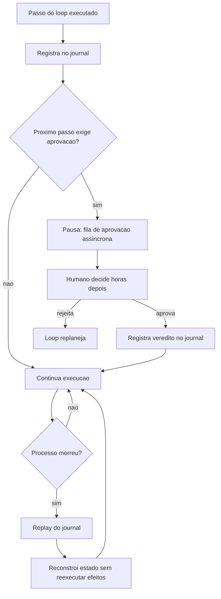

# Capítulo 10: Execução durável — do replay à aprovação humana

## 1. Introdução

O harness construído até aqui vive em um processo: se o processo morre — crash, deploy, reinício do pod — o que acontece com o loop em andamento? A resposta da engenharia é a execução durável: a disciplina que faz o trabalho do agente sobreviver à morte do processo. Você vai aprender os três pilares — o journal imutável de passos concluídos, o replay determinístico que retoma a execução sem repetir efeitos, e as idempotency keys que impedem duplicação — além do human-in-the-loop assíncrono, o checkpoint de aprovação que transforma a contenção do Capítulo 9 em durabilidade. Ao final, você vai implementar um executor durável com journal e replay, e uma fila de aprovação humana com expiração.

## 2. Explica

### O problema: processos morrem, trabalho não deveria

Agentes de produção executam tarefas que duram minutos, horas ou dias. Um agente que compila um relatório de uma hora, um agente que coordena um pipeline de migração de dados de três dias, um agente proativo (DAPER) que monitora um sistema 24/7. Em qualquer um desses cenários, o processo que hospeda o loop pode morrer no meio: o pod reinicia, a máquina cai, o deploy troca a versão. A pergunta da durabilidade é: o que sobrevive? [1]

A resposta ingênua — "o agente recomeça do zero" — é inaceitável por dois motivos. Primeiro, o custo: recomeçar uma tarefa de três dias porque o processo morreu no dia 2 é desperdício bruto. Segundo — e pior — a **duplicação de efeitos**: se o agente já enviou o e-mail no passo 40 e o processo morreu no passo 41, recomeçar do zero *reenvia o e-mail*. A durabilidade não é sobre recomeçar; é sobre retomar *sem repetir o que já foi feito* [1].

### O journal: a memória imutável do que foi feito

A base da execução durável é o **journal** (ou event history): o registro imutável e completo de cada passo concluído — cada ação executada, cada observação recebida, cada decisão tomada, na ordem exata [1]. O journal é o transcript do Capítulo 2 transformado em infraestrutura: não é um log para investigação, é o estado oficial do trabalho.

Duas propriedades definem o journal. A **imutabilidade**: uma vez registrado, um passo não é editado nem apagado — o que aconteceu aconteceu, e a história é a fonte da verdade. A **completeza**: o journal contém tudo o que o processo precisa para reconstruir o estado — não apenas "o que o agente disse", mas o que foi executado e o resultado real [1]. A Temporal, na sua arquitetura de agentes multi-agente, descreve exatamente essa estrutura: cada workflow é um journal de eventos, e o estado atual é uma função do journal [2].

### O replay determinístico: retomando sem repetir efeitos

Com o journal em mãos, a recuperação vira **replay determinístico**: o processo novo relê o journal, executa o código do loop de novo — mas em vez de reexecutar as ações, *reconstrói* o estado a partir dos eventos registrados [1]. As chamadas de ferramenta que já estão no journal não são reexecutadas; seus resultados são relidos do registro. O que roda de novo é apenas o *raciocínio local* — o código determinístico que calcula o próximo passo a partir do estado.

O requisito crítico do replay é a **deterministicidade**: o código do loop, entre dois pontos de journal, deve produzir o mesmo resultado toda vez que roda — senão o replay divergiria da execução original. Na prática, isso significa isolar as fontes de não-determinismo (chamadas de modelo, chamadas de API, tempo) em pontos de journal explícitos: o harness registra a saída da chamada de modelo como evento, e o replay relê essa saída em vez de chamar o modelo de novo [3].

### Idempotency keys: a defesa contra duplicação

Mesmo com replay, há uma falha inevitável: o processo morre *depois* de executar uma ação mas *antes* de registrá-la no journal. O e-mail foi enviado, o journal não diz que foi. No replay, o harness reexecuta a ação — e o e-mail vai de novo. A defesa é a **idempotency key**: cada ação destrutiva carrega uma chave única derivada do estado — e o sistema receptor (ou o harness, no caso de efeitos internos) ignora ações com chave já vista [4].

Na prática, o padrão é triplo: a ação tem chave `f(estado_atual)`, o journal registra a chave quando a ação é executada, e a execução de uma ação com chave duplicada é bloqueada — ou retorna o resultado anterior [4]. É a mesma técnica que pagamentos usam há décadas: um `idempotency_key` na chamada garante que uma retentativa não cobre duas vezes [4]. Para o harness, é o que permite retentar com segurança qualquer ação — a rede caiu? Retenta; a chave impede o duplo efeito.

### HITL assíncrono: a aprovação que atravessa o tempo

O quarto pilar conecta a durabilidade à governança: a **aprovação humana assíncrona** (human-in-the-loop). Quando o loop chega a um checkpoint que exige aprovação — uma ação destrutiva, um gasto acima do teto, uma publicação — o harness *pausa a execução de forma durável*: armazena o artefato exato sob revisão, o contexto que o humano precisa ver, e aguarda [5]. A espera não ocupa thread, não queima tokens, não trava processo — o estado está no journal, e a continuação acontece quando o humano aprova, horas ou dias depois [5].

O design tem duas peças: a **fila de aprovação** (o artefato + contexto + prazo) e a **retomada** (o loop ressurge do checkpoint com o veredito humano como nova observação). A Temporal descreve exatamente esse padrão com agentes: o workflow pausa em um sinal de aprovação, e um humano responde via interface assíncrona — e-mail, Slack, portal — sem manter nenhum processo vivo [2].

## 3. Ilustra

### O livro de ocorrências da ferrovia

Voltemos à ferrovia. O maquinista veterano carrega o **livro de ocorrências**: cada trecho percorrido, cada sinal visto, cada parada é registrado à mão, em ordem, sem rasuras — o journal da viagem. Quando o maquinista adoece no meio da serra e é substituído às 3 da manhã, o substituto não pergunta "onde estamos?" — ele lê o livro: "km 120, descida íngreme, freio em segunda; km 90, ponte em manutenção". Ele não redirige os trechos já feitos; ele sabe exatamente onde está e o que vem à frente. O livro não é um diário — é o estado oficial da viagem.



Como Engenheiro de Plataforma, você reconhece a cena oposta: o agente sem journal que, após o reinício, *reenviou* o e-mail que já tinha enviado — o incidente de duplicação que destrói confiança em autonomia. O livro de ocorrências é a diferença entre o trabalho que sobrevive ao processo e o trabalho que morre com ele.

### A dupla camada: durável não é o mesmo que resiliente

O ponto contraintuitivo que merece uma segunda analogia: **durabilidade é sobre retomar sem repetir — não sobre não falhar**. O maquinista substituto não torna a viagem imune a falhas; ele torna a *retomada* possível. A ferrovia não evita que o maquinista adoeça; ela garante que a viagem continue de onde parou, com o livro de ocorrências como ponte.

A confusão entre "resiliente" (o sistema não cai) e "durável" (o trabalho sobrevive à queda) leva a arquiteturas erradas: times que investem em alta disponibilidade do processo — replicação, failover — e esquecem o journal. Um processo que nunca cai, mas perde o trabalho na migração, é pior que um processo que cai e retoma — porque a queda escondida não gera o incidente visível que força a correção. A durabilidade é o fundamento; a resiliência é o extra.

## 4. Técnica

### Implementando o executor durável com journal e replay

A técnica central deste capítulo é o executor durável: o componente que registra cada passo no journal, executa ações com idempotency key e reconstrói o estado via replay após um crash. A implementação abaixo é o núcleo dessa peça:

```python
"""Executor duravel do loop: journal imutavel, idempotencia e replay.

O journal registra cada passo concluido. O replay reconstrói o estado
relendo o journal, sem reexecutar efeitos ja registrados.
"""
import json
from dataclasses import dataclass, field
from typing import Callable, Dict, List, Optional


@dataclass
class Evento:
    """Um evento imutavel do journal."""
    tipo: str          # "acao" | "observacao" | "veredito" | "aprovacao"
    chave: str         # idempotency key da acao
    payload: Dict[str, object] = field(default_factory=dict)


class Journal:
    """Registro imutavel e completo dos passos concluidos."""

    def __init__(self, caminho: str = "journal.jsonl") -> None:
        self.caminho = caminho
        self.eventos: List[Evento] = []

    def adicionar(self, evento: Evento) -> None:
        """Acrescenta um evento ao final do journal (nunca edita)."""
        self.eventos.append(evento)
        with open(self.caminho, "a", encoding="utf-8") as arquivo:
            arquivo.write(
                json.dumps(
                    {"tipo": evento.tipo, "chave": evento.chave, "payload": evento.payload},
                    ensure_ascii=False,
                )
                + "\n"
            )

    def chave_ja_vista(self, chave: str) -> bool:
        """Verifica se uma idempotency key ja foi registrada."""
        return any(e.chave == chave for e in self.eventos)


class ExecutorDuravel:
    """Executa acoes com journal, idempotencia e replay."""

    def __init__(
        self,
        journal: Journal,
        executar_acao: Callable[[str, Dict[str, object]], Dict[str, object]],
        gerar_chave: Callable[[str, Dict[str, object]], str],
    ) -> None:
        self.journal = journal
        self.executar_acao = executar_acao
        self.gerar_chave = gerar_chave

    def executar(
        self, nome_acao: str, payload: Dict[str, object]
    ) -> Dict[str, object]:
        """Executa uma acao com idempotencia: repeticoes nao duplicam efeito."""
        chave = self.gerar_chave(nome_acao, payload)
        if self.journal.chave_ja_vista(chave):
            return {"ok": True, "duplicado": True, "chave": chave}
        resultado = self.executar_acao(nome_acao, payload)
        self.journal.adicionar(Evento("acao", chave, {"acao": nome_acao, "payload": payload}))
        self.journal.adicionar(
            Evento("observacao", chave, {"resultado": resultado})
        )
        return {"ok": True, "duplicado": False, "chave": chave, "resultado": resultado}

    def replay(self) -> Dict[str, object]:
        """Reconstroi o estado atual relendo o journal (sem reexecutar)."""
        estado: Dict[str, object] = {"passos": [], "ultima_observacao": None}
        for evento in self.journal.eventos:
            if evento.tipo == "acao":
                estado["passos"].append(evento.payload)  # type: ignore[attr-defined]
            elif evento.tipo == "observacao":
                estado["ultima_observacao"] = evento.payload
        return estado


def exemplo_uso() -> None:
    """Demo: crash simulado — a segunda execucao nao duplica o efeito."""
    contador = {"envios": 0}

    def enviar_email(nome: str, payload: Dict[str, object]) -> Dict[str, object]:
        contador["envios"] += 1
        return {"destinatario": payload.get("destinatario")}

    journal = Journal("journal_demo.jsonl")
    executor = ExecutorDuravel(
        journal=journal,
        executar_acao=enviar_email,
        gerar_chave=lambda nome, p: f"{nome}:{p.get('destinatario')}",
    )
    executor.executar("enviar_email", {"destinatario": "cliente@exemplo.com"})
    # processo morre aqui; o novo processo relê o mesmo journal
    executor.executar("enviar_email", {"destinatario": "cliente@exemplo.com"})
    print("envios reais:", contador["envios"])
    print("estado apos replay:", executor.replay())


if __name__ == "__main__":
    exemplo_uso()
```

O executor durável entrega os dois pilares centrais: **idempotência** (a segunda execução da mesma ação não duplica o efeito — a chave está no journal) e **replay** (o estado é reconstruído relendo o journal, sem reexecutar efeitos). É a resposta técnica ao incidente do e-mail duplicado.

### A fila de aprovação humana assíncrona

O segundo componente é a fila de aprovação: o checkpoint durável onde o loop pausa e aguarda o veredito humano — com expiração e retomada [5]:

```python
"""Fila de aprovacao humana assincrona com expiracao e retomada."""
import time
from dataclasses import dataclass, field
from typing import Dict, List, Optional


@dataclass
class ItemAprovacao:
    """Um artefato aguardando decisao humana."""
    id: str
    descricao: str
    contexto: Dict[str, object] = field(default_factory=dict)
    criado_em: float = field(default_factory=time.time)
    ttl_s: float = 86400.0
    status: str = "pendente"  # "pendente" | "aprovado" | "rejeitado" | "expirado"


class FilaDeAprovacao:
    """Fila assincrona: o loop pausa e o humano decide depois."""

    def __init__(self) -> None:
        self.itens: Dict[str, ItemAprovacao] = {}

    def solicitar(self, descricao: str, contexto: Dict[str, object], ttl_s: float = 86400.0) -> str:
        """Cria um item de aprovacao e retorna o id."""
        item_id = f"ap-{len(self.itens) + 1}"
        self.itens[item_id] = ItemAprovacao(
            id=item_id, descricao=descricao, contexto=contexto, ttl_s=ttl_s
        )
        return item_id

    def _expirar(self, item: ItemAprovacao) -> None:
        if (
            item.status == "pendente"
            and time.time() - item.criado_em > item.ttl_s
        ):
            item.status = "expirado"

    def decidir(self, item_id: str, aprovado: bool) -> bool:
        """Registra a decisao humana (se ainda dentro do prazo)."""
        item = self.itens.get(item_id)
        if item is None:
            return False
        self._expirar(item)
        if item.status != "pendente":
            return False
        item.status = "aprovado" if aprovado else "rejeitado"
        return True

    def pendentes(self) -> List[ItemAprovacao]:
        """Lista itens pendentes, expirando os vencidos."""
        pendentes: List[ItemAprovacao] = []
        for item in self.itens.values():
            self._expirar(item)
            if item.status == "pendente":
                pendentes.append(item)
        return pendentes


def exemplo_fila() -> None:
    """Demo: agente solicita aprovacao e o humano decide depois."""
    fila = FilaDeAprovacao()
    item_id = fila.solicitar(
        "excluir 1.234 registros duplicados",
        {"tabela": "staging_vendas", "estimativa_linhas": 1234},
    )
    print("pendentes:", [i.id for i in fila.pendentes()])
    fila.decidir(item_id, aprovado=True)
    print("apos decisao:", fila.itens[item_id].status)


if __name__ == "__main__":
    exemplo_fila()
```

A fila é a materialização do checkpoint durável: o loop pausa, o processo pode morrer, e a decisão do humano — horas depois — retoma a execução a partir do journal. O prazo (TTL) garante que aprovações esquecidas expirem em vez de pendurar para sempre [5].

### Replay com retomada após aprovação

O terceiro componente amarra os dois: o fluxo completo em que o loop pausa para aprovação, o processo morre, e a retomada acontece com o veredito humano como nova observação:

```python
"""Retomada duravel apos aprovacao humana com replay do journal."""
from typing import Dict, List


def retomar_apos_aprovacao(
    journal,
    fila,
    item_id: str,
    estado_anterior: Dict[str, object],
) -> Dict[str, object]:
    """Reconstrói o estado e aplica o veredito humano como observacao."""
    estado = dict(estado_anterior)
    item = fila.itens.get(item_id)
    if item is None:
        return estado
    if item.status == "expirado":
        estado["situacao"] = "aprovacao_expirada_escalar"
    elif item.status == "aprovado":
        estado["situacao"] = "continuar_execucao"
        journal.adicionar(
            {"tipo": "veredito", "chave": item_id, "payload": {"decisao": "aprovado"}}
        )
    else:
        estado["situacao"] = "replanejar"
        journal.adicionar(
            {"tipo": "veredito", "chave": item_id, "payload": {"decisao": "rejeitado"}}
        )
    return estado
```

O fluxo completo é o que a produção exige: o agente pausa no checkpoint, o processo morre, o replay reconstrói o estado, e a retomada aplica o veredito humano — sem reexecutar a ação que precedeu o checkpoint e sem perder a decisão humana [2].

## 5. Aplica

### Cena de contraste: o e-mail duplicado do deploy de sexta

Você é o engenheiro de plataforma, e o deploy de sexta-feira à noite deixou uma marca que a empresa não esquece: o agente de comunicação com clientes, durante uma migração de dados que envolvia avisar clientes sobre a troca de servidor, *reenviou* 4.000 e-mails quando o processo foi reiniciado no meio da execução. A causa: o agente recomeçou do zero, e o passo "enviar aviso" foi executado duas vezes para cada cliente. O time passou o fim de semana remediando com e-mails de desculpa.

O erro que você cometeria seguindo o instinto: "o problema foi o deploy — vamos congelar deploys durante execuções longas". O diagnóstico deste capítulo: o problema é a ausência de journal — o processo não sabia o que já tinha feito, então refez. Congelar deploys é um band-aid que transfere o risco para o próximo crash inevitável (rede, pod, máquina) [1].

A correção tem três movimentos. Primeiro, **introduza o journal**: cada ação do agente de comunicação registra uma idempotency key (por cliente) antes do efeito — o e-mail enviado entra no journal, e a retentativa com a mesma chave é bloqueada [4]. Segundo, **implemente o replay**: o reinício relê o journal e retoma do passo 4.000 dos 12.000, em vez de recomeçar do zero — o estado é reconstruído sem reexecutar os 4.000 e-mails já enviados [1]. Terceiro, **adicione a fila de aprovação** para as ações irreversíveis: o envio em massa exige aprovação humana assíncrona com TTL, e o agente pausa até o sinal [5]. O deploy de sexta continua acontecendo — mas agora o trabalho sobrevive a ele, e a duplicação é mecanicamente impossível.

### O design do journal: o que registrar e em que formato

A durabilidade depende da qualidade do journal — e o design do journal tem regras que a prática de execução durável consolidou [6]. A primeira regra é **registrar antes do efeito, confirmar depois**: a ação destrutiva entra no journal com a sua idempotency key *antes* de executar (o estado "pendente"), e o resultado é registrado depois (o estado "concluída") [4]. Essa ordem é o que fecha a janela de duplicação: se o processo morre entre o registro e o efeito, o replay vê "pendente" e decide se reexecuta com segurança; se morre entre o efeito e a confirmação, o replay vê a chave e não duplica [4].

A segunda regra é **estrutura canônica de eventos**: cada entrada com tipo, chave, payload e carimbo de tempo — o mesmo formato canônico do transcript do Capítulo 2, agora com a semântica de durabilidade. A terceira regra é **retenção e arquivamento**: o journal cresce com o trabalho, e a política de retenção define quanto histórico vive online (para replay completo) versus arquivado (para auditoria, como a trilha do Capítulo 11) [6]. Um journal que cresce sem política vira o depósito que a memória do Capítulo 5 condenou — a durabilidade precisa de curadoria também.

### O caso de fronteira: replay e as chamadas de modelo não determinísticas

Há um ponto técnico que separa a execução durável amadora da profissional: o replay e a não-deterministicidade das chamadas de modelo [3]. O replay correto não reexecuta chamadas de LLM — se reexecutasse, o modelo poderia produzir uma resposta diferente na segunda vez, e o replay divergiria da execução original. A prática é **persistir a saída do modelo como evento**: no momento da chamada, o harness registra a resposta completa no journal; no replay, a chamada não acontece — a resposta é relida [3].

Essa disciplina tem duas consequências. A primeira é de custo: o replay não gasta tokens — o que torna a retomada barata mesmo para tarefas longas. A segunda é de determinismo: o estado reconstruído é *idêntico* ao original, porque toda fonte de não-determinismo — modelo, API, tempo — foi registrada como evento no ponto em que aconteceu [3]. O código determinístico entre os pontos de journal é o que roda no replay; as chamadas não determinísticas são relidas, nunca reexecutadas. É a fronteira que este capítulo destacou na seção Explica, agora com a prática exata de implementação.

### Armadilhas comuns

- **Recomeçar do zero**: sem journal, o reinício refaz trabalho e — pior — duplica efeitos. O journal é a base, não o extra [1].
- **Replay que reexecuta efeitos**: replay correto relê resultados do journal; replay errado reexecuta chamadas. A distinção é o coração da técnica [3].
- **Sem idempotency key**: mesmo com journal, a janela entre ação e registro permite duplicação. A chave fecha a janela [4].
- **Aprovação síncrona**: bloquear uma thread esperando o humano queima recursos. A fila assíncrona com TTL é o padrão de produção [5].

### O caderno de decisões do capítulo

Três decisões deste capítulo definem a durabilidade como base da produção [8]. Primeira: **o journal é o estado oficial, o processo é descartável** — todo o trabalho que importa vive no registro imutável, e o processo pode morrer e renascer sem perder o fio; a pergunta "o que sobrevive ao crash?" tem uma resposta única: o journal [1]. Segunda: **retomar sem repetir é a regra de ouro** — o replay relê efeitos, nunca reexecuta; a idempotency key fecha a janela entre ação e registro; e as chamadas de modelo são persistidas como eventos, não reexecutadas [3]. Terceira: **a aprovação humana é assíncrona e durável** — o loop pausa no checkpoint, o processo pode morrer, e a decisão do humano — horas depois — retoma a execução a partir do journal [5].

A aplicação imediata é o teste de crash: escolher o agente com a tarefa mais longa, simular a morte do processo no meio da execução e medir três números — quantos efeitos foram duplicados, quanto trabalho foi refeito e quanto tempo a retomada levou. O teste costuma revelar que a maioria dos agentes em produção recomeça do zero — e que o custo da amnésia já estava na fatura, disfarçado de trabalho [6].

### Métricas de sucesso

Três métricas medem a durabilidade: **taxa de retomada sem reexecução** (voltas do loop reconstruídas via replay / total de voltas após crash), **efeitos duplicados por 100 mil passos** (deve tender a zero com idempotência) e **tempo de pausa de aprovação** (a fila assíncrona reduz de horas de thread ocupada para zero) [1] — com o journal bem desenhado, essas métricas são o contrato visível da durabilidade [6].

## 6. Conclusão

Você aprendeu que a execução durável faz o trabalho do agente sobreviver à morte do processo — com o journal imutável como estado oficial, o replay determinístico que retoma sem repetir efeitos, as idempotency keys que fecham a janela de duplicação e o human-in-the-loop assíncrono que atravessa o tempo. Você implementou o executor durável com journal e replay, a fila de aprovação com TTL e o fluxo de retomada pós-aprovação. O desafio: simule um crash no seu agente mais longo — mate o processo no meio da execução e verifique o que sobrevive — depois me diga quantos efeitos foram duplicados e quantos minutos foram perdidos. No Capítulo 11, vamos à camada que governa tudo isso: a governança de loops autônomos, da menor agência à auditoria imutável.

## 7. Referências Bibliográficas

[1] ZYLOS RESEARCH. *Durable execution for AI agent runtimes: checkpointing, replay, and recovery*. Disponível em: https://zylos.ai/research/2026-04-24-durable-execution-agent-runtimes/. Acesso em: 06 ago. 2026.
[2] TEMPORAL TECHNOLOGIES. *Durable multi-agentic AI architecture with Temporal*. Disponível em: https://temporal.io/blog/using-multi-agent-architectures-with-temporal. Acesso em: 06 ago. 2026.
[3] ZYLOS RESEARCH. *Durable execution: replay boundaries and determinism*. Disponível em: https://zylos.ai/research/2026-04-24-durable-execution-agent-runtimes/. Acesso em: 06 ago. 2026.
[4] TEMPORAL TECHNOLOGIES. *Durable execution: idempotency and retries*. Disponível em: https://temporal.io/blog/using-multi-agent-architectures-with-temporal. Acesso em: 06 ago. 2026.
[5] DANTRA, Ruskin et al. *Orchestrating intelligent agents at scale: how AgentCore and Temporal create robust AI systems*. Disponível em: https://aws.amazon.com/blogs/apn/how-temporal-uses-amazon-bedrock-agentcore-to-create-robust-ai-systems/. Acesso em: 06 ago. 2026.
[6] ANTHROPIC. *Building effective agents*. Disponível em: https://www.anthropic.com/engineering/building-effective-agents. Acesso em: 06 ago. 2026.
[7] ANTHROPIC. *Demystifying evals for AI agents*. Disponível em: https://www.anthropic.com/engineering/demystifying-evals-for-ai-agents. Acesso em: 06 ago. 2026.
[8] FOUNTAIN CITY. *AI agent governance: a practitioner's guide*. Disponível em: https://fountaincity.tech/resources/blog/ai-agent-governance-practitioners-guide/. Acesso em: 06 ago. 2026.
[9] ORACLE AI & DATA SCIENCE. *Runtime budget guardrails for agentic AI*. Disponível em: https://blogs.oracle.com/ai-and-datascience/runtime-budget-guardrails-agentic-ai. Acesso em: 06 ago. 2026.
[10] EXPANSO. *AI agent observability: best practices in 2026*. Disponível em: https://expanso.io/blog/ai-agent-observability-best-practices/. Acesso em: 06 ago. 2026.
[11] NEWTON-KING, James. *Inside the LLM call: GenAI observability with OpenTelemetry*. Disponível em: https://opentelemetry.io/blog/2026/genai-observability/. Acesso em: 06 ago. 2026.
[12] RUNKLE, Sydney. *Choosing the right multi-agent architecture*. Disponível em: https://www.langchain.com/blog/choosing-the-right-multi-agent-architecture. Acesso em: 06 ago. 2026.
[13] OWASP FOUNDATION. *OWASP Top 10 for agentic applications*. Disponível em: https://genai.owasp.org/resource/owasp-top-10-for-agentic-applications-for-2026/. Acesso em: 06 ago. 2026.
[14] MICROSOFT. *Architecting trust: a NIST-based security governance framework for AI agents*. Disponível em: https://techcommunity.microsoft.com/blog/microsoftdefendercloudblog/architecting-trust-a-nist-based-security-governance-framework-for-ai-agents/4490556. Acesso em: 06 ago. 2026.
[15] HANCOCK, Parker. *When AI agents misbehave: governance and security for autonomous AI*. Disponível em: https://ourtake.bakerbotts.com/post/102me2l/when-ai-agents-misbehave-governance-and-security-for-autonomous-ai. Acesso em: 06 ago. 2026.
[16] SHEN, Alfred; DERBAKOVA, Anya. *Design multi-agent orchestration with reasoning using Amazon Bedrock and open source frameworks*. Disponível em: https://aws.amazon.com/blogs/machine-learning/design-multi-agent-orchestration-with-reasoning-using-amazon-bedrock-and-open-source-frameworks/. Acesso em: 06 ago. 2026.
[17] DIGITAL APPLIED. *Multi-agent orchestration: 5 patterns that work in 2026*. Disponível em: https://www.digitalapplied.com/blog/multi-agent-orchestration-5-patterns-that-work. Acesso em: 06 ago. 2026.
[18] ANTHROPIC. *Effective context engineering for AI agents*. Disponível em: https://www.anthropic.com/engineering/effective-context-engineering-for-ai-agents. Acesso em: 06 ago. 2026.
[19] OPENAI. *OpenAI Agents SDK: agents with durable state*. Disponível em: https://openai.github.io/openai-agents-python/. Acesso em: 06 ago. 2026.
[20] LIU, Jerry. *Building performant agentic RAG and context systems*. Disponível em: https://www.llamaindex.ai/blog. Acesso em: 06 ago. 2026.
