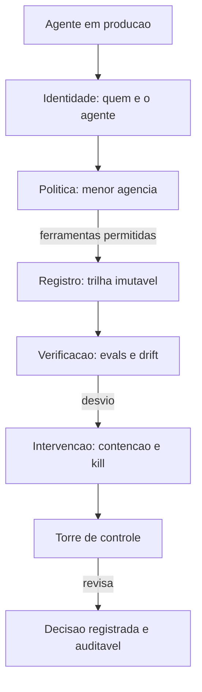

# Capítulo 11: Governança de loops autônomos

## 1. Introdução

Você construiu a via férrea completa — contexto, ferramentas, memória, orquestração, observabilidade, evals, contenção e durabilidade. Agora vamos à camada que governa tudo: a governança de loops autônomos. Você vai aprender o princípio da menor agência (cada agente com apenas as ferramentas e o contexto da própria função), a trilha de auditoria imutável (o registro que responde "por que o agente fez isso?"), a identidade de máquina dedicada (cada agente com credenciais próprias), o model pinning e o monitoramento de drift. Ao final, você vai implementar o registro de governança: a peça que transforma a operação agêntica em algo auditável, atribuível e responsável.

## 2. Explica

### Governança: a resposta à pergunta "quem responde?"

Autonomia levanta uma pergunta que a engenharia tradicional nunca precisou responder com tanta agudeza: quando um agente decide, quem é responsável pela decisão? A governança de agentes é a camada que responde a essa pergunta na prática: **atribuição** (saber qual agente fez o quê), **autorização** (saber o que cada agente *pode* fazer), **verificação** (saber se o que foi feito está de acordo) e **correção** (saber como intervir quando não está) [1]. A discussão jurídica e regulatória — incluindo o EU AI Act — deixa claro que as empresas não podem usar a autonomia do algoritmo como defesa: "o agente fez" não exonera a organização [2]. A governança existe para que a organização *possa* responder.

A estrutura de governança que a indústria está convergindo tem cinco camadas: **identidade** (quem é o agente), **política** (o que ele pode fazer), **registro** (o que ele fez), **verificação** (se está conforme) e **intervenção** (como corrigir) [1]. As camadas se apoiam nas peças que você já construiu: a política usa a allow-list do Capítulo 4, o registro usa o trace do Capítulo 7 e o journal do Capítulo 10, a verificação usa os evals do Capítulo 8, e a intervenção usa a contenção do Capítulo 9.

### O princípio da menor agência

A base de toda política de agentes é o **princípio da menor agência** (*least agency*): cada agente recebe apenas as ferramentas, permissões e contexto estritamente necessários à sua função — nada mais [3]. O paralelo com o princípio do menor privilégio da segurança clássica é direto, mas a agência vai além de credenciais: um agente de pesquisa não deve ter *nenhuma* ferramenta de escrita — nem que a credencial o permita, porque a ferramenta existe na sua interface e a interface é a superfície de decisão [3].

A menor agência é a defesa contra o abuso de privilégio semântico: o agente que "tinha acesso" a uma ferramenta e a usou fora do escopo. Se a ferramenta não está no catálogo do agente, o uso é mecanicamente impossível — a mesma lógica da cabine do Capítulo 4, agora elevada a princípio de governança. A OWASP, na sua taxonomia, classifica o abuso de identidade e privilégio entre os riscos mais críticos de aplicações agênticas — e a menor agência é a mitigação estrutural [4].

### A trilha de auditoria imutável

O segundo pilar é a **trilha de auditoria**: o registro completo e imutável de cada decisão do agente — o que percebeu, o que decidiu, qual ferramenta chamou, com quais argumentos, qual resultado obteve [5]. A trilha difere do trace do Capítulo 7 em propósito: o trace serve à operação (encontrar e corrigir problemas); a trilha serve à responsabilidade (provar o que aconteceu, para auditoria, conformidade e investigação).

A propriedade central da trilha é a **imutabilidade**: uma vez registrada, uma decisão não é editável nem apagável — nem pelo agente, nem pelo operador. É a mesma disciplina do journal do Capítulo 10, estendida a *todas* as decisões, não apenas aos efeitos destrutivos. A integridade da trilha pode ser reforçada com assinatura (hash encadeado) — cada entrada referencia a anterior, formando uma corrente em que qualquer alteração é detectável [5].

### Identidade de máquina dedicada

O terceiro pilar é a **identidade**: cada agente tem credenciais, chaves de API e fluxos de log próprios — nunca compartilhados [3]. A identidade dedicada tem duas funções. A primeira é a **atribuição precisa**: se dois agentes compartilham a mesma chave de API, o log não diz *qual* deles fez o quê — e a auditoria morre. A segunda é a **contenção de vazamento**: se as credenciais de um agente vazam, o estrago fica limitado ao escopo daquele agente — o agente de pesquisa comprometido não dá acesso à escrita [3].

A prática da Microsoft na sua estrutura de governança baseada no NIST AI RMF reforça exatamente isso: pacotes de runtime (Agent OS, Agent Runtime, Agent SRE) que impõem limites de execução e controle de identidade em produção — cada agente com identidade, escopo e trilha próprios [1].

### Model pinning e monitoramento de drift

O quarto pilar trata da estabilidade do comportamento ao longo do tempo. **Model pinning** é a prática de fixar tarefas críticas a versões específicas de modelos — mudanças de modelo exigem homologação, não acontecem automaticamente quando o provedor atualiza [6]. O pinning protege contra a mudança silenciosa: um provedor que atualiza o modelo de trás para frente pode alterar o comportamento do agente sem que ninguém decida nada — e o drift aparece nas métricas semanas depois [6].

O **monitoramento de drift** é a detecção operacional dessa mudança: comparar métricas de execução em janelas deslizantes — tempo médio, taxa de sucesso de ferramentas, distribuição de passos — e alertar quando o comportamento desvia da linha de base [6]. O monitor do Capítulo 7 é a base técnica; aqui ele ganha a dimensão de governança: o drift não é apenas um problema operacional, é uma mudança de comportamento não autorizada — e a organização precisa saber quando acontece.

## 3. Ilustra

### A torre de controle da ferrovia

Voltemos à ferrovia, agora à torre de controle central — a sala com os monitores que veem todos os trens, todas as linhas, todos os sinais. O controlador-chefe não dirige nenhum trem; ele governa a malha: sabe qual maquinista está em qual trecho (identidade), sabe qual trecho cada maquinista tem autorização para percorrer (política), registra cada movimento na bitola (auditoria) e pode parar qualquer trem a qualquer momento (intervenção). Cada maquinista tem crachá próprio — nenhum empresta o crachá do outro, porque o controle precisa saber *quem* fez cada coisa.



Como Engenheiro de Plataforma, você reconhece a diferença entre a ferrovia com torre de controle e a ferrovia sem ela: sem torre, cada trem é uma aposta — ninguém sabe quem está onde, quem fez o quê, e a primeira pergunta de um incidente ("quem autorizou isso?") não tem resposta. A governança é a torre: a camada que torna a malha inteira *legível* — e portanto responsável.

### A dupla camada: governança não é burocracia — é a condição da escala

O ponto contraintuitivo que merece uma segunda analogia: **a torre de controle não atrasa os trens — ela permite que muitos trens rodem ao mesmo tempo**. Uma ferrovia com um único trem não precisa de torre: o maquinista grita, todo mundo ouve. Mas dez trens, em dez linhas, com manutenção, desvios e emergências — sem torre, é o caos: colisões, trechos duplicados, ninguém sabendo quem tem prioridade.

O mesmo vale para agentes: um agente em produção pode sobreviver sem governança (o time inteiro conhece aquele agente). Cem agentes, de seis times, com ferramentas, custos e riscos diferentes — sem governança, é o caos operacional: quem alterou qual agente? Qual agente tem acesso a quê? Qual decisão gerou aquele efeito? A governança é o que torna a escala possível — a torre é o preço da malha, e o preço paga a própria malha.

## 4. Técnica

### Implementando o registro de governança

A técnica central deste capítulo é o registro de governança: a peça que materializa as cinco camadas — identidade, política, trilha imutável, verificação e intervenção — com integridade verificável. A implementação abaixo é o núcleo dessa peça:

```python
"""Registro de governanca de agentes: identidade, politica e trilha imutavel.

A trilha e um hash encadeado: cada entrada referencia o hash da anterior,
tornando qualquer alteracao detectavel.
"""
import hashlib
import json
from dataclasses import dataclass, field
from typing import Dict, List, Optional


@dataclass
class Agente:
    """Identidade de maquina dedicada de um agente."""
    nome: str
    escopos: List[str] = field(default_factory=list)
    credencial: str = ""


@dataclass
class EntradaTrilha:
    """Uma decisao registrada com integridade (hash encadeado)."""
    sequencia: int
    agente: str
    decisao: str
    detalhes: Dict[str, object] = field(default_factory=dict)
    hash_anterior: str = ""
    hash_proprio: str = ""


class RegistroGovernanca:
    """Trilha imutavel com identidade e politica."""

    def __init__(self) -> None:
        self.agentes: Dict[str, Agente] = {}
        self.trilha: List[EntradaTrilha] = []
        self._anterior = ""

    def registrar_agente(self, agente: Agente) -> None:
        self.agentes[agente.nome] = agente

    def _calcular_hash(
        self, sequencia: int, agente: str, decisao: str,
        detalhes: Dict[str, object], anterior: str,
    ) -> str:
        material = json.dumps(
            [sequencia, agente, decisao, detalhes, anterior],
            ensure_ascii=False,
            sort_keys=True,
        )
        return hashlib.sha256(material.encode("utf-8")).hexdigest()

    def registrar_decisao(
        self, agente: str, decisao: str, detalhes: Optional[Dict[str, object]] = None
    ) -> bool:
        """Registra uma decisao na trilha, rejeitando agentes desconhecidos."""
        if agente not in self.agentes:
            return False
        sequencia = len(self.trilha) + 1
        entrada = EntradaTrilha(
            sequencia=sequencia,
            agente=agente,
            decisao=decisao,
            detalhes=detalhes or {},
            hash_anterior=self._anterior,
        )
        entrada.hash_proprio = self._calcular_hash(
            sequencia, agente, decisao, entrada.detalhes, self._anterior
        )
        self.trilha.append(entrada)
        self._anterior = entrada.hash_proprio
        return True

    def verificar_integridade(self) -> bool:
        """Recompoe a corrente de hashes e verifica que nada foi alterado."""
        anterior = ""
        for entrada in self.trilha:
            esperado = self._calcular_hash(
                entrada.sequencia,
                entrada.agente,
                entrada.decisao,
                entrada.detalhes,
                anterior,
            )
            if esperado != entrada.hash_proprio:
                return False
            if entrada.hash_anterior != anterior:
                return False
            anterior = entrada.hash_proprio
        return True

    def historico_do_agente(self, nome: str) -> List[EntradaTrilha]:
        """Retorna as decisoes de um agente especifico (atribuicao)."""
        return [e for e in self.trilha if e.agente == nome]


def exemplo_uso() -> None:
    """Demo: trilha imutavel com hash encadeado e verificacao."""
    registro = RegistroGovernanca()
    registro.registrar_agente(Agente("pesquisador", ["leitura"], "cred-pesq"))
    registro.registrar_agente(Agente("relatorios", ["escrita_staging"], "cred-rel"))
    registro.registrar_decisao("pesquisador", "buscar_base", {"termo": "churn"})
    registro.registrar_decisao("relatorios", "gerar_relatorio", {"periodo": "julho"})
    print("integridade ok:", registro.verificar_integridade())
    print("decisoes do pesquisador:", len(registro.historico_do_agente("pesquisador")))


if __name__ == "__main__":
    exemplo_uso()
```

O registro entrega as quatro propriedades de governança: **identidade** (agentes registrados com escopo e credencial própria), **atribuição** (o histórico por agente responde "quem fez o quê"), **imutabilidade** (a trilha só cresce) e **integridade verificável** (o hash encadeado detecta qualquer alteração — a corrente que torna a auditoria possível) [5].

### O avaliador de menor agência

O segundo componente é a verificação da política: o avaliador que audita o catálogo de ferramentas de cada agente contra o princípio da menor agência [3]:

```python
"""Avaliador de menor agencia: audita escopos de ferramentas por agente."""
from dataclasses import dataclass
from typing import Dict, List, Protocol


@dataclass
class FerramentaCatalogo:
    """Ferramenta com escopo declarado."""
    nome: str
    escopos: List[str]


@dataclass
class PerfilAgente:
    """Perfil declarado de um agente."""
    nome: str
    funcao: str
    escopos_necessarios: List[str]


class AvaliadorMenorAgencia:
    """Verifica se cada agente tem apenas o escopo da propria funcao."""

    def __init__(
        self,
        perfis: List[PerfilAgente],
        catalogo: Dict[str, FerramentaCatalogo],
    ) -> None:
        self.perfis = perfis
        self.catalogo = catalogo

    def auditar(self) -> Dict[str, List[str]]:
        """Retorna, por agente, os escopos em excesso encontrados."""
        violacoes: Dict[str, List[str]] = {}
        for perfil in self.perfis:
            permitidas = set(perfil.escopos_necessarios)
            excessos: List[str] = []
            for ferramenta in self.catalogo.values():
                for escopo in ferramenta.escopos:
                    if escopo not in permitidas:
                        excessos.append(f"{ferramenta.nome}:{escopo}")
            if excessos:
                violacoes[perfil.nome] = sorted(excessos)
        return violacoes


def exemplo_auditoria() -> None:
    """Demo: agente de pesquisa com escopo de escrita em excesso."""
    perfis = [
        PerfilAgente("pesquisador", "leitura e busca", ["leitura", "busca"]),
        PerfilAgente("relatorios", "escrita de relatorios", ["escrita_staging"]),
    ]
    catalogo = {
        "arquivo.ler": FerramentaCatalogo("arquivo.ler", ["leitura"]),
        "arquivo.escrever": FerramentaCatalogo("arquivo.escrever", ["escrita_staging"]),
    }
    avaliador = AvaliadorMenorAgencia(perfis, catalogo)
    print("violacoes:", avaliador.auditar())


if __name__ == "__main__":
    exemplo_auditoria()
```

O avaliador é o gate de CI da governança: roda a cada mudança de perfil ou catálogo e aponta excessos — a menor agência vira um requisito verificável, não uma intenção [3].

### O monitor de drift com pinning

O terceiro componente fecha a trinca: o monitor de drift que combina model pinning com detecção de desvio de comportamento [6]:

```python
"""Monitor de drift com model pinning: detecta mudanca de comportamento."""
from dataclasses import dataclass, field
from statistics import mean
from typing import Dict, List


@dataclass
class Amostra:
    """Amostra de comportamento de um agente em uma janela."""
    versao_modelo: str
    taxa_sucesso: float
    tempo_medio_s: float


@dataclass
class Pinning:
    """Fixacao de modelo homologado para uma tarefa."""
    tarefa: str
    versao_homologada: str


class MonitorDeDrift:
    """Alerta quando o comportamento desvia da linha de base homologada."""

    def __init__(self) -> None:
        self.pinnings: Dict[str, Pinning] = {}
        self.amostras: List[Amostra] = []

    def fixar(self, tarefa: str, versao: str) -> None:
        self.pinnings[tarefa] = Pinning(tarefa, versao)

    def registrar(self, amostra: Amostra) -> None:
        self.amostras.append(amostra)

    def alertas(self) -> List[str]:
        """Retorna alertas de desvio ou de versao fora do pinning."""
        resultado: List[str] = []
        if len(self.amostras) < 5:
            return resultado
        base = self.amostras[:-3]
        recentes = self.amostras[-3:]
        media_base = mean(a.taxa_sucesso for a in base)
        media_recente = mean(a.taxa_sucesso for a in recentes)
        if media_recente < media_base - 0.05:
            resultado.append(
                f"drift: taxa de sucesso caiu de {media_base:.2f} para {media_recente:.2f}"
            )
        for tarefa, pinning in self.pinnings.items():
            for amostra in self.amostras[-1:]:
                if amostra.versao_modelo != pinning.versao_homologada:
                    resultado.append(
                        f"{tarefa}: versao {amostra.versao_modelo} != homologada "
                        f"{pinning.versao_homologada}"
                    )
        return resultado
```

O monitor transforma o drift em governança: a mudança de comportamento — seja por modelo novo, prompt alterado ou ferramenta trocada — gera alerta com a causa provável (versão fora do pinning ou métrica em queda). A mudança silenciosa deixa de ser silenciosa [6].

## 5. Aplica

### Cena de contraste: a auditoria que não tinha resposta

O time de conformidade recebe uma solicitação: o regulador quer saber por que o agente de precificação alterou os preços de 200 produtos na terça-feira passada, e quem autorizou. Você abre o sistema: o agente usa uma credencial compartilhada do time (o log não diz *qual* agente — todos usam a mesma chave), não há registro das decisões de precificação (o trace guarda os últimos 7 dias, e terça passada já saiu da janela), e a versão do modelo mudou silenciosamente na semana anterior (o provedor atualizou, e ninguém homologou nada). A resposta ao regulador: "não sabemos".

O erro que você cometeria seguindo o instinto: "o problema é a retenção de logs — vamos aumentar para 90 dias". O diagnóstico deste capítulo: a retenção é um detalhe; o problema é a ausência de governança — sem identidade dedicada não há atribuição, sem trilha imutável não há história, sem pinning não há estabilidade [1].

A correção tem três movimentos. Primeiro, **implemente o registro de governança**: cada agente com identidade própria e trilha imutável com hash encadeado — toda decisão de precificação registrada com quem, quando, por quê [5]. Segundo, **imponha a menor agência**: o agente de precificação tem escopo "escrita_precos" e mais nada — e o avaliador roda no CI a cada mudança [3]. Terceiro, **fixe e monitore**: o modelo do agente de precificação é pinado na versão homologada, e o monitor de drift alerta qualquer desvio — a mudança silenciosa da semana passada vira um alerta na próxima hora [6]. Na auditoria seguinte, a resposta ao regulador tem data, hash e assinatura — "sabemos exatamente, aqui está a trilha".

### A política de governança: quem decide o que cada agente pode

A governança não é só instrumentação — é **decisão sobre autoridade**, e a política é o artefato que a documenta [7]. A política de um agente responde a três perguntas: o que ele pode fazer (ferramentas e escopos), o que ele não pode fazer (as fronteiras explícitas) e o que exige aprovação humana (os checkpoints de alto risco) [1]. O artefato é o perfil do agente — a declaração de autoridade que o avaliador de menor agência verifica e a trilha registra.

A prática recomendada é tratar a política como código versionado: cada perfil de agente vive em um arquivo revisável, muda por pull request, e a mudança passa pelo gate — o avaliador de menor agência no CI e os evals de regressão do Capítulo 8 [7]. Uma política que muda por conversa de corredor é uma política que ninguém conhece; uma política que muda por PR é uma política com história, revisão e responsável. A conexão com o drift é direta: se a política muda, o comportamento esperado muda — e o monitor de drift compara o real com o novo esperado, não com o antigo [6].

### O caso de fronteira: governança de agentes com acesso a outros agentes

Há um cenário que tensiona a identidade dedicada: os agentes que acionam outros agentes [20]. Quando o supervisor do Capítulo 6 delega a workers, a trilha precisa registrar a cadeia — quem delegou, para quem, com qual autorização — não apenas o worker que executou. A prática recomendada é a **propagação de contexto de autorização**: cada ação do worker registra o agente executor *e* o agente que o invocou, formando a cadeia de responsabilidade [20].

Essa disciplina responde à pergunta mais incômoda da auditoria: "quem é responsável pela ação do worker?" A resposta correta não é "o worker" — é a cadeia: o supervisor delegou dentro da sua autorização, o worker executou dentro da sua política, e a trilha registra os dois. A mesma lógica se aplica às credenciais: o worker herda o escopo do supervisor, mas limitado pelo escopo próprio — a interseção dos dois, nunca a união [3]. É a menor agência aplicada à cadeia de delegação, e é o que torna a governança de sistemas multi-agente possível [20].

### Armadilhas comuns

- **Credencial compartilhada**: sem identidade dedicada, a atribuição morre — o log diz "o time", não "o agente" [3].
- **Trilha editável**: registro que permite edição não é auditoria — é anotação. O hash encadeado é o que torna a trilha prova [5].
- **Escopo por intenção**: "o agente não vai usar isso" sem validação mecânica é fé — o avaliador de menor agência torna a intenção verificável.
- **Modelo flutuante**: sem pinning, o provedor muda o comportamento do agente sem nenhuma decisão — o drift precisa ser detectado e homologado [6].

### O caderno de decisões do capítulo

Três decisões deste capítulo definem a governança como condição da escala [8]. Primeira: **a governança é o preço da malha** — um agente sobrevive sem torre de controle; cem agentes, não; e a pergunta "quem autorizou isso?" precisa de resposta em minutos, não em investigação de dias [1]. Segunda: **a menor agência é mecânica, não intenção** — cada agente com identidade, catálogo e escopo próprios, verificados por avaliador no CI e registrados na trilha; o que não está no perfil não pode acontecer [3]. Terceira: **a política é código** — perfis versionados, mudanças por pull request, drift monitorado por janelas e model pinning para mudanças silenciosas [6].

A aplicação imediata é o teste de atribuição: escolher uma decisão real do agente mais crítico e tentar responder, com o que existe hoje, "quem fez, quando, por quê, com qual autorização". O teste costuma revelar três lacunas clássicas — credencial compartilhada, trilha ausente, modelo flutuante — e cada lacuna é um item de backlog da governança [7].

### Métricas de sucesso

Três métricas medem a governança: **tempo para responder "quem fez o quê"** (de dias de investigação para minutos de consulta à trilha), **cobertura de trilha** (percentual de decisões registradas com integridade verificável) e **tempo entre drift e alerta** (de semanas para horas com o monitor) [1] — com a política como código garantindo que a autoridade tenha história e responsável [7].

## 6. Conclusão

Você aprendeu que a governança é a camada que torna a autonomia responsável — com o princípio da menor agência, a trilha de auditoria imutável com hash encadeado, a identidade de máquina dedicada, o model pinning e o monitoramento de drift. Você implementou o registro de governança com integridade verificável, o avaliador de menor agência para gate de CI e o monitor de drift com pinning. O desafio: responda hoje, com o que você tem, "quem fez o quê, quando e por quê" no seu agente mais crítico — depois me diga quantas respostas você conseguiu dar sem investigar por horas. No Capítulo 12, vamos fechar a obra com o harness como produto: a segurança contra prompt injection, a separação cognitivo-executiva e a visão da via férrea completa para a era dos agentes.

## 7. Referências Bibliográficas

[1] MICROSOFT. *Architecting trust: a NIST-based security governance framework for AI agents*. Disponível em: https://techcommunity.microsoft.com/blog/microsoftdefendercloudblog/architecting-trust-a-nist-based-security-governance-framework-for-ai-agents/4490556. Acesso em: 06 ago. 2026.
[2] HANCOCK, Parker. *When AI agents misbehave: governance and security for autonomous AI*. Disponível em: https://ourtake.bakerbotts.com/post/102me2l/when-ai-agents-misbehave-governance-and-security-for-autonomous-ai. Acesso em: 06 ago. 2026.
[3] MICROSOFT. *Architecting trust: least agency and identity control*. Disponível em: https://techcommunity.microsoft.com/blog/microsoftdefendercloudblog/architecting-trust-a-nist-based-security-governance-framework-for-ai-agents/4490556. Acesso em: 06 ago. 2026.
[4] OWASP FOUNDATION. *OWASP Top 10 for agentic applications*. Disponível em: https://genai.owasp.org/resource/owasp-top-10-for-agentic-applications-for-2026/. Acesso em: 06 ago. 2026.
[5] FOUNTAIN CITY. *AI agent governance: immutable audit trails*. Disponível em: https://fountaincity.tech/resources/blog/ai-agent-governance-practitioners-guide/. Acesso em: 06 ago. 2026.
[6] FOUNTAIN CITY. *AI agent governance: model pinning and drift monitoring*. Disponível em: https://fountaincity.tech/resources/blog/ai-agent-governance-practitioners-guide/. Acesso em: 06 ago. 2026.
[7] NIST. *AI Risk Management Framework (AI RMF 1.0)*. Disponível em: https://www.nist.gov/itl/ai-risk-management-framework. Acesso em: 06 ago. 2026.
[8] ANTHROPIC. *Building effective agents*. Disponível em: https://www.anthropic.com/engineering/building-effective-agents. Acesso em: 06 ago. 2026.
[9] ANTHROPIC. *Demystifying evals for AI agents*. Disponível em: https://www.anthropic.com/engineering/demystifying-evals-for-ai-agents. Acesso em: 06 ago. 2026.
[10] ZYLOS RESEARCH. *Durable execution for AI agent runtimes: checkpointing, replay, and recovery*. Disponível em: https://zylos.ai/research/2026-04-24-durable-execution-agent-runtimes/. Acesso em: 06 ago. 2026.
[11] TEMPORAL TECHNOLOGIES. *Durable multi-agentic AI architecture with Temporal*. Disponível em: https://temporal.io/blog/using-multi-agent-architectures-with-temporal. Acesso em: 06 ago. 2026.
[12] ORACLE AI & DATA SCIENCE. *Runtime budget guardrails for agentic AI*. Disponível em: https://blogs.oracle.com/ai-and-datascience/runtime-budget-guardrails-agentic-ai. Acesso em: 06 ago. 2026.
[13] EXPANSO. *AI agent observability: best practices in 2026*. Disponível em: https://expanso.io/blog/ai-agent-observability-best-practices/. Acesso em: 06 ago. 2026.
[14] NEWTON-KING, James. *Inside the LLM call: GenAI observability with OpenTelemetry*. Disponível em: https://opentelemetry.io/blog/2026/genai-observability/. Acesso em: 06 ago. 2026.
[15] RUNKLE, Sydney. *Choosing the right multi-agent architecture*. Disponível em: https://www.langchain.com/blog/choosing-the-right-multi-agent-architecture. Acesso em: 06 ago. 2026.
[16] FOKOU, Joel. *Parallax: why AI agents that think must never act*. Disponível em: https://arxiv.org/abs/2604.12986. Acesso em: 06 ago. 2026.
[17] ANTHROPIC. *Effective context engineering for AI agents*. Disponível em: https://www.anthropic.com/engineering/effective-context-engineering-for-ai-agents. Acesso em: 06 ago. 2026.
[18] ANTHROPIC. *Writing effective tools for agents*. Disponível em: https://www.anthropic.com/engineering/writing-tools-for-agents. Acesso em: 06 ago. 2026.
[19] OPENAI. *OpenAI Agents SDK: governance and policies*. Disponível em: https://openai.github.io/openai-agents-python/. Acesso em: 06 ago. 2026.
[20] DANTRA, Ruskin et al. *Orchestrating intelligent agents at scale: how AgentCore and Temporal create robust AI systems*. Disponível em: https://aws.amazon.com/blogs/apn/how-temporal-uses-amazon-bedrock-agentcore-to-create-robust-ai-systems/. Acesso em: 06 ago. 2026.
