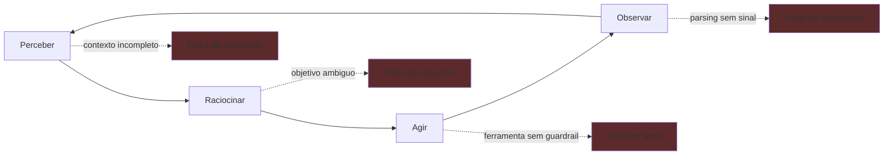

# Capítulo 2: Anatomia do loop — perceber, raciocinar, agir, observar

## 1. Introdução

No Capítulo 1, você aprendeu a diagnosticar os quatro modos de descarrilamento e implementou o harness mínimo — a primeira estação da via férrea. Agora vamos abrir a locomotiva e examinar cada peça do ciclo que a move. Você vai aprender a anatomia completa do loop autônomo — perceber, raciocinar, agir, observar — e os dois dialetos mais influentes dessa anatomia: o ReAct, que alterna raciocínio e ação, e o DAPER, que organiza agentes proativos em detectar, analisar, planejar, executar e reportar. Ao final, você saberá identificar, em qualquer implementação, em qual estágio do ciclo o descarrilamento nasce — e por que o harness precisa de um ponto de controle em cada um deles.

## 2. Explica

### O ciclo fundamental: perceber, raciocinar, agir, observar

Todo agente autônomo, por mais sofisticado que seja, executa uma variação do mesmo ciclo de quatro estágios. O primeiro estágio é **perceber**: o agente coleta informação sobre o estado do mundo — a consulta do usuário, o resultado de uma busca, o conteúdo de um arquivo, o status de um serviço. O segundo é **raciocinar**: o modelo processa essa informação, combina com o objetivo e decide qual ação tomar. O terceiro é **agir**: o agente invoca uma ferramenta, que produz um efeito no mundo real — escreve um arquivo, chama uma API, executa um comando. O quarto é **observar**: o agente lê o resultado da ação e volta ao início do ciclo, agora com informação nova [1].

A literatura de engenharia de agentes formaliza esse ciclo de formas diferentes, mas a mecânica é a mesma. O framework ReAct, proposto por Yao e colaboradores em 2022, demonstrou que intercalar raciocínio verbal (Thought) com ações (Action) e observações (Observation) melhora tanto o raciocínio quanto a capacidade de agir, comparado a cadeias de pensamento puras ou a aprendizado por reforço isolado [2]. A intuição é poderosa: quando o modelo escreve seus pensamentos antes de cada ação, ele cria um registro interpretável do seu processo decisório, e quando ele recebe a observação do mundo real, ele pode corrigir o curso — algo impossível em um pipeline estático.

O ponto que quase toda a documentação de frameworks negligencia é que **cada estágio do ciclo é um ponto de falha distinto**. A percepção pode falhar por contexto incompleto — o agente não viu a informação que precisava porque ela ficou fora da janela [3]. O raciocínio pode falhar por alucinação ou por objetivo malformulado — o modelo decide uma ação que parece razoável mas não serve à tarefa [4]. A ação pode falhar por ferramenta mal projetada — o payload é rejeitado, o caminho é relativo demais, o efeito colateral escapa ao escopo [5]. E a observação pode falhar por parsing — o agente recebeu a resposta, mas não consegue extrair dela o sinal de progresso. Em cada um desses quatro pontos, um harness sem controle deixa o agente girando às cegas.

### ReAct: o dialeto que popularizou o ciclo

O padrão ReAct merece atenção especial porque ele é, na prática, o pai de quase todos os loops de agente modernos. A estrutura é um loop iterativo com três tipos de passo: **Thought** (raciocínio sobre o estado atual e o próximo passo), **Action** (seleção e invocação de uma ferramenta) e **Observation** (resultado da ferramenta, realimentando o ciclo) [2]. O que torna o ReAct robusto é a intercalação: o raciocínio não acontece em um bloco único antes da ação, e sim entre ações, permitindo que cada observação refine o raciocínio seguinte.

A consequência prática para o harness é que o transcript de um agente ReAct tem uma estrutura previsível: uma sequência de tripletas (Thought, Action, Observation) que pode ser auditada passo a passo [6]. Essa previsibilidade é ouro para engenharia: é ela que permite ao detector do Capítulo 1 reconhecer repetição, ao observador do Capítulo 7 rastrear o loop, e aos evals do Capítulo 8 julgar o comportamento. Um harness bem construído não precisa entender a tarefa para auditar o loop — ele precisa apenas conhecer a estrutura do transcript.

### DAPER: o dialeto dos agentes proativos

Se o ReAct descreve agentes reativos — que respondem a uma solicitação — o DAPER descreve agentes proativos: sistemas que monitoram o ambiente e agem por conta própria. A sigla expande o ciclo em cinco estágios: **Detect** (identificar uma condição relevante), **Analyze** (interpretar a condição), **Plan** (desenhar um curso de ação), **Execute** (realizar a ação) e **Report** (registrar e comunicar o resultado) [7]. A Temporal, em sua documentação de arquitetura multi-agente durável, popularizou esse padrão para agentes de correção de transações e suporte automatizado, integrando-o a workflows duráveis via Model Context Protocol [8].

A diferença arquitetural mais importante entre ReAct e DAPER é onde o ciclo começa. No ReAct, o gatilho é externo — um usuário pede algo. No DAPER, o gatilho é interno — o agente detecta uma condição no ambiente que ele mesmo monitora. Essa diferença tem implicações profundas para o harness: um agente proativo pode iniciar trabalho a qualquer momento, o que significa que orçamento, contenção e auditoria precisam ser pensados por sessão contínua, não por requisição isolada [7]. Um cron que roda a cada hora e decide por conta própria "melhorar" um relatório é um agente DAPER sem estação de verificação — exatamente o cenário de descarrilamento do Capítulo 1.

### Onde o ciclo perde o controle

Vamos mapear, estágio a estágio, os pontos de falha estruturais do ciclo, porque é essa anatomia que define onde o harness coloca cada peça da via férrea.

**Perceber** falha quando o contexto é incompleto, poluído ou desatualizado. O caso mais comum em produção é o contexto estourado: o agente tem uma janela de atenção limitada, e quando o histórico cresce além dela, a informação relevante fica fora do campo de visão — um fenômeno que a engenharia de contexto chama de *context rot* [3]. O remédio não é aumentar a janela, e sim curar o contexto: compaction, notas estruturadas e progressive disclosure, que você verá no Capítulo 3.

**Raciocinar** falha quando o objetivo é ambíguo ou quando o modelo alucina. Um objetivo malformulado produz ações bem executadas que servem à tarefa errada — o clássico problema de instruções vagas. A defesa é especificar objetivos com critérios de sucesso observáveis, e verificar as decisões do agente contra esses critérios — o terreno dos evals do Capítulo 8 [9].

**Agir** falha quando a ferramenta não oferece as guardrails certas: payloads sem validação de esquema, caminhos relativos, escopos largos demais. A interface agente-computador (ACI) é a disciplina que trata esse estágio, e você a verá no Capítulo 4 [5].

**Observar** falha quando o agente não consegue extrair sinal de progresso da resposta — o erro de parsing que realimenta o loop infinito. A defesa é estruturar observações com formato canônico e sinais de término explícitos, como o "CONCLUIDO" do harness mínimo do Capítulo 1 [10].

### O diagnóstico por camada: prompt, contexto ou harness?

Quando um loop autônomo falha, a primeira pergunta do engenheiro não é "como corrigir" — é "em que camada está a causa raiz". O diagnóstico por camada é a técnica que isola o problema antes de qualquer correção, e o plano de ataque tem três níveis. O primeiro nível é o prompt: a falha está na mensagem — instrução ambígua, exemplos fracos, formato de saída mal definido. Os sinais são típicos: o agente responde fora do formato pedido, inventa campos ou diverge do tom da instrução. O teste é simples — reformule o prompt isoladamente, fora do loop, e verifique se a resposta melhora [4]. O segundo nível é o contexto: a falha está na informação — o agente não tem o dado certo, tem dado demais (e sofre de context rot) ou tem dado contraditório. A engenharia de contexto documentada pela Anthropic mostra que a maioria das falhas atribuídas ao "modelo" é, na verdade, falha de contexto: a resposta errada nasce do ambiente informacional errado, e a curadoria — write, select, compress, isolate — é o que move o acerto de dezenas para a casa dos noventa por cento [3]. O terceiro nível é o harness: a falha está no sistema — o loop de verificação, a seleção de ferramentas, o orçamento de tentativas, o estado persistido entre passos. A durabilidade entra aqui: a Temporal mostra que fluxos agênticos em produção falham por falta de disciplina de sistemas distribuídos — checkpoint, retry e idempotência — e não por fraqueza do modelo [7]. A observabilidade é o instrumento do diagnóstico: a telemetria do loop — cada chamada, cada tool call, cada checkpoint — é o que permite distinguir as três camadas com evidência, em vez de achismo [10][12]. O erro clássico do iniciante é corrigir a camada errada: mudar o prompt quando o problema é de contexto, ou adicionar contexto quando o problema é de harness. O resultado é o sintoma que muda de lugar sem desaparecer. A disciplina resolve com uma regra: nunca altere o prompt antes de descartar contexto e harness com dados [6]. O modelo de ameaças reforça o diagnóstico: a OWASP documenta que a maioria dos vetores de ataque em aplicações agênticas explora exatamente a interface entre as camadas — prompt injection via conteúdo recuperado (contexto), tool poisoning via ferramenta mal descrita (harness) e exfiltração no loop de observação [16]. E o princípio de Parallax — "agentes que pensam não devem agir" — adiciona a dimensão arquitetural: quando o mesmo agente raciocina e executa sem barreira, a fronteira entre as camadas se dissolve e o diagnóstico perde o objeto [17]. O engenheiro que domina o diagnóstico por camada não adivinha: ele instrumenta, isola e só então corrige — e é essa ordem que separa o setup básico do harness em produção [13][20].

## 3. Ilustra

### A cabine do maquinista, aberta para inspeção

Voltemos à locomotiva. Na nossa via férrea, o ciclo do agente é o movimento das rodas: cada volta completa leva o trem um pouco adiante. Perceber é o maquinista olhando pela janela — ele precisa ver o trecho à frente, e se a visão estiver suja ou o trecho for longo demais para enxergar inteiro, ele dirige às cegas. Raciocinar é o maquinista consultando o livro de instruções e decidindo o que fazer com o que viu — e se o livro estiver mal escrito, a decisão será errada mesmo com visão perfeita. Agir é a mão dele abrindo o acelerador ou puxando o freio — a alavanca é a ferramenta, e se a alavanca estiver solta ou com curso errado, o trem faz outra coisa. Observar é ele sentir a resposta do trem — o chacoalhar, a velocidade, o assobio — e comparar com o esperado.



Como Engenheiro de Plataforma, você já percebe que a função do harness é instalar um instrumento em cada estágio: no perceber, a curadoria de contexto; no raciocinar, a verificação de objetivo; no agir, a validação de ferramenta; no observar, o parsing canônico de sinal. Nenhum instrumento sozinho salva o trem — mas todos juntos, formam a cabine que transforma a potência da locomotiva em viagem segura.

### A dupla camada: por que o loop parece saudável quando está doente

Há um ponto contraintuitivo que merece uma segunda analogia, porque ele explica por que tantos harnesses são construídos depois do desastre: **um loop com falha de observação parece saudável**. Se o agente observa mal, ele não percebe que está errando — cada volta do ciclo parece produtiva, porque o maquinista "está fazendo algo". É como um maquinista que acha que está avançando porque o motor ronca, mas as rodas estão no ar, girando livres. O ronco é o custo (tokens queimando), o motor é o modelo, e as rodas no ar são as ações sem efeito real sobre o trilho.

Essa segunda camada explica por que o monitoramento tradicional — latência, disponibilidade, erros — não detecta o descarrilamento: o agente não está com erro, está girando. É o que a observabilidade de agentes chama de *polite failure*: a falha que se veste de sucesso [11]. A única forma de detectá-la é instrumentar o conteúdo do loop, não apenas a saúde da infraestrutura — medir se cada volta do ciclo produz progresso observável em direção ao objetivo.

## 4. Técnica

### Implementando o ciclo como máquina de estado explícita

A técnica central deste capítulo é uma mudança de mentalidade com impacto direto em código: **o loop deve ser uma máquina de estados explícita, não um `while` solto**. Quando o ciclo é um `while True` com lógica embutida, o harness não tem pontos de inserção para contenção, observação e auditoria. Quando ele é uma máquina de estados com estágios nomeados, cada estágio vira um ponto de controle natural.

A implementação abaixo modela o ciclo com um enum de estágios, uma função de transição e instrumentação em cada ponto — exatamente a estrutura que o resto do livro vai enriquecer:

```python
"""O ciclo perceber-raciocinar-agir-observar como maquina de estados.

Cada estagio do ciclo e um estado nomeado com ponto de controle
(observer hook) — a base estrutural do harness.
"""
from dataclasses import dataclass, field
from enum import Enum, auto
from typing import Callable, Dict, List, Optional


class Estagio(Enum):
    """Estagios do ciclo de um agente autonomo."""
    PERCEBER = auto()
    RACIOCINAR = auto()
    AGIR = auto()
    OBSERVAR = auto()
    CONCLUIDO = auto()


@dataclass
class Contexto:
    """Estado acumulado do agente ao longo do ciclo."""
    objetivo: str
    historico: List[Dict[str, str]] = field(default_factory=list)
    ferramentas: Dict[str, Callable[..., str]] = field(default_factory=dict)


# Hooks de observacao: o harness registra um callback por estagio.
Hooks = Dict[Estagio, Callable[[str], None]]


class LoopDeAgente:
    """Maquina de estados do ciclo com instrumentacao em cada estagio."""

    def __init__(self, contexto: Contexto, hooks: Optional[Hooks] = None) -> None:
        self.ctx = contexto
        self.estagio = Estagio.PERCEBER
        self.hooks: Hooks = hooks or {}
        self.passos = 0
        self.observacao_atual = ""

    def _notificar(self, mensagem: str) -> None:
        hook = self.hooks.get(self.estagio)
        if hook:
            hook(mensagem)
        self.ctx.historico.append(
            {"estagio": self.estagio.name, "passo": self.passos, "info": mensagem}
        )

    def perceber(self, percepcao: str) -> None:
        self._notificar(f"percepcao: {percepcao}")
        self.estagio = Estagio.RACIOCINAR

    def raciocinar(self, decisao: str) -> str:
        self._notificar(f"decisao: {decisao}")
        if "concluir" in decisao.lower():
            self.estagio = Estagio.CONCLUIDO
            return decisao
        self.estagio = Estagio.AGIR
        return decisao

    def agir(self, ferramenta: str, *args: object) -> str:
        fn = self.ctx.ferramentas.get(ferramenta)
        if fn is None:
            raise KeyError(f"ferramenta desconhecida: {ferramenta}")
        self._notificar(f"acao: {ferramenta}")
        self.observacao_atual = fn(*args)
        self.estagio = Estagio.OBSERVAR
        return self.observacao_atual

    def observar(self) -> None:
        self._notificar(f"observacao: {self.observacao_atual}")
        self.estagio = Estagio.PERCEBER
        self.passos += 1


def rodar(
    loop: LoopDeAgente,
    percepcao: Callable[[], str],
    raciocinio: Callable[[str], str],
    limite_passos: int = 10,
) -> List[Dict[str, str]]:
    """Roda o ciclo ate CONCLUIDO ou ate o limite de passos."""
    while loop.estagio is not Estagio.CONCLUIDO and loop.passos < limite_passos:
        if loop.estagio is Estagio.PERCEBER:
            loop.perceber(percepcao())
        elif loop.estagio is Estagio.RACIOCINAR:
            loop.raciocinar(raciocinio(loop.ctx.historico[-1]["info"]))
        elif loop.estagio is Estagio.AGIR:
            break  # acao executada externamente por quem invoca o loop
        else:
            loop.observar()
    return list(loop.ctx.historico)


def exemplo_uso() -> None:
    """Demo com hooks de observacao imprimindo cada estagio."""
    hooks: Hooks = {
        Estagio.PERCEBER: lambda m: print(f"[perceber] {m}"),
        Estagio.RACIOCINAR: lambda m: print(f"[raciocinar] {m}"),
        Estagio.OBSERVAR: lambda m: print(f"[observar] {m}"),
    }
    ctx = Contexto(objetivo="resumo de vendas")
    loop = LoopDeAgente(ctx, hooks)
    historico = rodar(
        loop,
        percepcao=lambda: "dados de vendas: 1200 unidades",
        raciocinio=lambda info: "concluir: resumo pronto" if "1200" in info else "buscar_mais",
        limite_passos=5,
    )
    print(f"passos executados: {len(historico)}")


if __name__ == "__main__":
    exemplo_uso()
```

A estrutura acima já entrega duas propriedades que o harness do Capítulo 1 não tinha: **estágios nomeados auditáveis** (o transcript registra em qual estágio cada evento ocorreu) e **hooks de observação** (o harness pode injetar telemetria, contenção e validação em qualquer estágio sem tocar na lógica do agente). Essa é a base que os Capítulos 3 a 6 vão preencher com as peças específicas.

### Transcrevendo um transcript ReAct em JSON canônico

O segundo componente técnico é o formato canônico de transcript. Como vimos, o ReAct produz tripletas (Thought, Action, Observation) — e o harness precisa serializar isso em um formato estável para auditoria e evals. O schema abaixo é o contrato mínimo que o resto da obra assume:

```json
{
  "versao": "1.0",
  "objetivo": "resumo de vendas",
  "inicio": "2026-08-06T09:00:00Z",
  "passos": [
    {
      "ordem": 1,
      "tipo": "Thought",
      "conteudo": "Preciso buscar os dados de vendas antes de resumir."
    },
    {
      "ordem": 2,
      "tipo": "Action",
      "ferramenta": "buscar_dados",
      "payload": {"fonte": "vendas_mensal", "periodo": "2026-07"}
    },
    {
      "ordem": 3,
      "tipo": "Observation",
      "conteudo": "1200 unidades vendidas em julho.",
      "sucesso": true
    }
  ],
  "fim": "2026-08-06T09:00:12Z",
  "status": "CONCLUIDO"
}
```

Esse formato canônico é o que permite ao observador do Capítulo 7, aos evals do Capítulo 8 e à auditoria do Capítulo 11 processar o loop sem depender da implementação específica do agente — a bitola padronizada da nossa via férrea, que garante que qualquer locomotiva possa rodar em qualquer trecho.

### O parser de observação: extraindo sinal de progresso

O terceiro componente fecha a anatomia: a função que extrai o sinal de progresso de uma observação. Ela é a resposta técnica ao ponto de falha "observar" — transformar a resposta bruta de uma ferramenta em um veredito estruturado que o loop possa usar para decidir continuar ou parar:

```python
"""Extracao de sinal de progresso de observacoes de ferramentas."""
import json
import re
from dataclasses import dataclass
from typing import Any, Dict, Optional


@dataclass
class Sinal:
    """Veredito estruturado extraido de uma observacao."""
    avancou: bool
    terminou: bool
    motivo: str
    dados: Optional[Dict[str, Any]] = None


PADRAO_CONCLUSAO = re.compile(r"\b(conclu[ií]do|finalizado|sucesso)\b", re.IGNORECASE)
PADRAO_ERRO = re.compile(r"\b(erro|falha|inv[aá]lido|rejeitado)\b", re.IGNORECASE)


def extrair_sinal(observacao: str) -> Sinal:
    """Classifica a observacao como progresso, conclusao ou erro.

    Prioridade: marcador JSON explicito > padroes de texto > default.
    """
    if observacao.strip().startswith("{"):
        try:
            payload = json.loads(observacao)
            if isinstance(payload, dict):
                terminou = bool(payload.get("concluido"))
                avancou = terminou or bool(payload.get("dados"))
                return Sinal(
                    avancou=avancou,
                    terminou=terminou,
                    motivo="marcador json",
                    dados=payload,
                )
        except json.JSONDecodeError:
            pass

    if PADRAO_CONCLUSAO.search(observacao):
        return Sinal(avancou=True, terminou=True, motivo="texto de conclusao")
    if PADRAO_ERRO.search(observacao):
        return Sinal(avancou=False, terminou=False, motivo="texto de erro")

    tem_dados = len(observacao.strip()) > 10
    return Sinal(avancou=tem_dados, terminou=False, motivo="heuristica de tamanho")
```

Com o parser de sinal, o harness ganha a resposta ao quarto ponto de falha: mesmo que o agente diga que "continuou trabalhando", o sinal diz se houve progresso real. É essa peça que, combinada com o detector do Capítulo 1, transforma a contenção de loop em algo determinístico.

## 5. Aplica

### Cena de contraste: o agente de suporte que "esqueceu" de ler a resposta

Você está na escala de plantão, e o agente de suporte de primeiro nível começou a responder mal — o NPS de atendimento caiu 18 pontos em uma semana. Você abre o transcript de uma interação e encontra o padrão: o agente percebe a pergunta do cliente, raciocina, age chamando a ferramenta de busca na base de conhecimento, recebe a resposta com o artigo correto... e então raciocina de novo como se a resposta nunca tivesse chegado, chama outra busca, recebe outro artigo, e monta uma resposta final que mistura trechos desconexos.

O erro que você cometeria seguindo o instinto: "o modelo está ficando burro", e você decide trocar o modelo. O diagnóstico da anatomia deste capítulo: a falha está no estágio **observar** — o agente não consegue extrair sinal das observações, então o ciclo gira sem consolidar informação. Cada volta parece produtiva (o transcript está cheio de buscas), mas nenhuma observação vira progresso acumulado. É o maquinista que vê o motor roncar e acha que está andando, com as rodas no ar.

A correção tem quatro movimentos. Primeiro, **verifique a estrutura do transcript**: se o formato canônico JSON não está sendo usado, o agente está lendo observações como texto solto, sem campo de "dados" para acumular. Segundo, **teste o parser de sinal** contra as observações reais: rode `extrair_sinal` nas últimas 100 observações e confira quantas foram classificadas como "avancou" — se a maioria não avançou, o problema é o parser ou o formato da ferramenta [12]. Terceiro, **corrija a ferramenta de busca** para devolver observações com marcador JSON explícito (`concluido`, `dados`), seguindo a ACI que veremos no Capítulo 4. Quarto, **instrumente o estágio de observação** com um hook que registre o sinal extraído — assim o descarrilamento vira um alerta imediato em vez de uma queda de NPS em sete dias [11].

### A mesa de comando: operando o ciclo com os quatro instrumentos

A aplicação do ciclo como máquina de estados ganha uma dimensão operacional quando você monta a mesa de comando — os quatro instrumentos que correspondem aos quatro estágios, cada um alimentando o seguinte [12]. O instrumento da percepção é o gestor de contexto do Capítulo 3: ele responde "o que o agente viu a cada volta?" — e, mais importante, "o que ele não viu porque o contexto foi curado de menos?". O instrumento do raciocínio é o transcript das decisões: a sequência de Thought que responde "por que o agente decidiu isso?" — o material que os evals do Capítulo 8 vão julgar. O instrumento da ação é o registro de ferramentas do Capítulo 4: a resposta a "o que o agente fez, com quais argumentos, e foi autorizado?" O instrumento da observação é o parser de sinal que este capítulo implementou: a resposta a "o agente avançou de verdade, ou girou no ar?"

A integração desses quatro instrumentos é o que separa um harness que apenas executa de um harness que *explica*. Quando um incidente acontece, a primeira pergunta não é "o que deu errado" — é "em qual estágio a cadeia se rompeu?" E a resposta vem da combinação dos instrumentos: o transcript mostra a decisão, o registro mostra a ação, o parser mostra o sinal, e o gestor mostra o contexto [11]. É essa mesa de comando que os capítulos seguintes vão equipar peça por peça — e a estrutura que você implementou neste capítulo é o esqueleto dela.

### O caso de fronteira: loops aninhados e sub-loops

Há um cenário de produção que a máquina de estados simples não cobre sozinha: os loops aninhados. Um supervisor que delega a workers (o padrão que você verá no Capítulo 6) cria sub-loops — cada worker roda seu próprio ciclo perceber-raciocinar-agir dentro da volta do supervisor [18]. A pergunta operacional que isso levanta é de instrumentação: o trace de um único passo do supervisor contém, na verdade, uma árvore de passos dos workers — e a mesa de comando precisa preservar essa hierarquia para responder "onde o custo se acumulou?"

A prática recomendada é registrar o aninhamento explicitamente: cada evento carrega o identificador do loop pai, formando a árvore de execução que o Capítulo 7 vai formalizar com os traces [12]. A lição deste capítulo permanece: a anatomia do ciclo é a mesma em todos os níveis — perceber, raciocinar, agir, observar — e os pontos de falha também. A instrumentação é o que torna a hierarquia visível, e sem ela, o sub-loop que gira no ar é invisível no trace do supervisor.

### Armadilhas comuns

- **Tratar o loop como pipeline**: um pipeline executa estágios uma vez; um loop executa estágios repetidamente. Ferramentas de monitoramento que assumem pipeline não capturam o estado do ciclo.
- **Observação sem formato canônico**: se cada ferramenta devolve texto livre, o parser de sinal não consegue distinguir progresso de ruído. Formato canônico não é burocracia, é a bitola da via.
- **Medir latência, não progresso**: a latência do loop pode estar estável enquanto o progresso é zero — rodas no ar roncam em tempo constante.
- **Ignorar o gatilho proativo**: agentes DAPER começam sozinhos. Um harness projetado para responder requisições não controla agentes que iniciam trabalho por conta própria [7].

### O caderno de decisões do capítulo

As decisões práticas deste capítulo são três, e elas definem a linguagem de instrumentação do harness inteiro [19]. Primeira: **o loop é uma máquina de estados, não um while** — a disciplina de nomear os estágios e registrar transições é o que torna o transcript auditável, o trace estruturado e os evals possíveis; um while solto é uma caixa-preta onde o tempo e o custo se perdem. Segunda: **o formato canônico de transcript é a bitola** — todo agente, de qualquer framework, serializa suas voltas no mesmo schema JSON, e é essa padronização que permite ao observador, ao avaliador e ao auditor processarem qualquer locomotiva sem adaptação [15]. Terceira: **o parser de sinal é o instrumento de progresso** — a distinção entre avanço real e ronco de motor é a resposta mecânica ao polite failure, e ela precisa rodar em tempo real, alimentando a contenção do Capítulo 9, não apenas o relatório pós-morte.

A aplicação imediata dessas decisões é transcrever o agente mais antigo do seu time para a máquina de estados — mesmo sem mudar o comportamento, só a instrumentação. O resultado costuma ser revelador: a distribuição de estágios mostra onde o loop gasta a vida (geralmente em observações sem sinal), e o diagnóstico do Capítulo 1 ganha a precisão que faltava [12]. O custo da transcrição é pequeno; o ganho é a mesa de comando funcionando para o sistema inteiro.

### Métricas de sucesso

Com o ciclo instrumentado, três métricas novas aparecem no dashboard do maquinista: **taxa de progresso por volta** (percentual de observações classificadas como avanço real), **tempo até primeira observação útil** e **distribuição de estágios** (onde o loop passa mais tempo — percepção, raciocínio, ação ou observação). A queda na taxa de progresso é o primeiro alerta de descarrilamento incipiente, muito antes da fatura chegar [13] — e, com a mesa de comando montada, cada queda aponta o estágio exato da ruptura [12].

## 6. Conclusão

Você aprendeu a anatomia do loop autônomo — perceber, raciocinar, agir e observar — e seus dois dialetos mais influentes: o ReAct, que intercala raciocínio e ação em tripletas auditáveis, e o DAPER, que organiza agentes proativos em detectar, analisar, planejar, executar e reportar. Você implementou o ciclo como máquina de estados explícita com hooks de observação, definiu o formato canônico de transcript que toda a obra vai assumir, e construiu o parser de sinal que extrai progresso real de observações. O desafio: transcreva um agente seu em produção para a máquina de estados e rode o parser de sinal nas observações reais — depois me diga quantas voltas do ciclo estavam girando no ar. No Capítulo 3, vamos entrar na primeira peça da via férrea: a janela de contexto como superfície de controle, a disciplina que decide o que o agente vê a cada volta do ciclo.

## 7. Referências Bibliográficas

[1] LANGCHAIN. *LangGraph: conceptual guides — agent architecture*. Disponível em: https://langchain-ai.github.io/langgraph/concepts/agentic_concepts/. Acesso em: 06 ago. 2026.
[2] YAO, Shunyu et al. *ReAct: synergizing reasoning and acting in language models*. Disponível em: https://arxiv.org/abs/2210.03629. Acesso em: 06 ago. 2026.
[3] ANTHROPIC. *Effective context engineering for AI agents*. Disponível em: https://www.anthropic.com/engineering/effective-context-engineering-for-ai-agents. Acesso em: 06 ago. 2026.
[4] ANTHROPIC. *Building effective agents*. Disponível em: https://www.anthropic.com/engineering/building-effective-agents. Acesso em: 06 ago. 2026.
[5] ANTHROPIC. *Writing effective tools for agents*. Disponível em: https://www.anthropic.com/engineering/writing-tools-for-agents. Acesso em: 06 ago. 2026.
[6] ANTHROPIC. *Demystifying evals for AI agents*. Disponível em: https://www.anthropic.com/engineering/demystifying-evals-for-ai-agents. Acesso em: 06 ago. 2026.
[7] TEMPORAL TECHNOLOGIES. *Durable multi-agentic AI architecture with Temporal*. Disponível em: https://temporal.io/blog/using-multi-agent-architectures-with-temporal. Acesso em: 06 ago. 2026.
[8] DANTRA, Ruskin et al. *Orchestrating intelligent agents at scale: how AgentCore and Temporal create robust AI systems*. Disponível em: https://aws.amazon.com/blogs/apn/how-temporal-uses-amazon-bedrock-agentcore-to-create-robust-ai-systems/. Acesso em: 06 ago. 2026.
[9] ANTHROPIC. *Demystifying evals for AI agents: outcome-based grading*. Disponível em: https://www.anthropic.com/engineering/demystifying-evals-for-ai-agents. Acesso em: 06 ago. 2026.
[10] LANGCHAIN. *LangSmith: tracing and evaluation documentation*. Disponível em: https://docs.smith.langchain.com/. Acesso em: 06 ago. 2026.
[11] EXPANSO. *AI agent observability: best practices in 2026*. Disponível em: https://expanso.io/blog/ai-agent-observability-best-practices/. Acesso em: 06 ago. 2026.
[12] NEWTON-KING, James. *Inside the LLM call: GenAI observability with OpenTelemetry*. Disponível em: https://opentelemetry.io/blog/2026/genai-observability/. Acesso em: 06 ago. 2026.
[13] ZYLOS RESEARCH. *Durable execution for AI agent runtimes: checkpointing, replay, and recovery*. Disponível em: https://zylos.ai/research/2026-04-24-durable-execution-agent-runtimes/. Acesso em: 06 ago. 2026.
[14] RUNKLE, Sydney. *Choosing the right multi-agent architecture*. Disponível em: https://www.langchain.com/blog/choosing-the-right-multi-agent-architecture. Acesso em: 06 ago. 2026.
[15] OPENAI. *OpenAI Agents SDK: documentation and guides*. Disponível em: https://openai.github.io/openai-agents-python/. Acesso em: 06 ago. 2026.
[16] OWASP FOUNDATION. *OWASP Top 10 for agentic applications*. Disponível em: https://genai.owasp.org/resource/owasp-top-10-for-agentic-applications-for-2026/. Acesso em: 06 ago. 2026.
[17] FOKOU, Joel. *Parallax: why AI agents that think must never act*. Disponível em: https://arxiv.org/abs/2604.12986. Acesso em: 06 ago. 2026.
[18] DIGITAL APPLIED. *Multi-agent orchestration: 5 patterns that work in 2026*. Disponível em: https://www.digitalapplied.com/blog/multi-agent-orchestration-5-patterns-that-work. Acesso em: 06 ago. 2026.
[19] ANTHROPIC. *Model Context Protocol: specification and documentation*. Disponível em: https://modelcontextprotocol.io/. Acesso em: 06 ago. 2026.
[20] SHEN, Alfred; DERBAKOVA, Anya. *Design multi-agent orchestration with reasoning using Amazon Bedrock and open source frameworks*. Disponível em: https://aws.amazon.com/blogs/machine-learning/design-multi-agent-orchestration-with-reasoning-using-amazon-bedrock-and-open-source-frameworks/. Acesso em: 06 ago. 2026.
