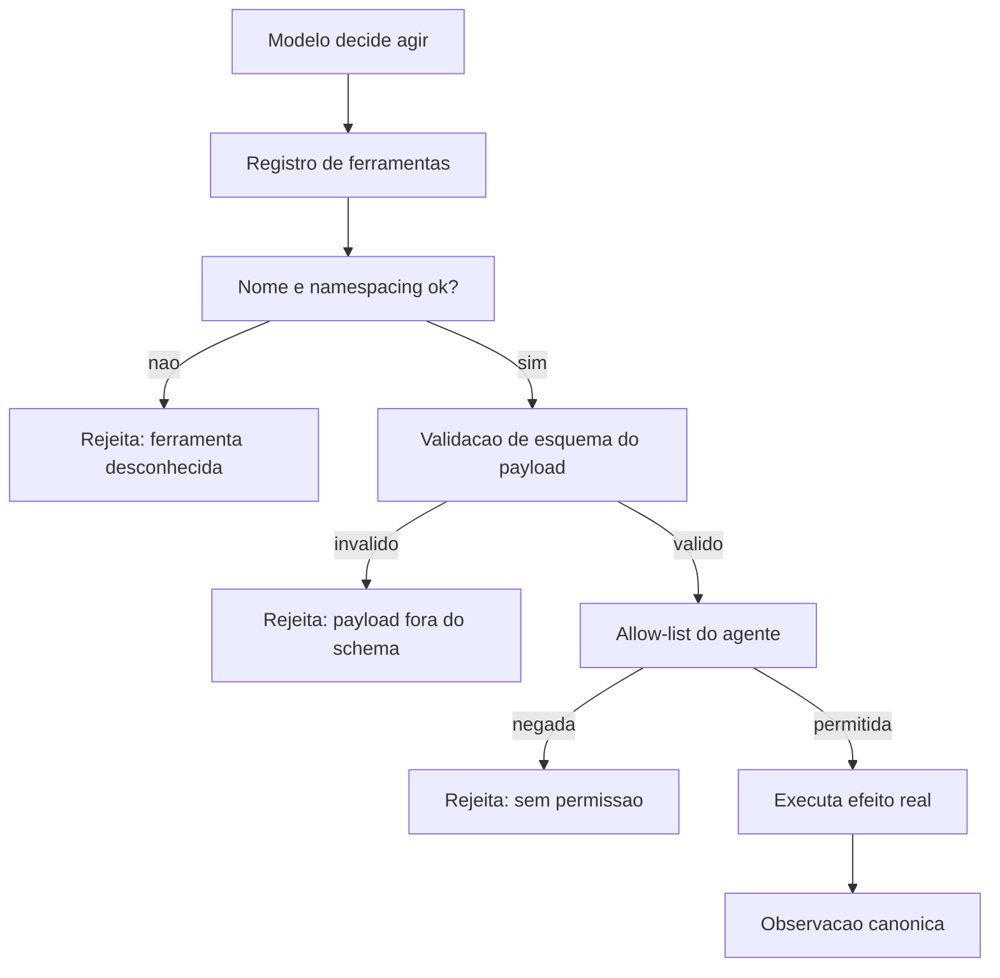

# Capítulo 4: Ferramentas como superfícies de ação — a ACI

## 1. Introdução

No Capítulo 3, você dominou a janela de contexto — o que o agente vê. Agora vamos ao outro lado da cabine: as ferramentas — o que o agente faz. Você vai aprender que projetar ferramentas para agentes é uma disciplina própria, a **ACI** (Agent-Computer Interface), tão rigorosa quanto projetar interfaces para humanos — e em alguns aspectos mais. Vamos cobrir os princípios de design que transformam uma ferramenta em um instrumento confiável: poka-yoke, namespacing, eficiência de tokens, validação de esquema e allow-lists. Você vai implementar um registro de ferramentas com validação de payload e uma política de permissões por agente — as duas peças que fecham o estágio "agir" do loop.

## 2. Explica

### Ferramentas como a mão do agente no mundo

Se o contexto decide o que o agente vê, as ferramentas decidem o que o agente **faz** — e o fazem com efeitos reais: escrevem arquivos, chamam APIs, executam comandos, enviam mensagens. Uma ferramenta é, na definição mais útil para engenharia, uma função que o modelo pode invocar com argumentos estruturados, e cujo resultado volta como observação para o loop [1]. A ACI é a disciplina de projetar essas funções: suas assinaturas, seus nomes, suas descrições, seus parâmetros e suas respostas são a interface pela qual o agente toca o mundo [1].

A tese central da ACI é que o design de ferramentas determina a qualidade do agente tanto quanto — ou mais que — o design do prompt. Uma ferramenta mal projetada produz quatro sintomas clássicos: o modelo chama a ferramenta errada (ambiguidade de nomes), chama com argumentos errados (payloads confusos), desperdiça tokens com respostas gigantes (ineficiência) ou gera efeitos colaterais inesperados (escopo largo) [2]. Cada sintoma tem um remédio de design, e a soma deles é a diferença entre uma locomotiva com alavancas precisas e uma com pedais soltos.

### Poka-yoke: projetando para que o erro seja difícil

O primeiro princípio vem emprestado da manufatura enxuta: **poka-yoke** significa "à prova de erro" — projetar o sistema para que o erro seja estruturalmente difícil, em vez de confiar na atenção de quem opera [3]. Aplicado à ACI, significa que a ferramenta deve guiar o modelo para o uso correto: parâmetros com tipos e enums explícitos, valores padrão sensatos, caminhos absolutos em vez de relativos, e descrições que desambiguam casos de uso parecidos.

Um exemplo concreto: uma ferramenta `salvar_arquivo` que aceita qualquer caminho relativo convida o agente a gravar em qualquer lugar do filesystem. A versão poka-yoke restringe o parâmetro a um enum de diretórios permitidos (`work`, `cache`, `relatorios`) — o modelo pode escolher entre opções seguras, e o harness rejeita qualquer coisa fora delas [4]. O custo de flexibilidade é pequeno; o ganho de contenção é enorme.

### Namespacing: reduzindo a carga cognitiva do modelo

O segundo princípio trata do catálogo de ferramentas. Quando um agente tem dezenas de ferramentas, o modelo precisa decidir, a cada ação, qual delas usar — e nomes parecidos ou responsabilidades sobrepostas confundem essa decisão. A prática recomendada é **namespacing**: agrupar ferramentas por domínio com prefixos claros (`arquivo.ler`, `arquivo.escrever`, `dados.consultar`, `dados.exportar`), e limitar o número de ferramentas expostas por agente ao mínimo necessário [5]. A Anthropic recomenda explicitamente evitar ferramentas com nomes vazios e sem contexto, preferindo nomes completos e descrições que expliquem quando usar cada uma [1].

O namespacing também simplifica a auditoria: um log que mostra `dados.consultar` invocada por um agente de pesquisa é imediatamente legível, enquanto `fetch_data_2` exige investigação. É a bitola da via férrea aplicada ao catálogo de ferramentas: nomes padronizados, responsabilidades claras, sem sobreposição.

### Eficiência de tokens: a ferramenta como protocolo econômico

O terceiro princípio é econômico: cada chamada de ferramenta gasta tokens — a definição da ferramenta vive no contexto, o payload sai, a resposta entra. Ferramentas que retornam respostas gigantes (o conteúdo inteiro de um arquivo, uma tabela de mil linhas) drenam o orçamento de atenção do agente e aceleram o *context rot* que você viu no Capítulo 3 [6]. A prática recomendada é desenhar respostas com **formato canônico e paginação**: a ferramenta retorna um resumo estruturado por padrão, e o agente pede mais páginas apenas quando precisa [6].

O design econômico não é apenas custo — é qualidade. Uma resposta de dez mil tokens deixa o sinal de progresso enterrado; uma resposta de duzentos tokens com um campo `dados` explícito entrega o sinal que o parser do Capítulo 2 consegue extrair. A eficiência de tokens e a observabilidade são duas faces da mesma moeda: respostas curtas e estruturadas são baratas **e** auditáveis.

### Validação de esquema e allow-lists: o guardrail da ação

O quarto princípio é o guardrail de runtime: toda invocação de ferramenta deve passar por validação de esquema — o payload gerado pelo modelo é validado contra o schema da ferramenta antes de tocar qualquer efeito real [7]. Isso bloqueia parâmetros malformados, tipos errados e valores fora de faixa sem depender do bom comportamento do modelo. Em camadas adicionais, as **allow-lists** restringem não apenas o formato, mas o conteúdo: quais ferramentas cada agente pode usar, quais operações são destrutivas, quais destinos são permitidos [8].

A OWASP, na sua taxonomia para aplicações agênticas, formaliza o risco que essas defesas mitigam: *tool misuse* (uso de ferramenta fora do escopo pretendido) e *identity & privilege abuse* (abuso de privilégios herdados) estão entre os dez riscos mais críticos [8]. A validação de esquema e as allow-lists são a defesa estrutural — não dependem do modelo, funcionam mesmo quando o agente está comprometido ou alucinando [8].

## 3. Ilustra

### As alavancas da cabine

Voltemos à cabine do maquinista. As ferramentas são as alavancas, os botões e os pedais que ele usa para dirigir. Uma cabine bem projetada tem alavancas com formatos diferentes para funções diferentes — a do freio é maior, a do acelerador tem curso longo, as luzes têm interruptores rotulados — e é fisicamente difícil puxar a alavanca errada em emergência. Uma cabine mal projetada tem dez botões idênticos sem rótulo, e o maquinista descobre qual era o do descarrilamento quando o trem já saiu dos trilhos.



Como Engenheiro de Plataforma, você reconhece que a maioria dos incidentes agênticos que você já investigou não era falha de modelo — era falha de cabine: alavancas sem rótulo (ferramentas mal nomeadas), pedais com curso errado (payloads confusos), e nenhuma trava física entre o trem e o abismo (ausência de allow-lists). A ACI é a disciplina que troca a cabine improvisada pela cabine projetada.

### A dupla camada: a ferramenta é a fronteira de segurança

O ponto contraintuitivo que merece uma segunda analogia: **a ferramenta é a fronteira de segurança — não o prompt**. Muitos times tentam proteger agentes escrevendo instruções melhores ("nunca delete nada importante", "tenha cuidado com dados sensíveis"). O prompt é uma instrução: o modelo pode segui-la ou não, especialmente sob adversidade. A ferramenta, ao contrário, é um mecanismo: se a allow-list do agente de pesquisa não contém `arquivo.deletar`, o agente *não consegue* deletar — nenhuma instrução é necessária, nenhuma falha de obediência é possível.

É a diferença entre pedir ao maquinista para não puxar a alavanca errada e projetar a cabine para que a alavanca errada não exista. O princípio da separação cognitivo-executiva, que você verá em profundidade no Capítulo 12, leva essa ideia ao extremo: o raciocínio (linguagem, não confiável) e a execução (mecânica, determinística) são separados por fronteiras arquiteturais, e a ferramenta é onde essa fronteira se materializa [9].

## 4. Técnica

### Implementando o registro de ferramentas com validação de esquema

A técnica central deste capítulo é o registro de ferramentas: o componente que o harness usa no estágio "agir" para validar, autorizar e executar chamadas. A implementação abaixo inclui definição de schema, validação de payload e allow-list por agente:

```python
"""Registro de ferramentas com validacao de esquema e allow-lists.

Implementa a camada 'agir' do harness: toda invocacao passa por
validacao de schema, autorizacao por politica e execucao registrada.
"""
import json
from dataclasses import dataclass, field
from typing import Any, Callable, Dict, List, Optional


@dataclass
class Parametro:
    """Definicao de um parametro da ferramenta."""
    nome: str
    tipo: str  # "string" | "integer" | "boolean" | "array"
    obrigatorio: bool = False
    enum: Optional[List[str]] = None
    descricao: str = ""


@dataclass
class Ferramenta:
    """Uma ferramenta registrada no harness."""
    nome: str
    descricao: str
    parametros: List[Parametro] = field(default_factory=list)
    executor: Callable[..., str] = lambda **kwargs: json.dumps({"ok": True})
    escopos: List[str] = field(default_factory=list)  # ex.: "escrita", "rede", "arquivo"


@dataclass
class PoliticaAgente:
    """Allow-list de um agente especifico (principio da menor agencia)."""
    agente: str
    ferramentas_permitidas: List[str] = field(default_factory=list)


class RegistroDeFerramentas:
    """Catalogo central com validacao, autorizacao e execucao."""

    def __init__(self) -> None:
        self.ferramentas: Dict[str, Ferramenta] = {}
        self.politicas: Dict[str, PoliticaAgente] = {}

    def registrar(self, ferramenta: Ferramenta) -> None:
        self.ferramentas[ferramenta.nome] = ferramenta

    def definir_politica(self, politica: PoliticaAgente) -> None:
        self.politicas[politica.agente] = politica

    def _validar_payload(self, ferramenta: Ferramenta, payload: Dict[str, Any]) -> List[str]:
        """Valida o payload contra o schema declarado. Retorna erros."""
        erros: List[str] = []
        nomes = {p.nome: p for p in ferramenta.parametros}
        for param in ferramenta.parametros:
            if param.obrigatorio and param.nome not in payload:
                erros.append(f"parametro obrigatorio ausente: {param.nome}")
        for chave, valor in payload.items():
            param = nomes.get(chave)
            if param is None:
                erros.append(f"parametro desconhecido: {chave}")
                continue
            if param.enum is not None and valor not in param.enum:
                erros.append(f"valor fora do enum {param.enum}: {valor}")
        return erros

    def _autorizado(self, agente: str, nome_ferramenta: str) -> bool:
        """Consulta a allow-list do agente (nega por padrao)."""
        politica = self.politicas.get(agente)
        if politica is None:
            return False
        return nome_ferramenta in politica.ferramentas_permitidas

    def invocar(
        self, agente: str, nome_ferramenta: str, payload: Dict[str, Any]
    ) -> Dict[str, Any]:
        """Valida, autoriza e executa uma chamada de ferramenta."""
        ferramenta = self.ferramentas.get(nome_ferramenta)
        if ferramenta is None:
            return {"ok": False, "erro": f"ferramenta desconhecida: {nome_ferramenta}"}
        if not self._autorizado(agente, nome_ferramenta):
            return {"ok": False, "erro": f"agente {agente} sem permissao para {nome_ferramenta}"}
        erros = self._validar_payload(ferramenta, payload)
        if erros:
            return {"ok": False, "erro": " | ".join(erros)}
        try:
            resultado = ferramenta.executor(**payload)
        except Exception as exc:  # noqa: BLE001 - erro capturado como observacao
            return {"ok": False, "erro": str(exc)}
        return {"ok": True, "resultado": resultado}


def montar_registro_padrao() -> RegistroDeFerramentas:
    """Monta o registro com ferramentas de leitura, escrita e busca."""
    registro = RegistroDeFerramentas()

    def _ler_arquivo(caminho: str = "work/notas.md", paginas: int = 1) -> str:
        return json.dumps({"conteudo": "conteudo resumido", "paginas": paginas})

    def _escrever_arquivo(caminho: str = "", conteudo: str = "") -> str:
        return json.dumps({"gravado": caminho, "bytes": len(conteudo)})

    registro.registrar(Ferramenta(
        nome="arquivo.ler",
        descricao="Le um arquivo com resumo canonico e paginacao",
        parametros=[
            Parametro("caminho", "string", True, None, "caminho absoluto dentro do workspace"),
            Parametro("paginas", "integer", False, None, "numero de paginas a retornar"),
        ],
        executor=_ler_arquivo,
        escopos=["leitura"],
    ))
    registro.registrar(Ferramenta(
        nome="arquivo.escrever",
        descricao="Escreve um arquivo no workspace",
        parametros=[
            Parametro("caminho", "string", True, ["work/", "cache/"], "diretorio permitido"),
            Parametro("conteudo", "string", True, None, "texto a gravar"),
        ],
        executor=_escrever_arquivo,
        escopos=["escrita"],
    ))
    return registro


def exemplo_uso() -> None:
    """Demo: agente de pesquisa sem permissao de escrita."""
    registro = montar_registro_padrao()
    registro.definir_politica(
        PoliticaAgente(agente="pesquisador", ferramentas_permitidas=["arquivo.ler"])
    )
    ok = registro.invocar("pesquisador", "arquivo.ler", {"caminho": "work/notas.md"})
    negado = registro.invocar("pesquisador", "arquivo.escrever", {"caminho": "work/x.md"})
    invalido = registro.invocar(
        "pesquisador", "arquivo.ler", {"caminho": "/etc/passwd", "paginas": -3}
    )
    print("leitura:", ok)
    print("escrita (deve negar):", negado)
    print("payload invalido (deve rejeitar):", invalido)


if __name__ == "__main__":
    exemplo_uso()
```

O registro entrega as três propriedades de harness do estágio "agir": **validação de esquema** (payloads malformados nunca tocam o mundo), **autorização por allow-list** (cada agente só vê as alavancas que a função exige — o princípio da menor agência [10]) e **execução registrada** (toda chamada retorna um veredito estruturado que alimenta o transcript).

### Nomes e descrições: escrevendo a interface que o modelo lê

O segundo componente é o contrato de escrita de nomes e descrições — a parte da ACI que o modelo "lê" ao decidir qual ferramenta usar. A prática recomendada tem três regras: nomes com namespace e verbo claro, descrições que explicam *quando* usar (não apenas *o que* faz) e parâmetros com enums que desambiguam [1].

```python
"""Convencoes de escrita de interface ACI para ferramentas."""
from typing import List


def validar_interface(nome: str, descricao: str, parametros: List[str]) -> List[str]:
    """Valida uma definicao de ferramenta contra as convencoes ACI."""
    problemas: List[str] = []
    if "." not in nome:
        problemas.append("nome sem namespace (use dominio.acao, ex.: arquivo.ler)")
    if len(nome.split(".")[-1]) < 3:
        problemas.append("verbo da acao muito curto")
    if "quando" not in descricao.lower() and "para" not in descricao.lower():
        problemas.append("descricao deve explicar QUANDO/PARA que a ferramenta e usada")
    if not parametros:
        problemas.append("ferramenta sem parametros declarados")
    return problemas


def checar_catalogo(registro) -> None:
    """Roda a validacao de interface em todas as ferramentas do registro."""
    for nome, ferramenta in registro.ferramentas.items():
        parametros = [p.nome for p in ferramenta.parametros]
        problemas = validar_interface(nome, ferramenta.descricao, parametros)
        if problemas:
            print(f"[{nome}] {'; '.join(problemas)}")
```

Essa validação pode rodar como gate de CI: toda nova ferramenta que não respeitar as convenções ACI é rejeitada antes de chegar a produção — a bitola imposta pela via férrea.

### Padrão de observação canônica para ferramentas

O terceiro componente fecha o círculo com o Capítulo 2: toda ferramenta deve devolver uma observação no formato canônico que o parser de sinal consome. O contrato mínimo: campos `ok`, `dados` e `erro`, com `concluido` quando aplicável:

```python
"""Observacao canonica padrao de resposta de ferramentas."""
import json
from typing import Any, Dict, Optional


def resposta_ok(dados: Dict[str, Any], concluido: bool = False) -> str:
    """Monta uma observacao canonica de sucesso."""
    return json.dumps({"ok": True, "dados": dados, "erro": None, "concluido": concluido})


def resposta_erro(erro: str, dados: Optional[Dict[str, Any]] = None) -> str:
    """Monta uma observacao canonica de falha."""
    return json.dumps({"ok": False, "dados": dados or {}, "erro": erro, "concluido": False})


def exemplo_respostas() -> None:
    """Exemplo das duas respostas canonicas."""
    print(resposta_ok({"unidades": 1200}, concluido=True))
    print(resposta_erro("schema invalido: campo 'periodo' ausente"))


if __name__ == "__main__":
    exemplo_respostas()
```

Com o formato canônico, o parser `extrair_sinal` do Capítulo 2 e o observador do Capítulo 7 consomem qualquer ferramenta sem customização — a bitola da via garantindo que todas as locomotivas rodem no mesmo trilho.

## 5. Aplica

### Cena de contraste: o agente de dados que apagou a tabela errada

Você está no time de plataforma, e o novo agente de "limpeza de dados" está rodando em produção há dois dias. A tarefa: remover registros duplicados de uma tabela de staging. O agente tem acesso a uma ferramenta `executar_sql` com parâmetro `comando` em texto livre — e, em um momento de ambiguidade sobre qual banco era o de staging, ele executou um `DELETE FROM vendas` no banco de produção. Ninguém percebeu até o dashboard de receita mostrar o buraco, porque a ferramenta retornou "1.234 linhas afetadas" — sintaticamente perfeito, semanticamente catastrófico.

O erro que você cometeria seguindo o instinto: culpar o modelo ("ele escolheu o comando errado") e adicionar uma instrução ao prompt ("tenha muito cuidado com o banco de produção"). O diagnóstico da ACI: o problema é a ferramenta — `executar_sql` com comando livre é a alavanca sem trava, o botão idêntico sem rótulo. Nenhum prompt conserta uma ferramenta que permite o desastre; só a engenharia da ferramenta conserta [2].

A correção tem quatro movimentos. Primeiro, **substitua o comando livre por operações tipadas**: `deletar_duplicados(tabela, colunas_chave)` e `selecionar_onde(tabela, condicao)` — o modelo escolhe operações, não SQL arbitrário. Segundo, **enumere os destinos permitidos**: o parâmetro `tabela` aceita apenas `["staging_vendas", "staging_clientes"]`, e o banco de produção não existe na interface [4]. Terceiro, **valide por allow-list**: o agente de limpeza tem política com escopo `["escrita_staging"]` — produção está fora da bitola, mecanicamente [10]. Quarto, **registre toda execução** com o observador do Capítulo 7 para auditoria. O resultado: o modelo pode tentar o pior, e a cabine não deixa.

### O catálogo mínimo por agente: o princípio da menor agência na prática

A prática da ACI converge para uma regra de ouro que amarra o design de ferramentas à governança do Capítulo 11: **cada agente vê apenas o catálogo da própria função** [16]. Um agente de pesquisa não precisa ver a ferramenta de escrita — mesmo que a allow-list a bloqueie, a simples presença da ferramenta na interface convida o modelo a considerá-la, e cada ferramenta extra custa tokens de definição e atenção na janela [5]. O catálogo mínimo é a menor agência aplicada à superfície de decisão: o que o modelo nem consegue *propor* não precisa ser bloqueado.

Na implementação, isso significa mover a filtragem do catálogo para o momento de montagem da janela: o harness expõe ao agente apenas as ferramentas da sua política — o registro que você implementou neste capítulo já suporta isso com o `PoliticaAgente`. O ganho é triplo: menos tokens de definição (janela mais enxuta), menos confusão de nomes (catálogo menor, namespacing mais claro) e menos superfície de ataque (o que não existe não pode ser usado) [10]. A auditoria do Capítulo 11 vai verificar exatamente isso: o catálogo de cada agente contém apenas o necessário.

### O caso de fronteira: ferramentas compostas e a delegação de efeitos

Há um cenário que exige cuidado redobrado na ACI: as ferramentas compostas — funções que internamente chamam outras funções, APIs ou scripts [13]. Uma ferramenta `exportar_relatorio` que internamente roda um script de shell é uma caixa-preta do ponto de vista da validação: o esquema valida os parâmetros de entrada, mas os efeitos internos da composição escapam à allow-list de nível superior [13].

A prática recomendada tem três regras. Primeiro, **valide a composição**: cada efeito interno da ferramenta composta precisa de verificação própria — se o script interno escreve fora do workspace, a validação de nível superior não vê. Segundo, **registre os efeitos internos**: a observação canônica da ferramenta composta deve listar o que ela fez por baixo — o trace do Capítulo 7 precisa dessa visibilidade para responder "o que essa exportação realmente tocou?" [13]. Terceiro, **prefira operações tipadas a composições livres**: a ferramenta `exportar_relatorio_para_s3(bucket)` com enum de buckets é mais segura que a `executar_script(caminho)` — a primeira restringe o destino no esquema; a segunda delega qualquer efeito ao script [7]. O mesmo princípio do poka-yoke, agora aplicado à composição.

### Armadilhas comuns

- **Comando livre como parâmetro**: `executar_sql`, `executar_shell`, `executar_codigo` com texto livre são alavancas sem trava. Tipos e enums reduzem o espaço de desastre [7].
- **Credenciais herdadas**: o agente de leitura com token de escrita é abuso de privilégio — cada agente com identidade e escopo próprios [8].
- **Catálogo gigante**: cem ferramentas sem namespace confundem o modelo e a auditoria. Namespacing e catálogo mínimo por agente [5].
- **Respostas gigantes**: ferramenta que devolve o arquivo inteiro drena o contexto. Resumo canônico + paginação [6].

### O caderno de decisões do capítulo

Três decisões deste capítulo definem o padrão de ferramentas da organização [15]. Primeira: **ferramenta é contrato, não conveniência** — toda ferramenta tem schema validado, nome com namespace, descrição de quando usar e observação canônica; o registro é o catálogo oficial, e ferramenta fora do registro não existe para o agente. Segunda: **a allow-list é a menor agência mecânica** — cada agente vê apenas o catálogo da própria função, e o avaliador roda no CI a cada mudança; a intenção "o agente não vai usar isso" vira verificação [10]. Terceira: **a observação canônica é a linguagem do harness** — toda ferramenta responde no mesmo formato, e o parser de sinal do Capítulo 2 consome qualquer ferramenta sem customização [12].

A aplicação imediata é o inventário de ferramentas: para cada agente em produção, listar as ferramentas expostas, marcar as que violam as convenções ACI e as que excedem o escopo da função. O inventário costuma revelar duas surpresas: alavancas sem trava (comandos livres) que ninguém percebeu e credenciais herdadas que ninguém auditou — exatamente os alvos do Capítulo 11 [16].

### Métricas de sucesso

Três métricas medem a saúde da ACI: **taxa de invocação válida** (chamadas que passam na validação / total), **taxa de rejeição por política** (bloqueios da allow-list — alta no início, estabiliza quando o agente aprende o catálogo) e **tokens por resposta de ferramenta** (alvo: redução com formato canônico). Uma ACI madura mostra invalidações baixas e rejeições previsíveis — a cabine funcionando como projetada [11], com catálogos mínimos que a tornam enxuta e composições validadas que a tornam auditável [16].

## 6. Conclusão

Você aprendeu que as ferramentas são a mão do agente no mundo, e que a ACI — a disciplina de projetar essa interface — define a confiabilidade do estágio "agir": poka-yoke para dificultar o erro, namespacing para clareza, eficiência de tokens para saúde do contexto e validação de esquema com allow-lists para contenção. Você implementou o registro de ferramentas com validação e autorização, a validação de convenções ACI para gate de CI e o padrão de observação canônica. O desafio: audite o catálogo de ferramentas do seu agente mais crítico com `checar_catalogo` e encontre as alavancas sem trava — depois me conte quantas desapareceram em uma semana. No Capítulo 5, vamos completar a cabine com a memória: persistir além da janela, para que o maquinista nunca esqueça onde está indo.

## 7. Referências Bibliográficas

[1] ANTHROPIC. *Writing effective tools for agents*. Disponível em: https://www.anthropic.com/engineering/writing-tools-for-agents. Acesso em: 06 ago. 2026.
[2] ANTHROPIC. *Writing effective tools for agents: common failure modes*. Disponível em: https://www.anthropic.com/engineering/writing-tools-for-agents. Acesso em: 06 ago. 2026.
[3] SHINGO, Shigeo. *Poka-yoke: improving product quality by preventing defects*. Disponível em: https://www.productivitypress.com. Acesso em: 06 ago. 2026.
[4] ANTHROPIC. *Writing effective tools for agents: poka-yoke design*. Disponível em: https://www.anthropic.com/engineering/writing-tools-for-agents. Acesso em: 06 ago. 2026.
[5] RUNKLE, Sydney. *Choosing the right multi-agent architecture*. Disponível em: https://www.langchain.com/blog/choosing-the-right-multi-agent-architecture. Acesso em: 06 ago. 2026.
[6] ANTHROPIC. *Effective context engineering for AI agents*. Disponível em: https://www.anthropic.com/engineering/effective-context-engineering-for-ai-agents. Acesso em: 06 ago. 2026.
[7] OPENAI. *OpenAI Agents SDK: tool validation and function calling*. Disponível em: https://openai.github.io/openai-agents-python/. Acesso em: 06 ago. 2026.
[8] OWASP FOUNDATION. *OWASP Top 10 for agentic applications*. Disponível em: https://genai.owasp.org/resource/owasp-top-10-for-agentic-applications-for-2026/. Acesso em: 06 ago. 2026.
[9] FOKOU, Joel. *Parallax: why AI agents that think must never act*. Disponível em: https://arxiv.org/abs/2604.12986. Acesso em: 06 ago. 2026.
[10] MICROSOFT. *Architecting trust: a NIST-based security governance framework for AI agents*. Disponível em: https://techcommunity.microsoft.com/blog/microsoftdefendercloudblog/architecting-trust-a-nist-based-security-governance-framework-for-ai-agents/4490556. Acesso em: 06 ago. 2026.
[11] EXPANSO. *AI agent observability: best practices in 2026*. Disponível em: https://expanso.io/blog/ai-agent-observability-best-practices/. Acesso em: 06 ago. 2026.
[12] LANGCHAIN. *LangGraph: conceptual guides — tools and tool calling*. Disponível em: https://langchain-ai.github.io/langgraph/concepts/agentic_concepts/. Acesso em: 06 ago. 2026.
[13] ANTHROPIC. *Model Context Protocol: specification and documentation*. Disponível em: https://modelcontextprotocol.io/. Acesso em: 06 ago. 2026.
[14] ANTHROPIC. *Building effective agents*. Disponível em: https://www.anthropic.com/engineering/building-effective-agents. Acesso em: 06 ago. 2026.
[15] NEWTON-KING, James. *Inside the LLM call: GenAI observability with OpenTelemetry*. Disponível em: https://opentelemetry.io/blog/2026/genai-observability/. Acesso em: 06 ago. 2026.
[16] FOUNTAIN CITY. *AI agent governance: a practitioner's guide*. Disponível em: https://fountaincity.tech/resources/blog/ai-agent-governance-practitioners-guide/. Acesso em: 06 ago. 2026.
[17] ZYLOS RESEARCH. *Durable execution for AI agent runtimes: checkpointing, replay, and recovery*. Disponível em: https://zylos.ai/research/2026-04-24-durable-execution-agent-runtimes/. Acesso em: 06 ago. 2026.
[18] HANCOCK, Parker. *When AI agents misbehave: governance and security for autonomous AI*. Disponível em: https://ourtake.bakerbotts.com/post/102me2l/when-ai-agents-misbehave-governance-and-security-for-autonomous-ai. Acesso em: 06 ago. 2026.
[19] LIU, Jerry. *Building performant agentic RAG and context systems*. Disponível em: https://www.llamaindex.ai/blog. Acesso em: 06 ago. 2026.
[20] TEMPORAL TECHNOLOGIES. *Durable multi-agentic AI architecture with Temporal*. Disponível em: https://temporal.io/blog/using-multi-agent-architectures-with-temporal. Acesso em: 06 ago. 2026.
