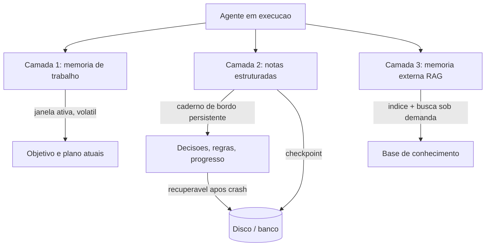

# Capítulo 5: Memória — persistir além da janela

## 1. Introdução

No Capítulo 3, você dominou a janela de contexto e descobriu que a informação relevante não cabe — e não deve caber — nela inteira. Isso abre uma pergunta inevitável: se a janela é finita, onde mora tudo o que o agente precisa lembrar entre uma volta e outra do loop, entre uma sessão e outra? A resposta é a memória — e ela não é um recurso do modelo, é uma camada do harness. Você vai aprender as três camadas de memória do agente (memória de trabalho, notas estruturadas e memória externa com RAG), como a memória se diferencia da janela, e como o checkpointing transforma memória em durabilidade. Ao final, você vai implementar um sistema de memória em camadas que sobrevive a reinícios, crashes e sessões novas.

## 2. Explica

### A memória não é a janela

O erro conceitual mais comum em engenharia de agentes é tratar a janela de contexto como se fosse memória. A janela é o que o modelo vê agora — um estado efêmero que se esvai quando a sessão termina. A memória é o que o agente *sabe* — um estado persistente que atravessa sessões, reinícios e até versões do modelo [1]. A diferença é a mesma entre o maquinista lembrar do trecho íngreme da viagem de ontem (memória) e enxergar o trecho à frente agora (janela). Confundir as duas produz o sintoma clássico do "recomeço eterno": o agente esquece tudo a cada sessão, repete o mesmo trabalho, toma as mesmas decisões ruins e nunca acumula aprendizado [2].

A distinção tem consequência arquitetural: a janela é gerida pelo gestor de contexto do Capítulo 3 — curada, compactada, orçada em tokens. A memória é gerida por um sistema separado — persistida, indexada, consultada sob demanda. O harness precisa dos dois, com interfaces distintas.

### As três camadas de memória

A arquitetura de memória que a indústria convergiu tem três camadas, cada uma com papel, custo e latência próprios.

**Camada 1 — Memória de trabalho**: o estado que vive na janela enquanto o agente executa uma tarefa: o objetivo atual, o plano em andamento, os resultados das últimas observações. É volátil por definição — perde-se quando a janela fecha — mas é o que o modelo usa para raciocinar no momento [1]. O gestor de contexto do Capítulo 3 cuida dela.

**Camada 2 — Notas estruturadas**: o caderno de bordo do agente — fatos duráveis registrados explicitamente, fora da janela, consultados sob demanda. A Anthropic descreve essa prática como *structured note-taking*: o agente mantém arquivos de notas persistentes onde grava decisões, bugs, regras e estado, e o harness injeta trechos relevantes quando necessário [3]. A camada 2 é onde moram a "identidade" do agente (quem ele é, qual regra segue), o "aprendizado" (o que descobriu) e o "progresso" (onde parou).

**Camada 3 — Memória externa e RAG**: o mundo além do caderno — bases de conhecimento, documentos, dados históricos — acessado via busca. O RAG (Retrieval-Augmented Generation) entra aqui: em vez de injetar a base inteira na janela, o harness indexa os documentos, e a consulta do agente dispara uma busca que retorna apenas os trechos relevantes [4]. A camada 3 é a memória "do mundo": enciclopédica, indexada, barata por consulta.

A relação entre as camadas é de distância crescente e custo decrescente: a camada 1 é caríssima (tokens), a camada 2 é barata (arquivos), a camada 3 é quase grátis por consulta (índice + busca). O harness decide em qual camada cada fato deve morar — o mesmo problema de controle de cache que você viu no Capítulo 3, agora aplicado à memória.

### Por que o agente esquece: o custo de não ter memória

Sem memória, o loop do Capítulo 2 gira com uma amnésia estrutural: cada volta começa com a janela que o gestor montou — e se essa janela não contém os fatos do passado, o agente não tem como saber que já tentou aquela abordagem, que já consultou aquela fonte, que já decidiu não seguir por aquele caminho [2]. O resultado é o custo duplicado: trabalho repetido, decisões repetidas, tokens queimados na mesma busca três vezes.

A literatura de engenharia de contexto nomeia o problema com precisão: tarefas de horizonte longo degradam justamente porque a informação útil do início é enterrada ou perdida até o fim [3]. A memória é a resposta estrutural: fatos duráveis saem da janela e vão para as notas; o início do trabalho fica recuperável; o agente nunca mais precisa "descobrir" o que já descobriu.

### Checkpointing: memória que sobrevive à morte

A última peça é o **checkpointing** — a persistência do estado do loop em pontos determinados da execução, de forma que, se o processo morrer (crash, rede, deploy), o agente retome do último checkpoint em vez de recomeçar do zero [5]. A execução durável — que você verá em profundidade no Capítulo 10 — se apoia exatamente nisso: journal imutável de passos concluídos, replay determinístico e idempotência [6]. Para este capítulo, o essencial é entender o princípio: a memória do agente não vive no processo — vive no disco, no banco, no índice. O processo é descartável; a memória não é.

## 3. Ilustra

### O caderno de bordo do maquinista

Voltemos à locomotiva, agora numa viagem longa — a travessia de uma serra que leva dois dias. O maquinista tem três ferramentas de memória. A primeira é a memória dele mesmo — o que ele lembra enquanto dirige: a velocidade atual, a próxima curva, o sinal que viu há um minuto. É rápida, mas volátil: se ele for substituído no meio da viagem, o substituto não herda essa memória. A segunda é o caderno de bordo — onde ele anota, a cada trecho, o que descobriu: "km 120 — descida íngreme, freio em segunda", "km 90 — ponte em manutenção, reduzir para 20". O caderno é lento de consultar, mas dura: o substituto que chega às 3 da manhã lê o caderno e sabe tudo que o antecessor descobriu. A terceira é o arquivo da ferrovia — o manual dos trechos, o histórico de manutenção, os mapas: a memória do mundo, consultada por índice.



Como Engenheiro de Plataforma, você já viveu a tragédia do maquinista substituído: o agente de produção que "esqueceu" tudo quando o processo reiniciou, e o time passou duas horas reexplicando o que ele já sabia. A cena é universal — e a cura é o caderno de bordo: notas estruturadas e checkpointing, as duas peças que este capítulo ensina a construir.

### A dupla camada: lembrar é uma decisão de engenharia

O ponto contraintuitivo: **memória não é gravar mais — é escolher o que esquecer, e onde**. O maquinista não anota cada curva da viagem no caderno — ele anota a curva *que importa*. A camada 2 existe porque gravar tudo é inviável: o caderno que vira um depósito de tudo é tão inútil quanto nenhum caderno, porque a anotação relevante se perde na massa — o *context rot* do Capítulo 3, agora em forma de caderno.

A decisão de "o que vai para a camada 2" é uma decisão de engenharia do harness, não um acidente: o agente registra fatos com estrutura (chave, categoria, conteúdo) e o harness decide o que injetar na janela com base na tarefa atual [3]. Uma nota sem categoria, sem chave e sem curadoria não é memória — é lixo acumulado. A memória boa é a memória selecionada, indexada e consultável: o caderno de bordo de um maquinista veterano, não o porão de um acumulador.

## 4. Técnica

### Implementando o sistema de memória em três camadas

A técnica central deste capítulo é o sistema de memória em camadas: a peça que dá ao harness a persistência que o gestor de contexto do Capítulo 3 deliberadamente não tem. A implementação abaixo junta as três camadas com uma interface uniforme de consulta:

```python
"""Memoria em tres camadas para o harness do agente.

Camada 1 (trabalho) vive na janela e e volatil; camada 2 (notas) e um
caderno persistente com chave e categoria; camada 3 (RAG) consulta uma
base indexada sob demanda.
"""
import json
import sqlite3
from dataclasses import dataclass, field
from pathlib import Path
from typing import Callable, Dict, List, Optional


@dataclass
class Nota:
    """Entrada do caderno de bordo (camada 2)."""
    chave: str
    categoria: str  # "decisao" | "regra" | "progresso" | "aprendizado"
    conteudo: str
    versao: int = 1


@dataclass
class MemoriaTrabalho:
    """Estado volatil da execucao atual (camada 1)."""
    objetivo: str = ""
    plano: List[str] = field(default_factory=list)
    ultima_observacao: str = ""


class MemoriaDoAgente:
    """Sistema de memoria em camadas com persistencia em SQLite."""

    def __init__(self, caminho_db: str = "memoria_agente.db") -> None:
        self.trabalho = MemoriaTrabalho()
        self._db = sqlite3.connect(caminho_db)
        self._db.execute(
            """
            CREATE TABLE IF NOT EXISTS notas (
                chave TEXT PRIMARY KEY,
                categoria TEXT NOT NULL,
                conteudo TEXT NOT NULL,
                versao INTEGER DEFAULT 1
            )
            """
        )
        self._db.commit()
        self.rag: Callable[[str], List[str]] = lambda termo: []

    # Camada 2: notas estruturadas persistentes
    def registrar_nota(self, nota: Nota) -> None:
        """Upsert de uma nota no caderno de bordo."""
        self._db.execute(
            """
            INSERT INTO notas (chave, categoria, conteudo, versao)
            VALUES (?, ?, ?, ?)
            ON CONFLICT(chave) DO UPDATE SET
                categoria = excluded.categoria,
                conteudo = excluded.conteudo,
                versao = notas.versao + 1
            """,
            (nota.chave, nota.categoria, nota.conteudo, nota.versao),
        )
        self._db.commit()

    def ler_nota(self, chave: str) -> Optional[Nota]:
        """Le uma nota especifica do caderno."""
        linha = self._db.execute(
            "SELECT chave, categoria, conteudo, versao FROM notas WHERE chave = ?",
            (chave,),
        ).fetchone()
        if linha is None:
            return None
        return Nota(linha[0], linha[1], linha[2], linha[3])

    def notas_por_categoria(self, categoria: str) -> List[Nota]:
        """Lista notas de uma categoria (ex.: todas as regras)."""
        linhas = self._db.execute(
            "SELECT chave, categoria, conteudo, versao FROM notas WHERE categoria = ?",
            (categoria,),
        ).fetchall()
        return [Nota(*linha) for linha in linhas]

    # Camada 3: memoria externa via RAG sob demanda
    def consultar_base(self, termo: str, topo: int = 3) -> List[str]:
        """Consulta a base de conhecimento indexada."""
        resultados = self.rag(termo)
        return resultados[:topo]

    # Montagem para a janela
    def montar_contexto_memoria(self, categorias: List[str]) -> str:
        """Monta o bloco de memoria injetado na janela pelo gestor."""
        blocos: List[str] = ["<memoria_do_agente>"]
        for categoria in categorias:
            blocos.append(f"<{categoria}>")
            for nota in self.notas_por_categoria(categoria):
                blocos.append(f"- {nota.chave}: {nota.conteudo} (v{nota.versao})")
            blocos.append(f"</{categoria}>")
        blocos.append("</memoria_do_agente>")
        return "\n".join(blocos)

    def fechar(self) -> None:
        """Fecha a conexao com o banco."""
        self._db.close()


def exemplo_uso() -> None:
    """Demo: notas persistidas, consultadas e montadas para a janela."""
    memoria = MemoriaDoAgente(":memory:")
    memoria.registrar_nota(Nota("regra_escrita", "regra", "nunca tocar em producao"))
    memoria.registrar_nota(Nota("prog_limpeza", "progresso", "45% dos duplicados removidos"))
    memoria.registrar_nota(Nota("regra_escrita", "regra", "nunca tocar em producao sem aprovacao"))
    print(memoria.montar_contexto_memoria(["regra", "progresso"]))
    print("versao apos upsert:", memoria.ler_nota("regra_escrita").versao)
    memoria.fechar()


if __name__ == "__main__":
    exemplo_uso()
```

O sistema entrega as propriedades que definem memória de verdade: **persistência** (SQLite sobrevive a reinícios), **estrutura** (chave, categoria, versão — consultável, não um blob), **curadoria** (só o que foi registrado com intenção) e **integração** (o bloco montado alimenta o gestor de contexto do Capítulo 3). O checkpointing — persistir também o estado do loop — é a extensão natural que o Capítulo 10 completa com journal e replay.

### Integrando RAG à memória externa

O segundo componente conecta a camada 3: um cliente de RAG que indexa documentos e responde buscas por relevância, consumido pelo harness sob demanda [4]. A implementação mínima abaixo usa TF-IDF puro — sem dependências externas — para demonstrar o princípio:

```python
"""Cliente RAG minimo com indice TF-IDF puro (sem dependencias externas)."""
import math
import re
from collections import Counter
from dataclasses import dataclass
from typing import Dict, List


@dataclass
class Documento:
    """Documento indexado com texto e metadados."""
    id_doc: str
    texto: str
    categoria: str = "geral"


def _tokenizar(texto: str) -> List[str]:
    """Tokeniza texto em minusculas, sem pontuacao."""
    return re.findall(r"[a-z0-9à-ú]+", texto.lower())


class IndiceRAG:
    """Indice TF-IDF puro para consulta de documentos."""

    def __init__(self) -> None:
        self.documentos: List[Documento] = []
        self._tf: List[Counter] = []
        self._df: Counter = Counter()

    def indexar(self, documento: Documento) -> None:
        """Adiciona um documento ao indice."""
        tokens = _tokenizar(documento.texto)
        freq = Counter(tokens)
        self._tf.append(freq)
        for token in freq:
            self._df[token] += 1
        self.documentos.append(documento)

    def _idf(self, token: str) -> float:
        """Inverso da frequencia de documento."""
        n = len(self.documentos)
        if n == 0:
            return 0.0
        return math.log((1 + n) / (1 + self._df[token])) + 1.0

    def buscar(self, consulta: str, topo: int = 3) -> List[str]:
        """Retorna os textos dos documentos mais relevantes."""
        termos = set(_tokenizar(consulta))
        if not termos:
            return []
        pontuacoes: List[float] = []
        for freq in self._tf:
            score = 0.0
            for token in termos:
                score += freq[token] * self._idf(token)
            pontuacoes.append(score)
        ordem = sorted(
            range(len(self.documentos)),
            key=lambda i: pontuacoes[i],
            reverse=True,
        )
        return [
            self.documentos[i].texto
            for i in ordem[:topo]
            if pontuacoes[i] > 0.0
        ]


def exemplo_rag() -> None:
    """Demo: indexa dois documentos e consulta por relevancia."""
    indice = IndiceRAG()
    indice.indexar(Documento(
        "doc-1",
        "A ferramenta arquivo.ler retorna resumo canonico com paginacao.",
        "manual",
    ))
    indice.indexar(Documento(
        "doc-2",
        "O gestor de contexto compacta historico quando o orcamento estoura.",
        "manual",
    ))
    print(indice.buscar("como ler arquivos com paginacao"))


if __name__ == "__main__":
    exemplo_rag()
```

Com o índice TF-IDF, a camada 3 entrega o que a memória externa precisa: **consulta sob demanda** (o harness pergunta, o índice responde com os trechos relevantes) e **custo constante** (a janela não carrega a base inteira). A indexação de dossiês inteiros na Fábrica usa exatamente esse mecanismo [4].

### Persistindo memória de trabalho via checkpoint

O terceiro componente fecha a trinca: o checkpoint da memória de trabalho — o estado volátil da camada 1 serializado para o disco, para que um crash não o apague. É a ponte entre este capítulo e a execução durável do Capítulo 10:

```python
"""Checkpoint da memoria de trabalho: persistencia do estado volatil."""
import json
from dataclasses import asdict
from typing import Optional


class CheckpointTrabalho:
    """Serializa e restaura a memoria de trabalho do agente."""

    def __init__(self, caminho: str = "checkpoint.json") -> None:
        self.caminho = caminho

    def salvar(self, memoria_trabalho) -> None:
        """Grava o estado da memoria de trabalho em disco."""
        dados = asdict(memoria_trabalho)
        with open(self.caminho, "w", encoding="utf-8") as arquivo:
            json.dump(dados, arquivo, ensure_ascii=False, indent=2)

    def restaurar(self) -> Optional[dict]:
        """Restaura o estado salvo, ou None se nao existir."""
        try:
            with open(self.caminho, encoding="utf-8") as arquivo:
                return json.load(arquivo)
        except FileNotFoundError:
            return None


def exemplo_checkpoint() -> None:
    """Demo: salva, simula crash e restaura."""
    cp = CheckpointTrabalho("checkpoint_demo.json")
    trabalho = {"objetivo": "limpeza de duplicados", "plano": ["passo 1", "passo 2"]}
    cp.salvar(trabalho)
    restaurado = cp.restaurar()
    print("restaurado:", restaurado)
```

O checkpoint é a fronteira entre memória "boa o bastante para sessões" e memória "confiável o bastante para produção": com ele, o harness pode morrer e renascer sem perder o fio — o maquinista pode ser substituído às 3 da manhã e a viagem continua de onde parou.

## 5. Aplica

### Cena de contraste: o agente que redescobre tudo a cada reinício

Você está no time de plataforma, e o agente de análise de incidentes roda como um serviço que o orquestrador reinicia diariamente. O problema: todo dia às 6h, o agente "esquece" o que aprendeu no dia anterior. Ele re-descobre que a base de conhecimento tem um documento sobre o incidente tipo X, re-decide que a ferramenta de busca precisa de paginação, re-formula a mesma regra de análise que o time já documentou. O custo mensal de tokens duplicados é visível na fatura — e pior, a qualidade não melhora com o tempo: o agente é eternamente iniciante.

O erro que você cometeria seguindo o instinto: "o problema é a sessão — vamos manter a sessão viva". O diagnóstico da memória: manter a sessão viva é adiar o problema, não resolvê-lo — a janela cresce, o *context rot* piora, e o agente continua sem *memória*, apenas com *histórico* mais longo. O que falta é a camada 2: notas estruturadas persistidas que atravessam reinícios [3].

A correção tem três movimentos. Primeiro, **implemente o caderno de bordo**: o agente registra, ao fim de cada análise, notas de categoria "aprendizado" ("incidente tipo X: consultar doc-7 primeiro") e "progresso" ("análise de ontem parou no caso 12"). Segundo, **injecte as notas na janela da manhã**: o gestor de contexto monta o bloco `<aprendizado>` no início de cada sessão — o agente novo nasce sabendo o que o anterior descobriu. Terceiro, **meça a duplicação**: compare o número de buscas repetidas antes e depois — a queda é a métrica da memória funcionando [2]. O agente continua sendo reiniciado todo dia, mas agora o reinício não apaga nada.

### O ciclo de vida da memória: escrever, consultar, expirar

A memória de produção não é um depósito que só cresce — ela tem um ciclo de vida, e o harness é quem o governa. O ciclo tem quatro fases, e cada uma é uma decisão de engenharia [1].

A primeira fase é **escrever**: quando um fato vira nota? A regra prática é a recorrência — um fato consultado em mais de uma tarefa, ou que custou caro para descobrir, merece a camada 2 [2]. O agente registra com intenção, não por acidente: a decisão de "isso é durável" é parte do trabalho, e o harness pode até ter uma ferramenta `memoria.registrar` para torná-la explícita. A segunda fase é **consultar**: o gestor de contexto decide quais notas entram na janela por tarefa — as notas de categoria "regra" e "progresso" entram sempre; as de "aprendizado" entram quando a tarefa se relaciona. A terceira fase é **atualizar**: a nota de progresso muda a cada marco — e o upsert com versão que você implementou garante que a versão nova coexista com o rastro da antiga, sem apagar a história. A quarta fase é **expirar**: notas obsoletas — regras revogadas, aprendizado superado — precisam de mecanismo de expiração ou revisão periódica; um caderno que nunca esquece vira o depósito que este capítulo condenou [3].

O ciclo de vida transforma a memória de um problema de armazenamento em um problema de gestão — e é exatamente o que separa o caderno do maquinista veterano do porão do acumulador.

### O caso de fronteira: memória compartilhada entre agentes

Há um cenário que leva a memória ao limite: o compartilhamento entre agentes. Quando dois agentes — o de pesquisa e o de relatórios — precisam do mesmo aprendizado, cada um com seu caderno separado re-descobre o mesmo fato, duplicando custo [8]. A resposta é a memória compartilhada: um caderno comum por domínio, com escopo de escrita por agente — o agente de pesquisa escreve notas de "aprendizado", o de relatórios as lê.

A disciplina de segurança é a mesma da ACI do Capítulo 4: a escrita compartilhada exige allow-list — um agente não pode gravar notas em categoria que não é sua, e a trilha do Capítulo 11 registra quem escreveu o quê [18]. O ganho é a memória da organização agêntica: o aprendizado de um agente vira capital de todos — a taxa de reconsulta cai de forma agregada, e o custo por tarefa recorrente cai junto [6]. O risco é a contaminação: uma nota errada de um agente vira fato para os outros — por isso a curadoria e a verificação são parte do ciclo de vida, não um extra.

### Armadilhas comuns

- **Usar a janela como memória**: manter a sessão viva para "não esquecer" é o erro mais caro — janela cresce, contexto apodrece, custo explode. Memória é camada separada [1].
- **Caderno sem estrutura**: notas sem chave, categoria e versão viram depósito — o *context rot* do caderno. Estrutura é o que torna a memória consultável.
- **Gravar tudo**: registrar cada observação como nota eterna é lixo acumulado. A curadoria — decidir o que é fato durável — é parte do trabalho do harness [3].
- **Checkpoint sem journal**: salvar estado sem registrar passos concluídos não permite replay — a durabilidade completa vem no Capítulo 10.

### O caderno de decisões do capítulo

Três decisões deste capítulo definem a memória como camada de produção [9]. Primeira: **memória é camada separada da janela** — o gestor de contexto cuida do que o agente vê agora; o sistema de memória cuida do que o agente sabe para sempre, com persistência, estrutura e expiração próprias [1]. Segunda: **o caderno de bordo é estruturado ou é depósito** — notas com chave, categoria e versão são consultáveis; blobs sem estrutura viram o porão do acumulador, e a curadoria (o que promove a nota, o que expira) é parte do trabalho do harness [3]. Terceira: **checkpoint sem journal é metade da solução** — persistir estado sem registrar passos não permite replay; a durabilidade completa, com journal e idempotência, é o Capítulo 10 [5].

A aplicação imediata é o inventário de memória: para cada agente, identificar onde os fatos duráveis vivem hoje (janela? sessão? lugar nenhum?), medir a taxa de reconsulta e listar o que seria promovido a nota na primeira semana. O inventário normalmente revela que o custo de amnésia é mensurável — e que a fatura de tokens tem uma linha invisível de re-descoberta [6].

### Métricas de sucesso

Três métricas medem a memória: **taxa de reconsulta** (buscas repetidas da mesma fonte dentro de uma janela de tempo — deve cair com notas de "aprendizado"), **tempo até retomada** (quanto o agente demora para recuperar contexto após reinício — deve cair de minutos para segundos com checkpoint) e **custo por tarefa recorrente** (deve cair conforme a memória elimina trabalho duplicado) [6] — e o ciclo de vida com expiração impede que a memória vire depósito [3].

## 6. Conclusão

Você aprendeu que memória não é a janela — é a camada persistente do harness que atravessa sessões e reinícios — e dominou as três camadas: memória de trabalho (volátil), notas estruturadas (o caderno de bordo) e memória externa com RAG (o mundo indexado). Você implementou o sistema de memória em SQLite com notas categorizadas, o índice RAG TF-IDF puro e o checkpoint da memória de trabalho. O desafio: adicione um caderno de bordo ao agente que mais repete trabalho e meça a taxa de reconsulta por uma semana — depois me diga quanto da fatura de tokens era amnésia. No Capítulo 6, vamos à peça que amarra tudo: o loop como máquina de estado, com os padrões de orquestração que transformam um agente solitário em um sistema coordenado.

## 7. Referências Bibliográficas

[1] ANTHROPIC. *Effective context engineering for AI agents*. Disponível em: https://www.anthropic.com/engineering/effective-context-engineering-for-ai-agents. Acesso em: 06 ago. 2026.
[2] ANTHROPIC. *Effective context engineering for AI agents: memory and note-taking*. Disponível em: https://www.anthropic.com/engineering/effective-context-engineering-for-ai-agents. Acesso em: 06 ago. 2026.
[3] ANTHROPIC. *Effective context engineering for AI agents: structured note-taking*. Disponível em: https://www.anthropic.com/engineering/effective-context-engineering-for-ai-agents. Acesso em: 06 ago. 2026.
[4] LIU, Jerry. *Building performant agentic RAG and context systems*. Disponível em: https://www.llamaindex.ai/blog. Acesso em: 06 ago. 2026.
[5] ZYLOS RESEARCH. *Durable execution for AI agent runtimes: checkpointing, replay, and recovery*. Disponível em: https://zylos.ai/research/2026-04-24-durable-execution-agent-runtimes/. Acesso em: 06 ago. 2026.
[6] TEMPORAL TECHNOLOGIES. *Durable multi-agentic AI architecture with Temporal*. Disponível em: https://temporal.io/blog/using-multi-agent-architectures-with-temporal. Acesso em: 06 ago. 2026.
[7] ANTHROPIC. *Building effective agents*. Disponível em: https://www.anthropic.com/engineering/building-effective-agents. Acesso em: 06 ago. 2026.
[8] RUNKLE, Sydney. *Choosing the right multi-agent architecture*. Disponível em: https://www.langchain.com/blog/choosing-the-right-multi-agent-architecture. Acesso em: 06 ago. 2026.
[9] LANGCHAIN. *LangGraph: conceptual guides — persistence and checkpointing*. Disponível em: https://langchain-ai.github.io/langgraph/concepts/persistence/. Acesso em: 06 ago. 2026.
[10] ANTHROPIC. *Model Context Protocol: specification and documentation*. Disponível em: https://modelcontextprotocol.io/. Acesso em: 06 ago. 2026.
[11] OPENAI. *OpenAI Agents SDK: memory and sessions*. Disponível em: https://openai.github.io/openai-agents-python/. Acesso em: 06 ago. 2026.
[12] EXPANSO. *AI agent observability: best practices in 2026*. Disponível em: https://expanso.io/blog/ai-agent-observability-best-practices/. Acesso em: 06 ago. 2026.
[13] NEWTON-KING, James. *Inside the LLM call: GenAI observability with OpenTelemetry*. Disponível em: https://opentelemetry.io/blog/2026/genai-observability/. Acesso em: 06 ago. 2026.
[14] ORACLE AI & DATA SCIENCE. *Runtime budget guardrails for agentic AI*. Disponível em: https://blogs.oracle.com/ai-and-datascience/runtime-budget-guardrails-agentic-ai. Acesso em: 06 ago. 2026.
[15] DANTRA, Ruskin et al. *Orchestrating intelligent agents at scale: how AgentCore and Temporal create robust AI systems*. Disponível em: https://aws.amazon.com/blogs/apn/how-temporal-uses-amazon-bedrock-agentcore-to-create-robust-ai-systems/. Acesso em: 06 ago. 2026.
[16] SHEN, Alfred; DERBAKOVA, Anya. *Design multi-agent orchestration with reasoning using Amazon Bedrock and open source frameworks*. Disponível em: https://aws.amazon.com/blogs/machine-learning/design-multi-agent-orchestration-with-reasoning-using-amazon-bedrock-and-open-source-frameworks/. Acesso em: 06 ago. 2026.
[17] FOUNTAIN CITY. *AI agent governance: a practitioner's guide*. Disponível em: https://fountaincity.tech/resources/blog/ai-agent-governance-practitioners-guide/. Acesso em: 06 ago. 2026.
[18] OWASP FOUNDATION. *OWASP Top 10 for agentic applications*. Disponível em: https://genai.owasp.org/resource/owasp-top-10-for-agentic-applications-for-2026/. Acesso em: 06 ago. 2026.
[19] HANCOCK, Parker. *When AI agents misbehave: governance and security for autonomous AI*. Disponível em: https://ourtake.bakerbotts.com/post/102me2l/when-ai-agents-misbehave-governance-and-security-for-autonomous-ai. Acesso em: 06 ago. 2026.
[20] MICROSOFT. *Architecting trust: a NIST-based security governance framework for AI agents*. Disponível em: https://techcommunity.microsoft.com/blog/microsoftdefendercloudblog/architecting-trust-a-nist-based-security-governance-framework-for-ai-agents/4490556. Acesso em: 06 ago. 2026.
