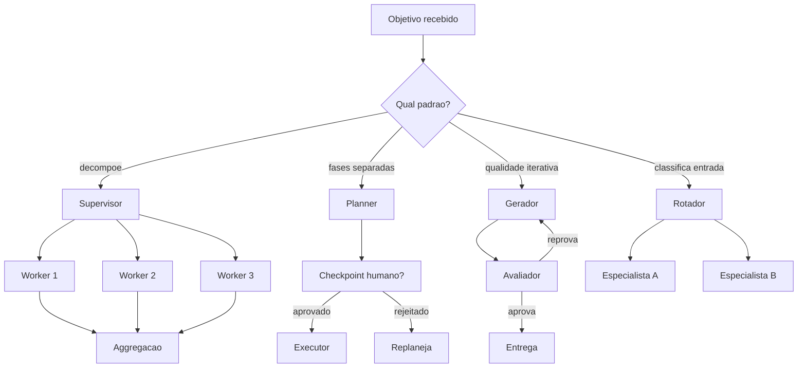

# Capítulo 6: O loop como máquina de estado — padrões de orquestração

## 1. Introdução

Nos capítulos anteriores, você construiu as peças do harness — o gestor de contexto, as ferramentas validadas, a memória em camadas. Agora vamos à peça que amarra tudo: a orquestração. Você vai aprender que o loop do agente é, na prática, uma máquina de estados, e que a indústria convergiu em padrões de orquestração — supervisor/worker, planner-executor, reflexão, roteamento — cada um com trade-offs próprios de custo, latência e isolamento. Ao final, você vai implementar um orquestrador que decide, com base na tarefa, qual padrão usar — e vai entender por que a escolha do padrão é uma decisão de engenharia, não uma preferência estética.

## 2. Explica

### O loop como máquina de estados

No Capítulo 2, você implementou o ciclo como uma máquina de estados com estágios nomeados. Agora vamos generalizar: qualquer orquestração de agente é uma máquina de estados — um conjunto de estados, transições e condições de término — e os padrões de orquestração que a indústria usa são, cada um, um grafo de estados específico [1]. Pensar em orquestração como máquina de estados dá três superpoderes ao harness: a execução vira **persistível** (o estado pode ser salvo e retomado, como você viu no Capítulo 5), **auditável** (todo caminho percorrido fica registrado) e **testável** (evals podem cobrir transições específicas).

A implicação prática: quando você escolhe um padrão de orquestração, você está escolhendo um grafo de estados — e o grafo determina o que pode acontecer. Um agente com um único loop linear não pode delegar trabalho paralelo. Um orquestrador supervisor não pode executar sem delegar. A arquitetura do harness é a arquitetura do grafo.

### Os padrões fundamentais

A literatura convergiu em um conjunto de padrões que reaparecem em todos os frameworks. Vamos aos quatro que importam para este capítulo.

**Supervisor/Worker** — o padrão hierárquico: um agente central (o supervisor) recebe o objetivo global, decompõe em subtarefas, delega a agentes especializados (os workers) e consolida os resultados [2]. A propriedade central é o **isolamento de contexto**: os workers não conversam entre si — apenas com o supervisor — o que limita a superfície de contaminação e permite dar a cada worker apenas as ferramentas e o contexto da própria subtarefa [3]. É o padrão ideal quando a tarefa se decompõe naturalmente em subdomínios.

**Planner-Executor** — o padrão em fases: um componente planeja (gera a sequência de passos e ferramentas) e outro executa (dispara as ferramentas e valida os resultados) [2]. A separação cria checkpoints naturais: entre o plano e a execução, o harness pode inserir aprovação humana (HITL), revisão ou simulação. É o padrão ideal para tarefas determinísticas ou de alto risco, em que o plano deve ser validado antes de tocar o mundo [4].

**Reflexão (Reflection)** — o padrão de avaliação interna: o agente produz uma saída, avalia-a contra critérios — rubricas, testes, verificação por outro agente — e refina até passar [5]. A Anthropic descreve esse padrão como *evaluator-optimizer*: um gerador produz, um avaliador julga, e o loop alterna entre os dois até a saída satisfazer os critérios [2]. É o padrão ideal para tarefas de qualidade iterativa — código, texto, análise — em que o custo extra de avaliação compensa a melhoria de resultado.

**Roteamento (Routing)** — o padrão de despacho: um classificador decide qual caminho especializado seguir com base na entrada [2]. É o mais barato e o mais simples: uma pergunta classifica a tarefa (bilingue? precisa de código? é financeira?) e roteia para o especialista certo. É o padrão ideal para hubs de entrada heterogênea, e muitas vezes o suficiente — a Anthropic recomenda começar por ele e evoluir apenas quando a complexidade justificar [2].

### Topologias maiores: do padrão ao sistema

Além dos padrões individuais, a literatura discute topologias completas para sistemas multi-agente — e cada uma tem custos mensuráveis. O **fan-out** dispara N workers em paralelo e agrega. O **pipeline** encadeia especialistas em sequência. O **debate** faz múltiplos agentes argumentarem entre si — poderoso, mas caro, com custos relatados em torno de 2,5× o padrão por rodada [6]. O **swarm** usa handoffs: qualquer agente pode transferir o controle para qualquer outro, criando colaboração livre — flexível, mas difícil de auditar [7].

A lição de engenharia é que a escolha de topologia é uma decisão de custo-benefício explícita: mais agentes significam mais tokens, mais latência e mais superfície de falha [3]. A prática recomendada é começar com o menor grafo que resolve o problema — o mesmo princípio de simplicidade da Anthropic — e adicionar complexidade com evidência, nunca por entusiasmo [2].

### O orquestrador como maquinista

O ponto que conecta tudo à tese do livro: a orquestração é a cabine do maquinista — o lugar onde as decisões de alto nível são tomadas: qual padrão usar, qual worker acionar, quando parar, quando escalar. E como toda cabine, ela precisa de instrumentação: o orquestrador decide, mas o harness registra *por que* decidiu, *quanto* custou e *onde* os resultados foram parar [8]. Sem essa instrumentação, a orquestração é a caixa-preta mais cara do sistema — e a auditoria do Capítulo 11 não teria como respondê-la.

## 3. Ilustra

### A estação central de triagem

Voltemos à ferrovia, agora na estação central — o coração da malha, onde todos os trens chegam e partem. A estação tem o maquinista-chefe (o supervisor): ele recebe o manifesto de cada trem que chega (o objetivo), decide quais vagões seguem para quais linhas (decomposição), chama os maquinistas especializados (os workers) e consolida o comboio de volta (agregação). Ele não dirige cada trem — ele decide quem dirige o quê, e cada maquinista especializado trabalha no seu trecho com o seu mapa, sem conversar com os outros.



Como Engenheiro de Plataforma, você reconhece a cena: todo sistema agêntico de produção, no fundo, é uma estação central — a pergunta é se a estação foi *projetada* (com padrões explícitos, checkpoints e instrumentação) ou *improvisada* (com agentes chamando agentes por acidente, sem ninguém no comando). A diferença entre as duas é exatamente o que este capítulo ensina.

### A dupla camada: o padrão certo não é o mais poderoso

O ponto contraintuitivo que merece uma segunda analogia: **o maquinista-chefe mais caro do mundo não faz a estação funcionar melhor se o problema é triagem simples**. Um hub de entrada que recebe 95% de perguntas simples e 5% de tarefas complexas não precisa de um supervisor multi-agente — precisa de um roteador barato que manda 95% para o especialista rápido e 5% para o supervisor.

A intuição enganosa é associar "mais orquestração" a "melhor sistema". O custo real do debate (2,5×), o custo do fan-out (N × contexto) e a latência do planner-executor com aprovação humana são pagos com qualidade marginal decrescente [6]. O padrão certo é o menor grafo que atinge o critério de sucesso — e a arte da orquestração é saber onde o critério de sucesso exige o grafo maior. Comece simples, meça, adicione: a regra da estação central é a mesma da via férrea — primeiro a bitola simples, depois o pátio de manobras.

## 4. Técnica

### Implementando o orquestrador com seleção de padrão

A técnica central deste capítulo é o orquestrador que seleciona o padrão com base na tarefa — a cabine do maquinista em código. A implementação abaixo modela os quatro padrões como estratégias com interface uniforme e um seletor que decide qual usar:

```python
"""Orquestrador de agentes com selecao de padrao por heuristica.

Padroes: supervisor (delega e agrega), planner-executor (fases com
checkpoint), reflexao (gera-avalia-refina) e roteamento (classifica e
despacha). O seletor decide o padrao pela natureza da tarefa.
"""
from dataclasses import dataclass, field
from typing import Callable, Dict, List, Optional, Protocol


class Worker(Protocol):
    """Interface de um worker executavel."""
    def executar(self, subtarefa: str) -> str: ...


@dataclass
class Tarefa:
    """Descricao da tarefa recebida pelo orquestrador."""
    descricao: str
    categoria: str = "geral"       # "simples" | "multi" | "alto_risco" | "qualidade"
    requer_aprovacao: bool = False


@dataclass
class ResultadoOrquestracao:
    """Resultado estruturado de uma orquestracao."""
    padrao_usado: str
    saida: str
    passos: List[str] = field(default_factory=list)
    custo_estimado: int = 0


class Orquestrador:
    """Cabine do maquinista: decide o padrao e orquestra a execucao."""

    def __init__(
        self,
        rotador: Optional[Callable[[str], str]] = None,
        planejador: Optional[Callable[[str], List[str]]] = None,
        gerador: Optional[Callable[[str], str]] = None,
        avaliador: Optional[Callable[[str], str]] = None,
    ) -> None:
        self.rotador = rotador or (lambda d: "especialista_geral")
        self.planejador = planejador or (lambda d: [d])
        self.gerador = gerador or (lambda d: d)
        self.avaliador = avaliador or (lambda s: "aprovado")
        self.workers: Dict[str, Worker] = {}

    def registrar_worker(self, nome: str, worker: Worker) -> None:
        """Registra um worker especializado para o padrao supervisor."""
        self.workers[nome] = worker

    def selecionar_padrao(self, tarefa: Tarefa) -> str:
        """Heuristica deterministica de escolha de padrao."""
        if tarefa.requer_aprovacao:
            return "planner_executor"
        if tarefa.categoria == "multi":
            return "supervisor"
        if tarefa.categoria == "qualidade":
            return "reflexao"
        return "roteamento"

    def orquestrar(self, tarefa: Tarefa) -> ResultadoOrquestracao:
        """Executa a tarefa com o padrao selecionado."""
        padrao = self.selecionar_padrao(tarefa)
        passos: List[str] = [f"padrao escolhido: {padrao}"]

        if padrao == "roteamento":
            destino = self.rotador(tarefa.descricao)
            passos.append(f"roteado para: {destino}")
            worker = self.workers.get(destino)
            saida = worker.executar(tarefa.descricao) if worker else "sem worker"
            return ResultadoOrquestracao(padrao, saida, passos, custo_estimado=1)

        if padrao == "planner_executor":
            plano = self.planejador(tarefa.descricao)
            passos.append(f"plano: {plano}")
            saida = " | ".join(plano)
            return ResultadoOrquestracao(padrao, saida, passos, custo_estimado=2)

        if padrao == "supervisor":
            partes = tarefa.descricao.split(";")
            resultados: List[str] = []
            for parte in partes:
                destino = self.rotador(parte)
                worker = self.workers.get(destino)
                resultados.append(worker.executar(parte) if worker else parte)
                passos.append(f"worker {destino} concluiu")
            saida = " | ".join(resultados)
            return ResultadoOrquestracao(padrao, saida, passos, custo_estimado=len(partes))

        # reflexao: gera, avalia e refina ate aprovar
        saida = self.gerador(tarefa.descricao)
        rodadas = 1
        while self.avaliador(saida) != "aprovado" and rodadas < 4:
            passos.append(f"refinamento {rodadas}")
            saida = self.gerador(f"{tarefa.descricao} (refinar: {saida})")
            rodadas += 1
        passos.append(f"aprovado apos {rodadas} rodadas")
        return ResultadoOrquestracao(padrao, saida, passos, custo_estimado=rodadas)


def exemplo_uso() -> None:
    """Demo: quatro tarefas roteadas para quatro padroes distintos."""
    orquestrador = Orquestrador()
    tarefas = [
        Tarefa("resumir vendas", "simples"),
        Tarefa("auditar e corrigir; documentar e aprovar", "alto_risco", True),
        Tarefa("analisar churn; prever receita; segmentar clientes", "multi"),
        Tarefa("gerar relatorio impecavel", "qualidade"),
    ]
    for tarefa in tarefas:
        resultado = orquestrador.orquestrar(tarefa)
        print(f"{tarefa.categoria}: padrao={resultado.padrao_usado} "
              f"custos={resultado.custo_estimado}")


if __name__ == "__main__":
    exemplo_uso()
```

O orquestrador entrega a decisão de padrão como **lógica determinística** (heurística explícita, testável), o **custo estimado por padrão** (a métrica que permite comparar topologias) e a **rastreabilidade dos passos** (o transcript da cabine). É o esqueleto que os Capítulos 7 a 10 vão instrumentar.

### Supervisor com isolamento de contexto

O segundo componente detalha o padrão mais usado em produção: supervisor/worker com isolamento de contexto — cada worker recebe apenas a parte do contexto da própria subtarefa, limitando contaminação e reduzindo tokens [3]:

```python
"""Supervisor com isolamento de contexto por worker."""
from dataclasses import dataclass, field
from typing import Dict, List


@dataclass
class WorkerIsolado:
    """Worker que so recebe o contexto da propria subtarefa."""
    nome: str
    contexto: str = ""
    resultado: str = ""


class SupervisorIsolado:
    """Delega subtarefas com contexto minimo por worker."""

    def __init__(self) -> None:
        self.workers: Dict[str, WorkerIsolado] = {}

    def registrar(self, nome: str) -> None:
        self.workers[nome] = WorkerIsolado(nome)

    def executar(self, objetivo: str, partes: Dict[str, str]) -> Dict[str, str]:
        """Executa cada parte no worker certo, com contexto isolado."""
        resultados: Dict[str, str] = {}
        for worker_nome, contexto_parte in partes.items():
            worker = self.workers[worker_nome]
            worker.contexto = contexto_parte
            # simulacao: o worker processa apenas o contexto recebido
            worker.resultado = f"processado: {contexto_parte[:40]}"
            resultados[worker_nome] = worker.resultado
        return resultados
```

O isolamento é o que diferencia o supervisor do caos multi-agente: os workers não veem o contexto uns dos outros, então um erro de um não contamina os demais, e cada um recebe só o que precisa — a menor agência aplicada ao contexto [3].

### Roteador de entrada com classificação determinística

O terceiro componente é o roteador — o padrão mais barato e muitas vezes suficiente — com classificação determinística da entrada:

```python
"""Roteador de entrada com classificacao deterministica por palavra-chave."""
from typing import Callable, Dict, List


class RoteadorDeEntrada:
    """Classifica a entrada e despacha para o especialista certo."""

    def __init__(self, rotas: Dict[str, List[str]]) -> None:
        self.rotas = rotas
        self.resolvedores: Dict[str, Callable[[str], str]] = {}

    def registrar(self, rota: str, resolvedor: Callable[[str], str]) -> None:
        self.resolvedores[rota] = resolvedor

    def classificar(self, entrada: str) -> str:
        """Escolhe a rota pela primeira palavra-chave encontrada."""
        texto = entrada.lower()
        for rota, palavras in self.rotas.items():
            for palavra in palavras:
                if palavra in texto:
                    return rota
        return "geral"

    def despachar(self, entrada: str) -> str:
        """Classifica e executa o resolvedor da rota."""
        rota = self.classificar(entrada)
        resolvedor = self.resolvedores.get(rota)
        return resolvedor(entrada) if resolvedor else f"rota {rota}: sem resolvedor"


def exemplo_roteador() -> None:
    """Demo: roteamento por categoria de pedido."""
    roteador = RoteadorDeEntrada(
        {
            "financeiro": ["reembolso", "fatura", "pagamento"],
            "suporte_tecnico": ["erro", "bug", "falha"],
            "vendas": ["preco", "plano", "assinatura"],
        }
    )
    roteador.registrar("financeiro", lambda e: "especialista financeiro acionado")
    roteador.registrar("suporte_tecnico", lambda e: "especialista tecnico acionado")
    roteador.registrar("vendas", lambda e: "especialista de vendas acionado")
    roteador.registrar("geral", lambda e: "atendente geral acionado")
    for entrada in ["quero um reembolso", "o sistema deu erro", "qual o preco do plano"]:
        print(f"{entrada!r} -> {roteador.despachar(entrada)}")


if __name__ == "__main__":
    exemplo_roteador()
```

O roteador é a prova prática do princípio de simplicidade: com uma tabela de palavras-chave e resolvedores, um hub de entrada heterogêneo ganha a primeira estação da via — barata, determinística, auditável [2].

## 5. Aplica

### Cena de contraste: a torre de agentes que ninguém comanda

Você chega ao time e encontra o sistema legado de atendimento: seis agentes autônomos foram criados em meses diferentes, cada um com seu loop, suas ferramentas e seu prompt — e agora eles se chamam uns aos outros por ferramentas de mensageria, formando uma teia invisível. Uma requisição de suporte dispara, em média, quatro agentes em cascata, cada um esperando o resultado do outro, com retries em cada elo. O custo por atendimento triplicou, a latência explodiu, e ninguém consegue explicar o caminho exato que uma requisição percorre — porque ninguém desenhou o grafo.

O erro que você cometeria seguindo o instinto: "vamos comprar um framework de orquestração e migrar tudo". O diagnóstico deste capítulo: o problema não é falta de ferramenta, é ausência de grafo — os padrões existem no acaso, não por decisão. Migrar para um framework sem definir o grafo transfere a teia para outro lugar [3].

A correção tem três movimentos. Primeiro, **desenhe o grafo real**: mapeie quem chama quem, com custo e latência por elo — o transcript do sistema inteiro. Segundo, **substitua a cascata por padrões explícitos**: uma requisição de suporte vira um roteamento (classifica: financeiro, técnico ou vendas) seguido por um worker único — a teia de quatro agentes vira um grafo de dois estados [6]. Terceiro, **instrumente a cabine**: o orquestrador registra padrao_usado e custo_estimado de cada tarefa — a métrica que impede o grafo de crescer em segredo de novo [8]. A teia vira estação central: desenhada, contida, auditável.

### A evolução do grafo: quando migrar de padrão com evidência

A orquestração madura trata a escolha do padrão como uma hipótese testável, e a evolução do grafo segue um ciclo de três passos que amarra este capítulo aos evals do Capítulo 8 [2].

O **passo 1 é medir**: cada tarefa registra padrao_usado, custo real e latência — o custo_estimado do orquestrador comparado ao observado. O **passo 2 é hipotetizar**: quando a medição mostra um gargalo — a taxa de sucesso do roteador cai em certas classes, a latência do supervisor explode com N workers — o time formula a hipótese "se migrarmos a classe X para o padrão Y, o custo cai Z%". O **passo 3 é testar**: a hipótese vira um comparativo A/B na suíte de evals — a mesma classe de tarefa roda nos dois padrões, e a decisão de migrar é tomada com a diferença medida, não com o entusiasmo [2].

O ciclo é o mesmo que guia qualquer evolução de sistema confiável, e ele protege a orquestração dos dois fracassos simétricos: o congelamento (nunca evoluir, mesmo com evidência) e o salto (evoluir por moda, sem medição). A estação central muda de topologia quando os dados dizem que muda — e os dados são do harness, não do palpite.

### O caso de fronteira: orquestração com custos divergentes por worker

Há um cenário que a medição de custo do orquestrador precisa tratar com cuidado: os workers com custos radicalmente diferentes [9]. Um supervisor que delega análise de texto (barata) e geração de código (cara) ao mesmo lote — com o mesmo orçamento por worker — aloca mal o recurso: a tarefa cara estoura, a barata sobra. A prática recomendada é o **orçamento diferenciado por worker**: cada subtarefa recebe um teto proporcional à sua complexidade, e o supervisor agrega os custos ao teto da sessão [9].

Na implementação, isso significa que o custo_estimado do orquestrador não é uma soma simples — é uma soma ponderada por tipo de worker, e o comparativo A/B do passo 2 mede a alocação, não apenas o total. A lição conecta à contenção do Capítulo 9: o step budget e o teto de custo precisam existir em dois níveis — por worker (a subtarefa) e por sessão (a agregação do supervisor) [9]. Sem o nível por worker, uma subtarefa descontrolada drena o orçamento das irmãs; sem o nível de sessão, a soma de subtarefas legítimas estoura o teto da organização.

### Armadilhas comuns

- **Agentes chamando agentes por acidente**: sem orquestrador explícito, a "colaboração" vira cascata invisível — o custo e a latência multiplicam sem ninguém desenhar o grafo.
- **Padrão mais caro por entusiasmo**: debate e multi-agente têm custo real (2,5×). Adicione complexidade com evidência, não por moda [6].
- **Sem checkpoint no planner-executor**: a separação de fases só vale se o harness usa o checkpoint para aprovação ou revisão — caso contrário, é latência pura.
- **Workers com contexto completo**: supervisor sem isolamento de contexto é a teia de novo — cada worker deve ver só a própria subtarefa [3].

### O caderno de decisões do capítulo

Três decisões deste capítulo definem a orquestração como engenharia de grafos [11]. Primeira: **o grafo é desenhado ou é acidente** — a teia de agentes chamando agentes por mensageria é um grafo não desenhado, e o primeiro passo da orquestração é mapear quem chama quem, com custo e latência por elo, antes de qualquer mudança [3]. Segunda: **o padrão é escolhido por evidência, não por moda** — o ciclo medir-hipotetizar-testar decide quando migrar de roteamento para supervisor ou reflexão, com comparativos A/B na suíte de evals, nunca por entusiasmo [2]. Terceira: **o isolamento de contexto é a regra do supervisor** — workers veem só a própria subtarefa, e a fronteira de informação é tanto economia de tokens quanto camada de segurança [3].

A aplicação imediata é o mapa da estação: desenhar o grafo real do sistema agêntico mais complexo do time, com custo e latência por elo, e marcar onde a cascata acidental pode virar padrão explícito. O mapa costuma revelar que o sistema inteiro poderia ser um roteador com três workers — e que o custo da teia invisível era a fatura inteira [9].

### Métricas de sucesso

Três métricas medem a orquestração: **custo por tarefa por padrão** (o custo_estimado comparado ao real — a base para decidir quando evoluir o grafo), **latência P95 por categoria de tarefa** e **taxa de sucesso por rota** (o roteador erra em quais classes?). Com elas, a estação central opera com dados — e a decisão de adicionar um padrão mais caro vira uma hipótese testável [2], validada pelo ciclo medir-hipotetizar-testar antes de qualquer migração [9].

## 6. Conclusão

Você aprendeu que a orquestração é uma máquina de estados — e que os padrões supervisor/worker, planner-executor, reflexão e roteamento são grafos específicos com trade-offs de custo, latência e isolamento. Você implementou o orquestrador com seleção determinística de padrão, o supervisor com isolamento de contexto e o roteador de entrada por palavra-chave. O desafio: desenhe o grafo real do sistema agêntico mais complexo do seu time — com custo e latência por elo — e identifique onde uma teia acidental pode virar uma estação desenhada. No Capítulo 7, entramos na parte III da obra: a operação — observabilidade de agentes, a disciplina que instrumenta cada peça que construímos até aqui.

## 7. Referências Bibliográficas

[1] LANGCHAIN. *LangGraph: conceptual guides — state machines and graphs*. Disponível em: https://langchain-ai.github.io/langgraph/concepts/agentic_concepts/. Acesso em: 06 ago. 2026.
[2] ANTHROPIC. *Building effective agents*. Disponível em: https://www.anthropic.com/engineering/building-effective-agents. Acesso em: 06 ago. 2026.
[3] RUNKLE, Sydney. *Choosing the right multi-agent architecture*. Disponível em: https://www.langchain.com/blog/choosing-the-right-multi-agent-architecture. Acesso em: 06 ago. 2026.
[4] DANTRA, Ruskin et al. *Orchestrating intelligent agents at scale: how AgentCore and Temporal create robust AI systems*. Disponível em: https://aws.amazon.com/blogs/apn/how-temporal-uses-amazon-bedrock-agentcore-to-create-robust-ai-systems/. Acesso em: 06 ago. 2026.
[5] ANTHROPIC. *Demystifying evals for AI agents*. Disponível em: https://www.anthropic.com/engineering/demystifying-evals-for-ai-agents. Acesso em: 06 ago. 2026.
[6] DIGITAL APPLIED. *Multi-agent orchestration: 5 patterns that work in 2026*. Disponível em: https://www.digitalapplied.com/blog/multi-agent-orchestration-5-patterns-that-work. Acesso em: 06 ago. 2026.
[7] OPENAI. *OpenAI Agents SDK: handoffs and multi-agent patterns*. Disponível em: https://openai.github.io/openai-agents-python/. Acesso em: 06 ago. 2026.
[8] EXPANSO. *AI agent observability: best practices in 2026*. Disponível em: https://expanso.io/blog/ai-agent-observability-best-practices/. Acesso em: 06 ago. 2026.
[9] SHEN, Alfred; DERBAKOVA, Anya. *Design multi-agent orchestration with reasoning using Amazon Bedrock and open source frameworks*. Disponível em: https://aws.amazon.com/blogs/machine-learning/design-multi-agent-orchestration-with-reasoning-using-amazon-bedrock-and-open-source-frameworks/. Acesso em: 06 ago. 2026.
[10] TEMPORAL TECHNOLOGIES. *Durable multi-agentic AI architecture with Temporal*. Disponível em: https://temporal.io/blog/using-multi-agent-architectures-with-temporal. Acesso em: 06 ago. 2026.
[11] LANGCHAIN. *LangGraph: conceptual guides — multi-agent patterns*. Disponível em: https://langchain-ai.github.io/langgraph/concepts/multi_agent/. Acesso em: 06 ago. 2026.
[12] ANTHROPIC. *Effective context engineering for AI agents*. Disponível em: https://www.anthropic.com/engineering/effective-context-engineering-for-ai-agents. Acesso em: 06 ago. 2026.
[13] NEWTON-KING, James. *Inside the LLM call: GenAI observability with OpenTelemetry*. Disponível em: https://opentelemetry.io/blog/2026/genai-observability/. Acesso em: 06 ago. 2026.
[14] OWASP FOUNDATION. *OWASP Top 10 for agentic applications*. Disponível em: https://genai.owasp.org/resource/owasp-top-10-for-agentic-applications-for-2026/. Acesso em: 06 ago. 2026.
[15] FOUNTAIN CITY. *AI agent governance: a practitioner's guide*. Disponível em: https://fountaincity.tech/resources/blog/ai-agent-governance-practitioners-guide/. Acesso em: 06 ago. 2026.
[16] ORACLE AI & DATA SCIENCE. *Runtime budget guardrails for agentic AI*. Disponível em: https://blogs.oracle.com/ai-and-datascience/runtime-budget-guardrails-agentic-ai. Acesso em: 06 ago. 2026.
[17] ZYLOS RESEARCH. *Durable execution for AI agent runtimes: checkpointing, replay, and recovery*. Disponível em: https://zylos.ai/research/2026-04-24-durable-execution-agent-runtimes/. Acesso em: 06 ago. 2026.
[18] MICROSOFT. *Architecting trust: a NIST-based security governance framework for AI agents*. Disponível em: https://techcommunity.microsoft.com/blog/microsoftdefendercloudblog/architecting-trust-a-nist-based-security-governance-framework-for-ai-agents/4490556. Acesso em: 06 ago. 2026.
[19] HANCOCK, Parker. *When AI agents misbehave: governance and security for autonomous AI*. Disponível em: https://ourtake.bakerbotts.com/post/102me2l/when-ai-agents-misbehave-governance-and-security-for-autonomous-ai. Acesso em: 06 ago. 2026.
[20] ANTHROPIC. *Model Context Protocol: specification and documentation*. Disponível em: https://modelcontextprotocol.io/. Acesso em: 06 ago. 2026.
