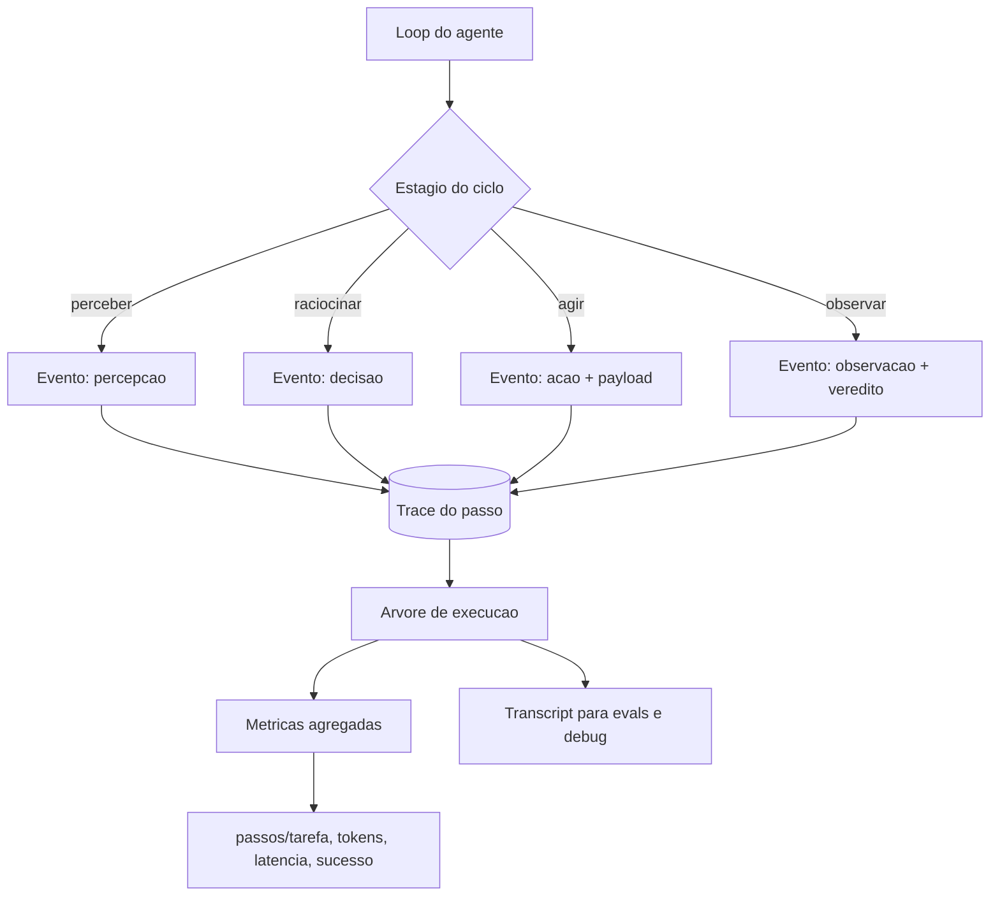

# Capítulo 7: Observabilidade de agentes — telemetria do loop

## 1. Introdução

Você construiu a via férrea: contexto, ferramentas, memória e orquestração. Agora entramos na parte III da obra — a operação. Este capítulo trata da disciplina que torna o harness *visível*: a observabilidade de agentes. Você vai aprender por que agentes falham de forma educada (e por que o monitoramento tradicional não vê), como instrumentar o loop com tracing por passo e convenções `gen_ai.*` do OpenTelemetry, e quais métricas definem a saúde de um loop — passos, tokens, latência, sucesso. Ao final, você vai implementar o instrumentador do harness: a peça que registra cada volta do ciclo e responde à pergunta "o que o agente fez, por que fez, e deu certo?".

## 2. Explica

### Polite failures: o erro que se veste de sucesso

A diferença fundamental entre observar uma aplicação e observar um agente é o tipo de falha que cada um produz. Aplicações tradicionais falham de forma barulhenta: uma exceção estoura, um status 500 retorna, uma página fica vermelha no dashboard — o incidente se anuncia. Agentes falham de forma educada: o loop completa, a saída é sintaticamente perfeita, o status retornado é "sucesso" — e a decisão embutida naquela saída está errada [1]. O sistema não aparenta estar doente, e é exatamente por isso que o incidente passa despercebido até o impacto chegar — a fatura, o relatório errado, o dado corrompido.

A literatura de observabilidade de agentes nomeia esse padrão e suas consequências: métricas de infraestrutura — CPU, memória, latência, disponibilidade — não detectam o descarrilamento, porque o agente não está indisponível; está girando [2]. A observabilidade de agentes exige instrumentar o *conteúdo* do loop, não apenas a *saúde* do processo: o que o agente percebeu, o que decidiu, qual ferramenta chamou, com quais argumentos, e se a observação indicou progresso real.

### O que significa observar um loop

Observar um loop é registrar, a cada volta do ciclo, os dados que permitem reconstruir a história completa da execução: a entrada (percepção), a decisão (raciocínio), a ação (ferramenta e payload), a observação (resultado) e o veredito (progresso, erro, conclusão). A estrutura de registro segue a anatomia do Capítulo 2 — cada estágio gera um evento com contexto [3].

Duas propriedades definem essa instrumentação. A primeira é a **árvore de execução**: uma única requisição do usuário pode gerar dezenas de chamadas de modelo e ferramentas em cascata, formando uma árvore — invocação do agente, chamadas de LLM, execuções de ferramenta, sub-loops — e o trace precisa preservar essa hierarquia para que o engenheiro veja onde o tempo e o custo se acumularam [4]. A segunda é a **ligação com o transcript**: o trace (o quê aconteceu, em que ordem) e o transcript (o conteúdo das mensagens, ferramentas e raciocínio) são duas vistas do mesmo loop — o trace para a operação, o transcript para o debug e os evals [5].

### A padronização gen_ai.* do OpenTelemetry

A indústria convergiu em uma padronização para a telemetria de modelos generativos: as **convenções semânticas `gen_ai.*`** do OpenTelemetry [4]. Elas definem atributos comuns para registrar chamadas de modelo — `gen_ai.request.model` (o modelo chamado), `gen_ai.usage.input_tokens` e `gen_ai.usage.output_tokens` (o custo em tokens), `gen_ai.response.finish_reasons` (por que a geração terminou), e atributos opcionais de conteúdo (`gen_ai.input.messages`, `gen_ai.system_instructions`) para captura controlada [4].

O que torna a padronização valiosa para o harness é a **neutralidade de fornecedor**: um trace instrumentado com `gen_ai.*` pode ser consumido por qualquer backend compatível — OTLP, dashboards, ferramentas de análise — sem depender do provedor de modelo. É a bitola da via férrea aplicada à telemetria: o mesmo padrão para todas as locomotivas.

### Métricas de loop: o dashboard do maquinista

Além dos traces, o harness precisa de **métricas agregadas** — os números que respondem "o sistema está saudável?" em um relance. A literatura de observabilidade de agentes recomenda um conjunto mínimo: **passos por tarefa** (a distribuição do número de voltas do loop — picos indicam loops), **tokens por tarefa** (o custo — a métrica do token burn do Capítulo 1), **latência por volta e por tarefa** (P50/P95/P99), **taxa de sucesso por tarefa** (com definição de sucesso que inclui o *outcome* real, não apenas a ausência de erro [5]) e **taxa de progresso por volta** (percentual de observações classificadas como avanço real pelo parser de sinal do Capítulo 2) [6].

A arte da métrica é a mesma da engenharia de contexto: poucas, com significado, e ligadas a ação. Um dashboard com quarenta métricas não é observabilidade — é ruído. O maquinista olha cinco instrumentos, não quarenta.

## 3. Ilustra

### O painel da cabine

Voltemos à cabine da locomotiva. O maquinista veterano dirige com um painel mínimo: o velocímetro (a latência e o ritmo do loop), o manômetro da caldeira (o custo — pressão de tokens), o sinaleiro à frente (o progresso — o próximo marco da viagem) e o registro de viagem (o log do que foi feito). Ele não olha para o motor por dentro — ele olha para os instrumentos que traduzem o motor em decisões.



Como Engenheiro de Plataforma, você já passou pela noite em que o dashboard estava verde e o cliente estava furioso: latência normal, sem erros, e o relatório entregue estava errado. A cena é o polite failure em produção — e a lição é que o painel verde só vale se medir o que o agente decidiu, não apenas se ele respondeu. O instrumento que faltava é o veredito por volta: o sinaleiro que diz se o trem avançou de verdade.

### A dupla camada: o log não é o trace

O ponto contraintuitivo que merece uma segunda analogia: **registrar tudo não é observar**. O maquinista que anota cada detalhe da viagem num diário gigante não tem observabilidade — tem um porão de papel. Observabilidade é a capacidade de *responder perguntas* com os dados registrados: "onde o trem perdeu tempo?", "qual trecho queimou mais carvão?", "o sinaleiro estava vermelho quando o trem passou?".

Um log bruto de um agente — centenas de mensagens e chamadas de ferramenta sem estrutura — não responde a nenhuma dessas perguntas sem horas de investigação. O trace estruturado responde em segundos: a árvore de execução mostra exatamente onde os tokens e a latência se acumularam, e o veredito por volta mostra onde o progresso parou [2]. Observabilidade é a diferença entre ter os dados e poder *interrogá-los* — e o interrogatório exige estrutura, não volume.

## 4. Técnica

### Implementando o instrumentador do loop

A técnica central deste capítulo é o instrumentador: a peça que o harness usa para registrar cada volta do ciclo em formato estruturado, com eventos por estágio, trace hierárquico e métricas agregadas. A implementação abaixo é o núcleo dessa peça, modelada no padrão `gen_ai.*` do OpenTelemetry:

```python
"""Instrumentador do loop do agente: eventos, trace e metricas.

Registra cada volta do ciclo em formato estruturado, liga eventos em
uma arvore de execucao e agrega metricas de loop.
"""
import time
from dataclasses import dataclass, field
from typing import Dict, List, Optional


@dataclass
class Evento:
    """Um evento estruturado do loop do agente."""
    tipo: str          # "percepcao" | "decisao" | "acao" | "observacao"
    passo: int
    mensagem: str
    atributos: Dict[str, object] = field(default_factory=dict)
    timestamp: float = field(default_factory=time.time)
    duracao_ms: float = 0.0


@dataclass
class Metrica:
    """Uma metrica agregada de loop."""
    nome: str
    valor: float
    unidade: str = ""


class Instrumentador:
    """Registra eventos, monta traces e agrega metricas do loop."""

    def __init__(self) -> None:
        self.eventos: List[Evento] = []
        self.metricas: List[Metrica] = []
        self._inicio_acao = 0.0
        self._proxima_acao: Optional[Evento] = None

    def registrar(self, tipo: str, passo: int, mensagem: str, **atributos: object) -> None:
        """Registra um evento de estagio do ciclo."""
        evento = Evento(tipo=tipo, passo=passo, mensagem=mensagem, atributos=atributos)
        if tipo == "acao":
            self._inicio_acao = time.time()
            self._proxima_acao = evento
        elif tipo == "observacao" and self._proxima_acao is not None:
            self._proxima_acao.duracao_ms = (time.time() - self._inicio_acao) * 1000
        self.eventos.append(evento)

    def agrupar_por_tipo(self) -> Dict[str, int]:
        """Conta eventos por tipo de estagio."""
        contagem: Dict[str, int] = {}
        for evento in self.eventos:
            contagem[evento.tipo] = contagem.get(evento.tipo, 0) + 1
        return contagem

    def metricas_de_loop(self) -> List[Metrica]:
        """Agrega as metricas essenciais do dashboard do maquinista."""
        acoes = [e for e in self.eventos if e.tipo == "acao"]
        duracao_total = sum(e.duracao_ms for e in acoes) / 1000.0
        self.metricas = [
            Metrica("passos_total", float(len(self.eventos))),
            Metrica("acoes_por_tarefa", float(len(acoes))),
            Metrica("duracao_total_s", duracao_total),
            Metrica(
                "taxa_progresso",
                self._taxa_progresso(),
                "fracao",
            ),
        ]
        return self.metricas

    def _taxa_progresso(self) -> float:
        """Fracao de observacoes com veredito de avanco real."""
        observacoes = [e for e in self.eventos if e.tipo == "observacao"]
        if not observacoes:
            return 0.0
        avancos = sum(1 for e in observacoes if e.atributos.get("avancou", False))
        return avancos / len(observacoes)

    def trace_json(self) -> str:
        """Serializa os eventos em formato de trace para persistencia."""
        import json

        return json.dumps(
            [
                {
                    "tipo": e.tipo,
                    "passo": e.passo,
                    "mensagem": e.mensagem,
                    "atributos": e.atributos,
                    "duracao_ms": round(e.duracao_ms, 2),
                }
                for e in self.eventos
            ],
            ensure_ascii=False,
        )


def exemplo_uso() -> None:
    """Demo: instrumenta um ciclo de tres voltas e agrega metricas."""
    inst = Instrumentador()
    inst.registrar("percepcao", 1, "dados de vendas recebidos")
    inst.registrar("decisao", 1, "buscar mais contexto", avancou=True)
    inst.registrar("acao", 1, "arquivo.ler", ferramenta="arquivo.ler")
    inst.registrar("observacao", 1, "conteudo resumido", avancou=True)
    inst.registrar("decisao", 2, "concluir", avancou=True)
    for metrica in inst.metricas_de_loop():
        print(f"{metrica.nome}: {metrica.valor:.2f} {metrica.unidade}")


if __name__ == "__main__":
    exemplo_uso()
```

O instrumentador entrega as três vistas do loop que a observabilidade exige: **eventos por estágio** (a estrutura que segue a anatomia do Capítulo 2), **métricas agregadas** (o dashboard mínimo: passos, ações, duração, taxa de progresso) e **trace serializável** (o registro persistível para auditá-lo depois). É a peça que transforma o harness em um sistema interrogável.

### Mapeando eventos para convenções gen_ai.*

O segundo componente conecta o instrumentador ao padrão da indústria: o mapeamento de eventos do loop para os atributos `gen_ai.*` do OpenTelemetry, para que o trace seja consumível por qualquer backend compatível [4]:

```python
"""Mapeamento de eventos do loop para convencoes gen_ai.* do OTel."""
from typing import Dict


def mapear_chamada_llm(
    modelo: str,
    tokens_entrada: int,
    tokens_saida: int,
    motivo_fim: str,
    instrucoes: str = "",
) -> Dict[str, object]:
    """Converte dados de uma chamada de modelo em atributos gen_ai.*."""
    atributos: Dict[str, object] = {
        "gen_ai.request.model": modelo,
        "gen_ai.usage.input_tokens": tokens_entrada,
        "gen_ai.usage.output_tokens": tokens_saida,
        "gen_ai.response.finish_reasons": [motivo_fim],
    }
    if instrucoes:
        atributos["gen_ai.system_instructions"] = instrucoes
    return atributos


def mapear_evento_acao(
    ferramenta: str,
    payload: Dict[str, object],
    sucesso: bool,
) -> Dict[str, object]:
    """Converte uma acao de ferramenta em atributos de trace."""
    return {
        "agent.tool": ferramenta,
        "agent.tool.payload": payload,
        "agent.tool.sucesso": sucesso,
    }
```

Com o mapeamento, o trace do harness fala a língua do ecossistema: qualquer dashboard OTel, coletor ou ferramenta de análise pode consumir os dados sem adaptação — a bitola da via férrea aplicada à telemetria [4].

### O detector de regressão no dashboard

O terceiro componente é o guarda de fronteira do dashboard: um monitor que compara métricas de loop em janelas deslizantes e alerta quando o comportamento desvia — a resposta operacional ao drift que você verá em profundidade no Capítulo 11 [7]:

```python
"""Monitor de metricas de loop com deteccao de desvio por janela."""
from dataclasses import dataclass, field
from statistics import mean
from typing import List


@dataclass
class Leitura:
    """Uma leitura de metrica de loop em uma janela de tempo."""
    janela: str
    passos_medio: float
    tokens_medio: float
    taxa_progresso: float


class MonitorDeDesvio:
    """Compara a janela atual com a linha de base e sinaliza desvio."""

    def __init__(self, limite_passos: float = 2.0) -> None:
        self.limite_passos = limite_passos
        self.leituras: List[Leitura] = []

    def adicionar(self, leitura: Leitura) -> None:
        self.leituras.append(leitura)

    def alertar(self) -> List[str]:
        """Retorna alertas se a ultima leitura desvia da mediana anterior."""
        if len(self.leituras) < 3:
            return []
        anteriores = self.leituras[:-1]
        mediana_passos = mean([l.passos_medio for l in anteriores])
        atual = self.leituras[-1]
        alertas: List[str] = []
        if atual.passos_medio > mediana_passos * self.limite_passos:
            alertas.append(
                f"passos medio {atual.passos_medio:.1f} > "
                f"{self.limite_passos}x mediana {mediana_passos:.1f}"
            )
        if atual.taxa_progresso < 0.3:
            alertas.append(f"taxa de progresso critica: {atual.taxa_progresso:.2f}")
        return alertas
```

O monitor é a prova de que as métricas têm um propósito além do dashboard: elas alimentam a detecção automática do descarrilamento — o sinaleiro que acende sozinho quando o trem começa a girar [7].

## 5. Aplica

### Cena de contraste: o dashboard verde e a fatura vermelha

Você é o engenheiro de plantão, terça-feira, 14h. O alerta de custo dispara: o orçamento de inferência do mês está 40% consumido — em 12 dias. Você abre o dashboard de infraestrutura: tudo verde. CPU ok, memória ok, latência P95 estável, zero erros 500. Você olha os traces e encontra o problema: o agente de enriquecimento de dados, criado há um mês, está processando uma fila de 50.000 registros, e para cada registro ele faz uma busca na base de conhecimento, recebe a resposta... e decide fazer outra busca "para confirmar". Duas buscas por registro, depois três, depois quatro — a taxa de progresso por volta despencou para 18% enquanto o dashboard de infraestrutura permanecia verde.

O erro que você cometeria seguindo o instinto: "o dashboard está mentindo" — e você adicionaria mais instrumentos de infraestrutura. O diagnóstico deste capítulo: o dashboard não mente, ele mede a coisa errada. O polite failure não aparece em métricas de disponibilidade — aparece em métricas de *conteúdo*: a taxa de progresso por volta caiu para 18% dias antes de a fatura chegar [1].

A correção tem três movimentos. Primeiro, **instrumente o loop com o instrumentador**: cada volta registra percepção, decisão, ação e observação com veredito — a taxa de progresso vira um instrumento da cabine. Segundo, **instale o monitor de desvio**: quando a taxa de progresso cruza o limiar, o alerta dispara em horas, não em dias — o descarrilamento é detectado na primeira descida, não na fatura [7]. Terceiro, **ligue a detecção à contenção**: quando o monitor sinaliza, o harness interrompe o agente (o step budget do Capítulo 9) antes que ele continue queimando tokens. O dashboard verde continua verde — mas agora existe um painel de conteúdo que conta a história real.

### O trace no incidente real: a investigação em três perguntas

A observabilidade se prova no incidente, e o incidente tem uma estrutura de investigação que o trace estruturado torna quase mecânica [8]. A primeira pergunta é **o quê**: o que aconteceu, em que ordem — a árvore de execução responde em segundos: as ações, as chamadas de modelo, os sub-loops, com durações. A segunda pergunta é **onde**: onde o tempo e o custo se acumularam — o trace com duracao_ms por ação aponta o passo exato que consumiu 40 segundos e 12 mil tokens, sem investigação manual. A terceira pergunta é **por quê**: por que o agente decidiu aquilo — e aqui o trace sozinho não basta; é o transcript que mostra a decisão (a mensagem do estágio "decisao") e a observação que a precedeu [5].

A prática recomendada é guardar os dois artefatos juntos, ligados pelo identificador da sessão: o trace para a operação, o transcript para o julgamento. O instrumentador que você implementou já registra ambos na mesma estrutura — os eventos do trace e o conteúdo das mensagens — e o caso de uso que valida o desenho é exatamente o incidente: o engenheiro de plantão responde às três perguntas em minutos, não em horas [8].

### O caso de fronteira: telemetria de dados sensíveis

Há um cenário que tensiona observabilidade e privacidade: os dados sensíveis no trace. O transcript de um agente de suporte contém dados do cliente; o payload de uma ferramenta de pagamento contém valores; as instruções do sistema contêm segredos internos [16]. Gravar tudo em texto plano torna a observabilidade um vazamento em potencial. A prática recomendada é a **triagem na origem**: mascarar campos sensíveis antes do registro — o payload entra no trace com `[mascarado]` no lugar dos valores — e capturar o conteúdo completo apenas quando a investigação exigir, com justificativa registrada [16].

Essa disciplina conecta a observabilidade à segurança do Capítulo 12: o trace é um fluxo de informação, e o fluxo de informação tem fronteiras. A telemetria madura registra o suficiente para investigar — não tudo o que existe. O instrumentador suporta isso com os atributos: campos marcados como sensíveis são substituídos no momento da serialização, e a política de retenção define quanto tempo o trace vive antes de expirar [16].

### Armadilhas comuns

- **Métricas de infraestrutura como proxy de saúde do agente**: latência e disponibilidade não medem decisão. O painel de conteúdo é separado e obrigatório [2].
- **Trace sem transcript**: o trace diz o que aconteceu; o transcript diz o conteúdo. Para debug de decisão errada, ambos são necessários [5].
- **Log sem estrutura**: um log gigante não é observabilidade. Eventos com tipo, passo e atributos é o mínimo interrogável.
- **Métricas sem ação**: medir sem ligar a contenção é vitrine. O monitor deve alimentar o step budget e os alertas [6].

### O caderno de decisões do capítulo

Três decisões deste capítulo definem a observabilidade como disciplina de conteúdo [9]. Primeira: **o painel verde não prova saúde do agente** — latência e disponibilidade medem infraestrutura; a saúde do loop se mede em taxa de progresso, distribuição de estágios e veredito por volta, e o painel de conteúdo é separado e obrigatório [1]. Segunda: **trace e transcript são duas vistas do mesmo loop** — o trace responde o quê e onde; o transcript responde o porquê; e os dois, ligados pela sessão, são o que transforma a investigação de incidente em consulta de minutos [5]. Terceira: **a telemetria tem fronteiras** — dados sensíveis são mascarados na origem, e a política de retenção define quanto tempo a história vive [16].

A aplicação imediata é o painel de conteúdo: instrumentar o agente mais crítico com eventos por estágio e veredito por volta, e responder três perguntas com os dados — qual a taxa de progresso real? onde o loop gasta a vida? quantos descarrilamentos estavam acontecendo antes do alerta de fatura? O painel costuma revelar que o polite failure era visível dias antes — só não havia instrumento para vê-lo [6].

### Métricas de sucesso

A observabilidade madura muda três números: **MTTD do descarrilamento** (tempo médio para detectar um loop — de dias para horas), **custo por tarefa** (cai quando a contenção detecta cedo) e **tempo de diagnóstico** (tempo para responder "por que o agente fez isso?" — de horas de investigação para minutos de consulta ao trace) [6] — com a triagem na origem garantindo que a investigação não vire vazamento [16].

## 6. Conclusão

Você aprendeu que agentes falham de forma educada — e que observar um loop exige instrumentar o conteúdo, não apenas a infraestrutura: eventos por estágio, trace hierárquico, transcript e métricas de progresso, seguindo as convenções `gen_ai.*` do OpenTelemetry. Você implementou o instrumentador do loop, o mapeamento para `gen_ai.*` e o monitor de desvio por janela. O desafio: instrumente o agente mais crítico do seu time com o instrumentador e meça a taxa de progresso por volta por uma semana — depois me diga quantas vezes o descarrilamento apareceu dias antes de a fatura chegar. No Capítulo 8, vamos transformar a observação em juízo: os evals de agentes, a disciplina que decide, com evidência, se um agente está pronto para produção.

## 7. Referências Bibliográficas

[1] EXPANSO. *AI agent observability: best practices in 2026*. Disponível em: https://expanso.io/blog/ai-agent-observability-best-practices/. Acesso em: 06 ago. 2026.
[2] EXPANSO. *AI agent observability: step-level tracing*. Disponível em: https://expanso.io/blog/ai-agent-observability-best-practices/. Acesso em: 06 ago. 2026.
[3] LANGCHAIN. *LangSmith: tracing and evaluation documentation*. Disponível em: https://docs.smith.langchain.com/. Acesso em: 06 ago. 2026.
[4] NEWTON-KING, James. *Inside the LLM call: GenAI observability with OpenTelemetry*. Disponível em: https://opentelemetry.io/blog/2026/genai-observability/. Acesso em: 06 ago. 2026.
[5] ANTHROPIC. *Demystifying evals for AI agents*. Disponível em: https://www.anthropic.com/engineering/demystifying-evals-for-ai-agents. Acesso em: 06 ago. 2026.
[6] ORACLE AI & DATA SCIENCE. *Runtime budget guardrails for agentic AI*. Disponível em: https://blogs.oracle.com/ai-and-datascience/runtime-budget-guardrails-agentic-ai. Acesso em: 06 ago. 2026.
[7] FOUNTAIN CITY. *AI agent governance: a practitioner's guide*. Disponível em: https://fountaincity.tech/resources/blog/ai-agent-governance-practitioners-guide/. Acesso em: 06 ago. 2026.
[8] ZYLOS RESEARCH. *Durable execution for AI agent runtimes: checkpointing, replay, and recovery*. Disponível em: https://zylos.ai/research/2026-04-24-durable-execution-agent-runtimes/. Acesso em: 06 ago. 2026.
[9] ANTHROPIC. *Effective context engineering for AI agents*. Disponível em: https://www.anthropic.com/engineering/effective-context-engineering-for-ai-agents. Acesso em: 06 ago. 2026.
[10] RUNKLE, Sydney. *Choosing the right multi-agent architecture*. Disponível em: https://www.langchain.com/blog/choosing-the-right-multi-agent-architecture. Acesso em: 06 ago. 2026.
[11] TEMPORAL TECHNOLOGIES. *Durable multi-agentic AI architecture with Temporal*. Disponível em: https://temporal.io/blog/using-multi-agent-architectures-with-temporal. Acesso em: 06 ago. 2026.
[12] ANTHROPIC. *Building effective agents*. Disponível em: https://www.anthropic.com/engineering/building-effective-agents. Acesso em: 06 ago. 2026.
[13] OWASP FOUNDATION. *OWASP Top 10 for agentic applications*. Disponível em: https://genai.owasp.org/resource/owasp-top-10-for-agentic-applications-for-2026/. Acesso em: 06 ago. 2026.
[14] LANGCHAIN. *LangGraph: conceptual guides — persistence and checkpointing*. Disponível em: https://langchain-ai.github.io/langgraph/concepts/persistence/. Acesso em: 06 ago. 2026.
[15] ANTHROPIC. *Model Context Protocol: specification and documentation*. Disponível em: https://modelcontextprotocol.io/. Acesso em: 06 ago. 2026.
[16] OPENAI. *OpenAI Agents SDK: tracing and observability*. Disponível em: https://openai.github.io/openai-agents-python/. Acesso em: 06 ago. 2026.
[17] DANTRA, Ruskin et al. *Orchestrating intelligent agents at scale: how AgentCore and Temporal create robust AI systems*. Disponível em: https://aws.amazon.com/blogs/apn/how-temporal-uses-amazon-bedrock-agentcore-to-create-robust-ai-systems/. Acesso em: 06 ago. 2026.
[18] MICROSOFT. *Architecting trust: a NIST-based security governance framework for AI agents*. Disponível em: https://techcommunity.microsoft.com/blog/microsoftdefendercloudblog/architecting-trust-a-nist-based-security-governance-framework-for-ai-agents/4490556. Acesso em: 06 ago. 2026.
[19] HANCOCK, Parker. *When AI agents misbehave: governance and security for autonomous AI*. Disponível em: https://ourtake.bakerbotts.com/post/102me2l/when-ai-agents-misbehave-governance-and-security-for-autonomous-ai. Acesso em: 06 ago. 2026.
[20] LIU, Jerry. *Building performant agentic RAG and context systems*. Disponível em: https://www.llamaindex.ai/blog. Acesso em: 06 ago. 2026.
