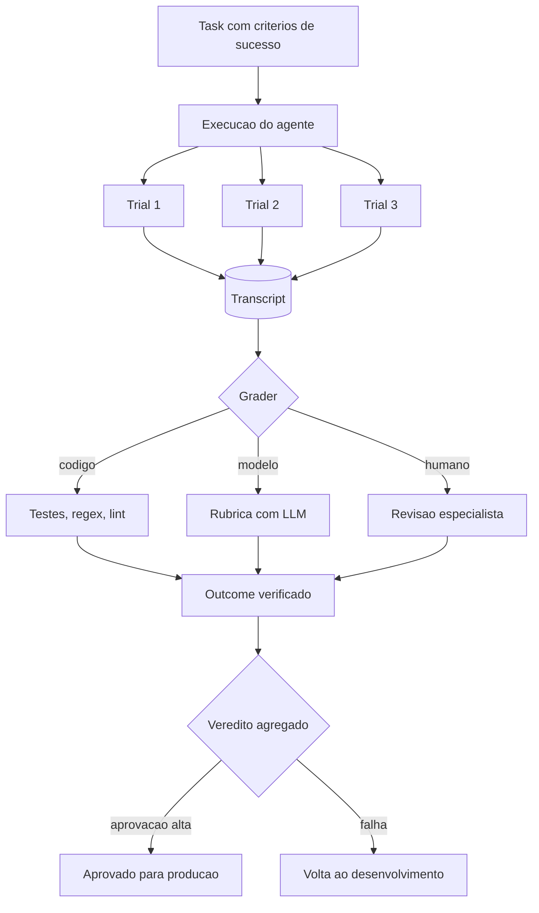

# Capítulo 8: Evals de agentes — o habite-se antes do embarque

## 1. Introdução

Você instrumentou o loop — agora o harness consegue *ver* o agente. O próximo passo é fazê-lo *julgar*: os evals, a disciplina que decide, com evidência, se um agente está pronto para produção. Você vai aprender a anatomia de um eval de agente (task, trial, transcript, outcome), os três tipos de grader (código, modelo e humano), a distinção entre capability evals e regression evals, e o papel dos golden sets. Ao final, você vai implementar uma suíte de evals para o harness: a peça que transforma "acho que o agente melhorou" em "a taxa de sucesso subiu de 72% para 89% com evidência".

## 2. Explica

### Por que evals de agentes são diferentes de evals de texto

Avaliar texto gerado por LLM é relativamente simples: você tem uma entrada e uma saída, e compara a saída com um critério. Avaliar um agente é radicalmente mais complexo, porque a saída não é o texto final — é o *comportamento*: a sequência de ações, ferramentas e decisões ao longo de um loop multiturmo, com estocasticidade em cada passo e erros que se propagam [1]. Uma resposta errada do modelo no passo 2 pode levar a uma ferramenta errada no passo 5, que corrompe o resultado final — e um eval que só olha o texto final não distingue "o agente decidiu errado" de "o agente executou mal".

A literatura de evals de agentes formaliza isso com uma estrutura de quatro componentes. A **task** (ou problem) é o caso de teste: entrada + critérios de sucesso claros. O **trial** é uma tentativa isolada — como modelos variam, executa-se múltiplos trials e agrega-se com métricas como pass@k. O **transcript** é o registro completo do loop — mensagens, chamadas de ferramenta, raciocínio — a matéria-prima do julgamento. O **outcome** é o estado final real no ambiente — o registro criado no banco, o arquivo alterado — *não* o que o agente disse que fez [1].

### O outcome como âncora: julgar o mundo, não as palavras

O componente mais importante — e o mais ignorado — é o **outcome**. Um agente que retorna "sucesso: pedido cancelado" mas não cancelou nada no sistema passou no eval de texto e falhou no eval de agente. A prática recomendada é verificar o estado do ambiente: consultar o banco, o filesystem, a API — o efeito real da execução [1]. É a diferença entre o maquinista *dizer* que chegou e o trem *estar* na estação.

Essa distinção conecta os evals à observabilidade do Capítulo 7: o trace registra o que aconteceu; o outcome verifica o efeito. O transcript é a narrativa, o outcome é a verdade verificável — e a suíte de evals precisa dos dois.

### Os três tipos de grader

Para julgar um trial, o harness precisa de um **grader** — o componente que decide se a execução passou ou falhou. A indústria convergiu em três tipos, com pontos fortes e fracos distintos [1].

**Graders baseados em código** são os mais determinísticos: testes unitários pass-to-pass, asserções de regex, linters, análise estática (ruff, mypy) [1]. Eles respondem "o comportamento é observável e verificável mecanicamente?" — e não dependem de modelo para julgar, o que os torna baratos e confiáveis. Sua limitação é o escopo: só julgam o que dá para codificar.

**Graders baseados em modelo** (LLM-as-a-judge) usam rubricas em linguagem natural e comparações em pares para julgar o que não dá para codificar: tom de voz, adequação à política, qualidade de narrativa [1]. São flexíveis, mas herdam a estocasticidade do modelo — a mesma execução pode receber vereditos diferentes — e exigem calibração contínua contra julgamento humano.

**Graders humanos** (SME review) são o padrão-ouro para o que exige expertise: revisão por especialistas, testes A/B, calibração dos juízes de modelo [1]. São caros e lentos — por isso são usados para calibrar as suítes, não para rodar a cada deploy.

A arte do eval é a **composição**: code grader para o verificável, model grader para o qualitativo com rubrica, e humano para o crítico — cada tipo no lugar certo, com custo proporcional ao risco [2].

### Capability evals vs. regression evals

A suíte de evals se divide em duas famílias com propósitos opostos. **Capability evals** testam o topo de capacidade do agente: cenários difíceis, novos, desafiadores — eles medem o quanto o agente *pode* fazer, e são o terreno do desenvolvimento de features [1]. **Regression evals** são a rede de segurança: uma suíte com taxa de sucesso perto de 100% nos comportamentos já estabelecidos, para garantir que uma atualização de prompt, modelo ou harness não quebre o que já funcionava [1].

A distinção é operacional: quando você muda o modelo de trás para frente, é a suíte de regressão que protege a produção; quando você adiciona uma capability nova, é a suíte de capability que mede se ela chegou. Golden sets — bancos de cenários representativos estáveis — servem às duas famílias, e sua manutenção é um investimento contínuo [1].

### Por que o eval é o habite-se do harness

Conectando à tese do livro: os evals são a **estação de inspeção** da via férrea — o ponto onde o trem é vistoriado antes de seguir viagem. Sem eles, mudanças no harness — um prompt novo, uma ferramenta nova, um modelo novo — são apostas: talvez melhore, talvez quebre, não se sabe. Com eles, cada mudança vira uma hipótese testada: a taxa de sucesso subiu, desceu, ou ficou igual, com evidência [3]. O eval não é um ritual de qualidade — é o instrumento que permite *evoluir com segurança* o sistema agêntico.

## 3. Ilustra

### A vistoria da estação

Voltemos à ferrovia. Antes de qualquer trem seguir viagem, a estação faz a vistoria: o mecânico verifica os freios (o code grader — mecânico, determinístico), o inspetor avalia o estado geral do vagão (o model grader — julgamento com critérios) e o engenheiro-chefe assina o laudo dos trens especiais (o humano — expertise final). Cada nível de vistoria tem um custo e uma confiabilidade: o teste de freio é barato e roda em todos os trens; a inspeção detalhada é mais cara; o laudo do engenheiro é reservado aos trens de risco.



Como Engenheiro de Plataforma, você reconhece a cena oposta: o trem que seguiu viagem sem vistoria porque "estava funcionando na demo". O eval é a vistoria que transforma "funciona na demo" em "funciona em produção com evidência" — e o custo da vistoria é infinitesimal comparado ao custo do descarrilamento.

### A dupla camada: o eval não testa o agente — testa o harness

O ponto contraintuitivo que merece uma segunda analogia: **quando um eval falha, o defeito pode estar no harness, não no agente**. O maquinista-chefe que vistoria o trem encontra freio falhando — e o freio é peça do trem, mas a especificação do freio é peça da estação. Um eval que falha porque a ferramenta devolveu um formato inesperado, porque o contexto não continha a instrução certa ou porque o step budget cortou antes da hora não está medindo o agente — está medindo o harness [3].

Essa visão transforma a suíte de evals em um instrumento de engenharia do harness, não apenas de validação do modelo: cada falha é um bug em potencial da via férrea — o contexto curado de menos, a ferramenta com escopo largo, a orquestração com o padrão errado. O eval é o ponto onde o harness inteiro — contexto, ferramentas, memória, orquestração, contenção — é posto à prova junto, porque é junto que eles operam.

## 4. Técnica

### Implementando a suíte de evals do harness

A técnica central deste capítulo é a suíte de evals: a infraestrutura que roda tasks, executa trials, coleta transcripts, aplica graders e agrega vereditos. A implementação abaixo é o núcleo dessa peça, com os três tipos de grader e a verificação de outcome:

```python
"""Suite de evals de agentes: task, trial, transcript, outcome e grader.

Suporta os tres tipos de grader (codigo, modelo, humano) e a agregacao
de vereditos com metricas pass@k.
"""
from dataclasses import dataclass, field
from typing import Callable, Dict, List, Optional, Protocol


@dataclass
class Task:
    """Um caso de teste de agente: entrada + criterios de sucesso."""
    id: str
    entrada: str
    criterios: List[str] = field(default_factory=list)
    verificar_outcome: Callable[[], bool] = lambda: True


@dataclass
class Trial:
    """Uma tentativa isolada de executar a task."""
    task_id: str
    transcript: List[str] = field(default_factory=list)
    outcome_ok: bool = False
    notas_grader: List[str] = field(default_factory=list)


class Grader(Protocol):
    """Interface de um grader de trials."""
    def julgar(self, trial: Trial) -> bool: ...


@dataclass
class GraderCodigo:
    """Grader deterministico: testes, regex e verificacao de outcome."""
    testes: List[Callable[[Trial], bool]] = field(default_factory=list)

    def julgar(self, trial: Trial) -> bool:
        if not trial.outcome_ok:
            return False
        return all(teste(trial) for teste in self.testes)


@dataclass
class GraderModelo:
    """Grader por rubrica (LLM-as-judge) com criterios qualitativos."""
    rubrica: str = ""
    julgador: Callable[[str, List[str]], bool] = lambda transcript, criterios: True

    def julgar(self, trial: Trial) -> bool:
        return self.julgador(self.rubrica, trial.transcript)


@dataclass
class GraderHumano:
    """Grader humano: decisao por revisao especialista."""
    aprovado: bool = True

    def julgar(self, trial: Trial) -> bool:
        return self.aprovado


@dataclass
class ResultadoEval:
    """Resultado agregado de uma task."""
    task_id: str
    trials: int
    aprovacoes: int
    pass_k: float

    @property
    def aprovado(self) -> bool:
        return self.pass_k >= 0.8


class SuiteDeEvals:
    """Infraestrutura de evals: tasks, trials, graders e agregacao."""

    def __init__(self) -> None:
        self.tasks: Dict[str, Task] = {}
        self.graders: List[Grader] = []
        self.executor: Callable[[str], Trial] = lambda entrada: Trial("", [entrada])

    def registrar_task(self, task: Task) -> None:
        self.tasks[task.id] = task

    def registrar_grader(self, grader: Grader) -> None:
        self.graders.append(grader)

    def avaliar(self, task_id: str, trials_n: int = 5) -> ResultadoEval:
        """Executa N trials da task e agrega o veredito."""
        task = self.tasks[task_id]
        aprovacoes = 0
        for _ in range(trials_n):
            trial = self.executor(task.entrada)
            trial.task_id = task_id
            trial.outcome_ok = task.verificar_outcome()
            if all(grader.julgar(trial) for grader in self.graders):
                aprovacoes += 1
        return ResultadoEval(
            task_id=task_id,
            trials=trials_n,
            aprovacoes=aprovacoes,
            pass_k=aprovacoes / trials_n,
        )


def exemplo_uso() -> None:
    """Demo: task de cancelamento de pedido com outcome verificado."""
    suite = SuiteDeEvals()

    def _pedido_cancelado() -> bool:
        # simulacao: consulta o banco e verifica o efeito real
        return True

    suite.registrar_task(
        Task(
            id="cancelar_pedido",
            entrada="cancele o pedido 1234",
            criterios=["pedido existe", "status virou cancelado"],
            verificar_outcome=_pedido_cancelado,
        )
    )
    suite.registrar_grader(GraderCodigo(
        testes=[lambda t: any("cancelar" in m for m in t.transcript)]
    ))
    resultado = suite.avaliar("cancelar_pedido", trials_n=5)
    print(f"task {resultado.task_id}: pass@{resultado.trials} = {resultado.pass_k:.2f}")
    print("aprovado:", resultado.aprovado)


if __name__ == "__main__":
    exemplo_uso()
```

A suíte entrega a estrutura completa da literatura: **task com critérios** (o caso de teste), **trials múltiplos** (a estocasticidade endereçada com pass@k), **outcome verificado** (o efeito real no ambiente, não a palavra do agente) e **graders compostos** (todos precisam aprovar). É o habite-se da via férrea em código.

### Golden sets e a separação capability/regression

O segundo componente é a organização da suíte em duas famílias — capability e regression — com golden sets, para que o harness saiba *o que* está protegendo quando muda algo [1]:

```python
"""Organizacao da suite em capability e regression evals."""
from dataclasses import dataclass, field
from typing import Dict, List


@dataclass
class GoldenSet:
    """Um banco estavel de cenarios representativos."""
    nome: str
    familias: List[str] = field(default_factory=list)  # "capability" | "regression"


class CatalogoDeEvals:
    """Classifica evals em capability (topo) e regression (seguranca)."""

    def __init__(self) -> None:
        self.evals: Dict[str, Dict[str, object]] = {}

    def registrar(self, task_id: str, familia: str, severidade: str) -> None:
        self.evals[task_id] = {"familia": familia, "severidade": severidade}

    def regression(self) -> List[str]:
        """Lista os evals de regressao (rede de seguranca do harness)."""
        return [
            tid for tid, meta in self.evals.items()
            if meta["familia"] == "regression"
        ]

    def capability(self) -> List[str]:
        """Lista os evals de capability (topo de capacidade)."""
        return [
            tid for tid, meta in self.evals.items()
            if meta["familia"] == "capability"
        ]

    def gate_de_deploy(self, suite, limiar: float = 0.95) -> Dict[str, bool]:
        """Retorna o resultado do gate de deploy para os evals de regressao."""
        veredito: Dict[str, bool] = {}
        for task_id in self.regression():
            resultado = suite.avaliar(task_id, trials_n=5)
            veredito[task_id] = resultado.pass_k >= limiar
        return veredito
```

Com o catálogo, o deploy ganha um **gate determinístico**: a suíte de regressão precisa passar acima do limiar antes de qualquer mudança seguir para produção — o trem não parte sem a vistoria da estação [1].

### Comparação A/B entre versões do harness

O terceiro componente fecha a trinca: o comparador A/B, que responde à pergunta operacional mais comum — "a mudança melhorou ou piorou o agente?" — executando a mesma suíte em duas versões e comparando as distribuições:

```python
"""Comparador A/B de versoes do harness com a mesma suite de evals."""
from dataclasses import dataclass
from typing import Callable, List


@dataclass
class Comparativo:
    """Resultado da comparacao entre duas versoes."""
    versao_a: str
    versao_b: str
    media_a: float
    media_b: float
    melhora: float

    @property
    def vencedor(self) -> str:
        if self.melhora > 0.03:
            return self.versao_b
        if self.melhora < -0.03:
            return self.versao_a
        return "empate"


def comparar(
    versao_a: str,
    versao_b: str,
    exec_a: Callable[[str], bool],
    exec_b: Callable[[str], bool],
    tasks: List[str],
    trials: int = 5,
) -> Comparativo:
    """Roda a mesma suite nas duas versoes e compara pass@k."""
    def _taxa(executor: Callable[[str], bool]) -> float:
        aprovacoes = sum(1 for t in tasks if executor(t))
        return aprovacoes / len(tasks)

    media_a = _taxa(exec_a)
    media_b = _taxa(exec_b)
    return Comparativo(versao_a, versao_b, media_a, media_b, media_b - media_a)


def exemplo_ab() -> None:
    """Demo: compara harness antigo com novo contexto curado."""
    resultado = comparar(
        "harness-v1",
        "harness-v2",
        exec_a=lambda t: True,   # 100% no exemplo
        exec_b=lambda t: True,
        tasks=["cancelar_pedido", "resumir_vendas", "buscar_documento"],
    )
    print(f"melhora: {resultado.melhora:+.2f} | vencedor: {resultado.vencedor}")


if __name__ == "__main__":
    exemplo_ab()
```

O comparador transforma a pergunta "acho que melhorou" em um veredito com margem: se a diferença é maior que a margem, a mudança vence; se não, é empate — e nenhuma mudança entra em produção por palpite [1].

## 5. Aplica

### Cena de contraste: o modelo novo que "parecia melhor"

Você está no time de plataforma, e o provedor lançou um modelo novo que promete 30% mais barato. O time de ML testou o modelo com prompts isolados e achou as respostas melhores — "parece mais inteligente". Alguém decide trocar o modelo do agente de relatórios em produção, sem evals. Uma semana depois: os relatórios estão tecnicamente corretos (o model grader de texto passaria), mas o agente está chamando a ferramenta de busca duas vezes por relatório, com a mesma fonte — o modelo novo é melhor em texto e pior em comportamento de loop. O custo por relatório subiu 45%.

O erro que você cometeria seguindo o instinto: "o modelo novo é melhor, o problema é a ferramenta" — e você trocaria de ferramenta. O diagnóstico deste capítulo: a decisão foi tomada sem o instrumento certo — evals de texto medem texto, não comportamento; e a pergunta certa era "o modelo novo melhora o *outcome* do loop?" [1].

A correção tem três movimentos. Primeiro, **monte a suíte de evals do agente de relatórios**: task "gerar relatório mensal" com outcome verificado (o arquivo existe, as seções estão completas) e criterios de loop (número máximo de buscas por relatório, taxa de progresso mínima). Segundo, **rode o comparador A/B**: harness antigo vs. modelo novo, mesma suíte, 50 trials — o resultado mostra o custo por relatório subindo na versão nova, e o veredito vira "não trocar" com evidência [1]. Terceiro, **instale o gate de deploy**: a suíte de regressão roda automaticamente em toda mudança de modelo, prompt ou ferramenta — o trem não parte sem a vistoria [3]. O modelo novo pode até entrar um dia — mas com o eval dizendo quando, não o palpite.

### A manutenção da suíte: evals também evoluem

A suíte de evals é um artefato vivo — e a manutenção dela é uma disciplina que muitos times negligenciam até a suíte ficar inútil [4]. Duas forças degradam a suíte com o tempo. A primeira é o **vazamento de casos**: os cenários do golden set entram no treinamento dos modelos, e o que era difícil vira trivial — o capability eval deixa de medir capacidade. A segunda é o **desalinhamento de critérios**: o negócio muda, as tarefas mudam, e os critérios de sucesso antigos julgam comportamentos que não são mais os desejados.

A prática recomendada tem três ritmos. O **ritmo mensal** revisa o golden set: casos novos de incidentes reais entram, casos obsoletos saem, e os critérios são revalidados com os donos do negócio [4]. O **ritmo por mudança** reexecuta a suíte completa em toda alteração de modelo, prompt, ferramenta ou harness — o gate de deploy que você implementou. O **ritmo trimestral** audita a composição da suíte: a proporção de capability vs. regression, a calibração dos graders de modelo contra julgamento humano, e o custo de execução da suíte (evals caros demais deixam de rodar — e o gate vira letra morta) [1].

### O caso de fronteira: evals de agentes proativos (DAPER)

Há um cenário que desafia a estrutura de evals: os agentes proativos. O eval clássico recebe uma entrada e julga a resposta — mas o agente DAPER do Capítulo 2 inicia trabalho sozinho, quando detecta uma condição no ambiente [17]. Como avaliar um agente que não recebe um pedido? A prática recomendada é o **eval de cenário**: o harness monta um ambiente simulado — uma fila de transações com um erro conhecido, um dashboard com um pico anômalo — e verifica se o agente detecta, analisa, planeja, executa e reporta, com o outcome verificado [17]. O transcript é o registro do ciclo proativo completo, e o grader julga a sequência de estágios, não apenas o desfecho.

O eval de cenário conecta este capítulo à simulação e ao sandbox do Capítulo 12: o ambiente do cenário é um sandbox — o agente age sobre dados sintéticos, com efeitos contidos — e a segurança da avaliação é a mesma da produção [17]. A lição é que a estrutura task-trial-transcript-outcome resiste a agentes proativos, desde que a task seja um cenário e o outcome seja verificado no ambiente simulado.

### Armadilhas comuns

- **Eval de texto no lugar de eval de agente**: testar só a saída final ignora o comportamento do loop — ferramentas, passos, custo.
- **Outcome não verificado**: confiar na palavra do agente ("sucesso") em vez do efeito real no ambiente [1].
- **Uma família só**: capability sem regression deixa o deploy desprotegido; regression sem capability deixa a evolução cega [1].
- **Gate sem limiar**: rodar evals sem limiar de aprovação é ritual — o veredito precisa bloquear o deploy.

### O caderno de decisões do capítulo

Três decisões deste capítulo definem a cultura de evals do time [6]. Primeira: **eval de agente julga comportamento, não texto** — a estrutura task-trial-transcript-outcome mede o loop inteiro, com o outcome verificado no ambiente, e a suíte de regressão é a rede de segurança de toda mudança [1]. Segunda: **o gate de deploy é determinístico ou é ritual** — a suíte de regressão roda automaticamente em toda mudança de modelo, prompt, ferramenta ou harness, com limiar de aprovação que bloqueia; sem limiar, o gate é cerimônia [3]. Terceira: **a suíte evolui como o sistema** — golden sets são mantidos mensalmente, casos de incidentes reais entram, casos obsoletos saem, e a calibração dos graders de modelo contra julgamento humano é revisada trimestralmente [4].

A aplicação imediata é a primeira task: escolher o agente mais crítico, escrever uma task com outcome verificado (não texto), rodar 5 trials e medir o pass@k real. A primeira medição costuma revelar a distância entre o que o time acredita sobre o agente e o que o agente realmente faz — o momento em que "parece bom" vira um número [2].

### Métricas de sucesso

Três métricas medem a maturidade de evals: **pass@k da suíte de regressão** (deve ficar perto de 100% e proteger o deploy), **tempo entre mudança e veredito** (de horas para minutos com o gate automatizado) e **custo de incidentes por mudança** (cai quando mudanças entram com evidência, não com palpite) [2] — com a manutenção mensal garantindo que a suíte continue medindo o que importa [4].

## 6. Conclusão

Você aprendeu que evals de agentes julgam comportamento, não texto — com a anatomia task, trial, transcript e outcome — e dominou os três tipos de grader (código, modelo e humano), a separação entre capability e regression evals e o papel dos golden sets. Você implementou a suíte de evals com outcome verificado, o catálogo com gate de deploy e o comparador A/B. O desafio: monte a primeira task de eval para o agente mais crítico do seu time — com outcome verificado, não texto — e meça o pass@k real. Depois me diga quantas decisões de "parece melhor" se tornaram vereditos com evidência. No Capítulo 9, vamos à contenção: step budgets, circuit breakers e kill switches — as válvulas de segurança que impedem o descarrilamento antes que ele queime o orçamento.

## 7. Referências Bibliográficas

[1] ANTHROPIC. *Demystifying evals for AI agents*. Disponível em: https://www.anthropic.com/engineering/demystifying-evals-for-ai-agents. Acesso em: 06 ago. 2026.
[2] ORACLE AI & DATA SCIENCE. *Runtime budget guardrails for agentic AI*. Disponível em: https://blogs.oracle.com/ai-and-datascience/runtime-budget-guardrails-agentic-ai. Acesso em: 06 ago. 2026.
[3] FOUNTAIN CITY. *AI agent governance: a practitioner's guide*. Disponível em: https://fountaincity.tech/resources/blog/ai-agent-governance-practitioners-guide/. Acesso em: 06 ago. 2026.
[4] LANGCHAIN. *LangSmith: evaluation and dataset documentation*. Disponível em: https://docs.smith.langchain.com/. Acesso em: 06 ago. 2026.
[5] ANTHROPIC. *Building effective agents*. Disponível em: https://www.anthropic.com/engineering/building-effective-agents. Acesso em: 06 ago. 2026.
[6] EXPANSO. *AI agent observability: best practices in 2026*. Disponível em: https://expanso.io/blog/ai-agent-observability-best-practices/. Acesso em: 06 ago. 2026.
[7] ZYLOS RESEARCH. *Durable execution for AI agent runtimes: checkpointing, replay, and recovery*. Disponível em: https://zylos.ai/research/2026-04-24-durable-execution-agent-runtimes/. Acesso em: 06 ago. 2026.
[8] NEWTON-KING, James. *Inside the LLM call: GenAI observability with OpenTelemetry*. Disponível em: https://opentelemetry.io/blog/2026/genai-observability/. Acesso em: 06 ago. 2026.
[9] RUNKLE, Sydney. *Choosing the right multi-agent architecture*. Disponível em: https://www.langchain.com/blog/choosing-the-right-multi-agent-architecture. Acesso em: 06 ago. 2026.
[10] TEMPORAL TECHNOLOGIES. *Durable multi-agentic AI architecture with Temporal*. Disponível em: https://temporal.io/blog/using-multi-agent-architectures-with-temporal. Acesso em: 06 ago. 2026.
[11] OWASP FOUNDATION. *OWASP Top 10 for agentic applications*. Disponível em: https://genai.owasp.org/resource/owasp-top-10-for-agentic-applications-for-2026/. Acesso em: 06 ago. 2026.
[12] ANTHROPIC. *Effective context engineering for AI agents*. Disponível em: https://www.anthropic.com/engineering/effective-context-engineering-for-ai-agents. Acesso em: 06 ago. 2026.
[13] OPENAI. *OpenAI Agents SDK: evals and testing*. Disponível em: https://openai.github.io/openai-agents-python/. Acesso em: 06 ago. 2026.
[14] LIU, Jerry. *Building performant agentic RAG and context systems*. Disponível em: https://www.llamaindex.ai/blog. Acesso em: 06 ago. 2026.
[15] DANTRA, Ruskin et al. *Orchestrating intelligent agents at scale: how AgentCore and Temporal create robust AI systems*. Disponível em: https://aws.amazon.com/blogs/apn/how-temporal-uses-amazon-bedrock-agentcore-to-create-robust-ai-systems/. Acesso em: 06 ago. 2026.
[16] SHEN, Alfred; DERBAKOVA, Anya. *Design multi-agent orchestration with reasoning using Amazon Bedrock and open source frameworks*. Disponível em: https://aws.amazon.com/blogs/machine-learning/design-multi-agent-orchestration-with-reasoning-using-amazon-bedrock-and-open-source-frameworks/. Acesso em: 06 ago. 2026.
[17] DIGITAL APPLIED. *Multi-agent orchestration: 5 patterns that work in 2026*. Disponível em: https://www.digitalapplied.com/blog/multi-agent-orchestration-5-patterns-that-work. Acesso em: 06 ago. 2026.
[18] MICROSOFT. *Architecting trust: a NIST-based security governance framework for AI agents*. Disponível em: https://techcommunity.microsoft.com/blog/microsoftdefendercloudblog/architecting-trust-a-nist-based-security-governance-framework-for-ai-agents/4490556. Acesso em: 06 ago. 2026.
[19] HANCOCK, Parker. *When AI agents misbehave: governance and security for autonomous AI*. Disponível em: https://ourtake.bakerbotts.com/post/102me2l/when-ai-agents-misbehave-governance-and-security-for-autonomous-ai. Acesso em: 06 ago. 2026.
[20] ANTHROPIC. *Model Context Protocol: specification and documentation*. Disponível em: https://modelcontextprotocol.io/. Acesso em: 06 ago. 2026.
