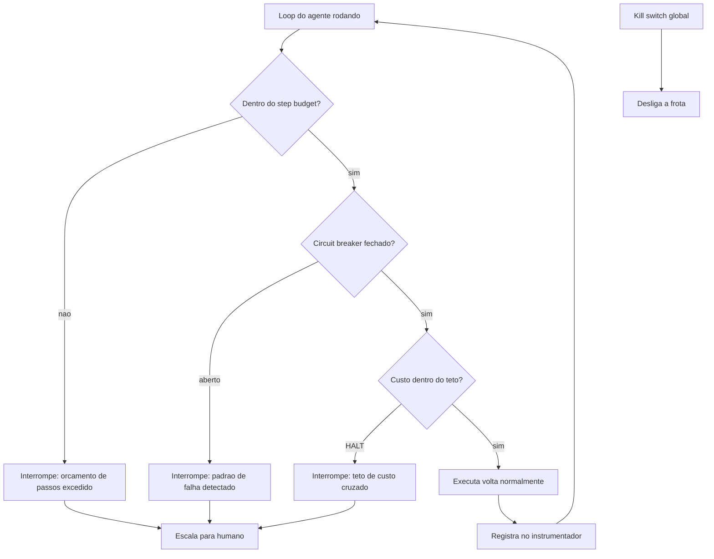

# Capítulo 9: Contenção — step budgets, circuit breakers e kill switches

## 1. Introdução

Você construiu o harness, instrumentou o loop e aprendeu a julgá-lo com evals. Agora vem a parte que impede o descarrilamento *antes* de ele acontecer: a contenção. Você vai aprender as três válvulas de segurança do harness — o step budget, que limita o número de voltas do loop; os circuit breakers, que interrompem padrões de falha repetida e estouros de custo; e os kill switches, que desligam a locomotiva inteira quando necessário. Ao final, você vai implementar o sistema de contenção completo que detecta, interrompe e escala — a resposta operacional aos quatro modos de descarrilamento do Capítulo 1.

## 2. Explica

### A contenção como engenharia de limites

Autonomia sem limites não é autonomia — é acidente em câmera lenta. O agente que decide, a cada volta, continuar ou parar, precisa de limites que *não* dependem da decisão dele: o harness impõe o teto, e o agente opera dentro dele [1]. Essa é a arquitetura mental da contenção: o modelo propõe, o harness dispõe — a liberdade do agente termina onde a via férrea começa.

A contenção atua em três níveis, cada um com granularidade própria. O **nível de volta** limita a execução corrente — quantos passos, quantos tokens, quanto tempo por tarefa. O **nível de sessão** limita o acúmulo — quanto custo total, quantas falhas repetidas. O **nível de frota** limita o conjunto — o orçamento agregado, o desligamento de emergência de todos os agentes [2]. O harness maduro tem os três, com prioridades claras: a válvula de volta protege a tarefa, a de sessão protege o dia, a de frota protege a empresa.

### Step budget: o teto de iterações

O **step budget** é a válvula mais simples e mais fundamental: um teto rígido no número de voltas do loop, nas chamadas de ferramenta ou no tempo total de execução por tarefa [3]. Sua função é dupla: impede o loop infinito mecanicamente (não importa o que o modelo decida, a execução para no passo N) e limita o custo (cada volta tem um teto de tokens, logo o custo máximo por tarefa é conhecido de antemão).

O design do step budget exige duas decisões. Primeiro, o **valor do teto**: alto o bastante para tarefas legítimas longas, baixo o bastante para conter o descarrilamento — e, crucialmente, baseado em dados (a distribuição real de passos por tarefa dos seus evals, não um chute). Segundo, o **comportamento no estouro**: parar e falhar, ou parar e escalar para humano — a resposta correta depende do custo da falha versus o custo da interrupção [3].

### Circuit breakers: a válvula que aprende

O **circuit breaker** é a válvula que detecta padrões, não apenas limites: se o mesmo erro se repete N vezes, se a taxa de sucesso de uma ferramenta despenca, se o custo acumulado cruza o teto — o circuito abre, interrompe o padrão e alerta [4]. Ele existe porque o step budget só limita quantidade; o circuit breaker limita *qualidade*: um loop que gira dentro do orçamento de passos, mas com zero progresso (as rodas no ar do Capítulo 2), não estoura o budget — estoura o circuit breaker.

A arquitetura de um circuit breaker tem três estados: **fechado** (normal, tudo passa), **aberto** (falha detectada, execução bloqueada) e **meio-aberto** (período de teste: deixa passar algumas execuções para ver se a falha passou) [4]. A transição fechado→aberto acontece quando o limiar de falha é cruzado; aberto→meio-aberto após um período de espera; meio-aberto→fechado quando as execuções de teste passam. É a mesma arquitetura dos circuit breakers clássicos de microserviços, adaptada ao loop do agente [5].

### Tetos de custo e doom spirals

O terceiro componente da contenção é o **teto de custo**: o orçamento máximo em tokens (ou dólares) por tarefa, sessão ou período, com níveis de alerta (WARN) e interrupção (HALT) [6]. A Oracle, na sua discussão de guardrails de runtime para agentic AI, descreve exatamente essa governança de custo: políticas em tempo de execução, circuit breakers de custo e modos de segurança restritos — o sistema que desliga automaticamente quando o orçamento ameaça estourar [6].

O teto de custo é a resposta direta ao **doom spiral**: o ciclo de retentativa que se realimenta, em que cada falha gera outra tentativa que falha, queimando tokens a cada volta [7]. O doom spiral não é um loop infinito clássico — o agente está "tentando coisas diferentes" — mas o efeito é o mesmo: custo crescente sem progresso. A contenção que o pega é a combinação: step budget (limite de voltas), circuit breaker (limite de erros idênticos) e teto de custo (limite de tokens) — três válvulas que se reforçam.

### Kill switches: a última estação

A última válvula é o **kill switch**: o desligamento de emergência do agente — ou da frota inteira — quando o comportamento anômalo escapa das válvulas anteriores [2]. O kill switch é a admissão honesta de que a contenção automática não é perfeita: pode haver um padrão de falha que nenhuma heurística previu, e nesse caso a resposta certa é parar tudo e investigar, não continuar "monitorando".

O design do kill switch tem duas propriedades: **imediato** (um sinal, uma flag, uma chamada de API — não um pipeline de aprovação) e **reversível** (desligar não é deletar: o estado e o transcript são preservados para investigação) [2]. A decisão de quem pode acionar o kill switch — e com que justificativa — é parte da governança do Capítulo 11; aqui, o essencial é a mecânica: a válvula de emergência existe, é acessível e funciona.

## 3. Ilustra

### As válvulas de emergência da locomotiva

Voltemos à locomotiva, agora na descida íngreme da serra. O maquinista tem três válvulas de emergência. A primeira é o **limitador de velocidade** (o step budget): não importa quanto o maquinista abra o acelerador, a locomotiva não passa da velocidade configurada — é um teto mecânico, não um pedido. A segunda é o **freio de emergência automático** (o circuit breaker): se o sistema detecta que as rodas estão girando no ar — o trem acelerando sem avançar — o freio aciona sozinho, sem depender da decisão do maquinista. A terceira é o **corte geral de energia** (o kill switch): se o maquinista ou a central percebe que algo está fundamentalmente errado, um único botão desliga a locomotiva inteira — preservando o estado para investigação.



Como Engenheiro de Plataforma, você reconhece o princípio da contenção em qualquer sistema confiável: o controle não depende da obediência do operador — depende da mecânica. O acelerador pode estar no máximo, mas o limitador impede a velocidade; a decisão do maquinista é livre dentro do envelope, e o envelope é imposto pela máquina. É exatamente essa a relação que o harness deve ter com o agente.

### A dupla camada: contenção não é castigo, é envelope de liberdade

O ponto contraintuitivo que merece uma segunda analogia: **o limite é o que torna a autonomia possível — não o que a impede**. O maquinista só pode dirigir com segurança porque existe o limitador: ele sabe que não vai se matar na descida, então pode se concentrar na condução. Um agente sem step budget não é "mais livre" — é mais perigoso, e o operador, sabendo disso, vai micro-gerir cada passo, anulando a autonomia.

A contenção é o contrato de confiança: o operador concede autonomia *porque* o envelope limita o estrago máximo. Com step budget, o custo máximo por tarefa é conhecido; com circuit breaker, o padrão de falha tem fim; com kill switch, o desastre tem limite. É essa previsibilidade que permite à organização deixar o agente trabalhar sozinho — a mesma lógica pela qual a ferrovia deixa o trem correr: porque a via, os sinais e as válvulas estão lá.

## 4. Técnica

### Implementando o sistema de contenção em três válvulas

A técnica central deste capítulo é o sistema de contenção completo: step budget, circuit breaker e teto de custo integrados ao loop, com escalação para humano. A implementação abaixo é a peça que fecha a lacuna deixada pelo harness mínimo do Capítulo 1 — as três válvulas em código:

```python
"""Sistema de contencao do harness: step budget, circuit breaker, custo.

As tres valvulas protegem o loop: limite de passos (quantidade), padrao
de falha (qualidade) e teto de custo (orçamento).
"""
import time
from dataclasses import dataclass, field
from enum import Enum, auto
from typing import Callable, List, Optional


class EstadoBreaker(Enum):
    """Estados do circuit breaker."""
    FECHADO = auto()
    ABERTO = auto()
    MEIO_ABERTO = auto()


@dataclass
class PoliticaContencao:
    """Parametros de contencao do harness."""
    max_passos: int = 30
    max_erros_identicos: int = 4
    max_custo_tokens: int = 50_000
    tempo_espera_breaker_s: float = 60.0
    escalar: Optional[Callable[[str], None]] = None


@dataclass
class Veredito:
    """Desfecho da execucao sob contencao."""
    status: str  # "SUCESSO" | "BUDGET" | "BREAKER" | "CUSTO" | "KILL"
    passos: int
    custo_tokens: int
    detalhe: str = ""


class Contencao:
    """Integra as tres valvulas ao loop do agente."""

    def __init__(self, politica: PoliticaContencao) -> None:
        self.politica = politica
        self.passos = 0
        self.custo = 0
        self.ultimo_erro: Optional[str] = None
        self.erros_identicos = 0
        self.estado_breaker = EstadoBreaker.FECHADO
        self._abriu_em = 0.0

    def registrar_passo(self, erro: str = "") -> None:
        """Registra uma volta do loop e atualiza as valvulas."""
        self.passos += 1
        if erro == self.ultimo_erro and erro:
            self.erros_identicos += 1
        else:
            self.erros_identicos = 0 if erro else self.erros_identicos
            if erro:
                self.erros_identicos = 1
        self.ultimo_erro = erro or self.ultimo_erro
        if self.erros_identicos >= self.politica.max_erros_identicos:
            self._abrir_breaker()

    def registrar_custo(self, tokens: int) -> None:
        """Acumula custo e cruza o teto se necessario."""
        self.custo += tokens
        if self.custo >= self.politica.max_custo_tokens:
            self._abrir_breaker()

    def _abrir_breaker(self) -> None:
        if self.estado_breaker is EstadoBreaker.FECHADO:
            self.estado_breaker = EstadoBreaker.ABERTO
            self._abriu_em = time.time()
            if self.politica.escalar:
                self.politica.escalar(
                    f"breaker aberto: {self.erros_identicos} erros identicos, "
                    f"{self.custo} tokens"
                )

    def _tentar_fechar(self) -> None:
        """Transicao aberto -> meio-aberto apos o tempo de espera."""
        if self.estado_breaker is EstadoBreaker.ABERTO:
            if time.time() - self._abriu_em >= self.politica.tempo_espera_breaker_s:
                self.estado_breaker = EstadoBreaker.MEIO_ABERTO

    def passo_permitido(self) -> bool:
        """Decide se uma nova volta do loop pode executar."""
        self._tentar_fechar()
        if self.estado_breaker is EstadoBreaker.ABERTO:
            return False
        if self.passos >= self.politica.max_passos:
            return False
        if self.custo >= self.politica.max_custo_tokens:
            return False
        return True

    def veredito(self) -> Veredito:
        """Monta o desfecho com a valvula que interrompeu."""
        if self.estado_breaker is EstadoBreaker.ABERTO:
            return Veredito("BREAKER", self.passos, self.custo, "breaker aberto")
        if self.passos >= self.politica.max_passos:
            return Veredito("BUDGET", self.passos, self.custo, "step budget excedido")
        if self.custo >= self.politica.max_custo_tokens:
            return Veredito("CUSTO", self.passos, self.custo, "teto de custo cruzado")
        return Veredito("SUCESSO", self.passos, self.custo, "")


def exemplo_uso() -> None:
    """Demo: loop com erro identico abre o breaker."""
    politica = PoliticaContencao(
        max_passos=10,
        max_erros_identicos=3,
        escalar=lambda msg: print(f"[escalado] {msg}"),
    )
    conten = Contencao(politica)
    while conten.passo_permitido():
        conten.registrar_passo(erro="json invalido")
        conten.registrar_custo(1000)
    print(conten.veredito())


if __name__ == "__main__":
    exemplo_uso()
```

O sistema entrega as três válvulas com comportamento determinístico: **step budget** (o teto de passos mecânico), **circuit breaker** (erros idênticos abrem o circuito e escalam) e **teto de custo** (o acúmulo de tokens cruza o HALT). O loop pode decidir o que quiser — o harness decide quando parar.

### O kill switch de frota

O segundo componente é o kill switch global: o botão de emergência que desliga agentes em massa, preservando estado para investigação [2]:

```python
"""Kill switch de frota: desligamento de emergencia com preservacao de estado."""
from dataclasses import dataclass, field
from typing import Dict, List


@dataclass
class AgenteRegistrado:
    """Registro de um agente da frota sob gestao do kill switch."""
    nome: str
    ativo: bool = True
    estado_preservado: Dict[str, object] = field(default_factory=dict)


class Frota:
    """Gerencia agentes e o desligamento de emergencia."""

    def __init__(self) -> None:
        self.agentes: Dict[str, AgenteRegistrado] = {}

    def registrar(self, nome: str, estado: Dict[str, object]) -> None:
        self.agentes[nome] = AgenteRegistrado(nome, True, estado)

    def kill(self, motivo: str, nomes: Optional[List[str]] = None) -> List[str]:
        """Desliga agentes (ou a frota toda), preservando o estado."""
        alvo = nomes or list(self.agentes.keys())
        desligados: List[str] = []
        for nome in alvo:
            agente = self.agentes.get(nome)
            if agente and agente.ativo:
                agente.ativo = False
                agente.estado_preservado["motivo_kill"] = motivo
                desligados.append(nome)
        return desligados

    def religar(self, nome: str) -> bool:
        """Religa um agente desligado, mantendo o estado preservado."""
        agente = self.agentes.get(nome)
        if agente is None:
            return False
        agente.ativo = True
        return True

    def ativos(self) -> List[str]:
        return [n for n, a in self.agentes.items() if a.ativo]


def exemplo_kill() -> None:
    """Demo: kill switch global desliga a frota."""
    frota = Frota()
    frota.registrar("pesquisador", {"sessao": "s-1"})
    frota.registrar("relatorios", {"sessao": "s-2"})
    desligados = frota.kill("comportamento anomalo na frota")
    print("desligados:", desligados)
    print("ativos restantes:", frota.ativos())
    frota.religar("pesquisador")
    print("apos religar:", frota.ativos())


if __name__ == "__main__":
    exemplo_kill()
```

O kill switch é a admissão honesta de que a contenção automática tem limites: quando o inesperado acontece, um botão desliga tudo — e o estado preservado garante que a investigação (e o religamento) sejam possíveis.

### Integrando contenção ao loop com escalação

O terceiro componente amarra a contenção ao loop do Capítulo 2: o executor que roda o ciclo sob as válvulas e escala para humano quando necessário:

```python
"""Executor de loop sob contencao com escalacao para humano."""
from typing import Callable, Optional


def rodar_com_contencao(
    agir: Callable[[int], str],
    observar: Callable[[str], str],
    conten: "Contencao",
    limite_rodadas: int = 100,
) -> dict:
    """Executa o loop respeitando as valvulas de contencao."""
    rodada = 0
    while conten.passo_permitido() and rodada < limite_rodadas:
        acao = agir(rodada)
        observacao = observar(acao)
        erro = "" if "CONCLUIDO" in observacao or "OK" in observacao else observacao
        conten.registrar_passo(erro=erro)
        conten.registrar_custo(1000)
        if "CONCLUIDO" in observacao:
            return {"status": "SUCESSO", "rodadas": rodada + 1}
        rodada += 1
    veredito = conten.veredito()
    if veredito.status != "SUCESSO" and conten.politica.escalar:
        conten.politica.escalar(f"tarefa escalada: {veredito.detalhe}")
    return {
        "status": veredito.status,
        "rodadas": rodada + 1,
        "detalhe": veredito.detalhe,
    }
```

O executor é a integração final: o agente age livremente dentro do envelope, e qualquer estouro de válvula — budget, breaker ou custo — resulta em interrupção com escalação registrada. A autonomia, agora, tem trilhos.

## 5. Aplica

### Cena de contraste: o cron que ninguém conseguia derrubar

Você é o engenheiro de plataforma, e o alerta de custo de sábado à noite mostra o agente de enriquecimento de dados queimando US$ 1.200/hora — há 3 horas. O agente está preso em um doom spiral: a ferramenta de geocodificação está fora do ar (uma API de terceiros caiu), e o agente, a cada volta, tenta geocodificar de novo, recebe o mesmo erro, decide "tentar com outra variação", e repete. O step budget foi configurado com 200 passos ("para tarefas longas legítimas"), então o loop tem espaço para girar; o erro de cada volta é levemente diferente (a mensagem da API varia com o endpoint), então o detector de erros idênticos não dispara.

O erro que você cometeria seguindo o instinto: "o problema é a API de terceiros" — e você esperaria a API voltar. O diagnóstico deste capítulo: o problema é a contenção mal calibrada — o step budget é alto demais para o cenário, o detector de erros idênticos é cego a variações cosméticas, e não há teto de custo por sessão [6]. O doom spiral roda dentro de todas as válvulas, porque cada válvula olha para uma coisa diferente.

A correção tem três movimentos. Primeiro, **adicione o teto de custo por sessão**: US$ 50 por execução, com HALT automático — o doom spiral morre na primeira hora, não na terceira [6]. Segundo, **normalize o detector de erros**: em vez de comparar mensagens exatas, compare o *tipo* de erro — "geocoding falhou" cai numa classe, e 4 falhas da mesma classe abrem o breaker, mesmo com mensagens diferentes. Terceiro, **recalibre o step budget com dados**: a distribuição real de passos dos evals mostra que 95% das tarefas legítimas terminam em 20 passos — o teto de 200 era um palpite, não uma medida [3]. Com as três correções, o descarrilamento de sábado vira um alerta de quinta-feira, resolvido em minutos.

### A calibração das válvulas: por que os limiares importam

A contenção é tão boa quanto os seus limiares — e a calibração é uma disciplina que a literatura de governança trata como parte do ciclo de vida, não como configuração única [8]. Cada válvula tem um limiar, e cada limiar tem um erro de dois lados: o limiar apertado demais interrompe tarefas legítimas (falso positivo — escalação desnecessária), o limiar frouxo demais deixa o descarrilamento rodar (falso negativo — custo e caos) [8].

A calibração correta segue a mesma lógica dos evals do Capítulo 8: **os limiares vêm da distribuição real, não do palpite**. O step budget se calibra com o histograma de passos por tarefa dos seus logs: se 95% das tarefas legítimas terminam em 20 passos, o teto de 30 dá folga com contenção. O detector de erros idênticos se calibra com a frequência real de erros transitórios: se a API externa falha 1% das vezes com mensagens variadas, o limite de 3 erros da mesma *classe* captura o doom spiral sem disparar em falha pontual [3]. O teto de custo se calibra com o orçamento real da organização: o HALT por sessão e o HALT por período são níveis diferentes, e o WARN deve disparar antes do HALT — o alerta é o que dá tempo de agir [6].

A regra prática é registrar a decisão de calibração: cada limiar com a distribuição que o justifica, revisado a cada mudança de tarefa, modelo ou provedor. É a mesma disciplina do model pinning do Capítulo 11: o que não é medido não pode ser calibrado — e o que não é calibrado ou interrompe demais ou contém de menos [8].

### O caso de fronteira: contenção em múltiplas tarefas concorrentes

Há um cenário que estressa as válvulas de forma nova: a concorrência [14]. Quando o harness roda cinquenta tarefas em paralelo — cada uma com seu step budget individual — a soma dos tetos pode estourar o orçamento agregado da organização sem que nenhuma tarefa individual viole o seu. A contenção precisa de um quarto nível: o **orçamento agregado**, o teto sobre o conjunto, que o Capítulo 6 antecipou no nível de sessão [14].

Na prática, isso significa um contador global: cada passo de cada tarefa concorrente decrementa o orçamento compartilhado, e quando o agregado cruza o limiar, o harness reduz a concorrência — pausa tarefas não críticas, escalona as críticas e impede novas inscrições [14]. O trade-off é de prioridade: a tarefa de auditoria regulatória não pode ser pausada pela tempestade de tarefas de baixa prioridade — e a política de prioridade é parte da governança do Capítulo 11. A lição deste capítulo permanece: as válvulas protegem níveis diferentes — a válvula individual protege a tarefa, a agregada protege a organização — e o harness maduro tem as duas [8].

### Armadilhas comuns

- **Step budget como palpite**: teto sem dados de distribuição de passos ou é alto demais (não contém) ou baixo demais (interrompe legítimos). Calibre com os evals [3].
- **Detector de erro literal**: comparar mensagens exatas é cego a variações cosméticas — normalize por tipo de erro.
- **Sem teto de custo**: o budget limita passos, não dólares. O teto de custo é a válvula que protege a fatura [6].
- **Kill switch sem estado preservado**: desligar sem preservar transcript destrói a investigação — e o religamento vira recomeço do zero [2].

### O caderno de decisões do capítulo

Três decisões deste capítulo definem a contenção como contrato de confiança [8]. Primeira: **a contenção é o envelope que torna a autonomia possível** — o operador concede liberdade porque o estrago máximo é limitado mecanicamente, e a previsibilidade do teto é o que permite à organização deixar o agente trabalhar sozinho [1]. Segunda: **os limiares vêm dos dados, não do palpite** — step budget, detector de erros e teto de custo são calibrados com a distribuição real de passos, erros e custo dos logs, e a decisão de calibração é registrada e revisada [3]. Terceira: **a contenção protege em níveis** — a válvula individual protege a tarefa, a agregada protege a organização, e o kill switch é a admissão honesta de que o inesperado acontece [8].

A aplicação imediata é a auditoria de válvulas: para o agente mais caro, listar quais válvulas existem hoje (budget? detector? teto de custo? kill switch?), qual o custo máximo possível de uma tarefa descontrolada e qual a distribuição real de passos que calibra o teto. A auditoria costuma revelar que a maioria dos agentes em produção tem uma única válvula — o bom senso do modelo [6].

### Métricas de sucesso

Três métricas medem a contenção: **tempo até interrupção** (de horas para minutos quando as válvulas estão calibradas), **custo máximo por tarefa** (o teto real, não o esperado) e **taxa de escalação falsa** (tarefas legítimas interrompidas por engano — deve ficar baixa com budget calibrado por dados) [6] — com o orçamento agregado garantindo que a soma das tarefas não estoure o teto da organização [14].

## 6. Conclusão

Você aprendeu que a contenção é a engenharia de limites que torna a autonomia possível — o envelope mecânico dentro do qual o agente é livre — e dominou as três válvulas: step budget (quantidade), circuit breaker (qualidade) e teto de custo (orçamento), além do kill switch como última estação. Você implementou o sistema de contenção integrado, o kill switch de frota com preservação de estado e o executor com escalação. O desafio: audite a contenção do seu agente mais caro — qual válvula está faltando, qual está mal calibrada, qual seria o custo máximo de uma tarefa hoje? Depois me diga quantas válvulas você ajustou com dados dos evals. No Capítulo 10, vamos à durabilidade: execução durável, replay determinístico e aprovação humana — a contenção que atravessa crashes e reinícios.

## 7. Referências Bibliográficas

[1] FOUNTAIN CITY. *AI agent governance: a practitioner's guide*. Disponível em: https://fountaincity.tech/resources/blog/ai-agent-governance-practitioners-guide/. Acesso em: 06 ago. 2026.
[2] FOUNTAIN CITY. *AI agent governance: kill switches and anti-loop protection*. Disponível em: https://fountaincity.tech/resources/blog/ai-agent-governance-practitioners-guide/. Acesso em: 06 ago. 2026.
[3] ORACLE AI & DATA SCIENCE. *Runtime budget guardrails for agentic AI*. Disponível em: https://blogs.oracle.com/ai-and-datascience/runtime-budget-guardrails-agentic-ai. Acesso em: 06 ago. 2026.
[4] FOUNTAIN CITY. *AI agent governance: circuit breakers and doom spirals*. Disponível em: https://fountaincity.tech/resources/blog/ai-agent-governance-practitioners-guide/. Acesso em: 06 ago. 2026.
[5] ZYLOS RESEARCH. *Durable execution for AI agent runtimes: checkpointing, replay, and recovery*. Disponível em: https://zylos.ai/research/2026-04-24-durable-execution-agent-runtimes/. Acesso em: 06 ago. 2026.
[6] ORACLE AI & DATA SCIENCE. *Runtime budget guardrails: cost circuit breakers*. Disponível em: https://blogs.oracle.com/ai-and-datascience/runtime-budget-guardrails-agentic-ai. Acesso em: 06 ago. 2026.
[7] ANTHROPIC. *Demystifying evals for AI agents*. Disponível em: https://www.anthropic.com/engineering/demystifying-evals-for-ai-agents. Acesso em: 06 ago. 2026.
[8] TEMPORAL TECHNOLOGIES. *Durable multi-agentic AI architecture with Temporal*. Disponível em: https://temporal.io/blog/using-multi-agent-architectures-with-temporal. Acesso em: 06 ago. 2026.
[9] ANTHROPIC. *Building effective agents*. Disponível em: https://www.anthropic.com/engineering/building-effective-agents. Acesso em: 06 ago. 2026.
[10] EXPANSO. *AI agent observability: best practices in 2026*. Disponível em: https://expanso.io/blog/ai-agent-observability-best-practices/. Acesso em: 06 ago. 2026.
[11] NEWTON-KING, James. *Inside the LLM call: GenAI observability with OpenTelemetry*. Disponível em: https://opentelemetry.io/blog/2026/genai-observability/. Acesso em: 06 ago. 2026.
[12] OWASP FOUNDATION. *OWASP Top 10 for agentic applications*. Disponível em: https://genai.owasp.org/resource/owasp-top-10-for-agentic-applications-for-2026/. Acesso em: 06 ago. 2026.
[13] RUNKLE, Sydney. *Choosing the right multi-agent architecture*. Disponível em: https://www.langchain.com/blog/choosing-the-right-multi-agent-architecture. Acesso em: 06 ago. 2026.
[14] ANTHROPIC. *Effective context engineering for AI agents*. Disponível em: https://www.anthropic.com/engineering/effective-context-engineering-for-ai-agents. Acesso em: 06 ago. 2026.
[15] DANTRA, Ruskin et al. *Orchestrating intelligent agents at scale: how AgentCore and Temporal create robust AI systems*. Disponível em: https://aws.amazon.com/blogs/apn/how-temporal-uses-amazon-bedrock-agentcore-to-create-robust-ai-systems/. Acesso em: 06 ago. 2026.
[16] MICROSOFT. *Architecting trust: a NIST-based security governance framework for AI agents*. Disponível em: https://techcommunity.microsoft.com/blog/microsoftdefendercloudblog/architecting-trust-a-nist-based-security-governance-framework-for-ai-agents/4490556. Acesso em: 06 ago. 2026.
[17] HANCOCK, Parker. *When AI agents misbehave: governance and security for autonomous AI*. Disponível em: https://ourtake.bakerbotts.com/post/102me2l/when-ai-agents-misbehave-governance-and-security-for-autonomous-ai. Acesso em: 06 ago. 2026.
[18] ANTHROPIC. *Model Context Protocol: specification and documentation*. Disponível em: https://modelcontextprotocol.io/. Acesso em: 06 ago. 2026.
[19] OPENAI. *OpenAI Agents SDK: agents with constraints and limits*. Disponível em: https://openai.github.io/openai-agents-python/. Acesso em: 06 ago. 2026.
[20] LIU, Jerry. *Building performant agentic RAG and context systems*. Disponível em: https://www.llamaindex.ai/blog. Acesso em: 06 ago. 2026.
