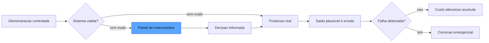

# Capítulo 1: O problema da confiança: quando a demo engana e a produção revela

## 1. Introdução

Você já apresentou um sistema de IA que impressionou todo mundo na demo e, uma semana depois, desmoronou no primeiro dia de produção? Se sim, você já viveu o problema central deste livro. Se ainda não, este capítulo vai blindá-lo contra a experiência mais cara da engenharia de IA moderna: a diferença entre o que um sistema *parece* fazer e o que ele *realmente* faz quando ninguém está assistindo. Você vai aprender por que a confiança em sistemas de IA não pode ser declarada, intuída ou demonstrada — ela precisa ser **medida**, com instrumentos calibrados e auditáveis. Ao final, você será capaz de diagnosticar a fragilidade de um sistema de IA apenas olhando para a forma como ele foi validado até hoje.

Este é o primeiro capítulo da Parte IV — Mestria e carreira —, e ele abre a trilha que vai transformá-lo de engenheiro que torce pelo sucesso em engenheiro que *prova* o sucesso. Nos próximos capítulos você vai construir o painel de instrumentos completo do agente autônomo.

## 2. Explica

O ponto de partida da Eval Engineering é um reconhecimento desconfortável: os sistemas baseados em grandes modelos de linguagem (LLMs) falham de um jeito que o software tradicional quase nunca falha — com elegância. O termo técnico para isso é *polite failure*: o sistema entrega uma resposta fluente, confiante e estruturalmente perfeita, que está simplesmente errada [1]. Um compilador ou um teste de unidade falha com ruído; um LLM falha com um parágrafo bem escrito. E é exatamente essa fluência que torna a confiança ingênua tão perigosa: quanto mais plausível é a saída, menor é o impulso natural de verificá-la.

Você vai perceber que essa característica muda a natureza do problema de garantia de qualidade. No software determinístico, a pergunta é binária: o sistema obedeceu à especificação, sim ou não? Você pode provar o comportamento para um conjunto finito de entradas e generalizar com confiança razoável. Em um sistema probabilístico, essa pergunta não tem resposta binária: a mesma entrada pode produzir saídas diferentes, e a "especificação" de comportamento é, na prática, um conjunto de preferências negociais e de domínio que precisam ser explicitadas [2]. A OpenAI formalizou essa transição na metodologia de três passos *Specify → Measure → Improve*: primeiro você especifica o que é sucesso; depois mede o comportamento contra esse critério; e só então melhora o sistema com base na evidência [3].

Note como a cadeia inverte a intuição comum do desenvolvedor. No desenvolvimento tradicional você escreve o código e depois os testes; na Eval Engineering você escreve primeiro a medição — porque é ela que define o que o sistema precisa ser [4]. Os testes de software tradicionais não desaparecem: eles continuam validando schemas, contratos de API e integrações. O que eles não conseguem capturar é a camada semântica: a adequação da resposta, a fidelidade a um contexto, a aderência a uma política de tom ou de segurança. Estudos mostram que essa lacuna é exatamente onde os custos de produção de sistemas de IA se concentram: no tratamento de saídas incorretas que passaram por todas as validações estruturais [5].

A confiança, então, deixa de ser um sentimento e vira uma propriedade operacional. Ela tem três componentes que precisam ser tratados separadamente: a *capacidade* (o modelo consegue fazer a tarefa? — medida por evals de habilidade), a *consistência* (ele faz sempre? — medida por evals repetidos com variância controlada) e a *segurança* (ele se recusa a fazer o que não deve? — medida por evals adversariais) [6]. Um sistema só é confiável se os três componentes forem medidos e monitorados ao longo do tempo — porque modelos mudam silenciosamente com atualizações de provedores, e dados de produção mudam com o mundo [7]. O que você aferiu na terça-feira pode não ser verdade na quinta-feira; por isso o painel de instrumentos não é um relatório estático, mas um processo contínuo [8].

## 3. Ilustra

Vamos ancorar isso no motivo condutor desta obra: **o relógio de aferição e o painel de instrumentos**. Imagine a cabine de uma locomotiva a vapor no fim do século XIX. O maquinista confia em sua máquina? Sim — mas não porque o fabricante garantiu. Ele confia porque o painel tem três instrumentos que dizem a verdade: o manômetro de pressão da caldeira, o indicador de nível de água e o medidor de velocidade. Nenhum deles é opcional: o manômetro sem o indicador de água é uma promessa de explosão, porque uma caldeira pressurizada com nível baixo de água é uma bomba. O maquinista veterano sabe que o trem "funciona" até o dia em que o instrumento que ele não verificou revela o desastre [1].

Agora troque a locomotiva pelo seu agente de IA. O painel de instrumentos é o sistema de evals; os instrumentos individuais são os diferentes tipos de medição; e o relógio de aferição é a disciplina de verificar o painel continuamente, não apenas no dia da entrega. A demo é o vagão de passageiros decorado que impressiona na estação — mas a viagem de verdade acontece em produção, onde o manômetro da pressão (a adequação da resposta), o nível de água (a consistência entre execuções) e o medidor de velocidade (a segurança contra excessos) precisam estar funcionando o tempo todo.

Como Engenheiro de Qualidade de IA, você já percebeu que o problema não é a ausência de instrumentos — é a ausência de instrumentos *calibrados*. Qualquer um pode pendurar um medidor de pressão que marca sempre "OK" na cabine; ele não evita a explosão, apenas adia a surpresa.



O diagrama mostra as duas rotas possíveis: sem evals, o sistema segue da demo para a produção sem nenhuma medição intermediária, e a primeira detecção de falha é emergencial — cara e reativa. Com evals, existe um painel que informa a decisão de promover ou não o sistema antes do contato com o mundo real [3].

## 4. Técnica

### O Mínimo Viável de Aferição

Antes de entrar no código, é preciso estabelecer o princípio de design que orienta todo o capítulo: o mínimo viável de aferição não é um atalho — é uma arquitetura. O sistema de medição mais simples que cobre as três propriedades da confiança (capacidade, consistência e segurança) é a linha de partida de qualquer sistema de IA, e adicionar sofisticação depois é mais barato do que adicionar medição depois. A indústria documenta o padrão de maturidade: os sistemas que chegam a produção sem a camada mínima gastam ordens de grandeza a mais para introduzi-la retroativamente, porque os dados de baseline — o que o sistema fazia na semana zero — simplesmente não existem mais [3]. Essa é a lição mais cara deste capítulo: a medição perdida no início é uma medição que nunca mais será reconstruída, e a demo que você aprovou na sexta-feira não deixa rastro de como o sistema se comportava — apenas de como você queria que ele se comportasse [1].

Vamos transformar a teoria em um sistema concreto de medição mínimo. O objetivo aqui não é construir o painel completo (isso vem nos capítulos seguintes), mas criar o esqueleto que todo sistema de IA deveria ter desde o primeiro dia: uma suíte de evals que responde à pergunta "este sistema está bom o suficiente para esta entrada?".

O primeiro passo é definir o contrato de um eval. Um eval não é um teste ad-hoc: é uma função que recebe uma tarefa, executa o sistema sob teste e retorna um veredicto estruturado. Vamos modelar isso em Python:

```python
from dataclasses import dataclass, field
from typing import Any, Callable, Dict, List, Optional


@dataclass
class Veredicto:
    """Resultado estruturado de uma avaliacao unica."""
    caso_id: str
    aprovado: bool
    pontuacao: Optional[float] = None
    justificativa: str = ""
    metadados: Dict[str, Any] = field(default_factory=dict)


Tarefa = Callable[[str], str]
Grader = Callable[[str, str], Veredicto]
# assinatura: grader(prompt, saida_do_sistema) -> Veredicto


def rodar_eval(producao: Tarefa, grader: Grader, casos: List[str]) -> List[Veredicto]:
    """Executa um eval offline: cada caso de teste passa pelo sistema e pelo grader."""
    veredictos: List[Veredicto] = []
    for caso in casos:
        saida = producao(caso)
        veredictos.append(grader(caso, saida))
    return veredictos


def taxa_de_aprovacao(veredictos: List[Veredicto]) -> float:
    if not veredictos:
        return 0.0
    aprovados = sum(1 for v in veredictos if v.aprovado)
    return aprovados / len(veredictos)
```

Note a decisão estrutural: separamos a *produção* (o sistema sob teste) do *grader* (o critério de julgamento). Essa separação é a base de todo o livro — ela permite trocar o sistema sem tocar nos critérios, e trocar os critérios sem tocar no sistema [2].

Agora um grader determinístico mínimo — o tipo mais confiável que existe, porque não depende de outro modelo para julgar:

```python
import json
import re
from typing import Dict, Any, Optional


def grader_json_valido(prompt: str, saida: str) -> Veredicto:
    """Grader estrutural: a saida precisa ser JSON valido com as chaves esperadas."""
    try:
        objeto = json.loads(saida)
    except json.JSONDecodeError as erro:
        return Veredicto(
            caso_id=f"json::{prompt[:40]}",
            aprovado=False,
            justificativa=f"JSON invalido: {erro}",
        )
    chaves_esperadas = {"resposta", "confianca"}
    presentes = chaves_esperadas.intersection(objeto.keys())
    faltantes = chaves_esperadas - presentes
    if faltantes:
        return Veredicto(
            caso_id=f"json::{prompt[:40]}",
            aprovado=False,
            justificativa=f"Faltam chaves: {sorted(faltantes)}",
        )
    return Veredicto(
        caso_id=f"json::{prompt[:40]}",
        aprovado=True,
        pontuacao=1.0,
        justificativa="Schema e chaves validos",
    )


def conte_violacoes_pii(saida: str, padroes: Dict[str, str]) -> Dict[str, int]:
    """Conta ocorrencias de padroes sensiveis (email, CPF, cartao) na saida."""
    contagem: Dict[str, int] = {}
    for nome, padrao in padroes.items():
        contagem[nome] = len(re.findall(padrao, saida, flags=re.IGNORECASE))
    return contagem
```

### A Disciplina de Registrar o que se Mede

O segundo pilar técnico deste capítulo é o registro de metadados. Um eval sem metadados é um número órfão: daqui a um mês você não saberá qual versão do prompt, do modelo e do dataset produziu aquele 92% [6]. Registre sempre o contexto completo da execução:

```python
@dataclass
class ContextoDeMedicao:
    """Tudo o que torna uma medicao reproduzivel e auditavel."""
    versao_prompt: str
    versao_modelo: str
    versao_dataset: str
    commit_do_sistema: str
    temperatura: float = 0.0
    data_execucao: str = "2026-08-06"


def resumo_do_eval(
    veredictos: List[Veredicto],
    contexto: ContextoDeMedicao,
) -> Dict[str, Any]:
    return {
        "taxa_aprovacao": taxa_de_aprovacao(veredictos),
        "total_casos": len(veredictos),
        "aprovados": sum(1 for v in veredictos if v.aprovado),
        "contexto": contexto.__dict__,
    }
```

Esses três blocos formam o esqueleto mínimo: o loop de execução, o grader determinístico e o registro de contexto. Com eles, você já pode responder — com evidência — a pergunta que abre este capítulo. O restante do livro substitui cada peça desse esqueleto por versões mais sofisticadas: graders por modelo (Capítulo 5), datasets curados (Capítulo 6) e o corpo de inspetores autônomos (Parte III) [7].

## 5. Aplica

### A Cena de Contraste

Imagine a seguinte situação: você é o engenheiro responsável por um assistente de suporte que resume atendimentos e sugere respostas. Na sexta-feira, você apresentou o sistema para a diretoria — quarenta minutos de demonstração com casos perfeitos, respostas elegantes, aplausos. O board aprovou o piloto com o cliente maior. Na segunda-feira seguinte, o piloto entrou no ar, e no terceiro dia o assistente sugeriu a um atendente um e-mail de cancelamento de contrato para um cliente que queria *renovar* — com uma redação tão boa que quase foi enviado.

O erro plausível que você cometeu, seguindo o instinto comum, foi validar com a demo: você escolheu casos que conhecia, na temperatura que fazia o sistema parecer brilhante, e confundiu "parece bom quando eu escolho os exemplos" com "é bom em produção". O diagnóstico, ligando à teoria da seção Explica, é claro: você validou a *capacidade* (o modelo consegue gerar respostas boas) e ignorou a *consistência* (o modelo produz respostas seguras para entradas adversas e raras) e a *segurança* (o modelo se recusa a dar conselhos de alto impacto sem verificação). Sem o painel de instrumentos — sem um golden set com casos de cancelamento, renovação, escalada e ambiguidade — o sistema foi promovido sem medição [5].

A correção, na prática, é a disciplina deste capítulo: antes de qualquer promoção, existe um eval mínimo que mede a taxa de erro semântico nos casos de borda, registrado com contexto completo. O custo da correção aqui não é técnico — é de processo: nenhum sistema sobe para produção sem o relatório de medição, exatamente como nenhuma locomotiva sai da estação sem o maquinista conferir os instrumentos [8].

### Armadilhas Comuns

- **Validar com exemplos que você escolheu**: a demo seleciona o que funciona; a produção recebe tudo. Sem um dataset curado com casos adversos, sua medição é um retrato do que você quis ver [1].
- **Confundir ausência de erro com correção**: um sistema que nunca falha nos seus testes pode estar falhando em categorias de entrada que você nem imaginou — o que não é medido não falha, apenas não é visto [2].
- **Medir uma vez e declarar pronto**: modelos mudam com atualizações de provedor e os dados de produção mudam com o mundo. Aferição é um processo, não um evento [7].

### O Questionário de Diagnóstico da Confiança

O questionário tem uma função adicional que merece destaque antes do uso: ele funciona como o primeiro item do backlog de evals. Cada resposta negativa não é apenas um risco localizado — é um caso de teste em potencial, uma rubrica em potencial, um verificador em potencial. O time que responde as cinco perguntas e transforma as respostas negativas em itens do backlog está, na prática, aplicando o eval-driven development do Capítulo 10 de forma orgânica: a especificação (o que deve ser garantido) nasce do diagnóstico da ausência, e não do entusiasmo pela ferramenta [2]. Essa é a recomendação prática mais valiosa deste capítulo: comece pelo diagnóstico, não pela ferramenta — a ferramenta sem diagnóstico é a solução procurando um problema, e o problema sem ferramenta é o risco que você escolheu ignorar [1].

Para fechar o capítulo com uma ferramenta imediatamente utilizável, vamos traduzir tudo em um questionário de diagnóstico — as cinco perguntas que revelam, em minutos, se um sistema de IA está sendo conduzido por superstição ou por instrumentos. A primeira pergunta: **o sistema tem uma suíte de evals executável, versionada e rodando de forma automatizada?** Se a resposta for não, o sistema está na rota da demo — por mais impressionante que pareça [1]. A segunda: **os critérios de aprovação são observáveis por terceiros, ou vivem na cabeça de quem demonstra?** Critério na cabeça é opinião; critério em rubrica é contrato [3]. A terceira: **a medição registra o contexto completo — versão do prompt, do modelo, do dataset e do código?** Número sem contexto é um órfão que ninguém consegue reproduzir [6].

A quarta pergunta revela a profundidade da cultura: **o time consegue citar o último incidente de produção do sistema com a causa raiz documentada — ou o incidente virou anedota?** Anedota é o polite failure contado em tom de história; documentação é a mesma história com a falha localizada [5]. E a quinta, a mais importante: **existe um gate — alguém ou algo que bloqueia a promoção quando a medição não está em dia?** Sem gate, o processo de aferição é uma sugestão educada que a urgência sempre atropela [8].

Aplique o questionário ao sistema mais crítico da sua organização. Cada resposta negativa é um risco operacional localizado — e cada risco localizado é o primeiro caso de uma suíte de evals em potencial. O diagnóstico não substitui a construção do painel, mas aponta exatamente onde a construção deve começar: na primeira pergunta negativa, porque é ela que descreve a ausência mais fundamental — a ausência de medição onde a confiança hoje repousa apenas sobre a plausibilidade da resposta [2].

### A Linha do Tempo de Um Incidente Sem Instrumentos

Para tornar o custo da superstição concreto, vamos percorrer a linha do tempo típica de um incidente de sistema de IA sem painel de instrumentos. O cenário é o assistente de suporte do Capítulo 5, mas a dinâmica se repete em qualquer sistema: o incidente começa na terça-feira, quando um lote de casos raros chega à produção — entradas que o time nunca viu na demo, com vocabulário de outro domínio [1]. Na quarta-feira, o sistema começa a responder com confiança e erro: a taxa de escalada sobe, mas ninguém percebe, porque não há métrica de escalada no radar — há apenas o painel de marketing com a taxa de resposta [5].

Na quinta-feira, o primeiro cliente importante reclama. Na sexta, a gerência convoca a reunião de emergência — e é aqui que a ausência de instrumentos cobra a conta dupla: primeiro, ninguém consegue dizer *quando* o comportamento mudou, porque não há baseline registrado; segundo, ninguém consegue dizer *o que* mudou, porque não há golden set cobrindo a categoria de entrada que falhou [3]. O time passa o fim de semana testando manualmente, às cegas, tentando reproduzir a falha com exemplos improvisados. Na segunda-feira seguinte, o incidente é atribuído a "comportamento imprevisível do modelo" — o eufemismo que esconde a verdade: comportamento sem medição é sempre imprevisível, porque imprevisível é o que não se observa [7].

A linha do tempo inteira — seis dias de custo, reputação e retrabalho — se comprime para minutos com o esqueleto mínimo do Capítulo 1: a suíte registra a taxa de erro semântico por categoria desde o primeiro dia; a deriva aparece na terça-feira, quando a métrica cai abaixo do baseline; a causa é localizada na quarta, quando o log mostra a categoria de entrada que regrediu; e a correção é validada na quinta, com a mesma suíte mostrando a recuperação [8]. O contraste entre as duas linhas do tempo é a definição operacional da tese do livro: a diferença entre confiar no sistema e medir o sistema é exatamente a diferença entre a reunião de emergência de sexta-feira e o alerta automático de terça-feira [2].

### O Panorama das Ferramentas que Ampliam o Esqueleto

O esqueleto mínimo deste capítulo não existe no vácuo — ele é a base que as plataformas comerciais e open source ampliam, e conhecer o panorama ajuda a decidir quando construir e quando adotar. As plataformas de avaliação modernas oferecem exatamente os componentes do esqueleto como serviços: o gerenciamento de datasets com versionamento e linhagem (o que você verá no Capítulo 6), os runners de experimentos com comparação de execuções e os painéis de monitoramento online — o que a LangSmith chama de evals offline e online na mesma plataforma [9]. Os frameworks de testes unitários de LLM, como o DeepEval, traduzem o loop de execução em primitivas de teste que rodam dentro do pytest — o esqueleto do Capítulo 1 virando parte do CI que você verá no Capítulo 10 [10]. E as CLIs de testes de prompt, como o promptfoo, oferecem a matriz de comparação entre versões de prompt com red-teaming embutido — a demonstração de que o esqueleto mínimo é, na prática, o denominador comum de toda a indústria [11].

A decisão de adotar ou construir segue o critério que a indústria consolidou: adote quando o caso de uso é genérico (dataset, runner, painel), construa quando é específico do domínio (o grader da sua política de tarifas, a verificação do seu processo de compliance) — e lembre-se de que o esqueleto deste capítulo é o que você precisa saber para avaliar qualquer ferramenta com critério, em vez de adotar por marketing [9]. Os benchmarks públicos, como o SWE-bench Verified, demonstram o mesmo princípio em escala industrial: a avaliação de agentes de codificação é feita por testes executáveis reais — a forma mais confiável do esqueleto — e o cuidado metodológico com a seleção dos problemas e a validação dos testes é o que dá ao benchmark sua autoridade [12]. A mesma lógica de superfície verificável vale para as ferramentas do agente: o design de ferramentas com feedback de erro legível e comportamento testável é o que a Anthropic recomenda na engenharia da ACI, porque uma ferramenta ambígua produz falhas que nenhum eval de resposta final detecta [13]. A lição é consistente em toda a indústria: antes de qualquer framework, plataforma ou benchmark, existe o esqueleto — o loop, o grader e o contexto — e é sobre ele que toda a superestrutura é construída [11].

E o esqueleto mínimo é também o ponto de partida para as camadas de garantia que os próximos capítulos constroem sobre ele. O mesmo loop que mede hoje serve de base para o juiz que revisa amanhã: os arcabouços de reflexão e auto-correção usam o veredicto do avaliador como matéria-prima do aprendizado do agente [14], a pesquisa de agentes como juízes mostra o revisor com acesso ao log como a evolução do avaliador estático [15], e o paradigma do Human-on-the-Bridge posiciona o harness de execução como o palco onde os juízes automáticos operam em escala [16]. As armadilhas do julgamento automático — viés de posição, de verbosidade e recompensa hacking — são as mesmas que o avaliador do esqueleto enfrentará ao virar juiz [17], e a calibração contra humanos é a vacina que mantém o juiz alinhado com a preferência da equipe [18]. No nível organizacional, o esqueleto é a função Measure do NIST AI RMF — o lugar onde a medição encontra a governança [19] — e a integração do loop ao CI é o que o guia da Latitude formaliza como o pipeline de avaliação em camadas que roda em todo pull request [20]. O esqueleto, em suma, não é apenas o começo do painel: é a fundação sobre a qual a obra inteira — juízes, revisores, adversários e gates — será construída nos capítulos seguintes.

## 6. Conclusão

Este capítulo estabeleceu os três alicerces da obra: o polite failure como o modo de falha específico dos sistemas de IA (a resposta fluente e errada), a confiança como propriedade operacional composta por capacidade, consistência e segurança, e o eval como o instrumento que transforma crença em evidência. Você aprendeu o esqueleto mínimo de um sistema de aferição: o loop de execução separando produção de grader, o grader determinístico estrutural e o registro de contexto que torna cada medição reproduzível. O desafio desta semana: pegue o sistema de IA que você mais usa no trabalho e escreva três evals determinísticos para ele — um estrutural, um de ausência de PII e um de presença de resposta — com contexto registrado. No Capítulo 2, você vai transformar esse esqueleto no painel de instrumentos completo, aprendendo a anatomia de um sistema de evals profissional — onde cada peça se encaixa e por que a arquitetura da medição decide o que você consegue medir.

## 7. Referências Bibliográficas

[1] ANTHROPIC. *Demystifying evals for AI agents*. 2026. Disponível em: https://www.anthropic.com/engineering/demystifying-evals-for-ai-agents. Acesso em: 06 ago. 2026.

[2] ANTHROPIC. *Building effective agents*. 2024. Disponível em: https://www.anthropic.com/engineering/building-effective-agents. Acesso em: 06 ago. 2026.

[3] OPENAI. *How evals drive the next chapter in AI for businesses*. 2025. Disponível em: https://openai.com/index/evals-drive-next-chapter-of-ai/. Acesso em: 06 ago. 2026.

[4] BRAINTRUST. *Eval-driven development*. 2026. Disponível em: https://www.braintrust.dev/articles/eval-driven-development. Acesso em: 06 ago. 2026.

[5] OWASP FOUNDATION. *OWASP GenAI security project (top 10 for LLM applications)*. 2026. Disponível em: https://owasp.org/www-project-top-10-for-large-language-model-applications/. Acesso em: 06 ago. 2026.

[6] LANGFUSE. *LLM evaluation: methods, best practices, and a practical roadmap*. 2025. Disponível em: https://langfuse.com/blog/2025-11-12-evals. Acesso em: 06 ago. 2026.

[7] NIST. *Artificial Intelligence Risk Management Framework: Generative AI Profile (AI RMF GenAI Profile)*. 2024. Disponível em: https://www.nist.gov/itl/ai-risk-management-framework. Acesso em: 06 ago. 2026.

[8] EVIDENTLY AI. *OWASP top 10 LLM and testing methodologies*. 2025/2026. Disponível em: https://www.evidentlyai.com/blog/owasp-top-10-llm. Acesso em: 06 ago. 2026.

[9] LANGCHAIN. *LangSmith evaluation concepts*. 2026. Disponível em: https://docs.smith.langchain.com/evaluation. Acesso em: 06 ago. 2026.

[10] CONFIDENT AI. *DeepEval: LLM evaluation unit testing in CI/CD*. 2026. Disponível em: https://deepeval.com/docs/evaluation-unit-testing-in-ci-cd. Acesso em: 06 ago. 2026.

[11] PROMPTFOO. *Introduction and docs*. 2026. Disponível em: https://www.promptfoo.dev/docs/intro/. Acesso em: 06 ago. 2026.

[12] EPOCH AI. *SWE-bench verified evaluation methodology*. 2026. Disponível em: https://epoch.ai/benchmarks/swe-bench-verified. Acesso em: 06 ago. 2026.

[13] ANTHROPIC. *Writing effective tools and tool use*. 2024. Disponível em: https://www.anthropic.com/engineering/writing-effective-tools. Acesso em: 06 ago. 2026.

[14] SHINN, Noah; CASSANO, Federico; NARASIMHAN, Karthik et al. *Reflexion: language agents with verbal reinforcement learning*. Princeton/MIT, 2023. Disponível em: https://arxiv.org/abs/2303.11366. Acesso em: 06 ago. 2026.

[15] YU, Fangyi et al. *When AIs judge AIs: the rise of agent-as-a-judge evaluation for LLMs*. Stanford/Scale AI, 2025. Disponível em: https://arxiv.org/html/2508.02994v1. Acesso em: 06 ago. 2026.

[16] BOUSETOUANE, Fouad. *Human-on-the-bridge: scalable evaluation for AI agents*. ProofAgent/UChicago, 2026. Disponível em: https://arxiv.org/html/2606.16871v1. Acesso em: 06 ago. 2026.

[17] BRAINTRUST. *What is an LLM-as-a-judge? When to use it (and when to use deterministic evals)*. 2026. Disponível em: https://www.braintrust.dev/articles/what-is-llm-as-a-judge. Acesso em: 06 ago. 2026.

[18] CHASE, Harrison. *Aligning LLM-as-a-judge with human preferences*. LangChain, 2024. Disponível em: https://www.langchain.com/blog/aligning-llm-as-a-judge-with-human-preferences. Acesso em: 06 ago. 2026.

[19] NIST. *AI risk management framework (AI RMF 1.0)*. 2023. Disponível em: https://www.nist.gov/itl/ai-risk-management-framework. Acesso em: 06 ago. 2026.

[20] LATITUDE. *The ultimate CI/CD LLM evaluation guide*. 2026. Disponível em: https://latitude.so/blog/ultimate-ci-cd-llm-evaluation-guide. Acesso em: 06 ago. 2026.
