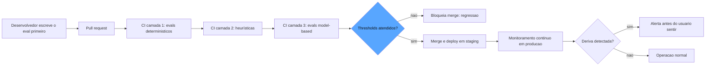

# Capítulo 10: Evals no ciclo de vida: EDD, CI/CD e o gate que bloqueia regressão

## 1. Introdução

Os capítulos anteriores construíram o sistema de garantia como um conjunto de instrumentos e inspetores. Mas instrumentos sem rotina são enfeites: o que transforma um painel em cultura é o ciclo de vida — o lugar onde os evals deixam de ser um evento e viram o tecido do desenvolvimento. Este capítulo integra tudo o que você construiu ao processo diário de engenharia: o **eval-driven development**, em que o eval é escrito antes do código e funciona como especificação executável; o **CI/CD com evals**, em que cada pull request roda a suíte e o merge é bloqueado quando a métrica regride; e o **monitoramento de regressão de prompts**, que detecta a deriva silenciosa dos modelos antes que ela chegue aos usuários [1]. Ao final, você terá um pipeline de qualidade contínua que torna a regressão uma exceção detectada em minutos, não um incidente descoberto em semanas [2].

## 2. Explica

O **eval-driven development (EDD)** é a adaptação do test-driven development para sistemas probabilísticos — e você vai perceber que a mudança de "testes" para "evals" é mais profunda do que parece. No TDD, o teste define o comportamento esperado de uma função; no EDD, o eval define a *especificação executável* do sistema: o conjunto de casos, critérios e rubricas que declara, de forma mensurável, o que o sistema precisa ser [1]. A Braintrust formaliza a ideia do *eval como oráculo*: em vez de discutir se uma mudança de prompt "parece melhor", você roda a suíte — o número decide [2].

Você vai perceber que a ordem do EDD inverte a prática comum. Em vez de mudar o prompt e depois "ver como fica", você escreve primeiro a suíte de evals que define o comportamento desejado, e só então muda o sistema — prompt, arquitetura, ferramentas ou modelo — para satisfazê-la [1]. Essa inversão tem um efeito estrutural: cada mudança vira um experimento com resultado mensurável, e a discussão deixa de ser de opinião ("eu acho que ficou melhor") para ser de evidência ("a fidelidade subiu de 0,84 para 0,90 no golden set v3"). A OpenAI descreve essa prática como o coração da metodologia Specify → Measure → Improve: a especificação viva é o conjunto de evals, e cada iteração é medida contra ela [3].

O **CI/CD com evals** é a operacionalização do EDD. A pipeline clássica de software ganha uma etapa nova: além de rodar os testes unitários e o lint, cada pull request executa a suíte de evals — os determinísticos (rápidos, baratos) em todo PR, e os model-based (caros, lentos) em um subconjunto ou em gatilhos específicos — e bloqueia o merge se os thresholds regredirem [2]. A Latitude documenta as três camadas da avaliação em CI: as verificações determinísticas (regex, JSON schema), as heurísticas (pontuações calculadas) e as avaliações por modelo (tom, fidelidade) — cada camada com seu custo e seu papel na decisão de merge [4]. O detalhe operacional que separa o profissional: o CI de evals precisa de *estabilidade* — thresholds calibrados com margem para a variância natural dos modelos (você verá a estatística no Capítulo 11), senão o gate flakky trava o time com falsos positivos [2].

A **regressão de prompts** é o problema que justifica todo o pipeline. Os provedores de modelo atualizam modelos silenciosamente; um prompt que funcionava na terça-feira pode degradar na quinta, sem nenhuma mudança sua [5]. A regressão pode ser de qualidade (alucinações novas, perda de instrução), de tom ou de segurança — e o único detector confiável é a suíte de evals rodando de forma contínua, comparando o comportamento atual com o baseline histórico [4]. A prática recomendada é o *monitoramento de deriva*: executar a suíte em agendamento (diário ou semanal), registrar as métricas com os metadados que você aprendeu no Capítulo 6 (hash de dataset, prompt e modelo), e disparar alerta quando a métrica cair abaixo do threshold — antes que o usuário sinta [5].

Há ainda a dimensão de **linhagem**: o EDD exige que prompts, datasets e evals vivam versionados no repositório, acoplados ao código — porque a especificação executável não pode divergir do sistema que ela especifica [2]. O prompt vira código (versionado, revisado, com diff); o dataset vira artefato (versionado, com linhagem); o eval vira teste (rodando em CI). Essa trinca é o que permite responder, para qualquer métrica de qualquer release: qual prompt, qual dataset, qual modelo produziu este número? — a pergunta que transforma o pipeline em auditável [4].

## 3. Ilustra

Na nossa estrada de ferro, o EDD e o CI/CD com evals têm a analogia mais concreta do livro: o **regulamento de circulação e a inspeção de saída da estação**. O regulamento — o livro que define as condições de circulação de cada trecho — é a especificação executável: não é uma intenção, é um conjunto de regras que a inspeção aplica a cada partida. E a inspeção de saída é o CI: antes de o trem deixar a estação, o inspetor confere contra o regulamento — o freio, o sinal, o registro, a carga. Sem a conferência, o trem não sai. O regulamento existe primeiro; a locomotiva é ajustada para cumpri-lo; e qualquer mudança — um vagão novo, um trecho novo — só entra em circulação depois de passar pela inspeção [1].

A deriva silenciosa tem sua analogia no **desgaste da linha**: os trilhos não mudam por decreto — mudam por uso, por clima, por temperatura. O trecho que era seguro em janeiro pode estar degradado em agosto, sem nenhum anúncio. E a única forma de detectar é o relógio de aferição contínuo: a vistoria periódica que compara a condição atual do trilho com o baseline registrado — e dispara o alerta quando a medição cai abaixo do padrão [5]. O maquinista veterano sabe: a linha não avisa antes de falhar; a vistoria é que avisa.

E o detalhe que o engenheiro-chefe ensina ao aprendiz: o regulamento não é imutável — ele evolui com as lições (o trecho novo entra no livro, a curva com vento ganha uma cláusula nova), mas a mudança do regulamento passa pelo mesmo processo de revisão que a mudança da locomotiva. Como Engenheiro de Qualidade de IA, você vê a lição completa: a especificação executável (regulamento), o gate de saída (inspeção) e o monitoramento de deriva (vistoria) são um sistema só — e é esse sistema que transforma a garantia de qualidade em rotina [2].



O diagrama mostra o ciclo completo: o eval escrito antes do PR; o CI em três camadas decidindo o merge; e o monitoramento contínuo detectando a deriva silenciosa antes do usuário — o fechamento do ciclo entre o offline e o online [2][4].

## 4. Técnica

### O Eval como Especificação Executável

O princípio que sustenta o eval como especificação executável é a inversão de responsabilidade: no desenvolvimento tradicional, o código define o comportamento e os testes o verificam; no EDD, o eval define o comportamento *antes* do código, e o código é a tentativa de satisfazê-lo [1]. Essa inversão tem uma consequência prática que a maioria dos times descobre tarde: ela muda o processo de revisão de código. O pull request de uma mudança de prompt passa a ser revisado contra a pergunta "esta mudança foi escrita para satisfazer a especificação?" em vez de "esta mudança parece boa?" — e a revisão se torna objetiva porque a especificação é objetiva [2]. A indústria documenta também a prática do *contrato de mudança*: toda alteração de prompt declara, no próprio PR, a especificação que se compromete a não regredir (as dimensões e os thresholds), e o CI verifica exatamente esse contrato — a declaração que transforma a mudança de prompt de evento informal em transação auditável [4].

Vamos construir o pipeline do EDD em código. Primeiro, o contrato que transforma o eval em especificação executável — escrito antes do sistema:

```python
from dataclasses import dataclass, field
from typing import Any, Callable, Dict, List


@dataclass
class EspecificacaoExecutavel:
    """O eval como oraculo: casos + criterios + thresholds = o contrato do sistema."""
    nome: str
    versao: str
    casos: List[str] = field(default_factory=list)
    thresholds: Dict[str, float] = field(default_factory=dict)


def especificar_sistema() -> EspecificacaoExecutavel:
    """A especificacao e escrita ANTES do sistema: o que o agente precisa garantir."""
    return EspecificacaoExecutavel(
        nome="contrato_do_agente_de_triagem",
        versao="1.0",
        casos=[
            "senha expirada -> autoatendimento",
            "sistema fora do ar -> fila critica",
            "duvida sobre ferramenta -> fila geral",
        ],
        thresholds={
            "precisao": 0.9,
            "cobertura_casos_borda": 1.0,
        },
    )
```

O detalhe conceitual: o eval não descreve o que o sistema *faz* — descreve o que o sistema *deve fazer*. É essa inversão que faz dele uma especificação, não um retrato [1].

### O Gate de CI em Três Camadas

Agora o gate de CI — as três camadas de avaliação com custo crescente:

```python
Eval = Callable[[str], float]  # recebe o caso, devolve pontuacao 0..1


def rodar_camada_deterministica(casos: List[str], evals: List[Eval]) -> Dict[str, float]:
    """Camada 1: evals deterministicos - baratos, rodam em todo PR."""
    resultados = {f"eval_{i}": sum(eval_fn(c) for c in casos) / len(casos)
                  for i, eval_fn in enumerate(evals)}
    return resultados


def rodar_camada_model_based(
    casos: List[str],
    evals: List[Eval],
    amostra: int = 10,
) -> Dict[str, float]:
    """Camada 3: evals model-based - caros, rodam em amostra de casos."""
    amostrados = casos[:amostra]
    return {f"juiz_{i}": sum(eval_fn(c) for c in amostrados) / len(amostrados)
            for i, eval_fn in enumerate(evals)}


def decidir_merge(
    metricas: Dict[str, float],
    spec: EspecificacaoExecutavel,
    margem: float = 0.02,
) -> Dict[str, Any]:
    """Decide o merge comparando as metricas com os thresholds, com margem de estabilidade."""
    reprovados: List[str] = []
    for nome, threshold in spec.thresholds.items():
        if nome not in metricas:
            reprovados.append(f"{nome}: sem metrica")
            continue
        if metricas[nome] < threshold - margem:
            reprovados.append(f"{nome}: {metricas[nome]:.3f} < {threshold:.3f}")
    return {
        "merge_permitido": not reprovados,
        "reprovacoes": reprovados,
        "metricas": metricas,
    }
```

A margem de estabilidade é o detalhe de engenharia que impede o gate flakky: os modelos têm variância natural entre execuções, e um threshold sem margem reprova o time por ruído estatístico — você aprofundará essa estatística no Capítulo 11 [2].

### O Monitoramento de Deriva de Prompts

O fechamento do ciclo — o monitoramento contínuo que detecta a deriva antes do usuário:

```python
from dataclasses import dataclass, field
from datetime import datetime
from typing import Dict, List, Tuple


@dataclass
class Baseline:
    """O registro historico das metricas: o trilho medido em janeiro."""
    metricas: Dict[str, float]
    registrado_em: str = field(default_factory=lambda: datetime.utcnow().isoformat())


@dataclass
class MedicaoAtual:
    """A vistoria de hoje: mesmas metricas, mesmo contexto, comparacao honesta."""
    metricas: Dict[str, float]
    contexto: Dict[str, str] = field(default_factory=dict)


def detectar_deriva(
    baseline: Baseline,
    atual: MedicaoAtual,
    limite: float = 0.05,
) -> Dict[str, Any]:
    """Compara a medicao atual com o baseline e sinaliza deriva por metrica."""
    alertas: List[Tuple[str, float, float]] = []
    for nome, valor_base in baseline.metricas.items():
        valor_atual = atual.metricas.get(nome)
        if valor_atual is None:
            continue
        delta = valor_atual - valor_base
        if delta < -limite:
            alertas.append((nome, valor_base, valor_atual))
    return {
        "deriva_detectada": bool(alertas),
        "alertas": [
            {"metrica": nome, "baseline": base, "atual": atual_valor}
            for nome, base, atual_valor in alertas
        ],
        "contexto": atual.contexto,
    }
```

O alerta de deriva é a ponte entre o offline e o online: quando a métrica de produção cai abaixo do baseline registrado com o mesmo contexto (mesmo prompt, mesmo dataset), algo mudou no mundo — e o monitoramento avisa antes do usuário sentir [5].

### A Linhagem no Repositório

O último pilar: prompts e evals versionados como código, para que a especificação nunca divirja do sistema:

```python
@dataclass
class ArtefatoVersionado:
    """Um prompt ou eval vivendo no repositorio, com linhagem completa."""
    caminho: str
    conteudo: str
    hash: str = ""
    versao_prompt: str = ""

    def __post_init__(self) -> None:
        import hashlib
        self.hash = hashlib.sha256(self.conteudo.encode("utf-8")).hexdigest()[:12]


def comparar_prompts(a: ArtefatoVersionado, b: ArtefatoVersionado) -> Dict[str, Any]:
    """Confere a linhagem: os hashes dizem se o prompt mudou entre execucoes."""
    return {
        "igual": a.hash == b.hash,
        "hash_a": a.hash,
        "hash_b": b.hash,
        "versao_a": a.versao_prompt,
        "versao_b": b.versao_prompt,
    }
```

O hash é o que conecta este capítulo ao versionamento do Capítulo 6: cada métrica reportada carrega o hash do prompt, do dataset e do modelo — e a linhagem completa é o que torna o pipeline auditável [4].

## 5. Aplica

### A Cena de Contraste

Sua empresa mantém um assistente de suporte com prompts que evoluem semanalmente. O time, seguindo o instinto comum, aprovava as mudanças por revisão manual: dois engenheiros liam o prompt novo, testavam três exemplos no playground, e davam o ok se "parecesse bom". Em seis meses, o assistente degradou silenciosamente: a taxa de escalação errada subiu, o tom mudou, e o time só percebeu quando o NPS de suporte despencou — porque nenhum dos três exemplos do playground cobria os casos em que a degradação acontecia.

O erro, ligando à teoria: a revisão manual por amostra de playground é a avaliação por *vibe* que o EDD existe para eliminar [1]. O diagnóstico: sem a especificação executável — sem o golden set, os thresholds e o gate de CI — cada mudança de prompt era um experimento sem medição, e a degradação acumulou silenciosamente sob o radar. A correção: implantar o pipeline deste capítulo — a suíte de evals escrita antes de cada mudança de prompt (o eval como oráculo), o CI em três camadas bloqueando o merge quando a precisão regride, e o monitoramento de deriva comparando as métricas de produção com o baseline [2]. Na primeira mudança de prompt após o pipeline, o CI reprovou o merge: a precisão caiu de 0,91 para 0,83 no golden set — a regressão que a revisão manual teria aprovado. O time reverteu o prompt, e o monitoramento passou a disparar alerta de deriva na semana seguinte, antes que o NPS sentisse [4].

O segundo ganho foi cultural: com o número decidindo, as discussões de prompt deixaram de ser de gosto e viraram de evidência — e o tempo de revisão caiu de dias para horas, porque o CI faz em cinco minutos o que a revisão manual fazia em dois dias [1].

### Armadilhas Comuns

- **Aprovar prompt por playground**: três exemplos escolhidos a dedo não medem regressão. A suíte é a especificação — o playground é para explorar, não para decidir [1].
- **Gate flakky por falta de margem**: thresholds sem margem de variância reprovam o time por ruído estatístico — e o time aprende a ignorar o gate. Margem calibrada é disciplina, não frouxidão [2].
- **Prompt fora do repositório**: prompt que vive em um documento ou em uma conversa não tem linhagem — e a métrica não tem contexto. Prompt é código, versionado e revisado [4].

### O Design do Pipeline de CI com Evals

O desenho do pipeline tem uma decisão de governança que determina o sucesso de longo prazo: quem tem autoridade para ajustar os thresholds quando o gate bloqueia. A indústria documenta o ciclo de morte do gate: quando o bloqueio atrapalha a entrega e ninguém tem autoridade clara para ajustar, o time adota o contorno informal — o sênior aprova manualmente, o gate vira decoração, e a regressão volta a passar [2]. A correção estrutural é a *governança do threshold*: os patamares são propriedade do dono do sistema (não do desenvolvedor individual), os ajustes passam pelo mesmo processo de revisão que as mudanças de código (PR com justificativa), e o registro do ajuste entra na trilha — porque cada mudança de threshold é uma decisão de risco que merece rastro, não um atalho burocrático [4]. O gate que o time pode ajustar com transparência sobrevive; o gate que o time contorna na sombra morre — e o desenho do pipeline inclui a regra que mantém a primeira opção aberta e a segunda impossível [1].

A diferença entre um CI com evals que funciona e um que trava o time está no desenho — e o desenho correto é uma questão de estratificação por custo e por risco [2]. O pipeline recomendado tem quatro estágios. O primeiro é a **triagem instantânea**: os evals determinísticos da camada 1 rodam em minutos e dão o veredicto rápido — o PR que regride a estrutura é bloqueado antes de gastar qualquer token em julgamento model-based [4]. O segundo é a **camada heurística**: as pontuações calculadas — similaridade, cobertura, consistência — rodam em seguida, ainda baratas, e ampliam a rede. O terceiro é a **amostra model-based**: um subconjunto estratificado dos casos (por categoria, por risco) é julgado pelos juízes — o custo é controlado pela amostragem, e a estratificação garante que as categorias críticas nunca fiquem de fora [2]. O quarto é o **gate consolidado**: os resultados das três camadas são comparados com os thresholds, com a margem de variância, e a decisão de merge é emitida com o relatório completo — as métricas, o contexto e as reprovações [1].

O detalhe de engenharia que separa o pipeline maduro é o **tratamento do flakky**: quando um caso model-based falha em uma execução e passa em outra (variância do julgamento), o pipeline não pode simplesmente reprovar o PR — precisa registrar a flakiness, reexecutar o caso em amostra e decidir com a estatística do Capítulo 11, não com um único sorteio [6]. O relatório do gate registra também a *estabilidade* da suíte — a taxa de casos flakky por rodada — porque uma suíte que fica flakky está dizendo que algo mudou no sistema ou no ambiente, e isso é informação, não ruído a ser ignorado [2].

### A Rotina do Monitoramento de Deriva

O monitoramento contínuo que você implementou na seção Técnica vira rotina com três decisões operacionais. A primeira é a **cadência**: a suíte online roda em agendamento — diária para sistemas de risco alto, semanal para os demais — sempre com o mesmo contexto (mesmo dataset, mesmo prompt, mesmo modelo) para que a comparação com o baseline seja honesta [5]. A segunda é o **alerta com contexto**: quando a deriva é detectada, o alerta não é um número solto — é o pacote completo: a métrica que caiu, o baseline, o contexto da medição e a hipótese inicial (mudou o modelo do provedor? mudou o tráfego? mudou o prompt sem atualizar a linhagem?) [4]. A terceira é a **ação estruturada**: o alerta de deriva dispara um fluxo definido — o time confere a linhagem, reproduz a medição, isola a causa e decide entre reverter, reescrever o prompt ou atualizar o baseline quando a mudança é legítima [2].

A distinção que mantém a rotina honesta é a entre **deriva de sistema e deriva de mundo**: quando o prompt, o dataset e o modelo são os mesmos e a métrica caiu, mudou o *mundo* — o tráfego, os dados, o contexto externo — e a resposta é adaptar o sistema; quando a métrica cai depois de uma mudança de prompt, mudou o *sistema* — e a resposta é revisar a mudança [5]. A rotina inteira é a materialização do fechamento do ciclo entre o offline e o online que você viu no Capítulo 2: o offline diz o que você contratou; o online diz o que o mundo devolve; e o monitoramento de deriva é o relógio de aferição que compara os dois, permanentemente, com o alerta como o alarme da cabine quando a medição começa a divergir da promessa [4].

### O CI com Evals no Contexto do Ecossistema

O pipeline de CI com evals que você construiu neste capítulo é a prática que a indústria consolidou como o padrão de qualidade para sistemas de IA, e situá-lo no ecossistema ajuda a adotar as ferramentas certas e a ler a literatura com critério. A OpenAI descreve a mesma cadeia — especificar, medir, melhorar — como o método central de desenvolvimento de sistemas de IA empresariais, com os evals empresariais no papel do gate que este capítulo implementou [7]. Os guias práticos de CI/CD para avaliação de LLM, como o da Latitude, documentam a estratificação em três camadas — determinística, heurística e model-based — que este capítulo seguiu, e os frameworks como o DeepEval traduzem os evals em testes pytest que rodam nativamente no GitHub Actions — a materialização do pipeline em ferramenta pronta [8]. E o guia da Evidently sobre testes unitários de LLM em CI mostra a mesma arquitetura com o detalhe da detecção de falhas silenciosas no primeiro commit: a razão de ser do gate [9].

O CI com evals também é o ponto onde a disciplina deste livro encontra a governança organizacional: o gate que bloqueia regressão é a função Measure do NIST AI RMF operando no ritmo do desenvolvimento, e a linhagem registrada em cada execução é o que permite à trilha de auditoria do Capítulo 11 reconstruir cada decisão de release [9]. E há a dimensão de evolução contínua: o mesmo pipeline que bloqueia hoje precisa evoluir com o sistema — novos casos no golden set (Capítulo 6), novos juízes calibrados (Capítulo 5), novos verificadores determinísticos (Capítulo 4) — e a revisão periódica da própria suíte é parte da rotina que o Capítulo 12 formaliza como a cultura de evidência [7]. O CI com evals, assim, não é uma etapa do pipeline: é o coração do ciclo de vida, o lugar onde a especificação executável encontra o processo de desenvolvimento e o transforma em um experimento contínuo com resultado mensurável [8].

A consolidação do gate no ciclo de vida segue o mesmo padrão de engenharia dos capítulos anteriores. A metodologia de avaliação de agentes multi-turnos fornece a unidade natural do gate: tarefa, tentativa, veredicto e trajetória são os quatro campos que o registro de execução do pipeline precisa capturar — e o gate decide sobre essa estrutura, não sobre uma nota isolada [10]. Os padrões arquiteturais de agentes contribuem com a visão de componentes: cada ferramenta e cada transição de estado testável no desenvolvimento vira uma asserção executável no CI — o gate de regressão é a soma dos testes de unidade do agente [11]. O ferramental de rastreamento conecta o pipeline à produção: os mesmos traces que alimentam os monitores online alimentam a retroalimentação do golden set — o CI aprende com a produção e vice-versa [12]. As plataformas de avaliação documentaram o padrão de CI/CD com GitHub Actions como bloqueador de PRs: o pull request dispara a suíte, o gate compara com o baseline e o merge depende do resultado — a disciplina de revisão de código se aplica literalmente a revisões de prompt [13]. Os frameworks de testes de prompt permitem a matriz de comparação dentro do pipeline: a mesma entrada avaliada em várias versões de prompt com relatório de regressão — o diff de qualidade é tão legível quanto o diff de código [14]. A prática de testes unitários de LLM em CI é a forma mais madura do gate: pytest com deepeval rodando a suíte a cada commit, com instrumentação dos frameworks de orquestração — falha silenciosa capturada no primeiro commit, não na primeira reclamação de cliente [15]. A pesquisa em reflexão adiciona a dimensão temporal: os agentes que melhoram em benchmarks de código usam a reflexão entre tentativas — e o pipeline que executa a suíte com retentativa registra o esforço de correção como dado do gate [16]. Os arcabouços de agentes como juízes mostram o gate do futuro: a revisão autônoma entre harnesses como estágio do pipeline — o CI não só roda os evals, mas convoca o revisor autônomo para os casos de fronteira [17]. A calibração do juiz é condição do gate: um juiz descalibrado no pipeline gera falsos bloqueios ou falsas liberações — e as correções humanas sobre os casos viram exemplos que melhoram o próprio gate [18]. A dimensão de segurança entra no pipeline pelo OWASP: os testes adversariais automatizados são estágio obrigatório do CI para sistemas com ferramentas — o mesmo gate que bloqueia regressão de qualidade bloqueia regressão de segurança [19]. E os frameworks de orquestração de grafos fecham o quadro: o pipeline de CI é ele próprio um grafo de agentes, com estados, transições e recuperação de falhas — e a própria suíte de evals é testada como sistema, com seus próprios testes de integração [20].

## 6. Conclusão

Este capítulo integrou o sistema de garantia ao ciclo de vida: o eval-driven development com o eval como especificação executável escrita antes do código; o CI/CD em três camadas com o gate de merge que bloqueia regressão; e o monitoramento de deriva que detecta a mudança silenciosa dos modelos antes do usuário sentir. Você aprendeu a importância da linhagem — prompts, datasets e evals versionados como código — e da margem de estabilidade que mantém o gate confiável. O desafio: pegue a próxima mudança de prompt do seu sistema e escreva a suíte de evals *antes* de mudar qualquer coisa — o número que o CI devolver é a sua decisão. No Capítulo 11, você vai questionar o próprio número: a confiabilidade das métricas, a variância estatística dos evals e a governança — quando o número mente e quem presta contas.

## 7. Referências Bibliográficas

[1] BRAINTRUST. *Eval-driven development*. 2026. Disponível em: https://www.braintrust.dev/articles/eval-driven-development. Acesso em: 06 ago. 2026.

[2] LATITUDE. *The ultimate CI/CD LLM evaluation guide*. 2026. Disponível em: https://latitude.so/blog/ultimate-ci-cd-llm-evaluation-guide. Acesso em: 06 ago. 2026.

[3] OPENAI. *How evals drive the next chapter in AI for businesses*. 2025. Disponível em: https://openai.com/index/evals-drive-next-chapter-of-ai/. Acesso em: 06 ago. 2026.

[4] BRONSDON, Conor. *Continuous integration (CI) for AI: fundamentals*. Galileo AI, 2025. Disponível em: https://galileo.ai/blog/continuous-integration-ci-ai-fundamentals. Acesso em: 06 ago. 2026.

[5] EVIDENTLY AI. *OWASP top 10 LLM and testing methodologies*. 2025/2026. Disponível em: https://www.evidentlyai.com/blog/owasp-top-10-llm. Acesso em: 06 ago. 2026.

[6] SAMUYLOVA, Elena; DRAL, Emeli. *LLM unit testing in CI/CD with GitHub Actions*. Evidently AI, 2025. Disponível em: https://www.evidentlyai.com/blog/llm-unit-testing-ci-cd-github-actions. Acesso em: 06 ago. 2026.

[7] OPENAI. *How evals drive the next chapter in AI for businesses*. 2025. Disponível em: https://openai.com/index/evals-drive-next-chapter-of-ai/. Acesso em: 06 ago. 2026.

[8] LATITUDE. *The ultimate CI/CD LLM evaluation guide*. 2026. Disponível em: https://latitude.so/blog/ultimate-ci-cd-llm-evaluation-guide. Acesso em: 06 ago. 2026.

[9] NIST. *AI risk management framework (AI RMF 1.0)*. 2023. Disponível em: https://www.nist.gov/itl/ai-risk-management-framework. Acesso em: 06 ago. 2026.

[10] ANTHROPIC. *Demystifying evals for AI agents*. 2026. Disponível em: https://www.anthropic.com/engineering/demystifying-evals-for-ai-agents. Acesso em: 06 ago. 2026.

[11] ANTHROPIC. *Building effective agents*. 2024. Disponível em: https://www.anthropic.com/engineering/building-effective-agents. Acesso em: 06 ago. 2026.

[12] LANGCHAIN. *LangSmith evaluation concepts*. 2026. Disponível em: https://docs.smith.langchain.com/evaluation. Acesso em: 06 ago. 2026.

[13] LANGFUSE. *LLM evaluation: methods, best practices, and a practical roadmap*. 2025. Disponível em: https://langfuse.com/blog/2025-11-12-evals. Acesso em: 06 ago. 2026.

[14] PROMPTFOO. *Introduction and docs*. 2026. Disponível em: https://www.promptfoo.dev/docs/intro/. Acesso em: 06 ago. 2026.

[15] CONFIDENT AI. *DeepEval: LLM evaluation unit testing in CI/CD*. 2026. Disponível em: https://deepeval.com/docs/evaluation-unit-testing-in-ci-cd. Acesso em: 06 ago. 2026.

[16] SHINN, Noah; CASSANO, Federico; NARASIMHAN, Karthik et al. *Reflexion: language agents with verbal reinforcement learning*. Princeton/MIT, 2023. Disponível em: https://arxiv.org/abs/2303.11366. Acesso em: 06 ago. 2026.

[17] YU, Fangyi et al. *When AIs judge AIs: the rise of agent-as-a-judge evaluation for LLMs*. Stanford/Scale AI, 2025. Disponível em: https://arxiv.org/html/2508.02994v1. Acesso em: 06 ago. 2026.

[18] CHASE, Harrison. *Aligning LLM-as-a-judge with human preferences*. LangChain, 2024. Disponível em: https://www.langchain.com/blog/aligning-llm-as-a-judge-with-human-preferences. Acesso em: 06 ago. 2026.

[19] OWASP FOUNDATION. *OWASP GenAI security project (top 10 for LLM applications)*. 2026. Disponível em: https://owasp.org/www-project-top-10-for-large-language-model-applications/. Acesso em: 06 ago. 2026.

[20] LANGGRAPH/LANGCHAIN. *LangGraph: orchestration and testing of agentic workflows*. 2026. Disponível em: https://langchain-ai.github.io/langgraph/. Acesso em: 06 ago. 2026.
