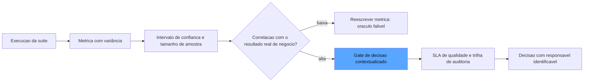

# Capítulo 11: Confiabilidade das métricas e governança: quando o número mente e quem presta contas

## 1. Introdução

No Capítulo 10, você colocou o número no comando: o gate de CI decide o merge, o monitoramento decide o alerta. Mas há uma pergunta que você ainda não fez — e que este capítulo coloca no centro: **e se o próprio número estiver errado?** Os evals são medições de sistemas probabilísticos, feitas por outros sistemas probabilísticos — e toda medição tem variância, viés e limite de amostra. Você vai aprender a estatística da confiabilidade: por que a mesma suíte pode dar 0,91 numa manhã e 0,88 na outra, o que é o pass@k versus pass^k, como dimensionar a amostra para que o número signifique algo, e como transformar essa incerteza em disciplina de governança — thresholds com intervalos de confiança, SLAs de qualidade para sistemas probabilísticos e a trilha de auditoria que responde à pergunta final: quem presta contas pelo número? [1] Ao final, você será capaz de dizer não apenas *o que* o eval mediu, mas *quanto* a medição merece confiança [2].

## 2. Explica

A primeira lição da confiabilidade é desconfortável e libertadora ao mesmo tempo: **o eval não mede o sistema — mede o sistema em uma amostra de execuções, em um contexto específico, com um conjunto de critérios específico**. A mesma configuração rodada duas vezes produz números ligeiramente diferentes, porque os LLMs são não determinísticos em temperatura acima de zero e os graders model-based têm variância própria [3]. A Anthropic formaliza essa distinção com duas métricas que você precisa dominar: o **pass@k** — a proporção de tarefas resolvidas quando o sistema tem k tentativas (mede a *capacidade*: ele consegue, se tentar mais de uma vez?) — e o **pass^k** — a proporção de tarefas resolvidas na *primeira* tentativa, em todas as execuções (mede a *consistência*: ele consegue sempre?) [1]. A diferença entre as duas é o diagnóstico mais rico do seu sistema: pass@k alto com pass^k baixo significa "tem capacidade, mas não é confiável" — o agente que resolve o problema na terceira tentativa, mas erra na primeira metade das vezes.

A segunda lição é a **estatística da amostra**. Toda métrica agregada sobre um dataset é uma estimativa com incerteza, e a incerteza diminui com a raiz quadrada do tamanho da amostra — o erro padrão de uma proporção é aproximadamente a raiz de (p·(1−p)/n) [2]. Isso tem consequências práticas devastadoras para gates mal desenhados: uma suíte de dez casos com oito acertos dá 0,80, mas o intervalo de confiança é enorme — o verdadeiro valor pode estar entre 0,45 e 0,97. Um gate com threshold em 0,80 sobre uma amostra de dez está decidindo sobre ruído [3]. A disciplina é dimensionar a suíte para o nível de precisão exigido — e reportar a incerteza junto com o número: "0,87 ± 0,06 (n=200)" vale mais que "0,87" sem contexto.

A terceira lição é a **metrica como oráculo falível**. O eval é uma aproximação do que você realmente quer — a satisfação do usuário, a correção de negócio, a segurança — e a lacuna entre a métrica e o objetivo é onde os evals enganam: o sistema otimiza o que a métrica premia (reward hacking) e o número sobe enquanto o objetivo real estagna [4]. A defesa é a calibração contínua: medir a correlação entre a métrica e o resultado real de negócio (o feedback do usuário, a taxa de escalada, o custo de correção) e reescrever a métrica quando a correlação cai [2].

A quarta lição é a **governança** — o nível organizacional da confiança. O NIST AI RMF organiza a governança em quatro funções — Govern, Map, Measure, Manage — e a função Measure é exatamente a disciplina deste livro: o que você mede, com que instrumento, com que incerteza e com que frequência [5]. A governança de evals adiciona duas camadas: os **SLAs de qualidade** — compromissos mensuráveis para sistemas probabilísticos: taxa máxima de erro semântico, taxa máxima de alucinação, disponibilidade dos guardrails — e a **trilha de auditoria** — o registro completo de cada decisão de release: qual métrica, qual contexto, qual veredicto, qual responsável [6]. A pergunta final que a governança obriga a responder: quando o sistema falha em produção, a organização consegue reconstruir a decisão que o aprovou — e o responsável pelo número é identificável? [5].

## 3. Ilustra

Na nossa estrada de ferro, a confiabilidade das métricas tem a analogia do **aferimento do instrumento** — a disciplina que o engenheiro-chefe impõe sobre todos os medidores da oficina. O manômetro não é confiável porque foi comprado de uma marca boa: é confiável porque é aferido — medido contra um padrão conhecido, em intervalos regulares, com o erro registrado. E o detalhe que o aprendiz descobre com surpresa: o manômetro *tem* um erro — todo instrumento tem — e o profissional não finge que o erro não existe: registra-o, reporta-o e decide com ele. Um manômetro com erro de ±5% não é inútil; é útil para decisões que toleram 5% e inútil para decisões que exigem 1% [1].

O pass@k e o pass^k têm a analogia do **teste do freio na descida**: o maquinista testa o freio de duas formas diferentes. O teste de bancada — o freio trava a roda quando puxado com força (pass@k: a capacidade existe) — e o teste em uso — o freio trava na primeira puxada, toda vez, em todas as descidas (pass^k: a consistência existe). O engenheiro-chefe ensina: a locomotiva que trava na bancada mas falha na primeira puxada em uso é a locomotiva que você não quer na linha — capacidade sem consistência é um acidente esperando a primeira curva [1].

E a governança tem a analogia do **conselho de segurança da linha**: a instância que revisa cada homologação com as três perguntas — o que foi medido, com que instrumento, por quem? A homologação não é aprovada pelo número — é aprovada pelo número *contextualizado*: o relatório com o erro do instrumento, a amostra, o responsável. E quando um acidente acontece, o conselho abre a trilha: a locomotiva foi aprovada? com qual medição? quem assinou? — a trilha de auditoria que transforma a responsabilidade de uma palavra em um fato documentado [5]. Como Engenheiro de Qualidade de IA, você percebe que a governança não é burocracia — é a transformação da confiança individual em confiança institucional.



O diagrama mostra a cadeia da confiança: a métrica bruta vira estimativa com incerteza; a incerteza exige correlação com o objetivo real; a correlação alimenta a decisão contextualizada; e a decisão é registrada na trilha de auditoria com responsável identificável [2][5].

## 4. Técnica

### A Estatística da Confiança

Antes da implementação, vale estabelecer o modelo mental que organiza toda a estatística deste capítulo: a medição de um sistema probabilístico é, ela própria, um processo probabilístico — e a honestidade com essa dupla aleatoriedade é o que separa o número de engenharia do número de marketing [2]. A dupla aleatoriedade tem duas fontes que você precisa distinguir sempre: a *aleatoriedade do sistema* (o agente em temperatura produz saídas diferentes para a mesma entrada — é isso que o pass@k vs. pass^k mede) e a *aleatoriedade da medição* (a amostra de casos, a execução do juiz — é isso que o intervalo de confiança mede) [1]. A confusão entre as duas é a fonte dos erros de decisão mais caros da disciplina: o time que atribui à aleatoriedade do sistema o que é aleatoriedade da medição conclui "o sistema é inconsistente" quando o problema é a suíte pequena; e o que atribui à medição o que é do sistema conclui "o número é flakky" quando o problema é o comportamento real do agente [3]. A ferramenta mental para separá-las é o experimento controlado: rodar a mesma suíte duas vezes sobre o mesmo sistema mede a aleatoriedade da medição; rodar o mesmo caso dez vezes sobre o mesmo sistema mede a aleatoriedade do sistema — e os dois números alimentam decisões diferentes [2].

Vamos construir a camada estatística em código. Primeiro, o intervalo de confiança da métrica — o número que transforma "0,87" em "0,87 ± 0,06":

```python
import math
from dataclasses import dataclass, field
from typing import Dict, List


@dataclass
class MetricaComIncerteza:
    """Uma metrica reportada com sua incerteza: o numero e o seu erro."""
    nome: str
    proporcao: float
    amostra: int
    nivel_confianca: float = 0.95

    def z_critico(self) -> float:
        """Valor z para o nivel de confianca (aproximacao: 1.96 para 95%)."""
        return 1.96 if self.nivel_confianca >= 0.95 else 1.645

    def erro_padrao(self) -> float:
        if self.amostra == 0:
            return 1.0
        p = self.proporcao
        return math.sqrt((p * (1.0 - p)) / self.amostra)

    def intervalo(self) -> tuple:
        margem = self.z_critico() * self.erro_padrao()
        return (max(0.0, self.proporcao - margem), min(1.0, self.proporcao + margem))

    def reportar(self) -> str:
        lo, hi = self.intervalo()
        return f"{self.nome}: {self.proporcao:.3f} ± {self.z_critico() * self.erro_padrao():.3f} (n={self.amostra}, IC {self.nivel_confianca:.0%} [{lo:.3f}, {hi:.3f}])"
```

O `reportar` é a disciplina em forma de string: o número sem o intervalo é uma meia-verdade, e o relatório que omite a amostra esconde a incerteza [2].

### Dimensionando a Amostra

Agora a engenharia reversa: qual o tamanho da suíte para atingir a precisão exigida?

```python
def tamanho_minimo_de_amostra(
    proporcao_esperada: float,
    margem_desejada: float,
    nivel_confianca: float = 0.95,
) -> int:
    """Calcula n necessario para uma margem de erro dada (aprox. normal)."""
    z = 1.96 if nivel_confianca >= 0.95 else 1.645
    variancia = proporcao_esperada * (1.0 - proporcao_esperada)
    n = (z ** 2) * variancia / (margem_desejada ** 2)
    return math.ceil(n)


def planejar_suite(precisao_alvo: float = 0.05) -> Dict[str, int]:
    """Planeja o tamanho da suite para a precisao desejada."""
    return {
        "n_para_margem_5pp": tamanho_minimo_de_amostra(0.90, 0.05),
        "n_para_margem_3pp": tamanho_minimo_de_amostra(0.90, 0.03),
        "n_para_margem_1pp": tamanho_minimo_de_amostra(0.90, 0.01),
    }
```

O resultado surpreende a intuição: para uma margem de ±5 pontos percentuais sobre uma proporção esperada de 0,90, são necessários ~139 casos; para ±1 ponto, ~3.457. O gate de CI com dez casos e threshold em 0,90 está decidindo com uma margem de erro maior que o próprio threshold — a explicação estatística da flakiness que você viu no Capítulo 10 [3].

### pass@k e pass^k

As duas métricas da capacidade versus consistência:

```python
def pass_at_k(tentativas_por_tarefa: List[List[bool]]) -> float:
    """pass@k: tarefa resolvida se QUALQUER uma das k tentativas acertou."""
    resolvidas = sum(1 for tentativas in tentativas_por_tarefa if any(tentativas))
    return resolvidas / len(tentativas_por_tarefa) if tentativas_por_tarefa else 0.0


def pass_hat_k(tentativas_por_tarefa: List[List[bool]]) -> float:
    """pass^k: tarefa resolvida somente se TODAS as k tentativas acertaram."""
    consistentes = sum(1 for tentativas in tentativas_por_tarefa if all(tentativas))
    return consistentes / len(tentativas_por_tarefa) if tentativas_por_tarefa else 0.0


def diagnostico_de_consistencia(tentativas_por_tarefa: List[List[bool]]) -> Dict[str, float]:
    capacidade = pass_at_k(tentativas_por_tarefa)
    consistencia = pass_hat_k(tentativas_por_tarefa)
    return {
        "pass_at_k": capacidade,
        "pass_hat_k": consistencia,
        "diagnostico": (
            "Capacidade e consistencia alinhadas"
            if consistencia >= capacidade * 0.9
            else "Capacidade alta, consistencia baixa: o sistema resolve na 2a tentativa, nao na 1a"
        ),
    }
```

O diagnóstico automático é a aplicação prática: a lacuna entre as duas métricas aponta a classe de problema — capacidade (o sistema sabe fazer?) ou consistência (o sistema faz sempre?) — e cada uma exige correção diferente [1].

### A Trilha de Auditoria

O fechamento da governança — o registro que torna a decisão auditável:

```python
from datetime import datetime


@dataclass
class RegistroDeDecisao:
    """A entrada da trilha de auditoria: quem, o que, com que medida, quando."""
    decisao: str
    metrica: str
    contexto_hash: str
    responsavel: str
    parecer: str
    quando: str = field(default_factory=lambda: datetime.utcnow().isoformat())

    def assinatura_de_auditoria(self) -> str:
        return f"{self.quando}|{self.decisao}|{self.responsavel}|{self.contexto_hash}"


@dataclass
class TrilhaDeAuditoria:
    """A trilha completa: a historia de cada decisao de release, imutavel por convencao."""
    registros: List[RegistroDeDecisao] = field(default_factory=list)

    def registrar(self, registro: RegistroDeDecisao) -> None:
        self.registros.append(registro)

    def auditar(self, contexto_hash: str) -> List[RegistroDeDecisao]:
        """Recupera todas as decisoes de um contexto: a reconstrucao da historia."""
        return [r for r in self.registros if r.contexto_hash == contexto_hash]
```

A trilha é o que torna a responsabilidade um fato: diante de um incidente em produção, a organização recupera os registros do contexto — quem aprovou, com que métrica, com que incerteza — e a pergunta "quem presta contas pelo número" ganha resposta documentada [5].

## 5. Aplica

### A Cena de Contraste

Sua empresa lançou um agente de recomendação de crédito, e o gate de CI — recém-implantado — estava bloqueando releases com frequência crescente. O time, seguindo o instinto comum, fez duas coisas erradas ao mesmo tempo: aumentou a suíte para duzentos casos *aleatórios* (achando que mais casos = mais precisão) e, quando os bloqueios continuaram, baixou o threshold de 0,90 para 0,80 "para destravar". Três meses depois, um release aprovado no 0,80 gerou uma onda de recusas incorretas de crédito — e ninguém conseguiu explicar por que o gate tinha aprovado.

O erro, ligando à teoria, foi triplo. Primeiro, a suíte inflada sem foco: duzentos casos aleatórios não aumentam a precisão sobre o que importa — aumentam o custo e a variância; a precisão vem de casos curados e dimensionados para a margem exigida, não de volume [3]. Segundo, o threshold rebaixado sem recalibrar: o 0,80 sobre o dataset novo era um número com intervalo de confiança enorme — o gate aprovou por ruído estatístico, não por qualidade. Terceiro, a ausência de trilha: ninguém registrou a métrica, o contexto e o responsável da decisão — e a pergunta "quem aprovou e com base em quê" ficou sem resposta [5].

A correção: o pipeline estatístico deste capítulo — a suíte dimensionada para a margem exigida pela decisão de crédito (±2 pontos, ~650 casos curados), o threshold calibrado com o intervalo de confiança (o gate reprova quando o limite inferior do IC cai abaixo do patamar, não quando a média oscila), e a trilha de auditoria registrando cada decisão com contexto e responsável [2]. O gate parou de bloquear por ruído, voltou a bloquear por regressão real — e a onda de recusas incorretas virou um incidente do passado com trilha completa [6].

### Armadilhas Comuns

- **Número sem incerteza**: "0,87" sem intervalo e sem amostra é uma meia-verdade. Reporte sempre `proporção ± erro (n=...)` [2].
- **Mais casos aleatórios = mais precisão**: volume sem curadoria infla custo e variância. A precisão vem de casos curados dimensionados para a margem exigida [3].
- **Threshold decidido por política, não por estatística**: rebaixar o threshold para destravar é decidir sobre ruído. O gate deve reprovar com base no intervalo de confiança, não na média [3].

### O Design do SLA de Qualidade para IA

O SLA de qualidade tem uma dimensão que os SLAs clássicos não têm, e é ela que torna o SLA de IA um documento vivo: a *revisão periódica do próprio SLA*. Como o mundo muda — novos domínios de tráfego, novos riscos, novos modelos —, a métrica que o SLA protegia há um trimestre pode ter deixado de ser a métrica que protege o negócio hoje [5]. A prática recomendada é a revisão trimestral com três perguntas: a métrica ainda se correlaciona com o resultado de negócio? (a correlação do Capítulo 11); o patamar ainda representa o risco aceitável? (o board mudou o apetite de risco?); e a medição ainda é sustentável? (o custo da suíte, a cadência, a capacidade de anotação) [2]. O SLA que não é revisado envelhece como o golden set estático do Capítulo 6: continua existindo, continua sendo citado — e deixa de proteger exatamente quando o mundo muda mais [1]. A revisão periódica é o relógio de aferição do contrato de confiança: o SLA é aferido pelo mesmo método que aferiu a locomotiva [6].

Os SLAs de sistemas de IA quebram o molde dos SLAs clássicos, porque a falha não é binária — é gradual, e a definição do compromisso exige uma escolha explícita de métrica, de patamar e de janela [1]. O desenho de um SLA de qualidade tem quatro decisões. A primeira é a **métrica de compromisso**: qual grandeza o SLA garante — a taxa de erro semântico, a taxa de alucinação, a disponibilidade dos guardrails, a precisão no golden set curado? A métrica precisa ser mensurável de forma contínua (não apenas em campanhas) e correlacionada com o resultado de negócio que o SLA protege [5]. A segunda é o **patamar com contexto**: "erro semântico abaixo de 5%" não é um SLA — é um número; o SLA é "erro semântico abaixo de 5% medido no golden set v3, com IC de 95%, em janela mensal, reportado com contexto" — o patamar é inseparável da medição que o sustenta [2].

A terceira decisão é a **janela e a sazonalidade**: a janela de medição (diária, mensal, trimestral) define o que o SLA protege — janela curta protege o incidente agudo, janela longa protege a degradação gradual — e a sazonalidade reconhece que o tráfego varia: o SLA precisa ser particionado por segmento ou época quando o comportamento do mundo varia [5]. A quarta é a **consequência**: o SLA sem consequência é um desejo — o SLA maduro define a resposta à violação: alerta, revisão, rollback, compensação ao cliente interno, escalada ao conselho — e a resposta é executada pela trilha de auditoria, não pela boa vontade [1]. O desenho completo é o que transforma a promessa de confiança em um contrato operacional com número, instrumento e responsável — a linguagem que o board entende e a auditoria consegue verificar [6].

### A Auditoria de Evals: Auditando o Painel

A última camada da governança é a auditoria do próprio painel — a revisão periódica que pergunta se o sistema de evals ainda está medindo o que deveria, com honestidade e com eficiência. A auditoria de evals tem três frentes [1]. A primeira é a **auditoria de cobertura**: o golden set ainda cobre as categorias de comportamento que a produção está exercendo? — a comparação entre as categorias do set e os clusters de tráfego real, com a taxa de casos de produção fora do set como a métrica da lacuna [2]. A segunda é a **auditoria de calibração**: os juízes ainda concordam com os humanos na taxa calibrada? os verificadores determinísticos ainda capturam a classe de falha para a qual foram escritos? — a medição contínua da concordância e da taxa de detecção, com o histórico como o registro da degradação [4].

A terceira frente é a **auditoria de economia**: o painel está gastando o orçamento de forma proporcional ao risco? — a revisão do custo por dimensão contra o valor protegido por cada dimensão, com a re-alocação como resultado: a dimensão cara que nunca pega falha é rebaixada de camada, e a dimensão barata que pega tudo é ampliada [2]. O resultado da auditoria é um relatório com veredicto e plano: o painel está saudável, tem lacunas localizadas ou precisa de reestruturação — e o relatório alimenta a trilha de auditoria geral da organização, porque o painel de evals é, ele próprio, um sistema crítico que merece garantia [1]. A auditoria de evals é a aplicação recursiva da tese do livro: se a confiança no agente exige medição, a confiança na medição exige medição — e o relógio de aferição é aferido pelo mesmo método que aferi a locomotiva [5].

### A Estatística e a Governança no Contexto do Ecossistema

A camada estatística e a governança que este capítulo construiu são a base sobre a qual todo o ecossistema de avaliação repousa, e situá-las ajuda a entender por que a indústria converge para as mesmas disciplinas. Os guias de CI/CD para avaliação de LLM documentam exatamente o problema que este capítulo resolve: os thresholds sem margem estatística produzem gates flakky, e a prática consolidada é calibrar os patamares com a variância conhecida da suíte — a margem de estabilidade do Capítulo 10, agora justificada pela estatística [7]. A Anthropic reforça a mesma disciplina no guia de evals de agentes: as métricas pass@k e pass^k existem para separar capacidade de consistência, e a variância entre execuções é parte esperada da medição — não um defeito a ser escondido [1]. E a metodologia de benchmark da Epoch AI mostra a estatística aplicada em escala: a seleção dos problemas do SWE-bench e a validação dos testes são feitas com cuidado metodológico justamente para que os números do benchmark sejam interpretáveis — a pureza da medição como pré-condição da autoridade do número [8].

A governança, por sua vez, conecta a estatística ao processo organizacional: o NIST AI RMF — incluindo seu perfil agêntico desenvolvido pela Cloud Security Alliance — exige que a medição seja contínua, documentada e auditável, e a trilha de auditoria deste capítulo é a materialização da função Manage no nível operacional [9]. Os SLAs de qualidade para sistemas de IA são o elo com o negócio: a indústria documenta a prática de definir compromissos mensuráveis — taxa de erro semântico, disponibilidade de guardrails — com o contexto de medição explícito, e a evidência de monitoramento como o instrumento que sustenta o compromisso [10]. E a auditoria de evals fecha o ciclo recursivo da obra: a revisão periódica do próprio painel — a métrica de saúde do set do Capítulo 6, a concordância dos juízes do Capítulo 8, a estabilidade do gate deste capítulo — é o que mantém a confiança na medição tão viva quanto a medição da confiança [11]. A estatística e a governança, assim, não são uma camada burocrática sobre o painel: são o que faz o número merecer comando e o comando merecer responsabilidade [1].

A confiabilidade das métricas tem uma camada adicional que a literatura documenta com crescente clareza: a arquitetura do sistema que produz o número. Os padrões arquiteturais de agentes mostram que a qualidade da medição depende da qualidade da instrumentação — um agente sem observabilidade de ferramentas produz métricas cegas para os componentes que mais falham [12]. A metodologia de especificar-medir-melhorar exige que a definição da métrica seja rastreável: quem define sucesso para cada tarefa, com qual contexto e contra qual golden set — a rastreabilidade da definição é o primeiro item da auditoria [13]. O ferramental de rastreamento fornece o elo entre painel e causa: cada métrica agregada no dashboard deve ser decomponível até os traces individuais — uma métrica que não permite drill-down é um número sem narrativa [14]. As plataformas de avaliação distinguem explicitamente os dois planos que este capítulo separou: a confiabilidade da métrica (o instrumento) e a validade da medição (o alvo) — e ambas precisam de governança própria [15]. A prática de testes unitários de LLM mostra o nível mais fino da cadeia: cada veredicto registrado é uma observação com contexto — e a auditoria do painel é a auditoria dessas observações, não de um agregado opaco [16]. A pesquisa em reflexão adiciona o aprendizado contínuo à governança: os agentes que melhoram com o tempo exigem métricas que também evoluem — a calibração periódica do painel é a reflexão do próprio sistema de avaliação [17]. Os arcabouços de agentes como juízes contribuem com a independência: a métrica auditada por um revisor externo — outro harness, outro painel — é mais confiável que a métrica auto-declarada, e a auditoria entre harnesses é o tema central da Parte III aplicado à própria medição [18]. A calibração humana entra como padrão de referência: a concordância entre o juiz automático e o humano é a métrica da métrica — o coeficiente da calibração é o instrumento de primeira ordem [19]. E a prática de CI com evals fecha a cadeia de confiança: quando o golden set, os casos de teste e os resultados vivem em repositório versionado, a auditoria de qualquer número é um comando de consulta ao histórico — a reprodutibilidade é a forma mais forte de confiabilidade que a governança pode exigir [20].

## 6. Conclusão

Este capítulo questionou o número e respondeu com engenharia: a variância das medições (pass@k vs. pass^k), a estatística da amostra (intervalos de confiança e dimensionamento), o oráculo falível (correlação com o resultado real) e a governança (NIST AI RMF, SLAs e trilha de auditoria). Você aprendeu que o número só merece comando quando carrega sua incerteza — e que a responsabilidade pelo número só é real quando a trilha a documenta. O desafio: calcule o intervalo de confiança da sua última métrica de eval e pergunte — a decisão que você tomou com ela sobrevive à incerteza? No Capítulo 12, a obra fecha com a dimensão humana e profissional: a carreira e a cultura da Eval Engineering, e o futuro da confiança como serviço.

## 7. Referências Bibliográficas

[1] ANTHROPIC. *Demystifying evals for AI agents*. 2026. Disponível em: https://www.anthropic.com/engineering/demystifying-evals-for-ai-agents. Acesso em: 06 ago. 2026.

[2] BRAINTRUST. *Eval-driven development*. 2026. Disponível em: https://www.braintrust.dev/articles/eval-driven-development. Acesso em: 06 ago. 2026.

[3] LATITUDE. *The ultimate CI/CD LLM evaluation guide*. 2026. Disponível em: https://latitude.so/blog/ultimate-ci-cd-llm-evaluation-guide. Acesso em: 06 ago. 2026.

[4] BRAINTRUST. *What is an LLM-as-a-judge? When to use it (and when to use deterministic evals)*. 2026. Disponível em: https://www.braintrust.dev/articles/what-is-llm-as-a-judge. Acesso em: 06 ago. 2026.

[5] NIST. *AI risk management framework (AI RMF 1.0)*. 2023. Disponível em: https://www.nist.gov/itl/ai-risk-management-framework. Acesso em: 06 ago. 2026.

[6] CLOUD SECURITY ALLIANCE. *Agentic NIST AI RMF profile*. 2025/2026. Disponível em: https://labs.cloudsecurityalliance.org/agentic/agentic-nist-ai-rmf-profile-v1/. Acesso em: 06 ago. 2026.

[7] LATITUDE. *The ultimate CI/CD LLM evaluation guide*. 2026. Disponível em: https://latitude.so/blog/ultimate-ci-cd-llm-evaluation-guide. Acesso em: 06 ago. 2026.

[8] EPOCH AI. *SWE-bench verified evaluation methodology*. 2026. Disponível em: https://epoch.ai/benchmarks/swe-bench-verified. Acesso em: 06 ago. 2026.

[9] NIST. *AI risk management framework (AI RMF 1.0)*. 2023. Disponível em: https://www.nist.gov/itl/ai-risk-management-framework. Acesso em: 06 ago. 2026.

[10] BRAINTRUST. *Eval-driven development*. 2026. Disponível em: https://www.braintrust.dev/articles/eval-driven-development. Acesso em: 06 ago. 2026.

[11] CLOUD SECURITY ALLIANCE. *Agentic NIST AI RMF profile*. 2025/2026. Disponível em: https://labs.cloudsecurityalliance.org/agentic/agentic-nist-ai-rmf-profile-v1/. Acesso em: 06 ago. 2026.

[12] ANTHROPIC. *Building effective agents*. 2024. Disponível em: https://www.anthropic.com/engineering/building-effective-agents. Acesso em: 06 ago. 2026.

[13] OPENAI. *How evals drive the next chapter in AI for businesses*. 2025. Disponível em: https://openai.com/index/evals-drive-next-chapter-of-ai/. Acesso em: 06 ago. 2026.

[14] LANGCHAIN. *LangSmith evaluation concepts*. 2026. Disponível em: https://docs.smith.langchain.com/evaluation. Acesso em: 06 ago. 2026.

[15] LANGFUSE. *LLM evaluation: methods, best practices, and a practical roadmap*. 2025. Disponível em: https://langfuse.com/blog/2025-11-12-evals. Acesso em: 06 ago. 2026.

[16] CONFIDENT AI. *DeepEval: LLM evaluation unit testing in CI/CD*. 2026. Disponível em: https://deepeval.com/docs/evaluation-unit-testing-in-ci-cd. Acesso em: 06 ago. 2026.

[17] SHINN, Noah; CASSANO, Federico; NARASIMHAN, Karthik et al. *Reflexion: language agents with verbal reinforcement learning*. Princeton/MIT, 2023. Disponível em: https://arxiv.org/abs/2303.11366. Acesso em: 06 ago. 2026.

[18] YU, Fangyi et al. *When AIs judge AIs: the rise of agent-as-a-judge evaluation for LLMs*. Stanford/Scale AI, 2025. Disponível em: https://arxiv.org/html/2508.02994v1. Acesso em: 06 ago. 2026.

[19] CHASE, Harrison. *Aligning LLM-as-a-judge with human preferences*. LangChain, 2024. Disponível em: https://www.langchain.com/blog/aligning-llm-as-a-judge-with-human-preferences. Acesso em: 06 ago. 2026.

[20] SAMUYLOVA, Elena; DRAL, Emeli. *LLM unit testing in CI/CD with GitHub Actions*. Evidently AI, 2025. Disponível em: https://www.evidentlyai.com/blog/llm-unit-testing-ci-cd-github-actions. Acesso em: 06 ago. 2026.
