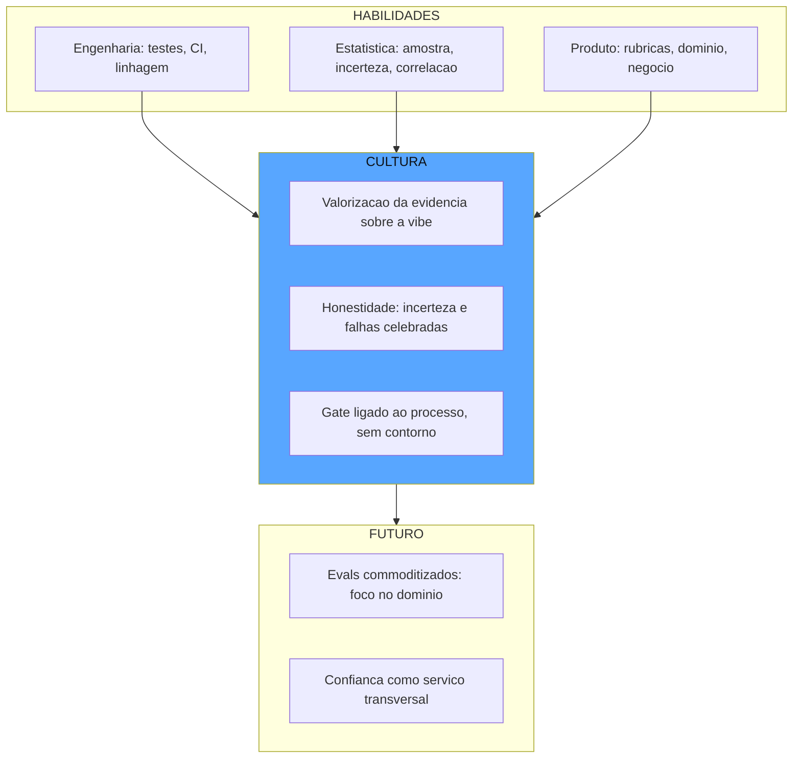

# Capítulo 12: O relógio de aferição: a carreira e a cultura da Eval Engineering

## 1. Introdução

Os onze capítulos anteriores construíram o sistema completo de garantia de confiança: os instrumentos, os inspetores, o adversário, o ciclo de vida e a estatística. Mas há uma pergunta que nenhum deles respondeu: **quem mantém tudo isso funcionando, e como uma organização aprende a confiar no processo em vez de no palpite?** Este capítulo fecha a obra com a dimensão humana e profissional da Eval Engineering — a carreira que está nascendo, as habilidades que a definem, a cultura de evidência que ela exige das organizações e o futuro da disciplina, onde os evals caminham para virar commodity e a confiança se transforma em serviço [1]. Você vai aprender a se posicionar nessa carreira — ou a contratar quem a exerce — e a semear a cultura de medição no seu time, convencendo pessoas a medir antes de afirmar [2]. Ao final, você terá o mapa completo: da habilidade individual ao futuro da disciplina.

## 2. Explica

A carreira de **Eval Engineer** está se consolidando como uma das funções mais estratégicas da engenharia de IA — e você vai perceber por que ela é diferente das profissões vizinhas. O engenheiro de ML otimiza modelos; o engenheiro de plataforma constrói harnesses; o eval engineer define *o que significa estar bom* — a especificação executável, a suíte, a calibração, a governança dos números [1]. É a função que responde à pergunta que toda organização de IA madura aprende a fazer antes de qualquer release: como sabemos que isto é bom o suficiente para produção? A demanda por essa função cresce na mesma proporção em que os sistemas de IA saem das demos e entram em produção — porque é na produção que a ausência de evals cobra a conta [2].

As habilidades da função formam um espectro que combina três mundos. Do mundo de **engenharia de software**, o eval engineer traz a disciplina de testes, CI/CD, versionamento e linhagem — a infraestrutura que você construiu nos Capítulos 10 e 6 [3]. Do mundo de **estatística**, traz a compreensão de amostras, intervalos de confiança, variância e correlação — a honestidade numérica do Capítulo 11 [4]. E do mundo de **produto e domínio**, traz a capacidade de traduzir objetivos de negócio em rubricas observáveis — a arte do Capítulo 3, que é a menos ensinada e a mais valiosa [2]. O profissional completo não precisa ser mestre dos três — precisa ser fluente nos três o bastante para traduzir um no outro.

A **cultura de evidência** é o ambiente em que essa carreira floresce — e a barreira cultural é maior que a técnica. A resistência clássica, documentada na prática das organizações, é a da *validação por vibe*: times que aprovam mudanças por impressão no playground, por demo ou por opinião do sênior [5]. A cultura de evidência substitui a vibe pelo número — não como burocracia, mas como linguagem comum: a discussão deixa de ser "eu acho que melhorou" e vira "a fidelidade subiu de 0,84 para 0,90 no golden set v3, com IC de ±0,02". A transição tem três alavancas práticas que você vai conhecer na seção Técnica: começar pequeno (uma suíte que resolve uma dor real), tornar o número visível (o painel que todos veem) e ligar o número ao processo (o gate que bloqueia — e ninguém contorna) [1].

A cultura tem também uma dimensão de **honestidade institucional** que define o limite entre cultura de evidência e teatro de métricas. O teatro acontece quando o número existe, mas ninguém acredita nele — o dashboard bonito que esconde a suíte vazia, o threshold rebaixado para destravar, o eval que mede o caminho feliz. A cultura de evidência exige o contrário: métricas que se correlacionam com o resultado real (Capítulo 11), falhas celebradas como material de curadoria (Capítulo 6) e líderes que perguntam "qual é a incerteza?" em vez de "qual é o número?" [4]. É essa honestidade que transforma o eval de instrumento de controle em instrumento de aprendizado.

E o futuro da disciplina tem duas direções que você vai perceber serem complementares. A primeira é a **commoditização dos evals**: frameworks, plataformas e benchmarks padronizados (você os conheceu no Capítulo 6) tornam os evals básicos cada vez mais acessíveis — o que não é ameaça à função, é evolução: o eval engineer deixa de escrever verificadores triviais e passa a desenhar o que nenhuma ferramenta cobre — a especificação do domínio, a calibração dos juízes, a governança da confiança [1]. A segunda é a **confiança como serviço**: a camada de garantia — evals, revisão autônoma, red-teaming, auditoria — caminha para se tornar um serviço transversal, consumido por todos os sistemas de IA da organização, como a segurança da informação se tornou no século XXI [2]. O profissional que domina a disciplina hoje estará, em poucos anos, desenhando o serviço de confiança da sua organização.

## 3. Ilustra

Na nossa estrada de ferro, a carreira de eval engineer tem a analogia do **mestre aferidor** — o profissional que a companhia mantém na oficina central, responsável pelos relógios de aferição de toda a linha. O mestre não dirige locomotivas e não conserta caldeiras: ele garante que *os instrumentos de todos os outros* digam a verdade. Quando o maquinista pergunta "a pressão está correta?", a resposta depende do mestre: se o manômetro foi aferido, a leitura é confiável; se não, o maquinista está dirigindo com um palpite disfarçado de leitura [1].

O mestre aferidor tem a sabedoria que o aprendiz demora anos a entender: o instrumento não é confiável pela marca, é confiável pelo aferimento — e o aferimento é um processo, não um evento. Ele aferi os relógios, registra o erro de cada um, e sabe exatamente quais decisões cada relógio pode sustentar: o manômetro com erro de ±5% serve para decisões que toleram 5%, e não serve para as que exigem 1%. A função do mestre não é eliminar o erro — é *torná-lo conhecido* e *dimensionar as decisões a ele* [4].

E o futuro da oficina tem uma direção que o engenheiro-chefe já anuncia: os relógios mais simples passam a ser produzidos em série, com padrão de fábrica — mas a *aferição* continua sendo o ofício do mestre, porque é ela que adapta o instrumento genérico ao contexto específico da linha. Como Engenheiro de Qualidade de IA, você reconhece aí a evolução da disciplina: a commoditização do instrumento e a valorização do ofício — o padrão vem de fábrica, a confiança vem do mestre [2].



O diagrama mostra o arco completo da obra: as três habilidades da função alimentam a cultura de evidência — valorizar o número, ser honesto com a incerteza, ligar o gate ao processo — e a cultura madura conduz ao futuro, onde os evals básicos são commodity e a confiança é um serviço [1][2].

## 4. Técnica

### O Plano de Carreira

O plano de carreira do eval engineer não se parece com o plano de outras carreiras de engenharia, e entender a diferença é o primeiro passo da evolução. Enquanto o engenheiro de software avança por sistemas mais complexos (mais usuários, mais tráfego, mais escala) e o engenheiro de ML avança por modelos mais capazes (mais parâmetros, mais tarefas), o eval engineer avança por *consequências maiores*: das decisões que custam minutos (o caso de teste que bloqueia um PR) às que custam milhões (o gate que decide a promoção de um sistema de crédito), das que afetam um sistema às que definem a política de confiança da organização inteira [1]. Essa escala de consequência é o que explica por que a função combina três mundos: o domínio das consequências grandes exige a tradução de risco de negócio em critério técnico — a habilidade de produto; a credibilidade nas consequências grandes exige a honestidade estatística — a habilidade de ciência de dados; e a operação diária das consequências exige a infraestrutura de testes e CI — a habilidade de engenharia [2].

Vamos transformar a visão em um plano executável. Primeiro, o mapa de competências da função — com autoavaliação e trilha de evolução:

```python
from dataclasses import dataclass, field
from typing import Dict, List


@dataclass
class Competencia:
    """Uma competencia da carreira de eval engineer com nivel e trilha."""
    nome: str
    pilar: str  # "engenharia" | "estatistica" | "produto" | "governanca"
    nivel_atual: int = 1  # 1..5
    nivel_alvo: int = 4


def plano_de_carreira() -> List[Competencia]:
    """O mapa de competencias da funcao: o que o eval engineer desenvolve."""
    return [
        Competencia("Testes e CI/CD com evals", "engenharia", 2, 4),
        Competencia("Versionamento e linhagem", "engenharia", 2, 4),
        Competencia("Intervalos de confianca e amostragem", "estatistica", 1, 4),
        Competencia("Calibracao de juizes e concordancia", "estatistica", 1, 4),
        Competencia("Rubricas e especificacao de dominio", "produto", 3, 5),
        Competencia("Governanca e trilha de auditoria", "governanca", 1, 3),
    ]


def avaliar_plano(competencias: List[Competencia]) -> Dict[str, Any]:
    """Autoavaliacao: onde voce esta, onde precisa chegar, o que priorizar."""
    lacunas = sorted(
        competencias,
        key=lambda c: (c.nivel_alvo - c.nivel_atual),
        reverse=True,
    )
    return {
        "prioridades": [
            {"competencia": c.nome, "lacuna": c.nivel_alvo - c.nivel_atual}
            for c in lacunas[:3]
        ],
        "ponto_de_partida": "Forte em dominio, desenvolver estatistica e governanca",
    }
```

O plano é o mapa, não o território: a função evolui pelo trabalho real — cada sistema avaliado, cada juiz calibrado, cada gate desenhado — e o mapa existe para apontar a direção [2].

### As Três Alavancas da Cultura

Agora as alavancas práticas para semear a cultura de evidência no seu time:

```python
def comecar_pequeno() -> Dict[str, str]:
    """Alavanca 1: uma suite que resolve uma dor real, nao um programa completo."""
    return {
        "escolha": "Selecione UMA decisao que hoje e tomada por vibe e custa cara quando erra",
        "exemplo": "A aprovacao de mudancas de prompt do assistente de suporte",
        "regra": "Uma suite de 20-50 casos curados, um threshold, um gate - nada mais",
    }


def tornar_o_numero_visivel() -> Dict[str, str]:
    """Alavanca 2: o painel que todos veem, atualizado a cada execucao."""
    return {
        "escolha": "Coloque a metrica com incerteza em um painel publico do time",
        "exemplo": "0,90 ± 0,03 (n=200) no golden set v3 - atualizado a cada CI",
        "regra": "Numero sem intervalo e sem contexto nao entra no painel",
    }


def ligar_o_numero_ao_processo() -> Dict[str, str]:
    """Alavanca 3: o gate que bloqueia e que ninguem contorna."""
    return {
        "escolha": "Ligue o eval ao merge e ao deploy - sem contorno manual",
        "exemplo": "O PR que regride o threshold e bloqueado no CI, ponto",
        "regra": "Contorno de gate e tratado como incidente de governanca, nao como atalho",
    }
```

As três alavancas formam o ciclo de adoção: a dor real justifica a suíte; o painel visível sustenta a confiança; e o gate ligado ao processo institucionaliza a disciplina — sem as três, a cultura de evidência morre no piloto [1].

### O Programa de Semeadura

O programa completo de transformação cultural, com etapas e critérios de avanço:

```python
def programa_de_cultura() -> List[Dict[str, str]]:
    """As etapas da semeadura: do piloto ao servico de confianca."""
    return [
        {"etapa": "Piloto", "acao": "1 suite, 1 gate, 1 dor real", "avancar_quando": "O gate bloqueia uma regressao real em 1 mes"},
        {"etapa": "Expansao", "acao": "3 suites nos sistemas criticos, painel publico", "avancar_quando": "Equipe consulta o painel antes de discutir mudancas"},
        {"etapa": "Institucionalizacao", "acao": "Trilha de auditoria, SLAs, responsaveis nomeados", "avancar_quando": "Nenhum release sem metrica contextualizada"},
        {"etapa": "Servico", "acao": "Confianca como servico transversal da organizacao", "avancar_quando": "Novos sistemas nascem ja com a camada de garantia"},
    ]
```

O programa é o fechamento do arco da obra: o piloto que prova o valor, a expansão que espalha a prática, a institucionalização que a torna regra e o serviço que a torna transversal — o mesmo arco que você percorreu, capítulo a capítulo, da medição ingênua à garantia contínua [2].

## 5. Aplica

### A Cena de Contraste

Você foi contratado como o primeiro eval engineer de uma empresa com dez agentes de IA em produção e zero suítes de evals. Seis meses depois, você está exausto e frustrado: construiu três dashboards lindos, mas os times continuam aprovando mudanças de prompt no playground, o board pergunta "onde está o ROI?" e dois agentes tiveram incidentes de produção que os evals — que nem rodavam no caminho deles — não pegaram. Você fez o erro clássico do entusiasta: tentou implantar o programa completo (este capítulo inteiro) em todos os times de uma vez, sem nenhuma dor resolvida.

O erro, ligando à teoria da seção Explica, foi inverter as alavancas: o dashboard veio antes do gate, o programa veio antes do piloto, e o instrumento foi oferecido onde ninguém pediu — cultura de evidência não se impõe, semeia-se [1]. O diagnóstico: a alavanca 1 (começar pequeno) é o ponto de partida obrigatório, e ela não estava cumprida — nenhum time tinha uma suíte resolvendo uma dor real que ele sentisse.

A correção: recuar para o piloto — um único time, uma única decisão dolorosa (as mudanças de prompt do assistente de suporte, que já tinham causado duas regressões no trimestre), uma suíte de quarenta casos curados, um threshold e um gate. Três semanas depois, o gate bloqueou uma mudança de prompt que teria regredido a precisão em 6 pontos — o time sentiu a dor evitada, o board viu o incidente que não aconteceu, e o pedido de expansão veio de dentro, não de cima [5]. A partir daí, as alavancas 2 e 3 se encaixaram naturalmente: o painel público passou a ser consultado antes das discussões de mudança, e o segundo time pediu a própria suíte. A cultura de evidência não nasceu do dashboard — nasceu da dor evitada [2].

### Armadilhas Comuns

- **Programa antes do piloto**: tentar implantar a cultura completa de uma vez produz dashboards sem gates e instrumentos sem donos. Comece pequeno, com uma dor real [1].
- **Painel sem incerteza**: dashboard com número sem intervalo é teatro de métricas — e o time aprende a desconfiar do painel inteiro [4].
- **Gate contornável**: o gate que o sênior pode ignorar não é gate — é decoração. Contorno tratado como incidente de governança [2].

### O Kit de Início: Primeiros 90 Dias como Eval Engineer

O kit de início ganha um quarto componente que os primeiros noventa dias precisam incluir: o *ritual de aprendizado contínuo*. A disciplina evolui rápido demais para ser dominada por estudo estático — a indústria recomenda o ciclo de três ritos: a revisão mensal dos incidentes de produção dos sistemas avaliados (o que a medição não previu? por quê? — a pergunta que alimenta a auditoria de evals do Capítulo 11), o estudo dos benchmarks públicos (o que os agentes de fronteira revelam sobre os limites da avaliação?) e a manutenção do manual pessoal de armadilhas (as classes de falha que você aprendeu na prática, o catálogo pessoal que complementa o catálogo da equipe) [1]. O ritual de aprendizado é o que impede a obsolescência do eval engineer — e é também a aplicação, à carreira, do princípio que abre a obra: confiança é propriedade medida, e a confiança na própria habilidade se mede pelo registro contínuo do que a medição previu e do que ela não previu [2].

Para fechar a obra com algo imediatamente acionável, vamos desenhar o plano dos primeiros noventa dias de quem assume a função — o roteiro que transforma o mapa de competências em ação. A primeira fase (dias 1-30) é o **reconhecimento**: mapear os sistemas de IA da organização, identificar as decisões que hoje são tomadas por vibe, e escolher o primeiro alvo pela regra do Capítulo 5 — uma decisão que custa caro quando erra e que ainda não tem medição [1]. A segunda fase (dias 31-60) é o **piloto**: escrever a primeira suíte de vinte a cinquenta casos curados sobre o alvo escolhido, com a pirâmide do Capítulo 3 (a maioria unit, um subconjunto integration, alguns end-to-end), um verificador determinístico da camada do Capítulo 4 e um threshold com margem do Capítulo 11 — e, crucialmente, o relatório de contexto do Capítulo 1 para que o número seja reproduzível [2].

A terceira fase (dias 61-90) é a **institucionalização do primeiro gate**: ligar a suíte ao CI do Capítulo 10, com o gate bloqueando a regressão — e documentar o primeiro bloqueio como o marco da cultura de evidência [3]. O plano inteiro tem um princípio que resume a obra: *não construa o painel completo — construa um instrumento confiável sobre uma dor real, e deixe que a dor resolvida puxe o resto* [1]. O eval engineer que começa com o mapa completo na cabeça e o piloto enxuto na mão percorre o mesmo arco que este livro: da superstição à medição, do instrumento ao serviço [2].

### O Debate do Futuro: Commodity, Automação e o Ofício

A última reflexão da obra é sobre o futuro da disciplina — e o futuro tem duas forças em tensão que o profissional precisa entender para se posicionar [1]. A primeira força é a **commoditização**: os evals básicos — schema, estrutura, verificadores simples, suítes de benchmark — caminham para virar infraestrutura padrão, como os testes de unidade se tornaram no software clássico: frameworks prontos, templates, plataformas gerenciadas [2]. A segunda força é a **automação da própria medição**: os evals que avaliam os evals, a calibração automática dos juízes, a curadoria assistida — a disciplina se aplica a si mesma, recursivamente, como você viu na auditoria de evals do Capítulo 11 [4].

A tensão entre as duas forças define o futuro da carreira: a commodity elimina o trabalho trivial, e a automação elimina o trabalho repetitivo — mas ambas *valorizam* o ofício que as guia: a especificação de domínio (o que o negócio precisa garantir, que nenhuma ferramenta genérica sabe), a calibração contextual (o juiz adaptado às preferências da organização, que nenhum template entrega pronto) e a governança da confiança (o desenho do serviço, que nenhuma plataforma substitui) [1]. O futuro do eval engineer não é escrever verificadores — é desenhar o serviço de confiança da organização: a camada que todos os sistemas de IA consomem, como a segurança da informação se tornou no século XXI [2]. E a obra fecha com o mesmo motivo condutor que a abriu: o relógio de aferição é um ofício — o instrumento se compra, a aferição se aprende, e é ela que transforma a confiança em IA de superstição em método, de promessa em propriedade medida, de risco individual em garantia institucional [4].

### A Carreira e a Cultura no Contexto do Ecossistema

A carreira de eval engineer e a cultura de evidência que ela carrega têm um lugar definido no ecossistema da indústria, e situá-las ajuda o profissional a se posicionar e a ler os sinais do mercado. A demanda pela função cresce na mesma proporção em que a indústria formaliza a avaliação como disciplina: os guias de evals de agentes da Anthropic, as metodologias de evals empresariais da OpenAI e os frameworks de avaliação do ecossistema — todos apontam para a mesma conclusão — a medição deixou de ser um acessório e virou pré-condição de produção [6]. Os benchmarks públicos como o SWE-bench demonstram o mesmo movimento: a avaliação rigorosa de agentes se tornou um mercado em si, com metodologia, validação e autoridade próprias — e a demanda por profissionais que sabem desenhar avaliações no contexto da própria organização acompanha essa formalização [7].

A cultura de evidência, por sua vez, é o tema que atravessa as diretrizes de governança da indústria: o NIST AI RMF e seu perfil agêntico colocam a medição contínua e a verificação independente no centro da confiança organizacional — e a cultura de evidência é o comportamento que torna essas funções operacionais, não apenas documentais [8]. Os guias práticos de CI/CD com evals documentam o mesmo princípio em escala de time: as organizações que adotam o eval como gate do processo de desenvolvimento são as que transformam a qualidade de IA de responsabilidade individual em infraestrutura coletiva [9]. E o futuro da disciplina tem seus sinais no presente: a commoditização dos evals básicos e a emergência da confiança como serviço — a camada transversal que todos os sistemas consomem — já são visíveis na consolidação das plataformas de avaliação e na integração dos evals ao ciclo de vida padrão do desenvolvimento de IA [6]. A carreira do eval engineer, assim, não é uma função de nicho: é o ofício que a indústria está institucionalizando exatamente agora, e o profissional que domina a disciplina completa — da especificação à governança — está na posição de desenhar o serviço de confiança da próxima década [10].

A formação do eval engineer como ofício tem um currículo implícito que a indústria já desenha. Os padrões arquiteturais de agentes fornecem a fundação técnica: quem projeta a avaliação precisa entender como o agente é construído — ferramentas, transições, interface agente-computador — porque cada decisão arquitetural tem implicação de medição [11]. A metodologia de especificar-medir-melhorar das plataformas de IA dá o método do ofício: o eval engineer não escreve testes soltos, ele gerencia o ciclo completo de melhoria do sistema [12]. O ferramental de rastreamento define a ferramenta diária: traces, filas de revisão e monitores online são o equivalente do ambiente de desenvolvimento e do depurador — a lente que o profissional usa para ver o comportamento do agente [13]. As plataformas de avaliação definem o playground: datasets, comparadores e relatórios de regressão são o ambiente de trabalho onde a intuição vira evidência [14]. Os frameworks de testes de prompt são a porta de entrada prática — o profissional que domina a matriz de comparação já domina a mentalidade de evals, e a progressão natural é do teste de prompt para a avaliação de sistemas [15]. A prática de testes unitários de LLM em CI é o ritual de disciplina: rodar a suíte a cada commit, ler a regressão, corrigir o caso — a rotina que transforma qualidade de IA em hábito [16]. A pesquisa em reflexão e auto-correção expande o escopo: o profissional da próxima década não avalia só resultados, avalia processos de aprendizado — a taxa de correção bem-sucedida, a eficiência da deliberação, a saúde dos loops [17]. Os arcabouços de agentes como juízes apontam a fronteira da carreira: o design de juízes calibrados e de revisores autônomos é uma especialidade em si — e quem domina a auditoria entre harnesses ocupa um papel que não existia há dois anos [18]. A calibração com preferências humanas é a competência relacional do ofício: traduzir o julgamento do especialista em exemplo few-shot é tanto uma habilidade de comunicação quanto técnica — o eval engineer é a ponte entre o domínio e a máquina [19]. E a prática de evals em CI com datasets versionados define o padrão de profissionalismo: o número que não é reprodutível não é um número — a integridade do dado de avaliação é o valor ético central do ofício, e é ela que sustenta a confiança que o Capítulo 1 mostrou ser o bem mais escasso [20].

## 6. Conclusão

Este capítulo fechou o arco da obra com a dimensão humana e profissional: a carreira de eval engineer com suas três famílias de habilidade — engenharia, estatística e produto —, a cultura de evidência com suas três alavancas — começar pequeno, tornar o número visível, ligá-lo ao processo — e o futuro da disciplina, com os evals se tornando commodity e a confiança se transformando em serviço. Você aprendeu que o relógio de aferição é, no fim, um ofício humano: o instrumento se compra, mas a aferição se aprende — e é ela que transforma a confiança em IA de superstição em método. O desafio final da obra: escolha uma decisão do seu trabalho que hoje é tomada por vibe, escreva a primeira suíte de vinte casos, e deixe o gate bloquear a primeira regressão — o dia em que isso acontecer, a cultura de evidência terá nascido no seu time. E lembre-se do motivo condutor que percorreu estes doze capítulos: confiar sem medir é superstição, medir sem revisar é burocracia, e revisar sem autonomia é gargalo — o painel completo é a via férrea da confiança na era dos agentes.

## 7. Referências Bibliográficas

[1] ANTHROPIC. *Demystifying evals for AI agents*. 2026. Disponível em: https://www.anthropic.com/engineering/demystifying-evals-for-ai-agents. Acesso em: 06 ago. 2026.

[2] BRAINTRUST. *Eval-driven development*. 2026. Disponível em: https://www.braintrust.dev/articles/eval-driven-development. Acesso em: 06 ago. 2026.

[3] BRONSDON, Conor. *Continuous integration (CI) for AI: fundamentals*. Galileo AI, 2025. Disponível em: https://galileo.ai/blog/continuous-integration-ci-ai-fundamentals. Acesso em: 06 ago. 2026.

[4] BRAINTRUST. *What is an LLM-as-a-judge? When to use it (and when to use deterministic evals)*. 2026. Disponível em: https://www.braintrust.dev/articles/what-is-llm-as-a-judge. Acesso em: 06 ago. 2026.

[5] NIST. *AI risk management framework (AI RMF 1.0)*. 2023. Disponível em: https://www.nist.gov/itl/ai-risk-management-framework. Acesso em: 06 ago. 2026.

[6] ANTHROPIC. *Demystifying evals for AI agents*. 2026. Disponível em: https://www.anthropic.com/engineering/demystifying-evals-for-ai-agents. Acesso em: 06 ago. 2026.

[7] EPOCH AI. *SWE-bench verified evaluation methodology*. 2026. Disponível em: https://epoch.ai/benchmarks/swe-bench-verified. Acesso em: 06 ago. 2026.

[8] NIST. *AI risk management framework (AI RMF 1.0)*. 2023. Disponível em: https://www.nist.gov/itl/ai-risk-management-framework. Acesso em: 06 ago. 2026.

[9] LATITUDE. *The ultimate CI/CD LLM evaluation guide*. 2026. Disponível em: https://latitude.so/blog/ultimate-ci-cd-llm-evaluation-guide. Acesso em: 06 ago. 2026.

[10] BRAINTRUST. *Eval-driven development*. 2026. Disponível em: https://www.braintrust.dev/articles/eval-driven-development. Acesso em: 06 ago. 2026.

[11] ANTHROPIC. *Building effective agents*. 2024. Disponível em: https://www.anthropic.com/engineering/building-effective-agents. Acesso em: 06 ago. 2026.

[12] OPENAI. *How evals drive the next chapter in AI for businesses*. 2025. Disponível em: https://openai.com/index/evals-drive-next-chapter-of-ai/. Acesso em: 06 ago. 2026.

[13] LANGCHAIN. *LangSmith evaluation concepts*. 2026. Disponível em: https://docs.smith.langchain.com/evaluation. Acesso em: 06 ago. 2026.

[14] LANGFUSE. *LLM evaluation: methods, best practices, and a practical roadmap*. 2025. Disponível em: https://langfuse.com/blog/2025-11-12-evals. Acesso em: 06 ago. 2026.

[15] PROMPTFOO. *Introduction and docs*. 2026. Disponível em: https://www.promptfoo.dev/docs/intro/. Acesso em: 06 ago. 2026.

[16] CONFIDENT AI. *DeepEval: LLM evaluation unit testing in CI/CD*. 2026. Disponível em: https://deepeval.com/docs/evaluation-unit-testing-in-ci-cd. Acesso em: 06 ago. 2026.

[17] SHINN, Noah; CASSANO, Federico; NARASIMHAN, Karthik et al. *Reflexion: language agents with verbal reinforcement learning*. Princeton/MIT, 2023. Disponível em: https://arxiv.org/abs/2303.11366. Acesso em: 06 ago. 2026.

[18] YU, Fangyi et al. *When AIs judge AIs: the rise of agent-as-a-judge evaluation for LLMs*. Stanford/Scale AI, 2025. Disponível em: https://arxiv.org/html/2508.02994v1. Acesso em: 06 ago. 2026.

[19] CHASE, Harrison. *Aligning LLM-as-a-judge with human preferences*. LangChain, 2024. Disponível em: https://www.langchain.com/blog/aligning-llm-as-a-judge-with-human-preferences. Acesso em: 06 ago. 2026.

[20] SAMUYLOVA, Elena; DRAL, Emeli. *LLM unit testing in CI/CD with GitHub Actions*. Evidently AI, 2025. Disponível em: https://www.evidentlyai.com/blog/llm-unit-testing-ci-cd-github-actions. Acesso em: 06 ago. 2026.
