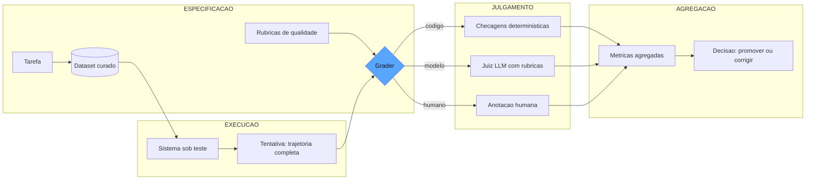

# Capítulo 2: O painel de instrumentos: anatomia de um sistema de evals

## 1. Introdução

No Capítulo 1, você construiu o esqueleto mínimo de aferição — o loop que separa produção de grader e registra o contexto de cada medição. Agora vamos transformar esse esqueleto no painel de instrumentos completo: a arquitetura profissional de um sistema de evals, com todos os seus componentes e as decisões de projeto que separam uma medição confiável de um número decorativo. Você vai aprender os blocos que a Anthropic identifica como o núcleo de qualquer avaliação de agentes — tarefas, tentativas, graders e transcrições — e como eles se organizam em um pipeline que responde às perguntas certas na ordem certa [1]. Ao final, você será capaz de desenhar a arquitetura de um sistema de evals do zero, sabendo exatamente onde cada peça se encaixa e por que omitir qualquer uma delas corrompe a medição.

## 2. Explica

Todo sistema de evals profissional é construído sobre quatro componentes fundamentais, e a forma como você os modela decide o que consegue medir. O primeiro é a **tarefa**: a unidade de trabalho que o agente deve executar, expressa em linguagem natural com todos os artefatos de apoio — instruções, contexto, ferramentas disponíveis e o estado inicial do ambiente [1]. A tarefa é o que você está de fato avaliando: se a tarefa for mal especificada, todos os resultados a jusante são contaminados, porque o sistema pode falhar por ambiguidade em vez de incompetência.

O segundo componente é a **tentativa**: a execução do sistema sobre a tarefa. Em agentes, uma tentativa não é apenas a resposta final — é a transcrição completa do que aconteceu: os passos de raciocínio, as chamadas de ferramenta com seus argumentos e resultados, as correções de rumo e o estado final [1]. Você vai perceber que essa distinção é o que separa a avaliação de chatbots da avaliação de agentes: um chatbot produz um texto; um agente produz uma trajetória de ações. Medir apenas o texto final é medir o vagão de passageiros e ignorar a locomotiva.

O terceiro componente é o **grader**: o julgador que decide se a tentativa foi bem-sucedida. A taxonomia da Anthropic divide os graders em três famílias: os *baseados em código* (checagens determinísticas — a resposta bate com o padrão esperado? o JSON valida? os testes passam?), os *baseados em modelo* (um LLM avalia dimensões qualitativas como tom, fidelidade e aderência à política, com base em rubricas) e os *humanos* (anotadores que julgam casos que nenhum automatismo consegue avaliar com segurança) [1]. A decisão de projeto mais importante do seu sistema é escolher, para cada dimensão de qualidade, qual família de grader responde por ela — e a regra de ouro é: use o mais determinístico que conseguir [2].

O quarto componente é o **dataset**: o conjunto de tarefas que define o domínio de comportamento que você se compromete a garantir. A OpenAI usa o termo *golden set* para o padrão ouro: coleções curadas de tarefas com saídas esperadas, construídas por especialistas de domínio e evoluídas continuamente a partir de erros reais de produção [3]. O dataset é o contrato de qualidade do sistema: ele declara, de forma executável, quais comportamentos importam e quais não.

Sobre esses quatro componentes, a cadeia *Specify → Measure → Improve* organiza o processo [3]. Especificar é converter objetivos abstratos de negócio em rubricas e datasets; medir é executar as tarefas, aplicar os graders e agregar os veredictos em métricas; melhorar é usar as métricas para decidir entre opções — prompts, arquitetura, ferramentas, modelos — com evidência em vez de intuição. A OpenAI observa que a maioria das organizações pula a primeira etapa, indo direto para exemplos soltos, e paga o preço em iterações cegas: sem critério especificado, cada rodada de melhoria é um chute educado [3].

Há ainda a dimensão temporal, que a literatura de observabilidade divide em dois regimes: **evals offline** e **evals online** [4]. Os offline rodam antes do deploy, sobre datasets fixos, com execuções controladas e custo previsível — são o equivalente aos testes de regressão do software tradicional. Os online monitoram o sistema em produção, avaliando amostras de tráfego real com juízes automáticos e coletando feedback implícito e explícito dos usuários [4]. Um sistema de evals profissional opera nos dois regimes: o offline garante que a mudança não regride; o online garante que a realidade não diverge do que o offline prometeu. A LangSmith chama atenção para um detalhe sutil: as duas modalidades usam métricas diferentes — offline mede acurácia contra referência; online mede qualidade percebida, latência e deriva — e confundi-las é uma fonte clássica de "o número diz que está tudo bem, e o cliente discorda" [4].

## 3. Ilustra

Voltemos à cabine da locomotiva — o motivo condutor desta obra. O painel de instrumentos do maquinista não é uma coleção aleatória de medidores; é uma arquitetura deliberada, onde cada instrumento responde por uma grandeza física específica e a redundância é planejada. O manômetro mede pressão; o indicador de nível mede água; o tacômetro mede velocidade. Se o maquinista tivesse apenas um medidor que "diz se está tudo bem", ele não saberia *o que* está errado quando o alarme dispara — e a correção seria adivinhação.

O sistema de evals segue exatamente a mesma arquitetura. A tarefa é a viagem contratada (o percurso que o trem deve cumprir); a tentativa é o registro completo da viagem (o livro de bordo que o maquinista preenche — cada curva, cada estação, cada decisão); o grader é o instrumento que converte a realidade física em leitura no painel; e o dataset é o conjunto de percursos de teste que a estrada de ferro usa para aferir a frota — os mesmos trilhos, as mesmas condições, medidos sempre do mesmo jeito para que uma frota seja comparável à outra [1].

A distinção offline/online tem sua analogia direta: o offline é a inspeção na oficina, antes de o trem sair — condições controladas, trilho limpo, máquina em repouso; o online é o relógio de aferição durante a viagem — o maquinista que confere os instrumentos a cada estação, sabendo que a estrada real tem curvas, vento e areia que a oficina nunca reproduz [4]. Como Engenheiro de Qualidade de IA, você percebe o ponto central: nenhuma oficina substitui a aferição em viagem, e nenhuma aferição em viagem substitui a inspeção na oficina — as duas são complementares, e quem elimina uma delas está conduzindo às cegas na metade do percurso.



O diagrama mostra o fluxo completo: a especificação (tarefas, dataset e rubricas) alimenta a execução (o sistema produz tentativas), o julgamento decide o veredicto de cada tentativa pela família de grader adequada, e a agregação transforma veredictos individuais em decisão de negócio [3].

## 4. Técnica

### Modelando os Quatro Componentes

A modelagem é a decisão que antecede todo o código, e ela merece uma reflexão sobre o que cada escolha de tipo carrega. Quando modelamos a tentativa como uma lista de passos com tipo, argumentos e resultado, estamos tomando três decisões de arquitetura que reverberam por todo o sistema: primeiro, que a avaliação de agentes é uma avaliação de *processo* (o que foi feito) tanto quanto de *produto* (o que foi entregue); segundo, que cada passo precisa carregar evidência estruturada (argumentos e resultado), porque a evidência é o que permite ao revisor localizar a falha sem reexecutar o agente; e terceiro, que o custo é parte da tentativa (tokens consumidos), porque um agente que resolve com eficiência brutal é diferente de um que resolve queimando recursos [1]. Essas decisões não são estéticas: são o que permite aos capítulos 7 e 8 construírem o revisor autônomo sobre a mesma estrutura de dados sem refatoração [2].

Vamos traduzir a arquitetura em código. O primeiro passo é modelar os tipos que dão forma aos quatro componentes, com o rigor de tipos que permite evoluir o sistema sem quebrar o contrato:

```python
from dataclasses import dataclass, field
from typing import Any, Callable, Dict, List, Optional, Protocol


class SistemaSobTeste(Protocol):
    """Contrato do sistema avaliado: recebe uma tarefa e devolve uma tentativa."""
    def executar(self, tarefa: "Tarefa") -> "Tentativa": ...


@dataclass
class Tarefa:
    """Unidade de trabalho avaliada: o que o agente deve fazer."""
    id: str
    instrucoes: str
    contexto: str = ""
    ferramentas_disponiveis: List[str] = field(default_factory=list)
    estado_inicial: Dict[str, Any] = field(default_factory=dict)


@dataclass
class PassoDaTentativa:
    """Um passo da trajetoria: acao observada com seus argumentos e resultado."""
    tipo: str  # "raciocinio" | "ferramenta" | "resposta_final"
    conteudo: str
    argumentos: Dict[str, Any] = field(default_factory=dict)
    resultado: Optional[str] = None


@dataclass
class Tentativa:
    """Transcricao completa do que o agente fez, nao apenas a resposta final."""
    tarefa_id: str
    passos: List[PassoDaTentativa]
    resposta_final: str = ""
    concluida: bool = False
    custo_tokens: int = 0

    def acoes_de_ferramenta(self) -> List[PassoDaTentativa]:
        return [p for p in self.passos if p.tipo == "ferramenta"]
```

Note que a `Tentativa` carrega a trajetória inteira — é ela que permite auditar o caminho, e não só a resposta. Essa modelagem é a base da avaliação de agentes da Anthropic, que recomenda tratar a tentativa como a unidade central de análise [1].

Agora o registro de veredictos e o pipeline que orquestra o fluxo:

```python
@dataclass
class Veredicto:
    """Julgamento de uma tentativa por uma familia de grader."""
    tarefa_id: str
    familia: str  # "codigo" | "modelo" | "humano"
    dimensao: str  # ex.: "fidelidade", "schema", "seguranca"
    aprovado: bool
    pontuacao: Optional[float] = None
    evidencia: str = ""


@dataclass
class ResultadoDoEval:
    """Agregacao dos veredictos de um dataset inteiro."""
    veredictos: List[Veredicto] = field(default_factory=list)

    def taxa_por_dimensao(self, dimensao: str) -> float:
        relevantes = [v for v in self.veredictos if v.dimensao == dimensao]
        if not relevantes:
            return 0.0
        return sum(1 for v in relevantes if v.aprovado) / len(relevantes)

    def resumo(self) -> Dict[str, float]:
        dimensoes = {v.dimensao for v in self.veredictos}
        return {d: self.taxa_por_dimensao(d) for d in sorted(dimensoes)}
```

### O Pipeline Offline

Com os tipos definidos, o pipeline offline executa o ciclo: para cada tarefa do dataset, executa o sistema, aplica os graders e agrega:

```python
Grader = Callable[[Tarefa, Tentativa], Veredicto]


def rodar_eval_offline(
    sistema: SistemaSobTeste,
    dataset: List[Tarefa],
    graders: Dict[str, Grader],
) -> ResultadoDoEval:
    """Executa o eval offline: todas as tarefas, todos os graders, veredictos agregados."""
    resultado = ResultadoDoEval()
    for tarefa in dataset:
        tentativa = sistema.executar(tarefa)
        for nome, grader in graders.items():
            veredicto = grader(tarefa, tentativa)
            veredicto.dimensao = nome
            resultado.veredictos.append(veredicto)
    return resultado
```

E um par de graders reais — um de código e um de modelo — para mostrar a diferença prática entre as famílias:

```python
import json


def grader_schema(tarefa: Tarefa, tentativa: Tentativa) -> Veredicto:
    """Grader de codigo: a resposta final deve ser JSON com a chave 'acao'."""
    try:
        objeto = json.loads(tentativa.resposta_final)
    except json.JSONDecodeError:
        return Veredicto(tarefa.id, "codigo", "schema", False, evidencia="JSON invalido")
    if "acao" not in objeto:
        return Veredicto(tarefa.id, "codigo", "schema", False, evidencia="Chave 'acao' ausente")
    return Veredicto(tarefa.id, "codigo", "schema", True, 1.0, "Schema valido")


def grader_uso_de_ferramenta_esperada(
    tarefa: Tarefa, tentativa: Tentativa
) -> Veredicto:
    """Grader de codigo sobre trajetoria: a ferramenta obrigatoria foi chamada?"""
    ferramentas_usadas = {
        passo.argumentos.get("nome", "")
        for passo in tentativa.acoes_de_ferramenta()
    }
    obrigatoria = tarefa.estado_inicial.get("ferramenta_obrigatoria")
    if obrigatoria and obrigatoria not in ferramentas_usadas:
        return Veredicto(
            tarefa.id, "codigo", "uso_ferramenta", False,
            evidencia=f"Faltou chamar {obrigatoria}; usou {sorted(ferramentas_usadas)}",
        )
    return Veredicto(tarefa.id, "codigo", "uso_ferramenta", True, 1.0, "Ferramenta usada")
```

O primeiro grader julga a resposta; o segundo julga a trajetória. Essa é a diferença estrutural entre avaliar um chatbot e avaliar um agente — e é por isso que modelamos a tentativa com passos: sem o registro das ações, não há como verificar se o agente usou a ferramenta certa na ordem certa, mesmo que a resposta final pareça perfeita [1].

### O Regime Online: Amostragem de Produção

O regime online segue o mesmo esqueleto, mas troca o dataset fixo pela amostra de tráfego real:

```python
@dataclass
class AmostraDeProducao:
    """Um pedaco do trafego real capturado pelo harness em producao."""
    id: str
    prompt_do_usuario: str
    saida_do_sistema: str
    feedback_usuario: Optional[str] = None  # "positivo" | "negativo" | None


def avaliar_amostras(
    amostras: List[AmostraDeProducao],
    grader_online: Callable[[AmostraDeProducao], Veredicto],
) -> ResultadoDoEval:
    resultado = ResultadoDoEval()
    for amostra in amostras:
        v = grader_online(amostra)
        v.tarefa_id = amostra.id
        resultado.veredictos.append(v)
    return resultado


def taxa_de_feedback_negativo(amostras: List[AmostraDeProducao]) -> float:
    if not amostras:
        return 0.0
    negativos = sum(1 for a in amostras if a.feedback_usuario == "negativo")
    return negativos / len(amostras)
```

A tensão entre os dois regimes é o tema recorrente do monitoramento: o offline mede o que você *contratou*; o online mede o que o mundo *devolve* [4]. Um sistema maduro mantém os dois e compara os resultados — quando a taxa online diverge da offline, o problema está na especificação (dataset desatualizado, rubrica errada) ou no ambiente (deriva de dados, mudança de comportamento do modelo) [5].

## 5. Aplica

### A Cena de Contraste

Você lidera o time que acabou de contratar o primeiro agente de IA para automatizar triagem de chamados de TI. O time de produto pediu "um painel de evals" e você, seguindo o instinto comum, entregou uma planilha com vinte casos de teste que o próprio time escreveu na sexta-feira, rodou contra o agente e anotou "passa/não passa" à mão. O resultado: o painel existe, mas não diz nada — os casos não têm contexto de produção, não há registro de qual versão do prompt foi testada, e cada pessoa avaliou "aprovado" com critérios diferentes.

O erro plausível, aqui, foi confundir *testes* com *sistema de evals*. A planilha é uma coleção de perguntas; o sistema de evals é a arquitetura que garante que as perguntas sejam as certas, os critérios sejam consistentes e os resultados sejam comparáveis entre versões. O diagnóstico, ligando à teoria da seção Explica: sem os quatro componentes modelados — tarefas estruturadas, tentativas registradas, graders com família explícita e dataset versionado — cada rodada de medição é um evento isolado, e não uma série comparável. A correção é a arquitetura deste capítulo: converter os vinte casos em `Tarefa` estruturadas com contexto e estado inicial; registrar cada execução como `Tentativa` com passos; atribuir cada dimensão de qualidade a uma família de grader; e versionar o dataset inteiro para que a comparação entre a versão 1 e a versão 2 do agente seja honesta [3].

O ganho mensurável dessa correção é a comparabilidade: você passa de "acho que melhorou" para "a taxa de fidelidade subiu de 0,82 para 0,91 entre o commit 4a2 e o commit 9f1, no mesmo dataset, com o mesmo contexto" — a frase que transforma discussões de opinião em decisões de engenharia [6].

### Armadilhas Comuns

- **Modelar apenas a resposta final**: em agentes, a resposta perfeita pode esconder uma trajetória catastrófica (ferramenta errada, ordem errada, custo explodindo). Sem a tentativa registrada, você não consegue auditar [1].
- **Misturar famílias de grader sem explicitar**: julgar schema com LLM (lento e não determinístico) e tom com regex (cego para semântica) são inversões clássicas. Cada dimensão exige a família certa [2].
- **Ignorar o regime online**: o offline aprova e a produção reclama — porque o dataset fixo não acompanha a realidade. Os dois regimes são complementares, não alternativos [4].

### O Mapa de Dimensões de Qualidade

O mapa de dimensões tem um uso de revisão que poucos times exploram: o exercício da *auditoria reversa*. Em vez de preencher o mapa de baixo para cima (o que o sistema mede?), o time o preenche de cima para baixo (o que o negócio precisa que seja medido?) — e a comparação entre os dois mapas revela as lacunas com precisão cirúrgica [2]. O mapa de cima para baixo lista as dimensões que o contrato de negócio exige: o cliente precisa de resposta sem alucinação (fidelidade), com tom adequado (tom), dentro das regras (política), sem vazar dados (privacidade). O mapa de baixo para cima lista o que o sistema efetivamente mede. O conjunto das dimensões exigidas que não aparecem no mapa real é o backlog de evals — e a prioridade da construção é exatamente a ordem das exigências de negócio, não a facilidade de implementação [3]. Essa auditoria reversa é a ponte entre o Capítulo 1 (o diagnóstico da confiança) e o Capítulo 3 (a fábrica de evals): ela transforma o inventário de riscos em um plano de construção ordenado por valor [1].

A peça que liga a arquitetura deste capítulo à prática do seu trabalho é o mapa de dimensões — a planilha mental que todo sistema de evals profissional mantém atualizada. Cada dimensão de qualidade do sistema (fidelidade, tom, aderência à política, segurança, custo, latência) deve ter, explicitamente, três atributos: a **família de grader** responsável por ela (código, modelo ou humano), o **regime** em que é medida (offline, online ou ambos) e o **critério observável** que define o veredicto [1]. O ato de preencher esse mapa é, em si, a primeira auditoria do sistema: quando você tenta preencher uma linha e descobre que a dimensão não tem família, não tem regime ou não tem critério, você acaba de localizar um buraco do painel [2].

Vamos percorrer um mapa típico para ilustrar. A dimensão *fidelidade* (a resposta está fundamentada no contexto?) — família: código quando há referência verificável, modelo quando a fundamentação é aberta; regime: ambos; critério: "a resposta cita a fonte quando faz afirmação factual". A dimensão *schema* (a resposta tem a forma esperada?) — família: código, sempre; regime: ambos; critério: "JSON válido com as chaves contratadas". A dimensão *segurança* (a resposta se recusa ao que não deve fazer?) — família: código para os padrões conhecidos, modelo para a semântica de recusa; regime: ambos, com ênfase no red-teaming contínuo; critério: "nenhuma ação de alto impacto sem autorização" [3]. A dimensão *tom* (a resposta soa como a marca?) — família: modelo calibrado; regime: online principalmente, porque tom é percebido em contexto real; critério: rubrica de três níveis com exemplos de ancoragem [4].

O mapa também expõe as decisões econômicas da arquitetura: cada dimensão custa algo por execução (o código custa milissegundos; o modelo custa tokens; o humano custa tempo de anotador), e a soma desses custos define o orçamento do painel. A disciplina do profissional é equilibrar o mapa: maximizar as dimensões servidas por código, reservar o modelo para o que é genuinamente semântico e usar o humano apenas na calibração e nos casos de fronteira [6]. Quando você encontrar um time que "não tem orçamento para evals", a resposta técnica não é reduzir o mapa — é migrar dimensões para a família mais barata que ainda as mede com honestidade [2].

### A Cadeia de Montagem da Medição

A última ferramenta do capítulo é a visão de processo: a medição não é um evento que você dispara quando lembra — é uma cadeia de montagem com responsáveis e gatilhos. O pipeline completo tem seis estações: *especificar* (o dono do produto e o especialista de domínio escrevem as rubricas — a estação mais negligenciada e a mais barata de todas), *curar* (os casos entram no dataset com origem e categoria — alimentada pela produção e pelos especialistas), *executar* (o harness roda o sistema contra o dataset, registrando tentativas completas), *julgar* (os graders das três famílias aplicam os critérios), *agregar* (os veredictos viram métricas com contexto e incerteza) e *decidir* (o gate usa as métricas para promover, corrigir ou bloquear) [3].

Cada estação tem um artefato de saída que a próxima consome — e a cadeia só funciona se os artefatos forem registrados. A estação *executar* sem a *curar* produz números sobre casos ad-hoc, incomparáveis entre rodadas; a *julgar* sem a *especificar* produz veredictos que ninguém consegue justificar; a *decidir* sem a *agregar* produz gates que travam ou destravam sem critério [5]. O sintoma clássico de cadeia quebrada é a pergunta que ninguém responde: "por que este número subiu?". Quando a cadeia está inteira, a pergunta tem resposta rastreável — o caso X mudou, o critério Y foi reescrito, o modelo Z foi atualizado — porque cada estação deixou o seu rastro [4]. A cadeia de montagem é o que transforma o painel de instrumentos em um sistema operacional, e não em uma coleção de medidores bonitos na parede da cabine [1].

### A Arquitetura como Ponto de Decisão

A arquitetura do painel é também um ponto de decisão organizacional, e vale fechar o capítulo com a dimensão de escolha que ela carrega. A modelagem dos quatro componentes — tarefa, tentativa, grader e dataset — não é apenas uma conveniência de código: é a estrutura que permite à organização responder, em qualquer momento, as três perguntas de auditoria que você verá com profundidade no Capítulo 11 — o que foi medido, com que instrumento e em que contexto [3]. Quando a arquitetura é explícita, cada componente tem dono e artefato: o dono da tarefa (quem define o que o agente deve fazer), o dono da tentativa (quem garante que a trajetória é registrada por completo), o dono do grader (quem valida que o critério está calibrado) e o dono do dataset (quem mantém o padrão ouro vivo) [1].

A indústria documenta o sintoma clássico da arquitetura ausente: a suíte de evals que cresce como planilha — casos ad-hoc, critérios na cabeça, resultados em e-mails — e que, quando o sistema crítico falha, não consegue reconstruir nem a medição nem a decisão [4]. A metodologia Specify → Measure → Improve da OpenAI existe justamente para impor a ordem que a planilha não impõe: a especificação antes da medição, e a medição antes da melhoria [7]. O remédio não é a ferramenta: é a arquitetura dos quatro componentes, que independe de plataforma e funciona até em uma pasta versionada no repositório. As plataformas do Capítulo 6 automatizam essa arquitetura, mas não a substituem — quem não tem a estrutura conceitual em mente adota a ferramenta e acaba usando 10% dela para modelar dados como se fossem planilhas [9]. E os frameworks de testes unitários de LLM reforçam o mesmo ponto na prática: o DeepEval modela cada componente do painel como primitiva de teste, e o promptfoo oferece a matriz de comparação — ambos pressupõem, no desenho, exatamente a arquitetura deste capítulo [10]. Quando a estrutura conceitual existe, a adoção de qualquer ferramenta é rápida e fiel; quando não existe, a adoção vira dívida: a ferramenta é adotada, e a modelagem correta fica para depois — um adiamento que o eval-driven development do Capítulo 10 mostra ser a origem das suítes que não decidem nada [11]. E o framework de risco do NIST, com suas funções Govern, Map, Measure e Manage, formaliza essa arquitetura no nível organizacional: a função Measure é exatamente o painel deste capítulo, e as funções adjacentes existem porque a medição sem governança é um instrumento sem dono [12]. A lição que fecha o capítulo é a mesma que abre a obra: o painel de instrumentos não é a coleção de medidores — é a arquitetura que garante que cada medidor mede o que declara, com o contexto que permite confiar nele [2].

A arquitetura dos quatro componentes também é o alicerce das camadas de garantia que a obra constrói a partir daqui. Os riscos de segurança que o OWASP cataloga — injeção, agência excessiva, tratamento inadequado de saídas — são todos detectáveis dentro da mesma arquitetura: a injeção aparece na tentativa, a agência excessiva na escolha de ferramenta, o tratamento inadequado no fluxo do grader para o mundo [13]. A auto-correção usa os veredictos do painel como matéria-prima do aprendizado [14], e a revisão autônoma entre harnesses — o tema da Parte III — precisa exatamente da tentativa como transcrição completa que este capítulo modelou [15]. O paradigma do Human-on-the-Bridge mostra a mesma arquitetura em produção: o harness de execução com tentativas registradas é o palco onde os revisores automáticos operam [16].

E a arquitetura se valida em escala industrial: benchmarks como o SWE-bench são, no fundo, painéis gigantes com os quatro componentes — tarefas reais, tentativas de agentes, graders executáveis e datasets curados [17]. O perfil agêntico do NIST AI RMF exige que a medição seja contínua e auditável exatamente no formato deste capítulo [18], e a escolha entre grader determinístico e modelo — que você verá nos Capítulos 4 e 5 — é a decisão que o painel precisa registrar para cada dimensão [19]. Até o design das ferramentas do agente — a ACI que torna a tentativa verificável — pertence ao escopo da arquitetura, porque uma ferramenta ambígua corrompe a trajetória que o painel audita [20]. A arquitetura dos quatro componentes, em suma, é a moldura conceitual de toda a obra: cada capítulo seguinte preenche uma peça dela [1].

## 6. Conclusão

Este capítulo transformou o esqueleto do Capítulo 1 na arquitetura completa: os quatro componentes (tarefa, tentativa, grader e dataset), a cadeia Specify → Measure → Improve, e os dois regimes de medição (offline e online). Você aprendeu a modelar tentativas como trajetórias completas — a distinção que separa a avaliação de agentes da avaliação de chatbots — e construiu o pipeline offline com graders das três famílias. O desafio: pegue o sistema do capítulo anterior e refatore os evals dele para o modelo de quatro componentes, com pelo menos um grader de código sobre a trajetória (não sobre a resposta). No Capítulo 3, você vai completar a taxonomia — unit, integration e end-to-end — e aprender a arte de escrever evals que não enganam, com rubricas e critérios que resistem ao escrutínio da produção.

## 7. Referências Bibliográficas

[1] ANTHROPIC. *Demystifying evals for AI agents*. 2026. Disponível em: https://www.anthropic.com/engineering/demystifying-evals-for-ai-agents. Acesso em: 06 ago. 2026.

[2] BRAINTRUST. *What is an LLM-as-a-judge? When to use it (and when to use deterministic evals)*. 2026. Disponível em: https://www.braintrust.dev/articles/what-is-llm-as-a-judge. Acesso em: 06 ago. 2026.

[3] OPENAI. *How evals drive the next chapter in AI for businesses*. 2025. Disponível em: https://openai.com/index/evals-drive-next-chapter-of-ai/. Acesso em: 06 ago. 2026.

[4] LANGCHAIN. *LangSmith evaluation concepts*. 2026. Disponível em: https://docs.smith.langchain.com/evaluation. Acesso em: 06 ago. 2026.

[5] EVIDENTLY AI. *OWASP top 10 LLM and testing methodologies*. 2025/2026. Disponível em: https://www.evidentlyai.com/blog/owasp-top-10-llm. Acesso em: 06 ago. 2026.

[6] LANGFUSE. *LLM evaluation: methods, best practices, and a practical roadmap*. 2025. Disponível em: https://langfuse.com/blog/2025-11-12-evals. Acesso em: 06 ago. 2026.

[7] OPENAI. *How evals drive the next chapter in AI for businesses*. 2025. Disponível em: https://openai.com/index/evals-drive-next-chapter-of-ai/. Acesso em: 06 ago. 2026.

[8] ANTHROPIC. *Building effective agents*. 2024. Disponível em: https://www.anthropic.com/engineering/building-effective-agents. Acesso em: 06 ago. 2026.

[9] CONFIDENT AI. *DeepEval: LLM evaluation unit testing in CI/CD*. 2026. Disponível em: https://deepeval.com/docs/evaluation-unit-testing-in-ci-cd. Acesso em: 06 ago. 2026.

[10] PROMPTFOO. *Introduction and docs*. 2026. Disponível em: https://www.promptfoo.dev/docs/intro/. Acesso em: 06 ago. 2026.

[11] BRAINTRUST. *Eval-driven development*. 2026. Disponível em: https://www.braintrust.dev/articles/eval-driven-development. Acesso em: 06 ago. 2026.

[12] NIST. *AI risk management framework (AI RMF 1.0)*. 2023. Disponível em: https://www.nist.gov/itl/ai-risk-management-framework. Acesso em: 06 ago. 2026.

[13] OWASP FOUNDATION. *OWASP GenAI security project (top 10 for LLM applications)*. 2026. Disponível em: https://owasp.org/www-project-top-10-for-large-language-model-applications/. Acesso em: 06 ago. 2026.

[14] SHINN, Noah; CASSANO, Federico; NARASIMHAN, Karthik et al. *Reflexion: language agents with verbal reinforcement learning*. Princeton/MIT, 2023. Disponível em: https://arxiv.org/abs/2303.11366. Acesso em: 06 ago. 2026.

[15] YU, Fangyi et al. *When AIs judge AIs: the rise of agent-as-a-judge evaluation for LLMs*. Stanford/Scale AI, 2025. Disponível em: https://arxiv.org/html/2508.02994v1. Acesso em: 06 ago. 2026.

[16] BOUSETOUANE, Fouad. *Human-on-the-bridge: scalable evaluation for AI agents*. ProofAgent/UChicago, 2026. Disponível em: https://arxiv.org/html/2606.16871v1. Acesso em: 06 ago. 2026.

[17] EPOCH AI. *SWE-bench verified evaluation methodology*. 2026. Disponível em: https://epoch.ai/benchmarks/swe-bench-verified. Acesso em: 06 ago. 2026.

[18] CLOUD SECURITY ALLIANCE. *Agentic NIST AI RMF profile*. 2025/2026. Disponível em: https://labs.cloudsecurityalliance.org/agentic/agentic-nist-ai-rmf-profile-v1/. Acesso em: 06 ago. 2026.

[19] BRAINTRUST. *What is an LLM-as-a-judge? When to use it (and when to use deterministic evals)*. 2026. Disponível em: https://www.braintrust.dev/articles/what-is-llm-as-a-judge. Acesso em: 06 ago. 2026.

[20] ANTHROPIC. *Writing effective tools and tool use*. 2024. Disponível em: https://www.anthropic.com/engineering/writing-effective-tools. Acesso em: 06 ago. 2026.
