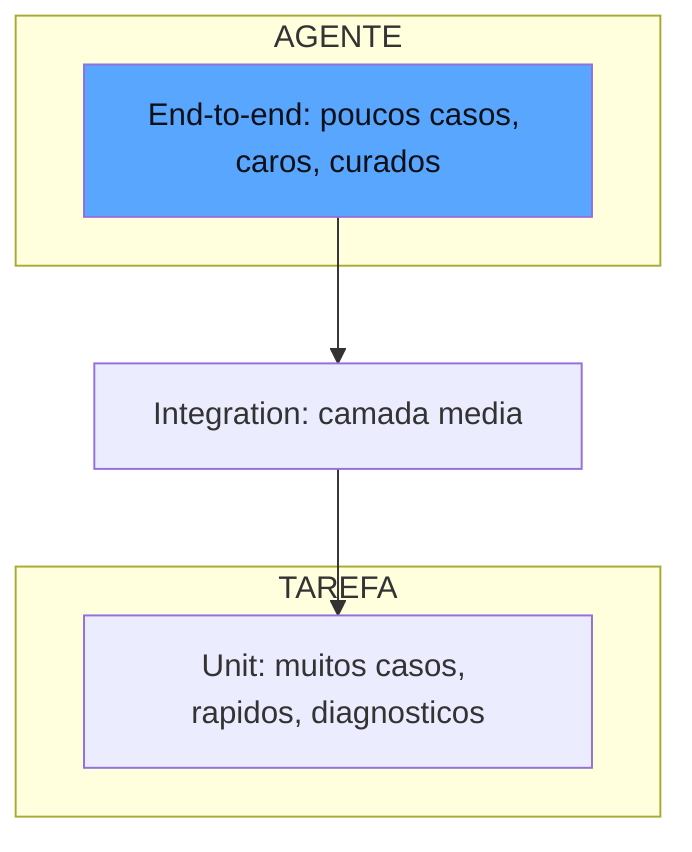

# Capítulo 3: Tipos de evals e a arte de escrevê-los: unit, integration, end-to-end, rubricas e critérios

## 1. Introdução

No Capítulo 2, você montou a arquitetura do painel de instrumentos: tarefas, tentativas, graders e datasets organizados nos regimes offline e online. Agora vamos preencher esse painel com os instrumentos certos para cada grandeza — a taxonomia completa dos tipos de evals. Você vai aprender a diferença estrutural entre unit, integration e end-to-end evals, quando cada um se aplica, e o que muda quando o alvo é um agente que age no mundo em vez de um modelo que responde. E vai dominar a parte mais difícil e menos documentada da disciplina: a arte de escrever evals que não enganam — critérios explícitos, rubricas que resistem ao julgamento automático e a disciplina de curadoria que mantém o padrão ouro honesto [1]. Ao final, você saberá exatamente qual tipo de eval usar para cada risco e como escrever um bom eval desde o primeiro rascunho.

## 2. Explica

A taxonomia de evals espelha a taxonomia de testes de software — com uma diferença crucial que você vai perceber agora. O **unit eval** avalia um componente isolado: a extração correta de uma entidade por um prompt, a aderência a um schema, a decisão de chamar ou não uma ferramenta. É o equivalente ao teste de unidade: rápido, barato, determinístico sempre que possível, e capaz de apontar o componente exato da falha [1]. Em um sistema de RAG, um unit eval típico verifica se o recuperador retornou o documento certo para uma pergunta; em um agente, verifica se a escolha de ferramenta foi correta dado um estado [2].

O **integration eval** avalia a interação entre componentes: o pipeline de RAG que recupera, enriquece o contexto e sintetiza a resposta; o agente que lê o resultado de uma ferramenta e decide o próximo passo. O custo sobe, o diagnóstico fica mais difuso — mas é o primeiro nível que mede o sistema como sistema, e não como coleção de peças [3].

O **end-to-end eval** avalia o fluxo completo no ambiente mais próximo possível do real: o agente de suporte que resolve o ticket do início ao fim, incluindo as chamadas reais ao sistema de CRM, as falhas intermediárias e a recuperação. É o teste de aceitação do agente — e é o único nível que responde à pergunta de negócio "o usuário final ficou satisfeito?" [1]. A Anthropic recomenda hierarquizar os três níveis com pesos decrescentes: a maioria dos casos deve viver no nível unit (rápido e diagnóstico), uma camada intermediária em integration, e um subconjunto pequeno, caro e curado em end-to-end — porque o end-to-end é lento, caro e frágil demais para ser a base da suíte [1].

Para agentes, há ainda uma dimensão que atravessa os três níveis: o **eval de trajetória**. Como você viu no Capítulo 2, um agente produz uma sequência de ações, e a resposta final pode estar correta apesar de uma trajetória catastrófica — ou errada apesar de uma trajetória impecável [1]. O eval de trajetória audita o caminho: as ferramentas usadas, a ordem, o tratamento de erros, o custo. É a avaliação que separa "funciona por sorte" de "funciona por desenho", e ela exige a modelagem de tentativa como transcrição completa que você construiu no capítulo anterior.

Dentro dessa arquitetura, a **arte de escrever evals** começa com uma decisão disciplinada: definir o que significa sucesso antes de escrever qualquer exemplo. A OpenAI formaliza isso na etapa Specify da cadeia — transformar objetivos vagos ("as respostas devem ser boas") em rubricas operacionais ("a resposta deve citar a fonte quando fizer afirmações sobre o produto; deve oferecer escalonamento quando o problema estiver fora do escopo") [4]. Uma rubrica boa tem três propriedades: é *observável* (dois anotadores chegam ao mesmo veredicto lendo o mesmo exemplo), é *discriminante* (separa o comportamento aceitável do inaceitável sem zona cinzenta) e é *testável por amostragem* (você consegue verificar, com um punhado de casos, se os avaliadores a estão aplicando de forma consistente) [2].

A qualidade do **exemplar** — cada caso do dataset — é o segundo pilar da arte. Um bom exemplar tem cobertura (representa uma categoria real de comportamento, não um caso isolado bonito), dificuldade calibrada (testa o limite do sistema sem ser trivia ou impossível) e ausência de vazamento (não foi usado para treinar ou ajustar o sistema — caso contrário, a medição mede memorização, não capacidade) [5]. A disciplina de curadoria contínua — transformar erros reais de produção em novos exemplares — é o que mantém o dataset vivo e a medição honesta ao longo do tempo [6].

Por fim, a armadilha mais sutil da arte: **evals que medem a si mesmos**. Quando o critério é vago o bastante para ser interpretado de formas diferentes a cada execução, o número resultante reflete o avaliador, não o sistema. A literatura de LLM-as-a-judge documenta os vieses sistemáticos desse fenômeno — viés de posição, de verbosidade e o "hacking" da recompensa, em que o sistema aprende a produzir o que o avaliador gosta de ver em vez do que o usuário precisa [7]. A calibração contra humanos é a vacina: um conjunto de exemplos julgados por humanos, usado para medir a concordância do avaliador automático e corrigi-lo quando diverge [8].

## 3. Ilustra

Pense na manutenção de uma frota de locomotivas — nosso motivo condutor. A estrada de ferro não testa a locomotiva de uma única forma; ela tem uma hierarquia deliberada de inspeções. O **unit eval** é o teste de bancada do maquinista: a válvula abre? o manômetro responde à pressão? Cada peça é testada isoladamente, em segundos, no galpão — se a válvula falha, você sabe exatamente qual é. O **integration eval** é o teste de acoplamento: a caldeira aquece quando o fogo é aceso? o pistão se move quando o vapor chega? Você testa as interações críticas entre sistemas, ainda em condições controladas. O **end-to-end eval** é a viagem de homologação: a locomotiva reboca um trem completo, de estação a estação, com carga real, em trilho real — e só depois disso ela é aprovada para a linha [1].

A hierarquia importa por uma razão econômica que o maquinista veterano conhece: você não leva a frota inteira para a viagem de homologação todo dia — isso custaria caro e pararia a operação. A maioria das verificações é de bancada (unit), um subconjunto é de acoplamento (integration), e uma amostra curada é a homologação (end-to-end). Quem inverte a pirâmide — homologando tudo e testando quase nada na bancada — ou gasta demais ou, pior, testa tudo do mesmo jeito lento e raso.

E o eval de trajetória tem sua analogia no livro de bordo: a homologação não é aprovada apenas porque o trem chegou — é aprovada porque o maquinista registrou cada estação, cada mudança de velocidade, cada manobra. Um trem que chegou ao destino virando as curvas erradas está um acidente esperando a próxima via. Como Engenheiro de Qualidade de IA, você já intui que a mesma lógica vale para o agente: a resposta final certa com trajetória errada é uma bomba-relógio [1].



O diagrama mostra a pirâmide recomendada: a base larga de unit evals (rápidos, baratos, diagnóstico preciso), a camada intermediária de integration e o vértice enxuto de end-to-end — a proporção que a indústria adota para equilibrar custo e cobertura [1].

## 4. Técnica

### A Fábrica de Evals por Nível

Antes de construir os três níveis, vale fixar o princípio que organiza a fábrica: cada nível responde a uma pergunta diferente, e a pergunta é o que decide o desenho. O unit eval responde "este componente, isoladamente, fez a escolha certa?"; o integration responde "estes componentes, trabalhando juntos, produziram o resultado esperado?"; o end-to-end responde "o sistema inteiro, no ambiente mais próximo do real, cumpriu o objetivo de negócio?". A disciplina de fábrica é nunca confundir as perguntas: o unit eval que exige o ambiente inteiro deixou de ser unit (e herdou o custo do end-to-end sem o poder de diagnóstico deste); o end-to-end que testa só um componente é um unit disfarçado, caro e sem o valor de aceitação que justifica o custo [1]. A indústria recomenda registrar, no cabeçalho de cada eval, a pergunta que ele responde — a disciplina que impede a deriva silenciosa de nível quando a suíte cresce [3].

Vamos construir os três níveis na prática, sobre o esqueleto dos capítulos anteriores. Começamos com a infraestrutura de um unit eval típico — testando a decisão de chamar uma ferramenta:

```python
from dataclasses import dataclass, field
from typing import Any, Dict, List, Optional


@dataclass
class UnitEval:
    """Um eval de nivel unit: componente isolado, veredicto binario e barato."""
    nome: str
    caso: str
    entradas: Dict[str, Any] = field(default_factory=dict)

    def executar(self, componente: Any) -> "ResultadoUnit":
        saida = componente(**self.entradas)
        return ResultadoUnit(nome=self.nome, saida=saida)


@dataclass
class ResultadoUnit:
    nome: str
    saida: Any
    aprovado: bool = False
    motivo: str = ""


def verifica_decisao_de_ferramenta(resultado: ResultadoUnit, esperado: str) -> ResultadoUnit:
    """Grader de unit: a decisao do componente bate com o esperado?"""
    resultado.aprovado = resultado.saida == esperado
    resultado.motivo = (
        "Decisao correta" if resultado.aprovado else f"Esperava {esperado}, veio {resultado.saida}"
    )
    return resultado
```

Note o detalhe: escrevemos o grader *antes* de escrever o componente — a disciplina eval-driven que será o tema do Capítulo 10. O critério existe primeiro; o código vem depois [4].

### O Integration Eval com Estado Compartilhado

O integration eval testa a interação entre componentes. Vamos modelar um pipeline de RAG de dois estágios:

```python
@dataclass
class Documento:
    id: str
    texto: str


@dataclass
class PipelineRAG:
    """Pipeline de dois estagios: recupera o documento e sintetiza a resposta."""
    def __init__(self, documentos: List[Documento]) -> None:
        self.documentos = documentos

    def recuperar(self, pergunta: str) -> Optional[Documento]:
        for doc in self.documentos:
            if any(palavra in doc.texto for palavra in pergunta.split()):
                return doc
        return None

    def responder(self, pergunta: str) -> str:
        doc = self.recuperar(pergunta)
        if doc is None:
            return "Nao encontrei informacoes suficientes."
        return f"Segundo o documento {doc.id}: {doc.texto[:120]}"


@dataclass
class IntegrationEval:
    """Eval de integracao: mede a interacao recuperacao + sintese."""
    nome: str
    pergunta: str
    documento_esperado: str

    def executar(self, pipeline: PipelineRAG) -> Dict[str, Any]:
        doc_recuperado = pipeline.recuperar(self.pergunta)
        resposta = pipeline.responder(self.pergunta)
        return {
            "doc_recuperado": doc_recuperado.id if doc_recuperado else None,
            "resposta": resposta,
            "aprovado": bool(doc_recuperado and doc_recuperado.id == self.documento_esperado),
        }
```

O integration eval verifica uma propriedade que nenhum unit eval captura: o recuperador e o sintetizador trabalhando juntos. O recuperador pode estar perfeito isoladamente e o pipeline falhar na síntese — e vice-versa [3].

### O End-to-End Eval do Agente

O end-to-end eval exercita o agente completo em um ambiente simulado de produção. Vamos modelar um agente de triagem de chamados com ambiente controlado e cronômetro de custo:

```python
@dataclass
class Chamado:
    id: str
    descricao: str
    categoria_correta: str


@dataclass
class AgenteDeTriagem:
    """Agente sob teste: classifica chamados de TI e decide a fila."""
    def __init__(self) -> None:
        self.passos: List[str] = []

    def classificar(self, chamado: Chamado) -> str:
        self.passos.append(f"classificar:{chamado.id}")
        if "senha" in chamado.descricao.lower():
            return "fila_autoatendimento"
        if "impossivel" in chamado.descricao.lower():
            return "fila_critica"
        return "fila_geral"


@dataclass
class CenarioE2E:
    """Um cenario completo de end-to-end: ambiente, acao e criterio de sucesso."""
    chamados: List[Chamado]
    criterio_de_sucesso: str


def rodar_e2e(agente: AgenteDeTriagem, cenario: CenarioE2E) -> Dict[str, Any]:
    acertos = 0
    custo_passo = len(cenario.chamados)
    for chamado in cenario.chamados:
        categoria = agente.classificar(chamado)
        if categoria == chamado.categoria_correta:
            acertos += 1
    return {
        "acertos": acertos,
        "total": len(cenario.chamados),
        "precisao": acertos / len(cenario.chamados) if cenario.chamados else 0.0,
        "passos_executados": len(agente.passos),
        "custo_estimado_tokens": custo_passo * 10,
    }
```

Repare no retorno: o end-to-end mede o resultado de negócio (precisão), mas também registra o custo e os passos — porque um agente que acerta 100% dos casos queimando o triplo dos tokens previstos não é um sucesso operacional [1].

### Escrevendo a Rubrica

A última técnica do capítulo é a rubrica — o critério explícito que guia o julgamento e a calibração. Vamos implementar uma rubrica avaliável com verificação de consistência:

```python
@dataclass
class Rubrica:
    """Rubrica operacional: dimensao, niveis e exemplos de ancoragem."""
    dimensao: str
    niveis: Dict[str, str]  # ex.: {"aprovado": "cita a fonte", "reprovado": "nao cita"}
    exemplos: Dict[str, str] = field(default_factory=dict)


def avaliar_com_rubrica(resposta: str, rubrica: Rubrica) -> str:
    """Aplica a rubrica de forma deterministica quando possivel (heuristica simples)."""
    for nivel, descricao in rubrica.niveis.items():
        if "cita" in descricao and "fonte" in resposta.lower():
            return nivel
    if len(resposta.split()) < 10:
        return "reprovado"
    return "aprovado"


RUBRICA_FIDELIDADE = Rubrica(
    dimensao="fidelidade",
    niveis={
        "aprovado": "resposta fundamentada em contexto ou fonte",
        "reprovado": "resposta inventada ou sem fundamento",
    },
)
```

A rubrica é o elo entre a especificação humana e o julgamento automático: quanto mais observável for a descrição de cada nível, menor a divergência entre avaliadores — humanos e modelos [2].

## 5. Aplica

### A Cena de Contraste

Você é responsável pelo primeiro agente de IA do banco, um assistente que resume extratos e responde dúvidas sobre tarifas. O time de compliance pediu garantia de qualidade, e você, seguindo o instinto comum, contratou uma suíte de cem casos end-to-end: cem perguntas reais de clientes, cada uma exigindo uma resposta perfeita. O pipeline rodava duas horas por execução, custava centenas de reais em tokens, e quando um caso falhava você não sabia se o problema era o recuperador de documentos, o resumidor, a política de tarifas ou o modelo de resposta.

O erro foi inverter a pirâmide: cem end-to-end é o desenho que você viu na seção Ilustra ser rejeitado pelo maquinista veterano. O diagnóstico: o end-to-end tem ótimo poder de aceitação e péssimo poder de diagnóstico — a falha aparece como um sintoma agregado, e isolar a causa exige instrumentação adicional. A correção: reestruturar a suíte para a pirâmide — quinhentos unit evals (extração de data, formatação de moeda, aderência a schema, decisão de escalonamento), oitenta integration evals (recuperação + síntese, extração + formatação) e vinte end-to-end curados com rubrica explícita [1]. O custo por execução caiu de duas horas para quatro minutos, o diagnóstico da falha passou a apontar o componente, e o end-to-end — agora enxuto — passou a ser usado só para a decisão final de promoção [3].

O segundo erro, mais sutil, apareceu na revisão: metade dos unit evals tinha critérios vagos ("resposta razoável"), e os dois engenheiros que revisaram a suíte discordavam em 40% dos casos. A correção foi a rubrica observável de três níveis com exemplos de ancoragem — e a discordância caiu para 5% sem reescrever um único caso [2].

### Armadilhas Comuns

- **Suíte inteira de end-to-end**: cara, lenta e sem poder diagnóstico. A pirâmide existe por um motivo [1].
- **Unit evals com critério subjetivo**: "resposta razoável" não é um critério — é uma opinião repetida. Rubricas observáveis ou grader determinístico, sempre que possível [2].
- **Dataset estático**: o padrão ouro que nunca recebe os erros de produção vira uma medalha antiga — a medição se descola da realidade. Curadoria contínua é obrigatória [6].

### A Matriz de Seleção do Nível Certo

A matriz ganha uma quinta variável quando o sistema avaliado é um agente que age: a *granularidade da trajetória*. Um agente que executa vinte ações por tarefa exige, em qualquer nível, que os evals de trajetória do Capítulo 7 estejam presentes — porque a resposta final de um agente é apenas o último elo de uma corrente, e a corrente é o que precisa ser auditada [1]. A aplicação da matriz a um agente concreto ilustra o raciocínio: o eval de "escolha da ferramenta correta" é unit (componente isolado, diagnóstico preciso); o eval de "recuperou e sintetizou" é integration (interação entre dois componentes); o eval de "resolveu o ticket do cliente" é end-to-end (ambiente completo); e o eval de "usou a ferramenta na ordem correta" é trajetória — e ele atravessa os três níveis, porque a ordem correta pode falhar em qualquer camada [3]. A suíte madura de um agente documenta as quatro perguntas para cada caso, e a documentação é o que impede que a suíte cresça sem direção [2].

A pergunta prática que todo engenheiro enfrenta ao desenhar uma suíte é "que nível uso para cada caso?". Vamos transformar essa pergunta em uma matriz de decisão — as quatro variáveis que determinam o nível adequado de um eval. A primeira variável é o **poder diagnóstico exigido**: quando você precisa saber *qual* componente falhou, o unit é a escolha — ele isola a peça; quando a pergunta é *se o sistema como um todo cumpre o contrato*, o end-to-end é o único que responde [1]. A segunda é o **custo por execução tolerado**: unit em milissegundos, integration em segundos, end-to-end em minutos — e o custo cresce com o ambiente real, porque cada execução end-to-end toca ferramentas, bancos e estados [3].

A terceira variável é a **estabilidade do ambiente**: um agente que opera contra APIs de terceiros (lentas, instáveis, mutáveis) torna o end-to-end flakky — o eval falha por causa do ambiente, não do sistema — e a compensação é a camada de integration com mocks, reservando o end-to-end para os cenários curados de homologação [2]. A quarta variável é o **ciclo de decisão**: um gate de CI que roda a cada pull request precisa de uma suíte em minutos; uma decisão de release mensal tolera uma suíte em horas. A regra que emerge da matriz é a pirâmide revisitada: o nível certo não é um gosto, é uma resposta às quatro variáveis — e a suíte madura é a que documenta essa resposta para cada caso, em vez de escolher o nível por hábito [1].

### A Anatomia de um Bom Exemplar

Vamos desmontar um exemplar ideal para ver a disciplina em ação. Um caso de eval de qualidade tem seis partes, e omitir qualquer uma delas corrompe a medição de um jeito específico. A primeira parte é a **categoria declarada**: o caso pertence a uma classe de comportamento (caminho feliz, borda, adversarial, incidente), e a declaração é o que permite medir a cobertura — sem categoria, o caso é um ponto solto que não conta para nenhuma dimensão da cobertura [4]. A segunda é a **tarefa completa**: instruções, contexto, ferramentas e estado inicial — a tarefa do Capítulo 2, sem cortes, porque um contexto truncado muda o comportamento avaliado. A terceira é a **saída de referência**: a resposta esperada, escrita pelo especialista — e o detalhe: a referência descreve o *critério*, não um texto canônico, para não engessar sistemas que podem acertar por caminhos diferentes [2].

A quarta parte é a **dificuldade calibrada**: o caso deve testar a fronteira do aceitável — não a trivialidade que todo mundo acerta, nem a impossibilidade que ninguém acerta. A quinta é a **origem registrada**: produção, especialista ou síntese — a origem é o que permite auditar por que o caso existe e priorizar a curadoria. E a sexta é o **histórico de veredictos**: cada execução registra o resultado, e o histórico é o que revela o caso degenerado — o caso que nunca falha ou nunca passa deixou de medir [6]. O exercício de auditar uma suíte existente com essa anatomia em mãos é revelador: a maioria das suítes tem exemplares com tarefa truncada, referência vaga e origem perdida — e cada uma dessas lacunas é uma fonte silenciosa de números mentirosos [4].

### A Conexão com o Ecossistema de Avaliação

A taxonomia deste capítulo é o vocabulário que a indústria usa em toda a superestrutura — e conhecer a correspondência entre a taxonomia e o ecossistema facilita a leitura de qualquer material técnico e a escolha de qualquer ferramenta. A documentação do LangSmith organiza os mesmos níveis como offline (o unit e o integration, medidos contra datasets) e online (o end-to-end, monitorado em produção) — a mesma distinção do Capítulo 2, agora vista pelo ângulo da taxonomia [4]. Os frameworks de testes de LLM traduzem os níveis em primitivas: o DeepEval expõe os unit evals como funções de teste que rodam em CI, e as suítes de benchmark como golden sets executáveis — a materialização da pirâmide em código de produção [9]. E os guias práticos da indústria, como o da Langfuse, consolidam a mesma recomendação de hierarquia: a maioria dos casos em unit, a camada média em integration e o vértice curado em end-to-end, com o custo como a variável que governa a proporção [5].

A taxonomia também conecta este capítulo ao red-teaming do Capítulo 9: os evals adversariais — os casos que testam a resiliência — são uma categoria transversal que atravessa os três níveis, e a classificação dos casos por categoria é o que permite ao manual de armadilhas do Capítulo 9 reutilizar a mesma estrutura de dados do golden set [2]. E há a dimensão de evolução que o ecossistema documenta: benchmarks públicos como o SWE-bench mostram a taxonomia aplicada em escala industrial — o unit (a função isolada), o integration (o repositório inteiro) e o end-to-end (a resolução da issue completa), com a mesma hierarquia de custo e diagnóstico que a pirâmide recomenda [10]. A leitura do ecossistema com a taxonomia em mente é o que transforma a pesquisa de mercado em decisão informada: cada ferramenta, benchmark e guia se posiciona em algum lugar da pirâmide, e o profissional que conhece a taxonomia pergunta imediatamente qual nível a ferramenta cobre e qual deixa de fora [5]. A plataforma de observabilidade com tracing e scores, como a Langfuse, fecha o quadro: os mesmos componentes — tarefa, tentativa, grader, dataset — aparecem como primitivas da plataforma, confirmando que a taxonomia não é uma abstração acadêmica, mas o modelo de dados que a indústria inteira adotou para avaliar sistemas de IA [6].

A taxonomia se conecta também às camadas de segurança e à operação que a obra constrói nos capítulos seguintes. As CLIs de teste de prompt oferecem a matriz de comparação entre versões e a varredura de red-teaming embutida — a taxonomia aplicada ao adversarial [11]. Os riscos do OWASP são categorias transversais que atravessam os três níveis: a injeção pode falhar no unit (o componente que processa o conteúdo), no integration (a cadeia recupera-sintetiza) e no end-to-end (o agente completo sob ataque) [12]. E a própria arquitetura dos agentes — workflows versus agentes autônomos — decide quais níveis de eval são relevantes: um workflow determinístico exige menos end-to-end, enquanto um agente autônomo exige a pirâmide inteira com ênfase na trajetória [13].

As camadas de garantia dos capítulos seguintes se apoiam na mesma taxonomia: a auto-correção avalia a tentativa em múltiplas rodadas — um loop de unit evals sobre o próprio processo de aprendizagem [14]; a revisão autônoma entre harnesses é o end-to-end elevado a auditoria, com o revisor no papel de grader da trajetória [15]; e o paradigma do Human-on-the-Bridge usa a taxonomia para escalar — armadilhas curadas por humanos, execução automática em todos os níveis [16]. No nível da governança, o NIST AI RMF situa a taxonomia na função Measure, exigindo que os níveis e os critérios sejam documentados [17]; os guias de testes de segurança traduzem o OWASP em suítes de red-team com a mesma estrutura de casos [18]; e os guias de CI/CD mostram a pirâmide operando no pipeline — a maioria determinística em todo PR, o model-based em amostra [19]. A disciplina de CI para sistemas não determinísticos documentada pela Galileo — precisão de seleção de ferramentas, coerência de raciocínio, detecção de alucinação — é exatamente a taxonomia aplicada às métricas de agentes [20]. A taxonomia, em suma, é o vocabulário que permite à obra inteira falar a mesma língua: dos testes isolados à auditoria institucional [1].

## 6. Conclusão

Este capítulo completou a taxonomia do painel: unit, integration e end-to-end evals em uma pirâmide de custo e diagnóstico, atravessada pela dimensão de trajetória que define a avaliação de agentes. Você aprendeu que a arte de escrever evals começa na especificação — rubricas observáveis, exemplares com cobertura e sem vazamento — e que a calibração contra humanos é a vacina contra evals que medem a si mesmos. O desafio: classifique os evals do sistema que você construiu nos capítulos anteriores nos três níveis, meça a proporção e corrija a pirâmide se ela estiver invertida. No Capítulo 4, você vai mergulhar na camada mais confiável da medição — os graders determinísticos — aprendendo o que o código pode provar e onde ele é cego demais.

## 7. Referências Bibliográficas

[1] ANTHROPIC. *Demystifying evals for AI agents*. 2026. Disponível em: https://www.anthropic.com/engineering/demystifying-evals-for-ai-agents. Acesso em: 06 ago. 2026.

[2] BRAINTRUST. *What is an LLM-as-a-judge? When to use it (and when to use deterministic evals)*. 2026. Disponível em: https://www.braintrust.dev/articles/what-is-llm-as-a-judge. Acesso em: 06 ago. 2026.

[3] LANGCHAIN. *LangSmith evaluation concepts*. 2026. Disponível em: https://docs.smith.langchain.com/evaluation. Acesso em: 06 ago. 2026.

[4] OPENAI. *How evals drive the next chapter in AI for businesses*. 2025. Disponível em: https://openai.com/index/evals-drive-next-chapter-of-ai/. Acesso em: 06 ago. 2026.

[5] CONFIDENT AI. *DeepEval: LLM evaluation unit testing in CI/CD*. 2026. Disponível em: https://deepeval.com/docs/evaluation-unit-testing-in-ci-cd. Acesso em: 06 ago. 2026.

[6] LANGFUSE. *LLM evaluation: methods, best practices, and a practical roadmap*. 2025. Disponível em: https://langfuse.com/blog/2025-11-12-evals. Acesso em: 06 ago. 2026.

[7] BRAINTRUST. *Eval-driven development*. 2026. Disponível em: https://www.braintrust.dev/articles/eval-driven-development. Acesso em: 06 ago. 2026.

[8] CHASE, Harrison. *Aligning LLM-as-a-judge with human preferences*. LangChain, 2024. Disponível em: https://www.langchain.com/blog/aligning-llm-as-a-judge-with-human-preferences. Acesso em: 06 ago. 2026.

[9] CONFIDENT AI. *DeepEval: LLM evaluation unit testing in CI/CD*. 2026. Disponível em: https://deepeval.com/docs/evaluation-unit-testing-in-ci-cd. Acesso em: 06 ago. 2026.

[10] EPOCH AI. *SWE-bench verified evaluation methodology*. 2026. Disponível em: https://epoch.ai/benchmarks/swe-bench-verified. Acesso em: 06 ago. 2026.

[11] PROMPTFOO. *Introduction and docs*. 2026. Disponível em: https://www.promptfoo.dev/docs/intro/. Acesso em: 06 ago. 2026.

[12] OWASP FOUNDATION. *OWASP GenAI security project (top 10 for LLM applications)*. 2026. Disponível em: https://owasp.org/www-project-top-10-for-large-language-model-applications/. Acesso em: 06 ago. 2026.

[13] ANTHROPIC. *Building effective agents*. 2024. Disponível em: https://www.anthropic.com/engineering/building-effective-agents. Acesso em: 06 ago. 2026.

[14] SHINN, Noah; CASSANO, Federico; NARASIMHAN, Karthik et al. *Reflexion: language agents with verbal reinforcement learning*. Princeton/MIT, 2023. Disponível em: https://arxiv.org/abs/2303.11366. Acesso em: 06 ago. 2026.

[15] YU, Fangyi et al. *When AIs judge AIs: the rise of agent-as-a-judge evaluation for LLMs*. Stanford/Scale AI, 2025. Disponível em: https://arxiv.org/html/2508.02994v1. Acesso em: 06 ago. 2026.

[16] BOUSETOUANE, Fouad. *Human-on-the-bridge: scalable evaluation for AI agents*. ProofAgent/UChicago, 2026. Disponível em: https://arxiv.org/html/2606.16871v1. Acesso em: 06 ago. 2026.

[17] NIST. *AI risk management framework (AI RMF 1.0)*. 2023. Disponível em: https://www.nist.gov/itl/ai-risk-management-framework. Acesso em: 06 ago. 2026.

[18] EVIDENTLY AI. *OWASP top 10 LLM and testing methodologies*. 2025/2026. Disponível em: https://www.evidentlyai.com/blog/owasp-top-10-llm. Acesso em: 06 ago. 2026.

[19] LATITUDE. *The ultimate CI/CD LLM evaluation guide*. 2026. Disponível em: https://latitude.so/blog/ultimate-ci-cd-llm-evaluation-guide. Acesso em: 06 ago. 2026.

[20] BRONSDON, Conor. *Continuous integration (CI) for AI: fundamentals*. Galileo AI, 2025. Disponível em: https://galileo.ai/blog/continuous-integration-ci-ai-fundamentals. Acesso em: 06 ago. 2026.


