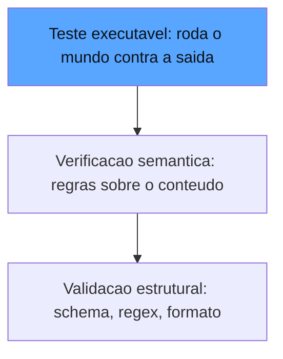

# Capítulo 4: Graders determinísticos: código, regex, schemas e testes executáveis

## 1. Introdução

No Capítulo 3, você aprendeu a hierarquia de evals e a arte das rubricas. Agora vamos descer ao nível mais fundamental do painel de instrumentos: os graders determinísticos — a camada de avaliação que não depende de nenhum modelo para julgar, apenas de código, padrões e schemas. Esta é a camada onde a confiança é mais barata e mais sólida: quando o critério é verificável por máquina, não há espaço para viés, interpretação ou flutuação de temperatura. Você vai aprender a validar estrutura, a rodar testes de verdade na saída de coding agents e — igualmente importante — a reconhecer o limite exato em que o determinístico deixa de ser suficiente e a medição precisa subir para a camada model-based [1]. Ao final, você será capaz de construir uma camada de verificadores determinísticos que cobre de 40% a 70% das dimensões de qualidade de um agente típico — sem gastar um único token em julgamento.

## 2. Explica

O grader determinístico é a tradução direta da inspeção mecânica do mundo industrial para o mundo dos agentes: a peça é conferida contra um gabarito físico, e a resposta é binária — encaixa ou não encaixa. No contexto de sistemas de IA, o gabarito assume três formas principais, e você vai perceber que elas formam uma escala de sofisticação crescente [1].

A primeira forma é a **validação estrutural**: a saída deve respeitar um formato — um JSON com determinadas chaves, um texto que casa com um regex, uma lista com cardinalidade esperada. É o nível mais barato e mais cego: garante que a resposta *tem a forma certa*, mas não diz nada sobre *se o conteúdo é verdadeiro*. Um agente que devolve `{"acao": "escalar", "justificativa": "..."}` passa na validação estrutural mesmo que a decisão de escalar seja absurda [2]. A validação estrutural é o cinto de segurança: não evita o acidente, mas limita o estrago e garante que os sistemas a jusante consigam processar a saída sem quebrar.

A segunda forma é a **verificação semântica determinística**: checagens que, embora operem sobre o conteúdo, ainda são decidíveis por regras — a resposta contém a chave de um catálogo? o e-mail gerado menciona o nome do cliente? a data está dentro do intervalo contratual? Aqui o gabarito é mais inteligente, mas ainda é um gabarito: só funciona quando a verdade pode ser derivada de regras conhecidas a priori. É a camada onde moram as verificações de ausência — de PII, de palavras proibidas, de referências a concorrentes [3].

A terceira forma é a mais poderosa e a mais específica do mundo dos agentes: **os testes executáveis**. Em vez de julgar a saída, você *executa* algo sobre ela. Para coding agents, isso significa rodar o código gerado contra uma suíte de testes reais — o mesmo mecanismo que o SWE-bench usa para avaliar agentes que resolvem issues de repositórios: o agente entrega um patch, e o veredicto vem de rodar os testes unitários do repositório [4]. Para agentes de dados, significa executar a consulta SQL gerada contra um schema de teste; para agentes de infra, significa aplicar o Terraform gerado em um sandbox e verificar o estado resultante. O teste executável transforma o julgamento em observação: não é um avaliador opinando sobre a resposta, é o mundo reagindo à resposta [1].

A distinção que organiza tudo é a que a Braintrust formaliza na escolha entre *deterministic evals* e *LLM-as-a-judge*: use o determinístico sempre que o critério puder ser verificado por máquina — ele é mais barato, mais rápido, 100% reprodutível e imune a viés; reserve o modelo para as dimensões genuinamente qualitativas — tom, fidelidade aberta, aderência a política — onde não existe gabarito mecânico [2]. A regra de ouro é uma hierarquia de custo: a cada dimensão de qualidade, comece perguntando "existe um teste de código para isso?" — e só quando a resposta for "não" suba para o modelo. A maioria dos times inverte essa ordem e paga o preço em custo e flakiness [1].

Há ainda uma propriedade dos graders determinísticos que os torna a espinha dorsal de qualquer suíte: a **composicionalidade**. Verificadores simples se combinam em verificadores complexos — o schema valida a estrutura, o regex valida a ausência de PII, o teste executável valida o comportamento, e a conjunção deles define a qualidade de uma dimensão inteira. Essa composição é o que permite construir painéis com milhares de pontos de verificação baratos, que rodam em segundos e apontam o componente exato da falha [5].

## 3. Ilustra

Voltemos à oficina de manutenção da estrada de ferro — o motivo condutor desta obra. O galpão de manutenção tem duas classes de instrumentos, e o maquinista veterano sabe a diferença entre elas. A primeira classe é a do **gabarito de encaixe**: a caldeira nova precisa encaixar no chassi com tolerância de meio milímetro; o parafuso precisa casar com a rosca; o manômetro precisa parafusar no encaixe padrão. Esses são os verificadores estruturais — baratos, rápidos, binários, e que não dizem nada sobre se a caldeira aguenta pressão. A segunda classe é a do **teste de bancada**: você enche a caldeira de água, acende o fogo, leva a pressão ao limite e observa se a válvula de segurança abre no ponto calibrado. Esse é o teste executável — você não *opina* sobre a válvula, você *faz a válvula trabalhar* e observa o mundo reagir.

O ponto que o maquinista veterano ensina ao aprendiz é a hierarquia de custo e confiança: o gabarito custa segundos e cobre a forma; o teste de bancada custa minutos e cobre o comportamento; e nenhum dos dois substitui o outro — uma caldeira que encaixa perfeitamente mas explode no teste de pressão é tão inútil quanto uma que não encaixa nem na bancada.

Como Engenheiro de Qualidade de IA, você reconhece nessa oficina o desenho exato da camada determinística: primeiro a estrutura (schema, regex, formato), depois o comportamento (testes executáveis), e a regra de não pular etapas — a estrutura barata detecta o erro comum em segundos, e o teste de bancada prova o comportamento que nenhum gabarito consegue garantir [4].



O diagrama mostra a escada em ordem de poder e custo: cada degrau adiciona capacidade de julgamento — e cada degrau é decidível por máquina, sem modelo [1].

## 4. Técnica

### A Camada Estrutural

A camada estrutural é onde a disciplina de falha-fechada mais importa, e vale aprofundar o porquê. Um verificador determinístico que falha — uma exceção não tratada, um schema que mudou e quebrou o parser, um regex inválido — não pode silenciosamente devolver "aprovado": isso corromperia a métrica com um falso positivo que nenhuma calibração detectaria depois, porque a calibração compara veredictos, não suspeita de quem os produziu [3]. O padrão recomendado pela indústria para a camada estrutural é triplo: o verificador registra o erro de infraestrutura em um canal separado (não no veredicto normal), a dimensão inteira reprova quando qualquer verificador falha (falha-fechada), e o relatório da execução lista os verificadores que falharam por infraestrutura — porque um verificador quebrado é uma lacuna de cobertura que precisa de reparo imediato, não de um número a mais no painel [1]. É essa disciplina que transforma a camada estrutural na base confiável sobre a qual os capítulos 5 e 6 constroem as camadas mais sofisticadas [5].

Começamos pelo degrau mais barato: a validação estrutural. Vamos construir um verificador de schema flexível e compor verificadores:

```python
from dataclasses import dataclass, field
from typing import Any, Callable, Dict, List, Optional


@dataclass
class VeredictoDeterministico:
    """Veredicto da camada deterministica: binario, barato e reprodutivel."""
    dimensao: str
    aprovado: bool
    evidencia: str = ""
    custo_segundos: float = 0.001


Verificador = Callable[[str, Dict[str, Any]], VeredictoDeterministico]


def verifica_json_schema(
    saida: str, spec: Dict[str, Any]
) -> VeredictoDeterministico:
    """Valida a saida contra um schema declarativo de chaves e tipos."""
    import json

    try:
        objeto = json.loads(saida)
    except json.JSONDecodeError as erro:
        return VeredictoDeterministico("schema", False, f"JSON invalido: {erro}")
    for chave, tipo in spec.items():
        if chave not in objeto:
            return VeredictoDeterministico(
                "schema", False, f"Chave ausente: {chave}"
            )
        if tipo == "float" and not isinstance(objeto[chave], (int, float)):
            return VeredictoDeterministico(
                "schema", False, f"Chave {chave} nao e numero"
            )
        if tipo == "str" and not isinstance(objeto[chave], str):
            return VeredictoDeterministico(
                "schema", False, f"Chave {chave} nao e texto"
            )
    return VeredictoDeterministico("schema", True, "Schema valido")


def verifica_ausencia_de_pii(
    saida: str, padroes: Dict[str, str]
) -> VeredictoDeterministico:
    """Verifica que a saida nao contem dados sensiveis por regex."""
    import re

    violacoes: List[str] = []
    for nome, padrao in padroes.items():
        if re.search(padrao, saida, flags=re.IGNORECASE):
            violacoes.append(nome)
    if violacoes:
        return VeredictoDeterministico(
            "privacidade", False, f"PII detectada: {sorted(violacoes)}"
        )
    return VeredictoDeterministico("privacidade", True, "Sem PII na saida")
```

### A Camada Executável

O degrau mais poderoso: rodar testes de verdade na saída. Para coding agents, o padrão é o do SWE-bench — o agente entrega um patch e o veredicto é a execução dos testes [4]:

```python
import subprocess
import tempfile
from pathlib import Path


def verifica_patch_com_testes(
    codigo_gerado: str,
    teste_unitario: str,
    arquivo_alvo: str = "solucao.py",
) -> VeredictoDeterministico:
    """Roda o codigo gerado junto com um teste unitario real e devolve o veredicto."""
    with tempfile.TemporaryDirectory() as tmp:
        base = Path(tmp)
        (base / arquivo_alvo).write_text(codigo_gerado, encoding="utf-8")
        (base / "test_solucao.py").write_text(teste_unitario, encoding="utf-8")
        resultado = subprocess.run(
            ["python", "-m", "pytest", "test_solucao.py", "-q"],
            cwd=base,
            capture_output=True,
            text=True,
            timeout=30,
        )
        if resultado.returncode == 0:
            return VeredictoDeterministico(
                "comportamento", True, "Todos os testes passaram"
            )
        ultimas_linhas = (resultado.stdout or "").strip().splitlines()[-3:]
        return VeredictoDeterministico(
            "comportamento", False, " | ".join(ultimas_linhas)
        )
```

O detalhe operacional que separa o profissional do amador: o teste roda em um diretório temporário isolado, com timeout, e o veredicto captura a evidência do fracasso — não apenas o binário. É essa evidência que permite debugar a falha sem re-executar o cenário inteiro [1].

### Composição de Verificadores

A espinha dorsal do painel é a composição — vários verificadores simples formando uma dimensão inteira:

```python
def compor_dimensao(
    saida: str,
    contexto: Dict[str, Any],
    verificadores: List[Verificador],
) -> List[VeredictoDeterministico]:
    """Roda todos os verificadores de uma dimensao e agrega os veredictos."""
    veredictos: List[VeredictoDeterministico] = []
    for verificador in verificadores:
        try:
            veredictos.append(verificador(saida, contexto))
        except Exception as erro:  # um verificador quebrado reprova a dimensao
            veredictos.append(
                VeredictoDeterministico("erro_infra", False, f"Verificador falhou: {erro}")
            )
    return veredictos


def dimensao_aprovada(veredictos: List[VeredictoDeterministico]) -> bool:
    return all(v.aprovado for v in veredictos)
```

Repare na decisão de falha-fechada: se um verificador lança exceção — código do agente com sintaxe quebrada, schema inesperado — a dimensão inteira reprova. Na medição de confiança, uma falha de infraestrutura nunca pode virar silêncio [3].

### Quando Subir para o Modelo

A última técnica é o reconhecimento do limite. Vamos implementar o detector de "não-determinístico demais para regex":

```python
def precisa_de_grader_modelo(veredictos: List[VeredictoDeterministico]) -> bool:
    """Detecta dimensoes sem cobertura deterministica: sinal para subir de camada."""
    dimensoes_cobertas = {v.dimensao for v in veredictos}
    dimensoes_criticas = {"fidelidade", "tom", "aderencia_a_politica"}
    return bool(dimensoes_criticas - dimensoes_cobertas)
```

Essa função é a fronteira entre este capítulo e o próximo: quando a dimensão crítica não tem gabarito mecânico — fidelidade aberta, tom, aderência a política — o painel sobe para a camada model-based, o tema do Capítulo 5 [2].

## 5. Aplica

### A Cena de Contraste

Sua equipe mantém um agente que gera relatórios financeiros semanais. Você, seguindo o instinto comum de "quanto mais sofisticado melhor", contratou um serviço de LLM-as-a-judge para avaliar todas as respostas — cada execução da suíte custava reais em tokens, e o pior: os veredictos flutuavam entre execuções na mesma temperatura, porque o julgamento qualitativo é inerentemente variável. Na terceira semana, um relatório com a estrutura correta, mas com o número do trimestre errado, passou no juiz por três execuções seguidas — o modelo avaliador elogiou a clareza do texto e não conferiu o número.

O erro foi usar a ferramenta mais cara para o problema mais barato: a estrutura do relatório e a consistência dos números são perfeitamente verificáveis por código — chaves do JSON, formatação de moeda, presença do trimestre, valor batendo com o banco de dados [1]. O diagnóstico, ligando à hierarquia da seção Explica: cada dimensão tem a camada de julgamento adequada, e usar modelo onde existe gabarito é desperdício de dinheiro e introdução deliberada de variância. A correção: reescrever a suíte com verificadores determinísticos — schema do relatório, regex de formatação, conferência dos números contra o banco — deixando o juiz de modelo apenas para as duas dimensões que realmente exigem julgamento aberto: a qualidade da narrativa e a adequação ao público. O custo caiu 90%, a variância sumiu, e o bug do trimestre passou a ser pego em milissegundos [2].

O segundo ganho, menos óbvio, apareceu na auditoria: com a camada determinística cobrindo a estrutura, os revisores humanos deixaram de gastar tempo com erros mecânicos e passaram a revisar apenas as decisões semânticas — a revisão ficou mais rara, mais barata e mais profunda [4].

### Armadilhas Comuns

- **Regex para semântica aberta**: tentar capturar "resposta útil" com padrão de texto é engenharia reversa de julgamento humano — frágil e cega. Use regex para o que regex prova: presença, ausência, formato [3].
- **Teste executável sem isolamento**: rodar o código do agente no ambiente de produção é como acender o fogo da caldeira dentro da estação — sandbox e timeout são obrigatórios [4].
- **Falha que vira silêncio**: verificador que engole exceções e retorna "aprovado" corrompe o painel. Falha-fechada sempre [3].

### O Catálogo de Verificadores Reutilizáveis

O catálogo ganha sua dimensão estratégica quando a organização entende que cada verificador é um ativo reutilizável entre sistemas — e a gestão do catálogo vira uma decisão de plataforma. O padrão recomendado pela indústria é o repositório compartilhado de verificadores: a biblioteca comum que todos os times de agentes da organização consomem, com revisão, versionamento e testes próprios — porque um verificador de PII corrigido uma vez corrige para todos, e um verificador quebrado silenciosamente corrompe todos os painéis que o usam [5]. A decisão de plataforma tem um contrapeso que o profissional precisa equilibrar: o catálogo genérico cobre as classes comuns (estrutura, ausência, consistência), mas cada domínio tem verificadores específicos demais para a biblioteca (a regra de tarifas do banco, a estrutura do relatório financeiro) — e a arquitetura madura separa os dois: a biblioteca compartilhada de verificadores genéricos, e os pacotes de domínio que a consomem e a estendem [1]. Essa separação é a aplicação, na camada determinística, do mesmo princípio que organiza o Capítulo 6: o que é comum vive na plataforma, o que é específico vive no domínio — e a fronteira entre os dois é revisada continuamente [3].

A camada determinística se torna uma biblioteca quando você coleciona verificadores reutilizáveis — cada um cobrindo uma classe de propriedade que se repete em qualquer sistema. Vamos catalogar as cinco famílias mais produtivas, com o padrão de implementação que as torna composáveis. A primeira família é a **estrutural**: schema JSON, cardinalidade de listas, presença de chaves, formato de datas e moedas — o gabarito do encaixe, aplicável a toda saída estruturada [1]. A segunda é a **referencial**: a saída deve referenciar apenas entidades que existem no contexto — o id citado está no catálogo? o nome do cliente é um dos nomes fornecidos? o arquivo mencionado existe no repositório? Essa família é a ponte entre o determinístico e o semântico: ela não julga a resposta, mas verifica o mundo contra a resposta [3].

A terceira família é a **de consistência interna**: os números citados batem entre si? a data de início precede a de fim? o total é a soma das parcelas? — verificadores que atacam exatamente o bug do relatório financeiro do Capítulo 4 [4]. A quarta é a **de ausência**: PII, palavras proibidas, referências a concorrentes, marcadores de template não preenchidos — a verificação de que o que não deveria estar, não está [3]. E a quinta é a **executável**: rodar o código gerado, aplicar o patch, executar a consulta — a família mais poderosa, porque transforma o julgamento em observação, e a única que prova comportamento real [4].

O padrão de implementação compartilhado é o que torna o catálogo composável: cada verificador recebe a saída e um dicionário de contexto, devolve um veredicto estruturado e lança exceção em falha de infraestrutura — exatamente o contrato que você construiu na seção Técnica. Com o catálogo montado, a construção de uma nova dimensão de qualidade vira montagem: em vez de escrever um verificador novo do zero, você combina os existentes — a dimensão "relatório válido" é a conjunção de um estrutural, dois de consistência e um de ausência [1]. Essa é a mecânica por trás da composicionalidade que a indústria usa para cobrir milhares de pontos de verificação baratos por execução [5].

### O Debate do Limite: Quando o Determinístico Cobra Demais

A decisão mais cara da camada determinística não é implementar — é *parar* de implementar. Há um ponto em que a tentativa de verificar por código uma propriedade semântica produz verificadores gigantes, frágeis e cheios de exceções que acabam engolindo a falha que deveriam detectar. O sinal clássico desse excesso é o verificador de "resposta útil" construído com regras de heurística: trinta condições, dez casos especiais, e ainda assim reprovando respostas boas e aprovando respostas ruins [2].

O critério de parada que separa o profissional do obsessivo é econômico: **se o custo de manutenção do verificador determinístico excede o custo do julgamento por modelo calibrado, a dimensão sobe de camada** [1]. O custo de manutenção inclui o tempo de escrita, os casos especiais e — o mais caro — a falsa confiança: um verificador complexo e quebrado é pior que nenhum, porque dá aparência de medição onde existe apenas código frágil [3]. A regra prática recomendada pela indústria: o determinístico domina as dimensões onde a verdade é derivável de regras conhecidas a priori — estrutura, referência, consistência, ausência; o modelo domina onde a verdade é aberta — fidelidade livre, tom, utilidade [2]. O limite entre os dois é uma decisão de arquitetura registrada no mapa de dimensões do Capítulo 2, revisada sempre que a correlação entre a métrica e o resultado real começa a cair [5].

### A Conexão com o Ecossistema Determinístico

A camada determinística tem um lugar preciso no ecossistema de avaliação, e conhecer a correspondência ajuda a posicionar as ferramentas e a ler a literatura. A indústria estruturou a avaliação em camadas de custo crescente — as verificações determinísticas (regex, schema, asserts) na base, as heurísticas calculadas no meio e o julgamento por modelo no topo — e a Latitude documenta exatamente essa estratificação no guia de CI/CD para avaliação de LLM: a base determinística é o que roda em todo pull request, e as camadas superiores são adicionadas conforme o custo é justificado [6]. O DeepEval materializa a base determinística como primitivas de teste com métricas específicas — alucinação, relevância de contexto, aderência — e o guia da Evidently sobre testes unitários de LLM em CI mostra a mesma arquitetura: avaliações baseadas em referência e livres de referência sobre datasets estruturados, com o determinístico capturando as falhas silenciosas no primeiro commit [7].

Os benchmarks da indústria confirmam a supremacia do determinístico onde ele é possível: o SWE-bench Verified — o padrão de avaliação de agentes de codificação — julga exclusivamente por testes executáveis, e a validação dos testes do benchmark é ela própria uma disciplina determinística: o problema só conta se os testes reproduzem a falha e a correção [8]. E a conexão com a segurança vem do OWASP: o tratamento inadequado de saídas — a confiança cega de sistemas a jusante na resposta do agente — é um dos riscos do Top 10, e a mitigação começa na camada determinística, validando a saída contra schemas e políticas antes de qualquer execução a jusante [9]. A lição que emerge do panorama é a mesma que a seção Técnica demonstrou: o determinístico é a base porque é barato, rápido, reprodutível e auditável — e o ecossistema inteiro, das CLIs de teste de prompt aos benchmarks de fronteira, construiu suas fundações sobre essa camada [10].

A camada determinística é também a fundação das camadas de garantia que a obra constrói nos capítulos seguintes. O design de ferramentas com feedback de erro legível — a ACI da Anthropic — é o que torna a tentativa do agente verificável por código: uma ferramenta que devolve erro estruturado permite ao verificador determinístico detectar o fracasso sem ambiguidade [11]. A arquitetura dos agentes — workflows e agentes autônomos — decide a proporção da camada determinística: workflows determinísticos aceitam mais verificação por código, agentes autônomos exigem a combinação com o julgamento de modelo [12]. E a metodologia de evals da OpenAI parte da mesma hierarquia: a especificação executável começa pelo verificável por código e só sobe para o subjetivo quando o código esgota [13].

As plataformas e a literatura consolidam o papel da camada: a LangSmith estrutura as avaliações em offline e online com os verificadores determinísticos na base [14]; a auto-correção usa os verificadores determinísticos como o avaliador confiável do loop de reflexão — o feedback que o agente aprende a corrigir é o que o código consegue provar [15]; a pesquisa de agentes como juízes mostra o verificador determinístico como a primeira linha do revisor, com o modelo cobrindo o que o código não alcança [16]; e o paradigma do Human-on-the-Bridge demonstra que os harnesses assimétricos usam a verificação por código como a camada barata que roda em todo fluxo [17]. A governança completa o quadro: o NIST AI RMF exige medição reprodutível, e a reprodutibilidade é a assinatura da camada determinística [18]. Os frameworks de testes de LLM materializam a camada como primitivas de teste [19], e os guias de segurança da Evidently traduzem os riscos do OWASP em verificadores determinísticos de ausência e estrutura — a mesma disciplina do Capítulo 9, vista pelo ângulo da camada [20]. A camada determinística, em suma, é a espinha dorsal de toda a obra: cada capítulo seguinte a reutiliza como o alicerce barato e confiável sobre o qual as camadas mais caras se apoiam [1].

## 6. Conclusão

Este capítulo construiu a base do painel: a escada dos verificadores determinísticos, do gabarito estrutural ao teste executável que faz o mundo reagir à saída — com a composição de verificadores como espinha dorsal e a regra de ouro de subir para o modelo apenas onde não existe gabarito. Você aprendeu a validar schema, a rodar pytest na saída de coding agents em sandbox e a reconhecer a fronteira exata entre o determinístico e o qualitativo. O desafio: para cada dimensão de qualidade do seu sistema, escreva uma linha declarando "código pode verificar?" — e mova para a camada determinística tudo o que responder "sim". No Capítulo 5, você vai conhecer o outro lado dessa fronteira: os graders model-based, o LLM-as-a-judge e a calibração que transforma um modelo que opina em um juiz que decide.

## 7. Referências Bibliográficas

[1] ANTHROPIC. *Demystifying evals for AI agents*. 2026. Disponível em: https://www.anthropic.com/engineering/demystifying-evals-for-ai-agents. Acesso em: 06 ago. 2026.

[2] BRAINTRUST. *What is an LLM-as-a-judge? When to use it (and when to use deterministic evals)*. 2026. Disponível em: https://www.braintrust.dev/articles/what-is-llm-as-a-judge. Acesso em: 06 ago. 2026.

[3] OWASP FOUNDATION. *OWASP GenAI security project (top 10 for LLM applications)*. 2026. Disponível em: https://owasp.org/www-project-top-10-for-large-language-model-applications/. Acesso em: 06 ago. 2026.

[4] EPOCH AI. *SWE-bench verified evaluation methodology*. 2026. Disponível em: https://epoch.ai/benchmarks/swe-bench-verified. Acesso em: 06 ago. 2026.

[5] LANGFUSE. *LLM evaluation: methods, best practices, and a practical roadmap*. 2025. Disponível em: https://langfuse.com/blog/2025-11-12-evals. Acesso em: 06 ago. 2026.

[6] LATITUDE. *The ultimate CI/CD LLM evaluation guide*. 2026. Disponível em: https://latitude.so/blog/ultimate-ci-cd-llm-evaluation-guide. Acesso em: 06 ago. 2026.

[7] SAMUYLOVA, Elena; DRAL, Emeli. *LLM unit testing in CI/CD with GitHub Actions*. Evidently AI, 2025. Disponível em: https://www.evidentlyai.com/blog/llm-unit-testing-ci-cd-github-actions. Acesso em: 06 ago. 2026.

[8] EPOCH AI. *SWE-bench verified evaluation methodology*. 2026. Disponível em: https://epoch.ai/benchmarks/swe-bench-verified. Acesso em: 06 ago. 2026.

[9] OWASP FOUNDATION. *OWASP GenAI security project (top 10 for LLM applications)*. 2026. Disponível em: https://owasp.org/www-project-top-10-for-large-language-model-applications/. Acesso em: 06 ago. 2026.

[10] PROMPTFOO. *Introduction and docs*. 2026. Disponível em: https://www.promptfoo.dev/docs/intro/. Acesso em: 06 ago. 2026.

[11] ANTHROPIC. *Writing effective tools and tool use*. 2024. Disponível em: https://www.anthropic.com/engineering/writing-effective-tools. Acesso em: 06 ago. 2026.

[12] ANTHROPIC. *Building effective agents*. 2024. Disponível em: https://www.anthropic.com/engineering/building-effective-agents. Acesso em: 06 ago. 2026.

[13] OPENAI. *How evals drive the next chapter in AI for businesses*. 2025. Disponível em: https://openai.com/index/evals-drive-next-chapter-of-ai/. Acesso em: 06 ago. 2026.

[14] LANGCHAIN. *LangSmith evaluation concepts*. 2026. Disponível em: https://docs.smith.langchain.com/evaluation. Acesso em: 06 ago. 2026.

[15] SHINN, Noah; CASSANO, Federico; NARASIMHAN, Karthik et al. *Reflexion: language agents with verbal reinforcement learning*. Princeton/MIT, 2023. Disponível em: https://arxiv.org/abs/2303.11366. Acesso em: 06 ago. 2026.

[16] YU, Fangyi et al. *When AIs judge AIs: the rise of agent-as-a-judge evaluation for LLMs*. Stanford/Scale AI, 2025. Disponível em: https://arxiv.org/html/2508.02994v1. Acesso em: 06 ago. 2026.

[17] BOUSETOUANE, Fouad. *Human-on-the-bridge: scalable evaluation for AI agents*. ProofAgent/UChicago, 2026. Disponível em: https://arxiv.org/html/2606.16871v1. Acesso em: 06 ago. 2026.

[18] NIST. *AI risk management framework (AI RMF 1.0)*. 2023. Disponível em: https://www.nist.gov/itl/ai-risk-management-framework. Acesso em: 06 ago. 2026.

[19] CONFIDENT AI. *DeepEval: LLM evaluation unit testing in CI/CD*. 2026. Disponível em: https://deepeval.com/docs/evaluation-unit-testing-in-ci-cd. Acesso em: 06 ago. 2026.

[20] EVIDENTLY AI. *OWASP top 10 LLM and testing methodologies*. 2025/2026. Disponível em: https://www.evidentlyai.com/blog/owasp-top-10-llm. Acesso em: 06 ago. 2026.
