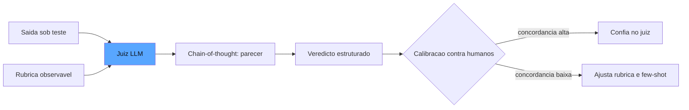

# Capítulo 5: Graders model-based: LLM-as-a-judge, calibração e o juiz que julga

## 1. Introdução

No Capítulo 4, você dominou a camada determinística e aprendeu a reconhecer a fronteira em que o código deixa de ser suficiente. Agora vamos atravessar essa fronteira: os graders model-based — o LLM-as-a-judge, o juiz de IA que avalia as dimensões genuinamente qualitativas da resposta: fidelidade aberta, tom, aderência a política, utilidade. Este é o instrumento mais poderoso e mais traiçoeiro do painel: poderoso porque julga o que nenhum código julga; traiçoeiro porque introduz um novo sistema de IA no meio da medição — com seus próprios vieses, sua própria variância e seu próprio custo [1]. Você vai aprender quando usar o juiz, como escrever rubricas que ele consiga aplicar de forma consistente, como calibrá-lo contra humanos e como detectar — e neutralizar — as armadilhas clássicas de viés que fazem o juiz dizer "sim" quando deveria dizer "não". Ao final, você terá um pipeline de julgamento model-based confiável, com o juiz no papel de instrumento e não de oráculo.

## 2. Explica

O LLM-as-a-judge é a aplicação de um modelo de linguagem como avaliador de outro modelo — ou de um agente inteiro. A ideia central é simples: onde não existe gabarito mecânico, o julgamento semântico é delegado a um modelo que recebe a tarefa, a saída produzida e uma rubrica, e devolve um veredicto estruturado [1]. A Braintrust formaliza o critério de decisão entre as duas camadas: use o determinístico sempre que o critério for verificável por máquina; use o modelo quando a dimensão for genuinamente aberta — fidelidade a um contexto livre, adequação de tom, aderência a uma política de negócio — onde não há como reduzir o critério a regras [2].

Você vai perceber que a qualidade do juiz depende de três decisões de projeto, e cada uma delas pode corromper a medição se for feita no piloto automático. A primeira é a **rubrica**: o modelo julga melhor quando recebe critérios explícitos e observáveis, com níveis bem definidos e exemplos de ancoragem — "aprovado: a resposta cita a fonte ao fazer afirmação factual; reprovado: afirmação factual sem fonte". Rubricas vagas ("boa resposta") produzem veredictos aleatórios, porque o modelo preenche a ambiguidade com seu próprio padrão — que raramente é o seu [3]. A segunda é o **chain-of-thought no julgamento**: pedir que o juiz raciocine passo a passo antes de concluir melhora a aderência à rubrica e produz evidência auditável — o parecer do juiz vira um artefato que um humano pode conferir sem reexecutar o julgamento [2]. A terceira é a **calibração**: antes de confiar no juiz, você mede a concordância dele com humanos em um conjunto de exemplos julgados por anotadores; se a concordância for baixa, o juiz está aplicando um critério diferente do seu, e a correção é ajustar a rubrica — ou ensinar o juiz com exemplos few-shot das suas preferências [4].

A literatura documenta vieses sistemáticos do julgamento automático, e você precisa conhecê-los para não ser enganado pelo próprio instrumento. O **viés de posição**: o juiz tende a favorecer a primeira (ou a última) resposta em comparações pareadas, independentemente do conteúdo. O **viés de verbosidade**: o juiz tende a preferir respostas mais longas, mesmo quando a concisão era o critério. E o **recompensa hacking**: quando o sistema sob teste é treinado ou otimizado contra o juiz, ele aprende a produzir o que o juiz gosta — respostas longas, formatadas, com palavras-chave da rubrica — em vez do que o usuário precisa [2]. O antídoto comum aos três é a mesma disciplina: amostragem múltipla, alternância de ordem, e calibração contínua contra um conjunto humano de referência [1].

Há ainda a dimensão arquitetural: onde o juiz vive no pipeline? As opções vão do juiz **inline** (chamado no mesmo fluxo, veredicto síncrono para cada resposta) ao juiz **assíncrono** (veredictos em lote, fora do caminho crítico), e a Langfuse documenta o padrão recomendado: julgamento assíncrono para produção (não adiciona latência ao usuário) e síncrono para o regime offline de evals [5]. A escolha não é técnica — é de custo e de arquitetura: o julgamento por modelo é o item mais caro do painel, e a decisão de onde ele vive decide quanto o painel custa por execução.

## 3. Ilustra

Na oficina da nossa estrada de ferro, o LLM-as-a-judge é o **inspetor experiente** — o mestre que avalia a peça que nenhum gabarito mede: o acabamento da solda, a qualidade da emenda, o temperamento do aço. O gabarito (Capítulo 4) diz se a peça encaixa; o inspetor diz se a peça está *bem feita*. E o maquinista veterano conhece as três características que separam um bom inspetor de um que assina o que não viu.

Primeiro, o inspetor trabalha com um **manual de inspeção** — a rubrica: "solda aprovada: penetração completa, sem porosidade, acabamento contínuo". Sem o manual, o inspetor julga pelo gosto pessoal, e dois inspetores discordam em metade das peças. Segundo, o inspetor **narra o que viu** antes de assinar — o parecer: "penetração de 3 mm no trecho A, porosidade em B". Esse parecer é o que permite ao mestre conferir o veredicto sem re-inspecionar a peça. Terceiro, o inspetor é **calibrado contra o mestre**: a cada mês, o mestre re-inspeciona uma amostra das peças aprovadas e mede a concordância; quando o inspetor começa a aprovar soldas que o mestre reprovaria, o manual é revisado e o treinamento refeito.

Como Engenheiro de Qualidade de IA, você já vê a analogia completa: o manual é a rubrica, o parecer é o chain-of-thought, e a calibração mensal é a medição de concordância juiz-humano. E o detalhe mais importante que o maquinista ensina ao aprendiz: o inspetor não substitui o gabarito — ele cobre exatamente o que o gabarito não cobre, e a oficina que troca o gabarito pelo inspetor paga mais caro e recebe menos garantia [2].



O diagrama mostra o ciclo completo: rubrica + saída entram no juiz, o parecer raciocinado produz o veredicto, e a calibração contra humanos decide se o juiz pode operar sozinho — ou se precisa de ajuste [3].

## 4. Técnica

### O Contrato do Juiz

O contrato do juiz é a fronteira que separa o julgamento model-based da opinião solta — e a diferença está nos artefatos que o contrato exige. Um LLM-as-a-judge profissional não devolve apenas "aprovado/reprovado": devolve um veredicto estruturado com três artefatos obrigatórios — a pontuação (quando a dimensão é contínua), o parecer (a narrativa do raciocínio, que torna o julgamento auditável) e a evidência localizada (quando aplicável, o trecho da resposta que fundamentou a decisão) [1]. Cada artefato tem uma função: a pontuação alimenta as métricas agregadas; o parecer alimenta a revisão humana sem reexecução; a evidência localizada alimenta o ciclo de curadoria — quando o juiz reprova, a evidência aponta o caso que merece virar exemplo no golden set ou na calibração few-shot do próprio juiz [3]. O contrato também define o que o juiz *não* faz: ele não inventa critérios ausentes da rubrica, não julga fora da dimensão declarada e não emite veredicto sem o parecer — as três recusas são o que mantém o juiz como instrumento e não como oráculo [2].

Vamos construir o pipeline de julgamento model-based com contrato explícito. Primeiro, o protocolo do juiz — a interface que qualquer modelo pode implementar:

```python
from dataclasses import dataclass, field
from typing import Any, Dict, List, Optional


@dataclass
class Rubrica:
    """Critério observável que o juiz deve aplicar, com níveis e ancoras."""
    dimensao: str
    criterio: str
    niveis: Dict[str, str] = field(default_factory=dict)
    exemplos: List[Dict[str, str]] = field(default_factory=list)

    def prompt_de_julgamento(self, saida: str) -> str:
        blocos = [f"CRITERIO: {self.criterio}"]
        for nivel, descricao in self.niveis.items():
            blocos.append(f"- {nivel}: {descricao}")
        if self.exemplos:
            blocos.append("EXEMPLOS:")
            for ex in self.exemplos:
                blocos.append(f"  saida: {ex.get('saida', '')} -> veredicto: {ex.get('veredicto', '')}")
        blocos.append(f"SAIDA A JULGAR:\n{saida}")
        return "\n".join(blocos)


@dataclass
class VeredictoDoJuiz:
    """Veredicto estruturado do juiz: pontuacao, parecer e confianca."""
    dimensao: str
    aprovado: bool
    pontuacao: Optional[float] = None
    parecer: str = ""
    confianca: Optional[float] = None
```

### O Juiz com Chain-of-Thought

O núcleo do pipeline: o chamado ao modelo com a rubrica e a exigência de raciocinar antes de concluir. Aqui usamos uma função de inferência injetável, para que o pipeline seja testável e independente de provedor:

```python
Inferencia = Any  # Callable que recebe prompt e devolve texto (ex.: um cliente de API)


def julgar_com_modelo(
    inferencia: Inferencia,
    rubrica: Rubrica,
    saida: str,
    temperatura: float = 0.0,
) -> VeredictoDoJuiz:
    """Executa o julgamento com chain-of-thought e parseia o veredicto estruturado."""
    prompt = "\n".join([
        "Voce e um avaliador imparcial. Aplique o criterio abaixo e raciocine passo a passo.",
        "Termine com uma linha exatamente no formato: VEREDICTO: aprovado|reprovado (pontuacao: 0.0-1.0)",
        rubrica.prompt_de_julgamento(saida),
    ])
    resposta = inferencia(prompt, temperatura=temperatura)
    parecer = resposta.split("VEREDICTO:")[0].strip()
    linha_final = resposta.split("VEREDICTO:")[-1].strip() if "VEREDICTO:" in resposta else ""
    aprovado = linha_final.lower().startswith("aprovado")
    pontuacao = None
    if "pontuacao:" in linha_final:
        try:
            pontuacao = float(linha_final.split("pontuacao:")[-1].strip())
        except ValueError:
            pontuacao = None
    return VeredictoDoJuiz(
        dimensao=rubrica.dimensao,
        aprovado=aprovado,
        pontuacao=pontuacao,
        parecer=parecer,
    )
```

O contrato de saída — a linha `VEREDICTO:` final — é o que permite o parsing determinístico de um julgamento probabilístico: a narrativa fica no parecer (auditável), e o veredicto vira um dado estruturado [3].

### Calibração Contra Humanos

O passo que separa o profissional: medir a concordância do juiz com anotadores humanos antes de confiar nele:

```python
@dataclass
class CasoCalibracao:
    """Um caso julgado por humano, usado para medir e corrigir o juiz."""
    saida: str
    veredicto_humano: bool
    parecer_humano: str = ""


def concordancia(
    juiz_veredictos: List[bool],
    humano_veredictos: List[bool],
) -> float:
    """Proporcao de casos em que juiz e humano concordam (acurancia simples)."""
    if not juiz_veredictos:
        return 0.0
    acertos = sum(1 for j, h in zip(juiz_veredictos, humano_veredictos) if j == h)
    return acertos / len(juiz_veredictos)


def calibracao_do_juiz(
    inferencia: Inferencia,
    rubrica: Rubrica,
    casos: List[CasoCalibracao],
    limite: float = 0.9,
) -> Dict[str, Any]:
    """Roda o juiz nos casos calibrados, mede a concordancia e devolve o relatorio."""
    juiz_veredictos: List[bool] = []
    for caso in casos:
        v = julgar_com_modelo(inferencia, rubrica, caso.saida)
        juiz_veredictos.append(v.aprovado)
    humano_veredictos = [c.veredicto_humano for c in casos]
    taxa = concordancia(juiz_veredictos, humano_veredictos)
    return {
        "taxa_concordancia": taxa,
        "confiavel": taxa >= limite,
        "total_casos": len(casos),
        "sugestao": (
            "Juiz pronto para operar" if taxa >= limite
            else "Revisar rubrica ou adicionar exemplos few-shot"
        ),
    }
```

A calibração é o relógio de aferição do juiz: o número que diz se o instrumento está marcando a verdade — ou se está marcando a opinião dele [4].

### O Pipeline Assíncrono em Lote

Por fim, o padrão de produção para custo controlado — julgamento em lote, fora do caminho crítico:

```python
@dataclass
class ItemDeFila:
    """Item aguardando julgamento assincrono em producao."""
    id: str
    saida: str
    rubrica: Rubrica


def julgar_lote(
    inferencia: Inferencia,
    itens: List[ItemDeFila],
) -> List[VeredictoDoJuiz]:
    """Julgamento em lote: custo previsivel e sem latencia para o usuario."""
    veredictos: List[VeredictoDoJuiz] = []
    for item in itens:
        veredictos.append(julgar_com_modelo(inferencia, item.rubrica, item.saida))
    return veredictos
```

A Langfuse recomenda esse padrão para o regime online: o julgamento acontece depois que o usuário já recebeu a resposta, em lotes agendados, com custo amortizado e sem impacto na experiência [5].

## 5. Aplica

### A Cena de Contraste

Sua empresa lançou um assistente de vendas que escreve propostas comerciais, e o time decidiu avaliar a qualidade com um LLM-as-a-judge. Você, seguindo o instinto comum, escreveu a rubrica em uma frase ("a proposta deve ser boa e persuasiva") e deixou o juiz rodando sozinho por duas semanas. No relatório, 96% de aprovação — a diretoria ficou satisfeita. Até o dia em que um cliente, recebendo uma proposta com o prazo de pagamento errado, reclamou em uma reunião executiva. A proposta tinha passado no juiz: a redação era persuasiva, o tom era perfeito — e o número errado não incomodou o avaliador porque a rubrica não pedia conferência contra o sistema comercial.

O erro foi duplo, e o diagnóstico liga diretamente à teoria da seção Explica. Primeiro, a rubrica vaga: "boa e persuasiva" é a definição exata da ambiguidade que produz veredictos aleatórios — o juiz preencheu o critério com o padrão dele [3]. Segundo, o viés de verbosidade: propostas longas e bem formatadas eram sistematicamente favorecidas, mesmo quando continham erros factuais. A correção: reescrever a rubrica com níveis observáveis ("aprovado: todos os números batem com o sistema comercial e o tom é profissional; reprovado: qualquer divergência de prazo, valor ou condição"), exigir chain-of-thought (o parecer agora cita "prazo de pagamento conferido contra o CRM"), e rodar a calibração contra dez propostas julgadas por humanos — a concordância caiu para 61%, o alarme disparou, e a rubrica ajustada subiu para 94% [4].

O segundo ganho foi estrutural: com o parecer auditável, o time de produto passou a revisar as divergências do juiz sem reexecutar o julgamento — e descobriu três categorias de erro de negócio que nenhuma rubrica anterior capturara. O juiz deixou de ser um oráculo e virou um instrumento com documentação de manutenção [2].

### Armadilhas Comuns

- **Rubrica vaga**: "resposta boa" é preencher a ambiguidade com o padrão do modelo. Níveis observáveis e exemplos de ancoragem são obrigatórios [3].
- **Confiar sem calibrar**: juiz sem medição de concordância é inspetor sem mestre. Calibre contra humanos antes de operar e periodicamente depois [4].
- **Ignorar o viés de verbosidade**: resposta longa não é resposta certa. Alterne ordens em comparações e penalize desvio do critério [2].

### O Protocolo de Calibração em Produção

O protocolo de calibração tem uma dimensão financeira que decide a viabilidade do juiz em produção: o custo da calibração é o imposto que você paga para confiar no número, e o dimensionamento do imposto é uma decisão de engenharia. A amostra contínua de trinta casos por semana com anotação humana é um custo pequeno quando comparado com o custo de um juiz descalibrado em produção — mas a indústria recomenda a otimização do imposto pela *amostragem estratificada por risco*: os casos de alto risco (decisões que custam caro quando erram) são anotados integralmente, e os de baixo risco por amostragem leve — a calibração concentra o custo humano onde a confiança é mais cara de comprar [4]. O protocolo registra também a *deriva de calibração*: a concordância medida por estrato, não apenas no agregado — porque um juiz calibrado no agregado pode estar descalibrado exatamente no estrato de alto risco, e o agregado esconde o perigo [1]. Essa visão estratificada é a ponte entre este capítulo e o Capítulo 11: a calibração é a estatística da confiança aplicada ao próprio juiz, e a estratificação por risco é a disciplina que o Capítulo 11 formaliza para todas as métricas [3].

A calibração que você implementou na seção Técnica é o primeiro ciclo — mas a calibração em produção é um protocolo contínuo, com cadência e critérios de reação. O padrão recomendado combina três elementos. O primeiro é a **amostra contínua**: a cada semana, um conjunto pequeno de casos reais de produção (entre dez e trinta) é julgado pelo juiz automático *e* por um anotador humano — o humano não precisa julgar tudo, apenas a amostra que mantém a concordância medida [4]. O segundo é o **limiar de reação**: quando a concordância cai abaixo do patamar (digamos, 85%), o alarme dispara e o time investiga antes de confiar no juiz — a investigação separa duas causas possíveis: a rubrica ficou ambígua (correção no manual) ou o domínio mudou (correção nos casos) [1].

O terceiro elemento é a **linhagem do julgamento**: cada veredicto do juiz registra a versão da rubrica, a versão do modelo avaliador e o conjunto de exemplos few-shot usado — porque a mudança de qualquer um deles altera o comportamento do juiz, e a comparação de concordância entre semanas só é válida no mesmo contexto [3]. O protocolo inteiro responde a uma pergunta que a maioria das organizações nunca faz: *o juiz está ficando pior, ou o mundo está mudando?* Sem a amostra contínua e a linhagem, a resposta é sempre adivinhação — e a confiança no painel se corrói por dentro [4].

### A Arte da Rubrica: Da Fala da Diretoria ao Código

A habilidade que separa o eval engineer sênior é a tradução — transformar a fala abstrata da diretoria ("o assistente deve ser útil e seguro") em rubricas que o juiz consegue aplicar. O exercício de tradução tem três passos. O primeiro é **decompor o adjetivo em comportamentos observáveis**: "útil" vira "a resposta resolve a dúvida do usuário OU encaminha para o canal certo quando não resolve" — cada comportamento é um critério separado, porque o juiz julga melhor critérios atômicos que adjetivos compostos [2]. O segundo é **definir os níveis com exemplos de ancoragem**: "aprovado: a resposta cita a fonte para afirmações factuais (exemplo: 'segundo a política de tarifas vigente, ...')" — o exemplo é o que torna o nível observável, porque os humanos — e os modelos — aprendem por exemplos mais que por descrições [5].

O terceiro passo é **testar a rubrica contra a discordância**: rodar a rubrica em dez casos com dois revisores e medir a concordância antes de entregá-la ao juiz — a rubrica que produz discordância humana alta não vai produzir concordância automática alta, e o problema está no manual, não no juiz [1]. A arte da rubrica é o ponto de maior alavancagem de todo o sistema de evals: uma rubrica excelente com um juiz mediano supera uma rubrica mediana com o melhor juiz do mercado — porque o julgamento é limitado pela clareza do critério, não pela capacidade do julgador [4]. É essa a habilidade que o Capítulo 12 vai posicionar como o coração da carreira de eval engineering — e que os capítulos 6, 10 e 11 vão exigir de volta, cada vez que um número precisar ser confiável [3].

### O Juiz no Contexto da Indústria

O LLM-as-a-judge não é uma técnica isolada — é o ponto de encontro de várias linhas de pesquisa e prática que vale mapear para posicionar a técnica no ecossistema. A evolução documentada de *LLM-as-a-judge* para *agent-as-a-judge* é a mais importante: a pesquisa de Stanford e Scale AI mostra que o revisor que raciocina passo a passo, usa ferramentas de verificação e acessa o log de ações supera o juiz que apenas lê a resposta — a transição que o Capítulo 7 aprofunda como a revisão autônoma entre harnesses [6]. O juiz também se conecta com a auto-correção: o arcabouço Reflexion usa o feedback do avaliador — humano ou automático — como matéria-prima das reflexões textuais que guiam as tentativas seguintes, e a qualidade do juiz decide a qualidade do aprendizado do agente [7]. E o paradigma do Human-on-the-Bridge mostra o juiz no centro da arquitetura de avaliação escalável: a experiência humana cura as armadilhas a montante, e os juízes automáticos — inclusive juízes menores rodando em harnesses eficientes — executam a avaliação em escala [8].

A literatura também documenta os limites do juiz com precisão crescente. Os arcabouços de deliberação multi-agente — ChatEval, DEBATE, CourtEval — nasceram exatamente da constatação de que um único juiz carrega vieses estáveis, e a deliberação com personas contrastantes é a resposta da indústria ao problema [6]. O alinhamento do juiz com preferências humanas — a calibração que este capítulo implementou — é o mecanismo que fecha o ciclo: as correções humanas sobre o feedback do juiz viram exemplos few-shot, e o juiz aprende a preferência da equipe ao longo do tempo, em vez de impor a dele [9]. A prática recomendada pela indústria consolida o juiz como um componente da cadeia de três camadas — o determinístico do Capítulo 4, o juiz calibrado deste capítulo e o revisor autônomo do Capítulo 7 — e a decisão de qual camada julga cada dimensão é a disciplina de arquitetura que separa o painel confiável do painel decorativo [10]. O juiz bem calibrado é o instrumento que transforma a opinião de um modelo em evidência utilizável — e é essa transformação que sustenta todos os números que os capítulos seguintes vão colocar sob comando [5].

## 6. Conclusão

Este capítulo atravessou a fronteira do painel: o LLM-as-a-judge com contrato explícito, rubricas observáveis, chain-of-thought auditável e calibração contra humanos — e o padrão de produção assíncrono que controla o custo. Você aprendeu os três vieses clássicos do juiz (posição, verbosidade, recompensa hacking) e o antídoto comum a eles: a disciplina de medir o próprio instrumento. O desafio: escreva uma rubrica de três níveis para a dimensão "utilidade" do seu sistema, julgue dez respostas com o juiz, julgue as mesmas dez com um colega e meça a concordância — o número que você encontrar é o seu ponto de partida. No Capítulo 6, você vai aprender a alimentar esse painel com o padrão ouro: a curadoria de golden sets, o versionamento de datasets e o ecossistema de ferramentas que automatiza tudo isso.

## 7. Referências Bibliográficas

[1] ANTHROPIC. *Demystifying evals for AI agents*. 2026. Disponível em: https://www.anthropic.com/engineering/demystifying-evals-for-ai-agents. Acesso em: 06 ago. 2026.

[2] BRAINTRUST. *What is an LLM-as-a-judge? When to use it (and when to use deterministic evals)*. 2026. Disponível em: https://www.braintrust.dev/articles/what-is-llm-as-a-judge. Acesso em: 06 ago. 2026.

[3] ANTHROPIC. *Building effective agents*. 2024. Disponível em: https://www.anthropic.com/engineering/building-effective-agents. Acesso em: 06 ago. 2026.

[4] CHASE, Harrison. *Aligning LLM-as-a-judge with human preferences*. LangChain, 2024. Disponível em: https://www.langchain.com/blog/aligning-llm-as-a-judge-with-human-preferences. Acesso em: 06 ago. 2026.

[5] LANGFUSE. *LLM evaluation: methods, best practices, and a practical roadmap*. 2025. Disponível em: https://langfuse.com/blog/2025-11-12-evals. Acesso em: 06 ago. 2026.

[6] YU, Fangyi et al. *When AIs judge AIs: the rise of agent-as-a-judge evaluation for LLMs*. Stanford/Scale AI, 2025. Disponível em: https://arxiv.org/html/2508.02994v1. Acesso em: 06 ago. 2026.

[7] SHINN, Noah; CASSANO, Federico; NARASIMHAN, Karthik et al. *Reflexion: language agents with verbal reinforcement learning*. Princeton/MIT, 2023. Disponível em: https://arxiv.org/abs/2303.11366. Acesso em: 06 ago. 2026.

[8] BOUSETOUANE, Fouad. *Human-on-the-bridge: scalable evaluation for AI agents*. ProofAgent/UChicago, 2026. Disponível em: https://arxiv.org/html/2606.16871v1. Acesso em: 06 ago. 2026.

[9] CHASE, Harrison. *Aligning LLM-as-a-judge with human preferences*. LangChain, 2024. Disponível em: https://www.langchain.com/blog/aligning-llm-as-a-judge-with-human-preferences. Acesso em: 06 ago. 2026.

[10] BRAINTRUST. *Eval-driven development*. 2026. Disponível em: https://www.braintrust.dev/articles/eval-driven-development. Acesso em: 06 ago. 2026.

[11] OWASP FOUNDATION. *OWASP GenAI security project (top 10 for LLM applications)*. 2026. Disponível em: https://owasp.org/www-project-top-10-for-large-language-model-applications/. Acesso em: 06 ago. 2026.

[12] NIST. *AI risk management framework (AI RMF 1.0)*. 2023. Disponível em: https://www.nist.gov/itl/ai-risk-management-framework. Acesso em: 06 ago. 2026.

[13] LANGCHAIN. *LangSmith evaluation concepts*. 2026. Disponível em: https://docs.smith.langchain.com/evaluation. Acesso em: 06 ago. 2026.

[14] PROMPTFOO. *Introduction and docs*. 2026. Disponível em: https://www.promptfoo.dev/docs/intro/. Acesso em: 06 ago. 2026.

[15] OPENAI. *How evals drive the next chapter in AI for businesses*. 2025. Disponível em: https://openai.com/index/evals-drive-next-chapter-of-ai/. Acesso em: 06 ago. 2026.

[16] CONFIDENT AI. *DeepEval: LLM evaluation unit testing in CI/CD*. 2026. Disponível em: https://deepeval.com/docs/evaluation-unit-testing-in-ci-cd. Acesso em: 06 ago. 2026.

[17] EVIDENTLY AI. *OWASP top 10 LLM and testing methodologies*. 2025/2026. Disponível em: https://www.evidentlyai.com/blog/owasp-top-10-llm. Acesso em: 06 ago. 2026.

[18] LATITUDE. *The ultimate CI/CD LLM evaluation guide*. 2026. Disponível em: https://latitude.so/blog/ultimate-ci-cd-llm-evaluation-guide. Acesso em: 06 ago. 2026.

[19] SAMUYLOVA, Elena; DRAL, Emeli. *LLM unit testing in CI/CD with GitHub Actions*. Evidently AI, 2025. Disponível em: https://www.evidentlyai.com/blog/llm-unit-testing-ci-cd-github-actions. Acesso em: 06 ago. 2026.

[20] CLOUD SECURITY ALLIANCE. *Agentic NIST AI RMF profile*. 2025/2026. Disponível em: https://labs.cloudsecurityalliance.org/agentic/agentic-nist-ai-rmf-profile-v1/. Acesso em: 06 ago. 2026.
