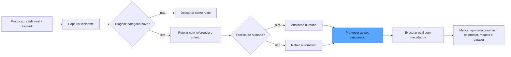

# Capítulo 6: Golden sets, curadoria e o ferramental: do padrão ouro ao ecossistema de evals

## 1. Introdução

Nos Capítulos 4 e 5, você construiu os dois instrumentos do painel — o gabarito determinístico e o juiz de modelo. Mas um painel sem dados é uma promessa: são os casos de teste que definem o que você está de fato garantindo. Este capítulo trata do padrão ouro — o golden set — e de tudo o que o rodeia: a curadoria contínua que o mantém vivo, o versionamento que o torna auditável, e o ecossistema de ferramentas (promptfoo, DeepEval, LangSmith, Langfuse) que automatiza o ciclo [1]. Você vai aprender por que o dataset é o ativo mais valioso de um programa de evals — mais valioso que o modelo avaliado, porque ele sobrevive a todas as trocas de modelo — e como construir, evoluir e proteger esse ativo ao longo do tempo [2]. Ao final, você será capaz de desenhar o ciclo de curadoria completo de um golden set de produção e escolher a ferramenta certa para o seu contexto — ou decidir construir a sua.

## 2. Explica

O golden set é a coleção curada de tarefas com saídas esperadas que define, de forma executável, o contrato de qualidade do sistema [1]. A OpenAI o descreve como o resultado da etapa Specify: transformar objetivos abstratos de negócio em exemplos concretos com respostas de referência, construídos por especialistas de domínio e revisados por quem entende do produto [2]. O golden set não é um repositório de perguntas — é uma *especificação executável*: cada caso declara um comportamento que o sistema deve ter, e o conjunto inteiro declara o domínio de comportamentos que a organização se compromete a garantir.

Você vai perceber que a qualidade de um golden set não se mede pela quantidade, mas por três propriedades estruturais. A **cobertura** é a primeira: o conjunto deve representar as categorias reais de comportamento do sistema — os caminhos felizes, os casos de borda, os cenários de falha e os casos adversos. Um golden set que cobre só o caminho feliz é um espelho lisonjeiro: mede o que o sistema faz bem e esconde o que ele faz mal [3]. A **dificuldade calibrada** é a segunda: casos triviais inflam a métrica sem informar nada, e casos impossíveis reprovam todo mundo sem discriminar nada — o set precisa concentrar-se na fronteira entre o aceitável e o inaceitável, onde o sistema realmente decide [2]. A **pureza** é a terceira: os casos não podem ter vazado para o treinamento, o ajuste ou os exemplos do prompt — caso contrário, o eval mede memorização, não capacidade [4].

A curadoria é o processo que mantém essas propriedades ao longo do tempo. A fonte primária de novos casos é a produção: cada erro real do sistema — cada reclamação, cada escalada, cada saída corrigida por um humano — é um candidato a virar caso de teste [5]. O ciclo de curadoria tem quatro etapas: *capturar* (coletar o incidente com a saída do sistema e o resultado real), *triar* (decidir se o caso representa uma categoria nova ou um ruído), *rotular* (escrever a saída de referência e o critério, com humano no loop para os casos difíceis) e *promover* (adicionar ao set versionado, com metadados completos) [1]. É esse ciclo que mantém o padrão ouro honesto: o set que não recebe os erros de produção envelhece, e a medição se descola da realidade — o número continua alto enquanto o mundo muda por fora.

O versionamento é a infraestrutura da curadoria. Como o comportamento do sistema depende de três artefatos que evoluem em conjunto — o prompt, o modelo e o dataset —, a reprodução de qualquer métrica exige saber exatamente qual combinação a produziu [4]. O padrão da indústria é versionar os três de forma acoplada: cada execução de eval registra o hash do prompt, a versão do modelo e a versão do dataset, e a comparação entre execuções só é honesta quando os três são controlados [5]. A LangSmith e a Langfuse implementam esse versionamento com splits (treino, validação, teste), históricos de modificação e associação automática de metadados de execução [6].

Há ainda o **vazamento de dados de teste** — o pecado que invalida a métrica silenciosamente. Ele acontece quando um caso do set aparece no contexto de treinamento ou de avaliação do sistema: o modelo pode memorizar a resposta esperada em vez de aprender a tarefa, e a acurácia no golden set sobe enquanto a qualidade real no mundo estagna [4]. A defesa é a disciplina de higiene: monitorar sobreposição entre casos e dados de treinamento, marcar a origem de cada caso, e aceitar que um pequeno vazamento é inevitável — o que importa é medi-lo e reportá-lo, nunca tratá-lo como inexistente [2].

## 3. Ilustra

Na nossa estrada de ferro, o golden set é o **roteiro de aferição da frota** — o livro de percursos de teste que a companhia usa para homologar cada locomotiva antes de ela entrar na linha. O roteiro não é uma coleção de viagens bonitas: é um conjunto deliberado de percursos que cobre as condições reais — a subida íngreme, a curva fechada, o trecho de areia, a descida longa com carga máxima, o freio em emergência. Um roteiro que só tem a reta plana de demonstração aprova locomotivas que vão falhar na primeira serra [1].

O maquinista veterano conhece as regras do roteiro de cor. Primeiro, ele é *vivo*: cada acidente quase, cada falha de freio, cada trecho novo da linha entra no roteiro — o roteiro que não recebe as lições das viagens reais é um documento de museu. Segundo, ele é *versionado*: o roteiro de 2025 é diferente do de 2026, e a homologação de uma locomotiva em 2026 só se compara com as de 2026 — comparar números entre roteiros diferentes é comparar maçãs com laranjas. Terceiro, ele é *puro*: os percursos de teste nunca são as mesmas viagens usadas para treinar o maquinista — se o maquinista já viu o percurso, o teste mede memória, não habilidade.

E a curadoria tem seu lugar na oficina: o inspetor que encontra uma solda fraca não apenas corrige a solda — ele adiciona "solda fraca em junta de expansão" ao roteiro, para que a próxima locomotiva seja testada também nessa condição. Como Engenheiro de Qualidade de IA, você reconhece aí o ciclo completo: cada erro de produção vira um novo caso de teste, e é esse ciclo que mantém o padrão ouro à frente da realidade [5].



O diagrama mostra o ciclo completo: o incidente de produção é capturado, triado, rotulado (com humano nos casos difíceis), promovido ao set versionado e — a partir daí — cada execução registra os hashes que tornam a métrica reproduzível [5].

## 4. Técnica

### O Esquema do Golden Set

O esquema do golden set é onde a disciplina de linhagem encontra a prática — e vale detalhar duas decisões de design que o esquema materializa. A primeira é a imutabilidade por convenção: o golden set não é uma tabela que se edita; é uma sequência de versões que se substituem, cada uma com seu hash — a decisão que torna qualquer métrica passada reproduzível e qualquer comparação entre versões automatizável [4]. A segunda é a origem como dado de primeira classe: cada caso registra de onde veio (incidente de produção, especialista, síntese), porque a origem é o que permite priorizar a curadoria — um set com muitos casos sintéticos e poucos incidentes reais está medindo um mundo imaginário, e a distribuição de origens é o primeiro sinal de saúde do set [5]. A indústria adiciona ainda o campo de *expectativa de dificuldade* — a estimativa registrada no momento da curadoria, comparada depois com o desempenho real — como o instrumento que revela os casos mal calibrados: o caso que o especialista marcou como difícil e que o sistema acerta 100% das vezes está descalibrado, e a calibração da dificuldade é parte da manutenção do padrão ouro [1].

Vamos construir a infraestrutura do padrão ouro: o esquema de dados que torna cada caso versionável, rastreável e puro. Começamos pelo caso de teste com linhagem completa:

```python
from dataclasses import dataclass, field
from datetime import datetime
from typing import Any, Dict, List, Optional


@dataclass
class CasoDeTeste:
    """Um caso do golden set com linhagem completa e metadados de origem."""
    id: str
    categoria: str  # ex.: "caminho_feliz", "borda", "adversarial", "incidente"
    tarefa: str
    saida_referencia: str = ""
    criterio: str = ""
    origem: str = "curadoria"  # ex.: "incidente_producao", "especialista", "sintetico"
    criado_em: str = field(default_factory=lambda: datetime.utcnow().isoformat())
    versao: str = "1.0"
    rotulos: Dict[str, str] = field(default_factory=dict)


@dataclass
class GoldenSet:
    """Colecao versionada de casos: a especificacao executavel do sistema."""
    nome: str
    versao: str
    casos: List[CasoDeTeste] = field(default_factory=list)

    def por_categoria(self, categoria: str) -> List[CasoDeTeste]:
        return [c for c in self.casos if c.categoria == categoria]

    def hash_de_conteudo(self) -> str:
        """Hash estavel do conteudo do set - usado nos metadados de execucao."""
        import hashlib
        serializado = "\n".join(
            f"{c.id}|{c.tarefa}|{c.saida_referencia}" for c in sorted(
                self.casos, key=lambda c: c.id
            )
        )
        return hashlib.sha256(serializado.encode("utf-8")).hexdigest()[:16]
```

O `hash_de_conteudo` é a peça que conecta este capítulo ao registro de contexto do Capítulo 1: o hash do dataset entra nos metadados de cada execução, e a comparação entre versões passa a ser uma comparação de hashes — automatizável e à prova de erro humano [5].

### O Ciclo de Curadoria

Agora o ciclo que transforma incidentes de produção em casos do set:

```python
@dataclass
class Incidente:
    """Um erro real observado em producao - materia-prima da curadoria."""
    id: str
    prompt_do_usuario: str
    saida_do_sistema: str
    resultado_real: str  # ex.: "escalado", "corrigido_por_humano", "reclamacao"
    categoria_sugerida: str = "incidente"


def capturar_incidente(
    incidente: Incidente,
    set_atual: GoldenSet,
) -> Optional[CasoDeTeste]:
    """Triagem: o incidente representa uma categoria nova (nao duplicada)?"""
    for caso in set_atual.casos:
        if caso.tarefa == incidente.prompt_do_usuario:
            return None  # duplicado: o caso ja existe
    return CasoDeTeste(
        id=f"inc-{incidente.id}",
        categoria=incidente.categoria_sugerida,
        tarefa=incidente.prompt_do_usuario,
        origem="incidente_producao",
        rotulos={
            "saida_original": incidente.saida_do_sistema,
            "resultado_real": incidente.resultado_real,
        },
    )


def promover_caso(
    set_atual: GoldenSet,
    caso: CasoDeTeste,
    versao_nova: str,
) -> GoldenSet:
    """Promove um caso ao set e bump da versao - imutabilidade por convencao."""
    casos_novos = list(set_atual.casos)
    casos_novos.append(caso)
    return GoldenSet(
        nome=set_atual.nome,
        versao=versao_nova,
        casos=casos_novos,
    )
```

A convenção de imutabilidade é deliberada: o set novo substitui o antigo por versão, nunca por mutação — assim qualquer execução que registrou `versao="1.0"` pode ser reproduzida exatamente, mesmo depois de o set evoluir para "1.1" [4].

### O Versionamento Acoplado

O ponto mais delicado: versionar dataset, prompt e modelo de forma acoplada, para que cada métrica seja reproduzível:

```python
@dataclass
class RegistroDeExecucao:
    """O que torna uma metrica reproduzivel: a trinca dataset-prompt-modelo."""
    dataset_hash: str
    versao_prompt: str
    versao_modelo: str
    commit_do_sistema: str
    data: str = field(default_factory=lambda: datetime.utcnow().isoformat())
    metrica_principal: float = 0.0

    def assinatura(self) -> str:
        return f"{self.dataset_hash}|{self.versao_prompt}|{self.versao_modelo}|{self.commit_do_sistema}"


def comparar_execucoes(a: RegistroDeExecucao, b: RegistroDeExecucao) -> str:
    """Compara duas execucoes com honestidade: alerta se a trinca diferir."""
    if a.assinatura() == b.assinatura():
        delta = b.metrica_principal - a.metrica_principal
        return f"Comparacao honesta: delta de {delta:+.3f} no mesmo contexto"
    return (
        "ALERTA: contexto diferente (dataset, prompt ou modelo mudou). "
        "A comparacao nao e valida."
    )
```

Essa função materializa a lição central do versionamento: números de contextos diferentes não se comparam — e a ferramenta que não avisa isso está mentindo para você [5].

### O Ferramental: Como Escolher

Por fim, a decisão de ferramenta. O panorama atual oferece quatro famílias — CLI de testes de prompt (promptfoo), framework de testes unitários de LLM (DeepEval), plataforma completa com observabilidade e versionamento (LangSmith) e plataforma open source com tracing e scores (Langfuse) — e a escolha depende do seu contexto [6]:

```python
@dataclass
class PerfilDeEquipe:
    """Perfil da equipe para recomendacao de ferramenta de evals."""
    escala: str  # "pequena" | "media" | "grande"
    ja_tem_observabilidade: bool
    orcamento: str  # "zero" | "moderado" | "alto"
    idioma: str  # "python" | "typescript" | "multi"


def recomendar_ferramenta(perfil: PerfilDeEquipe) -> str:
    if perfil.escala == "pequena" and perfil.orcamento == "zero":
        return "promptfoo (CLI local, testes de prompt e red-teaming)"
    if perfil.orcamento == "zero":
        return "DeepEval (unit tests de LLM via pytest) ou Langfuse (open source)"
    if perfil.ja_tem_observabilidade:
        return "DeepEval ou Langfuse integrado ao tracing existente"
    return "LangSmith (plataforma completa: dataset, versionamento, tracings, queues)"
```

A lição da função de recomendação não é a escolha em si — é o raciocínio: ferramenta se escolhe pelo contexto da equipe, não pelo brilho do marketing. E a pergunta final, que nenhuma ferramenta responde por você: o seu caso de uso exige um grader específico que a ferramenta não suporta, ou um contrato de dados que ela engessa? Se sim, o caminho é construir o seu próprio pipeline sobre o esqueleto dos capítulos anteriores — que é, afinal, exatamente o que este livro ensina [1].

## 5. Aplica

### A Cena de Contraste

O programa de evals da sua empresa começou com um golden set de cinquenta casos escritos em uma tarde por dois engenheiros, salvos em uma planilha. Nos primeiros três meses, funcionou: o número era alto, o time comemorava, o board aprovava releases. No quarto mês, dois fenômenos simultâneos revelaram a fragilidade: um novo modelo de linguagem, prometendo 20% de melhoria, foi rejeitado pelo eval — e um release aprovado pelo eval gerou uma enxurrada de reclamações de clientes sobre um comportamento que o set nem cobria.

O primeiro erro foi o **set estático**: os cinquenta casos nunca receberam as lições dos três meses de produção — cada bug corrigido por humano, cada escalada, cada categoria nova de pergunta não entrou no roteiro, e o padrão ouro virou um espelho de museu [5]. O segundo erro foi a **comparação desonesta**: a planilha não registrava versão de prompt, modelo ou dataset, e o "20% de melhoria" do modelo novo era medido em um contexto incomparável com o do modelo antigo — o número era lixo, e o time quase tomou uma decisão de troca de modelo sobre ele. O terceiro erro foi a **cobertura cega**: o set não tinha casos adversos nem de borda, e a enxurrada de reclamações era exatamente a categoria ausente.

A correção, ligando à teoria: implantar o ciclo de curadoria (incidentes de produção viram casos, com triagem e rotulação), o versionamento acoplado (toda execução registra a trinca dataset-prompt-modelo, e comparações entre contextos diferentes são bloqueadas com alerta) e a expansão deliberada de cobertura (camadas de casos adversos e de borda, com dificuldade calibrada) [2]. Em dois meses, o golden set saiu de cinquenta para quatrocentos casos, o número passou a refletir a realidade — e a decisão de troca de modelo passou a ser tomada com comparação honesta [4].

### Armadilhas Comuns

- **Set estático**: o padrão ouro que não recebe os erros de produção envelhece e a medição se descola da realidade. Curadoria contínua é obrigatória [5].
- **Comparação sem contexto**: comparar números de execuções com dataset, prompt ou modelo diferentes é comparar maçãs com laranjas — e tomar decisão sobre isso é decidir sobre ruído [4].
- **Vazamento ignorado**: caso do set presente no treinamento mede memorização. Monitore a sobreposição e reporte o vazamento — nunca finja que ele não existe [2].

### A Governança do Dataset: Donos, Cadência e Política de Promoção

A governança do dataset tem uma dimensão que completa o desenho: a *métrica de saúde do set*, reportada junto com as métricas de qualidade do sistema — porque o número do painel só vale o que vale o set que o produz. As três métricas de saúde que a indústria recomenda reportar são a cobertura (a proporção de categorias de produção representadas no set), a atualidade (a idade média dos casos — um set que não recebe incidentes há meses está envelhecendo) e a discriminação (a proporção de casos que o sistema não acerta nem erra sempre — o termômetro da dificuldade calibrada) [1]. Quando o relatório de qualidade apresenta "precisão 0,90" sem as métricas de saúde do set, está faltando o contexto que o Capítulo 11 vai exigir: o número sem a saúde do instrumento que o produziu é o manômetro sem o registro de aferição [5]. A prática madura integra as duas leituras: a precisão sobe e a cobertura cai é um alarme de ilusão — o set está ficando mais fácil, não o sistema melhor [2].

Um golden set sem dono é um ativo órfão: ninguém promove casos, ninguém revisa categorias, ninguém responde quando a cobertura envelhece. A governança do dataset é a camada organizacional que mantém o padrão ouro vivo, e ela tem três decisões que precisam ser tomadas explicitamente [1]. A primeira é o **dono**: alguém nomeado — o eval engineer ou o especialista de domínio — responsável pela saúde do set, com autoridade para promover casos e rejeitar ruído. Sem dono, o ciclo de curadoria depende de voluntários e morre na primeira crise [5]. A segunda é a **cadência**: a triagem dos incidentes de produção em lote semanal (ou mensal, conforme o volume), com o tempo reservado na agenda — curadoria que compete com as urgências do dia a dia sem espaço alocado é curadoria que não acontece [2].

A terceira decisão é a **política de promoção**: quem pode promover um caso e com que justificativa. O padrão recomendado combina a triagem automática (duplicação, categoria conhecida) com a decisão humana nos casos de fronteira — o mesmo Human-on-the-Bridge que você viu no red-teaming, aplicado à curadoria: a máquina filtra, o humano decide o que vale a pena garantir para sempre [4]. E há a política de *rebaixamento*: casos que se tornam triviais (o sistema agora acerta sempre, sem esforço) ou obsoletos (o comportamento mudou de domínio) saem do set — porque um caso que não discrimina mais não informa nada, e manter o set enxuto e discriminante é parte da higiene [1].

### O Radar de Vazamento e a Medição do Próprio Dataset

A pureza do golden set — a propriedade mais violada e menos medida — merece um instrumento próprio: o radar de vazamento, a medição da sobreposição entre o set e os dados de treinamento ou ajuste do sistema. O radar não elimina o vazamento (impossível em modelos fechados): ele o torna *conhecido* e *quantificado*, para que a interpretação da métrica seja honesta [2]. A técnica básica é a amostragem de similaridade: uma amostra dos casos do set é comparada por similaridade textual com amostras dos dados que o sistema pode ter visto — embeddings, n-gramas compartilhados, frases idênticas — e a taxa de similaridade alta é reportada junto com a métrica: "acurácia 0,92, mas 14% dos casos têm alta sobreposição com dados conhecidos — interpretar com cautela" [4].

O radar também alimenta a política de *renovação do caso suspeito*: casos com sobreposição alta são marcados, reescritos (parafraseando o contexto, mudando os dados de referência) ou substituídos — a reescrita mantém a categoria coberta sem manter a memorização testada [5]. E há a segunda medição do próprio dataset, a **taxa de discriminação**: a proporção de casos em que o sistema avaliado não acerta tudo nem erra tudo — o termômetro da dificuldade calibrada. Um set com taxa de discriminação baixa é um espelho (casos triviais) ou uma parede (casos impossíveis); a política de ajuste é rebalancear a dificuldade [1]. Essas duas medições — vazamento e discriminação — são o relógio de aferição do próprio padrão ouro: o instrumento que mede se o instrumento ainda está medindo [2].

### O Golden Set no Contexto do Ecossistema

O golden set é o elo que conecta todos os capítulos da obra, e vale fechar o capítulo situando-o no ecossistema. As plataformas de avaliação fizeram do dataset versionado um serviço: a LangSmith gerencia datasets com splits, versões e histórico, associando cada execução de eval ao dataset que a produziu — a automatização do versionamento acoplado que este capítulo implementou à mão [6]. O DeepEval oferece a curadoria como primitivas de teste, e o guia da Evidently sobre testes unitários de LLM mostra os datasets estruturados como a base das avaliações reference-based e reference-free que rodam no primeiro commit — o golden set como o alicerce do CI que o Capítulo 10 vai construir [10]. E as CLIs de teste de prompt, como o promptfoo, permitem versionar os casos de teste no próprio repositório de código, com o dataset tratado como artefato de engenharia — a prática que torna a curadoria parte do processo de desenvolvimento e não um evento separado [8]. Os benchmarks públicos demonstram a curadoria em escala industrial: o SWE-bench Verified é, no fundo, um golden set gigante — problemas reais de repositórios open source com testes que validam cada correção — e a metodologia de seleção e validação dos problemas é a disciplina de curadoria deste capítulo aplicada a milhares de casos [7].

O golden set também é o ponto de articulação com a governança: o NIST AI RMF situa a medição no centro da função Measure, e a qualidade da medição — a saúde do set — é o que determina o valor da função inteira [11]. E há a dimensão estratégica que o ecossistema consolida: o dataset é o ativo que sobrevive a todas as trocas de modelo, e as organizações que tratam o golden set como propriedade intelectual — com dono, versionamento e auditoria — constroem uma vantagem cumulativa que nenhuma ferramenta comprada entrega pronta [5]. A lição que fecha o capítulo é a síntese de todas as anteriores: o padrão ouro não é um repositório — é um processo com dono, cadência e política, medido por sua própria saúde, e é esse processo que transforma a avaliação de evento em infraestrutura permanente [1].

A consolidação dessa visão de ativo aparece em três direções que a indústria já documenta. A primeira é o alinhamento do set com a estratégia de produto: o eval-driven development trata o dataset como oráculo de qualidade — a fonte de verdade que arbitra entre versões — e recomenda que o golden set cresça junto com cada feature nova, nunca depois dela [9]. A segunda é a reutilização do conjunto como material de aprendizado: os padrões arquiteturais de agentes enfatizam que o golden set bem curado é também a base de regressão dos componentes internos — cada ferramenta, cada passo de raciocínio, cada transição de estado tem casos de cobertura no mesmo formato que os casos finais [12]. A terceira é a integração com a pesquisa em avaliação: os arcabouços de reflexão e de agentes como juízes demonstram que sets curados servem a múltiplos propósitos — calibrar o juiz, treinar a reflexão, validar a deliberação — e que a mesma curadoria que produz o caso de aceitação produz a armadilha que testa a robustez [13][14]. O Human-on-the-Bridge leva a tese ao limite operacional: humanos curam a montante as armadilhas procedimentais que a resposta final esconde, e o set automatizado executa a detecção em escala a jusante [15]. A calibração do juiz, por sua vez, é inseparável do set: as correções humanas sobre os casos viram exemplos few-shot que melhoram o próprio avaliador — o golden set alimenta o juiz que o valida [16]. Na governança, o perfil agêntico do NIST AI RMF trata o dataset de avaliação como infraestrutura crítica de confiança, sujeita às mesmas exigências de inventário, rastreabilidade e auditoria dos dados de produção [17]. E o ferramental converge com a prática: os guias de CI/CD para LLMs recomendam versionar o golden set no mesmo repositório dos prompts, com linhagem registrada em cada execução [18]; os fundamentos de CI para IA alertam que, sem curadoria contínua, o set degrada em duas frentes — casos vencidos que não representam mais o uso real e lacunas que as regressões descobrem tarde demais [19]. O GenAI Profile do NIST fecha o ciclo: alucinação, dados sintéticos e informações confidenciais são riscos específicos da IA generativa, e cada um exige casos próprios no set — a curadoria é, portanto, uma atividade de gestão de risco, não de limpeza de dados [20].

## 6. Conclusão

Este capítulo fechou o trio dos instrumentos: o golden set como especificação executável com cobertura, dificuldade calibrada e pureza; o ciclo de curadoria que transforma incidentes de produção em casos versionados; e o versionamento acoplado que torna cada métrica reproduzível e cada comparação honesta. Você também mapeou o ferramental — promptfoo, DeepEval, LangSmith, Langfuse — com o raciocínio de escolha pelo contexto da equipe. O desafio: pegue os últimos dez incidentes reais do seu sistema, rode a triagem e promova ao menos cinco ao seu golden set — com origem, categoria e versão registradas. No Capítulo 7, começa a Parte III do livro: o inspetor autônomo, a revisão entre harnesses, onde um agente audita o trabalho de outro agente.

## 7. Referências Bibliográficas

[1] ANTHROPIC. *Demystifying evals for AI agents*. 2026. Disponível em: https://www.anthropic.com/engineering/demystifying-evals-for-ai-agents. Acesso em: 06 ago. 2026.

[2] OPENAI. *How evals drive the next chapter in AI for businesses*. 2025. Disponível em: https://openai.com/index/evals-drive-next-chapter-of-ai/. Acesso em: 06 ago. 2026.

[3] BRAINTRUST. *What is an LLM-as-a-judge? When to use it (and when to use deterministic evals)*. 2026. Disponível em: https://www.braintrust.dev/articles/what-is-llm-as-a-judge. Acesso em: 06 ago. 2026.

[4] CONFIDENT AI. *DeepEval: LLM evaluation unit testing in CI/CD*. 2026. Disponível em: https://deepeval.com/docs/evaluation-unit-testing-in-ci-cd. Acesso em: 06 ago. 2026.

[5] LANGFUSE. *LLM evaluation: methods, best practices, and a practical roadmap*. 2025. Disponível em: https://langfuse.com/blog/2025-11-12-evals. Acesso em: 06 ago. 2026.

[6] LANGCHAIN. *LangSmith evaluation concepts*. 2026. Disponível em: https://docs.smith.langchain.com/evaluation. Acesso em: 06 ago. 2026.

[7] EPOCH AI. *SWE-bench verified evaluation methodology*. 2026. Disponível em: https://epoch.ai/benchmarks/swe-bench-verified. Acesso em: 06 ago. 2026.

[8] PROMPTFOO. *Introduction and docs*. 2026. Disponível em: https://www.promptfoo.dev/docs/intro/. Acesso em: 06 ago. 2026.

[9] BRAINTRUST. *Eval-driven development*. 2026. Disponível em: https://www.braintrust.dev/articles/eval-driven-development. Acesso em: 06 ago. 2026.

[10] SAMUYLOVA, Elena; DRAL, Emeli. *LLM unit testing in CI/CD with GitHub Actions*. Evidently AI, 2025. Disponível em: https://www.evidentlyai.com/blog/llm-unit-testing-ci-cd-github-actions. Acesso em: 06 ago. 2026.

[11] NIST. *AI risk management framework (AI RMF 1.0)*. 2023. Disponível em: https://www.nist.gov/itl/ai-risk-management-framework. Acesso em: 06 ago. 2026.

[12] ANTHROPIC. *Building effective agents*. 2024. Disponível em: https://www.anthropic.com/engineering/building-effective-agents. Acesso em: 06 ago. 2026.

[13] SHINN, Noah; CASSANO, Federico; NARASIMHAN, Karthik et al. *Reflexion: language agents with verbal reinforcement learning*. Princeton/MIT, 2023. Disponível em: https://arxiv.org/abs/2303.11366. Acesso em: 06 ago. 2026.

[14] YU, Fangyi et al. *When AIs judge AIs: the rise of agent-as-a-judge evaluation for LLMs*. Stanford/Scale AI, 2025. Disponível em: https://arxiv.org/html/2508.02994v1. Acesso em: 06 ago. 2026.

[15] BOUSETOUANE, Fouad. *Human-on-the-bridge: scalable evaluation for AI agents*. ProofAgent/UChicago, 2026. Disponível em: https://arxiv.org/html/2606.16871v1. Acesso em: 06 ago. 2026.

[16] CHASE, Harrison. *Aligning LLM-as-a-judge with human preferences*. LangChain, 2024. Disponível em: https://www.langchain.com/blog/aligning-llm-as-a-judge-with-human-preferences. Acesso em: 06 ago. 2026.

[17] CLOUD SECURITY ALLIANCE. *Agentic NIST AI RMF profile*. 2025/2026. Disponível em: https://labs.cloudsecurityalliance.org/agentic/agentic-nist-ai-rmf-profile-v1/. Acesso em: 06 ago. 2026.

[18] LATITUDE. *The ultimate CI/CD LLM evaluation guide*. 2026. Disponível em: https://latitude.so/blog/ultimate-ci-cd-llm-evaluation-guide. Acesso em: 06 ago. 2026.

[19] BRONSDON, Conor. *Continuous integration (CI) for AI: fundamentals*. Galileo AI, 2025. Disponível em: https://galileo.ai/blog/continuous-integration-ci-ai-fundamentals. Acesso em: 06 ago. 2026.

[20] NIST. *Artificial Intelligence Risk Management Framework: Generative AI Profile (AI RMF GenAI Profile)*. 2024. Disponível em: https://www.nist.gov/itl/ai-risk-management-framework. Acesso em: 06 ago. 2026.
