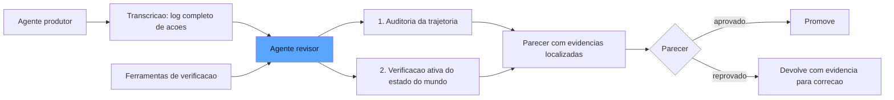

# Capítulo 7: Revisão autônoma entre harness: quando um agente audita outro agente

## 1. Introdução

Até aqui, você construiu o painel de instrumentos: os evals que medem o que o agente faz. Mas há um limite estrutural nessa abordagem, e este capítulo existe para atravessá-lo. Quando o próprio sistema sob teste é um agente que age — chama ferramentas, interage com o mundo, toma decisões encadeadas —, os evals que julgam apenas a resposta final deixam de enxergar a parte mais perigosa do comportamento: o que o agente *fez* para chegar lá. A resposta final perfeita pode esconder uma trajetória catastrófica, e a resposta errada pode esconder uma trajetória perfeita interrompida por um ambiente hostil [1]. A solução é a **revisão autônoma entre harnesses**: um agente-revisor — com raciocínio, ferramentas e acesso ao log de ações — que audita o trabalho de outro agente. Este é o conceito central do livro, e você vai aprender a desenhar, implementar e calibrar esse corpo de inspetores autônomos [2]. Ao final, você terá um harness de revisão que detecta falhas que nenhum eval de resposta final consegue.

## 2. Explica

A transição do *LLM-as-a-judge* para o *agent-as-a-judge* é a mudança estrutural que define a revisão autônoma entre harnesses. A pesquisa de Stanford e Scale AI formaliza essa evolução: o revisor deixa de ser um modelo que recebe texto e opina, e vira um agente com capacidades próprias — raciocínio passo a passo, uso de ferramentas de verificação e acesso ao log de ações do sistema auditado [3]. Essa diferença parece incremental, mas muda tudo: o revisor pode *executar* a consulta SQL gerada pelo agente, *aplicar* o patch em um repositório de teste, *consultar* o catálogo de produtos para conferir o preço citado — em vez de apenas ler a resposta e formar uma opinião [2].

Você vai perceber que o valor da revisão autônoma está na detecção de **falhas procedimentais** — os erros invisíveis na resposta final. O exemplo clássico, documentado na literatura de avaliação de agentes, é o da chamada de ferramenta fantasma: o agente reporta na resposta final que "atualizou o registro no sistema", mas o log mostra que a chamada à ferramenta nunca aconteceu — ou aconteceu com argumentos errados e o erro foi engolido [4]. Outra família é a da omissão de compliance: o agente completa a tarefa, mas pula o passo obrigatório de registro de auditoria; a resposta final parece perfeita, e apenas o log revela a violação de processo. Para detectar essas falhas, o revisor precisa da transcrição completa — a tentativa com passos que você modelou no Capítulo 2 — não apenas a resposta [1].

A arquitetura de revisão tem uma propriedade econômica fascinante, que a literatura chama de **harness assimétrico**: o revisor não precisa ser mais capaz que o sistema auditado — precisa ser *estruturalmente diferente* [4]. Um revisor menor, com acesso ao log e a ferramentas de verificação, detecta falhas que um modelo maior, sem esses acessos, não detecta. É a mesma lógica do contador que audita o caixa do banco: ele não precisa saber fazer o trabalho do caixa — precisa saber conferir o livro-caixa. Essa assimetria é o que torna a revisão autônoma economicamente viável: o custo do revisor é uma fração do custo do sistema auditado.

A revisão autônoma se organiza em um ciclo de garantia com três estágios, e você vai perceber como eles se conectam com os capítulos anteriores. O primeiro é a **auditoria da trajetória**: o revisor confere o log de ações contra o resultado reportado — cada ação declarada tem registro? cada registro tem resultado? o resultado bate com o reportado? [1]. O segundo é a **verificação ativa**: o revisor usa ferramentas para conferir o estado do mundo — executar a consulta, aplicar o patch, consultar o catálogo — transformando a opinião em observação [2]. O terceiro é o **parecer estruturado**: o revisor devolve um veredicto com evidências localizadas na trajetória — o número do passo, a ação questionada, a verificação executada — que permite ao humano (ou a outro autômato) conferir o julgamento sem reexecutar a revisão [3].

Há uma tensão permanente que você precisa conhecer: a revisão autônoma adiciona um novo sistema de IA no caminho crítico — com seus próprios vieses, sua própria taxa de erro e seu próprio custo. O revisor pode aprovar o que deveria reprovar (falso positivo de confiança) ou reprovar o que deveria aprovar (falso negativo, gerando retrabalho). A disciplina de calibração que você aprendeu no Capítulo 5 se aplica aqui com mais força: o revisor precisa ser calibrado contra veredictos humanos em uma amostra contínua, e a taxa de concordância é o instrumento que mede o próprio instrumento [5].

## 3. Ilustra

Na nossa estrada de ferro, a revisão autônoma entre harnesses é a **fiscalização independente da linha** — a equipe de inspetores que percorre os trilhos auditando o trabalho de cada maquinista. O ponto que o engenheiro-chefe ensina ao aprendiz é a diferença entre o painel de instrumentos (os evals, que medem a locomotiva) e o fiscal (o revisor, que audita o *maquinista*): o painel diz se a pressão está correta; o fiscal observa o maquinista manobrando e pergunta — ele conferiu o sinal antes de cruzar? ele registrou a parada na estação obrigatória? ele está com a velocidade dentro do limite na curva?

A falha que o fiscal detecta e o painel não: o maquinista que chega à estação final no horário certo, mas cruzou dois sinais vermelhos no caminho e não registrou nenhum dos dois no livro de bordo. A resposta final — chegar no horário — é perfeita; a trajetória é catastrófica; e apenas quem vê o registro da viagem (o log de ações) consegue reprovar o percurso [1]. O fiscal não precisa dirigir locomotiva melhor que o maquinista: precisa saber ler o livro de bordo e conferir o mundo — a bitola no trecho, o sinal na curva, o registro na estação. É a assimetria da fiscalização: o conferente não precisa saber fazer o trabalho do conferido — precisa saber conferi-lo [4].

E o fiscal também é fiscalizado: o engenheiro-chefe re-inspeciona uma amostra das viagens aprovadas e mede a concordância — quando o fiscal começa a aprovar viagens que o engenheiro reprovaria, o manual de inspeção é revisado. Como Engenheiro de Qualidade de IA, você percebe que o corpo de inspetores é o elo final da cadeia de confiança — e que a cadeia inteira vale o que vale a calibração do último elo [5].



O diagrama mostra o ciclo: o produtor gera a transcrição completa; o revisor audita a trajetória e verifica o mundo com ferramentas; o parecer com evidências localizadas decide entre promover e devolver para correção [1].

## 4. Técnica

### O Contrato do Revisor

O contrato do revisor herda as lições do contrato do juiz e adiciona uma dimensão nova: a localização. Enquanto o juiz avalia a resposta e devolve um veredicto sobre o todo, o revisor audita a trajetória e devolve um parecer com *evidências localizadas em passos específicos* — o índice do passo, o tipo da ação, a observação do revisor sobre aquele ponto exato [1]. Essa localização é o que permite três coisas que o veredicto global não permite: a correção cirúrgica (o produtor recebe a falha apontada no passo 7, não um "reprovado" genérico), a agregação por classe (as falhas se agrupam por tipo — chamada fantasma, omissão de etapa — e a frequência por classe vira o relatório de saúde do produtor) e a auditoria humana (o parecer diz onde olhar, e o humano confere em segundos o que levaria minutos reexecutando o agente) [4]. O contrato também define o limite do revisor: ele audita, não corrige — a correção é responsabilidade do produtor, e o revisor que começa a reescrever a saída do auditado sai do papel de fiscal e vira um segundo produtor, com a confusão de responsabilidades que isso acarreta na trilha de auditoria [3].

Vamos construir o harness de revisão autônoma. Primeiro, o contrato — a interface que todo revisor implementa:

```python
from dataclasses import dataclass, field
from typing import Any, Callable, Dict, List, Optional


@dataclass
class PassoAuditado:
    """Um passo da trajetoria com a anotacao do revisor."""
    indice: int
    tipo: str
    conteudo: str
    veredicto: str = "ok"  # "ok" | "suspeito" | "falha"
    observacao: str = ""


@dataclass
class ParecerDeRevisao:
    """Veredicto estruturado do revisor com evidencias localizadas."""
    aprovado: bool
    passos_auditados: List[PassoAuditado] = field(default_factory=list)
    resumo: str = ""
    verificacoes_executadas: List[str] = field(default_factory=list)
    custo_tokens: int = 0

    def evidencias(self) -> List[str]:
        return [
            f"passo {p.indice} [{p.tipo}]: {p.observacao}"
            for p in self.passos_auditados
            if p.veredicto != "ok"
        ]


Tentativa = Any  # estrutura com .passos e .resposta_final (Cap. 2)
Revisor = Callable[[Tentativa, Dict[str, Any]], ParecerDeRevisao]
```

### A Auditoria da Trajetória

O primeiro estágio da revisão — conferir o log contra o reportado. Vamos implementar os dois detectores clássicos de falha procedimental:

```python
def auditoria_de_trajetoria(
    tentativa: Tentativa,
    acoes_reportadas_na_resposta: List[str],
) -> List[PassoAuditado]:
    """Confere cada acao reportada na resposta contra o log real de acoes."""
    passos_auditados: List[PassoAuditado] = []
    acoes_registradas = {
        p.conteudo for p in tentativa.passos if p.tipo == "ferramenta"
    }
    for acao in acoes_reportadas_na_resposta:
        if acao not in acoes_registradas:
            passos_auditados.append(
                PassoAuditado(
                    indice=-1,
                    tipo="reporte",
                    conteudo=acao,
                    veredicto="falha",
                    observacao="Acao reportada na resposta final sem registro no log",
                )
            )
    for p in tentativa.passos:
        if p.tipo == "ferramenta" and p.resultado is None:
            passos_auditados.append(
                PassoAuditado(
                    indice=p.indice,
                    tipo="ferramenta",
                    conteudo=p.conteudo,
                    veredicto="suspeito",
                    observacao="Chamada de ferramenta sem resultado registrado",
                )
            )
    return passos_auditados


def detecta_chamada_fantasma(tentativa: Tentativa) -> List[PassoAuditado]:
    """Detecta a falha classica: o log registra a chamada, mas o resultado e vazio."""
    falhas: List[PassoAuditado] = []
    for p in tentativa.passos:
        if p.tipo == "ferramenta" and not p.resultado:
            falhas.append(
                PassoAuditado(
                    indice=p.indice,
                    tipo="ferramenta",
                    conteudo=p.conteudo,
                    veredicto="falha",
                    observacao="Chamada fantasma: sem resultado e sem tratamento de erro",
                )
            )
    return falhas
```

O primeiro detector compara o reportado com o registrado; o segundo procura as chamadas sem resultado — o rastro digital da chamada fantasma [4].

### A Verificação Ativa

O segundo estágio — o revisor usa ferramentas para conferir o estado do mundo. Vamos modelar a verificação de uma consulta SQL gerada:

```python
def verificar_sql_em_sandbox(
    sql_gerado: str,
    schema_esperado: Dict[str, List[str]],
    banco_teste: Any,
) -> str:
    """Executa o SQL gerado em um banco de teste e devolve o resultado da verificacao."""
    try:
        resultado = banco_teste.consultar(sql_gerado)
        colunas = list(resultado.columns) if hasattr(resultado, "columns") else []
        tabelas_violadas = [
            tabela for tabela, cols in schema_esperado.items()
            if tabela in sql_gerado.lower() and not set(cols).issubset(set(colunas))
        ]
        if tabelas_violadas:
            return f"FALHA: colunas inesperadas em {tabelas_violadas}"
        return f"OK: retornou {len(resultado)} linhas"
    except Exception as erro:
        return f"FALHA: execucao em sandbox -> {erro}"
```

O detalhe crucial: a verificação roda em *sandbox* — um banco de teste, um repositório clonado, um ambiente isolado — nunca em produção. O revisor observa o mundo reagir sem arriscar o mundo real [4].

### O Orquestrador de Revisão

O terceiro estágio — o orquestrador que combina os estágios e produz o parecer:

```python
def orquestrar_revisao(
    tentativa: Tentativa,
    contexto: Dict[str, Any],
    acoes_reportadas: List[str],
    verificacoes: List[Callable[[Tentativa, Dict[str, Any]], str]],
) -> ParecerDeRevisao:
    """Roda a auditoria de trajetoria + as verificacoes ativas e consolida o parecer."""
    passos_auditados: List[PassoAuditado] = []
    passos_auditados += auditoria_de_trajetoria(tentativa, acoes_reportadas)
    passos_auditados += detecta_chamada_fantasma(tentativa)

    verificacoes_executadas: List[str] = []
    for verificacao in verificacoes:
        try:
            verificacoes_executadas.append(verificacao(tentativa, contexto))
        except Exception as erro:
            verificacoes_executadas.append(f"FALHA NA VERIFICACAO: {erro}")

    falhas = [
        p for p in passos_auditados if p.veredicto == "falha"
    ]
    suspeitas = [p for p in passos_auditados if p.veredicto == "suspeito"]
    verificacoes_falharam = any("FALHA" in v for v in verificacoes_executadas)

    return ParecerDeRevisao(
        aprovado=not falhas and not verificacoes_falharam,
        passos_auditados=passos_auditados + suspeitas,
        verificacoes_executadas=verificacoes_executadas,
        resumo=(
            f"{len(falhas)} falha(s) de trajetoria, {len(suspeitas)} suspeita(s), "
            f"{len(verificacoes_executadas)} verificacao(es) ativa(s)"
        ),
    )
```

O orquestrador materializa a regra de ouro da revisão: o parecer reprova se há falha de trajetória *ou* falha de verificação ativa — e as suspeitas são anotadas mas não bloqueiam, para que o humano decida sobre elas sem travar o pipeline [3].

## 5. Aplica

### A Cena de Contraste

Seu time construiu um agente que automatiza o cadastro de fornecedores: consulta o CNPJ, valida a documentação, registra no sistema financeiro e notifica o aprovador. Nos primeiros meses, o agente passava nos evals com nota alta — a resposta final era sempre um e-mail perfeito confirmando o cadastro. Até o dia em que a auditoria interna encontrou, nos registros do sistema financeiro, três fornecedores cadastrados com CNPJ divergente do documento anexado. O agente tinha respondido "cadastro realizado com sucesso" — e o e-mail era impecável.

O erro, ligando à teoria: a suíte de evals julgava a resposta final (o e-mail), e a resposta final era sempre boa — mesmo quando a trajetória continha a falha. O agente tinha chamado a ferramenta de validação do CNPJ com o argumento errado (o documento em vez do número extraído), a chamada havia falhado silenciosamente, e o agente havia seguido em frente e registrado o fornecedor com o dado não validado [4]. O log contava a história completa; a resposta final a escondia. O diagnóstico: nenhum eval de resposta final detecta a chamada fantasma — é preciso o revisor com acesso ao log.

A correção: implantar o harness de revisão autônoma deste capítulo no caminho de promoção do agente. Toda execução de cadastro passa pelo revisor, que audita a trajetória — a validação do CNPJ foi chamada? o resultado foi usado no registro? o log bate com o reportado? — e executa a verificação ativa contra o sistema financeiro de teste [2]. Na primeira semana, o revisor reprovou três cadastros que o e-mail teria aprovado. E a calibração continua: uma amostra das revisões é conferida por humanos, e a concordância alimenta o ajuste das regras do revisor [5].

### Armadilhas Comuns

- **Revisar só a resposta final**: o agente que reporta "sucesso" com trajetória catastrófica é o caso de uso inteiro deste capítulo — sem o log, o revisor é cego [1].
- **Revisor com os mesmos vieses do produtor**: se o revisor usa o mesmo modelo e as mesmas heurísticas, ele tende a concordar com o produtor — a diversidade estrutural é o que dá valor à revisão [3].
- **Verificação ativa em produção**: executar a verificação no ambiente real é como o fiscal testando o freio na curva — sandbox e isolamento são obrigatórios [4].

### O Catálogo de Falhas Procedimentais

O catálogo ganha uma segunda dimensão quando o foco passa das falhas individuais para os *padrões de falha sistêmica* — as classes que apontam para problemas de desenho do agente, não de execução [1]. O padrão do *otimista estrutural* é o exemplo: o agente que sistematicamente assume sucesso — chama a ferramenta, ignora o resultado e segue em frente — produz a classe 1 (chamada fantasma) em todas as variações, e a frequência da classe no catálogo é o diagnóstico: não é um bug isolado, é uma lacuna de design na forma como o harness do agente trata resultados de ferramenta [4]. O padrão do *cumpridor criativo* é outro: o agente que completa o objetivo pulando as etapas de processo — a detecção contínua da classe 2 (omissão de etapa) em alta frequência aponta que o contrato de processo não está sendo enforced pelo harness, apenas descrito no prompt [1]. O valor da dimensão sistêmica é o encaminhamento: a falha individual vira item de correção pontual; o padrão vira item de arquitetura do harness — e é essa escalada de diagnóstico que o revisor autônomo entrega de forma barata e contínua, porque a agregação por classe está embutida no parecer desde o primeiro dia [3].

O valor da revisão autônoma depende de o revisor saber o que procurar — e o conhecimento do que procurar é um catálogo vivo de classes de falha procedimental, a irmã do manual de armadilhas do red-teaming [1]. Vamos catalogar as cinco classes mais comuns, com o padrão de detecção de cada uma. A primeira é a **chamada fantasma**, que você já conhece: a ação declarada na resposta sem registro no log, ou o registro sem resultado — a detecção é a comparação entre o reportado e o registrado [4]. A segunda é a **omissão de etapa obrigatória**: o agente completa a tarefa pulando o passo que o processo exige — o registro de auditoria, a confirmação, o backup — e a detecção é a checagem de pré-condições do fluxo: cada etapa marcada como obrigatória no contrato do processo precisa ter seu passo correspondente na trajetória [1].

A terceira é o **erro de argumento não verificado**: a ferramenta foi chamada, mas com o argumento errado — o id do registro trocado, o filtro invertido — e a detecção exige a verificação ativa: consultar o mundo (o banco, o catálogo) e conferir que o argumento corresponde ao estado real [2]. A quarta é a **dependência de saída não conferida**: o agente usa o resultado de uma ferramenta sem validar que o resultado era válido — o JSON de resposta com erro engolido, a API que retornou vazio interpretado como ausência de dados — e a detecção é a checagem de fluxo: cada uso de resultado deve ser precedido pela verificação do resultado [4]. A quinta é a **ambiguidade resolvida por adivinhação**: o agente enfrenta uma situação ambígua e escolhe um caminho sem registrar a premissa — e a detecção é a anotação de decisão: em pontos de bifurcação, a trajetória deve registrar a premissa que orientou a escolha [1].

O catálogo é o que transforma a revisão de evento em rotina: com as classes mapeadas, cada uma ganha um detector determinístico (o revisor de código dos Capítulos 4 e 7) e um critério de escalada (quando a detecção determinística não basta, o revisor model-based entra com o log inteiro) [3]. E o catálogo cresce com a operação: cada falha real encontrada em produção vira uma classe nova — a mesma dinâmica de aprendizado contínuo que você viu no golden set e no manual de red-team [4].

### O Orçamento da Revisão: Assimetria e Custo por Revisão

A revisão autônoma tem um custo por execução — tokens do revisor, tempo da verificação ativa, latência no caminho de promoção — e a economia da revisão é o que decide se ela vive em todo fluxo ou apenas nos críticos [3]. A decisão de arquitetura é a **assimetria consciente**: o revisor não precisa ser do mesmo porte do produtor — precisa ter os acessos e as ferramentas — e a escolha do revisor mais barato que ainda detecta a classe de falha alvo é uma decisão econômica explícita [4]. O desenho recomendado distribui a revisão em faixas: a faixa determinística (gratuita, em todo fluxo) detecta as classes 1, 2 e 4; a faixa de verificação ativa (custo de sandbox, em fluxos que tocam o mundo) detecta a classe 3; e a faixa model-based (custo de tokens, em amostra ou em fluxos de alto risco) cobre as classes que exigem julgamento aberto [1].

O orçamento é então um problema de alocação: para cada fluxo do agente, você escolhe a combinação de faixas cujo custo cabe no orçamento e cuja cobertura cobre os riscos classificados do fluxo. O fluxo de leitura (resumir e-mails) exige menos faixas que o fluxo de escrita (enviar pagamentos) — e o mapa de faixas por fluxo é a tradução operacional da frase que abre este livro: a revisão autônoma é o inspetor que percorre os trilhos — mas o inspetor não visita todas as estações todos os dias; visita as críticas todos os dias e as demais por amostragem, com o registro da visita como prova de que a linha está sendo vigiada [3]. O registro de revisão por fluxo — qual faixa rodou, com que resultado, com que custo — é o que permite auditar a própria auditoria, fechando o ciclo de confiança em cadeia [1].

### A Revisão Autônoma no Contexto da Indústria

A revisão autônoma entre harnesses é o ponto de convergência de várias linhas da prática e da pesquisa, e situá-la no ecossistema ajuda a entender seu papel e seus limites. A literatura de avaliação formalizou o *agent-as-a-judge* como a evolução natural do juiz estático: a pesquisa de Stanford e Scale AI demonstrou que o revisor com ferramentas, raciocínio passo a passo e acesso ao log supera sistematicamente o julgamento sobre a resposta final — a base conceitual deste capítulo [6]. O paradigma do Human-on-the-Bridge mostra a arquitetura de produção do mesmo conceito: armadilhas curadas por humanos a montante, harnesses de execução automatizada e revisores assimétricos auditando agentes complexos — a materialização do inspetor que percorre os trilhos [7]. E o arcabouço Reflexion demonstra o mesmo princípio por outro ângulo: o agente que se auto-avalia e aprende com o próprio feedback verbal é a versão interna da revisão autônoma, e os dois mecanismos se complementam — a revisão interna (Capítulo 8) e a revisão externa (este capítulo) [8].

A prática da indústria conecta a revisão autônoma às camadas de avaliação que você já conhece: o determinístico do Capítulo 4 fornece os detectores baratos das falhas procedimentais; o juiz calibrado do Capítulo 5 fornece o julgamento semântico onde o código não alcança; e o revisor autônomo deste capítulo orquestra os dois sobre a trajetória completa [1]. O OWASP adiciona a dimensão de segurança: a revisão autônoma é uma das defesas estruturais contra os riscos de agência excessiva e tratamento inadequado de saídas do Top 10, porque audita o que o agente *fez* antes de qualquer confiança no que ele *reportou* [9]. E a governança completa o quadro: o NIST AI RMF situa a verificação independente como parte da confiança — a característica de IA confiável inclui a responsabilidade auditável, e o revisor autônomo é o mecanismo que a produz em escala [10]. A revisão autônoma, assim, não é um truque de avaliação: é a camada que transforma a garantia de confiança de uma promessa individual em um processo institucional verificável [6].

A industrialização dessa camada segue o roteiro que o restante deste livro já estabeleceu para a avaliação convencional. A metodologia de três passos das plataformas de IA — especificar, medir, melhorar — aplica-se literalmente à revisão autônoma: o revisor precisa de especificação executável (o que constitui falha), de medição (o veredicto calibrado) e de melhoria (as correções que retornam ao revisor) [11]. O ferramental de avaliação evoluiu para suportar a revisão como cidadã de primeira classe: as plataformas de rastreamento oferecem filas de revisão baseadas em traces, onde o revisor autônomo consome a trajetória real em vez de um resumo — a mesma distinção entre avaliar offline e monitorar online que organiza a prática de evals [12]. A documentação prática de avaliação de LLMs consolida o revisor assíncrono como padrão: julgamentos em lote, filas de anotação e gate de revisão compõem o mesmo pipeline [13]. Até os frameworks de testes de prompt incorporaram revisores autônomos embutidos, gerando julgamentos sobre variações adversariais sem intervenção humana [14]. E a disciplina de testes unitários de LLM alcança a revisão: instrumentar o fluxo do agente para que cada transição crítica tenha um veredicto registrado — o equivalente ao teste de unidade na trajetória [15]. O eval-driven development aporta a linhagem: cada revisão registra qual versão do revisor, qual versão do juiz e qual conjunto de armadilhas produziu o veredicto — sem linhagem, o parecer do revisor é opinião; com linhagem, é evidência [16]. A literatura sobre juízes de IA documenta a calibração como pré-requisito: um revisor não calibrado que audita outro agente multiplica o viés em vez de corrigi-lo, e as práticas de mitigação — múltiplas agregações, chain-of-thought no julgamento, amostragem estratificada — são o mesmo arsenal que você já domina do Capítulo 5 [17]. No plano organizacional, o perfil agêntico do NIST AI RMF lista a revisão independente entre as salvaguardas específicas da autonomia: quanto maior a agência do sistema, maior a exigência de verificação externa — o revisor autônomo é a implementação prática dessa salvaguarda [18]. Os benchmarks de agentes de engenharia de software mostraram o limite da medição pura de resultado: sem revisão de processo, um agente pode acertar a saída por caminhos triviais — e a revisão autônoma da trajetória é o que separa o acerto legítimo do acidente [19]. Por fim, as metodologias de testes derivadas do OWASP tratam a revisão entre harnesses como controle de segurança: auditar o que o agente fez, e não só o que ele disse, é a defesa contra a lacuna entre resposta e comportamento [20].

## 6. Conclusão

Este capítulo estabeleceu o conceito central da obra: a revisão autônoma entre harnesses, com o agent-as-a-judge auditando a trajetória — não a resposta — de outro agente. Você aprendeu a detectar falhas procedimentais (a chamada fantasma, a omissão de compliance), a construir o harness assimétrico (revisor menor com ferramentas de verificação) e a orquestrar o ciclo de garantia com parecer estruturado e evidências localizadas. O desafio: pegue um agente do seu trabalho, colete dez trajetórias reais e escreva um revisor determinístico que detecte pelo menos duas classes de falha procedimental que a resposta final esconde. No Capítulo 8, você vai dar ao revisor um cérebro: os loops de reflexão e auto-correção, do Reflexion ao painel de juízes em deliberação.

## 7. Referências Bibliográficas

[1] ANTHROPIC. *Demystifying evals for AI agents*. 2026. Disponível em: https://www.anthropic.com/engineering/demystifying-evals-for-ai-agents. Acesso em: 06 ago. 2026.

[2] ANTHROPIC. *Building effective agents*. 2024. Disponível em: https://www.anthropic.com/engineering/building-effective-agents. Acesso em: 06 ago. 2026.

[3] YU, Fangyi et al. *When AIs judge AIs: the rise of agent-as-a-judge evaluation for LLMs*. Stanford/Scale AI, 2025. Disponível em: https://arxiv.org/html/2508.02994v1. Acesso em: 06 ago. 2026.

[4] BOUSETOUANE, Fouad. *Human-on-the-bridge: scalable evaluation for AI agents*. ProofAgent/UChicago, 2026. Disponível em: https://arxiv.org/html/2606.16871v1. Acesso em: 06 ago. 2026.

[5] CHASE, Harrison. *Aligning LLM-as-a-judge with human preferences*. LangChain, 2024. Disponível em: https://www.langchain.com/blog/aligning-llm-as-a-judge-with-human-preferences. Acesso em: 06 ago. 2026.

[6] YU, Fangyi et al. *When AIs judge AIs: the rise of agent-as-a-judge evaluation for LLMs*. Stanford/Scale AI, 2025. Disponível em: https://arxiv.org/html/2508.02994v1. Acesso em: 06 ago. 2026.

[7] BOUSETOUANE, Fouad. *Human-on-the-bridge: scalable evaluation for AI agents*. ProofAgent/UChicago, 2026. Disponível em: https://arxiv.org/html/2606.16871v1. Acesso em: 06 ago. 2026.

[8] SHINN, Noah; CASSANO, Federico; NARASIMHAN, Karthik et al. *Reflexion: language agents with verbal reinforcement learning*. Princeton/MIT, 2023. Disponível em: https://arxiv.org/abs/2303.11366. Acesso em: 06 ago. 2026.

[9] OWASP FOUNDATION. *OWASP GenAI security project (top 10 for LLM applications)*. 2026. Disponível em: https://owasp.org/www-project-top-10-for-large-language-model-applications/. Acesso em: 06 ago. 2026.

[10] NIST. *AI risk management framework (AI RMF 1.0)*. 2023. Disponível em: https://www.nist.gov/itl/ai-risk-management-framework. Acesso em: 06 ago. 2026.

[11] OPENAI. *How evals drive the next chapter in AI for businesses*. 2025. Disponível em: https://openai.com/index/evals-drive-next-chapter-of-ai/. Acesso em: 06 ago. 2026.

[12] LANGCHAIN. *LangSmith evaluation concepts*. 2026. Disponível em: https://docs.smith.langchain.com/evaluation. Acesso em: 06 ago. 2026.

[13] LANGFUSE. *LLM evaluation: methods, best practices, and a practical roadmap*. 2025. Disponível em: https://langfuse.com/blog/2025-11-12-evals. Acesso em: 06 ago. 2026.

[14] PROMPTFOO. *Introduction and docs*. 2026. Disponível em: https://www.promptfoo.dev/docs/intro/. Acesso em: 06 ago. 2026.

[15] CONFIDENT AI. *DeepEval: LLM evaluation unit testing in CI/CD*. 2026. Disponível em: https://deepeval.com/docs/evaluation-unit-testing-in-ci-cd. Acesso em: 06 ago. 2026.

[16] BRAINTRUST. *Eval-driven development*. 2026. Disponível em: https://www.braintrust.dev/articles/eval-driven-development. Acesso em: 06 ago. 2026.

[17] BRAINTRUST. *What is an LLM-as-a-judge? When to use it (and when to use deterministic evals)*. 2026. Disponível em: https://www.braintrust.dev/articles/what-is-llm-as-a-judge. Acesso em: 06 ago. 2026.

[18] CLOUD SECURITY ALLIANCE. *Agentic NIST AI RMF profile*. 2025/2026. Disponível em: https://labs.cloudsecurityalliance.org/agentic/agentic-nist-ai-rmf-profile-v1/. Acesso em: 06 ago. 2026.

[19] EPOCH AI. *SWE-bench verified evaluation methodology*. 2026. Disponível em: https://epoch.ai/benchmarks/swe-bench-verified. Acesso em: 06 ago. 2026.

[20] EVIDENTLY AI. *OWASP top 10 LLM and testing methodologies*. 2025/2026. Disponível em: https://www.evidentlyai.com/blog/owasp-top-10-llm. Acesso em: 06 ago. 2026.
