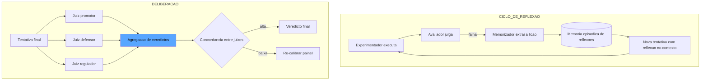

# Capítulo 8: Loops de reflexão, auto-correção e deliberação: do Reflexion ao painel de juízes

## 1. Introdução

No Capítulo 7, você colocou o inspetor autônomo na linha: um agente-revisor que audita a trajetória de outro agente. Agora vamos dar a esse sistema de garantia duas capacidades que o transformam de corretor em aprendiz: a **auto-correção** — o agente que aprende com os próprios erros, armazenando reflexões e aplicando-as nas tentativas seguintes — e a **deliberação** — o painel de juízes que discute antes de decidir, porque um único revisor, por melhor que seja, carrega um único ponto de vista [1]. Você vai aprender o mecanismo do Reflexion, o trabalho seminal de auto-correção por feedback verbal, e como ele se traduz em um harness de produção [2]. E vai aprender quando um revisor não basta: os ensembles com personas contrastantes, a agregação de veredictos e a métrica que mede a confiabilidade do próprio painel — a concordância entre juízes [3]. Ao final, você terá um sistema de garantia que erra, aprende e decide em conjunto.

## 2. Explica

O ponto de partida é o **Reflexion**, o arcabouço seminal de Princeton e MIT que introduziu a auto-correção por *feedback verbal* [2]. A ideia central é uma ruptura com a intuição do aprendizado de máquina clássico: em vez de ajustar pesos por gradiente, o agente avalia suas próprias falhas de execução, converte a avaliação em uma *reflexão em linguagem natural* e a armazena em uma memória episódica — para ser injetada como contexto nas tentativas seguintes. Os autores demonstraram ganhos significativos em tarefas de raciocínio e codificação (HumanEval) sem nenhum fine-tuning de pesos: o aprendizado acontece no texto, não nos parâmetros [2]. Para o harness, essa descoberta é dupla: a auto-correção é barata (um custo de contexto, não de treinamento) e é auditável (cada reflexão é um texto que um humano pode ler e conferir).

Você vai perceber que o loop de reflexão tem quatro estágios, e a ordem é o que faz a diferença. O **experimentador** executa a tentativa; o **avaliador** (o grader ou revisor dos capítulos anteriores) produz o veredicto; o **memorizador** converte o fracasso em uma reflexão genérica e armazenável ("quando a consulta retorna vazio, verificar se o schema mudou antes de assumir ausência de dados"); e o **replay** injeta a reflexão no contexto da próxima tentativa [2]. O detalhe sutil: a reflexão não é a transcrição do erro — é a *lição extraída* do erro. O sistema que apenas registra "falhei no caso X" não aprende; o que registra "falhas de caso X ocorrem quando Y; a verificação é Z" aprende [1].

A segunda capacidade é a **deliberação**. O debate entre múltiplos revisores nasce de uma constatação estatística: um único LLM-as-a-judge tem vieses sistemáticos (você os conheceu no Capítulo 5), e esses vieses são estáveis — o mesmo modelo tende a cometer os mesmos erros de julgamento repetidamente [4]. A deliberação explora a diversidade: vários revisores com *personas contrastantes* — o promotor que procura falhas, o defensor que busca o mérito, o regulador que verifica compliance, o cliente que avalia utilidade — produzem veredictos independentes que, agregados, cancelam vieses individuais [4]. A literatura de avaliação documenta arcabouços de deliberação como o ChatEval e o CourtEval, nos quais os papéis são explícitos e a votação final é o produto da discussão [4].

A agregação dos veredictos é o ponto onde a engenharia substitui a fé. As opções formam uma escala: a **votação majoritária** (barata, robusta, mas cega à confiança individual), o **consenso exigido** (seguro para promoção, mas caro — um único dissidente reprova e trava o fluxo) e a **agregação ponderada por calibração** (cada juiz tem um peso derivado da concordância histórica com humanos — o juiz mais confiável decide mais) [3]. A escolha entre elas depende do contexto: promoção de release exige mais segurança (consenso ou ponderação); triagem de casos em produção tolera votação simples.

E há a métrica que fecha o ciclo: a **concordância entre juízes** — a medida da confiabilidade do próprio painel. Quando dois revisores discordam sistematicamente, o problema não é do sistema auditado — é do painel: as personas não estão aplicando o mesmo critério, ou as rubricas são ambíguas demais [5]. A concordância entre juízes (inter-rater agreement) é o instrumento que mede o instrumento coletivo: baixa concordância é um alarme de calibração, não um ruído a ser ignorado. O padrão da indústria é medir a concordância em amostras contínuas e re-calibrar os juízes quando ela cai abaixo do limite [3].

## 3. Ilustra

Voltemos à estrada de ferro — e ao aprendiz de maquinista. O Reflexion tem a analogia mais direta do livro: o **caderno de lições do aprendiz**. O maquinista veterano exige que o aprendiz mantenha um caderno onde registra, após cada erro, não o que aconteceu — mas o que aprendeu: "curva da serra com chuva: reduzir antes da placa, não depois; verificar o freio no trecho de descida". O caderno não é um diário de falhas; é uma memória episódica de lições, consultada antes de cada manobra nova. Na semana seguinte, quando o aprendiz enfrenta a mesma curva, ele folheia o caderno e aplica a lição — sem precisar errar de novo. O aprendizado acontece no texto do caderno, não em re-treinar o maquinista [2].

A deliberação tem a analogia da **junta de homologação** — a mesa de três inspetores que decide se uma locomotiva entra na linha. O engenheiro de segurança procura a falha estrutural; o operador de linha avalia a usabilidade nas condições reais; o representante do regulador confere a conformidade com o manual. Três olhares, três critérios, um veredicto agregado. O detalhe que o engenheiro-chefe ensina: a junta só funciona porque os três *discordam por desenho* — se os três pensassem igual, seria um inspetor com três assentos. E quando a junta discorda sistematicamente — o segurança reprova tudo que o operador aprova — o problema não é a locomotiva: é o manual, que está ambíguo demais para ser aplicado de forma consistente [5].

E o caderno do aprendiz tem seu lugar na junta: quando a junta reprova uma locomotiva, o motivo vira uma lição registrada — e a próxima locomotiva chega à homologação já sabendo do que foi reprovada. Como Engenheiro de Qualidade de IA, você vê o sistema completo: o ciclo de reflexão (errar → aprender → aplicar) e a deliberação (divergir → deliberar → decidir), unidos pela calibração contínua [1].



O diagrama mostra as duas máquinas: o ciclo de reflexão à esquerda — onde o fracasso vira lição e a lição vira contexto — e a deliberação à direita — onde personas contrastantes julgam a tentativa e a concordância mede o próprio painel [2][4].

## 4. Técnica

### A Memória Episódica de Reflexões

A memória episódica é o componente mais sutil do ciclo de reflexão, e vale entender o que a torna um instrumento de aprendizado e não um depósito de queixas. A literatura do Reflexion é explícita sobre o critério: a reflexão útil é *genérica, acionável e contextual* — ela não descreve a falha, deriva a lição; não se aplica a um caso, se aplica a uma classe; e não flutua solta, carrega o domínio em que foi aprendida [2]. O teste prático da qualidade de uma reflexão é perguntar: esta lição melhoraria a próxima tentativa de uma tarefa *diferente* da que a gerou? Se a resposta for não, a "reflexão" é uma transcrição — e transcrição não aprende, apenas documenta [1]. A indústria adiciona a métrica de *taxa de reutilização*: a proporção de reflexões que efetivamente mudaram o comportamento de tentativas subsequentes — o termômetro que separa a memória viva (a maioria reutilizada) da memória morta (acumulada e ignorada), e que orienta o expurgo periódico discutido na seção Aplica [2].

Vamos construir o ciclo de reflexão em código. Primeiro, a memória episódica — o caderno de lições:

```python
from dataclasses import dataclass, field
from datetime import datetime
from typing import Dict, List, Optional


@dataclass
class Reflexao:
    """Uma licao extraida de uma falha: generica, acionavel e auditavel."""
    id: str
    licao: str
    contexto_original: str = ""
    criada_em: str = field(default_factory=lambda: datetime.utcnow().isoformat())
    vezes_aplicada: int = 0


@dataclass
class MemoriaEpisodica:
    """O caderno de licoes do agente: reflexoes injetadas em novas tentativas."""
    reflexoes: List[Reflexao] = field(default_factory=list)

    def extrair_licao(self, falha: str, contexto: str) -> Reflexao:
        """Converte o relato de uma falha em uma licao generica (heuristica simples)."""
        licao = (
            f"Quando {contexto} resultar em {falha.splitlines()[0][:80]}, "
            "verificar a pre-condicao antes de prosseguir."
        )
        reflexao = Reflexao(
            id=f"ref-{len(self.reflexoes) + 1}",
            licao=licao,
            contexto_original=contexto,
        )
        self.reflexoes.append(reflexao)
        return reflexao

    def contexto_para_tentativa(self, limite: int = 5) -> str:
        """Serializa as reflexoes mais recentes para injecao no prompt da tentativa."""
        recentes = self.reflexoes[-limite:]
        return "\n".join(f"- {r.licao}" for r in recentes)
```

Note a propriedade que separa a memória da mera transcrição: a `extrair_licao` produz uma lição *genérica* — aplicável a outras ocorrências da mesma classe de falha, não apenas ao caso que a gerou [2].

### O Loop de Reflexão com Replay

O ciclo completo — executar, avaliar, memorizar, repetir com a lição no contexto:

```python
Inferencia = Any  # Callable[[str, float], str] - o provedor de inferencia


def executar_com_reflexao(
    inferencia: Inferencia,
    memoria: MemoriaEpisodica,
    tarefa: str,
    max_tentativas: int = 3,
) -> Dict[str, Any]:
    """Loop de reflexao: tenta, extrai a licao do fracasso e repete com o contexto."""
    historico: List[Dict[str, Any]] = []
    for tentativa_num in range(1, max_tentativas + 1):
        contexto_extra = memoria.contexto_para_tentativa()
        prompt = (
            f"Tarefa: {tarefa}\n"
            f"Licoes de tentativas anteriores:\n{contexto_extra}\n"
            f"Responda com JSON: {{'resposta': str, 'confianca': float}}"
        )
        saida = inferencia(prompt, 0.0)
        aprovado = '"confianca"' in saida and '"resposta"' in saida
        historico.append({"tentativa": tentativa_num, "saida": saida, "aprovado": aprovado})
        if aprovado:
            return {"concluido": True, "historico": historico, "tentativas": tentativa_num}
        memoria.extrair_licao(
            falha="saida sem o schema JSON esperado",
            contexto=f"tentativa {tentativa_num} da tarefa '{tarefa[:40]}'",
        )
    return {"concluido": False, "historico": historico, "tentativas": max_tentativas}
```

O detalhe de engenharia: o limite de tentativas é obrigatório — o loop de reflexão sem contenção é um loop infinito com cobrança por rodada, e o harness precisa do freio de mão que você conhecerá em profundidade no Capítulo 9 do harness, mas que aqui já se impõe como disciplina [1].

### O Painel de Juízes com Personas

Agora a deliberação. O painel de juízes com personas contrastantes e agregação:

```python
@dataclass
class Juiz:
    """Um membro do painel com persona, criterio e peso de calibracao."""
    nome: str
    persona: str
    criterio: str
    peso: float = 1.0


def montar_painel() -> List[Juiz]:
    """O painel classico: tres personas que discordam por desenho."""
    return [
        Juiz("promotor", "Voce procura falhas", "Reprovar se houver qualquer risco nao tratado", 1.0),
        Juiz("defensor", "Voce procura o merito", "Aprovar se o objetivo principal foi cumprido", 0.8),
        Juiz("regulador", "Voce confere conformidade", "Reprovar se violar politica ou processo", 1.2),
    ]


def julgar_com_persona(
    inferencia: Inferencia,
    juiz: Juiz,
    tentativa: str,
    rubrica: str,
) -> bool:
    """Um juiz julga a tentativa aplicando a persona e o criterio."""
    prompt = (
        f"Persona: {juiz.persona}.\n"
        f"Criterio: {juiz.criterio}.\n"
        f"Rubrica compartilhada: {rubrica}\n"
        f"Tentativa sob julgamento:\n{tentativa}\n"
        f"Responda apenas: APROVADO ou REPROVADO"
    )
    resposta = inferencia(prompt, 0.0)
    return resposta.strip().upper().startswith("APROVADO")


def deliberar(
    inferencia: Inferencia,
    tentativa: str,
    rubrica: str,
    modo: str = "votacao",
) -> Dict[str, Any]:
    """Deliberacao do painel: votacao majoritaria, consenso ou ponderada por calibracao."""
    painel = montar_painel()
    votos: Dict[str, bool] = {}
    for juiz in painel:
        votos[juiz.nome] = julgar_com_persona(inferencia, juiz, tentativa, rubrica)

    if modo == "consenso":
        aprovado = all(votos.values())
        resumo = "Consenso: todos os juizes aprovaram" if aprovado else "Consenso: houve dissidencia"
    elif modo == "ponderado":
        total = sum(juiz.peso for juiz in painel)
        favor = sum(juiz.peso for juiz in painel if votos[juiz.nome])
        aprovado = favor / total >= 0.6
        resumo = f"Ponderado: {favor:.1f}/{total:.1f} pesos a favor"
    else:  # votacao
        favor = sum(1 for v in votos.values() if v)
        aprovado = favor >= len(painel) // 2 + 1
        resumo = f"Votacao: {favor}/{len(painel)} a favor"

    return {"aprovado": aprovado, "votos": votos, "resumo": resumo}
```

O detalhe de design: a rubrica compartilhada é o que impede que as personas virem caos — os juízes discordam na *ênfase* (o que procurar), não no *critério* (o que é aceitável). A deliberação funciona quando a diversidade é de perspectiva, não de padrão [4].

### A Concordância entre Juízes

A métrica que fecha o ciclo — medir a confiabilidade do próprio painel:

```python
def concordancia_entre_juizes(
    votos_por_caso: List[Dict[str, bool]],
) -> Dict[str, Any]:
    """Mede a concordancia do painel: proporcao de casos em que os juizes concordam."""
    casos = len(votos_por_caso)
    if casos == 0:
        return {"concordancia": 0.0, "casos": 0}
    concordantes = 0
    for votos in votos_por_caso:
        valores = set(votos.values())
        if len(valores) == 1:
            concordantes += 1
    taxa = concordantes / casos
    return {
        "concordancia": taxa,
        "casos": casos,
        "saudavel": taxa >= 0.8,
        "sugestao": (
            "Painel calibrado" if taxa >= 0.8
            else "Concordancia baixa: revisar rubrica compartilhada ou personas"
        ),
    }
```

A concordância é o termômetro do painel: baixa concordância não significa "juízes ruins" — significa que a rubrica compartilhada é ambígua o bastante para cada persona aplicar um padrão diferente, e a correção é no manual, não nos juízes [5].

## 5. Aplica

### A Cena de Contraste

Sua empresa mantém um agente que escreve documentação técnica a partir de issues de código. O time, entusiasmado com a auto-correção, configurou o agente para tentar indefinidamente até "acertar": quando a revisão reprovava, o agente refazia com a reflexão no contexto — sem limite de tentativas. No primeiro mês, o efeito foi ótimo: a taxa de aprovação subiu. No segundo, a conta de tokens triplicou, e o time descobriu no log que um único documento tinha sido regerado 47 vezes: a reflexão ensinava "adicionar mais detalhes", o agente escrevia mais, a revisão reprovava por verbosidade, o agente "aprendia a encurtar", a revisão reprovava por falta de detalhes — um ciclo de auto-reforço entre duas lições contraditórias.

O erro foi duplo. Primeiro, a ausência de contenção: o loop de reflexão sem limite de tentativas é um carrossel sem freio [1]. Segundo — e mais sutil — a memória acumulou lições contraditórias: o agente estava aplicando simultaneamente "ser mais detalhado" e "ser mais conciso", e cada tentativa nova oscilava entre os dois extremos. O diagnóstico liga à teoria: a reflexão só aprende quando a lição é genérica e a memória é *gerenciada* — lições contraditórias precisam ser detectadas e reconciliadas, não acumuladas.

A correção: o limite de três tentativas (o freio de mão), a revisão da memória (duas lições conflitantes sobre a mesma dimensão disparam a reconciliação — a rubrica de verbosidade precisava de níveis explícitos, e isso era um problema de rubrica, não de agente), e a introdução do painel de juízes com personas — o promotor e o defensor passaram a divergir deliberadamente sobre "detalhe vs. concisão", e a votação ponderada desempatou os casos ambíguos [4]. A conta de tokens caiu 60%, e a taxa de aprovação subiu 12 pontos — porque o sistema passou a decidir com deliberação, não a oscilar com reflexão cega [2].

### Armadilhas Comuns

- **Loop sem freio**: reflexão sem limite de tentativas é custo infinito. Contenha sempre [1].
- **Memória de lições contraditórias**: acumular "seja detalhado" e "seja conciso" sem reconciliação cria oscilação. Detecte conflitos e reconcilie na rubrica [2].
- **Painel clonado**: três juízes com a mesma persona são um juiz com três votos. A diversidade de perspectiva é o que faz a deliberação funcionar [4].

### A Gestão da Memória de Reflexões

A gestão da memória tem uma dimensão de custo que a indústria quantifica: a memória não é gratuita — cada reflexão injetada no contexto consome tokens a cada tentativa, e a memória que cresce sem controle transforma o aprendizado em imposto permanente sobre todas as execuções [1]. O dimensionamento do imposto segue a regra da relevância: o limite de injeção (as cinco reflexões mais recentes da implementação da seção Técnica) é um parâmetro de custo a ser calibrado — reflexões demais diluem o sinal e encarecem o prompt; reflexões de menos desperdiçam o aprendizado. A prática recomendada é a *memória em camadas*: uma camada quente (as poucas reflexões injetadas em toda tentativa, selecionadas por relevância ao domínio da tarefa) e uma camada fria (o arquivo histórico, consultado apenas em tarefas marcadas como de difícil resolução) [2]. A separação quente/fria é a mesma economia que organiza o contexto em sistemas de RAG: o que toda tentativa precisa vive perto, o que poucas precisam vive longe — e o custo da memória passa a ser uma decisão de arquitetura, não um acidente do crescimento [1].

O ciclo de reflexão que você construiu na seção Técnica tem um ponto cego que só aparece com o tempo: a memória episódica cresce sem limite, e a memória crescente traz três doenças específicas. A primeira é a **contradição silenciosa**: duas lições aprendidas em momentos diferentes se contradizem ("seja detalhado" contra "seja conciso"), e o agente oscila entre elas sem nunca reconciliá-las — o sintoma é a alternância de comportamento entre tentativas da mesma tarefa [2]. A segunda é a **poluição por contexto**: lições aprendidas em domínios diferentes se misturam, e a tentativa de um domínio recebe lições de outro — o sintoma é a aplicação de heurísticas irrelevantes que degradam a qualidade. A terceira é a **vida útil**: uma lição correta no mês passado pode estar errada hoje, porque o domínio mudou — e a memória que não envelhece vira um conselheiro desatualizado [1].

A gestão da memória é a disciplina que trata as três doenças, e ela tem três mecanismos. O primeiro é a **detecção de contradição**: quando uma nova lição contradiz uma existente sobre a mesma dimensão, o harness sinaliza o conflito — e a resolução não é automática, é a revisão da rubrica subjacente: a contradição entre "detalhado" e "conciso" quase sempre revela que a rubrica de verbosidade é ambígua, e o problema está no manual, não no agente [2]. O segundo é o **escopo por domínio**: cada reflexão carrega a tag do domínio em que foi aprendida, e a injeção no contexto filtra por domínio — o agente de documentação não recebe as lições do agente de triagem [1]. O terceiro é o **expurgo por relevância**: a cada revisão periódica, lições sem aplicação recente são arquivadas, e lições contraditas por evidência nova são descartadas — a memória viva é a memória enxuta [4].

### A Escalada da Deliberação: Quando o Painel Decide e Quando o Humano Entra

A deliberação resolve a maioria das ambiguidades — mas não todas, e o profissional sabe exatamente onde está o limite. A arquitetura recomendada é a **escalada em camadas**: a votação simples decide os casos triviais (baixo custo, alta velocidade); a ponderação por calibração decide os casos médios (os pesos dos juízes mais confiáveis contam mais); o consenso decidido é exigido nos casos de alto risco (promoção de release, decisão irreversível); e o humano entra nos casos em que o painel discorda de forma persistente [3]. O critério de escalada não é a complexidade do caso — é o *custo do erro*: quanto mais caro é errar, mais conservadora é a camada exigida, e mais rápido o caso sobe para o humano [4].

A escalada tem uma segunda dimensão, temporal: a **confiança diferida**. Quando o painel discorda, a decisão não precisa ser imediata — o harness pode reter o caso, aplicar uma política conservadora (reprovar para segurança ou aprovar com marca de risco) e devolver ao painel na próxima rodada com contexto adicional [1]. O caso retido vira também material de calibração: a discordância persistente sobre uma categoria é o sinal de que a rubrica compartilhada precisa de exemplos novos — e a deliberação alimenta a curadoria, fechando o ciclo entre o painel e o padrão ouro [5]. A arquitetura inteira — camadas de escalada, confiança diferida e retroalimentação da calibração — é o desenho que separa o painel de juízes decorativo do painel de juízes que a organização consegue defender perante a auditoria: porque cada veredicto tem uma trilha que diz não apenas o que foi decidido, mas em que camada, com que pesos e com que evidência [3].

### A Reflexão e a Deliberação no Contexto do Ecossistema

A auto-correção e a deliberação são campos ativos de pesquisa e prática, e situá-los no ecossistema ajuda a calibrar expectativas e a escolher mecanismos. A literatura documenta a evolução da auto-correção: o Reflexion mostrou que reflexões textuais superam abordagens de tentativa cega em tarefas de raciocínio e codificação, e a linha de pesquisa subsequente expandiu o mecanismo para ambientes mais ricos — mas a mesma literatura alerta para os limites: a auto-correção sem feedback confiável pode reforçar erros, e a qualidade do avaliador interno é o fator que decide se o loop aprende ou estagna [6]. A deliberação multi-agente tem sua própria linhagem: os arcabouços de debate com personas contrastantes — o mesmo desenho da junta de homologação — documentam ganhos de robustez sobre o julgamento individual, com a ressalva de que a diversidade de perspectiva precisa ser estrutural, não nominal [7].

A prática da indústria integra os dois mecanismos às camadas que você já domina: o juiz calibrado do Capítulo 5 fornece o avaliador interno do loop de reflexão — a qualidade do aprendizado do agente depende diretamente da qualidade desse juiz — e a revisão autônoma do Capítulo 7 fornece o avaliador externo que a deliberação convoca quando o veredicto é caro [8]. O paradigma do Human-on-the-Bridge adiciona a dimensão de curadoria: as armadilhas e os casos de fronteira que alimentam a deliberação são curados por humanos a montante, e a automação executa a deliberação em escala — a mesma divisão de trabalho entre curadoria humana e execução automática que organiza o golden set e o red-team [9]. E a governança fecha o quadro: a concordância entre juízes — o termômetro do painel deste capítulo — é a materialização, na avaliação, do princípio do NIST AI RMF de que a confiança se constrói com medição contínua e verificação independente [10]. O ciclo completo — refletir, deliberar, calibrar — é o que transforma a avaliação de um ato isolado em um processo de aprendizado institucional [6].

A operacionalização dos loops de reflexão em produção segue o mesmo padrão de engenharia que você aplicou aos evals convencionais. Os padrões arquiteturais de agentes recomendam manter a reflexão como componente testável: o loop de auto-correção é um workflow como outro qualquer, com entradas, saídas e contratos — e, portanto, avaliável como qualquer componente [11]. A metodologia de especificar-medir-melhorar se aplica ao próprio loop: especificar quando a reflexão deve disparar, medir se ela melhora o resultado e melhorar o juiz interno que decide pela nova tentativa [12]. O ferramental de rastreamento registra cada iteração da reflexão como trace — a evidência do esforço de correção é tão importante quanto o resultado final, porque permite auditar se o agente corrigiu por deliberação ou por sorte [13]. As plataformas de avaliação tratam o loop como cenário multi-turno: o caso de teste é a sequência inteira, e o passo de reflexão é uma etapa avaliável com veredicto próprio [14]. Os frameworks de testes de prompt permitem fixar o comportamento reflexivo como teste de regressão: a mesma entrada deve produzir a mesma decisão de corrigir ou seguir adiante [15]. Na prática de testes unitários de LLM, cada reflexão instrumentada vira uma asserção — o equivalente a verificar que a função trata o erro antes de prosseguir [16]. O eval-driven development adiciona a política: o loop de reflexão só entra em produção com cobertura do golden set — os casos que exigem correção são parte do conjunto, e a taxa de correção bem-sucedida é uma métrica do painel [17]. O perfil agêntico do NIST AI RMF observa a outra face: a auto-correção sem limites é um risco de autonomia — o agente que persiste em corrigir pode escalar o erro em vez de contê-lo, e os guardrails de iteração máxima são salvaguardas obrigatórias [18]. Os guias de CI/CD para LLMs recomendam colocar um teto de iterações no próprio pipeline, tratando o loop infinito como falha de teste — a mesma disciplina que bloqueia loops infinitos em software convencional [19]. E os fundamentos de CI para IA lembram o custo: cada iteração de reflexão é chamada de modelo, latência e orçamento — medir o custo marginal de cada correção bem-sucedida é o que separa a reflexão útil do teatro de reflexão [20].

## 6. Conclusão

Este capítulo deu ao sistema de garantia a capacidade de aprender e de deliberar: o ciclo de reflexão do Reflexion — experimentar, avaliar, memorizar a lição, repetir com o contexto — com contenção obrigatória; e o painel de juízes com personas contrastantes, agregação por votação, consenso ou ponderação por calibração, e a concordância entre juízes como termômetro do próprio painel. Você aprendeu que a auto-correção acontece no texto — barata e auditável — e que a deliberação transforma um ponto de vista em um veredicto robusto. O desafio: monte um painel de três juízes com personas contrastantes para o sistema do seu trabalho e meça a concordância em vinte casos — o número que você encontrar é o diagnóstico da sua rubrica. No Capítulo 9, o adversário entra em cena: o red-teaming automatizado, o teste que prova a resiliência do agente contra quem quer — deliberadamente — fazê-lo falhar.

## 7. Referências Bibliográficas

[1] ANTHROPIC. *Demystifying evals for AI agents*. 2026. Disponível em: https://www.anthropic.com/engineering/demystifying-evals-for-ai-agents. Acesso em: 06 ago. 2026.

[2] SHINN, Noah; CASSANO, Federico; NARASIMHAN, Karthik et al. *Reflexion: language agents with verbal reinforcement learning*. Princeton/MIT, 2023. Disponível em: https://arxiv.org/abs/2303.11366. Acesso em: 06 ago. 2026.

[3] YU, Fangyi et al. *When AIs judge AIs: the rise of agent-as-a-judge evaluation for LLMs*. Stanford/Scale AI, 2025. Disponível em: https://arxiv.org/html/2508.02994v1. Acesso em: 06 ago. 2026.

[4] BOUSETOUANE, Fouad. *Human-on-the-bridge: scalable evaluation for AI agents*. ProofAgent/UChicago, 2026. Disponível em: https://arxiv.org/html/2606.16871v1. Acesso em: 06 ago. 2026.

[5] CHASE, Harrison. *Aligning LLM-as-a-judge with human preferences*. LangChain, 2024. Disponível em: https://www.langchain.com/blog/aligning-llm-as-a-judge-with-human-preferences. Acesso em: 06 ago. 2026.

[6] SHINN, Noah; CASSANO, Federico; NARASIMHAN, Karthik et al. *Reflexion: language agents with verbal reinforcement learning*. Princeton/MIT, 2023. Disponível em: https://arxiv.org/abs/2303.11366. Acesso em: 06 ago. 2026.

[7] YU, Fangyi et al. *When AIs judge AIs: the rise of agent-as-a-judge evaluation for LLMs*. Stanford/Scale AI, 2025. Disponível em: https://arxiv.org/html/2508.02994v1. Acesso em: 06 ago. 2026.

[8] BOUSETOUANE, Fouad. *Human-on-the-bridge: scalable evaluation for AI agents*. ProofAgent/UChicago, 2026. Disponível em: https://arxiv.org/html/2606.16871v1. Acesso em: 06 ago. 2026.

[9] BRAINTRUST. *What is an LLM-as-a-judge? When to use it (and when to use deterministic evals)*. 2026. Disponível em: https://www.braintrust.dev/articles/what-is-llm-as-a-judge. Acesso em: 06 ago. 2026.

[10] NIST. *AI risk management framework (AI RMF 1.0)*. 2023. Disponível em: https://www.nist.gov/itl/ai-risk-management-framework. Acesso em: 06 ago. 2026.

[11] ANTHROPIC. *Building effective agents*. 2024. Disponível em: https://www.anthropic.com/engineering/building-effective-agents. Acesso em: 06 ago. 2026.

[12] OPENAI. *How evals drive the next chapter in AI for businesses*. 2025. Disponível em: https://openai.com/index/evals-drive-next-chapter-of-ai/. Acesso em: 06 ago. 2026.

[13] LANGCHAIN. *LangSmith evaluation concepts*. 2026. Disponível em: https://docs.smith.langchain.com/evaluation. Acesso em: 06 ago. 2026.

[14] LANGFUSE. *LLM evaluation: methods, best practices, and a practical roadmap*. 2025. Disponível em: https://langfuse.com/blog/2025-11-12-evals. Acesso em: 06 ago. 2026.

[15] PROMPTFOO. *Introduction and docs*. 2026. Disponível em: https://www.promptfoo.dev/docs/intro/. Acesso em: 06 ago. 2026.

[16] CONFIDENT AI. *DeepEval: LLM evaluation unit testing in CI/CD*. 2026. Disponível em: https://deepeval.com/docs/evaluation-unit-testing-in-ci-cd. Acesso em: 06 ago. 2026.

[17] BRAINTRUST. *Eval-driven development*. 2026. Disponível em: https://www.braintrust.dev/articles/eval-driven-development. Acesso em: 06 ago. 2026.

[18] CLOUD SECURITY ALLIANCE. *Agentic NIST AI RMF profile*. 2025/2026. Disponível em: https://labs.cloudsecurityalliance.org/agentic/agentic-nist-ai-rmf-profile-v1/. Acesso em: 06 ago. 2026.

[19] LATITUDE. *The ultimate CI/CD LLM evaluation guide*. 2026. Disponível em: https://latitude.so/blog/ultimate-ci-cd-llm-evaluation-guide. Acesso em: 06 ago. 2026.

[20] BRONSDON, Conor. *Continuous integration (CI) for AI: fundamentals*. Galileo AI, 2025. Disponível em: https://galileo.ai/blog/continuous-integration-ci-ai-fundamentals. Acesso em: 06 ago. 2026.
