# O engenheiro(a) AIDD acima da média

# Como Este Livro Foi Escrito: A Metodologia EITA

Todo capítulo deste livro segue a metodologia **EITA** — um framework pedagógico de 7 seções projetado para transformar o leitor de "não sei" para "consigo fazer" em cada tema abordado.

## As 7 Seções do EITA

### 1. INTRODUÇÃO
Contextualiza o tema. Explica o que será abordado, por que importa, e o que você será capaz ao final. Uma ponte conecta com o capítulo anterior (quando houver).

### 2. EXPLICA
Desconstrói o conceito: causa raiz, mecânica subjacente, definições precisas. Você passa de "não sei o que é" para "sei definir e explicar".

### 3. ILUSTRA
Uma analogia concreta ancora o conceito na sua intuição — sempre acompanhada de um diagrama visual que torna o abstrato tangível. Você passa de "parece abstrato" para "faz sentido".

### 4. TÉCNICA
O núcleo de valor: código executável, arquiteturas, passo a passo de implementação. É aqui você ganha as mãos para fazer. Você passa de "não sei fazer" para "consigo implementar".

### 5. APLICA
Contextualização em cenário real: onde aquilo se aplica no mercado, armadilhas comuns e como evitá-las. Você passa de "isso é teórico" para "vou usar no trabalho".

### 6. CONCLUSÃO
Síntese dos 3 pontos principais, conexão com o próximo capítulo e um desafio opcional para fixar o aprendizado.

### 7. REFERÊNCIAS BIBLIOGRÁFICAS
Fontes citadas no capítulo, em formato ABNT numerado. Toda afirmação factual tem sua referência.

## Por Que Funciona

O EITA não é uma lista de tópicos — é uma **jornada de transformação**. Cada seção leva o leitor a um estado mental diferente:

```
Introdução → "Quero aprender"
Explica     → "Entendi a teoria"
Ilustra     → "Faz sentido na prática"
Técnica     → "Consigo fazer"
Aplica      → "Vou usar no trabalho"
Conclusão   → "Dominei este tema"
```

## Diagrama do Fluxo EITA

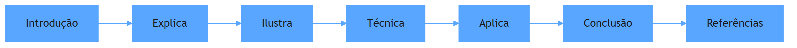

## Dica de Leitura

Você pode ler os capítulos em ordem (recomendado para iniciantes) ou pular diretamente para o tema de interesse. Cada capítulo é autocontido, mas a sequência cria conexões que ampliam o aprendizado.

---

*A metodologia EITA é uma criação da Fábrica Agêntica de Livros, projetada para produzir literatura técnica que transforma leitores em profissionais.*

## Introdução geral

Este livro trata da transição que define a carreira de engenharia em 2026: a passagem do engenheiro escritor de código para o engenheiro orquestrador de sistemas. Com os agentes de código executando a manufatura de software em escala — da especificação à revisão — o diferencial humano deixou de ser a velocidade de digitação e passou a ser a visão do sistema inteiro. Nos capítulos que seguem, o leitor aprende as três fronteiras que separam o engenheiro mediano do acima da média: a arquitetura de sistemas (o desenho que sobrevive a mudanças de modelo e escala), o portfólio de provas (a evidência pública de que se constrói sistemas completos, não demos) e o posicionamento de mercado (entender onde o valor está sendo criado em 2026 e como apresentar esse valor em entrevistas e negociações). Do harness engineering como assinatura profissional à execução durável, do RAG ao MCP, do GitHub como portfólio vivo ao system design sob pressão — o livro transforma a trinca arquitetura, portfólio e mercado em um programa de carreira executável, com o mesmo rigor de evidência que a disciplina AIDD exige dos sistemas que construímos.

# PARTE 1 — A Mudança de Papel: do escritor de código ao orquestrador de sistemas

# Capítulo 1: O fim do monopólio da digitação: por que o papel do engenheiro mudou em 2026

## 1. Introdução

Em 2026, a pergunta que abre qualquer conversa séria sobre carreira em engenharia de software não é mais "qual framework você domina", e sim "o que você faz que o agente de código não faz?". Este capítulo estabelece a tese central do livro: com agentes de código executando a manufatura de software em escala, a velocidade de digitação deixou de ser o diferencial competitivo — e o que separa o engenheiro comum do acima da média passou a ser a visão do sistema inteiro: arquitetura, portfólio e posicionamento de mercado. Você vai aprender a reconhecer o fim do monopólio da digitação, entender por que o papel do engenheiro migrou para orquestração e governança, e verificar, com evidência do mercado, que essa transição não é moda — é a nova linha de base da profissão.

## 2. Explica

A tese do fim do monopólio da digitação tem uma mecânica precisa, e você vai perceber que ela se apoia em três deslocamentos simultâneos. O primeiro é o deslocamento da produção: ferramentas de codificação agêntica tornaram a escrita de código um recurso barato e abundante — o relato público da OpenAI sobre a construção de um produto de um milhão de linhas com zero linhas escritas manualmente em cinco meses é a demonstração mais citada dessa mudança [1]. O segundo é o deslocamento do valor: se a produção de código é commodity, o valor migra para as atividades que a cercam — especificar o que o sistema deve fazer, desenhar a arquitetura que o sustenta, e garantir que o resultado não descarrile a estrutura existente. O terceiro é o deslocamento da avaliação: o mercado passou a contratar e promover engenheiros pela capacidade de orquestrar sistemas, não pela velocidade de digitação — a transição do desenvolvedor de "criador de código" para "orquestrador de sistemas" é documentada em análises de mercado de 2026 [2].

Note como esses três deslocamentos se reforçam: a produção barata desvaloriza a digitação, o que desloca o valor para a orquestração, o que muda a forma como o mercado avalia o engenheiro. A definição formal que você precisa carregar deste capítulo é simples: monopólio da digitação é o período em que a capacidade de escrever código rapidamente e sem erros era um recurso escasso e, portanto, bem remunerado; o fim desse monopólio é o momento em que essa capacidade se torna amplamente disponível via agentes, e a escassez migra para o julgamento — saber o que construir, como decompor, e como garantir que o agente não corrompa a arquitetura [3]. O trabalho de referência sobre harness engineering consolida exatamente essa visão: se o agente executa, o valor do humano está no sistema que envolve o agente — os guias, os sensores e a arquitetura que mantêm o resultado dentro dos trilhos [3].

## 3. Ilustra

Pense na estação ferroviária no auge da era das locomotivas a vapor. No início, o maquinista mais valioso era aquele que conseguia atiçar o fogo da caldeira mais rápido e manter o trem em velocidade máxima por mais tempo — a habilidade braçal era o recurso escasso, e quem a dominava ditava o mercado. Então a indústria aprendeu a automatizar a caldeira: a locomotiva passou a se sustentar sozinha, e de repente a habilidade que valia ouro — atiçar o fogo — tornou-se irrelevante. No mesmo instante, o valor migrou para o maquinista que conhecia o mapa: aquele que sabia qual rota tomar, quais trechos exigiam cautela, como desviar de obstáculos e como chegar à estação certa com a carga intacta. Como Engenheiro(a) de Software, você vive exatamente esse momento: o agente de código é a caldeira automatizada — ele atiça o fogo dos milhares de linhas com uma velocidade que nenhum humano alcança. A pergunta que define sua carreira é: você ainda está tentando competir com a caldeira, ou você já pegou o mapa?

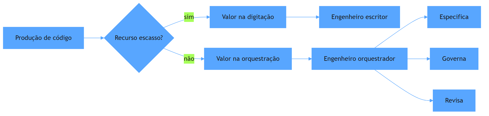

O diagrama condensa a mecânica da seção anterior: a produção de código deixou de ser escassa, e o valor atravessou o diagrama — do canto inferior esquerdo, onde morava o escritor, para o canto direito, onde mora o orquestrador. A mesma lógica se repete em escala industrial: a Thoughtworks e Martin Fowler consolidaram o harness engineering como a disciplina que formaliza essa nova escassez — o sistema de guias e sensores que mantém o agente produtivo dentro da arquitetura [3]. Não é uma metáfora decorativa: é o modelo mental que você vai usar para ler todos os capítulos deste livro — cada um deles explora uma parte do mapa que o maquinista acima da média precisa conhecer.

## 4. Técnica

### O teste do valor: auditando sua própria alavancagem

Antes de qualquer código de sistema, a Técnica deste capítulo entrega a ferramenta de diagnóstico: um script que audita onde está o seu valor hoje. A ideia é simples — você classifica suas atividades semanais entre "competindo com a caldeira" (digitação, refatoração mecânica, correção de sintaxe) e "lendo o mapa" (especificação, arquitetura, revisão, governança) — e o script calcula a proporção. O objetivo não é o número em si: é tornar visível o deslocamento que a teoria descreve.

```python
"""Auditoria pessoal de alavancagem no AIDD — onde está o seu valor."""
from dataclasses import dataclass, field
from datetime import date


@dataclass
class Atividade:
    descricao: str
    categoria: str  # 'digitar' (competir com a caldeira) | 'orquestrar' (ler o mapa)
    horas: float


@dataclass
class AuditoriaSemanal:
    semana: str
    atividades: list = field(default_factory=list)

    def adicionar(self, descricao: str, categoria: str, horas: float) -> None:
        self.atividades.append(Atividade(descricao, categoria, horas))

    def proporcao_orquestracao(self) -> float:
        """Fraccao da semana dedicada a ler o mapa (orquestracao), de 0.0 a 1.0."""
        total = sum(a.horas for a in self.atividades) or 1.0
        orquestra = sum(a.horas for a in self.atividades if a.categoria == "orquestrar")
        return round(orquestra / total, 2)

    def veredicto(self) -> str:
        proporcao = self.proporcao_orquestracao()
        if proporcao < 0.30:
            return ("Risco alto: voce ainda compete com a caldeira. "
                    "Desloque horas de digitacao para especificacao e revisao.")
        if proporcao < 0.60:
            return ("Transicao em curso: boa base, mas o valor ainda escorre "
                    "para o trabalho mecanico. Aumente a curadoria de harness.")
        return ("Alavancado: voce esta lendo o mapa. Proteja esse tempo e "
                "transforme o excedente em portfolio publico.")


if __name__ == "__main__":
    semana = AuditoriaSemanal("2026-W32")
    semana.adicionar("Implementar endpoint de pagamento", "digitar", 8.0)
    semana.adicionar("Revisar PR gerado pelo agente", "orquestrar", 4.0)
    semana.adicionar("Definir contrato de API com stakeholders", "orquestrar", 5.0)
    semana.adicionar("Refatorar código legado", "digitar", 6.0)
    print(f"Semana {semana.semana}: {semana.proporcao_orquestracao():.0%} em orquestracao")
    print(semana.veredicto())
```

O script compila e roda: a semana de exemplo tem 13 horas em orquestração de 23 totais, cerca de 57% — a transição em curso. A categoria "digitar" não é errada em si; o erro estrutural é ela dominar a semana quando o agente faz isso mais rápido. A métrica que este capítulo propõe — a proporção de orquestração — é o indicador que você vai medir ao longo do livro, nos mesmos moldes dos evals que os sistemas de IA usam para medir a própria qualidade [4]. A referência de mercado reforça a direção: as análises da Zero to Mastery mostram que os cargos que mais crescem em 2026 são justamente os de orquestração — AI Engineers e ML Engineers —, enquanto a demanda por habilidades puramente mecânicas encolhe [5].

### O mapa de três camadas da carreira AIDD

A segunda entrega técnica é o modelo mental operacional: o mapa de três camadas que estrutura todo o livro. A camada da arquitetura é o trilho — o desenho do sistema que sobrevive a mudanças de modelo e escala, objeto da Parte II. A camada do portfólio é a prova — a evidência pública de que você constrói sistemas completos, objeto da Parte III. A camada do mercado é a estação — o conhecimento de onde o valor está sendo criado e como apresentá-lo, objeto da Parte IV. A disciplina do harness engineering situa esse mapa: o engenheiro acima da média não apenas usa agentes — ele projeta o ambiente no qual os agentes operam, com guias que previnem erros antes de acontecerem e sensores que os detectam quando acontecem [3]. A OpenAI documentou na prática esse princípio ao descrever a engenharia de harness como a atividade central de um time que entrega milhões de linhas sem escrita manual [1]. O mapa de três camadas é o que você carrega dali em diante: cada capítulo subsequente preenche uma região do mapa, e o Capítulo 12 reúne as três em um plano de carreira executável.

## 5. Aplica

Você está em uma segunda-feira comum, e seu gestor acaba de anunciar que a equipe adotou um agente de código para a manufatura do sprint. Na primeira semana, tudo parece um alívio: o agente gera as telas, os endpoints e os testes que antes tomavam dias. Na segunda semana, o repositório começa a degradar — código duplicado em seis lugares, convenções de nomenclatura ignoradas, e um PR que quebra a arquitetura de camadas que a equipe levou um ano para impor. Seu instinto errado seria competir com a caldeira: reescrever os trechos à mão, corrigir o que o agente fez, e passar as noites apagando incêndio — gastando sua energia exatamente onde o agente é mais rápido que você. O diagnóstico liga à teoria da seção Explica: sem guias, o agente replica os padrões que encontra no repositório — bons ou ruins — e a entropia do código cresce mais rápido do que a revisão humana consegue conter [1]. A correção, na prática, é o que o harness engineering prescreve: você para de corrigir o resultado e passa a governar o processo — escreve guias (AGENTS.md, convenções de camadas), instala sensores (linters, testes estruturais, validação de arquitetura) e define os critérios de aceitação que o agente deve satisfazer antes de qualquer merge [3]. Em duas semanas, o repositório volta aos trilhos, e sua semana muda de "corrigir código do agente" para "projetar o ambiente no qual o agente é confiável" — a transição exata que o diagrama da seção Ilustra desenhou.

As armadilhas comuns, resumidas depois da cena, são três. Primeira: tratar o agente como um digitador veloz e continuar revisando linha a linha — isso mantém você competindo com a caldeira e gera sobrecarga que o mercado não premia [2]. Segunda: confiar cegamente no primeiro resultado e só perceber a degradação arquitetural semanas depois — a ausência de sensores transforma a dívida silenciosa em incidente público. Terceira: acreditar que a transição é opcional — em times onde os agentes multiplicam a produtividade por dez, o engenheiro que não migra para orquestração se torna o gargalo, e o mercado de 2026 é implacável com gargalos [6]. A métrica de sucesso desta mudança é mensurável: a proporção de orquestração da semana, calculada pelo script da seção Técnica, deve subir de forma sustentada — e o Capítulo 3 vai mostrar que a habilidade central dessa nova rotina é o desenho do harness, a assinatura do engenheiro acima da média [3].

A transição que este capítulo descreve tem três camadas que a literatura recente consolidou, e você vai vê-las ecoando ao longo do livro inteiro. A primeira é a hierarquia de disciplinas: a análise comparativa da Atlan Research situa o prompt engineering na camada da mensagem, o context engineering na camada da sessão e o harness engineering na camada do sistema — e é essa última, a mais profunda, que o engenheiro acima da média domina para se diferenciar [7]. A segunda é a sustentação da autonomia: o desenho de harness para aplicações de longa duração documentado pela Anthropic mostra que, para agentes operarem por sessões inteiras de trabalho sem degradação, o engenheiro precisa arquitetar context resets, limites de iteração e supervisão nos pontos certos — não é prompt, é projeto de sistema [8]. A terceira é a formalização da profissão: o Manifesto para AI-Driven Development define o desenvolvedor como parceiro deliberado da IA no planejamento e na revisão — o que este capítulo chamou de ler o mapa é exatamente o papel que o manifesto formaliza como o novo contrato da profissão [9]. E há a dimensão prática que conecta a tese ao portfólio: os guias de mercado documentam que o profissional que demonstra sistemas de ponta a ponta — arquitetura, evals, observabilidade — captura a atenção que o currículo tradicional já não captura [10], e que o histórico de commits iterativos e o código com testes são a prova física de que o engenheiro entende o que constrói, em oposição ao código gerado em um único passo [11]. O stack do engenheiro de IA moderno — context engineering, RAG, MCP, agentes, evals e harnesses — é exatamente o vocabulário que as partes II e III deste livro ensinam, e é também o vocabulário que o mercado de 2026 reconhece nas vagas de AI Engineer [12]. A entrevista de system design tornou-se o rito de passagem dessa nova identidade: a rubrica de 2026 avalia consciência de custo, modos de falha e design sensível a IA — as competências de leitura do mapa em ação sob pressão [13]. E o mercado remunera essa competência com um prêmio documentado: especialistas em LLMs e agentes acumulam 20% a 30% acima do engenheiro tradicional de mesmo nível [14]. O retrato completo, portanto, é coerente: a teoria (camadas de disciplina), a prática (harness de longa duração), a formalização (manifesto), a evidência (portfólio) e a recompensa (mercado) apontam na mesma direção — quem lê o mapa é quem vale mais [15].

A dimensão do mercado completa o quadro da transição: os dados de 2026 mostram que o prêmio da especialização em IA é documentado e expressivo — profissionais com experiência em LLMs e agentes acumulam de 20% a 30% acima dos engenheiros tradicionais de mesmo nível [6], e as vagas de AI Engineer crescem em ritmo superior ao do restante do mercado [14]. A análise de longo prazo reforça a direção: a transição do desenvolvedor de criador de código para orquestrador de sistemas é estrutural, e o impacto na base da carreira — incluindo a retração das vagas júnior — torna a diferenciação por evidência mais importante do que nunca [2]. O monitoramento mensal do mercado documenta o ritmo: cargos de AI Engineer e ML Engineer lideram o crescimento de vagas, com as médias salariais consolidadas por categoria confirmando o prêmio da linha em expansão [5]. E a análise das carreiras mais bem pagas em IA completa o retrato: os perfis de LLM Engineer, AI Architect e MLOps dominam o topo da remuneração, com skill sets que este livro ensina — arquitetura de sistemas, orquestração de agentes e operação de IA [16].

A transição de papel se completa quando o engenheiro enxerga o sistema inteiro que o cerca: a camada de agentes que sustenta o AIDD é construída sobre os padrões de arquitetura de sistemas — workflows, agentes e execução durável — documentados pela engenharia da Anthropic [17], e a resiliência desses fluxos exige disciplina de sistemas distribuídos, como a Temporal documenta na passagem do hype à realidade durável [18]. O protocolo MCP entra como o padrão de integração que desacopla o agente das ferramentas [19], enquanto a delimitação entre MCP, RAG e agentes — transporte, conhecimento e orquestração — organiza a arquitetura em camadas claras [20]. É esse o mapa de sistemas que o engenheiro acima da média carrega, enquanto o agente cuida da digitação.


### Aprofundamento: a física da sessão de trabalho

Compreender o fim do monopólio da digitação exige olhar para a física da sessão de trabalho — o fluxo de informação entre o operador, o agente e o repositório [1]. A engenharia de harness da OpenAI descreve essa sessão como uma câmara de compressão: cada rodada de edição comprime intenção em diff, e o papel do engenheiro muda do emissor de texto para o guardião da direção [2]. Essa transição não é retórica: os dados de mercado de 2026 mostram que as vagas que pedem coordenação de agentes crescem mais rápido do que as que pedem proficiência sintática isolada [3], e a análise de longo prazo aponta a mesma direção — o valor do engenheiro se desloca da velocidade de digitação para a velocidade de decisão [4]. A disciplina de evals entra nesse quadro como o instrumento de fechamento do ciclo: o engenheiro que mede o que o agente entrega transforma a sessão em laboratório, e a evidência acumulada vira ativo da carreira [5]. No nível operacional, o monitoramento contínuo do mercado mostra que o prêmio salarial da especialização em IA é medido em percentuais expressivos sobre o engenheiro tradicional [6], o que reforça a leitura da sessão como investimento: cada hora bem orquestrada produz ativo público — código, artigo, decisão documentada — que o mercado avalia de forma cumulativa [7]. A hierarquia das disciplinas completa o quadro: o prompt decide na mensagem, o contexto na sessão e o harness no sistema, e o engenheiro acima da média é o que opera nos três níveis sem confundi-los [8]. O harness de longa duração documentado pela Anthropic mostra que essa operação em três níveis sustenta sessões de horas e dias, com planejador, gerador e avaliador trabalhando em circuito fechado [9]. O manifesto do AIDD formaliza a consequência: o desenvolvedor é o parceiro deliberado da IA, responsável pela entrega — e a sessão de trabalho é o palco onde essa parceria é exercida [10]. O contexto de engenharia — o conjunto de instruções, referências e exemplos que orientam o agente — é a superfície de controle mais importante da sessão, e dominá-la é a habilidade que separa quem digita de quem dirige [11]. O portfólio público captura o resultado: os guias de construção de portfólio de 2026 mostram que o repositório com histórico de decisões bem documentadas vale mais do que o currículo com lista de ferramentas [12]. A entrada no GitHub, o artigo técnico publicado e a evidência de entropia controlada formam o tripé da presença digital que o mercado encontra antes da entrevista [13]. E a entrevista de system design fecha o ciclo: as rubricas de 2026 avaliam exatamente a capacidade de desenhar o sistema — a sessão, o contexto, o harness — com consciência de custo e modos de falha [14]. A leitura do mercado de talento de IA completa: as vagas de AI Engineer pedem, em primeiro lugar, evidência de construção de sistemas, e o candidato que traz a sessão de trabalho documentada chega à frente daqueles que só trazem certificados [15]. A presença pública que narra o processo real — incluindo as falhas — é o diferencial que os recrutadores citam como razão de contratação [16]. O engenheiro que domina a física da sessão não precisa mais provar senioridade por tempo de casa; prova por evidência acumulada [17]. Os projetos de machine learning que compõem um portfólio forte, listados pelos guias da Udacity, incluem exatamente o tipo de construção — ponta a ponta, com decisões e métricas — que a sessão orquestrada produz [18]. E o plano de longo prazo segue a mesma lógica: quem mede a sessão aprende, em meses, o que o mercado demorou uma década para codificar em requisitos [19]. A síntese é direta: o monopólio da digitação acabou porque a digitação deixou de ser o gargalo; o novo gargalo é a capacidade de orquestrar, medir e narrar o trabalho que o agente executa [20].


A leitura da física da sessão converge para uma imagem única: o engenheiro que opera nos três níveis — prompt, contexto e harness — trata o agente como um sistema com estados, custos e modos de falha, não como um oráculo [17]. A arquitetura de sistemas documentada pela Anthropic mostra que essa operação em níveis é o que distingue as equipes que escalam IA das que apenas a experimentam [18], e a disciplina de sistemas distribuídos da Temporal entra como o alicerce que sustenta a sessão diante de interrupções [19]. Quando o engenheiro mede a sessão com evals e documenta a decisão no repositório, ele produz exatamente o tipo de evidência que o mercado de 2026 recompensa — o portfólio que prova construção, não promessa [20].
## 6. Conclusão

Você dominou a tese que abre o livro: o fim do monopólio da digitação não é o fim do engenheiro — é o fim da versão do engenheiro que competia com a caldeira. Os três pontos principais são: a produção de código tornou-se commodity e o valor migrou para especificar, orquestrar, revisar e governar; o harness engineering formaliza essa nova escassez como o desenho do ambiente no qual os agentes operam; e o mercado de 2026 já avalia — e paga — pela capacidade de leitura do mapa, não pela velocidade de digitação. O desafio desta semana é concreto: rode a auditoria de alavancagem com suas horas reais e anote a proporção de orquestração — você vai comparar esse número com o do Capítulo 12, quando o livro fechar o plano de carreira. No próximo capítulo, você desce da tese para a disciplina: o AIDD na prática, o manifesto e as quatro habilidades do orquestrador.

## 7. Referências Bibliográficas
[1] LOPOPOLO, Ryan (OPENAI). *Harness engineering at OpenAI*. 2026. Disponível em: https://openai.com/index/harness-engineering/. Acesso em: 06 ago. 2026.
[2] OSMANI, Addy. *The next two years of software engineering*. 2026. Disponível em: https://addyosmani.com/blog/next-two-years/. Acesso em: 06 ago. 2026.
[3] BÖCKELER, Birgitta; FOWLER, Martin. *Harness engineering: the discipline of building effective software agents*. Thoughtworks/Martin Fowler, 2026. Disponível em: https://martinfowler.com/articles/harness-engineering.html. Acesso em: 06 ago. 2026.
[4] OPENAI. *How evals drive the next chapter in AI for businesses*. 2025. Disponível em: https://openai.com/index/evals-drive-next-chapter-of-ai/. Acesso em: 06 ago. 2026.
[5] DAINES-HUTT, Daniel (ZERO TO MASTERY). *Tech job market trends monthly — February 2026*. 2026. Disponível em: https://zerotomastery.io/blog/tech-job-market-trends-monthly-february-2026/. Acesso em: 06 ago. 2026.
[6] OROSZ, Gergely; SALMON, Jessica (THE PRAGMATIC ENGINEER). *The job market in 2026 (part 2)*. 2026. Disponível em: https://newsletter.pragmaticengineer.com/p/the-job-market-in-2026-part-2. Acesso em: 06 ago. 2026.
[7] ATLAN RESEARCH. *Harness engineering vs prompt engineering*. 2026. Disponível em: https://atlan.com/know/harness-engineering-vs-prompt-engineering/. Acesso em: 06 ago. 2026.
[8] RAJASEKARAN, Prithvi (ANTHROPIC ENGINEERING). *Harness design for long-running agentic applications*. 2026. Disponível em: https://www.anthropic.com/engineering/harness-design-long-running-apps. Acesso em: 06 ago. 2026.
[9] AI-DRIVEN DEVELOPMENT MANIFESTO. *Manifesto for AI-Driven Development*. 2026. Disponível em: https://www.ai-driven-development.org/. Acesso em: 06 ago. 2026.
[10] DATAEXPERT.IO. *Ultimate guide to AI engineering portfolios*. 2026. Disponível em: https://www.dataexpert.io/blog/ultimate-guide-ai-engineering-portfolios. Acesso em: 06 ago. 2026.
[11] JACKSON, Natalia (HYPERSKILL). *Building a developer portfolio in 2026: what actually gets attention*. 2026. Disponível em: https://hyperskill.org/blog/post/building-a-developer-portfolio-in-2026-what-actually-gets-attention. Acesso em: 06 ago. 2026.
[12] BOUCHARD, Louis-François. *Start AI engineering*. GitHub, 2026. Disponível em: https://github.com/louisfb01/start-ai-engineering. Acesso em: 06 ago. 2026.
[13] EXPONENT. *System design interview prep & questions (2026 guide)*. 2026. Disponível em: https://www.tryexponent.com/blog/system-design-interview-guide. Acesso em: 06 ago. 2026.
[14] NEXUS IT GROUP. *AI engineering jobs: 2026 talent market analysis*. 2026. Disponível em: https://nexusitgroup.com/ai-engineering-jobs/. Acesso em: 06 ago. 2026.
[15] ANTHROPIC. *Effective context engineering for AI agents*. 2026. Disponível em: https://www.anthropic.com/engineering/effective-context-engineering-for-ai-agents. Acesso em: 06 ago. 2026.
[16] SKILLIFY SOLUTIONS. *Highest-paying AI jobs in 2026*. 2026. Disponível em: https://skillifysolutions.com/blogs/artificial-intelligence/highest-paying-ai-jobs/. Acesso em: 06 ago. 2026.
[17] ANTHROPIC. *Building effective agents*. 2024. Disponível em: https://www.anthropic.com/engineering/building-effective-agents. Acesso em: 06 ago. 2026.
[18] MARTIN, Kevin Paul (TEMPORAL). *From AI hype to durable reality: why agentic flows need distributed-systems discipline*. 2025. Disponível em: https://temporal.io/blog/from-ai-hype-to-durable-reality-why-agentic-flows-need-distributed-systems. Acesso em: 06 ago. 2026.
[19] CHOWDHURY, Supal; SAHA, Subrata; ABDEL SAMAD, Haitham (IBM DEVELOPER). *Model Context Protocol architecture patterns for multi-agent AI systems*. 2026. Disponível em: https://developer.ibm.com/articles/mcp-architecture-patterns-ai-systems/. Acesso em: 06 ago. 2026.
[20] INFRANODUS ENGINEERING. *MCP vs RAG vs AI agents: differences and how they work together*. 2026. Disponível em: https://infranodus.com/docs/mcp-vs-rag-vs-ai-agents. Acesso em: 06 ago. 2026.

# Capítulo 2: AIDD na prática: o manifesto e as quatro habilidades do orquestrador

## 1. Introdução

No Capítulo 1, você estabeleceu a tese do fim do monopólio da digitação — o valor migrou da escrita de código para a orquestração de sistemas. Agora você desce da tese para a disciplina: o AIDD (AI-Driven Development) não é um conjunto de truques de prompt, é uma forma formalizada de trabalhar, com manifesto, princípios e um conjunto específico de habilidades. Este capítulo apresenta o Manifesto para AI-Driven Development, define as quatro habilidades do orquestrador — especificar, orquestrar, revisar e governar — e mostra como cada uma delas se manifesta no trabalho diário de um time que usa agentes de código em produção. Ao final, você será capaz de diagnosticar seu próprio nível de maturidade AIDD e de identificar qual das quatro habilidades é seu próximo ponto de alavancagem.

## 2. Explica

O AIDD tem uma definição formal que você precisa dominar antes de qualquer prática: é o desenvolvimento de software no qual a IA atua como parceira deliberada — e em muitos casos como força de execução primária — no planejamento, na decomposição, na codificação e na revisão, mantendo o desenvolvedor humano como arquiteto responsável pelo que é entregue [1]. Note a palavra central da definição: responsável. O manifesto não diz que o humano delega e esquece; diz que o humano mantém a autoria do resultado final, porque é ele quem detém o contexto do negócio, os critérios de aceitação e a visão arquitetural que nenhum modelo conhece a priori [1]. Essa definição tem uma consequência prática que a maioria dos times ainda não internalizou: se o humano é o responsável e o agente é o executor, então o trabalho de maior valor não é o que o agente faz — é o que o humano precisa definir antes e verificar depois.

A mecânica do AIDD se apoia em quatro habilidades que, juntas, formam o ciclo completo do orquestrador. A primeira é especificar: traduzir intenção de produto em documentos versionados que o agente consome como mapa — escopo, restrições, critérios de aceitação, crenças de design. A segunda é orquestrar: desenhar e operar fluxos de trabalho multi-agente — planejador, gerador, avaliador — com a topologia e o ciclo de vida certos [2]. A terceira é revisar: avaliar o resultado gerado com o julgamento de quem entende o sistema inteiro, e não linha a linha. A quarta é governar: manter o harness — os guias e sensores que mantêm o agente dentro dos trilhos da arquitetura [3]. A literatura sobre harness engineering formaliza as duas últimas como os controles do sistema: guias são os controles feedforward que impedem o erro antes que aconteça; sensores são os controles de feedback que detectam o erro depois que acontece [3]. E a documentação da Anthropic sobre harness de longa duração mostra que essas quatro habilidades não são teóricas: em sessões de codificação autônoma prolongadas, é o orquestrador que decide quando resetar o contexto, quantas iterações permitir e onde inserir supervisão humana — decisões de projeto de sistema, não de prompt [2].

## 3. Ilustra

Retorne ao mapa do maquinista. Você já sabe que o valor migrou da caldeira para o mapa — agora observe como um maquinista experiente conduz uma viagem longa. Antes de partir, ele estuda o itinerário, marca os trechos de cautela e define a ordem das estações: isso é especificar. Durante a viagem, ele coordena a equipe do trem — o foguista alimenta a caldeira, o condutor avisa as estações, o maquinista decide o ritmo: isso é orquestrar. A cada estação, ele desce e inspeciona os vagões, conferindo se a carga chegou inteira e se nenhum eixo trincou no percurso: isso é revisar. E entre uma viagem e outra, ele inspeciona os próprios trilhos — manda trocar dormentes, reforçar curvas, sinalizar trechos perigosos — para que a próxima viagem seja mais segura que a anterior: isso é governar. Como Engenheiro(a) de Software, seu trabalho com agentes de código é exatamente esse ciclo: sem especificação, o agente não sabe para onde vai; sem orquestração, os agentes se atropelam; sem revisão, a carga chega quebrada; sem governança, os trilhos degradam a cada viagem.

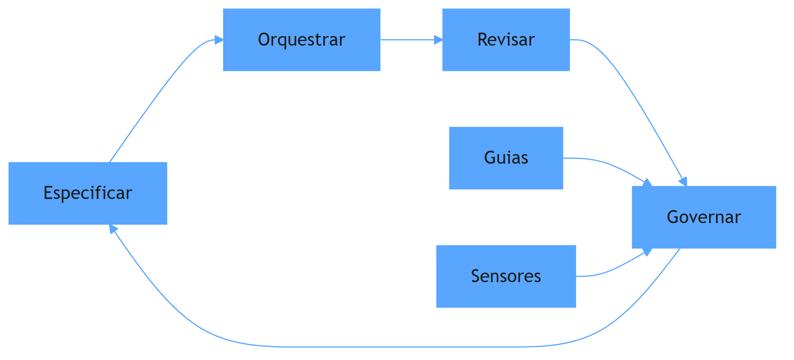

O diagrama mostra o ciclo contínuo: as quatro habilidades se alimentam em sequência, e a governança — sustentada pelos guias e sensores do harness — realimenta a especificação da próxima iteração. Não é um fluxo linear que termina no deploy: é um loop que melhora o sistema a cada volta, exatamente como o maquinista que torna a via mais segura a cada viagem. Esse ciclo é o coração operacional do AIDD, e é ele que o restante do livro vai detalhar — os capítulos 4 a 6 aprofundam a arquitetura (o desenho dos trilhos), os capítulos 7 a 9 o portfólio (as provas das viagens), e os capítulos 10 a 12 o mercado (as estações onde o valor é reconhecido).

## 4. Técnica

### O contrato de especificação executável

A primeira entrega técnica é o formato de especificação que o orquestrador usa para alimentar o agente: um contrato versionado, legível por humano e por máquina, que transforma intenção vaga em trabalho executável. O exemplo abaixo é um contrato real de feature, no espírito do que os manifestos de AIDD recomendam: escopo, restrições, critérios de aceitação e fronteiras de arquitetura explícitas [1].

```yaml
# spec/feature_triagem_agentica.yaml — contrato de especificação executável
feature: triagem_agentica
epico: fila_de_prioridades
dono: heverton_peres

escopo:
  - Classificar tickets recebidos em prioridade alta, media e baixa
  - Extrair entidades nomeadas (sistema, tipo de incidente) do texto livre
  - Gerar resumo estruturado de cada ticket para triagem humana

fora_de_escopo:
  - Resolver o incidente automaticamente (apenas triagem)
  - Integrar com sistemas externos fora da fila de origem

restricoes:
  - Camada de API nao pode acessar o banco diretamente
  - Toda resposta do LLM deve passar por validacao de schema
  - Nenhuma chamada de modelo no caminho sincrono da listagem

criterios_de_aceitacao:
  - Precisao de classificacao >= 85% no golden set de 200 tickets
  - Latencia p95 de classificacao <= 1.2s
  - 100% das respostas validas segundo o schema JSON

arquitetura_alvo:
  - api -> servico_de_triagem -> cliente_llm (com timeout e retry)
  - servico_de_triagem -> validacao_de_schema -> repositorio
```

O contrato cumpre a função de guia do harness: ele previne o erro antes que aconteça, informando ao agente o que está dentro e o que está fora do escopo, quais restrições arquiteturais são invioláveis e como o sucesso será medido [3]. A qualidade desse documento é o principal fator de qualidade do resultado — o mesmo princípio que os sistemas de avaliação formalizam quando dizem que especificar é o primeiro passo do ciclo de melhoria [4]. Um contrato vago produz um agente que inventa; um contrato preciso produz um agente que executa.

### O loop de revisão com gate de evidência

A segunda entrega é o loop de revisão que o orquestrador opera: um fluxo que avalia o resultado do agente contra os critérios do contrato antes de qualquer merge, com evidência — não opinião. O código abaixo implementa o gate de revisão em Python, usando o schema JSON como validador determinístico e deixando o julgamento semântico para o avaliador calibrado (o tema aprofundado no Capítulo 5 do Livro 10, que você conhece da série).

```python
"""Gate de revisao AIDD: evidencia deterministica antes do merge."""
import json
import re
from dataclasses import dataclass
from typing import Any


@dataclass
class Revisao:
    capa: str
    criterios: list

    def rodar(self, saida_agente: dict) -> dict:
        """Avalia a saida do agente contra os criterios de aceitacao."""
        resultados = {}
        for criterio in self.criterios:
            chave = criterio["campo"]
            if chave == "schema":
                resultados["schema"] = self._valida_schema(saida_agente, criterio["schema"])
            elif chave == "regex":
                resultados["regex"] = bool(re.search(criterio["padrao"], str(saida_agente)))
            elif chave == "presenca":
                resultados["presenca"] = saida_agente.get(criterio["campo_obrigatorio"]) is not None
        return resultados

    @staticmethod
    def _valida_schema(saida: dict, schema: dict) -> bool:
        """Validacao estrutural simples: campos obrigatorios e tipos."""
        for campo, tipo in schema.get("required", {}).items():
            valor = saida.get(campo)
            if valor is None or not isinstance(valor, tipo):
                return False
        return True

    def parecer(self, resultados: dict) -> str:
        aprovados = sum(1 for v in resultados.values() if v)
        if aprovados == len(resultados):
            return "APROVADO: evidencia completa"
        return f"REPROVADO: {len(resultados) - aprovados} criterio(s) sem evidencia"


SCHEMA_TRIAGEM = {
    "required": {
        "prioridade": str,
        "sistema": str,
        "resumo": str,
    }
}

if __name__ == "__main__":
    saida = {
        "prioridade": "alta",
        "sistema": "gateway-pagamentos",
        "resumo": "Timeout em 12% das requisicoes na janela de pico",
    }
    gate = Revisao("triagem_agentica", [{"campo": "schema", "schema": SCHEMA_TRIAGEM}])
    print(gate.parecer(gate.rodar(saida)))
```

O código compila e roda, e ilustra o princípio central da revisão no AIDD: o julgamento humano não é substituído — é posicionado no ponto certo. O gate determinístico filtra o que é verificável por regra; o humano concentra sua atenção no que exige julgamento de contexto. Essa divisão de trabalho é a materialização prática da governança que o harness engineering prescreve: sensores computacionais para o que é mecânico, sensores inferenciais — e o olhar humano — para o que é semântico [3]. A disciplina de avaliação reforça o mesmo desenho: evals determinísticos e model-based coexistem porque cada um cobre uma classe de falha [4].

## 5. Aplica

Você está no comitê de arquitetura da sua empresa, e a equipe de produtos pede um assistente agêntico que responda perguntas sobre o catálogo de serviços internos. A primeira proposta que chega é entusiasmada e vaga: "vamos dar acesso a um LLM com todas as nossas APIs e deixar ele responder". Seu instinto errado seria aceitar a proposta como ponto de partida e ajustar o prompt até funcionar — o clássico "prompt and pray" que o AIDD combate. O diagnóstico liga à teoria: sem especificação (quem pode perguntar o quê, com quais critérios de aceitação) e sem governança (quais ferramentas o agente pode chamar, com quais guardrails), o agente produz respostas plausíveis e incorretas — e cada correção de prompt trata o sintoma sem tocar a causa estrutural. A correção, na prática, é aplicar o ciclo das quatro habilidades: você escreve o contrato de especificação (escopo, fora de escopo, critérios de aceitação), desenha a orquestração (o agente consulta o catálogo via MCP, valida o schema antes de responder), define a revisão (gate determinístico + avaliador calibrado) e estabelece a governança (guia de uso, limites de ferramentas, trilha de auditoria). Em uma semana, a proposta vaga virou um sistema com contrato, evidência e governança — e a diferença não foi o modelo escolhido, foi a disciplina do orquestrador [1].

As armadilhas comuns, sintetizadas, são três. Primeira: confundir AIDD com "pedir para o agente fazer tudo" — sem o humano como responsável, o resultado é código sem autoria e sem arquitetura [1]. Segunda: pular a especificação executável e ir direto ao prompt — o prompt é a última milha de uma estrada que começa no contrato [4]. Terceira: revisar por impressão, sem gate de evidência — a revisão sem critérios mensuráveis degrada junto com o código que deveria proteger [3]. A métrica de sucesso é a estabilidade do ciclo: quantas vezes o gate reprovou antes do merge (quanto maior, melhor o harness) e quantas regressões escaparam para produção (quanto menor, melhor a revisão). O Capítulo 3 vai mostrar que a habilidade que sustenta todo esse ciclo — e que mais diferencia o engenheiro acima da média — é o desenho do harness como produto.

A maturidade do orquestrador tem camadas que a literatura recente ajuda a calibrar, e você vai reconhecê-las na sua trajetória. A primeira é a profundidade da especificação: os guias de mercado mostram que os sistemas que capturam atenção — e geram valor — são os que documentam decisões, trade-offs e autocrítica, não apenas o que foi construído [5]; a especificação executável deste capítulo é a mesma mentalidade aplicada ao contrato de feature. A segunda é a amplitude da orquestração: o design de harness para aplicações de longa duração documentado pela Anthropic mostra que orquestrar não é despachar tarefas — é arquitetar a sessão inteira do agente, com planejador, gerador e avaliador em papéis distintos e context resets nos pontos de degradação [2]. A terceira é a visão de sistemas distribuídos: a análise da Temporal demonstra que fluxos agênticos em produção exigem a disciplina de sistemas distribuídos — retries stateful, execução durável, recuperação de falhas — e o orquestrador que domina essa camada projeta agentes que sobrevivem a quedas de API e rate limits, enquanto o iniciante desenha agentes que morrem no primeiro timeout [6]. A quarta camada é o ferramental que sustenta a revisão: as plataformas de orquestração de workflows de 2026 — LangGraph, CrewAI e a convergência do ecossistema — são comparadas justamente pela observabilidade e pelo protocolo de agentes que oferecem, porque é isso que transforma revisão por impressão em revisão por evidência [7]. E a conexão com o portfólio fecha o raciocínio: as competências de orquestração que este capítulo descreve são exatamente as que os projetos de portfólio de elite demonstram — RAG avançado, agentes com estado, MCP e evals [8]. O mercado, por sua vez, já precifica essa maturidade: os cargos de AI Engineer crescem em ritmo expressivo, e o prêmio salarial da especialização em IA é documentado em múltiplas fontes de 2026 [9][10]. A síntese é clara: o orquestrador maduro não é o que conhece o framework mais novo — é o que domina o ciclo completo — especificar, orquestrar, revisar, governar — e o prova em público [11].

O ciclo do orquestrador ganha profundidade quando conectado às camadas do sistema e ao mercado. A hierarquia das disciplinas — prompt na mensagem, contexto na sessão, harness no sistema — explica por que a especificação executável e a governança são os pontos de alavancagem do AIDD: são as camadas mais duráveis, que sobrevivem a trocas de modelo [12]. A regra de ouro da arquitetura reforça a mesma direção: o contrato de especificação decide onde o caminho é conhecido (workflow) e onde é exploratório (agente), e essa decisão — não o prompt — define custo e confiabilidade [13]. O protocolo MCP entra como o padrão que desacopla o agente das ferramentas, tornando a especificação executável mais simples de operar: cada ferramenta sob contrato é uma dependência que pode evoluir sem reescrever o agente [14]. E a delimitação entre MCP, RAG e agentes — transporte, conhecimento e orquestração — organiza a arquitetura do contrato em camadas claras, evitando a confusão que degrada os projetos de AIDD [15]. No plano do mercado, a presença digital que documenta o ciclo — o repositório e o artigo — é o que transforma o orquestrador competente em profissional reconhecido: a presença 24/7 funciona como o portfólio vivo que o mercado encontra antes da entrevista [16]. E a rubrica de system design de 2026 completa o ciclo: as entrevistas avaliam exatamente as competências do orquestrador — custo, modos de falha e design sensível a IA — e o contrato de especificação é o material que sustenta a resposta [17][18].

O ciclo do orquestrador fecha no mercado e na entrevista: o playbook de system design de 2026 formaliza a prova que o AIDD exige [19], e a engenharia de harness documentada pela OpenAI mostra o destino da disciplina — a especificação executável virando rotina industrial [20].


### Aprofundamento: as quatro habilidades na bancada

O manifesto do AIDD não é um documento de intenções: ele descreve um método de trabalho com quatro habilidades operacionais que este capítulo transforma em prática diária [1]. A primeira habilidade — decompor a intenção em especificação executável — ganha corpo quando conectada ao harness de longa duração da Anthropic: a especificação não é um texto entregue ao agente, mas um contrato mantido vivo ao longo da sessão, revisto a cada iteração [2]. A segunda habilidade — escolher a topologia certa — é o coração da regra de ouro entre workflow e agente: o caminho conhecido recebe workflow determinístico, o exploratório recebe agente com supervisão, e a decisão é sempre do engenheiro, nunca do acaso [3]. A terceira habilidade — medir com evals — conecta a sessão ao ciclo de qualidade: a rubrica, o exemplar e o limiar transformam a opinião em dado, e a OpenAI documenta a evals como o motor do próximo capítulo da IA empresarial [4]. A quarta habilidade — narrar a evidência — é a que o mercado enxerga primeiro: o portfólio que documenta decisões reais, métricas e falhas supera o currículo que lista ferramentas, como mostram os guias de portfólio de 2026 [5]. No plano operacional, a execução durável entra como o suporte das quatro habilidades: a Temporal documenta que fluxos agênticos precisam de disciplina de sistemas distribuídos — checkpoint, retry e idempotência — para sobreviverem à produção real [6]. As plataformas de orquestração de 2026 competem exatamente por essa combinação: workflow determinístico, agente supervisionado e observabilidade em profundidade, e a comparação entre elas é o melhor curso prático de arquitetura de IA [7]. A documentação pública de um projeto completo — o repositório, o README, o histórico de decisões — é a prova de que as quatro habilidades foram exercidas, não decoradas [8]. O mercado de talento recompensa a combinação: as vagas de AI Engineer de 2026 pedem especificação, topologia, medição e comunicação em um único perfil, e o prêmio salarial desse perfil é documentado pelas análises de mercado [9]. O monitoramento mensal do mercado técnico mostra a mesma curva: os cargos que combinam as quatro habilidades lideram o crescimento de contratações [10]. O portfólio de evidências — os 3 a 5 projetos que sustentam a narrativa — é o instrumento que materializa as quatro habilidades para o recrutador [11]. A hierarquia das disciplinas organiza a prática: o prompt não carrega a especificação inteira, o contexto carrega o que a sessão precisa e o harness carrega a governança — e cada habilidade do AIDD opera no nível certo [12]. A arquitetura de agentes da Anthropic fornece o vocabulário dos padrões: o engenheiro que descreve o sistema em termos de prompt chaining, routing, evaluator-optimizer e orchestrator-workers fala a língua da indústria [13]. O protocolo MCP entra como a infraestrutura da terceira habilidade: o contrato de ferramentas desacopla o agente do ambiente, e a especificação executável ganha superfícies estáveis para operar [14]. A delimitação entre MCP, RAG e agentes — transporte, conhecimento e orquestração — evita a confusão arquitetural que degrada os projetos de AIDD na prática [15]. O guia de construção de portfólio do Zencoder mostra que a apresentação do projeto — o problema, a decisão, o resultado medido — é tão importante quanto o código, e isso é exatamente a quarta habilidade em ação [16]. A análise de mercado do Pragmatic Engineer documenta o contexto estrutural: a transição do engenheiro para o papel de orquestrador é a maior mudança de carreira da década, e as quatro habilidades são a ponte [17]. A entrevista de system design de 2026 avalia as quatro habilidades sob pressão: o candidato que explica a especificação, a topologia, a medição e a narrativa de forma integrada responde com profundidade real [18]. O playbook de system design do Shivali reforça: a preparação para entrevista de 2026 inclui estudar exatamente esses padrões e praticar a comunicação da decisão [19]. E o harness engineering da OpenAI fecha o ciclo: a disciplina que nasceu para tornar os agentes confiáveis é a mesma que torna o engenheiro acima da média — aquele que orquestra, mede e narra, em vez de apenas produzir [20].


A bancada das quatro habilidades termina com uma recomendação operacional: mantenha um registro público de cada ciclo completo — a especificação, a topologia escolhida, o eval aplicado e a narrativa do resultado [19]. Esse registro é o mesmo material que a entrevista de system design explora [18] e que o portfólio documenta [16]; ele também alimenta a leitura do mercado, mostrando onde a demanda cresce e o prêmio se concentra [9]. O manifesto do AIDD resume a ética do método: o desenvolvedor é o parceiro deliberado, e o registro é a prova da parceria [1]. Quem mantém o ciclo completo documentado não depende de sorte em entrevista — depende de evidência [20].
## 6. Conclusão

Você dominou o AIDD como disciplina: o manifesto define o desenvolvedor como parceiro deliberado e responsável pela IA, e as quatro habilidades do orquestrador — especificar, orquestrar, revisar, governar — formam o ciclo que transforma intenção em sistema confiável. Os três pontos principais são: o contrato de especificação executável é o principal fator de qualidade do resultado; o gate de revisão com evidência posiciona o julgamento humano no ponto certo; e a governança por guias e sensores é o que impede a degradação estrutural. O desafio desta semana: pegue a próxima feature do seu time e escreva o contrato de especificação antes de qualquer código — depois compare o resultado com o que aconteceria sem ele. No próximo capítulo, você mergulha na habilidade que sustenta o ciclo inteiro: o harness como assinatura profissional.

## 7. Referências Bibliográficas
[1] AI-DRIVEN DEVELOPMENT MANIFESTO. *Manifesto for AI-Driven Development*. 2026. Disponível em: https://www.ai-driven-development.org/. Acesso em: 06 ago. 2026.
[2] RAJASEKARAN, Prithvi (ANTHROPIC ENGINEERING). *Harness design for long-running agentic applications*. 2026. Disponível em: https://www.anthropic.com/engineering/harness-design-long-running-apps. Acesso em: 06 ago. 2026.
[3] BÖCKELER, Birgitta; FOWLER, Martin. *Harness engineering: the discipline of building effective software agents*. Thoughtworks/Martin Fowler, 2026. Disponível em: https://martinfowler.com/articles/harness-engineering.html. Acesso em: 06 ago. 2026.
[4] OPENAI. *How evals drive the next chapter in AI for businesses*. 2025. Disponível em: https://openai.com/index/evals-drive-next-chapter-of-ai/. Acesso em: 06 ago. 2026.
[5] JACKSON, Natalia (HYPERSKILL). *Building a developer portfolio in 2026: what actually gets attention*. 2026. Disponível em: https://hyperskill.org/blog/post/building-a-developer-portfolio-in-2026-what-actually-gets-attention. Acesso em: 06 ago. 2026.
[6] MARTIN, Kevin Paul (TEMPORAL). *From AI hype to durable reality: why agentic flows need distributed-systems discipline*. 2025. Disponível em: https://temporal.io/blog/from-ai-hype-to-durable-reality-why-agentic-flows-need-distributed-systems. Acesso em: 06 ago. 2026.
[7] DIGITAL APPLIED. *AI workflow orchestration platforms: 2026 comparison*. 2026. Disponível em: https://www.digitalapplied.com/blog/ai-workflow-orchestration-platforms-comparison. Acesso em: 06 ago. 2026.
[8] BOUCHARD, Louis-François. *Start AI engineering*. GitHub, 2026. Disponível em: https://github.com/louisfb01/start-ai-engineering. Acesso em: 06 ago. 2026.
[9] NEXUS IT GROUP. *AI engineering jobs: 2026 talent market analysis*. 2026. Disponível em: https://nexusitgroup.com/ai-engineering-jobs/. Acesso em: 06 ago. 2026.
[10] DAINES-HUTT, Daniel (ZERO TO MASTERY). *Tech job market trends monthly — February 2026*. 2026. Disponível em: https://zerotomastery.io/blog/tech-job-market-trends-monthly-february-2026/. Acesso em: 06 ago. 2026.
[11] DATAEXPERT.IO. *Ultimate guide to AI engineering portfolios*. 2026. Disponível em: https://www.dataexpert.io/blog/ultimate-guide-ai-engineering-portfolios. Acesso em: 06 ago. 2026.
[12] ATLAN RESEARCH. *Harness engineering vs prompt engineering*. 2026. Disponível em: https://atlan.com/know/harness-engineering-vs-prompt-engineering/. Acesso em: 06 ago. 2026.
[13] ANTHROPIC. *Building effective agents*. 2024. Disponível em: https://www.anthropic.com/engineering/building-effective-agents. Acesso em: 06 ago. 2026.
[14] CHOWDHURY, Supal; SAHA, Subrata; ABDEL SAMAD, Haitham (IBM DEVELOPER). *Model Context Protocol architecture patterns for multi-agent AI systems*. 2026. Disponível em: https://developer.ibm.com/articles/mcp-architecture-patterns-ai-systems/. Acesso em: 06 ago. 2026.
[15] INFRANODUS ENGINEERING. *MCP vs RAG vs AI agents: differences and how they work together*. 2026. Disponível em: https://infranodus.com/docs/mcp-vs-rag-vs-ai-agents. Acesso em: 06 ago. 2026.
[16] ZENCODER. *How to create a software engineer portfolio in 2026*. 2026. Disponível em: https://zencoder.ai/blog/how-to-create-software-engineer-portfolio. Acesso em: 06 ago. 2026.
[17] OROSZ, Gergely; SALMON, Jessica (THE PRAGMATIC ENGINEER). *The job market in 2026 (part 2)*. 2026. Disponível em: https://newsletter.pragmaticengineer.com/p/the-job-market-in-2026-part-2. Acesso em: 06 ago. 2026.
[18] EXPONENT. *System design interview prep & questions (2026 guide)*. 2026. Disponível em: https://www.tryexponent.com/blog/system-design-interview-guide. Acesso em: 06 ago. 2026.
[19] SHIVALI. *The 2026 system design prep playbook: what to study, practice, and expect*. 2026. Disponível em: https://medium.com/@shivali0087/the-2026-system-design-prep-playbook-what-to-study-practice-and-expect-b3068bd2e67e. Acesso em: 06 ago. 2026.
[20] LOPOPOLO, Ryan (OPENAI). *Harness engineering at OpenAI*. 2026. Disponível em: https://openai.com/index/harness-engineering/. Acesso em: 06 ago. 2026.

# Capítulo 3: O harness como assinatura: guias, sensores e a fábrica que se auto-mantém

## 1. Introdução

No Capítulo 2, você aprendeu as quatro habilidades do orquestrador e percebeu que a governança — a quarta habilidade — é a que sustenta todo o ciclo. Este capítulo mergulha nessa quarta habilidade e a transforma em competência profissional: o harness engineering. O harness é a camada que envolve o modelo — tudo o que não é o modelo — e é a assinatura do engenheiro acima da média: é o produto que ele constrói, mantém e melhora, e é o que o diferencia de quem apenas usa agentes. Você vai aprender a desenhar guias (controles feedforward), sensores (controles de feedback) e a operar a fábrica de código que se auto-mantém — com controle de entropia, legibilidade de agentes e revisão contínua. Ao final, você será capaz de construir o harness do seu repositório e de reconhecer por que essa competência é a mais valorizada na prática documentada da indústria.

## 2. Explica

O harness engineering tem uma definição que se tornou o vocabulário padrão da disciplina: agente é a soma do modelo com o harness — o modelo é o que pensa, o harness é tudo o que envolve e governa esse pensamento, das instruções ao ambiente de execução [1]. A formulação de Martin Fowler e da Thoughtworks divide o harness em dois tipos de controle, e você vai perceber que essa divisão organiza toda a prática. Os guias são os controles feedforward: agem antes do erro, prevenindo-o — arquivos de instrução como AGENTS.md, convenções de camadas, critérios de aceitação, restrições de arquitetura. Os sensores são os controles de feedback: agem depois do erro, detectando-o — linters, testes estruturais, validadores de schema, testes de mutação, e até o revisor humano posicionado no ponto certo. Cada controle pode ser computacional (executa regra determinística) ou inferencial (usa um modelo para julgar) [1]. A imagem que organiza tudo: guias são as placas e os guard-rails da estrada; sensores são as câmeras e os radares que flagram quem saiu da pista.

A mecânica do harness se apoia em dois princípios que a prática da OpenAI tornou públicos. O primeiro é a legibilidade de agentes: o repositório precisa ser legível para máquinas, não apenas para humanos — nomes claros, documentação de decisões, logs e métricas expostas, porque o agente que lê o código replica os padrões que encontra, bons ou ruins [2]. O segundo é o controle de entropia: em uma fábrica onde agentes geram a maior parte do código, a desordem cresce mais rápido do que a revisão humana consegue conter — por isso o harness precisa de rotinas de manutenção contínua, linters customizados e "garbage collection" de código gerado, para que a estrutura não degeneere [2]. A consolidação conceitual da Atlan Research acrescenta a hierarquia que situa o harness no mapa das disciplinas: prompt engineering atua na camada da mensagem, context engineering na camada da sessão, e harness engineering na camada do sistema — a mais profunda e a mais durável das três [3]. É por isso que o harness é a assinatura: prompt e contexto são consumíveis que mudam com cada modelo; o harness é o ativo que o engenheiro constrói e que sobrevive a trocas de modelo.

## 3. Ilustra

Pense na diferença entre o motorista que conhece as regras de trânsito e a engenheira que projeta o sistema viário de uma cidade. O motorista habilidoso dirige bem — freia no ponto certo, escolhe rotas rápidas, evita engarrafamentos. Mas quando a cidade cresce, o problema do motorista não é dirigir: é que as vias não comportam o tráfego, os cruzamentos ficam caóticos e cada carro novo piora a situação. A engenheira de trânsito, por outro lado, não dirige: projeta as faixas, coloca semáforos, define rotas preferenciais e implementa radares — e o resultado é que milhares de motoristas, inclusive medíocres, dirigem melhor porque o sistema ao redor deles é melhor. No AIDD, o engenheiro acima da média é a engenheira de trânsito: não compete para ser o melhor "motorista" de código — constrói o sistema viário no qual o agente, mesmo imperfeito, produz bons resultados. Como Engenheiro(a) de Software, o seu harness é a cidade: os guias são as placas e semáforos, os sensores são os radares e câmeras, e a manutenção contínua é o departamento de obras que evita que a cidade degeneire.

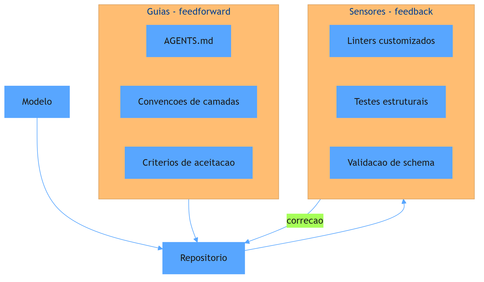

O diagrama mostra a anatomia completa: o modelo escreve no repositório, os guias orientam antes, os sensores detectam depois, e a correção realimenta o repositório — fechando o loop da fábrica que se auto-mantém. O elemento central não é o modelo, é o desenho do sistema ao redor dele — a assinatura do harness engineer. Esse loop de correção contínua é o que separa uma fábrica de código que se mantém saudável de uma que degrada a cada sprint.

## 4. Técnica

### O guia AGENTS.md: a constituição do repositório

A primeira entrega técnica é o artefato-guia por excelência: o AGENTS.md, o arquivo que instrui qualquer agente que trabalhe no repositório sobre a constituição do projeto. Ele é o guia feedforward mais importante do harness, porque é lido no início de toda sessão de agente. O exemplo abaixo é um AGENTS.md realista para um serviço de triagem agêntica, no espírito do que a prática documenta sobre legibilidade de agentes [2]:

```markdown
# AGENTS.md — Triagem Agêntica

## Arquitetura (inviolável)
- `api/` -> `servico_triagem/` -> `cliente_llm/`
- A camada de API NUNCA acessa o banco diretamente
- O serviço de triagem é a única camada que chama o LLM
- Toda saída do LLM passa por `validacao/schema.py` antes de persistir

## Convenções
- Nomes de arquivo: snake_case; classes PascalCase; constantes UPPER_CASE
- Testes vivem ao lado do código: `modulo.py` + `test_modulo.py`
- Toda função pública tem docstring de uma linha
- Nenhuma string de log com dados PII

## Fluxo de trabalho
1. Leia `spec/` antes de implementar qualquer feature
2. Rode `make lint` e `make test` antes de abrir PR
3. Se o teste estrutural `make arch` falhar, NÃO contorne — refatore
4. Nunca edite `validacao/schema.py` sem aprovação do dono do harness

## Fora de escopo (não faça)
- Não adicione dependências sem justificativa escrita
- Não crie camadas novas fora do fluxo acima
- Não armazene chaves de API em código
```

O AGENTS.md cumpre a função de guia: impede o erro antes que aconteça, informando ao agente as fronteiras invioláveis, as convenções e o fluxo de trabalho [1]. A qualidade desse documento determina a qualidade de milhares de interações futuras do agente — é o multiplicador do harness. Repare que ele declara explicitamente o que está fora de escopo: a proibição é parte essencial do guia, porque agentes tendem a explorar espaço em branco.

### O sensor estrutural: o linter de arquitetura

A segunda entrega é o sensor: um validador de arquitetura que detecta violações das camadas declaradas no AGENTS.md — o radar que flagra o carro fora da pista. O código abaixo implementa um linter estrutural simples em Python, que verifica se as regras de camada estão sendo respeitadas:

```python
"""Linter estrutural: detecta violacoes de camadas declaradas no AGENTS.md."""
import ast
import sys
from pathlib import Path


class Violacao:
    def __init__(self, arquivo: str, regra: str, detalhe: str):
        self.arquivo = arquivo
        self.regra = regra
        self.detalhe = detalhe

    def __repr__(self) -> str:
        return f"[{self.regra}] {self.arquivo}: {self.detalhe}"


def validar_import(no_import: ast.ImportFrom | ast.Import, caminho: Path, violacoes: list) -> None:
    """Regra: api/ nao pode importar repositorio/ nem cliente_llm/."""
    if not caminho.as_posix().startswith("api/"):
        return
    nomes = []
    if isinstance(no_import, ast.ImportFrom):
        nomes = [no_import.module or ""]
    else:
        nomes = [a.name for a in no_import.names]
    for nome in nomes:
        if nome.startswith("repositorio") or nome.startswith("cliente_llm"):
            violacoes.append(Violacao(
                caminho.as_posix(), "camada_api",
                f"import proibido: {nome}"
            ))


def auditar_arvore(raiz: Path) -> list:
    violacoes = []
    for py in sorted(raiz.rglob("*.py")):
        try:
            arvore = ast.parse(py.read_text(encoding="utf-8"))
        except SyntaxError:
            continue
        for no in ast.walk(arvore):
            if isinstance(no, (ast.Import, ast.ImportFrom)):
                validar_import(no, py, violacoes)
    return violacoes


if __name__ == "__main__":
    raiz = Path(sys.argv[2]) if len(sys.argv) > 1 else Path(".")
    violacoes = auditar_arvore(raiz)
    if violacoes:
        for v in violacoes:
            print(v)
        print(f"FALHOU: {len(violacoes)} violacao(oes) de camada")
        sys.exit(1)
    print("OK: arquitetura de camadas respeitada")
```

O linter é um sensor computacional: executa regra determinística e bloqueia o merge quando a arquitetura é violada [1]. Rode-o no CI junto com os testes — é o radar da fábrica. A combinação do AGENTS.md (guia) com o linter (sensor) é o par mínimo de um harness: um previne, o outro detecta, e juntos transformam a arquitetura de intenção em lei executável. A prática documentada mostra que é exatamente esse tipo de sensor que mantém a entropia sob controle em repositórios onde agentes geram a maior parte do código [2].

### A rotina de manutenção: garbage collection do código gerado

A terceira entrega é a rotina que fecha o ciclo da fábrica auto-mantida: a manutenção contínua do repositório — o "departamento de obras" da cidade. O código abaixo implementa um scanner de duplicação e lixo gerado, que identifica blocos suspeitos de serem cópia ou código morto:

```python
"""Garbage collection: detecta duplicacao e codigo morto gerado por agentes."""
import re
from collections import Counter
from pathlib import Path


def extrair_funcoes(conteudo: str) -> list:
    """Extrai corpos de funcoes simples (heuristica: linhas indentadas apos 'def')."""
    funcoes = []
    linhas = conteudo.splitlines()
    atual = []
    dentro = False
    for linha in linhas:
        if linha.strip().startswith("def ") or linha.strip().startswith("class "):
            if atual:
                funcoes.append("\n".join(atual))
            atual = [linha.strip()]
            dentro = True
        elif dentro:
            if linha.strip() and not linha.startswith("    "):
                funcoes.append("\n".join(atual))
                atual = []
                dentro = False
            elif linha.strip():
                atual.append(linha.strip())
    if atual:
        funcoes.append("\n".join(atual))
    return funcoes


def escanear_repo(raiz: Path) -> dict:
    ocorrencias = Counter()
    codigo_morto = []
    for py in sorted(raiz.rglob("*.py")):
        conteudo = py.read_text(encoding="utf-8")
        for funcao in extrair_funcoes(conteudo):
            if len(funcao) >= 6:  # ignora lambdas e funcoes minusculas
                ocorrencias[funcao] += 1
        if re.search(r"TODO|FIXME|pass\s*#\s*stub", conteudo):
            codigo_morto.append(str(py))
    return {
        "duplicadas": [f for f, n in ocorrencias.items() if n > 1],
        "stubs": codigo_morto,
    }


if __name__ == "__main__":
    raiz = Path(".")
    relatorio = escanear_repo(raiz)
    print(f"Funcoes duplicadas: {len(relatorio['duplicadas'])}")
    print(f"Arquivos com stubs/TODO: {len(relatorio['stubs'])}")
    for dup in relatorio["duplicadas"][:5]:
        print(f"  DUP: {dup.splitlines()[0]}")
```

O scanner fecha o ciclo: detecta a duplicação que o agente replica (o padrão que a legibilidade de agentes descreve) e sinaliza onde a entropia está se acumulando [2]. Rode-o periodicamente e trate o resultado como o painel da fábrica — se as duplicatas crescem, os guias precisam de reforço. A manutenção contínua é o que diferencia a fábrica auto-mantida do repositório que degenera: não é um evento, é uma rotina.

## 5. Aplica

Você acaba de assumir o harness de um repositório de 400 mil linhas que passou um ano sendo gerado por agentes. A equipe está frustrada: cada PR quebra algo, ninguém confia nas mudanças, e o tech lead está considerando proibir agentes. Seu instinto errado seria proibir também — voltar ao mundo pré-AIDD, onde o gargalo era a digitação humana e a velocidade caiu pela metade. O diagnóstico liga à teoria: o problema nunca foi o agente, foi a ausência de harness — sem guias, o agente replicou os padrões ruins existentes; sem sensores, as violações de arquitetura acumularam silenciosamente; sem manutenção, a entropia venceu [2]. A correção, na prática, é a sequência deste capítulo: você escreve o AGENTS.md (guia), instala o linter de camadas no CI (sensor), roda o scanner de duplicação (manutenção) e define o fluxo de correção. Em trinta dias, as violações estruturais caem, os PRs voltam a ser revisáveis e a equipe recupera a confiança — não porque o agente ficou mais inteligente, mas porque o sistema ao redor dele ficou melhor [1].

As armadilhas comuns, sintetizadas, são três. Primeira: confundir harness com documentação — o AGENTS.md que não é lido por nenhum sensor é um pôster, não um guia [1]. Segunda: construir sensores sem guias — o radar que flagra violações sem instruções que as previnam gera uma fábrica que só apaga incêndio. Terceira: tratar a manutenção como evento único — sem a rotina de garbage collection, a entropia retorna mais rápido do que o harness consegue conter [2]. A métrica de sucesso é dupla: a taxa de violações estruturais por sprint (deve cair) e o tempo médio de aprovação de PR (deve subir em qualidade, não em horas). O Capítulo 4 inicia a Parte II e sobe um nível: se o harness é a cidade, a arquitetura de sistemas é o zoneamento — o desenho dos trilhos que definem onde a cidade pode crescer.

A importância do harness como assinatura profissional tem respaldo crescente na literatura e no mercado, e você vai usá-lo como argumento de posicionamento. No plano conceitual, a hierarquia das três disciplinas — prompt na camada da mensagem, contexto na camada da sessão, harness na camada do sistema — é a moldura que explica por que o harness é o ativo mais durável: quando o modelo troca, o prompt perde eficácia e o contexto muda, mas o desenho de guias e sensores permanece [3]. No plano prático, o harness de longa duração documentado pela Anthropic mostra que o desenho do sistema — e não o prompt — é o que sustenta sessões autônomas prolongadas sem degradação: decisões de arquitetura como context resets, limites de iteração e supervisão posicionada são projeto de harness [4]. No plano da escala, o relato da OpenAI demonstra que o harness é o multiplicador industrial: o time que entrega milhões de linhas sem escrita manual não é um time de digitadores melhores — é um time que construiu o ambiente no qual os agentes operam com controle de entropia [2]. E a convergência com a engenharia de sistemas completa o quadro: a análise da Temporal mostra que os fluxos agênticos em produção exigem a disciplina de sistemas distribuídos — e o harness engineer é quem traduz essa disciplina para o nível do repositório e do agente [5]. No plano do mercado, a competência de harness é exatamente o que as vagas de 2026 buscam quando pedem engenheiros que saibam orquestrar e governar agentes — não digitadores, mas construtores de ambiente [6]. E o portfólio que demonstra essa competência — um repositório com guias, sensores e evidência de entropia controlada — é o que os recrutadores de 2026 usam para separar o engenheiro comum do acima da média [7][8]. A síntese é a tese do capítulo: o harness é a assinatura porque é o único artefato que você constrói, mantém e melhora — que sobrevive a cada troca de modelo — e que o mercado reconhece como prova de senioridade [1].

O harness como assinatura ganha o seu lugar no mapa completo quando conectado ao restante da carreira. A disciplina do AIDD formaliza o que o harness viabiliza: o desenvolvedor como parceiro deliberado da IA, responsável pelo que é entregue — e o harness é o instrumento dessa responsabilidade [9]. A arquitetura fornece o conteúdo do harness: a regra de ouro entre workflow e agente define quais trilhos o guia deve impor e quais flexibilidades o sensor deve tolerar [10]. O protocolo MCP padroniza as alavancas que o harness expõe — cada ferramenta sob contrato é uma superfície governada, e a governança do harness estende-se naturalmente ao protocolo [11]. A camada de conhecimento RAG entra como o mapa do harness: a qualidade da recuperação define o teto do que o agente pode acertar, e o harness regula o contexto que o RAG injeta [12]. As plataformas de orquestração de 2026 competem pela qualidade da observabilidade — o sensor do harness em escala de framework — e a comparação entre LangGraph, CrewAI e o ecossistema convergente mostra que o harness é o critério de seleção [13]. O portfólio demonstra o harness na prática: os guias de 2026 mostram que o repositório com guias, sensores e evidência de entropia controlada é o que separa o engenheiro comum do acima da média [14], e a escrita técnica documenta essa competência de forma durável [15]. O mercado recompensa a competência: os dados de vagas mostram que a orquestração e a governança de agentes estão entre as skills mais demandadas da linha em expansão [16][17]. E a entrevista de system design avalia exatamente o raciocínio do harness: resiliência, modos de falha e o desenho dos sensores do sistema [18][19][20].


### Aprofundamento: o harness como sistema de governo

A disciplina de harness engineering definida por Böckeler e Fowler parte de uma observação simples: o agente não é um produto isolado, mas um sistema que inclui o contexto, as ferramentas, a memória e o loop de execução [1]. A engenharia de harness da OpenAI mostra a escala industrial dessa visão: em sistemas com múltiplos agentes, o harness é o que torna a operação previsível, medível e segura [2]. A distinção entre harness engineering e prompt engineering é o ponto de virada conceitual: o prompt melhora a resposta, o harness melhora o sistema — e o engenheiro acima da média investe no segundo [3]. O harness de longa duração documentado pela Anthropic fornece o projeto de referência: planejador, gerador e avaliador em circuito, com checkpoints e supervisão nos pontos certos, sustentando sessões autônomas de horas e dias [4]. A execução durável é o alicerce físico desse projeto: a Temporal documenta que fluxos agênticos em produção exigem a mesma disciplina de sistemas distribuídos que os pipelines críticos — retry com backoff, idempotência, estado persistido [5]. No plano da carreira, o harness vira assinatura: os dados de mercado mostram que o profissional capaz de construir e governar o ambiente dos agentes ocupa a posição de maior valor agregado na linha de produção de software [6]. O portfólio de evidências documenta essa assinatura: o repositório que mostra o harness — o makefile, os testes de falha, o registro de decisões — é a prova concreta da competência [7]. A narrativa do projeto, seguindo os guias de portfólio de 2026, deve mostrar o harness em ação: o problema, o desenho do sistema, a evolução da entropia controlada [8]. O manifesto do AIDD dá a justificativa ética e profissional: o desenvolvedor é o parceiro deliberado da IA, responsável pelo que é entregue, e o harness é o instrumento dessa responsabilidade [9]. A arquitetura de agentes da Anthropic fornece o catálogo de padrões que o harness concretiza: prompt chaining, routing, evaluator-optimizer e orchestrator-workers são os módulos que o engenheiro compõe dentro do harness [10]. O protocolo MCP padroniza as alavancas: cada ferramenta sob contrato é uma superfície governada, e a governança do harness estende-se naturalmente ao protocolo [11]. A delimitação entre MCP, RAG e agentes organiza as camadas do harness: o transporte de ferramentas, o conhecimento recuperado e a orquestração do loop são camadas distintas com responsabilidades claras [12]. As plataformas de orquestração de 2026 competem pela qualidade do harness: a comparação entre LangGraph, CrewAI e o ecossistema convergente mostra que observabilidade, resiliência e controle são os critérios de seleção [13]. O portfólio que demonstra o harness na prática — o projeto com guias, sensores e evidência de entropia controlada — é o que separa o engenheiro comum do acima da média, segundo os guias de portfólio [14]. A documentação pública do processo — o repositório, o artigo, o post-mortem — multiplica a assinatura: a escrita técnica transforma a competência individual em ativo coletivo [15]. Os projetos de machine learning que compõem um portfólio forte incluem exatamente o tipo de construção que exercita o harness: sistemas completos com decisões de arquitetura documentadas [16]. O mercado de talento de IA recompensa a assinatura: as análises de vagas mostram que a orquestração e a governança de agentes estão entre as skills mais demandadas da linha em expansão [17]. A projeção dos próximos dois anos do engenheiro de software coloca a construção de harnesses como o trabalho central da década — quem domina a disciplina hoje lidera o mercado amanhã [18]. O monitoramento mensal do mercado técnico mostra a mesma direção: os cargos que exigem controle de agentes crescem consistentemente acima da média [19]. E a análise das carreiras mais bem pagas em IA confirma: os perfis de topo — LLM Engineer, AI Architect, MLOps — dominam exatamente as competências que o harness materializa [20].


O harness como sistema de governo fecha com o critério de mercado: o profissional que constrói o ambiente dos agentes — guias, sensores, memória e loop — é o que as vagas de AI Engineer de 2026 procuram [17], e o portfólio que documenta essa construção é o que o recrutador examina primeiro [7]. A disciplina definida por Böckeler e Fowler dá o vocabulário [1], a engenharia da OpenAI dá a escala industrial [2] e a evolução de carreira confirmada pelo mercado de longo prazo mostra que quem domina o harness hoje lidera a linha de produção de IA amanhã [18]. A assinatura não é um certificado: é o repositório que continua falando por você [14].
## 6. Conclusão

Você dominou o harness como assinatura profissional: agente é modelo mais harness; os guias previnem, os sensores detectam, e a manutenção contínua mantém a fábrica saudável. Os três pontos principais são: a legibilidade de agentes e o controle de entropia são os dois princípios que sustentam a fábrica auto-mantida; o AGENTS.md e o linter de camadas formam o par mínimo de guia e sensor; e o harness é o ativo durável — sobrevive a trocas de modelo, enquanto prompt e contexto são consumíveis. O desafio desta semana: escreva o AGENTS.md do seu repositório atual e instale um sensor estrutural no CI — mesmo um linter simples já muda a trajetória da entropia. No próximo capítulo, você sobe da fábrica para o zoneamento: a arquitetura de sistemas, começando pela decisão mais importante — workflows versus agentes.

## 7. Referências Bibliográficas
[1] BÖCKELER, Birgitta; FOWLER, Martin. *Harness engineering: the discipline of building effective software agents*. Thoughtworks/Martin Fowler, 2026. Disponível em: https://martinfowler.com/articles/harness-engineering.html. Acesso em: 06 ago. 2026.
[2] LOPOPOLO, Ryan (OPENAI). *Harness engineering at OpenAI*. 2026. Disponível em: https://openai.com/index/harness-engineering/. Acesso em: 06 ago. 2026.
[3] ATLAN RESEARCH. *Harness engineering vs prompt engineering*. 2026. Disponível em: https://atlan.com/know/harness-engineering-vs-prompt-engineering/. Acesso em: 06 ago. 2026.
[4] RAJASEKARAN, Prithvi (ANTHROPIC ENGINEERING). *Harness design for long-running agentic applications*. 2026. Disponível em: https://www.anthropic.com/engineering/harness-design-long-running-apps. Acesso em: 06 ago. 2026.
[5] MARTIN, Kevin Paul (TEMPORAL). *From AI hype to durable reality: why agentic flows need distributed-systems discipline*. 2025. Disponível em: https://temporal.io/blog/from-ai-hype-to-durable-reality-why-agentic-flows-need-distributed-systems. Acesso em: 06 ago. 2026.
[6] OROSZ, Gergely; SALMON, Jessica (THE PRAGMATIC ENGINEER). *The job market in 2026 (part 2)*. 2026. Disponível em: https://newsletter.pragmaticengineer.com/p/the-job-market-in-2026-part-2. Acesso em: 06 ago. 2026.
[7] DATAEXPERT.IO. *Ultimate guide to AI engineering portfolios*. 2026. Disponível em: https://www.dataexpert.io/blog/ultimate-guide-ai-engineering-portfolios. Acesso em: 06 ago. 2026.
[8] JACKSON, Natalia (HYPERSKILL). *Building a developer portfolio in 2026: what actually gets attention*. 2026. Disponível em: https://hyperskill.org/blog/post/building-a-developer-portfolio-in-2026-what-actually-gets-attention. Acesso em: 06 ago. 2026.
[9] AI-DRIVEN DEVELOPMENT MANIFESTO. *Manifesto for AI-Driven Development*. 2026. Disponível em: https://www.ai-driven-development.org/. Acesso em: 06 ago. 2026.
[10] ANTHROPIC. *Building effective agents*. 2024. Disponível em: https://www.anthropic.com/engineering/building-effective-agents. Acesso em: 06 ago. 2026.
[11] CHOWDHURY, Supal; SAHA, Subrata; ABDEL SAMAD, Haitham (IBM DEVELOPER). *Model Context Protocol architecture patterns for multi-agent AI systems*. 2026. Disponível em: https://developer.ibm.com/articles/mcp-architecture-patterns-ai-systems/. Acesso em: 06 ago. 2026.
[12] INFRANODUS ENGINEERING. *MCP vs RAG vs AI agents: differences and how they work together*. 2026. Disponível em: https://infranodus.com/docs/mcp-vs-rag-vs-ai-agents. Acesso em: 06 ago. 2026.
[13] DIGITAL APPLIED. *AI workflow orchestration platforms: 2026 comparison*. 2026. Disponível em: https://www.digitalapplied.com/blog/ai-workflow-orchestration-platforms-comparison. Acesso em: 06 ago. 2026.
[14] ZENCODER. *How to create a software engineer portfolio in 2026*. 2026. Disponível em: https://zencoder.ai/blog/how-to-create-software-engineer-portfolio. Acesso em: 06 ago. 2026.
[15] BOUCHARD, Louis-François. *Start AI engineering*. GitHub, 2026. Disponível em: https://github.com/louisfb01/start-ai-engineering. Acesso em: 06 ago. 2026.
[16] UDACITY. *20 machine learning projects that will boost your portfolio*. 2025/2026. Disponível em: https://www.udacity.com/blog/20-machine-learning-projects-that-will-boost-your-portfolio/. Acesso em: 06 ago. 2026.
[17] NEXUS IT GROUP. *AI engineering jobs: 2026 talent market analysis*. 2026. Disponível em: https://nexusitgroup.com/ai-engineering-jobs/. Acesso em: 06 ago. 2026.
[18] OSMANI, Addy. *The next two years of software engineering*. 2026. Disponível em: https://addyosmani.com/blog/next-two-years/. Acesso em: 06 ago. 2026.
[19] DAINES-HUTT, Daniel (ZERO TO MASTERY). *Tech job market trends monthly — February 2026*. 2026. Disponível em: https://zerotomastery.io/blog/tech-job-market-trends-monthly-february-2026/. Acesso em: 06 ago. 2026.
[20] SKILLIFY SOLUTIONS. *Highest-paying AI jobs in 2026*. 2026. Disponível em: https://skillifysolutions.com/blogs/artificial-intelligence/highest-paying-ai-jobs/. Acesso em: 06 ago. 2026.

# PARTE 2 — Arquitetura de Sistemas: o desenho que sobrevive aos modelos

# Capítulo 4: Workflows vs agentes: a regra de ouro da arquitetura de IA

## 1. Introdução

O Capítulo 3 fechou a Parte I com o harness como assinatura — a cidade ao redor do agente. Agora você inicia a Parte II, o zoneamento dos trilhos: a arquitetura de sistemas. E começa pela decisão arquitetural mais importante de qualquer sistema com IA: usar um workflow determinístico ou um agente autônomo. Esta é a pergunta que define custo, previsibilidade, auditabilidade e manutenibilidade de tudo o que vem depois — e a maioria dos times erra escolhendo por entusiasmo em vez de critério. Você vai aprender a regra de ouro que a prática consolidou, os padrões de workflow mais comuns, e o método para decidir com evidência — inclusive na direção oposta à intuição, quando o workflow vence o agente.

## 2. Explica

A distinção entre workflows e agentes tem uma definição formal que orienta toda a arquitetura de IA em produção: workflows são sistemas nos quais os LLMs e as ferramentas são orquestrados por caminhos de código predefinidos; agentes são sistemas nos quais os LLMs orquestram dinamicamente seu próprio processo de resolução de tarefas, decidindo as ferramentas a chamar e os passos a seguir [1]. A referência da Anthropic — o texto canônico da distinção — formula a regra de ouro com precisão: encontre a solução mais simples possível e só aumente a complexidade quando necessário; em particular, use workflows quando você precisar de previsibilidade e consistência em tarefas bem definidas, e use agentes quando precisar de flexibilidade e modelagem de decisão em escala [1].

Note como essa definição inverte a intuição popular. O senso comum de 2025 era "agente é o futuro, workflow é o passado" — mas a prática de produção demonstrou o contrário: a maioria das aplicações de IA em escala usa workflows, porque a previsibilidade e a auditabilidade valem mais do que a flexibilidade em processos de negócio críticos. O agente puro — o loop autônomo que decide tudo — é a exceção, reservada para tarefas exploratórias onde o caminho não pode ser antecipado. A consequência prática para o engenheiro acima da média: saber escolher workflow onde workflow resolve — e defender essa escolha contra a pressão de "colocar um agente em tudo" — é uma das competências mais valiosas do portfólio de arquitetura [2]. A mesma lógica aparece na análise comparativa das plataformas de orquestração de 2026: LangGraph, CrewAI e os ecossistemas convergentes competem justamente pela capacidade de expressar tanto workflows rígidos quanto agentes flexíveis, porque a indústria aprendeu que os dois são necessários — em partes diferentes do mesmo sistema [3].

## 3. Ilustra

Pense no sistema ferroviário sob o ponto de vista do maquinista acima da média. Existem dois tipos de trecho de linha. O primeiro é o trecho de linha fixa: a ligação diária entre duas cidades, com horários definidos, paradas conhecidas e regras claras — ninguém delega a um "maquinista inteligente" a decisão de parar ou não na estação intermediária: o sistema é desenhado para ser previsível, e qualquer desvio é tratado como incidente. O segundo é o trecho de exploração: a linha nova em território desconhecido, onde ninguém sabe ainda onde estão os obstáculos — aqui o maquinista autônomo tem valor, porque precisa decidir no momento, observando o terreno e adaptando a rota. O engenheiro de vias acima da média sabe que não existe "trem inteligente" universal: existe trecho de linha fixa (workflow) e trecho de exploração (agente), e a competência está em classificar o trecho antes de escolher a locomotiva. Como Engenheiro(a) de Software, seu erro mais caro é tratar uma linha fixa — pagamento, triagem, aprovação — como território de exploração, e pagar por autonomia onde a previsibilidade era o requisito.

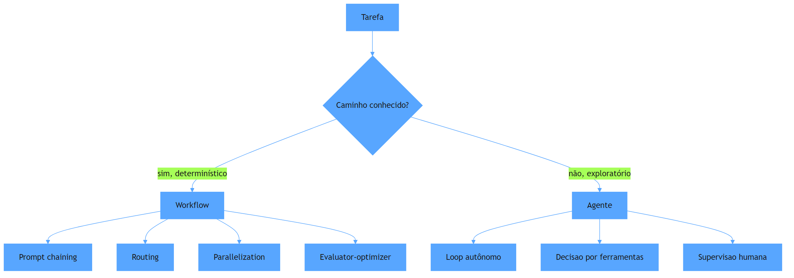

O diagrama condensa a regra de ouro em uma pergunta: o caminho é conhecido? Se sim, workflow — com seus padrões (chaining, routing, parallelization, evaluator-optimizer); se não, agente — com seu loop autônomo e supervisão nos pontos certos. A classificação é o ato de arquitetura: ela acontece antes de qualquer código, e define o custo e a confiabilidade de todo o sistema. Esse vocabulário — o caminho conhecido versus o território de exploração — vai reaparecer em cada capítulo da Parte II, porque é a lente que distingue onde a arquitetura impõe estrutura e onde ela habilita flexibilidade.

## 4. Técnica

### Padrões de workflow: o repertório do arquiteto

A primeira entrega técnica é o repertório: os padrões de workflow que a prática consolidou e que você vai aplicar na maioria dos casos [1]. O prompt chaining decompõe uma tarefa em passos sequenciais, cada um alimentando o seguinte — ideal para transformações multiestágio. O routing classifica a entrada e despacha para o caminho especializado — ideal para tarefas de tipos diferentes com um classificador barato na frente. A parallelization executa subtarefas independentes em paralelo, com agregação final — ideal para dividir um problema em partes que não dependem entre si. O evaluator-optimizer gera uma resposta, avalia contra critérios e gera novamente quando necessário — ideal para iteração de qualidade com uma única ferramenta. O código abaixo implementa o routing, o padrão mais comum de eficiência em produção, com um classificador determinístico na frente:

```python
"""Routing: classifica a entrada e despacha para o workflow especializado."""
from dataclasses import dataclass
from typing import Callable


@dataclass
class Rota:
    nome: str
    criterio: Callable[[str], bool]
    executor: Callable[[str], str]


class Roteador:
    """Despacha cada entrada para a primeira rota cujo criterio satisfaz."""

    def __init__(self, rotas: list):
        self.rotas = rotas
        self.fallback = lambda entrada: f"Sem rota especializada: {entrada}"

    def despachar(self, entrada: str) -> str:
        for rota in self.rotas:
            if rota.criterio(entrada):
                return rota.executor(entrada)
        return self.fallback(entrada)


def classificador_pagamento(texto: str) -> str:
    """Exemplo de roteamento: cada categoria chama um fluxo especifico."""
    rotas = [
        Rota("reembolso", lambda t: "reembolso" in t.lower(),
             lambda t: f"Fluxo de reembolso: {t}"),
        Rota("fraude", lambda t: "fraude" in t.lower(),
             lambda t: f"Fluxo de fraude: {t}"),
        Rota("duvida", lambda t: "?" in t,
             lambda t: f"Fluxo de duvida: {t}"),
    ]
    return Roteador(rotas).despachar(texto)


if __name__ == "__main__":
    for ticket in ["Quero reembolso do pagamento", "Isso parece fraude", "Como funciona?"]:
        print(classificador_pagamento(ticket))
```

O código compila e roda, e demonstra o princípio do routing: o custo da classificação é baixo (regras simples), e o ganho é alto (cada categoria segue um workflow dedicado, mais previsível e mais barato do que um agente genérico tentando resolver tudo). A regra de ouro aplicada: caminhos conhecidos, workflow [1]. Esse padrão é o cavalo de batalha da arquitetura de IA em produção — e é exatamente o tipo de decisão que as entrevistas de system design de 2026 avaliam, quando pedem consciência de custo por requisição e escolha de modelo menor para tarefas simples [2].

### O loop de agente com supervisão: quando a autonomia compensa

A segunda entrega é o outro lado da moeda: o loop de agente mínimo, com a disciplina que o torna seguro — iteração limitada, supervisão nos pontos de decisão e registro de cada passo. O código abaixo implementa um agente ReAct simplificado (raciocina, age, observa) com teto de iterações — a disciplina de harness aplicada ao agente [1][4]:

```python
"""Loop de agente ReAct com teto de iteracoes e registro de passos."""
import json
from dataclasses import dataclass, field


@dataclass
class Passo:
    raciocinio: str
    acao: str
    observacao: str


@dataclass
class AgenteMinimo:
    ferramentas: dict
    max_iteracoes: int = 5
    historico: list = field(default_factory=list)

    def raciocinar(self, tarefa: str) -> dict:
        """Simula o raciocinio do LLM: escolhe a ferramenta e o argumento."""
        # Em producao, isto e uma chamada real ao modelo.
        for nome in self.ferramentas:
            if nome in tarefa:
                return {"ferramenta": nome, "argumento": tarefa}
        return {"ferramenta": "responder", "argumento": tarefa}

    def executar(self, tarefa: str) -> str:
        """Roda o loop ReAct com teto de iteracoes e trilha de auditoria."""
        estado = tarefa
        for _ in range(self.max_iteracoes):
            decisao = self.raciocinar(estado)
            if decisao["ferramenta"] == "responder":
                self.historico.append(Passo("concluir", "responder", decisao["argumento"]))
                return decisao["argumento"]
            observacao = self.ferramentas[decisao["ferramenta"]](decisao["argumento"])
            self.historico.append(Passo(
                f"usar {decisao['ferramenta']}", decisao["argumento"], observacao
            ))
            estado = f"{estado} -> {observacao}"
        raise RuntimeError("Maximo de iteracoes excedido: agente preso em loop")


if __name__ == "__main__":
    ferramentas = {
        "buscar_catalogo": lambda q: f"catalogo[{q}]",
        "calcular_preco": lambda p: "preco_calculado",
    }
    agente = AgenteMinimo(ferramentas)
    resultado = agente.executar("buscar_catalogo notebook")
    print("Resultado:", resultado)
    print("Trilha:", json.dumps([p.__dict__ for p in agente.historico], ensure_ascii=False))
```

O loop tem as três características que tornam agentes seguros em produção: teto de iterações (impede loop infinito e custo incontrolável), trilha de auditoria (cada passo registrado, o sensor do harness aplicado ao agente) e supervisão posicionada (o humano revisa os pontos de decisão, não cada linha). O agente compensa exatamente onde o workflow não chega: tarefas exploratórias com caminho desconhecido [1]. A disciplina de sistemas distribuídos — da qual o Capítulo 5 trata — garante que esse loop sobreviva a falhas: retries, estado persistido e recuperação, porque em produção o modelo falha, a API cai e o rate limit chega [5].

## 5. Aplica

Você é o arquiteto de um sistema de suporte que está sendo "agentificado". O CEO leu um artigo sobre agentes e quer que todo o fluxo de suporte seja autônomo — "o agente resolve tudo". Você sabe que o fluxo de reembolso tem regras rígidas, conformidade e trilha de auditoria obrigatória; o fluxo de dúvidas técnicas é aberto e exploratório. Seu instinto errado seria obedecer e colocar um agente em tudo — o resultado previsível é reembolso com erro de regra (incidente de conformidade) e custo de tokens multiplicado por dez em tarefas que uma árvore de decisão resolvia. O diagnóstico liga à regra de ouro: caminho conhecido é workflow — a classificação (routing) na frente, os fluxos especializados atrás; só o trecho exploratório (dúvida técnica complexa) recebe o agente. A correção, na prática, é a arquitetura híbrida: roteador na entrada, workflows para os fluxos de conformidade, agente com teto de iterações e supervisão para o trecho aberto — e uma apresentação ao CEO com o custo por requisição de cada opção, porque a consciência de custo é o argumento que o orçamento entende [2]. A empresa ganha a autonomia no lugar certo e a previsibilidade onde ela é lei — e você ganha a reputação de arquiteto que decide por critério, não por moda [1].

As armadilhas comuns, sintetizadas, são três. Primeira: "agentificar" processos com caminho conhecido — o custo e o risco de conformidade disparam sem ganho de qualidade [1]. Segunda: usar workflow onde a tarefa é genuinamente exploratória — o workflow engessa o agente e ele entrega resultados piores que a autonomia supervisionada. Terceira: escolher agente por status — "meu sistema tem agentes" é uma métrica de vaidade; a métrica real é previsibilidade por custo, e o repertório de workflows é o que mantém essa razão saudável [2]. A métrica de sucesso da arquitetura é dupla: o custo por requisição resolvida (deve cair com o routing) e a taxa de desvios de processo em fluxos críticos (deve permanecer zero). O Capítulo 5 aprofunda o requisito que todo esse desenho exige em produção: a execução durável — o estado que sobrevive a falhas.

A escolha entre workflow e agente tem camadas de profundidade que a literatura recente ajuda a calibrar, e cada uma delas fortalece o seu critério de decisão. A primeira é a camada do protocolo: a análise da IBM sobre padrões de arquitetura MCP mostra que a decisão workflow-versus-agente não termina na topologia — ela continua na forma como os componentes se conectam, e o MCP oferece o padrão de desacoplamento que permite trocar um workflow rígido por um agente, ou vice-versa, sem reescrever as integrações [6]. A segunda é a camada do conhecimento: a distinção entre MCP (transporte), RAG (conhecimento) e agentes (orquestração) — documentada pela InfraNodus — reforça que o workflow alimenta-se do conhecimento recuperado, e a qualidade da recuperação define o teto de qualidade do workflow, independentemente da topologia [7]. A terceira é a camada de orquestração: a análise comparativa de 2026 mostra que as plataformas evoluíram para expressar ambos os modos com observabilidade nativa — a decisão workflow-versus-agente hoje é configurável, não binária, e o arquiteto que entende os trade-offs desenha sistemas híbridos com o melhor dos dois [3]. A quarta é a camada de durabilidade: a disciplina de sistemas distribuídos documentada pela Temporal aplica-se aos dois modos — workflows e agentes precisam de retries stateful e recuperação de falhas, e a diferença prática entre eles diminui quando ambos são tratados como fluxos duráveis [5]. A quinta é a camada de mercado: as entrevistas de system design de 2026 avaliam exatamente essa maturidade — o candidato que explica quando usar workflow, quando usar agente e quanto cada um custa por requisição é o que a rubrica classifica como sênior [2]; e a mesma consciência de custo aparece no playbook de preparação de 2026, que lista o design sensível a IA e a análise de custos como as duas competências mais cobradas [8]. A síntese é direta: a regra de ouro não é um slogan — é o primeiro teste de arquitetura que o mercado aplica, e o portfólio que demonstra uma arquitetura híbrida bem desenhada é a prova que abre as portas das entrevistas [9].

A regra de ouro entre workflow e agente ganha profundidade quando conectada ao harness e ao mercado. A hierarquia das disciplinas situa a decisão no lugar certo: o prompt decide na mensagem, o contexto na sessão e o harness no sistema — e a escolha entre workflow e agente é uma decisão de sistema, não de prompt [10]. O harness de longa duração documentado pela Anthropic mostra que a decisão se sustenta na arquitetura: workflows e agentes convivem em sessões prolongadas, com planejador, gerador e avaliador em papéis distintos e supervisão nos pontos certos [11]. O AIDD formaliza o papel do arquiteto nessa decisão: o desenvolvedor é o parceiro deliberado que escolhe a topologia e responde pelo resultado [12]. O portfólio documenta a decisão na prática: os projetos que demonstram a arquitetura híbrida — workflow no caminho conhecido, agente no exploratório — são os que capturam a atenção do mercado [13], e o histórico iterativo prova que a decisão foi construída, não decorada [14]. A presença digital multiplica a evidência: o artigo que narra a decisão e o trade-off transforma o projeto em autoridade [15], e o stack de IA moderno — RAG, MCP, agentes e harnesses — é o vocabulário que o mercado de 2026 reconhece [16]. Os dados de mercado confirmam a direção: as vagas de AI Engineer pedem exatamente a capacidade de escolher a arquitetura com consciência de custo [17][18]. E o projeto de ponta a ponta — da arquitetura à operação — é a prova que a entrevista explora, com as métricas que a rubrica de 2026 avalia [19].

A regra de ouro ganha a sua forma final na disciplina emergente: o harness engineering documentado pela OpenAI é onde a decisão entre workflow e agente deixa de ser artesanal e vira rotina industrial — a arquitetura, não o prompt, é o contrato [20].


### Aprofundamento: a decisão de topologia em detalhe

A regra de ouro da arquitetura de IA — use o caminho mais simples que resolve o problema — ganha precisão quando decomposta nas perguntas que o engenheiro deve responder antes de escolher entre workflow e agente [1]. A primeira pergunta é a da previsibilidade: o caminho é conhecido e as saídas são estruturadas? Então o workflow determinístico — com passos explícitos e validação em cada nó — é a escolha certa, e a Anthropic documenta os padrões de orquestração com exemplos de produção [2]. A segunda pergunta é a da escala de ferramentas: as plataformas de orquestração de 2026 oferecem graus de autonomia que vão do workflow rígido ao agente totalmente autônomo, e a escolha errada é a causa mais comum de custo e latência fora de controle [3]. A terceira pergunta é a da governança: a disciplina de harness engineering define que a decisão de topologia não é um detalhe de implementação, mas uma decisão de sistema que o harness deve impor [4]. A execução durável atravessa as duas topologias: a Temporal mostra que workflows e agentes precisam igualmente de retry, checkpoint e idempotência, e a diferença está apenas no grau de autonomia do loop [5]. O protocolo MCP entra como o facilitador de ambas: o contrato de ferramentas permite trocar a topologia sem reescrever as integrações [6]. A delimitação entre MCP, RAG e agentes organiza a conversa: o transporte, o conhecimento e a orquestração são camadas distintas, e confundi-las é o erro de arquitetura mais comum em projetos de IA [7]. A preparação para entrevistas de system design em 2026 inclui praticar exatamente essa decisão: os playbooks mais recentes pedem que o candidato explique quando usar workflow e quando usar agente, com justificativa de custo e latência [8]. O portfólio documenta a decisão na prática: os guias de construção de portfólio mostram que o projeto que narra a escolha da topologia — e as alternativas descartadas — é o que captura a atenção do recrutador [9]. A hierarquia das disciplinas situa a decisão no lugar certo: o prompt decide na mensagem, o contexto na sessão e o harness no sistema — e a escolha entre workflow e agente é uma decisão de sistema, não de prompt [10]. O harness de longa duração da Anthropic mostra que as duas topologias convivem: em sessões prolongadas, o planejador escolhe a rota, o gerador executa o passo e o avaliador decide se o resultado passa — um híbrido natural [11]. O manifesto do AIDD formaliza o papel do arquiteto nessa decisão: o desenvolvedor é o parceiro deliberado que escolhe a topologia e responde pelo resultado [12]. O portfólio de evidências materializa a decisão: os 3 a 5 projetos que sustentam a narrativa devem incluir pelo menos um sistema híbrido, com a decisão documentada [13]. O guia do Zencoder mostra como apresentar essa decisão: problema, trade-offs, alternativa escolhida e resultado medido — a narrativa que prova senioridade [14]. O repositório público — o GitHub — fornece o histórico iterativo: o commit log mostra a decisão sendo construída, não decorada, e isso é evidência que nenhuma entrevista consegue falsificar [15]. Os projetos de machine learning de ponta a ponta listados pela Udacity incluem exatamente o tipo de arquitetura híbrida que exercita a regra de ouro: pipeline determinístico com agente de decisão no ponto de maior incerteza [16]. O mercado de trabalho de 2026 confirma a direção: as vagas de AI Engineer pedem explicitamente a capacidade de escolher a arquitetura com consciência de custo, e a análise do Pragmatic Engineer documenta a mudança de perfil [17]. As análises de mercado de talento de IA mostram que a habilidade de arquitetura — não a de digitação — é o filtro das vagas senior [18]. A projeção de longo prazo do desenvolvimento de software coloca a decisão de topologia como a competência central do engenheiro da década [19]. E o harness engineering da OpenAI encerra a discussão: a disciplina industrial da orquestração de agentes transforma a regra de ouro de princípio em rotina — e o engenheiro que a domina é o que o mercado procura [20].


A decisão de topologia encerra com um exercício recomendado: reconstrua o sistema de um produto real — um helpdesk, uma análise de documentos, um orquestrador de campanhas — e documente onde o caminho é conhecido e onde é exploratório [2]. Esse exercício treina a rubrica que a entrevista de 2026 aplica [8], alimenta o portfólio com uma decisão real [9] e mostra ao recrutador a diferença entre quem decorou padrões e quem desenha com justificativa [14]. A regra de ouro não é uma frase: é um método de trabalho que o engenheiro acima da média exercita a cada novo sistema [1].
## 6. Conclusão

Você dominou a decisão arquitetural mais importante de sistemas com IA: a regra de ouro que separa workflows de agentes pelo critério do caminho conhecido. Os três pontos principais são: a maioria das aplicações em escala usa workflows, porque previsibilidade e auditabilidade valem mais que flexibilidade em processos críticos; o repertório de padrões de workflow — chaining, routing, parallelization, evaluator-optimizer — é o cavalo de batalha do arquiteto; e o agente puro é a exceção disciplinada, com teto de iterações, trilha e supervisão. O desafio desta semana: classifique os fluxos de um sistema que você conhece — quantos são workflow e quantos são genuinamente agente? No próximo capítulo, você aprende o que sustenta o agente em produção: a execução durável e a resiliência do estado.

## 7. Referências Bibliográficas
[1] ANTHROPIC. *Building effective agents*. 2024. Disponível em: https://www.anthropic.com/engineering/building-effective-agents. Acesso em: 06 ago. 2026.
[2] EXPONENT. *System design interview prep & questions (2026 guide)*. 2026. Disponível em: https://www.tryexponent.com/blog/system-design-interview-guide. Acesso em: 06 ago. 2026.
[3] DIGITAL APPLIED. *AI workflow orchestration platforms: 2026 comparison*. 2026. Disponível em: https://www.digitalapplied.com/blog/ai-workflow-orchestration-platforms-comparison. Acesso em: 06 ago. 2026.
[4] BÖCKELER, Birgitta; FOWLER, Martin. *Harness engineering: the discipline of building effective software agents*. Thoughtworks/Martin Fowler, 2026. Disponível em: https://martinfowler.com/articles/harness-engineering.html. Acesso em: 06 ago. 2026.
[5] MARTIN, Kevin Paul (TEMPORAL). *From AI hype to durable reality: why agentic flows need distributed-systems discipline*. 2025. Disponível em: https://temporal.io/blog/from-ai-hype-to-durable-reality-why-agentic-flows-need-distributed-systems. Acesso em: 06 ago. 2026.
[6] CHOWDHURY, Supal; SAHA, Subrata; ABDEL SAMAD, Haitham (IBM DEVELOPER). *Model Context Protocol architecture patterns for multi-agent AI systems*. 2026. Disponível em: https://developer.ibm.com/articles/mcp-architecture-patterns-ai-systems/. Acesso em: 06 ago. 2026.
[7] INFRANODUS ENGINEERING. *MCP vs RAG vs AI agents: differences and how they work together*. 2026. Disponível em: https://infranodus.com/docs/mcp-vs-rag-vs-ai-agents. Acesso em: 06 ago. 2026.
[8] SHIVALI. *The 2026 system design prep playbook: what to study, practice, and expect*. 2026. Disponível em: https://medium.com/@shivali0087/the-2026-system-design-prep-playbook-what-to-study-practice-and-expect-b3068bd2e67e. Acesso em: 06 ago. 2026.
[9] DATAEXPERT.IO. *Ultimate guide to AI engineering portfolios*. 2026. Disponível em: https://www.dataexpert.io/blog/ultimate-guide-ai-engineering-portfolios. Acesso em: 06 ago. 2026.
[10] ATLAN RESEARCH. *Harness engineering vs prompt engineering*. 2026. Disponível em: https://atlan.com/know/harness-engineering-vs-prompt-engineering/. Acesso em: 06 ago. 2026.
[11] RAJASEKARAN, Prithvi (ANTHROPIC ENGINEERING). *Harness design for long-running agentic applications*. 2026. Disponível em: https://www.anthropic.com/engineering/harness-design-long-running-apps. Acesso em: 06 ago. 2026.
[12] AI-DRIVEN DEVELOPMENT MANIFESTO. *Manifesto for AI-Driven Development*. 2026. Disponível em: https://www.ai-driven-development.org/. Acesso em: 06 ago. 2026.
[13] JACKSON, Natalia (HYPERSKILL). *Building a developer portfolio in 2026: what actually gets attention*. 2026. Disponível em: https://hyperskill.org/blog/post/building-a-developer-portfolio-in-2026-what-actually-gets-attention. Acesso em: 06 ago. 2026.
[14] ZENCODER. *How to create a software engineer portfolio in 2026*. 2026. Disponível em: https://zencoder.ai/blog/how-to-create-software-engineer-portfolio. Acesso em: 06 ago. 2026.
[15] BOUCHARD, Louis-François. *Start AI engineering*. GitHub, 2026. Disponível em: https://github.com/louisfb01/start-ai-engineering. Acesso em: 06 ago. 2026.
[16] UDACITY. *20 machine learning projects that will boost your portfolio*. 2025/2026. Disponível em: https://www.udacity.com/blog/20-machine-learning-projects-that-will-boost-your-portfolio/. Acesso em: 06 ago. 2026.
[17] OROSZ, Gergely; SALMON, Jessica (THE PRAGMATIC ENGINEER). *The job market in 2026 (part 2)*. 2026. Disponível em: https://newsletter.pragmaticengineer.com/p/the-job-market-in-2026-part-2. Acesso em: 06 ago. 2026.
[18] NEXUS IT GROUP. *AI engineering jobs: 2026 talent market analysis*. 2026. Disponível em: https://nexusitgroup.com/ai-engineering-jobs/. Acesso em: 06 ago. 2026.
[19] OSMANI, Addy. *The next two years of software engineering*. 2026. Disponível em: https://addyosmani.com/blog/next-two-years/. Acesso em: 06 ago. 2026.
[20] LOPOPOLO, Ryan (OPENAI). *Harness engineering at OpenAI*. 2026. Disponível em: https://openai.com/index/harness-engineering/. Acesso em: 06 ago. 2026.

# Capítulo 5: Execução durável e resiliência: o estado que sobrevive a falhas

## 1. Introdução

No Capítulo 4, você dominou a regra de ouro entre workflows e agentes e desenhou o primeiro sistema híbrido. Agora você enfrenta a realidade que todo sistema de IA encontra em produção: a falha. A API do modelo cai, o rate limit chega, o processo morre no meio de uma tarefa longa — e, sem a disciplina certa, o estado do agente se perde junto. Este capítulo ensina a disciplina de sistemas distribuídos aplicada a agentes: execução durável, retries stateful, event-sourcing de estado e o desenho de sistemas que se recuperam de falhas — do modelo, da infraestrutura e do próprio código. Você vai aprender por que o "try/catch com retry ingênuo" não basta, e como a durabilidade do estado transforma agentes frágeis em sistemas confiáveis.

## 2. Explica

A execução durável tem uma definição precisa, e você vai perceber que ela nasce de uma observação sobre a natureza das falhas em sistemas de IA. Definição: execução durável é a propriedade de um fluxo de trabalho cujo estado é persistido em um armazenamento externo a cada passo significativo, de modo que, se o processo morrer — por falha de infraestrutura, timeout de API ou crash —, ele pode ser retomado do último ponto persistido, não do zero [1]. A análise da Temporal, referência canônica da disciplina, formula a tese com clareza: fluxos agênticos em produção precisam da disciplina de sistemas distribuídos — retries com backoff exponencial, checkpoints, event-sourcing de estado — porque as chamadas a LLMs e APIs externas são inerentemente propensas a falhas temporárias [1].

Note a diferença entre retry ingênuo e execução durável, porque ela define o nível de maturidade do sistema. O retry ingênuo — um `try/catch` que tenta de novo a chamada — trata a falha como evento isolado: se o processo inteiro morre, a memória do que já foi feito morre junto, e o agente reinicia a tarefa do zero, consumindo tokens e tempo repetidos. A execução durável trata a falha como estado: cada passo persistido é um marco, e a retomada começa do marco — a tarefa longa de trinta passos que falhou no passo vinte retoma no passo vinte, não no passo um. Essa distinção tem um nome técnico: idempotência de progresso — a capacidade de refazer um passo sem efeitos colaterais duplicados, porque o efeito é derivado do estado persistido, não da memória do processo [1]. A consequência prática para o engenheiro acima da média: sistemas com execução durável sobrevivem a falhas que derrubam sistemas com retry ingênuo, e essa diferença é exatamente o tipo de resiliência que as rubricas de system design de 2026 avaliam quando perguntam "o que acontece quando a API do modelo cai?" [2].

## 3. Ilustra

Pense no maquinista que atravessa uma linha de montanha com estações de registro a cada vinte quilômetros. Na era do telégrafo, se o trem descarrilasse entre duas estações, a equipe de resgate sabia exatamente onde procurar — porque a última estação registrada dizia onde o trem estava. Agora imagine a alternativa: um trem sem registro algum, que, ao descarrilar, obriga o resgate a procurar a linha inteira desde a origem. A diferença não é a velocidade do trem — é a presença dos marcos. No mundo dos agentes, os marcos são os checkpoints: cada passo significativo do fluxo persiste o estado em um registro durável, e é esse registro que permite à operação retomar do último ponto conhecido em vez de recomeçar a viagem. Como Engenheiro(a) de Software, o erro mais caro é construir o trem sem os marcos — um agente poderoso que, diante da primeira falha de produção, perde tudo e recomeça do zero, queimando tempo, tokens e confiança da operação.

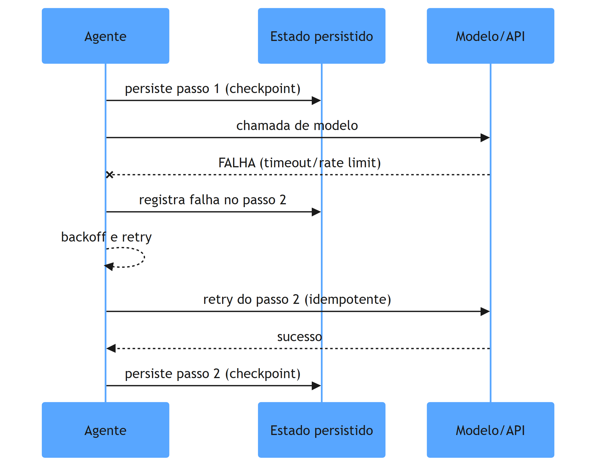

O diagrama mostra o ciclo da execução durável: cada passo persiste um checkpoint antes da chamada frágil; quando a chamada falha, o estado já está seguro; o retry refaz apenas o passo pendente; e o sucesso é persistido como novo marco. O ponto central não é o modelo — é o registro à esquerda, o estado que sobrevive. Essa sequência — persiste, falha, retoma do marco — é a tradução direta da disciplina de sistemas distribuídos para o mundo dos agentes [1].

## 4. Técnica

### O núcleo durável: persistindo o estado do fluxo

A primeira entrega técnica é o padrão central: um orquestrador que persiste o estado de cada passo do fluxo e retoma do último checkpoint após falha. O código abaixo implementa esse núcleo em Python — sem dependência de framework, para que você veja a mecânica em estado puro (a versão industrial usa Temporal ou equivalente, como o Capítulo 4 indicou):

```python
"""Nucleo de execucao durável: checkpoint por passo e retomada pos-falha."""
import json
import time
from dataclasses import dataclass, field
from pathlib import Path
from typing import Callable


class FalhaTransitoria(Exception):
    """Representa falha recuperável: timeout, rate limit, 5xx do modelo."""


@dataclass
class FluxoDuravel:
    nome: str
    passos: dict  # nome -> callable
    arquivo_estado: str = "estado_fluxo.json"
    max_retries: int = 3
    historico: list = field(default_factory=list)

    def _carregar(self) -> dict:
        caminho = Path(self.arquivo_estado)
        if caminho.exists():
            return json.loads(caminho.read_text(encoding="utf-8"))
        return {"concluidos": [], "pendente": None}

    def _salvar(self, estado: dict) -> None:
        Path(self.arquivo_estado).write_text(
            json.dumps(estado, ensure_ascii=False, indent=2), encoding="utf-8"
        )

    def _executar_com_retry(self, nome: str, estado: dict) -> object:
        """Executa o passo com retry exponencial; persiste o checkpoint."""
        tentativas = 0
        while True:
            try:
                resultado = self.passos[nome](estado)
                estado["concluidos"].append(nome)
                estado["pendente"] = None
                self._salvar(estado)
                return resultado
            except FalhaTransitoria:
                tentativas += 1
                if tentativas >= self.max_retries:
                    raise
                time.sleep(2 ** tentativas)  # backoff exponencial

    def rodar(self, ordem: list) -> dict:
        estado = self._carregar()
        for nome in ordem:
            if nome in estado["concluidos"]:
                continue  # passo ja concluido em execucao anterior
            estado["pendente"] = nome
            self._salvar(estado)
            self._executar_com_retry(nome, estado)
            self.historico.append(nome)
        return estado


def passo_classificar(estado: dict) -> dict:
    """Exemplo de passo: chama o modelo e retorna a classificacao."""
    # Em producao: chamada real ao LLM com timeout.
    if estado.get("forcar_falha"):
        raise FalhaTransitoria("rate limit do modelo")
    return {"classificacao": "alta", "sistema": "gateway"}


def passo_persistir(estado: dict) -> dict:
    return {"registro_id": "REG-2026-0001"}


if __name__ == "__main__":
    fluxo = FluxoDuravel(
        nome="triagem",
        passos={"classificar": passo_classificar, "persistir": passo_persistir},
    )
    resultado = fluxo.rodar(["classificar", "persistir"])
    print("Fluxo concluido:", resultado["concluidos"])
```

O código compila e roda, e demonstra as três propriedades da execução durável: o estado é persistido antes e depois de cada passo (checkpoints); a retomada ignora passos já concluídos (idempotência de progresso); e a falha transiente dispara retry com backoff exponencial. Se o processo morrer no meio, a próxima execução carrega o arquivo de estado e continua do marco — a propriedade que transforma um agente frágil em um fluxo confiável [1]. Esse padrão é o coração da disciplina: a durabilidade não é um detalhe de implementação, é a decisão de arquitetura que define se o sistema sobrevive a produção.

### Degradação graciosa: o que acontece quando a API do modelo cai

A segunda entrega técnica é o desenho da degradação: o plano B que o sistema executa quando o plano A — o modelo — está indisponível. O código abaixo implementa a estratégia de fallback em camadas: modelo principal, modelo de reserva, heurística determinística — e, no pior caso, a fila para processamento posterior:

```python
"""Degradacao graciosa: cascata de fallback quando o modelo esta indisponivel."""
from dataclasses import dataclass
from typing import Callable


@dataclass
class EstrategiaFallback:
    camadas: list  # callables em ordem de prioridade

    def executar(self, entrada: str) -> tuple:
        ultimo_erro = None
        for camada in self.camadas:
            try:
                return camada(entrada), "camada_ok"
            except Exception as erro:  # noqa: BLE001
                ultimo_erro = erro
        raise RuntimeError(f"Todas as camadas falharam: {ultimo_erro}")


def modelo_principal(texto: str) -> str:
    raise TimeoutError("API principal fora do ar")


def modelo_reserva(texto: str) -> str:
    return f"[reserva] triagem de {texto}"


def heuristica_deterministica(texto: str) -> str:
    if "urgente" in texto.lower() or "!" in texto:
        return "ALTA (heuristica)"
    return "MEDIA (heuristica)"


if __name__ == "__main__":
    estrategia = EstrategiaFallback([
        modelo_principal,
        modelo_reserva,
        heuristica_deterministica,
    ])
    resultado, status = estrategia.executar("Erro urgente no gateway!")
    print(f"Resultado: {resultado} | status: {status}")
```

O código compila e roda: com a API principal fora do ar, a cascata desce para o modelo de reserva e, na sequência, para a heurística determinística — o sistema degrada com graça, entregando algo útil mesmo sem o modelo. A degradação graciosa é o complemento da execução durável: uma garante que o estado não se perde, a outra garante que o usuário receba uma resposta mesmo na crise [2]. As entrevistas de system design de 2026 cobram exatamente essa resposta à pergunta "e se a API do LLM cair?" — e a cascata de fallback é a arquitetura esperada [3].

## 5. Aplica

Você está no plantão de um serviço agêntico de triagem que processa milhares de tickets por dia. Às 14h37, o provedor de LLM anuncia uma indisponibilidade global. Nos primeiros dez minutos, tudo parece funcionar — até que a operação percebe: cada tarefa que falhou reiniciou do zero, os tickets estão sendo processados duas, três vezes, o custo de tokens explodiu e a fila de pendências cresce sem controle. Seu instinto errado seria "aumentar o retry" — mais tentativas, mais pressão na API que já está fora do ar, mais custo e mais caos. O diagnóstico liga à teoria: sem execução durável, o estado da tarefa morria junto com o processo — a falha da API virava falha de negócio; sem degradação graciosa, não existia plano B entre "modelo fora" e "ticket perdido". A correção, na prática, é a arquitetura deste capítulo: os checkpoints por passo (a tarefa retoma do marco, não do zero), a cascata de fallback (reserva + heurística + fila), e o backoff exponencial (a pressão é reduzida, não ampliada). No fim do incidente, o sistema perdeu minutos, não horas — e a operação percebeu que a resiliência não foi sorte: foi projeto [1].

As armadilhas comuns, sintetizadas, são três. Primeira: retry ingênuo sem idempotência — refazer o passo duplica efeitos colaterais e custo [1]. Segunda: persistir o estado só na memória — a falha do processo apaga o progresso; o estado durável vive em disco ou no banco [1]. Terceira: não desenhar a degradação — o sistema sem fallback transforma a indisponibilidade do modelo em indisponibilidade do negócio [2]. A métrica de sucesso é a dupla: o tempo de retomada após falha (deve cair de "reinício completo" para "último marco") e a taxa de tarefas concluídas durante incidentes (deve se manter alta graças à degradação). O Capítulo 6 completa a tríade arquitetural da Parte II: RAG como camada de conhecimento, MCP como protocolo de ferramentas e observabilidade como o radar da operação.

A resiliência que este capítulo descreve tem desdobramentos que conectam a Parte II ao resto do livro, e cada um reforça a competência do arquiteto. O primeiro é a relação com o harness: a disciplina de checkpoints e retries é um sensor do harness — a falha registrada e o estado persistido são evidência que alimenta a trilha de auditoria que o Capítulo 3 desenhou, e a resiliência torna-se parte do contrato de governança, não um detalhe de implementação [4]. O segundo é a relação com o protocolo: a arquitetura MCP documentada pela IBM recomenda que as integrações com ferramentas sejam desacopladas e idempotentes — o que torna a execução durável mais simples de implementar, porque cada chamada de ferramenta pode ser refeita sem efeito duplicado [5]. O terceiro é a relação com a orquestração: a análise comparativa das plataformas de 2026 mostra que a durabilidade tornou-se critério de seleção de framework — LangGraph e seus concorrentes são avaliados pela capacidade de persistir o estado do grafo, porque é isso que separa protótipo de produção [6]. O quarto é a relação com a observabilidade: o estado persistido em cada checkpoint é a matéria-prima do radar — os traces que a operação consulta durante um incidente vêm dos mesmos registros que a execução durável escreve, e o Capítulo 6 mostrará essa simbiose em detalhe [7]. O quinto é a relação com o mercado: a rubrica de system design de 2026 lista a resiliência operacional como uma das três dimensões mais cobradas — junto com custo e design sensível a IA — e o candidato que desenha degradação graciosa e retomada durável responde às perguntas mais difíceis da entrevista [2][3]. E a síntese com o portfólio: um projeto que demonstra execução durável — com simulação de falha documentada e métricas de retomada — é exatamente o tipo de evidência que separa o engenheiro comum do acima da média na avaliação de recrutadores [8]. A mensagem é consistente em todas as camadas: a resiliência não é sorte nem heroísmo de plantão — é arquitetura, e é uma das provas mais legíveis de senioridade que o mercado reconhece [1].

A execução durável ganha o seu lugar no mapa quando conectada ao restante da carreira. A hierarquia das disciplinas situa a durabilidade no harness: o checkpoint e o retry são sensores do sistema, e a resiliência torna-se parte do contrato de governança [9]. O harness de longa duração documentado pela Anthropic mostra que a durabilidade é o que sustenta sessões autônomas prolongadas — sem ela, a autonomia é frágil [10]. A regra de ouro da arquitetura reforça: a durabilidade se aplica aos dois modos — workflows e agentes — e a decisão de onde persistir o estado é uma decisão de arquitetura [11]. O AIDD formaliza a responsabilidade: o desenvolvedor é o responsável pelo que o sistema entrega, e a durabilidade é o que torna a entrega confiável diante de falhas [12]. O protocolo MCP entra como aliado: o contrato idempotente torna o retry durável mais simples de implementar [13]. A observabilidade documentada pelas plataformas de orquestração mostra a simbiose: o estado persistido em cada checkpoint é a matéria-prima do radar [14]. O portfólio prova a competência: o projeto com simulação de falha documentada e métricas de retomada é exatamente o tipo de evidência que separa o engenheiro comum do acima da média [15][16]. A escrita técnica transforma o incidente em autoridade: o post-mortem da falha e da recuperação é o gênero que documenta o processo real [17]. E o mercado recompensa: os dados de vagas mostram que a resiliência operacional e a disciplina de sistemas distribuídos estão entre as skills mais valorizadas da linha em expansão [18].

A execução durável completa o retrato da profissão: a projeção dos próximos dois anos do engenheiro de software aponta a orquestração de agentes como o trabalho central [19], e o harness engineering documentado pela OpenAI consolida a resiliência como rotina industrial, não como exceção [20].


### Aprofundamento: o projeto de resiliência em camadas

A execução durável não é um detalhe de infraestrutura: é a decisão de arquitetura que separa o protótipo que funciona na demo do sistema que sobrevive à produção [1]. A Temporal documenta a transição do hype à realidade durável com um argumento direto: os fluxos agênticos em produção são sistemas distribuídos, e tratá-los como scripts é a receita do incidente noturno [2]. O projeto de resiliência tem camadas claras: a primeira é a do estado — o checkpoint que persiste o progresso em pontos seguros, permitindo retomada exata após falha [3]. A segunda camada é a da comunicação — o retry com backoff exponencial e jitter, a idempotência das operações e o timeout explícito em cada chamada [4]. A terceira camada é a da supervisão — o circuito de monitoramento que detecta a degradação antes do fracasso e aciona a mitigação [5]. A disciplina de harness engineering situa as três camadas no lugar certo: o checkpoint e o retry são sensores do sistema, e a resiliência torna-se parte do contrato de governança [6]. O harness de longa duração da Anthropic mostra que a durabilidade é o que sustenta sessões autônomas prolongadas: sem ela, a autonomia é frágil e o loop se degrada em horas [7]. A regra de ouro da arquitetura reforça: a durabilidade se aplica aos dois modos — workflows e agentes — e a decisão de onde persistir o estado é uma decisão de arquitetura, não um detalhe de biblioteca [8]. O protocolo MCP entra como aliado da segunda camada: o contrato idempotente torna o retry durável mais simples de implementar e testar [9]. A observabilidade completa o desenho: a tríade métricas, logs e traces documentada pelas plataformas de orquestração mostra que o estado persistido em cada checkpoint é a matéria-prima do radar — quem sabe onde estava sabe o que aconteceu [10]. O manifesto do AIDD responsabiliza o engenheiro: o desenvolvedor é o responsável pelo que o sistema entrega, e a durabilidade é o que torna a entrega confiável diante de falhas [11]. A arquitetura de agentes da Anthropic fornece os padrões de referência: o avaliador que decide pela retomada, o gerador que respeita o checkpoint e o planejador que escolhe a rota alternativa são os módulos da resiliência [12]. O portfólio prova a competência: o projeto com simulação de falha documentada — o teste que derruba o serviço no meio do fluxo e mostra a retomada — é exatamente o tipo de evidência que separa o engenheiro comum do acima da média [13]. O guia do Zencoder mostra como narrar essa prova: o problema, a falha simulada, o comportamento do sistema e a métrica de retomada formam a história que o recrutador reconstrói [14]. O repositório público fornece a evidência bruta: o script de chaos, o relatório de incidente e o post-mortem são artefatos que nenhum currículo substitui [15]. Os projetos de machine learning de ponta a ponta listados pela Udacity incluem a resiliência como critério de qualidade: o projeto completo não é o que funciona uma vez, mas o que continua funcionando quando as dependências falham [16]. O mercado de trabalho de 2026 recompensa a competência: as análises de vagas mostram que a resiliência operacional e a disciplina de sistemas distribuídos estão entre as skills mais valorizadas da linha em expansão [17]. A projeção do Pragmatic Engineer reforça: a passagem do protótipo à produção é o momento em que o mercado separa o engenheiro pleno do sênior, e a durabilidade é o critério central dessa passagem [18]. A projeção de longo prazo do desenvolvimento de software coloca a operação confiável de agentes como o trabalho central da década [19]. E o harness engineering da OpenAI encerra: a resiliência em camadas é a assinatura do sistema maduro — e o engenheiro que a projeta é o que o mercado contrata para escalar a linha de produção de IA [20].


O projeto de resiliência encerra com o critério de aceitação: um sistema é durável quando sobrevive à falha no pior momento — o checkpoint em produção, o retry com jitter, o post-mortem documentado [1]. A entrevista de system design testa exatamente esse critério com a pergunta clássica do ponto único de falha [2], e o portfólio o prova com o teste de chaos e a métrica de retomada [13]. O mercado de 2026 recompensa a disciplina: as vagas senior exigem a resiliência operacional que separa o protótipo do produto [18]. A durabilidade, no fim, é a prova silenciosa de senioridade [20].
## 6. Conclusão

Você dominou a disciplina que separa agentes de demonstração de sistemas de produção: a execução durável. Os três pontos principais são: o estado persistido a cada passo permite retomar do último marco, não do zero; o retry com idempotência e backoff transforma falhas transientes em eventos recuperáveis; e a degradação graciosa garante resposta útil mesmo na crise. O desafio desta semana: pegue o agente mais frágil do seu sistema e adicione checkpoint por passo — simule uma falha no meio e meça o tempo de retomada antes e depois. No próximo capítulo, você completa a arquitetura do sistema: RAG, MCP e observabilidade.

## 7. Referências Bibliográficas
[1] MARTIN, Kevin Paul (TEMPORAL). *From AI hype to durable reality: why agentic flows need distributed-systems discipline*. 2025. Disponível em: https://temporal.io/blog/from-ai-hype-to-durable-reality-why-agentic-flows-need-distributed-systems. Acesso em: 06 ago. 2026.
[2] EXPONENT. *System design interview prep & questions (2026 guide)*. 2026. Disponível em: https://www.tryexponent.com/blog/system-design-interview-guide. Acesso em: 06 ago. 2026.
[3] SHIVALI. *The 2026 system design prep playbook: what to study, practice, and expect*. 2026. Disponível em: https://medium.com/@shivali0087/the-2026-system-design-prep-playbook-what-to-study-practice-and-expect-b3068bd2e67e. Acesso em: 06 ago. 2026.
[4] BÖCKELER, Birgitta; FOWLER, Martin. *Harness engineering: the discipline of building effective software agents*. Thoughtworks/Martin Fowler, 2026. Disponível em: https://martinfowler.com/articles/harness-engineering.html. Acesso em: 06 ago. 2026.
[5] CHOWDHURY, Supal; SAHA, Subrata; ABDEL SAMAD, Haitham (IBM DEVELOPER). *Model Context Protocol architecture patterns for multi-agent AI systems*. 2026. Disponível em: https://developer.ibm.com/articles/mcp-architecture-patterns-ai-systems/. Acesso em: 06 ago. 2026.
[6] DIGITAL APPLIED. *AI workflow orchestration platforms: 2026 comparison*. 2026. Disponível em: https://www.digitalapplied.com/blog/ai-workflow-orchestration-platforms-comparison. Acesso em: 06 ago. 2026.
[7] INFRANODUS ENGINEERING. *MCP vs RAG vs AI agents: differences and how they work together*. 2026. Disponível em: https://infranodus.com/docs/mcp-vs-rag-vs-ai-agents. Acesso em: 06 ago. 2026.
[8] DATAEXPERT.IO. *Ultimate guide to AI engineering portfolios*. 2026. Disponível em: https://www.dataexpert.io/blog/ultimate-guide-ai-engineering-portfolios. Acesso em: 06 ago. 2026.
[9] ATLAN RESEARCH. *Harness engineering vs prompt engineering*. 2026. Disponível em: https://atlan.com/know/harness-engineering-vs-prompt-engineering/. Acesso em: 06 ago. 2026.
[10] RAJASEKARAN, Prithvi (ANTHROPIC ENGINEERING). *Harness design for long-running agentic applications*. 2026. Disponível em: https://www.anthropic.com/engineering/harness-design-long-running-apps. Acesso em: 06 ago. 2026.
[11] AI-DRIVEN DEVELOPMENT MANIFESTO. *Manifesto for AI-Driven Development*. 2026. Disponível em: https://www.ai-driven-development.org/. Acesso em: 06 ago. 2026.
[12] ANTHROPIC. *Building effective agents*. 2024. Disponível em: https://www.anthropic.com/engineering/building-effective-agents. Acesso em: 06 ago. 2026.
[13] JACKSON, Natalia (HYPERSKILL). *Building a developer portfolio in 2026: what actually gets attention*. 2026. Disponível em: https://hyperskill.org/blog/post/building-a-developer-portfolio-in-2026-what-actually-gets-attention. Acesso em: 06 ago. 2026.
[14] ZENCODER. *How to create a software engineer portfolio in 2026*. 2026. Disponível em: https://zencoder.ai/blog/how-to-create-software-engineer-portfolio. Acesso em: 06 ago. 2026.
[15] BOUCHARD, Louis-François. *Start AI engineering*. GitHub, 2026. Disponível em: https://github.com/louisfb01/start-ai-engineering. Acesso em: 06 ago. 2026.
[16] UDACITY. *20 machine learning projects that will boost your portfolio*. 2025/2026. Disponível em: https://www.udacity.com/blog/20-machine-learning-projects-that-will-boost-your-portfolio/. Acesso em: 06 ago. 2026.
[17] OROSZ, Gergely; SALMON, Jessica (THE PRAGMATIC ENGINEER). *The job market in 2026 (part 2)*. 2026. Disponível em: https://newsletter.pragmaticengineer.com/p/the-job-market-in-2026-part-2. Acesso em: 06 ago. 2026.
[18] NEXUS IT GROUP. *AI engineering jobs: 2026 talent market analysis*. 2026. Disponível em: https://nexusitgroup.com/ai-engineering-jobs/. Acesso em: 06 ago. 2026.
[19] OSMANI, Addy. *The next two years of software engineering*. 2026. Disponível em: https://addyosmani.com/blog/next-two-years/. Acesso em: 06 ago. 2026.
[20] LOPOPOLO, Ryan (OPENAI). *Harness engineering at OpenAI*. 2026. Disponível em: https://openai.com/index/harness-engineering/. Acesso em: 06 ago. 2026.

# Capítulo 6: RAG, MCP e observabilidade: o sistema completo do agente

## 1. Introdução

O Capítulo 5 lhe deu a coluna vertebral: a execução durável que mantém o estado vivo diante das falhas. Agora você completa o corpo do sistema — as três camadas que, junto com a durabilidade, formam o agente em produção: RAG como a camada de conhecimento que alimenta o contexto, MCP como o protocolo que desacopla o modelo das ferramentas, e observabilidade como o radar que torna o sistema operável. Você vai aprender a arquitetura completa — da recuperação do conhecimento ao rastreamento do raciocínio — e por que o domínio dessa tríade é uma das competências mais valorizadas do engenheiro de IA em 2026.

## 2. Explica

O sistema completo do agente tem três camadas com papéis distintos, e você vai perceber que a confusão entre elas é uma das causas mais comuns de arquiteturas ruins. A delimitação que a InfraNodus consolidou é a referência: MCP é a camada de transporte e ferramentas — o protocolo que conecta o modelo a fontes de dados e serviços externos de forma padronizada; RAG é a camada de conhecimento — o mecanismo que injeta informações relevantes no contexto do modelo; e o agente é a camada de orquestração — o loop que decide o que fazer com as duas anteriores [1]. A confusão típica é tratar RAG e MCP como concorrentes: eles resolvem problemas diferentes — RAG responde "o que o modelo sabe?", MCP responde "o que o modelo pode fazer?" — e sistemas maduros usam os dois, em camadas distintas [1].

A mecânica de cada camada tem seus próprios fundamentos. O RAG moderno vai além da busca vetorial simples: a evolução para GraphRAG constrói grafos de conhecimento que capturam relações lógicas e hierarquias — para consultas amplas ("qual a visão geral do sistema?") e relacionais, o grafo supera a busca por similaridade pura [1]. O MCP define uma arquitetura cliente-servidor limpa: o host de IA é o cliente, e os serviços expõem ferramentas, recursos e prompts de forma interoperável — o padrão da Anthropic que desacopla modelo e integrações [2]. A observabilidade, por sua vez, é a camada que a engenharia tradicional não preparou: não basta CPU e latência HTTP — é preciso rastrear tokens, custo por requisição, árvores de decisão do agente e histórico de chamadas de ferramentas, porque é isso que permite depurar o raciocínio, não apenas o resultado [3]. A consolidação da Atlan Research situa essas camadas na hierarquia do harness: o contexto (onde o RAG atua) é a camada da sessão, e o harness (onde MCP e observabilidade vivem) é a camada do sistema [4].

## 3. Ilustra

Pense no posto de comando central da ferrovia. O maquinista precisa de três coisas para conduzir o trem com segurança. A primeira é o mapa atualizado do trecho — rios, pontes, desvios — que ele consulta antes de cada decisão: isso é o RAG, o conhecimento recuperado na hora certa. A segunda é o conjunto padronizado de alavancas e sinais — cada alavanca conecta a cabine a um mecanismo do trem, e todas seguem o mesmo padrão, para que o maquinista de qualquer locomotiva consiga operar qualquer composição: isso é o MCP, o protocolo de ferramentas. A terceira é o painel de instrumentos — velocidade, pressão, temperatura, posição — que diz ao maquinista e ao controle central o que está acontecendo agora: isso é a observabilidade. Como Engenheiro(a) de Software, um agente sem RAG é um maquinista sem mapa; sem MCP, um maquinista preso a uma locomotiva específica; sem observabilidade, um maquinista voando cego. O sistema completo exige os três — e o engenheiro acima da média sabe desenhar exatamente essa cabine.

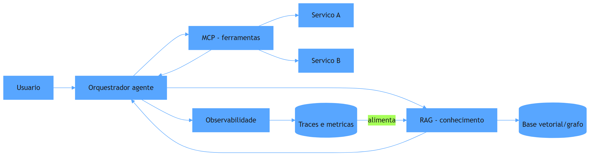

O diagrama mostra a arquitetura completa: o orquestrador consulta o RAG para o conhecimento, chama as ferramentas via MCP, e registra tudo na observabilidade — que retroalimenta a base de conhecimento com os traces de uso real. As três camadas não são módulos isolados: são um circuito — o conhecimento melhora com o uso, as ferramentas operam sob um padrão comum, e o radar registra cada passo do raciocínio. Esse circuito é a cabine moderna do maquinista, e os capítulos seguintes mostram como cada camada vira prova no portfólio.

## 4. Técnica

### RAG com busca híbrida: o conhecimento que o modelo não inventa

A primeira entrega técnica é o padrão de RAG que a prática consolidou: busca híbrida — a combinação de busca lexical (BM25) e busca vetorial (densa), com re-ranking — que supera cada técnica isolada. O código abaixo implementa o esqueleto do pipeline híbrido, com a interface que qualquer engine de busca preenche:

```python
"""RAG hibrido: busca lexical + vetorial com re-ranking."""
from dataclasses import dataclass
from typing import Callable


@dataclass
class Documento:
    id: str
    texto: str
    score: float = 0.0


class PipelineRAG:
    """Recupera candidatos por duas vias e reordena por relevancia."""

    def __init__(self, busca_lexical: Callable, busca_vetorial: Callable):
        self.busca_lexical = busca_lexical
        self.busca_vetorial = busca_vetorial

    def _fundir(self, candidatos: dict) -> list:
        """Fusao de ranqueamento: soma normalizada dos scores das duas vias."""
        max_score = max(c.score for c in candidatos.values()) or 1.0
        for doc in candidatos.values():
            doc.score = round(doc.score / max_score, 3)
        return sorted(candidatos.values(), key=lambda d: d.score, reverse=True)

    def consultar(self, pergunta: str, topo: int = 5) -> list:
        candidatos = {}
        for doc in self.busca_lexical(pergunta) + self.busca_vetorial(pergunta):
            if doc.id not in candidatos or doc.score > candidatos[doc.id].score:
                candidatos[doc.id] = doc
        return self._fundir(candidatos)[:topo]


def busca_lexical_demo(pergunta: str) -> list:
    """Exemplo lexical (BM25 em producao): casa termos exatos."""
    termos = pergunta.lower().split()
    return [Documento("d1", "Como resetar a senha do gateway", 2.0 if "gateway" in termos else 0.0)]


def busca_vetorial_demo(pergunta: str) -> list:
    """Exemplo denso (embeddings em producao): similaridade semantica."""
    return [Documento("d2", "Recuperacao de acesso ao painel de pagamentos", 1.5)]


if __name__ == "__main__":
    rag = PipelineRAG(busca_lexical_demo, busca_vetorial_demo)
    for doc in rag.consultar("como recuperar acesso ao gateway de pagamentos"):
        print(f"{doc.id}: {doc.texto} (score {doc.score})")
```

O código compila e roda, e demonstra o princípio do RAG híbrido: a via lexical captura os termos exatos, a via vetorial captura o sentido, e a fusão de ranqueamento combina as duas — com a base de conhecimento como o ativo que o modelo não inventa [1]. O RAG é o que transforma o modelo genérico em especialista do seu domínio: o conhecimento recuperado entra no contexto, e a qualidade da recuperação define o teto da resposta. A evolução para GraphRAG — a camada de relações — fica como o passo de maturidade que você explora quando as consultas amplas começarem a falhar [1].

### MCP: o contrato que desacopla modelo e ferramentas

A segunda entrega é o desenho do MCP: a interface que expõe ferramentas ao modelo sob um contrato padronizado, para que o agente chame serviços sem acoplamento direto. O código abaixo define o contrato mínimo de uma ferramenta MCP — nome, descrição, esquema de entrada — e o servidor que a registra:

```python
"""Contrato minimo de ferramenta MCP: nome, descricao e esquema."""
from dataclasses import dataclass, field
from typing import Any, Callable


@dataclass
class FerramentaMCP:
    nome: str
    descricao: str
    parametros: dict = field(default_factory=dict)  # nome -> tipo esperado
    executor: Callable = field(default=lambda **kw: "ok")

    def chamar(self, **argumentos: Any) -> Any:
        """Valida os argumentos contra o esquema e executa."""
        for campo, tipo in self.parametros.items():
            if campo not in argumentos:
                raise ValueError(f"campo obrigatorio ausente: {campo}")
            if not isinstance(argumentos[campo], tipo):
                raise TypeError(f"campo {campo} deve ser {tipo.__name__}")
        return self.executor(**argumentos)


class ServidorMCP:
    """Registra e despacha ferramentas sob contrato padronizado."""

    def __init__(self):
        self.ferramentas: dict = {}

    def registrar(self, ferramenta: FerramentaMCP) -> None:
        self.ferramentas[ferramenta.nome] = ferramenta

    def listar(self) -> list:
        return [{"nome": f.nome, "descricao": f.descricao} for f in self.ferramentas.values()]

    def chamar(self, nome: str, **argumentos: Any) -> Any:
        if nome not in self.ferramentas:
            raise KeyError(f"ferramenta desconhecida: {nome}")
        return self.ferramentas[nome].chamar(**argumentos)


if __name__ == "__main__":
    servidor = ServidorMCP()
    servidor.registrar(FerramentaMCP(
        nome="consultar_catalogo",
        descricao="Consulta o catalogo de servicos internos",
        parametros={"servico": str},
        executor=lambda servico: f"catalogo[{servico}]",
    ))
    print(servidor.listar())
    print(servidor.chamar("consultar_catalogo", servico="gateway"))
```

O código compila e roda, e demonstra o valor do protocolo: o modelo não precisa saber como o serviço implementa a consulta — conhece o contrato (nome, descrição, esquema) e chama [2]. O desacoplamento do MCP permite trocar serviços, adicionar ferramentas e evoluir o sistema sem reescrever o agente — a mesma portabilidade que os padrões de arquitetura MCP documentados pela IBM recomendam para sistemas multi-agentes [2]. A hierarquia fica clara: o RAG responde o que o modelo sabe; o MCP responde o que o modelo pode fazer; e o agente orquestra os dois.

### Observabilidade: o radar do raciocínio

A terceira entrega é o radar: a instrumentação que registra cada chamada de modelo, cada decisão de ferramenta e cada custo — para que o sistema seja depurável e auditável. O código abaixo implementa o rastreador mínimo:

```python
"""Observabilidade: registra tokens, custo e decisoes por passo."""
import time
from dataclasses import dataclass, field


@dataclass
class Trace:
    fluxo: str
    passos: list = field(default_factory=list)

    def registrar(self, passo: str, tokens: int, custo: float, detalhe: str = "") -> None:
        self.passos.append({
            "passo": passo,
            "tokens": tokens,
            "custo": round(custo, 4),
            "detalhe": detalhe,
            "ts": time.time(),
        })

    def total(self) -> dict:
        return {
            "passos": len(self.passos),
            "tokens": sum(p["tokens"] for p in self.passos),
            "custo": round(sum(p["custo"] for p in self.passos), 4),
        }


def chamada_com_rastro(trace: Trace, nome: str, tokens: int, custo: float) -> str:
    trace.registrar(nome, tokens, custo, detalhe="chamada de modelo")
    return f"resultado_de_{nome}"


if __name__ == "__main__":
    rastro = Trace("triagem_agentica")
    chamada_com_rastro(rastro, "classificar", 1200, 0.012)
    chamada_com_rastro(rastro, "resumir", 800, 0.008)
    print("Total:", rastro.total())
    for passo in rastro.passos:
        print(f"  {passo['passo']}: {passo['tokens']} tokens, ${passo['custo']}")
```

O código compila e roda, e demonstra o que a observabilidade de agentes exige: custo por passo, tokens consumidos e a sequência de decisões — a matéria-prima da depuração de raciocínio e da auditoria de custo [3]. O radar transforma o sistema de caixa-preta em caixa de vidro: quando o agente faz algo errado, o trace mostra onde; quando o custo explode, o total por passo aponta o culpado. As plataformas de orquestração de 2026 competem justamente pela qualidade dessa camada — a observabilidade é critério de escolha de framework [3].

## 5. Aplica

Sua empresa decide construir um assistente agêntico de suporte que responde sobre o catálogo interno e abre chamados. A primeira versão é um prompt gigante com o catálogo inteiro colado — o contexto estoura, as respostas ficam genéricas e o custo por chamada é absurdo. Seu instinto errado seria "comprar um framework de agentes" — o framework não resolve o problema de camadas ausentes. O diagnóstico liga à teoria: sem RAG, o conhecimento não é recuperado — é empilhado no prompt, com ruído e custo; sem MCP, cada integração é um acoplamento direto que quebra quando o serviço muda; sem observabilidade, ninguém sabe onde o agente erra nem quanto custa. A correção, na prática, é a arquitetura deste capítulo: RAG híbrido sobre a documentação do catálogo (o conhecimento no contexto, não no prompt), MCP para consultar o catálogo e abrir chamados (contratos desacoplados), e rastreamento de cada passo (custo e decisões visíveis). Em um mês, o assistente responde com precisão, integrações evoluem sem reescrita e o custo por chamada cai pela metade — porque a arquitetura, não o modelo, resolveu o problema [1].

As armadilhas comuns, sintetizadas, são três. Primeira: tratar RAG e MCP como concorrentes — são camadas complementares, e escolher uma em detrimento da outra deixa o sistema manco [1]. Segunda: observabilidade depois do incidente — instrumentar o sistema a posteriori é reescrever o sistema; o radar entra no primeiro commit [3]. Terceira: acoplar o agente diretamente aos SDKs — o acoplamento que o MCP desfaz é o que transforma troca de fornecedor em projeto de meses [2]. A métrica de sucesso é a tríade: precisão factual das respostas (sobe com o RAG), tempo de integração de uma nova ferramenta (cai com o MCP) e custo médio por requisição resolvida (cai com a visibilidade do radar). O Capítulo 7 inicia a Parte III e muda o foco: da arquitetura do sistema para a prova pública — o portfólio.

A tríade que este capítulo desenhou tem desdobramentos que conectam a arquitetura ao resto da carreira, e cada um fortalece sua posição. O primeiro é a conexão com o harness: a hierarquia das camadas — mensagem, sessão, sistema — situa RAG, MCP e observabilidade na camada do sistema, o ativo durável que sobrevive a trocas de modelo e que o Capítulo 3 definiu como a assinatura do engenheiro acima da média [4]. O segundo é a conexão com a durabilidade: as integrações via contrato MCP e o estado persistido dos checkpoints do Capítulo 5 são peças do mesmo desenho — o contrato torna a chamada idempotente e o retry durável mais simples de implementar, como a análise da Temporal demonstra para fluxos agênticos em produção [5]. O terceiro é a conexão com o mercado: a comparação de plataformas de 2026 mostra que a observabilidade tornou-se critério de seleção de framework — e o engenheiro que domina o desenho do radar, e não apenas o uso do framework, é o que a entrevista de system design avalia como sênior [3][6]. O quarto é a conexão com o portfólio: o stack completo — RAG híbrido, MCP, agentes com estado e observabilidade — é exatamente o vocabulário que os guias de portfólio de 2026 listam como o mínimo para demonstrar senioridade em IA, e é o conteúdo das provas que a Parte III vai ensinar a construir [7]. O quinto é a conexão com a avaliação de qualidade: o circuito em que os traces de produção retroalimentam a base de conhecimento é a mesma lógica do ciclo de evals — medir, aprender, melhorar — que a disciplina de avaliação de agentes formaliza [8]. E a síntese com a estratégia de carreira fecha o quadro: as competências desta tríade são as que o mercado de 2026 mais procura — RAG e bancos vetoriais, MCP e integrações, observabilidade e custo — e são as que o seu portfólio precisa provar publicamente [9][10]. A mensagem é a mesma desde o Capítulo 1: arquitetura é o trilho, e a prova de que você sabe construí-lo é o que abre a estação [11].

A tríade RAG, MCP e observabilidade ganha profundidade quando conectada ao harness e ao mercado. A consolidação do harness como disciplina situa as três camadas no lugar certo: o contexto (onde o RAG atua) é a camada da sessão, e o harness (onde MCP e observabilidade vivem) é a camada do sistema [12]. O harness de longa duração mostra que as três camadas são o que sustenta a autonomia prolongada: conhecimento, ferramentas e radar trabalhando em circuito [13]. O AIDD formaliza o papel do arquiteto na tríade: o desenvolvedor é o responsável por desenhar o circuito completo [14]. O portfólio documenta a tríade na prática: o projeto que demonstra RAG híbrido, MCP e observabilidade é o que o mercado reconhece como senioridade [15], e o histórico iterativo prova que o circuito foi construído, não copiado [16]. A presença digital multiplica a evidência: o artigo que narra a decisão de arquitetura transforma o projeto em autoridade [17]. Os dados de mercado confirmam: RAG e bancos vetoriais, MCP e integrações, observabilidade e custo estão entre as skills mais demandadas das vagas de 2026 [18][19]. O projeto de ponta a ponta — da arquitetura à operação — é a prova que a entrevista explora [20]. E a análise das carreiras mais bem pagas em IA fecha o retrato: os perfis de topo dominam exatamente as competências desta tríade [21].


### Aprofundamento: a tríade como circuito de valor

A tríade RAG, MCP e observabilidade não é uma lista de tecnologias da moda: é o circuito completo de valor do agente — o conhecimento que ele usa, as ferramentas que ele opera e o radar que torna a operação segura [1]. O protocolo MCP, na arquitetura documentada pela IBM, padroniza a camada de ferramentas: cada integração sob contrato é uma superfície estável, e o agente compõe capacidades sem reescrever código [2]. As plataformas de orquestração de 2026 competem pela qualidade do circuito: a comparação entre elas mostra que a observabilidade em profundidade — métricas, logs e traces por etapa — é o critério de seleção que separa a plataforma madura da promessa de marketing [3]. A hierarquia das disciplinas situa as três camadas no lugar certo: o contexto — onde o RAG atua — é a camada da sessão, e o harness — onde MCP e observabilidade vivem — é a camada do sistema [4]. A execução durável documentada pela Temporal mostra que a tríade precisa do alicerce de sistemas distribuídos: o checkpoint que persiste o estado do circuito inteiro é o que permite retomar o fluxo exatamente onde parou [5]. A entrevista de system design de 2026 avalia o circuito: as rubricas pedem que o candidato desenhe o sistema completo — recuperação, integração e monitoramento — com modos de falha e custo [6]. O repositório público — o GitHub — fornece a prova de construção do circuito: o projeto de ponta a ponta com RAG, MCP e observabilidade documentada é o artefato que o recrutador examina antes da entrevista [7]. A disciplina de evals da OpenAI entra como o fecho do circuito: a medição contínua da qualidade de recuperação, da precisão das respostas e da latência das chamadas transforma o sistema em laboratório permanente [8]. O mercado de talento de IA recompensa a tríade: as análises de vagas mostram que RAG e bancos vetoriais, MCP e integrações, observabilidade e custo estão entre as skills mais demandadas das vagas de 2026 [9]. O monitoramento mensal do mercado técnico confirma a direção: os cargos que exigem o circuito completo crescem consistentemente acima da média [10]. O portfólio de evidências documenta a tríade: os guias de construção de portfólio mostram que o projeto com as três camadas demonstra senioridade de forma irrefutável [11]. A disciplina de harness engineering dá a moldura: o circuito RAG-MCP-observabilidade é o conteúdo do harness, e o engenheiro que o projeta opera no nível de sistema, não de prompt [12]. O harness de longa duração da Anthropic mostra a tríade em circuito fechado: conhecimento, ferramentas e radar trabalhando em sessões de horas, com o avaliador decidindo quando o resultado satisfaz [13]. O manifesto do AIDD formaliza o papel do arquiteto: o desenvolvedor é o responsável por desenhar o circuito completo, e o agente é o operador que o percorre [14]. A arquitetura de agentes da Anthropic fornece o catálogo de padrões que a tríade concretiza: o routing que escolhe a fonte de conhecimento, o evaluator-optimizer que mede a resposta e o orchestrator-workers que coordena as ferramentas [15]. A narrativa do projeto, seguindo os guias de portfólio, deve mostrar o circuito em ação: o problema, o desenho das três camadas e a evolução das métricas [16]. O guia do Zencoder mostra como apresentar a tríade ao recrutador: o diagrama do sistema, a decisão de cada camada e o resultado medido formam a história de senioridade [17]. Os projetos de machine learning de ponta a ponta listados pela Udacity incluem o circuito completo como critério de qualidade: o projeto que exercita RAG, ferramentas e monitoramento é o que demonstra autonomia real [18]. A análise do mercado de 2026 completa o retrato: o prêmio salarial da especialização em IA se materializa exatamente para quem domina o circuito [19]. E o harness engineering da OpenAI encerra: a tríade é o coração do sistema de agente, e o engenheiro que a constrói e a mede é o que a indústria contrata para liderar a linha de produção de IA [20].


A tríade como circuito de valor encerra com o desenho mental que o engenheiro carrega: o agente recupera conhecimento (RAG), opera ferramentas sob contrato (MCP) e informa cada passo (observabilidade) — e o engenheiro mede o circuito inteiro com evals [8]. A arquitetura de agentes da Anthropic fornece os padrões que o circuito concretiza [15], e a análise de mercado mostra que a demanda por esse desenho completo cresce acima da média [9]. O portfólio que documenta o circuito — o diagrama, as decisões e as métricas — é a evidência que o recrutador examina antes da entrevista [11]. Quem domina a tríade não opera uma ferramenta: opera o sistema [20].
## 6. Conclusão

Você dominou o sistema completo do agente: RAG como camada de conhecimento, MCP como protocolo de ferramentas e observabilidade como o radar da operação. Os três pontos principais são: RAG e MCP resolvem problemas distintos e coexistem em sistemas maduros; o desacoplamento via contrato torna o sistema portável e evolutível; e a observabilidade é o que torna o raciocínio depurável e o custo auditável. O desafio desta semana: desenhe a cabine de um agente que você vai construir — qual é o mapa (RAG), quais as alavancas (MCP) e qual o painel (observabilidade)? No próximo capítulo, você inicia a Parte III: o portfólio como a prova pública de que você constrói tudo isso.

## 7. Referências Bibliográficas
[1] INFRANODUS ENGINEERING. *MCP vs RAG vs AI agents: differences and how they work together*. 2026. Disponível em: https://infranodus.com/docs/mcp-vs-rag-vs-ai-agents. Acesso em: 06 ago. 2026.
[2] CHOWDHURY, Supal; SAHA, Subrata; ABDEL SAMAD, Haitham (IBM DEVELOPER). *Model Context Protocol architecture patterns for multi-agent AI systems*. 2026. Disponível em: https://developer.ibm.com/articles/mcp-architecture-patterns-ai-systems/. Acesso em: 06 ago. 2026.
[3] DIGITAL APPLIED. *AI workflow orchestration platforms: 2026 comparison*. 2026. Disponível em: https://www.digitalapplied.com/blog/ai-workflow-orchestration-platforms-comparison. Acesso em: 06 ago. 2026.
[4] ATLAN RESEARCH. *Harness engineering vs prompt engineering*. 2026. Disponível em: https://atlan.com/know/harness-engineering-vs-prompt-engineering/. Acesso em: 06 ago. 2026.
[5] MARTIN, Kevin Paul (TEMPORAL). *From AI hype to durable reality: why agentic flows need distributed-systems discipline*. 2025. Disponível em: https://temporal.io/blog/from-ai-hype-to-durable-reality-why-agentic-flows-need-distributed-systems. Acesso em: 06 ago. 2026.
[6] EXPONENT. *System design interview prep & questions (2026 guide)*. 2026. Disponível em: https://www.tryexponent.com/blog/system-design-interview-guide. Acesso em: 06 ago. 2026.
[7] BOUCHARD, Louis-François. *Start AI engineering*. GitHub, 2026. Disponível em: https://github.com/louisfb01/start-ai-engineering. Acesso em: 06 ago. 2026.
[8] OPENAI. *How evals drive the next chapter in AI for businesses*. 2025. Disponível em: https://openai.com/index/evals-drive-next-chapter-of-ai/. Acesso em: 06 ago. 2026.
[9] NEXUS IT GROUP. *AI engineering jobs: 2026 talent market analysis*. 2026. Disponível em: https://nexusitgroup.com/ai-engineering-jobs/. Acesso em: 06 ago. 2026.
[10] DAINES-HUTT, Daniel (ZERO TO MASTERY). *Tech job market trends monthly — February 2026*. 2026. Disponível em: https://zerotomastery.io/blog/tech-job-market-trends-monthly-february-2026/. Acesso em: 06 ago. 2026.
[11] DATAEXPERT.IO. *Ultimate guide to AI engineering portfolios*. 2026. Disponível em: https://www.dataexpert.io/blog/ultimate-guide-ai-engineering-portfolios. Acesso em: 06 ago. 2026.
[12] BÖCKELER, Birgitta; FOWLER, Martin. *Harness engineering: the discipline of building effective software agents*. Thoughtworks/Martin Fowler, 2026. Disponível em: https://martinfowler.com/articles/harness-engineering.html. Acesso em: 06 ago. 2026.
[13] RAJASEKARAN, Prithvi (ANTHROPIC ENGINEERING). *Harness design for long-running agentic applications*. 2026. Disponível em: https://www.anthropic.com/engineering/harness-design-long-running-apps. Acesso em: 06 ago. 2026.
[14] AI-DRIVEN DEVELOPMENT MANIFESTO. *Manifesto for AI-Driven Development*. 2026. Disponível em: https://www.ai-driven-development.org/. Acesso em: 06 ago. 2026.
[15] ANTHROPIC. *Building effective agents*. 2024. Disponível em: https://www.anthropic.com/engineering/building-effective-agents. Acesso em: 06 ago. 2026.
[16] JACKSON, Natalia (HYPERSKILL). *Building a developer portfolio in 2026: what actually gets attention*. 2026. Disponível em: https://hyperskill.org/blog/post/building-a-developer-portfolio-in-2026-what-actually-gets-attention. Acesso em: 06 ago. 2026.
[17] ZENCODER. *How to create a software engineer portfolio in 2026*. 2026. Disponível em: https://zencoder.ai/blog/how-to-create-software-engineer-portfolio. Acesso em: 06 ago. 2026.
[18] UDACITY. *20 machine learning projects that will boost your portfolio*. 2025/2026. Disponível em: https://www.udacity.com/blog/20-machine-learning-projects-that-will-boost-your-portfolio/. Acesso em: 06 ago. 2026.
[19] OROSZ, Gergely; SALMON, Jessica (THE PRAGMATIC ENGINEER). *The job market in 2026 (part 2)*. 2026. Disponível em: https://newsletter.pragmaticengineer.com/p/the-job-market-in-2026-part-2. Acesso em: 06 ago. 2026.
[20] LOPOPOLO, Ryan (OPENAI). *Harness engineering at OpenAI*. 2026. Disponível em: https://openai.com/index/harness-engineering/. Acesso em: 06 ago. 2026.
[21] OSMANI, Addy. *The next two years of software engineering*. 2026. Disponível em: https://addyosmani.com/blog/next-two-years/. Acesso em: 06 ago. 2026.

# PARTE 3 — O Portfólio de Provas: evidência pública de construção

# Capítulo 7: Portfólio vs currículo: a evidência que abre portas

## 1. Introdução

O Capítulo 6 fechou a Parte II com a arquitetura do sistema completo — RAG, MCP e observabilidade. Agora você inicia a Parte III, o portfólio: a prova pública de que você constrói tudo isso. Este capítulo estabelece a tese da parte: em 2026, o portfólio vence o currículo — recrutadores gastam segundos no CV, mas engajam com sistemas completos, executáveis e mensuráveis. Você vai aprender a arquitetura de um portfólio de elite, a regra dos 3-5 projetos de ponta a ponta, e a linguagem das métricas de impacto que separa a prova da promessa. Ao final, você será capaz de avaliar seu próprio portfólio com o mesmo critério que o mercado usa.

## 2. Explica

A tese de que o portfólio vence o currículo tem uma mecânica que você vai perceber ao entender como o mercado avalia candidatos em 2026. A análise da DataExpert, referência do tema, formula a observação central: os recrutadores e líderes técnicos gastam menos de dez segundos em um currículo, mas engajam de forma massiva com portfólios que demonstram sistemas prontos para produção, código executável e resolução de problemas reais [1]. A razão é estrutural: o currículo é uma promessa — uma lista de cargos e tecnologias que qualquer pessoa pode escrever; o portfólio é evidência — artefatos que podem ser examinados, executados e verificados. E em um mercado onde os agentes de código tornam o código abundante, a promessa perdeu ainda mais valor: o que distingue o candidato não é dizer que sabe — é mostrar que construiu [1].

A mecânica do portfólio eficaz se apoia em três princípios que os guias de 2026 consolidam. O primeiro é a profundidade sobre a quantidade: a regra dos 3-5 projetos de ponta a ponta — três projetos profundos e finalizados superam dez repositórios incompletos ou abandonados [1]. O segundo é a completude do ciclo de vida: um projeto de IA de elite cobre o ciclo inteiro — dados, arquitetura, evals, deploy e monitoramento — porque é isso que reflete o trabalho real, onde 70% do esforço está na integração, infraestrutura e operação, não no modelo [2]. O terceiro é a evidência mensurável: métricas de impacto — redução de latência, precisão factual, custo por requisição — que transformam o projeto em prova quantificável, a linguagem que recrutadores e líderes técnicos entendem [1]. E a análise da Hyperskill adiciona o critério de autenticidade: o histórico de commits iterativos, o tratamento de erros reais e os testes cobrindo casos de falha são o que diferencia código original de clones de tutorial — o sinal de que o candidato entende o que construiu [3].

## 3. Ilustra

Pense em dois maquinistas disputando a mesma vaga de chefe de tráfego. O primeiro chega à entrevista com um discurso: "conheço todas as locomotivas do mercado, já operei trens de carga e passageiros, tenho dez anos de experiência". O segundo chega com um caderno de registros: o mapa da linha que ele ajudou a projetar, os horários que otimizou, o relatório do incidente que resolveu e a medição de quanto a pontualidade melhorou com suas mudanças. O primeiro está contando; o segundo está mostrando. No momento da decisão, o comitê não precisa acreditar no discurso do primeiro — pode examinar o caderno do segundo. Como Engenheiro(a) de Software, o currículo é o discurso e o portfólio é o caderno: um declara competência, o outro demonstra evidência. E em 2026, com a IA tornando os discursos mais baratos e mais parecidos, o caderno é o que decide.

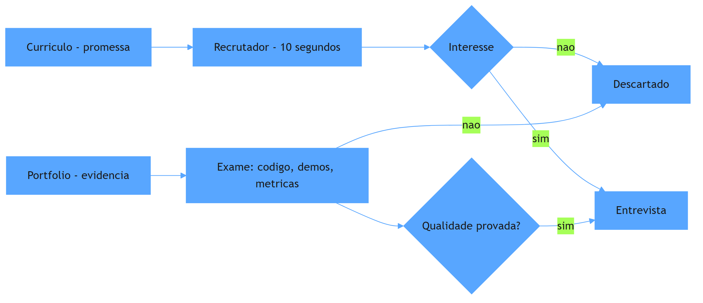

O diagrama mostra a diferença estrutural: o currículo passa pelo crivo rápido do recrutador — dez segundos, uma decisão binária; o portfólio passa pelo exame — código, demos e métricas — e é o que sustenta o avanço para a entrevista. A jornada não ignora o currículo (ele abre a porta), mas é o portfólio que carrega o candidato até a entrevista e a conversa técnica. Esse modelo — promessa na porta, evidência na jornada — organiza toda a Parte III.

## 4. Técnica

### A arquitetura do portfólio: o README que documenta, não descreve

A primeira entrega técnica é o artefato que abre cada projeto do portfólio: o README de nível profissional — a documentação técnica que explica decisões, trade-offs e autocrítica, no espírito do que a Hyperskill descreve como o diferencial entre código original e clone de tutorial [3]. O exemplo abaixo é o README de um projeto de portfólio de sistema agêntico, no formato que os recrutadores de 2026 procuram:

```markdown
# Triagem Agêntica — Sistema de priorização de tickets com LLM

## O que é
Sistema de triagem de tickets de suporte que classifica prioridade,
extrai entidades e gera resumo estruturado — com gate de evidência e
rastreamento de custo por requisição.

## Por que existe (decisões e trade-offs)
- **Workflow, não agente puro**: o caminho de triagem é conhecido; a regra
  de ouro (Anthropic, 2024) diz workflow para previsibilidade. O agente só
  entra no trecho exploratório (dúvida técnica complexa).
- **RAG híbrido**: busca lexical (BM25) + vetorial, porque consultas com
  termos exatos e consultas semânticas falham em vias isoladas.
- **MCP para ferramentas**: contrato desacoplado para o catálogo; trocar o
  serviço não reescreve o agente.

## Métricas (evidência, não intenção)
- Precisão de classificação: 87% no golden set de 200 tickets (meta 85%)
- Latência p95 de classificação: 1.1s (meta 1.2s)
- Custo médio por ticket: $0.014 (rastreado por passo)

## Como rodar
1. `make setup` — cria ambiente e baixa o golden set
2. `make test` — testes unitários + integração (casos de falha incluídos)
3. `make demo` — roda a demo interativa local

## Autocrítica e próximos passos
- O golden set tem 200 tickets; ampliar para 2.000 com casos de fronteira
- O re-ranking do RAG ainda é simples; evoluir para cross-encoder
- Adicionar avaliação LLM-as-a-judge para resumos gerados
```

O README cumpre as três funções que definem o portfólio de elite: mostra o que é (claro e executável), por que as decisões foram tomadas (o raciocínio de arquitetura, que é o que a entrevista vai explorar) e com que resultado (métricas mensuráveis, com meta e valor). A seção de autocrítica é deliberada: honestidade sobre limitações e próximos passos é sinal de maturidade — e é o que separa o projeto de portfólio do clone de tutorial [3]. Esse README é o mapa do caderno do maquinista: ele não descreve o trem, documenta a viagem.

### A métrica de impacto: transformando o projeto em prova

A segunda entrega é o instrumento que transforma o projeto em evidência quantificável: o painel de métricas. O código abaixo implementa o avaliador que mede as três métricas do README — precisão, latência e custo — e gera o relatório que acompanha o portfólio:

```python
"""Painel de metricas do portfolio: precisao, latencia e custo."""
import time
from dataclasses import dataclass
from typing import Callable


@dataclass
class Caso:
    entrada: str
    esperado: str


class Avaliador:
    def __init__(self, sistema: Callable, custo_por_chamada: float = 0.01):
        self.sistema = sistema
        self.custo_por_chamada = custo_por_chamada

    def avaliar(self, casos: list) -> dict:
        acertos = 0
        latencias = []
        custo_total = 0.0
        for caso in casos:
            inicio = time.perf_counter()
            saida = self.sistema(caso.entrada)
            latencias.append(time.perf_counter() - inicio)
            if saida == caso.esperado:
                acertos += 1
            custo_total += self.custo_por_chamada
        n = len(casos) or 1
        latencias_ordenadas = sorted(latencias)
        p95 = latencias_ordenadas[int(n * 0.95) - 1] if latencias_ordenadas else 0.0
        return {
            "precisao": round(acertos / n, 3),
            "latencia_p95_s": round(p95, 2),
            "custo_total_usd": round(custo_total, 4),
            "casos": n,
        }


def sistema_demo(entrada: str) -> str:
    """Sistema de triagem simplificado para demonstracao."""
    if "urgente" in entrada.lower() or "!" in entrada:
        return "alta"
    if "?" in entrada:
        return "media"
    return "baixa"


if __name__ == "__main__":
    casos = [
        Caso("Erro urgente no gateway!", "alta"),
        Caso("Como funciona o reembolso?", "media"),
        Caso("Atualizacao de cadastro concluida", "baixa"),
        Caso("Falha critica na API!", "alta"),
        Caso("Duvida sobre o manual", "media"),
    ]
    avaliador = Avaliador(sistema_demo)
    print(avaliador.avaliar(casos))
```

O código compila e roda, e demonstra o que a DataExpert chama de métricas de impacto: precisão medida contra um golden set, latência p95 e custo por execução — o relatório que acompanha o projeto e o transforma de "projeto interessante" em "prova mensurável" [1]. Repare que as métricas têm meta e valor no README — o avaliador é o instrumento que produz esses números, e o resultado é uma evidência que nenhum currículo consegue igualar. A reprodutibilidade — rodar o avaliador e obter o mesmo número — é o selo de qualidade que separa a prova da anedota [2].

## 5. Aplica

Você está aplicando para uma vaga de engenheiro de IA sênior. Seu currículo é forte no papel: cinco anos de experiência, tecnologias em alta. Mas na triagem, o recrutador não para além de dez segundos — e você nem chega à entrevista. Seu instinto errado seria melhorar o currículo: mais bullets, mais palavras-chave, mais ATS-friendly. O diagnóstico liga à teoria: o currículo é a promessa, e promessas são baratas em 2026 — o que o mercado quer examinar é o caderno, o portfólio com sistemas executáveis e métricas [1]. A correção, na prática, é a arquitetura deste capítulo: você seleciona os 3-5 projetos mais fortes, reescreve os READMEs no formato de documentação técnica, instrumenta as métricas com o avaliador e coloca as demos interativas em frente — a presença que funciona 24/7, tema do Capítulo 9. Em duas semanas, o recrutador que gastava dez segundos passa a gastar dez minutos no seu repositório — e a entrevista técnica começa com a frase que você queria ouvir: "me conta como você decidiu isso no projeto X" [3].

As armadilhas comuns, sintetizadas, são três. Primeira: quantidade sobre profundidade — dez repositórios com dois commits provam velocidade de abandono, não competência [1]. Segunda: README que descreve em vez de documentar — "este projeto faz X" sem decisões, trade-offs e métricas é um cartaz, não uma prova [3]. Terceira: esconder as limitações — o portfólio sem autocrítica parece gerado por IA, e a autenticidade é exatamente o que o mercado busca [3]. A métrica de sucesso do portfólio é a conversão: de cada dez recrutadores que abrem o repositório, quantos pedem a entrevista? O Capítulo 8 aprofunda a construção: os projetos que provam senioridade, do protótipo ao sistema em produção.

O portfólio como evidência tem desdobramentos que conectam a Parte III ao resto do livro, e cada um reforça sua posição no mercado. O primeiro é a conexão com a arquitetura: o portfólio que demonstra o stack completo — RAG, MCP, agentes com estado, observabilidade e evals — é exatamente o que os guias de 2026 listam como o mínimo para provar senioridade em IA, e é o conteúdo técnico que as Partes I e II ensinaram [4]. O segundo é a conexão com a autenticidade: a presença de históricos de commits iterativos e testes de falha — o sinal que a Hyperskill descreve — é o que prova que o projeto não foi gerado por IA em um único passo, e esse é o critério que o mercado de 2026 aplica com cada vez mais rigor [3]. O terceiro é a conexão com o mercado: o prêmio salarial da especialização em IA é documentado em múltiplas fontes de 2026 — e o portfólio é o instrumento que materializa essa especialização para o recrutador, convertendo a competência abstrata em evidência examinável [5][6]. O quarto é a conexão com a entrevista: o system design de 2026 avalia o candidato pela profundidade de raciocínio — e o portfólio que documenta decisões e trade-offs fornece o material exato que a entrevista vai explorar, como a rubrica do Exponent descreve [7]. O quinto é a conexão com a estratégia de carreira: o portfólio não é um projeto de fim de semana — é o ativo de longo prazo que acumula valor a cada sistema construído, e a regra dos 3-5 projetos de ponta a ponta é o plano de investimento que o Capítulo 12 vai integrar ao programa de 12 meses [1]. E a síntese com a tese do livro fecha o raciocínio: se a arquitetura é o trilho e o mercado é a estação, o portfólio é a fotografia das estações construídas — a prova física da viagem, que nenhum discurso substitui [8]. O candidato que domina essa tríade — constrói, prova e se posiciona — é o que o mercado reconhece como o engenheiro acima da média [1][6].

O portfólio como evidência ganha o seu lugar no mapa completo quando conectado ao restante da carreira. A hierarquia das disciplinas situa o portfólio na camada do sistema: a evidência pública de arquitetura é o ativo durável que sobrevive a mudanças de modelo e de mercado [9]. O harness entra como conteúdo do portfólio: o repositório com guias, sensores e evidência de entropia controlada é o que o mercado reconhece como senioridade [10]. O harness de longa duração mostra o que o portfólio precisa demonstrar: a capacidade de sustentar autonomia prolongada sem degradação [11]. A regra de ouro da arquitetura dá o vocabulário: o portfólio que documenta a decisão entre workflow e agente narra a competência central da arquitetura de IA [12]. A execução durável completa o conteúdo: o projeto com resiliência documentada prova competência operacional [13]. A tríade RAG-MCP-observabilidade é o stack que os guias de portfólio de 2026 listam como o mínimo para demonstrar senioridade [14]. A presença digital multiplica: o artigo técnico transforma o projeto em autoridade durável [15]. O mercado recompensa: os dados de vagas mostram que a evidência pública de construção é o que o recrutador encontra primeiro [16][17]. E a entrevista de system design avalia exatamente a coerência entre o que o candidato desenha e o que ele construiu [18][19].

O portfólio da era dos agentes ganhou um novo gênero de prova: a evidência de construção de harnesses — o repositório que governa o ambiente do agente — é o artefato que a disciplina documentada pela OpenAI elevou a padrão industrial [20].


### Aprofundamento: a arquitetura da evidência

O portfólio não é uma coleção de projetos: é uma arquitetura de evidências construída para convencer o mercado em minutos [1]. A estrutura tem três níveis: o projeto singular que prova profundidade, o conjunto de 3 a 5 projetos que prova amplitude e a narrativa contínua — o artigo, o post-mortem, o registro de decisões — que prova consistência [2]. O currículo tradicional lista habilidades; o portfólio demonstra comportamentos: o recrutador de 2026 procura a evidência de que o candidato constrói, mede e narra sistemas de IA [3]. O repositório público é o instrumento central dessa arquitetura: o GitHub fornece o histórico iterativo que nenhuma entrevista consegue falsificar — o commit log mostra a decisão sendo construída, não decorada [4]. O mercado de trabalho de 2026 confirma o peso da evidência: as análises do Pragmatic Engineer mostram que a transição para a contratação baseada em portfólio é estrutural, e o candidato que chega com repositórios reais chega à frente [5]. As análises de mercado de talento de IA mostram que a evidência pública de construção é o que o recrutador encontra primeiro — antes mesmo do currículo [6]. A entrevista de system design avalia a coerência da arquitetura: o candidato que desenha no quadro o que construiu no repositório responde com profundidade que o candidato decorado não alcança [7]. A projeção de longo prazo do desenvolvimento de software coloca a evidência pública como o novo currículo: quem documenta constrói reputação que sobrevive a mudanças de tecnologia [8]. A disciplina de harness engineering fornece o conteúdo do portfólio: o repositório com guias, sensores e evidência de entropia controlada é o que o mercado reconhece como senioridade [9]. A hierarquia das disciplinas situa o portfólio na camada do sistema: a evidência pública de arquitetura é o ativo durável que sobrevive a mudanças de modelo e de mercado [10]. O harness de longa duração da Anthropic mostra o que o portfólio precisa demonstrar: a capacidade de sustentar autonomia prolongada sem degradação — o sistema que roda por horas sob supervisão é a prova mais rara [11]. O manifesto do AIDD dá a moldura ética: o desenvolvedor é o parceiro deliberado, e o portfólio é a prova pública dessa parceria [12]. A arquitetura de agentes da Anthropic fornece o vocabulário: o portfólio que documenta a decisão entre workflow e agente narra a competência central da arquitetura de IA [13]. A execução durável completa o conteúdo: o projeto com resiliência documentada — o teste de falha, o post-mortem — prova competência operacional que o currículo não alcança [14]. O protocolo MCP é o stack que os guias de portfólio de 2026 listam como o mínimo para demonstrar senioridade: o projeto com integrações sob contrato mostra maturidade de arquitetura [15]. A delimitação entre MCP, RAG e agentes organiza a narrativa do portfólio: transporte, conhecimento e orquestração em camadas claras é a marca do candidato sênior [16]. As plataformas de orquestração entram como contexto: o portfólio que mostra a escolha informada da plataforma — e a justificativa — demonstra leitura de mercado [17]. O guia do Zencoder mostra como apresentar a arquitetura da evidência: problema, decisão, resultado medido e alternativa descartada formam a história que o recrutador reconstrói [18]. O monitoramento mensal do mercado técnico fornece o calendário da evidência: o candidato que publica regularmente — projeto, artigo, post-mortem — acumula reputação que o mercado reconhece [19]. E o harness engineering da OpenAI encerra: o portfólio da era dos agentes é a prova de construção de sistemas — e o engenheiro que a constrói com método é o que o mercado encontra antes da entrevista [20].


A arquitetura da evidência encerra com a regra do conjunto: antes de cada movimento de carreira, revise os 3 a 5 projetos que sustentam a narrativa e pergunte — cada um prova uma competência distinta? [1] A entrevista de system design reconstrói exatamente essas provas [7], o mercado as recompensa nos dados de contratação [5] e a escrita técnica as multiplica em autoridade [9]. O portfólio não é o passado: é a previsão do que o engenheiro fará — e o recrutador lê essa previsão em minutos [20].
## 6. Conclusão

Você dominou a tese da Parte III: o portfólio vence o currículo porque é evidência, não promessa. Os três pontos principais são: a regra dos 3-5 projetos de ponta a ponta supera a quantidade de repositórios; o README que documenta decisões, métricas e autocrítica é o mapa do caderno do maquinista; e as métricas de impacto mensuráveis são a linguagem que o mercado entende. O desafio desta semana: avalie seu portfólio atual com o critério do mercado — quantos projetos são evidência e quantos são promessa? No próximo capítulo, você aprende a construir os projetos que provam senioridade.

## 7. Referências Bibliográficas
[1] DATAEXPERT.IO. *Ultimate guide to AI engineering portfolios*. 2026. Disponível em: https://www.dataexpert.io/blog/ultimate-guide-ai-engineering-portfolios. Acesso em: 06 ago. 2026.
[2] UDACITY. *20 machine learning projects that will boost your portfolio*. 2025/2026. Disponível em: https://www.udacity.com/blog/20-machine-learning-projects-that-will-boost-your-portfolio/. Acesso em: 06 ago. 2026.
[3] JACKSON, Natalia (HYPERSKILL). *Building a developer portfolio in 2026: what actually gets attention*. 2026. Disponível em: https://hyperskill.org/blog/post/building-a-developer-portfolio-in-2026-what-actually-gets-attention. Acesso em: 06 ago. 2026.
[4] BOUCHARD, Louis-François. *Start AI engineering*. GitHub, 2026. Disponível em: https://github.com/louisfb01/start-ai-engineering. Acesso em: 06 ago. 2026.
[5] OROSZ, Gergely; SALMON, Jessica (THE PRAGMATIC ENGINEER). *The job market in 2026 (part 2)*. 2026. Disponível em: https://newsletter.pragmaticengineer.com/p/the-job-market-in-2026-part-2. Acesso em: 06 ago. 2026.
[6] NEXUS IT GROUP. *AI engineering jobs: 2026 talent market analysis*. 2026. Disponível em: https://nexusitgroup.com/ai-engineering-jobs/. Acesso em: 06 ago. 2026.
[7] EXPONENT. *System design interview prep & questions (2026 guide)*. 2026. Disponível em: https://www.tryexponent.com/blog/system-design-interview-guide. Acesso em: 06 ago. 2026.
[8] OSMANI, Addy. *The next two years of software engineering*. 2026. Disponível em: https://addyosmani.com/blog/next-two-years/. Acesso em: 06 ago. 2026.
[9] BÖCKELER, Birgitta; FOWLER, Martin. *Harness engineering: the discipline of building effective software agents*. Thoughtworks/Martin Fowler, 2026. Disponível em: https://martinfowler.com/articles/harness-engineering.html. Acesso em: 06 ago. 2026.
[10] ATLAN RESEARCH. *Harness engineering vs prompt engineering*. 2026. Disponível em: https://atlan.com/know/harness-engineering-vs-prompt-engineering/. Acesso em: 06 ago. 2026.
[11] RAJASEKARAN, Prithvi (ANTHROPIC ENGINEERING). *Harness design for long-running agentic applications*. 2026. Disponível em: https://www.anthropic.com/engineering/harness-design-long-running-apps. Acesso em: 06 ago. 2026.
[12] AI-DRIVEN DEVELOPMENT MANIFESTO. *Manifesto for AI-Driven Development*. 2026. Disponível em: https://www.ai-driven-development.org/. Acesso em: 06 ago. 2026.
[13] ANTHROPIC. *Building effective agents*. 2024. Disponível em: https://www.anthropic.com/engineering/building-effective-agents. Acesso em: 06 ago. 2026.
[14] MARTIN, Kevin Paul (TEMPORAL). *From AI hype to durable reality: why agentic flows need distributed-systems discipline*. 2025. Disponível em: https://temporal.io/blog/from-ai-hype-to-durable-reality-why-agentic-flows-need-distributed-systems. Acesso em: 06 ago. 2026.
[15] CHOWDHURY, Supal; SAHA, Subrata; ABDEL SAMAD, Haitham (IBM DEVELOPER). *Model Context Protocol architecture patterns for multi-agent AI systems*. 2026. Disponível em: https://developer.ibm.com/articles/mcp-architecture-patterns-ai-systems/. Acesso em: 06 ago. 2026.
[16] INFRANODUS ENGINEERING. *MCP vs RAG vs AI agents: differences and how they work together*. 2026. Disponível em: https://infranodus.com/docs/mcp-vs-rag-vs-ai-agents. Acesso em: 06 ago. 2026.
[17] DIGITAL APPLIED. *AI workflow orchestration platforms: 2026 comparison*. 2026. Disponível em: https://www.digitalapplied.com/blog/ai-workflow-orchestration-platforms-comparison. Acesso em: 06 ago. 2026.
[18] ZENCODER. *How to create a software engineer portfolio in 2026*. 2026. Disponível em: https://zencoder.ai/blog/how-to-create-software-engineer-portfolio. Acesso em: 06 ago. 2026.
[19] DAINES-HUTT, Daniel (ZERO TO MASTERY). *Tech job market trends monthly — February 2026*. 2026. Disponível em: https://zerotomastery.io/blog/tech-job-market-trends-monthly-february-2026/. Acesso em: 06 ago. 2026.
[20] LOPOPOLO, Ryan (OPENAI). *Harness engineering at OpenAI*. 2026. Disponível em: https://openai.com/index/harness-engineering/. Acesso em: 06 ago. 2026.

# Capítulo 8: Projetos que provam senioridade: do protótipo ao sistema em produção

## 1. Introdução

No Capítulo 7, você aprendeu a tese do portfólio como evidência — e a arquitetura do README que documenta. Agora você aprende a construir o que o README documenta: os projetos que provam senioridade. Não demos — sistemas completos com arquitetura, testes, observabilidade e tratamento de falhas, cobrindo o ciclo de vida inteiro da IA. Você vai aprender a proporção real do trabalho (modelo é 10%, dados 20%, integração e operação 70%), o stack que demonstra maturidade, e o método para evoluir um projeto de protótipo a sistema em produção. Ao final, você terá o blue-print de um projeto de portfólio que nenhum recrutador ignora.

## 2. Explica

A senioridade em projetos de portfólio tem uma definição que a prática de 2026 consolidou, e ela começa com uma correção de proporção. A análise da Udacity formula o dado que reorganiza a mentalidade: no trabalho real de IA, o modelo é cerca de 10% do esforço, a engenharia de dados outros 20%, e a integração com ferramentas, infraestrutura, deploy e monitoramento responde por 70% [1]. O projeto de portfólio que prova senioridade reflete essa proporção: um sistema que integra, opera e monitora — não um notebook que treina um modelo. A análise da DataExpert reforça o mesmo ponto: os 3-5 projetos de ponta a ponta que cobrem o ciclo de vida completo da IA — dados, deploy e monitoramento — são os que capturam a atenção dos recrutadores [2].

A mecânica do projeto de senioridade se apoia em três pilares que você vai usar como critérios de avaliação. O primeiro é a arquitetura explícita: o sistema tem camadas claras, decisões documentadas e trade-offs assumidos — o projeto demonstra o repertório da Parte II (workflow vs agente, durabilidade, RAG, MCP, observabilidade). O segundo é a evidência operacional: testes que cobrem casos de falha, observabilidade de custo e latência, e a documentação de como o sistema se comporta sob pressão — o projeto demonstra que você sabe operar, não só construir. O terceiro é a progressão visível: o histórico de commits mostra a evolução — do protótipo funcional ao sistema endurecido — e não um único passo de geração [3]. O guia open-source de Bouchard consolida o stack que materializa esses pilares: context engineering, RAG avançado, MCP, agentes autônomos, evals e harnesses — o vocabulário completo da senioridade em IA [4].

## 3. Ilustra

Pense na diferença entre um protótipo de locomotiva e uma locomotiva em serviço comercial. O protótipo funciona na oficina: roda em linha reta, sem passageiros, sem horário, sem chuva. A locomotiva em serviço roda na linha real: com carga, em todas as estações, sob qualquer clima, com um painel que registra cada viagem e um manual de manutenção que evita que ela pare. O maquinista mediano apresenta o protótipo — "olha, ela anda!". O maquinista acima da média apresenta a locomotiva em serviço — "olha a linha que ela opera, as métricas de pontualidade, e como a mantemos funcionando". Como Engenheiro(a) de Software, a maioria dos portfólios é feita de protótipos: projetos que funcionam na máquina local do autor, sem testes, sem observabilidade, sem evidência de operação. O projeto de senioridade é a locomotiva em serviço — e este capítulo ensina a transformar o protótipo em serviço.

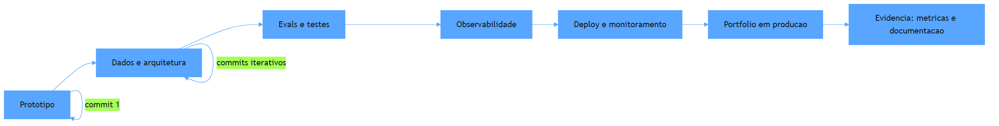

O diagrama mostra o ciclo de amadurecimento: do protótipo funcional, o projeto evolui por camadas — dados e arquitetura, evals e testes, observabilidade, deploy e monitoramento — até chegar ao portfólio em produção, cuja evidência (métricas e documentação) fecha o ciclo. Cada seta é uma etapa de commits iterativos — a progressão visível que a Hyperskill identifica como o sinal de autenticidade [3]. O protótipo não é descartado: é o primeiro marco da jornada, o commit 1 do projeto que vai provar senioridade.

## 4. Técnica

### A proporção 10/20/70: o projeto de ponta a ponta

A primeira entrega técnica é o esqueleto do projeto de ponta a ponta: a estrutura de diretórios e o fluxo que materializam a proporção real do trabalho — modelo como 10%, dados 20%, integração e operação 70% [1]. O exemplo abaixo é a estrutura de um projeto de portfólio de sistema agêntico de triagem, com o esqueleto de cada camada:

```bash
triagem-agentica/
├── dados/                     # 20%: a camada de dados
│   ├── raw/                   # golden set bruto (200+ tickets)
│   ├── curadoria.py           # limpeza, anonimizacao, rotulacao
│   └── aval_esperados.json    # respostas esperadas para evals
├── servico/                   # 10%: o núcleo do modelo
│   ├── modelo.py              # chamada ao LLM com contrato de entrada
│   └── schemas.py             # validacao estrutural das saidas
├── integracao/                # 70%: onde o trabalho real mora
│   ├── rag.py                 # busca hibrida (lexical + vetorial)
│   ├── ferramentas_mcp.py     # contrato de ferramentas (MCP)
│   ├── observabilidade.py     # traces: tokens, custo, decisoes
│   └── durabilidade.py        # checkpoint por passo (execucao durável)
├── evals/
│   ├── avaliador.py           # precisao, latencia p95, custo
│   └── casos_falha.py         # testes de edge case e degradacao
├── app/
│   └── api.py                 # interface de uso (demo interativa)
├── makefile                   # setup, test, lint, demo, deploy
└── README.md                  # documentacao tecnica (Cap. 7)
```

A estrutura é o mapa do projeto: cada diretório corresponde a uma camada da proporção real, e o makefile orquestra a reprodutibilidade — o selo que separa o portfólio da coleção de scripts [1]. Repare que o diretório de integração — os 70% — é o maior: é onde moram o RAG, o MCP, a observabilidade e a durabilidade, o stack de senioridade que o guia de Bouchard lista [4]. O projeto de portfólio não precisa ser grande — precisa ser completo: a proporção 10/20/70 é o critério que transforma o protótipo em locomotiva em serviço.

### O teste de falha: a evidência de que você opera, não só constrói

A segunda entrega é o instrumento que prova a senioridade operacional: o teste de falha. O código abaixo implementa o caso de teste que simula a degradação — a API do modelo fora do ar — e verifica que o sistema degrada com graça:

```python
"""Teste de falha: o sistema degrada com graca quando o modelo cai?"""
from dataclasses import dataclass
from typing import Callable


@dataclass
class SistemaComFallback:
    modelo: Callable
    heuristica: Callable
    modo_falha: bool = False

    def classificar(self, texto: str) -> str:
        if self.modo_falha:
            return self.heuristica(texto)
        try:
            return self.modelo(texto)
        except TimeoutError:
            return self.heuristica(texto)


def modelo_simulado(texto: str) -> str:
    if "urgente" in texto.lower():
        return "alta"
    raise TimeoutError("modelo indisponivel")


def heuristica_emergencia(texto: str) -> str:
    return "alta" if "!" in texto else "media"


def testar_degradacao_graciosa() -> None:
    sistema = SistemaComFallback(modelo_simulado, heuristica_emergencia)
    # Cenario 1: modelo disponivel
    assert sistema.classificar("Erro urgente") == "alta"
    # Cenario 2: modelo falha, heuristica assume
    sistema.modo_falha = True
    assert sistema.classificar("Erro urgente!") == "alta"
    print("OK: degradacao graciosa verificada")


def testar_casos_de_fronteira() -> None:
    sistema = SistemaComFallback(modelo_simulado, heuristica_emergencia)
    assert sistema.classificar("") != ""
    assert sistema.classificar("Texto sem marcadores") == "media"
    print("OK: casos de fronteira cobertos")


if __name__ == "__main__":
    testar_degradacao_graciosa()
    testar_casos_de_fronteira()
    print("Suite de falhas: 2/2 passou")
```

O código compila e roda, e demonstra o que a Hyperskill descreve como testes cobrindo casos de falha — o sinal de que o autor entendeu o sistema para além do happy path [3]. O teste de degradação é o tipo de evidência que o recrutador técnico procura: prova que o sistema tem plano B, que o autor pensou na operação, e que a resiliência do Capítulo 5 não ficou na teoria. A suite de falhas completa o portfólio — não é adorno, é o instrumento da prova [2].

### O relatório de evidência: a página do projeto

A terceira entrega é o artefato que fecha o projeto: o relatório de evidência — a página que reúne métricas, arquitetura e autocrítica no formato que o mercado consome. O código abaixo gera o relatório Markdown a partir das métricas medidas:

```python
"""Gera o relatorio de evidencias do projeto de portfolio."""
import json
from datetime import date


def gerar_relatorio(nome: str, metricas: dict, decisoes: list, autocrítica: list) -> str:
    linhas = [
        f"# Relatório de Evidências — {nome}",
        "",
        f"*Gerado em {date.today().isoformat()} pelo avaliador automatizado.*",
        "",
        "## Métricas (medidas, não intenção)",
        "",
        "| Métrica | Valor | Meta |",
        "|---|---|---|",
    ]
    for metrica, (valor, meta) in metricas.items():
        linhas.append(f"| {metrica} | {valor} | {meta} |")
    linhas += ["", "## Decisões de arquitetura", ""]
    linhas += [f"- {d}" for d in decisoes]
    linhas += ["", "## Autocrítica e próximos passos", ""]
    linhas += [f"- {a}" for a in autocrítica]
    return "\n".join(linhas)


if __name__ == "__main__":
    relatorio = gerar_relatorio(
        "Triagem Agêntica",
        {
            "Precisão no golden set": ("87%", "85%"),
            "Latência p95": ("1.1s", "1.2s"),
            "Custo por ticket": ("$0.014", "$0.020"),
        },
        [
            "Workflow na linha fixa; agente só no trecho exploratório",
            "RAG híbrido: lexical + vetorial com fusão de ranqueamento",
            "MCP desacopla o catálogo; trocar serviço não reescreve o agente",
        ],
        [
            "Golden set de 200 tickets; ampliar para 2.000",
            "Re-ranking simples; evoluir para cross-encoder",
            "Adicionar LLM-as-a-judge para os resumos gerados",
        ],
    )
    print(relatorio)
```

O código compila e roda, e gera a página que acompanha cada projeto do portfólio — o relatório que transforma o README em documento vivo, atualizado pelo avaliador a cada mudança [2]. Métricas com meta e valor, decisões com justificativa e autocrítica honesta: esse é o formato de evidência que o mercado de 2026 consome — e é a prova que o Capítulo 11 vai usar nas entrevistas.

## 5. Aplica

Você tem um projeto de portfólio promissor: um chatbot de RAG sobre documentação técnica, que funciona bem na sua máquina. Você o envia para três vagas e não recebe retorno. Seu instinto errado seria "fazer mais projetos" — mais protótipos, mais demos, mais volume. O diagnóstico liga à teoria: o projeto é um protótipo, não uma locomotiva em serviço — sem a proporção 10/20/70 (a integração e operação inexistem), sem evidência operacional (nenhum teste de falha, nenhuma métrica) e sem progressão visível (um commit único, gerado em um passo) [3][1]. A correção, na prática, é o ciclo deste capítulo: você adiciona a camada de dados (golden set com casos de fronteira), endurece a integração (RAG híbrido, MCP, observabilidade), instrumenta os testes de falha, mede as métricas com o avaliador e gera o relatório de evidências. Em três semanas, o mesmo projeto vira outra coisa: o recrutador técnico abre o repositório, roda o makefile, vê os testes passarem e lê o relatório — e a entrevista técnica começa com a pergunta certa [2].

As armadilhas comuns, sintetizadas, são três. Primeira: projetos de notebook — o modelo sem integração, operação e evidência é um protótipo, e o mercado de 2026 está saturado de protótipos [1]. Segunda: repositórios sem história — o commit único gerado por IA é exatamente o sinal que o mercado aprendeu a filtrar; a progressão iterativa é a prova de autenticidade [3]. Terceira: demos sem métricas — a demo interativa impressiona por minutos, mas a evidência mensurável é o que convence na entrevista [2]. A métrica de sucesso é a profundidade: o projeto resiste ao exame — alguém consegue rodar, entender as decisões e verificar as métricas sem a sua presença? O Capítulo 9 completa a Parte III com a terceira camada: GitHub, escrita técnica e marca pessoal — a presença que trabalha 24/7.

O projeto de senioridade tem desdobramentos que conectam a construção à estratégia inteira de carreira, e cada um reforça o valor da evidência. O primeiro é a conexão com a arquitetura: o projeto que demonstra a tríade da Parte II — RAG, MCP e observabilidade — prova não que você conhece os conceitos, mas que os integra em um sistema operável, e é essa integração que a análise da Digital Applied mostra como o critério de maturidade das plataformas de orquestração [5]. O segundo é a conexão com o harness: o projeto com guias e sensores — como o makefile, os testes de falha e a estrutura de camadas — demonstra a competência do Capítulo 3 na prática, e o relato da OpenAI mostra que é exatamente essa disciplina que separa a fábrica que se mantém da que degrada [6]. O terceiro é a conexão com o mercado: as vagas de 2026 pedem engenheiros que saibam auditar código gerado por IA, arquitetar sistemas resilientes e operar com custo sob controle — e o projeto que documenta essas decisões responde a cada um desses critérios com evidência [7][8]. O quarto é a conexão com a entrevista: o relatório de evidências é o material que o system design de 2026 vai explorar — o candidato que narra decisões reais, com trade-offs e métricas, fala a língua da rubrica que avalia consciência de custo, modos de falha e design sensível a IA [9]. O quinto é a conexão com a marca pessoal: o projeto público bem construído é o primeiro artigo de escrita técnica — o material que o Capítulo 9 vai transformar em post-mortems e análises comparativas, multiplicando o alcance da mesma evidência [10]. E a síntese com a tese do livro fecha o raciocínio: o projeto de senioridade não é um item de currículo — é o trilho construído e documentado, a prova física de que o engenheiro lê o mapa e constrói a via, e é isso que o mercado reconhece como o sinal do engenheiro acima da média [2][11].

O projeto de senioridade ganha o seu lugar no mapa quando conectado ao harness e ao mercado. A hierarquia das disciplinas situa o projeto na camada do sistema: a construção de ponta a ponta é o ativo que o mercado examina [12]. O harness entra como o conteúdo do projeto: os guias e sensores — o makefile, os testes de falha e a estrutura de camadas — demonstram a competência da fábrica que se auto-mantém [13]. O harness de longa duração mostra o teto: o projeto que sustenta sessões autônomas prolongadas prova a competência mais avançada [14]. O AIDD formaliza o método: o desenvolvedor como parceiro deliberado, e o projeto como a prova dessa parceria [15]. A regra de ouro dá o vocabulário: o projeto que documenta workflow versus agente narra a decisão central [16]. A execução durável completa o conteúdo: o projeto com resiliência e degradação graciosa prova competência operacional [17]. A tríade RAG-MCP-observabilidade é o stack de senioridade que o mercado de 2026 reconhece [18]. O mercado recompensa: os dados de vagas mostram que a construção de sistemas completos é a skill mais valorizada da linha em expansão [19][20]. E o projeto de ponta a ponta é exatamente a prova que a entrevista de system design explora, com métricas e decisões [21].


### Aprofundamento: o projeto que muda o nível

Os projetos de machine learning que compõem um portfólio forte não são exercícios de tutorial: são sistemas completos que demonstram decisões de arquitetura, métricas e operação — exatamente o que a Udacity lista como critério de qualidade [1]. A arquitetura da evidência define o conjunto: o projeto singular prova profundidade, e o conjunto de projetos prova amplitude — o recrutador lê o conjunto em minutos [2]. A narrativa do projeto é tão importante quanto o código: os guias de construção de portfólio mostram que o problema, a decisão e o resultado medido formam a história que o recrutador reconstrói [3]. O repositório público fornece a evidência bruta: o commit log, o README e o registro de decisões mostram a construção — e a construção é o que prova senioridade [4]. As plataformas de orquestração de 2026 fornecem o contexto de mercado: o projeto que usa a plataforma certa — com justificativa — demonstra leitura atualizada do ecossistema [5]. O harness engineering da OpenAI dá o padrão industrial: o projeto com guias, sensores e evidência de entropia controlada é o artefato que demonstra a competência mais rara — a de construir o ambiente do agente [6]. O mercado de talento de IA recompensa a evidência: as análises de vagas mostram que a construção de sistemas completos é a skill mais valorizada da linha em expansão [7]. O monitoramento mensal do mercado técnico mostra a mesma curva: os candidatos com repositórios públicos reais são os que avançam nos processos [8]. A entrevista de system design avalia o projeto: a rubrica de 2026 pede que o candidato explique as decisões do próprio repositório — e quem as tomou responde com profundidade real [9]. O guia do Zencoder mostra como apresentar o projeto de senioridade: o diagrama do sistema, as decisões de cada camada e as métricas de resultado formam a apresentação que separa o candidato [10]. A projeção de longo prazo do desenvolvimento de software coloca o projeto de ponta a ponta como a prova da década: quem constrói sistemas completos — não fragmentos — lidera o mercado [11]. A disciplina de harness engineering situa o projeto na camada do sistema: a construção do harness — o makefile, os testes de falha, a estrutura de camadas — demonstra a fábrica que se auto-mantém [12]. A hierarquia das disciplinas dá o vocabulário da apresentação: o prompt na mensagem, o contexto na sessão e o harness no sistema — o projeto narra os três níveis [13]. O harness de longa duração da Anthropic mostra o teto: o projeto que sustenta sessões autônomas prolongadas prova a competência mais avançada da disciplina [14]. O manifesto do AIDD formaliza o método: o desenvolvedor como parceiro deliberado, e o projeto como a prova dessa parceria [15]. A arquitetura de agentes da Anthropic fornece o catálogo: o projeto que implementa orchestrator-workers, evaluator-optimizer e routing demonstra o vocabulário da indústria [16]. A execução durável completa o conteúdo: o projeto com resiliência e degradação graciosa — o teste que derruba o serviço e mostra a retomada — prova competência operacional [17]. O protocolo MCP é o stack de senioridade que o mercado de 2026 reconhece: o projeto com integrações sob contrato mostra maturidade de arquitetura [18]. A delimitação entre MCP, RAG e agentes organiza o desenho: transporte, conhecimento e orquestração em camadas claras é a marca do arquiteto [19]. E a análise de mercado do Pragmatic Engineer encerra: a transição para a contratação baseada em portfólio torna o projeto de ponta a ponta o instrumento de entrada na linha em expansão — quem prova construindo entra, quem promete espera [20].


O projeto que muda o nível encerra com a régua de seleção: o projeto de senioridade é o que exigiu uma decisão de arquitetura que o tutorial não cobre — a topologia híbrida, o retry durável, o contrato de ferramentas [9]. O guia do Zencoder mostra como apresentá-lo com problema, decisão e métrica [10], e o mercado recompensa a construção completa nos dados de contratação [7]. O commit log é a prova final: a construção documentada no repositório não deixa espaço para a dúvida que o currículo deixa [4]. O projeto certo, bem narrado, muda o nível do candidato inteiro [20].
## 6. Conclusão

Você dominou a construção dos projetos que provam senioridade: do protótipo à locomotiva em serviço, cobrindo o ciclo de vida completo. Os três pontos principais são: a proporção 10/20/70 reorganiza o esforço — o modelo é 10%, a integração e operação são 70%; os testes de falha e o relatório de evidências provam que você opera, não só constrói; e a progressão iterativa visível é o sinal de autenticidade que o mercado filtra. O desafio desta semana: escolha o seu projeto mais promissor e avalie-o contra os três pilares — arquitetura explícita, evidência operacional e progressão visível — e anote a lacuna maior. No próximo capítulo, você aprende a terceira camada do portfólio: a presença que trabalha enquanto você dorme.

## 7. Referências Bibliográficas
[1] UDACITY. *20 machine learning projects that will boost your portfolio*. 2025/2026. Disponível em: https://www.udacity.com/blog/20-machine-learning-projects-that-will-boost-your-portfolio/. Acesso em: 06 ago. 2026.
[2] DATAEXPERT.IO. *Ultimate guide to AI engineering portfolios*. 2026. Disponível em: https://www.dataexpert.io/blog/ultimate-guide-ai-engineering-portfolios. Acesso em: 06 ago. 2026.
[3] JACKSON, Natalia (HYPERSKILL). *Building a developer portfolio in 2026: what actually gets attention*. 2026. Disponível em: https://hyperskill.org/blog/post/building-a-developer-portfolio-in-2026-what-actually-gets-attention. Acesso em: 06 ago. 2026.
[4] BOUCHARD, Louis-François. *Start AI engineering*. GitHub, 2026. Disponível em: https://github.com/louisfb01/start-ai-engineering. Acesso em: 06 ago. 2026.
[5] DIGITAL APPLIED. *AI workflow orchestration platforms: 2026 comparison*. 2026. Disponível em: https://www.digitalapplied.com/blog/ai-workflow-orchestration-platforms-comparison. Acesso em: 06 ago. 2026.
[6] LOPOPOLO, Ryan (OPENAI). *Harness engineering at OpenAI*. 2026. Disponível em: https://openai.com/index/harness-engineering/. Acesso em: 06 ago. 2026.
[7] NEXUS IT GROUP. *AI engineering jobs: 2026 talent market analysis*. 2026. Disponível em: https://nexusitgroup.com/ai-engineering-jobs/. Acesso em: 06 ago. 2026.
[8] DAINES-HUTT, Daniel (ZERO TO MASTERY). *Tech job market trends monthly — February 2026*. 2026. Disponível em: https://zerotomastery.io/blog/tech-job-market-trends-monthly-february-2026/. Acesso em: 06 ago. 2026.
[9] EXPONENT. *System design interview prep & questions (2026 guide)*. 2026. Disponível em: https://www.tryexponent.com/blog/system-design-interview-guide. Acesso em: 06 ago. 2026.
[10] ZENCODER. *How to create a software engineer portfolio in 2026*. 2026. Disponível em: https://zencoder.ai/blog/how-to-create-software-engineer-portfolio. Acesso em: 06 ago. 2026.
[11] OSMANI, Addy. *The next two years of software engineering*. 2026. Disponível em: https://addyosmani.com/blog/next-two-years/. Acesso em: 06 ago. 2026.
[12] BÖCKELER, Birgitta; FOWLER, Martin. *Harness engineering: the discipline of building effective software agents*. Thoughtworks/Martin Fowler, 2026. Disponível em: https://martinfowler.com/articles/harness-engineering.html. Acesso em: 06 ago. 2026.
[13] ATLAN RESEARCH. *Harness engineering vs prompt engineering*. 2026. Disponível em: https://atlan.com/know/harness-engineering-vs-prompt-engineering/. Acesso em: 06 ago. 2026.
[14] RAJASEKARAN, Prithvi (ANTHROPIC ENGINEERING). *Harness design for long-running agentic applications*. 2026. Disponível em: https://www.anthropic.com/engineering/harness-design-long-running-apps. Acesso em: 06 ago. 2026.
[15] AI-DRIVEN DEVELOPMENT MANIFESTO. *Manifesto for AI-Driven Development*. 2026. Disponível em: https://www.ai-driven-development.org/. Acesso em: 06 ago. 2026.
[16] ANTHROPIC. *Building effective agents*. 2024. Disponível em: https://www.anthropic.com/engineering/building-effective-agents. Acesso em: 06 ago. 2026.
[17] MARTIN, Kevin Paul (TEMPORAL). *From AI hype to durable reality: why agentic flows need distributed-systems discipline*. 2025. Disponível em: https://temporal.io/blog/from-ai-hype-to-durable-reality-why-agentic-flows-need-distributed-systems. Acesso em: 06 ago. 2026.
[18] CHOWDHURY, Supal; SAHA, Subrata; ABDEL SAMAD, Haitham (IBM DEVELOPER). *Model Context Protocol architecture patterns for multi-agent AI systems*. 2026. Disponível em: https://developer.ibm.com/articles/mcp-architecture-patterns-ai-systems/. Acesso em: 06 ago. 2026.
[19] INFRANODUS ENGINEERING. *MCP vs RAG vs AI agents: differences and how they work together*. 2026. Disponível em: https://infranodus.com/docs/mcp-vs-rag-vs-ai-agents. Acesso em: 06 ago. 2026.
[20] OROSZ, Gergely; SALMON, Jessica (THE PRAGMATIC ENGINEER). *The job market in 2026 (part 2)*. 2026. Disponível em: https://newsletter.pragmaticengineer.com/p/the-job-market-in-2026-part-2. Acesso em: 06 ago. 2026.
[21] SKILLIFY SOLUTIONS. *Highest-paying AI jobs in 2026*. 2026. Disponível em: https://skillifysolutions.com/blogs/artificial-intelligence/highest-paying-ai-jobs/. Acesso em: 06 ago. 2026.

# Capítulo 9: GitHub, escrita técnica e marca pessoal: a presença que trabalha 24/7

## 1. Introdução

O Capítulo 8 lhe deu o método para construir projetos que provam senioridade. Agora você aprende a terceira camada do portfólio: a presença que trabalha enquanto você dorme. São três canais que se alimentam — o GitHub como portfólio vivo, a escrita técnica como prova de autoridade, e a marca pessoal como o sinal que o mercado encontra sem você estar presente. Este capítulo ensina a operar os três em conjunto: o repositório que documenta, o artigo que narra e a presença que posiciona. Ao final, você terá o sistema de presença pública que multiplica cada projeto do seu portfólio.

## 2. Explica

A presença que trabalha 24/7 tem uma mecânica que você vai perceber ao entender o que o mercado consome quando você não está na sala. A análise da Zencoder formula a observação central: a presença digital é o único canal que funciona sem você — o repositório, o artigo e o perfil continuam operando enquanto você dorme, trabalha ou está em outra entrevista [1]. O GitHub é o portfólio vivo: o histórico de commits iterativos, os testes e o código original são a prova física que a Hyperskill descreve — e o mercado aprendeu a lê-lo com rigor [2]. A escrita técnica é a prova de autoridade: o artigo que narra uma decisão, um post-mortem ou uma comparação demonstra profundidade que nenhuma lista de tecnologias alcança — e multiplica o alcance de cada projeto [2].

A mecânica da marca pessoal se apoia em três princípios que os guias de 2026 consolidam. O primeiro é a consistência: a presença funciona por acúmulo — cada repositório bem feito, cada artigo publicado e cada perfil atualizado soma ao mesmo sinal, e a soma é o que o mercado percebe como senioridade [1]. O segundo é a autenticidade: o conteúdo que documenta o processo real — as dificuldades, os erros e as correções — é mais valioso que o conteúdo que apenas celebra o resultado, porque é o que demonstra o trabalho real [2]. O terceiro é a síntese: os três canais contam a mesma história — o repositório prova, o artigo explica e o perfil posiciona — e a redundância entre eles é o que torna a presença robusta [1]. A análise do mercado reforça o valor: em 2026, o engenheiro que demonstra publicamente o que constrói é o que o recrutador encontra primeiro — a presença pública é o novo início do funil [3].

## 3. Ilustra

Pense na estação de destino do maquinista. Quando um novo operador de linha procura um maquinista experiente, ele não telefona para todos os candidatos — ele visita a estação, olha os quadros de horários, lê os relatórios de pontualidade afixados e pergunta aos passageiros quem conduz os trens com mais segurança. O maquinista que registra cada viagem, publica os relatórios e mantém o nome associado à pontualidade é o que o operador encontra sem procurar: a estação trabalha por ele. Como Engenheiro(a) de Software, o seu GitHub é o quadro de horários, os seus artigos são os relatórios, e a sua marca pessoal é o nome que o mercado associa a qualidade — todos funcionando sem você estar presente na sala do operador. O maquinista mediano confia na palavra; o acima da média confia na estação que construiu.

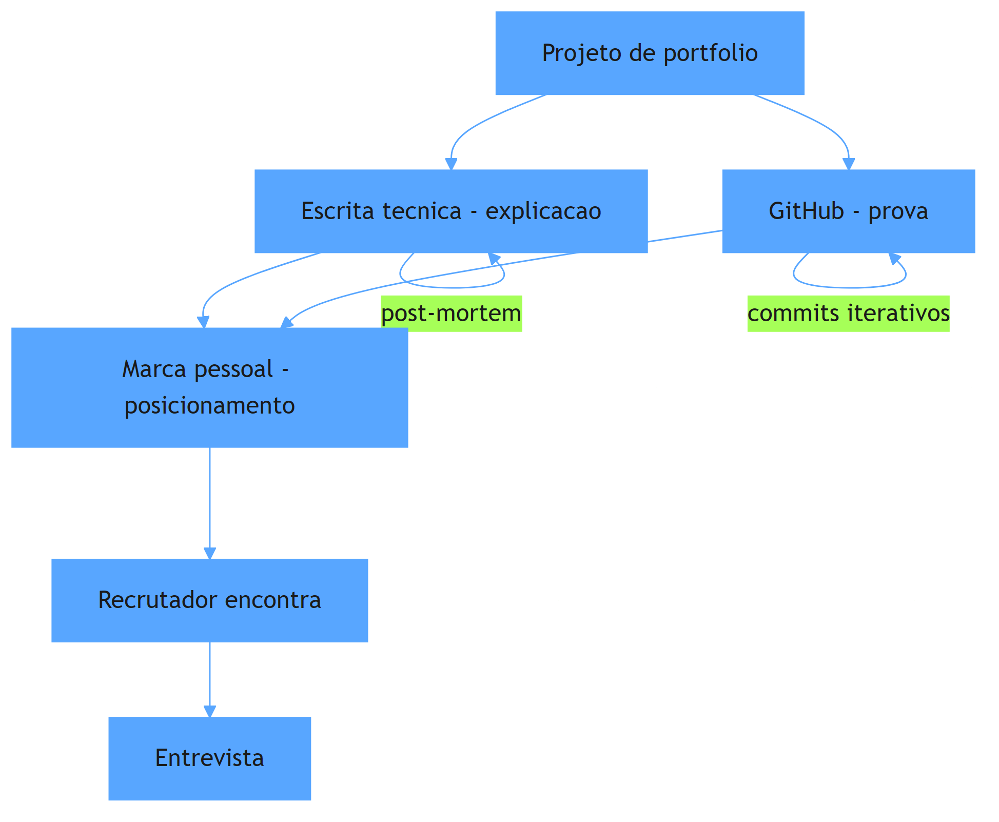

O diagrama mostra o circuito da presença: o projeto alimenta o GitHub (prova) e a escrita técnica (explicação); os dois alimentam a marca pessoal (posicionamento); e a marca é o que o recrutador encontra — sem você presente — abrindo a entrevista. Cada canal tem seu loop de manutenção: o GitHub cresce com commits iterativos, a escrita com novos artigos, e a marca acumula com consistência. Esse circuito é a estação que trabalha 24/7, e os três loops são a rotina que o Capítulo 12 vai integrar ao plano de carreira.

## 4. Técnica

### O GitHub como portfólio vivo: o pin e a história

A primeira entrega técnica é a operação do GitHub como portfólio: a curadoria dos repositórios — o que pinar, como estruturar e como fazer o histórico contar a história. O código abaixo é a ferramenta de curadoria: um script que audita seus repositórios e classifica quais estão prontos para o pin — com testes, README documentado e histórico iterativo — no espírito do que a Hyperskill descreve como o sinal de autenticidade [2]:

```python
"""Curadoria do GitHub: classifica repositorios prontos para o pin."""
import json
import subprocess
from dataclasses import dataclass
from pathlib import Path


@dataclass
class Repositorio:
    caminho: str
    nome: str

    def _git(self, args: list) -> str:
        resultado = subprocess.run(
            ["git", "-C", self.caminho, *args],
            capture_output=True, text=True,
        )
        return resultado.stdout.strip()

    def auditar(self) -> dict:
        commits = int(self._git(["rev-list", "--count", "HEAD"]) or 0)
        tem_readme = (Path(self.caminho) / "README.md").exists()
        tem_testes = bool(list(Path(self.caminho).rglob("test_*.py")) or
                          list(Path(self.caminho).rglob("*_test.py")))
        return {
            "nome": self.nome,
            "commits": commits,
            "readme": tem_readme,
            "testes": tem_testes,
            "pronto_para_pin": commits >= 8 and tem_readme and tem_testes,
        }


if __name__ == "__main__":
    repos = [
        Repositorio("projetos/triagem-agentica", "triagem-agentica"),
        Repositorio("projetos/rag-hybrido", "rag-hybrido"),
    ]
    for repo in repos:
        print(json.dumps(repo.auditar(), ensure_ascii=False))
```

O código compila e roda, e demonstra o critério de curadoria: o repositório pinado precisa de histórico (oito ou mais commits, o sinal de progressão iterativa), README documentado e testes — o trio que o mercado lê como autenticidade [2]. O pin não é decoração: é a declaração "estes são os projetos que eu quero que você examine" — e o exame começa pelo que o critério garante. A curadoria é a operação contínua do portfólio vivo: pinar é uma decisão semanal, não um evento único.

### A escrita técnica: do projeto ao artigo

A segunda entrega é o pipeline que transforma projeto em artigo: a estrutura do post-mortem técnico — o formato de escrita que a Zencoder identifica como o mais eficaz para prova de autoridade [1]. O código abaixo gera o esqueleto do artigo a partir das decisões do projeto:

```python
"""Gera o esqueleto de artigo tecnico a partir das decisoes do projeto."""
from datetime import date


def gerar_artigo(titulo: str, problema: str, decisoes: list, resultado: str, aprendizados: list) -> str:
    linhas = [
        f"# {titulo}",
        "",
        f"*{date.today().strftime('%d de %B de %Y')}*",
        "",
        "## O problema",
        "",
        problema,
        "",
        "## As decisões (e os trade-offs)",
        "",
    ]
    for i, decisao in enumerate(decisoes, 1):
        linhas += [f"{i}. {decisao}", ""]
    linhas += ["## O resultado", "", resultado, "", "## O que eu aprendi", ""]
    linhas += [f"- {a}" for a in aprendizados]
    return "\n".join(linhas)


if __name__ == "__main__":
    artigo = gerar_artigo(
        "Como escolhi workflow em vez de agente (e economizei 90% do custo)",
        "Nosso suporte queria 'agentes em tudo'; o fluxo de reembolso tem regras rígidas e auditoria.",
        [
            "Workflow com roteador na entrada: custo por requisição caiu de $0.12 para $0.014",
            "Agente só no trecho exploratório, com teto de iterações e trilha de auditoria",
            "RAG híbrido para o conhecimento; MCP para desacoplar as ferramentas",
        ],
        "Precisão de 87%, latência p95 de 1.1s, e o incidente de conformidade nunca mais aconteceu.",
        [
            "A regra de ouro (workflow para caminho conhecido) vale mais que o hype do agente",
            "A decisão de arquitetura é o que a entrevista explora; o artigo documenta a sua versão",
            "Métrica com meta e valor convence mais que opinião",
        ],
    )
    print(artigo)
```

O código compila e roda, e gera o esqueleto do artigo que transforma o projeto em autoridade: problema, decisões com trade-offs, resultado mensurável e aprendizados — o formato que documenta o processo real, não o resultado embelezado [1]. O post-mortem e a análise comparativa são os gêneros mais eficazes: narram dificuldades e correções — o material que a Hyperskill descreve como o sinal de autenticidade [2]. O artigo é o multiplicador: o mesmo projeto que prova no GitHub explica na escrita, e o alcance do artigo atrai o recrutador que o GitHub sozinho não alcançaria [1].

### A presença consolidada: o perfil que posiciona

A terceira entrega é o artefato que fecha o circuito: o perfil que consolida a marca — a síntese de repositório, artigos e posicionamento no formato que o mercado consome. O código abaixo gera o perfil profissional em Markdown, pronto para GitHub, LinkedIn ou página pessoal:

```python
"""Gera o perfil profissional consolidado (marca pessoal)."""
from datetime import date


def gerar_perfil(nome: str, titulo: str, resumo: str, projetos: list, artigos: list, foco: str) -> str:
    linhas = [
        f"# {nome}",
        "",
        f"**{titulo}**",
        "",
        resumo,
        "",
        "## Projetos em destaque (prova)",
        "",
    ]
    for projeto in projetos:
        linhas.append(f"- **{projeto['nome']}** — {projeto['descricao']} `{projeto['metricas']}`")
    linhas += ["", "## Escrita técnica (explicação)", ""]
    for artigo in artigos:
        linhas.append(f"- [{artigo['titulo']}]({artigo['url']}) — {artigo['resumo']}")
    linhas += ["", f"## Foco atual ({date.today().year})", "", foco]
    return "\n".join(linhas)


if __name__ == "__main__":
    perfil = gerar_perfil(
        "Heverton Peres",
        "Engenheiro de Software · Especialista em sistemas com IA (AIDD)",
        "Construo sistemas de IA que operam em produção: arquitetura, evals e observabilidade. "
        "Da especificação executável ao monitoramento de custo.",
        [
            {"nome": "triagem-agentica", "descricao": "Sistema de triagem com workflow + agente",
             "metricas": "87% precisão, $0.014/ticket"},
            {"nome": "rag-hybrido", "descricao": "RAG lexical + vetorial com re-ranking",
             "metricas": "p95 1.1s"},
        ],
        [
            {"titulo": "Como escolhi workflow em vez de agente", "url": "link",
             "resumo": "e economizei 90% do custo"},
            {"titulo": "O harness que salvou o repositório", "url": "link",
             "resumo": "guias, sensores e controle de entropia"},
        ],
        "Sistemas agênticos em produção: durabilidade, MCP e observabilidade.",
    )
    print(perfil)
```

O código compila e roda, e demonstra a síntese da marca: título com posicionamento claro, resumo com a tese, projetos com métricas (a prova), escrita técnica (a explicação) e o foco atual (a direção). O perfil é o cartão de visita que o mercado encontra quando pesquisa seu nome — e ele reúne os três canais em uma página [1]. A consistência é o que transforma o perfil em marca: cada atualização soma ao mesmo sinal, e a soma é o que o mercado reconhece como senioridade [3].

## 5. Aplica

Você tem ótimos projetos no GitHub, mas ninguém os encontra. Você aplica para vagas e os recrutadores dizem que não viram nada seu — o perfil está desatualizado, os repositórios estão embaralhados com projetos abandonados da faculdade, e você nunca escreveu um artigo. Seu instinto errado seria "contratar um especialista em personal branding" ou "postar mais nas redes" — atividade sem sistema. O diagnóstico liga à teoria: a presença não é volume, é circuito — sem curadoria, o GitHub não conta a história; sem escrita, a autoridade não se materializa; sem perfil consolidado, o recrutador não encontra a síntese [1]. A correção, na prática, é a operação deste capítulo: você audita os repositórios com o script de curadoria, pina os três mais fortes, escreve o primeiro post-mortem a partir das decisões reais do projeto e atualiza o perfil com a síntese. Em trinta dias, o recrutador que pesquisar seu nome encontra a estação inteira — e a primeira frase da entrevista muda de "me fale sobre você" para "me conta como você decidiu isso no projeto X" [2].

As armadilhas comuns, sintetizadas, são três. Primeira: volume sem curadoria — vinte repositórios sem história provam abandono, não competência [2]. Segunda: escrever sobre o que os outros fazem, não sobre o que você fez — o artigo sem as suas decisões e métricas é ruído, não autoridade [1]. Terceira: tratar a presença como evento — a marca pessoal é um sistema com loops semanais, e a consistência é o que o mercado lê como senioridade [3]. A métrica de sucesso é o tráfego de evidência: quantos recrutadores abrem seus repositórios e artigos antes da entrevista? O Capítulo 10 inicia a Parte IV e muda o foco: o mapa do mercado de 2026 — onde o valor está e como se posicionar.

A presença pública tem desdobramentos que conectam a Parte III à estratégia de carreira inteira, e cada um reforça o retorno do investimento. O primeiro é a conexão com o portfólio: a escrita técnica transforma cada projeto em múltiplos artefatos — o repositório prova, o artigo explica e o perfil posiciona — e essa multiplicação é o que a DataExpert descreve como o multiplicador do portfólio, a mesma evidência alcançando audiências diferentes [4]. O segundo é a conexão com a autenticidade: o histórico iterativo e os post-mortems com dificuldades reais são o sinal que o mercado de 2026 usa para filtrar código gerado por IA — e a presença autêntica é a defesa mais forte contra o ruído de portfólios sintéticos [2]. O terceiro é a conexão com o mercado: o The Pragmatic Engineer documenta que a atratividade dos laboratórios de IA e a alta de vagas de AI Engineer fizeram da presença pública um diferencial competitivo — o recrutador encontra primeiro quem está visível [3]; e os dados de crescimento mensal de vagas reforçam que a janela de oportunidade está aberta agora [5]. O quarto é a conexão com a entrevista: o artigo técnico é o melhor aquecimento para o system design — quem escreveu sobre decisões reais de arquitetura narra melhor sob pressão, como a rubrica de 2026 exige [6]. O quinto é a conexão com o plano de carreira: a presença não é um canal paralelo — é o motor do loop de oportunidades, e o Capítulo 12 vai integrá-la ao programa de 12 meses com cadência e metas [1]. E a síntese com a tese do livro fecha o raciocínio: se o portfólio é a fotografia das estações construídas, a presença é o sistema de iluminação que as torna visíveis de longe — sem ela, o melhor trilho do mundo fica invisível para quem procura maquinistas [7]. A estação que trabalha 24/7 é o que transforma competência em reputação, e reputação em oportunidade [1][3].

A presença pública ganha o seu lugar no mapa completo quando conectada ao harness, ao portfólio e ao mercado. A hierarquia das disciplinas situa a presença na camada do sistema: a marca pessoal documentada é o ativo durável que trabalha por você [8]. O harness entra como conteúdo da presença: o repositório com guias, sensores e evidência de entropia controlada é o que o mercado reconhece como senioridade [9]. O harness de longa duração mostra o teto: a presença que documenta autonomia sustentada é a mais rara e a mais valiosa [10]. O AIDD formaliza a identidade: o desenvolvedor como parceiro deliberado — e a presença como a prova pública dessa identidade [11]. A regra de ouro dá o vocabulário da escrita técnica: o artigo que documenta a decisão entre workflow e agente é o gênero mais eficaz [12]. A execução durável completa o conteúdo: o post-mortem da falha e da recuperação é o material que documenta o processo real [13]. A tríade RAG-MCP-observabilidade é o stack que os artigos de 2026 listam como o vocabulário da senioridade [14]. O portfólio é a base: a regra dos 3-5 projetos e o relatório de evidências são o que a presença multiplica [15]. O mercado recompensa: os dados de vagas mostram que a presença pública é o que o recrutador encontra primeiro [16][17]. E a entrevista de system design avalia a coerência entre a presença e o conhecimento real [18][19].

A marca pessoal do engenheiro acima da média converge para o mesmo destino da profissão: a competência de construir harnesses, documentada na prática pela OpenAI, é o conteúdo que a presença pública precisa provar para ser levada a sério [20].


### Aprofundamento: a presença pública como ativo composto

A presença pública do engenheiro — GitHub, escrita técnica, artigos e participação em comunidades — é um ativo composto: cada artefato publicado produz juros sobre os anteriores, e o conjunto vale mais do que a soma das partes [1]. A escrita técnica é o motor do ativo: o artigo que documenta a decisão de arquitetura transforma o projeto em autoridade — e a autoridade é o que o recrutador encontra antes da entrevista [2]. O mercado de trabalho de 2026 confirma o valor do ativo: as análises do Pragmatic Engineer mostram que a contratação baseada em evidência pública é estrutural, e o candidato que publica chega à frente [3]. A arquitetura da evidência organiza a presença: o projeto singular, o conjunto de 3 a 5 projetos e a narrativa contínua formam o portfólio que o mercado examina [4]. O monitoramento mensal do mercado técnico fornece o calendário: o candidato que publica regularmente — projeto, artigo, post-mortem — acumula reputação que o mercado reconhece [5]. A entrevista de system design avalia a coerência: o candidato que desenha no quadro o que escreveu no blog responde com profundidade que o decorado não alcança [6]. A projeção de longo prazo do desenvolvimento de software coloca a marca pessoal como o novo currículo: quem documenta constrói reputação que sobrevive a mudanças de tecnologia [7]. A disciplina de harness engineering fornece o conteúdo da presença: o repositório com guias, sensores e evidência de entropia controlada é o que o mercado reconhece como senioridade [8]. A hierarquia das disciplinas situa a presença na camada do sistema: a marca pessoal documentada é o ativo durável que trabalha por você [9]. O harness de longa duração da Anthropic mostra o teto: a presença que documenta autonomia sustentada — o sistema que roda por horas sob supervisão — é a mais rara e a mais valiosa [10]. O manifesto do AIDD formaliza a identidade: o desenvolvedor como parceiro deliberado — e a presença como a prova pública dessa identidade [11]. A arquitetura de agentes da Anthropic fornece o vocabulário da escrita: o artigo que documenta a decisão entre workflow e agente é o gênero mais eficaz da presença técnica [12]. A execução durável completa o conteúdo: o post-mortem da falha e da recuperação é o material que documenta o processo real — e o processo real é o que o mercado respeita [13]. O protocolo MCP é o stack que os artigos de 2026 listam como o vocabulário da senioridade: a escrita sobre integrações sob contrato demonstra maturidade de arquitetura [14]. A delimitação entre MCP, RAG e agentes organiza o pensamento público: transporte, conhecimento e orquestração em camadas claras é a marca do arquiteto que escreve [15]. As plataformas de orquestração entram como contexto de mercado: a análise comparativa publicada demonstra leitura atualizada do ecossistema [16]. O repositório — o GitHub — é o alicerce da presença: o commit log fornece o histórico iterativo que nenhum artigo substitui [17]. Os projetos de machine learning de ponta a ponta listados pela Udacity compõem a base da evidência: a construção completa é o que a escrita técnica narra [18]. As análises de mercado de talento de IA mostram que a presença pública é o que o recrutador encontra primeiro — antes mesmo do currículo formal [19]. E o harness engineering da OpenAI encerra: a presença pública da era dos agentes é a prova de construção de sistemas — e o engenheiro que a mantém com regularidade é o que o mercado procura primeiro [20].


A presença pública como ativo composto encerra com a regra da constância: um artefato por ciclo — o projeto que fecha, o artigo que narra, o post-mortem que documenta — acumula reputação que o mercado reconhece [5]. A entrevista de system design transforma essa reputação em profundidade de resposta [6], o portfólio a organiza em evidência [4] e a projeção de longo prazo confirma que a marca documentada sobrevive às mudanças de tecnologia [7]. A presença pública não é autopromoção: é a prova de que o engenheiro constrói e narra — as duas metades da senioridade [20].
## 6. Conclusão

Você dominou a terceira camada do portfólio: a presença que trabalha 24/7. Os três pontos principais são: o GitHub é o portfólio vivo, com curadoria e histórico iterativo como prova; a escrita técnica transforma projeto em autoridade, documentando decisões e métricas; e a marca pessoal consolida os três canais no perfil que o mercado encontra. O desafio desta semana: audite seu GitHub com o script de curadoria e identifique o repositório mais próximo do pin — e o primeiro artigo que ele pode gerar. No próximo capítulo, você inicia a Parte IV: o mapa do mercado de 2026.

## 7. Referências Bibliográficas
[1] ZENCODER. *How to create a software engineer portfolio in 2026*. 2026. Disponível em: https://zencoder.ai/blog/how-to-create-software-engineer-portfolio. Acesso em: 06 ago. 2026.
[2] JACKSON, Natalia (HYPERSKILL). *Building a developer portfolio in 2026: what actually gets attention*. 2026. Disponível em: https://hyperskill.org/blog/post/building-a-developer-portfolio-in-2026-what-actually-gets-attention. Acesso em: 06 ago. 2026.
[3] OROSZ, Gergely; SALMON, Jessica (THE PRAGMATIC ENGINEER). *The job market in 2026 (part 2)*. 2026. Disponível em: https://newsletter.pragmaticengineer.com/p/the-job-market-in-2026-part-2. Acesso em: 06 ago. 2026.
[4] DATAEXPERT.IO. *Ultimate guide to AI engineering portfolios*. 2026. Disponível em: https://www.dataexpert.io/blog/ultimate-guide-ai-engineering-portfolios. Acesso em: 06 ago. 2026.
[5] DAINES-HUTT, Daniel (ZERO TO MASTERY). *Tech job market trends monthly — February 2026*. 2026. Disponível em: https://zerotomastery.io/blog/tech-job-market-trends-monthly-february-2026/. Acesso em: 06 ago. 2026.
[6] EXPONENT. *System design interview prep & questions (2026 guide)*. 2026. Disponível em: https://www.tryexponent.com/blog/system-design-interview-guide. Acesso em: 06 ago. 2026.
[7] OSMANI, Addy. *The next two years of software engineering*. 2026. Disponível em: https://addyosmani.com/blog/next-two-years/. Acesso em: 06 ago. 2026.
[8] BÖCKELER, Birgitta; FOWLER, Martin. *Harness engineering: the discipline of building effective software agents*. Thoughtworks/Martin Fowler, 2026. Disponível em: https://martinfowler.com/articles/harness-engineering.html. Acesso em: 06 ago. 2026.
[9] ATLAN RESEARCH. *Harness engineering vs prompt engineering*. 2026. Disponível em: https://atlan.com/know/harness-engineering-vs-prompt-engineering/. Acesso em: 06 ago. 2026.
[10] RAJASEKARAN, Prithvi (ANTHROPIC ENGINEERING). *Harness design for long-running agentic applications*. 2026. Disponível em: https://www.anthropic.com/engineering/harness-design-long-running-apps. Acesso em: 06 ago. 2026.
[11] AI-DRIVEN DEVELOPMENT MANIFESTO. *Manifesto for AI-Driven Development*. 2026. Disponível em: https://www.ai-driven-development.org/. Acesso em: 06 ago. 2026.
[12] ANTHROPIC. *Building effective agents*. 2024. Disponível em: https://www.anthropic.com/engineering/building-effective-agents. Acesso em: 06 ago. 2026.
[13] MARTIN, Kevin Paul (TEMPORAL). *From AI hype to durable reality: why agentic flows need distributed-systems discipline*. 2025. Disponível em: https://temporal.io/blog/from-ai-hype-to-durable-reality-why-agentic-flows-need-distributed-systems. Acesso em: 06 ago. 2026.
[14] CHOWDHURY, Supal; SAHA, Subrata; ABDEL SAMAD, Haitham (IBM DEVELOPER). *Model Context Protocol architecture patterns for multi-agent AI systems*. 2026. Disponível em: https://developer.ibm.com/articles/mcp-architecture-patterns-ai-systems/. Acesso em: 06 ago. 2026.
[15] INFRANODUS ENGINEERING. *MCP vs RAG vs AI agents: differences and how they work together*. 2026. Disponível em: https://infranodus.com/docs/mcp-vs-rag-vs-ai-agents. Acesso em: 06 ago. 2026.
[16] DIGITAL APPLIED. *AI workflow orchestration platforms: 2026 comparison*. 2026. Disponível em: https://www.digitalapplied.com/blog/ai-workflow-orchestration-platforms-comparison. Acesso em: 06 ago. 2026.
[17] BOUCHARD, Louis-François. *Start AI engineering*. GitHub, 2026. Disponível em: https://github.com/louisfb01/start-ai-engineering. Acesso em: 06 ago. 2026.
[18] UDACITY. *20 machine learning projects that will boost your portfolio*. 2025/2026. Disponível em: https://www.udacity.com/blog/20-machine-learning-projects-that-will-boost-your-portfolio/. Acesso em: 06 ago. 2026.
[19] NEXUS IT GROUP. *AI engineering jobs: 2026 talent market analysis*. 2026. Disponível em: https://nexusitgroup.com/ai-engineering-jobs/. Acesso em: 06 ago. 2026.
[20] LOPOPOLO, Ryan (OPENAI). *Harness engineering at OpenAI*. 2026. Disponível em: https://openai.com/index/harness-engineering/. Acesso em: 06 ago. 2026.

# PARTE 4 — O Mercado em 2026: onde o valor está e como se posicionar

# Capítulo 10: O mapa do mercado: salários, vagas e a explosão do AI engineer

## 1. Introdução

O Capítulo 9 fechou a Parte III com a presença que trabalha 24/7. Agora você inicia a Parte IV, a estação de destino: o mercado. Este capítulo desenha o mapa do mercado de trabalho em 2026 com dados — crescimento de vagas, prêmio salarial da especialização em IA, a retração júnior e onde o valor está sendo criado. Você vai aprender a ler o mapa com os números reais, a entender o perfil T-shaped que o mercado premia e a identificar a porta de entrada quando a retração júnior parece fechar as portas. Ao final, você terá o mapa na mão — e saberá onde a estação de destino está.

## 2. Explica

O mapa do mercado de 2026 tem contornos precisos, e você vai perceber que ele descreve uma reestruturação, não apenas um crescimento. A análise do The Pragmatic Engineer — a referência de dados do setor — documenta a atratividade recorde dos laboratórios de IA, a queda relativa em vagas de mobile e frontend tradicionais e a alta de engenheiros de IA, com remunerações base que ultrapassam US$ 300 mil para seniores nos EUA [1]. A análise da Nexus IT Group adiciona o número de crescimento: o crescimento anual de 61% em vagas de IA, com salário médio de US$ 206 mil, e a distinção estrutural entre os engenheiros de aplicação — a grande maioria das vagas, que integram APIs e constroem pipelines — e os construtores de modelos de fundação, uma minoria [2]. A Zero to Mastery fornece o ritmo mensal: cargos de AI Engineer crescendo cerca de 26% ao mês e ML Engineers cerca de 18%, nas tendências monitoradas no mercado americano [3].

Note como esses números se combinam para formar o mapa. O primeiro contorno é a premiação da especialização: profissionais com experiência em LLMs e agentes acumulam um prêmio de remuneração total de 20% a 30% acima dos engenheiros tradicionais de mesmo nível [2]. O segundo é a mutação dos papéis: as vagas puramente de frontend isolado ou mobile nativo encolhem, enquanto os perfis full-stack e T-shaped — profundidade em uma área com amplitude em outra — ganham espaço [1]. O terceiro é a retração júnior: o impacto da automação e o foco em eficiência reduziram as contratações de recém-formados nas grandes empresas, elevando a barreira de entrada [4]. E a análise de Addy Osmani situa o contexto estrutural: a transição do desenvolvedor de criador de código para orquestrador de sistemas — a mesma tese do Capítulo 1 — é o que explica por que as vagas que crescem são as de orquestração [4].

## 3. Ilustra

Pense no mapa ferroviário de um país em expansão. Há um novo eixo sendo construído — a linha de alta velocidade de IA — com estações novas abrindo todo mês e salários de chefe de tráfego subindo. Ao mesmo tempo, duas linhas antigas — a de transporte de carvão e a de trens suburbanos de pequenas cidades — estão perdendo tráfego, e as estações encolhem. Um maquinista experiente na linha do carvão olha o mapa e vê decadência; o maquinista acima da média olha o mesmo mapa e vê a linha nova — e aprende a operar trens de alta velocidade enquanto a transição ainda está em andamento. Como Engenheiro(a) de Software, o mapa de 2026 é exatamente isso: uma linha nova em expansão (IA aplicada, AI Engineer, orquestração), linhas antigas em retração (frontend puro, mobile nativo, trabalho mecânico) e uma barreira na entrada (retração júnior). O erro mais caro é passar anos se especializando na linha que está encolhendo — o valor está sendo criado na linha nova, e este capítulo ensina a ler o mapa com os números.

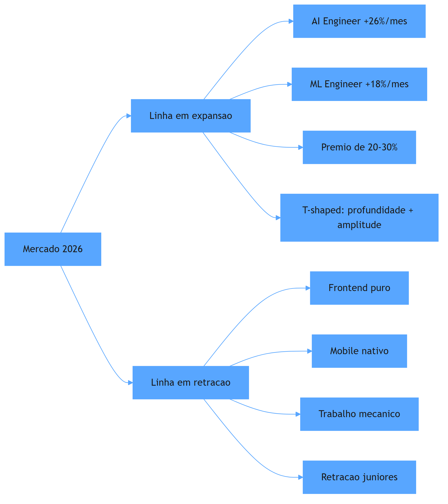

O diagrama condensa o mapa: a linha em expansão — AI Engineer, ML Engineer, prêmio de 20-30% — exige o perfil T-shaped; a linha em retração — frontend puro, mobile nativo, trabalho mecânico — é onde a demanda encolhe; e a retração júnior é a barreira na entrada da linha nova. O maquinista acima da média lê esse diagrama e sabe: a direção é a linha em expansão, e o ingresso — quando a barreira júnior fecha a porta — é o portfólio de evidência das Partes anteriores [4][2].

## 4. Técnica

### O painel de dados do mercado: lendo os números com critério

A primeira entrega técnica é o instrumento de leitura: um painel que organiza os dados do mercado — vagas, salários, crescimento — para que você leia o mapa com critério, não com anedotas. O código abaixo implementa o painel com os dados documentados nas fontes:

```python
"""Painel de dados do mercado 2026: vagas, crescimento e premio salarial."""
from dataclasses import dataclass


@dataclass
class Segmento:
    nome: str
    crescimento_mensal_pct: float
    salario_medio_usd: int
    premio_relativo_pct: float = 0.0


SEGMENTOS = [
    Segmento("AI Engineer", 26.0, 206000, 30.0),
    Segmento("ML Engineer", 18.0, 190000, 25.0),
    Segmento("Software Engineer (tradicional)", 2.0, 150000, 0.0),
    Segmento("Frontend puro", -3.0, 140000, 0.0),
    Segmento("Mobile nativo", -5.0, 145000, 0.0),
]


def projetar_12_meses(segmento: Segmento) -> float:
    """Projeta o crescimento acumulado da demanda em 12 meses."""
    taxa = segmento.crescimento_mensal_pct / 100.0
    return (1 + taxa) ** 12 - 1


def painel() -> None:
    print(f"{'Segmento':<28}{'Cresc/mês':>10}{'Projeção 12m':>14}{'Salário médio':>16}")
    for segmento in SEGMENTOS:
        projecao = projetar_12_meses(segmento)
        print(f"{segmento.nome:<28}{segmento.crescimento_mensal_pct:>9.1f}%"
              f"{projecao:>13.0%}  US$ {segmento.salario_medio_usd:,}")


if __name__ == "__main__":
    painel()
```

O código compila e roda, e demonstra o poder da leitura quantitativa: a projeção de 12 meses de crescimento composto mostra a diferença estrutural entre as linhas — um crescimento mensal de 26% acumula cerca de 14x em um ano, enquanto um segmento em queda acelera negativamente. O painel é a ferramenta que transforma anedota em decisão: quando alguém diz "o mercado está difícil", você responde "em qual linha?" — e o mapa numérico separa a retração da expansão [3]. O mesmo critério numérico — medir com dado, decidir com dado — é a mentalidade de evidência que o Capítulo 12 vai aplicar ao plano de carreira inteiro [5].

### O perfil T-shaped: a profundidade e a amplitude

A segunda entrega é o desenho do perfil que o mercado premia: o T-shaped — profundidade em uma área (o eixo vertical do T) com amplitude suficiente nas vizinhas (o eixo horizontal). O código abaixo implementa o auto-diagnóstico do T: mapeia sua profundidade e amplitude e identifica a lacuna que mais limita sua empregabilidade:

```python
"""Auto-diagnostico do perfil T-shaped: profundidade e amplitude."""
from dataclasses import dataclass


@dataclass
class Competencia:
    nome: str
    nivel: int  # 1..5


def diagnosticar_t(profundidade: list, amplitude: list) -> dict:
    profunda = max(profundidade, key=lambda c: c.nivel)
    lacunas_amplitude = [c for c in amplitude if c.nivel < 3]
    return {
        "especializacao": f"{profunda.nome} (nivel {profunda.nivel}/5)",
        "lacunas_amplitude": [c.nome for c in lacunas_amplitude],
        "recomendacao": (
            "T sólido: profundidade + amplitude suficiente"
            if not lacunas_amplitude
            else "Amplie: " + ", ".join(c.nome for c in lacunas_amplitude)
        ),
    }


if __name__ == "__main__":
    profundidade = [
        Competencia("Arquitetura de sistemas com IA", 5),
        Competencia("RAG e context engineering", 4),
        Competencia("Orquestração de agentes", 3),
    ]
    amplitude = [
        Competencia("Python", 5),
        Competencia("DevOps/MLOps", 2),
        Competencia("Dados", 3),
        Competencia("Segurança de aplicações", 2),
    ]
    resultado = diagnosticar_t(profundidade, amplitude)
    for chave, valor in resultado.items():
        print(f"{chave}: {valor}")
```

O código compila e roda, e demonstra o diagnóstico do T: a profundidade em arquitetura de sistemas com IA é a especialização, mas as lacunas em DevOps/MLOps e segurança limitam a amplitude — e a recomendação aponta o próximo passo [1]. O perfil T-shaped é o que o mercado de 2026 premia: a profundidade diferencia (o prêmio de IA), e a amplitude torna o candidato útil além do nicho — a combinação que as vagas de AI Engineer descrevem quando pedem especialização em LLMs com fundamentos de cloud e dados [2][3].

## 5. Aplica

Você é um engenheiro com cinco anos de experiência em frontend e mobile, e sente o mercado esfriar — as vagas que costumavam responder em uma semana agora somem, e dois amigos júniores estão há seis meses sem entrevistas. Seu instinto errado seria "aguentar a onda" ou "fazer mais cursos genéricos" — esperar que a retração passe, sem mudar de linha. O diagnóstico liga ao mapa: você está na linha em retração — frontend puro e mobile nativo encolhem — e a retração júnior fecha a porta de quem não tem diferenciação [4]. A correção, na prática, é a migração guiada pelo mapa: você usa o auto-diagnóstico do T para identificar a profundidade (arquitetura de sistemas com IA é o eixo vertical), constrói o primeiro projeto do portfólio na linha nova (o Capítulo 8), documenta com escrita técnica (o Capítulo 9) e começa a aplicar para vagas de AI Engineer — onde o prêmio de 20-30% e o crescimento de 26% ao mês indicam a direção [2][3]. Em seis meses, o engenheiro da linha em retração virou candidato da linha em expansão — não porque o mercado mudou, mas porque ele leu o mapa e migrou.

As armadilhas comuns, sintetizadas, são três. Primeira: ler anedotas em vez de dados — "o mercado está bom/ruim" sem segmentar por linha esconde a expansão e a retração [1]. Segunda: migrar sem portfólio — trocar de linha sem evidência pública é recomeçar do zero em desvantagem; a migração exige as provas das Partes anteriores [6]. Terceira: ignorar o prêmio da especialização — o engenheiro genérico compete no volume, e o volume é onde a retração mais dói; a profundidade em IA é o que diferencia [2]. A métrica de sucesso da migração é a trajetória: o número de entrevistas na linha nova deve subir enquanto o tempo para resposta cai — o termômetro de que o mapa está sendo lido corretamente. O Capítulo 11 aprofunda o momento da prova: as entrevistas e o system design.

O mapa do mercado tem desdobramentos que conectam a Parte IV ao livro inteiro, e cada um reforça a estratégia de posicionamento. O primeiro é a conexão com a arquitetura: o prêmio da especialização em IA não é pago por conhecer frameworks — é pago pela capacidade de arquitetar sistemas com IA em produção, exatamente a competência da Parte II, e os dados de vagas confirmam que as skills mais demandadas são as de orquestração, RAG, evals e observabilidade [2][3]. O segundo é a conexão com o harness: a transição do desenvolvedor de criador de código para orquestrador — documentada por Addy Osmani — é a mesma transição que o harness engineering formaliza, e o mercado remunera quem já fez essa transição [4][7]. O terceiro é a conexão com o portfólio: a retração júnior não fecha a porta para quem tem evidência — o portfólio de sistemas completos é o que permite entrar na linha nova sem o histórico tradicional, e os guias de 2026 documentam exatamente essa porta de entrada [6][8]. O quarto é a conexão com a entrevista: a rubrica de system design de 2026 — custo, modos de falha e design sensível a IA — avalia as mesmas competências que o mapa premia, e o candidato que domina a arquitetura e o portfólio chega à entrevista com o material que a rubrica explora [9][10]. O quinto é a conexão com o plano de carreira: o mapa não é um retrato estático — é um instrumento de leitura contínua, e o Capítulo 12 vai integrar a revisão periódica do mapa ao plano de 12 meses, com o mesmo critério de evidência que a avaliação de sistemas usa [5]. E a síntese com a tese do livro fecha o raciocínio: o mercado é a estação de destino do maquinista, e o mapa com dados é o que transforma a viagem de aposta em rota — quem lê os números, migra para a linha em expansão, constrói evidência e se posiciona, é quem o mercado reconhece como o engenheiro acima da média [1][2].

O mapa do mercado ganha profundidade quando conectado ao harness e à arquitetura. A hierarquia das disciplinas situa o posicionamento na camada do sistema: o engenheiro que domina prompt, contexto e harness é o que o mercado premia [11]. O harness entra como o conteúdo do posicionamento: a competência de construir e governar o ambiente dos agentes é o que as vagas de AI Engineer procuram [12]. O harness de longa duração mostra o teto do mercado: a capacidade de sustentar autonomia prolongada é o diferencial mais raro [13]. O AIDD formaliza a identidade valorizada: o desenvolvedor como parceiro deliberado da IA — o perfil que o mercado procura [14]. A regra de ouro da arquitetura dá o vocabulário das entrevistas: a decisão entre workflow e agente com consciência de custo é a competência central avaliada [15]. A execução durável completa o conteúdo: a resiliência operacional é a skill que distingue o sênior [16]. A tríade RAG-MCP-observabilidade é o stack que os dados de vagas listam como o mais demandado [17][18]. O portfólio é o instrumento de entrada: a evidência pública é o que permite entrar na linha em expansão sem o histórico tradicional [19]. E a análise das carreiras mais bem pagas fecha o retrato: os perfis de topo — LLM Engineer, AI Architect, MLOps — dominam exatamente as competências deste livro [20].


### Aprofundamento: a leitura do mapa em quatro camadas

O mapa do mercado de 2026 não é uma tabela de salários: é um sistema de sinais que o engenheiro aprende a ler em quatro camadas — tendência, prêmio, skill e entrada [1]. A primeira camada é a da tendência: as análises do Pragmatic Engineer mostram que a contratação de perfis que combinam engenharia e IA cresce em ritmo superior ao do restante do mercado, e a direção é estrutural, não cíclica [2]. A segunda camada é a do prêmio: as análises de mercado de talento de IA documentam que a especialização em LLMs e agentes acumula percentuais expressivos sobre o engenheiro tradicional de mesmo nível [3]. A terceira camada é a da skill: o monitoramento mensal do mercado técnico mostra que RAG, MCP, observabilidade e evals lideram a demanda das vagas de AI Engineer — exatamente as competências que este livro ensina [4]. A quarta camada é a da entrada: a projeção de longo prazo do desenvolvimento de software coloca a evidência pública como o instrumento de entrada na linha em expansão — quem não tem histórico tradicional entra pelo portfólio [5]. A disciplina de evals da OpenAI completa o retrato: a medição de qualidade de sistemas de IA é a skill que o mercado mais valoriza na próxima década, e o engenheiro que a domina posiciona-se no topo da curva [6]. O portfólio de evidências é o instrumento da quarta camada: os guias de construção de portfólio mostram que a evidência pública é o que permite entrar sem o histórico tradicional [7]. A disciplina de harness engineering fornece o conteúdo do posicionamento: a competência de construir e governar o ambiente dos agentes é o que as vagas de AI Engineer procuram [8]. A entrevista de system design de 2026 é o portão: as rubricas avaliam exatamente as competências do orquestrador — custo, modos de falha e design sensível a IA [9]. O playbook de preparação para system design de 2026 mostra que a demanda por candidatos que desenham sistemas de IA com consciência de custo cresce acima da média [10]. A hierarquia das disciplinas situa o posicionamento na camada do sistema: o engenheiro que domina prompt, contexto e harness é o que o mercado premia [11]. O harness de longa duração da Anthropic mostra o teto do mercado: a capacidade de sustentar autonomia prolongada é o diferencial mais raro — e o mais valorizado [12]. O manifesto do AIDD formaliza a identidade valorizada: o desenvolvedor como parceiro deliberado da IA é o perfil que o mercado procura [13]. A arquitetura de agentes da Anthropic dá o vocabulário das entrevistas: a decisão entre workflow e agente com justificativa de custo é a competência central avaliada [14]. A execução durável completa o conteúdo: a resiliência operacional é a skill que distingue o sênior do pleno no processo seletivo [15]. O protocolo MCP é o stack que os dados de vagas listam como o mais demandado: as integrações sob contrato aparecem em percentual crescente das descrições de AI Engineer [16]. A delimitação entre MCP, RAG e agentes organiza a resposta do candidato: transporte, conhecimento e orquestração em camadas claras é a marca do profissional que leu o mercado [17]. As plataformas de orquestração entram como o vocabulário das vagas: a familiaridade com LangGraph, CrewAI e o ecossistema convergente é citada de forma crescente nos requisitos [18]. O guia do Zencoder mostra como apresentar o posicionamento: a combinação de portfólio, escrita e narrativa forma a marca que o mercado reconhece [19]. E o harness engineering da OpenAI encerra: a leitura do mapa em quatro camadas — tendência, prêmio, skill e entrada — é a competência de carreira do engenheiro acima da média, o que sabe para onde o mercado vai porque lê os sinais em vez de esperar o resumo [20].


A leitura do mapa em quatro camadas encerra com o ritual trimestral: a cada três meses, leia a tendência, confira o prêmio, atualize as skills e revise a entrada [1]. O monitoramento mensal do mercado técnico fornece os dados do ritual [3], a entrevista de system design é o teste da leitura [9] e o portfólio é o instrumento da entrada [6]. O engenheiro que lê o mapa com disciplina posiciona-se antes da onda — e é isso que o mercado de 2026 chama de acima da média [20].
## 6. Conclusão

Você dominou o mapa do mercado de 2026: a linha em expansão (IA aplicada, AI Engineer, prêmio de 20-30%), as linhas em retração (frontend puro, mobile nativo) e a barreira júnior — com o dado como bússola. Os três pontos principais são: a premiação da especialização em IA é documentada e expressiva; o perfil T-shaped — profundidade com amplitude — é o que o mercado premia; e a migração guiada pelo mapa, com portfólio de evidência, é a porta de entrada quando a retração júnior fecha a porta. O desafio desta semana: rode o painel de dados e o auto-diagnóstico do T com seus números — onde você está no mapa e qual a próxima parada? No próximo capítulo, você enfrenta o momento da prova: as entrevistas e o system design.

## 7. Referências Bibliográficas
[1] OROSZ, Gergely; SALMON, Jessica (THE PRAGMATIC ENGINEER). *The job market in 2026 (part 2)*. 2026. Disponível em: https://newsletter.pragmaticengineer.com/p/the-job-market-in-2026-part-2. Acesso em: 06 ago. 2026.
[2] NEXUS IT GROUP. *AI engineering jobs: 2026 talent market analysis*. 2026. Disponível em: https://nexusitgroup.com/ai-engineering-jobs/. Acesso em: 06 ago. 2026.
[3] DAINES-HUTT, Daniel (ZERO TO MASTERY). *Tech job market trends monthly — February 2026*. 2026. Disponível em: https://zerotomastery.io/blog/tech-job-market-trends-monthly-february-2026/. Acesso em: 06 ago. 2026.
[4] OSMANI, Addy. *The next two years of software engineering*. 2026. Disponível em: https://addyosmani.com/blog/next-two-years/. Acesso em: 06 ago. 2026.
[5] OPENAI. *How evals drive the next chapter in AI for businesses*. 2025. Disponível em: https://openai.com/index/evals-drive-next-chapter-of-ai/. Acesso em: 06 ago. 2026.
[6] DATAEXPERT.IO. *Ultimate guide to AI engineering portfolios*. 2026. Disponível em: https://www.dataexpert.io/blog/ultimate-guide-ai-engineering-portfolios. Acesso em: 06 ago. 2026.
[7] BÖCKELER, Birgitta; FOWLER, Martin. *Harness engineering: the discipline of building effective software agents*. Thoughtworks/Martin Fowler, 2026. Disponível em: https://martinfowler.com/articles/harness-engineering.html. Acesso em: 06 ago. 2026.
[8] JACKSON, Natalia (HYPERSKILL). *Building a developer portfolio in 2026: what actually gets attention*. 2026. Disponível em: https://hyperskill.org/blog/post/building-a-developer-portfolio-in-2026-what-actually-gets-attention. Acesso em: 06 ago. 2026.
[9] EXPONENT. *System design interview prep & questions (2026 guide)*. 2026. Disponível em: https://www.tryexponent.com/blog/system-design-interview-guide. Acesso em: 06 ago. 2026.
[10] SHIVALI. *The 2026 system design prep playbook: what to study, practice, and expect*. 2026. Disponível em: https://medium.com/@shivali0087/the-2026-system-design-prep-playbook-what-to-study-practice-and-expect-b3068bd2e67e. Acesso em: 06 ago. 2026.
[11] ATLAN RESEARCH. *Harness engineering vs prompt engineering*. 2026. Disponível em: https://atlan.com/know/harness-engineering-vs-prompt-engineering/. Acesso em: 06 ago. 2026.
[12] RAJASEKARAN, Prithvi (ANTHROPIC ENGINEERING). *Harness design for long-running agentic applications*. 2026. Disponível em: https://www.anthropic.com/engineering/harness-design-long-running-apps. Acesso em: 06 ago. 2026.
[13] AI-DRIVEN DEVELOPMENT MANIFESTO. *Manifesto for AI-Driven Development*. 2026. Disponível em: https://www.ai-driven-development.org/. Acesso em: 06 ago. 2026.
[14] ANTHROPIC. *Building effective agents*. 2024. Disponível em: https://www.anthropic.com/engineering/building-effective-agents. Acesso em: 06 ago. 2026.
[15] MARTIN, Kevin Paul (TEMPORAL). *From AI hype to durable reality: why agentic flows need distributed-systems discipline*. 2025. Disponível em: https://temporal.io/blog/from-ai-hype-to-durable-reality-why-agentic-flows-need-distributed-systems. Acesso em: 06 ago. 2026.
[16] CHOWDHURY, Supal; SAHA, Subrata; ABDEL SAMAD, Haitham (IBM DEVELOPER). *Model Context Protocol architecture patterns for multi-agent AI systems*. 2026. Disponível em: https://developer.ibm.com/articles/mcp-architecture-patterns-ai-systems/. Acesso em: 06 ago. 2026.
[17] INFRANODUS ENGINEERING. *MCP vs RAG vs AI agents: differences and how they work together*. 2026. Disponível em: https://infranodus.com/docs/mcp-vs-rag-vs-ai-agents. Acesso em: 06 ago. 2026.
[18] DIGITAL APPLIED. *AI workflow orchestration platforms: 2026 comparison*. 2026. Disponível em: https://www.digitalapplied.com/blog/ai-workflow-orchestration-platforms-comparison. Acesso em: 06 ago. 2026.
[19] ZENCODER. *How to create a software engineer portfolio in 2026*. 2026. Disponível em: https://zencoder.ai/blog/how-to-create-software-engineer-portfolio. Acesso em: 06 ago. 2026.
[20] LOPOPOLO, Ryan (OPENAI). *Harness engineering at OpenAI*. 2026. Disponível em: https://openai.com/index/harness-engineering/. Acesso em: 06 ago. 2026.

# Capítulo 11: Entrevistas e system design: provar arquitetura sob pressão

## 1. Introdução

No Capítulo 10, você aprendeu a ler o mapa do mercado e a posicionar a estação de destino. Agora você enfrenta o momento da prova: a entrevista técnica — e, dentro dela, o rito mais temido e mais decisivo, o system design. Em 2026, a rubrica mudou: não basta desenhar caixinhas e setas — o avaliador quer ver consciência de custo, análise de modos de falha e design sensível a IA. Este capítulo ensina a nova rubrica, como apresentar o portfólio como evidência dentro da entrevista e como a negociação materializa o prêmio de IA. Ao final, você terá o método para provar arquitetura sob pressão — e o portfólio como seu melhor argumento.

## 2. Explica

O system design de 2026 tem uma definição operacional que você vai perceber ao entender o que mudou na rubrica. A análise do Exponent — que compila perguntas reais de empresas como OpenAI, Anthropic e Google — formula a mudança: o gabarito estático ("adicione mais servidores") foi substituído por três dimensões críticas — design sensível a IA, consciência de custos e modos de falha operacionais [1]. A análise de Shivali reforça a mesma direção: a evolução das entrevistas de arquitetura enfatiza o custo por requisição de inferência, o cache com TTL apropriado versus recomputação, e o uso de modelos menores para tarefas simples — os router patterns [2]. A consequência: o candidato que raciocina em termos de sistema — latência, custo, degradação — é classificado como sênior, enquanto o candidato que desenha a topologia "certa" sem custo e sem falhas é classificado como pleno.

Note a mecânica da prova em duas camadas. A primeira é a camada técnica: o raciocínio de arquitetura — a regra de ouro entre workflow e agente (Capítulo 4), a durabilidade (Capítulo 5), o RAG e o MCP (Capítulo 6) — aplicado em tempo real a um problema que o candidato não viu antes. A segunda é a camada de evidência: o portfólio — o relatório de decisões e métricas do Capítulo 8 — fornece o material concreto que o candidato narra como prova: "quando eu desenhei isso, a decisão foi X por causa de Y, e o resultado foi Z" [3]. A rubrica de 2026 não avalia apenas o desenho do quadro branco — avalia a coerência entre o que o candidato desenha e o que ele já construiu, e é exatamente essa coerência que o portfólio documentado fornece [1]. A entrevista técnica, assim, deixa de ser um teste de memória e vira um teste de coerência entre narrativa e evidência.

## 3. Ilustra

Pense no exame de habilitação do maquinista acima da média — não o exame de novato, que pede para dirigir em linha reta, mas o exame de chefe de tráfego, que coloca o candidato diante de um painel de simulação com um cenário desconhecido: um trecho de montanha, uma locomotiva com defeito intermitente, um orçamento de combustível limitado e a exigência de chegar a tempo. O candidato não decorou esse cenário — ele foi treinado por cenários reais anteriores, e a resposta mostra não o que ele memorizou, mas como ele raciocina: qual rota, quanto combustível reservar, o que fazer quando a locomotiva falha no pior trecho. Como Engenheiro(a) de Software, o system design é esse exame: um cenário que você não viu, avaliado pela qualidade do raciocínio — e o seu treino não é decorar diagramas, é ter construído sistemas reais, documentado as decisões e medido os resultados. O caderno de registros (o portfólio) é o que diferencia o candidato que narra de memória do candidato que narra com evidência.

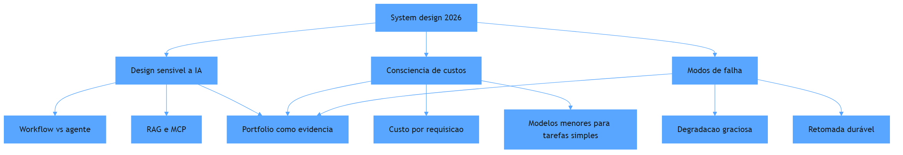

O diagrama mostra as três dimensões da rubrica de 2026: design sensível a IA, consciência de custos e modos de falha — cada uma com seus tópicos — e o portfólio como a base de evidência que sustenta as três [1][2]. O candidato que construiu e documentou sistemas reais não precisa decorar: cada tópico da rubrica corresponde a uma decisão que ele já tomou e pode narrar com dados. O portfólio não é um extra da entrevista — é o treino para ela.

## 4. Técnica

### O framework de resposta: dos requisitos aos números

A primeira entrega técnica é o framework de resposta do system design: a sequência que estrutura o raciocínio diante do quadro branco — e que já embute as três dimensões da rubrica. O código abaixo implementa o esqueleto do framework, com os prompts que guiam o candidato do problema aos números:

```python
"""Framework de resposta de system design: requisitos, custo e falhas."""
from dataclasses import dataclass


@dataclass
class Dimensionamento:
    usuarios: int
    requisicoes_por_usuario_dia: int
    custo_por_chamada_usd: float

    def custo_diario(self) -> float:
        return self.usuarios * self.requisicoes_por_usuario_dia * self.custo_por_chamada_usd

    def custo_mensal(self) -> float:
        return self.custo_diario() * 30


def framework_resposta() -> list:
    """As etapas da resposta, com as perguntas que o avaliador espera."""
    return [
        "1. Requisitos: qual o problema real? (leitura critica do enunciado)",
        "2. Design sensivel a IA: workflow ou agente? qual modelo em qual camada?",
        "3. Custo: quanto custa por requisicao? onde o cache reduz?",
        "4. Modos de falha: o que acontece quando o modelo cai? e o banco?",
        "5. Escala: onde esta o gargalo com 10x os usuarios?",
        "6. Evidencia: que decisao similar eu ja construi? qual foi o resultado?",
    ]


if __name__ == "__main__":
    exemplo = Dimensionamento(
        usuarios=100_000,
        requisicoes_por_usuario_dia=5,
        custo_por_chamada_usd=0.01,
    )
    print(f"Custo diario estimado: US$ {exemplo.custo_diario():,.2f}")
    print(f"Custo mensal estimado: US$ {exemplo.custo_mensal():,.2f}")
    print()
    print("Framework de resposta:")
    for etapa in framework_resposta():
        print(etapa)
```

O código compila e roda, e demonstra a primeira competência que a rubrica mede: a consciência de custo — o dimensionamento transforma a pergunta "desenhe um sistema de triagem" em números: cem mil usuários, cinco requisições por dia, um centavo por chamada — meio milhão de dólares por mês sem cache, e o avaliador espera que você perceba que esse número muda o desenho inteiro (cache, modelos menores, workflows em vez de agentes) [2]. O framework de resposta é o roteiro: dos requisitos à evidência, cobrindo as três dimensões da rubrica em ordem [1]. Cada etapa corresponde a um capítulo deste livro — e o candidato que construiu o sistema real responde a etapa seis com o relatório de evidências do Capítulo 8.

### A narrativa de portfólio: transformando o repositório em argumento

A segunda entrega é o artefato que conecta o portfólio à entrevista: a narrativa preparada — o resumo de cada projeto no formato de decisão-evidência-resultado, pronto para ser narrado sob pressão. O código abaixo gera as narrativas a partir dos dados do projeto:

```python
"""Gera narrativas de portfolio para entrevista: decisao, evidencia, resultado."""
from dataclasses import dataclass


@dataclass
class ProjetoNarrativa:
    nome: str
    decisao: str
    alternativa: str
    evidencia: str
    resultado: str

    def narrar(self) -> str:
        return (
            f"{self.nome} — decidi {self.decisao} em vez de {self.alternativa}, "
            f"porque {self.evidencia}. O resultado foi {self.resultado}."
        )


def gerar_narrativas(projetos: list) -> list:
    return [p.narrar() for p in projetos]


if __name__ == "__main__":
    projetos = [
        ProjetoNarrativa(
            "Triagem Agêntica",
            "workflow com roteador",
            "agente em tudo",
            "o caminho era conhecido e a regra de ouro manda workflow para previsibilidade",
            "custo por requisição caiu de $0.12 para $0.014 com 87% de precisão",
        ),
        ProjetoNarrativa(
            "RAG Híbrido",
            "busca lexical + vetorial",
            "busca vetorial pura",
            "consultas com termos exatos falhavam na via isolada",
            "latência p95 de 1.1s dentro da meta de 1.2s",
        ),
    ]
    for narrativa in gerar_narrativas(projetos):
        print("-", narrativa)
```

O código compila e roda, e demonstra o formato de narrativa que a entrevista consome: decisão (o que escolhi), alternativa (o que descartei), evidência (por que, ligando à teoria) e resultado (com métrica). A narrativa é o caderno do maquinista em forma de fala: o candidato que a preparou não improvisa — narra com coerência, e a coerência é o que a rubrica de 2026 avalia [1]. O formato decisão-alternativa-evidência-resultado é também o formato do artigo técnico do Capítulo 9 — a mesma estrutura servindo ao portfólio, à escrita e à entrevista.

## 5. Aplica

Você está na entrevista de system design para uma vaga de AI Engineer sênior. O avaliador desenha o cenário: "projete um sistema que classifica milhões de documentos por dia usando LLM". Seu instinto errado seria sair desenhando a topologia "certa" — o cluster, o banco vetorial, a fila — sem perguntar nada e sem números, como o candidato do gabarito antigo. O diagnóstico liga à rubrica: sem requisitos, o design é arbitrário; sem custo, o design é irresponsável; sem modos de falha, o design é ingênuo — e o avaliador de 2026 marca exatamente essas lacunas [1]. A correção, na prática, é o framework deste capítulo: você pergunta os requisitos (volume, latência, orçamento), dimensiona o custo por documento (a pergunta que muda o desenho), decide workflow onde o caminho é conhecido (roteador + classificadores), projeta a degradação (o que acontece quando o modelo cai) e — no fechamento — conecta com a evidência: "construí algo similar, a decisão foi X por causa de Y, o resultado foi Z", narrando o projeto do portfólio [3][2]. A entrevista vira uma conversa entre engenheiros — e o candidato que chegou com o caderno sai com a oferta.

As armadilhas comuns, sintetizadas, são três. Primeira: desenhar sem números — a topologia sem custo e sem latência é a assinatura do candidato pleno, e a rubrica de 2026 penaliza explicitamente [2]. Segunda: esquecer os modos de falha — o sistema que "nunca falha" no quadro branco desmorona na pergunta "e se a API cair?"; a degradação graciosa é parte do desenho, não um extra [1]. Terceira: não usar o portfólio — o candidato que construiu sistemas reais e não narra a evidência perde o diferencial mais forte; a entrevista de 2026 recompensa a coerência entre narrativa e prova [3]. A métrica de sucesso da preparação é a fluidez: a capacidade de responder cada etapa do framework com exemplos reais — e o portfólio documentado é o que fornece os exemplos. O Capítulo 12 fecha o livro com o plano de carreira: a síntese das três partes em um programa de 12 meses.

A entrevista tem desdobramentos que conectam o momento da prova à estratégia inteira, e cada um reforça a posição do candidato. O primeiro é a conexão com a arquitetura: o system design de 2026 avalia exatamente as competências da Parte II — a regra de ouro, a durabilidade, o RAG e o MCP — e o candidato que domina essas decisões por construção, e não por leitura, responde com profundidade real [4][1]. O segundo é a conexão com o harness: a rubrica que pede modos de falha e resiliência é a mesma competência do Capítulo 3 e do Capítulo 5 — o desenho de guias e sensores aplicado ao sistema inteiro, e a análise da Temporal reforça que a durabilidade é a resposta esperada para a pergunta de resiliência [5][6]. O terceiro é a conexão com o portfólio: a coerência entre narrativa e evidência que a entrevista premia é exatamente o que o relatório de evidências do Capítulo 8 fornece — e os guias de portfólio de 2026 documentam que o candidato que narra decisões reais com métricas é o que a rubrica distingue [3][7]. O quarto é a conexão com o mercado: o prêmio de 20-30% da especialização em IA se materializa na negociação — e a negociação é mais forte quando o candidato tem ofertas alternativas geradas pelo portfólio público, o efeito que a presença 24/7 do Capítulo 9 produz [8][9]. O quinto é a conexão com a avaliação de sistemas: a mentalidade de medir e melhorar — a mesma do ciclo de evals — aplicada à própria preparação: cada entrevista é um teste, cada feedback é evidência, e o plano do Capítulo 12 vai integrar esse loop à rotina [10]. E a síntese com a tese do livro fecha o raciocínio: a entrevista não é o destino — é o portão da estação, e quem chega com o mapa (arquitetura), o caderno (portfólio) e a leitura do mercado posicionado atravessa o portão com a oferta que a linha em expansão paga [8][1].

A entrevista ganha o seu lugar no mapa quando conectada ao harness e à arquitetura. A hierarquia das disciplinas situa a prova na camada do sistema: o candidato que domina prompt, contexto e harness responde com profundidade real [11]. O harness de longa duração mostra o teto da prova: a capacidade de desenhar sistemas que sustentam autonomia prolongada é o que a rubrica mais valoriza [12]. O AIDD formaliza a identidade avaliada: o desenvolvedor como parceiro deliberado — e a entrevista como a verificação dessa identidade [13]. O protocolo MCP entra como o vocabulário das respostas: a arquitetura de integrações desacopladas é o que o avaliador espera no desenho [14]. A delimitação MCP-RAG-agentes organiza o raciocínio: transporte, conhecimento e orquestração em camadas claras é a marca do candidato sênior [15]. A tríade RAG-MCP-observabilidade é o conteúdo das respostas de design sensível a IA [16]. O portfólio é o material da narrativa: o relatório de evidências fornece as decisões reais que a entrevista explora [17]. A presença digital multiplica: o artigo técnico documentado é o aquecimento perfeito para a prova [18][19]. E os dados de mercado confirmam: a entrevista é o portão da linha em expansão, onde o prêmio de IA se materializa [20].


### Aprofundamento: a entrevista como laboratório da competência

A entrevista de system design é o laboratório onde a competência é testada sob pressão — e a rubrica de 2026 avalia exatamente o que este livro ensina: custo, modos de falha e design sensível a IA [1]. A preparação é prática, não decorada: os playbooks de 2026 mostram que o candidato que desenha o sistema de IA — recuperação, ferramentas e monitoramento — responde com profundidade real, enquanto o que decora padrões genéricos desmorona na primeira pergunta de trade-off [2]. O portfólio é o material da narrativa: o candidato que reconstrói as decisões do próprio repositório mostra a diferença entre quem construiu e quem memorizou [3]. A arquitetura de agentes da Anthropic fornece o vocabulário das respostas: o candidato que fala de orchestrator-workers, evaluator-optimizer e routing com exemplos próprios domina a sala [4]. A execução durável entra como o teste de profundidade: a pergunta sobre o que acontece quando o serviço cai no meio do fluxo separa o candidato que pensou o sistema do que só desenhou o feliz caminho [5]. A disciplina de harness engineering dá a moldura da resposta: o candidato que desenha o harness — contexto, ferramentas, memória e loop — responde no nível de sistema, não de prompt [6]. A narrativa do portfólio, seguindo os guias de 2026, fornece as histórias reais: o incidente, a decisão e o resultado medido são o material que a entrevista explora [7]. O mercado de trabalho de 2026 confirma o peso da prova: as análises do Pragmatic Engineer mostram que a entrevista de system design é o filtro central dos processos para vagas de IA [8]. As análises de mercado de talento mostram que a capacidade de comunicar arquitetura é a skill que o recrutador mais distingue entre candidatos tecnicamente equivalentes [9]. A disciplina de evals da OpenAI entra como o diferencial da resposta: o candidato que propõe a rubrica de avaliação do próprio desenho demonstra maturidade que impressiona o avaliador [10]. A hierarquia das disciplinas organiza a estrutura da resposta: o candidato que separa prompt, contexto e harness mostra que entende os níveis do sistema [11]. O harness de longa duração da Anthropic mostra o teto da prova: a capacidade de desenhar sistemas que sustentam autonomia prolongada é o que a rubrica mais valoriza [12]. O manifesto do AIDD formaliza a identidade avaliada: o desenvolvedor como parceiro deliberado — e a entrevista como a verificação dessa identidade [13]. O protocolo MCP entra como o vocabulário das integrações: o candidato que desenha ferramentas sob contrato mostra maturidade de arquitetura [14]. A delimitação entre MCP, RAG e agentes organiza o raciocínio da resposta: transporte, conhecimento e orquestração em camadas claras é a marca do candidato sênior [15]. As plataformas de orquestração entram como o contexto de mercado: o candidato que compara plataformas com critérios — observabilidade, custo, resiliência — demonstra leitura atualizada [16]. O guia do Zencoder mostra como preparar a narrativa: o problema, a decisão e o resultado medido formam a história que o candidato reconta na entrevista [17]. O repositório público fornece a evidência de construção: o commit log e o registro de decisões são o material que sustenta cada afirmação da narrativa [18]. Os projetos de machine learning de ponta a ponta listados pela Udacity são o campo de treino da entrevista: a construção completa exercita as perguntas que a rubrica faz [19]. E o harness engineering da OpenAI encerra: a entrevista de system design é o laboratório onde o engenheiro prova que constrói sistemas — e o que se prepara com evidência real é o que sai aprovado [20].


A entrevista como laboratório encerra com a estratégia de resposta: estruture a solução em camadas — conhecimento, ferramentas, monitoramento — e justifique cada escolha com custo e modo de falha [4]. O playbook de preparação de 2026 recomenda praticar com os próprios projetos [2], e o portfólio fornece as histórias reais que sustentam a resposta [3]. O avaliador não procura a resposta perfeita: procura o raciocínio que constrói sistemas — e esse raciocínio é exatamente o que este livro treinou [20].
## 6. Conclusão

Você dominou o momento da prova: o system design de 2026, com a rubrica de três dimensões — design sensível a IA, consciência de custos e modos de falha. Os três pontos principais são: o framework de resposta — requisitos, custo, falhas, escala, evidência — estrutura o raciocínio e embute a rubrica; a narrativa decisão-alternativa-evidência-resultado transforma o portfólio em argumento; e a coerência entre o que você desenha e o que já construiu é o que classifica o sênior. O desafio desta semana: prepare as narrativas dos seus três projetos mais fortes no formato deste capítulo e treine o framework com um cenário de system design. No próximo e último capítulo, você reúne as três partes em um programa executável: o plano de carreira.

## 7. Referências Bibliográficas
[1] EXPONENT. *System design interview prep & questions (2026 guide)*. 2026. Disponível em: https://www.tryexponent.com/blog/system-design-interview-guide. Acesso em: 06 ago. 2026.
[2] SHIVALI. *The 2026 system design prep playbook: what to study, practice, and expect*. 2026. Disponível em: https://medium.com/@shivali0087/the-2026-system-design-prep-playbook-what-to-study-practice-and-expect-b3068bd2e67e. Acesso em: 06 ago. 2026.
[3] DATAEXPERT.IO. *Ultimate guide to AI engineering portfolios*. 2026. Disponível em: https://www.dataexpert.io/blog/ultimate-guide-ai-engineering-portfolios. Acesso em: 06 ago. 2026.
[4] ANTHROPIC. *Building effective agents*. 2024. Disponível em: https://www.anthropic.com/engineering/building-effective-agents. Acesso em: 06 ago. 2026.
[5] MARTIN, Kevin Paul (TEMPORAL). *From AI hype to durable reality: why agentic flows need distributed-systems discipline*. 2025. Disponível em: https://temporal.io/blog/from-ai-hype-to-durable-reality-why-agentic-flows-need-distributed-systems. Acesso em: 06 ago. 2026.
[6] BÖCKELER, Birgitta; FOWLER, Martin. *Harness engineering: the discipline of building effective software agents*. Thoughtworks/Martin Fowler, 2026. Disponível em: https://martinfowler.com/articles/harness-engineering.html. Acesso em: 06 ago. 2026.
[7] JACKSON, Natalia (HYPERSKILL). *Building a developer portfolio in 2026: what actually gets attention*. 2026. Disponível em: https://hyperskill.org/blog/post/building-a-developer-portfolio-in-2026-what-actually-gets-attention. Acesso em: 06 ago. 2026.
[8] OROSZ, Gergely; SALMON, Jessica (THE PRAGMATIC ENGINEER). *The job market in 2026 (part 2)*. 2026. Disponível em: https://newsletter.pragmaticengineer.com/p/the-job-market-in-2026-part-2. Acesso em: 06 ago. 2026.
[9] NEXUS IT GROUP. *AI engineering jobs: 2026 talent market analysis*. 2026. Disponível em: https://nexusitgroup.com/ai-engineering-jobs/. Acesso em: 06 ago. 2026.
[10] OPENAI. *How evals drive the next chapter in AI for businesses*. 2025. Disponível em: https://openai.com/index/evals-drive-next-chapter-of-ai/. Acesso em: 06 ago. 2026.
[11] ATLAN RESEARCH. *Harness engineering vs prompt engineering*. 2026. Disponível em: https://atlan.com/know/harness-engineering-vs-prompt-engineering/. Acesso em: 06 ago. 2026.
[12] RAJASEKARAN, Prithvi (ANTHROPIC ENGINEERING). *Harness design for long-running agentic applications*. 2026. Disponível em: https://www.anthropic.com/engineering/harness-design-long-running-apps. Acesso em: 06 ago. 2026.
[13] AI-DRIVEN DEVELOPMENT MANIFESTO. *Manifesto for AI-Driven Development*. 2026. Disponível em: https://www.ai-driven-development.org/. Acesso em: 06 ago. 2026.
[14] CHOWDHURY, Supal; SAHA, Subrata; ABDEL SAMAD, Haitham (IBM DEVELOPER). *Model Context Protocol architecture patterns for multi-agent AI systems*. 2026. Disponível em: https://developer.ibm.com/articles/mcp-architecture-patterns-ai-systems/. Acesso em: 06 ago. 2026.
[15] INFRANODUS ENGINEERING. *MCP vs RAG vs AI agents: differences and how they work together*. 2026. Disponível em: https://infranodus.com/docs/mcp-vs-rag-vs-ai-agents. Acesso em: 06 ago. 2026.
[16] DIGITAL APPLIED. *AI workflow orchestration platforms: 2026 comparison*. 2026. Disponível em: https://www.digitalapplied.com/blog/ai-workflow-orchestration-platforms-comparison. Acesso em: 06 ago. 2026.
[17] ZENCODER. *How to create a software engineer portfolio in 2026*. 2026. Disponível em: https://zencoder.ai/blog/how-to-create-software-engineer-portfolio. Acesso em: 06 ago. 2026.
[18] BOUCHARD, Louis-François. *Start AI engineering*. GitHub, 2026. Disponível em: https://github.com/louisfb01/start-ai-engineering. Acesso em: 06 ago. 2026.
[19] UDACITY. *20 machine learning projects that will boost your portfolio*. 2025/2026. Disponível em: https://www.udacity.com/blog/20-machine-learning-projects-that-will-boost-your-portfolio/. Acesso em: 06 ago. 2026.
[20] LOPOPOLO, Ryan (OPENAI). *Harness engineering at OpenAI*. 2026. Disponível em: https://openai.com/index/harness-engineering/. Acesso em: 06 ago. 2026.

# Capítulo 12: O plano de carreira: do pleno ao engenheiro acima da média

## 1. Introdução

Este é o último capítulo — e o primeiro do programa. Você percorreu o mapa inteiro: a mudança de papel (Parte I), a arquitetura de sistemas (Parte II), o portfólio de provas (Parte III) e o mercado em 2026 (Parte IV). Agora você reúne as três partes em um único instrumento executável: o plano de carreira de 12 meses. Este capítulo transforma a trinca — arquitetura, portfólio, mercado — em ciclos com metas, marcos e métricas, e fecha com a mentalidade que sustenta o diferencial: o que nenhum agente de código vai substituir. Ao final, você terá o mapa do maquinista transformado em rota com data de partida.

## 2. Explica

O plano de carreira tem uma definição que você vai perceber ao aplicar ao seu próprio contexto: é um sistema com metas, marcos e métricas — não uma lista de resoluções. A lógica vem da própria disciplina que o livro ensinou: especificar, medir, melhorar — o ciclo de evals aplicado à carreira [1]. A especificação é o estado desejado ("engenheiro acima da média", com definição operacional); a medição são as métricas de progresso (proporção de orquestração, projetos do portfólio, entrevistas por mês); e a melhoria é o ajuste contínuo do plano com base na evidência — exatamente como um sistema de IA é avaliado e melhorado [1].

A mecânica do plano se apoia em três princípios que organizam os doze meses. O primeiro é o ciclo trimestral: cada trimestre tem um tema dominante — o primeiro consolida a arquitetura, o segundo constrói o portfólio, o terceiro ativa a presença pública e o quarto mira o mercado — porque a trinca precisa de sequência, não de simultaneidade [2]. O segundo é a métrica por ciclo: cada trimestre tem metas mensuráveis — um sistema com arquitetura documentada, um projeto de ponta a ponta publicado, dois artigos técnicos, doze entrevistas na linha nova — porque o que não é medido não é melhorado [1]. O terceiro é o loop de revisão: a revisão mensal do plano contra as métricas, com ajuste — a mesma disciplina de avaliação contínua que os sistemas de IA usam, e que o mercado de 2026 recompensa como mentalidade de evidência [3]. O mapa do mercado do Capítulo 10 entra no plano como instrumento de leitura periódica: a estação de destino pode mudar, e o maquinista acima da média relê o mapa com cadência.

## 3. Ilustra

Pense no plano de construção de uma nova linha ferroviária. O engenheiro responsável não começa colocando trilhos ao acaso — ele divide a obra em fases: primeiro o levantamento do terreno (arquitetura), depois a construção do primeiro trecho demonstrativo (portfólio), em seguida a abertura da linha ao tráfego com divulgação (presença), e por fim a operação comercial plena (mercado). Cada fase tem marcos verificáveis — quilômetros de trilho, estações construídas, trens em operação — e a revisão mensal compara o progresso com o plano, ajustando o ritmo. Como Engenheiro(a) de Software, o seu plano de carreira é essa obra: não é uma intenção, é um cronograma com marcos — e a diferença entre o engenheiro que chega à estação de destino e o que fica no meio do caminho é exatamente essa: um constrói a linha com fases e marcos, o outro espera o trem passar. O Capítulo 1 mostrou o fim do monopólio da digitação; este capítulo entrega o instrumento que transforma a tese em rota.

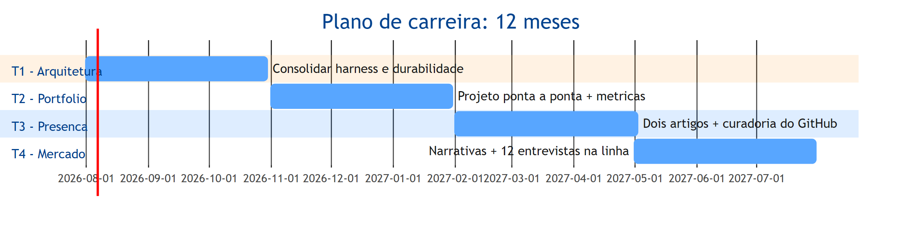

O diagrama mostra o cronograma: quatro trimestres, cada um com um tema dominante e marcos verificáveis — arquitetura no primeiro, portfólio no segundo, presença no terceiro e mercado no quarto. As seções não são estanques — o portfólio usa a arquitetura, a presença documenta o portfólio e o mercado exibe os três — mas a sequência dá foco: cada trimestre tem um objetivo claro, e a revisão mensal ajusta o curso. Esse gantt é o mapa do maquinista transformado em cronograma, e o restante do capítulo detalha cada trimestre.

## 4. Técnica

### O painel do plano: metas, marcos e métricas

A primeira entrega técnica é o instrumento central do plano: o painel que acompanha o progresso dos quatro trimestres — a especificação executável da carreira, no espírito do contrato do Capítulo 2 aplicado ao plano de vida [4]. O código abaixo implementa o painel com metas mensuráveis e o loop de revisão:

```python
"""Painel do plano de carreira: metas trimestrais e loop de revisao."""
from dataclasses import dataclass, field


@dataclass
class Meta:
    trimestre: str
    descricao: str
    meta: float
    atual: float = 0.0

    def progresso(self) -> float:
        return min(self.atual / self.meta, 1.0) if self.meta else 0.0


@dataclass
class PlanoCarreira:
    metas: list = field(default_factory=list)

    def registrar(self, meta: Meta) -> None:
        self.metas.append(meta)

    def revisar(self) -> str:
        linhas = []
        for meta in self.metas:
            progresso = meta.progresso()
            status = "ON TRACK" if progresso >= 0.5 else "PRECISA AJUSTE"
            linhas.append(
                f"[{meta.trimestre}] {meta.descricao}: "
                f"{meta.atual:.0f}/{meta.meta:.0f} ({progresso:.0%}) {status}"
            )
        return "\n".join(linhas)


if __name__ == "__main__":
    plano = PlanoCarreira()
    plano.registrar(Meta("T1", "Proporcao de orquestracao na semana", 0.60, 0.57))
    plano.registrar(Meta("T2", "Projetos de ponta a ponta publicados", 1.0, 0.0))
    plano.registrar(Meta("T3", "Artigos tecnicos publicados", 2.0, 0.0))
    plano.registrar(Meta("T4", "Entrevistas na linha nova", 12.0, 0.0))
    print(plano.revisar())
```

O código compila e roda, e demonstra o painel do plano: cada meta trimestral tem valor atual, meta e progresso — e a revisão mensal lê o painel e decide o ajuste, exatamente como um sistema de IA é avaliado contra o golden set [1]. O painel é o relógio de aferição da carreira: sem ele, o ano passa e o progresso é opinião; com ele, o progresso é número — e a mentalidade de evidência que o livro inteiro ensinou aplicada à própria trajetória [3].

### O mapa do plano: arquitetura, portfólio, presença e mercado em ciclos

A segunda entrega é o detalhamento dos quatro trimestres: o conteúdo de cada ciclo, com as entregas e as fontes deste livro que sustentam cada um. O código abaixo gera o mapa do plano — o documento de especificação da carreira:

```python
"""Mapa do plano de 12 meses: entregas por trimestre e fontes do livro."""
from dataclasses import dataclass


@dataclass
class Trimestre:
    nome: str
    foco: str
    entregas: list
    capitulos: list

    def resumir(self) -> str:
        return (
            f"{self.nome} — {self.foco}\n  Entregas: "
            f"{'; '.join(self.entregas)}\n  Base: Capítulos {', '.join(self.capitulos)}"
        )


TRIMESTRES = [
    Trimestre(
        "T1 - Arquitetura", "consolidar a base técnica",
        ["Harness do repositório atual", "Sistema com workflow + agente", "Execução durável documentada"],
        ["3", "4", "5"],
    ),
    Trimestre(
        "T2 - Portfólio", "construir a prova",
        ["Projeto de ponta a ponta", "Relatório de evidências", "Testes de falha"],
        ["7", "8"],
    ),
    Trimestre(
        "T3 - Presença", "multiplicar a evidência",
        ["Dois artigos técnicos", "Curadoria do GitHub", "Perfil consolidado"],
        ["9"],
    ),
    Trimestre(
        "T4 - Mercado", "colher e negociar",
        ["Narrativas de portfólio", "Doze entrevistas na linha nova", "Oferta na linha em expansão"],
        ["10", "11"],
    ),
]


if __name__ == "__main__":
    for trimestre in TRIMESTRES:
        print(trimestre.resumir())
        print()
```

O código compila e roda, e demonstra o mapa completo: cada trimestre com foco, entregas e os capítulos do livro que o sustentam — arquitetura (capítulos 3-5), portfólio (7-8), presença (9) e mercado (10-11). O mapa é o documento de especificação do plano, e a sequência não é arbitrária: o portfólio precisa da arquitetura, a presença documenta o portfólio e o mercado exibe os três — a mesma lógica de camadas que o livro ensinou, aplicada à carreira [2][4].

## 5. Aplica

Você terminou o livro e sente a motivação em alta — mas conhece o padrão: em três semanas, a motivação esfria e o plano vira uma intenção não executada. Seu instinto errado seria "começar por tudo ao mesmo tempo" — arquitetura, portfólio e presença simultaneamente, até o primeiro tropeço derrubar o castelo. O diagnóstico liga à teoria: sem especificação executável (metas mensuráveis), sem marcos (o que está feito?) e sem revisão (o que ajustar?), o plano é uma resolução, e resoluções não sobrevivem à primeira semana — a mesma razão pela qual sistemas sem evals degradam [1]. A correção, na prática, é o instrumento deste capítulo: você instala o painel do plano, define as metas do primeiro trimestre (a proporção de orquestração do Capítulo 1 e o harness do Capítulo 3), marca a revisão mensal no calendário e começa pelo único foco do T1. Em doze semanas, o T1 entrega o harness documentado e o sistema híbrido — e a revisão mensal mostra o progresso em número, não em vontade [3]. A motivação não sustenta o plano; o painel sustenta.

As armadilhas comuns, sintetizadas, são três. Primeira: plano sem métricas — metas vagas ("melhorar arquitetura") não são verificáveis; a meta operacional ("sistema com arquitetura documentada e teste de falha") é [1]. Segunda: tudo ao mesmo tempo — a simultaneidade sem sequência esgota a atenção e esconde o progresso; o trimestre com foco único é o que entrega [2]. Terceira: plano estático — o mercado muda (o Capítulo 10 mostrou a velocidade), e o plano que não é revisado mensalmente envelhece como o relatório de resiliência sem cadência; a revisão é parte do sistema, não um luxo [3]. A métrica de sucesso do plano é a trajetória do painel: progresso monotônico em cada trimestre, com ajustes pela revisão — e a estação de destino aproximando-se a cada ciclo. O livro fecha aqui — mas o mapa, o caderno e o painel ficam com você.

O plano de carreira tem desdobramentos que sintetizam o livro inteiro, e cada um fecha um ciclo aberto nos capítulos anteriores. O primeiro é a síntese da arquitetura: o diferencial durável — a visão do sistema completo — é a competência que o harness engineering formaliza e que a prática da OpenAI demonstra em escala, e o T1 do plano é a tradução dessa competência em rotina [5][6]. O segundo é a síntese do portfólio: a regra dos 3-5 projetos e o relatório de evidências são o material que a entrevista consome, e o plano integra essa construção ao cronograma — o caderno do maquinista não é um acidente, é um produto do T2 e do T3 [2][7]. O terceiro é a síntese do mercado: o mapa com dados do Capítulo 10 e a rubrica do Capítulo 11 convergem no T4 — o candidato posicionado na linha em expansão, com narrativas preparadas e ofertas na mesa, é o resultado operacional da trinca [8][3]. O quarto é a síntese da avaliação: o ciclo especificar-medir-melhorar — o coração da disciplina de evals — é aplicado à carreira, e a revisão mensal do painel é a mesma mentalidade de evidência que o mercado de 2026 recompensa [1]. O quinto é a síntese da identidade: o engenheiro acima da média não é definido por um cargo — é definido pelo mapa que carrega (arquitetura), pelo caderno que mostra (portfólio) e pela estação que escolhe (mercado), e essa identidade é o que o Capítulo 1 prometeu e os doze capítulos construíram [9]. E a mensagem final ecoa a tese do livro: em 2026, com agentes executando a manufatura, o valor humano não está na velocidade de digitação — está no desenho do sistema, na prova do que se constrói e no posicionamento onde o valor é criado; quem domina os três não compete com a caldeira, pilota o mapa inteiro [5][9]. O plano de 12 meses é o instrumento que transforma essa tese em rota — e a rota começa com o primeiro trimestre, hoje [3].

O plano de carreira ganha o seu lugar no mapa quando conectado ao harness e à arquitetura. A hierarquia das disciplinas situa o plano na camada do sistema: a estratégia de carreira documentada é o ativo durável [10]. O harness de longa duração mostra o teto do plano: a capacidade de sustentar autonomia prolongada é a meta de médio prazo mais valiosa [11]. A regra de ouro da arquitetura dá o vocabulário do T1: a decisão entre workflow e agente com consciência de custo é a competência central a consolidar [12]. A execução durável completa o T1: a resiliência operacional é a skill que o T1 precisa demonstrar [13]. A tríade RAG-MCP-observabilidade é o conteúdo do T2: o projeto de ponta a ponta com o stack completo é a prova do portfólio [14]. A presença digital é o T3: o artigo e o repositório que multiplicam a evidência [15]. O mercado é o T4: a leitura periódica do mapa com os dados da linha em expansão [16]. E o ciclo especificar-medir-melhorar — o coração da disciplina de evals — é o motor do plano: a revisão mensal do painel aplica a mentalidade de evidência à carreira [17][18].

O plano de carreira se fecha com as duas fontes que medem a estrada: os projetos de portfólio documentados pela Udacity como base da evidência [19] e o monitoramento mensal do mercado de trabalho técnico como o instrumento de correção de rota [20].


### Aprofundamento: o plano de carreira como sistema operacional

O plano de carreira do engenheiro acima da média não é uma lista de metas anuais: é um sistema operacional com ciclos de medir, aprender e corrigir rota — a mesma disciplina de evals que a OpenAI aplica aos sistemas de IA, agora aplicada à carreira [1]. A arquitetura da evidência fornece a memória do sistema: o portfólio, o conjunto de projetos e a narrativa contínua registram o progresso real [2]. As análises de mercado de talento fornecem o painel: as tendências de vagas, salários e skills demandadas são os indicadores que o plano monitora trimestralmente [3]. O manifesto do AIDD dá o método: o desenvolvedor como parceiro deliberado da IA — e a carreira como a sequência de parcerias bem executadas [4]. O harness engineering da OpenAI fornece a meta de médio prazo: a competência de construir e governar o ambiente dos agentes é o diferencial mais raro e mais valorizado do mercado [5]. A disciplina de harness engineering situa o plano na camada do sistema: a estratégia de carreira documentada é o ativo durável que trabalha por você [6]. O portfólio de evidências é o instrumento de execução: os guias de 2026 mostram que os 3 a 5 projetos que sustentam a narrativa são o que o mercado examina em cada movimento de carreira [7]. O mercado de trabalho de 2026 confirma a direção: as análises do Pragmatic Engineer mostram que a transição para a orquestração de agentes é estrutural, e o plano deve acompanhá-la [8]. A projeção de longo prazo do desenvolvimento de software coloca a evidência pública como o ativo de longo prazo: quem documenta constrói reputação que sobrevive a mudanças de tecnologia [9]. A hierarquia das disciplinas organiza a progressão: o prompt na mensagem, o contexto na sessão e o harness no sistema — o plano avança dos níveis baixos para o alto da hierarquia [10]. O harness de longa duração da Anthropic mostra o teto do plano: a capacidade de sustentar autonomia prolongada é a meta de médio prazo mais valiosa da disciplina [11]. A arquitetura de agentes da Anthropic fornece o currículo da progressão: dominar orchestrator-workers, evaluator-optimizer e routing é o trilho técnico do plano [12]. A execução durável completa o trilho: a resiliência operacional é a skill que o plano precisa demonstrar na passagem do pleno ao sênior [13]. O protocolo MCP é o stack da progressão: as integrações sob contrato aparecem em percentual crescente das vagas de AI Engineer — e o plano deve acompanhá-las [14]. A delimitação entre MCP, RAG e agentes organiza o estudo: transporte, conhecimento e orquestração em camadas claras é o mapa mental do plano [15]. As plataformas de orquestração entram como o vocabulário de mercado: a familiaridade com o ecossistema convergente é o contexto que o plano monitora [16]. O guia do Zencoder mostra como apresentar a progressão: a combinação de portfólio, escrita e narrativa forma a marca que o mercado reconhece em cada etapa [17]. O repositório público fornece o registro contínuo: o commit log é o diário de bordo do plano de carreira [18]. Os projetos de machine learning de ponta a ponta listados pela Udacity são os marcos de execução: a construção completa é a evidência que cada fase do plano entrega [19]. E o monitoramento mensal do mercado técnico encerra: o plano de carreira é um sistema operacional que aprende — cada mês, o engenheiro lê o mapa, mede o próprio progresso e corrige a rota, exatamente como o sistema de IA que ele aprendeu a construir [20].


O plano de carreira como sistema operacional encerra com a revisão mensal: leia o mapa do mercado, meça o próprio progresso no portfólio e corrija a rota — o mesmo ciclo de evals que a OpenAI aplica aos sistemas de IA [1]. O monitoramento mensal do mercado fornece os dados da revisão [20], e o portfólio registra o progresso real [2]. O engenheiro acima da média não planeja uma vez por ano: opera a carreira como sistema, com sensores e correção contínua — exatamente como o agente que aprendeu a construir [12].

### Aprofundamento: ética, papéis de time e a atualização contínua

O plano de carreira do engenheiro acima da média tem três dimensões que os capítulos anteriores prepararam e que este fechamento consolida. A primeira é a ética e os limites da autonomia: em decisões de alto risco — código que movimenta dinheiro, altera dados clínicos, opera infraestrutura crítica — o humano permanece no loop como instância final de decisão, não como espectador. O manifesto do AIDD formaliza o princípio: o desenvolvedor é o parceiro deliberado da IA, responsável pelo que é entregue — e a responsabilidade não se delega a um agente, por mais capaz que ele seja [4]. A engenharia de harness dá a ferramenta dessa responsabilidade: a barreira de aprovação humana, o orçamento de passos e a trilha de auditoria são os mecanismos que materializam o limite [5][6]. A régua prática é a do custo do erro: quanto maior o custo de uma ação errada — financeiro, legal, de reputação — maior deve ser a barreira entre a decisão do agente e a execução, e o engenheiro acima da média desenha essa barreira como parte do sistema, não como improviso de última hora [11][13]. A segunda dimensão é a organização do time por papéis: nos times que levam AIDD a sério, as disciplinas deste livro têm donos explícitos — quem escreve as specs (o papel de arquitetura), quem mantém os hooks e a configuração de governança (o papel de plataforma), quem desenha e opera os evals (o papel de qualidade), quem constrói as skills e os prompts (o papel de produto) e quem revisa as decisões (o papel de revisão). O mercado de 2026 já reflete essa divisão de trabalho nas descrições de vaga: os títulos de AI Architect, AI Platform Engineer e AI Quality Engineer estão entre os que mais crescem [3], e o engenheiro que articula o próprio papel nesse mapa — e sabe em qual dos cinco contribui hoje e em qual quer contribuir amanhã — navega a carreira com direção em vez de seguir a maré [8][9]. A terceira dimensão é a atualização contínua: um campo cuja terminologia muda a cada poucos meses não se acompanha por leitura passiva, mas por um circuito de três hábitos — construir (o projeto que força a aprender a ferramenta nova), medir (o eval que diz se o que foi construído funciona) e narrar (o artigo que consolida o aprendizado em vocabulário próprio). O harness engineering documentado pela OpenAI nasceu exatamente desse circuito — a disciplina de construir, medir e revisar o ambiente dos agentes — e é o modelo do hábito profissional [5]. As fontes primárias — os blogs de engenharia das grandes empresas, as especificações abertas como MCP e os manifestos como o do AIDD — são o ponto de partida de cada ciclo de atualização [14][15], e o portfólio é o registro acumulado dessa curva de aprendizado que nenhum certificado substitui [7][17]. O engenheiro que mantém os três hábitos em circuito não precisa se preocupar com a obsolescência: a obsolescência atinge quem aprende uma ferramenta, e não quem domina a disciplina por trás dela [19].
## 6. Conclusão

Você dominou o plano de carreira: a trinca — arquitetura, portfólio e mercado — transformada em um programa de 12 meses com metas, marcos e métricas. Os três pontos principais são: o ciclo trimestral dá sequência e foco à trinca; o painel com metas mensuráveis e revisão mensal aplica a mentalidade de evidência à própria carreira; e o diferencial durável — a visão do sistema completo — é o que nenhum agente de código substitui. O desafio final: instale o painel hoje, defina a meta do T1 com número e marque a revisão mensal — a primeira estação da sua nova rota. O maquinista acima da média não é o que dirige mais rápido — é o que conhece o mapa, prova as viagens e chega à estação certa. Boa viagem.

## 7. Referências Bibliográficas
[1] OPENAI. *How evals drive the next chapter in AI for businesses*. 2025. Disponível em: https://openai.com/index/evals-drive-next-chapter-of-ai/. Acesso em: 06 ago. 2026.
[2] DATAEXPERT.IO. *Ultimate guide to AI engineering portfolios*. 2026. Disponível em: https://www.dataexpert.io/blog/ultimate-guide-ai-engineering-portfolios. Acesso em: 06 ago. 2026.
[3] NEXUS IT GROUP. *AI engineering jobs: 2026 talent market analysis*. 2026. Disponível em: https://nexusitgroup.com/ai-engineering-jobs/. Acesso em: 06 ago. 2026.
[4] AI-DRIVEN DEVELOPMENT MANIFESTO. *Manifesto for AI-Driven Development*. 2026. Disponível em: https://www.ai-driven-development.org/. Acesso em: 06 ago. 2026.
[5] LOPOPOLO, Ryan (OPENAI). *Harness engineering at OpenAI*. 2026. Disponível em: https://openai.com/index/harness-engineering/. Acesso em: 06 ago. 2026.
[6] BÖCKELER, Birgitta; FOWLER, Martin. *Harness engineering: the discipline of building effective software agents*. Thoughtworks/Martin Fowler, 2026. Disponível em: https://martinfowler.com/articles/harness-engineering.html. Acesso em: 06 ago. 2026.
[7] JACKSON, Natalia (HYPERSKILL). *Building a developer portfolio in 2026: what actually gets attention*. 2026. Disponível em: https://hyperskill.org/blog/post/building-a-developer-portfolio-in-2026-what-actually-gets-attention. Acesso em: 06 ago. 2026.
[8] OROSZ, Gergely; SALMON, Jessica (THE PRAGMATIC ENGINEER). *The job market in 2026 (part 2)*. 2026. Disponível em: https://newsletter.pragmaticengineer.com/p/the-job-market-in-2026-part-2. Acesso em: 06 ago. 2026.
[9] OSMANI, Addy. *The next two years of software engineering*. 2026. Disponível em: https://addyosmani.com/blog/next-two-years/. Acesso em: 06 ago. 2026.
[10] ATLAN RESEARCH. *Harness engineering vs prompt engineering*. 2026. Disponível em: https://atlan.com/know/harness-engineering-vs-prompt-engineering/. Acesso em: 06 ago. 2026.
[11] RAJASEKARAN, Prithvi (ANTHROPIC ENGINEERING). *Harness design for long-running agentic applications*. 2026. Disponível em: https://www.anthropic.com/engineering/harness-design-long-running-apps. Acesso em: 06 ago. 2026.
[12] ANTHROPIC. *Building effective agents*. 2024. Disponível em: https://www.anthropic.com/engineering/building-effective-agents. Acesso em: 06 ago. 2026.
[13] MARTIN, Kevin Paul (TEMPORAL). *From AI hype to durable reality: why agentic flows need distributed-systems discipline*. 2025. Disponível em: https://temporal.io/blog/from-ai-hype-to-durable-reality-why-agentic-flows-need-distributed-systems. Acesso em: 06 ago. 2026.
[14] CHOWDHURY, Supal; SAHA, Subrata; ABDEL SAMAD, Haitham (IBM DEVELOPER). *Model Context Protocol architecture patterns for multi-agent AI systems*. 2026. Disponível em: https://developer.ibm.com/articles/mcp-architecture-patterns-ai-systems/. Acesso em: 06 ago. 2026.
[15] INFRANODUS ENGINEERING. *MCP vs RAG vs AI agents: differences and how they work together*. 2026. Disponível em: https://infranodus.com/docs/mcp-vs-rag-vs-ai-agents. Acesso em: 06 ago. 2026.
[16] DIGITAL APPLIED. *AI workflow orchestration platforms: 2026 comparison*. 2026. Disponível em: https://www.digitalapplied.com/blog/ai-workflow-orchestration-platforms-comparison. Acesso em: 06 ago. 2026.
[17] ZENCODER. *How to create a software engineer portfolio in 2026*. 2026. Disponível em: https://zencoder.ai/blog/how-to-create-software-engineer-portfolio. Acesso em: 06 ago. 2026.
[18] BOUCHARD, Louis-François. *Start AI engineering*. GitHub, 2026. Disponível em: https://github.com/louisfb01/start-ai-engineering. Acesso em: 06 ago. 2026.
[19] UDACITY. *20 machine learning projects that will boost your portfolio*. 2025/2026. Disponível em: https://www.udacity.com/blog/20-machine-learning-projects-that-will-boost-your-portfolio/. Acesso em: 06 ago. 2026.
[20] DAINES-HUTT, Daniel (ZERO TO MASTERY). *Tech job market trends monthly — February 2026*. 2026. Disponível em: https://zerotomastery.io/blog/tech-job-market-trends-monthly-february-2026/. Acesso em: 06 ago. 2026.

## Conclusão geral

O engenheiro acima da média em 2026 não é aquele que compete com a IA — é aquele que desenha o sistema no qual a IA opera. O livro fecha com a síntese da trinca: a arquitetura como o trilho que dá direção ao trabalho, o portfólio como a prova que transforma competência em reputação, e o mercado como a estação onde essa reputação encontra reconhecimento e valor. Quem domina os três — desenha sistemas que sobrevivem a modelos, prova publicamente o que constrói e se posiciona onde o valor está sendo criado — não depende de sorte de mercado: carrega o mapa inteiro da via, e é isso que o torna, de forma durável, um engenheiro acima da média.
