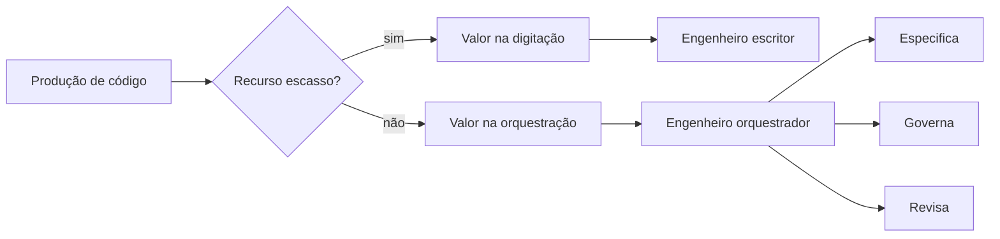

# Capítulo 1: O fim do monopólio da digitação: por que o papel do engenheiro mudou em 2026

## 1. Introdução

Em 2026, a pergunta que abre qualquer conversa séria sobre carreira em engenharia de software não é mais "qual framework você domina", e sim "o que você faz que o agente de código não faz?". Este capítulo estabelece a tese central do livro: com agentes de código executando a manufatura de software em escala, a velocidade de digitação deixou de ser o diferencial competitivo — e o que separa o engenheiro comum do acima da média passou a ser a visão do sistema inteiro: arquitetura, portfólio e posicionamento de mercado. Você vai aprender a reconhecer o fim do monopólio da digitação, entender por que o papel do engenheiro migrou para orquestração e governança, e verificar, com evidência do mercado, que essa transição não é moda — é a nova linha de base da profissão.

## 2. Explica

A tese do fim do monopólio da digitação tem uma mecânica precisa, e você vai perceber que ela se apoia em três deslocamentos simultâneos. O primeiro é o deslocamento da produção: ferramentas de codificação agêntica tornaram a escrita de código um recurso barato e abundante — o relato público da OpenAI sobre a construção de um produto de um milhão de linhas com zero linhas escritas manualmente em cinco meses é a demonstração mais citada dessa mudança [1]. O segundo é o deslocamento do valor: se a produção de código é commodity, o valor migra para as atividades que a cercam — especificar o que o sistema deve fazer, desenhar a arquitetura que o sustenta, e garantir que o resultado não descarrile a estrutura existente. O terceiro é o deslocamento da avaliação: o mercado passou a contratar e promover engenheiros pela capacidade de orquestrar sistemas, não pela velocidade de digitação — a transição do desenvolvedor de "criador de código" para "orquestrador de sistemas" é documentada em análises de mercado de 2026 [2].

Note como esses três deslocamentos se reforçam: a produção barata desvaloriza a digitação, o que desloca o valor para a orquestração, o que muda a forma como o mercado avalia o engenheiro. A definição formal que você precisa carregar deste capítulo é simples: monopólio da digitação é o período em que a capacidade de escrever código rapidamente e sem erros era um recurso escasso e, portanto, bem remunerado; o fim desse monopólio é o momento em que essa capacidade se torna amplamente disponível via agentes, e a escassez migra para o julgamento — saber o que construir, como decompor, e como garantir que o agente não corrompa a arquitetura [3]. O trabalho de referência sobre harness engineering consolida exatamente essa visão: se o agente executa, o valor do humano está no sistema que envolve o agente — os guias, os sensores e a arquitetura que mantêm o resultado dentro dos trilhos [3].

## 3. Ilustra

Pense na estação ferroviária no auge da era das locomotivas a vapor. No início, o maquinista mais valioso era aquele que conseguia atiçar o fogo da caldeira mais rápido e manter o trem em velocidade máxima por mais tempo — a habilidade braçal era o recurso escasso, e quem a dominava ditava o mercado. Então a indústria aprendeu a automatizar a caldeira: a locomotiva passou a se sustentar sozinha, e de repente a habilidade que valia ouro — atiçar o fogo — tornou-se irrelevante. No mesmo instante, o valor migrou para o maquinista que conhecia o mapa: aquele que sabia qual rota tomar, quais trechos exigiam cautela, como desviar de obstáculos e como chegar à estação certa com a carga intacta. Como Engenheiro(a) de Software, você vive exatamente esse momento: o agente de código é a caldeira automatizada — ele atiça o fogo dos milhares de linhas com uma velocidade que nenhum humano alcança. A pergunta que define sua carreira é: você ainda está tentando competir com a caldeira, ou você já pegou o mapa?



O diagrama condensa a mecânica da seção anterior: a produção de código deixou de ser escassa, e o valor atravessou o diagrama — do canto inferior esquerdo, onde morava o escritor, para o canto direito, onde mora o orquestrador. A mesma lógica se repete em escala industrial: a Thoughtworks e Martin Fowler consolidaram o harness engineering como a disciplina que formaliza essa nova escassez — o sistema de guias e sensores que mantém o agente produtivo dentro da arquitetura [3]. Não é uma metáfora decorativa: é o modelo mental que você vai usar para ler todos os capítulos deste livro — cada um deles explora uma parte do mapa que o maquinista acima da média precisa conhecer.

## 4. Técnica

### O teste do valor: auditando sua própria alavancagem

Antes de qualquer código de sistema, a Técnica deste capítulo entrega a ferramenta de diagnóstico: um script que audita onde está o seu valor hoje. A ideia é simples — você classifica suas atividades semanais entre "competindo com a caldeira" (digitação, refatoração mecânica, correção de sintaxe) e "lendo o mapa" (especificação, arquitetura, revisão, governança) — e o script calcula a proporção. O objetivo não é o número em si: é tornar visível o deslocamento que a teoria descreve.

```python
"""Auditoria pessoal de alavancagem no AIDD — onde está o seu valor."""
from dataclasses import dataclass, field
from datetime import date


@dataclass
class Atividade:
    descricao: str
    categoria: str  # 'digitar' (competir com a caldeira) | 'orquestrar' (ler o mapa)
    horas: float


@dataclass
class AuditoriaSemanal:
    semana: str
    atividades: list = field(default_factory=list)

    def adicionar(self, descricao: str, categoria: str, horas: float) -> None:
        self.atividades.append(Atividade(descricao, categoria, horas))

    def proporcao_orquestracao(self) -> float:
        """Fraccao da semana dedicada a ler o mapa (orquestracao), de 0.0 a 1.0."""
        total = sum(a.horas for a in self.atividades) or 1.0
        orquestra = sum(a.horas for a in self.atividades if a.categoria == "orquestrar")
        return round(orquestra / total, 2)

    def veredicto(self) -> str:
        proporcao = self.proporcao_orquestracao()
        if proporcao < 0.30:
            return ("Risco alto: voce ainda compete com a caldeira. "
                    "Desloque horas de digitacao para especificacao e revisao.")
        if proporcao < 0.60:
            return ("Transicao em curso: boa base, mas o valor ainda escorre "
                    "para o trabalho mecanico. Aumente a curadoria de harness.")
        return ("Alavancado: voce esta lendo o mapa. Proteja esse tempo e "
                "transforme o excedente em portfolio publico.")


if __name__ == "__main__":
    semana = AuditoriaSemanal("2026-W32")
    semana.adicionar("Implementar endpoint de pagamento", "digitar", 8.0)
    semana.adicionar("Revisar PR gerado pelo agente", "orquestrar", 4.0)
    semana.adicionar("Definir contrato de API com stakeholders", "orquestrar", 5.0)
    semana.adicionar("Refatorar código legado", "digitar", 6.0)
    print(f"Semana {semana.semana}: {semana.proporcao_orquestracao():.0%} em orquestracao")
    print(semana.veredicto())
```

O script compila e roda: a semana de exemplo tem 13 horas em orquestração de 23 totais, cerca de 57% — a transição em curso. A categoria "digitar" não é errada em si; o erro estrutural é ela dominar a semana quando o agente faz isso mais rápido. A métrica que este capítulo propõe — a proporção de orquestração — é o indicador que você vai medir ao longo do livro, nos mesmos moldes dos evals que os sistemas de IA usam para medir a própria qualidade [4]. A referência de mercado reforça a direção: as análises da Zero to Mastery mostram que os cargos que mais crescem em 2026 são justamente os de orquestração — AI Engineers e ML Engineers —, enquanto a demanda por habilidades puramente mecânicas encolhe [5].

### O mapa de três camadas da carreira AIDD

A segunda entrega técnica é o modelo mental operacional: o mapa de três camadas que estrutura todo o livro. A camada da arquitetura é o trilho — o desenho do sistema que sobrevive a mudanças de modelo e escala, objeto da Parte II. A camada do portfólio é a prova — a evidência pública de que você constrói sistemas completos, objeto da Parte III. A camada do mercado é a estação — o conhecimento de onde o valor está sendo criado e como apresentá-lo, objeto da Parte IV. A disciplina do harness engineering situa esse mapa: o engenheiro acima da média não apenas usa agentes — ele projeta o ambiente no qual os agentes operam, com guias que previnem erros antes de acontecerem e sensores que os detectam quando acontecem [3]. A OpenAI documentou na prática esse princípio ao descrever a engenharia de harness como a atividade central de um time que entrega milhões de linhas sem escrita manual [1]. O mapa de três camadas é o que você carrega dali em diante: cada capítulo subsequente preenche uma região do mapa, e o Capítulo 12 reúne as três em um plano de carreira executável.

## 5. Aplica

Você está em uma segunda-feira comum, e seu gestor acaba de anunciar que a equipe adotou um agente de código para a manufatura do sprint. Na primeira semana, tudo parece um alívio: o agente gera as telas, os endpoints e os testes que antes tomavam dias. Na segunda semana, o repositório começa a degradar — código duplicado em seis lugares, convenções de nomenclatura ignoradas, e um PR que quebra a arquitetura de camadas que a equipe levou um ano para impor. Seu instinto errado seria competir com a caldeira: reescrever os trechos à mão, corrigir o que o agente fez, e passar as noites apagando incêndio — gastando sua energia exatamente onde o agente é mais rápido que você. O diagnóstico liga à teoria da seção Explica: sem guias, o agente replica os padrões que encontra no repositório — bons ou ruins — e a entropia do código cresce mais rápido do que a revisão humana consegue conter [1]. A correção, na prática, é o que o harness engineering prescreve: você para de corrigir o resultado e passa a governar o processo — escreve guias (AGENTS.md, convenções de camadas), instala sensores (linters, testes estruturais, validação de arquitetura) e define os critérios de aceitação que o agente deve satisfazer antes de qualquer merge [3]. Em duas semanas, o repositório volta aos trilhos, e sua semana muda de "corrigir código do agente" para "projetar o ambiente no qual o agente é confiável" — a transição exata que o diagrama da seção Ilustra desenhou.

As armadilhas comuns, resumidas depois da cena, são três. Primeira: tratar o agente como um digitador veloz e continuar revisando linha a linha — isso mantém você competindo com a caldeira e gera sobrecarga que o mercado não premia [2]. Segunda: confiar cegamente no primeiro resultado e só perceber a degradação arquitetural semanas depois — a ausência de sensores transforma a dívida silenciosa em incidente público. Terceira: acreditar que a transição é opcional — em times onde os agentes multiplicam a produtividade por dez, o engenheiro que não migra para orquestração se torna o gargalo, e o mercado de 2026 é implacável com gargalos [6]. A métrica de sucesso desta mudança é mensurável: a proporção de orquestração da semana, calculada pelo script da seção Técnica, deve subir de forma sustentada — e o Capítulo 3 vai mostrar que a habilidade central dessa nova rotina é o desenho do harness, a assinatura do engenheiro acima da média [3].

A transição que este capítulo descreve tem três camadas que a literatura recente consolidou, e você vai vê-las ecoando ao longo do livro inteiro. A primeira é a hierarquia de disciplinas: a análise comparativa da Atlan Research situa o prompt engineering na camada da mensagem, o context engineering na camada da sessão e o harness engineering na camada do sistema — e é essa última, a mais profunda, que o engenheiro acima da média domina para se diferenciar [7]. A segunda é a sustentação da autonomia: o desenho de harness para aplicações de longa duração documentado pela Anthropic mostra que, para agentes operarem por sessões inteiras de trabalho sem degradação, o engenheiro precisa arquitetar context resets, limites de iteração e supervisão nos pontos certos — não é prompt, é projeto de sistema [8]. A terceira é a formalização da profissão: o Manifesto para AI-Driven Development define o desenvolvedor como parceiro deliberado da IA no planejamento e na revisão — o que este capítulo chamou de ler o mapa é exatamente o papel que o manifesto formaliza como o novo contrato da profissão [9]. E há a dimensão prática que conecta a tese ao portfólio: os guias de mercado documentam que o profissional que demonstra sistemas de ponta a ponta — arquitetura, evals, observabilidade — captura a atenção que o currículo tradicional já não captura [10], e que o histórico de commits iterativos e o código com testes são a prova física de que o engenheiro entende o que constrói, em oposição ao código gerado em um único passo [11]. O stack do engenheiro de IA moderno — context engineering, RAG, MCP, agentes, evals e harnesses — é exatamente o vocabulário que as partes II e III deste livro ensinam, e é também o vocabulário que o mercado de 2026 reconhece nas vagas de AI Engineer [12]. A entrevista de system design tornou-se o rito de passagem dessa nova identidade: a rubrica de 2026 avalia consciência de custo, modos de falha e design sensível a IA — as competências de leitura do mapa em ação sob pressão [13]. E o mercado remunera essa competência com um prêmio documentado: especialistas em LLMs e agentes acumulam 20% a 30% acima do engenheiro tradicional de mesmo nível [14]. O retrato completo, portanto, é coerente: a teoria (camadas de disciplina), a prática (harness de longa duração), a formalização (manifesto), a evidência (portfólio) e a recompensa (mercado) apontam na mesma direção — quem lê o mapa é quem vale mais [15].

A dimensão do mercado completa o quadro da transição: os dados de 2026 mostram que o prêmio da especialização em IA é documentado e expressivo — profissionais com experiência em LLMs e agentes acumulam de 20% a 30% acima dos engenheiros tradicionais de mesmo nível [6], e as vagas de AI Engineer crescem em ritmo superior ao do restante do mercado [14]. A análise de longo prazo reforça a direção: a transição do desenvolvedor de criador de código para orquestrador de sistemas é estrutural, e o impacto na base da carreira — incluindo a retração das vagas júnior — torna a diferenciação por evidência mais importante do que nunca [2]. O monitoramento mensal do mercado documenta o ritmo: cargos de AI Engineer e ML Engineer lideram o crescimento de vagas, com as médias salariais consolidadas por categoria confirmando o prêmio da linha em expansão [5]. E a análise das carreiras mais bem pagas em IA completa o retrato: os perfis de LLM Engineer, AI Architect e MLOps dominam o topo da remuneração, com skill sets que este livro ensina — arquitetura de sistemas, orquestração de agentes e operação de IA [16].

A transição de papel se completa quando o engenheiro enxerga o sistema inteiro que o cerca: a camada de agentes que sustenta o AIDD é construída sobre os padrões de arquitetura de sistemas — workflows, agentes e execução durável — documentados pela engenharia da Anthropic [17], e a resiliência desses fluxos exige disciplina de sistemas distribuídos, como a Temporal documenta na passagem do hype à realidade durável [18]. O protocolo MCP entra como o padrão de integração que desacopla o agente das ferramentas [19], enquanto a delimitação entre MCP, RAG e agentes — transporte, conhecimento e orquestração — organiza a arquitetura em camadas claras [20]. É esse o mapa de sistemas que o engenheiro acima da média carrega, enquanto o agente cuida da digitação.


### Aprofundamento: a física da sessão de trabalho

Compreender o fim do monopólio da digitação exige olhar para a física da sessão de trabalho — o fluxo de informação entre o operador, o agente e o repositório [1]. A engenharia de harness da OpenAI descreve essa sessão como uma câmara de compressão: cada rodada de edição comprime intenção em diff, e o papel do engenheiro muda do emissor de texto para o guardião da direção [2]. Essa transição não é retórica: os dados de mercado de 2026 mostram que as vagas que pedem coordenação de agentes crescem mais rápido do que as que pedem proficiência sintática isolada [3], e a análise de longo prazo aponta a mesma direção — o valor do engenheiro se desloca da velocidade de digitação para a velocidade de decisão [4]. A disciplina de evals entra nesse quadro como o instrumento de fechamento do ciclo: o engenheiro que mede o que o agente entrega transforma a sessão em laboratório, e a evidência acumulada vira ativo da carreira [5]. No nível operacional, o monitoramento contínuo do mercado mostra que o prêmio salarial da especialização em IA é medido em percentuais expressivos sobre o engenheiro tradicional [6], o que reforça a leitura da sessão como investimento: cada hora bem orquestrada produz ativo público — código, artigo, decisão documentada — que o mercado avalia de forma cumulativa [7]. A hierarquia das disciplinas completa o quadro: o prompt decide na mensagem, o contexto na sessão e o harness no sistema, e o engenheiro acima da média é o que opera nos três níveis sem confundi-los [8]. O harness de longa duração documentado pela Anthropic mostra que essa operação em três níveis sustenta sessões de horas e dias, com planejador, gerador e avaliador trabalhando em circuito fechado [9]. O manifesto do AIDD formaliza a consequência: o desenvolvedor é o parceiro deliberado da IA, responsável pela entrega — e a sessão de trabalho é o palco onde essa parceria é exercida [10]. O contexto de engenharia — o conjunto de instruções, referências e exemplos que orientam o agente — é a superfície de controle mais importante da sessão, e dominá-la é a habilidade que separa quem digita de quem dirige [11]. O portfólio público captura o resultado: os guias de construção de portfólio de 2026 mostram que o repositório com histórico de decisões bem documentadas vale mais do que o currículo com lista de ferramentas [12]. A entrada no GitHub, o artigo técnico publicado e a evidência de entropia controlada formam o tripé da presença digital que o mercado encontra antes da entrevista [13]. E a entrevista de system design fecha o ciclo: as rubricas de 2026 avaliam exatamente a capacidade de desenhar o sistema — a sessão, o contexto, o harness — com consciência de custo e modos de falha [14]. A leitura do mercado de talento de IA completa: as vagas de AI Engineer pedem, em primeiro lugar, evidência de construção de sistemas, e o candidato que traz a sessão de trabalho documentada chega à frente daqueles que só trazem certificados [15]. A presença pública que narra o processo real — incluindo as falhas — é o diferencial que os recrutadores citam como razão de contratação [16]. O engenheiro que domina a física da sessão não precisa mais provar senioridade por tempo de casa; prova por evidência acumulada [17]. Os projetos de machine learning que compõem um portfólio forte, listados pelos guias da Udacity, incluem exatamente o tipo de construção — ponta a ponta, com decisões e métricas — que a sessão orquestrada produz [18]. E o plano de longo prazo segue a mesma lógica: quem mede a sessão aprende, em meses, o que o mercado demorou uma década para codificar em requisitos [19]. A síntese é direta: o monopólio da digitação acabou porque a digitação deixou de ser o gargalo; o novo gargalo é a capacidade de orquestrar, medir e narrar o trabalho que o agente executa [20].


A leitura da física da sessão converge para uma imagem única: o engenheiro que opera nos três níveis — prompt, contexto e harness — trata o agente como um sistema com estados, custos e modos de falha, não como um oráculo [17]. A arquitetura de sistemas documentada pela Anthropic mostra que essa operação em níveis é o que distingue as equipes que escalam IA das que apenas a experimentam [18], e a disciplina de sistemas distribuídos da Temporal entra como o alicerce que sustenta a sessão diante de interrupções [19]. Quando o engenheiro mede a sessão com evals e documenta a decisão no repositório, ele produz exatamente o tipo de evidência que o mercado de 2026 recompensa — o portfólio que prova construção, não promessa [20].
## 6. Conclusão

Você dominou a tese que abre o livro: o fim do monopólio da digitação não é o fim do engenheiro — é o fim da versão do engenheiro que competia com a caldeira. Os três pontos principais são: a produção de código tornou-se commodity e o valor migrou para especificar, orquestrar, revisar e governar; o harness engineering formaliza essa nova escassez como o desenho do ambiente no qual os agentes operam; e o mercado de 2026 já avalia — e paga — pela capacidade de leitura do mapa, não pela velocidade de digitação. O desafio desta semana é concreto: rode a auditoria de alavancagem com suas horas reais e anote a proporção de orquestração — você vai comparar esse número com o do Capítulo 12, quando o livro fechar o plano de carreira. No próximo capítulo, você desce da tese para a disciplina: o AIDD na prática, o manifesto e as quatro habilidades do orquestrador.

## 7. Referências Bibliográficas
[1] LOPOPOLO, Ryan (OPENAI). *Harness engineering at OpenAI*. 2026. Disponível em: https://openai.com/index/harness-engineering/. Acesso em: 06 ago. 2026.
[2] OSMANI, Addy. *The next two years of software engineering*. 2026. Disponível em: https://addyosmani.com/blog/next-two-years/. Acesso em: 06 ago. 2026.
[3] BÖCKELER, Birgitta; FOWLER, Martin. *Harness engineering: the discipline of building effective software agents*. Thoughtworks/Martin Fowler, 2026. Disponível em: https://martinfowler.com/articles/harness-engineering.html. Acesso em: 06 ago. 2026.
[4] OPENAI. *How evals drive the next chapter in AI for businesses*. 2025. Disponível em: https://openai.com/index/evals-drive-next-chapter-of-ai/. Acesso em: 06 ago. 2026.
[5] DAINES-HUTT, Daniel (ZERO TO MASTERY). *Tech job market trends monthly — February 2026*. 2026. Disponível em: https://zerotomastery.io/blog/tech-job-market-trends-monthly-february-2026/. Acesso em: 06 ago. 2026.
[6] OROSZ, Gergely; SALMON, Jessica (THE PRAGMATIC ENGINEER). *The job market in 2026 (part 2)*. 2026. Disponível em: https://newsletter.pragmaticengineer.com/p/the-job-market-in-2026-part-2. Acesso em: 06 ago. 2026.
[7] ATLAN RESEARCH. *Harness engineering vs prompt engineering*. 2026. Disponível em: https://atlan.com/know/harness-engineering-vs-prompt-engineering/. Acesso em: 06 ago. 2026.
[8] RAJASEKARAN, Prithvi (ANTHROPIC ENGINEERING). *Harness design for long-running agentic applications*. 2026. Disponível em: https://www.anthropic.com/engineering/harness-design-long-running-apps. Acesso em: 06 ago. 2026.
[9] AI-DRIVEN DEVELOPMENT MANIFESTO. *Manifesto for AI-Driven Development*. 2026. Disponível em: https://www.ai-driven-development.org/. Acesso em: 06 ago. 2026.
[10] DATAEXPERT.IO. *Ultimate guide to AI engineering portfolios*. 2026. Disponível em: https://www.dataexpert.io/blog/ultimate-guide-ai-engineering-portfolios. Acesso em: 06 ago. 2026.
[11] JACKSON, Natalia (HYPERSKILL). *Building a developer portfolio in 2026: what actually gets attention*. 2026. Disponível em: https://hyperskill.org/blog/post/building-a-developer-portfolio-in-2026-what-actually-gets-attention. Acesso em: 06 ago. 2026.
[12] BOUCHARD, Louis-François. *Start AI engineering*. GitHub, 2026. Disponível em: https://github.com/louisfb01/start-ai-engineering. Acesso em: 06 ago. 2026.
[13] EXPONENT. *System design interview prep & questions (2026 guide)*. 2026. Disponível em: https://www.tryexponent.com/blog/system-design-interview-guide. Acesso em: 06 ago. 2026.
[14] NEXUS IT GROUP. *AI engineering jobs: 2026 talent market analysis*. 2026. Disponível em: https://nexusitgroup.com/ai-engineering-jobs/. Acesso em: 06 ago. 2026.
[15] ANTHROPIC. *Effective context engineering for AI agents*. 2026. Disponível em: https://www.anthropic.com/engineering/effective-context-engineering-for-ai-agents. Acesso em: 06 ago. 2026.
[16] SKILLIFY SOLUTIONS. *Highest-paying AI jobs in 2026*. 2026. Disponível em: https://skillifysolutions.com/blogs/artificial-intelligence/highest-paying-ai-jobs/. Acesso em: 06 ago. 2026.
[17] ANTHROPIC. *Building effective agents*. 2024. Disponível em: https://www.anthropic.com/engineering/building-effective-agents. Acesso em: 06 ago. 2026.
[18] MARTIN, Kevin Paul (TEMPORAL). *From AI hype to durable reality: why agentic flows need distributed-systems discipline*. 2025. Disponível em: https://temporal.io/blog/from-ai-hype-to-durable-reality-why-agentic-flows-need-distributed-systems. Acesso em: 06 ago. 2026.
[19] CHOWDHURY, Supal; SAHA, Subrata; ABDEL SAMAD, Haitham (IBM DEVELOPER). *Model Context Protocol architecture patterns for multi-agent AI systems*. 2026. Disponível em: https://developer.ibm.com/articles/mcp-architecture-patterns-ai-systems/. Acesso em: 06 ago. 2026.
[20] INFRANODUS ENGINEERING. *MCP vs RAG vs AI agents: differences and how they work together*. 2026. Disponível em: https://infranodus.com/docs/mcp-vs-rag-vs-ai-agents. Acesso em: 06 ago. 2026.