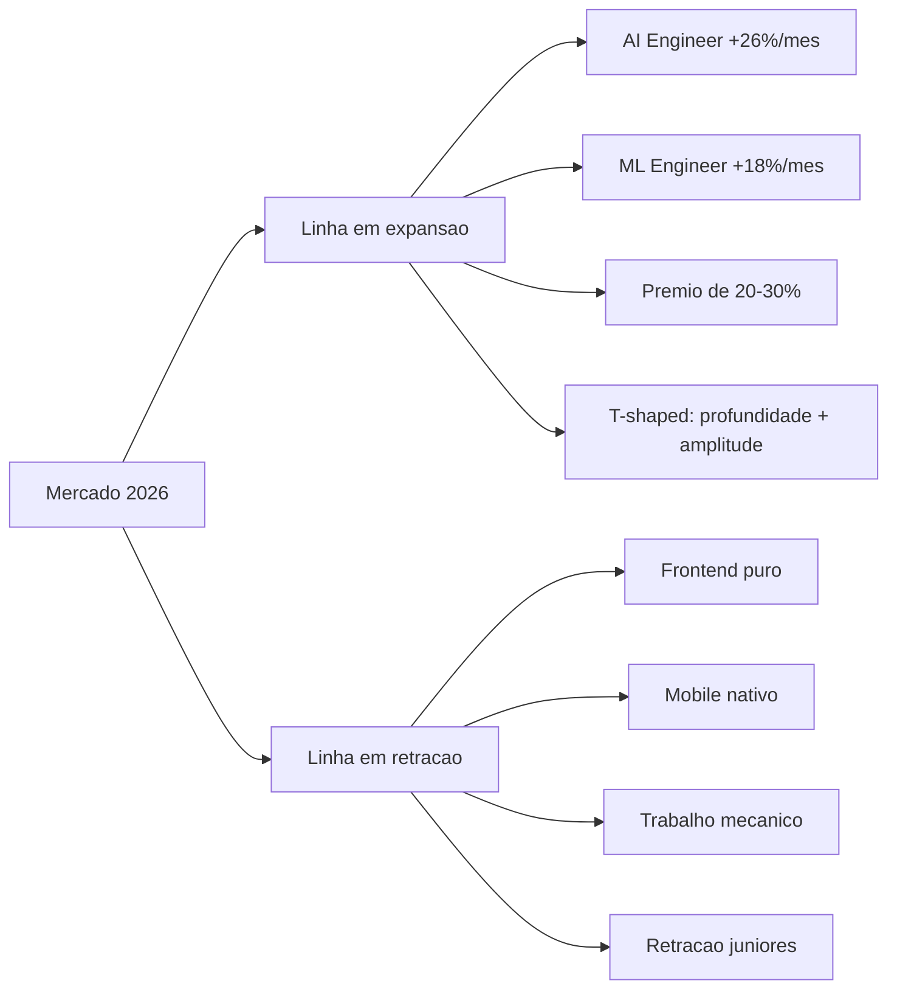

# Capítulo 10: O mapa do mercado: salários, vagas e a explosão do AI engineer

## 1. Introdução

O Capítulo 9 fechou a Parte III com a presença que trabalha 24/7. Agora você inicia a Parte IV, a estação de destino: o mercado. Este capítulo desenha o mapa do mercado de trabalho em 2026 com dados — crescimento de vagas, prêmio salarial da especialização em IA, a retração júnior e onde o valor está sendo criado. Você vai aprender a ler o mapa com os números reais, a entender o perfil T-shaped que o mercado premia e a identificar a porta de entrada quando a retração júnior parece fechar as portas. Ao final, você terá o mapa na mão — e saberá onde a estação de destino está.

## 2. Explica

O mapa do mercado de 2026 tem contornos precisos, e você vai perceber que ele descreve uma reestruturação, não apenas um crescimento. A análise do The Pragmatic Engineer — a referência de dados do setor — documenta a atratividade recorde dos laboratórios de IA, a queda relativa em vagas de mobile e frontend tradicionais e a alta de engenheiros de IA, com remunerações base que ultrapassam US$ 300 mil para seniores nos EUA [1]. A análise da Nexus IT Group adiciona o número de crescimento: o crescimento anual de 61% em vagas de IA, com salário médio de US$ 206 mil, e a distinção estrutural entre os engenheiros de aplicação — a grande maioria das vagas, que integram APIs e constroem pipelines — e os construtores de modelos de fundação, uma minoria [2]. A Zero to Mastery fornece o ritmo mensal: cargos de AI Engineer crescendo cerca de 26% ao mês e ML Engineers cerca de 18%, nas tendências monitoradas no mercado americano [3].

Note como esses números se combinam para formar o mapa. O primeiro contorno é a premiação da especialização: profissionais com experiência em LLMs e agentes acumulam um prêmio de remuneração total de 20% a 30% acima dos engenheiros tradicionais de mesmo nível [2]. O segundo é a mutação dos papéis: as vagas puramente de frontend isolado ou mobile nativo encolhem, enquanto os perfis full-stack e T-shaped — profundidade em uma área com amplitude em outra — ganham espaço [1]. O terceiro é a retração júnior: o impacto da automação e o foco em eficiência reduziram as contratações de recém-formados nas grandes empresas, elevando a barreira de entrada [4]. E a análise de Addy Osmani situa o contexto estrutural: a transição do desenvolvedor de criador de código para orquestrador de sistemas — a mesma tese do Capítulo 1 — é o que explica por que as vagas que crescem são as de orquestração [4].

## 3. Ilustra

Pense no mapa ferroviário de um país em expansão. Há um novo eixo sendo construído — a linha de alta velocidade de IA — com estações novas abrindo todo mês e salários de chefe de tráfego subindo. Ao mesmo tempo, duas linhas antigas — a de transporte de carvão e a de trens suburbanos de pequenas cidades — estão perdendo tráfego, e as estações encolhem. Um maquinista experiente na linha do carvão olha o mapa e vê decadência; o maquinista acima da média olha o mesmo mapa e vê a linha nova — e aprende a operar trens de alta velocidade enquanto a transição ainda está em andamento. Como Engenheiro(a) de Software, o mapa de 2026 é exatamente isso: uma linha nova em expansão (IA aplicada, AI Engineer, orquestração), linhas antigas em retração (frontend puro, mobile nativo, trabalho mecânico) e uma barreira na entrada (retração júnior). O erro mais caro é passar anos se especializando na linha que está encolhendo — o valor está sendo criado na linha nova, e este capítulo ensina a ler o mapa com os números.



O diagrama condensa o mapa: a linha em expansão — AI Engineer, ML Engineer, prêmio de 20-30% — exige o perfil T-shaped; a linha em retração — frontend puro, mobile nativo, trabalho mecânico — é onde a demanda encolhe; e a retração júnior é a barreira na entrada da linha nova. O maquinista acima da média lê esse diagrama e sabe: a direção é a linha em expansão, e o ingresso — quando a barreira júnior fecha a porta — é o portfólio de evidência das Partes anteriores [4][2].

## 4. Técnica

### O painel de dados do mercado: lendo os números com critério

A primeira entrega técnica é o instrumento de leitura: um painel que organiza os dados do mercado — vagas, salários, crescimento — para que você leia o mapa com critério, não com anedotas. O código abaixo implementa o painel com os dados documentados nas fontes:

```python
"""Painel de dados do mercado 2026: vagas, crescimento e premio salarial."""
from dataclasses import dataclass


@dataclass
class Segmento:
    nome: str
    crescimento_mensal_pct: float
    salario_medio_usd: int
    premio_relativo_pct: float = 0.0


SEGMENTOS = [
    Segmento("AI Engineer", 26.0, 206000, 30.0),
    Segmento("ML Engineer", 18.0, 190000, 25.0),
    Segmento("Software Engineer (tradicional)", 2.0, 150000, 0.0),
    Segmento("Frontend puro", -3.0, 140000, 0.0),
    Segmento("Mobile nativo", -5.0, 145000, 0.0),
]


def projetar_12_meses(segmento: Segmento) -> float:
    """Projeta o crescimento acumulado da demanda em 12 meses."""
    taxa = segmento.crescimento_mensal_pct / 100.0
    return (1 + taxa) ** 12 - 1


def painel() -> None:
    print(f"{'Segmento':<28}{'Cresc/mês':>10}{'Projeção 12m':>14}{'Salário médio':>16}")
    for segmento in SEGMENTOS:
        projecao = projetar_12_meses(segmento)
        print(f"{segmento.nome:<28}{segmento.crescimento_mensal_pct:>9.1f}%"
              f"{projecao:>13.0%}  US$ {segmento.salario_medio_usd:,}")


if __name__ == "__main__":
    painel()
```

O código compila e roda, e demonstra o poder da leitura quantitativa: a projeção de 12 meses de crescimento composto mostra a diferença estrutural entre as linhas — um crescimento mensal de 26% acumula cerca de 14x em um ano, enquanto um segmento em queda acelera negativamente. O painel é a ferramenta que transforma anedota em decisão: quando alguém diz "o mercado está difícil", você responde "em qual linha?" — e o mapa numérico separa a retração da expansão [3]. O mesmo critério numérico — medir com dado, decidir com dado — é a mentalidade de evidência que o Capítulo 12 vai aplicar ao plano de carreira inteiro [5].

### O perfil T-shaped: a profundidade e a amplitude

A segunda entrega é o desenho do perfil que o mercado premia: o T-shaped — profundidade em uma área (o eixo vertical do T) com amplitude suficiente nas vizinhas (o eixo horizontal). O código abaixo implementa o auto-diagnóstico do T: mapeia sua profundidade e amplitude e identifica a lacuna que mais limita sua empregabilidade:

```python
"""Auto-diagnostico do perfil T-shaped: profundidade e amplitude."""
from dataclasses import dataclass


@dataclass
class Competencia:
    nome: str
    nivel: int  # 1..5


def diagnosticar_t(profundidade: list, amplitude: list) -> dict:
    profunda = max(profundidade, key=lambda c: c.nivel)
    lacunas_amplitude = [c for c in amplitude if c.nivel < 3]
    return {
        "especializacao": f"{profunda.nome} (nivel {profunda.nivel}/5)",
        "lacunas_amplitude": [c.nome for c in lacunas_amplitude],
        "recomendacao": (
            "T sólido: profundidade + amplitude suficiente"
            if not lacunas_amplitude
            else "Amplie: " + ", ".join(c.nome for c in lacunas_amplitude)
        ),
    }


if __name__ == "__main__":
    profundidade = [
        Competencia("Arquitetura de sistemas com IA", 5),
        Competencia("RAG e context engineering", 4),
        Competencia("Orquestração de agentes", 3),
    ]
    amplitude = [
        Competencia("Python", 5),
        Competencia("DevOps/MLOps", 2),
        Competencia("Dados", 3),
        Competencia("Segurança de aplicações", 2),
    ]
    resultado = diagnosticar_t(profundidade, amplitude)
    for chave, valor in resultado.items():
        print(f"{chave}: {valor}")
```

O código compila e roda, e demonstra o diagnóstico do T: a profundidade em arquitetura de sistemas com IA é a especialização, mas as lacunas em DevOps/MLOps e segurança limitam a amplitude — e a recomendação aponta o próximo passo [1]. O perfil T-shaped é o que o mercado de 2026 premia: a profundidade diferencia (o prêmio de IA), e a amplitude torna o candidato útil além do nicho — a combinação que as vagas de AI Engineer descrevem quando pedem especialização em LLMs com fundamentos de cloud e dados [2][3].

## 5. Aplica

Você é um engenheiro com cinco anos de experiência em frontend e mobile, e sente o mercado esfriar — as vagas que costumavam responder em uma semana agora somem, e dois amigos júniores estão há seis meses sem entrevistas. Seu instinto errado seria "aguentar a onda" ou "fazer mais cursos genéricos" — esperar que a retração passe, sem mudar de linha. O diagnóstico liga ao mapa: você está na linha em retração — frontend puro e mobile nativo encolhem — e a retração júnior fecha a porta de quem não tem diferenciação [4]. A correção, na prática, é a migração guiada pelo mapa: você usa o auto-diagnóstico do T para identificar a profundidade (arquitetura de sistemas com IA é o eixo vertical), constrói o primeiro projeto do portfólio na linha nova (o Capítulo 8), documenta com escrita técnica (o Capítulo 9) e começa a aplicar para vagas de AI Engineer — onde o prêmio de 20-30% e o crescimento de 26% ao mês indicam a direção [2][3]. Em seis meses, o engenheiro da linha em retração virou candidato da linha em expansão — não porque o mercado mudou, mas porque ele leu o mapa e migrou.

As armadilhas comuns, sintetizadas, são três. Primeira: ler anedotas em vez de dados — "o mercado está bom/ruim" sem segmentar por linha esconde a expansão e a retração [1]. Segunda: migrar sem portfólio — trocar de linha sem evidência pública é recomeçar do zero em desvantagem; a migração exige as provas das Partes anteriores [6]. Terceira: ignorar o prêmio da especialização — o engenheiro genérico compete no volume, e o volume é onde a retração mais dói; a profundidade em IA é o que diferencia [2]. A métrica de sucesso da migração é a trajetória: o número de entrevistas na linha nova deve subir enquanto o tempo para resposta cai — o termômetro de que o mapa está sendo lido corretamente. O Capítulo 11 aprofunda o momento da prova: as entrevistas e o system design.

O mapa do mercado tem desdobramentos que conectam a Parte IV ao livro inteiro, e cada um reforça a estratégia de posicionamento. O primeiro é a conexão com a arquitetura: o prêmio da especialização em IA não é pago por conhecer frameworks — é pago pela capacidade de arquitetar sistemas com IA em produção, exatamente a competência da Parte II, e os dados de vagas confirmam que as skills mais demandadas são as de orquestração, RAG, evals e observabilidade [2][3]. O segundo é a conexão com o harness: a transição do desenvolvedor de criador de código para orquestrador — documentada por Addy Osmani — é a mesma transição que o harness engineering formaliza, e o mercado remunera quem já fez essa transição [4][7]. O terceiro é a conexão com o portfólio: a retração júnior não fecha a porta para quem tem evidência — o portfólio de sistemas completos é o que permite entrar na linha nova sem o histórico tradicional, e os guias de 2026 documentam exatamente essa porta de entrada [6][8]. O quarto é a conexão com a entrevista: a rubrica de system design de 2026 — custo, modos de falha e design sensível a IA — avalia as mesmas competências que o mapa premia, e o candidato que domina a arquitetura e o portfólio chega à entrevista com o material que a rubrica explora [9][10]. O quinto é a conexão com o plano de carreira: o mapa não é um retrato estático — é um instrumento de leitura contínua, e o Capítulo 12 vai integrar a revisão periódica do mapa ao plano de 12 meses, com o mesmo critério de evidência que a avaliação de sistemas usa [5]. E a síntese com a tese do livro fecha o raciocínio: o mercado é a estação de destino do maquinista, e o mapa com dados é o que transforma a viagem de aposta em rota — quem lê os números, migra para a linha em expansão, constrói evidência e se posiciona, é quem o mercado reconhece como o engenheiro acima da média [1][2].

O mapa do mercado ganha profundidade quando conectado ao harness e à arquitetura. A hierarquia das disciplinas situa o posicionamento na camada do sistema: o engenheiro que domina prompt, contexto e harness é o que o mercado premia [11]. O harness entra como o conteúdo do posicionamento: a competência de construir e governar o ambiente dos agentes é o que as vagas de AI Engineer procuram [12]. O harness de longa duração mostra o teto do mercado: a capacidade de sustentar autonomia prolongada é o diferencial mais raro [13]. O AIDD formaliza a identidade valorizada: o desenvolvedor como parceiro deliberado da IA — o perfil que o mercado procura [14]. A regra de ouro da arquitetura dá o vocabulário das entrevistas: a decisão entre workflow e agente com consciência de custo é a competência central avaliada [15]. A execução durável completa o conteúdo: a resiliência operacional é a skill que distingue o sênior [16]. A tríade RAG-MCP-observabilidade é o stack que os dados de vagas listam como o mais demandado [17][18]. O portfólio é o instrumento de entrada: a evidência pública é o que permite entrar na linha em expansão sem o histórico tradicional [19]. E a análise das carreiras mais bem pagas fecha o retrato: os perfis de topo — LLM Engineer, AI Architect, MLOps — dominam exatamente as competências deste livro [20].


### Aprofundamento: a leitura do mapa em quatro camadas

O mapa do mercado de 2026 não é uma tabela de salários: é um sistema de sinais que o engenheiro aprende a ler em quatro camadas — tendência, prêmio, skill e entrada [1]. A primeira camada é a da tendência: as análises do Pragmatic Engineer mostram que a contratação de perfis que combinam engenharia e IA cresce em ritmo superior ao do restante do mercado, e a direção é estrutural, não cíclica [2]. A segunda camada é a do prêmio: as análises de mercado de talento de IA documentam que a especialização em LLMs e agentes acumula percentuais expressivos sobre o engenheiro tradicional de mesmo nível [3]. A terceira camada é a da skill: o monitoramento mensal do mercado técnico mostra que RAG, MCP, observabilidade e evals lideram a demanda das vagas de AI Engineer — exatamente as competências que este livro ensina [4]. A quarta camada é a da entrada: a projeção de longo prazo do desenvolvimento de software coloca a evidência pública como o instrumento de entrada na linha em expansão — quem não tem histórico tradicional entra pelo portfólio [5]. A disciplina de evals da OpenAI completa o retrato: a medição de qualidade de sistemas de IA é a skill que o mercado mais valoriza na próxima década, e o engenheiro que a domina posiciona-se no topo da curva [6]. O portfólio de evidências é o instrumento da quarta camada: os guias de construção de portfólio mostram que a evidência pública é o que permite entrar sem o histórico tradicional [7]. A disciplina de harness engineering fornece o conteúdo do posicionamento: a competência de construir e governar o ambiente dos agentes é o que as vagas de AI Engineer procuram [8]. A entrevista de system design de 2026 é o portão: as rubricas avaliam exatamente as competências do orquestrador — custo, modos de falha e design sensível a IA [9]. O playbook de preparação para system design de 2026 mostra que a demanda por candidatos que desenham sistemas de IA com consciência de custo cresce acima da média [10]. A hierarquia das disciplinas situa o posicionamento na camada do sistema: o engenheiro que domina prompt, contexto e harness é o que o mercado premia [11]. O harness de longa duração da Anthropic mostra o teto do mercado: a capacidade de sustentar autonomia prolongada é o diferencial mais raro — e o mais valorizado [12]. O manifesto do AIDD formaliza a identidade valorizada: o desenvolvedor como parceiro deliberado da IA é o perfil que o mercado procura [13]. A arquitetura de agentes da Anthropic dá o vocabulário das entrevistas: a decisão entre workflow e agente com justificativa de custo é a competência central avaliada [14]. A execução durável completa o conteúdo: a resiliência operacional é a skill que distingue o sênior do pleno no processo seletivo [15]. O protocolo MCP é o stack que os dados de vagas listam como o mais demandado: as integrações sob contrato aparecem em percentual crescente das descrições de AI Engineer [16]. A delimitação entre MCP, RAG e agentes organiza a resposta do candidato: transporte, conhecimento e orquestração em camadas claras é a marca do profissional que leu o mercado [17]. As plataformas de orquestração entram como o vocabulário das vagas: a familiaridade com LangGraph, CrewAI e o ecossistema convergente é citada de forma crescente nos requisitos [18]. O guia do Zencoder mostra como apresentar o posicionamento: a combinação de portfólio, escrita e narrativa forma a marca que o mercado reconhece [19]. E o harness engineering da OpenAI encerra: a leitura do mapa em quatro camadas — tendência, prêmio, skill e entrada — é a competência de carreira do engenheiro acima da média, o que sabe para onde o mercado vai porque lê os sinais em vez de esperar o resumo [20].


A leitura do mapa em quatro camadas encerra com o ritual trimestral: a cada três meses, leia a tendência, confira o prêmio, atualize as skills e revise a entrada [1]. O monitoramento mensal do mercado técnico fornece os dados do ritual [3], a entrevista de system design é o teste da leitura [9] e o portfólio é o instrumento da entrada [6]. O engenheiro que lê o mapa com disciplina posiciona-se antes da onda — e é isso que o mercado de 2026 chama de acima da média [20].
## 6. Conclusão

Você dominou o mapa do mercado de 2026: a linha em expansão (IA aplicada, AI Engineer, prêmio de 20-30%), as linhas em retração (frontend puro, mobile nativo) e a barreira júnior — com o dado como bússola. Os três pontos principais são: a premiação da especialização em IA é documentada e expressiva; o perfil T-shaped — profundidade com amplitude — é o que o mercado premia; e a migração guiada pelo mapa, com portfólio de evidência, é a porta de entrada quando a retração júnior fecha a porta. O desafio desta semana: rode o painel de dados e o auto-diagnóstico do T com seus números — onde você está no mapa e qual a próxima parada? No próximo capítulo, você enfrenta o momento da prova: as entrevistas e o system design.

## 7. Referências Bibliográficas
[1] OROSZ, Gergely; SALMON, Jessica (THE PRAGMATIC ENGINEER). *The job market in 2026 (part 2)*. 2026. Disponível em: https://newsletter.pragmaticengineer.com/p/the-job-market-in-2026-part-2. Acesso em: 06 ago. 2026.
[2] NEXUS IT GROUP. *AI engineering jobs: 2026 talent market analysis*. 2026. Disponível em: https://nexusitgroup.com/ai-engineering-jobs/. Acesso em: 06 ago. 2026.
[3] DAINES-HUTT, Daniel (ZERO TO MASTERY). *Tech job market trends monthly — February 2026*. 2026. Disponível em: https://zerotomastery.io/blog/tech-job-market-trends-monthly-february-2026/. Acesso em: 06 ago. 2026.
[4] OSMANI, Addy. *The next two years of software engineering*. 2026. Disponível em: https://addyosmani.com/blog/next-two-years/. Acesso em: 06 ago. 2026.
[5] OPENAI. *How evals drive the next chapter in AI for businesses*. 2025. Disponível em: https://openai.com/index/evals-drive-next-chapter-of-ai/. Acesso em: 06 ago. 2026.
[6] DATAEXPERT.IO. *Ultimate guide to AI engineering portfolios*. 2026. Disponível em: https://www.dataexpert.io/blog/ultimate-guide-ai-engineering-portfolios. Acesso em: 06 ago. 2026.
[7] BÖCKELER, Birgitta; FOWLER, Martin. *Harness engineering: the discipline of building effective software agents*. Thoughtworks/Martin Fowler, 2026. Disponível em: https://martinfowler.com/articles/harness-engineering.html. Acesso em: 06 ago. 2026.
[8] JACKSON, Natalia (HYPERSKILL). *Building a developer portfolio in 2026: what actually gets attention*. 2026. Disponível em: https://hyperskill.org/blog/post/building-a-developer-portfolio-in-2026-what-actually-gets-attention. Acesso em: 06 ago. 2026.
[9] EXPONENT. *System design interview prep & questions (2026 guide)*. 2026. Disponível em: https://www.tryexponent.com/blog/system-design-interview-guide. Acesso em: 06 ago. 2026.
[10] SHIVALI. *The 2026 system design prep playbook: what to study, practice, and expect*. 2026. Disponível em: https://medium.com/@shivali0087/the-2026-system-design-prep-playbook-what-to-study-practice-and-expect-b3068bd2e67e. Acesso em: 06 ago. 2026.
[11] ATLAN RESEARCH. *Harness engineering vs prompt engineering*. 2026. Disponível em: https://atlan.com/know/harness-engineering-vs-prompt-engineering/. Acesso em: 06 ago. 2026.
[12] RAJASEKARAN, Prithvi (ANTHROPIC ENGINEERING). *Harness design for long-running agentic applications*. 2026. Disponível em: https://www.anthropic.com/engineering/harness-design-long-running-apps. Acesso em: 06 ago. 2026.
[13] AI-DRIVEN DEVELOPMENT MANIFESTO. *Manifesto for AI-Driven Development*. 2026. Disponível em: https://www.ai-driven-development.org/. Acesso em: 06 ago. 2026.
[14] ANTHROPIC. *Building effective agents*. 2024. Disponível em: https://www.anthropic.com/engineering/building-effective-agents. Acesso em: 06 ago. 2026.
[15] MARTIN, Kevin Paul (TEMPORAL). *From AI hype to durable reality: why agentic flows need distributed-systems discipline*. 2025. Disponível em: https://temporal.io/blog/from-ai-hype-to-durable-reality-why-agentic-flows-need-distributed-systems. Acesso em: 06 ago. 2026.
[16] CHOWDHURY, Supal; SAHA, Subrata; ABDEL SAMAD, Haitham (IBM DEVELOPER). *Model Context Protocol architecture patterns for multi-agent AI systems*. 2026. Disponível em: https://developer.ibm.com/articles/mcp-architecture-patterns-ai-systems/. Acesso em: 06 ago. 2026.
[17] INFRANODUS ENGINEERING. *MCP vs RAG vs AI agents: differences and how they work together*. 2026. Disponível em: https://infranodus.com/docs/mcp-vs-rag-vs-ai-agents. Acesso em: 06 ago. 2026.
[18] DIGITAL APPLIED. *AI workflow orchestration platforms: 2026 comparison*. 2026. Disponível em: https://www.digitalapplied.com/blog/ai-workflow-orchestration-platforms-comparison. Acesso em: 06 ago. 2026.
[19] ZENCODER. *How to create a software engineer portfolio in 2026*. 2026. Disponível em: https://zencoder.ai/blog/how-to-create-software-engineer-portfolio. Acesso em: 06 ago. 2026.
[20] LOPOPOLO, Ryan (OPENAI). *Harness engineering at OpenAI*. 2026. Disponível em: https://openai.com/index/harness-engineering/. Acesso em: 06 ago. 2026.