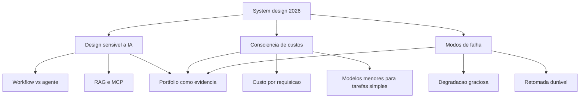

# Capítulo 11: Entrevistas e system design: provar arquitetura sob pressão

## 1. Introdução

No Capítulo 10, você aprendeu a ler o mapa do mercado e a posicionar a estação de destino. Agora você enfrenta o momento da prova: a entrevista técnica — e, dentro dela, o rito mais temido e mais decisivo, o system design. Em 2026, a rubrica mudou: não basta desenhar caixinhas e setas — o avaliador quer ver consciência de custo, análise de modos de falha e design sensível a IA. Este capítulo ensina a nova rubrica, como apresentar o portfólio como evidência dentro da entrevista e como a negociação materializa o prêmio de IA. Ao final, você terá o método para provar arquitetura sob pressão — e o portfólio como seu melhor argumento.

## 2. Explica

O system design de 2026 tem uma definição operacional que você vai perceber ao entender o que mudou na rubrica. A análise do Exponent — que compila perguntas reais de empresas como OpenAI, Anthropic e Google — formula a mudança: o gabarito estático ("adicione mais servidores") foi substituído por três dimensões críticas — design sensível a IA, consciência de custos e modos de falha operacionais [1]. A análise de Shivali reforça a mesma direção: a evolução das entrevistas de arquitetura enfatiza o custo por requisição de inferência, o cache com TTL apropriado versus recomputação, e o uso de modelos menores para tarefas simples — os router patterns [2]. A consequência: o candidato que raciocina em termos de sistema — latência, custo, degradação — é classificado como sênior, enquanto o candidato que desenha a topologia "certa" sem custo e sem falhas é classificado como pleno.

Note a mecânica da prova em duas camadas. A primeira é a camada técnica: o raciocínio de arquitetura — a regra de ouro entre workflow e agente (Capítulo 4), a durabilidade (Capítulo 5), o RAG e o MCP (Capítulo 6) — aplicado em tempo real a um problema que o candidato não viu antes. A segunda é a camada de evidência: o portfólio — o relatório de decisões e métricas do Capítulo 8 — fornece o material concreto que o candidato narra como prova: "quando eu desenhei isso, a decisão foi X por causa de Y, e o resultado foi Z" [3]. A rubrica de 2026 não avalia apenas o desenho do quadro branco — avalia a coerência entre o que o candidato desenha e o que ele já construiu, e é exatamente essa coerência que o portfólio documentado fornece [1]. A entrevista técnica, assim, deixa de ser um teste de memória e vira um teste de coerência entre narrativa e evidência.

## 3. Ilustra

Pense no exame de habilitação do maquinista acima da média — não o exame de novato, que pede para dirigir em linha reta, mas o exame de chefe de tráfego, que coloca o candidato diante de um painel de simulação com um cenário desconhecido: um trecho de montanha, uma locomotiva com defeito intermitente, um orçamento de combustível limitado e a exigência de chegar a tempo. O candidato não decorou esse cenário — ele foi treinado por cenários reais anteriores, e a resposta mostra não o que ele memorizou, mas como ele raciocina: qual rota, quanto combustível reservar, o que fazer quando a locomotiva falha no pior trecho. Como Engenheiro(a) de Software, o system design é esse exame: um cenário que você não viu, avaliado pela qualidade do raciocínio — e o seu treino não é decorar diagramas, é ter construído sistemas reais, documentado as decisões e medido os resultados. O caderno de registros (o portfólio) é o que diferencia o candidato que narra de memória do candidato que narra com evidência.



O diagrama mostra as três dimensões da rubrica de 2026: design sensível a IA, consciência de custos e modos de falha — cada uma com seus tópicos — e o portfólio como a base de evidência que sustenta as três [1][2]. O candidato que construiu e documentou sistemas reais não precisa decorar: cada tópico da rubrica corresponde a uma decisão que ele já tomou e pode narrar com dados. O portfólio não é um extra da entrevista — é o treino para ela.

## 4. Técnica

### O framework de resposta: dos requisitos aos números

A primeira entrega técnica é o framework de resposta do system design: a sequência que estrutura o raciocínio diante do quadro branco — e que já embute as três dimensões da rubrica. O código abaixo implementa o esqueleto do framework, com os prompts que guiam o candidato do problema aos números:

```python
"""Framework de resposta de system design: requisitos, custo e falhas."""
from dataclasses import dataclass


@dataclass
class Dimensionamento:
    usuarios: int
    requisicoes_por_usuario_dia: int
    custo_por_chamada_usd: float

    def custo_diario(self) -> float:
        return self.usuarios * self.requisicoes_por_usuario_dia * self.custo_por_chamada_usd

    def custo_mensal(self) -> float:
        return self.custo_diario() * 30


def framework_resposta() -> list:
    """As etapas da resposta, com as perguntas que o avaliador espera."""
    return [
        "1. Requisitos: qual o problema real? (leitura critica do enunciado)",
        "2. Design sensivel a IA: workflow ou agente? qual modelo em qual camada?",
        "3. Custo: quanto custa por requisicao? onde o cache reduz?",
        "4. Modos de falha: o que acontece quando o modelo cai? e o banco?",
        "5. Escala: onde esta o gargalo com 10x os usuarios?",
        "6. Evidencia: que decisao similar eu ja construi? qual foi o resultado?",
    ]


if __name__ == "__main__":
    exemplo = Dimensionamento(
        usuarios=100_000,
        requisicoes_por_usuario_dia=5,
        custo_por_chamada_usd=0.01,
    )
    print(f"Custo diario estimado: US$ {exemplo.custo_diario():,.2f}")
    print(f"Custo mensal estimado: US$ {exemplo.custo_mensal():,.2f}")
    print()
    print("Framework de resposta:")
    for etapa in framework_resposta():
        print(etapa)
```

O código compila e roda, e demonstra a primeira competência que a rubrica mede: a consciência de custo — o dimensionamento transforma a pergunta "desenhe um sistema de triagem" em números: cem mil usuários, cinco requisições por dia, um centavo por chamada — meio milhão de dólares por mês sem cache, e o avaliador espera que você perceba que esse número muda o desenho inteiro (cache, modelos menores, workflows em vez de agentes) [2]. O framework de resposta é o roteiro: dos requisitos à evidência, cobrindo as três dimensões da rubrica em ordem [1]. Cada etapa corresponde a um capítulo deste livro — e o candidato que construiu o sistema real responde a etapa seis com o relatório de evidências do Capítulo 8.

### A narrativa de portfólio: transformando o repositório em argumento

A segunda entrega é o artefato que conecta o portfólio à entrevista: a narrativa preparada — o resumo de cada projeto no formato de decisão-evidência-resultado, pronto para ser narrado sob pressão. O código abaixo gera as narrativas a partir dos dados do projeto:

```python
"""Gera narrativas de portfolio para entrevista: decisao, evidencia, resultado."""
from dataclasses import dataclass


@dataclass
class ProjetoNarrativa:
    nome: str
    decisao: str
    alternativa: str
    evidencia: str
    resultado: str

    def narrar(self) -> str:
        return (
            f"{self.nome} — decidi {self.decisao} em vez de {self.alternativa}, "
            f"porque {self.evidencia}. O resultado foi {self.resultado}."
        )


def gerar_narrativas(projetos: list) -> list:
    return [p.narrar() for p in projetos]


if __name__ == "__main__":
    projetos = [
        ProjetoNarrativa(
            "Triagem Agêntica",
            "workflow com roteador",
            "agente em tudo",
            "o caminho era conhecido e a regra de ouro manda workflow para previsibilidade",
            "custo por requisição caiu de $0.12 para $0.014 com 87% de precisão",
        ),
        ProjetoNarrativa(
            "RAG Híbrido",
            "busca lexical + vetorial",
            "busca vetorial pura",
            "consultas com termos exatos falhavam na via isolada",
            "latência p95 de 1.1s dentro da meta de 1.2s",
        ),
    ]
    for narrativa in gerar_narrativas(projetos):
        print("-", narrativa)
```

O código compila e roda, e demonstra o formato de narrativa que a entrevista consome: decisão (o que escolhi), alternativa (o que descartei), evidência (por que, ligando à teoria) e resultado (com métrica). A narrativa é o caderno do maquinista em forma de fala: o candidato que a preparou não improvisa — narra com coerência, e a coerência é o que a rubrica de 2026 avalia [1]. O formato decisão-alternativa-evidência-resultado é também o formato do artigo técnico do Capítulo 9 — a mesma estrutura servindo ao portfólio, à escrita e à entrevista.

## 5. Aplica

Você está na entrevista de system design para uma vaga de AI Engineer sênior. O avaliador desenha o cenário: "projete um sistema que classifica milhões de documentos por dia usando LLM". Seu instinto errado seria sair desenhando a topologia "certa" — o cluster, o banco vetorial, a fila — sem perguntar nada e sem números, como o candidato do gabarito antigo. O diagnóstico liga à rubrica: sem requisitos, o design é arbitrário; sem custo, o design é irresponsável; sem modos de falha, o design é ingênuo — e o avaliador de 2026 marca exatamente essas lacunas [1]. A correção, na prática, é o framework deste capítulo: você pergunta os requisitos (volume, latência, orçamento), dimensiona o custo por documento (a pergunta que muda o desenho), decide workflow onde o caminho é conhecido (roteador + classificadores), projeta a degradação (o que acontece quando o modelo cai) e — no fechamento — conecta com a evidência: "construí algo similar, a decisão foi X por causa de Y, o resultado foi Z", narrando o projeto do portfólio [3][2]. A entrevista vira uma conversa entre engenheiros — e o candidato que chegou com o caderno sai com a oferta.

As armadilhas comuns, sintetizadas, são três. Primeira: desenhar sem números — a topologia sem custo e sem latência é a assinatura do candidato pleno, e a rubrica de 2026 penaliza explicitamente [2]. Segunda: esquecer os modos de falha — o sistema que "nunca falha" no quadro branco desmorona na pergunta "e se a API cair?"; a degradação graciosa é parte do desenho, não um extra [1]. Terceira: não usar o portfólio — o candidato que construiu sistemas reais e não narra a evidência perde o diferencial mais forte; a entrevista de 2026 recompensa a coerência entre narrativa e prova [3]. A métrica de sucesso da preparação é a fluidez: a capacidade de responder cada etapa do framework com exemplos reais — e o portfólio documentado é o que fornece os exemplos. O Capítulo 12 fecha o livro com o plano de carreira: a síntese das três partes em um programa de 12 meses.

A entrevista tem desdobramentos que conectam o momento da prova à estratégia inteira, e cada um reforça a posição do candidato. O primeiro é a conexão com a arquitetura: o system design de 2026 avalia exatamente as competências da Parte II — a regra de ouro, a durabilidade, o RAG e o MCP — e o candidato que domina essas decisões por construção, e não por leitura, responde com profundidade real [4][1]. O segundo é a conexão com o harness: a rubrica que pede modos de falha e resiliência é a mesma competência do Capítulo 3 e do Capítulo 5 — o desenho de guias e sensores aplicado ao sistema inteiro, e a análise da Temporal reforça que a durabilidade é a resposta esperada para a pergunta de resiliência [5][6]. O terceiro é a conexão com o portfólio: a coerência entre narrativa e evidência que a entrevista premia é exatamente o que o relatório de evidências do Capítulo 8 fornece — e os guias de portfólio de 2026 documentam que o candidato que narra decisões reais com métricas é o que a rubrica distingue [3][7]. O quarto é a conexão com o mercado: o prêmio de 20-30% da especialização em IA se materializa na negociação — e a negociação é mais forte quando o candidato tem ofertas alternativas geradas pelo portfólio público, o efeito que a presença 24/7 do Capítulo 9 produz [8][9]. O quinto é a conexão com a avaliação de sistemas: a mentalidade de medir e melhorar — a mesma do ciclo de evals — aplicada à própria preparação: cada entrevista é um teste, cada feedback é evidência, e o plano do Capítulo 12 vai integrar esse loop à rotina [10]. E a síntese com a tese do livro fecha o raciocínio: a entrevista não é o destino — é o portão da estação, e quem chega com o mapa (arquitetura), o caderno (portfólio) e a leitura do mercado posicionado atravessa o portão com a oferta que a linha em expansão paga [8][1].

A entrevista ganha o seu lugar no mapa quando conectada ao harness e à arquitetura. A hierarquia das disciplinas situa a prova na camada do sistema: o candidato que domina prompt, contexto e harness responde com profundidade real [11]. O harness de longa duração mostra o teto da prova: a capacidade de desenhar sistemas que sustentam autonomia prolongada é o que a rubrica mais valoriza [12]. O AIDD formaliza a identidade avaliada: o desenvolvedor como parceiro deliberado — e a entrevista como a verificação dessa identidade [13]. O protocolo MCP entra como o vocabulário das respostas: a arquitetura de integrações desacopladas é o que o avaliador espera no desenho [14]. A delimitação MCP-RAG-agentes organiza o raciocínio: transporte, conhecimento e orquestração em camadas claras é a marca do candidato sênior [15]. A tríade RAG-MCP-observabilidade é o conteúdo das respostas de design sensível a IA [16]. O portfólio é o material da narrativa: o relatório de evidências fornece as decisões reais que a entrevista explora [17]. A presença digital multiplica: o artigo técnico documentado é o aquecimento perfeito para a prova [18][19]. E os dados de mercado confirmam: a entrevista é o portão da linha em expansão, onde o prêmio de IA se materializa [20].


### Aprofundamento: a entrevista como laboratório da competência

A entrevista de system design é o laboratório onde a competência é testada sob pressão — e a rubrica de 2026 avalia exatamente o que este livro ensina: custo, modos de falha e design sensível a IA [1]. A preparação é prática, não decorada: os playbooks de 2026 mostram que o candidato que desenha o sistema de IA — recuperação, ferramentas e monitoramento — responde com profundidade real, enquanto o que decora padrões genéricos desmorona na primeira pergunta de trade-off [2]. O portfólio é o material da narrativa: o candidato que reconstrói as decisões do próprio repositório mostra a diferença entre quem construiu e quem memorizou [3]. A arquitetura de agentes da Anthropic fornece o vocabulário das respostas: o candidato que fala de orchestrator-workers, evaluator-optimizer e routing com exemplos próprios domina a sala [4]. A execução durável entra como o teste de profundidade: a pergunta sobre o que acontece quando o serviço cai no meio do fluxo separa o candidato que pensou o sistema do que só desenhou o feliz caminho [5]. A disciplina de harness engineering dá a moldura da resposta: o candidato que desenha o harness — contexto, ferramentas, memória e loop — responde no nível de sistema, não de prompt [6]. A narrativa do portfólio, seguindo os guias de 2026, fornece as histórias reais: o incidente, a decisão e o resultado medido são o material que a entrevista explora [7]. O mercado de trabalho de 2026 confirma o peso da prova: as análises do Pragmatic Engineer mostram que a entrevista de system design é o filtro central dos processos para vagas de IA [8]. As análises de mercado de talento mostram que a capacidade de comunicar arquitetura é a skill que o recrutador mais distingue entre candidatos tecnicamente equivalentes [9]. A disciplina de evals da OpenAI entra como o diferencial da resposta: o candidato que propõe a rubrica de avaliação do próprio desenho demonstra maturidade que impressiona o avaliador [10]. A hierarquia das disciplinas organiza a estrutura da resposta: o candidato que separa prompt, contexto e harness mostra que entende os níveis do sistema [11]. O harness de longa duração da Anthropic mostra o teto da prova: a capacidade de desenhar sistemas que sustentam autonomia prolongada é o que a rubrica mais valoriza [12]. O manifesto do AIDD formaliza a identidade avaliada: o desenvolvedor como parceiro deliberado — e a entrevista como a verificação dessa identidade [13]. O protocolo MCP entra como o vocabulário das integrações: o candidato que desenha ferramentas sob contrato mostra maturidade de arquitetura [14]. A delimitação entre MCP, RAG e agentes organiza o raciocínio da resposta: transporte, conhecimento e orquestração em camadas claras é a marca do candidato sênior [15]. As plataformas de orquestração entram como o contexto de mercado: o candidato que compara plataformas com critérios — observabilidade, custo, resiliência — demonstra leitura atualizada [16]. O guia do Zencoder mostra como preparar a narrativa: o problema, a decisão e o resultado medido formam a história que o candidato reconta na entrevista [17]. O repositório público fornece a evidência de construção: o commit log e o registro de decisões são o material que sustenta cada afirmação da narrativa [18]. Os projetos de machine learning de ponta a ponta listados pela Udacity são o campo de treino da entrevista: a construção completa exercita as perguntas que a rubrica faz [19]. E o harness engineering da OpenAI encerra: a entrevista de system design é o laboratório onde o engenheiro prova que constrói sistemas — e o que se prepara com evidência real é o que sai aprovado [20].


A entrevista como laboratório encerra com a estratégia de resposta: estruture a solução em camadas — conhecimento, ferramentas, monitoramento — e justifique cada escolha com custo e modo de falha [4]. O playbook de preparação de 2026 recomenda praticar com os próprios projetos [2], e o portfólio fornece as histórias reais que sustentam a resposta [3]. O avaliador não procura a resposta perfeita: procura o raciocínio que constrói sistemas — e esse raciocínio é exatamente o que este livro treinou [20].
## 6. Conclusão

Você dominou o momento da prova: o system design de 2026, com a rubrica de três dimensões — design sensível a IA, consciência de custos e modos de falha. Os três pontos principais são: o framework de resposta — requisitos, custo, falhas, escala, evidência — estrutura o raciocínio e embute a rubrica; a narrativa decisão-alternativa-evidência-resultado transforma o portfólio em argumento; e a coerência entre o que você desenha e o que já construiu é o que classifica o sênior. O desafio desta semana: prepare as narrativas dos seus três projetos mais fortes no formato deste capítulo e treine o framework com um cenário de system design. No próximo e último capítulo, você reúne as três partes em um programa executável: o plano de carreira.

## 7. Referências Bibliográficas
[1] EXPONENT. *System design interview prep & questions (2026 guide)*. 2026. Disponível em: https://www.tryexponent.com/blog/system-design-interview-guide. Acesso em: 06 ago. 2026.
[2] SHIVALI. *The 2026 system design prep playbook: what to study, practice, and expect*. 2026. Disponível em: https://medium.com/@shivali0087/the-2026-system-design-prep-playbook-what-to-study-practice-and-expect-b3068bd2e67e. Acesso em: 06 ago. 2026.
[3] DATAEXPERT.IO. *Ultimate guide to AI engineering portfolios*. 2026. Disponível em: https://www.dataexpert.io/blog/ultimate-guide-ai-engineering-portfolios. Acesso em: 06 ago. 2026.
[4] ANTHROPIC. *Building effective agents*. 2024. Disponível em: https://www.anthropic.com/engineering/building-effective-agents. Acesso em: 06 ago. 2026.
[5] MARTIN, Kevin Paul (TEMPORAL). *From AI hype to durable reality: why agentic flows need distributed-systems discipline*. 2025. Disponível em: https://temporal.io/blog/from-ai-hype-to-durable-reality-why-agentic-flows-need-distributed-systems. Acesso em: 06 ago. 2026.
[6] BÖCKELER, Birgitta; FOWLER, Martin. *Harness engineering: the discipline of building effective software agents*. Thoughtworks/Martin Fowler, 2026. Disponível em: https://martinfowler.com/articles/harness-engineering.html. Acesso em: 06 ago. 2026.
[7] JACKSON, Natalia (HYPERSKILL). *Building a developer portfolio in 2026: what actually gets attention*. 2026. Disponível em: https://hyperskill.org/blog/post/building-a-developer-portfolio-in-2026-what-actually-gets-attention. Acesso em: 06 ago. 2026.
[8] OROSZ, Gergely; SALMON, Jessica (THE PRAGMATIC ENGINEER). *The job market in 2026 (part 2)*. 2026. Disponível em: https://newsletter.pragmaticengineer.com/p/the-job-market-in-2026-part-2. Acesso em: 06 ago. 2026.
[9] NEXUS IT GROUP. *AI engineering jobs: 2026 talent market analysis*. 2026. Disponível em: https://nexusitgroup.com/ai-engineering-jobs/. Acesso em: 06 ago. 2026.
[10] OPENAI. *How evals drive the next chapter in AI for businesses*. 2025. Disponível em: https://openai.com/index/evals-drive-next-chapter-of-ai/. Acesso em: 06 ago. 2026.
[11] ATLAN RESEARCH. *Harness engineering vs prompt engineering*. 2026. Disponível em: https://atlan.com/know/harness-engineering-vs-prompt-engineering/. Acesso em: 06 ago. 2026.
[12] RAJASEKARAN, Prithvi (ANTHROPIC ENGINEERING). *Harness design for long-running agentic applications*. 2026. Disponível em: https://www.anthropic.com/engineering/harness-design-long-running-apps. Acesso em: 06 ago. 2026.
[13] AI-DRIVEN DEVELOPMENT MANIFESTO. *Manifesto for AI-Driven Development*. 2026. Disponível em: https://www.ai-driven-development.org/. Acesso em: 06 ago. 2026.
[14] CHOWDHURY, Supal; SAHA, Subrata; ABDEL SAMAD, Haitham (IBM DEVELOPER). *Model Context Protocol architecture patterns for multi-agent AI systems*. 2026. Disponível em: https://developer.ibm.com/articles/mcp-architecture-patterns-ai-systems/. Acesso em: 06 ago. 2026.
[15] INFRANODUS ENGINEERING. *MCP vs RAG vs AI agents: differences and how they work together*. 2026. Disponível em: https://infranodus.com/docs/mcp-vs-rag-vs-ai-agents. Acesso em: 06 ago. 2026.
[16] DIGITAL APPLIED. *AI workflow orchestration platforms: 2026 comparison*. 2026. Disponível em: https://www.digitalapplied.com/blog/ai-workflow-orchestration-platforms-comparison. Acesso em: 06 ago. 2026.
[17] ZENCODER. *How to create a software engineer portfolio in 2026*. 2026. Disponível em: https://zencoder.ai/blog/how-to-create-software-engineer-portfolio. Acesso em: 06 ago. 2026.
[18] BOUCHARD, Louis-François. *Start AI engineering*. GitHub, 2026. Disponível em: https://github.com/louisfb01/start-ai-engineering. Acesso em: 06 ago. 2026.
[19] UDACITY. *20 machine learning projects that will boost your portfolio*. 2025/2026. Disponível em: https://www.udacity.com/blog/20-machine-learning-projects-that-will-boost-your-portfolio/. Acesso em: 06 ago. 2026.
[20] LOPOPOLO, Ryan (OPENAI). *Harness engineering at OpenAI*. 2026. Disponível em: https://openai.com/index/harness-engineering/. Acesso em: 06 ago. 2026.