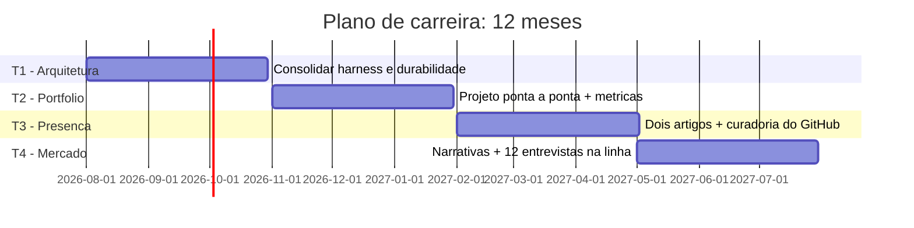

# Capítulo 12: O plano de carreira: do pleno ao engenheiro acima da média

## 1. Introdução

Este é o último capítulo — e o primeiro do programa. Você percorreu o mapa inteiro: a mudança de papel (Parte I), a arquitetura de sistemas (Parte II), o portfólio de provas (Parte III) e o mercado em 2026 (Parte IV). Agora você reúne as três partes em um único instrumento executável: o plano de carreira de 12 meses. Este capítulo transforma a trinca — arquitetura, portfólio, mercado — em ciclos com metas, marcos e métricas, e fecha com a mentalidade que sustenta o diferencial: o que nenhum agente de código vai substituir. Ao final, você terá o mapa do maquinista transformado em rota com data de partida.

## 2. Explica

O plano de carreira tem uma definição que você vai perceber ao aplicar ao seu próprio contexto: é um sistema com metas, marcos e métricas — não uma lista de resoluções. A lógica vem da própria disciplina que o livro ensinou: especificar, medir, melhorar — o ciclo de evals aplicado à carreira [1]. A especificação é o estado desejado ("engenheiro acima da média", com definição operacional); a medição são as métricas de progresso (proporção de orquestração, projetos do portfólio, entrevistas por mês); e a melhoria é o ajuste contínuo do plano com base na evidência — exatamente como um sistema de IA é avaliado e melhorado [1].

A mecânica do plano se apoia em três princípios que organizam os doze meses. O primeiro é o ciclo trimestral: cada trimestre tem um tema dominante — o primeiro consolida a arquitetura, o segundo constrói o portfólio, o terceiro ativa a presença pública e o quarto mira o mercado — porque a trinca precisa de sequência, não de simultaneidade [2]. O segundo é a métrica por ciclo: cada trimestre tem metas mensuráveis — um sistema com arquitetura documentada, um projeto de ponta a ponta publicado, dois artigos técnicos, doze entrevistas na linha nova — porque o que não é medido não é melhorado [1]. O terceiro é o loop de revisão: a revisão mensal do plano contra as métricas, com ajuste — a mesma disciplina de avaliação contínua que os sistemas de IA usam, e que o mercado de 2026 recompensa como mentalidade de evidência [3]. O mapa do mercado do Capítulo 10 entra no plano como instrumento de leitura periódica: a estação de destino pode mudar, e o maquinista acima da média relê o mapa com cadência.

## 3. Ilustra

Pense no plano de construção de uma nova linha ferroviária. O engenheiro responsável não começa colocando trilhos ao acaso — ele divide a obra em fases: primeiro o levantamento do terreno (arquitetura), depois a construção do primeiro trecho demonstrativo (portfólio), em seguida a abertura da linha ao tráfego com divulgação (presença), e por fim a operação comercial plena (mercado). Cada fase tem marcos verificáveis — quilômetros de trilho, estações construídas, trens em operação — e a revisão mensal compara o progresso com o plano, ajustando o ritmo. Como Engenheiro(a) de Software, o seu plano de carreira é essa obra: não é uma intenção, é um cronograma com marcos — e a diferença entre o engenheiro que chega à estação de destino e o que fica no meio do caminho é exatamente essa: um constrói a linha com fases e marcos, o outro espera o trem passar. O Capítulo 1 mostrou o fim do monopólio da digitação; este capítulo entrega o instrumento que transforma a tese em rota.



O diagrama mostra o cronograma: quatro trimestres, cada um com um tema dominante e marcos verificáveis — arquitetura no primeiro, portfólio no segundo, presença no terceiro e mercado no quarto. As seções não são estanques — o portfólio usa a arquitetura, a presença documenta o portfólio e o mercado exibe os três — mas a sequência dá foco: cada trimestre tem um objetivo claro, e a revisão mensal ajusta o curso. Esse gantt é o mapa do maquinista transformado em cronograma, e o restante do capítulo detalha cada trimestre.

## 4. Técnica

### O painel do plano: metas, marcos e métricas

A primeira entrega técnica é o instrumento central do plano: o painel que acompanha o progresso dos quatro trimestres — a especificação executável da carreira, no espírito do contrato do Capítulo 2 aplicado ao plano de vida [4]. O código abaixo implementa o painel com metas mensuráveis e o loop de revisão:

```python
"""Painel do plano de carreira: metas trimestrais e loop de revisao."""
from dataclasses import dataclass, field


@dataclass
class Meta:
    trimestre: str
    descricao: str
    meta: float
    atual: float = 0.0

    def progresso(self) -> float:
        return min(self.atual / self.meta, 1.0) if self.meta else 0.0


@dataclass
class PlanoCarreira:
    metas: list = field(default_factory=list)

    def registrar(self, meta: Meta) -> None:
        self.metas.append(meta)

    def revisar(self) -> str:
        linhas = []
        for meta in self.metas:
            progresso = meta.progresso()
            status = "ON TRACK" if progresso >= 0.5 else "PRECISA AJUSTE"
            linhas.append(
                f"[{meta.trimestre}] {meta.descricao}: "
                f"{meta.atual:.0f}/{meta.meta:.0f} ({progresso:.0%}) {status}"
            )
        return "\n".join(linhas)


if __name__ == "__main__":
    plano = PlanoCarreira()
    plano.registrar(Meta("T1", "Proporcao de orquestracao na semana", 0.60, 0.57))
    plano.registrar(Meta("T2", "Projetos de ponta a ponta publicados", 1.0, 0.0))
    plano.registrar(Meta("T3", "Artigos tecnicos publicados", 2.0, 0.0))
    plano.registrar(Meta("T4", "Entrevistas na linha nova", 12.0, 0.0))
    print(plano.revisar())
```

O código compila e roda, e demonstra o painel do plano: cada meta trimestral tem valor atual, meta e progresso — e a revisão mensal lê o painel e decide o ajuste, exatamente como um sistema de IA é avaliado contra o golden set [1]. O painel é o relógio de aferição da carreira: sem ele, o ano passa e o progresso é opinião; com ele, o progresso é número — e a mentalidade de evidência que o livro inteiro ensinou aplicada à própria trajetória [3].

### O mapa do plano: arquitetura, portfólio, presença e mercado em ciclos

A segunda entrega é o detalhamento dos quatro trimestres: o conteúdo de cada ciclo, com as entregas e as fontes deste livro que sustentam cada um. O código abaixo gera o mapa do plano — o documento de especificação da carreira:

```python
"""Mapa do plano de 12 meses: entregas por trimestre e fontes do livro."""
from dataclasses import dataclass


@dataclass
class Trimestre:
    nome: str
    foco: str
    entregas: list
    capitulos: list

    def resumir(self) -> str:
        return (
            f"{self.nome} — {self.foco}\n  Entregas: "
            f"{'; '.join(self.entregas)}\n  Base: Capítulos {', '.join(self.capitulos)}"
        )


TRIMESTRES = [
    Trimestre(
        "T1 - Arquitetura", "consolidar a base técnica",
        ["Harness do repositório atual", "Sistema com workflow + agente", "Execução durável documentada"],
        ["3", "4", "5"],
    ),
    Trimestre(
        "T2 - Portfólio", "construir a prova",
        ["Projeto de ponta a ponta", "Relatório de evidências", "Testes de falha"],
        ["7", "8"],
    ),
    Trimestre(
        "T3 - Presença", "multiplicar a evidência",
        ["Dois artigos técnicos", "Curadoria do GitHub", "Perfil consolidado"],
        ["9"],
    ),
    Trimestre(
        "T4 - Mercado", "colher e negociar",
        ["Narrativas de portfólio", "Doze entrevistas na linha nova", "Oferta na linha em expansão"],
        ["10", "11"],
    ),
]


if __name__ == "__main__":
    for trimestre in TRIMESTRES:
        print(trimestre.resumir())
        print()
```

O código compila e roda, e demonstra o mapa completo: cada trimestre com foco, entregas e os capítulos do livro que o sustentam — arquitetura (capítulos 3-5), portfólio (7-8), presença (9) e mercado (10-11). O mapa é o documento de especificação do plano, e a sequência não é arbitrária: o portfólio precisa da arquitetura, a presença documenta o portfólio e o mercado exibe os três — a mesma lógica de camadas que o livro ensinou, aplicada à carreira [2][4].

## 5. Aplica

Você terminou o livro e sente a motivação em alta — mas conhece o padrão: em três semanas, a motivação esfria e o plano vira uma intenção não executada. Seu instinto errado seria "começar por tudo ao mesmo tempo" — arquitetura, portfólio e presença simultaneamente, até o primeiro tropeço derrubar o castelo. O diagnóstico liga à teoria: sem especificação executável (metas mensuráveis), sem marcos (o que está feito?) e sem revisão (o que ajustar?), o plano é uma resolução, e resoluções não sobrevivem à primeira semana — a mesma razão pela qual sistemas sem evals degradam [1]. A correção, na prática, é o instrumento deste capítulo: você instala o painel do plano, define as metas do primeiro trimestre (a proporção de orquestração do Capítulo 1 e o harness do Capítulo 3), marca a revisão mensal no calendário e começa pelo único foco do T1. Em doze semanas, o T1 entrega o harness documentado e o sistema híbrido — e a revisão mensal mostra o progresso em número, não em vontade [3]. A motivação não sustenta o plano; o painel sustenta.

As armadilhas comuns, sintetizadas, são três. Primeira: plano sem métricas — metas vagas ("melhorar arquitetura") não são verificáveis; a meta operacional ("sistema com arquitetura documentada e teste de falha") é [1]. Segunda: tudo ao mesmo tempo — a simultaneidade sem sequência esgota a atenção e esconde o progresso; o trimestre com foco único é o que entrega [2]. Terceira: plano estático — o mercado muda (o Capítulo 10 mostrou a velocidade), e o plano que não é revisado mensalmente envelhece como o relatório de resiliência sem cadência; a revisão é parte do sistema, não um luxo [3]. A métrica de sucesso do plano é a trajetória do painel: progresso monotônico em cada trimestre, com ajustes pela revisão — e a estação de destino aproximando-se a cada ciclo. O livro fecha aqui — mas o mapa, o caderno e o painel ficam com você.

O plano de carreira tem desdobramentos que sintetizam o livro inteiro, e cada um fecha um ciclo aberto nos capítulos anteriores. O primeiro é a síntese da arquitetura: o diferencial durável — a visão do sistema completo — é a competência que o harness engineering formaliza e que a prática da OpenAI demonstra em escala, e o T1 do plano é a tradução dessa competência em rotina [5][6]. O segundo é a síntese do portfólio: a regra dos 3-5 projetos e o relatório de evidências são o material que a entrevista consome, e o plano integra essa construção ao cronograma — o caderno do maquinista não é um acidente, é um produto do T2 e do T3 [2][7]. O terceiro é a síntese do mercado: o mapa com dados do Capítulo 10 e a rubrica do Capítulo 11 convergem no T4 — o candidato posicionado na linha em expansão, com narrativas preparadas e ofertas na mesa, é o resultado operacional da trinca [8][3]. O quarto é a síntese da avaliação: o ciclo especificar-medir-melhorar — o coração da disciplina de evals — é aplicado à carreira, e a revisão mensal do painel é a mesma mentalidade de evidência que o mercado de 2026 recompensa [1]. O quinto é a síntese da identidade: o engenheiro acima da média não é definido por um cargo — é definido pelo mapa que carrega (arquitetura), pelo caderno que mostra (portfólio) e pela estação que escolhe (mercado), e essa identidade é o que o Capítulo 1 prometeu e os doze capítulos construíram [9]. E a mensagem final ecoa a tese do livro: em 2026, com agentes executando a manufatura, o valor humano não está na velocidade de digitação — está no desenho do sistema, na prova do que se constrói e no posicionamento onde o valor é criado; quem domina os três não compete com a caldeira, pilota o mapa inteiro [5][9]. O plano de 12 meses é o instrumento que transforma essa tese em rota — e a rota começa com o primeiro trimestre, hoje [3].

O plano de carreira ganha o seu lugar no mapa quando conectado ao harness e à arquitetura. A hierarquia das disciplinas situa o plano na camada do sistema: a estratégia de carreira documentada é o ativo durável [10]. O harness de longa duração mostra o teto do plano: a capacidade de sustentar autonomia prolongada é a meta de médio prazo mais valiosa [11]. A regra de ouro da arquitetura dá o vocabulário do T1: a decisão entre workflow e agente com consciência de custo é a competência central a consolidar [12]. A execução durável completa o T1: a resiliência operacional é a skill que o T1 precisa demonstrar [13]. A tríade RAG-MCP-observabilidade é o conteúdo do T2: o projeto de ponta a ponta com o stack completo é a prova do portfólio [14]. A presença digital é o T3: o artigo e o repositório que multiplicam a evidência [15]. O mercado é o T4: a leitura periódica do mapa com os dados da linha em expansão [16]. E o ciclo especificar-medir-melhorar — o coração da disciplina de evals — é o motor do plano: a revisão mensal do painel aplica a mentalidade de evidência à carreira [17][18].

O plano de carreira se fecha com as duas fontes que medem a estrada: os projetos de portfólio documentados pela Udacity como base da evidência [19] e o monitoramento mensal do mercado de trabalho técnico como o instrumento de correção de rota [20].


### Aprofundamento: o plano de carreira como sistema operacional

O plano de carreira do engenheiro acima da média não é uma lista de metas anuais: é um sistema operacional com ciclos de medir, aprender e corrigir rota — a mesma disciplina de evals que a OpenAI aplica aos sistemas de IA, agora aplicada à carreira [1]. A arquitetura da evidência fornece a memória do sistema: o portfólio, o conjunto de projetos e a narrativa contínua registram o progresso real [2]. As análises de mercado de talento fornecem o painel: as tendências de vagas, salários e skills demandadas são os indicadores que o plano monitora trimestralmente [3]. O manifesto do AIDD dá o método: o desenvolvedor como parceiro deliberado da IA — e a carreira como a sequência de parcerias bem executadas [4]. O harness engineering da OpenAI fornece a meta de médio prazo: a competência de construir e governar o ambiente dos agentes é o diferencial mais raro e mais valorizado do mercado [5]. A disciplina de harness engineering situa o plano na camada do sistema: a estratégia de carreira documentada é o ativo durável que trabalha por você [6]. O portfólio de evidências é o instrumento de execução: os guias de 2026 mostram que os 3 a 5 projetos que sustentam a narrativa são o que o mercado examina em cada movimento de carreira [7]. O mercado de trabalho de 2026 confirma a direção: as análises do Pragmatic Engineer mostram que a transição para a orquestração de agentes é estrutural, e o plano deve acompanhá-la [8]. A projeção de longo prazo do desenvolvimento de software coloca a evidência pública como o ativo de longo prazo: quem documenta constrói reputação que sobrevive a mudanças de tecnologia [9]. A hierarquia das disciplinas organiza a progressão: o prompt na mensagem, o contexto na sessão e o harness no sistema — o plano avança dos níveis baixos para o alto da hierarquia [10]. O harness de longa duração da Anthropic mostra o teto do plano: a capacidade de sustentar autonomia prolongada é a meta de médio prazo mais valiosa da disciplina [11]. A arquitetura de agentes da Anthropic fornece o currículo da progressão: dominar orchestrator-workers, evaluator-optimizer e routing é o trilho técnico do plano [12]. A execução durável completa o trilho: a resiliência operacional é a skill que o plano precisa demonstrar na passagem do pleno ao sênior [13]. O protocolo MCP é o stack da progressão: as integrações sob contrato aparecem em percentual crescente das vagas de AI Engineer — e o plano deve acompanhá-las [14]. A delimitação entre MCP, RAG e agentes organiza o estudo: transporte, conhecimento e orquestração em camadas claras é o mapa mental do plano [15]. As plataformas de orquestração entram como o vocabulário de mercado: a familiaridade com o ecossistema convergente é o contexto que o plano monitora [16]. O guia do Zencoder mostra como apresentar a progressão: a combinação de portfólio, escrita e narrativa forma a marca que o mercado reconhece em cada etapa [17]. O repositório público fornece o registro contínuo: o commit log é o diário de bordo do plano de carreira [18]. Os projetos de machine learning de ponta a ponta listados pela Udacity são os marcos de execução: a construção completa é a evidência que cada fase do plano entrega [19]. E o monitoramento mensal do mercado técnico encerra: o plano de carreira é um sistema operacional que aprende — cada mês, o engenheiro lê o mapa, mede o próprio progresso e corrige a rota, exatamente como o sistema de IA que ele aprendeu a construir [20].


O plano de carreira como sistema operacional encerra com a revisão mensal: leia o mapa do mercado, meça o próprio progresso no portfólio e corrija a rota — o mesmo ciclo de evals que a OpenAI aplica aos sistemas de IA [1]. O monitoramento mensal do mercado fornece os dados da revisão [20], e o portfólio registra o progresso real [2]. O engenheiro acima da média não planeja uma vez por ano: opera a carreira como sistema, com sensores e correção contínua — exatamente como o agente que aprendeu a construir [12].

### Aprofundamento: ética, papéis de time e a atualização contínua

O plano de carreira do engenheiro acima da média tem três dimensões que os capítulos anteriores prepararam e que este fechamento consolida. A primeira é a ética e os limites da autonomia: em decisões de alto risco — código que movimenta dinheiro, altera dados clínicos, opera infraestrutura crítica — o humano permanece no loop como instância final de decisão, não como espectador. O manifesto do AIDD formaliza o princípio: o desenvolvedor é o parceiro deliberado da IA, responsável pelo que é entregue — e a responsabilidade não se delega a um agente, por mais capaz que ele seja [4]. A engenharia de harness dá a ferramenta dessa responsabilidade: a barreira de aprovação humana, o orçamento de passos e a trilha de auditoria são os mecanismos que materializam o limite [5][6]. A régua prática é a do custo do erro: quanto maior o custo de uma ação errada — financeiro, legal, de reputação — maior deve ser a barreira entre a decisão do agente e a execução, e o engenheiro acima da média desenha essa barreira como parte do sistema, não como improviso de última hora [11][13]. A segunda dimensão é a organização do time por papéis: nos times que levam AIDD a sério, as disciplinas deste livro têm donos explícitos — quem escreve as specs (o papel de arquitetura), quem mantém os hooks e a configuração de governança (o papel de plataforma), quem desenha e opera os evals (o papel de qualidade), quem constrói as skills e os prompts (o papel de produto) e quem revisa as decisões (o papel de revisão). O mercado de 2026 já reflete essa divisão de trabalho nas descrições de vaga: os títulos de AI Architect, AI Platform Engineer e AI Quality Engineer estão entre os que mais crescem [3], e o engenheiro que articula o próprio papel nesse mapa — e sabe em qual dos cinco contribui hoje e em qual quer contribuir amanhã — navega a carreira com direção em vez de seguir a maré [8][9]. A terceira dimensão é a atualização contínua: um campo cuja terminologia muda a cada poucos meses não se acompanha por leitura passiva, mas por um circuito de três hábitos — construir (o projeto que força a aprender a ferramenta nova), medir (o eval que diz se o que foi construído funciona) e narrar (o artigo que consolida o aprendizado em vocabulário próprio). O harness engineering documentado pela OpenAI nasceu exatamente desse circuito — a disciplina de construir, medir e revisar o ambiente dos agentes — e é o modelo do hábito profissional [5]. As fontes primárias — os blogs de engenharia das grandes empresas, as especificações abertas como MCP e os manifestos como o do AIDD — são o ponto de partida de cada ciclo de atualização [14][15], e o portfólio é o registro acumulado dessa curva de aprendizado que nenhum certificado substitui [7][17]. O engenheiro que mantém os três hábitos em circuito não precisa se preocupar com a obsolescência: a obsolescência atinge quem aprende uma ferramenta, e não quem domina a disciplina por trás dela [19].
## 6. Conclusão

Você dominou o plano de carreira: a trinca — arquitetura, portfólio e mercado — transformada em um programa de 12 meses com metas, marcos e métricas. Os três pontos principais são: o ciclo trimestral dá sequência e foco à trinca; o painel com metas mensuráveis e revisão mensal aplica a mentalidade de evidência à própria carreira; e o diferencial durável — a visão do sistema completo — é o que nenhum agente de código substitui. O desafio final: instale o painel hoje, defina a meta do T1 com número e marque a revisão mensal — a primeira estação da sua nova rota. O maquinista acima da média não é o que dirige mais rápido — é o que conhece o mapa, prova as viagens e chega à estação certa. Boa viagem.

## 7. Referências Bibliográficas
[1] OPENAI. *How evals drive the next chapter in AI for businesses*. 2025. Disponível em: https://openai.com/index/evals-drive-next-chapter-of-ai/. Acesso em: 06 ago. 2026.
[2] DATAEXPERT.IO. *Ultimate guide to AI engineering portfolios*. 2026. Disponível em: https://www.dataexpert.io/blog/ultimate-guide-ai-engineering-portfolios. Acesso em: 06 ago. 2026.
[3] NEXUS IT GROUP. *AI engineering jobs: 2026 talent market analysis*. 2026. Disponível em: https://nexusitgroup.com/ai-engineering-jobs/. Acesso em: 06 ago. 2026.
[4] AI-DRIVEN DEVELOPMENT MANIFESTO. *Manifesto for AI-Driven Development*. 2026. Disponível em: https://www.ai-driven-development.org/. Acesso em: 06 ago. 2026.
[5] LOPOPOLO, Ryan (OPENAI). *Harness engineering at OpenAI*. 2026. Disponível em: https://openai.com/index/harness-engineering/. Acesso em: 06 ago. 2026.
[6] BÖCKELER, Birgitta; FOWLER, Martin. *Harness engineering: the discipline of building effective software agents*. Thoughtworks/Martin Fowler, 2026. Disponível em: https://martinfowler.com/articles/harness-engineering.html. Acesso em: 06 ago. 2026.
[7] JACKSON, Natalia (HYPERSKILL). *Building a developer portfolio in 2026: what actually gets attention*. 2026. Disponível em: https://hyperskill.org/blog/post/building-a-developer-portfolio-in-2026-what-actually-gets-attention. Acesso em: 06 ago. 2026.
[8] OROSZ, Gergely; SALMON, Jessica (THE PRAGMATIC ENGINEER). *The job market in 2026 (part 2)*. 2026. Disponível em: https://newsletter.pragmaticengineer.com/p/the-job-market-in-2026-part-2. Acesso em: 06 ago. 2026.
[9] OSMANI, Addy. *The next two years of software engineering*. 2026. Disponível em: https://addyosmani.com/blog/next-two-years/. Acesso em: 06 ago. 2026.
[10] ATLAN RESEARCH. *Harness engineering vs prompt engineering*. 2026. Disponível em: https://atlan.com/know/harness-engineering-vs-prompt-engineering/. Acesso em: 06 ago. 2026.
[11] RAJASEKARAN, Prithvi (ANTHROPIC ENGINEERING). *Harness design for long-running agentic applications*. 2026. Disponível em: https://www.anthropic.com/engineering/harness-design-long-running-apps. Acesso em: 06 ago. 2026.
[12] ANTHROPIC. *Building effective agents*. 2024. Disponível em: https://www.anthropic.com/engineering/building-effective-agents. Acesso em: 06 ago. 2026.
[13] MARTIN, Kevin Paul (TEMPORAL). *From AI hype to durable reality: why agentic flows need distributed-systems discipline*. 2025. Disponível em: https://temporal.io/blog/from-ai-hype-to-durable-reality-why-agentic-flows-need-distributed-systems. Acesso em: 06 ago. 2026.
[14] CHOWDHURY, Supal; SAHA, Subrata; ABDEL SAMAD, Haitham (IBM DEVELOPER). *Model Context Protocol architecture patterns for multi-agent AI systems*. 2026. Disponível em: https://developer.ibm.com/articles/mcp-architecture-patterns-ai-systems/. Acesso em: 06 ago. 2026.
[15] INFRANODUS ENGINEERING. *MCP vs RAG vs AI agents: differences and how they work together*. 2026. Disponível em: https://infranodus.com/docs/mcp-vs-rag-vs-ai-agents. Acesso em: 06 ago. 2026.
[16] DIGITAL APPLIED. *AI workflow orchestration platforms: 2026 comparison*. 2026. Disponível em: https://www.digitalapplied.com/blog/ai-workflow-orchestration-platforms-comparison. Acesso em: 06 ago. 2026.
[17] ZENCODER. *How to create a software engineer portfolio in 2026*. 2026. Disponível em: https://zencoder.ai/blog/how-to-create-software-engineer-portfolio. Acesso em: 06 ago. 2026.
[18] BOUCHARD, Louis-François. *Start AI engineering*. GitHub, 2026. Disponível em: https://github.com/louisfb01/start-ai-engineering. Acesso em: 06 ago. 2026.
[19] UDACITY. *20 machine learning projects that will boost your portfolio*. 2025/2026. Disponível em: https://www.udacity.com/blog/20-machine-learning-projects-that-will-boost-your-portfolio/. Acesso em: 06 ago. 2026.
[20] DAINES-HUTT, Daniel (ZERO TO MASTERY). *Tech job market trends monthly — February 2026*. 2026. Disponível em: https://zerotomastery.io/blog/tech-job-market-trends-monthly-february-2026/. Acesso em: 06 ago. 2026.