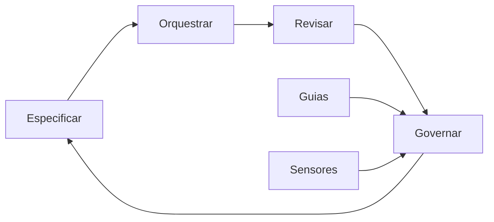

# Capítulo 2: AIDD na prática: o manifesto e as quatro habilidades do orquestrador

## 1. Introdução

No Capítulo 1, você estabeleceu a tese do fim do monopólio da digitação — o valor migrou da escrita de código para a orquestração de sistemas. Agora você desce da tese para a disciplina: o AIDD (AI-Driven Development) não é um conjunto de truques de prompt, é uma forma formalizada de trabalhar, com manifesto, princípios e um conjunto específico de habilidades. Este capítulo apresenta o Manifesto para AI-Driven Development, define as quatro habilidades do orquestrador — especificar, orquestrar, revisar e governar — e mostra como cada uma delas se manifesta no trabalho diário de um time que usa agentes de código em produção. Ao final, você será capaz de diagnosticar seu próprio nível de maturidade AIDD e de identificar qual das quatro habilidades é seu próximo ponto de alavancagem.

## 2. Explica

O AIDD tem uma definição formal que você precisa dominar antes de qualquer prática: é o desenvolvimento de software no qual a IA atua como parceira deliberada — e em muitos casos como força de execução primária — no planejamento, na decomposição, na codificação e na revisão, mantendo o desenvolvedor humano como arquiteto responsável pelo que é entregue [1]. Note a palavra central da definição: responsável. O manifesto não diz que o humano delega e esquece; diz que o humano mantém a autoria do resultado final, porque é ele quem detém o contexto do negócio, os critérios de aceitação e a visão arquitetural que nenhum modelo conhece a priori [1]. Essa definição tem uma consequência prática que a maioria dos times ainda não internalizou: se o humano é o responsável e o agente é o executor, então o trabalho de maior valor não é o que o agente faz — é o que o humano precisa definir antes e verificar depois.

A mecânica do AIDD se apoia em quatro habilidades que, juntas, formam o ciclo completo do orquestrador. A primeira é especificar: traduzir intenção de produto em documentos versionados que o agente consome como mapa — escopo, restrições, critérios de aceitação, crenças de design. A segunda é orquestrar: desenhar e operar fluxos de trabalho multi-agente — planejador, gerador, avaliador — com a topologia e o ciclo de vida certos [2]. A terceira é revisar: avaliar o resultado gerado com o julgamento de quem entende o sistema inteiro, e não linha a linha. A quarta é governar: manter o harness — os guias e sensores que mantêm o agente dentro dos trilhos da arquitetura [3]. A literatura sobre harness engineering formaliza as duas últimas como os controles do sistema: guias são os controles feedforward que impedem o erro antes que aconteça; sensores são os controles de feedback que detectam o erro depois que acontece [3]. E a documentação da Anthropic sobre harness de longa duração mostra que essas quatro habilidades não são teóricas: em sessões de codificação autônoma prolongadas, é o orquestrador que decide quando resetar o contexto, quantas iterações permitir e onde inserir supervisão humana — decisões de projeto de sistema, não de prompt [2].

## 3. Ilustra

Retorne ao mapa do maquinista. Você já sabe que o valor migrou da caldeira para o mapa — agora observe como um maquinista experiente conduz uma viagem longa. Antes de partir, ele estuda o itinerário, marca os trechos de cautela e define a ordem das estações: isso é especificar. Durante a viagem, ele coordena a equipe do trem — o foguista alimenta a caldeira, o condutor avisa as estações, o maquinista decide o ritmo: isso é orquestrar. A cada estação, ele desce e inspeciona os vagões, conferindo se a carga chegou inteira e se nenhum eixo trincou no percurso: isso é revisar. E entre uma viagem e outra, ele inspeciona os próprios trilhos — manda trocar dormentes, reforçar curvas, sinalizar trechos perigosos — para que a próxima viagem seja mais segura que a anterior: isso é governar. Como Engenheiro(a) de Software, seu trabalho com agentes de código é exatamente esse ciclo: sem especificação, o agente não sabe para onde vai; sem orquestração, os agentes se atropelam; sem revisão, a carga chega quebrada; sem governança, os trilhos degradam a cada viagem.



O diagrama mostra o ciclo contínuo: as quatro habilidades se alimentam em sequência, e a governança — sustentada pelos guias e sensores do harness — realimenta a especificação da próxima iteração. Não é um fluxo linear que termina no deploy: é um loop que melhora o sistema a cada volta, exatamente como o maquinista que torna a via mais segura a cada viagem. Esse ciclo é o coração operacional do AIDD, e é ele que o restante do livro vai detalhar — os capítulos 4 a 6 aprofundam a arquitetura (o desenho dos trilhos), os capítulos 7 a 9 o portfólio (as provas das viagens), e os capítulos 10 a 12 o mercado (as estações onde o valor é reconhecido).

## 4. Técnica

### O contrato de especificação executável

A primeira entrega técnica é o formato de especificação que o orquestrador usa para alimentar o agente: um contrato versionado, legível por humano e por máquina, que transforma intenção vaga em trabalho executável. O exemplo abaixo é um contrato real de feature, no espírito do que os manifestos de AIDD recomendam: escopo, restrições, critérios de aceitação e fronteiras de arquitetura explícitas [1].

```yaml
# spec/feature_triagem_agentica.yaml — contrato de especificação executável
feature: triagem_agentica
epico: fila_de_prioridades
dono: heverton_peres

escopo:
  - Classificar tickets recebidos em prioridade alta, media e baixa
  - Extrair entidades nomeadas (sistema, tipo de incidente) do texto livre
  - Gerar resumo estruturado de cada ticket para triagem humana

fora_de_escopo:
  - Resolver o incidente automaticamente (apenas triagem)
  - Integrar com sistemas externos fora da fila de origem

restricoes:
  - Camada de API nao pode acessar o banco diretamente
  - Toda resposta do LLM deve passar por validacao de schema
  - Nenhuma chamada de modelo no caminho sincrono da listagem

criterios_de_aceitacao:
  - Precisao de classificacao >= 85% no golden set de 200 tickets
  - Latencia p95 de classificacao <= 1.2s
  - 100% das respostas validas segundo o schema JSON

arquitetura_alvo:
  - api -> servico_de_triagem -> cliente_llm (com timeout e retry)
  - servico_de_triagem -> validacao_de_schema -> repositorio
```

O contrato cumpre a função de guia do harness: ele previne o erro antes que aconteça, informando ao agente o que está dentro e o que está fora do escopo, quais restrições arquiteturais são invioláveis e como o sucesso será medido [3]. A qualidade desse documento é o principal fator de qualidade do resultado — o mesmo princípio que os sistemas de avaliação formalizam quando dizem que especificar é o primeiro passo do ciclo de melhoria [4]. Um contrato vago produz um agente que inventa; um contrato preciso produz um agente que executa.

### O loop de revisão com gate de evidência

A segunda entrega é o loop de revisão que o orquestrador opera: um fluxo que avalia o resultado do agente contra os critérios do contrato antes de qualquer merge, com evidência — não opinião. O código abaixo implementa o gate de revisão em Python, usando o schema JSON como validador determinístico e deixando o julgamento semântico para o avaliador calibrado (o tema aprofundado no Capítulo 5 do Livro 10, que você conhece da série).

```python
"""Gate de revisao AIDD: evidencia deterministica antes do merge."""
import json
import re
from dataclasses import dataclass
from typing import Any


@dataclass
class Revisao:
    capa: str
    criterios: list

    def rodar(self, saida_agente: dict) -> dict:
        """Avalia a saida do agente contra os criterios de aceitacao."""
        resultados = {}
        for criterio in self.criterios:
            chave = criterio["campo"]
            if chave == "schema":
                resultados["schema"] = self._valida_schema(saida_agente, criterio["schema"])
            elif chave == "regex":
                resultados["regex"] = bool(re.search(criterio["padrao"], str(saida_agente)))
            elif chave == "presenca":
                resultados["presenca"] = saida_agente.get(criterio["campo_obrigatorio"]) is not None
        return resultados

    @staticmethod
    def _valida_schema(saida: dict, schema: dict) -> bool:
        """Validacao estrutural simples: campos obrigatorios e tipos."""
        for campo, tipo in schema.get("required", {}).items():
            valor = saida.get(campo)
            if valor is None or not isinstance(valor, tipo):
                return False
        return True

    def parecer(self, resultados: dict) -> str:
        aprovados = sum(1 for v in resultados.values() if v)
        if aprovados == len(resultados):
            return "APROVADO: evidencia completa"
        return f"REPROVADO: {len(resultados) - aprovados} criterio(s) sem evidencia"


SCHEMA_TRIAGEM = {
    "required": {
        "prioridade": str,
        "sistema": str,
        "resumo": str,
    }
}

if __name__ == "__main__":
    saida = {
        "prioridade": "alta",
        "sistema": "gateway-pagamentos",
        "resumo": "Timeout em 12% das requisicoes na janela de pico",
    }
    gate = Revisao("triagem_agentica", [{"campo": "schema", "schema": SCHEMA_TRIAGEM}])
    print(gate.parecer(gate.rodar(saida)))
```

O código compila e roda, e ilustra o princípio central da revisão no AIDD: o julgamento humano não é substituído — é posicionado no ponto certo. O gate determinístico filtra o que é verificável por regra; o humano concentra sua atenção no que exige julgamento de contexto. Essa divisão de trabalho é a materialização prática da governança que o harness engineering prescreve: sensores computacionais para o que é mecânico, sensores inferenciais — e o olhar humano — para o que é semântico [3]. A disciplina de avaliação reforça o mesmo desenho: evals determinísticos e model-based coexistem porque cada um cobre uma classe de falha [4].

## 5. Aplica

Você está no comitê de arquitetura da sua empresa, e a equipe de produtos pede um assistente agêntico que responda perguntas sobre o catálogo de serviços internos. A primeira proposta que chega é entusiasmada e vaga: "vamos dar acesso a um LLM com todas as nossas APIs e deixar ele responder". Seu instinto errado seria aceitar a proposta como ponto de partida e ajustar o prompt até funcionar — o clássico "prompt and pray" que o AIDD combate. O diagnóstico liga à teoria: sem especificação (quem pode perguntar o quê, com quais critérios de aceitação) e sem governança (quais ferramentas o agente pode chamar, com quais guardrails), o agente produz respostas plausíveis e incorretas — e cada correção de prompt trata o sintoma sem tocar a causa estrutural. A correção, na prática, é aplicar o ciclo das quatro habilidades: você escreve o contrato de especificação (escopo, fora de escopo, critérios de aceitação), desenha a orquestração (o agente consulta o catálogo via MCP, valida o schema antes de responder), define a revisão (gate determinístico + avaliador calibrado) e estabelece a governança (guia de uso, limites de ferramentas, trilha de auditoria). Em uma semana, a proposta vaga virou um sistema com contrato, evidência e governança — e a diferença não foi o modelo escolhido, foi a disciplina do orquestrador [1].

As armadilhas comuns, sintetizadas, são três. Primeira: confundir AIDD com "pedir para o agente fazer tudo" — sem o humano como responsável, o resultado é código sem autoria e sem arquitetura [1]. Segunda: pular a especificação executável e ir direto ao prompt — o prompt é a última milha de uma estrada que começa no contrato [4]. Terceira: revisar por impressão, sem gate de evidência — a revisão sem critérios mensuráveis degrada junto com o código que deveria proteger [3]. A métrica de sucesso é a estabilidade do ciclo: quantas vezes o gate reprovou antes do merge (quanto maior, melhor o harness) e quantas regressões escaparam para produção (quanto menor, melhor a revisão). O Capítulo 3 vai mostrar que a habilidade que sustenta todo esse ciclo — e que mais diferencia o engenheiro acima da média — é o desenho do harness como produto.

A maturidade do orquestrador tem camadas que a literatura recente ajuda a calibrar, e você vai reconhecê-las na sua trajetória. A primeira é a profundidade da especificação: os guias de mercado mostram que os sistemas que capturam atenção — e geram valor — são os que documentam decisões, trade-offs e autocrítica, não apenas o que foi construído [5]; a especificação executável deste capítulo é a mesma mentalidade aplicada ao contrato de feature. A segunda é a amplitude da orquestração: o design de harness para aplicações de longa duração documentado pela Anthropic mostra que orquestrar não é despachar tarefas — é arquitetar a sessão inteira do agente, com planejador, gerador e avaliador em papéis distintos e context resets nos pontos de degradação [2]. A terceira é a visão de sistemas distribuídos: a análise da Temporal demonstra que fluxos agênticos em produção exigem a disciplina de sistemas distribuídos — retries stateful, execução durável, recuperação de falhas — e o orquestrador que domina essa camada projeta agentes que sobrevivem a quedas de API e rate limits, enquanto o iniciante desenha agentes que morrem no primeiro timeout [6]. A quarta camada é o ferramental que sustenta a revisão: as plataformas de orquestração de workflows de 2026 — LangGraph, CrewAI e a convergência do ecossistema — são comparadas justamente pela observabilidade e pelo protocolo de agentes que oferecem, porque é isso que transforma revisão por impressão em revisão por evidência [7]. E a conexão com o portfólio fecha o raciocínio: as competências de orquestração que este capítulo descreve são exatamente as que os projetos de portfólio de elite demonstram — RAG avançado, agentes com estado, MCP e evals [8]. O mercado, por sua vez, já precifica essa maturidade: os cargos de AI Engineer crescem em ritmo expressivo, e o prêmio salarial da especialização em IA é documentado em múltiplas fontes de 2026 [9][10]. A síntese é clara: o orquestrador maduro não é o que conhece o framework mais novo — é o que domina o ciclo completo — especificar, orquestrar, revisar, governar — e o prova em público [11].

O ciclo do orquestrador ganha profundidade quando conectado às camadas do sistema e ao mercado. A hierarquia das disciplinas — prompt na mensagem, contexto na sessão, harness no sistema — explica por que a especificação executável e a governança são os pontos de alavancagem do AIDD: são as camadas mais duráveis, que sobrevivem a trocas de modelo [12]. A regra de ouro da arquitetura reforça a mesma direção: o contrato de especificação decide onde o caminho é conhecido (workflow) e onde é exploratório (agente), e essa decisão — não o prompt — define custo e confiabilidade [13]. O protocolo MCP entra como o padrão que desacopla o agente das ferramentas, tornando a especificação executável mais simples de operar: cada ferramenta sob contrato é uma dependência que pode evoluir sem reescrever o agente [14]. E a delimitação entre MCP, RAG e agentes — transporte, conhecimento e orquestração — organiza a arquitetura do contrato em camadas claras, evitando a confusão que degrada os projetos de AIDD [15]. No plano do mercado, a presença digital que documenta o ciclo — o repositório e o artigo — é o que transforma o orquestrador competente em profissional reconhecido: a presença 24/7 funciona como o portfólio vivo que o mercado encontra antes da entrevista [16]. E a rubrica de system design de 2026 completa o ciclo: as entrevistas avaliam exatamente as competências do orquestrador — custo, modos de falha e design sensível a IA — e o contrato de especificação é o material que sustenta a resposta [17][18].

O ciclo do orquestrador fecha no mercado e na entrevista: o playbook de system design de 2026 formaliza a prova que o AIDD exige [19], e a engenharia de harness documentada pela OpenAI mostra o destino da disciplina — a especificação executável virando rotina industrial [20].


### Aprofundamento: as quatro habilidades na bancada

O manifesto do AIDD não é um documento de intenções: ele descreve um método de trabalho com quatro habilidades operacionais que este capítulo transforma em prática diária [1]. A primeira habilidade — decompor a intenção em especificação executável — ganha corpo quando conectada ao harness de longa duração da Anthropic: a especificação não é um texto entregue ao agente, mas um contrato mantido vivo ao longo da sessão, revisto a cada iteração [2]. A segunda habilidade — escolher a topologia certa — é o coração da regra de ouro entre workflow e agente: o caminho conhecido recebe workflow determinístico, o exploratório recebe agente com supervisão, e a decisão é sempre do engenheiro, nunca do acaso [3]. A terceira habilidade — medir com evals — conecta a sessão ao ciclo de qualidade: a rubrica, o exemplar e o limiar transformam a opinião em dado, e a OpenAI documenta a evals como o motor do próximo capítulo da IA empresarial [4]. A quarta habilidade — narrar a evidência — é a que o mercado enxerga primeiro: o portfólio que documenta decisões reais, métricas e falhas supera o currículo que lista ferramentas, como mostram os guias de portfólio de 2026 [5]. No plano operacional, a execução durável entra como o suporte das quatro habilidades: a Temporal documenta que fluxos agênticos precisam de disciplina de sistemas distribuídos — checkpoint, retry e idempotência — para sobreviverem à produção real [6]. As plataformas de orquestração de 2026 competem exatamente por essa combinação: workflow determinístico, agente supervisionado e observabilidade em profundidade, e a comparação entre elas é o melhor curso prático de arquitetura de IA [7]. A documentação pública de um projeto completo — o repositório, o README, o histórico de decisões — é a prova de que as quatro habilidades foram exercidas, não decoradas [8]. O mercado de talento recompensa a combinação: as vagas de AI Engineer de 2026 pedem especificação, topologia, medição e comunicação em um único perfil, e o prêmio salarial desse perfil é documentado pelas análises de mercado [9]. O monitoramento mensal do mercado técnico mostra a mesma curva: os cargos que combinam as quatro habilidades lideram o crescimento de contratações [10]. O portfólio de evidências — os 3 a 5 projetos que sustentam a narrativa — é o instrumento que materializa as quatro habilidades para o recrutador [11]. A hierarquia das disciplinas organiza a prática: o prompt não carrega a especificação inteira, o contexto carrega o que a sessão precisa e o harness carrega a governança — e cada habilidade do AIDD opera no nível certo [12]. A arquitetura de agentes da Anthropic fornece o vocabulário dos padrões: o engenheiro que descreve o sistema em termos de prompt chaining, routing, evaluator-optimizer e orchestrator-workers fala a língua da indústria [13]. O protocolo MCP entra como a infraestrutura da terceira habilidade: o contrato de ferramentas desacopla o agente do ambiente, e a especificação executável ganha superfícies estáveis para operar [14]. A delimitação entre MCP, RAG e agentes — transporte, conhecimento e orquestração — evita a confusão arquitetural que degrada os projetos de AIDD na prática [15]. O guia de construção de portfólio do Zencoder mostra que a apresentação do projeto — o problema, a decisão, o resultado medido — é tão importante quanto o código, e isso é exatamente a quarta habilidade em ação [16]. A análise de mercado do Pragmatic Engineer documenta o contexto estrutural: a transição do engenheiro para o papel de orquestrador é a maior mudança de carreira da década, e as quatro habilidades são a ponte [17]. A entrevista de system design de 2026 avalia as quatro habilidades sob pressão: o candidato que explica a especificação, a topologia, a medição e a narrativa de forma integrada responde com profundidade real [18]. O playbook de system design do Shivali reforça: a preparação para entrevista de 2026 inclui estudar exatamente esses padrões e praticar a comunicação da decisão [19]. E o harness engineering da OpenAI fecha o ciclo: a disciplina que nasceu para tornar os agentes confiáveis é a mesma que torna o engenheiro acima da média — aquele que orquestra, mede e narra, em vez de apenas produzir [20].


A bancada das quatro habilidades termina com uma recomendação operacional: mantenha um registro público de cada ciclo completo — a especificação, a topologia escolhida, o eval aplicado e a narrativa do resultado [19]. Esse registro é o mesmo material que a entrevista de system design explora [18] e que o portfólio documenta [16]; ele também alimenta a leitura do mercado, mostrando onde a demanda cresce e o prêmio se concentra [9]. O manifesto do AIDD resume a ética do método: o desenvolvedor é o parceiro deliberado, e o registro é a prova da parceria [1]. Quem mantém o ciclo completo documentado não depende de sorte em entrevista — depende de evidência [20].
## 6. Conclusão

Você dominou o AIDD como disciplina: o manifesto define o desenvolvedor como parceiro deliberado e responsável pela IA, e as quatro habilidades do orquestrador — especificar, orquestrar, revisar, governar — formam o ciclo que transforma intenção em sistema confiável. Os três pontos principais são: o contrato de especificação executável é o principal fator de qualidade do resultado; o gate de revisão com evidência posiciona o julgamento humano no ponto certo; e a governança por guias e sensores é o que impede a degradação estrutural. O desafio desta semana: pegue a próxima feature do seu time e escreva o contrato de especificação antes de qualquer código — depois compare o resultado com o que aconteceria sem ele. No próximo capítulo, você mergulha na habilidade que sustenta o ciclo inteiro: o harness como assinatura profissional.

## 7. Referências Bibliográficas
[1] AI-DRIVEN DEVELOPMENT MANIFESTO. *Manifesto for AI-Driven Development*. 2026. Disponível em: https://www.ai-driven-development.org/. Acesso em: 06 ago. 2026.
[2] RAJASEKARAN, Prithvi (ANTHROPIC ENGINEERING). *Harness design for long-running agentic applications*. 2026. Disponível em: https://www.anthropic.com/engineering/harness-design-long-running-apps. Acesso em: 06 ago. 2026.
[3] BÖCKELER, Birgitta; FOWLER, Martin. *Harness engineering: the discipline of building effective software agents*. Thoughtworks/Martin Fowler, 2026. Disponível em: https://martinfowler.com/articles/harness-engineering.html. Acesso em: 06 ago. 2026.
[4] OPENAI. *How evals drive the next chapter in AI for businesses*. 2025. Disponível em: https://openai.com/index/evals-drive-next-chapter-of-ai/. Acesso em: 06 ago. 2026.
[5] JACKSON, Natalia (HYPERSKILL). *Building a developer portfolio in 2026: what actually gets attention*. 2026. Disponível em: https://hyperskill.org/blog/post/building-a-developer-portfolio-in-2026-what-actually-gets-attention. Acesso em: 06 ago. 2026.
[6] MARTIN, Kevin Paul (TEMPORAL). *From AI hype to durable reality: why agentic flows need distributed-systems discipline*. 2025. Disponível em: https://temporal.io/blog/from-ai-hype-to-durable-reality-why-agentic-flows-need-distributed-systems. Acesso em: 06 ago. 2026.
[7] DIGITAL APPLIED. *AI workflow orchestration platforms: 2026 comparison*. 2026. Disponível em: https://www.digitalapplied.com/blog/ai-workflow-orchestration-platforms-comparison. Acesso em: 06 ago. 2026.
[8] BOUCHARD, Louis-François. *Start AI engineering*. GitHub, 2026. Disponível em: https://github.com/louisfb01/start-ai-engineering. Acesso em: 06 ago. 2026.
[9] NEXUS IT GROUP. *AI engineering jobs: 2026 talent market analysis*. 2026. Disponível em: https://nexusitgroup.com/ai-engineering-jobs/. Acesso em: 06 ago. 2026.
[10] DAINES-HUTT, Daniel (ZERO TO MASTERY). *Tech job market trends monthly — February 2026*. 2026. Disponível em: https://zerotomastery.io/blog/tech-job-market-trends-monthly-february-2026/. Acesso em: 06 ago. 2026.
[11] DATAEXPERT.IO. *Ultimate guide to AI engineering portfolios*. 2026. Disponível em: https://www.dataexpert.io/blog/ultimate-guide-ai-engineering-portfolios. Acesso em: 06 ago. 2026.
[12] ATLAN RESEARCH. *Harness engineering vs prompt engineering*. 2026. Disponível em: https://atlan.com/know/harness-engineering-vs-prompt-engineering/. Acesso em: 06 ago. 2026.
[13] ANTHROPIC. *Building effective agents*. 2024. Disponível em: https://www.anthropic.com/engineering/building-effective-agents. Acesso em: 06 ago. 2026.
[14] CHOWDHURY, Supal; SAHA, Subrata; ABDEL SAMAD, Haitham (IBM DEVELOPER). *Model Context Protocol architecture patterns for multi-agent AI systems*. 2026. Disponível em: https://developer.ibm.com/articles/mcp-architecture-patterns-ai-systems/. Acesso em: 06 ago. 2026.
[15] INFRANODUS ENGINEERING. *MCP vs RAG vs AI agents: differences and how they work together*. 2026. Disponível em: https://infranodus.com/docs/mcp-vs-rag-vs-ai-agents. Acesso em: 06 ago. 2026.
[16] ZENCODER. *How to create a software engineer portfolio in 2026*. 2026. Disponível em: https://zencoder.ai/blog/how-to-create-software-engineer-portfolio. Acesso em: 06 ago. 2026.
[17] OROSZ, Gergely; SALMON, Jessica (THE PRAGMATIC ENGINEER). *The job market in 2026 (part 2)*. 2026. Disponível em: https://newsletter.pragmaticengineer.com/p/the-job-market-in-2026-part-2. Acesso em: 06 ago. 2026.
[18] EXPONENT. *System design interview prep & questions (2026 guide)*. 2026. Disponível em: https://www.tryexponent.com/blog/system-design-interview-guide. Acesso em: 06 ago. 2026.
[19] SHIVALI. *The 2026 system design prep playbook: what to study, practice, and expect*. 2026. Disponível em: https://medium.com/@shivali0087/the-2026-system-design-prep-playbook-what-to-study-practice-and-expect-b3068bd2e67e. Acesso em: 06 ago. 2026.
[20] LOPOPOLO, Ryan (OPENAI). *Harness engineering at OpenAI*. 2026. Disponível em: https://openai.com/index/harness-engineering/. Acesso em: 06 ago. 2026.