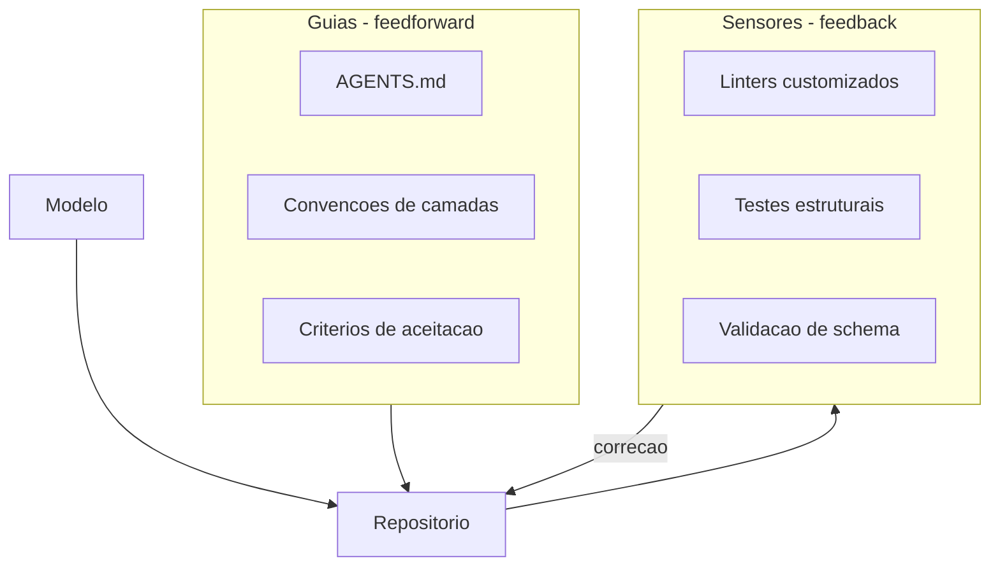

# Capítulo 3: O harness como assinatura: guias, sensores e a fábrica que se auto-mantém

## 1. Introdução

No Capítulo 2, você aprendeu as quatro habilidades do orquestrador e percebeu que a governança — a quarta habilidade — é a que sustenta todo o ciclo. Este capítulo mergulha nessa quarta habilidade e a transforma em competência profissional: o harness engineering. O harness é a camada que envolve o modelo — tudo o que não é o modelo — e é a assinatura do engenheiro acima da média: é o produto que ele constrói, mantém e melhora, e é o que o diferencia de quem apenas usa agentes. Você vai aprender a desenhar guias (controles feedforward), sensores (controles de feedback) e a operar a fábrica de código que se auto-mantém — com controle de entropia, legibilidade de agentes e revisão contínua. Ao final, você será capaz de construir o harness do seu repositório e de reconhecer por que essa competência é a mais valorizada na prática documentada da indústria.

## 2. Explica

O harness engineering tem uma definição que se tornou o vocabulário padrão da disciplina: agente é a soma do modelo com o harness — o modelo é o que pensa, o harness é tudo o que envolve e governa esse pensamento, das instruções ao ambiente de execução [1]. A formulação de Martin Fowler e da Thoughtworks divide o harness em dois tipos de controle, e você vai perceber que essa divisão organiza toda a prática. Os guias são os controles feedforward: agem antes do erro, prevenindo-o — arquivos de instrução como AGENTS.md, convenções de camadas, critérios de aceitação, restrições de arquitetura. Os sensores são os controles de feedback: agem depois do erro, detectando-o — linters, testes estruturais, validadores de schema, testes de mutação, e até o revisor humano posicionado no ponto certo. Cada controle pode ser computacional (executa regra determinística) ou inferencial (usa um modelo para julgar) [1]. A imagem que organiza tudo: guias são as placas e os guard-rails da estrada; sensores são as câmeras e os radares que flagram quem saiu da pista.

A mecânica do harness se apoia em dois princípios que a prática da OpenAI tornou públicos. O primeiro é a legibilidade de agentes: o repositório precisa ser legível para máquinas, não apenas para humanos — nomes claros, documentação de decisões, logs e métricas expostas, porque o agente que lê o código replica os padrões que encontra, bons ou ruins [2]. O segundo é o controle de entropia: em uma fábrica onde agentes geram a maior parte do código, a desordem cresce mais rápido do que a revisão humana consegue conter — por isso o harness precisa de rotinas de manutenção contínua, linters customizados e "garbage collection" de código gerado, para que a estrutura não degeneere [2]. A consolidação conceitual da Atlan Research acrescenta a hierarquia que situa o harness no mapa das disciplinas: prompt engineering atua na camada da mensagem, context engineering na camada da sessão, e harness engineering na camada do sistema — a mais profunda e a mais durável das três [3]. É por isso que o harness é a assinatura: prompt e contexto são consumíveis que mudam com cada modelo; o harness é o ativo que o engenheiro constrói e que sobrevive a trocas de modelo.

## 3. Ilustra

Pense na diferença entre o motorista que conhece as regras de trânsito e a engenheira que projeta o sistema viário de uma cidade. O motorista habilidoso dirige bem — freia no ponto certo, escolhe rotas rápidas, evita engarrafamentos. Mas quando a cidade cresce, o problema do motorista não é dirigir: é que as vias não comportam o tráfego, os cruzamentos ficam caóticos e cada carro novo piora a situação. A engenheira de trânsito, por outro lado, não dirige: projeta as faixas, coloca semáforos, define rotas preferenciais e implementa radares — e o resultado é que milhares de motoristas, inclusive medíocres, dirigem melhor porque o sistema ao redor deles é melhor. No AIDD, o engenheiro acima da média é a engenheira de trânsito: não compete para ser o melhor "motorista" de código — constrói o sistema viário no qual o agente, mesmo imperfeito, produz bons resultados. Como Engenheiro(a) de Software, o seu harness é a cidade: os guias são as placas e semáforos, os sensores são os radares e câmeras, e a manutenção contínua é o departamento de obras que evita que a cidade degeneire.



O diagrama mostra a anatomia completa: o modelo escreve no repositório, os guias orientam antes, os sensores detectam depois, e a correção realimenta o repositório — fechando o loop da fábrica que se auto-mantém. O elemento central não é o modelo, é o desenho do sistema ao redor dele — a assinatura do harness engineer. Esse loop de correção contínua é o que separa uma fábrica de código que se mantém saudável de uma que degrada a cada sprint.

## 4. Técnica

### O guia AGENTS.md: a constituição do repositório

A primeira entrega técnica é o artefato-guia por excelência: o AGENTS.md, o arquivo que instrui qualquer agente que trabalhe no repositório sobre a constituição do projeto. Ele é o guia feedforward mais importante do harness, porque é lido no início de toda sessão de agente. O exemplo abaixo é um AGENTS.md realista para um serviço de triagem agêntica, no espírito do que a prática documenta sobre legibilidade de agentes [2]:

```markdown
# AGENTS.md — Triagem Agêntica

## Arquitetura (inviolável)
- `api/` -> `servico_triagem/` -> `cliente_llm/`
- A camada de API NUNCA acessa o banco diretamente
- O serviço de triagem é a única camada que chama o LLM
- Toda saída do LLM passa por `validacao/schema.py` antes de persistir

## Convenções
- Nomes de arquivo: snake_case; classes PascalCase; constantes UPPER_CASE
- Testes vivem ao lado do código: `modulo.py` + `test_modulo.py`
- Toda função pública tem docstring de uma linha
- Nenhuma string de log com dados PII

## Fluxo de trabalho
1. Leia `spec/` antes de implementar qualquer feature
2. Rode `make lint` e `make test` antes de abrir PR
3. Se o teste estrutural `make arch` falhar, NÃO contorne — refatore
4. Nunca edite `validacao/schema.py` sem aprovação do dono do harness

## Fora de escopo (não faça)
- Não adicione dependências sem justificativa escrita
- Não crie camadas novas fora do fluxo acima
- Não armazene chaves de API em código
```

O AGENTS.md cumpre a função de guia: impede o erro antes que aconteça, informando ao agente as fronteiras invioláveis, as convenções e o fluxo de trabalho [1]. A qualidade desse documento determina a qualidade de milhares de interações futuras do agente — é o multiplicador do harness. Repare que ele declara explicitamente o que está fora de escopo: a proibição é parte essencial do guia, porque agentes tendem a explorar espaço em branco.

### O sensor estrutural: o linter de arquitetura

A segunda entrega é o sensor: um validador de arquitetura que detecta violações das camadas declaradas no AGENTS.md — o radar que flagra o carro fora da pista. O código abaixo implementa um linter estrutural simples em Python, que verifica se as regras de camada estão sendo respeitadas:

```python
"""Linter estrutural: detecta violacoes de camadas declaradas no AGENTS.md."""
import ast
import sys
from pathlib import Path


class Violacao:
    def __init__(self, arquivo: str, regra: str, detalhe: str):
        self.arquivo = arquivo
        self.regra = regra
        self.detalhe = detalhe

    def __repr__(self) -> str:
        return f"[{self.regra}] {self.arquivo}: {self.detalhe}"


def validar_import(no_import: ast.ImportFrom | ast.Import, caminho: Path, violacoes: list) -> None:
    """Regra: api/ nao pode importar repositorio/ nem cliente_llm/."""
    if not caminho.as_posix().startswith("api/"):
        return
    nomes = []
    if isinstance(no_import, ast.ImportFrom):
        nomes = [no_import.module or ""]
    else:
        nomes = [a.name for a in no_import.names]
    for nome in nomes:
        if nome.startswith("repositorio") or nome.startswith("cliente_llm"):
            violacoes.append(Violacao(
                caminho.as_posix(), "camada_api",
                f"import proibido: {nome}"
            ))


def auditar_arvore(raiz: Path) -> list:
    violacoes = []
    for py in sorted(raiz.rglob("*.py")):
        try:
            arvore = ast.parse(py.read_text(encoding="utf-8"))
        except SyntaxError:
            continue
        for no in ast.walk(arvore):
            if isinstance(no, (ast.Import, ast.ImportFrom)):
                validar_import(no, py, violacoes)
    return violacoes


if __name__ == "__main__":
    raiz = Path(sys.argv[2]) if len(sys.argv) > 1 else Path(".")
    violacoes = auditar_arvore(raiz)
    if violacoes:
        for v in violacoes:
            print(v)
        print(f"FALHOU: {len(violacoes)} violacao(oes) de camada")
        sys.exit(1)
    print("OK: arquitetura de camadas respeitada")
```

O linter é um sensor computacional: executa regra determinística e bloqueia o merge quando a arquitetura é violada [1]. Rode-o no CI junto com os testes — é o radar da fábrica. A combinação do AGENTS.md (guia) com o linter (sensor) é o par mínimo de um harness: um previne, o outro detecta, e juntos transformam a arquitetura de intenção em lei executável. A prática documentada mostra que é exatamente esse tipo de sensor que mantém a entropia sob controle em repositórios onde agentes geram a maior parte do código [2].

### A rotina de manutenção: garbage collection do código gerado

A terceira entrega é a rotina que fecha o ciclo da fábrica auto-mantida: a manutenção contínua do repositório — o "departamento de obras" da cidade. O código abaixo implementa um scanner de duplicação e lixo gerado, que identifica blocos suspeitos de serem cópia ou código morto:

```python
"""Garbage collection: detecta duplicacao e codigo morto gerado por agentes."""
import re
from collections import Counter
from pathlib import Path


def extrair_funcoes(conteudo: str) -> list:
    """Extrai corpos de funcoes simples (heuristica: linhas indentadas apos 'def')."""
    funcoes = []
    linhas = conteudo.splitlines()
    atual = []
    dentro = False
    for linha in linhas:
        if linha.strip().startswith("def ") or linha.strip().startswith("class "):
            if atual:
                funcoes.append("\n".join(atual))
            atual = [linha.strip()]
            dentro = True
        elif dentro:
            if linha.strip() and not linha.startswith("    "):
                funcoes.append("\n".join(atual))
                atual = []
                dentro = False
            elif linha.strip():
                atual.append(linha.strip())
    if atual:
        funcoes.append("\n".join(atual))
    return funcoes


def escanear_repo(raiz: Path) -> dict:
    ocorrencias = Counter()
    codigo_morto = []
    for py in sorted(raiz.rglob("*.py")):
        conteudo = py.read_text(encoding="utf-8")
        for funcao in extrair_funcoes(conteudo):
            if len(funcao) >= 6:  # ignora lambdas e funcoes minusculas
                ocorrencias[funcao] += 1
        if re.search(r"TODO|FIXME|pass\s*#\s*stub", conteudo):
            codigo_morto.append(str(py))
    return {
        "duplicadas": [f for f, n in ocorrencias.items() if n > 1],
        "stubs": codigo_morto,
    }


if __name__ == "__main__":
    raiz = Path(".")
    relatorio = escanear_repo(raiz)
    print(f"Funcoes duplicadas: {len(relatorio['duplicadas'])}")
    print(f"Arquivos com stubs/TODO: {len(relatorio['stubs'])}")
    for dup in relatorio["duplicadas"][:5]:
        print(f"  DUP: {dup.splitlines()[0]}")
```

O scanner fecha o ciclo: detecta a duplicação que o agente replica (o padrão que a legibilidade de agentes descreve) e sinaliza onde a entropia está se acumulando [2]. Rode-o periodicamente e trate o resultado como o painel da fábrica — se as duplicatas crescem, os guias precisam de reforço. A manutenção contínua é o que diferencia a fábrica auto-mantida do repositório que degenera: não é um evento, é uma rotina.

## 5. Aplica

Você acaba de assumir o harness de um repositório de 400 mil linhas que passou um ano sendo gerado por agentes. A equipe está frustrada: cada PR quebra algo, ninguém confia nas mudanças, e o tech lead está considerando proibir agentes. Seu instinto errado seria proibir também — voltar ao mundo pré-AIDD, onde o gargalo era a digitação humana e a velocidade caiu pela metade. O diagnóstico liga à teoria: o problema nunca foi o agente, foi a ausência de harness — sem guias, o agente replicou os padrões ruins existentes; sem sensores, as violações de arquitetura acumularam silenciosamente; sem manutenção, a entropia venceu [2]. A correção, na prática, é a sequência deste capítulo: você escreve o AGENTS.md (guia), instala o linter de camadas no CI (sensor), roda o scanner de duplicação (manutenção) e define o fluxo de correção. Em trinta dias, as violações estruturais caem, os PRs voltam a ser revisáveis e a equipe recupera a confiança — não porque o agente ficou mais inteligente, mas porque o sistema ao redor dele ficou melhor [1].

As armadilhas comuns, sintetizadas, são três. Primeira: confundir harness com documentação — o AGENTS.md que não é lido por nenhum sensor é um pôster, não um guia [1]. Segunda: construir sensores sem guias — o radar que flagra violações sem instruções que as previnam gera uma fábrica que só apaga incêndio. Terceira: tratar a manutenção como evento único — sem a rotina de garbage collection, a entropia retorna mais rápido do que o harness consegue conter [2]. A métrica de sucesso é dupla: a taxa de violações estruturais por sprint (deve cair) e o tempo médio de aprovação de PR (deve subir em qualidade, não em horas). O Capítulo 4 inicia a Parte II e sobe um nível: se o harness é a cidade, a arquitetura de sistemas é o zoneamento — o desenho dos trilhos que definem onde a cidade pode crescer.

A importância do harness como assinatura profissional tem respaldo crescente na literatura e no mercado, e você vai usá-lo como argumento de posicionamento. No plano conceitual, a hierarquia das três disciplinas — prompt na camada da mensagem, contexto na camada da sessão, harness na camada do sistema — é a moldura que explica por que o harness é o ativo mais durável: quando o modelo troca, o prompt perde eficácia e o contexto muda, mas o desenho de guias e sensores permanece [3]. No plano prático, o harness de longa duração documentado pela Anthropic mostra que o desenho do sistema — e não o prompt — é o que sustenta sessões autônomas prolongadas sem degradação: decisões de arquitetura como context resets, limites de iteração e supervisão posicionada são projeto de harness [4]. No plano da escala, o relato da OpenAI demonstra que o harness é o multiplicador industrial: o time que entrega milhões de linhas sem escrita manual não é um time de digitadores melhores — é um time que construiu o ambiente no qual os agentes operam com controle de entropia [2]. E a convergência com a engenharia de sistemas completa o quadro: a análise da Temporal mostra que os fluxos agênticos em produção exigem a disciplina de sistemas distribuídos — e o harness engineer é quem traduz essa disciplina para o nível do repositório e do agente [5]. No plano do mercado, a competência de harness é exatamente o que as vagas de 2026 buscam quando pedem engenheiros que saibam orquestrar e governar agentes — não digitadores, mas construtores de ambiente [6]. E o portfólio que demonstra essa competência — um repositório com guias, sensores e evidência de entropia controlada — é o que os recrutadores de 2026 usam para separar o engenheiro comum do acima da média [7][8]. A síntese é a tese do capítulo: o harness é a assinatura porque é o único artefato que você constrói, mantém e melhora — que sobrevive a cada troca de modelo — e que o mercado reconhece como prova de senioridade [1].

O harness como assinatura ganha o seu lugar no mapa completo quando conectado ao restante da carreira. A disciplina do AIDD formaliza o que o harness viabiliza: o desenvolvedor como parceiro deliberado da IA, responsável pelo que é entregue — e o harness é o instrumento dessa responsabilidade [9]. A arquitetura fornece o conteúdo do harness: a regra de ouro entre workflow e agente define quais trilhos o guia deve impor e quais flexibilidades o sensor deve tolerar [10]. O protocolo MCP padroniza as alavancas que o harness expõe — cada ferramenta sob contrato é uma superfície governada, e a governança do harness estende-se naturalmente ao protocolo [11]. A camada de conhecimento RAG entra como o mapa do harness: a qualidade da recuperação define o teto do que o agente pode acertar, e o harness regula o contexto que o RAG injeta [12]. As plataformas de orquestração de 2026 competem pela qualidade da observabilidade — o sensor do harness em escala de framework — e a comparação entre LangGraph, CrewAI e o ecossistema convergente mostra que o harness é o critério de seleção [13]. O portfólio demonstra o harness na prática: os guias de 2026 mostram que o repositório com guias, sensores e evidência de entropia controlada é o que separa o engenheiro comum do acima da média [14], e a escrita técnica documenta essa competência de forma durável [15]. O mercado recompensa a competência: os dados de vagas mostram que a orquestração e a governança de agentes estão entre as skills mais demandadas da linha em expansão [16][17]. E a entrevista de system design avalia exatamente o raciocínio do harness: resiliência, modos de falha e o desenho dos sensores do sistema [18][19][20].


### Aprofundamento: o harness como sistema de governo

A disciplina de harness engineering definida por Böckeler e Fowler parte de uma observação simples: o agente não é um produto isolado, mas um sistema que inclui o contexto, as ferramentas, a memória e o loop de execução [1]. A engenharia de harness da OpenAI mostra a escala industrial dessa visão: em sistemas com múltiplos agentes, o harness é o que torna a operação previsível, medível e segura [2]. A distinção entre harness engineering e prompt engineering é o ponto de virada conceitual: o prompt melhora a resposta, o harness melhora o sistema — e o engenheiro acima da média investe no segundo [3]. O harness de longa duração documentado pela Anthropic fornece o projeto de referência: planejador, gerador e avaliador em circuito, com checkpoints e supervisão nos pontos certos, sustentando sessões autônomas de horas e dias [4]. A execução durável é o alicerce físico desse projeto: a Temporal documenta que fluxos agênticos em produção exigem a mesma disciplina de sistemas distribuídos que os pipelines críticos — retry com backoff, idempotência, estado persistido [5]. No plano da carreira, o harness vira assinatura: os dados de mercado mostram que o profissional capaz de construir e governar o ambiente dos agentes ocupa a posição de maior valor agregado na linha de produção de software [6]. O portfólio de evidências documenta essa assinatura: o repositório que mostra o harness — o makefile, os testes de falha, o registro de decisões — é a prova concreta da competência [7]. A narrativa do projeto, seguindo os guias de portfólio de 2026, deve mostrar o harness em ação: o problema, o desenho do sistema, a evolução da entropia controlada [8]. O manifesto do AIDD dá a justificativa ética e profissional: o desenvolvedor é o parceiro deliberado da IA, responsável pelo que é entregue, e o harness é o instrumento dessa responsabilidade [9]. A arquitetura de agentes da Anthropic fornece o catálogo de padrões que o harness concretiza: prompt chaining, routing, evaluator-optimizer e orchestrator-workers são os módulos que o engenheiro compõe dentro do harness [10]. O protocolo MCP padroniza as alavancas: cada ferramenta sob contrato é uma superfície governada, e a governança do harness estende-se naturalmente ao protocolo [11]. A delimitação entre MCP, RAG e agentes organiza as camadas do harness: o transporte de ferramentas, o conhecimento recuperado e a orquestração do loop são camadas distintas com responsabilidades claras [12]. As plataformas de orquestração de 2026 competem pela qualidade do harness: a comparação entre LangGraph, CrewAI e o ecossistema convergente mostra que observabilidade, resiliência e controle são os critérios de seleção [13]. O portfólio que demonstra o harness na prática — o projeto com guias, sensores e evidência de entropia controlada — é o que separa o engenheiro comum do acima da média, segundo os guias de portfólio [14]. A documentação pública do processo — o repositório, o artigo, o post-mortem — multiplica a assinatura: a escrita técnica transforma a competência individual em ativo coletivo [15]. Os projetos de machine learning que compõem um portfólio forte incluem exatamente o tipo de construção que exercita o harness: sistemas completos com decisões de arquitetura documentadas [16]. O mercado de talento de IA recompensa a assinatura: as análises de vagas mostram que a orquestração e a governança de agentes estão entre as skills mais demandadas da linha em expansão [17]. A projeção dos próximos dois anos do engenheiro de software coloca a construção de harnesses como o trabalho central da década — quem domina a disciplina hoje lidera o mercado amanhã [18]. O monitoramento mensal do mercado técnico mostra a mesma direção: os cargos que exigem controle de agentes crescem consistentemente acima da média [19]. E a análise das carreiras mais bem pagas em IA confirma: os perfis de topo — LLM Engineer, AI Architect, MLOps — dominam exatamente as competências que o harness materializa [20].


O harness como sistema de governo fecha com o critério de mercado: o profissional que constrói o ambiente dos agentes — guias, sensores, memória e loop — é o que as vagas de AI Engineer de 2026 procuram [17], e o portfólio que documenta essa construção é o que o recrutador examina primeiro [7]. A disciplina definida por Böckeler e Fowler dá o vocabulário [1], a engenharia da OpenAI dá a escala industrial [2] e a evolução de carreira confirmada pelo mercado de longo prazo mostra que quem domina o harness hoje lidera a linha de produção de IA amanhã [18]. A assinatura não é um certificado: é o repositório que continua falando por você [14].
## 6. Conclusão

Você dominou o harness como assinatura profissional: agente é modelo mais harness; os guias previnem, os sensores detectam, e a manutenção contínua mantém a fábrica saudável. Os três pontos principais são: a legibilidade de agentes e o controle de entropia são os dois princípios que sustentam a fábrica auto-mantida; o AGENTS.md e o linter de camadas formam o par mínimo de guia e sensor; e o harness é o ativo durável — sobrevive a trocas de modelo, enquanto prompt e contexto são consumíveis. O desafio desta semana: escreva o AGENTS.md do seu repositório atual e instale um sensor estrutural no CI — mesmo um linter simples já muda a trajetória da entropia. No próximo capítulo, você sobe da fábrica para o zoneamento: a arquitetura de sistemas, começando pela decisão mais importante — workflows versus agentes.

## 7. Referências Bibliográficas
[1] BÖCKELER, Birgitta; FOWLER, Martin. *Harness engineering: the discipline of building effective software agents*. Thoughtworks/Martin Fowler, 2026. Disponível em: https://martinfowler.com/articles/harness-engineering.html. Acesso em: 06 ago. 2026.
[2] LOPOPOLO, Ryan (OPENAI). *Harness engineering at OpenAI*. 2026. Disponível em: https://openai.com/index/harness-engineering/. Acesso em: 06 ago. 2026.
[3] ATLAN RESEARCH. *Harness engineering vs prompt engineering*. 2026. Disponível em: https://atlan.com/know/harness-engineering-vs-prompt-engineering/. Acesso em: 06 ago. 2026.
[4] RAJASEKARAN, Prithvi (ANTHROPIC ENGINEERING). *Harness design for long-running agentic applications*. 2026. Disponível em: https://www.anthropic.com/engineering/harness-design-long-running-apps. Acesso em: 06 ago. 2026.
[5] MARTIN, Kevin Paul (TEMPORAL). *From AI hype to durable reality: why agentic flows need distributed-systems discipline*. 2025. Disponível em: https://temporal.io/blog/from-ai-hype-to-durable-reality-why-agentic-flows-need-distributed-systems. Acesso em: 06 ago. 2026.
[6] OROSZ, Gergely; SALMON, Jessica (THE PRAGMATIC ENGINEER). *The job market in 2026 (part 2)*. 2026. Disponível em: https://newsletter.pragmaticengineer.com/p/the-job-market-in-2026-part-2. Acesso em: 06 ago. 2026.
[7] DATAEXPERT.IO. *Ultimate guide to AI engineering portfolios*. 2026. Disponível em: https://www.dataexpert.io/blog/ultimate-guide-ai-engineering-portfolios. Acesso em: 06 ago. 2026.
[8] JACKSON, Natalia (HYPERSKILL). *Building a developer portfolio in 2026: what actually gets attention*. 2026. Disponível em: https://hyperskill.org/blog/post/building-a-developer-portfolio-in-2026-what-actually-gets-attention. Acesso em: 06 ago. 2026.
[9] AI-DRIVEN DEVELOPMENT MANIFESTO. *Manifesto for AI-Driven Development*. 2026. Disponível em: https://www.ai-driven-development.org/. Acesso em: 06 ago. 2026.
[10] ANTHROPIC. *Building effective agents*. 2024. Disponível em: https://www.anthropic.com/engineering/building-effective-agents. Acesso em: 06 ago. 2026.
[11] CHOWDHURY, Supal; SAHA, Subrata; ABDEL SAMAD, Haitham (IBM DEVELOPER). *Model Context Protocol architecture patterns for multi-agent AI systems*. 2026. Disponível em: https://developer.ibm.com/articles/mcp-architecture-patterns-ai-systems/. Acesso em: 06 ago. 2026.
[12] INFRANODUS ENGINEERING. *MCP vs RAG vs AI agents: differences and how they work together*. 2026. Disponível em: https://infranodus.com/docs/mcp-vs-rag-vs-ai-agents. Acesso em: 06 ago. 2026.
[13] DIGITAL APPLIED. *AI workflow orchestration platforms: 2026 comparison*. 2026. Disponível em: https://www.digitalapplied.com/blog/ai-workflow-orchestration-platforms-comparison. Acesso em: 06 ago. 2026.
[14] ZENCODER. *How to create a software engineer portfolio in 2026*. 2026. Disponível em: https://zencoder.ai/blog/how-to-create-software-engineer-portfolio. Acesso em: 06 ago. 2026.
[15] BOUCHARD, Louis-François. *Start AI engineering*. GitHub, 2026. Disponível em: https://github.com/louisfb01/start-ai-engineering. Acesso em: 06 ago. 2026.
[16] UDACITY. *20 machine learning projects that will boost your portfolio*. 2025/2026. Disponível em: https://www.udacity.com/blog/20-machine-learning-projects-that-will-boost-your-portfolio/. Acesso em: 06 ago. 2026.
[17] NEXUS IT GROUP. *AI engineering jobs: 2026 talent market analysis*. 2026. Disponível em: https://nexusitgroup.com/ai-engineering-jobs/. Acesso em: 06 ago. 2026.
[18] OSMANI, Addy. *The next two years of software engineering*. 2026. Disponível em: https://addyosmani.com/blog/next-two-years/. Acesso em: 06 ago. 2026.
[19] DAINES-HUTT, Daniel (ZERO TO MASTERY). *Tech job market trends monthly — February 2026*. 2026. Disponível em: https://zerotomastery.io/blog/tech-job-market-trends-monthly-february-2026/. Acesso em: 06 ago. 2026.
[20] SKILLIFY SOLUTIONS. *Highest-paying AI jobs in 2026*. 2026. Disponível em: https://skillifysolutions.com/blogs/artificial-intelligence/highest-paying-ai-jobs/. Acesso em: 06 ago. 2026.